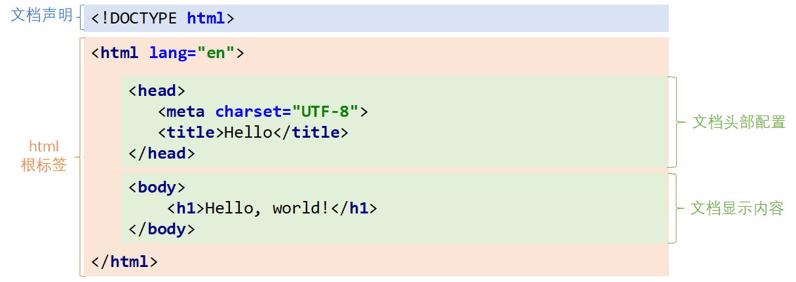

--超文本标记语言HTML

‍

HTML(HyperText Markup Language) 是用来描述网页的一种超文本标记语言(由标签构成的语言), 不是一门编程语言 而是一门标记语言, 没有逻辑存在，只有标签并且所有的标签都需要遵循**W3C的标准**

HTML是文档的一种, HTML文档也叫做web页面

‍

‍

### Header

‍

#### 快速

[速查列表](https://www.runoob.com/html/html-quicklist.html)

[HTML 标签简写及全称](https://www.runoob.com/html/html-tag-name.html)

简单教程[设置HTML背景图片](https://www.w3schools.cn/html/html_images_background.asp)

‍

‍

# 知识

‍

## 格式

‍

### 标签

不区分大小写,但是尽量使用小写标签

‍

### 注释

​`<!-- html的注释 -->`​

‍

### 结束标签

HTML元素包含了开始标签与结束标签 or 起始标签（opening tag）闭合标签（closing tag）

如果标签内没有修饰的内容, 开始标签和结束标签可以合并为一个自闭标签

* ​`<br/>`​ 换行
* ​`<hr/>`​ 在当前行画一条线

‍

### 基本属性

‍

标签属性，主要用于拓展标签。属性包含元素的额外信息，这些信息不会出现在实际的内容中。但是可以改变标签的一些行为或者提供数据，属性总是以`name = value"`​的格式展现。

‍

* 属性名：同一个标签中，属性名不得重复。
* 大小写：属性和属性值对大小写不敏感。不过W3C标准中，推荐使用小写的属性/属性值。
* 引号：双引号是最常用的，不过使用单引号也没有问题。
* |常用属性：||
  |属性名|作用|
  | ------------| --------------------------------------------|
  |class|定义元素类名，用来选择和访问特定的元素|
  |id|定义元素**唯一**标识符，在整个文档中必须是唯一的|
  |name|定义元素名称，可以用于提交服务器的表单字段|
  |value|定义在元素内显示的默认值|
  |style|定义CSS样式，这些样式会覆盖之前设置的样式|

‍

‍

### 属性值

属性值单双引号皆可

属性与属性值用"="连接, 属性的值可以用双引号、单引号引起来或者不用引号, 一般会用双引号引起来. 

==如果不生效查看页面代码使用的是否为英文双引号==

‍

### 特殊字符

html中多个连续的空白字符(制表符,空格,换行)默认会合并为一个空格来显示

* 如果非要输入空格,可以用转义字符来替代 `&nbsp;`​
* 如果非要输入换行,可以用 `<br/>`​ 来代替
* 基础转义字符

  ```html
  <	&lt;
  >	&gt;
  "	&quot;
  '	&apos;
  空格	&nbsp;
  ```

‍

‍

‍

### 路径

绝对路径: 磁盘 & 网络

相对路径: `./`​  当前目录(可以省略)   `../`​ 上一级目录

请始终将正斜杠添加到子文件夹末尾, 否则<sup>（因为服务器会添加正斜杠到这个地址，然后创建一个新的请求）</sup>向服务器产生两次 HTTP 请求

‍

‍

### 显示效果

无法确定 HTML 被显示的确切效果<sup>（屏幕的大小，以及对窗口的调整都可能导致不同的结果）</sup>; 无法通过在 HTML 代码中添加额外的<sup>（当显示页面时，浏览器会移除源代码中多余的空格和空行. 所有连续的空格或空行都会被算作一个空格）</sup>空格或换行来改变输出的效果

‍

### 文本标签

使用文本内容标签设置文字基本样式

|标签名|作用|
| --------| ----------------------------------------------------------------------------|
|p|表示文本的一个段落|
|h|表示文档标题，`<h1>–<h6>`​ ，呈现了六个不同的级别的标题，`<h1>`​ 级别最高，而 `<h6>`​ 级别最低|
|hr|表示段落级元素之间的主题转换，一般显示为水平线|
|li|表示列表里的条目。（常用在ul ol 中）|
|ul|表示一个无序列表，可含多个元素，无编号显示。|
|ol|表示一个有序列表，通常渲染为有带编号的列表|
|em|表示文本着重，一般用斜体显示|
|strong|表示文本重要，一般用粗体显示|
|font|表示字体，可以设置样式（已过时）|
|i|表示斜体|
|b|表示加粗文本|

‍

```html
<!DOCTYPE html>
<html lang="en">
<head>
    <meta charset="UTF-8">
    <title>文本标签演示</title>
</head>
<body>
    <!--段落标签：<p>-->
    <p>这些年</p>
    <p>支付宝的诞生就是为了解决淘宝网的客户们的买卖问题</p>
  
    <!-- 标题标签：<h1> ~ <h6> -->
    <h1>一级标题</h1>
    <h2>二级标题</h2>
    <h3>三级标题</h3>
    <h4>四级标题</h4>
    <h5>五级标题</h5>
    <h6>六级标题</h6>

    <!--水平线标签：<hr/>
        属性：
            size-大小
            color-颜色
	-->
    <hr size="4" color="red"/>

    <!--
        无序列表：<ul>
        属性：type-列表样式(disc实心圆、circle空心圆、square实心方块)
        列表项：<li>
    -->
    <ul type="circle">
        <li>javaEE</li>
        <li>HTML</li>
    </ul>

    <!--
        有序列表：<ol>
        属性：type-列表样式(1数字、A或a字母、I或i罗马字符)   start-起始位置
        列表项：<li>
    -->
    <ol type="1" start="10">
        <li>传智播客</li>
        <li>黑马程序员</li>
    </ol>

    <!--
        斜体标签：<i>    <em>
    -->
    <i>我倾斜了</i>
    <em>我倾斜了</em>
    <br/>

    <!--
        加粗标签：<strong>  <b>
    -->
    <strong>加粗文本</strong>
    <b>加粗文本</b>
    <br/>
    <!--
        文字标签：<font>
        属性：
            size-大小
            color-颜色
    -->
    <font size="5" color="yellow">这是一段文字</font>
</body>
</html>
```

‍

## 数据传输

‍

### 浏览器向服务器发送数据方式

‍

利用超链接向服务器发送数据 -- 请求参数

> 在超链接的后面拼接上要发送的请求参数, 链接和请求参数之间用?分割, 参数名和参数值用 = 连接, 多个参数之间用 & 分割, 可以存在多个同名的参数

‍

利用表单向服务器发送数据

> ​`<form>`​标签以及一些表单项标签, 用户可以输入数据, 通过提交表单发送数据给服务器

‍

### get和post提交的区别

‍

http协议指定了7种提交方式，其中5种使用的极少，多数只用GET提交和POST提交

只有使用表单并且明确指定提交方式为post时（也就是设置`method="post"`​）才是post提交，其他提交都是get提交

> 主要区别体现在数据传输方式的不同

‍

#### get

* 请求参数会赋值在地址栏后进行传输
* 这种方式发送的数据量有限，最大不超过1kb（或4kb）
* 数据显示在地址栏，安全性差

‍

#### post

* 请求参数在底层流中传输
* 这种方式发送的数据量无限制
* 地址栏上看不到数据，比较安全

‍

‍

# 基础

‍

## 组成

‍

‍

​​

|元素名|描述|
| :---------------------: | :--------------------: |
|header|标题头部区域的内容|
|footer|标记脚部区域的内容<br />|
|section|一块独立区域|
|article|独立的文章内容|
|aside|相关内容或应用<sup>（侧边栏`）</sup>|
|Nav|导航类辅助内容|

‍

示例

```html
<!--注释   Shift+ctrl+/-->
<!--doctype指的是描述文档的类型
 html:该文档是HTML页面
-->
<!DOCTYPE html>
<html><!--根标签-->

    <head><!--head标签是：头部标签；里面存放了页面的基本属性-->
        <meta charset="UTF-8"/><!--meta标签：设置页面编码的字符集  HTML5.0的写法-->
        <title>demo01-HTML的基本结构</title><!--title标签是：页面的标题标签-->
    </head>

    <body><!--body标签是：身体标签； 主要是页面中的内容信息-->
        body主要作用：用于浏览器页面的展示
    </body>
</html>
```

‍

### 头部内容

#### <title

定义浏览器工具栏的标题<sup>（当网页添加到收藏夹时的显示标题和搜索引擎结果页面的标题）</sup>

‍

#### <meta

‍

其中的charset的值用来指定浏览器用什么编码解析当前页面

```html
<meta http-equiv="Content-type" content="text/html; charset=UTF-8" />
```

‍

#### <link

定义了文档与外部资源之间的关系<sup>（常用于链接到样式表）</sup>

‍

#### <noscript

‍

#### <base

描述了基本的<sup>（该标签作为HTML文档中所有的链接标签的默认链接）</sup>链接地址/链接目标

‍

‍

‍

‍

## 对象

‍

### 常用

‍

标题             <h1> - <h6>

段落             <p>

链接             <a>

图像             

注释             < ! --  -- >

空 换行          <br>

‍

‍

### 分类

大多数 HTML 元素是**块级元素**或**内联元素**

‍

块级元素

```html
div , p , form, ul, li , ol, dl, form, address, fieldset, hr, menu, table
```

行内(**内联)** 元素

```html
span, strong, em, br, img , input, label, select, textarea, cite,
```

‍

‍

‍

#### 块级-内联元素区别

‍

‍

块级元素会独占一行，其宽度自动填满其父元素宽度，通常会以新行来开始（和结束）  

行内元素不会独占一行，相邻的行内元素会排列在同一行里，一行排不下才会换行，其宽度随元素的内容而变化

‍

块级元素可以设置 width, height属性，行内元素设置width, height无效

【块级元素即使设置了宽度，仍然是独占一行的】

‍

块级元素可以设置margin 和 padding.

行内元素的水平方向的padding-left,padding-right,margin-left,margin-right 都产生边距效果，但是竖直方向的padding-top,padding-bottom,margin-top,margin-bottom都不会产生边距效果. （水平方向有效，竖直方向无效）

‍

‍

### 区块类型

‍

#### <div>

块级元素，是可用于组合其他 HTML 元素的容器

‍

####  

内联元素，可用作文本的容器

‍

‍

### 标题

浏览器会自动地在标题的前后添加空行

h1-h6标题标签:指的是标题的级别，从一级到六级

> 搜索引擎使用标题为您的网页的结构和内容编制索引

‍

‍

#### 属性

‍

|align ：字体的排列方式<br />||
|属性值|作用|
| -----------------------------------------------------| ----------------------|
|left|靠左|
|center|居中|
|right|靠右|
|justify|自适应|

* ==left/right/center 是常用的==
* justify自适应，默认从左到右布局排列，不常用

‍

#### 实例

```html
<h1>一级标题</h1>
<h2>二级标题</h2>
<h3>三级标题</h3>
<h4>四级标题</h4>
<h5>五级标题</h5>
<h6>六级标题</h6>
```

‍

‍

### 空

某些 HTML 元素具有空内容, 空元素在开始标签中添加斜杠关闭

<br> 是没有关闭标签的空元素, 可定义换行

‍

#### 空行保持

pre标签对空行和空格进行控制,能够保持状态,直接替换<p>段落标记

‍

‍

### 文本

‍

#### 格式化

```html
加粗     <b>
加粗     <strong>
放大     <big>
斜体     <em>
斜体     <i>
缩小     <small>
下标     <sub>
上标     <sup>
```

‍

‍

#### 地址

<address>

<abbr>

<acronym>

‍

‍

### 链接

用于指向当前位置以外的资源

* 用于创建指向另外一个文档的超链接
* 用于在当前页面的不同位置之间进行跳转，利用id或name属性进行跳转. 

  * 一般在本页面中使用，当网页内容过长，定位标记会比拖动滚动条方便快捷.
  * ==定位标记要和超链接结合使用才有效==

‍

‍

#### 新窗口打开

* _self:默认的当前窗口打开链接
* _blank：在新窗口打开一个链接

```html
target = "_blank"
```

‍

‍

‍

### 书签

id 属性

创建一个 HTML 文档书签, 然后用链接href指向

书签不会以任何特殊方式显示

‍

‍

#### 示例

```html
在HTML文档中插入ID:
<a id="tips">有用的提示部分</a>

在HTML文档中创建一个链接到"有用的提示部分(id="tips"）"：

<a href="#tips">访问有用的提示部分</a>

或者，从另一个页面创建一个链接到"有用的提示部分(id="tips"）"：

<a href="https://www.runoob.com/html/html-links.html#tips">
访问有用的提示部分</a>
```

‍

‍

‍

### **图像**


空标签

‍

一般只设置宽度和高度其一(否则拉伸变形)

可以设置像素大小也可设置占父元素%

大部分情况默认即可

```html

```

‍

#### 属性

* 必要属性

  * src：图片的存储路径
  * alt：表示替换图片的文字，只有再图片不存在时显示
* 可选属性

  * width：宽度 单位：px像素 %占用浏览器宽度的百分比
  * height：高度 单位：px像素 %占用浏览器高度的百分比
  * border：边框

‍

|属性名|作用|
| --------| ------------------------------------|
|**src**|图片路径|
|**title**|鼠标悬停（hover）时显示文本。|
|**alt**|图片描述，图形不显示时的替换文本。|
|**height**|图像的高度。|
|**width**|图像的宽度。|

‍

#### 实例

```html

```

‍

‍

### 音频

​`<audio>`​：用于播放声音，比如音乐或其他音频流，是 HTML 5 的新标签。

常用属性：

|属性名|取值|描述|
| ----------| ----------| -------------------------------------------------------------------|
|src|URL|音频资源的路径|
|autoplay|autoplay|音频准备就绪后自动播放|
|controls|controls|显示控件，比如播放按钮。|
|loop|loop|表示循环播放|
|preload|preload|音频在页面加载时进行预加载。<br />如果使用 "autoplay"，则忽略该属性。|

‍

‍

### 视频

​`<video>`​ 标签用于播放视频，比如电影片段或其他视频流，是 HTML 5 的新标签。

‍

常用属性

‍

|属性名|取值|描述|
| ----------| ----------| -----------------------------------------------------------------|
|src|*URL*|要播放的视频的 URL。|
|width||设置视频播放器的宽度。|
|height||设置视频播放器的高度。|
|autoplay|autoplay|视频在就绪后自动播放。|
|control|controls|显示控件，比如播放按钮。|
|loop|loop|如果出现该属性，则当媒介文件完成播放后再次开始播放。|
|preload|preload|视频在页面加载时进行加载。<br />如果使用 "autoplay"，则忽略该属性。|
|mute|muted|规定视频的音频输出应该被静音。|
|poste|*URL*|视频下载时显示的图像，或者视频播放前显示的图像。|

‍

‍

‍

### 表格

> <table></table>

‍

‍

[表格生成器](https://c.runoob.com/front-end/7688/)

|<table>|定义表格|
| ------------| ----------------------|
|<th>|定义表格的表头|
|<tr>|定义表格的行|
|<td>|定义表格单元|
|<caption>|定义表格标题|
|<colgroup>|定义表格列的组|
|<col>|定义用于表格列的属性|
|<thead>|定义表格的页眉|
|<tbody>|定义表格的主体|
|<tfoot>​|定义表格的页脚|

‍

‍

#### 成员

* ​`tr`​标签：行标签
* ​`td`​标签：列标签
* ​`th`​标签：列标签（标题）

‍

##### table属性​

* ​`border`​  边框
* ​`cellspacing`​  两个单元格之间的间距，外边距
* ​`cellpadding`​  一个单元格内填充的距离，内边距
* ​`bgcolor`​  背景颜色
* ​`bordercolor`​  边框颜色
* ​`width`​  宽度
* ​`align`​  对齐方式. center：整个表格相对于浏览器居中

‍

##### tr属性

* ​`align  `​对齐方式. center：整行所有的列居中
* ​`bgcolor`​  一整行的背景颜色

‍

##### td属性

* ​`align`​ 对齐方式
* ​`bgcolor`​ 背景颜色
* ​`width`​ 宽度
* ​`height`​ 高度
* ​`colspan`​ 可横跨的列数 col:column列
* ​`rowspan`​ 可竖跨的行数 row:行
* ​`<caption>`​定义表格的标题

‍

##### th标签

* 自动字体加粗并剧中

‍

‍

#### 实例

```html
<table border="2px" cellspacing="5px" cellpadding="5px"
       bgcolor="#faebd7" bordercolor="red" width="50%" align="center">

    <caption>这是一个表格标题</caption>

    <tr align="center" bgcolor="#00bfff"><!--一行-->
        <th>华为</th><!--一列-->
        <th>小米</th>
        <th>苹果</th>
    </tr>
    <tr><!--一行-->
        <td colspan="2">mate 30</td><!--一列-->
        <td rowspan="2">青春版</td>
        <td>iPhone 11</td>
    </tr>
    <tr><!--一行-->
        <td>mate 30 Pro</td><!--一列-->
        <td>红米</td>
        <td>iPhone 11 Pro Max</td>
    </tr>
</table>
```

‍

‍

### 列表

‍

|<ol>|定义有序列表|
| ------| ----------------------|
|<ul>|定义无序列表|
|<li>|定义列表项|
|<dl>|定义列表|
|<dt>|自定义列表项目|
|<dd>|定义自定列表项的描述|

‍

‍

#### 无序列表

> ​`<ul> <li></li> <ul>`​

* 属性：

  * type

    * disc：默认属性值——实心圆
    * square：方块
    * circle:空心圆
* 实例代码

```
    <ul type="square"><!--定义一个无序列表-->
        <li>华为</li><!--表示列表项，可以有多个-->
        <li>小米</li>
        <li>联想</li>
    </ul>
```

‍

‍

#### 有序列表

> ​`<ol> <li></li> <ol>`​

* 实例代码

```
    <ol>
        <li>a</li>
        <li>b</li>
        <li>c</li>
    </ol>
```

‍

## form表单

<form 创建表单

用于收集用户的输入信息,包含交互控件，将收集信息发送到服务器

‍

必须存在的属性

* ​`action`​  指定表单发送的目标URL地址 定义了服务端的文件名, 会对接收到的用户输入数据进行相关的处理

可选的属性

* ​`method  `​指定以何种方式发送表单 定义表单数据的提交方式(post/get)

‍

表单中的项

* 表单中可以有多个输入项，输入项必须有`name`​属性才可以被提交，如果输入项没有`name`​属性，则表单在提交时会忽略它

‍

### 属性

<type 属性定义输入类型

* <input type="text"  设定文本域
* <input type="password"  密码字段
* <input type="radio"  单选框
* <input type="checkbox"  复选框
* <input type="submit"  提交按钮

‍

‍

示例

```html
包含一个普通输入框和一个密码输入框：
<form action="">
Username: <input type="text" name="user"><br>
Password: <input type="password" name="password">
</form>
```

‍

‍

### input输入文本框

‍

|重要属性：type=|||
|**属性值**|**作用**|**介绍**|
| -----------------| ------------| -------------------------------------------------------------------------------------------------------------|
|text|文本框|输入的文本信息直接显示在框中|
|password|密码框|输入的文本以圆点或者星号的形式显示|
|radio|单选框|进行单项的选择 如性别选择 多个radio的name属性相同会被当作一组来使用 必须用value为选项指定提交的值|
|checkbox|复选框|进行多项选择，爱好的选择.  多个checkbox具有相同的name属性时会被当作一组来使用 必须用value为选项指定提交的值|
|hidden|隐藏字段|如果有一些信息，不希望用户看见，又希望表单能够提交，就可以用隐藏字段隐含在表单中|
|submit|提交按钮|实现表单提交操作的按钮 可以通过value属性指定按钮显示的文字|
|reset|重置按钮|重置表单到初始状态|
|button|按钮|普通按钮, 没有任何功能 需要配合JavaScript为按钮指定具体的行为. 可以用value属性指定按钮显示的文字. |
|file|文件上传项|提供选择文件进行上传的功能|
|image|图像|利用一张图片替代提交按钮的功能, 不常用|

‍

* name属性:

  * 表单中可以有多个输入项，输入项必须有name属性才可以被提交，如果输入项没有name属性，则表单在提交时会忽略它. 另外name属性的值是可以重复的
* value属性：可以给input输入框设置一个初始值
* readonly属性：使当前输入项变为只读，不能修改，但是提交时仍会被提交
* disabled属性：使当前输入项不可用，不能修改值，也不会被提交
* size属性：指定当前输入框的宽度
* checked属性：指定单选框/复选框被选中

‍

#### 实例

```html
<form action="http://www.tmooc.cn" method="post">
    <!--1.input输入框-->
    用户名：<input type="text" name="username"/><br/>

    <!--2.input密码框-->
    密码：<input type="password" name="password" size="10"/><br/>

    <!--3.input单选框
    name属性:单选框的内容划分成一组，一组中只能选中一个-->
    性别：<input type="radio" name="gender" value="male" checked="checked"/>男
    <input type="radio" name="gender" value="female"/>女<br>

    <!--4.input复选框-->
    爱好：
    <input type="checkbox" name="hobby" value="sing" checked="checked"/>唱
    <input type="checkbox" name="hobby" value="jump"/>跳
    <input type="checkbox" name="hobby" value="basketball"/>打篮球
    <br>

    <!--5.input隐藏框
    value属性：文本框中的默认值-->
    评价：<input type="hidden" value="此人应该很有才"/>
    <br>

    <!--6.input文件上传-->
    上传：<input type="file"/><br>

    <!--7.input图片按钮-->
    点我：<input type="image" src="image/1.gif" height="100px"><br>

    <!--8.input提交按钮-->
    <input type="submit" value="注册">

    <!--9.input重置按钮-->
    <input type="reset">

    <!--10.input日期按钮-->
    <input type="date"><br>
</form>
```

‍

‍

### textarea文本域

属性

* rows：指定文本域的行数（高度）
* cols：指定文本域的列数（宽度）
* readonly：只读
* disabled：禁用，不可操作文本域

‍

#### 实例

```html
input there：
<textarea name="" id="" cols="10" rows="5" disabled="disabled" readonly="readonly">
    123
</textarea><br>
```

‍

### <select> <option>

‍

select  提供下拉选择功能

option  下拉选框中的选项

可以用value属性指定提交的值，如果不指定，将会提交标签内的文本

‍

重要属性

* name:下拉列表的名称
* disabled：禁用下拉选框

‍

其他属性

* size：设置下拉选项中可见选项的个数
* multipe：是否支持多选

‍

#### 实例

```html
<!--下拉框：select+option组合标签-->
<select ><!--定义一个下拉框 -->
    <option>北京</option>
    <option>上海</option>
    <option>广州</option>
    <option>深圳</option>
    <option>杭州</option>
</select>
```

‍

‍

## 盒子

> 所有HTML元素可以看作盒子，CSS盒模型本质上也是一个盒子，封装周围的HTML元素

盒模型允许在其它元素和周围元素边框之间的空间放置元素, 由盒子将页面中的元素包含在一个矩形区域内

‍

### 概念

* **Margin(外边距)**  - 清除边框外的区域，外边距是透明的.
* **Border(边框)**  - 围绕在内边距和内容外的边框.
* **Padding(内边距)**  - 清除内容周围的区域，内边距是透明的.
* **Content(内容)**  - 盒子的内容，显示文本和图像

‍

## 样式表

‍

### 内部

在<head> 部分<style>定义内部样式表

```html
<head>
<style type="text/css">
body {background-color:yellow;}
p {color:blue;}
</style>
</head>
```

‍

### 外部

在单独的文件里定义外部样式表

```html
<head>
<link rel="stylesheet" type="text/css" href="mystyle.css">
</head>
```

‍

## 字符实体

character entities

[实体参考手册](https://www.runoob.com/tags/ref-entities.html)

‍

问题情境

> 在 HTML 中不能使用小于号（<）和大于号（>），这是因为浏览器会误认为它们是标签
>
> 同时浏览器总是会截短 HTML 页面中的空格

‍

解决

HTML中的预留字符必须被替换为字符实体,使用名`+&`​或数`+&#`​

```html
&entity_name; 或  &#entity_number;
```

‍

* 小于号写法示例  `&lt &#60 &#060`​
* 单词之间保留的空格使用 %20 (或是&nbsp)以正常显示文本

‍

使用实体名而不是数字的好处是，名称易于记忆. 坏处是，浏览器也许并不支持所有实体名, 但是**对实体数字的支持却很好**

‍

‍

# 高级

‍

## 内联框架

‍

可以在同一个浏览器窗口中显示不止一个页面: iframe 可以显示一个目标链接的页面, 目标链接的属性必须使用 iframe 的属性

```
<iframe src="URL"></iframe>
```

‍

‍

‍

## URL

‍

### 拼写

结构

```html
scheme://host.domain:port/path/filename
```

‍

* scheme - 定义因特网服务的类型 http/https
* host - 定义域主机（http 的默认主机是 www）
* domain - 定义因特网域名
* :port - 定义主机上的端口号（http 的默认端口号是 80）
* path - 定义服务器上的路径（如果省略，则文档必须位于网站的根目录中）.
* filename - 定义文档/资源的名称

‍

‍

### 注意

URL 只能使用 ASCII 字符集 来通过因特网进行发送. 

由于 URL 常常会包含 ASCII 集合之外的字符，URL 必须转换为有效的 ASCII 格式. 

URL 编码使用 "%" 其后跟随两位的十六进制数来替换非 ASCII 字符. 

URL 不能包含空格. URL 编码通常使用 + 来替换空格. 

‍

‍

## Web存储

早些时候,本地存储使用的是 cookie, 现在Web存储需要更加的安全与快速, 使用HTML5可以在本地存储用户的浏览数据, 数据以 键/值 对存在: 客户端存储数据的两个对象为

1. localStorage  长久保存整个网站的数据
2. sessionStorage  临时保存同一窗口的数据，在关闭之后删除

‍

‍

‍

# 实操

‍
