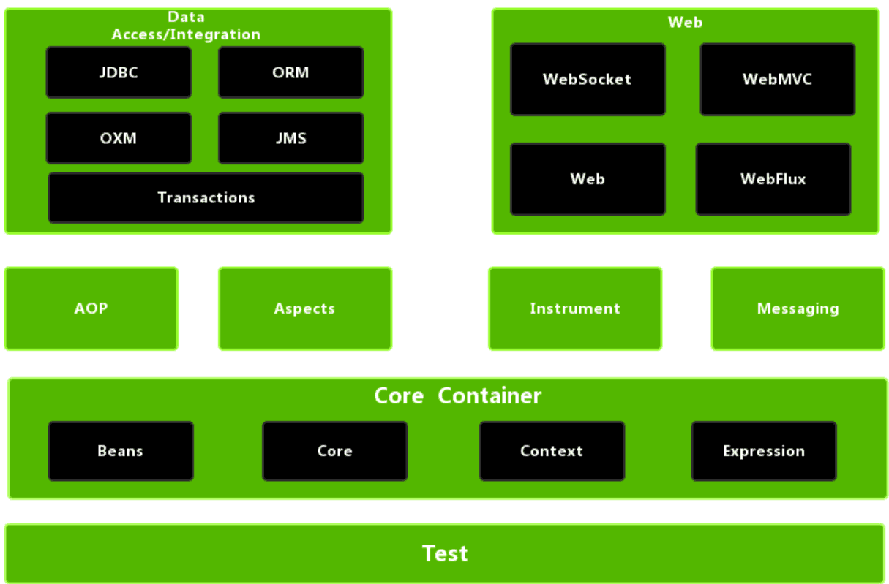

--最流行的Java框架, 上

‍

‍

Spring是目前世界上最流行的Java框架-[官网](https://spring.io)，它可以帮助我们更加快速、更加容易的来构建Java项目. 而在Spring家族当中提供了很多优秀的框架，而所有的框架都是基于基础框架SpringFramework

‍

‍

### Header

‍

#### 快速

‍

‍

#### 环境

‍

‍

##### 版本

> Spring6要求JDK最低版本是JDK17, 已经切换到Spring3.0版本 + JDK17 + Vue3.0混合开发环境(2022-2023)

‍

‍

##### 配置

> 保存合适配置

‍

> 在开非Spring项目的时候(仅仅使用maven)是不能在resource文件夹中创建所谓spring 的配置文档的(XML Configuration File -> Spring Config), 需要先在pom.xml进行导入坐标后刷新才可以

‍

‍

##### 自定义

‍

###### banner

只需要在 **resource** 目录下，放一个 **banner.txt** 文件即可，文件下面就存放我们需要显示的 **banner** ，那么在启动的时候，就会加载出对应的图像出来

制作网站[http://patorjk.com/software/taag](http://patorjk.com/software/taag), 我选择了SpadeKTLSG作为目标, TestAll之后尝试

‍

之后复制这个字符画, 加上一些参数

```java
# 设置字体颜色为绿色
${AnsiColor.GREEN}
# 设置背景颜色为绿色
AnsiBackground.GREEN
# 显示SpringBoot版本
${spring-boot.version}
```

复制里面的文本到 banner.txt 即可, 例如

```java
${AnsiColor.GREEN}
                                _     _
                               | |   | |          
  _ __ ___   ___   __ _ _   _  | |__ | | ___   __ _ 
 | '_ ` _ \ / _ \ / _` | | | | | '_ \| |/ _ \ / _` |
 | | | | | | (_) | (_| | |_| | | |_) | | (_) | (_| |
 |_| |_| |_|\___/ \__, |\__,_| |_.__/|_|\___/ \__, |
                   __/ |                       __/ |
                  |___/                       |___/
${AnsiColor.BRIGHT_BLACK}
Spring Boot Version: ${spring-boot.version}${spring-boot.formatted-version}
```

```java

   ▄████████    ▄███████▄    ▄████████ ████████▄     ▄████████    ▄█   ▄█▄     ███      ▄█          ▄████████    ▄██████▄  
  ███    ███   ███    ███   ███    ███ ███   ▀███   ███    ███   ███ ▄███▀ ▀█████████▄ ███         ███    ███   ███    ███ 
  ███    █▀    ███    ███   ███    ███ ███    ███   ███    █▀    ███▐██▀      ▀███▀▀██ ███         ███    █▀    ███    █▀  
  ███          ███    ███   ███    ███ ███    ███  ▄███▄▄▄      ▄█████▀        ███   ▀ ███         ███         ▄███      
▀███████████ ▀█████████▀  ▀███████████ ███    ███ ▀▀███▀▀▀     ▀▀█████▄        ███     ███       ▀███████████ ▀▀███ ████▄  
         ███   ███          ███    ███ ███    ███   ███    █▄    ███▐██▄       ███     ███                ███   ███    ███ 
   ▄█    ███   ███          ███    ███ ███   ▄███   ███    ███   ███ ▀███▄     ███     ███▌    ▄    ▄█    ███   ███    ███ 
 ▄████████▀   ▄████▀        ███    █▀  ████████▀    ██████████   ███   ▀█▀    ▄████▀   █████▄▄██  ▄████████▀    ████████▀  
                                                                 ▀                     ▀                                 

```

记得引入文件资源!

```xml
            <!--assets-->
            <resource>
                <directory>src/main/resources</directory>
                <includes>
                    <include>**/*.txt</include>
                </includes>
            </resource>
```

‍

# 知识

‍

## 评价

‍

‍

### 优势

‍

**简化开发**

Spring框架中提供了两个大的核心技术，分别是IOC和AOP

Spring的简化操作都是基于这两块内容,所以这也是Spring学习中最为重要的两个知识点.   
事务处理属于Spring中AOP的具体应用，可以简化项目中的事务管理，也是Spring技术中的一大亮点. 

‍

**框架整合**​

Spring在框架整合这块已经做到了极致，它可以整合市面上几乎所有主流框架

‍

‍

## 概念

‍

### Spring

‍

在不同的语境中，Spring 所代表的含义是不同的. 

‍

#### 广义：Spring 技术栈

广义上的 Spring 泛指以 Spring Framework 为核心的 Spring 技术栈. 

经过十多年的发展，Spring 已经不再是一个单纯的应用框架，而是逐渐发展成为一个由多个不同子项目（模块）组成的成熟技术，例如 Spring Framework、Spring MVC、SpringBoot、Spring Cloud、Spring Data、Spring Security 等，其中 Spring Framework 是其他子项目的基础. 

这些子项目涵盖了从企业级应用开发到云计算等各方面的内容，能够帮助开发人员解决软件发展过程中不断产生的各种实际问题，给开发人员带来了更好的开发体验. 

‍

#### 狭义：Spring Framework

狭义的 Spring 特指 Spring Framework，通常我们将它称为 Spring 框架. 

Spring 框架是一个分层的、面向切面的 Java 应用程序的一站式轻量级解决方案，它是 Spring 技术栈的核心和基础，是为了解决企业级应用开发的复杂性而创建的. 

‍

**Spring Framework特点**

* 非侵入式：使用 Spring Framework 开发应用程序时，Spring 对应用程序本身的结构影响非常小. 对领域模型可以做到零污染；对功能性组件也只需要使用几个简单的注解进行标记，完全不会破坏原有结构，反而能将组件结构进一步简化. 这就使得基于 Spring Framework 开发应用程序时结构清晰、简洁优雅.
* 控制反转：IoC——Inversion of Control，翻转资源获取方向. 把自己创建资源、向环境索取资源变成环境将资源准备好，我们享受资源注入.
* 面向切面编程：AOP——Aspect Oriented Programming，在不修改源代码的基础上增强代码功能.
* 容器：Spring IoC 是一个容器，因为它包含并且管理组件对象的生命周期. 组件享受到了容器化的管理，替程序员屏蔽了组件创建过程中的大量细节，极大的降低了使用门槛，大幅度提高了开发效率.
* 组件化：Spring 实现了使用简单的组件配置组合成一个复杂的应用. 在 Spring 中可以使用 XML 和 Java 注解组合这些对象. 这使得我们可以基于一个个功能明确、边界清晰的组件有条不紊的搭建超大型复杂应用系统.
* 一站式：在 IoC 和 AOP 的基础上可以整合各种企业应用的开源框架和优秀的第三方类库. 而且 Spring 旗下的项目已经覆盖了广泛领域，很多方面的功能性需求可以在 Spring Framework 的基础上全部使用 Spring 来实现.

‍

‍

### 家族成员

重点关注`Spring Framework`​、`SpringBoot`​和`SpringCloud`​

‍

1. SpringFramework: Spring框架，是Spring中最早最核心的技术，也是所有其他技术的基础
2. SpringBoot: 在简化的基础上能更快速进行开发
3. SpringCloud: 这个是用来做分布式之微服务架构的相关开发

‍

‍

## 系统架构

‍

‍

**Spring FrameWork 系统架构**

​​

‍

‍

### 核心层

* Core Container:核心容器，这个模块是Spring最核心的模块，其他的都需要依赖该模块

  * Beans
  * Core
  * Context
  * Express

‍

### AOP层

* AOP:面向切面编程，它依赖核心层容器，目的是==在不改变原有代码的前提下对其进行功能增强==
* Aspects:AOP是思想,Aspects是对AOP思想的具体实现

‍

### 数据层

* Data Access:数据访问，Spring全家桶中有对数据访问的具体实现技术
* Data Integration:数据集成，Spring支持整合其他的数据层解决方案，比如Mybatis
* Transactions:事务，Spring中事务管理是Spring AOP的一个具体实现，也是后期学习的重点内容

‍

### Web层

* 见SpringMVC框架

‍

### Test层

* Spring主要整合了Junit来完成单元测试和集成测试

‍

‍

‍

## 注解记录合集

‍

‍

### 基础 + 注开

‍

‍

#### @Component/@Controller/@Service/@Repository

设置为Bean

|名称|@Component/@Controller/@Service/@Repository|
| ------| ---------------------------------------------|
|类型|类注解|
|位置|类定义上方|
|作用|设置该类为spring管理的bean|
|属性|value（默认）：定义bean的id|

‍

#### @Configuration

设置为配置类

|名称|@Configuration|
| ------| -----------------------------|
|类型|类注解|
|位置|类定义上方|
|作用|设置该类为spring配置类|
|属性|value（默认）：定义bean的id|

‍

#### @ComponentScan

设置扫描路径

|名称|@ComponentScan|
| ------| ----------------------------------------------------------|
|类型|类注解|
|位置|类定义上方|
|作用|设置spring配置类扫描路径，用于加载使用注解格式定义的bean|
|属性|value（默认）：扫描路径，此路径可以逐层向下扫描|

‍

#### @Scope

设置作用范围

|名称|@Scope|
| ------| ---------------------------------------------------------------------------------------|
|类型|类注解|
|位置|类定义上方|
|作用|设置该类创建对象的作用范围<br />可用于设置创建出的bean是否为单例对象|
|属性|value（默认）：定义bean作用范围，<br />默认值singleton（单例），可选值prototype（非单例）|

‍

‍

#### @PostConstruct

设置为初始化方法

|名称|@PostConstruct|
| ------| ------------------------|
|类型|方法注解|
|位置|方法上|
|作用|设置该方法为初始化方法|
|属性|无|

‍

#### @PreDestroy

设置为销毁方法

|名称|@PreDestroy|
| ------| ----------------------|
|类型|方法注解|
|位置|方法上|
|作用|设置该方法为销毁方法|
|属性|无|

‍

---

‍

#### @Autowired

自动注入

|名称|@Autowired|
| ------| ------------------------------------------------------------------|
|类型|属性注解 或 方法注解（了解） 或 方法形参注解（了解）|
|位置|属性定义上方 或 标准set方法上方 或 类set方法上方 或 方法形参前面|
|作用|为引用类型属性设置值|
|属性|required：true/false，定义该属性是否允许为null|

‍

#### @Value

自动注入

|名称|@Value|
| ------| --------------------------------------------------|
|类型|属性注解 或 方法注解（了解）|
|位置|属性定义上方 或 标准set方法上方 或 类set方法上方|
|作用|为 基本数据类型 或 字符串类型 属性设置值|
|属性|value（默认）：要注入的属性值|

‍

#### @PropertySource

加载属性

|名称|@PropertySource|
| ------| -----------------------------------------------------------------------|
|类型|类注解|
|位置|类定义上方|
|作用|加载properties文件中的属性值|
|属性|value（默认）：设置加载的properties文件对应的文件名或文件名组成的数组|

‍

#### @Bean

生产Bean

|名称|@Bean|
| ------| ----------------------------------------|
|类型|方法注解|
|位置|方法定义上方|
|作用|设置该方法的返回值作为spring管理的bean|
|属性|value（默认）：定义bean的id|

‍

#### @Import

导入配置类

|名称|@Import|
| ------| -----------------------------------------------------------------------------------------|
|类型|类注解|
|位置|类定义上方|
|作用|导入配置类|
|属性|value（默认）：定义导入的配置类类名，<br />当配置类有多个时使用数组格式一次性导入多个配置类|

‍

‍

‍

---

‍

### AOP + 事务

‍

#### @EnableAspectJAutoProxy

开启注解格式AOP

|名称|@EnableAspectJAutoProxy|
| ------| -------------------------|
|类型|配置类注解|
|位置|配置类定义上方|
|作用|开启注解格式AOP功能|

‍

#### @Aspect

AOP切面类

|名称|@Aspect|
| ------| -----------------------|
|类型|类注解|
|位置|切面类定义上方|
|作用|设置当前类为AOP切面类|

‍

#### @Pointcut

切入点方法

|名称|@Pointcut|
| ------| -----------------------------|
|类型|方法注解|
|位置|切入点方法定义上方|
|作用|设置切入点方法|
|属性|value（默认）：切入点表达式|

‍

‍

#### @Before

切入点方法前运行

|名称|@Before|
| ------| ----------------------------------------------------------------------------|
|类型|方法注解|
|位置|通知方法定义上方|
|作用|设置当前通知方法与切入点之间的绑定关系，当前通知方法在原始切入点方法前运行|

‍

‍

#### @After

切入点方法后运行

|名称|@After|
| ------| ----------------------------------------------------------------------------|
|类型|方法注解|
|位置|通知方法定义上方|
|作用|设置当前通知方法与切入点之间的绑定关系，当前通知方法在原始切入点方法后运行|

‍

#### @AfterReturning

切入点方法正常执行完毕后执行

|名称|@AfterReturning|
| ------| --------------------------------------------------------------------------------------|
|类型|方法注解|
|位置|通知方法定义上方|
|作用|设置当前通知方法与切入点之间绑定关系，当前通知方法在原始切入点方法正常执行完毕后执行|

‍

#### @AfterThrowing

切入点方法运行抛出异常后执行

|名称|@AfterThrowing|
| ------| --------------------------------------------------------------------------------------|
|类型|方法注解|
|位置|通知方法定义上方|
|作用|设置当前通知方法与切入点之间绑定关系，当前通知方法在原始切入点方法运行抛出异常后执行|

‍

#### @Around

切入点方法前后运行

|名称|@Around|
| ------| ------------------------------------------------------------------------------|
|类型|方法注解|
|位置|通知方法定义上方|
|作用|设置当前通知方法与切入点之间的绑定关系，当前通知方法在原始切入点方法前后运行|

‍

---

‍

#### @EnableTransactionManagement

注解式事务支持

|名称|@EnableTransactionManagement|
| ------| ----------------------------------------|
|类型|配置类注解|
|位置|配置类定义上方|
|作用|设置当前Spring环境中开启注解式事务支持|

‍

#### @Transactional

添加事务

|名称|@Transactional|
| ------| ----------------------------------------------------------------------------------|
|类型|接口注解 类注解 方法注解|
|位置|业务层接口上方 业务层实现类上方 业务方法上方|
|作用|为当前业务层方法添加事务（如果设置在类或接口上方则类或接口中所有方法均添加事务）|

‍

‍

# 基础

‍

## 目录

‍

‍

## 搭建

‍

### 预设环境

‍

#### XML开发生产环境

‍

(Maven - 原始开发环境)

创建一个Maven项目

pom.xml添加Spring的依赖

```xml
<dependencies>
    <dependency>
        <groupId>org.springframework</groupId>
        <artifactId>spring-context</artifactId>
        <version>5.2.10.RELEASE</version>
    </dependency>
</dependencies>
```

‍

resources下添加applicationContext.xml

```xml
<?xml version="1.0" encoding="UTF-8"?>
<beans xmlns="http://www.springframework.org/schema/beans"
       xmlns:xsi="http://www.w3.org/2001/XMLSchema-instance"
       xsi:schemaLocation="
            http://www.springframework.org/schema/beans http://www.springframework.org/schema/beans/spring-beans.xsd">
    <bean id="bookDao" class="com.itheima.dao.impl.BookDaoImpl"/>
</beans>
```

‍

添加BookDao、BookDaoImpl、BookService、BookServiceImpl类

```java
public interface BookDao {
    public void save();
}
public class BookDaoImpl implements BookDao {
    public void save() {
        System.out.println("book dao save ..." );
    }
}
public interface BookService {
    public void save();
}

public class BookServiceImpl implements BookService {
    public void save() {
        System.out.println("book service save ...");
    }
}

```

‍

创建运行类App

```java
public class App {
    public static void main(String[] args) {
        ApplicationContext ctx = new ClassPathXmlApplicationContext("applicationContext.xml");
        BookDao bookDao = (BookDao) ctx.getBean("bookDao");
        bookDao.save();
    }
}
```

‍

#### 注解开发生产环境

‍

Maven项目

‍

pom.xml添加Spring依赖

```xml
<dependencies>
    <dependency>
        <groupId>org.springframework</groupId>
        <artifactId>spring-context</artifactId>
        <version>5.2.10.RELEASE</version>
    </dependency>
</dependencies>
```

‍

添加BookDao和BookDaoImpl类

```java
public interface BookDao {
    public void save();
    public void update();
}

@Repository
public class BookDaoImpl implements BookDao {

    public void save() {
        System.out.println(System.currentTimeMillis());
        System.out.println("book dao save ...");
    }

    public void update(){
        System.out.println("book dao update ...");
    }
}
```

‍

创建Spring的配置类

```java
@Configuration
@ComponentScan("com.itheima")
public class SpringConfig {
}
```

‍

编写App运行类

```java
public class App {
    public static void main(String[] args) {
        ApplicationContext ctx = new AnnotationConfigApplicationContext(SpringConfig.class);
        BookDao bookDao = ctx.getBean(BookDao.class);
        bookDao.save();
    }
}
```

‍

‍

‍

‍

## IOC

（Inversion of Control）控制反转

控制权反转给第三方

‍

> Bean相关内容

‍

**核心概念**

使用对象时，在程序中不要主动使用new产生对象，转换为由==外部==提供对象，此过程中对象创建控制权由程序转移到外部

‍

### 概念

‍

Spring和IOC之间的关系:

* Spring技术对IOC思想进行了实现
* Spring提供了一个容器，称为==IOC容器==，用来充当IOC思想中的"外部"
* IOC思想中的`别人[外部]`​指的就是Spring的IOC容器

‍

IOC容器的作用以及内部存放的是什么?

* IOC容器负责对象的创建、初始化等一系列工作，其中包含了数据层和业务层的类对象
* 被创建或被管理的对象在IOC容器中统称为==Bean==
* IOC容器中放的就是一个个的Bean对象

‍

当IOC容器中创建好service和dao对象后，程序能正确执行么?

* 不行，因为service运行需要依赖dao对象
* IOC容器中虽然有service和dao对象
* 但是service对象和dao对象没有任何关系
* 需要把dao对象交给service,也就是说要绑定service和dao对象之间的关系

‍

像这种在容器中建立对象与对象之间的绑定关系就要用到DI

‍

‍

‍

### bean配置

resources >> applicationContext.xml

```
<bean id="" class=""/>
```

‍

#### 属性

id=    "bean的唯一标识"

class=    "bean的类全名"

scope=    "bean的作用范围"

name=    "为bean取的别名"

‍

‍

#### 基础配置

‍

##### **bean标签**

Spring核心容器管理的对象

```xml
<beans>
    <bean/>
    <bean></bean>
</beans>
```

‍

##### **id属性**

bean的id，使用容器可以通过id值获取对应的bean，在一个容器中id值唯一

‍

##### **class属性**

bean的类型，即配置的bean的全路径类名

‍

‍

#### 别名配置

‍

##### **name属性**

定义bean的别名，可定义多个，使用逗号(,)分号(;)空格()分隔

```xml
    <bean id="bookService" name="service service4 bookEbi" class="com.itheima.service.impl.BookServiceImpl">
        <property name="bookDao" ref="bookDao"/>
    </bean>
```

‍

#### 获取对象

根据名称容器中获取bean对象

```java
public class AppForName {
    public static void main(String[] args) {
        ApplicationContext ctx = new ClassPathXmlApplicationContext("applicationContext.xml");
        //此处根据bean标签的id属性和name属性的任意一个值来获取bean对象

        BookService bookService = (BookService) ctx.getBean("service");
        bookService.save();
    }
}
```

‍

若无法获取到，将抛出异常==NoSuchBeanDefinitionException==

```java
No bean named 'service4' available
```

‍

‍

#### 作用范围

‍

##### **scope属性**

定义bean作用范围, 可选为单例singleton(默认)和非单例prototype范围, bean默认为单例

```xml
<bean id="bookDao" name="dao" class="com.itheima.dao.impl.BookDaoImpl" scope="prototype"/>
```

‍

IOC容器中只会有该类的一个对象, 本身从bean定义出发就是管理那些可以复用的对象, **避免了对象的频繁创建与销毁**，达到了bean对象的复用，性能高

‍

‍

#### Tips

‍

会不会产生线程安全问题?

* 如果对象是有状态对象，即该对象有成员变量可以用来存储数据的，
* 因为所有请求线程共用一个bean对象，所以会存在线程安全问题.
* 如果对象是无状态对象，即该对象没有成员变量没有进行数据存储的，
* 因方法中的局部变量在方法调用完成后会被销毁，所以**不会存在线程安全问题**.

‍

‍

哪些bean对象适合交给容器进行管理?  -需要反复用的

例如

* 表现层对象
* 业务层对象
* 数据层对象
* 工具(类)对象

‍

‍

哪些bean对象不适合交给容器进行管理?  -有状态的, 有记录成员变量的家伙

* 封装实例的域对象，因为会引发线程安全问题，所以不适合.

‍

‍

### bean实例化

‍

bean本质上就是对象，对象在new的时候会使用构造方法完成，那创建bean也是使用==构造方法==完成的

‍

两部分内容

* bean是如何创建的
* 实例化bean的三种方式，`构造方法`​,`静态工厂`​和`实例工厂`​(+实例工厂优化)

重点掌握`构造方法`​和`FactoryBean`​

‍

> 构造方法在类中默认会提供，但是如果重写了构造方法，默认的就会消失，在使用的过程中需要注意，如果需要重写构造方法，最好把默认的构造方法也重写下.

‍

‍

#### 构造方法

‍

> 测试: 将BookDaoImpl的构造函数进行修改
>
> * 构造函数改成private测试,能访问到类中的私有构造方法,显而易见Spring**底层**用的是**反射**
> * 构造函数中添加一个参数测试结果报错，说明Spring底层使用的是类的**无参构造方法**.

‍

‍

#### 静态工厂

> ==了解为主==, 这种方式一般是用来兼容早期的一些老系统

‍

**factory包&gt;&gt;工厂类**

在工厂的**静态方法**中，除了new对象还可以做其他的一些业务操作

```java
//静态工厂创建对象
public class OrderDaoFactory {
    public static OrderDao getOrderDao(){
        System.out.println("factory setup....");
        return new OrderDaoImpl();
    }
}
```

‍

**properties**

```xml
<bean id="orderDao" class="com.itheima.factory.OrderDaoFactory" factory-method="getOrderDao"/>
```

‍

class:工厂类的类全名, 当然不意味着要把工厂交出去

factory-mehod:具体工厂类中**创建对象**的方法名, 用这个找具体的方法

‍

**获取bean**

```java
略
```

‍

#### 实例工厂

‍

##### 创建

创建一个工厂类OrderDaoFactory并提供一个普通方法

方法**不是静态方法**

```java
public class UserDaoFactory {
    public UserDao getUserDao(){
        return new UserDaoImpl();
    }
}
```

‍

##### 配置bean

实例工厂需要先把工厂找到造出来再用

```java
<bean id="userFactory" class="com.itheima.factory.UserDaoFactory"/>

<bean id="userDao" factory-method="getUserDao" factory-bean="userFactory"/>
```

‍

**运行顺序 + 对应关系**

* 创建实例化**工厂对象**,对应的是第一行配置
* 调用对象中的方法来创建**bean**，对应的是第二行配置

  1. factory-bean:工厂的实例对象
  2. factory-method:工厂对象中的具体创建对象的方法名,对应关系:  
      factory-bean="userFactory -> bean id="userFactory" 实例工厂bean  
      factory-method="getUserDao" -> UserDaoFactory.getUserDao() 工厂的生产方法

‍

‍

##### 运行类

通过工厂获取bean

```java
public class AppForInstanceUser {
    public static void main(String[] args) {
        //创建实例工厂对象
        UserDaoFactory userDaoFactory = new UserDaoFactory();
        //通过实例工厂对象创建对象
        UserDao userDao = userDaoFactory.getUserDao();
        userDao.save();
}
```

使用容器ctx获取

```java
        UserDao userDao = (UserDao) ctx.getBean("userDao");
        userDao.save();
```

‍

‍

#### 实工优化

‍

‍

> 实例工厂配置的冗余:
>
> 第一行userFactory配置完全就是为了实现工厂而写的(配合使用而实际无意义)
>
> 第二行userDao配置中f-m的指定不固定每次需要配置

‍

‍

查看源码会发现，FactoryBean接口其实会有三个方法

```java
T getObject() throws Exception;

Class<?> getObjectType();

default boolean isSingleton() {
	return true;
}
```

方法一:getObject()，被重写后，在方法中进行对象的创建并返回

方法二:getObjectType(),被重写后，主要返回的是被创建类的Class对象

方法三:已经给了默认值，设置对象是否为单例，默认true一般不需要进行重写

‍

---

‍

重写接口实现优化

‍

(1)创建一个UserDaoFactoryBean的类，实现FactoryBean接口(重写泛型)，重写接口的方法

```java
public class UserDaoFactoryBean implements FactoryBean<UserDao> {

    //代替原始实例工厂中创建对象的方法
    public UserDao getObject() throws Exception {
        return new UserDaoImpl();
    }

    //返回所创建类的Class对象
    public Class<?> getObjectType() {
        return UserDao.class;
    }

}
```

‍

(2)配置文件

```xml
<bean id="userDao" class="com.itheima.factory.UserDaoFactoryBean"/>
```

‍

(3)直接运行

‍

‍

‍

### bean生命周期

‍

bean对象从创建到销毁的整体过程,控制在bean创建后到销毁前做一些事情, 思路仍然是**钩子函数**

‍

* bean创建之后，想要添加内容，比如用来初始化需要用到资源
* bean销毁之前，想要添加内容，比如用来释放用到的资源

‍

注意事项

‍

* 当 scope=“singleton” 时，Spring 容器中有且仅有一个对象，init 方法在创建容器时仅执行一次
* 当 scope=“prototype” 时，Spring 容器要创建同一类型的多个对象，init 方法在每个对象创建时均执行一次
* 当 scope=“singleton” 时，关闭容器（`.close()`​）会导致 bean 实例的销毁，调用 destroy 方法一次
* 当 scope=“prototype” 时，对象的销毁由垃圾回收机制 GC 控制，destroy 方法将不会被执行

> * 对于BookServiceImpl来说，bookDao是它的一个属性, setBookDao方法是Spring的IOC容器为其注入属性的方法
> * 初始化方法会在类中属性设置之后执行.

‍

‍

##### 声明属性并提供setter方法

在BookDaoImpl类中声明对应的简单数据类型的属性,并提供对应的setter方法

‍

POJO示例

```java
public class BookDaoImpl implements BookDao {

    private String databaseName;
    private int connectionNum;

    public void setConnectionNum(int connectionNum) {
        this.connectionNum = connectionNum;
    }

    public void setDatabaseName(String databaseName) {
        this.databaseName = databaseName;
    }

    public void save() {
        System.out.println("book dao save ..."+databaseName+","+connectionNum);
    }
}
```

‍

‍

##### 配置文件中进行注入配置

在applicationContext.xml配置文件中使用property标签注入(注意数据格式)

```xml
<?xml version="1.0" encoding="UTF-8"?>
<beans xmlns="http://www.springframework.org/schema/beans"
       xmlns:xsi="http://www.w3.org/2001/XMLSchema-instance"
       xsi:schemaLocation="http://www.springframework.org/schema/beans http://www.springframework.org/schema/beans/spring-beans.xsd">

    <bean id="bookDao" class="com.itheima.dao.impl.BookDaoImpl">
        <property name="databaseName" value="mysql"/>
     	<property name="connectionNum" value="10"/>
    </bean>

    <bean id="userDao" class="com.itheima.dao.impl.UserDaoImpl"/>

    <bean id="bookService" class="com.itheima.service.impl.BookServiceImpl">
        <property name="bookDao" ref="bookDao"/>
        <property name="userDao" ref="userDao"/>
    </bean>
</beans>
```

‍

‍

#### 添加方法

初始化和销毁的方法

```java
public class BookDaoImpl implements BookDao {
    public void save() {
        System.out.println("book dao save ...");
    }

    //表示bean初始化对应的操作
    public void init(){
        System.out.println("init...");
    }

    //表示bean销毁前对应的操作
    public void destory(){
        System.out.println("destory...");
    }
}
```

‍

‍

#### 配置生命周期

> *实际上之后并不要管, 交给Tomcat*

‍

配置文件`init-method="init" destroy-method="destory"`​

```xml
<bean id="bookDao" class="com.itheima.dao.impl.BookDaoImpl" init-method="init" destroy-method="destory"/>
```

‍

##### **普通方法运行问题**

结果中可以看出init方法执行了，但是destroy方法却未执行

> 原因
>
> * Spring的IOC容器是运行在JVM中
> * 运行main方法后,JVM启动,Spring加载配置文件生成IOC容器,从容器获取bean对象，然后调方法执行
> * main方法执行完后，JVM退出，这个时候IOC容器中的bean**还没有来得及销毁就已经结束了**
> * 所以没有调用对应的destroy方法

两种关闭容器方法解决

‍

‍

#### 关闭容器

‍

close和registerShutdownHook都能用来关闭容器

close()是在**调用的时候关闭, 暴力**，registerShutdownHook()是在**JVM退出前调用关闭**

‍

##### ~~close~~

比较暴力的方法

‍

容器ApplicationContext类中没有close方法, 将ApplicationContext更换成 ClassPathXmlApplicationContext

```java
ClassPathXmlApplicationContext ctx = new 
    ClassPathXmlApplicationContext("applicationContext.xml");
```

调用ctx的close()方法

```
ctx.close();
```

‍

‍

##### ~~registerShutdownHook~~

> 自定义钩子

在容器未关闭之前，**提前设置好**回调函数，让JVM在退出之前回调此函数来关闭容器

‍

registerShutdownHook在ApplicationContext中也没有, 仍然用ClassPathXmlApplicationContext; 在启动类调用ctx的**registerShutdownHook()** 方法

```
ctx.registerShutdownHook();
```

‍

‍

##### 接口简化

*实际开发大概率使用*

‍

不用再进行配置`init-method`​和`destroy-method`​

‍

修改BookServiceImpl类，添加两个接口`InitializingBean`​​， `DisposableBean`​​并实现接口中的两个方法`afterPropertiesSet`​​和`destroy`​​

​`属性设置之后`​ 和 `销毁`​

```java
public class BookServiceImpl implements BookService, InitializingBean, DisposableBean {
    private BookDao bookDao;

    public void destroy() throws Exception {
        System.out.println("service destroy");
    }
    public void afterPropertiesSet() throws Exception {
        System.out.println("service init");
    }
}
```

‍

### IOC实例

‍

‍

‍

#### 环境配置

sp依赖 + BookService,BookServiceImpl，BookDao和BookDaoImpl四个类

‍

#### spring配置

resources下添加spring配置文件(spring config)  applicationContext.xml，并完成bean的配置

‍

#### bean配置

```xml
<?xml version="1.0" encoding="UTF-8"?>
<beans xmlns="http://www.springframework.org/schema/beans"
       xmlns:xsi="http://www.w3.org/2001/XMLSchema-instance"
       xsi:schemaLocation="http://www.springframework.org/schema/beans http://www.springframework.org/schema/beans/spring-beans.xsd">

    <!--bean标签标示配置bean
    	id属性标示给bean起名字
    	class属性表示给bean定义类型
	-->
	<bean id="bookDao" class="com.itheima.dao.impl.BookDaoImpl"/>
    <bean id="bookService" class="com.itheima.service.impl.BookServiceImpl"/>

</beans>
```

**注意事项：bean定义时id属性在同一个上下文中(配置文件)不能重复**

‍

#### 获取IOC容器

‍

使用Spring提供的接口完成IOC容器的创建，创建App类，编写main方法

‍

```java
ApplicationContext ctx = new ClassPathXmlApplicationContext("applicationContext.xml");
```

​`ApplicationContext`​ 是IoC容器, 一般取名为ctx(context缩写), 由于是接口所以需要获取实现类`ClassPathXmlApplicationContext`​ 然后载入配置文件名称: `applicationContext.xml`​

```java
public class App {
    public static void main(String[] args) {
        //获取IOC容器
		ApplicationContext ctx = new ClassPathXmlApplicationContext("applicationContext.xml"); 
    }
}
```

‍

**获取对象进行方法调用**

```java
        BookService bookService = (BookService) ctx.getBean("bookService");
        bookService.save();
```

‍

‍

## DI

（Dependency Injection）依赖注入

控制反转是一种思想，是能够解决问题的一种可能的结果，而依赖注入（Dependency Injection）就是其最典型的实现方法. 由第三方（我们称作IOC容器）来控制依赖，把他通过构造函数、属性或者工厂模式等方法，注入到类A内，这样就极大程度的对类A和类B进行了解耦

‍

‍

### 概念

‍

在容器中建立bean与bean之间的依赖关系的整个过程，称为依赖注入

业务层要用数据层的类对象现在自己不new了，靠别人[外部其实指的就是IOC容器]来给注入进来

‍

IOC容器中哪些bean之间要建立依赖关系呢?

* 这个需要程序员根据业务需求提前建立好关系，如业务层需要依赖数据层，service就要和dao建立依赖关系

‍

IOC + DI两个概念的最终目标就是:==充分解耦==，具体实现靠:

* 使用IOC容器管理bean（IOC)
* 在IOC容器内将有依赖关系的bean进行关系绑定（DI）
* 最终结果为:使用对象时不仅可以直接从IOC容器中获取，并且获取到的bean已经绑定了所有的依赖关系.

‍

注入方式分析

* 向一个类中传递数据的方式有几种?

  * 普通方法(set方法)
  * 构造方法
* 依赖注入描述了在容器中建立bean与bean之间的依赖关系的过程，如果bean运行需要的是数字或字符串呢?

  * 引用类型
  * 简单类型(基本数据类型与String)

‍

Spring基于上面这些知识点，为我们提供了两种注入方式

* setter注入

  * 简单类型
  * ==引用类型==
* 构造器注入

  * 简单类型
  * 引用类型

‍

### 注入

‍

> bean标签    配置bean
>
> id属性    给bean起名字
>
> class属性    给bean定义类型

‍

IOC 的注入方式有三种：构造方法注入、Setter 注入和接口注入<sup>（比较古老的注入方式，因为它需要被依赖的对象实现不必要的接口，带有侵入性，因此现在已经被完全舍弃了）</sup>

‍

‍

#### 选择建议

* 自己的建议使用setter注入
* 第三方技术根据情况选择

‍

展开

* 强制依赖使用构造器进行，使用setter注入有概率不进行注入导致null对象出现

  * 强制依赖指对象在创建的过程中必须要注入指定的参数
* 可选依赖使用setter注入进行，灵活性强

  * 可选依赖指对象在创建过程中注入的参数可有可无
* Spring框架**倡导使用构造器**，第三方框架内部大多数采用构造器注入的形式进行数据初始化，相对严谨
* 如果有必要可以两者同时使用，使用构造器注入完成强制依赖的注入，使用setter注入完成可选依赖的注入
* 实际开发过程中还要根据实际情况分析，如果受控对象**没有提供setter方法**就必须使用构造器注入
* **==自己开发的模块推荐使用setter注入(严于待人,宽于律己)==**

‍

‍

#### P

标签：<p:propertyName>，<p:propertyName-ref>

作用：为 bean 注入属性值

格式：

```xml
<bean p:propertyName="propertyValue" p:propertyName-ref="beanId"/>
```

开启 p 命令空间：开启 Spring 对 p 命令空间的的支持，在 beans 标签中添加对应空间支持

```xml
<beans xmlns="http://www.springframework.org/schema/beans"   
       xmlns:xsi="http://www.w3.org/2001/XMLSchema-instance"  
       xmlns:p="http://www.springframework.org/schema/p"   
       xsi:schemaLocation="
		http://www.springframework.org/schema/beans   
		https://www.springframework.org/schema/beans/spring-beans.xsd">
</beans>
```

实例：

```xml
<bean 
      id="userService"
      class="service.impl.UserServiceImpl"
      p:userDao-ref="userDao"
      p:bookDao-ref="bookDao"
      p:num="10"
	/>
```

‍

#### SpEL

Spring 提供了对 EL 表达式的支持，统一属性注入格式

作用：为 bean 注入属性值

‍

格式：

<property value="EL">  
注意：所有属性值不区分是否引用类型，统一使用value赋值

所有格式统一使用 value=“#{}”

* 常量 #{10} #{3.14} #{2e5} #{‘it’}
* 引用 bean #{beanId}
* 引用 bean 属性 #{beanId.propertyName}
* 引用 bean 方法 beanId.methodName().method2()
* 引用静态方法 T(java.lang.Math).PI
* 运算符支持 #{3 lt 4 == 4 ge 3}
* 正则表达式支持 #{user.name matches‘[a-z]{6,}’}
* 集合支持 #{likes[3]}

‍

实例：

```xml
<bean id="userService" class="service.impl.UserServiceImpl">
        <property name="userDao" value="#{userDao}"/>
        <property name="bookDao" value="#{bookDao}"/>
        <property name="num" value="#{666666666}"/>
    </bean>
```

‍

‍

#### prop

Spring 提供了读取外部 properties 文件的机制，使用读取到的数据为 bean 的属性赋值

操作步骤：

1. 准备外部 properties
2. 开启 context 命名空间支持

    ```sql
    <?xml version="1.0" encoding="UTF-8"?>
    <beans xmlns="http://www.springframework.org/schema/beans"
           xmlns:xsi="http://www.w3.org/2001/XMLSchema-instance"
           xmlns:context="http://www.springframework.org/schema/context"
           xsi:schemaLocation="
            http://www.springframework.org/schema/beans
            https://www.springframework.org/schema/beans/spring-beans.xsd
            http://www.springframework.org/schema/context
            https://www.springframework.org/schema/context/spring-context.xsd
            ">
    ```
3. 加载指定的 properties 文件

    ```xml
    <context:property-placeholder location="classpath:data.properties" />
    ```
4. 使用加载的数据

    ```xml
    <property name="propertyName" value="${propertiesName}"/>
    ```

* 注意：如果需要加载所有的 properties 文件，可以使用 `*.properties`​ 表示加载所有的 properties 文件
* 注意：读取数据使用  **${propertiesName}**  格式进行，其中 propertiesName 指 properties 文件中的属性名

‍

‍

‍

#### setter

**格式较灵活, 不受顺序影响**

‍

property标签

* 简单数据类型

  ```xml
  <bean ...>
  	<property name="" value=""/>
  </bean>
  ```
* 引用数据类型

  ```xml
  <bean ...>
  	<property name="" ref=""/>
  </bean>
  ```

‍

‍

##### 引用

引用数据类型

1.在BookServiceImpl中声明userDao属性

2.为userDao属性提供setter方法

3.在配置文件中使用property标签注入

‍

‍

**1.声明属性提供setter**

在ServiceImpl中声明userDao属性，并提供setter方法

```java
public class BookServiceImpl implements BookService {
    private BookDao bookDao;

    public void setBookDao(BookDao bookDao) {
        this.bookDao = bookDao;
    }
}
```

‍

**2.配置文件中进行注入配置**

在applicationContext.xml配置文件中使用property标签ref属性注入

```xml
<bean id="bookService" class="com.itheima.service.impl.BookServiceImpl">
	<property name="bookDao" ref="bookDao"/>
</bean>

<bean id="bookDao" class="com.itheima.dao.imipl.BookDaoImpl"/>
```

‍

property标签表示配置当前bean的属性, 该配置中的两个bookDao的含义是不一样的

name属性表示配置哪一个具体的属性, ref属性表示参照哪一个bean

* name="bookDao"中`bookDao`​的作用是让Spring的IOC容器在获取到名称后，将首字母大写，前面加set找对应的`setBookDao()`​方法进行对象注入
* ref="bookDao"中`bookDao`​的作用是让Spring能在IOC容器中找到id为`bookDao`​的Bean对象给`bookService`​进行注入

property中的name 指的是去找对应的方法, ref指的是目标对象进行注入

‍

##### 简单

注入简单数据类型

‍

1.在BookDaoImpl类中声明对应的简单数据类型的属性

2.为这些属性提供对应的setter方法

3.在applicationContext.xml中配置

‍

```java
	<property name="" value=""/>
```

‍

‍

##### 集合

注入集合数据类型

‍

集合中既可以装简单数据类型也可以装引用数据类型, 集合中要添加引用类型，只需要把`<value>`​标签改成`<ref>`​标签(少用)

在bookDao的bean标签中使用进行注入, List的底层也是通过数组实现的，所以`<list>`​和`<array>`​标签是可以混用

‍

对象类型

* 数组
* List
* Set
* Map
* Properties

‍

数组

```xml
<property name="array">
    <array>
        <value>100</value>
        <value>200</value>
        <value>300</value>
    </array>
</property>
```

‍

Map

```xml
<property name="map">
    <map>
        <entry key="country" value="china"/>
        <entry key="province" value="henan"/>
        <entry key="city" value="kaifeng"/>
    </map>
</property>
```

‍

Properties

```xml
<property name="properties">
    <props>
        <prop key="country">china</prop>
        <prop key="province">henan</prop>
        <prop key="city">kaifeng</prop>
    </props>
</property>
```

‍

‍

#### 构造器

**和代码耦合比较高, 格式不够灵活(选用的是形参的值)**

‍

constructor-arg标签

内部也可以写`<array>`​、`<list>`​、`<set>`​、`<map>`​、`<props>`​标签

* 简单数据类型

  ```xml
  <bean ...>
  	<constructor-arg name="" index="" type="" value=""/>
  </bean>
  ```
* 引用数据类型

  ```xml
  <bean ...>
  	<constructor-arg name="" index="" type="" ref=""/>
  </bean>
  ```

‍

##### 引用

‍

1.带有bookDao参数的**构造方法(快速创建)**

2.在applicationContext.xml中配置

‍

配置文件中进行配置构造方式注入: 在A-C-.xml中配置

‍

标签中

* name属性对应的值为构造函数中方法形参的**参数名，必须要保持一致**.
* ref属性指向的是spring的IOC容器中其他bean对象.

```java
 <bean id="bookService" class="com.itheima.service.impl.BookServiceImpl">
        <constructor-arg name="bookDao" ref="bookDao"/>
 </bean>
```

==多引用==

```java
<bean id="bookService" class="com.itheima.service.impl.BookServiceImpl">
        <constructor-arg name="bookDao" ref="bookDao"/>
        <constructor-arg name="userDao" ref="userDao"/>
</bean>
```

‍

‍

##### 简单

*以了解为主*

‍

###### 按类型

删除name属性，添加**type属性**，**按照类型注入**

```xml
<bean id="bookDao" class="com.itheima.dao.impl.BookDaoImpl">
    <constructor-arg type="int" value="10"/>
    <constructor-arg type="java.lang.String" value="mysql"/>
</bean>
```

这种方式可以解决构造函数形参名发生变化带来的耦合问题, 但是如果构造方法参数中有类型相同的参数，这种方式就不太好实现了

‍

‍

###### 按参数位

删除type属性，添加**index属性，按照索引下标注入(0)**

```xml
<bean id="bookDao" class="com.itheima.dao.impl.BookDaoImpl">
    <constructor-arg index="1" value="100"/>
    <constructor-arg index="0" value="mysql"/>
</bean>
```

这种方式可以解决参数类型重复问题, 但是如果构造方法参数顺序发生变化后，这种方式又带来了耦合问题

‍

‍

### 自动装配

autoware

指IoC容器根据bean所依赖的资源在容器中自动查找并注入到bean中的过程

‍

‍

@Autowired

|名称|@Autowired|
| ------| ------------------------------------------------------------------|
|类型|属性注解 或 方法注解（了解） 或 方法形参注解（了解）|
|位置|属性定义上方 或 标准set方法上方 或 类set方法上方 或 方法形参前面|
|作用|为引用类型属性设置值|
|属性|required：true/false，定义该属性是否允许为null|

‍

#### 方式

* ==按类型（常用）==
* **按名称**
* 按构造方法
* 不启用自动装配

‍

‍

#### 实现

‍

修改applicationContext.xml配置文件, `<bean>`​标签中添加autowire属性

```xml
<!--autowire属性：开启自动装配，通常使用按类型装配-->
<bean id="bookService" class="com.itheima.service.impl.BookServiceImpl" autowire="byType"/>
```

‍

#### Tip

* 需要注入属性的类中对应属性的**setter方法不能省略**
* 被注入的对象必须要**被Spring的IOC容器管理**
* 按照类型在Spring的IOC容器中如果找到**多个对象**，会报`NoUniqueBeanDefinitionException`

  此时就需要按照名称注入，配置方式为:`autowire="byName"`​，找不到则注入Null

‍

按照名称注入中的名称指的是什么?

--bookDao是private修饰的，外部类无直接方法访问, 只能通过属性的set方法进行访问

* 对外部类来说，setBookDao方法名，去掉set后首字母小写是其属性名: bookDao

  * 这个规则是set方法生成的默认规则，**set方法的生成是把属性名首字母大写前面加set形成的方法名**
* 所以按照名称注入，其实是和对应的set方法有关，但是如果按照标准起名称，属性名和set对应的名是一致的

‍

‍

==配置特征==

* 自动装配**用于引用类型依赖注入**，不能对简单类型进行操作(你给个数字怎么匹配?)
* 使用**按类型装配**时（byType）必须保障容器中相同类型的bean唯一，推荐
* 使用按名称装配时（byName）必须保障容器中具有指定名称的bean，因变量名与配置**耦合**，不推荐
* 自动装配优先级**低于**setter注入与构造器注入，同时出现时自动装配配置失效

‍

‍

### DI实例

‍

‍

> 需求:基于IOC入门案例，在BookServiceImpl类中删除new对象的方式，使用Spring的DI完成Dao层的注入
>
> 1.删除业务层中使用new的方式创建的dao对象
>
> 2.在业务层提供BookDao的setter方法
>
> 3.在配置文件中添加依赖注入的配置
>
> 4.运行程序调用方法

‍

‍

#### 去除new解耦

在BookServiceImpl类中，删除业务层中使用new的方式创建的dao对象

‍

#### 为属性提供setter方法

在BookServiceImpl类中,为BookDao提供setter方法

```java
public class BookServiceImpl implements BookService {
    //删除业务层中使用new的方式创建的dao对象
    private BookDao bookDao;

    public void save() {
        System.out.println("book service save ...");
        bookDao.save();
    }
    //提供对应的set方法
    public void setBookDao(BookDao bookDao) {
        this.bookDao = bookDao;
    }
}

```

‍

#### 修改配置

在配置文件中添加依赖注入的配置

```xml
    <bean id="bookDao" class="com.itheima.dao.impl.BookDaoImpl"/>

    <bean id="bookService" class="com.itheima.service.impl.BookServiceImpl">
        <!--配置server与dao的关系-->
        <!--property标签表示配置当前bean的属性
        		name属性表示配置哪一个具体的属性
        		ref属性表示参照哪一个bean
		-->
        <property name="bookDao" ref="bookDao"/>
    </bean>
```

‍

‍

## 三方Bean

IOC/DI配置管理第三方bean, 也即是管理第三方jar包中的类

‍

‍

这里使用加载properties文件进行优化方法

‍

### 示例

‍

**需求**

将数据库连接四要素提取到properties配置文件，spring来加载配置信息并使用这些信息来完成属性注入. 

1.在resources下创建一个jdbc.properties(文件的名称可以任意)

2.将数据库连接四要素配置到配置文件中

3.在Spring的配置文件中**加载properties文件**

4.使用加载到的值实现**属性注入**

‍

‍

#### 创建properties

resources>>jdbc.properties

对应的属性键值对

```properties
jdbc.driver=com.mysql.jdbc.Driver
jdbc.url=jdbc:mysql://127.0.0.1:3306/spring_db
jdbc.username=root
jdbc.password=root
```

‍

#### 开启`context`​命名空间

applicationContext.xml中开`context`​命名空间

```xml
<?xml version="1.0" encoding="UTF-8"?>
<beans xmlns="http://www.springframework.org/schema/beans"
       xmlns:xsi="http://www.w3.org/2001/XMLSchema-instance"

       xmlns:context="http://www.springframework.org/schema/context"
       xsi:schemaLocation="
            http://www.springframework.org/schema/beans
            http://www.springframework.org/schema/beans/spring-beans.xsd

            http://www.springframework.org/schema/context
            http://www.springframework.org/schema/context/spring-context.xsd">

</beans>
```

‍

#### 加载properties

使用`context`​命名空间下的标签来加载properties配置文件

​`<context:property-placeholder location="jdbc.properties"/>`​

‍

‍

#### 属性注入

属性占位符${}

使用`${XXX}`​来读取properties配置文件中的内容并完成属性注入

‍

‍

‍

### 注意

‍

#### 系统环境变量排除

‍

**系统环境变量名引发的问题**

> 例如键值对的key为`username`​- 被识别为系统用户的名字了

​`<context:property-placeholder/>`​标签**会加载系统的环境变量**，而且环境变量的值会被优先加载

‍

**解决**

设置

​` <context:property-placeholder location="jdbc.properties" system-properties-mode="NEVER"/>`​

system-properties-mode  设置为NEVER,表示不加载系统属性

另外要避免使用`username`​作为属性的`key`​

> 例如Class班级这个英文要变成Clazz, 很多地方需要所谓"避讳"

‍

‍

#### 复数配置加载

**多个properties配置文件**需要被加载

‍

**标准够用**

​`location = classpath:*.properties`​

​`<context:property-placeholder location="classpath:*.properties"/>`​

‍

**暴力全进来**

​`location = classpath*:*.properties`​

​`<context:property-placeholder location="classpath*:*.properties"/>`​

‍

```xml
    <!--方式一 逗号分隔 --> 可以实现，如果配置文件多的话，每个都需要配置
    <context:property-placeholder location="jdbc.properties,jdbc2.properties" system-properties-mode="NEVER"/>

    <!--方式二 通配符-->  *.properties = 所有以properties结尾的文件都会被加载，可以解决方式一的问题，但是不标准
    <context:property-placeholder location="*.properties" system-properties-mode="NEVER"/>
   
    <!--方式三 标准通配符-->  classpath:代表的是从根路径下开始查找，但是只能查询**当前项目的根路径**
    <context:property-placeholder location="classpath:*.properties" system-properties-mode="NEVER"/>

    <!--方式四  更标准通配符-->   不仅可以加载当前项目, 还可以加载当前项目所依赖的所有项目的根路径下的properties配置文件(大多数第三种够用即可
    <context:property-placeholder location="classpath*:*.properties" system-properties-mode="NEVER"/>
```

‍

**示例**

‍

> idea可以自动识别${}加载的属性值，手工点击可以查阅原始书写格式

```xml

    <!--classpath*:*.properties  ：  设置加载当前工程类路径和当前工程所依赖的所有jar包中的所有properties文件-->
    <context:property-placeholder location="classpath*:*.properties" system-properties-mode="NEVER"/>

    <bean class="com.alibaba.druid.pool.DruidDataSource">
        <property name="driverClassName" value="${jdbc.driver}"/>
        <property name="url" value="${jdbc.url}"/>
        <property name="username" value="${jdbc.username}"/>
        <property name="password" value="${jdbc.password}"/>
    </bean>

    <bean id="bookDao" class="com.itheima.dao.impl.BookDaoImpl">
        <property name="name" value="${username}"/>
    </bean>
```

‍

‍

### 三方Bean实例

‍

基础手工配置`Druid(德鲁伊)`​和`C3P0`​

‍

#### **流程**

‍

1.pom.xml添加依赖

2.在配置文件中将【第三方的类】制作成一个bean，让IOC容器进行管理

3.数据库连接需要基础的四要素`驱动`​、`连接`​、`用户名`​和`密码`​【如何注入】到对应的bean中

4.从IOC容器中获取对应的bean对象，将其打印到控制台查看结果

‍

这两个数据源中都使用到了一些固定的常量如数据库连接四要素，把这些值写在Spring的配置文件中不利于后期维护, 需要将这些值提取到一个外部的properties配置文件中

‍

#### Druid管理

‍

‍

##### 导入`druid`​依赖

```xml
<dependency>
    <groupId>com.alibaba</groupId>
    <artifactId>druid</artifactId>
    <version>1.1.16</version>
</dependency>
```

‍

‍

‍

##### 配置bean

applicationContext.xml配置文件中添加`DruidDataSource`​的配置(`setter注入`​)

```java
	<!--管理DruidDataSource对象-->
    <bean class="com.alibaba.druid.pool.DruidDataSource">
        <property name="driverClassName" value="com.mysql.jdbc.Driver"/>
        <property name="url" value="jdbc:mysql://localhost:3306/spring_db"/>
        <property name="username" value="root"/>
        <property name="password" value="root"/>
    </bean>
```

* driverClassName:数据库驱动
* url:数据库连接地址
* username:数据库连接用户名
* password:数据库连接密码
* 数据库连接的四要素要和自己使用的数据库信息一致.

‍

‍

##### 获取bean

```java
public class App {
    public static void main(String[] args) {
       ApplicationContext ctx = new ClassPathXmlApplicationContext("applicationContext.xml");
       DataSource dataSource = (DataSource) ctx.getBean("dataSource");
       System.out.println(dataSource);
    }
}
```

‍

‍

#### C3P0管理

* ComboPooledDataSource的属性是通过setter方式进行注入
* 想注入属性就需要在ComboPooledDataSource类或其上层类中有提供属性对应的setter方法
* C3P0的四个属性和Druid的四个属性是不一样的

‍

##### 导入坐标

```java
<dependency>
    <groupId>c3p0</groupId>
    <artifactId>c3p0</artifactId>
    <version>0.9.1.2</version>
</dependency>
```

+mysql的驱动包

```java
<dependency>
    <groupId>mysql</groupId>
    <artifactId>mysql-connector-java</artifactId>
    <version>5.1.47</version>
</dependency>
```

‍

> Druid和C3P0在没有导入mysql驱动包的前提下，一个没报错一个报错，说明Druid在初始化的时候没有去加载驱动，而C3P0刚好相反: Druid程序运行虽然没有报错，但是当调用DruidDataSource的getConnection()方法获取连接的时候，也会报找不到驱动类的错误

‍

##### 要素配置

```xml
<bean id="dataSource" class="com.mchange.v2.c3p0.ComboPooledDataSource">
    <property name="driverClass" value="com.mysql.jdbc.Driver"/>
    <property name="jdbcUrl" value="jdbc:mysql://localhost:3306/spring_db"/>
    <property name="user" value="root"/>
    <property name="password" value="root"/>
    <property name="maxPoolSize" value="1000"/>
</bean>
```

数据连接池在配置属性的时候，除了可以注入数据库连接四要素外还可以配置很多其他的属性，具体都有哪些属性用到的时候再去查，一般配置基础的四个，其他都有自己的默认值

‍

‍

‍

## 核心容器

‍

核心容器 == `ApplicationContext`​ (简单理解)

‍

#### 体系结构

BeanFactory是IoC容器的顶层接口，初始化BeanFactory对象时，加载的bean延迟加载

ApplicationContext接口是Spring容器的核心接口，初始化时bean立即加载

ApplicationContext接口提供基础的bean操作相关方法，通过其他接口扩展其功能

ApplicationContext接口常用初始化类

* **==ClassPathXmlApplicationContext(常用)==**
* FileSystemXmlApplicationContext

‍

#### 创建方式

‍

==类路径==下的XML配置文件

```java
ApplicationContext ctx = new ClassPathXmlApplicationContext("applicationContext.xml");
```

CTX (ConTeXt) => ClassPathXml AppContext 类路径XML文档应用上下文

‍

==文件系统==下的XML配置文件 耦合度高不推荐

```java
ApplicationContext ctx = new FileSystemXmlApplicationContext("绝对路径");
```

‍

#### Bean获取方式

> 都可以

‍

‍

方式一(目前)

```java
BookDao bookDao = (BookDao) ctx.getBean("bookDao");
```

> 每次获取的时候都需要进行类型转换

‍

‍

方式二(修改)

```java
BookDao bookDao = ctx.getBean("bookDao",BookDao.class);
```

> 解决类型强转问题，但是参数又多加了一个，相对来说没有简化多少

‍

‍

方式三(==简化==)

类似依赖注入中的按类型注入

```java
BookDao bookDao = ctx.getBean(BookDao.class);
```

> 使用时必须要确保IOC容器中该类型对应的bean对象只能有一个

‍

‍

#### 容器类层次结构

‍

容器的最上级的父接口为BeanFactory, 逐渐扩充到今天的ApplicatioinContext

‍

> Hierachy视图
>
> * BeanFactory    顶层接口
>
>   * ......
>
>     * ApplicationContext    常用接口
>
>       * ConfigurableApplicationContext    提供关闭容器功能
>
>         * ......
>
>           * AbstractXmlApplicationContext
>
>             -> ClassPathXmlApplicationContext    常用实现类

‍

> BeanFactory流程
>
>> *了解即可*
>>
>
> ```java
>         Resource resources = new ClassPathResource("applicationContext.xml");
>         BeanFactory bf = new XmlBeanFactory(resources);
>         BookDao bookDao = bf.getBean(BookDao.class);
>         bookDao.save();
> ```
>
> ‍
>
> * BeanFactory是延迟加载，只有在获取bean对象的时候才会去创建
> * ApplicationContext是立即加载，容器加载的时候就会创建bean对象, 要想成为延迟加载，只需要加上 lazy-init="true" 即可`<bean id="bookDao" class="com.itheima.dao.impl.BookDaoImpl"  lazy-init="true"/>`​

‍

‍

## 组件

‍

### 配置文件

‍

#### 配置扫描

POM配置扫描数据库配置文件

如果配置文件没有被扫描到,数据库初始化会报找不到URL

<resource>指定<includes>

```java
            <!--配置文件示例-->
            <resource>
                <directory>src/main/resources</directory>
                <includes>
                    <include>**/*.yml</include>
                    <include>**/*.properties</include>
                    <include>**/*.xml</include>
                </includes>
                <filtering>true</filtering>
            </resource>
```

‍

‍

## 注解开发

‍

Spring3.0开启了纯注解开发模式，使用Java类替代配置文件，开启了Spring快速开发赛道

这里==直接记录纯注解开发==

传统Spring的IOC/DI复杂的地方在配置文件, 使用注解开发快准狠

> Spring对注解支持的版本历程:
>
> * 2.0版开始支持注解
> * 2.5版注解功能趋于完善
> * 3.0版支持纯注解开发

‍

‍

### 两者关系

‍

**注解开发**注解与**XMLbean**配置的对应/转换关系

* 一个@C注解 **对应 ** 一个Bean
* @C("Name") Name **等价于** bean标签里的id="Name"
* class注解附着的类全限定名 **等价于 ** bean标签里的class="XXX.XXXImpl"

​​

> ​`<bean id="" class="" scope="" init-method="" destroy-method="" />`​
>
> * id -> @Component+C/S/R
> * scope -> @Scope
> * init-method -> @PostConstruct
> * destroy-method -> @PreDestroy

‍

‍

### 基础过程

‍

==要点==

* applicationContext.xml中`<context:component-san/>`​的作用是指定扫描包路径，注解为@ComponentScan
* @Configuration标识该类为配置类，使用类替换applicationContext.xml文件
* ClassPathXmlApplicationContext是加载XML配置文件
* AnnotationConfigApplicationContext是加载配置类

‍

#### Bean注解

DaoImpl添加`@Component`​

@Component注解不可以添加在接口上，因为接口是无法创建对象的; 如果不起名称，会有一个默认值就是`当前类名首字母小写`​，所以也可以按照名称获取，如

```java
BookService bookService = (BookService)ctx.getBean("bookServiceImpl");
System.out.println(bookService);
```

‍

|名称|@Component/@Controller/@Service/@Repository|
| ------| ---------------------------------------------|
|类型|类注解|
|位置|类定义上方|
|作用|设置该类为spring管理的bean|
|属性|value（默认）：定义bean的id|

‍

@Configuration

|名称|@Configuration|
| ------| -----------------------------|
|类型|类注解|
|位置|类定义上方|
|作用|设置该类为spring配置类|
|属性|value（默认）：定义bean的id|

‍

@ComponentScan

|名称|@ComponentScan|
| ------| ----------------------------------------------------------|
|类型|类注解|
|位置|类定义上方|
|作用|设置spring配置类扫描路径，用于加载使用注解格式定义的bean|
|属性|value（默认）：扫描路径，此路径可以逐层向下扫描|

‍

#### **配置类**

**注解替换包扫描配置**

配置Spring的注解包扫描

创建一个配置类(config包)`SpringConfig`​, 添加`@Configuration`​注解，将其标识为一个配置类, 来替换`applicationContext.xml`​的`<context:component-scan base-package=""/>`​

‍

```java
@Configuration //声明当前类为Spring配置类
@ComponentScan({"com.itheima.service","com.itheima.dao"}) //设置bean扫描路径，多个路径书写为字符串数组格式
public class SpringConfig {
}
```

‍

> ==基础注解开发包扫描==
>
> 配置文件(applicationContext.xml)上添加包扫描
>
> ​`<context:component-scan base-package="com.itheima"/>`​
>
> ‍
>
> component-scan
>
> * component: 组件      Spring将管理的bean视作自己的一个组件
> * scan: 扫描
>
> ‍
>
> base-package
>
> 指定Spring框架扫描的包路径，它会扫描指定包及其子包中的所有类上的注解
>
> * 包路径越多[如:com.itheima.dao.impl]，扫描的范围越小速度越快
> * 包路径越少[如:com.itheima], 扫描的范围越大速度越慢
> * 一般扫描到项目的组织名称即Maven的groupId下[如:com.itheima]即可

‍

‍

#### **启动类**

AnnotationConfigApplicationContext加载Spring配置类初始化Spring容器

‍

参数传入配置类

```java
        ApplicationContext ctx = new AnnotationConfigApplicationContext(SpringConfig.class);
        BookDao bookDao = (BookDao) ctx.getBean("bookDao");
        BookService bookService = ctx.getBean(BookService.class); //按类型获取bean
        ...print
```

‍

‍

‍

### 作用范围

默认单例, 非单例在类上添加`@scope`​注解

```java
//@Scope设置bean的作用范围
@Scope("prototype")
```

‍

@Scope

|名称|@Scope|
| ------| ---------------------------------------------------------------------------------------|
|类型|类注解|
|位置|类定义上方|
|作用|设置该类创建对象的作用范围<br />可用于设置创建出的bean是否为单例对象|
|属性|value（默认）：定义bean作用范围，<br />默认值singleton（单例），可选值prototype（非单例）|

‍

‍

### 生命周期

‍

@PostConstruct

|名称|@PostConstruct|
| ------| ------------------------|
|类型|方法注解|
|位置|方法上|
|作用|设置该方法为初始化方法|
|属性|无|

‍

@PreDestroy

|名称|@PreDestroy|
| ------| ----------------------|
|类型|方法注解|
|位置|方法上|
|作用|设置该方法为销毁方法|
|属性|无|

‍

​​

‍

### 依赖注入

‍

#### 指定类型

‍

​`@Autowired`​

@Autowired可以写在属性上，也可也写在setter方法上，最简单的处理方式是==写在属性上并将setter方法删除掉==​

‍

##### Tips

> 为什么setter方法可以删除呢?
>
> * 自动装配基于反射设计创建对象并通过**暴力反射**为私有属性进行设值
> * 普通反射只能获取public修饰的内容; 暴力反射除了获取public修饰的内容还可以获取private修改的内容

‍

> 如果有相同名称的情况呢，为什么不报错?
>
> @Autowired默认**按照类型自动装配**，如果IOC容器中同类的Bean找到多个，就按照变量名和Bean的名称匹配

‍

‍

#### 指定名称

‍

当根据类型在容器中找到多个bean,注入参数的属性名又和容器中bean的名称不一致:

​`@Qualifier`​来指定**注入哪个名称的bean对象**

```java
    @Autowired
    @Qualifier("bookDao1")
    private BookDao bookDao;
```

‍

‍

#### 简单类型

​`@Value`​注解，将值写入注解的参数中

```java
    @Value("itheima")
    private String name;
```

‍

‍

### 配置文件

‍

**properties配置文件**

​`@Value`​一般会被用在从properties配置文件中读取内容进行使用

‍

@PropertySource

|名称|@PropertySource|
| ------| -----------------------------------------------------------------------|
|类型|类注解|
|位置|类定义上方|
|作用|加载properties文件中的属性值|
|属性|value（默认）：设置加载的properties文件对应的文件名或文件名组成的数组|

‍

@Value

|名称|@Value|
| ------| --------------------------------------------------|
|类型|属性注解 或 方法注解（了解）|
|位置|属性定义上方 或 标准set方法上方 或 类set方法上方|
|作用|为 基本数据类型 或 字符串类型 属性设置值|
|属性|value（默认）：要注入的属性值|

‍

@Import

|名称|@Import|
| ------| -----------------------------------------------------------------------------------------|
|类型|类注解|
|位置|类定义上方|
|作用|导入配置类|
|属性|value（默认）：定义导入的配置类类名，<br />当配置类有多个时使用数组格式一次性导入多个配置类|

‍

‍

#### 创建

properties文件, resource下准备

例如jdbc.properties

```properties
name=itheima888
```

‍

‍

#### 加载

配置类上添加`@PropertySource`​注解, ​`@PropertySource`​注解属性中==不支持使用==通配符`*`​

```java
@Configuration
@ComponentScan("com.itheima")

@PropertySource("jdbc.properties") //

public class SpringConfig {
}
```

‍

如果读取的properties配置文件有多个，可以使用`@PropertySource`​的属性来指定多个

‍

```java
@PropertySource({"jdbc.properties","xxx.properties"})

```

‍

​`classpath:`​代表从当前项目的根路径找文件

```java
({"classpath:jdbc.properties"})
```

‍

‍

#### 读取

​​@Value("${name}")​​

‍

‍

#### 外部配置

‍

解耦: 将这些bean配置到不同的配置类, 不要合在原来的一个配置类(都丢进config包下)

**使用包扫描**​ **​`@Import`​**​**引入, ** 不用在新配置类加`@Configuration`​注解指明我是配置类，但是必须在Spring主配置类上使用`@Import`​注解手动引入

@Import在配置类中只能写一次, 参数需要的是一个数组，可以引入多个配置类

‍

‍

> 旧的引入方式:
>
> 新配置类**上添加配置注解(@Configuration)**
>
> ​`@Configuration`​引入: 这种方式虽然能够扫描到，但是不能很快的知晓都引入了哪些配置类，所有这种方式不推荐使用. 
>
> @Configuration  
> @ComponentScan("com.itheima.config")  
> public class SpringConfig {  
> }

‍

‍

示例

‍

db.properties

```java
jdbc.driver=com.mysql.jdbc.Driver
jdbc.url=jdbc:mysql://localhost:3306/java2217?useSSL=false
jdbc.username=root
jdbc.password=2333
jdbc.initialSize=5
jdbc.maxActive=20
...
```

‍

log4j.properties

```java
# ERROR是级别
# 级别从低到高: debug,info,warn,error (日志信息从详细到简单)
# stdout: standard output的缩写,标准输出,其实就是输出到控制台
log4j.rootLogger=error

# 因为整个mybatis日志太多,可以指定只输出自己项目中指定位置的日志
log4j.logger.com.qf.mapper=debug,stdout


# 上面的stdout,是跟此处的stdout一样
log4j.appender.stdout=org.apache.log4j.ConsoleAppender
log4j.appender.stdout.layout=org.apache.log4j.PatternLayout
log4j.appender.stdout.layout.ConversionPattern=%5p [%t] - %m%n
```

‍

‍

mybatis-config.xml

```java
<!DOCTYPE configuration
        PUBLIC "-//mybatis.org//DTD Config 3.0//EN"
        "https://mybatis.org/dtd/mybatis-3-config.dtd">
<configuration>

    <!-- 交给spring配置的,这里可以删除 -->

    <settings>
        <!-- 设置使用log4j日志 -->
        <setting name="logImpl" value="LOG4J"/>
        <!-- 开启下划线转驼峰 -->
        <!-- 把数据库create_time,变成createTime列 -->
        <setting name="mapUnderscoreToCamelCase" value="true"/>
      
        <!-- 开启缓存(默认就是true) -->
        <setting name="cacheEnabled" value="true"/>
    </settings>

</configuration>
```

‍

‍

### 三方bean

‍

第三方的类，这些类都是在jar包中没有办法在类上面添加注解, 对其配置推荐采用外部配置类

‍

‍

#### 指定

添加`@Bean`​注解, 将方法的返回值制作为Spring管理的一个bean对象

如果有多个bean要被Spring管理，直接在配置类中多些几个方法，方法上添加@Bean注解即可

‍

@Bean

|名称|@Bean|
| ------| ----------------------------------------|
|类型|方法注解|
|位置|方法定义上方|
|作用|设置该方法的返回值作为spring管理的bean|
|属性|value（默认）：定义bean的id|

‍

‍

#### 配置类方法

该方法的返回值就是要创建的Bean对象类型

‍

‍

#### 注入

‍

##### 简单类型

类中提供属性变量, `@Value`​引入值

‍

##### 引用类型

SpringConfig中扫描需要的引用类型

```java
@Configuration
@ComponentScan("com.itheima.dao")
@Import({JdbcConfig.class})
public class SpringConfig {
}
```

在新配置类的方法上添加**参数**

引用类型注入只需要为bean定义方法==设置形参即可==，容器会根据类型自动装配对象

‍

#### 获取

从IOC容器中获取对象

```java
        AnnotationConfigApplicationContext ctx = new AnnotationConfigApplicationContext(SpringConfig.class);
        DataSource dataSource = ctx.getBean(DataSource.class);
```

‍

### 注解开发实例

‍

#### Bean修改

‍

删除原XML配置: 配置文件中`<bean>`​标签

```xml
<bean id="bookDao" class="com.itheima.dao.impl.BookDaoImpl"/>
```

‍

#### 添加注解

DaoImpl添加`@Component`​

@Component注解不可以添加在接口上，因为接口是无法创建对象的

```java
@Component("bookDao")
public class BookDaoImpl implements BookDao {
}
```

‍

#### 注解扫描

配置Spring的注解包扫描

‍

让Spring框架能够扫描到写在类上的注解 --在配置文件(applicationContext.xml)上进行包扫描

​`<context:component-scan base-package="com.itheima"/>`​

‍

‍

#### 生命周期测试

‍

测试:

DaoImpl中添加两个方法`init`​和`destroy`​, 对方法进行标识添加`@PostConstruct`​和`@PreDestroy`​注解即可

```java
 @PostConstruct //在构造方法之后执行，替换 init-method
    public void init() {
 @PreDestroy //在销毁方法之前执行,替换 destroy-method
    public void destroy() {
```

‍

App

```java
 AnnotationConfigApplicationContext ctx = new AnnotationConfigApplicationContext(SpringConfig.class);
        BookDao bookDao1 = ctx.getBean(BookDao.class);
        BookDao bookDao2 = ctx.getBean(BookDao.class);
...Print
        ctx.close(); //关闭容器
```

‍

‍

### 注开三方bean实例

回归手写代码注入完成对`Druid`​数据源的管理

‍

#### 导入坐标

```xml
<dependency>
    <groupId>com.alibaba</groupId>
    <artifactId>druid</artifactId>
    <version>1.1.16</version>
</dependency>
```

‍

#### 配置类添加方法

该方法的返回值就是要创建的Bean对象类型

```java
@Configuration
public class SpringConfig {

    public DataSource dataSource(){
        DruidDataSource ds = new DruidDataSource();

        ds.setDriverClassName("com.mysql.jdbc.Driver");
        ds.setUrl("jdbc:mysql://localhost:3306/spring_db");
        ds.setUsername("root");
        ds.setPassword("root");

        return ds;
    }
}
```

> **注意:不能使用**​**​`DataSource ds = new DruidDataSource()`​** ​
>
> 因为DataSource接口中没有对应的setter方法来设置属性

‍

#### `@Bean`​注解

将方法的返回值制作为Spring管理的一个bean对象

‍

‍

#### 获取对象

从IOC容器中获取对象并打印, 初步实现

```java
        AnnotationConfigApplicationContext ctx = new AnnotationConfigApplicationContext(SpringConfig.class);
        DataSource dataSource = ctx.getBean(DataSource.class);
```

‍

‍

#### 外部配置类

解耦: 将这些bean配置到不同的配置类, 不要合在原来的一个配置类: 新建一个`JdbcConfig`​配置类

**配置类上添加包扫描,找到新的配置类**

‍

**使用包扫描**​ **​`@Import`​**​**引入,**  不用在新配置类加`@Configuration`​注解指明我是配置类，但是必须在Spring主配置类上使用`@Import`​注解手动引入

‍

@Import在配置类中只能写一次, 参数需要的是一个数组，可以引入多个配置类

‍

新的JdbcConfig放入config包下

```java
@Configuration
@Import({JdbcConfig.class})
public class SpringConfig {
}
```

‍

#### 注入bean

‍

**简单**

类中提供属性变量, `@Value`​引入值

‍

**引用**

SpringConfig中扫描需要的引用类型

```java
@Configuration
@ComponentScan("com.itheima.dao")
@Import({JdbcConfig.class})
public class SpringConfig {
}
```

在新配置类的方法上添加**参数**

引用类型注入只需要为bean定义方法==设置形参即可==，容器会根据类型自动装配对象

‍

‍

‍

# 实操

‍

## BUGFIX

‍

### 外挂javax脚手架包

报错    找不到javax/jakarta.servlet

‍

自动引入tomcat的依赖

```java
        <dependency>
            <groupId>org.apache.tomcat.embed</groupId>
            <artifactId>tomcat-embed-core</artifactId>
            <version>10.1.15</version>
        </dependency>
```

‍

‍

### JPA警告消除

报错

```java
spring.jpa.open-in-view is enabled by default. Therefore, database queries may be performed during view rendering. Explicitly configure spring.jpa.open-in-view to disable this warning
```

```java
配置JpaBaseConfiguration.java:234- spring.jpa.打开-默认情况下，“视图中”处于启用状态。
因此，可以在视图呈现期间执行数据库查询。显式配置spring.jpa.打开-以禁用此警告
```

‍

yml ->

> spring.jpa.open-in-view=false

‍

‍

### java不再支持源选项

> java: 不再支持源选项 5. 请使用 7 或更高版本

是Maven或者Maven里面的组件的适配问题(右边Maven小菜单里还有个配置文件勾选上)

我这边项目和Maven主设置都配好了, 最后发现是Spring5.2.10还不支持JDK17, 因此我替换为5.3.29(最新)之后就可以了

‍

‍

### Javax注解包问题

@PostConstruct和@PreDestroy注解如果找不到，需要导入下面的jar包

```java
<dependency>
  <groupId>javax.annotation</groupId>
  <artifactId>javax.annotation-api</artifactId>
  <version>1.3.2</version>
</dependency>
```

找不到的原因是，从JDK9以后jdk中的javax.annotation包被移除了，这两个注解刚好就在这个包中. 我是JAVA17太新了都打不开
