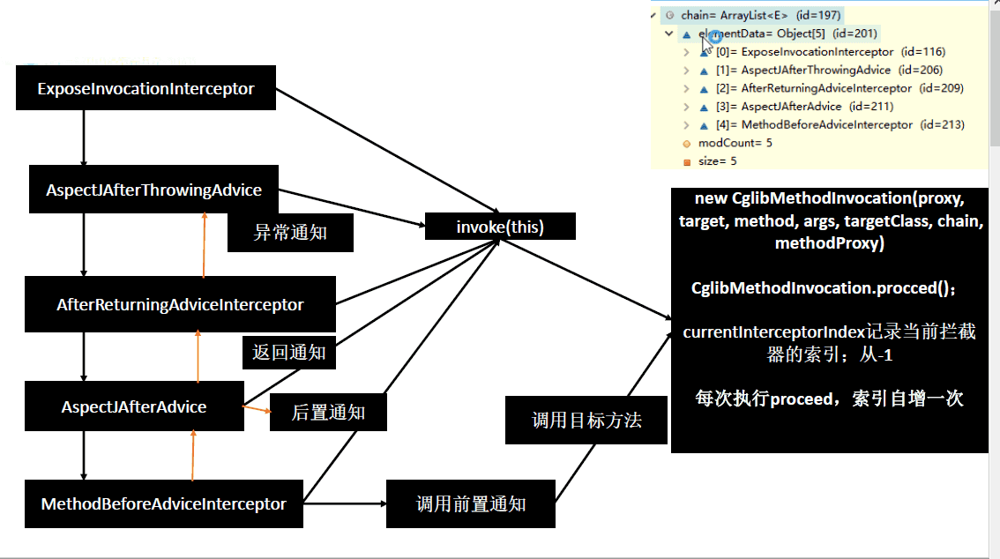

--最流行的Java框架, 原理篇

‍

‍

### Header

Spring终篇, 原理篇

‍

# 原理

> 外置原理篇

‍

‍

## XML

‍

三大对象：

* **BeanDefinition**：是 Spring 中极其重要的一个概念，存储了 bean 对象的所有特征信息，如是否单例、是否懒加载、factoryBeanName 等，和 bean 的关系就是类与对象的关系，一个不同的 bean 对应一个 BeanDefinition
* **BeanDefinationRegistry**：存放 BeanDefination 的容器，是一种键值对的形式，通过特定的 Bean 定义的 id，映射到相应的 BeanDefination，**BeanFactory 的实现类同样继承 BeanDefinationRegistry 接口**，拥有保存 BD 的能力
* **BeanDefinitionReader**：读取配置文件，**XML 用 Dom4j 解析**，**注解用 IO 流加载解析**

‍

程序：

```java
BeanFactory bf = new XmlBeanFactory(new ClassPathResource("applicationContext.xml"));
UserService userService1 = (UserService)bf.getBean("userService");
```

源码解析：

```java
public XmlBeanFactory(Resource resource, BeanFactory parentBeanFactory) {
    super(parentBeanFactory);
    this.reader.loadBeanDefinitions(resource);
}
public int loadBeanDefinitions(Resource resource) {
    //将 resource 包装成带编码格式的 EncodedResource
    //EncodedResource 中 getReader()方法，调用java.io包下的 转换流 创建指定编码的输入流对象
    return loadBeanDefinitions(new EncodedResource(resource));
}
```

* ​`XmlBeanDefinitionReader.loadBeanDefinitions()`​：**把 Resource 解析成 BeanDefinition 对象**

  * ​`currentResources = this.resourcesCurrentlyBeingLoaded.get()`​：拿到当前线程已经加载过的所有 EncodedResoure 资源，用 ThreadLocal 保证线程安全
  * ​`if (currentResources == null)`​：判断 currentResources 是否为空，为空则进行初始化
  * ​`if (!currentResources.add(encodedResource))`​：如果已经加载过该资源会报错，防止重复加载
  * ​`inputSource = new InputSource(inputStream)`​：资源对象包装成 InputSource，InputSource 是 **SAX** 中的资源对象，用来进行 XML 文件的解析
  * ​`return doLoadBeanDefinitions()`​：**加载返回**
  * ​`currentResources.remove(encodedResource)`​：加载完成移除当前 encodedResource
  * ​`resourcesCurrentlyBeingLoaded.remove()`​：ThreadLocal 为空时移除元素，防止内存泄露
* ​`XmlBeanDefinitionReader.doLoadBeanDefinitions(inputSource, resource)`​：真正的加载函数

  ​`Document doc = doLoadDocument(inputSource, resource)`​：转换成有**层次结构**的 Document 对象

  * ​`getEntityResolver()`​ **：获取用来解析 DTD、XSD 约束的解析器**
  * ​`getValidationModeForResource(resource)`​：获取验证模式

  ​`int count = registerBeanDefinitions(doc, resource)`​：**将 Document 解析成 BD 对象，注册（添加）到  BeanDefinationRegistry 中**，返回新注册的数量

  * ​`createBeanDefinitionDocumentReader()`​：创建 DefaultBeanDefinitionDocumentReader 对象
  * ​`getRegistry().getBeanDefinitionCount()`​：获取解析前 BeanDefinationRegistry 中的 bd 数量
  * ​`registerBeanDefinitions(doc, readerContext)`​：注册 BD

    * ​`this.readerContext = readerContext`​：保存上下文对象
    * ​`doRegisterBeanDefinitions(doc.getDocumentElement())`​：真正的注册 BD 函数

      * ​`doc.getDocumentElement()`​：拿出顶层标签 <beans></beans>
  * ​`return getRegistry().getBeanDefinitionCount() - countBefore`​：返回新加入的数量
* ​`DefaultBeanDefinitionDocumentReader.doRegisterBeanDefinitions()`​：注册 BD 到 BR

  * ​`createDelegate(getReaderContext(), root, parent)`​：beans 是标签的解析器对象
  * ​`delegate.isDefaultNamespace(root)`​：判断 beans 标签是否是默认的属性
  * ​`root.getAttribute(PROFILE_ATTRIBUTE)`​：解析 profile 属性
  * ​`preProcessXml(root)`​：解析前置处理，自定义实现
  * ​`parseBeanDefinitions(root, this.delegate)`​：**解析 beans 标签中的子标签**

    * ​`parseDefaultElement(ele, delegate)`​：如果是默认的标签，用该方法解析子标签

      * 判断标签名称，进行相应的解析
      * ​`processBeanDefinition(ele, delegate)`​：
    * ​`delegate.parseCustomElement(ele)`​：解析自定义的标签
  * ​`postProcessXml(root)`​：解析后置处理
* ​`DefaultBeanDefinitionDocumentReader.processBeanDefinition()`​：**解析 bean 标签并注册到注册中心**

  * ​`delegate.parseBeanDefinitionElement(ele)`​：解析 bean 标签封装为 BeanDefinitionHolder

    * ​`if (!StringUtils.hasText(beanName) && !aliases.isEmpty())`​：条件一成立说明 name 没有值，条件二成立说明别名有值

      ​`beanName = aliases.remove(0)`​：拿别名列表的第一个元素当作 beanName
    * ​`parseBeanDefinitionElement(ele, beanName, containingBean)`​：**解析 bean 标签**

      * ​`parseState.push(new BeanEntry(beanName))`​：当前解析器的状态设置为 BeanEntry
      * class 和 parent 属性存在一个，parent 是作为父标签为了被继承
      * ​`createBeanDefinition(className, parent)`​：设置了class 的 GenericBeanDefinition对象
      * ​`parseBeanDefinitionAttributes()`​：解析 bean 标签的属性
      * 接下来解析子标签
    * ​`beanName = this.readerContext.generateBeanName(beanDefinition)`​：生成 className + # + 序号的名称赋值给 beanName
    * ​`return new BeanDefinitionHolder(beanDefinition, beanName, aliases)`​：**包装成 BeanDefinitionHolder**
  * ​`registerBeanDefinition(bdHolder, getReaderContext().getRegistry())`​：**注册到容器**

    * ​`beanName = definitionHolder.getBeanName()`​：获取beanName
    * ​`this.beanDefinitionMap.put(beanName, beanDefinition)`​：添加到注册中心
  * ​`getReaderContext().fireComponentRegistered()`​：发送注册完成事件

‍

**说明：源码部分的笔记不一定适合所有人阅读，作者采用流水线式去解析重要的代码，解析的结构类似于树状，如果视觉疲劳可以去网上参考一些博客和流程图学习源码。**

‍

## IOC

### 容器启动

Spring IOC 容器是 ApplicationContext 或者 BeanFactory，使用多个 Map 集合保存单实例 Bean，环境信息等资源，不同层级有不同的容器，比如整合 SpringMVC 的父子容器（先看 Bean 部分的源码解析再回看容器）

ClassPathXmlApplicationContext 与 AnnotationConfigApplicationContext 差不多：

```java
public AnnotationConfigApplicationContext(Class<?>... annotatedClasses) {
    this();
    register(annotatedClasses);// 解析配置类，封装成一个 BeanDefinitionHolder，并注册到容器
    refresh();// 加载刷新容器中的 Bean
}
```

```java
public AnnotationConfigApplicationContext() {
    // 注册 Spring 的注解解析器到容器
    this.reader = new AnnotatedBeanDefinitionReader(this);
    // 实例化路径扫描器，用于对指定的包目录进行扫描查找 bean 对象
    this.scanner = new ClassPathBeanDefinitionScanner(this);
}
```

AbstractApplicationContext.refresh()：

* prepareRefresh()：刷新前的**预处理**

  * ​`this.startupDate = System.currentTimeMillis()`​：设置容器的启动时间
  * ​`initPropertySources()`​：初始化一些属性设置，可以自定义个性化的属性设置方法
  * ​`getEnvironment().validateRequiredProperties()`​：检查环境变量
  * ​`earlyApplicationEvents= new LinkedHashSet<ApplicationEvent>()`​：保存容器中早期的事件
* obtainFreshBeanFactory()：获取一个**全新的 BeanFactory 接口实例**，如果容器中存在工厂实例直接销毁

  ​`refreshBeanFactory()`​：创建 BeanFactory，设置序列化 ID、读取 BeanDefinition 并加载到工厂

  * ​`if (hasBeanFactory())`​：applicationContext 内部拥有一个 beanFactory 实例，需要将该实例完全释放销毁
  * ​`destroyBeans()`​：销毁原 beanFactory 实例，将 beanFactory 内部维护的单实例 bean 全部清掉，如果哪个 bean 实现了 Disposablejie接口，还会进行 bean distroy 方法的调用处理

    * ​`this.singletonsCurrentlyInDestruction = true`​：设置当前 beanFactory 状态为销毁状态
    * ​`String[] disposableBeanNames`​：获取销毁集合中的 bean，如果当前 bean 有**析构函数**就会在销毁集合
    * ​`destroySingleton(disposableBeanNames[i])`​：遍历所有的 disposableBeans，执行销毁方法

      * ​`removeSingleton(beanName)`​：清除三级缓存和 registeredSingletons 中的当前 beanName 的数据
      * ​`this.disposableBeans.remove(beanName)`​：从销毁集合中清除，每个 bean 只能 destroy 一次
      * ​`destroyBean(beanName, disposableBean)`​：销毁 bean

        * dependentBeanMap 记录了依赖当前 bean 的其他 bean 信息，因为依赖的对象要被回收了，所以依赖当前 bean 的其他对象都要执行 destroySingleton，遍历 dependentBeanMap 执行销毁
        * ​`bean.destroy()`​：解决完成依赖后，执行 DisposableBean 的 destroy 方法
        * ​` this.dependenciesForBeanMap.remove(beanName)`​：保存当前 bean 依赖了谁，直接清除
    * 进行一些集合和缓存的清理工作
  * ​`closeBeanFactory()`​：将容器内部的 beanFactory 设置为空，重新创建
  * ​`beanFactory = createBeanFactory()`​：创建新的 DefaultListableBeanFactory 对象
  * ​`beanFactory.setSerializationId(getId())`​：进行 ID 的设置，可以根据 ID 获取 BeanFactory 对象
  * ​`customizeBeanFactory(beanFactory)`​：设置是否允许覆盖和循环引用
  * ​`loadBeanDefinitions(beanFactory)`​：**加载 BeanDefinition 信息，注册 BD注册到 BeanFactory 中**
  * ​`this.beanFactory = beanFactory`​：把 beanFactory 填充至容器中

  ​`getBeanFactory()`​：返回创建的 DefaultListableBeanFactory 对象，该对象继承 BeanDefinitionRegistry
* prepareBeanFactory(beanFactory)：**BeanFactory 的预准备**工作，向容器中添加一些组件

  * ​`setBeanClassLoader(getClassLoader())`​：给当前 bf 设置一个**类加载器**，加载 bd 的 class 信息
  * ​`setBeanExpressionResolver()`​：设置 EL 表达式解析器
  * ​`addPropertyEditorRegistrar`​：添加一个属性编辑器，解决属性注入时的格式转换
  * ​`addBeanPostProcessor()`​：添加后处理器，主要用于向 bean 内部注入一些框架级别的实例
  * ​`ignoreDependencyInterface()`​：设置忽略自动装配的接口，bean 内部的这些类型的字段   不参与依赖注入
  * ​`registerResolvableDependency()`​：注册一些类型依赖关系
  * ​`addBeanPostProcessor()`​：将配置的监听者注册到容器中，当前 bean 实现 ApplicationListener 接口就是监听器事件
  * ​`beanFactory.registerSingleton()`​：添加一些系统信息
* postProcessBeanFactory(beanFactory)：BeanFactory 准备工作完成后进行的后置处理工作，扩展方法
* invokeBeanFactoryPostProcessors(beanFactory)：**执行 BeanFactoryPostProcessor 的方法**

  * ​`processedBeans = new HashSet<>()`​：存储已经执行过的 BeanFactoryPostProcessor 的 beanName
  * ​`if (beanFactory instanceof BeanDefinitionRegistry)`​：**当前 BeanFactory 是 bd 的注册中心，bd 全部注册到 bf**
  * ​`for (BeanFactoryPostProcessor postProcessor : beanFactoryPostProcessors)`​：遍历所有的 bf 后置处理器
  * ​`if (postProcessor instanceof BeanDefinitionRegistryPostProcessor)`​：是 Registry 类的后置处理器

    ​`registryProcessor.postProcessBeanDefinitionRegistry(registry)`​：向 bf 中注册一些 bd

    ​`registryProcessors.add(registryProcessor)`​：添加到 BeanDefinitionRegistryPostProcessor 集合
  * ​`regularPostProcessors.add(postProcessor)`​：添加到 BeanFactoryPostProcessor 集合
  * 逻辑到这里已经获取到所有 BeanDefinitionRegistryPostProcessor 和 BeanFactoryPostProcessor  接口类型的后置处理器
  * **首先回调 BeanDefinitionRegistryPostProcessor 类的后置处理方法 postProcessBeanDefinitionRegistry()**

    * 获取实现了 PriorityOrdered（主排序接口）接口的 bdrpp，进行 sort 排序，然后全部执行并放入已经处理过的集合
    * 再执行实现了 Ordered（次排序接口）接口的 bdrpp
    * 最后执行没有实现任何优先级或者是顺序接口 bdrpp，`boolean reiterate = true`​ 控制 while 是否需要再次循环，循环内是查找并执行 bdrpp 后处理器的 registry 相关的接口方法，接口方法执行以后会向 bf 内注册 bd，注册的 bd 也有可能是 bdrpp 类型，所以需要该变量控制循环
    * ​`processedBeans.add(ppName)`​：已经执行过的后置处理器存储到该集合中，防止重复执行
    * ​` invokeBeanFactoryPostProcessors()`​：bdrpp 继承了 BeanFactoryPostProcessor，有 postProcessBeanFactory 方法
  * **执行普通 BeanFactoryPostProcessor 的相关 postProcessBeanFactory 方法，按照主次无次序执行**

    * ​`if (processedBeans.contains(ppName))`​：会过滤掉已经执行过的后置处理器
  * ​`beanFactory.clearMetadataCache()`​：清除缓存中合并的 Bean 定义，因为后置处理器可能更改了元数据

‍

**以上是 BeanFactory 的创建及预准备工作，接下来进入 Bean 的流程**

* registerBeanPostProcessors(beanFactory)：**注册 Bean 的后置处理器**，为了干预 Spring 初始化 bean 的流程，这里仅仅是向容器中**注入而非使用**

  * ​`beanFactory.getBeanNamesForType(BeanPostProcessor.class)`​：**获取配置中实现了 BeanPostProcessor 接口类型**
  * ​`int beanProcessorTargetCount`​：后置处理器的数量，已经注册的 + 未注册的 + 即将要添加的一个
  * ​`beanFactory.addBeanPostProcessor(new BeanPostProcessorChecker())`​：添加一个检查器

    ​`BeanPostProcessorChecker.postProcessAfterInitialization()`​：初始化后的后处理器方法

    * ​`!(bean instanceof BeanPostProcessor) `​：当前 bean 类型是普通 bean，不是后置处理器
    * ​`!isInfrastructureBean(beanName)`​：成立说明当前 beanName 是用户级别的 bean  不是 Spring 框架的
    * ​`this.beanFactory.getBeanPostProcessorCount() < this.beanPostProcessorTargetCount`​：BeanFactory 上面注册后处理器数量 < 后处理器数量，说明后处理框架尚未初始化完成
  * ​`for (String ppName : postProcessorNames)`​：遍历 PostProcessor 集合，**根据实现不同的顺序接口添加到不同集合**
  * ​`sortPostProcessors(priorityOrderedPostProcessors, beanFactory)`​：实现 PriorityOrdered 接口的后处理器排序

    ​`registerBeanPostProcessors(beanFactory, priorityOrderedPostProcessors)`​：**注册到 beanFactory 中**
  * 接着排序注册实现 Ordered 接口的后置处理器，然后注册普通的（ 没有实现任何优先级接口）后置处理器
  * 最后排序 MergedBeanDefinitionPostProcessor 类型的处理器，根据实现的排序接口，排序完注册到 beanFactory 中
  * ​`beanFactory.addBeanPostProcessor(new ApplicationListenerDetector(applicationContext))`​：重新注册 ApplicationListenerDetector 后处理器，用于在 Bean 创建完成后检查是否属于 ApplicationListener 类型，如果是就把 Bean 放到**监听器容器**中保存起来
* initMessageSource()：初始化 MessageSource 组件，主要用于做国际化功能，消息绑定与消息解析

  * ​`if (beanFactory.containsLocalBean(MESSAGE_SOURCE_BEAN_NAME))`​：容器是否含有名称为 messageSource 的 bean
  * ​`beanFactory.getBean(MESSAGE_SOURCE_BEAN_NAME, MessageSource.class)`​：如果有证明用户自定义了该类型的 bean，获取后直接赋值给 this.messageSource
  * ​`dms = new DelegatingMessageSource()`​：容器中没有就新建一个赋值
* initApplicationEventMulticaster()：**初始化事件传播器**，在注册监听器时会用到

  * ​`if (beanFactory.containsLocalBean(APPLICATION_EVENT_MULTICASTER_BEAN_NAME))`​：**条件成立说明用户自定义了事件传播器**，可以实现 ApplicationEventMulticaster 接口编写自己的事件传播器，通过 bean 的方式提供给 Spring
  * 如果有就直接从容器中获取；如果没有则创建一个 SimpleApplicationEventMulticaster 注册
* onRefresh()：留给用户去实现，可以硬编码提供一些组件，比如提供一些监听器
* registerListeners()：注册通过配置提供的 Listener，这些**监听器**最终注册到 ApplicationEventMulticaster 内

  * ​`for (ApplicationListener<?> listener : getApplicationListeners()) `​：注册编码实现的监听器
  * ​`getBeanNamesForType(ApplicationListener.class, true, false)`​：注册通过配置提供的 Listener
  * ​`multicastEvent(earlyEvent)`​：**发布前面步骤产生的事件 applicationEvents**

    ​`Executor executor = getTaskExecutor()`​：获取线程池，有线程池就异步执行，没有就同步执行
* finishBeanFactoryInitialization()：**实例化非懒加载状态的单实例**

  * ​`beanFactory.freezeConfiguration()`​：**冻结配置信息**，就是冻结 BD 信息，冻结后无法再向 bf 内注册 bd
  * ​`beanFactory.preInstantiateSingletons()`​：实例化 non-lazy-init singletons

    * ​`for (String beanName : beanNames)`​：遍历容器内所有的 beanDefinitionNames
    * ​`getMergedLocalBeanDefinition(beanName)`​：获取与父类合并后的对象（Bean → 获取流程部分详解此函数）
    * ​`if (!bd.isAbstract() && bd.isSingleton() && !bd.isLazyInit())`​：BD 对应的 Class 满足非抽象、单实例，非懒加载，需要预先实例化

      ​`if (isFactoryBean(beanName))`​：BD 对应的 Class 是 factoryBean 对象

      * ​`getBean(FACTORY_BEAN_PREFIX + beanName)`​：获取工厂 FactoryBean 实例本身
      * ​`isEagerInit`​：控制 FactoryBean 内部管理的 Bean 是否也初始化
      * ​`getBean(beanName)`​：**初始化 Bean，获取 Bean 详解此函数**

      ​`getBean(beanName)`​：不是工厂 bean 直接获取
    * ​`for (String beanName : beanNames)`​：检查所有的 Bean 是否实现 SmartInitializingSingleton 接口，实现了就执行 afterSingletonsInstantiated()，进行一些创建后的操作
* ​`finishRefresh()`​：完成刷新后做的一些事情，主要是启动生命周期

  * ​`clearResourceCaches()`​：清空上下文缓存
  * ​`initLifecycleProcessor()`​：**初始化和生命周期有关的后置处理器**，容器的生命周期

    * ​`if (beanFactory.containsLocalBean(LIFECYCLE_PROCESSOR_BEAN_NAME))`​：成立说明自定义了生命周期处理器
    * ​`defaultProcessor = new DefaultLifecycleProcessor()`​：Spring 默认提供的生命周期处理器
    * ​` beanFactory.registerSingleton()`​：将生命周期处理器注册到 bf 的一级缓存和注册单例集合中
  * ​`getLifecycleProcessor().onRefresh()`​：获取该**生命周期后置处理器回调 onRefresh()** ，调用 `startBeans(true)`​

    * ​`lifecycleBeans = getLifecycleBeans()`​：获取到所有实现了 Lifecycle 接口的对象包装到 Map 内，key 是beanName， value 是 Lifecycle 对象
    * ​`int phase = getPhase(bean)`​：获取当前 Lifecycle 的 phase 值，当前生命周期对象可能依赖其他生命周期对象的执行结果，所以需要 phase 决定执行顺序，数值越低的优先执行
    * ​`LifecycleGroup group = phases.get(phase)`​：把 phsae 相同的 Lifecycle 存入 LifecycleGroup
    * ​`if (group == null)`​：group 为空则创建，初始情况下是空的
    * ​`group.add(beanName, bean)`​：将当前 Lifecycle 添加到当前 phase 值一样的 group 内
    * ​`Collections.sort(keys)`​：**从小到大排序，按优先级启动**
    * ​`phases.get(key).start()`​：遍历所有的 Lifecycle 对象开始启动
    * ​`doStart(this.lifecycleBeans, member.name, this.autoStartupOnly)`​：底层调用该方法启动

      * ​`bean = lifecycleBeans.remove(beanName)`​： 确保 Lifecycle 只被启动一次，在一个分组内被启动了在其他分组内就看不到 Lifecycle 了
      * ​`dependenciesForBean = getBeanFactory().getDependenciesForBean(beanName)`​：获取当前即将被启动的 Lifecycle 所依赖的其他 beanName，需要**先启动所依赖的 bean**，才能启动自身
      * ​`if ()`​：传入的参数 autoStartupOnly 为 true 表示启动 isAutoStartUp 为 true 的 SmartLifecycle 对象，不会启动普通的生命周期的对象；false 代表全部启动
      * bean.start()：**调用启动方法**
  * ​`publishEvent(new ContextRefreshedEvent(this))`​：**发布容器刷新完成事件**
  * ​`liveBeansView.registerApplicationContext(this)`​：暴露 Mbean

补充生命周期 stop() 方法的调用

* DefaultLifecycleProcessor.stop()：调用 DefaultLifecycleProcessor.stopBeans()

  * 获取到所有实现了 Lifecycle 接口的对象并按 phase 数值分组的
  * ​`keys.sort(Collections.reverseOrder())`​：按 phase 降序排序 Lifecycle 接口，最先启动的最晚关闭（责任链？）
  * ​`phases.get(key).stop()`​：遍历所有的 Lifecycle 对象开始停止

    * ​`latch = new CountDownLatch(this.smartMemberCount)`​：创建 CountDownLatch，设置 latch 内部的值为当前分组内的  smartMemberCount 的数量
    * ​`countDownBeanNames = Collections.synchronizedSet(new LinkedHashSet<>())`​：保存当前正在处理关闭的smartLifecycle 的 BeanName
    * ​`for (LifecycleGroupMember member : this.members)`​：处理本分组内需要关闭的 Lifecycle

      ​`doStop(this.lifecycleBeans, member.name, latch, countDownBeanNames)`​：真正的停止方法

      * ​`getBeanFactory().getDependentBeans(beanName)`​：**获取依赖当前 Lifecycle 的其他对象的 beanName**，因为当前的 Lifecycle 即将要关闭了，所有的依赖了当前 Lifecycle 的 bean 也要关闭
      * ​`countDownBeanNames.add(beanName)`​：将当前 SmartLifecycle beanName 添加到 countDownBeanNames 集合内，该集合表示正在关闭的 SmartLifecycle
      * ​`bean.stop()`​：调用停止的方法

‍

‍

### 获取Bean

单实例：在容器启动时创建对象

多实例：在每次获取的时候创建对象

获取流程：**获取 Bean 时先从单例池获取，如果没有则进行第二次获取，并带上工厂类去创建并添加至单例池**

Java 启动 Spring 代码：

```java
ApplicationContext ctx = new ClassPathXmlApplicationContext("applicationContext.xml");
UserService userService = (UserService) context.getBean("userService");
```

‍

AbstractBeanFactory.doGetBean()：获取 Bean，context.getBean() 追踪到此

* ​`beanName = transformedBeanName(name)`​：name 可能是一个别名，重定向出来真实 beanName；也可能是一个 & 开头的 name，说明要获取的 bean 实例对象，是一个 FactoryBean 对象（IOC 原理 → 核心类）

  * ​`BeanFactoryUtils.transformedBeanName(name)`​：判断是哪种 name，返回截取 & 以后的 name 并放入缓存

    * ​`transformedBeanNameCache.computeIfAbsent`​：缓存是并发安全集合，key == null || value == null 时 put 成功
    * do while 循环一直去除 & 直到不再含有 &
  * ​`canonicalName(name)`​：aliasMap 保存别名信息，其中的 do while 逻辑是迭代查找，比如 A 别名叫做 B，但是 B 又有别名叫 C， aliasMap 为 {"C":"B", "B":"A"}，get(C) 最后返回的是  A
* ​`DefaultSingletonBeanRegistry.getSingleton()`​：**第一次获取从缓存池获取**（循环依赖详解此代码）

  * 缓存中有数据进行 getObjectForBeanInstance() 获取可使用的 Bean（本节结束部分详解此函数）
  * 缓存中没有数据进行下面的逻辑进行创建
* ​`if(isPrototypeCurrentlyInCreation(beanName))`​：检查 bean 是否在原型（Prototype）正在被创建的集合中，如果是就报错，说明产生了循环依赖，**原型模式解决不了循环依赖**

  原因：先加载 A，把 A 加入集合，A 依赖 B 去加载 B，B 又依赖 A，去加载 A，发现 A 在正在创建集合中，产生循环依赖
* ​`markBeanAsCreated(beanName)`​：把 bean 标记为已经创建，**防止其他线程重新创建 Bean**
* ​`mbd = getMergedLocalBeanDefinition(beanName)`​：**获取合并父 BD 后的 BD 对象**，BD 是直接继承的，合并后的 BD 信息是包含父类的 BD 信息

  * ​`this.mergedBeanDefinitions.get(beanName)`​：从缓存中获取
  * ​`if(bd.getParentName()==null)`​：beanName 对应 BD 没有父 BD 就不用处理继承，封装为 RootBeanDefinition 返回
  * ​`parentBeanName = transformedBeanName(bd.getParentName())`​：处理父 BD 的 name 信息
  * ​`if(!beanName.equals(parentBeanName))`​：一般情况父子 BD 的名称不同

    ​`pbd = getMergedBeanDefinition(parentBeanName)`​：递归调用，最终返回父 BD 的父 BD 信息
  * ​`mbd = new RootBeanDefinition(pbd)`​：按照父 BD 信息创建 RootBeanDefinition 对象
  * ​`mbd.overrideFrom(bd)`​：**子 BD 信息覆盖 mbd**，因为是要以子 BD 为基准，不存在的才去父 BD 寻找（**类似 Java 继承**）
  * ​`this.mergedBeanDefinitions.put(beanName, mbd)`​：放入缓存
* ​`checkMergedBeanDefinition()`​：判断当前 BD 是否为**抽象 BD**，抽象 BD 不能创建实例，只能作为父 BD 被继承
* ​`mbd.getDependsOn()`​：获取 bean 标签 depends-on
* ​`if(dependsOn != null)`​：**遍历所有的依赖加载，解决不了循环依赖**

  ​`isDependent(beanName, dep)`​：判断循环依赖，出现循环依赖问题报错

  * 两个 Map：`<bean name="A" depends-on="B" ...>`​

    * dependentBeanMap：记录依赖了当前 beanName 的其他 beanName（谁依赖我，我记录谁）
    * dependenciesForBeanMap：记录当前 beanName 依赖的其它 beanName
    * 以 B 为视角 dependentBeanMap {"B"：{"A"}}，以 A 为视角 dependenciesForBeanMap {"A" :{"B"}}
  * ​`canonicalName(beanName)`​：处理 bean 的 name
  * ​`dependentBeans = this.dependentBeanMap.get(canonicalName)`​：获取依赖了当前 bean 的 name
  * ​`if (dependentBeans.contains(dependentBeanName))`​：依赖了当前 bean 的集合中是否有该 name，有就产生循环依赖
  * 进行递归处理所有的引用：假如 `<bean name="A" dp="B"> <bean name="B" dp="C"> <bean name="C" dp="A">`​

    ```java
    dependentBeanMap={A:{C}, B:{A}, C:{B}} 
    // C 依赖 A     		判断谁依赖了C				递归判断				谁依赖了B
    isDependent(C, A)  → C#dependentBeans={B} → isDependent(B, A); → B#dependentBeans={A} //返回true
    ```

  ​`registerDependentBean(dep, beanName)`​：把 bean 和依赖注册到两个 Map 中，注意参数的位置，被依赖的在前

  ​`getBean(dep)`​：**先加载依赖的 Bean**，又进入 doGetBean() 的逻辑
* ​`if (mbd.isSingleton())`​：**判断 bean 是否是单例的 bean**

  ​`getSingleton(String, ObjectFactory<?>)`​：**第二次获取，传入一个工厂对象**，这个方法更倾向于创建实例并返回

  ```java
  sharedInstance = getSingleton(beanName, () -> {
      return createBean(beanName, mbd, args);//创建，跳转生命周期
      //lambda表达式，调用了ObjectFactory的getObject()方法，实际回调接口实现的是 createBean()方法进行创建对象
  });
  ```

  * ​`singletonObjects.get(beanName)`​：从一级缓存检查是否已经被加载，单例模式复用已经创建的 bean
  * ​`this.singletonsCurrentlyInDestruction`​：容器销毁时会设置这个属性为 true，这时就不能再创建 bean 实例了
  * ​`beforeSingletonCreation(beanName)`​：检查构造注入的依赖，**构造参数注入产生的循环依赖无法解决**

    ​`!this.singletonsCurrentlyInCreation.add(beanName)`​：将当前 beanName 放入到正在创建中单实例集合，放入成功说明没有产生循环依赖，失败则产生循环依赖，进入判断条件内的逻辑抛出异常

    原因：加载 A，向正在创建集合中添加了 {A}，根据 A 的构造方法实例化 A 对象，发现 A 的构造方法依赖 B，然后加载 B，B 构造方法的参数依赖于 A，又去加载 A 时来到当前方法，因为创建中集合已经存在 A，所以添加失败
  * ​`singletonObject = singletonFactory.getObject()`​：**创建 bean**（生命周期部分详解）
  * **创建完成以后，Bean 已经初始化好，是一个完整的可使用的 Bean**
  * ​`afterSingletonCreation(beanName)`​：从正在创建中的集合中移出
  * ​`addSingleton(beanName, singletonObject)`​：**添加一级缓存单例池中，从二级三级缓存移除**

  ​`bean = getObjectForBeanInstance`​：**单实例可能是普通单实例或者 FactoryBean**，如果是 FactoryBean 实例，需要判断 name 是带 & 还是不带 &，带 & 说明 getBean 获取 FactoryBean 对象，否则是获取 FactoryBean 内部管理的实例

  * 参数 name 是未处理 & 的 name，beanName 是处理过 & 和别名后的 name
  * ​`if(BeanFactoryUtils.isFactoryDereference(name))`​：判断 doGetBean 中参数 name 前是否带 &，不是处理后的
  * ​`if(!(beanInstance instanceof FactoryBean) || BeanFactoryUtils.isFactoryDereference(name))`​：Bean 是普通单实例或者是 FactoryBean 就可以直接返回，否则进入下面的获取 **FactoryBean 内部管理的实例**的逻辑
  * ​`getCachedObjectForFactoryBean(beanName)`​：尝试到缓存获取，获取到直接返回，获取不到进行下面逻辑
  * ​`if (mbd == null && containsBeanDefinition(beanName))`​：Spring 中有当前 beanName 的 BeanDefinition 信息

    ​`mbd = getMergedLocalBeanDefinition(beanName)`​：获取合并后的 BeanDefinition
  * ​`mbd.isSynthetic()`​：默认值是 false 表示这是一个用户对象，如果是 true 表示是系统对象
  * ​`object = getObjectFromFactoryBean(factory, beanName, !synthetic)`​：从工厂内获取实例

    * ​`factory.isSingleton() && containsSingleton(beanName)`​：工厂内部维护的对象是单实例并且一级缓存存在该 bean
    * 首先去缓存中获取，获取不到就**使用工厂获取**然后放入缓存，进行循环依赖判断
* ​`else if (mbd.isPrototype())`​：**bean 是原型的 bean**

  ​`beforePrototypeCreation(beanName)`​：当前线程正在创建的原型对象 beanName 存入 prototypesCurrentlyInCreation

  * ​`curVal = this.prototypesCurrentlyInCreation.get()`​：获取当前线程的正在创建的原型类集合
  * ​`this.prototypesCurrentlyInCreation.set(beanName)`​：集合为空就把当前 beanName 加入
  * ​`if (curVal instanceof String)`​：已经有线程相关原型类创建了，把当前的创建的加进去

  ​`createBean(beanName, mbd, args)`​：创建原型类对象，不需要三级缓存

  ​`afterPrototypeCreation(beanName)`​：从正在创建中的集合中移除该 beanName， **与 beforePrototypeCreation逻辑相反**
* ​`convertIfNecessary()`​：**依赖检查**，检查所需的类型是否与实际 bean 实例的类型匹配
* ​`return (T) bean`​：返回创建完成的 bean

‍

‍

### 生命周期

#### 四个阶段

Bean 的生命周期：实例化 instantiation，填充属性 populate，初始化 initialization，销毁 destruction

AbstractAutowireCapableBeanFactory.createBean()：进入 Bean 生命周期的流程

* ​`resolvedClass = resolveBeanClass(mbd, beanName)`​：判断 mdb 中的 class 是否已经**加载到 JVM**，如果未加载则使用类加载器将 beanName 加载到 JVM中并返回 class 对象
* ​`if (resolvedClass != null && !mbd.hasBeanClass() && mbd.getBeanClassName() != null)`​：条件成立封装 mbd 并把 resolveBeanClass 设置到 bd 中

  * 条件二：mbd 在 resolveBeanClass 之前是否有 class
  * 条件三：mbd 有 className
* ​`bean = resolveBeforeInstantiation(beanName, mbdToUse)`​：实例化前的后置处理器返回一个代理实例对象（不是 AOP）

  * 自定义类继承 InstantiationAwareBeanPostProcessor，重写 postProcessBeforeInstantiation 方法，**方法逻辑为创建对象**
  * 并配置文件 `<bean class="intefacePackage.MyInstantiationAwareBeanPostProcessor">`​ 导入为 bean
  * 条件成立，**短路操作**，直接 return bean
* ​`Object beanInstance = doCreateBean(beanName, mbdToUse, args)`​：Do it

AbstractAutowireCapableBeanFactory.**doCreateBean**(beanName, RootBeanDefinition, Object[] args)：创建 Bean

* ​`BeanWrapper instanceWrapper = null`​：**Spring 给所有创建的 Bean 实例包装成 BeanWrapper**，内部最核心的方法是获取实例，提供了一些额外的接口方法，比如属性访问器
* ​`instanceWrapper = this.factoryBeanInstanceCache.remove(beanName)`​：单例对象尝试从缓存中获取，会移除缓存
* ​`createBeanInstance()`​：**缓存中没有实例就进行创建实例**（逻辑复杂，下一小节详解）
* ​`if (!mbd.postProcessed)`​：每个 bean 只进行一次该逻辑

  ​`applyMergedBeanDefinitionPostProcessors()`​：**后置处理器，合并 bd 信息**，接下来要属性填充了

  ​`AutowiredAnnotationBeanPostProcessor.postProcessMergedBeanDefinition()`​：**后置处理逻辑（@Autowired）**

  * ​`metadata = findAutowiringMetadata(beanName, beanType, null)`​：提取当前 bean 整个继承体系内的  **@Autowired、@Value、@Inject** 信息，存入一个 InjectionMetadata 对象，保存着当前 bean 信息和要自动注入的字段信息

    ```java
    private final Class<?> targetClass;							//当前 bean 
    private final Collection<InjectedElement> injectedElements;	//要注入的信息集合
    ```

    * ​`metadata = buildAutowiringMetadata(clazz)`​：查询当前 clazz 感兴趣的注解信息

      * ​`ReflectionUtils.doWithLocalFields()`​：提取**字段**的注解的信息

        ​`findAutowiredAnnotation(field)`​：代表感兴趣的注解就是那三种注解，获取这三种注解的元数据
      * ​`ReflectionUtils.doWithLocalMethods()`​：提取**方法**的注解的信息
      * ​`do{} while (targetClass != null && targetClass != Object.class)`​：循环从父类中解析，直到 Object 类
    * ​`this.injectionMetadataCache.put(cacheKey, metadata)`​：存入缓存

  ​`mbd.postProcessed = true`​：设置为 true，下次访问该逻辑不会再进入
* ​`earlySingletonExposure = (mbd.isSingleton() && this.allowCircularReferences && isSingletonCurrentlyInCreation(beanName)`​：单例、解决循环引用、是否在单例正在创建集合中

  ```java
  if (earlySingletonExposure) {
      // 【放入三级缓存一个工厂对象，用来获取提前引用】
      addSingletonFactory(beanName, () -> getEarlyBeanReference(beanName, mbd, bean));
      // lamda 表达式，用来获取提前引用，循环依赖部分详解该逻辑
  }
  ```
* ​` populateBean(beanName, mbd, instanceWrapper)`​：**属性填充，依赖注入，整体逻辑是先处理标签再处理注解，填充至 pvs 中，最后通过 apply 方法最后完成属性依赖注入到 BeanWrapper **

  * ​`if (!ibp.postProcessAfterInstantiation(bw.getWrappedInstance(), beanName))`​：实例化后的后置处理器，默认返回 true，可以自定义类继承 InstantiationAwareBeanPostProcessor 修改后置处理方法的返回值为 false，使 continueWithPropertyPopulation 为 false，**会导致直接返回，不进行属性的注入**
  * ​`if (!continueWithPropertyPopulation)`​：自定义方法返回值会造成该条件成立，逻辑为直接返回，**不进行依赖注入**
  * ​`PropertyValues pvs = (mbd.hasPropertyValues() ? mbd.getPropertyValues() : null)`​：处理依赖注入逻辑开始
  * ​`mbd.getResolvedAutowireMode() == ?`​：**根据 bean 标签配置的 autowire** 判断是 BY_NAME 或者 BY_TYPE

    ​`autowireByName(beanName, mbd, bw, newPvs)`​：根据字段名称去获取依赖的 bean，还没注入，只是添加到 pvs

    * ​`propertyNames = unsatisfiedNonSimpleProperties(mbd, bw)`​：bean 实例中有该字段和该字段的 setter 方法，但是在 bd 中没有 property 属性

      * 拿到配置的 property 信息和 bean 的所有字段信息
      * ​`pd.getWriteMethod() != null`​：**当前字段是否有 set 方法，配置类注入的方式需要 set 方法**

        ​`!isExcludedFromDependencyCheck(pd)`​：当前字段类型是否在忽略自动注入的列表中

        ​`!pvs.contains(pd.getName()`​：当前字段不在 xml 或者其他方式的配置中，也就是 bd 中不存在对应的 property

        ​`!BeanUtils.isSimpleProperty(pd.getPropertyType()`​：是否是基本数据类型和内置的几种数据类型，基本数据类型不允许自动注入
    * ​`if (containsBean(propertyName))`​：BeanFactory 中存在当前 property 的 bean 实例，说明找到对应的依赖数据
    * ​`getBean(propertyName)`​：**拿到 propertyName 对应的 bean 实例**
    * ​`pvs.add(propertyName, bean)`​：填充到 pvs 中
    * ​`registerDependentBean(propertyName, beanName))`​：添加到两个依赖 Map（dependsOn）中

    ​`autowireByType(beanName, mbd, bw, newPvs)`​：根据字段类型去查找依赖的 bean

    * ​`desc = new AutowireByTypeDependencyDescriptor(methodParam, eager)`​：依赖描述信息
    * ​`resolveDependency(desc, beanName, autowiredBeanNames, converter)`​：根据描述信息，查找依赖对象，容器中没有对应的实例但是有对应的 BD，会调用 getBean(Type) 获取对象

    ​`pvs = newPvs`​：newPvs 是处理了依赖数据后的 pvs，所以赋值给 pvs
  * ​`hasInstAwareBpps`​：表示当前是否有 InstantiationAwareBeanPostProcessors 的后置处理器（Autowired）
  * ​`pvsToUse = ibp.postProcessProperties(pvs, bw.getWrappedInstance(), beanName)`​： **@Autowired 注解的注入**，这个传入的 pvs 对象，最后原封不动的返回，不会添加东西

    * ​`findAutowiringMetadata()`​：包装着当前 bd 需要注入的注解信息集合，**三种注解的元数据**，直接缓存获取
    * ​`InjectionMetadata.InjectedElement.inject()`​：遍历注解信息解析后注入到 Bean，方法和字段的注入实现不同

      以字段注入为例：

      * ​`value = resolveFieldValue(field, bean, beanName)`​：处理字段属性值

        ​`value = beanFactory.resolveDependency()`​：解决依赖

        ​`result = doResolveDependency()`​：**真正处理自动注入依赖的逻辑**

        * ​`Object shortcut = descriptor.resolveShortcut(this)`​：默认返回 null
        * ​`Object value = getAutowireCandidateResolver().getSuggestedValue(descriptor)`​：**获取 @Value 的值**
        * ​`converter.convertIfNecessary(value, type, descriptor.getTypeDescriptor())`​：如果 value 不是 null，就直接进行类型转换返回数据
        * ​`matchingBeans = findAutowireCandidates(beanName, type, descriptor)`​：如果 value 是空说明字段是引用类型，**获取 @Autowired 的 Bean**

          ```java
          // addCandidateEntry() → Object beanInstance = descriptor.resolveCandidate()
          public Object resolveCandidate(String beanName, Class<?> requiredType, BeanFactory beanFactory) throws BeansException {
          	// 获取 bean
              return beanFactory.getBean(beanName);
          }
          ```
      * ​`ReflectionUtils.makeAccessible(field)`​：修改访问权限
      * ​`field.set(bean, value)`​：获取属性访问器为此 field 对象赋值
  * ​`applyPropertyValues()`​：**将所有解析的 PropertyValues 的注入至 BeanWrapper 实例中**（深拷贝）

    * ​`if (pvs.isEmpty())`​：注解 @Autowired 和 @Value 标注的信息在后置处理的逻辑注入完成，此处为空直接返回
    * 下面的逻辑进行 XML 配置的属性的注入，首先获取转换器进行数据转换，然后**获取 WriteMethod (set) 方法进行反射调用**，完成属性的注入
* ​`initializeBean(String,Object,RootBeanDefinition)`​：**初始化，分为配置文件和实现接口两种方式**

  * ​`invokeAwareMethods(beanName, bean)`​：根据 bean 是否实现 Aware 接口执行初始化的方法
  * ​`wrappedBean = applyBeanPostProcessorsBeforeInitialization`​：初始化前的后置处理器，可以继承接口重写方法

    * ​`processor.postProcessBeforeInitialization()`​：执行后置处理的方法，默认返回 bean 本身
    * ​`if (current == null) return result`​：重写方法返回 null，会造成后置处理的短路，直接返回
  * ​`invokeInitMethods(beanName, wrappedBean, mbd)`​：**反射执行初始化方法**

    * ​`isInitializingBean = (bean instanceof InitializingBean)`​：初始化方法的定义有两种方式，一种是自定义类实现 InitializingBean 接口，另一种是配置文件配置 <bean id="..." class="..." init-method="init"/ >
    * ​`isInitializingBean && (mbd == null || !mbd.isExternallyManagedInitMethod("afterPropertiesSet"))`​：

      * 条件一：当前 bean 是不是实现了 InitializingBean
      * 条件二：InitializingBean 接口中的方法 afterPropertiesSet，判断该方法是否是容器外管理的方法
    * ​`if (mbd != null && bean.getClass() != NullBean.class)`​：成立说明是配置文件的方式

      ​`if(!(接口条件))`​表示**如果通过接口实现了初始化方法的话，就不会在调用配置类中 init-method 定义的方法**

      ​`((InitializingBean) bean).afterPropertiesSet()`​：调用方法

      ​`invokeCustomInitMethod`​：执行自定义的方法

      * ​`initMethodName = mbd.getInitMethodName()`​：获取方法名
      * ​`Method initMethod = ()`​：根据方法名获取到 init-method 方法
      * ​` methodToInvoke = ClassUtils.getInterfaceMethodIfPossible(initMethod)`​：将方法转成从接口层面获取
      * ​`ReflectionUtils.makeAccessible(methodToInvoke)`​：访问权限设置成可访问
      * ​` methodToInvoke.invoke(bean)`​：**反射调用初始化方法**，以当前 bean 为角度去调用
  * ​`wrappedBean = applyBeanPostProcessorsAfterInitialization`​：初始化后的后置处理器

    * ​`AbstractAutoProxyCreator.postProcessAfterInitialization()`​：如果 Bean 被子类标识为要代理的 bean，则使用配置的拦截器**创建代理对象**，AOP 部分详解
    * 如果不存在循环依赖，创建动态代理 bean 在此处完成；否则真正的创建阶段是在属性填充时获取提前引用的阶段，**循环依赖**详解，源码分析：

      ```java
      // 该集合用来避免重复将某个 bean 生成代理对象，
      private final Map<Object, Object> earlyProxyReferences = new ConcurrentHashMap<>(16);

      public Object postProcessAfterInitialization(@Nullable Object bean,String bN){
          if (bean != null) {
              // cacheKey 是 beanName 或者加上 &
              Object cacheKey = getCacheKey(bean.getClass(), beanName);y
                  if (this.earlyProxyReferences.remove(cacheKey) != bean) {
                      // 去提前代理引用池中寻找该key，不存在则创建代理
                      // 如果存在则证明被代理过，则判断是否是当前的 bean，不是则创建代理
                      return wrapIfNecessary(bean, bN, cacheKey);
                  }
          }
          return bean;
      }
      ```
* ​`if (earlySingletonExposure)`​：是否允许提前引用

  ​`earlySingletonReference = getSingleton(beanName, false)`​：**从二级缓存获取实例**，放入一级缓存是在 doGetBean 中的sharedInstance = getSingleton() 逻辑中，此时在 createBean 的逻辑还没有返回，所以一级缓存没有

  ​`if (earlySingletonReference != null)`​：当前 bean 实例从二级缓存中获取到了，说明**产生了循环依赖**，在属性填充阶段会提前调用三级缓存中的工厂生成 Bean 的代理对象（或原始实例），放入二级缓存中，然后使用原始 bean 继续执行初始化

  * ​` if (exposedObject == bean)`​：**初始化后的 bean == 创建的原始实例**，条件成立的两种情况：当前的真实实例不需要被代理；当前实例存在循环依赖已经被提前代理过了，初始化时的后置处理器直接返回 bean 原实例

    ​`exposedObject = earlySingletonReference`​：**把代理后的 Bean 传给 exposedObject 用来返回，因为只有代理对象才封装了拦截器链，main 方法中用代理对象调用方法时会进行增强，代理是对原始对象的包装，所以这里返回的代理对象中含有完整的原实例（属性填充和初始化后的），是一个完整的代理对象，返回后外层方法会将当前 Bean 放入一级缓存**
  * ​`else if (!this.allowRawInjectionDespiteWrapping && hasDependentBean(beanName))`​：是否有其他 bean 依赖当前 bean，执行到这里说明是不存在循环依赖、存在增强代理的逻辑，也就是正常的逻辑

    * ​`dependentBeans = getDependentBeans(beanName)`​：取到依赖当前 bean 的其他 beanName
    * ​`if (!removeSingletonIfCreatedForTypeCheckOnly(dependentBean))`​：判断 dependentBean 是否创建完成

      * ​`if (!this.alreadyCreated.contains(beanName))`​：成立当前 bean 尚未创建完成，当前 bean 是依赖exposedObject 的 bean，返回 true
    * ​`return false`​：创建完成返回 false

      ​`actualDependentBeans.add(dependentBean)`​：创建完成的 dependentBean 加入该集合
    * ​`if (!actualDependentBeans.isEmpty())`​：条件成立说明有依赖于当前 bean 的 bean 实例创建完成，但是当前的 bean 还没创建完成返回，依赖当前 bean 的外部 bean 持有的是不完整的 bean，所以需要报错
* ​`registerDisposableBeanIfNecessary`​：判断当前 bean 是否需要**注册析构函数回调**，当容器销毁时进行回调

  * ​`if (!mbd.isPrototype() && requiresDestruction(bean, mbd))`​

    * 如果是原型 prototype 不会注册析构回调，不会回调该函数，对象的回收由 JVM 的 GC 机制完成
    * requiresDestruction()：

      * ​`DisposableBeanAdapter.hasDestroyMethod(bean, mbd)`​：bd 中定义了 DestroyMethod 返回 true
      * ​`hasDestructionAwareBeanPostProcessors()`​：后处理器框架决定是否进行析构回调
  * ​`registerDisposableBean()`​：条件成立进入该方法，给当前单实例注册回调适配器，适配器内根据当前 bean 实例是继承接口（DisposableBean）还是自定义标签来判定具体调用哪个方法实现
* ​`this.disposableBeans.put(beanName, bean)`​：向销毁集合添加实例

‍

‍

#### 创建实例

AbstractAutowireCapableBeanFactory.createBeanInstance(beanName, RootBeanDefinition, Object[] args)

* ​`resolveBeanClass(mbd, beanName)`​：确保 Bean 的 Class 真正的被加载
* 判断类的访问权限是不是 public，不是进入下一个判断，是否允许访问类的 non-public 的构造方法，不允许则报错
* ​`Supplier<?> instanceSupplier = mbd.getInstanceSupplier()`​：获取创建实例的函数，可以自定义，没有进入下面的逻辑
* ​`if (mbd.getFactoryMethodName() != null)`​：**判断 bean 是否设置了 factory-method 属性，优先使用**

  <bean class="" factory-method="">，设置了该属性进入 factory-method 方法创建实例
* ​`resolved = false`​：代表 bd 对应的构造信息是否已经解析成可以反射调用的构造方法
* ​`autowireNecessary = false`​：是否自动匹配构造方法
* ​`if(mbd.resolvedConstructorOrFactoryMethod != null)`​：获取 bd 的构造信息转化成反射调用的 method 信息

  * method 为 null 则 resolved 和 autowireNecessary 都为默认值 false
  * ​`autowireNecessary = mbd.constructorArgumentsResolved`​：构造方法有参数，设置为 true
* **bd 对应的构造信息解析完成，可以直接反射调用构造方法了**：

  * ​`return autowireConstructor(beanName, mbd, null, null)`​：**有参构造**，根据参数匹配最优的构造器创建实例
  * ​`return instantiateBean(beanName, mbd)`​：**无参构造方法通过反射创建实例**

    * ​`SimpleInstantiationStrategy.instantiate()`​：**真正用来实例化的函数**（无论如何都会走到这一步）

      * ​`if (!bd.hasMethodOverrides())`​：没有方法重写覆盖

        ​`BeanUtils.instantiateClass(constructorToUse)`​：调用 `Constructor.newInstance()`​ 实例化
      * ​`instantiateWithMethodInjection(bd, beanName, owner)`​：**有方法重写采用 CGLIB  实例化**
    * ​`BeanWrapper bw = new BeanWrapperImpl(beanInstance)`​：包装成 BeanWrapper 类型的对象
    * ​`return bw`​：返回实例
* ​`ctors = determineConstructorsFromBeanPostProcessors(beanClass, beanName)`​： **@Autowired 注解**，对应的后置处理器 AutowiredAnnotationBeanPostProcessor 逻辑

  * 配置了 lookup 的相关逻辑
  * ​`this.candidateConstructorsCache.get(beanClass)`​：从缓存中获取构造方法，第一次获取为 null，进入下面逻辑
  * ​`rawCandidates = beanClass.getDeclaredConstructors()`​：获取所有的构造器
  * ​`Constructor<?> requiredConstructor = null`​：唯一的选项构造器， **@Autowired(required = &quot;true&quot;)**  时有值
  * ​`for (Constructor<?> candidate : rawCandidates)`​：遍历所有的构造器：

    ​`ann = findAutowiredAnnotation(candidate)`​：有三种注解中的一个会返回注解的属性

    * 遍历 this.autowiredAnnotationTypes 中的三种注解：

      ```java
      this.autowiredAnnotationTypes.add(Autowired.class);//！！！！！！！！！！！！！！
      this.autowiredAnnotationTypes.add(Value.class);
      this.autowiredAnnotationTypes.add(...ClassUtils.forName("javax.inject.Inject"));
      ```
    * ​` AnnotatedElementUtils.getMergedAnnotationAttributes(ao, type)`​：获取注解的属性
    * ​`if (attributes != null) return attributes`​：任意一个注解属性不为空就注解返回

    ​`if (ann == null)`​：注解属性为空

    * ​`userClass = ClassUtils.getUserClass(beanClass)`​：如果当前 beanClass 是代理对象，方法上就已经没有注解了，所以**获取原始的用户类型重新获取该构造器上的注解属性**（**事务注解失效**也是这个原理）

    ​`if (ann != null)`​：注解属性不为空了

    * ​`required = determineRequiredStatus(ann)`​：获取 required 属性的值

      * ​`!ann.containsKey(this.requiredParameterName) || `​：判断属性是否包含 required，不包含进入后面逻辑
      * ​`this.requiredParameterValue == ann.getBoolean(this.requiredParameterName)`​：获取属性值返回
    * ​`if (required)`​：代表注解 @Autowired(required = true)

      ​`if (!candidates.isEmpty())`​：true 代表只能有一个构造方法，构造集合不是空代表可选的构造器不唯一，报错

      ​`requiredConstructor = candidate`​：把构造器赋值给 requiredConstructor
    * ​`candidates.add(candidate)`​：把当前构造方法添加至 candidates 集合

    ​` if(candidate.getParameterCount() == 0)`​：当前遍历的构造器的参数为 0 代表没有参数，是**默认构造器**，赋值给 defaultConstructor
  * ​`candidateConstructors = candidates.toArray(new Constructor<?>[0])`​：**将构造器转成数组返回**
* ​`if(ctors != null)`​：条件成立代表指定了**构造方法数组**

  ​`mbd.getResolvedAutowireMode() == AUTOWIRE_CONSTRUCTOR`​：<bean autowire=""> 标签内 autowiremode 的属性值，默认是 no，AUTOWIRE_CONSTRUCTOR 代表选择最优的构造方法

  ​`mbd.hasConstructorArgumentValues()`​：bean 信息中是否配置了构造参数的值

  ​`!ObjectUtils.isEmpty(args)`​：getBean 时，指定了参数 arg
* ​`return autowireConstructor(beanName, mbd, ctors, args)`​：**选择最优的构造器进行创建实例**（复杂，不建议研究）

  * ​`beanFactory.initBeanWrapper(bw)`​：向 BeanWrapper 中注册转换器，向工厂中注册属性编辑器
  * ​`Constructor<?> constructorToUse = null`​：实例化反射构造器

    ​`ArgumentsHolder argsHolderToUse`​：实例化时真正去用的参数，并持有对象

    * rawArguments 是转换前的参数，arguments 是类型转换完成的参数

    ​`Object[] argsToUse`​：参数实例化时使用的参数
  * ​`Object[] argsToResolve`​：表示构造器参数做转换后的参数引用
  * ​`if (constructorToUse != null && mbd.constructorArgumentsResolved)`​：

    * 条件一成立说明当前 bd 生成的实例不是第一次，缓存中有解析好的构造器方法可以直接拿来反射调用
    * 条件二成立说明构造器参数已经解析过了
  * ​`argsToUse = resolvePreparedArguments()`​：argsToResolve 不是完全解析好的，还需要继续解析
  * ​`if (constructorToUse == null || argsToUse == null)`​：条件成立说明缓存机制失败，进入构造器匹配逻辑
  * ​`Constructor<?>[] candidates = chosenCtors`​：chosenCtors  只有在构造方法上有 autowaire 三种注解时才有数据
  * ​`if (candidates == null)`​：candidates 为空就根据 beanClass 是否允许访问非公开的方法来获取构造方法
  * ​`if (candidates.length == 1 && explicitArgs == null && !mbd.hasConstructorArgumentValues())`​：默认无参

    ​`bw.setBeanInstance(instantiate())`​：**使用无参构造器反射调用，创建出实例对象，设置到 BeanWrapper 中去**
  * ​`boolean autowiring`​：**需要选择最优的构造器**
  * ​`cargs = mbd.getConstructorArgumentValues()`​：获取参数值

    ​`resolvedValues = new ConstructorArgumentValues()`​：获取已经解析后的构造器参数值

    * ​`final Map<Integer, ValueHolder> indexedArgumentValues`​：key 是 index， value 是值
    * ​`final List<ValueHolder> genericArgumentValues`​：没有 index 的值

    ​`minNrOfArgs = resolveConstructorArguments(..,resolvedValues)`​：从 bd 中解析并获取构造器参数的个数

    * ​`valueResolver.resolveValueIfNecessary()`​：将引用转换成真实的对象
    * ​`resolvedValueHolder.setSource(valueHolder)`​：将对象填充至 ValueHolder 中
    * ​` resolvedValues.addIndexedArgumentValue()`​：将参数值封装至 resolvedValues 中
  * ​`AutowireUtils.sortConstructors(candidates)`​：排序规则 public > 非公开的 > 参数多的 > 参数少的
  * ​` int minTypeDiffWeight = Integer.MAX_VALUE`​：值越低说明构造器**参数列表类型**和构造参数的匹配度越高
  * ​`Set<Constructor<?>> ambiguousConstructors`​：模棱两可的构造器，两个构造器匹配度相等时放入
  * ​`for (Constructor<?> candidate : candidates)`​：遍历筛选出 minTypeDiffWeight 最低的构造器
  * ​`Class<?>[] paramTypes = candidate.getParameterTypes()`​：获取当前处理的构造器的参数类型
  * ​`if()`​：candidates 是排过序的，当前筛选出来的构造器的优先级一定是优先于后面的 constructor
  * ​`if (paramTypes.length < minNrOfArgs)`​：需求的小于给的，不匹配
  * ​`int typeDiffWeight`​：获取匹配度

    * ​`mbd.isLenientConstructorResolution()`​：true 表示 ambiguousConstructors 允许有数据，false 代表不允许有数据，有数据就报错（LenientConstructorResolution：宽松的构造函数解析）
    * ​`argsHolder.getTypeDifferenceWeight(paramTypes)`​：选择参数转换前和转换后匹配度最低的，循环向父类中寻找该方法，直到寻找到 Obejct 类
  * ​` if (typeDiffWeight < minTypeDiffWeight)`​：条件成立说明当前循环处理的构造器更优
  * ​`else if (constructorToUse != null && typeDiffWeight == minTypeDiffWeight)`​：当前处理的构造器的计算出来的 DiffWeight 与上一次筛选出来的最优构造器的值一致，说明有模棱两可的情况
  * ​`if (constructorToUse == null)`​：未找到可以使用的构造器，报错
  * ​` else if (ambiguousConstructors != null && !mbd.isLenientConstructorResolution())`​：模棱两可有数据，LenientConstructorResolution == false，所以报错
  * ​`argsHolderToUse.storeCache(mbd, constructorToUse)`​：匹配成功，进行缓存，方便后来者使用该 bd 实例化
  * ​` bw.setBeanInstance(instantiate(beanName, mbd, constructorToUse, argsToUse))`​：匹配成功调用 instantiate 创建出实例对象，设置到 BeanWrapper 中去
* ​`return instantiateBean(beanName, mbd)`​：默认走到这里

‍

‍

### 循环依赖

#### 循环引用

循环依赖：是一个或多个对象实例之间存在直接或间接的依赖关系，这种依赖关系构成一个环形调用

Spring 循环依赖有四种：

* DependsOn 依赖加载【无法解决】（两种 Map）
* 原型模式 Prototype 循环依赖【无法解决】（正在创建集合）
* 单例 Bean 循环依赖：构造参数产生依赖【无法解决】（正在创建集合，getSingleton() 逻辑中）
* 单例 Bean 循环依赖：setter 产生依赖【可以解决】

解决循环依赖：提前引用，提前暴露创建中的 Bean

* Spring 先实例化 A，拿到 A 的构造方法反射创建出来 A 的早期实例对象，这个对象被包装成 ObjectFactory 对象，放入三级缓存
* 处理 A 的依赖数据，检查发现 A 依赖 B 对象，所以 Spring 就会去根据 B 类型到容器中去 getBean(B)，这里产生递归
* 拿到 B 的构造方法，进行反射创建出来 B 的早期实例对象，也会把 B 包装成 ObjectFactory 对象，放到三级缓存，处理 B 的依赖数据，检查发现 B 依赖了 A 对象，然后 Spring 就会去根据 A 类型到容器中去 getBean(A.class)
* 这时从三级缓存中获取到 A 的早期对象进入属性填充

循环依赖的三级缓存：

```java
//一级缓存：存放所有初始化完成单实例 bean，单例池，key是beanName，value是对应的单实例对象引用
private final Map<String, Object> singletonObjects = new ConcurrentHashMap<>(256);

//二级缓存：存放实例化未进行初始化的 Bean，提前引用池
private final Map<String, Object> earlySingletonObjects = new HashMap<>(16);

/** Cache of singleton factories: bean name to ObjectFactory. 3*/
private final Map<String, ObjectFactory<?>> singletonFactories = new HashMap<>(16);
```

* 为什么需要三级缓存？

  * 循环依赖解决需要提前引用动态代理对象，AOP 动态代理是在 Bean 初始化后的后置处理中进行，这时的 bean 已经是成品对象。因为需要提前进行动态代理，三级缓存的 ObjectFactory 提前产生需要代理的对象，把提前引用放入二级缓存
  * 如果只有二级缓存，提前引用就直接放入了一级缓存，然后 Bean 初始化完成后又会放入一级缓存，产生数据覆盖，**导致提前引用的对象和一级缓存中的并不是同一个对象**
  * 一级缓存只能存放完整的单实例，**为了保证 Bean 的生命周期不被破坏**，不能将未初始化的 Bean 暴露到一级缓存
  * 若存在循环依赖，**后置处理不创建代理对象，真正创建代理对象的过程是在 getBean(B) 的阶段中**
* 三级缓存一定会创建提前引用吗？

  * 出现循环依赖就会去三级缓存获取提前引用，不出现就不会，走正常的逻辑，创建完成直接放入一级缓存
  * 存在循环依赖，就创建代理对象放入二级缓存，如果没有增强方法就返回 createBeanInstance 创建的实例，因为 addSingletonFactory 参数中传入了实例化的 Bean，在 singletonFactory.getObject() 中返回给 singletonObject，所以**存在循环依赖就一定会使用工厂**，但是不一定创建的是代理对象，不需要增强就是原始对象
* wrapIfNecessary 一定创建代理对象吗？（AOP 动态代理部分有源码解析）

  * 存在增强器会创建动态代理，不需要增强就不需要创建动态代理对象
  * 存在循环依赖会提前增强，初始化后不需要增强
* 什么时候将 Bean 的引用提前暴露给第三级缓存的 ObjectFactory 持有？

  * 实例化之后，依赖注入之前

    ```java
    createBeanInstance -> addSingletonFactory -> populateBean
    ```

---

#### 源码解析

假如 A 依赖 B，B 依赖 A

* 当 A 创建实例后填充属性前，执行：

  ```java
  addSingletonFactory(beanName, () -> getEarlyBeanReference(beanName, mbd, bean))
  ```

  ```java
  // 添加给定的单例工厂以构建指定的单例
  protected void addSingletonFactory(String beanName, ObjectFactory<?> singletonFactory) {
      Assert.notNull(singletonFactory, "Singleton factory must not be null");
      synchronized (this.singletonObjects) {
          // 单例池包含该Bean说明已经创建完成，不需要循环依赖
          if (!this.singletonObjects.containsKey(beanName)) {
              //加入三级缓存
              this.singletonFactories.put(beanName,singletonFactory);
              this.earlySingletonObjects.remove(beanName);
              // 从二级缓存移除，因为三个Map中都是一个对象，不能同时存在！
              this.registeredSingletons.add(beanName);
          }
      }
  }
  ```
* 填充属性时 A 依赖 B，这时需要 getBean(B)，也会把 B 的工厂放入三级缓存，接着 B 填充属性时发现依赖 A，去进行**第一次 ** getSingleton(A)

  ```java
  public Object getSingleton(String beanName) {
      return getSingleton(beanName, true);//为true代表允许拿到早期引用。
  }
  protected Object getSingleton(String beanName, boolean allowEarlyReference) {
      // 在一级缓存中获取 beanName 对应的单实例对象。
      Object singletonObject = this.singletonObjects.get(beanName);
      // 单实例确实尚未创建；单实例正在创建，发生了循环依赖
      if (singletonObject == null && isSingletonCurrentlyInCreation(beanName)) {
          synchronized (this.singletonObjects) {
              // 从二级缓存获取
              singletonObject = this.earlySingletonObjects.get(beanName);
              // 二级缓存不存在，并且允许获取早期实例对象，去三级缓存查看
              if (singletonObject == null && allowEarlyReference) {
                  ObjectFactory<?> singletonFactory = this.singletonFactories.get(beanName);
                  if (singletonFactory != null) {
                      // 从三级缓存获取工厂对象，并得到 bean 的提前引用
                      singletonObject = singletonFactory.getObject();
                      // 【缓存升级】，放入二级缓存，提前引用池
                      this.earlySingletonObjects.put(beanName, singletonObject);
                      // 从三级缓存移除该对象
                      this.singletonFactories.remove(beanName);
                  }
              }
          }
      }
      return singletonObject;
  }
  ```
* 从三级缓存获取 A 的 Bean：`singletonFactory.getObject()`​，调用了 lambda 表达式的 getEarlyBeanReference 方法：

  ```java
  public Object getEarlyBeanReference(Object bean, String beanName) {
      Object cacheKey = getCacheKey(bean.getClass(), beanName);
      // 【向提前引用代理池 earlyProxyReferences 中添加该 Bean，防止对象被重新代理】
      this.earlyProxyReferences.put(cacheKey, bean);
      // 创建代理对象，createProxy
      return wrapIfNecessary(bean, beanName, cacheKey);
  }
  ```
* B 填充了 A 的提前引用后会继续初始化直到完成，**返回原始 A 的逻辑继续执行**

---

## AOP

### 注解原理

@EnableAspectJAutoProxy：AOP 注解驱动，给容器中导入 AspectJAutoProxyRegistrar

```java
@Import(AspectJAutoProxyRegistrar.class)
public @interface EnableAspectJAutoProxy {
    // 是否强制使用 CGLIB 创建代理对象 
    // 配置文件方式：<aop:aspectj-autoproxy proxy-target-class="true"/>
	boolean proxyTargetClass() default false;

    // 将当前代理对象暴露到上下文内，方便代理对象内部的真实对象拿到代理对象
    // 配置文件方式：<aop:aspectj-autoproxy expose-proxy="true"/>
	boolean exposeProxy() default false;
}
```

AspectJAutoProxyRegistrar 在用来向容器中注册 **AnnotationAwareAspectJAutoProxyCreator**，以 BeanDefiantion 形式存在，在容器初始化时加载。AnnotationAwareAspectJAutoProxyCreator 间接实现了 InstantiationAwareBeanPostProcessor，Order 接口，该类会在 Bean 的实例化和初始化的前后起作用

工作流程：创建 IOC 容器，调用 refresh() 刷新容器，`registerBeanPostProcessors(beanFactory)`​ 阶段，通过 getBean() 创建 AnnotationAwareAspectJAutoProxyCreator 对象，在生命周期的初始化方法中执行回调 initBeanFactory() 方法初始化注册三个工具类：BeanFactoryAdvisorRetrievalHelperAdapter、ReflectiveAspectJAdvisorFactory、BeanFactoryAspectJAdvisorsBuilderAdapter

---

### 后置处理

Bean 初始化完成的执行后置处理器的方法：

```java
public Object postProcessAfterInitialization(@Nullable Object bean,String bN){
    if (bean != null) {
        // cacheKey 是 【beanName 或者加上 & 的 beanName】
        Object cacheKey = getCacheKey(bean.getClass(), beanName);
            if (this.earlyProxyReferences.remove(cacheKey) != bean) {
                // 去提前代理引用池中寻找该 key，不存在则创建代理
                // 如果存在则证明被代理过，则判断是否是当前的 bean，不是则创建代理
                return wrapIfNecessary(bean, bN, cacheKey);
            }
    }
    return bean;
}
```

AbstractAutoProxyCreator.wrapIfNecessary()：根据通知创建动态代理，没有通知直接返回原实例

```java
protected Object wrapIfNecessary(Object bean, String beanName, Object cacheKey) {
    // 条件一般不成立，很少使用 TargetSourceCreator 去创建对象 BeforeInstantiation 阶段，doCreateBean 之前的阶段
    if (StringUtils.hasLength(beanName) && this.targetSourcedBeans.contains(beanName)) {
        return bean;
    }
    // advisedBeans 集合保存的是 bean 是否被增强过了
    // 条件成立说明当前 beanName 对应的实例不需要被增强处理，判断是在 BeforeInstantiation 阶段做的
    if (Boolean.FALSE.equals(this.advisedBeans.get(cacheKey))) {
        return bean;
    }
    // 条件一：判断当前 bean 类型是否是基础框架类型，这个类的实例不能被增强
    // 条件二：shouldSkip 判断当前 beanName 是否是 .ORIGINAL 结尾，如果是就跳过增强逻辑，直接返回
    if (isInfrastructureClass(bean.getClass()) || shouldSkip(bean.getClass(), beanName)) {
        this.advisedBeans.put(cacheKey, Boolean.FALSE);
        return bean;
    }

    // 【查找适合当前 bean 实例的增强方法】（下一节详解）
    Object[] specificInterceptors = getAdvicesAndAdvisorsForBean(bean.getClass(), beanName, null);
    // 条件成立说明上面方法查询到适合当前class的通知
    if (specificInterceptors != DO_NOT_PROXY) {
        this.advisedBeans.put(cacheKey, Boolean.TRUE);
        // 根据查询到的增强创建代理对象（下一节详解）
        // 参数一：目标对象
        // 参数二：beanName
        // 参数三：匹配当前目标对象 clazz 的 Advisor 数据
        Object proxy = createProxy(
            bean.getClass(), beanName, specificInterceptors, new SingletonTargetSource(bean));
        // 保存代理对象类型
        this.proxyTypes.put(cacheKey, proxy.getClass());
        // 返回代理对象
        return proxy;
    }
	// 执行到这里说明没有查到通知，当前 bean 不需要增强
    this.advisedBeans.put(cacheKey, Boolean.FALSE);
    // 【返回原始的 bean 实例】
    return bean;
}
```

---

### 获取通知

AbstractAdvisorAutoProxyCreator.getAdvicesAndAdvisorsForBean()：查找适合当前类实例的增强，并进行排序

```java
protected Object[] getAdvicesAndAdvisorsForBean(Class<?> beanClass, String beanName, @Nullable TargetSource targetSource) {
	// 查询适合当前类型的增强通知
    List<Advisor> advisors = findEligibleAdvisors(beanClass, beanName);
    if (advisors.isEmpty()) {
        // 增强为空直接返回 null，不需要创建代理
        return DO_NOT_PROXY;
    }
    // 不是空，转成数组返回
    return advisors.toArray();
}
```

AbstractAdvisorAutoProxyCreator.findEligibleAdvisors()：

* ​`candidateAdvisors = findCandidateAdvisors()`​：**获取当前容器内可以使用（所有）的 advisor**，调用的是 AnnotationAwareAspectJAutoProxyCreator 类的方法，每个方法对应一个 Advisor

  * ​`advisors = super.findCandidateAdvisors()`​：**查询出 XML 配置的所有 Advisor 类型**

    * ​`advisorNames = BeanFactoryUtils.beanNamesForTypeIncludingAncestors()`​：通过 BF 查询出来 BD 配置的 class 中 是 Advisor 子类的 BeanName
    * ​`advisors.add()`​：使用 Spring 容器获取当前这个 Advisor 类型的实例
  * ​`advisors.addAll(....buildAspectJAdvisors())`​：**获取所有添加 @Aspect 注解类中的 Advisor**

    ​`buildAspectJAdvisors()`​：构建的方法，**把 Advice 封装成 Advisor**

    * ​` beanNames = BeanFactoryUtils.beanNamesForTypeIncludingAncestors(this.beanFactory, Object.class, true, false)`​：获取出容器内 Object 所有的 beanName，就是全部的
    * ​` for (String beanName : beanNames)`​：遍历所有的 beanName，判断每个 beanName 对应的 Class 是否是 Aspect 类型，就是加了 @Aspect 注解的类

      * ​`factory = new BeanFactoryAspectInstanceFactory(this.beanFactory, beanName)`​：使用工厂模式管理 Aspect 的元数据，关联的真实 @Aspect 注解的实例对象
      * ​`classAdvisors = this.advisorFactory.getAdvisors(factory)`​：添加了 @Aspect 注解的类的通知信息

        * aspectClass：@Aspect 标签的类的 class
        * ​`for (Method method : getAdvisorMethods(aspectClass))`​：遍历**不包括 @Pointcut 注解的方法**

          ​`Advisor advisor = getAdvisor(method, lazySingletonAspectInstanceFactory, advisors.size(), aspectName)`​：**将当前 method 包装成 Advisor 数据**

          * ​`AspectJExpressionPointcut expressionPointcut = getPointcut()`​：获取切点表达式
          * ​`return new InstantiationModelAwarePointcutAdvisorImpl()`​：把 method 中 Advice 包装成 Advisor，Spring 中每个 Advisor 内部一定是持有一个 Advice 的，Advice 内部最重要的数据是当前 method 和aspectInstanceFactory，工厂用来获取实例

            ​`this.instantiatedAdvice = instantiateAdvice(this.declaredPointcut)`​：实例化 Advice 对象，逻辑是获取注解信息，根据注解的不同生成对应的 Advice 对象
      * ​`advisors.addAll(classAdvisors)`​：保存通过 @Aspect 注解定义的 Advisor 数据
    * ​`this.aspectBeanNames = aspectNames`​：将所有 @Aspect 注解 beanName 缓存起来，表示提取 Advisor 工作完成
    * ​`return advisors`​：返回 Advisor 列表
* ​`eligibleAdvisors = findAdvisorsThatCanApply(candidateAdvisors, ...)`​：**选出匹配当前类的增强**

  * ​`if (candidateAdvisors.isEmpty())`​：条件成立说明当前 Spring 没有可以操作的 Advisor
  * ​`List<Advisor> eligibleAdvisors = new ArrayList<>()`​：存放匹配当前 beanClass 的 Advisors 信息
  * ​`for (Advisor candidate : candidateAdvisors)`​：**遍历所有的 Advisor**

    ​` if (canApply(candidate, clazz, hasIntroductions))`​：判断遍历的 advisor 是否匹配当前的 class，匹配就加入集合

    * ​`if (advisor instanceof PointcutAdvisor)`​：创建的 advisor 是 InstantiationModelAwarePointcutAdvisorImpl 类型

      ​`PointcutAdvisor pca = (PointcutAdvisor) advisor`​：封装当前 Advisor

      ​`return canApply(pca.getPointcut(), targetClass, hasIntroductions)`​：重载该方法

      * ​`if (!pc.getClassFilter().matches(targetClass))`​：**类不匹配 Pointcut 表达式，直接返回 false**
      * ​`methodMatcher = pc.getMethodMatcher()`​：**获取 Pointcut 方法匹配器**，类匹配进行类中方法的匹配
      * ​`Set<Class<?>> classes`​：保存目标对象 class 和目标对象父类超类的接口和自身实现的接口
      * ​`if (!Proxy.isProxyClass(targetClass))`​：判断当前实例是不是代理类，确保 class 内存储的数据包括目标对象的class  而不是代理类的 class
      * ​`for (Class<?> clazz : classes)`​：**检查目标 class 和上级接口的所有方法，查看是否会被方法匹配器匹配**，如果有一个方法匹配成功，就说明目标对象 AOP 代理需要增强

        * ​`specificMethod = AopUtils.getMostSpecificMethod(method, targetClass)`​：方法可能是接口的，判断当前类有没有该方法
        * ​`return (specificMethod != method && matchesMethod(specificMethod))`​：**类和方法的匹配**，不包括参数
* ​`extendAdvisors(eligibleAdvisors)`​：在 eligibleAdvisors 列表的索引 0 的位置添加 DefaultPointcutAdvisor，**封装了 ExposeInvocationInterceptor 拦截器**
* ​` eligibleAdvisors = sortAdvisors(eligibleAdvisors)`​：**对拦截器进行排序**，数值越小优先级越高，高的排在前面

  * 实现 Ordered 或 PriorityOrdered 接口，PriorityOrdered 的级别要优先于 Ordered，使用 OrderComparator 比较器
  * 使用 @Order（Spring 规范）或 @Priority（JDK 规范）注解，使用 AnnotationAwareOrderComparator 比较器
  * ExposeInvocationInterceptor 实现了 PriorityOrdered ，所以总是排在第一位，MethodBeforeAdviceInterceptor 没实现任何接口，所以优先级最低，排在最后
* ​`return eligibleAdvisors`​：返回拦截器链

---

### 创建代理

AbstractAutoProxyCreator.createProxy()：根据增强方法创建代理对象

* ​`ProxyFactory proxyFactory = new ProxyFactory()`​：**无参构造 ProxyFactory**，此处讲解一下两种有参构造方法：

  * public ProxyFactory(Object target)：

    ```java
    public ProxyFactory(Object target) {
    	// 将目标对象封装成 SingletonTargetSource 保存到父类的字段中
       	setTarget(target);
        // 获取目标对象 class 所有接口保存到 AdvisedSupport 中的 interfaces 集合中
       	setInterfaces(ClassUtils.getAllInterfaces(target));
    }
    ```

    ClassUtils.getAllInterfaces(target) 底层调用 getAllInterfacesForClassAsSet(java.lang.Class<?>, java.lang.ClassLoader)：

    * ​`if (clazz.isInterface() && isVisible(clazz, classLoader))`​：

      * 条件一：判断当前目标对象是接口
      * 条件二：检查给定的类在给定的 ClassLoader 中是否可见
    * ​`Class<?>[] ifcs = current.getInterfaces()`​：拿到自己实现的接口，拿不到接口实现的接口
    * ​`current = current.getSuperclass()`​：递归寻找父类的接口，去获取父类实现的接口
  * public ProxyFactory(Class<?> proxyInterface, Interceptor interceptor)：

    ```java
    public ProxyFactory(Class<?> proxyInterface, Interceptor interceptor) {
        // 添加一个代理的接口
        addInterface(proxyInterface);
        // 添加通知，底层调用 addAdvisor
        addAdvice(interceptor);
    }
    ```

    * ​`addAdvisor(pos, new DefaultPointcutAdvisor(advice))`​：Spring 中 Advice 对应的接口就是 Advisor，Spring 使用 Advisor 包装 Advice 实例
* ​`proxyFactory.copyFrom(this)`​：填充一些信息到 proxyFactory
* ​`if (!proxyFactory.isProxyTargetClass())`​：条件成立说明 proxyTargetClass 为 false（默认），两种配置方法：

  * ​`<aop:aspectj-autoproxy proxy-target-class="true"/> `​：强制使用 CGLIB
  * ​`@EnableAspectJAutoProxy(proxyTargetClass = true)`​

  ​`if (shouldProxyTargetClass(beanClass, beanName))`​：如果 bd 内有 preserveTargetClass = true ，那么这个 bd 对应的 class **创建代理时必须使用 CGLIB**，条件成立设置 proxyTargetClass 为 true

  ​`evaluateProxyInterfaces(beanClass, proxyFactory)`​：**根据目标类判定是否可以使用 JDK 动态代理**

  * ​`targetInterfaces = ClassUtils.getAllInterfacesForClass()`​：获取当前目标对象 class 和父类的全部实现接口
  * ​`boolean hasReasonableProxyInterface = false`​：实现的接口中是否有一个合理的接口
  * ​`if (!isConfigurationCallbackInterface(ifc) && !isInternalLanguageInterface(ifc) && ifc.getMethods().length > 0)`​：遍历所有的接口，如果有任意一个接口满足条件，设置 hRPI 变量为 true

    * 条件一：判断当前接口是否是 Spring 生命周期内会回调的接口
    * 条件二：接口不能是 GroovyObject、Factory、MockAccess 类型的
    * 条件三：找到一个可以使用的被代理的接口
  * ​`if (hasReasonableProxyInterface)`​：**有合理的接口，将这些接口设置到 proxyFactory 内**
  * ​`proxyFactory.setProxyTargetClass(true)`​：**没有合理的代理接口，强制使用 CGLIB 创建对象**
* ​`advisors = buildAdvisors(beanName, specificInterceptors)`​：匹配目标对象 clazz 的 Advisors，填充至 ProxyFactory
* ​`proxyFactory.setPreFiltered(true)`​：设置为 true 表示传递给 proxyFactory 的 Advisors 信息做过基础类和方法的匹配
* ​`return proxyFactory.getProxy(getProxyClassLoader())`​：创建代理对象

  ```java
  public Object getProxy() {
      return createAopProxy().getProxy();
  }
  ```

  DefaultAopProxyFactory.createAopProxy(AdvisedSupport config)：参数是一个配置对象，保存着创建代理需要的生产资料，会加锁创建，保证线程安全

  ```java
  public AopProxy createAopProxy(AdvisedSupport config) throws AopConfigException {
      // 条件二为 true 代表强制使用 CGLIB 动态代理
      if (config.isOptimize() || config.isProxyTargetClass() || 
          // 条件三：被代理对象没有实现任何接口或者只实现了 SpringProxy 接口，只能使用 CGLIB 动态代理
          hasNoUserSuppliedProxyInterfaces(config)) {
          Class<?> targetClass = config.getTargetClass();
          if (targetClass == null) {
              throw new AopConfigException("");
          }
          // 条件成立说明 target 【是接口或者是已经被代理过的类型】，只能使用 JDK 动态代理
          if (targetClass.isInterface() || Proxy.isProxyClass(targetClass)) {
              return new JdkDynamicAopProxy(config);	// 使用 JDK 动态代理
          }
          return new ObjenesisCglibAopProxy(config);	// 使用 CGLIB 动态代理
      }
      else {
          return new JdkDynamicAopProxy(config);		// 【有接口的情况下只能使用 JDK 动态代理】
      }
  }
  ```

  JdkDynamicAopProxy.getProxy(java.lang.ClassLoader)：获取 JDK 的代理对象

  ```java
    public JdkDynamicAopProxy(AdvisedSupport config) throws AopConfigException {
        // 配置类封装到 JdkDynamicAopProxy.advised 属性中
        this.advised = config;
    }
    public Object getProxy(@Nullable ClassLoader classLoader) {
        // 获取需要代理的接口数组
        Class<?>[] proxiedInterfaces = AopProxyUtils.completeProxiedInterfaces(this.advised, true);

        // 查找当前所有的需要代理的接口，看是否有 equals 方法和 hashcode 方法，如果有就做一个标记
        findDefinedEqualsAndHashCodeMethods(proxiedInterfaces);

        // 该方法最终返回一个代理类对象
        return Proxy.newProxyInstance(classLoader, proxiedInterfaces, this);
        // classLoader：类加载器  proxiedInterfaces：生成的代理类，需要实现的接口集合
        // this JdkDynamicAopProxy 实现了 InvocationHandler
    }
  ```

  AopProxyUtils.completeProxiedInterfaces(this.advised, true)：获取代理的接口数组，并添加 SpringProxy 接口

  * ​`specifiedInterfaces = advised.getProxiedInterfaces()`​：从 ProxyFactory 中拿到所有的 target 提取出来的接口

    * ​`if (specifiedInterfaces.length == 0)`​：如果没有实现接口，检查当前 target 是不是接口或者已经是代理类，封装到 ProxyFactory 的 interfaces 集合中
  * ​` addSpringProxy = !advised.isInterfaceProxied(SpringProxy.class)`​：判断目标对象所有接口中是否有 SpringProxy 接口，没有的话需要添加，这个接口**标识这个代理类型是 Spring 管理的**

    * ​`addAdvised = !advised.isOpaque() && !advised.isInterfaceProxied(Advised.class)`​：判断目标对象的所有接口，是否已经有 Advised 接口
    * ​` addDecoratingProxy = (decoratingProxy && !advised.isInterfaceProxied(DecoratingProxy.class))`​：判断目标对象的所有接口，是否已经有 DecoratingProxy 接口
    * ​`int nonUserIfcCount = 0`​：非用户自定义的接口数量，接下来要添加上面的三个接口了
    * ​`proxiedInterfaces = new Class<?>[specifiedInterfaces.length + nonUserIfcCount]`​：创建一个新的 class 数组，长度是原目标对象提取出来的接口数量和 Spring 追加的数量，然后进行 **System.arraycopy 拷贝到新数组中**
    * ​`int index = specifiedInterfaces.length`​：获取原目标对象提取出来的接口数量，当作 index
    * ​`if(addSpringProxy)`​：根据上面三个布尔值把接口添加到新数组中
    * ​`return proxiedInterfaces`​：返回追加后的接口集合

  JdkDynamicAopProxy.findDefinedEqualsAndHashCodeMethods()：查找在任何定义在接口中的 equals 和 hashCode 方法

  * ​`for (Class<?> proxiedInterface : proxiedInterfaces)`​：遍历所有的接口

    * ​` Method[] methods = proxiedInterface.getDeclaredMethods()`​：获取接口中的所有方法
    * ​`for (Method method : methods)`​：遍历所有的方法

      * ​`if (AopUtils.isEqualsMethod(method))`​：当前方法是 equals 方法，把 equalsDefined 置为 true
      * ​`if (AopUtils.isHashCodeMethod(method))`​：当前方法是 hashCode 方法，把 hashCodeDefined 置为 true
    * ​`if (this.equalsDefined && this.hashCodeDefined)`​：如果有一个接口中有这两种方法，直接返回

---

### 方法增强

main() 函数中调用用户方法，会进入代理对象的 invoke 方法

JdkDynamicAopProxy 类中的 invoke 方法是真正执行代理方法

```java
// proxy：代理对象，method：目标对象的方法，args：目标对象方法对应的参数
public Object invoke(Object proxy, Method method, Object[] args) throws Throwable {
    Object oldProxy = null;
    boolean setProxyContext = false;

    // advised 就是初始化 JdkDynamicAopProxy 对象时传入的变量
    TargetSource targetSource = this.advised.targetSource;
    Object target = null;

    try {
        // 条件成立说明代理类实现的接口没有定义 equals 方法，并且当前 method 调用 equals 方法，
        // 就调用 JdkDynamicAopProxy 提供的 equals 方法
        if (!this.equalsDefined && AopUtils.isEqualsMethod(method)) {
            return equals(args[0]);
        } //.....

        Object retVal;
		// 需不需要暴露当前代理对象到 AOP 上下文内
        if (this.advised.exposeProxy) {
            // 【把代理对象设置到上下文环境】
            oldProxy = AopContext.setCurrentProxy(proxy);
            setProxyContext = true;
        }

        // 根据 targetSource 获取真正的代理对象
        target = targetSource.getTarget();
        Class<?> targetClass = (target != null ? target.getClass() : null);

        // 查找【适合该方法的增强】，首先从缓存中查找，查找不到进入主方法【下文详解】
        List<Object> chain = this.advised.getInterceptorsAndDynamicInterceptionAdvice(method, targetClass);

		// 拦截器链是空，说明当前 method 不需要被增强
        if (chain.isEmpty()) {
            Object[] argsToUse = AopProxyUtils.adaptArgumentsIfNecessary(method, args);
            retVal = AopUtils.invokeJoinpointUsingReflection(target, method, argsToUse);
        }
        else {
            // 有匹配当前 method 的方法拦截器，要做增强处理，把方法信息封装到方法调用器里
            MethodInvocation invocation =
                new ReflectiveMethodInvocation(proxy, target, method, args, targetClass, chain);
            // 【拦截器链驱动方法，核心】
            retVal = invocation.proceed();
        }

        Class<?> returnType = method.getReturnType();
        if (retVal != null && retVal == target &&
            returnType != Object.class && returnType.isInstance(proxy) &&
            !RawTargetAccess.class.isAssignableFrom(method.getDeclaringClass())) {
          	// 如果目标方法返回目标对象，这里做个普通替换返回代理对象
            retVal = proxy;
        }
  
        // 返回执行的结果
        return retVal;
    }
    finally {
        if (target != null && !targetSource.isStatic()) {
            targetSource.releaseTarget(target);
        }
        // 如果允许了提前暴露，这里需要设置为初始状态
        if (setProxyContext) {
            // 当前代理对象已经完成工作，【把原始对象设置回上下文】
            AopContext.setCurrentProxy(oldProxy);
        }
    }
}
```

this.advised.getInterceptorsAndDynamicInterceptionAdvice(method, targetClass)：查找适合该方法的增强，首先从缓存中查找，获取通知时是从全部增强中获取适合当前类的，这里是**从当前类的中获取适合当前方法的增强**

* ​`AdvisorAdapterRegistry registry = GlobalAdvisorAdapterRegistry.getInstance()`​：向容器注册适配器，**可以将非 Advisor 类型的增强，包装成为 Advisor，将 Advisor 类型的增强提取出来对应的 MethodInterceptor**

  * ​`instance = new DefaultAdvisorAdapterRegistry()`​：该对象向容器中注册了 MethodBeforeAdviceAdapter、AfterReturningAdviceAdapter、ThrowsAdviceAdapter 三个适配器
  * Advisor 中持有 Advice 对象

    ```java
    public interface Advisor {
    	Advice getAdvice();
    }
    ```
* ​`advisors = config.getAdvisors()`​：获取 ProxyFactory 内部持有的增强信息
* ​`interceptorList = new ArrayList<>(advisors.length)`​：拦截器列表有 5 个，1 个 ExposeInvocation和 4 个增强器
* ​`actualClass = (targetClass != null ? targetClass : method.getDeclaringClass())`​：真实的目标对象类型
* ​`Boolean hasIntroductions = null`​：引介增强，不关心
* ​`for (Advisor advisor : advisors)`​：**遍历所有的 advisor 增强**
* ​`if (advisor instanceof PointcutAdvisor)`​：条件成立说明当前 Advisor 是包含切点信息的，进入匹配逻辑

  ​`pointcutAdvisor = (PointcutAdvisor) advisor`​：转成可以获取到切点信息的接口

  ​`if(config.isPreFiltered() || pointcutAdvisor.getPointcut().getClassFilter().matches(actualClass))`​：当前代理被预处理，或者当前被代理的 class 对象匹配当前 Advisor 成功，只是 class 匹配成功

  * ​`mm = pointcutAdvisor.getPointcut().getMethodMatcher()`​：获取切点的方法匹配器，不考虑引介增强
  * ​`match = mm.matches(method, actualClass)`​：**静态匹配成功返回 true，只关注于处理类及其方法，不考虑参数**
  * ​`if (match)`​：如果静态切点检查是匹配的，在运行的时候才进行**动态切点检查，会考虑参数匹配**（代表传入了参数）。如果静态匹配失败，直接不需要进行参数匹配，提高了工作效率

    ​`interceptors = registry.getInterceptors(advisor)`​：提取出当前 advisor 内持有的 advice 信息

    * ​`Advice advice = advisor.getAdvice()`​：获取增强方法
    * ​`if (advice instanceof MethodInterceptor)`​：当前 advice 是 MethodInterceptor 直接加入集合
    * ​`for (AdvisorAdapter adapter : this.adapters)`​：**遍历三个适配器进行匹配**（初始化时创建的），匹配成功创建对应的拦截器返回，以 MethodBeforeAdviceAdapter 为例

      ​`if (adapter.supportsAdvice(advice))`​：判断当前 advice 是否是对应的 MethodBeforeAdvice

      ​`interceptors.add(adapter.getInterceptor(advisor))`​：条件成立就往拦截器链中添加 advisor

      * ​`advice = (MethodBeforeAdvice) advisor.getAdvice()`​：**获取增强方法**
      * ​`return new MethodBeforeAdviceInterceptor(advice)`​：**封装成 MethodBeforeAdviceInterceptor 返回**

    ​`interceptorList.add(new InterceptorAndDynamicMethodMatcher(interceptor, mm))`​：向拦截器链添加动态匹配器

    ​`interceptorList.addAll(Arrays.asList(interceptors))`​：将当前 advisor 内部的方法拦截器追加到 interceptorList
* ​`interceptors = registry.getInterceptors(advisor)`​：进入 else 的逻辑，说明当前 Advisor 匹配全部 class 的全部 method，全部加入到 interceptorList
* ​`return interceptorList`​：返回 method 方法的拦截器链

retVal = invocation.proceed()：**拦截器链驱动方法**

* ​`if (this.currentInterceptorIndex == this.interceptorsAndDynamicMethodMatchers.size() - 1)`​：条件成立说明方法拦截器全部都已经调用过了（index 从 - 1 开始累加），接下来需要执行目标对象的目标方法

  ​`return invokeJoinpoint()`​：**调用连接点（目标）方法**
* ​`this.interceptorsAndDynamicMethodMatchers.get(++this.currentInterceptorIndex)`​：**获取下一个方法拦截器**
* ​`if (interceptorOrInterceptionAdvice instanceof InterceptorAndDynamicMethodMatcher)`​：需要运行时匹配

  ​`if (dm.methodMatcher.matches(this.method, targetClass, this.arguments))`​：判断是否匹配成功

  * ​`return dm.interceptor.invoke(this)`​：匹配成功，执行方法
  * ​`return proceed()`​：匹配失败跳过当前拦截器
* ​`return ((MethodInterceptor) interceptorOrInterceptionAdvice).invoke(this)`​：**一般方法拦截器都会执行到该方法，此方法内继续执行 proceed() 完成责任链的驱动，直到最后一个  MethodBeforeAdviceInterceptor 调用前置通知，然后调用 mi.proceed()，发现是最后一个拦截器就直接执行连接点（目标方法），return 到上一个拦截器的 mi.proceed() 处，依次返回到责任链的上一个拦截器执行通知方法**

图示先从上往下建立链，然后从下往上依次执行，责任链模式

* 正常执行：（环绕通知）→ 前置通知 → 目标方法 → 后置通知 → 返回通知
* 出现异常：（环绕通知）→ 前置通知 → 目标方法 → 后置通知 → 异常通知
* MethodBeforeAdviceInterceptor 源码：

  ```java
  public Object invoke(MethodInvocation mi) throws Throwable {
      // 先执行通知方法，再驱动责任链
      this.advice.before(mi.getMethod(), mi.getArguments(), mi.getThis());
      // 开始驱动目标方法执行，执行完后返回到这，然后继续向上层返回
      return mi.proceed();
  }
  ```

  AfterReturningAdviceInterceptor 源码：没有任何异常处理机制，直接抛给上层

  ```java
  public Object invoke(MethodInvocation mi) throws Throwable {
      // 先驱动责任链，再执行通知方法
      Object retVal = mi.proceed();
      this.advice.afterReturning(retVal, mi.getMethod(), mi.getArguments(), mi.getThis());
      return retVal;
  }
  ```

  AspectJAfterThrowingAdvice 执行异常处理：

  ```java
  public Object invoke(MethodInvocation mi) throws Throwable {
      try {
          // 默认直接驱动责任链
          return mi.proceed();
      }
      catch (Throwable ex) {
          // 出现错误才执行该方法
          if (shouldInvokeOnThrowing(ex)) {
              invokeAdviceMethod(getJoinPointMatch(), null, ex);
          }
          throw ex;
      }
  }
  ```

​​

参考视频：https://www.bilibili.com/video/BV1gW411W7wy

---

## 事务

### 解析方法

#### 标签解析

```xml
<tx:annotation-driven transaction-manager="txManager"/>
```

容器启动时会根据注解注册对应的解析器：

```java
public class TxNamespaceHandler extends NamespaceHandlerSupport {
    public void init() {
		registerBeanDefinitionParser("advice", new TxAdviceBeanDefinitionParser());
        // 注册解析器
		registerBeanDefinitionParser("annotation-driven", new AnnotationDrivenBeanDefinitionParser());
		registerBeanDefinitionParser("jta-transaction-manager", new JtaTransactionManagerBeanDefinitionParser());
	}
}
protected final void registerBeanDefinitionParser(String elementName, BeanDefinitionParser parser) {
    this.parsers.put(elementName, parser);
}
```

获取对应的解析器 NamespaceHandlerSupport#findParserForElement：

```java
private BeanDefinitionParser findParserForElement(Element element, ParserContext parserContext) {
    String localName = parserContext.getDelegate().getLocalName(element);
    // 获取对应的解析器
    BeanDefinitionParser parser = this.parsers.get(localName);
	// ...
    return parser;
}
```

调用解析器的方法对 XML 文件进行解析：

```java
public BeanDefinition parse(Element element, ParserContext parserContext) {
	// 向Spring容器注册了一个 BD -> TransactionalEventListenerFactory.class
    registerTransactionalEventListenerFactory(parserContext);
    String mode = element.getAttribute("mode");
    if ("aspectj".equals(mode)) {
        // mode="aspectj"
        registerTransactionAspect(element, parserContext);
        if (ClassUtils.isPresent("javax.transaction.Transactional", getClass().getClassLoader())) {
            registerJtaTransactionAspect(element, parserContext);
        }
    }
    else {
        // mode="proxy"，默认逻辑，不配置 mode 时
        // 用来向容器中注入一些 BeanDefinition，包括事务增强器、事务拦截器、注解解析器
        AopAutoProxyConfigurer.configureAutoProxyCreator(element, parserContext);
    }
    return null;
}
```

---

#### 注解解析

@EnableTransactionManagement 导入 TransactionManagementConfigurationSelector，该类给 Spring 容器中两个组件：

```java
protected String[] selectImports(AdviceMode adviceMode) {
    switch (adviceMode) {
        // 导入 AutoProxyRegistrar 和 ProxyTransactionManagementConfiguration（默认）
        case PROXY:
            return new String[] {AutoProxyRegistrar.class.getName(),
                                 ProxyTransactionManagementConfiguration.class.getName()};
        // 导入 AspectJTransactionManagementConfiguration（与声明式事务无关）
        case ASPECTJ:
            return new String[] {determineTransactionAspectClass()};
        default:
            return null;
    }
}
```

AutoProxyRegistrar：给容器中注册 InfrastructureAdvisorAutoProxyCreator，**利用后置处理器机制拦截 bean 以后包装并返回一个代理对象**，代理对象中保存所有的拦截器，利用拦截器的链式机制依次进入每一个拦截器中进行拦截执行（就是 AOP 原理）

ProxyTransactionManagementConfiguration：是一个 Spring 的事务配置类，注册了三个 Bean：

* BeanFactoryTransactionAttributeSourceAdvisor：事务驱动，利用注解 @Bean 把该类注入到容器中，该增强器有两个字段：
* TransactionAttributeSource：解析事务注解的相关信息，真实类型是 AnnotationTransactionAttributeSource，构造方法中注册了三个**注解解析器**，解析 Spring、JTA、Ejb3 三种类型的事务注解
* TransactionInterceptor：**事务拦截器**，代理对象执行拦截器方法时，调用 TransactionInterceptor 的 invoke 方法，底层调用TransactionAspectSupport.invokeWithinTransaction()，通过 PlatformTransactionManager 控制着事务的提交和回滚，所以事务的底层原理就是通过 AOP 动态织入，进行事务开启和提交

注解解析器 SpringTransactionAnnotationParser **解析 @Transactional 注解**：

```java
protected TransactionAttribute parseTransactionAnnotation(AnnotationAttributes attributes) {
    RuleBasedTransactionAttribute rbta = new RuleBasedTransactionAttribute();
	// 从注解信息中获取传播行为
    Propagation propagation = attributes.getEnum("propagation");
    rbta.setPropagationBehavior(propagation.value());
    // 获取隔离界别
    Isolation isolation = attributes.getEnum("isolation");
    rbta.setIsolationLevel(isolation.value());
    rbta.setTimeout(attributes.getNumber("timeout").intValue());
    // 从注解信息中获取 readOnly 参数
    rbta.setReadOnly(attributes.getBoolean("readOnly"));
    // 从注解信息中获取 value 信息并且设置 qualifier，表示当前事务指定使用的【事务管理器】
    rbta.setQualifier(attributes.getString("value"));
	// 【存放的是 rollback 条件】，回滚规则放在这个集合
    List<RollbackRuleAttribute> rollbackRules = new ArrayList<>();
    // 表示事务碰到哪些指定的异常才进行回滚，不指定的话默认是 RuntimeException/Error 非检查型异常菜回滚
    for (Class<?> rbRule : attributes.getClassArray("rollbackFor")) {
        rollbackRules.add(new RollbackRuleAttribute(rbRule));
    }
    // 与 rollbackFor 功能相同
    for (String rbRule : attributes.getStringArray("rollbackForClassName")) {
        rollbackRules.add(new RollbackRuleAttribute(rbRule));
    }
    // 表示事务碰到指定的 exception 实现对象不进行回滚，否则碰到其他的class就进行回滚
    for (Class<?> rbRule : attributes.getClassArray("noRollbackFor")) {
        rollbackRules.add(new NoRollbackRuleAttribute(rbRule));
    }
    for (String rbRule : attributes.getStringArray("noRollbackForClassName")) {
        rollbackRules.add(new NoRollbackRuleAttribute(rbRule));
    }
    // 设置回滚规则
    rbta.setRollbackRules(rollbackRules);

    return rbta;
}
```

---

### 驱动方法

TransactionInterceptor 事务拦截器的核心驱动方法：

```java
public Object invoke(MethodInvocation invocation) throws Throwable {
    // targetClass 是需要被事务增强器增强的目标类，invocation.getThis() → 目标对象 → 目标类
    Class<?> targetClass = (invocation.getThis() != null ? AopUtils.getTargetClass(invocation.getThis()) : null);
	// 参数一是目标方法，参数二是目标类，参数三是方法引用，用来触发驱动方法
    return invokeWithinTransaction(invocation.getMethod(), targetClass, invocation::proceed);
}

protected Object invokeWithinTransaction(Method method, @Nullable Class<?> targetClass,
                                         final InvocationCallback invocation) throws Throwable {

    // 事务属性源信息
    TransactionAttributeSource tas = getTransactionAttributeSource();
    //  提取 @Transactional 注解信息，txAttr 是注解信息的承载对象
    final TransactionAttribute txAttr = (tas != null ? tas.getTransactionAttribute(method, targetClass) : null);
    // 获取 Spring 配置的事务管理器
    // 首先会检查是否通过XML或注解配置 qualifier，没有就尝试去容器获取，一般情况下为 DatasourceTransactionManager
    final PlatformTransactionManager tm = determineTransactionManager(txAttr);
    // 权限定类名.方法名，该值用来当做事务名称使用
    final String joinpointIdentification = methodIdentification(method, targetClass, txAttr);
  
	// 条件成立说明是【声明式事务】
    if (txAttr == null || !(tm instanceof CallbackPreferringPlatformTransactionManager)) {
    	// 用来【开启事务】
        TransactionInfo txInfo = createTransactionIfNecessary(tm, txAttr, joinpointIdentification);

        Object retVal;
        try {
            // This is an 【around advice】: Invoke the next interceptor in the chain.
            // 环绕通知，执行目标方法（方法引用方式，invocation::proceed，还是调用 proceed）
            retVal = invocation.proceedWithInvocation();
        }
        catch (Throwable ex) {
            //  执行业务代码时抛出异常，执行回滚逻辑
            completeTransactionAfterThrowing(txInfo, ex);
            throw ex;
        }
        finally {
            // 清理事务的信息
            cleanupTransactionInfo(txInfo);
        }
        // 提交事务的入口
        commitTransactionAfterReturning(txInfo);
        return retVal;
    }
    else {
       // 编程式事务，省略
    }
}
```

---

### 开启事务

#### 事务绑定

创建事务的方法：

```java
protected TransactionInfo createTransactionIfNecessary(@Nullable PlatformTransactionManager tm,
                                                       @Nullable TransactionAttribute txAttr, 
                                                       final String joinpointIdentification) {

    // If no name specified, apply method identification as transaction name.
    if (txAttr != null && txAttr.getName() == null) {
        // 事务的名称： 类的权限定名.方法名
        txAttr = new DelegatingTransactionAttribute(txAttr) {
            @Override
            public String getName() {
                return joinpointIdentification;
            }
        };
    }
    TransactionStatus status = null;
    if (txAttr != null) {
        if (tm != null) {
            // 通过事务管理器根据事务属性创建事务状态对象，事务状态对象一般情况下包装着 事务对象，当然也有可能是null
            // 方法上的注解为 @Transactional(propagation = NOT_SUPPORTED || propagation = NEVER) 时
            // 【下一小节详解】
            status = tm.getTransaction(txAttr);
        }
        else {
            if (logger.isDebugEnabled()) {
                logger.debug("Skipping transactional joinpoint [" + joinpointIdentification +
                             "] because no transaction manager has been configured");
            }
        }
    }
    // 包装成一个上层的事务上下文对象
    return prepareTransactionInfo(tm, txAttr, joinpointIdentification, status);
}
```

TransactionAspectSupport#prepareTransactionInfo：为事务的属性和状态准备一个事务信息对象

* ​`TransactionInfo txInfo = new TransactionInfo(tm, txAttr, joinpointIdentification)`​：创建事务信息对象
* ​`txInfo.newTransactionStatus(status)`​：填充事务的状态信息
* ​`txInfo.bindToThread()`​：利用 ThreadLocal **把当前事务信息绑定到当前线程**，不同的事务信息会形成一个栈的结构

  * ​`this.oldTransactionInfo = transactionInfoHolder.get()`​：获取其他事务的信息存入 oldTransactionInfo
  * ​`transactionInfoHolder.set(this)`​：将当前的事务信息设置到 ThreadLocalMap 中

---

#### 事务创建

```java
public final TransactionStatus getTransaction(@Nullable TransactionDefinition definition) throws TransactionException {
    // 获取事务的对象
    Object transaction = doGetTransaction();
    boolean debugEnabled = logger.isDebugEnabled();

    if (definition == null) {
        // Use defaults if no transaction definition given.
        definition = new DefaultTransactionDefinition();
    }
	// 条件成立说明当前是事务重入的情况，事务中有 ConnectionHolder 对象
    if (isExistingTransaction(transaction)) {
        // a方法开启事务，a方法内调用b方法，b方法仍然加了 @Transactional 注解，需要检查传播行为
        return handleExistingTransaction(definition, transaction, debugEnabled);
    }
  
	// 逻辑到这说明当前线程没有连接资源，一个连接对应一个事务，没有连接就相当于没有开启事务
    // 检查事务的延迟属性
    if (definition.getTimeout() < TransactionDefinition.TIMEOUT_DEFAULT) {
        throw new InvalidTimeoutException("Invalid transaction timeout", definition.getTimeout());
    }

    // 传播行为是 MANDATORY，没有事务就抛出异常
    if (definition.getPropagationBehavior() == TransactionDefinition.PROPAGATION_MANDATORY) {
        throw new IllegalTransactionStateException();
    }
    // 需要开启事务的传播行为
    else if (definition.getPropagationBehavior() == TransactionDefinition.PROPAGATION_REQUIRED ||
             definition.getPropagationBehavior() == TransactionDefinition.PROPAGATION_REQUIRES_NEW ||
             definition.getPropagationBehavior() == TransactionDefinition.PROPAGATION_NESTED) {
        // 什么也没挂起，因为线程并没有绑定事务
        SuspendedResourcesHolder suspendedResources = suspend(null);
        try {
            // 是否支持同步线程事务，一般是 true
            boolean newSynchronization = (getTransactionSynchronization() != SYNCHRONIZATION_NEVER);
            // 新建一个事务状态信息
            DefaultTransactionStatus status = newTransactionStatus(
                definition, transaction, true, newSynchronization, debugEnabled, suspendedResources);
            // 【启动事务】
            doBegin(transaction, definition);
            // 设置线程上下文变量，方便程序运行期间获取当前事务的一些核心的属性，initSynchronization() 启动同步
            prepareSynchronization(status, definition);
            return status;
        }
        catch (RuntimeException | Error ex) {
            // 恢复现场
            resume(null, suspendedResources);
            throw ex;
        }
    }
    // 不支持事务的传播行为
    else {
        // Create "empty" transaction: no actual transaction, but potentially synchronization.
        boolean newSynchronization = (getTransactionSynchronization() == SYNCHRONIZATION_ALWAYS);
        // 创建事务状态对象
        // 参数2 transaction 是 null 说明当前事务状态是未手动开启事，线程上未绑定任何的连接资源，业务程序执行时需要先去 datasource 获取的 conn，是自动提交事务的，不需要 Spring 再提交事务
        // 参数6 suspendedResources 是 null 说明当前事务状态未挂起任何事务，当前事务执行到后置处理时不需要恢复现场
        return prepareTransactionStatus(definition, null, true, newSynchronization, debugEnabled, null);
    }
}
```

DataSourceTransactionManager#doGetTransaction：真正获取事务的方法

* ​`DataSourceTransactionObject txObject = new DataSourceTransactionObject()`​：**创建事务对象**
* ​`txObject.setSavepointAllowed(isNestedAllowed())`​：设置事务对象是否支持保存点，由事务管理器控制（默认不支持）
* ​`ConnectionHolder conHolder = TransactionSynchronizationManager.getResource(obtainDataSource())`​：

  * 从 ThreadLocal 中获取 conHolder 资源，可能拿到 null 或者不是 null
  * 是 null：举例

    ```java
    @Transaction
    public void a() {...b.b()....}
    ```
  * 不是 null：执行 b 方法事务增强的前置逻辑时，可以拿到 a 放进去的 conHolder 资源

    ```java
    @Transaction
    public void b() {....}
    ```
* ​`txObject.setConnectionHolder(conHolder, false)`​：将 ConnectionHolder 保存到事务对象内，参数二是 false 代表连接资源是上层事务共享的，不是新建的连接资源
* ​`return txObject`​：返回事务的对象

DataSourceTransactionManager#doBegin：事务开启的逻辑

* ​`txObject = (DataSourceTransactionObject) transaction`​：强转为事务对象
* 事务中没有数据库连接资源就要分配：

  ​`Connection newCon = obtainDataSource().getConnection()`​：**获取 JDBC 原生的数据库连接对象**

  ​`txObject.setConnectionHolder(new ConnectionHolder(newCon), true)`​：代表是新开启的事务，新建的连接对象
* ​`previousIsolationLevel = DataSourceUtils.prepareConnectionForTransaction(con, definition)`​：修改连接属性

  * ​`if (definition != null && definition.isReadOnly())`​：注解（或 XML）配置了只读属性，需要设置
  * ​`if (..definition.getIsolationLevel() != TransactionDefinition.ISOLATION_DEFAULT)`​：注解配置了隔离级别

    ​`int currentIsolation = con.getTransactionIsolation()`​：获取连接的隔离界别

    ​`previousIsolationLevel = currentIsolation`​：保存之前的隔离界别，返回该值

    ​` con.setTransactionIsolation(definition.getIsolationLevel())`​：**将当前连接设置为配置的隔离界别**
* ​`txObject.setPreviousIsolationLevel(previousIsolationLevel)`​：将 Conn 原来的隔离级别保存到事务对象，为了释放 Conn 时重置回原状态
* ​`if (con.getAutoCommit())`​：默认会成立，说明还没开启事务

  ​`txObject.setMustRestoreAutoCommit(true)`​：保存 Conn 原来的事务状态

  ​`con.setAutoCommit(false)`​：**开启事务，JDBC 原生的方式**
* ​`txObject.getConnectionHolder().setTransactionActive(true)`​：表示 Holder 持有的 Conn 已经手动开启事务了
* ​`TransactionSynchronizationManager.bindResource(obtainDataSource(), txObject.getConnectionHolder())`​：将 ConnectionHolder 对象绑定到 ThreadLocal 内，数据源为 key，为了方便获取手动开启事务的连接对象去执行 SQL

---

#### 事务重入

事务重入的核心处理逻辑：

```java
private TransactionStatus handleExistingTransaction( TransactionDefinition definition, 
                                                    Object transaction, boolean debugEnabled){
	// 传播行为是 PROPAGATION_NEVER，需要以非事务方式执行操作，如果当前事务存在则【抛出异常】
    if (definition.getPropagationBehavior() == TransactionDefinition.PROPAGATION_NEVER) {
        throw new IllegalTransactionStateException();
    }
	// 传播行为是 PROPAGATION_NOT_SUPPORTED，以非事务方式运行，如果当前存在事务，则【把当前事务挂起】
    if (definition.getPropagationBehavior() == TransactionDefinition.PROPAGATION_NOT_SUPPORTED) {
        // 挂起事务
        Object suspendedResources = suspend(transaction);
        boolean newSynchronization = (getTransactionSynchronization() == SYNCHRONIZATION_ALWAYS);
        // 创建一个非事务的事务状态对象返回
        return prepareTransactionStatus(definition, null, false, newSynchronization, debugEnabled, suspendedResources);
    }
	// 开启新事物的逻辑
    if (definition.getPropagationBehavior() == TransactionDefinition.PROPAGATION_REQUIRES_NEW) {
        // 【挂起当前事务】
        SuspendedResourcesHolder suspendedResources = suspend(transaction);
       	// 【开启新事物】
    }
	// 传播行为是 PROPAGATION_NESTED，嵌套事务
    if (definition.getPropagationBehavior() == TransactionDefinition.PROPAGATION_NESTED) {
        // Spring 默认不支持内嵌事务
        // 【开启方式】：<property name="nestedTransactionAllowed" value="true">
        if (!isNestedTransactionAllowed()) {
            throw new NestedTransactionNotSupportedException();
        }
  
        if (useSavepointForNestedTransaction()) {
            //  为当前方法创建一个 TransactionStatus 对象，
            DefaultTransactionStatus status =
                prepareTransactionStatus(definition, transaction, false, false, debugEnabled, null);
            // 创建一个 JDBC 的保存点
            status.createAndHoldSavepoint();
            // 不需要使用同步，直接返回
            return status;
        }
        else {
            // Usually only for JTA transaction，开启一个新事务
        }
    }

    // Assumably PROPAGATION_SUPPORTS or PROPAGATION_REQUIRED，【使用当前的事务】
    boolean newSynchronization = (getTransactionSynchronization() != SYNCHRONIZATION_NEVER);
    return prepareTransactionStatus(definition, transaction, false, newSynchronization, debugEnabled, null);
}
```

---

#### 挂起恢复

AbstractPlatformTransactionManager#suspend：**挂起事务**，并获得一个上下文信息对象

```java
protected final SuspendedResourcesHolder suspend(@Nullable Object transaction) {
    // 事务是同步状态的
    if (TransactionSynchronizationManager.isSynchronizationActive()) {
        List<TransactionSynchronization> suspendedSynchronizations = doSuspendSynchronization();
        try {
            Object suspendedResources = null;
            if (transaction != null) {
                // do it
                suspendedResources = doSuspend(transaction);
            }
            //将上层事务绑定在线程上下文的变量全部取出来
            //...
            // 通过被挂起的资源和上层事务的上下文变量，创建一个【SuspendedResourcesHolder】返回
            return new SuspendedResourcesHolder(suspendedResources, suspendedSynchronizations, 
                                                name, readOnly, isolationLevel, wasActive);
        } //...
}
protected Object doSuspend(Object transaction) {
    DataSourceTransactionObject txObject = (DataSourceTransactionObject) transaction;
    // 将当前方法的事务对象 connectionHolder 属性置为 null，不和上层共享资源
    // 当前方法有可能是不开启事务或者要开启一个独立的事务
    txObject.setConnectionHolder(null);
    // 【解绑在线程上的事务】
    return TransactionSynchronizationManager.unbindResource(obtainDataSource());
}
```

AbstractPlatformTransactionManager#resume：**恢复现场**，根据挂起资源去恢复线程上下文信息

```java
protected final void resume(Object transaction, SuspendedResourcesHolder resourcesHolder) {
    if (resourcesHolder != null) {
        // 获取被挂起的事务资源
        Object suspendedResources = resourcesHolder.suspendedResources;
        if (suspendedResources != null) {
            //绑定上一个事务的 ConnectionHolder 到线程上下文
            doResume(transaction, suspendedResources);
        }
        List<TransactionSynchronization> suspendedSynchronizations = resourcesHolder.suspendedSynchronizations;
        if (suspendedSynchronizations != null) {
            //....
            // 将线程上下文变量恢复为上一个事务的挂起现场
            doResumeSynchronization(suspendedSynchronizations);
        }
    }
}
protected void doResume(@Nullable Object transaction, Object suspendedResources) {
    // doSuspend 的逆动作，【绑定资源】
    TransactionSynchronizationManager.bindResource(obtainDataSource(), suspendedResources);
}
```

---

### 提交回滚

#### 回滚方式

```java
protected void completeTransactionAfterThrowing(@Nullable TransactionInfo txInfo, Throwable ex) {
    // 事务状态信息不为空进入逻辑
    if (txInfo != null && txInfo.getTransactionStatus() != null) {
        // 条件二成立 说明目标方法抛出的异常需要回滚事务
        if (txInfo.transactionAttribute != null && txInfo.transactionAttribute.rollbackOn(ex)) {
            try {
                // 事务管理器的回滚方法
                txInfo.getTransactionManager().rollback(txInfo.getTransactionStatus());
            }
            catch (TransactionSystemException ex2) {}
        }
        else {
            // 执行到这里，说明当前事务虽然抛出了异常，但是该异常并不会导致整个事务回滚
            try {
                // 提交事务
                txInfo.getTransactionManager().commit(txInfo.getTransactionStatus());
            }
            catch (TransactionSystemException ex2) {}
        }
    }
}
public boolean rollbackOn(Throwable ex) {
    // 继承自 RuntimeException 或 error 的是【非检查型异常】，才会归滚事务
    // 如果配置了其他回滚错误，会获取到回滚规则 rollbackRules 进行判断
    return (ex instanceof RuntimeException || ex instanceof Error);
}
```

```java
public final void rollback(TransactionStatus status) throws TransactionException {
    // 事务已经完成不需要回滚
    if (status.isCompleted()) {
        throw new IllegalTransactionStateException();
    }
    DefaultTransactionStatus defStatus = (DefaultTransactionStatus) status;
    // 开始回滚事务
    processRollback(defStatus, false);
}
```

AbstractPlatformTransactionManager#processRollback：事务回滚

* ​`triggerBeforeCompletion(status)`​：用来做扩展逻辑，回滚前的前置处理
* ​`if (status.hasSavepoint())`​：条件成立说明当前事务是一个**内嵌事务**，当前方法只是复用了上层事务的一个内嵌事务

  ​`status.rollbackToHeldSavepoint()`​：内嵌事务加入事务时会创建一个保存点，此时恢复至保存点
* ​`if (status.isNewTransaction())`​：说明事务是当前连接开启的，需要去回滚事务

  ​`doRollback(status)`​：真正的的回滚函数

  * ​`DataSourceTransactionObject txObject = status.getTransaction()`​：获取事务对象
  * ​`Connection con = txObject.getConnectionHolder().getConnection()`​：获取连接对象
  * ​`con.rollback()`​：**JDBC 的方式回滚事务**
* ​`else`​：当前方法是共享的上层的事务，和上层使用同一个 Conn 资源，**共享的事务不能直接回滚，应该交给上层处理**

  ​`doSetRollbackOnly(status)`​：设置 con.rollbackOnly = true，线程回到上层事务 commit 时会检查该字段，然后执行回滚操作
* ​`triggerAfterCompletion(status, TransactionSynchronization.STATUS_ROLLED_BACK)`​：回滚的后置处理
* ​`cleanupAfterCompletion(status)`​：清理和恢复现场

---

#### 提交方式

```java
protected void commitTransactionAfterReturning(@Nullable TransactionInfo txInfo) {
    if (txInfo != null && txInfo.getTransactionStatus() != null) {
        // 事务管理器的提交方法
        txInfo.getTransactionManager().commit(txInfo.getTransactionStatus());
    }
}
```

```java
public final void commit(TransactionStatus status) throws TransactionException {
    // 已经完成的事务不需要提交了
    if (status.isCompleted()) {
        throw new IllegalTransactionStateException();
    }
    DefaultTransactionStatus defStatus = (DefaultTransactionStatus) status;
    // 条件成立说明是当前的业务强制回滚
    if (defStatus.isLocalRollbackOnly()) {
        // 回滚逻辑，
        processRollback(defStatus, false);
        return;
    }
	// 成立说明共享当前事务的【下层事务逻辑出错，需要回滚】
    if (!shouldCommitOnGlobalRollbackOnly() && defStatus.isGlobalRollbackOnly()) {
        // 如果当前事务还是事务重入，会继续抛给上层，最上层事务会进行真实的事务回滚操作
        processRollback(defStatus, true);
        return;
    }
	// 执行提交
    processCommit(defStatus);
}
```

AbstractPlatformTransactionManager#processCommit：事务提交

* ​`prepareForCommit(status)`​：前置处理
* ​`if (status.hasSavepoint())`​：条件成立说明当前事务是一个**内嵌事务**，只是复用了上层事务

  ​`status.releaseHeldSavepoint()`​：清理保存点，因为没有发生任何异常，所以保存点没有存在的意义了
* ​`if (status.isNewTransaction())`​：说明事务是归属于当前连接的，需要去提交事务

  ​`doCommit(status)`​：真正的提交函数

  * ​`Connection con = txObject.getConnectionHolder().getConnection()`​：获取连接对象
  * ​`con.commit()`​：**JDBC 的方式提交事务**
* ​`doRollbackOnCommitException(status, ex)`​：**提交事务出错后进行回滚**
* ​` cleanupAfterCompletion(status)`​：清理和恢复现场

---

#### 清理现场

恢复上层事务：

```java
protected void cleanupTransactionInfo(@Nullable TransactionInfo txInfo) {
    if (txInfo != null) {
        // 从当前线程的 ThreadLocal 获取上层的事务信息，将当前事务出栈，继续执行上层事务
        txInfo.restoreThreadLocalStatus();
    }
}
private void restoreThreadLocalStatus() {
    // Use stack to restore old transaction TransactionInfo.
    transactionInfoHolder.set(this.oldTransactionInfo);
}
```

当前层级事务结束时的清理：

```java
private void cleanupAfterCompletion(DefaultTransactionStatus status) {
    // 设置当前方法的事务状态为完成状态
    status.setCompleted();
    if (status.isNewSynchronization()) {
        // 清理线程上下文变量以及扩展点注册的 sync
        TransactionSynchronizationManager.clear();
    }
    // 事务是当前线程开启的
    if (status.isNewTransaction()) {
        // 解绑资源
        doCleanupAfterCompletion(status.getTransaction());
    }
    // 条件成立说明当前事务执行的时候，【挂起了一个上层的事务】
    if (status.getSuspendedResources() != null) {
        Object transaction = (status.hasTransaction() ? status.getTransaction() : null);
        // 恢复上层事务现场
        resume(transaction, (SuspendedResourcesHolder) status.getSuspendedResources());
    }
}
```

DataSourceTransactionManager#doCleanupAfterCompletion：清理工作

* ​`TransactionSynchronizationManager.unbindResource(obtainDataSource())`​：解绑数据库资源
* ​`if (txObject.isMustRestoreAutoCommit())`​：是否恢复连接，Conn 归还到 DataSource **，归还前需要恢复到申请时的状态**

  ​`con.setAutoCommit(true)`​：恢复连接为自动提交
* ​`DataSourceUtils.resetConnectionAfterTransaction(con, txObject.getPreviousIsolationLevel())`​：恢复隔离级别
* ​`DataSourceUtils.releaseConnection(con, this.dataSource)`​：**将连接归还给数据库连接池**
* ​`txObject.getConnectionHolder().clear()`​：清理 ConnectionHolder 资源

---

## 注解

### Component

@Component 解析流程：

* 注解类启动容器的时，注册 ClassPathBeanDefinitionScanner 到容器，用来扫描 Bean 的相关信息

  ```java
  protected Set<BeanDefinitionHolder> doScan(String... basePackages) {
      Set<BeanDefinitionHolder> beanDefinitions = new LinkedHashSet<>();
      // 遍历指定的所有的包，【这就相当于扫描了】
      for (String basePackage : basePackages) {
          // 读取当前包下的资源装换为 BeanDefinition，字节流的方式
          Set<BeanDefinition> candidates = findCandidateComponents(basePackage);
          for (BeanDefinition candidate : candidates) {
              // 遍历，封装，类似于 XML 的解析方式，注册到容器中
              registerBeanDefinition(definitionHolder, this.registry)
          }
      return beanDefinitions;
  }
  ```
* ClassPathScanningCandidateComponentProvider.findCandidateComponents()

  ```java
  public Set<BeanDefinition> findCandidateComponents(String basePackage) {
      if (this.componentsIndex != null && indexSupportsIncludeFilters()) {
          return addCandidateComponentsFromIndex(this.componentsIndex, basePackage);
      }
      else {
          return scanCandidateComponents(basePackage);
      }
  }
  ```

  ```java
  private Set<BeanDefinition> scanCandidateComponents(String basePackage) {}
  ```

  * ​`String packageSearchPath = ResourcePatternResolver.CLASSPATH_ALL_URL_PREFIX resolveBasePackage(basePackage) + '/' + this.resourcePattern`​ ：将 package 转化为 ClassLoader 类资源搜索路径 packageSearchPath，例如：`com.sea.spring.boot`​ 转化为 `classpath*:com/sea/spring/boot/**/*.class`​
  * ​`resources = getResourcePatternResolver().getResources(packageSearchPath)`​：加载路径下的资源
  * ​`for (Resource resource : resources) `​：遍历所有的资源

    ​`metadataReader = getMetadataReaderFactory().getMetadataReader(resource)`​：获取元数据阅读器

    ​`if (isCandidateComponent(metadataReader))`​：**当前类不匹配任何排除过滤器，并且匹配一个包含过滤器**，返回 true

    * includeFilters 由 `registerDefaultFilters()`​ 设置初始值，方法有 @Component，没有 @Service，因为 @Component 是 @Service 的元注解，Spring 在读取 @Service 时也读取了元注解，并将 @Service 作为 @Component 处理

      ```java
      this.includeFilters.add(new AnnotationTypeFilter(Component.class))
      ```

      ```java
      @Target({ElementType.TYPE})
      @Retention(RetentionPolicy.RUNTIME)
      @Documented
      @Component	// 拥有了 Component 功能
      public @interface Service {}
      ```

    ​`candidates.add(sbd)`​：添加到返回结果的 list

参考文章：https://my.oschina.net/floor/blog/4325651

---

### Autowired

打开 @Autowired 源码，注释上写 Please consult the javadoc for the AutowiredAnnotationBeanPostProcessor

AutowiredAnnotationBeanPostProcessor 间接实现 InstantiationAwareBeanPostProcessor，就具备了实例化前后（而不是初始化前后）管理对象的能力，实现了 BeanPostProcessor，具有初始化前后管理对象的能力，实现 BeanFactoryAware，具备随时拿到 BeanFactory 的能力，所以这个类**具备一切后置处理器的能力**

**在容器启动，为对象赋值的时候，遇到 @Autowired 注解，会用后置处理器机制，来创建属性的实例，然后再利用反射机制，将实例化好的属性，赋值给对象上，这就是 Autowired 的原理**

作用时机：

* Spring 在每个 Bean 实例化之后，调用 AutowiredAnnotationBeanPostProcessor 的 `postProcessMergedBeanDefinition()`​ 方法，查找该 Bean 是否有 @Autowired 注解，进行相关元数据的获取
* Spring 在每个 Bean 调用 `populateBean()`​ 进行属性注入的时候，即调用 `postProcessProperties()`​ 方法，查找该 Bean 属性是否有 @Autowired 注解，进行相关数据的填充

---

‍

‍
