--Java虚拟机JVM初级

‍

‍

# JAVAEE

‍

## Java技术体系平台

‍

### JavaSE

(Java Standard Edition)标准版

支持面向桌面级应用（如Windows下的应用程序）的Java平台，提供了完整的Java核心API，此版本以前称为J2SE

‍

### JavaEE

(Java Enterprise Edition)企业版

是为开发企业环境下的应用程序提供的一套解决方案。该技术体系中包含的技术如:Servlet 、Jsp等，主要针对于Web应用程序开发。版本以前称为J2EE

JavaEE规范（Java Enterprise Edition(Java企业版), 指Java企业级开发的技术规范总和（包含13项技术规范：JDBC、JNDI、EJB、RMI、JSP、Servlet、XML、JMS、Java IDL、JTS、JTA、JavaMail、JAF）

‍

### Java ME

(Java Micro Edition)小型版

支持Java程序运行在移动终端（手机、PDA）上的平台，对Java API有所精简，并加入了针对移动终端的支持，此版本以前称为J2ME

‍

### Java Card

支持一些Java小程序（Applets）运行在小内存设备（如智能卡）上的平台

‍

## Java应用方向

‍

### 企业级应用

主要指复杂的大企业的软件系统、各种类型的网站。Java的安全机制以及它的跨平台的优势，使它在分布式系统领域开发中有广泛应用。应用领域包括金融、电信、交通、电子商务等。

‍

### Android平台应用

Android应用程序使用Java语言编写。Android开发水平的高低很大程度上取决于Java语言核心能力是否扎实。

‍

### 大数据平台开发

各类框架有Hadoop，spark，storm，flink等，就这类技术生态圈来讲，还有各种中间件如flume，kafka，sqoop等等，这些框架以及工具大多数是用Java编写而成，但提供诸如Java，scala，Python，R等各种语言API供编程。

‍

### 移动领域应用

主要表现在消费和嵌入式领域，是指在各种小型设备上的应用，包括手机、PDA、机顶盒、汽车通信设备等。

‍

## Java特性

‍

> write once run anywhere

1. 面向对象
2. 可移植性
3. 高性能（即时编译和预编译）
4. 分布式
5. 动态性
6. 多线程
7. 安全性、健壮性（没有指针和内存的管理、垃圾回收机制）

‍

1. Java语言是易学的。Java语言的语法与C语言和C++语言很接近，使得大多数程序员很容易学习和使用Java。
2. Java语言是强制面向对象的。Java语言提供类、接口和继承等原语，为了简单起见，只支持类之间的单继承，但支持接口之间的多继承，并支持类与接口之间的实现机制（关键字为implements）。
3. Java语言是分布式的。Java语言支持Internet应用的开发，在基本的Java应用编程接口中有一个网络应用编程接口（java net），它提供了用于网络应用编程的类库，包括URL、URLConnection、Socket、ServerSocket等。Java的RMI（远程方法激活）机制也是开发分布式应用的重要手段。
4. Java语言是健壮的。Java的强类型机制、异常处理、垃圾的自动收集等是Java程序健壮性的重要保证。对指针的丢弃是Java的明智选择。
5. Java语言是安全的。Java通常被用在网络环境中，为此，Java提供了一个安全机制以防恶意代码的攻击。如：安全防范机制（类ClassLoader），如分配不同的名字空间以防替代本地的同名类、字节代码检查。
6. Java语言是体系结构中立的。Java程序（后缀为java的文件）在Java平台上被编译为体系结构中立的字节码格式（后缀为class的文件），然后可以在实现这个Java平台的任何系统中运行。
7. Java语言是解释型的。如前所述，Java程序在Java平台上被编译为字节码格式，然后可以在实现这个Java平台的任何系统的解释器中运行。先编译后解释。
8. Java是性能略高的。与那些解释型的高级脚本语言相比，Java的性能还是较优的。
9. Java语言是原生支持多线程的

‍

‍

### 重点

1. **面向对象**

    两个基本概念：类、对象  
    三大特性：封装、继承、多态
2. **健壮性**

    吸收了C/C++语言的优点，但去掉了其影响程序健壮性的部分（如指针、内存的申请与释放等），提供了一个相对安全的内存管理和访问机制
3. **跨平台性**

    跨平台性：通过Java语言编写的应用程序在不同的系统平台上都可以运行。“Write once , Run Anywhere”  
    原理：只要在需要运行java 应用程序的操作系统上，先安装一个Java虚拟机(JVM Java Virtual Machine) 即可。由JVM来负责Java程序在该系统中的运行。

‍

‍

## Java核心机制

‍

### Java虚拟机(Java VirtalMachine)

JVM是一个虚拟的计算机，具有指令集并使用不同的存储区域。负责执行指令，管理数据、内存、寄存器。

对于不同的平台，有不同的虚拟机: 只有某平台提供了对应的java虚拟机，java程序才可在此平台运行

Java虚拟机机制屏蔽了底层运行平台的差别，实现了“一次编译，到处运行”

‍

### 垃圾收集机制(Garbage Collection)

在C/C++等语言中，由程序员负责回收无用内存，对于高手来说可能更加舒服，但是对于普通开发者，如果技术实力不够，很容易造成内存泄漏。

Java 语言消除了程序员回收无用内存空间的责任：它提供一种系统级线程跟踪存储空间的分配情况。并在JVM空闲时，检查并释放那些可被释放的存储空间。垃圾回收在Java程序运行过程中自动进行，程序员无法精确控制和干预。

然而Java程序还会出现内存泄漏和内存溢出问题吗？Yes!

‍

## Java环境搭建

‍

### JDK(Java Development Kit Java开发工具包)

JDK是提供给Java开发人员使用的，其中包含了java的开发工具，也**包括了JRE。** 所以安装了JDK，就不用在单独安装JRE了。其中的开发工具：编译工具(javac.exe) 打包工具(jar.exe)等。

‍

### JRE(Java Runtime Environment Java运行环境)

包括Java虚拟机(JVM Java Virtual Machine)和Java程序所需的核心类库等，如果想要运行一个开发好的Java程序，计算机中只需要安装JRE即可。

简单而言，使用JDK的开发工具完成的java程序，交给JRE去运行。

‍

‍

* **JDK = JRE + 开发工具集（例如Javac编译工具等）**
* **JRE = JVM + Java SE标准类库**

‍

JVM、JRE、JDK 对比

* JDK(Java SE Development Kit)：Java 标准开发包，提供了编译、运行 Java 程序所需的各种工具和资源
* JRE( Java Runtime Environment)：Java 运行环境，用于解释执行 Java 的字节码文件

<div>

</div>

‍

‍

‍

# JVM和Java体系架构

‍

‍

## 概念

虚拟机（Virtual Machine）就是一台虚拟的计算机。它是一款软件，用来执行一系列虚拟计算机指令。大体上，虚拟机可以分为系统虚拟机和程序虚拟机<sup>（Java虚拟机）</sup>。无论是系统虚拟机还是程序虚拟机，在上面运行的软件都被限制于虚拟机提供的资源中。

‍

JVM 结构

<div>

</div>

‍

‍

## Java虚拟机

1. Java虚拟机是一台执行Java字节码的虚拟计算机，它拥有独立的运行机制，其运行的Java字节码也**未必由Java语言编译而成**。
2. JVM平台的各种语言可以共享Java虚拟机带来的跨平台性、优秀的垃圾回器，以及可靠的即时编译器。
3. **Java技术的核心就是Java虚拟机**（JVM，Java Virtual Machine），因为所有的Java程序都运行在Java虚拟机内部。

    1. HotSpot VM是目前市面上高性能虚拟机的代表作之一。
    2. 它采用解释器与即时编译器并存的架构。

‍

### **作用**

Java虚拟机就是二进制字节码的运行环境，负责装载字节码到其内部，解释/编译为对应平台上的机器指令执行。每一条Java指令，Java虚拟机规范中都有详细定义，如怎么取操作数，怎么处理操作数，处理结果放在哪里。

‍

### **特点**

1. 一次编译，到处运行
2. 自动内存管理
3. 自动垃圾回收功能

‍

### 位置

JVM是运行在操作系统之上的，它与硬件没有直接的交互

​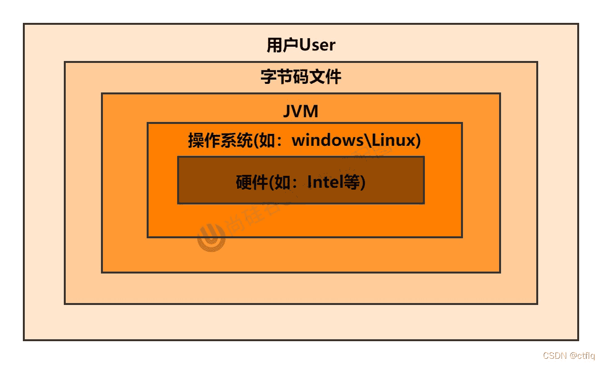​

‍

‍

## 内存概述

内存结构是 JVM 中非常重要的一部分，是非常重要的系统资源，是硬盘和 CPU 的桥梁，承载着操作系统和应用程序的实时运行，又叫运行时数据区

JVM 内存结构规定了 Java 在运行过程中内存申请、分配、管理的策略，保证了 JVM 的高效稳定运行

* Java1.8 以前的内存结构图：  
  ​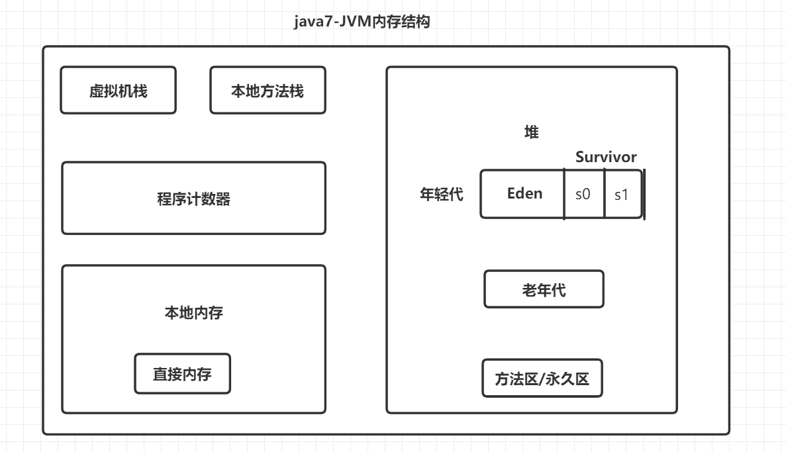​
* Java1.8 之后的内存结果图：

  ​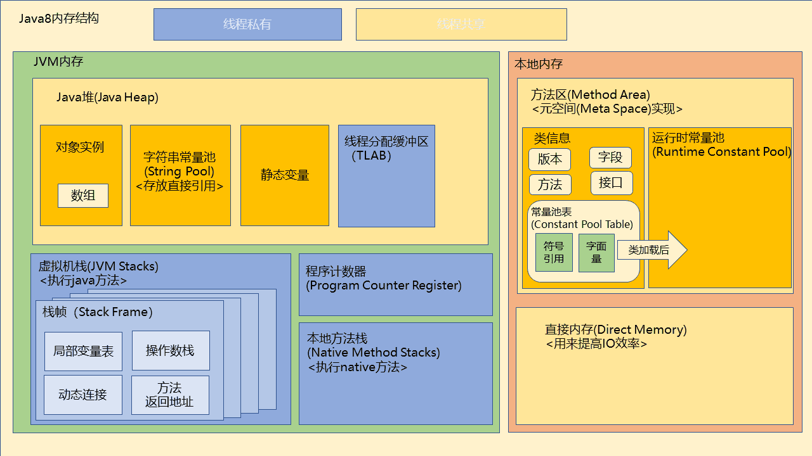​

线程运行诊断：

* 定位：jps 定位进程 ID
* jstack 进程 ID：用于打印出给定的 Java 进程 ID 或 core file 或远程调试服务的 Java 堆栈信息

常见 OOM 错误：

* java.lang.StackOverflowError
* java.lang.OutOfMemoryError：java heap space
* java.lang.OutOfMemoryError：GC overhead limit exceeded
* java.lang.OutOfMemoryError：Direct buffer memory
* java.lang.OutOfMemoryError：unable to create new native thread
* java.lang.OutOfMemoryError：Metaspace

‍

‍

## 本地内存

‍

### 基本介绍

虚拟机内存：Java 虚拟机在执行的时候会把管理的内存分配成不同的区域，受虚拟机内存大小的参数控制，当大小超过参数设置的大小时就会报 OOM

本地内存：又叫做**堆外内存**，线程共享的区域，本地内存这块区域是不会受到 JVM 的控制的，不会发生 GC；因此对于整个 Java 的执行效率是提升非常大，但是如果内存的占用超出物理内存的大小，同样也会报 OOM

本地内存概述图：

<div>

</div>

---

### 元空间

PermGen 被元空间代替，永久代的**类信息、方法、常量池**等都移动到元空间区

元空间与永久代区别：元空间不在虚拟机中，使用的本地内存，默认情况下，元空间的大小仅受本地内存限制

方法区内存溢出：

* JDK1.8 以前会导致永久代内存溢出：java.lang.OutOfMemoryError: PerGen space

  ```sh
   -XX:MaxPermSize=8m		#参数设置
  ```
* JDK1.8 以后会导致元空间内存溢出：java.lang.OutOfMemoryError: Metaspace

  ```sh
  -XX:MaxMetaspaceSize=8m	#参数设置
  ```

元空间内存溢出演示：

```java
public class Demo1_8 extends ClassLoader { // 可以用来加载类的二进制字节码
    public static void main(String[] args) {
        int j = 0;
        try {
            Demo1_8 test = new Demo1_8();
            for (int i = 0; i < 10000; i++, j++) {
                // ClassWriter 作用是生成类的二进制字节码
                ClassWriter cw = new ClassWriter(0);
                // 版本号， public， 类名, 包名, 父类， 接口
                cw.visit(Opcodes.V1_8, Opcodes.ACC_PUBLIC, "Class" + i, null, "java/lang/Object", null);
                // 返回 byte[]
                byte[] code = cw.toByteArray();
                // 执行了类的加载
                test.defineClass("Class" + i, code, 0, code.length); // Class 对象
            }
        } finally {
            System.out.println(j);
        }
    }
}
```

---

### 直接内存

直接内存是 Java 堆外、直接向系统申请的内存区间，不是虚拟机运行时数据区的一部分，也不是《Java 虚拟机规范》中定义的内存区域

直接内存详解参考：NET → NIO → 直接内存

---

‍

## JVM内存对象

‍

### 虚拟机栈

#### Java 栈

Java 虚拟机栈：Java Virtual Machine Stacks，**每个线程**运行时所需要的内存

* 每个方法被执行时，都会在虚拟机栈中创建一个栈帧 stack frame（**一个方法一个栈帧**）
* Java 虚拟机规范允许 **Java 栈的大小是动态的或者是固定不变的**
* 虚拟机栈是**每个线程私有的**，每个线程只能有一个活动栈帧，对应方法调用到执行完成的整个过程
* 每个栈由多个栈帧（Frame）组成，对应着每次方法调用时所占用的内存，每个栈帧中存储着：

  * 局部变量表：存储方法里的 Java 基本数据类型以及对象的引用
  * 动态链接：也叫指向运行时常量池的方法引用
  * 方法返回地址：方法正常退出或者异常退出的定义
  * 操作数栈或表达式栈和其他一些附加信息

  <div>  
    
  </div>

  ‍

设置栈内存大小：`-Xss size`​   `-Xss 1024k`​

* 在 JDK 1.4 中默认为 256K，而在 JDK 1.5+ 默认为 1M

虚拟机栈特点：

* 栈内存**不需要进行GC**，方法开始执行的时候会进栈，方法调用后自动弹栈，相当于清空了数据
* 栈内存分配越大越大，可用的线程数越少（内存越大，每个线程拥有的内存越大）
* 方法内的局部变量是否**线程安全**：

  * 如果方法内局部变量没有逃离方法的作用访问，它是线程安全的（逃逸分析）
  * 如果是局部变量引用了对象，并逃离方法的作用范围，需要考虑线程安全

异常：

* 栈帧过多导致栈内存溢出 （超过了栈的容量），会抛出 OutOfMemoryError 异常
* 当线程请求的栈深度超过最大值，会抛出 StackOverflowError 异常

---

#### 局部变量

局部变量表也被称之为局部变量数组或本地变量表，本质上定义为一个数字数组，主要用于存储方法参数和定义在方法体内的局部变量

* 表是建立在线程的栈上，是线程私有的数据，因此不存在数据安全问题
* 表的容量大小是在编译期确定的，保存在方法的 Code 属性的 maximum local variables 数据项中
* 表中的变量只在当前方法调用中有效，方法结束栈帧销毁，局部变量表也会随之销毁
* 表中的变量也是重要的垃圾回收根节点，只要被表中数据直接或间接引用的对象都不会被回收

局部变量表最基本的存储单元是 **slot（变量槽）** ：

* 参数值的存放总是在局部变量数组的 index0 开始，到数组长度 -1 的索引结束，JVM 为每一个 slot 都分配一个访问索引，通过索引即可访问到槽中的数据
* 存放编译期可知的各种基本数据类型（8种），引用类型（reference），returnAddress 类型的变量
* 32 位以内的类型只占一个 slot（包括 returnAddress 类型），64 位的类型（long 和 double）占两个 slot
* 局部变量表中的槽位是可以**重复利用**的，如果一个局部变量过了其作用域，那么之后申明的新的局部变量就可能会复用过期局部变量的槽位，从而达到节省资源的目的

---

#### 操作数栈

栈：可以使用数组或者链表来实现

操作数栈：在方法执行过程中，根据字节码指令，往栈中写入数据或提取数据，即入栈（push）或出栈（pop）

* 保存计算过程的中间结果，同时作为计算过程中变量临时的存储空间，是执行引擎的一个工作区
* Java 虚拟机的解释引擎是基于栈的执行引擎，其中的栈指的就是操作数栈
* 如果被调用的方法带有返回值的话，其**返回值将会被压入当前栈帧的操作数栈中**

栈顶缓存技术 ToS（Top-of-Stack Cashing）：将栈顶元素全部缓存在 CPU 的寄存器中，以此降低对内存的读/写次数，提升执行的效率

基于栈式架构的虚拟机使用的零地址指令更加紧凑，完成一项操作需要使用很多入栈和出栈指令，所以需要更多的指令分派（instruction dispatch）次数和内存读/写次数，由于操作数是存储在内存中的，因此频繁地执行内存读/写操作必然会影响执行速度，所以需要栈顶缓存技术

---

#### 动态链接

动态链接是指向运行时常量池的方法引用，涉及到栈操作已经是类加载完成，这个阶段的解析是**动态绑定**

* 为了支持当前方法的代码能够实现动态链接，每一个栈帧内部都包含一个指向运行时常量池或该栈帧所属方法的引用

  ​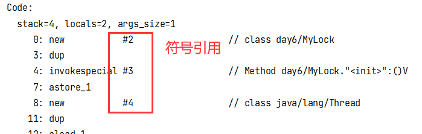​
* 在 Java 源文件被编译成的字节码文件中，所有的变量和方法引用都作为符号引用保存在 class 的常量池中

  常量池的作用：提供一些符号和常量，便于指令的识别

  ​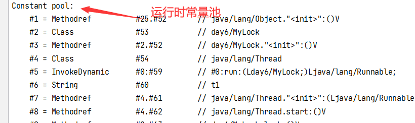​

---

#### 返回地址

Return Address：存放调用该方法的 PC 寄存器的值

方法的结束有两种方式：正常执行完成、出现未处理的异常，在方法退出后都返回到该方法被调用的位置

* 正常：调用者的 PC 计数器的值作为返回地址，即调用该方法的指令的**下一条指令的地址**
* 异常：返回地址是要通过异常表来确定

正常完成出口：执行引擎遇到任意一个方法返回的字节码指令（return），会有返回值传递给上层的方法调用者

异常完成出口：方法执行的过程中遇到了异常（Exception），并且这个异常没有在方法内进行处理，本方法的异常表中没有搜素到匹配的异常处理器，导致方法退出

两者区别：通过异常完成出口退出的不会给上层调用者产生任何的返回值

#### 附加信息

栈帧中还允许携带与 Java 虚拟机实现相关的一些附加信息，例如对程序调试提供支持的信息

---

### 本地方法栈

本地方法栈是为虚拟机执行本地方法时提供服务的

JNI：Java Native Interface，通过使用 Java 本地接口程序，可以确保代码在不同的平台上方便移植

* 不需要进行 GC，与虚拟机栈类似，也是线程私有的，有 StackOverFlowError 和 OutOfMemoryError 异常
* 虚拟机栈执行的是 Java 方法，在 HotSpot JVM 中，直接将本地方法栈和虚拟机栈合二为一
* 本地方法一般是由其他语言编写，并且被编译为基于本机硬件和操作系统的程序
* 当某个线程调用一个本地方法时，就进入了不再受虚拟机限制的世界，和虚拟机拥有同样的权限

  * 本地方法可以通过本地方法接口来**访问虚拟机内部的运行时数据区**
  * 直接从本地内存的堆中分配任意数量的内存
  * 可以直接使用本地处理器中的寄存器

原理：将本地的 C 函数（如 foo）编译到一个共享库（foo.so）中，当正在运行的 Java 程序调用 foo 时，Java 解释器利用 dlopen 接口动态链接和加载 foo.so 后再调用该函数

* dlopen 函数：Linux 系统加载和链接共享库
* dlclose 函数：卸载共享库

<div>

</div>

图片来源：https://github.com/CyC2018/CS-Notes/blob/master/notes/Java%20%E8%99%9A%E6%8B%9F%E6%9C%BA.md

---

### 程序计数器

Program Counter Register 程序计数器（寄存器）

作用：内部保存字节码的行号，用于记录正在执行的字节码指令地址（如果正在执行的是本地方法则为空）

原理：

* JVM 对于多线程是通过线程轮流切换并且分配线程执行时间，一个处理器只会处理执行一个线程
* 切换线程需要从程序计数器中来回去到当前的线程上一次执行的行号

特点：

* 是线程私有的
* **不会存在内存溢出**，是 JVM 规范中唯一一个不出现 OOM 的区域，所以这个空间不会进行 GC

Java 反编译指令：`javap -v Test.class`​

20：代表去 Constant pool 查看该地址的指令

```java
0: getstatic #20 		// PrintStream out = System.out;
3: astore_1 			// --
4: aload_1 				// out.println(1);
5: iconst_1 			// --
6: invokevirtual #26 	// --
9: aload_1 				// out.println(2);
10: iconst_2 			// --
11: invokevirtual #26 	// --
```

---

### 堆

Heap 堆：是 JVM 内存中最大的一块，由所有线程共享，由垃圾回收器管理的主要区域，堆中对象大部分都需要考虑线程安全的问题

存放哪些资源：

* 对象实例：类初始化生成的对象，**基本数据类型的数组也是对象实例**，new 创建对象都使用堆内存
* 字符串常量池：

  * 字符串常量池原本存放于方法区，JDK7 开始放置于堆中
  * 字符串常量池**存储的是 String 对象的直接引用或者对象**，是一张 string table
* 静态变量：静态变量是有 static 修饰的变量，JDK8 时从方法区迁移至堆中
* 线程分配缓冲区 Thread Local Allocation Buffer：线程私有但不影响堆的共性，可以提升对象分配的效率

设置堆内存指令：`-Xmx Size`​

内存溢出：new 出对象，循环添加字符数据，当堆中没有内存空间可分配给实例，也无法再扩展时，就会抛出 OutOfMemoryError 异常

堆内存诊断工具：（控制台命令）

1. jps：查看当前系统中有哪些 Java 进程
2. jmap：查看堆内存占用情况 `jhsdb jmap --heap --pid 进程id`​
3. jconsole：图形界面的，多功能的监测工具，可以连续监测

在 Java7 中堆内会存在**年轻代、老年代和方法区（永久代）** ：

* Young 区被划分为三部分，Eden 区和两个大小严格相同的 Survivor 区. Survivor 区某一时刻只有其中一个是被使用的，另外一个留做垃圾回收时复制对象. 在 Eden 区变满的时候，GC 就会将存活的对象移到空闲的 Survivor 区间中，根据 JVM 的策略，在经过几次垃圾回收后，仍然存活于 Survivor 的对象将被移动到 Tenured 区间
* Tenured 区主要保存生命周期长的对象，一般是一些老的对象，当一些对象在 Young 复制转移一定的次数以后，对象就会被转移到 Tenured 区
* Perm 代主要保存 Class、ClassLoader、静态变量、常量、编译后的代码，在 Java7 中堆内方法区会受到 GC 的管理

分代原因：不同对象的生命周期不同，70%-99% 的对象都是临时对象，优化 GC 性能

```java
public static void main(String[] args) {
    // 返回Java虚拟机中的堆内存总量
    long initialMemory = Runtime.getRuntime().totalMemory() / 1024 / 1024;
    // 返回Java虚拟机使用的最大堆内存量
    long maxMemory = Runtime.getRuntime().maxMemory() / 1024 / 1024;
  
    System.out.println("-Xms : " + initialMemory + "M");//-Xms : 245M
    System.out.println("-Xmx : " + maxMemory + "M");//-Xmx : 3641M
}
```

---

### 方法区

方法区：是各个线程共享的内存区域，用于存储已被虚拟机加载的类信息、常量、即时编译器编译后的代码等数据，虽然 Java 虚拟机规范把方法区描述为堆的一个逻辑部分，但是也叫 Non-Heap（非堆）

方法区是一个 JVM 规范，**永久代与元空间都是其一种实现方式**

方法区的大小不必是固定的，可以动态扩展，加载的类太多，可能导致永久代内存溢出 (OutOfMemoryError)

方法区的 GC：针对常量池的回收及对类型的卸载，比较难实现

为了**避免方法区出现 OOM**，在 JDK8 中将堆内的方法区（永久代）移动到了本地内存上，重新开辟了一块空间，叫做元空间，元空间存储类的元信息，**静态变量和字符串常量池等放入堆中**

类元信息：在类编译期间放入方法区，存放了类的基本信息，包括类的方法、参数、接口以及常量池表

常量池表（Constant Pool Table）是 Class 文件的一部分，存储了**类在编译期间生成的字面量、符号引用**，JVM 为每个已加载的类维护一个常量池

* 字面量：基本数据类型、字符串类型常量、声明为 final 的常量值等
* 符号引用：类、字段、方法、接口等的符号引用

运行时常量池是方法区的一部分

* 常量池（编译器生成的字面量和符号引用）中的数据会在类加载的加载阶段放入运行时常量池
* 类在解析阶段将这些符号引用替换成直接引用
* 除了在编译期生成的常量，还允许动态生成，例如 String 类的 intern()

---

‍

## 变量位置

变量的位置不取决于它是基本数据类型还是引用数据类型，取决于它的**声明位置**

静态内部类和其他内部类：

* **一个 class 文件只能对应一个 public 类型的类**，这个类可以有内部类，但不会生成新的 class 文件
* 静态内部类属于类本身，加载到方法区，其他内部类属于内部类的属性，加载到堆（待考证）

类变量：

* 类变量是用 static 修饰符修饰，定义在方法外的变量，随着 Java 进程产生和销毁
* 在 Java8 之前把静态变量存放于方法区，在 Java8 时存放在堆中的静态变量区

实例变量：

* 实例（成员）变量是定义在类中，没有 static 修饰的变量，随着类的实例产生和销毁，是类实例的一部分
* 在类初始化的时候，从运行时常量池取出直接引用或者值，**与初始化的对象一起放入堆中**

局部变量：

* 局部变量是定义在类的方法中的变量
* 在所在方法被调用时**放入虚拟机栈的栈帧**中，方法执行结束后从虚拟机栈中弹出，

类常量池、运行时常量池、字符串常量池有什么关系？有什么区别？

* 类常量池与运行时常量池都存储在方法区，而字符串常量池在 Jdk7 时就已经从方法区迁移到了 Java 堆中
* 在类编译过程中，会把类元信息放到方法区，类元信息的其中一部分便是类常量池，主要存放字面量和符号引用，而字面量的一部分便是文本字符
* **在类加载时将字面量和符号引用解析为直接引用存储在运行时常量池**
* 对于文本字符，会在解析时查找字符串常量池，查出这个文本字符对应的字符串对象的直接引用，将直接引用存储在运行时常量池

什么是字面量？什么是符号引用？

* 字面量：java 代码在编译过程中是无法构建引用的，字面量就是在编译时对于数据的一种表示

  ```java
  int a = 1;				//这个1便是字面量
  String b = "iloveu";	//iloveu便是字面量
  ```
* 符号引用：在编译过程中并不知道每个类的地址，因为可能这个类还没有加载，如果在一个类中引用了另一个类，无法知道它的内存地址，只能用它的类名作为符号引用，在类加载完后用这个符号引用去获取内存地址

---

‍

## 代码执行流程

‍

​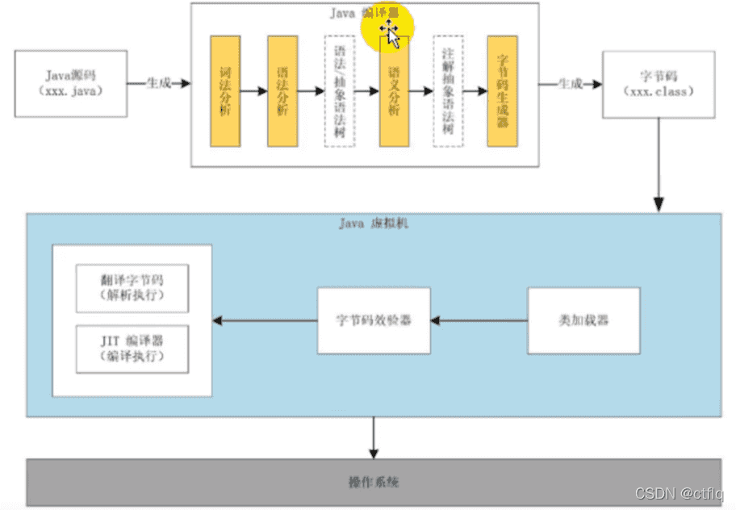​

‍

​​

‍

‍

## 架构模型

Java编译器输入的指令流基本上是一种基于栈的指令集架构, 另外一种指令集架构则是基于寄存器的指令集架构.

‍

### 基于栈的指令集架构

‍

1. 设计和实现更简单，适用于资源受限的系统；
2. 避开了寄存器的分配难题：使用零地址指令方式分配
3. 指令流中的指令大部分是零地址指令，其执行过程依赖于操作栈。指令集更小，编译器容易实现
4. 不需要硬件支持，可移植性更好，更好实现跨平台

‍

### 基于寄存器的指令级架构

‍

1. 典型的应用是x86的二进制指令集：比如传统的PC以及Android的Davlik虚拟机。
2. 指令集架构则完全依赖硬件，与硬件的耦合度高，可移植性差
3. 性能优秀和执行更高效
4. 花费更少的指令去完成一项操作
5. 在大部分情况下，基于寄存器架构的指令集往往都以一地址指令、二地址指令和三地址指令为主，而基于栈式架构的指令集却是以零地址指令为主

‍

‍

### 举例

同样执行2+3这种逻辑操作，其指令分别如下：

* **基于栈的计算流程（以Java虚拟机为例）：**

  ```
  iconst_2 //常量2入栈
  istore_1
  iconst_3 // 常量3入栈
  istore_2
  iload_1
  iload_2
  iadd //常量2/3出栈，执行相加
  istore_0 // 结果5入栈
  ```

  8个指令
* **而基于寄存器的计算流程**

  ```
  mov eax,2 //将eax寄存器的值设为1
  add eax,3 //使eax寄存器的值加3
  ```

‍

‍

‍

## 生命周期

‍

### 启动

通过**引导类加载器**（bootstrap class loader）创建一个**初始类**（initial class）来完成，这个类是由虚拟机的具体实现指定的。

对于拥有 main 函数的类就是 JVM 实例运行的起点

‍

### 执行

1. 一个运行中的Java虚拟机有着一个清晰的任务：执行Java程序
2. 程序开始执行时他才运行，程序结束时他就停止
3. **执行一个所谓的Java程序的时候，真真正正在执行的是一个叫做Java虚拟机的进程**

‍

* main() 方法是一个程序的初始起点，任何线程均可由在此处启动
* 在 JVM 内部有两种线程类型，分别为：用户线程和守护线程，**JVM 使用的是守护线程，main() 和其他线程使用的是用户线程**，守护线程会随着用户线程的结束而结束
* 执行一个 Java 程序时，真真正正在执行的是一个 **Java 虚拟机的进程**
* JVM 有两种运行模式 Server 与 Client，两种模式的区别在于：Client 模式启动速度较快，Server 模式启动较慢；但是启动进入稳定期长期运行之后 Server 模式的程序运行速度比 Client 要快很多

  Server 模式启动的 JVM 采用的是重量级的虚拟机，对程序采用了更多的优化；Client 模式启动的 JVM 采用的是轻量级的虚拟机

‍

### 退出(死亡)

**有如下的几种情况：**

1. 程序正常执行结束
2. 程序在执行过程中遇到了异常或错误而异常终止
3. 由于操作系统错误导致Java虚拟机进程终止
4. 某线程调用Runtime类或System类的exit()方法，或Runtime类的halt()方法，并且Java安全管理器也允许这次exit()或halt()操作。
5. 除此之外，JNI（Java Native Interface）规范描述了用JNI Invocation API来加载或卸载Java虚拟机时，Java虚拟机的退出情况。

‍

* 当程序中的用户线程都中止，JVM 才会退出
* 程序正常执行结束、程序异常或错误而异常终止、操作系统错误导致终止
* 线程调用 Runtime 类 halt 方法或 System 类 exit 方法，并且 Java 安全管理器允许这次 exit 或 halt 操作

‍

## JVM发展历程

具体JVM的内存结构，其实取决于其实现，不同厂商的JVM，或者同一厂商发布的不同版本，都有可能存在一定差异。主要以Oracle HotSpot VM为默认虚拟机

> 随着JVM的迭代升级，原来一些绝对的事情，在后续版本中也开始有了特例，变的不再那么绝对。

‍

‍

### Sun Classic VM

是**世界上第一款商用Java虚拟机**

这款虚拟机内部**只提供解释器，没有即时编译器**，因此效率比较低。【即时编译器会把热点代码的本地机器指令缓存起来，那么以后使用热点代码的时候，效率就比较高】

如果使用JIT编译器，就需要进行外挂。但是一旦使用了JIT编译器，JIT就会接管虚拟机的执行系统。解释器就不再工作，解释器和编译器不能配合工作。

* 我们将字节码指令翻译成机器指令也是需要花时间的，如果只使用JIT，就需要把所有字节码指令都翻译成机器指令，就会导致翻译时间过长，也就是说在程序刚启动的时候，等待时间会很长。
* 而解释器就是走到哪，解释到哪。

现在Hotspot内置了此虚拟机。

‍

‍

### Exact VM

为了解决上一个虚拟机问题,jdk1.2时,sun提供了此虚拟

Exact Memory Management：准确式内存管理

* 也可以叫Non-Conservative/Accurate Memory Management
* 虚拟机可以知道内存中某个位置的数据具体是什么类型。

具备现代高性能虚拟机的维形    

* 热点探测（寻找出热点代码进行缓存）
* 编译器与解释器混合工作模式

只在Solaris平台短暂使用，其他平台上还是classic vm，英雄气短，终被Hotspot虚拟机替换

‍

‍

### HotSpot VM

==（重点）主要介绍JVM的框架==

目前**Hotspot占有绝对的市场地位**

* 不管是现在仍在广泛使用的JDK6，还是使用比例较多的JDK8中，默认的虚拟机都是HotSpot
* Sun/oracle JDK和openJDK的默认虚拟机
* 因此本课程中默认介绍的虚拟机都是HotSpot，相关机制也主要是指HotSpot的GC机制。（比如其他两个商用虚机都没有方法区的概念）

从服务器、桌面到移动端、嵌入式都有应用。

名称中的HotSpot指的就是它的热点代码探测技术。

* 通过计数器找到最具编译价值代码，触发即时编译或栈上替换
* 通过**编译器(提高性能, 坐飞机去北京)** 与**解释器(最快准备完成开始响应, 走路去北京)** 协同工作，在最优化的程序响应时间与最佳执行性能中取得平衡

‍

‍

### JRockit

==（商用三大虚拟机之一）==

专注于服务器端应用：它可以**不太关注程序启动速度**，因此JRockit内部不包含解析器实现，全部代码都靠即时编译器编译后执行。

大量的行业基准测试显示，JRockit JVM是世界上最快的JVM：使用JRockit产品，客户已经体验到了显著的性能提高（一些超过了70%）和硬件成本的减少（达50%）。

优势：全面的Java运行时解决方案组合

* JRockit面向延迟敏感型应用的解决方案JRockit Real Time提供以毫秒或微秒级的JVM响应时间，适合财务、军事指挥、电信网络的需要
* Mission Control服务套件，它是一组以极低的开销来监控、管理和分析生产环境中的应用程序的工具。

‍

‍

### J9

（商用三大虚拟机之一）

1. 全称：IBM Technology for Java Virtual Machine，简称IT4J，内部代号：J9
2. 市场定位与HotSpot接近，服务器端、桌面应用、嵌入式等多用途VM广泛用于IBM的各种Java产品。
3. 目前，有影响力的三大商用虚拟机之一，也号称是世界上最快的Java虚拟机。

‍

### 余下

KVM和CDC/CLDC Hotspot, Azul VM, Liquid VM, Apache Harmony, Microsoft JVM, TaobaoJVM....

‍

‍

### 手写虚拟机

> 如果自己想手写一个Java虚拟机的话，主要考虑哪些结构呢？
>
> 1. 类加载器
> 2. 执行引擎

‍

注意：方法区只有HotSpot虚拟机有，J9，JRockit都没有

‍

‍

# 类加载子系统

‍

类加载器子系统负责从文件系统或者网络中加载Class文件，class文件在文件开头有特定的文件标识(Cafe宝贝); ClassLoader只负责class文件的加载，至于它是否可以运行，则由Execution Engine决定

加载的类信息存放于一块称为**方法区**的内存空间。除了类的信息外，方法区中还会存放运行时常量池信息，可能还包括字符串字面量和数字常量（这部分常量信息是Class文件中常量池部分的内存映射）

‍

## 对象访存

‍

### 存储结构

一个 Java 对象内存中存储为三部分：对象头（Header）、实例数据（Instance Data）和对齐填充 （Padding）

对象头：

* 普通对象：分为两部分

  * **Mark Word**：用于存储对象自身的运行时数据， 如哈希码（HashCode）、GC 分代年龄、锁状态标志、线程持有的锁、偏向线程ID、偏向时间戳等等

    ```ruby
    hash(25) + age(4) + lock(3) = 32bit					#32位系统
    unused(25+1) + hash(31) + age(4) + lock(3) = 64bit	#64位系统
    ```
  * **Klass Word**：类型指针，**指向该对象的 Class 类对象的指针**，虚拟机通过这个指针来确定这个对象是哪个类的实例；在 64 位系统中，开启指针压缩（-XX:+UseCompressedOops）或者 JVM 堆的最大值小于 32G，这个指针也是 4byte，否则是 8byte（就是 **Java 中的一个引用的大小**）

  ```ruby
  |-----------------------------------------------------|
  | 				  Object Header (64 bits) 			  |
  |---------------------------|-------------------------|
  | 	 Mark Word (32 bits)	|  Klass Word (32 bits)   |
  |---------------------------|-------------------------|
  ```
* 数组对象：如果对象是一个数组，那在对象头中还有一块数据用于记录数组长度（12 字节）

  ```ruby
  |-------------------------------------------------------------------------------|
  | 						  Object Header (96 bits) 							    |
  |-----------------------|-----------------------------|-------------------------|
  |  Mark Word(32bits)    | 	  Klass Word(32bits) 	  |   array length(32bits)  |
  |-----------------------|-----------------------------|-------------------------|
  ```

‍

实例数据：实例数据部分是对象真正存储的有效信息，也是在程序代码中所定义的各种类型的字段内容，无论是从父类继承下来的，还是在子类中定义的，都需要记录起来

对齐填充：Padding 起占位符的作用. 64 位系统，由于 HotSpot VM 的自动内存管理系统要求**对象起始地址必须是 8 字节的整数倍**，就是对象的大小必须是 8 字节的整数倍，而对象头部分正好是 8 字节的倍数（1 倍或者 2 倍），因此当对象实例数据部分没有对齐时，就需要通过对齐填充来补全

‍

32 位系统：

* 一个 int 在 java 中占据 4byte，所以 Integer 的大小为：

  ```java
  private final int value;
  ```

  ```ruby
  # 需要补位4byte
  4(Mark Word) + 4(Klass Word) + 4(data) + 4(Padding) = 16byte
  ```
* ​`int[] arr = new int[10]`​

  ```ruby
  # 由于需要8位对齐，所以最终大小为56byte
  4(Mark Word) + 4(Klass Word) + 4(length) + 4*10(10个int大小) + 4(Padding) = 56sbyte
  ```

‍

### 实际大小

浅堆（Shallow Heap）：**对象本身占用的内存，不包括内部引用对象的大小**，32 位系统中一个对象引用占 4 个字节，每个对象头占用 8 个字节，根据堆快照格式不同，对象的大小会同 8 字节进行对齐

JDK7 中的 String：2个 int 值共占 8 字节，value 对象引用占用 4 字节，对象头 8 字节，对齐后占 24 字节，为 String 对象的浅堆大小，与 value 实际取值无关，无论字符串长度如何，浅堆大小始终是 24 字节

```java
private final char value[];
private int hash;
private int hash32;
```

保留集（Retained Set）：对象 A 的保留集指当对象 A 被垃圾回收后，可以被释放的所有的对象集合（包括 A 本身），所以对象 A 的保留集就是只能通过对象 A 被直接或间接访问到的所有对象的集合，就是仅被对象 A 所持有的对象的集合

深堆（Retained Heap）：指对象的保留集中所有的对象的浅堆大小之和，一个对象的深堆指只能通过该对象访问到的（直接或间接）所有对象的浅堆之和，即对象被回收后，可以释放的真实空间

对象的实际大小：一个对象所能触及的所有对象的浅堆大小之和，也就是通常意义上我们说的对象大小

下图显示了一个简单的对象引用关系图，对象 A 引用了 C 和 D，对象 B 引用了 C 和 E. 那么对象 A 的浅堆大小只是 A 本身，**A 的实际大小为 A、C、D 三者之和**，A 的深堆大小为 A 与 D 之和，由于对象 C 还可以通过对象 B 访问到 C，因此 C 不在对象 A 的深堆范围内

<div>

</div>

内存分析工具 MAT 提供了一种叫支配树的对象图，体现了对象实例间的支配关系

‍

基本性质：

* 对象 A 的子树（所有被对象 A 支配的对象集合）表示对象 A 的保留集（retained set），即深堆
* 如果对象 A 支配对象 B，那么对象 A 的直接支配者也支配对象 B
* 支配树的边与对象引用图的边不直接对应

‍

左图表示对象引用图，右图表示左图所对应的支配树：

​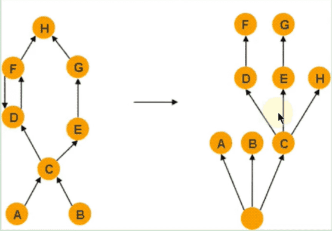​

比如：对象 F 与对象 D 相互引用，因为到对象 F 的所有路径必然经过对象 D，因此对象 D 是对象 F 的直接支配者

‍

### 节约内存

* 尽量使用基本数据类型
* 满足容量前提下，尽量用小字段
* 尽量用数组，少用集合，数组中是可以使用基本类型的，但是集合中只能放包装类型，如果需要使用集合，推荐比较节约内存的集合工具：fastutil

  一个 ArrayList 集合，如果里面放了 10 个数字，占用多少内存：

  ```java
  private transient Object[] elementData;
  private int size;
  ```

  Mark Word 占 4byte，Klass Word 占 4byte，一个 int 字段占 4byte，elementData 数组占 12byte，数组中 10 个 Integer 对象占 10×16，所以整个集合空间大小为 184byte（深堆）
* 时间用 long/int 表示，不用 Date 或者 String

‍

### 对象访问

‍

JVM 是通过**栈帧中的对象引用**访问到其内部的对象实例：

* 句柄访问：Java 堆中会划分出一块内存来作为句柄池，reference 中存储的就是对象的句柄地址，而句柄中包含了对象实例数据和类型数据各自的具体地址信息

  优点：reference 中存储的是稳定的句柄地址，在对象被移动（垃圾收集）时只会改变句柄中的实例数据指针，而 reference 本身不需要被修改

  ​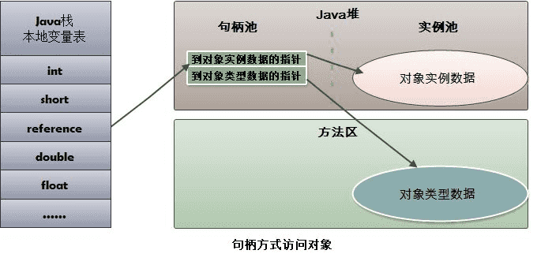​
* 直接指针（HotSpot 采用）：Java 堆对象的布局必须考虑如何放置访问类型数据的相关信息，reference 中直接存储的对象地址

  优点：速度更快，**节省了一次指针定位的时间开销**

  缺点：对象被移动时（如进行 GC 后的内存重新排列），对象的 reference 也需要同步更新

  ​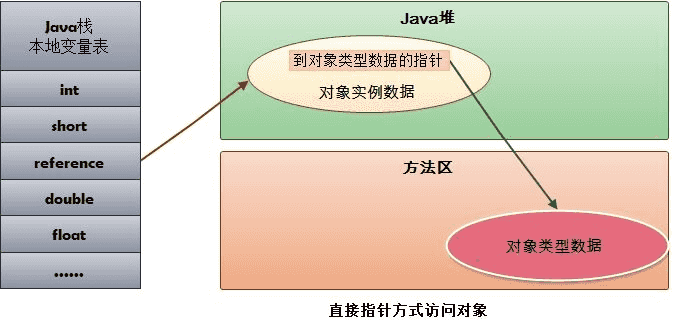​

‍

‍

## 对象创建

‍

### 生命周期

在 Java 中，对象的生命周期包括以下几个阶段：

1. 创建阶段 (Created)：
2. 应用阶段 (In Use)：对象至少被一个强引用持有着
3. 不可见阶段 (Invisible)：程序的执行已经超出了该对象的作用域，不再持有该对象的任何强引用
4. 不可达阶段 (Unreachable)：该对象不再被任何强引用所持有，包括 GC Root 的强引用
5. 收集阶段 (Collected)：垃圾回收器对该对象的内存空间重新分配做好准备，该对象如果重写了 finalize() 方法，则会去执行该方法
6. 终结阶段 (Finalized)：等待垃圾回收器对该对象空间进行回收，当对象执行完 finalize() 方法后仍然处于不可达状态时进入该阶段
7. 对象空间重分配阶段 (De-allocated)：垃圾回收器对该对象的所占用的内存空间进行回收或者再分配

‍

### 创建时机

类在第一次实例化加载一次，后续实例化不再加载，引用第一次加载的类

Java 对象创建时机：

1. 使用 new 关键字创建对象：由执行类实例创建表达式而引起的对象创建
2. 使用 Class 类的 newInstance 方法（反射机制）
3. 使用 Constructor 类的 newInstance 方法（反射机制）

    ```java
    public class Student {
        private int id;
        public Student(Integer id) {
            this.id = id;
        }
        public static void main(String[] args) throws Exception {
            Constructor<Student> c = Student.class.getConstructor(Integer.class);
            Student stu = c.newInstance(123);
        }
    }
    ```

    使用 newInstance 方法的这两种方式创建对象使用的就是 Java 的反射机制，事实上 Class 的 newInstance 方法内部调用的也是 Constructor 的 newInstance 方法
4. 使用 Clone 方法创建对象：用 clone 方法创建对象的过程中并不会调用任何构造函数，要想使用 clone 方法，我们就必须先实现 Cloneable 接口并实现其定义的 clone 方法
5. 使用（反）序列化机制创建对象：当反序列化一个对象时，JVM 会创建一个**单独的对象**，在此过程中，JVM 并不会调用任何构造函数，为了反序列化一个对象，需要让类实现 Serializable 接口

从 Java 虚拟机层面看，除了使用 new 关键字创建对象的方式外，其他方式全部都是通过转变为 invokevirtual 指令直接创建对象的

‍

### 创建过程

创建对象的过程：

1. 判断对象对应的类是否加载、链接、初始化
2. 为对象分配内存：指针碰撞、空闲链表. 当一个对象被创建时，虚拟机就会为其分配内存来存放对象的实例变量及其从父类继承过来的实例变量，即使从**隐藏变量**也会被分配空间（继承部分解释了为什么会隐藏）
3. 处理并发安全问题：

    * 采用 CAS 配上自旋保证更新的原子性
    * 每个线程预先分配一块 TLAB
4. 初始化分配的空间：虚拟机将分配到的内存空间都初始化为零值（不包括对象头），保证对象实例字段在不赋值时可以直接使用，程序能访问到这些字段的数据类型所对应的零值
5. 设置对象的对象头：将对象的所属类（类的元数据信息）、对象的 HashCode、对象的 GC 信息、锁信息等数据存储在对象头中
6. 执行 init 方法进行实例化：实例变量初始化、实例代码块初始化 、构造函数初始化

    * 实例变量初始化与实例代码块初始化：

      对实例变量直接赋值或者使用实例代码块赋值，**编译器会将其中的代码放到类的构造函数中去**，并且这些代码会被放在对超类构造函数的调用语句之后（Java 要求构造函数的第一条语句必须是超类构造函数的调用语句），构造函数本身的代码之前
    * 构造函数初始化：

      **Java 要求在实例化类之前，必须先实例化其超类，以保证所创建实例的完整性**，在准备实例化一个类的对象前，首先准备实例化该类的父类，如果该类的父类还有父类，那么准备实例化该类的父类的父类，依次递归直到递归到 Object 类. 然后从 Object 类依次对以下各类进行实例化，初始化父类中的变量和执行构造函数

‍

### 承上启下

1. 一个实例变量在对象初始化的过程中会被赋值几次？一个实例变量最多可以被初始化 4 次

    JVM 在为一个对象分配完内存之后，会给每一个实例变量赋予默认值，这个实例变量被第一次赋值；在声明实例变量的同时对其进行了赋值操作，那么这个实例变量就被第二次赋值；在实例代码块中又对变量做了初始化操作，那么这个实例变量就被第三次赋值；；在构造函数中也对变量做了初始化操作，那么这个实例变量就被第四次赋值
2. 类的初始化过程与类的实例化过程的异同？

    类的初始化是指类加载过程中的初始化阶段对类变量按照代码进行赋值的过程；类的实例化是指在类完全加载到内存中后创建对象的过程（类的实例化触发了类的初始化，先初始化才能实例化）
3. 假如一个类还未加载到内存中，那么在创建一个该类的实例时，具体过程是怎样的？（**经典案例**）

    ```java
    public class StaticTest {
        public static void main(String[] args) {
            staticFunction();//调用静态方法，触发初始化
        }

        static StaticTest st = new StaticTest();

        static {   //静态代码块
            System.out.println("1");
        }

        {       // 实例代码块
            System.out.println("2");
        }

        StaticTest() {    // 实例构造器
            System.out.println("3");
            System.out.println("a=" + a + ",b=" + b);
        }

        public static void staticFunction() {   // 静态方法
            System.out.println("4");
        }

        int a = 110;    		// 实例变量
        static int b = 112;     // 静态变量
    }/* Output: 
            2
            3
            a=110,b=0
            1
            4
     *///:~
    ```

    ​`static StaticTest st = new StaticTest();`​：

    * 实例实例化不一定要在类初始化结束之后才开始
    * 在同一个类加载器下，一个类型只会被初始化一次. 所以一旦开始初始化一个类，无论是否完成后续都不会再重新触发该类型的初始化阶段了（只考虑在同一个类加载器下的情形）. 因此在实例化上述程序中的 st 变量时，**实际上是把实例化嵌入到了静态初始化流程中，并且在上面的程序中，嵌入到了静态初始化的起始位置**，这就导致了实例初始化完全发生在静态初始化之前，这也是导致 a 为 110，b 为 0 的原因

    代码等价于：

    ```java
    public class StaticTest {
        <clinit>(){
            a = 110;    // 实例变量
            System.out.println("2");	// 实例代码块
            System.out.println("3");	// 实例构造器中代码的执行
            System.out.println("a=" + a + ",b=" + b);  // 实例构造器中代码的执行
            类变量st被初始化
            System.out.println("1");	//静态代码块
            类变量b被初始化为112
        }
    }
    ```

‍

‍

## 类加载ClassLoader角色

* class file存在于本地硬盘上，可以理解为设计师画在纸上的模板，而最终这个模板在执行的时候是要加载到JVM当中来根据这个文件实例化出n个一模一样的实例。
* class file加载到JVM中，被称为DNA元数据模板（内存中的Class），放在方法区。
* 在.class文件–>JVM–>最终成为元数据模板，此过程就要一个运输工具（类装载器Class Loader），扮演一个快递员的角色。

‍

‍

## 类加载过程

### 生命周期

类是在运行期间**第一次使用时动态加载**的（不使用不加载），而不是一次性加载所有类，因为一次性加载会占用很多的内存，加载的类信息存放于一块成为方法区的内存空间

​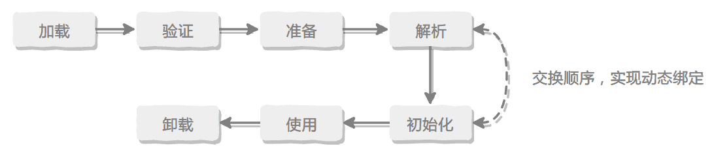​

包括 7 个阶段：

* 加载（Loading）
* 链接：验证（Verification）、准备（Preparation）、解析（Resolution）
* 初始化（Initialization）
* 使用（Using）
* 卸载（Unloading）

‍

​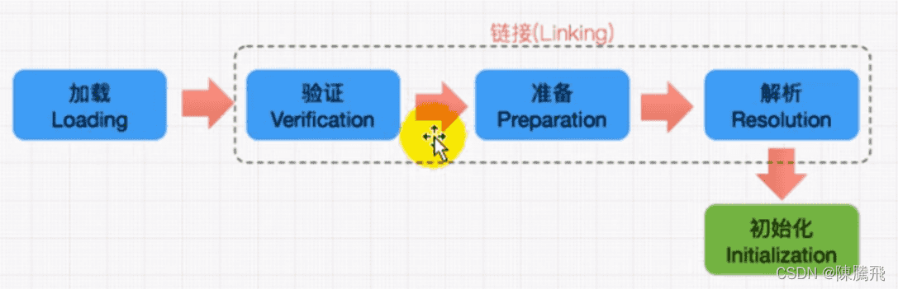​

```java
public class HelloLoader {

    public static void main(String[] args) {
        System.out.println("谢谢ClassLoader加载我....");
        System.out.println("你的大恩大德，我下辈子再报！");
    }
}
```

加载过程

* 执行 main() 方法（静态方法）就需要先加载main方法所在类 HelloLoader
* 加载成功，则进行链接、初始化等操作。完成后调用 HelloLoader 类中的静态方法 main
* 加载失败则抛出异常

‍

‍

字节码文件 -> (三类类加载器)加载<sup>（Loading）</sup> ->(验证<sup>（Verification）</sup> -> 准备<sup>（Preparation）</sup> -> 解析<sup>（Resolution）</sup>)链接<sup>（Linking）</sup> -> 初始化<sup>（Initialization）</sup>

‍

‍

### 加载阶段

‍

1. 通过一个类的全限定名获取定义此类的二进制字节流
2. 将这个字节流所代表的静态存储结构转化为方法区的运行时数据结构
3. **在内存中生成一个代表这个类的java.lang.Class对象**，作为方法区这个类的各种数据的访问入口
4. 类将.class文件加载至元空间后，会在堆中创建一个java.lang.Class对象，用来封装类位于方法区内的数据结构。该Class对象是在加载类的过程中创建的，每个类都对应有一个Class类型的对象

‍

‍

**加载class文件的方式：**

1. 从本地系统中直接加载
2. 通过网络获取，典型场景：Web Applet
3. 从zip压缩包中读取，成为日后jar、war格式的基础
4. 运行时计算生成，使用最多的是：动态代理技术
5. 由其他文件生成，典型场景：JSP应用从专有数据库中提取.class文件，比较少见
6. 从加密文件中获取，典型的防Class文件被反编译的保护措施

‍

---

‍

加载是类加载的其中一个阶段，注意不要混淆

加载过程完成以下三件事：

* 通过类的完全限定名称获取定义该类的二进制字节流（二进制字节码）
* 将该字节流表示的静态存储结构转换为方法区的运行时存储结构（Java 类模型）
* **将字节码文件加载至方法区后，在堆中生成一个代表该类的 Class 对象，作为该类在方法区中的各种数据的访问入口**

其中二进制字节流可以从以下方式中获取：

* 从 ZIP 包读取，成为 JAR、EAR、WAR 格式的基础
* 从网络中获取，最典型的应用是 Applet
* 由其他文件生成，例如由 JSP 文件生成对应的 Class 类
* 运行时计算生成，例如动态代理技术，在 java.lang.reflect.Proxy 使用 ProxyGenerator.generateProxyClass 生成字节码

方法区内部采用 C++ 的 instanceKlass 描述 Java 类的数据结构：

* ​`_java_mirror`​ 即 Java 的类镜像，例如对 String 来说就是 String.class，作用是把 class 暴露给 Java 使用
* ​`_super`​ 即父类、`_fields`​ 即成员变量、`_methods`​ 即方法、`_constants`​ 即常量池、`_class_loader`​ 即类加载器、`_vtable`​ **虚方法表**、`_itable`​ 接口方法表

‍

加载过程：

* 如果这个类还有父类没有加载，先加载父类
* 加载和链接可能是交替运行的
* Class 对象和 _java_mirror 相互持有对方的地址，堆中对象通过 instanceKlass 和元空间进行交互

<div>

</div>

创建数组类有些特殊，因为数组类本身并不是由类加载器负责创建，而是由 JVM 在运行时根据需要而直接创建的，但数组的元素类型仍然需要依靠类加载器去创建，创建数组类的过程：

* 如果数组的元素类型是引用类型，那么遵循定义的加载过程递归加载和创建数组的元素类型
* JVM 使用指定的元素类型和数组维度来创建新的数组类
* **基本数据类型由启动类加载器加载**

‍

### 链接阶段

链接分为三个子阶段：验证 -> 准备 -> 解析

‍

‍

#### 验证(Verify)

目的在于确保Class文件的字节流中包含信息符合当前虚拟机要求，保证被加载类的正确性，不会危害虚拟机自身安全

主要包括四种验证，文件格式验证，元数据验证，字节码验证，符号引用验证。

格式检查: 是否以魔术oxCAFEBABE开头,主版本和副版本是否在当前Java虚拟机的支持范围内,数据中每一项是否都拥有正确的长度等等。

‍

​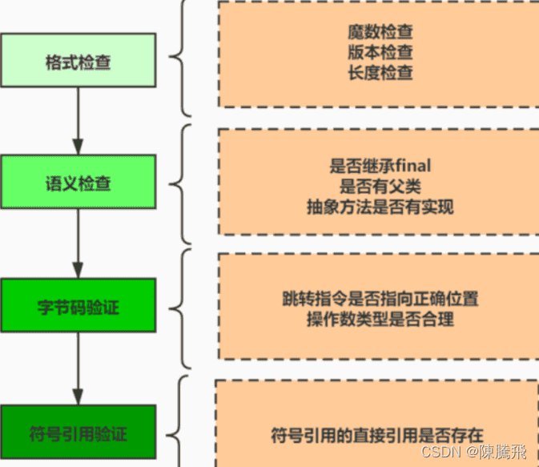​

‍

‍

主要包括**四种验证**：

* 文件格式验证
* 语义检查，但凡在语义上不符合规范的，虚拟机不会给予验证通过

  * 是否所有的类都有父类的存在（除了 Object 外，其他类都应该有父类）
  * 是否一些被定义为 final 的方法或者类被重写或继承了
  * 非抽象类是否实现了所有抽象方法或者接口方法
  * 是否存在不兼容的方法
* 字节码验证，试图通过对字节码流的分析，判断字节码是否可以被正确地执行

  * 在字节码的执行过程中，是否会跳转到一条不存在的指令
  * 函数的调用是否传递了正确类型的参数
  * 变量的赋值是不是给了正确的数据类型
  * 栈映射帧（StackMapTable）在这个阶段用于检测在特定的字节码处，其局部变量表和操作数栈是否有着正确的数据类型
* 符号引用验证，Class 文件在其常量池会通过字符串记录将要使用的其他类或者方法

‍

#### 准备(Prepare)

为类变量（static变量）分配内存并且设置该类变量的默认初始值，即零值，使用的是方法区的内存：

这里不包含用final修饰的static，因为final在编译的时候就会分配好了默认值，准备阶段会显式初始化

注意：这里不会为实例变量分配初始化，类变量会分配在方法区中，而实例变量是会随着对象一起分配到Java堆中，类加载发生在所有实例化操作之前，并且类加载只进行一次，实例化可以进行多次

‍

* static 变量分配空间和赋值是两个步骤：**分配空间在准备阶段完成，赋值在初始化阶段完成**
* 如果 static 变量是 final 的基本类型以及字符串常量，那么编译阶段值（方法区）就确定了，准备阶段会显式初始化
* 如果 static 变量是 final 的，但属于引用类型或者构造器方法的字符串，赋值在初始化阶段完成

实例：

* 初始值一般为 0 值，例如下面的类变量 value 被初始化为 0 而不是 123：

  ```java
  public static int value = 123;
  ```
* 常量 value 被初始化为 123 而不是 0：

  ```java
  public static final int value = 123;
  ```
* Java 并不支持 boolean 类型，对于 boolean 类型，内部实现是 int，由于 int 的默认值是 0，故 boolean 的默认值就是 false

‍

**举例**

代码：变量a在准备阶段会赋初始值，但不是1，而是0，在初始化阶段会被赋值为 1

```java
public class HelloApp {
    private static int a = 1;//prepare：a = 0 ---> initial : a = 1


    public static void main(String[] args) {
        System.out.println(a);
    }
}
```

‍

#### 解析(Resolve)

**将常量池内的符号引用转换为直接引用的过程**

事实上，解析操作往往会伴随着JVM在执行完初始化之后再执行

* 符号引用：一组符号来描述目标，可以是任何字面量，属于编译原理方面的概念，如：包括类和接口的全限名、字段的名称和描述符、方法的名称和**方法描述符**（因为类还没有加载完，很多方法是找不到的）
* 直接引用：直接指向目标的指针、相对偏移量或一个间接定位到目标的句柄，如果有了直接引用，那说明引用的目标必定已经存在于内存之中

例如：在 `com.demo.Solution`​ 类中引用了 `com.test.Quest`​，把 `com.test.Quest`​ 作为符号引用存进类常量池，在类加载完后，**用这个符号引用去方法区找这个类的内存地址**

解析动作主要针对类或接口、字段、类方法、接口方法、方法类型等

* 在类加载阶段解析的是非虚方法，静态绑定
* 也可以在初始化阶段之后再开始解析，这是为了支持 Java 的**动态绑定**
* 通过解析操作，符号引用就可以转变为目标方法在类的虚方法表中的位置，从而使得方法被成功调用

```java
public class Load2 {
    public static void main(String[] args) throws Exception{
    ClassLoader classloader = Load2.class.getClassLoader();
    // cloadClass 加载类方法不会导致类的解析和初始化，也不会加载D
    Class<?> c = classloader.loadClass("cn.jvm.t3.load.C");
  
    // new C();会导致类的解析和初始化，从而解析初始化D
    System.in.read();
    }
}
class C {
	D d = new D();
}
class D {
}
```

‍

### 初始化阶段

* 为类变量赋予正确的初始化值。
* 初始化阶段就是执行类构造器clinit()的过程。

‍

初始化阶段才真正开始执行类中定义的 Java 程序代码，在准备阶段，类变量已经赋过一次系统要求的初始值；在初始化阶段，通过程序制定的计划去初始化类变量和其它资源，执行 <clinit>

在编译生成 class 文件时，编译器会产生两个方法加于 class 文件中，一个是类的初始化方法 clinit，另一个是实例的初始化方法 init

类构造器 <clinit>() 与实例构造器 <init>() 不同，它不需要程序员进行显式调用，在一个类的生命周期中，类构造器最多被虚拟机**调用一次**，而实例构造器则会被虚拟机调用多次，只要程序员创建对象

类在第一次实例化加载一次，把 class 读入内存，后续实例化不再加载，引用第一次加载的类

‍

#### clinit

<clinit>()：类构造器，由编译器自动收集类中**所有类变量的赋值动作和静态语句块**中的语句合并产生的

作用：是在类加载过程中的初始化阶段进行静态变量初始化和执行静态代码块

* 如果类中没有静态变量或静态代码块，那么 clinit 方法将不会被生成
* clinit 方法只执行一次，在执行 clinit 方法时，必须先执行父类的clinit方法
* static 变量的赋值操作和静态代码块的合并顺序由源文件中出现的顺序决定
* static 不加 final 的变量都在初始化环节赋值

**线程安全**问题：

* 虚拟机会保证一个类的 <clinit>() 方法在多线程环境下被正确的加锁和同步，如果多个线程同时初始化一个类，只会有一个线程执行这个类的 <clinit>() 方法，其它线程都阻塞等待，直到活动线程执行 <clinit>() 方法完毕
* 如果在一个类的 <clinit>() 方法中有耗时的操作，就可能造成多个线程阻塞，在实际过程中此种阻塞很隐蔽

特别注意：静态语句块只能访问到定义在它之前的类变量，定义在它之后的类变量只能赋值，不能访问

```java
public class Test {
    static {
        //i = 0;                // 给变量赋值可以正常编译通过
        System.out.print(i);  	// 这句编译器会提示“非法向前引用”
    }
    static int i = 1;
}
```

接口中不可以使用静态语句块，但仍然有类变量初始化的赋值操作，因此接口与类一样都会生成 <clinit>() 方法，两者不同的是：

* 在初始化一个接口时，并不会先初始化它的父接口，所以执行接口的 <clinit>() 方法不需要先执行父接口的 <clinit>() 方法
* 在初始化一个类时，不会先初始化所实现的接口，所以接口的实现类在初始化时不会执行接口的 <clinit>() 方法
* 只有当父接口中定义的变量使用时，父接口才会初始化

‍

当我们代码中包含static变量的时候，就会有clinit方法

‍

​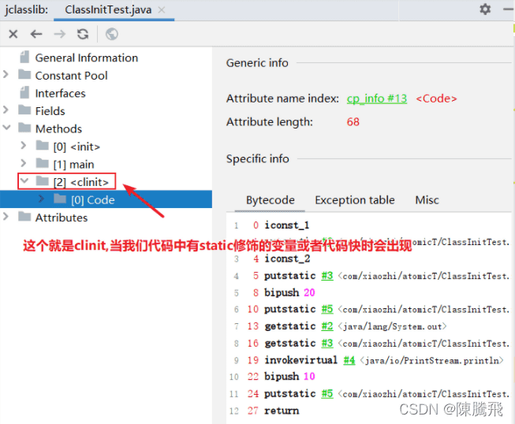​

‍

初始化阶段就是执行类构造器方法`<clinit>()`​的过程

* 此方法不需定义，是javac编译器自动收集类中的所有**类变量**的赋值动作和静态代码块中的语句合并而来。也就是说，当我们代码中包含static变量的时候，就会有clinit方法
* ​`<clinit>()`​方法中的指令按语句在源文件中出现的顺序执行
* ​`<clinit>()`​不同于类的构造器。（关联：构造器是虚拟机视角下的`<init>()`​）
* 若该类具有父类，JVM会保证子类的`<clinit>()`​执行前，父类的`<clinit>()`​已经执行完毕
* 虚拟机必须保证一个类的`<clinit>()`​方法在多线程下被同步加锁

Java编译器并不会为所有的类都产生clinit()初始化方法。

```java
一个类中并没有声明任何的类变量,也没有静态代码块时
一个类中声明类变量,但是没有明确使用类变量的初始化语句以及静态代码块来执行初始化操作时
一个类中包含static final修饰的基本数据类型的字段,这些类字段初始化语句采用编译时常量表达式 (如果这个static final 不是通过方法或者构造器,则在链接阶段)
```

‍

#### 类的初始化时机

1. 创建类的实例
2. 访问某个类或接口的静态变量，或者对该静态变量赋值
3. 调用类的静态方法
4. 反射（比如：Class.forName(“com.atguigu.Test”)）
5. 初始化一个类的子类
6. Java虚拟机启动时被标明为启动类的类
7. JDK7开始提供的动态语言支持：java.lang.invoke.MethodHandle实例的解析结果REF_getStatic、REF putStatic、REF_invokeStatic句柄对应的类没有初始化，则初始化

除了以上七种情况，其他使用Java类的方式都被看作是**对类的被动使用**，都不会导致类的初始化，即不会执行初始化阶段（不会调用 clinit() 方法和 init() 方法）

‍

类的初始化是懒惰的，只有在首次使用时才会被装载，JVM 不会无条件地装载 Class 类型，Java 虚拟机规定，一个类或接口在初次使用前，必须要进行初始化

**主动引用**：虚拟机规范中并没有强制约束何时进行加载，但是规范严格规定了有且只有下列情况必须对类进行初始化（加载、验证、准备都会发生）：

* 当创建一个类的实例时，使用 new 关键字，或者通过反射、克隆、反序列化（前文讲述的对象的创建时机）
* 当调用类的静态方法或访问静态字段时，遇到 getstatic、putstatic、invokestatic 这三条字节码指令，如果类没有进行过初始化，则必须先触发其初始化

  * getstatic：程序访问类的静态变量（不是静态常量，常量会被加载到运行时常量池）
  * putstatic：程序给类的静态变量赋值
  * invokestatic ：调用一个类的静态方法
* 使用 java.lang.reflect 包的方法对类进行反射调用时，如果类没有进行初始化，则需要先触发其初始化
* 当初始化一个类的时候，如果发现其父类还没有进行过初始化，则需要先触发其父类的初始化，但这条规则并**不适用于接口**
* 当虚拟机启动时，需要指定一个要执行的主类（包含 main() 方法的那个类），虚拟机会先初始化这个主类
* MethodHandle 和 VarHandle 可以看作是轻量级的反射调用机制，而要想使用这两个调用， 就必须先使用 findStaticVarHandle 来初始化要调用的类
* 补充：当一个接口中定义了 JDK8 新加入的默认方法（被 default 关键字修饰的接口方法）时，如果有这个接口的实现类发生了初始化，那该接口要在其之前被初始化

**被动引用**：所有引用类的方式都不会触发初始化，称为被动引用

* 通过子类引用父类的静态字段，不会导致子类初始化，只会触发父类的初始化
* 通过数组定义来引用类，不会触发此类的初始化. 该过程会对数组类进行初始化，数组类是一个由虚拟机自动生成的、直接继承自 Object 的子类，其中包含了数组的属性和方法
* 常量（final 修饰）在编译阶段会存入调用类的常量池中，本质上没有直接引用到定义常量的类，因此不会触发定义常量的类的初始化
* 调用 ClassLoader 类的 loadClass() 方法加载一个类，并不是对类的主动使用，不会导致类的初始化

‍

#### init

init 指的是实例构造器，主要作用是在类实例化过程中执行，执行内容包括成员变量初始化和代码块的执行

实例化即调用 <init>()V ，虚拟机会保证这个类的构造方法的线程安全，先为实例变量分配内存空间，再执行赋默认值，然后根据源码中的顺序执行赋初值或代码块，没有成员变量初始化和代码块则不会执行

类实例化过程：**父类的类构造器&lt;clinit&gt;() -&gt; 子类的类构造器&lt;clinit&gt;() -&gt; 父类的成员变量和实例代码块 -&gt; 父类的构造函数 -&gt; 子类的成员变量和实例代码块 -&gt; 子类的构造函数**

new 关键字会创建对象并复制 dup 一个对象引用，一个调用 <init> 方法，另一个用来赋值给接收者

‍

### 卸载阶段

时机：执行了 System.exit() 方法，程序正常执行结束，程序在执行过程中遇到了异常或错误而异常终止，由于操作系统出现错误而导致Java 虚拟机进程终止

卸载类即该类的 **Class 对象被 GC**，卸载类需要满足3个要求:

1. 该类的所有的实例对象都已被 GC，也就是说堆不存在该类的实例对象
2. 该类没有在其他任何地方被引用
3. 该类的类加载器的实例已被 GC，一般是可替换类加载器的场景，如 OSGi、JSP 的重加载等，很难达成

在 JVM 生命周期类，由 JVM 自带的类加载器加载的类是不会被卸载的，自定义的类加载器加载的类是可能被卸载. 因为 JVM 会始终引用启动、扩展、系统类加载器，这些类加载器始终引用它们所加载的类，这些类始终是可及的

‍

## 类加载概念

类加载方式：

* 隐式加载：不直接在代码中调用 ClassLoader 的方法加载类对象

  * 创建类对象、使用类的静态域、创建子类对象、使用子类的静态域
  * 在 JVM 启动时，通过三大类加载器加载 class
* 显式加载：

  * ClassLoader.loadClass(className)：只加载和连接，**不会进行初始化**
  * Class.forName(String name, boolean initialize, ClassLoader loader)：使用 loader 进行加载和连接，根据参数 initialize 决定是否初始化

类的唯一性：

* 在 JVM 中表示两个 class 对象判断为同一个类存在的两个必要条件：

  * 类的完整类名必须一致，包括包名
  * 加载这个类的 ClassLoader（指 ClassLoader 实例对象）必须相同
* 这里的相等，包括类的 Class 对象的 equals() 方法、isAssignableFrom() 方法、isInstance() 方法的返回结果为 true，也包括使用 instanceof 关键字做对象所属关系判定结果为 true

‍

命名空间：

* 每个类加载器都有自己的命名空间，命名空间由该加载器及所有的父加载器所加载的类组成
* 在同一命名空间中，不会出现类的完整名字（包括类的包名）相同的两个类

基本特征：

* **可见性**，子类加载器可以访问父加载器加载的类型，但是反过来是不允许的
* **单一性**，由于父加载器的类型对于子加载器是可见的，所以父加载器中加载过的类型，不会在子加载器中重复加载

‍

## 类加载器

‍

JVM严格来讲支持两种类型的类加载器。分别为引导类加载器（Bootstrap ClassLoader）和自定义类加载器（User-Defined ClassLoader）

从概念上来讲，自定义类加载器一般指的是程序中由开发人员自定义的一类类加载器，但是Java虚拟机规范却没有这么定义，而是**将所有派生于抽象类ClassLoader的类加载器都划分为自定义类加载器**

无论类加载器的类型如何划分，在程序中我们最常见的类加载器始终只有3个

‍

层次结构

这里的四者之间的关系是包含关系。不是上层下层，也不是子父类的继承关系

​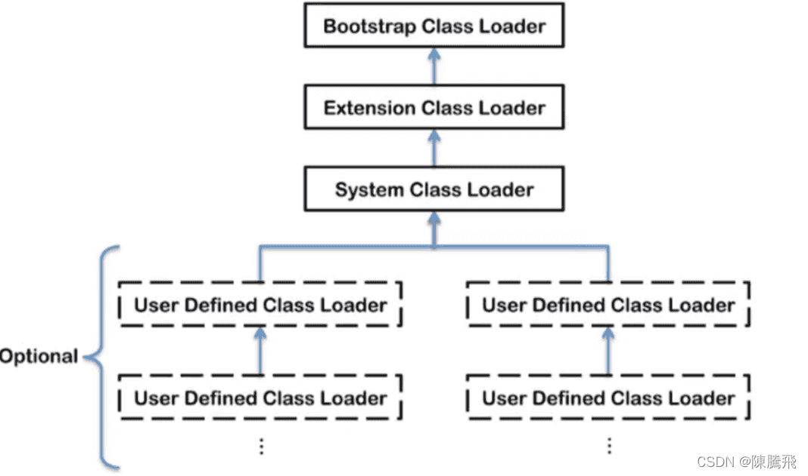​

‍

‍

类加载器是 Java 的核心组件，用于加载字节码到 JVM 内存，得到 Class 类的对象

从 Java 虚拟机规范来讲，只存在以下两种不同的类加载器：

* 启动类加载器（Bootstrap ClassLoader）：使用 C++ 实现，是虚拟机自身的一部分
* 自定义类加载器（User-Defined ClassLoader）：Java 虚拟机规范**将所有派生于抽象类 ClassLoader 的类加载器都划分为自定义类加载器**，使用 Java 语言实现，独立于虚拟机

‍

从 Java 开发人员的角度看：

* 启动类加载器（Bootstrap ClassLoader）：

  * 处于安全考虑，Bootstrap 启动类加载器只加载包名为 java、javax、sun 等开头的类
  * 类加载器负责加载在 `JAVA_HOME/jre/lib`​ 或 `sun.boot.class.path`​ 目录中的，或者被 -Xbootclasspath 参数所指定的路径中的类，并且是虚拟机识别的类库加载到虚拟机内存中
  * 仅按照文件名识别，如 rt.jar 名字不符合的类库即使放在 lib 目录中也不会被加载
  * 启动类加载器无法被 Java 程序直接引用，编写自定义类加载器时，如果要把加载请求委派给启动类加载器，直接使用 null 代替
* 扩展类加载器（Extension ClassLoader）：

  * 由 ExtClassLoader (sun.misc.Launcher$ExtClassLoader)  实现，上级为 Bootstrap，显示为 null
  * 将 `JAVA_HOME/jre/lib/ext`​ 或者被 `java.ext.dir`​ 系统变量所指定路径中的所有类库加载到内存中
  * 开发者可以使用扩展类加载器，创建的 JAR 放在此目录下，会由扩展类加载器自动加载
* 应用程序类加载器（Application ClassLoader）：

  * 由 AppClassLoader(sun.misc.Launcher$AppClassLoader) 实现，上级为 Extension
  * 负责加载环境变量 classpath 或系统属性 `java.class.path`​ 指定路径下的类库
  * 这个类加载器是 ClassLoader 中的 getSystemClassLoader() 方法的返回值，因此称为系统类加载器
  * 可以直接使用这个类加载器，如果应用程序中没有自定义类加载器，这个就是程序中默认的类加载器
* 自定义类加载器：由开发人员自定义的类加载器，上级是 Application

```java
public static void main(String[] args) {
    //获取系统类加载器
    ClassLoader systemClassLoader = ClassLoader.getSystemClassLoader();
    System.out.println(systemClassLoader);//sun.misc.Launcher$AppClassLoader@18b4aac2

    //获取其上层  扩展类加载器
    ClassLoader extClassLoader = systemClassLoader.getParent();
    System.out.println(extClassLoader);//sun.misc.Launcher$ExtClassLoader@610455d6

    //获取其上层 获取不到引导类加载器
    ClassLoader bootStrapClassLoader = extClassLoader.getParent();
    System.out.println(bootStrapClassLoader);//null

    //对于用户自定义类来说：使用系统类加载器进行加载
    ClassLoader classLoader = ClassLoaderTest.class.getClassLoader();
    System.out.println(classLoader);//sun.misc.Launcher$AppClassLoader@18b4aac2

    //String 类使用引导类加载器进行加载的 --> java核心类库都是使用启动类加载器加载的
    ClassLoader classLoader1 = String.class.getClassLoader();
    System.out.println(classLoader1);//null

}
```

补充两个类加载器：

* SecureClassLoader 扩展了 ClassLoader，新增了几个与使用相关的代码源和权限定义类验证（对 class 源码的访问权限）的方法，一般不会直接跟这个类打交道，更多是与它的子类 URLClassLoader 有所关联
* ClassLoader 是一个抽象类，很多方法是空的没有实现，而 URLClassLoader 这个实现类为这些方法提供了具体的实现，并新增了 URLClassPath 类协助取得 Class 字节流等功能. 在编写自定义类加载器时，如果没有太过于复杂的需求，可以直接继承 URLClassLoader 类，这样就可以避免去编写 findClass() 方法及其获取字节码流的方式，使自定义类加载器编写更加简洁

‍

### 常用API

ClassLoader 类，是一个抽象类，其后所有的类加载器都继承自 ClassLoader（不包括启动类加载器）

获取 ClassLoader 的途径：

* 获取当前类的 ClassLoader：`clazz.getClassLoader()`​
* 获取当前线程上下文的 ClassLoader：`Thread.currentThread.getContextClassLoader()`​
* 获取系统的 ClassLoader：`ClassLoader.getSystemClassLoader()`​
* 获取调用者的 ClassLoader：`DriverManager.getCallerClassLoader()`​

ClassLoader 类常用方法：

* ​`getParent()`​：返回该类加载器的超类加载器
* ​`loadclass(String name)`​：加载名为 name 的类，返回结果为 Class 类的实例，**该方法就是双亲委派模式**
* ​`findclass(String name)`​：查找二进制名称为 name 的类，返回结果为 Class 类的实例，该方法会在检查完父类加载器之后被 loadClass() 方法调用
* ​`findLoadedClass(String name)`​：查找名称为 name 的已经被加载过的类，final 修饰无法重写
* ​`defineClass(String name, byte[] b, int off, int len)`​：将**字节流**解析成 JVM 能够识别的类对象
* ​`resolveclass(Class<?> c)`​：链接指定的 Java 类，可以使类的 Class 对象创建完成的同时也被解析
* ​`InputStream getResourceAsStream(String name)`​：指定资源名称获取输入流

‍

### ClassLoader

ClassLoader类是一个抽象类，其后所有的类加载器都继承自ClassLoader（不包括启动类加载器）

‍

‍

‍

‍

### 1启动类加载器

> **启动类加载器（引导类加载器，Bootstrap ClassLoader）**

* 这个类加载使用C/C++语言实现的，嵌套在JVM内部
* 它用来加载Java的核心库（JAVA_HOME/jre/lib/rt.jar、resources.jar或sun.boot.class.path路径下的内容），用于提供JVM自身需要的类
* 并不继承自java.lang.ClassLoader，没有父加载器
* 加载扩展类和应用程序类加载器，并作为他们的父类加载器
* 出于安全考虑，Bootstrap启动类加载器只加载包名为java、javax、sun等开头的类

‍

‍

### 2扩展类加载器

> **扩展类加载器（Extension ClassLoader）**

* Java语言编写，由sun.misc.Launcher$ExtClassLoader实现
* 派生于ClassLoader类
* 父类加载器为启动类加载器
* 从java.ext.dirs系统属性所指定的目录中加载类库，或从JDK的安装目录的jre/lib/ext子目录（扩展目录）下加载类库。如果用户创建的JAR放在此目录下，也会自动由扩展类加载器加载

‍

‍

### 3系统类加载器

> **应用程序类加载器（也称为系统类加载器，AppClassLoader）**

* Java语言编写，由sun.misc.LaunchersAppClassLoader实现
* 派生于ClassLoader类
* 父类加载器为扩展类加载器
* 它负责加载环境变量classpath或系统属性java.class.path指定路径下的类库
* 该类加载是程序中默认的类加载器，一般来说，Java应用的类都是由它来完成加载
* 通过classLoader.getSystemclassLoader()方法可以获取到该类加载器

‍

​​

### 自定义类加载器

‍

优势

1. 隔离加载类（比如说我假设现在Spring框架，和RocketMQ有包名路径完全一样的类，类名也一样，这个时候类就冲突了。不过一般的主流框架和中间件都会自定义类加载器，实现不同的框架，中间价之间是隔离的）
2. 修改类加载的方式
3. 扩展加载源（还可以考虑从数据库中加载类，路由器等等不同的地方）
4. 防止源码泄漏（对字节码文件进行解密，自己用的时候通过自定义类加载器来对其进行解密）

‍

#### 方法

1. 开发人员可以通过继承抽象类java.lang.ClassLoader类的方式，实现自己的类加载器，以满足一些特殊的需求
2. 在JDK1.2之前，在自定义类加载器时，总会去继承ClassLoader类并重写loadClass()方法，从而实现自定义的类加载类，但是在JDK1.2之后已不再建议用户去覆盖loadClass()方法，而是建议把自定义的类加载逻辑写在findclass()方法中
3. 在编写自定义类加载器时，如果没有太过于复杂的需求，可以直接继承URIClassLoader类，这样就可以避免自己去编写findclass()方法及其获取字节码流的方式，使自定义类加载器编写更加简洁。

‍

#### **示例**

```java
public class CustomClassLoader extends ClassLoader {
    @Override
    protected Class<?> findClass(String name) throws ClassNotFoundException {

        try {
            byte[] result = getClassFromCustomPath(name);
            if (result == null) {
                throw new FileNotFoundException();
            } else {
                //defineClass和findClass搭配使用
                return defineClass(name, result, 0, result.length);
            }
        } catch (FileNotFoundException e) {
            e.printStackTrace();
        }

        throw new ClassNotFoundException(name);
    }
	//自定义流的获取方式
    private byte[] getClassFromCustomPath(String name) {
        //从自定义路径中加载指定类:细节略
        //如果指定路径的字节码文件进行了加密，则需要在此方法中进行解密操作。
        return null;
    }

    public static void main(String[] args) {
        CustomClassLoader customClassLoader = new CustomClassLoader();
        try {
            Class<?> clazz = Class.forName("One", true, customClassLoader);
            Object obj = clazz.newInstance();
            System.out.println(obj.getClass().getClassLoader());
        } catch (Exception e) {
            e.printStackTrace();
        }
    }
}
```

‍

### 加载模型

‍

#### 加载机制

在 JVM 中，对于类加载模型提供了三种，分别为全盘加载、双亲委派、缓存机制

* **全盘加载：** 当一个类加载器负责加载某个 Class 时，该 Class 所依赖和引用的其他 Class 也将由该类加载器负责载入，除非显示指定使用另外一个类加载器来载入
* **双亲委派：** 某个特定的类加载器在接到加载类的请求时，首先将加载任务委托给父加载器，**依次递归**，如果父加载器可以完成类加载任务，就成功返回；只有当父加载器无法完成此加载任务时，才自己去加载
* **缓存机制：** 会保证所有加载过的 Class 都会被缓存，当程序中需要使用某个 Class 时，类加载器先从缓存区中搜寻该 Class，只有当缓存区中不存在该 Class 对象时，系统才会读取该类对应的二进制数据，并将其转换成 Class 对象存入缓冲区（方法区）中

  * 这就是修改了 Class 后，必须重新启动 JVM，程序所做的修改才会生效的原因

‍

#### 双亲委派

‍

Java虚拟机对class文件采用的是**按需加载**的方式，也就是说当需要使用该类时才会将它的class文件加载到内存生成class对象。而且加载某个类的class文件时，Java虚拟机采用的是双亲委派模式，即把请求交由**父类处理**，它是一种任务委派模式

双亲委派模型（Parents Delegation Model）：该模型要求除了顶层的启动类加载器外，其它类加载器都要有父类加载器，这里的父子关系一般通过组合关系（Composition）来实现，而不是继承关系（Inheritance）

工作过程：一个类加载器首先将类加载请求转发到父类加载器，只有当父类加载器无法完成时才尝试自己加载

‍

流程

1. 如果一个类加载器收到了类加载请求，它并不会自己先去加载，而是把这个请求委托给父类的加载器去执行；
2. 如果父类加载器还存在其父类加载器，则进一步向上委托，依次递归，请求最终将到达顶层的启动类加载器；
3. 如果父类加载器可以完成类加载任务，就成功返回，倘若父类加载器无法完成此加载任务，子加载器才会尝试自己去加载，这就是双亲委派模式。
4. 父类加载器一层一层往下分配任务，如果子类加载器能加载，则加载此类，如果将加载任务分配至系统类加载器也无法加载此类，则抛出异常

**我的认识:**  类比设计模式里的责任链模式, 一层一层向上抛出需求, 找不到了再返回

‍

‍

##### 评价

* 避免类的重复加载
* 保护程序安全，防止核心API被随意篡改

‍

双亲委派机制的优点：

* 可以避免某一个类被重复加载，当父类已经加载后则无需重复加载，保证全局唯一性
* Java 类随着它的类加载器一起具有一种带有优先级的层次关系，从而使得基础类得到统一
* 保护程序安全，防止类库的核心 API 被随意篡改

  例如：在工程中新建 java.lang 包，接着在该包下新建 String 类，并定义 main 函数

  ```java
  public class String {
      public static void main(String[] args) {
          System.out.println("demo info");
      }
  }
  ```

  此时执行 main 函数会出现异常，在类 java.lang.String 中找不到 main 方法. 因为双亲委派的机制，java.lang.String 的在启动类加载器（Bootstrap）得到加载，启动类加载器优先级更高，在核心 jre 库中有其相同名字的类文件，但该类中并没有 main 方法

‍

双亲委派机制的缺点：检查类是否加载的委托过程是单向的，这个方式虽然从结构上看比较清晰，使各个 ClassLoader 的职责非常明确，但**顶层的 ClassLoader 无法访问底层的 ClassLoader 所加载的类**（可见性）

<div>

</div>

‍

##### 源码分析

```java
protected Class<?> loadClass(String name, boolean resolve)
    throws ClassNotFoundException {
    synchronized (getClassLoadingLock(name)) {
       // 调用当前类加载器的 findLoadedClass(name)，检查当前类加载器是否已加载过指定 name 的类
        Class c = findLoadedClass(name);
  
        // 当前类加载器如果没有加载过
        if (c == null) {
            long t0 = System.nanoTime();
            try {
                // 判断当前类加载器是否有父类加载器
                if (parent != null) {
                    // 如果当前类加载器有父类加载器，则调用父类加载器的 loadClass(name,false)
         			// 父类加载器的 loadClass 方法，又会检查自己是否已经加载过
                    c = parent.loadClass(name, false);
                } else {
                    // 当前类加载器没有父类加载器，说明当前类加载器是 BootStrapClassLoader
          			// 则调用 BootStrap ClassLoader 的方法加载类
                    c = findBootstrapClassOrNull(name);
                }
            } catch (ClassNotFoundException e) { }

            if (c == null) {
                // 如果调用父类的类加载器无法对类进行加载，则用自己的 findClass() 方法进行加载
                // 可以自定义 findClass() 方法
                long t1 = System.nanoTime();
                c = findClass(name);

                // this is the defining class loader; record the stats
                sun.misc.PerfCounter.getParentDelegationTime().addTime(t1 - t0);
                sun.misc.PerfCounter.getFindClassTime().addElapsedTimeFrom(t1);
                sun.misc.PerfCounter.getFindClasses().increment();
            }
        }
        if (resolve) {
            // 链接指定的 Java 类，可以使类的 Class 对象创建完成的同时也被解析
            resolveClass(c);
        }
        return c;
    }
}
```

‍

‍

##### 破坏委派

双亲委派模型并不是一个具有强制性约束的模型，而是 Java 设计者推荐给开发者的类加载器实现方式

破坏双亲委派模型的方式：

* 自定义 ClassLoader

  * 如果不想破坏双亲委派模型，只需要重写 findClass 方法
  * 如果想要去破坏双亲委派模型，需要去**重写 loadClass **方法
* 引入**线程上下文类加载器**

  Java 提供了很多服务提供者接口（Service Provider Interface，SPI），允许第三方为这些接口提供实现. 常见的有 JDBC、JCE、JNDI 等. 这些 SPI 接口由 Java 核心库来提供，而 SPI 的实现代码则是作为 Java 应用所依赖的 jar 包被包含进类路径 classpath 里，SPI 接口中的代码需要加载具体的实现类：

  * SPI 的接口是 Java 核心库的一部分，是由引导类加载器来加载的
  * SPI 的实现类是由系统类加载器加载，引导类加载器是无法找到 SPI 的实现类，因为双亲委派模型中 BootstrapClassloader 无法委派 AppClassLoader 来加载类

  JDK 开发人员引入了线程上下文类加载器（Thread Context ClassLoader），这种类加载器可以通过 Thread  类的 setContextClassLoader 方法进行设置线程上下文类加载器，在执行线程中抛弃双亲委派加载模式，使程序可以逆向使用类加载器，使 Bootstrap 加载器拿到了 Application 加载器加载的类，破坏了双亲委派模型
* 实现程序的动态性，如代码热替换（Hot Swap）、模块热部署（Hot Deployment）

  IBM 公司主导的 JSR一291（OSGiR4.2）实现模块化热部署的关键是它自定义的类加载器机制的实现，每一个程序模块（OSGi 中称为 Bundle）都有一个自己的类加载器，当更换一个 Bundle 时，就把 Bundle 连同类加载器一起换掉以实现代码的热替换，在 OSGi 环境下，类加载器不再双亲委派模型推荐的树状结构，而是进一步发展为更加复杂的网状结构

  当收到类加载请求时，OSGi 将按照下面的顺序进行类搜索:

  1. 将以 java.* 开头的类，委派给父类加载器加载
  2. 否则，将委派列表名单内的类，委派给父类加载器加载
  3. 否则，将 Import 列表中的类，委派给 Export 这个类的 Bundle 的类加载器加载
  4. 否则，查找当前 Bundle 的 ClassPath，使用自己的类加载器加载
  5. 否则，查找类是否在自己的 Fragment Bundle 中，如果在就委派给 Fragment Bundle 类加载器加载
  6. 否则，查找 Dynamic Import 列表的 Bundle，委派给对应 Bundle 的类加载器加载
  7. 否则，类查找失败

  热替换是指在程序的运行过程中，不停止服务，只通过替换程序文件来修改程序的行为，**热替换的关键需求在于服务不能中断**，修改必须立即表现正在运行的系统之中

<div>

</div>

‍

‍

## 沙箱机制

‍

自定义String类时：在加载自定义String类的时候会率先使用引导类加载器加载，而引导类加载器在加载的过程中会先加载jdk自带的文件（rt.jar包中java.lang.String.class），报错信息说没有main方法，就是因为加载的是rt.jar包中的String类。

这样可以保证对java核心源代码的保护

‍

沙箱机制（Sandbox）：将 Java 代码限定在虚拟机特定的运行范围中，并且严格限制代码对本地系统资源访问，来保证对代码的有效隔离，防止对本地系统造成破坏

沙箱**限制系统资源访问**，包括 CPU、内存、文件系统、网络，不同级别的沙箱对资源访问的限制也不一样

* JDK1.0：Java 中将执行程序分成本地代码和远程代码两种，本地代码默认视为可信任的，而远程代码被看作是不受信的. 对于授信的本地代码，可以访问一切本地资源，而对于非授信的远程代码不可以访问本地资源，其实依赖于沙箱机制. 如此严格的安全机制也给程序的功能扩展带来障碍，比如当用户希望远程代码访问本地系统的文件时候，就无法实现
* JDK1.1：针对安全机制做了改进，增加了安全策略. 允许用户指定代码对本地资源的访问权限
* JDK1.2：改进了安全机制，增加了代码签名，不论本地代码或是远程代码都会按照用户的安全策略设定，由类加载器加载到虚拟机中权限不同的运行空间，来实现差异化的代码执行权限控制
* JDK1.6：当前最新的安全机制，引入了域（Domain）的概念. 虚拟机会把所有代码加载到不同的系统域和应用域，不同的保护域对应不一样的权限. 系统域部分专门负责与关键资源进行交互，而各个应用域部分则通过系统域的部分代理来对各种需要的资源进行访问

<div>

</div>

‍

‍

## 其他

‍

### 如何判断两个class对象是否相同？

在JVM中表示两个class对象是否为同一个类存在两个必要条件

1. 类的完整类名必须一致，包括包名
2. **加载这个类的ClassLoader（指ClassLoader实例对象）必须相同**

‍

换句话说，在JVM中，即使这两个类对象（class对象）来源同一个Class文件，被同一个虚拟机所加载，但只要加载它们的ClassLoader实例对象不同，那么这两个类对象也是不相等的

‍

‍

### 对类加载器的引用

1. JVM必须知道一个类型是由启动加载器加载的还是由用户类加载器加载的
2. **如果一个类型是由用户类加载器加载的，那么JVM会将这个类加载器的一个引用作为类型信息的一部分保存在方法区中**
3. 当解析一个类型到另一个类型的引用的时候，JVM需要保证这两个类型的类加载器是相同的

‍

‍

# 运行时数据区及线程

‍

‍

​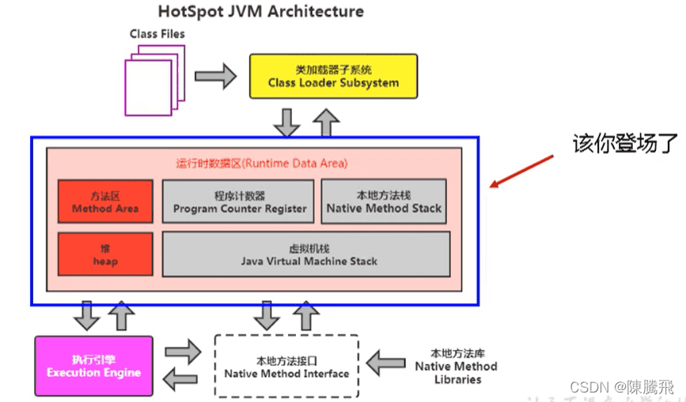​

‍

‍

## 运行时数据区结构

​​

### 运行时数据区与内存

内存是非常重要的系统资源，是硬盘和CPU的中间仓库及桥梁，承载着操作系统和应用程序的实时运行。JVM内存布局规定了Java在运行过程中内存申请、分配、管理的策略，保证了JVM的高效稳定运行。**不同的JVM对于内存的划分方式和管理机制存在着部分差异**。

‍

‍

### 线程的内存空间

Java虚拟机定义了若干种程序运行期间会使用到的运行时数据区：其中有一些会随着虚拟机启动而创建，随着虚拟机退出而销毁。另外一些则是与线程一一对应的，这些与线程对应的数据区域会随着线程开始和结束而创建和销毁。

‍

* 线程独有：独立包括程序计数器、栈、本地方法栈
* 线程间共享：堆、堆外内存（永久代或元空间、代码缓存）

‍

​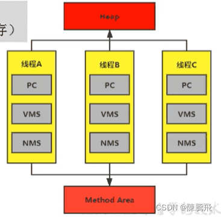​

‍

‍

### Runtime类

**每个JVM只有一个Runtime实例**。即为运行时环境，相当于内存结构的中间的那个框框：运行时环境。

‍

## 线程

* 线程是一个程序里的运行单元。JVM允许一个应用有多个线程并行的执行。 在Hotspot JVM里，每个线程都与操作系统的本地线程直接映射。
* 当一个Java线程准备好执行以后，此时一个操作系统的本地线程也同时创建。Java线程执行终止后，本地线程也会回收。
* 操作系统负责所有线程的安排调度到任何一个可用的CPU上。一旦本地线程初始化成功，它就会调用Java线程中的run()方法。

​​

‍

### JVM 系统线程

* 如果你使用jconsole或者是任何一个调试工具，都能看到在后台有许多线程在运行。这些后台线程不包括调用`public static void main(String[])`​的main线程以及所有这个main线程自己创建的线程。
* 这些主要的后台系统线程在Hotspot JVM里主要是以下几个：

  1. **虚拟机线程**：这种线程的操作是需要JVM达到安全点才会出现。这些操作必须在不同的线程中发生的原因是他们都需要JVM达到安全点，这样堆才不会变化。这种线程的执行类型括"stop-the-world"的垃圾收集，线程栈收集，线程挂起以及偏向锁撤销
  2. **周期任务线程**：这种线程是时间周期事件的体现（比如中断），他们一般用于周期性操作的调度执行
  3. **GC线程**：这种线程对在JVM里不同种类的垃圾收集行为提供了支持
  4. **编译线程**：这种线程在运行时会将字节码编译成到本地代码
  5. **信号调度线程**：这种线程接收信号并发送给JVM，在它内部通过调用适当的方法进行处理

‍

‍

## 程序计数器

(PC寄存器)

‍

* JVM中的程序计数寄存器（Program Counter Register）中，Register的命名源于CPU的寄存器，**寄存器存储指令相关的现场信息**。CPU只有把数据装载到寄存器才能够运行。
* 这里，并非是广义上所指的物理寄存器，或许将其翻译为PC计数器（或指令计数器）会更加贴切（也称为程序钩子），并且也不容易引起一些不必要的误会。**JVM中的PC寄存器是对物理PC寄存器的一种抽象模拟**。
* 它是一块很小的内存空间，几乎可以忽略不记。也是运行速度最快的存储区域。
* 在JVM规范中，每个线程都有它自己的程序计数器，是线程私有的，生命周期与线程的生命周期保持一致。
* 任何时间一个线程都只有一个方法在执行，也就是所谓的**当前方法**。程序计数器会存储当前线程正在执行的Java方法的JVM指令地址；或者，如果是在执行native方法，则是未指定值（undefned）。
* 它是**程序控制流**的指示器，分支、循环、跳转、异常处理、线程恢复等基础功能都需要依赖这个计数器来完成。
* 字节码解释器工作时就是通过改变这个计数器的值来选取下一条需要执行的字节码指令。
* 它是**唯一一个**在Java虚拟机规范中没有规定任何OutofMemoryError情况的区域。

‍

‍

​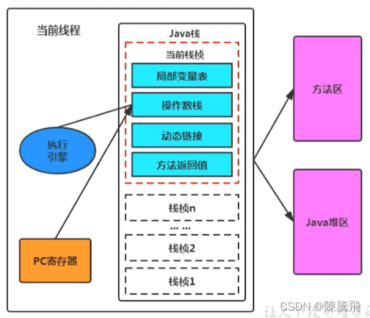​

‍

‍

### 作用

PC寄存器用来存储指向下一条指令的地址，也即将要执行的指令代码。由执行引擎读取下一条指令，并执行该指令。

‍

查看字节码->

* 左边的数字代表**指令地址（指令偏移）** ，即 PC 寄存器中可能存储的值，然后执行引擎读取 PC 寄存器中的值，并执行该指令

​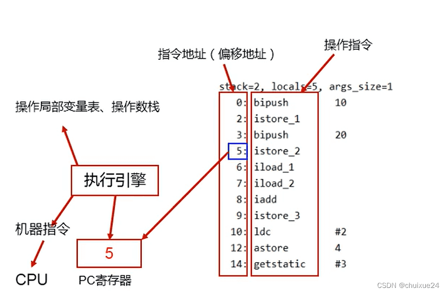​

‍

‍

#### 面试题

**使用PC寄存器存储字节码指令地址有什么用呢？** 或者问**为什么使用 PC 寄存器来记录当前线程的执行地址呢？**

* 因为CPU需要不停的切换各个线程，这时候切换回来以后，就得知道接着从哪开始继续执行
* JVM的字节码解释器就需要通过改变PC寄存器的值来明确下一条应该执行什么样的字节码指令

‍

​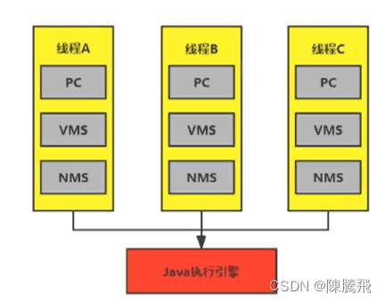​

‍

‍

**PC寄存器为什么被设定为私有的？**

* 我们都知道所谓的多线程在一个特定的时间段内只会执行其中某一个线程的方法，CPU会不停地做任务切换，这样必然导致经常中断或恢复，如何保证分毫无差呢？**为了能够准确地记录各个线程正在执行的当前字节码指令地址，最好的办法自然是为每一个线程都分配一个PC寄存器**，这样一来各个线程之间便可以进行独立计算，从而不会出现相互干扰的情况。
* 由于CPU时间片轮限制，众多线程在并发执行过程中，任何一个确定的时刻，一个处理器或者多核处理器中的一个内核，只会执行某个线程中的一条指令。
* 这样必然导致经常中断或恢复，如何保证分毫无差呢？每个线程在创建后，都会产生自己的程序计数器和栈帧，程序计数器在各个线程之间互不影响。

‍

‍

### CPU 时间片

* CPU时间片即CPU分配给各个程序的时间，每个线程被分配一个时间段，称作它的时间片。
* 在宏观上：我们可以同时打开多个应用程序，每个程序并行不悖，同时运行。
* 但在微观上：由于只有一个CPU，一次只能处理程序要求的一部分，如何处理公平，一种方法就是引入时间片，**每个程序轮流执行**。

‍

‍

## 本地方法接口

‍

​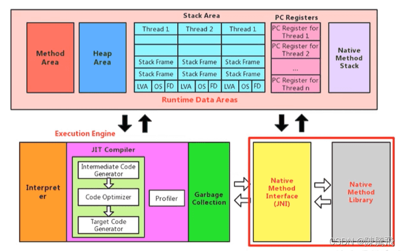​

‍

‍

* 简单地讲，**一个Native Method是一个Java调用非Java代码的接囗**  
  一个Native Method是这样一个Java方法：该方法的实现由非Java语言实现，比如C。这个特征并非Java所特有，很多其它的编程语言都有这一机制，比如在C++中，你可以用extern 告知C++编译器去调用一个C的函数。
* 在定义一个native method时，并不提供实现体（有些像定义一个Java interface），因为其实现体是由非java语言在外面实现的。
* 本地接口的作用是融合不同的编程语言为Java所用，它的初衷是融合C/C++程序。

‍

Java使用起来非常方便，然而有些层次的任务用Java实现起来不容易，或者我们对程序的效率很在意时，问题就来了。

‍

#### 与Java环境外交互

**有时Java应用需要与Java外面的硬件环境交互，这是本地方法存在的主要原因**。你可以想想Java需要与一些**底层系统**，如操作系统或某些硬件交换信息时的情况。本地方法正是这样一种交流机制：它为我们提供了一个非常简洁的接口，而且我们无需去了解Java应用之外的繁琐的细节。

‍

#### 与操作系统的交互

1. JVM支持着Java语言本身和运行时库，它是Java程序赖以生存的平台，它由一个解释器（解释字节码）和一些连接到本地代码的库组成。
2. 然而不管怎样，它毕竟不是一个完整的系统，它经常依赖于一底层系统的支持。这些底层系统常常是强大的操作系统。
3. **通过使用本地方法，我们得以用Java实现了jre的与底层系统的交互，甚至JVM的一些部分就是用C写的**。
4. 还有，如果我们要使用一些Java语言本身没有提供封装的操作系统的特性时，我们也需要使用本地方法。

‍

#### Sun’s Java

1. Sun的解释器是用C实现的，这使得它能像一些普通的C一样与外部交互。jre大部分是用Java实现的，它也通过一些本地方法与外界交互。
2. 例如：类java.lang.Thread的setPriority()方法是用Java实现的，但是它实现调用的是该类里的本地方法setPriority0()。这个本地方法是用C实现的，并被植入JVM内部在Windows 95的平台上，这个本地方法最终将调用Win32 setpriority() API。这是一个本地方法的具体实现由JVM直接提供，更多的情况是本地方法由外部的动态链接库（external dynamic link library）提供，然后被JVM调用。

‍

#### 现状

目前该方法使用的越来越少了，除非是与硬件有关的应用，比如通过Java程序驱动打印机或者Java系统管理生产设备，在企业级应用中已经比较少见。因为现在的异构领域间的通信很发达，比如可以使用Socket通信，也可以使用Web Service等等，不多做介绍。

‍

‍

## 本地方法栈

* **Java虚拟机栈于管理Java方法的调用，而本地方法栈用于管理本地方法的调用**。
* 本地方法栈，也是线程私有的。
* 允许被实现成固定或者是可动态扩展的内存大小（在内存溢出方面和虚拟机栈相同）

  * 如果线程请求分配的栈容量超过本地方法栈允许的最大容量，Java虚拟机将会抛出一个stackoverflowError 异常。
  * 如果本地方法栈可以动态扩展，并且在尝试扩展的时候无法申请到足够的内存，或者在创建新的线程时没有足够的内存去创建对应的本地方法栈，那么Java虚拟机将会抛出一个outofMemoryError异常。
* 本地方法一般是使用C语言或C++语言实现的。
* 它的具体做法是Native Method Stack中登记native方法，在Execution Engine 执行时加载本地方法库。

‍

​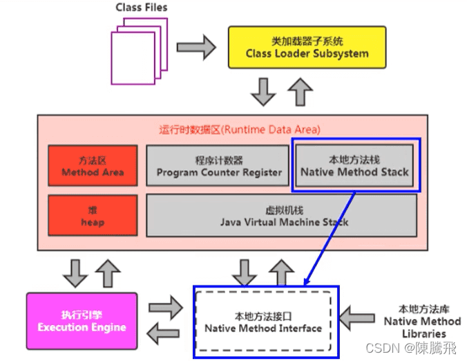​

‍

‍

**注意事项**

* 当某个线程调用一个本地方法时，它就进入了一个全新的并且不再受虚拟机限制的世界。它和虚拟机拥有同样的权限。

  * 本地方法可以通过本地方法接口来访问虚拟机内部的运行时数据区
  * 它甚至可以直接使用本地处理器中的寄存器
  * 直接从本地内存的堆中分配任意数量的内存
* 并不是所有的JVM都支持本地方法。因为Java虚拟机规范并没有明确要求本地方法栈的使用语言、具体实现方式、数据结构等。如果JVM产品不打算支持native方法，也可以无需实现本地方法栈。
* 在Hotspot JVM中，直接将本地方法栈和虚拟机栈合二为一。

‍

‍

# 虚拟机栈

​​

## 简介

​​

### 背景

由于跨平台性的设计，Java的指令都是根据栈来设计的。不同平台CPU架构不同，所以不能设计为基于寄存器的【如果设计成基于寄存器的，耦合度高，性能会有所提升，因为可以对具体的CPU架构进行优化，但是跨平台性大大降低】。

优点是跨平台，指令集小，编译器容易实现，缺点是性能下降，实现同样的功能需要更多的指令。

‍

‍

### 栈与堆

栈是**运行时的单位**，而堆是**存储的单位**

‍

即：栈解决程序的运行问题，即程序如何执行，或者说如何处理数据。堆解决的是数据存储的问题，即数据怎么放，放哪里

‍

‍

### 基本内容

‍

Java虚拟机栈（Java Virtual Machine Stack），早期也叫Java栈。每个线程在创建时都会创建一个虚拟机栈，其内部保存一个个的栈帧（Stack Frame），**对应着一次次的Java方法调用**，栈是线程私有的

‍

‍

#### 生命周期

生命周期和线程一致，也就是线程结束了，该虚拟机栈也销毁了

‍

‍

#### 作用

* 主管Java程序的运行，它保存方法的局部变量（8 种基本数据类型、对象的引用地址）、部分结果，并参与方法的调用和返回。
* 局部变量，它是相比于成员变量来说的（或属性）
* 基本数据类型变量 VS 引用类型变量（类、数组、接口）

‍

‍

#### 特点

* 栈是一种快速有效的分配存储方式，访问速度仅次于程序计数器。
* JVM直接对Java栈的操作只有两个：

  * 每个方法执行，伴随着**进栈**（入栈、压栈）
  * 执行结束后的**出栈**工作
* 对于栈来说不存在垃圾回收问题

  * 栈不需要GC，但是可能存在OOM

‍

‍

#### 异常

‍

**面试题：栈中可能出现的异常？**

Java 虚拟机规范允许Java栈的大小是动态的或者是固定不变的。

* 如果采用固定大小的Java虚拟机栈，那每一个线程的Java虚拟机栈容量可以在线程创建的时候独立选定。如果线程请求分配的栈容量超过Java虚拟机栈允许的最大容量，Java虚拟机将会抛出一个**StackOverflowError** 异常。
* 如果Java虚拟机栈可以动态扩展，并且在尝试扩展的时候无法申请到足够的内存，或者在创建新的线程时没有足够的内存去创建对应的虚拟机栈，那Java虚拟机将会抛出一个 **OutofMemoryError** 异常。

‍

‍

### 设置栈内存大小

使用参数  **-Xss** 选项来设置线程的最大栈空间，栈的大小直接决定了函数调用的最大可达深度。

一般默认为512k-1024k,取决于操作系统(jdk5之前,默认栈大小是256k;jdk5之后,默认栈大小是1024k)  
栈的大小直接决定了函数调用的最大可达深度

‍

‍

## **栈帧**

每个线程都有自己的栈，栈中的数据都是以**栈帧**（Stack Frame）的格式存在

在这个线程上正在执行的每个方法都各自对应一个栈帧（Stack Frame）。

栈帧是一个内存区块，是一个数据集，维系着方法执行过程中的各种数据信息。栈帧中还允许携带与Java虚拟机实现相关的一些附加信息。例如：对程序调试提供支持的信息。

‍

‍

### 栈运行原理

* JVM直接对Java栈的操作只有两个，就是对栈帧的**压栈和出栈**，遵循先进后出（后进先出）原则
* 在一条活动线程中，一个时间点上，只会有一个活动的栈帧。即只有当前正在执行的方法的栈帧（栈顶栈帧）是有效的。这个栈帧被称为**当前栈帧（Current Frame）** ，与当前栈帧相对应的方法就是**当前方法（Current Method）** ，定义这个方法的类就是**当前类（Current Class）**
* 执行引擎运行的所有字节码指令只针对当前栈帧进行操作。
* 如果在该方法中调用了其他方法，对应的新的栈帧会被创建出来，放在栈的顶端，成为新的当前帧。

‍

​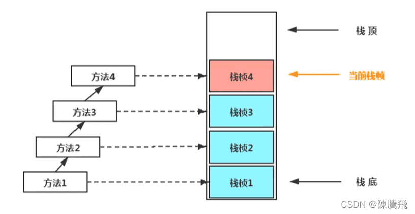​

‍

**注意**

1. **不同线程中所包含的栈帧是不允许存在相互引用的**，即不可能在一个栈帧之中引用另外一个线程的栈帧。
2. 如果当前方法调用了其他方法，方法返回之际，当前栈帧会传回此方法的执行结果给前一个栈帧，接着，虚拟机会丢弃当前栈帧，使得前一个栈帧重新成为当前栈帧。
3. Java方法有两种返回函数的方式。

    * 一种是正常的函数返回，使用return指令。
    * 另一种是方法执行中出现未捕获处理的异常，以抛出异常的方式结束。
    * 但不管使用哪种方式，都会导致栈帧被弹出。

‍

‍

### 内部结构

‍

并行每个线程下的栈都是私有的，因此每个线程都有自己各自的栈，并且每个栈里面都有很多栈帧，栈帧的大小主要由局部变量表 和 操作数栈决定的

‍

每个栈帧中存储着：

* 局部变量表（Local Variables）
* 操作数栈（Operand Stack）（或表达式栈）
* 动态链接（Dynamic Linking）（或指向运行时常量池的方法引用）
* 方法返回地址（Return Address）（或方法正常退出或者异常退出的定义）
* 一些附加信息

‍

‍

‍

## 局部变量表

局部变量数组 / 本地变量表 Local Variables

‍

* **定义为一个数字数组，主要用于存储方法参数和定义在方法体内的局部变量**，这些数据类型包括各类基本数据类型、对象引用（reference），以及returnAddress返回值类型。
* 由于局部变量表是建立在线程的栈上，是线程的私有数据，因此**不存在数据安全问题**
* **局部变量表所需的容量大小是在编译期确定下来的**，并保存在方法的Code属性的**maximum local variables**数据项中。在方法运行期间是不会改变局部变量表的大小的。
* 方法嵌套调用的次数由栈的大小决定。一般来说，栈越大，方法嵌套调用次数越多。

  * 对一个函数而言，它的参数和局部变量越多，使得局部变量表膨胀，它的栈帧就越大，以满足方法调用所需传递的信息增大的需求。
  * 进而函数调用就会占用更多的栈空间，导致其嵌套调用次数就会减少。
* 局部变量表中的变量只在当前方法调用中有效。

  * 在方法执行时，虚拟机通过使用局部变量表完成参数值到参数变量列表的传递过程。
  * 当方法调用结束后，随着方法栈帧的销毁，局部变量表也会随之销毁。

‍

jclasslib截图说明

​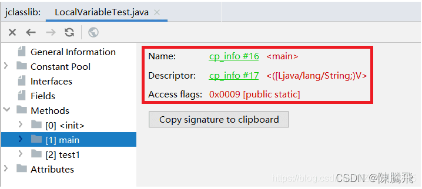​

​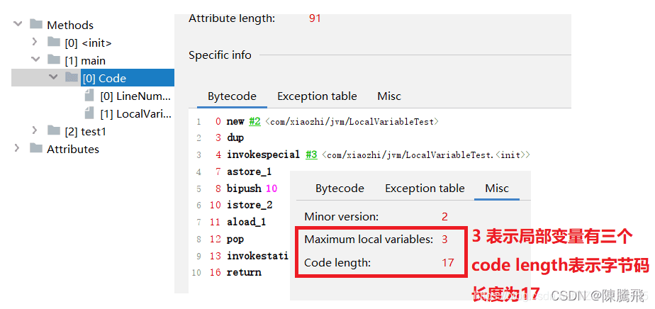​

​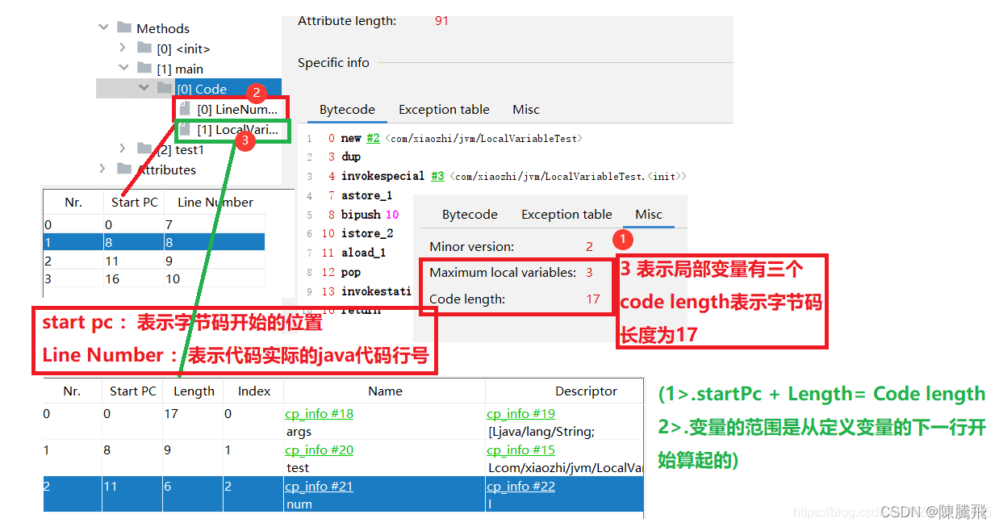​

‍

‍

‍

### Slot

* 参数值的存放总是从局部变量数组索引 0 的位置开始，到数组长度-1的索引结束。
* 局部变量表，**最基本的存储单元是Slot（变量槽）** ，局部变量表中存放编译期可知的各种基本数据类型（8种），引用类型（reference），returnAddress类型的变量。
* 在局部变量表里，**32位以内的类型只占用一个slot**（包括returnAddress类型），**64位的类型占用两个slot**（1ong和double）。

  * byte、short、char在储存前被转换为int，boolean也被转换为int，0表示false，非0表示true
  * long和double则占据两个slot
* JVM会为局部变量表中的每一个Slot都分配一个访问索引，通过这个索引即可成功访问到局部变量表中指定的局部变量值
* 当一个实例方法被调用的时候，它的方法参数和方法体内部定义的局部变量将会**按照顺序被复制**到局部变量表中的每一个slot上
* 如果需要访问局部变量表中一个64bit的局部变量值时，只需要使用前一个索引即可。（比如：访问long或double类型变量）
* 如果当前帧是由构造方法或者实例方法创建的，那么**该对象引用this将会存放在index为0的slot处**，其余的参数按照参数表顺序继续排列。（this也相当于一个变量）
* 栈帧中的局部变量表中的槽位是可以重用的，如果一个局部变量过了其作用域，那么在其作用域之后申明新的局部变量变就很有可能会复用过期局部变量的槽位，从而达到节省资源的目的。

‍

‍

### 静态变量与局部变量

* 参数表分配完毕之后，再根据方法体内定义的变量的顺序和作用域分配。
* 成员变量有两次初始化的机会 **，** 第一次是在“准备阶段”，执行系统初始化，对类变量设置零值，另一次则是在“初始化”阶段，赋予程序员在代码中定义的初始值。
* 和类变量初始化不同的是，**局部变量表不存在系统初始化的过程**，这意味着一旦定义了局部变量则必须人为的初始化，否则无法使用。

‍

‍

### 补充

1. 在栈帧中，与性能调优关系最为密切的部分就是前面提到的局部变量表。在方法执行时，虚拟机使用局部变量表完成方法的传递。
2. 局部变量表中的变量也是重要的垃圾回收根节点，只要被局部变量表中直接或间接引用的对象都不会被回收。

‍

‍

## 操作数栈

（Operand Stack）

* 每一个独立的栈帧除了包含局部变量表以外，还包含一个后进先出（Last - In - First -Out）的 操作数栈，也可以称之为**表达式栈**（Expression Stack）
* 操作数栈，在方法执行过程中，**根据字节码指令，往栈中写入数据或提取数据**，即入栈（push）和 出栈（pop）

  * 某些字节码指令将值压入操作数栈，其余的字节码指令将操作数取出栈。使用它们后再把结果压入栈，比如：执行复制、交换、求和等操作

‍

‍

### 作用

* 操作数栈，**主要用于保存计算过程的中间结果，同时作为计算过程中变量临时的存储空间**。
* 操作数栈就是JVM执行引擎的一个工作区，当一个方法刚开始执行的时候，一个新的栈帧也会随之被创建出来，这时方法的操作数栈是空的。
* 每一个操作数栈都会拥有一个明确的栈深度用于存储数值，其所需的最大深度在编译期就定义好了，保存在方法的Code属性中，为**maxstack**的值。
* 栈中的任何一个元素都是可以任意的Java数据类型

  * 32bit的类型占用一个栈单位深度
  * 64bit的类型占用两个栈单位深度
* 操作数栈并非采用访问索引的方式来进行数据访问的，而是只能通过标准的入栈和出栈操作来完成一次数据访问。**只不过操作数栈是用数组这个结构来实现的而已**
* 如果被调用的方法带有返回值的话，其返回值将会被压入当前栈帧的操作数栈中，并更新PC寄存器中下一条需要执行的字节码指令。
* 操作数栈中元素的数据类型必须与字节码指令的序列严格匹配，这由编译器在编译器期间进行验证，同时在类加载过程中的类检验阶段的数据流分析阶段要再次验证。
* 另外，**我们说Java虚拟机的解释引擎是基于栈的执行引擎，其中的栈指的就是操作数栈**。

‍

‍

## 栈顶缓存技术

**Top Of Stack Cashing**

* 前面提过，基于栈式架构的虚拟机所使用的零地址指令更加紧凑，但完成一项操作的时候必然需要使用更多的入栈和出栈指令，这同时也就意味着将需要更多的指令分派（instruction dispatch）次数（也就是你会发现指令很多）和导致内存读/写次数多，效率不高。
* 由于操作数是存储在内存中的，因此频繁地执行内存读/写操作必然会影响执行速度。为了解决这个问题，HotSpot JVM的设计者们提出了栈顶缓存（Tos，Top-of-Stack Cashing）技术，**将栈顶元素全部缓存在物理CPU的寄存器中，以此降低对内存的读/写次数，提升执行引擎的执行效率。**
* 寄存器的主要优点：指令更少，执行速度快，但是指令集（也就是指令种类）很多

‍

‍

## 动态链接

Dynamic Linking

‍

**动态链接（或指向运行时常量池的方法引用）**

动态链接、方法返回地址、附加信息 ： 有些地方被称为帧数据区

* 每一个栈帧内部都包含**一个指向运行时常量池中该栈帧所属方法的引用**。包含这个引用的目的就是**为了支持当前方法的代码能够实现动态链接**（Dynamic Linking），比如：invokedynamic指令
* 在Java源文件被编译到字节码文件中时，所有的变量和方法引用都作为符号引用（Symbolic Reference）保存在class文件的常量池里。比如：描述一个方法调用了另外的其他方法时，就是通过常量池中指向方法的符号引用来表示的，那么**动态链接的作用就是为了将这些符号引用转换为调用方法的直接引用**

‍

**为什么要用常量池呢？**

1. 因为在不同的方法，都可能调用常量或者方法，所以只需要存储一份即可，然后记录其引用即可，节省了空间。
2. 常量池的作用：就是为了提供一些符号和常量，便于指令的识别

‍

​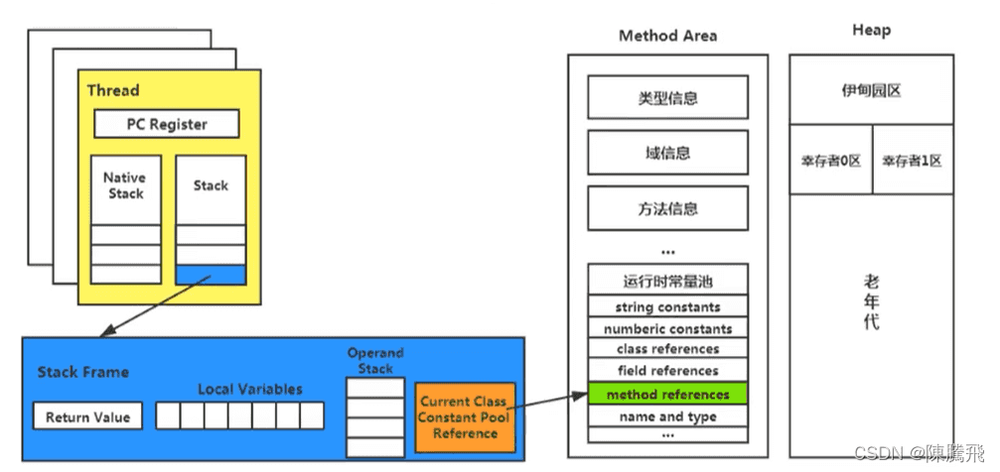​

‍

‍

## 方法调用

‍

### 静态链接与动态链接

在JVM中，将符号引用转换为调用方法的直接引用与方法的绑定机制相关

静态链接和动态链接不是名词，而是动词

‍

* **静态链接**：

当一个字节码文件被装载进JVM内部时，如果被调用的目标方法在编译期确定，且运行期保持不变时，这种情况下将调用方法的符号引用转换为直接引用的过程称之为静态链接

‍

* **动态链接**：

如果被调用的方法在编译期无法被确定下来，也就是说，只能够在程序运行期将调用的方法的符号转换为直接引用，由于这种引用转换过程具备动态性，因此也被称之为动态链接。

‍

对应的方法的绑定机制为：早期绑定（Early Binding）和晚期绑定（Late Binding）。绑定是一个字段、方法或者类在符号引用被替换为直接引用的过程，这仅仅发生一次。

‍

### 早期绑定与晚期绑定

> 静态链接与动态链接针对的是方法。早期绑定和晚期绑定范围更广。早期绑定涵盖了静态链接，晚期绑定涵盖了动态链接。

静态链接和动态链接对应的方法的绑定机制为：早期绑定（Early Binding）和晚期绑定（Late Binding）。**绑定是一个字段、方法或者类在符号引用被替换为直接引用的过程**，这仅仅发生一次。

‍

* **早期绑定**

早期绑定就是指被调用的目标方法如果在编译期可知，且运行期保持不变时，即可将这个方法与所属的类型进行绑定，这样一来，由于明确了被调用的目标方法究竟是哪一个，因此也就**可以使用静态链接的方式将符号引用转换为直接引用**。

‍

* **晚期绑定**

如果被调用的方法在编译期无法被确定下来，**只能够在程序运行期根据实际的类型绑定相关的方法**，这种绑定方式也就被称之为晚期绑定。

‍

‍

nvokevirtual 体现为晚期绑定

invokeinterface 也体现为晚期绑定

invokespecial 体现为早期绑定

‍

### 多态与绑定

* 随着高级语言的横空出世，类似于Java一样的基于面向对象的编程语言如今越来越多，尽管这类编程语言在语法风格上存在一定的差别，但是它们彼此之间始终保持着一个共性，那就是都支持封装、继承和多态等面向对象特性，既然这一类的编程语言具备多态特性，那么自然也就具备早期绑定和晚期绑定两种绑定方式。
* Java中任何一个普通的方法其实都具备虚函数的特征，它们相当于C++语言中的虚函数（C++中则需要使用关键字virtual来显式定义）。如果在Java程序中不希望某个方法拥有虚函数的特征时，则可以使用关键字final来标记这个方法。

‍

‍

#### 虚方法与非虚方法

‍

**虚方法与非虚方法的区别**

如果方法在编译期就确定了具体的调用版本，这个版本在运行时是不可变的。这样的方法称为非虚方法。

‍

静态方法、私有方法、final方法、实例构造器、父类方法都是非虚方法。其他方法称为虚方法。

‍

**子类对象的多态的使用前提**

1. 类的继承关系
2. 方法的重写

‍

**虚拟机中方法调用指令**

‍

* **普通指令**

* invokestatic：调用静态方法，解析阶段确定唯一方法版本
* invokespecial：调用`<init>`​​​方法、私有及父类方法，解析阶段确定唯一方法版本
* invokevirtual：调用所有虚方法
* invokeinterface：调用接口方法

‍

* **动态调用指令**

invokedynamic：动态解析出需要调用的方法，然后执行

‍

前四条指令固化在虚拟机内部，方法的调用执行不可人为干预。而invokedynamic指令则支持由用户确定方法版本。其中invokestatic指令和invokespecial指令调用的方法称为非虚方法，其余的（final修饰的除外）称为虚方法。

‍

‍

#### 关于invokedynamic指令

* JVM字节码指令集一直比较稳定，一直到Java7中才增加了一个invokedynamic指令，这是Java为了实现【动态类型语言】支持而做的一种改进。
* 但是在Java7中并没有提供直接生成invokedynamic指令的方法，需要借助ASM这种底层字节码工具来产生invokedynamic指令。直到Java8的Lambda表达式的出现，invokedynamic指令的生成，在Java中才有了直接的生成方式。
* Java7中增加的动态语言类型支持的本质是对Java虚拟机规范的修改，而不是对Java语言规则的修改，这一块相对来讲比较复杂，增加了虚拟机中的方法调用，最直接的受益者就是运行在Java平台的动态语言的编译器。

‍

‍

### 动态语言和静态语言

动态类型语言和静态类型语言两者的区别就在于**对类型的检查是在编译期还是在运行期**，满足前者就是静态类型语言，反之是动态类型语言。

说的再直白一点就是，静态类型语言是判断变量自身的类型信息；动态类型语言是判断变量值的类型信息，变量没有类型信息，变量值才有类型信息，这是动态语言的一个重要特征。

```java
Java：String info = "mogu blog"; (Java是静态类型语言的，会先编译就进行类型检查)
JS：var name = "shkstart"; var name = 10; （运行时才进行检查）
Python: info = 130.5 (运行时才检查)
```

‍

### Java方法重写本质

* 找到操作数栈顶的第一个元素所执行的对象的实际类型，记作C。
* 如果在类型C中找到与常量中的描述符合简单名称都相符的方法，则进行访问权限校验。

  * 如果通过则返回这个方法的直接引用，查找过程结束
  * 如果不通过，则返回java.lang.IllegalAccessError 异常
* 否则，按照继承关系从下往上依次对C的各个父类进行第2步的搜索和验证过程。
* 如果始终没有找到合适的方法，则抛出java.lang.AbstractMethodError异常。

> 上面这个过程称为**动态分派**

‍

‍

**IllegalAccessError介绍**

* 程序试图访问或修改一个属性或调用一个方法，这个属性或方法，你没有权限访问。一般的，这个会引起编译器异常。这个错误如果发生在运行时，就说明一个类发生了不兼容的改变。
* 比如，你把应该有的jar包放从工程中拿走了，或者Maven中存在jar包冲突

‍

‍

### 虚方法表

* 在面向对象的编程中，会很频繁的使用到**动态分派**，如果在每次动态分派的过程中都要重新在类的方法元数据中搜索合适的目标的话就可能影响到执行效率。因此，为了提高性能，**JVM采用在类的方法区建立一个虚方法表（virtual method table）来实现**，非虚方法不会出现在表中。使用索引表来代替查找。【上面动态分派的过程，我们可以看到如果子类找不到，还要从下往上找其父类，非常耗时】
* 每个类中都有一个虚方法表，表中存放着各个方法的实际入口。
* 虚方法表是什么时候被创建的呢？虚方法表会在类加载的链接阶段被创建并开始初始化，类的变量初始值准备完成之后，JVM会把该类的虚方法表也初始化完毕。

‍

**例子1**

如果类中重写了方法，那么调用的时候，就会直接在该类的虚方法表中查找

1、比如说son在调用toString的时候，Son没有重写过，Son的父类Father也没有重写过，那就直接调用Object类的toString。那么就直接在虚方法表里指明toString直接指向Object类。

2、下次Son对象再调用toString就直接去找Object，不用先找Son-->再找Father-->最后才到Object的这样的一个过程。

‍

‍

## 方法返回地址

return address

‍

> 在一些帖子里，方法返回地址、动态链接、一些附加信息 也叫做帧数据区

‍

* 存放调用该方法的pc寄存器的值。一个方法的结束，有两种方式：

  * 正常执行完成
  * 出现未处理的异常，非正常退出
* 无论通过哪种方式退出，在方法退出后都返回到该方法被调用的位置。方法正常退出时，**调用者的pc计数器的值作为返回地址，即调用该方法的指令的下一条指令的地址**。而通过异常退出的，返回地址是要通过异常表来确定，栈帧中一般不会保存这部分信息。
* 本质上，方法的退出就是当前栈帧出栈的过程。此时，需要恢复上层方法的局部变量表、操作数栈、将返回值压入调用者栈帧的操作数栈、设置PC寄存器值等，让调用者方法继续执行下去。
* 正常完成出口和异常完成出口的区别在于：通过异常完成出口退出的不会给他的上层调用者产生任何的返回值。

‍

‍

### **方法退出两种方式**

‍

#### **正常退出**

‍

执行引擎遇到任意一个方法返回的字节码指令（return），会有返回值传递给上层的方法调用者，简称**正常完成出口**；

‍

一个方法在正常调用完成之后，究竟需要使用哪一个返回指令，还需要根据方法返回值的实际数据类型而定。

在字节码指令中，返回指令包含：

* ireturn：当返回值是boolean，byte，char，short和int类型时使用
* lreturn：Long类型
* freturn：Float类型
* dreturn：Double类型
* areturn：引用类型
* return：返回值类型为void的方法、实例初始化方法、类和接口的初始化方法

‍

‍

#### **异常退出**

在方法执行过程中遇到异常（Exception），并且这个异常没有在方法内进行处理，也就是只要在本方法的异常表中没有搜索到匹配的异常处理器，就会导致方法退出，简称**异常完成出口**。

方法执行过程中，抛出异常时的异常处理，存储在一个异常处理表，方便在发生异常的时候找到处理异常的代码

‍

正常完成出口和异常完成出口的区别在于：通过异常完成出口退出的不会给他的上层调用者产生任何的返回值。

‍

‍

## 栈面试题

‍

**举例栈溢出的情况？**

SOF（StackOverflowError），栈大小分为固定的，和动态变化。如果是固定的就可能出现StackOverflowError。如果是动态变化的，内存不足时就可能出现OOM

‍

**调整栈大小，就能保证不出现溢出么？**

不能保证不溢出，只能保证SOF出现的几率小

‍

**分配的栈内存越大越好么？**

不是，一定时间内降低了OOM概率，但是会挤占其它的线程空间，因为整个虚拟机的内存空间是有限的

‍

**垃圾回收是否涉及到虚拟机栈？**

不会

|位置|是否有Error|是否存在GC|
| ---------------------------------------------| -------------| ------------|
|PC计数器|无|不存在|
|虚拟机栈|有，SOF|不存在|
|本地方法栈(在HotSpot的实现中和虚拟机栈一样)|||
|堆|有，OOM|存在|
|方法区|有|存在|

‍

**方法中定义的局部变量是否线程安全？**

具体问题具体分析

1. 如果只有一个线程才可以操作此数据，则必是线程安全的。
2. 如果有多个线程操作此数据，则此数据是共享数据。如果不考虑同步机制的话，会存在线程安全问题。
3. 也就是, 如果对象是在内部产生，并在内部消亡，没有返回到外部，那么它就是线程安全的，反之则是线程不安全的。

‍

|运行时数据区|是否存在Error|是否存在GC|
| --------------| ---------------| ------------|
|程序计数器|否|否|
|虚拟机栈|是（SOE）|否|
|本地方法栈|是|否|
|方法区|是（OOM）|是|
|堆|是|是|

‍

# 虚拟机堆

‍

‍

## 核心概述

‍

### 堆与进程

堆针对一个JVM进程来说是唯一的。也就是**一个进程只有一个JVM实例**，一个JVM实例中就有一个运行时数据区，一个运行时数据区只有一个堆和一个方法区。

但是**进程包含多个线程，他们是共享同一堆空间的**。

‍

* 一个JVM实例只存在一个堆内存，堆也是Java内存管理的核心区域。
* Java堆区在JVM启动的时候即被创建，其空间大小也就确定了，堆是JVM管理的最大一块内存空间，并且堆内存的大小是可以调节的。
* 《Java虚拟机规范》规定，堆可以处于物理上不连续的内存空间中，但在逻辑上它应该被视为连续的。
* **所有的线程共享Java堆**，在这里还可以划分线程私有的缓冲区（Thread Local Allocation Buffer，**TLAB**）。
* 《Java虚拟机规范》中对Java堆的描述是：**所有的对象实例以及数组都应当在运行时分配在堆上**。（The heap is the run-time data area from which memory for all class instances and arrays is allocated）

  * 从实际使用角度看：“几乎”所有的对象实例都在堆分配内存，但并非全部。因为还有一些对象是在栈上分配的（逃逸分析，标量替换）
* 数组和对象可能永远不会存储在栈上（**不一定**），因为栈帧中保存引用，这个引用指向对象或者数组在堆中的位置。
* 在方法结束后，堆中的对象不会马上被移除，仅仅在垃圾收集的时候才会被移除。

  * 也就是触发了GC的时候，才会进行回收
  * 如果堆中对象马上被回收，那么用户线程就会收到影响，因为有stop the word
* 堆，是GC（Garbage Collection，垃圾收集器）执行垃圾回收的重点区域。

‍

​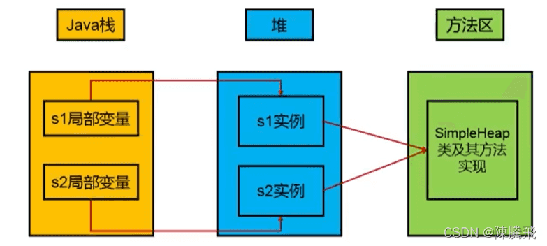​

‍

‍

​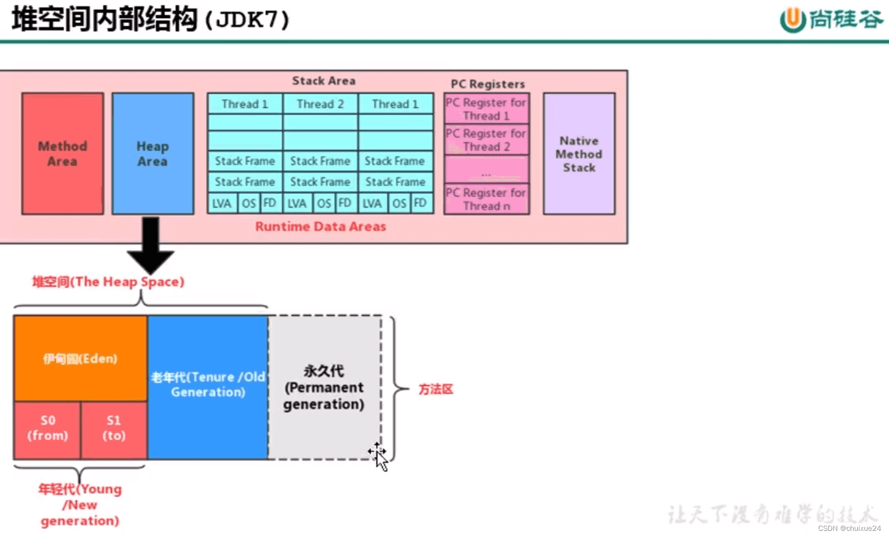​

### 堆内存细分

‍

现代垃圾收集器大部分都基于分代收集理论设计，堆空间细分为

* Java7 及之前堆内存逻辑上分为三部分：**新生区+养老区+永久区**

  * Young Generation Space 新生区 Young/New

    * 又被划分为Eden区和Survivor区
  * Old generation space 养老区 Old/Tenure
  * Permanent Space 永久区 Perm
* Java 8及之后堆内存逻辑上分为三部分：**新生区+养老区+元空间**

  * Young Generation Space 新生区，又被划分为Eden区和Survivor区
  * Old generation space 养老区
  * Meta Space 元空间 Meta

‍

**约定：** 新生区 <–> 新生代 <–> 年轻代 、 养老区 <–> 老年区 <–> 老年代、 永久区 <–> 永久代

堆空间内部结构，JDK1.8之前从永久代 替换成 元空间

‍

​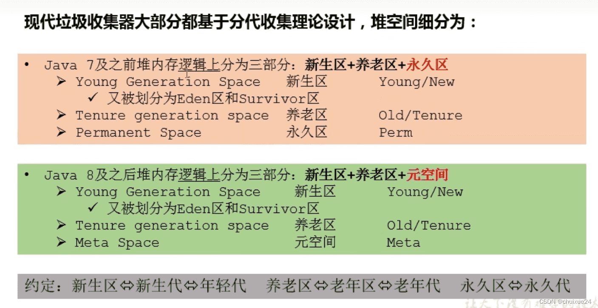​

‍

‍

## 设置虚拟机参数

​`-Xms600m -Xmx600m`​

‍

### 设置堆内存

1. Java堆区用于存储Java对象实例，那么堆的大小在JVM启动时就已经设定好了

    *  **-Xms**用于表示堆区的起始内存，等价于 **-XX:InitialHeapSize**
    *  **-Xmx**则用于表示堆区的最大内存，等价于 **-XX:MaxHeapSize**
2. 一旦堆区中的内存大小超过“-Xmx"所指定的最大内存时，将会抛出OutofMemoryError异常。
3. 通常会将-Xms和-Xmx两个参数配置相同的值

* 原因：假设两个不一样，初始内存小，最大内存大。在运行期间如果堆内存不够用了，会一直扩容直到最大内存。如果内存够用且多了，也会不断的缩容释放。频繁的扩容和释放造成不必要的压力，避免在GC之后调整堆内存给服务器带来压力。
* 如果两个设置一样的就少了频繁扩容和缩容的步骤。内存不够了就直接报OOM

4. 默认情况下:

    * 初始内存大小：物理电脑内存大小/64
    * 最大内存大小：物理电脑内存大小/4

```java
/**
 * 1. 设置堆空间大小的参数
 * -Xms 用来设置堆空间（年轻代+老年代）的初始内存大小
 *      -X 是jvm的运行参数
 *      ms 是memory start
 * -Xmx 用来设置堆空间（年轻代+老年代）的最大内存大小
 *
 * 2. 默认堆空间的大小
 *    初始内存大小：物理电脑内存大小 / 64
 *             最大内存大小：物理电脑内存大小 / 4
 * 3. 手动设置：-Xms600m -Xmx600m
 *     开发中建议将初始堆内存和最大的堆内存设置成相同的值。
 *
 * 4. 查看设置的参数：方式一： jps   /  jstat -gc 进程id
 *                  方式二：-XX:+PrintGCDetails
 */
public class HeapSpaceInitial {
    public static void main(String[] args) {

        //返回Java虚拟机中的堆内存总量
        long initialMemory = Runtime.getRuntime().totalMemory() / 1024 / 1024;
        //返回Java虚拟机试图使用的最大堆内存量
        long maxMemory = Runtime.getRuntime().maxMemory() / 1024 / 1024;

        System.out.println("-Xms : " + initialMemory + "M");
        System.out.println("-Xmx : " + maxMemory + "M");

        System.out.println("系统内存大小为：" + initialMemory * 64.0 / 1024 + "G");
        System.out.println("系统内存大小为：" + maxMemory * 4.0 / 1024 + "G");

        try {
            Thread.sleep(1000000);
        } catch (InterruptedException e) {
            e.printStackTrace();
        }
    }
}
```

‍

‍

#### 查看内存情况

**方式一： jps / jstat -gc 进程id**

‍

> jps：查看java进程
>
> jstat：查看某进程内存使用情况

```
SOC: S0区总共容量
S1C: S1区总共容量
S0U: S0区使用的量
S1U: S1区使用的量
EC: 伊甸园区总共容量
EU: 伊甸园区使用的量
OC: 老年代总共容量
OU: 老年代使用的量
```

‍

**方式二：-XX:+PrintGCDetails**

‍

‍

### 设置OOM

```java
public class OOMTest {
    public static void main(String[] args) {
        ArrayList<Picture> list = new ArrayList<>();
        while(true){
            try {
                Thread.sleep(20);
            } catch (InterruptedException e) {
                e.printStackTrace();
            }
            list.add(new Picture(new Random().nextInt(1024 * 1024)));
        }
    }
}

class Picture{
    private byte[] pixels;

    public Picture(int length) {
        this.pixels = new byte[length];
    }
}
```

‍

‍

‍

## 对象分配过程

为新对象分配内存是一件非常严谨和复杂的任务，JVM的设计者们不仅需要考虑内存如何分配、在哪里分配等问题，并且由于内存分配算法与内存回收算法密切相关，所以还需要考虑GC执行完内存回收后是否会在内存空间中产生内存碎片。

‍

**具体过程**

‍

​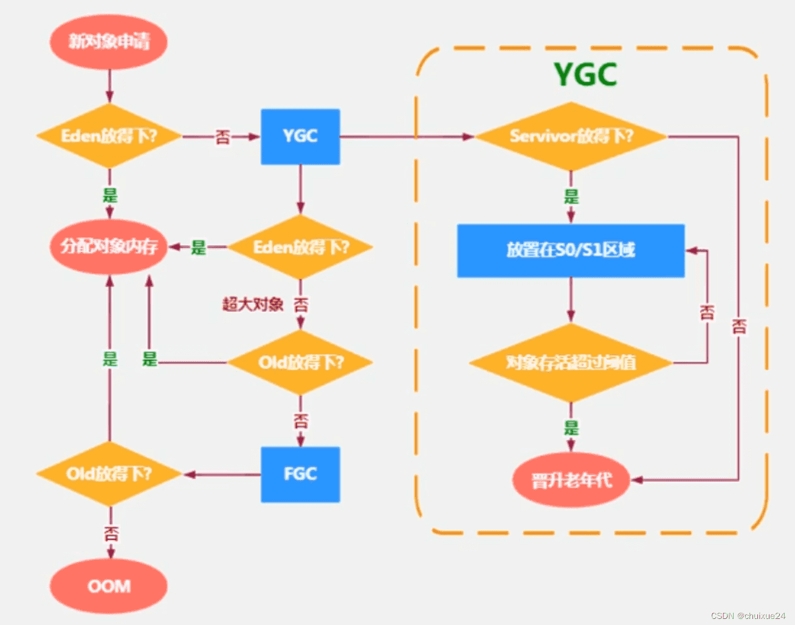​

‍

1. new的对象先放伊甸园区。此区有大小限制。
2. 当伊甸园的空间填满时，程序又需要创建对象，JVM的垃圾回收器将对伊甸园区进行垃圾回收（MinorGC），将伊甸园区中的不再被其他对象所引用的对象进行销毁。再加载新的对象放到伊甸园区。
3. 然后将伊甸园中的剩余对象移动到幸存者0区。
4. 如果再次触发垃圾回收，此时上次幸存下来的放到幸存者0区的，如果没有回收，就会放到幸存者1区。
5. 如果再次经历垃圾回收，此时会重新放回幸存者0区，接着再去幸存者1区。
6. 啥时候能去养老区呢？可以设置次数。默认是15次。可以设置新生区进入养老区的年龄限制，设置 JVM 参数： **-XX:MaxTenuringThreshold**=N 进行设置
7. 在养老区，相对悠闲。当养老区内存不足时，再次触发GC：Major GC，进行养老区的内存清理
8. 若养老区执行了Major GC之后，发现依然无法进行对象的保存，就会产生OOM异常。

‍

​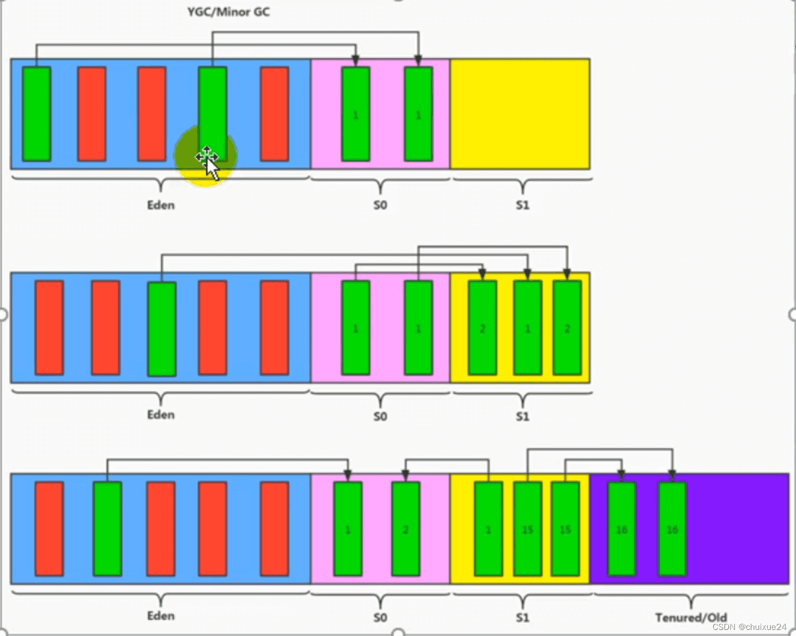​

1、我们创建的对象，一般都是存放在Eden区的，**当我们Eden区满了后，就会触发GC操作**，一般被称为 YGC / Minor GC操作

2、当我们进行一次垃圾收集后，红色的对象将会被回收，而绿色的独享还被占用着，存放在S0(Survivor From)区。同时我们给每个对象设置了一个年龄计数器，经过一次回收后还存在的对象，将其年龄加 1。

3、同时Eden区继续存放对象，当Eden区再次存满的时候，又会触发一个MinorGC操作，此时GC将会把 Eden和Survivor From中的对象进行一次垃圾收集，把存活的对象放到 Survivor To（S1）区，同时让存活的对象年龄 + 1

> 下一次再进行GC的时候，
>
> 1、这一次的s0区为空，所以成为下一次GC的S1区
>
> 2、这一次的s1区则成为下一次GC的S0区
>
> 3、也就是说s0区和s1区在互相转换。

4、我们继续不断的进行对象生成和垃圾回收，当Survivor中的对象的年龄达到15的时候，将会触发一次 Promotion 晋升的操作，也就是将年轻代中的对象晋升到老年代中

‍

> 我的的脑中会浮现一个巨大的圆桶型漏斗, 中间的一个地球仪东西半球方式, 赤道180度经线正中开孔, 地心相连的模型. 上面的人在零重力环境下缓慢增多, 挤满之后就有宇宙人来抓一部分去屠宰, 剩下的一部分让其进入地球朝着阳光的上半球生活. 又一段时间后又要屠宰了, 地球翻一个面, 人们又从黑暗的上半球转移到下半球(地表上的人), 宇宙空间中也有晋升的也有被杀的. 一部分勇敢的人类到达了圆筒底部的"殖民地", 建立起自己的开采站, 免受外星人的侵扰

关于垃圾回收：频繁在新生区收集，很少在养老区收集，几乎不在永久区/元空间收集。

‍

‍

### 特殊情况

‍

**对象分配的特殊情况**

‍

1. 如果来了一个新对象，先看看 Eden 是否放的下？

    * 如果 Eden 放得下，则直接放到 Eden 区
    * 如果 Eden 放不下，则触发 YGC ，执行垃圾回收，看看还能不能放下？
2. 将对象放到老年区又有两种情况：

    * 如果 Eden 执行了 YGC 还是无法放不下该对象，那没得办法，只能说明是超大对象，只能直接放到老年代
    * 那万一老年代都放不下，则先触发FullGC ，再看看能不能放下，放得下最好，但如果还是放不下，那只能报 OOM
3. 如果 Eden 区满了，将对象往幸存区拷贝时，发现幸存区放不下啦，那只能便宜了某些新对象，让他们直接晋升至老年区

‍

‍

‍

### 常用调优工具

‍

1. JDK命令行
2. Eclipse：Memory Analyzer Tool
3. Jconsole
4. Visual VM（实时监控，推荐）
5. Jprofiler（IDEA插件）
6. Java Flight Recorder（实时监控）
7. GCViewer
8. GCEasy

‍

## GC分类

我们都知道，JVM的调优的一个环节，也就是垃圾收集，我们需要尽量的避免垃圾回收，因为在垃圾回收的过程中，容易出现STW（Stop the World）的问题，**而 Major GC 和 Full GC出现STW的时间，是Minor GC的10倍以上**

JVM在进行GC时，并非每次都对上面三个内存区域一起回收的，大部分时候回收的都是指新生代。针对Hotspot VM的实现，它里面的GC按照回收区域又分为两大种类型：一种是部分收集（Partial GC），一种是整堆收集（FullGC）

‍

部分收集：不是完整收集整个Java堆的垃圾收集。其中又分为：

* **新生代收集**（Minor GC/Young GC）：只是新生代（Eden，s0，s1）的垃圾收集
* **老年代收集**（Major GC/Old GC）：只是老年代的圾收集。
* 目前，只有CMS GC会有单独收集老年代的行为。
* 注意，很多时候Major GC会和Full GC混淆使用，需要具体分辨是老年代回收还是整堆回收。
* 混合收集（Mixed GC）：收集整个新生代以及部分老年代的垃圾收集。目前，只有G1 GC会有这种行为

‍

**整堆收集**（Full GC）：收集整个java堆和方法区的垃圾收集。

> 由于历史原因，外界各种解读，majorGC和Full GC有些混淆。

‍

**针对HotSpot VM的实现，它里面的GC其实准确分类只有两大种：**

* ==Partial GC==：并不收集整个GC堆的模式

  * Young GC：只收集young gen的GC
  * Old GC：只收集old gen的GC。只有CMS的concurrent collection是这个模式
  * Mixed GC：收集整个young gen以及部分old gen的GC。只有G1有这个模式
* ==Full GC==：收集整个堆，包括young gen、old gen、perm gen（如果存在的话）等所有部分的模式。

‍

Major GC通常是跟full GC是等价的，收集整个GC堆。但因为HotSpot VM发展了这么多年，外界对各种名词的解读已经完全混乱了，当有人说“major GC”的时候一定要问清楚他想要指的是上面的full GC还是old GC。

最简单的分代式GC策略，按HotSpot VM的serial GC的实现来看，触发条件是：

* young GC：当young gen中的eden区分配满的时候触发。注意young GC中有部分存活对象会晋升到old gen，所以young GC后old gen的占用量通常会有所升高。
* full GC：当准备要触发一次young GC时，如果发现统计数据说之前young GC的平均晋升大小比目前old gen剩余的空间大，则不会触发young GC而是转为触发full GC（因为HotSpot VM的GC里，除了CMS的concurrent collection之外，其它能收集old gen的GC都会同时收集整个GC堆，包括young gen，所以不需要事先触发一次单独的young GC）；或者，如果有perm gen的话，要在perm gen分配空间但已经没有足够空间时，也要触发一次full GC；或者System.gc()、heap dump带GC，默认也是触发full GC。

HotSpot VM里其它非并发GC的触发条件复杂一些，不过大致的原理与上面说的其实一样。

‍

‍

### Young GC

**年轻代 GC（Minor GC）触发机制**

* 当年轻代空间不足时，就会触发Minor GC，这里的年轻代满指的是Eden代满。Survivor满不会主动引发GC，在Eden区满的时候，会顺带触发s0区的GC，也就是被动触发GC（每次Minor GC会清理年轻代的内存）
* 因为Java对象大多都具备朝生夕灭的特性，所以Minor GC非常频繁，一般回收速度也比较快。这一定义既清晰又易于理解。
* Minor GC会引发STW（Stop The World），暂停其它用户的线程，等垃圾回收结束，用户线程才恢复运行

‍

### Major/Full GC

> Full GC有争议，后续详解两者区别

**老年代GC（MajorGC）触发机制**

* 指发生在老年代的GC，对象从老年代消失时，我们说 “Major Gc” 或 “Full GC” 发生了
* 出现了MajorGc，经常会伴随至少一次的Minor GC。（但非绝对的，在Parallel Scavenge收集器的收集策略里就有直接进行MajorGC的策略选择过程）

  * 也就是在老年代空间不足时，会先尝试触发Minor GC（哈？我有点迷？），如果之后空间还不足，则触发Major GC
* Major GC的速度一般会比Minor GC慢10倍以上，STW的时间更长。
* 如果Major GC后，内存还不足，就报OOM了

---

**Full GC 触发机制**

**触发Full GC执行的情况有如下五种：**

1. 调用System.gc()时，系统建议执行FullGC，但是不必然执行
2. 老年代空间不足
3. 方法区空间不足
4. 通过Minor GC后进入老年代的平均大小大于老年代的可用内存
5. 由Eden区、survivor space0（From Space）区向survivor space1（To Space）区复制时，对象大小大于To Space可用内存，则把该对象转存到老年代，且老年代的可用内存小于该对象大小

说明：Full GC 是开发或调优中尽量要避免的。这样STW时间会短一些

‍

## 回收策略

‍

### 触发条件

内存垃圾回收机制主要集中的区域就是线程共享区域：**堆和方法区**

Minor GC 触发条件非常简单，当 Eden 空间满时，就将触发一次 Minor GC

FullGC 同时回收新生代、老年代和方法区，只会存在一个 FullGC 的线程进行执行，其他的线程全部会被**挂起**，有以下触发条件：

* 调用 System.gc()：

  * 在默认情况下，通过 System.gc() 或 Runtime.getRuntime().gc() 的调用，会显式触发 FullGC，同时对老年代和新生代进行回收，但是虚拟机不一定真正去执行，无法保证对垃圾收集器的调用
  * 不建议使用这种方式，应该让虚拟机管理内存. 一般情况下，垃圾回收应该是自动进行的，无须手动触发；在一些特殊情况下，如正在编写一个性能基准，可以在运行之间调用 System.gc()
* 老年代空间不足：

  * 为了避免引起的 Full GC，应当尽量不要创建过大的对象以及数组
  * 通过 -Xmn 参数调整新生代的大小，让对象尽量在新生代被回收掉不进入老年代，可以通过 `-XX:MaxTenuringThreshold`​ 调大对象进入老年代的年龄，让对象在新生代多存活一段时间
* 空间分配担保失败
* JDK 1.7 及以前的永久代（方法区）空间不足
* Concurrent Mode Failure：执行 CMS GC 的过程中同时有对象要放入老年代，而此时老年代空间不足（可能是 GC 过程中浮动垃圾过多导致暂时性的空间不足），便会报 Concurrent Mode Failure 错误，并触发 Full GC

手动 GC 测试，VM参数：`-XX:+PrintGcDetails`​

```java
public void localvarGC1() {
    byte[] buffer = new byte[10 * 1024 * 1024];//10MB
    System.gc();	//输出: 不会被回收, FullGC时被放入老年代
}

public void localvarGC2() {
    byte[] buffer = new byte[10 * 1024 * 1024];
    buffer = null;
    System.gc();	//输出: 正常被回收
}
 public void localvarGC3() {
     {
         byte[] buffer = new byte[10 * 1024 * 1024];
     }
     System.gc();	//输出: 不会被回收, FullGC时被放入老年代
 }

public void localvarGC4() {
    {
        byte[] buffer = new byte[10 * 1024 * 1024];
    }
    int value = 10;
    System.gc();	//输出: 正常被回收，slot复用，局部变量过了其作用域 buffer置空
}
```

‍

## 堆空间分代思想

为什么要把Java堆分代？不分代就不能正常工作了吗？

‍

经研究，不同对象的生命周期不同。70%-99%的对象是临时对象。

* 新生代：有Eden、两块大小相同的survivor（又称为from/to或s0/s1）构成，to总为空。
* 老年代：存放新生代中经历多次GC仍然存活的对象。

‍

其实不分代完全可以，分代的唯一理由就是优化GC性能。

* 如果没有分代，那所有的对象都在一块，就如同把一个学校的人都关在一个教室。GC的时候要找到哪些对象没用，这样就会对堆的所有区域进行扫描。（性能低）
* 而很多对象都是朝生夕死的，如果分代的话，把新创建的对象放到某一地方，当GC的时候先把这块存储“朝生夕死”对象的区域进行回收，这样就会腾出很大的空间出来。（多回收新生代，少回收老年代，性能会提高很多）

‍

‍

##### 分代介绍

‍

Java8 时，堆被分为了两份：新生代和老年代（1:2），在 Java7 时，还存在一个永久代

* 新生代使用：复制算法
* 老年代使用：标记 - 清除 或者 标记 - 整理 算法

**Minor GC 和 Full GC**：

* Minor GC：回收新生代，新生代对象存活时间很短，所以 Minor GC 会频繁执行，执行的速度比较快
* Full GC：回收老年代和新生代，老年代对象其存活时间长，所以 Full GC 很少执行，执行速度会比 Minor GC 慢很多

Eden 和 Survivor 大小比例默认为 8:1:1

<div>

</div>

​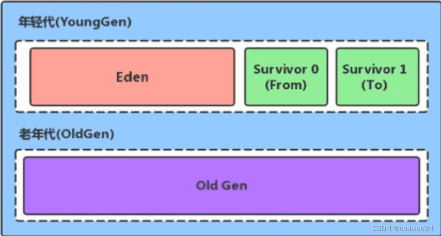​

‍

‍

* 存储在JVM中的Java对象可以被划分为两类：

  * 一类是生命周期较短的瞬时对象，这类对象的创建和消亡都非常迅速
  * 另外一类对象的生命周期却非常长，在某些极端的情况下还能够与JVM的生命周期保持一致
* Java堆区进一步细分的话，可以划分为年轻代（YoungGen）和老年代（oldGen）
* 其中年轻代又可以划分为Eden空间、Survivor0空间和Survivor1空间（有时也叫做from区、to区）

‍

‍

* 配置新生代与老年代在堆结构的占比

  * 默认 **-XX:NewRatio**=2，表示新生代占1，老年代占2，新生代占整个堆的1/3
  * 可以修改 **-XX:NewRatio**=4，表示新生代占1，老年代占4，新生代占整个堆的1/5

‍

* 在HotSpot中，Eden空间和另外两个survivor空间缺省所占的比例是8 : 1 : 1，
* 当然开发人员可以通过选项 **-XX:SurvivorRatio**调整这个空间比例。比如-XX:SurvivorRatio=8
* 几乎所有的Java对象都是在Eden区被new出来的。
* 绝大部分的Java对象的销毁都在新生代进行了（有些大的对象在Eden区无法存储时候，将直接进入老年代），IBM公司的专门研究表明，新生代中80%的对象都是“朝生夕死”的。
* 可以使用选项"-Xmn"设置新生代最大内存大小，但这个参数一般使用默认值就可以了。

‍

##### 分代分配

‍

工作机制：

* **对象优先在 Eden 分配**：当创建一个对象的时候，对象会被分配在新生代的 Eden 区，当 Eden 区要满了时候，触发 YoungGC
* 当进行 YoungGC 后，此时在 Eden 区存活的对象被移动到 to 区，并且当前对象的年龄会加 1，清空 Eden 区
* 当再一次触发 YoungGC 的时候，会把 Eden 区中存活下来的对象和 to 中的对象，移动到 from 区中，这些对象的年龄会加 1，清空 Eden 区和 to 区
* To 区永远是空 Survivor 区，From 区是有数据的，每次 MinorGC 后两个区域互换
* From 区和 To 区 也可以叫做 S0 区和 S1 区

‍

晋升到老年代：

* **长期存活的对象进入老年代**：为对象定义年龄计数器，对象在 Eden 出生并经过 Minor GC 依然存活，将移动到 Survivor 中，年龄就增加 1 岁，增加到一定年龄则移动到老年代中

  ​`-XX:MaxTenuringThreshold`​：定义年龄的阈值，对象头中用 4 个 bit 存储，所以最大值是 15，默认也是 15
* **大对象直接进入老年代**：需要连续内存空间的对象，最典型的大对象是很长的字符串以及数组；避免在 Eden 和 Survivor 之间的大量复制；经常出现大对象会提前触发 GC 以获取足够的连续空间分配给大对象

  ​`-XX:PretenureSizeThreshold`​：大于此值的对象直接在老年代分配
* **动态对象年龄判定**：如果在 Survivor 区中相同年龄的对象的所有大小之和超过 Survivor 空间的一半，年龄大于等于该年龄的对象就可以直接进入老年代

‍

空间分配担保：

* 在发生 Minor GC 之前，虚拟机先检查老年代最大可用的连续空间是否大于新生代所有对象总空间，如果条件成立的话，那么 Minor GC 可以确认是安全的
* 如果不成立，虚拟机会查看 HandlePromotionFailure 的值是否允许担保失败，如果允许那么就会继续检查老年代最大可用的连续空间是否大于历次晋升到老年代对象的平均大小，如果大于将尝试着进行一次 Minor GC；如果小于或者 HandlePromotionFailure 的值不允许冒险，那么就要进行一次 Full GC

‍

‍

## 内存分配策略

‍

### 对象提升(Promotion)规则

* 如果对象在Eden出生并经过第一次Minor GC后仍然存活，并且能被Survivor容纳的话，将被移动到Survivor空间中，并将对象**年龄设为1**。
* 对象在Survivor区中每熬过一次MinorGC，年龄就增加1岁，当它的年龄增加到一定程度（默认为15岁，其实每个JVM、每个GC都有所不同）时，就会被晋升到老年代
* 对象晋升老年代的年龄阀值，可以通过选项 **-XX:MaxTenuringThreshold**来设置

‍

**针对不同年龄段的对象分配原则如下所示：**

* **优先分配到Eden**：开发中比较长的字符串或者数组，会直接存在老年代，但是因为新创建的对象都是朝生夕死的，所以这个大对象可能也很快被回收，但是因为老年代触发Major GC的次数比 Minor GC要更少，因此可能回收起来就会比较慢
* **大对象直接分配到老年代**：尽量避免程序中出现过多的大对象
* **长期存活的对象分配到老年代**
* **动态对象年龄判断**：如果Survivor区中相同年龄的所有对象大小的总和大于Survivor空间的一半，年龄大于或等于该年龄的对象可以直接进入老年代，无须等到MaxTenuringThreshold中要求的年龄。
* **空间分配担保**： -XX:HandlePromotionFailure

‍

‍

### 两种方式

不分配内存的对象无法进行其他操作，JVM 为对象分配内存的过程：首先计算对象占用空间大小，接着在堆中划分一块内存给新对象

* 如果内存规整，使用指针碰撞（Bump The Pointer）. 所有用过的内存在一边，空闲的内存在另外一边，中间有一个指针作为分界点的指示器，分配内存就仅仅是把指针向空闲那边挪动一段与对象大小相等的距离
* 如果内存不规整，虚拟机需要维护一个空闲列表（Free List）分配. 已使用的内存和未使用的内存相互交错，虚拟机维护了一个列表，记录上哪些内存块是可用的，再分配的时候从列表中找到一块足够大的空间划分给对象实例，并更新列表上的内容

‍

## TLAB 为对象分配内存

（保证线程安全）

### Why

* 堆区是线程共享区域，任何线程都可以访问到堆区中的共享数据
* 由于对象实例的创建在JVM中非常频繁，因此在并发环境下从堆区中划分内存空间是线程不安全的
* 为避免多个线程操作同一地址，需要使用**加锁等机制**，进而影响分配速度。

​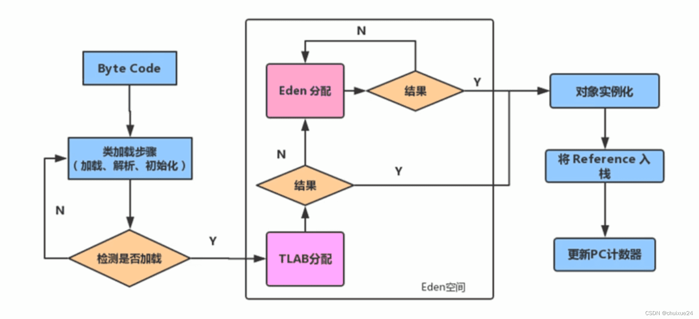​

‍

### What

TLAB（Thread Local Allocation Buffer）

1. 从内存模型而不是垃圾收集的角度，对Eden区域继续进行划分，**JVM为每个线程分配了一个私有缓存区域，它包含在Eden空间内**。
2. 多线程同时分配内存时，使用TLAB可以避免一系列的非线程安全问题，同时还能够提升内存分配的吞吐量，因此我们可以将这种内存分配方式称之为**快速分配策略**。
3. 据我所知所有OpenJDK衍生出来的JVM都提供了TLAB的设计。

‍

1、每个线程都有一个TLAB空间

2、当一个线程的TLAB存满时，可以使用公共区域（蓝色）的

‍

TLAB：Thread Local Allocation Buffer，为每个线程在堆内单独分配了一个缓冲区，多线程分配内存时，使用 TLAB 可以避免线程安全问题，同时还能够提升内存分配的吞吐量，这种内存分配方式叫做**快速分配策略**

* 栈上分配使用的是栈来进行对象内存的分配
* TLAB 分配使用的是 Eden 区域进行内存分配，属于堆内存

堆区是线程共享区域，任何线程都可以访问到堆区中的共享数据，由于对象实例的创建在 JVM 中非常频繁，因此在并发环境下为避免多个线程操作同一地址，需要使用加锁等机制，进而影响分配速度

‍

问题：堆空间都是共享的么？ 不一定，因为还有 TLAB，在堆中划分出一块区域，为每个线程所独占

​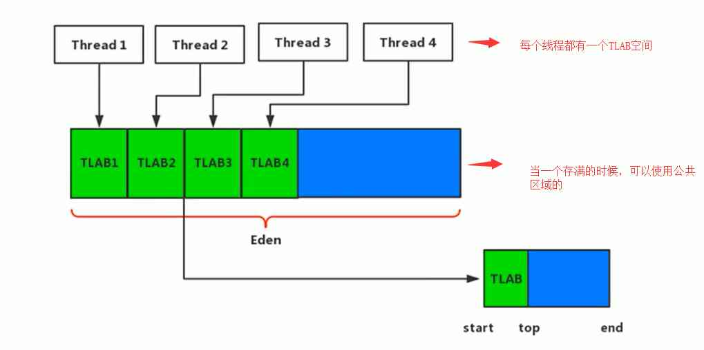​

JVM 是将 TLAB 作为内存分配的首选，但不是所有的对象实例都能够在 TLAB 中成功分配内存，一旦对象在 TLAB 空间分配内存失败时，JVM 就会通过**使用加锁机制确保数据操作的原子性**，从而直接在堆中分配内存

栈上分配优先于 TLAB 分配进行，逃逸分析中若可进行栈上分配优化，会优先进行对象栈上直接分配内存

参数设置：

* ​`-XX:UseTLAB`​：设置是否开启 TLAB 空间
* ​`-XX:TLABWasteTargetPercent`​：设置 TLAB 空间所占用 Eden 空间的百分比大小，默认情况下 TLAB 空间的内存非常小，仅占有整个 Eden 空间的1%
* ​`-XX:TLABRefillWasteFraction`​：指当 TLAB 空间不足，请求分配的对象内存大小超过此阈值时不会进行 TLAB 分配，直接进行堆内存分配，否则还是会优先进行 TLAB 分配

​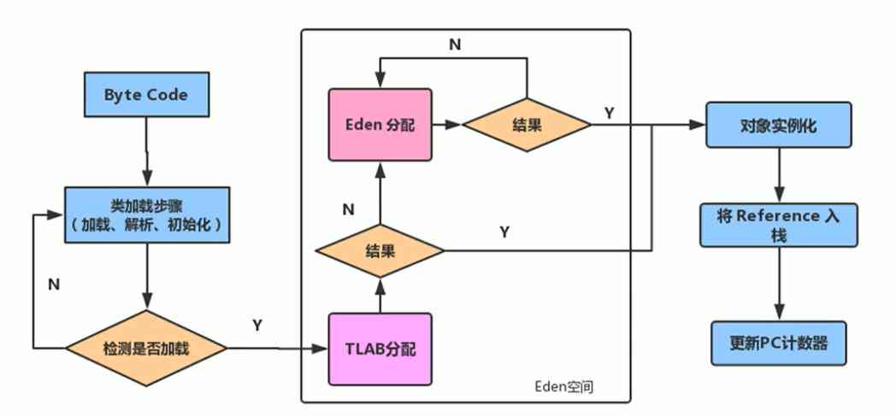​

‍

### 补充

1. 尽管不是所有的对象实例都能够在TLAB中成功分配内存，但**JVM确实是将TLAB作为内存分配的首选**。
2. 在程序中，开发人员可以通过选项“ **-XX:UseTLAB**”设置是否开启TLAB空间。
3. 默认情况下，TLAB空间的内存非常小，仅占有整个Eden空间的1%，当然我们可以通过选项“ **-XX:TLABWasteTargetPercent**”设置TLAB空间所占用Eden空间的百分比大小。
4. 一旦对象在TLAB空间分配内存失败时，JVM就会尝试着通过**使用加锁机制确保数据操作的原子性**，从而直接在Eden空间中分配内存。

> 1、哪个线程要分配内存，就在哪个线程的本地缓冲区中分配，只有本地缓冲区用完 了，**分配新的缓存区时才需要同步锁定** ----这是《深入理解JVM》--第三版里说的
>
> 2、和这里讲的有点不同。我猜测说的意思是某一次分配，如果TLAB用完了，那么**这一次**先在Eden区直接分配。空闲下来后再加锁分配新的TLAB（TLAB内存较大，分配时间应该较长）

‍

‍

## 堆空间参数设置

‍

### 常用

> **官方文档**：[https://docs.oracle.com/javase/8/docs/technotes/tools/unix/java.html](https://docs.oracle.com/javase/8/docs/technotes/tools/unix/java.html)
>
> 我们只说常用的

‍

```java
/**
 * 测试堆空间常用的jvm参数：
 * -XX:+PrintFlagsInitial : 查看所有的参数的默认初始值
 * -XX:+PrintFlagsFinal  ：查看所有的参数的最终值（可能会存在修改，不再是初始值）
 *      具体查看某个参数的指令： jps：查看当前运行中的进程
 *                             jinfo -flag SurvivorRatio 进程id
 *
 * -Xms：初始堆空间内存 （默认为物理内存的1/64）
 * -Xmx：最大堆空间内存（默认为物理内存的1/4）
 * -Xmn：设置新生代的大小。(初始值及最大值)
 * -XX:NewRatio：配置新生代与老年代在堆结构的占比
 * -XX:SurvivorRatio：设置新生代中Eden和S0/S1空间的比例
 * -XX:MaxTenuringThreshold：设置新生代垃圾的最大年龄
 * -XX:+PrintGCDetails：输出详细的GC处理日志
 * 打印gc简要信息：① -XX:+PrintGC   ② -verbose:gc
 * -XX:HandlePromotionFailure：是否设置空间分配担保
 */
```

‍

###  **-XX:HandlePromotionFailure：是否**空间分配担保

‍

在发生Minor GC之前，虚拟机会检查老年代最大可用的连续空间是否大于新生代所有对象的总空间。

* 如果大于，则此次Minor GC是安全的
* 如果小于，则虚拟机会查看 **-XX:HandlePromotionFailure**设置值是否允担保失败。

  * 如果HandlePromotionFailure=true，那么会继续检查**老年代最大可用连续空间是否大于历次晋升到老年代的对象的平均大小**。

    * 如果大于，则尝试进行一次Minor GC，但这次Minor GC依然是有风险的；
    * 如果小于，则进行一次Full GC。
  * 如果HandlePromotionFailure=false，则进行一次Full GC。

‍

**历史版本**

1. 在JDK6 Update 24之后，HandlePromotionFailure参数不会再影响到虚拟机的空间分配担保策略，观察openJDK中的源码变化，虽然源码中还定义了HandlePromotionFailure参数，但是在代码中已经不会再使用它。
2. JDK6 Update 24之后的规则变为**只要老年代的连续空间大于新生代对象总大小或者历次晋升的平均大小就会进行Minor GC**，否则将进行Full GC。即 HandlePromotionFailure=true

‍

‍

## 堆是分配对象的唯一选择么？

**在《深入理解Java虚拟机》中关于Java堆内存有这样一段描述：**

* 随着JIT编译期的发展与**逃逸分析技术**逐渐成熟，**栈上分配、标量替换**优化技术将会导致一些微妙的变化，所有的对象都分配到堆上也渐渐变得不那么“绝对”了。
* 在Java虚拟机中，对象是在Java堆中分配内存的，这是一个普遍的常识。但是，有一种特殊情况，那就是**如果经过逃逸分析（Escape Analysis）后发现，一个对象并没有逃逸出方法的话，那么就可能被优化成栈上分配**。这样就无需在堆上分配内存，也无须进行垃圾回收了。这也是最常见的堆外存储技术。
* 此外，前面提到的基于OpenJDK深度定制的TaoBao VM，其中创新的GCIH（GC invisible heap）技术实现off-heap，将生命周期较长的Java对象从heap中移至heap外，并且GC不能管理GCIH内部的Java对象，以此达到降低GC的回收频率和提升GC的回收效率的目的。

‍

‍

### 逃逸分析

* 如何将堆上的对象分配到栈，需要使用逃逸分析手段。
* 这是一种可以有效减少Java程序中同步负载和内存堆分配压力的跨函数全局数据流分析算法。
* 通过逃逸分析，Java Hotspot编译器能够分析出一个新的对象的引用的使用范围从而决定是否要将这个对象分配到堆上。
* 逃逸分析的基本行为就是分析对象动态作用域：

  * 当一个对象在方法中被定义后，对象只在方法内部使用，则认为没有发生逃逸。
  * 当一个对象在方法中被定义后，它被外部方法所引用，则认为发生逃逸。例如作为调用参数传递到其他地方中。

---

即时编译（Just-in-time Compilation，JIT）是一种通过在运行时将字节码翻译为机器码，从而改善性能的技术，在 HotSpot 实现中有多种选择：C1、C2 和 C1+C2，分别对应 Client、Server 和分层编译

* C1 编译速度快，优化方式比较保守；C2 编译速度慢，优化方式比较激进
* C1+C2 在开始阶段采用 C1 编译，当代码运行到一定热度之后采用 C2 重新编译

逃逸分析并不是直接的优化手段，而是一个代码分析方式，通过动态分析对象的作用域，为优化手段如栈上分配、标量替换和同步消除等提供依据，发生逃逸行为的情况有两种：方法逃逸和线程逃逸

* 方法逃逸：当一个对象在方法中定义之后，被外部方法引用

  * 全局逃逸：一个对象的作用范围逃出了当前方法或者当前线程，比如对象是一个静态变量、全局变量赋值、已经发生逃逸的对象、作为当前方法的返回值
  * 参数逃逸：一个对象被作为方法参数传递或者被参数引用
* 线程逃逸：如类变量或实例变量，可能被其它线程访问到

如果不存在逃逸行为，则可以对该对象进行如下优化：同步消除、标量替换和栈上分配

* 同步消除

  线程同步本身比较耗时，如果确定一个对象不会逃逸出线程，不被其它线程访问到，那对象的读写就不会存在竞争，则可以消除对该对象的**同步锁**，通过 `-XX:+EliminateLocks`​ 可以开启同步消除 ( - 号关闭)
* 标量替换

  * 标量替换：如果把一个对象拆散，将其成员变量恢复到基本类型来访问
  * 标量 (scalar) ：不可分割的量，如基本数据类型和 reference 类型

    聚合量 (Aggregate)：一个数据可以继续分解，对象一般是聚合量
  * 如果逃逸分析发现一个对象不会被外部访问，并且该对象可以被拆散，那么经过优化之后，并不直接生成该对象，而是将该对象成员变量分解若干个被这个方法使用的成员变量所代替
  * 参数设置：

    * ​`-XX:+EliminateAllocations`​：开启标量替换
    * ​`-XX:+PrintEliminateAllocations`​：查看标量替换情况
* 栈上分配

  JIT 编译器在编译期间根据逃逸分析的结果，如果一个对象没有逃逸出方法的话，就可能被优化成栈上分配. 分配完成后，继续在调用栈内执行，最后线程结束，栈空间被回收，局部变量对象也被回收，这样就无需 GC

  User 对象的作用域局限在方法 fn 中，可以使用标量替换的优化手段在栈上分配对象的成员变量，这样就不会生成 User 对象，大大减轻 GC 的压力

  ```java
  public class JVM {
      public static void main(String[] args) throws Exception {
          int sum = 0;
          int count = 1000000;
          //warm up
          for (int i = 0; i < count ; i++) {
              sum += fn(i);
          }
          System.out.println(sum);
          System.in.read();
      }
      private static int fn(int age) {
          User user = new User(age);
          int i = user.getAge();
          return i;
      }
  }

  class User {
      private final int age;

      public User(int age) {
          this.age = age;
      }

      public int getAge() {
          return age;
      }
  }
  ```

‍

**逃逸分析举例**

1、没有发生逃逸的对象，则可以分配到栈（无线程安全问题）上，随着方法执行的结束，栈空间就被移除（也就无需GC）

```java
public void my_method() {
    V v = new V();
    // use v
    // ....
    v = null;
}
```

2、下面代码中的 StringBuffer sb 发生了逃逸，不能在栈上分配

```java
public static StringBuffer createStringBuffer(String s1, String s2) {
    StringBuffer sb = new StringBuffer();
    sb.append(s1);
    sb.append(s2);
    return sb;
}
```

3、如果想要StringBuffer sb不发生逃逸，可以这样写

```java
public static String createStringBuffer(String s1, String s2) {
    StringBuffer sb = new StringBuffer();
    sb.append(s1);
    sb.append(s2);
    return sb.toString();
}
```

```java
/**
 * 逃逸分析
 *
 *  如何快速的判断是否发生了逃逸分析，大家就看new的对象实体是否有可能在方法外被调用。
 */
public class EscapeAnalysis {

    public EscapeAnalysis obj;

    /*
    方法返回EscapeAnalysis对象，发生逃逸
     */
    public EscapeAnalysis getInstance(){
        return obj == null? new EscapeAnalysis() : obj;
    }
    /*
    为成员属性赋值，发生逃逸
     */
    public void setObj(){
        this.obj = new EscapeAnalysis();
    }
    //思考：如果当前的obj引用声明为static的？仍然会发生逃逸。

    /*
    对象的作用域仅在当前方法中有效，没有发生逃逸
     */
    public void useEscapeAnalysis(){
        EscapeAnalysis e = new EscapeAnalysis();
    }
    /*
    引用成员变量的值，发生逃逸
     */
    public void useEscapeAnalysis1(){
        EscapeAnalysis e = getInstance();
        //getInstance().xxx()同样会发生逃逸
    }
}

```

‍

**逃逸分析参数设置**

* 在JDK 1.7 版本之后，HotSpot中默认就已经开启了逃逸分析
* 如果使用的是较早的版本，开发人员则可以通过：

  * 选项“-XX:+DoEscapeAnalysis"显式开启逃逸分析
  * 通过选项“-XX:+PrintEscapeAnalysis"查看逃逸分析的筛选结果

‍

**总结**

开发中能使用局部变量的，就不要使用在方法外定义。

‍

### 代码优化

使用逃逸分析，编译器可以对代码做如下优化：

* **栈上分配**：将堆分配转化为栈分配。如果一个对象在子程序中被分配，要使指向该对象的指针永远不会发生逃逸，对象可能是栈上分配的候选，而不是堆上分配
* **同步省略**：如果一个对象被发现只有一个线程被访问到，那么对于这个对象的操作可以不考虑同步。
* **分离对象或标量替换**：有的对象可能不需要作为一个连续的内存结构存在也可以被访问到，那么对象的部分（或全部）可以不存储在内存，而是存储在CPU寄存器中。

‍

‍

#### 栈上分配

JIT编译器在编译期间根据逃逸分析的结果，发现如果一个对象并没有逃逸出方法的话，就可能被优化成栈上分配。分配完成后，继续在调用栈内执行，最后线程结束，栈空间被回收，局部变量对象也被回收。这样就无须进行垃圾回收了。

常见的栈上分配的场景：在逃逸分析中，已经说明了，分别是给成员变量赋值、方法返回值、实例引用传递。

‍

‍

#### 同步省略（同步消除）

线程同步的代价是相当高的，同步的后果是降低并发性和性能。

在动态编译同步块的时候，JIT编译器可以借助逃逸分析来**判断同步块所使用的锁对象是否只能够被一个线程访问而没有被发布到其他线程**。

如果没有，那么JIT编译器在编译这个同步块的时候就会取消对这部分代码的同步。这样就能大大提高并发性和性能。这个**取消同步的过程就叫同步省略，也叫锁消除**。

‍

注意：字节码文件中并没有进行优化，可以看到加锁和释放锁的操作依然存在，**同步省略操作是在解释运行时发生的**

‍

#### 标量替换

‍

**分离对象或标量替换**

* 标量（scalar）是指一个无法再分解成更小的数据的数据。Java中的原始数据类型就是标量。
* 相对的，那些还可以分解的数据叫做聚合量（Aggregate），Java中的对象就是聚合量，因为他可以分解成其他聚合量和标量。
* 在JIT阶段，如果经过逃逸分析，发现一个对象不会被外界访问的话，那么经过JIT优化，就会把这个对象拆解成若干个其中包含的若干个成员变量来代替。这个过程就是标量替换。

‍

‍

**标量替换举例**

代码

```java
public static void main(String args[]) {
    alloc();
}
private static void alloc() {
    Point point = new Point(1,2);
    System.out.println("point.x" + point.x + ";point.y" + point.y);
}
class Point {
    private int x;
    private int y;
}
```

以上代码，经过标量替换后，就会变成

```java
private static void alloc() {
    int x = 1;
    int y = 2;
    System.out.println("point.x = " + x + "; point.y=" + y);
}
```

可以看到，Point这个聚合量经过逃逸分析后，发现他并没有逃逸，就被替换成两个聚合量了。

那么标量替换有什么好处呢？就是可以大大减少堆内存的占用。因为一旦不需要创建对象了，那么就不再需要分配堆内存了。

标量替换为栈上分配提供了很好的基础。

‍

**标量替换参数设置**

参数 -XX:+ElimilnateAllocations：开启了标量替换（默认打开），允许将对象打散分配在栈上。

‍

‍

### 逃逸分析的不足

* 关于逃逸分析的论文在1999年就已经发表了，但直到JDK1.6才有实现，而且这项技术到如今也并不是十分成熟的。
* 其根本原因就是无法保证逃逸分析的性能消耗一定能高于他的消耗。虽然经过逃逸分析可以做标量替换、栈上分配、和锁消除。但是逃逸分析自身也是需要进行一系列复杂的分析的，这其实也是一个相对耗时的过程。
* 一个极端的例子，就是经过逃逸分析之后，发现没有一个对象是不逃逸的。那这个逃逸分析的过程就白白浪费掉了。
* 虽然这项技术并不十分成熟，但是它也是即时编译器优化技术中一个十分重要的手段。
* 注意到有一些观点，认为通过逃逸分析，JVM会在栈上分配那些不会逃逸的对象，这在理论上是可行的，但是取决于JVM设计者的选择。据我所知，**Oracle Hotspot JVM中并未这么做**（刚刚演示的效果，是因为HotSpot实现了标量替换），这一点在逃逸分析相关的文档里已经说明，**所以可以明确在HotSpot虚拟机上，所有的对象实例都是创建在堆上**。
* 目前很多书籍还是基于JDK7以前的版本，JDK已经发生了很大变化，intern字符串的缓存和静态变量曾经都被分配在永久代上，而永久代已经被元数据区取代。但是**intern字符串缓存和静态变量并不是被转移到元数据区，而是直接在堆上分配**，**所以这一点同样符合前面一点的结论：对象实例都是分配在堆上**。

> **堆是分配对象的唯一选择么？**

综上：**对象实例都是分配在堆上**。What the fuck？

‍

‍

## 小结

* 年轻代是对象的诞生、成长、消亡的区域，一个对象在这里产生、应用，最后被垃圾回收器收集、结束生命。
* 老年代放置长生命周期的对象，通常都是从Survivor区域筛选拷贝过来的Java对象。
* 当然，也有特殊情况，我们知道普通的对象可能会被分配在TLAB上；
* 如果对象较大，无法分配在 TLAB 上，则JVM会试图直接分配在Eden其他位置上；
* 如果对象太大，完全无法在新生代找到足够长的连续空闲空间，JVM就会直接分配到老年代。
* 当GC只发生在年轻代中，回收年轻代对象的行为被称为Minor GC。
* 当GC发生在老年代时则被称为Major GC或者Full GC。
* 一般的，Minor GC的发生频率要比Major GC高很多，即老年代中垃圾回收发生的频率将大大低于年轻代。

‍
