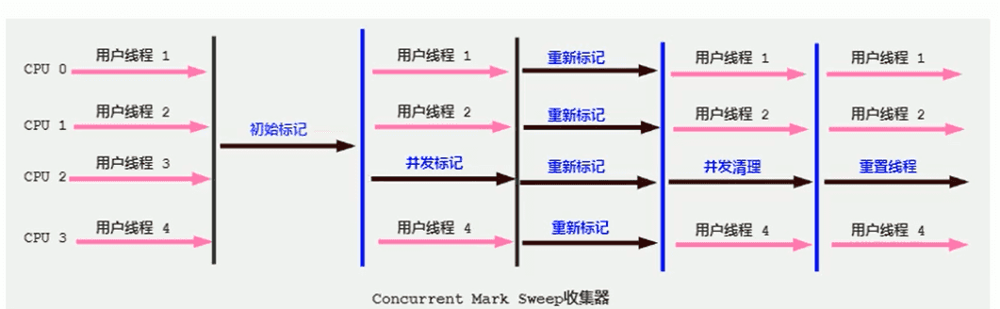

--Java虚拟机JVM初级

‍

‍

# 方法区

‍

​​

‍

## 栈、堆、方法区交互关系

‍

‍

**从线程共享与否的角度来看**

ThreadLocal：如何保证多个线程在并发环境下的安全性？典型场景就是数据库连接管理，以及会话管理。

​​

‍

举例

1. Person 类的 .class 信息存放在方法区中
2. person 变量存放在 Java 栈的局部变量表中
3. 真正的 person 对象存放在 Java 堆中
4. 在 person 对象中，有个指针指向方法区中的 person 类型数据，表明这个 person 对象是用方法区中的 Person 类 new 出来的

‍

‍

‍

‍

### 方法区的基本理解

‍

《Java虚拟机规范》中明确说明：尽管所有的方法区在逻辑上是属于堆的一部分，但一些简单的实现可能不会选择去进行垃圾收集或者进行压缩。但对于HotSpotJVM而言，方法区还有一个别名叫做Non-Heap（非堆），目的就是要和堆分开。

所以，**方法区可以看作是一块独立于Java堆的内存空间**。**主要存放的是 Class，而堆中主要存放的是实例化的对象**

‍

* 方法区（Method Area）与Java堆一样，是各个线程共享的内存区域。多个线程同时加载统一个类时，只能有一个线程能加载该类，其他线程只能等等待该线程加载完毕，然后直接使用该类，即类只能加载一次。
* 方法区在JVM启动的时候被创建，并且它的实际的物理内存空间中和Java堆区一样都可以是不连续的。
* 方法区的大小，跟堆空间一样，可以选择固定大小或者可扩展。
* 方法区的大小决定了系统可以保存多少个类，如果系统定义了太多的类，导致方法区溢出，虚拟机同样会抛出内存溢出错误：`java.lang.OutofMemoryError:PermGen space`​或者`java.lang.OutOfMemoryError:Metaspace`​

  * 加载大量的第三方的jar包
  * Tomcat部署的工程过多（30~50个）
  * 大量动态的生成反射类
* 关闭JVM就会释放这个区域的内存。

‍

### HotSpot方法区演进

* 在 JDK7 及以前，习惯上把方法区，称为永久代。JDK8开始，使用元空间取代了永久代。我们可以将方法区类比为Java中的接口，将永久代或元空间类比为Java中具体的实现类
* 本质上，方法区和永久代并不等价。仅是对Hotspot而言的可以看作等价。《Java虚拟机规范》对如何实现方法区，不做统一要求。例如：BEAJRockit / IBM J9 中不存在永久代的概念。

  * 现在来看，当年使用永久代，不是好的idea。导致Java程序更容易OOm（超过-XX:MaxPermsize上限）
* 而到了JDK8，终于完全废弃了永久代的概念，改用与JRockit、J9一样在本地内存中实现的元空间（Metaspace）来代替
* 元空间的本质和永久代类似，都是对JVM规范中方法区的实现。不过元空间与永久代最大的区别在于：**元空间不在虚拟机设置的内存中，而是使用本地内存**。
* 永久代、元空间二者并不只是名字变了，内部结构也调整了
* 根据《Java虚拟机规范》的规定，如果方法区无法满足新的内存分配需求时，将抛出OOM异常

​​

‍

‍

## 设置方法区大小与 OOM

方法区的大小不必是固定的，JVM可以根据应用的需要动态调整。

‍

‍

### JDK8及以后(元空间)

1. 元数据区大小可以使用参数  **-XX:MetaspaceSize** 和  **-XX:MaxMetaspaceSize** 指定
2. 默认值依赖于平台，Windows下，-XX:MetaspaceSize 约为21M，-XX:MaxMetaspaceSize的值是-1，即没有限制。
3. 与永久代不同，如果不指定大小，默认情况下，虚拟机会耗尽所有的可用系统内存。如果元数据区发生溢出，虚拟机一样会抛出异常OutOfMemoryError:Metaspace
4. -XX:MetaspaceSize：设置初始的元空间大小。对于一个 64位 的服务器端 JVM 来说，其默认的 -XX:MetaspaceSize值为21MB。这就是初始的高水位线，一旦触及这个水位线，Full GC将会被触发并卸载没用的类（即这些类对应的类加载器不再存活），然后这个高水位线将会重置。新的高水位线的值取决于GC后释放了多少元空间。如果释放的空间不足，那么在不超过MaxMetaspaceSize时，适当提高该值。如果释放空间过多，则适当降低该值。
5. 如果初始化的高水位线设置过低，上述高水位线调整情况会发生很多次。通过垃圾回收器的日志可以观察到Full GC多次调用。为了避免频繁地GC，建议将-XX:MetaspaceSize设置为一个相对较高的值。

‍

‍

### 方法区OOM

‍

**不设置元空间的上限**

使用默认的 JVM 参数，元空间不设置上限

输出结果：

```java
10000
```

‍

**设置元空间的上限**

JVM 参数

-XX:MetaspaceSize=10m -XX:MaxMetaspaceSize=10m

‍

输出结果：

```java
8531
Exception in thread "main" java.lang.OutOfMemoryError: Metaspace
	at java.lang.ClassLoader.defineClass1(Native Method)
	at java.lang.ClassLoader.defineClass(ClassLoader.java:763)
	at java.lang.ClassLoader.defineClass(ClassLoader.java:642)
	at com.atguigu.java.OOMTest.main(OOMTest.java:29)
```

‍

### 解决OOM

> 这个属于调优的问题，这里先简单的说一下

1. 要解决OOM异常或heap space的异常，一般的手段是首先通过内存映像分析工具（如Ec1ipse Memory Analyzer）对dump出来的堆转储快照进行分析，重点是确认内存中的对象是否是必要的，也就是要先分清楚到底是出现了内存泄漏（Memory Leak）还是内存溢出（Memory Overflow）
2. **内存泄漏**就是有大量的引用指向某些对象，但是这些对象以后不会使用了，但是因为它们还和GC ROOT有关联，所以导致以后这些对象也不会被回收，这就是内存泄漏的问题
3. 如果是内存泄漏，可进一步通过工具查看泄漏对象到GC Roots的引用链。于是就能找到泄漏对象是通过怎样的路径与GC Roots相关联并导致垃圾收集器无法自动回收它们的。掌握了泄漏对象的类型信息，以及GC Roots引用链的信息，就可以比较准确地定位出泄漏代码的位置。
4. 如果不存在内存泄漏，换句话说就是内存中的对象确实都还必须存活着，那就应当检查虚拟机的堆参数（-Xmx与-Xms），与机器物理内存对比看是否还可以调大，从代码上检查是否存在某些对象生命周期过长、持有状态时间过长的情况，尝试减少程序运行期的内存消耗。

‍

## 内部结构

‍

### 方法区存储内容

‍

《深入理解Java虚拟机》书中对方法区（Method Area）存储内容描述如下：它用于存储已被虚拟机加载的**类型信息、常量、静态变量、即时编译器编译后的代码缓存**等。

‍

**类型信息**

对每个加载的类型（类class、接口interface、枚举enum、注解annotation），JVM必须在方法区中存储以下类型信息：

1. 这个类型的完整有效名称（全名=包名.类名）
2. 这个类型直接父类的完整有效名（对于interface或是java.lang.Object，都没有父类）
3. 这个类型的修饰符（public，abstract，final的某个子集）
4. 这个类型直接接口的一个有序列表

‍

**域（Field）信息**

> 也就是我们常说的成员变量，域信息是比较官方的称呼

1. JVM必须在方法区中保存类型的所有域的相关信息以及域的声明顺序。
2. 域的相关信息包括：域名称，域类型，域修饰符（public，private，protected，static，final，volatile，transient的某个子集）

‍

**方法（Method）信息**

JVM必须保存所有方法的以下信息，同域信息一样包括声明顺序：

1. 方法名称
2. 方法的返回类型（包括 void 返回类型），void 在 Java 中对应的为 void.class
3. 方法参数的数量和类型（按顺序）
4. 方法的修饰符（public，private，protected，static，final，synchronized，native，abstract的一个子集）
5. 方法的字节码（bytecodes）、操作数栈、局部变量表及大小（abstract和native方法除外）
6. 异常表（abstract和native方法除外），异常表记录每个异常处理的开始位置、结束位置、代码处理在程序计数器中的偏移地址、被捕获的异常类的常量池索引

‍

### non-final 类型的类变量

1. 静态变量和类关联在一起，随着类的加载而加载，他们成为类数据在逻辑上的一部分
2. 类变量被类的所有实例共享，即使没有类实例时，你也可以访问它

‍

**举例**

1. 如下代码所示，即使我们把order设置为null，也不会出现空指针异常
2. 这更加表明了 static 类型的字段和方法随着类的加载而加载，并不属于特定的类实例

```java
public class MethodAreaTest {
    public static void main(String[] args) {
        Order order = null;
        order.hello();
        System.out.println(order.count);
    }
}

class Order {
    public static int count = 1;
    public static final int number = 2;


    public static void hello() {
        System.out.println("hello!");
    }
}
```

输出结果：

```
hello!
1
```

‍

#### 全局常量：static final

1. 全局常量就是使用 static final 进行修饰
2. 被声明为final的类变量的处理方法则不同，每个全局常量在编译的时候就会被分配了。

查看上面代码，这部分的字节码指令

```java
class Order {
    public static int count = 1;
    public static final int number = 2;
    ...
}  
```

```java
public static int count;
    descriptor: I
    flags: ACC_PUBLIC, ACC_STATIC

  public static final int number;
    descriptor: I
    flags: ACC_PUBLIC, ACC_STATIC, ACC_FINAL
    ConstantValue: int 2
```

可以发现 staitc和final同时修饰的number 的值在编译上的时候已经写死在字节码文件中了。

‍

### 运行时常量池

‍

#### 运行时常量池 VS 常量池

‍

后面细讲常量池

‍

1. 方法区，内部包含了运行时常量池
2. 字节码文件，内部包含了常量池。（之前的字节码文件中已经看到了很多Constant pool的东西，这个就是常量池）
3. 要弄清楚方法区，需要理解清楚ClassFile，因为加载类的信息都在方法区。
4. 要弄清楚方法区的运行时常量池，需要理解清楚ClassFile中的常量池。

‍

‍

#### 常量池

1. 一个有效的字节码文件中除了包含类的版本信息、字段、方法以及接口等描述符信息外。还包含一项信息就是**常量池表**（**Constant Pool Table**），包括各种字面量和对类型、域和方法的符号引用。
2. 字面量： 10 ， “我是某某”这种数字和字符串都是字面量

‍

**为什么需要常量池？**

‍

一个java源文件中的类、接口，编译后产生一个字节码文件。而Java中的字节码需要数据支持，通常这种数据会很大以至于不能直接存到字节码里，换另一种方式，可以存到常量池。这个字节码包含了指向常量池的引用。在动态链接的时候会用到运行时常量池，之前有介绍

‍

比如：如下的代码：

```
public class SimpleClass {
    public void sayHello() {
        System.out.println("hello");
    }
}
```

* 虽然上述代码只有194字节，但是里面却使用了String、System、PrintStream及Object等结构。
* 比如说我们这个文件中有6个地方用到了"hello"这个字符串，如果不用常量池，就需要在6个地方全写一遍，造成臃肿。我们可以将"hello"等所需用到的结构信息记录在常量池中，并通过**引用的方式**，来加载、调用所需的结构
* 这里的代码量其实很少了，如果代码多的话，引用的结构将会更多，这里就需要用到常量池了。

‍

**常量池中有啥？**

1. 数量值
2. 字符串值
3. 类引用
4. 字段引用
5. 方法引用

MethodInnerStrucTest 的 test1方法的字节码

‍

**常量池总结**

常量池、可以看做是一张表，虚拟机指令根据这张常量表找到要执行的类名、方法名、参数类型、字面量等类型。

‍

#### 运行时常量池

* 运行时常量池（Runtime Constant Pool）是方法区的一部分。
* 常量池表（Constant Pool Table）是Class字节码文件的一部分，用于存放编译期生成的各种字面量与符号引用，**这部分内容将在类加载后存放到方法区的运行时常量池中**。（运行时常量池就是常量池在程序运行时的称呼）
* 运行时常量池，在加载类和接口到虚拟机后，就会创建对应的运行时常量池。
* JVM为每个已加载的类型（类或接口）都维护一个常量池。池中的数据项像数组项一样，是通过索引访问的。
* 运行时常量池中包含多种不同的常量，包括编译期就已经明确的数值字面量，也包括到运行期解析后才能够获得的方法或者字段引用。**此时不再是常量池中的符号地址了，这里换为真实地址**。

* 运行时常量池，相对于Class文件常量池的另一重要特征是：具备动态性。
* 运行时常量池类似于传统编程语言中的符号表（symbol table），但是它所包含的数据却比符号表要更加丰富一些。
* 当创建类或接口的运行时常量池时，如果构造运行时常量池所需的内存空间超过了方法区所能提供的最大值，则JVM会抛OutofMemoryError异常。

‍

‍

## 方法区演进细节

‍

首先明确：只有Hotspot才有永久代。BEA JRockit、IBMJ9等来说，是不存在永久代的概念的。原则上如何实现方法区属于虚拟机实现细节，不受《Java虚拟机规范》管束，并不要求统一

‍

Hotspot中方法区的变化：

|JDK1.6及以前|有永久代（permanent generation），静态变量存储在永久代上|
| --------------| --------------------------------------------------------------------------------------------------|
|JDK1.7|有永久代，但已经逐步 “去永久代”，**字符串常量池，静态变量移除，保存在堆中**|
|JDK1.8|无永久代，类型信息，字段，方法，常量保存在本地内存的元空间，但字符串常量池、静态变量仍然在堆中。|

‍

**JDK6**

方法区由永久代实现，使用 JVM 虚拟机内存（虚拟的内存）

‍

**JDK7**

方法区由永久代实现，使用 JVM 虚拟机内存

‍

**JDK8**

方法区由元空间实现，使用物理机本地内存

‍

‍

### 永久代为什么要被元空间替代？

> **官方文档**：[http://openjdk.java.net/jeps/122](http://openjdk.java.net/jeps/122)

随着Java8的到来，HotSpot VM中再也见不到永久代了。但是这并不意味着类的元数据信息也消失了。这些数据被移到了一个与堆不相连的本地内存区域，这个区域叫做元空间（Metaspace）。

由于类的元数据分配在本地内存中，元空间的最大可分配空间就是系统可用内存空间。

这项改动是很有必要的，原因有：

1. 为永久代设置空间大小是很难确定的。在某些场景下，如果动态加载类过多，容易产生Perm区的OOM。比如某个实际Web工程中，因为功能点比较多，在运行过程中，要不断动态加载很多类，经常出现致命错误。`Exception in thread 'dubbo client x.x connector' java.lang.OutOfMemoryError:PermGen space`​而元空间和永久代之间最大的区别在于：元空间并不在虚拟机中，而是使用本地内存。 因此，默认情况下，元空间的大小仅受本地内存限制。
2. 对永久代进行调优是很困难的。方法区的垃圾收集主要回收两部分内容：常量池中废弃的常量和不再用的类型，方法区的调优主要是为了降低**Full GC**

    1. 有些人认为方法区（如HotSpot虚拟机中的元空间或者永久代）是没有垃圾收集行为的，其实不然。《Java虚拟机规范》对方法区的约束是非常宽松的，提到过可以不要求虚拟机在方法区中实现垃圾收集。事实上也确实有未实现或未能完整实现方法区类型卸载的收集器存在（如JDK11时期的ZGC收集器就不支持类卸载）。
    2. 一般来说这个区域的回收效果比较难令人满意，尤其是类型的卸载，条件相当苛刻。但是这部分区域的回收有时又确实是必要的。以前Sun公司的Bug列表中，曾出现过的若干个严重的Bug就是由于低版本的HotSpot虚拟机对此区域未完全回收而导致内存泄漏。

‍

‍

### 字符串常量池

‍

**为什么要调整位置？**

* JDK7中将StringTable放到了堆空间中。因为永久代的回收效率很低，在Full GC的时候才会执行永久代的垃圾回收，而Full GC是老年代的空间不足、永久代不足时才会触发。
* 这就导致StringTable回收效率不高，而我们开发中会有大量的字符串被创建，回收效率低，导致永久代内存不足。放到堆里，能及时回收内存。

‍

### 静态变量放在哪里

‍

#### 对象实体在哪里放着？

```java
结论：
 * 1、静态引用对应的对象实体(也就是这个new byte[1024 * 1024 * 100])始终都存在堆空间，
 * 2、只是那个变量(相当于下面的arr变量名)在JDK6,JDK7,JDK8存放位置中有所变化
```

‍

‍

#### 变量(名)存放在哪里？

这个问题需要用JHSDB工具来进行分析，这个工具是JDK9开始自带的(JDK9以前没有)，在bin目录下可以找到

```java
package com.atguigu.java1;

/**
 * 《深入理解Java虚拟机》中的案例：
 * staticObj、instanceObj、localObj存放在哪里？
 */
public class StaticObjTest {
    static class Test {
        static ObjectHolder staticObj = new ObjectHolder();
        ObjectHolder instanceObj = new ObjectHolder();

        void foo() {
            ObjectHolder localObj = new ObjectHolder();
            System.out.println("done");
        }
    }

    private static class ObjectHolder {
    }

    public static void main(String[] args) {
        Test test = new StaticObjTest.Test();
        test.foo();
    }
}

```

**JDK6环境下**

1、staticObj随着Test的类型信息存放在方法区

2、instanceObj随着Test的对象实例存放在Java堆

3、localObject则是存放在foo()方法栈帧的局部变量表中。

4、测试发现：三个对象的数据在内存中的地址都落在Eden区范围内，所以结论：**只要是对象实例必然会在Java堆中分配**。

‍

> 1、0x00007f32c7800000(Eden区的起始地址) ---- 0x00007f32c7b50000(Eden区的终止地址)
>
> 2、可以发现三个变量都在这个范围内
>
> 3、所以可以得到上面结论

5、接着，找到了一个引用该staticObj对象的地方，是在一个java.lang.Class的实例里，并且给出了这个实例的地址，通过Inspector查看该对象实例，可以清楚看到这确实是一个java.lang.Class类型的对象实例，里面有一个名为staticobj的实例字段：

‍

从《Java虚拟机规范》所定义的概念模型来看，所有Class相关的信息都应该存放在方法区之中，但方法区该如何实现，《Java虚拟机规范》并未做出规定，这就成了一件允许不同虚拟机自己灵活把握的事情。JDK7及其以后版本的HotSpot虚拟机选择把静态变量与类型在Java语言一端的映射Class对象存放在一起，**存储于Java堆之中**，从我们的实验中也明确验证了这一点

‍

‍

## 方法区的垃圾回收

* 有些人认为方法区（如Hotspot虚拟机中的元空间或者永久代）是没有垃圾收集行为的，其实不然。《Java虚拟机规范》对方法区的约束是非常宽松的，提到过可以不要求虚拟机在方法区中实现垃圾收集。事实上也确实有未实现或未能完整实现方法区**类型卸载**的收集器存在（如JDK11时期的ZGC收集器就不支持类卸载）。
* 一般来说这个区域的回收效果比较难令人满意，尤其是类型的卸载，条件相当苛刻。但是这部分区域的回收有时又确实是必要的。以前sun公司的Bug列表中，曾出现过的若干个严重的Bug就是由于低版本的HotSpot虚拟机对此区域未完全回收而导致内存泄漏。
* 方法区的垃圾收集主要回收两部分内容：**常量池中废弃的常量和不再使用的类型**。
* 先来说说方法区内常量池之中主要存放的两大类常量：字面量和符号引用。字面量比较接近Java语言层次的常量概念，如文本字符串、被声明为final的常量值等。而符号引用则属于编译原理方面的概念，包括下面三类常量：

  * 类和接口的全限定名
  * 字段的名称和描述符
  * 方法的名称和描述符
* HotSpot虚拟机对常量池的回收策略是很明确的，只要常量池中的常量没有被任何地方引用，就可以被回收。
* 回收废弃常量与回收Java堆中的对象非常类似。（关于常量的回收比较简单，重点是类的回收）

‍

下面也称作**类卸载**

1、判定一个常量是否“废弃”还是相对简单，而要判定一个类型是否属于“不再被使用的类”的条件就比较苛刻了。需要同时满足下面三个条件：

* 该类所有的实例都已经被回收，也就是Java堆中不存在该类及其任何派生子类的实例。
* 加载该类的类加载器已经被回收，这个条件除非是经过精心设计的可替换类加载器的场景，如OSGi、JSP的重加载等，否则通常是很难达成的。
* 该类对应的java.lang.Class对象没有在任何地方被引用，无法在任何地方通过反射访问该类的方法。

2、Java虚拟机被允许对满足上述三个条件的无用类进行回收，这里说的仅仅是“被允许”，而并不是和对象一样，没有引用了就必然会回收。关于是否要对类型进行回收，HotSpot虚拟机提供了`-Xnoclassgc`​参数进行控制，还可以使用`-verbose:class`​ 以及 `-XX：+TraceClass-Loading`​、`-XX：+TraceClassUnLoading`​查看类加载和卸载信息

3、在大量使用反射、动态代理、CGLib等字节码框架，动态生成JSP以及OSGi这类频繁自定义类加载器的场景中，通常都需要Java虚拟机具备类型卸载的能力，以保证不会对方法区造成过大的内存压力。

‍

‍

## 直接内存

‍

1. 不是虚拟机运行时数据区的一部分，也不是《Java虚拟机规范》中定义的内存区域。
2. 直接内存是在Java堆外的、直接向系统申请的内存区间。
3. 来源于NIO，通过存在堆中的DirectByteBuffer操作Native内存
4. 通常，访问直接内存的速度会优于Java堆。即读写性能高。
5. 因此出于性能考虑，读写频繁的场合可能会考虑使用直接内存。
6. Java的NIO库允许Java程序使用直接内存，用于数据缓冲区

‍

### BIO 与 NIO

**非直接缓存区（BIO）**

原来采用BIO的架构，在读写本地文件时，我们需要从用户态切换成内核态

‍

**直接缓冲区（NIO）**

NIO 直接操作物理磁盘，省去了中间过程

‍

‍

### 直接内存与 OOM

1. 直接内存也可能导致OutofMemoryError异常
2. 由于直接内存在Java堆外，因此它的大小不会直接受限于-Xmx指定的最大堆大小，但是系统内存是有限的，Java堆和直接内存的总和依然受限于操作系统能给出的最大内存。
3. 直接内存的缺点为：

    * 分配回收成本较高
    * 不受JVM内存回收管理
4. 直接内存大小可以通过MaxDirectMemorySize设置
5. 如果不指定，默认与堆的最大值-Xmx参数值一致

‍

# 对象的实例化内存布局与访问定位

‍

## 实例化

‍

### 对象创建的方式

* new：最常见的方式、单例类中调用getInstance的静态类方法，XXXFactory的静态方法
* Class的newInstance方法：在JDK9里面被标记为过时的方法，因为只能调用空参构造器，并且权限必须为 public
* Constructor的newInstance(Xxxx)：反射的方式，可以调用空参的，或者带参的构造器
* 使用clone()：不调用任何的构造器，要求当前的类需要实现Cloneable接口中的clone方法
* 使用序列化：从文件中，从网络中获取一个对象的二进制流，序列化一般用于Socket的网络传输
* 第三方库 Objenesis

‍

### 对象创建的步骤

‍

**1、判断对象对应的类是否加载、链接、初始化**

1. 虚拟机遇到一条new指令，首先去检查这个指令的参数能否在Metaspace的常量池中定位到一个类的符号引用，并且检查这个符号引用代表的类是否已经被加载，解析和初始化。（即判断类元信息是否存在）。
2. 如果该类没有加载，那么在双亲委派模式下，使用当前类加载器以ClassLoader + 包名 + 类名为key进行查找对应的.class文件，如果没有找到文件，则抛出ClassNotFoundException异常，如果找到，则进行类加载，并生成对应的Class对象。

‍

**2、为对象分配内存**

1. 首先计算对象占用空间的大小，接着在堆中划分一块内存给新对象。如果实例成员变量是引用变量，仅分配引用变量空间即可，即4个字节大小
2. 如果内存规整：采用指针碰撞分配内存

    * 如果内存是规整的，那么虚拟机将采用的是指针碰撞法（Bump The Point）来为对象分配内存。
    * 意思是所有用过的内存在一边，空闲的内存放另外一边，中间放着一个指针作为分界点的指示器，分配内存就仅仅是把指针往空闲内存那边挪动一段与对象大小相等的距离罢了。
    * 如果垃圾收集器选择的是Serial ，ParNew这种基于压缩算法的，虚拟机采用这种分配方式。一般使用带Compact（整理）过程的收集器时，使用指针碰撞。
    * 标记压缩（整理）算法会整理内存碎片，堆内存一存对象，另一边为空闲区域
3. 如果内存不规整

    * 如果内存不是规整的，已使用的内存和未使用的内存相互交错，那么虚拟机将采用的是空闲列表来为对象分配内存。
    * 意思是虚拟机维护了一个列表，记录上哪些内存块是可用的，再分配的时候从列表中找到一块足够大的空间划分给对象实例，并更新列表上的内容。这种分配方式成为了 “空闲列表（Free List）”
    * 选择哪种分配方式由Java堆是否规整所决定，而Java堆是否规整又由所采用的垃圾收集器是否带有压缩整理功能决定
    * 标记清除算法清理过后的堆内存，就会存在很多内存碎片。

‍

**3、处理并发问题**

1. 采用CAS+失败重试保证更新的原子性
2. 每个线程预先分配TLAB - 通过设置 -XX:+UseTLAB参数来设置（区域加锁机制）
3. 在Eden区给每个线程分配一块区域

‍

**4、初始化分配到的空间**

* 所有属性设置默认值，保证对象实例字段在不赋值可以直接使用
* 给对象属性赋值的顺序：

1. 属性的默认值初始化
2. 显示初始化/代码块初始化（并列关系，谁先谁后看代码编写的顺序）
3. 构造器初始化

‍

**5、设置对象的对象头**

将对象的所属类（即类的元数据信息）、对象的HashCode和对象的GC信息、锁信息等数据存储在对象的对象头中。这个过程的具体设置方式取决于JVM实现。

‍

**6、执行init方法进行初始化**

1. 在Java程序的视角看来，初始化才正式开始。初始化成员变量，执行实例化代码块，调用类的构造方法，并把堆内对象的首地址赋值给引用变量
2. 因此一般来说（由字节码中跟随invokespecial指令所决定），new指令之后会接着就是执行init方法，把对象按照程序员的意愿进行初始化，这样一个真正可用的对象才算完成创建出来。

‍

​​

‍

## 对象的内存布局

‍

## 对象的访问定位

**JVM是如何通过栈帧中的对象引用访问到其内部的对象实例呢？**

‍

定位，通过栈上reference访问

**对象的两种访问方式：句柄访问和直接指针**

**1、句柄访问**

1. 缺点：在堆空间中开辟了一块空间作为句柄池，句柄池本身也会占用空间；通过两次指针访问才能访问到堆中的对象，效率低
2. 优点：reference中存储稳定句柄地址，对象被移动（垃圾收集时移动对象很普遍）时只会改变句柄中实例数据指针即可，reference本身不需要被修改

‍

​​

‍

‍

**2、直接指针（HotSpot采用）**

1. 优点：直接指针是局部变量表中的引用，直接指向堆中的实例，在对象实例中有类型指针，指向的是方法区中的对象类型数据
2. 缺点：对象被移动（垃圾收集时移动对象很普遍）时需要修改 reference 的值

‍

​​

‍

‍

# 执行引擎

‍

Java代码编译和执行的过程

将java文件编译成class文件称为前端编译(javac)，在执行引擎中将字节码编译成机器指令称为后端编译。

‍

‍

## 概述

‍

* 执行引擎是Java虚拟机核心的组成部分之一。
* “虚拟机”是一个相对于“物理机”的概念，这两种机器都有代码执行能力，其区别是物理机的执行引擎是直接建立在处理器、缓存、指令集和操作系统层面上的，而**虚拟机的执行引擎则是由软件自行实现的**，因此可以不受物理条件制约地定制指令集与执行引擎的结构体系，**能够执行那些不被硬件直接支持的指令集格式**。
* JVM的主要任务是负责**装载字节码到其内部**，但字节码并不能够直接运行在操作系统之上，因为字节码指令并非等价于本地机器指令，它内部包含的仅仅只是一些能够被JVM所识别的字节码指令、符号表，以及其他辅助信息。
* 那么，如果想要让一个Java程序运行起来，执行引擎（Execution Engine）的任务就是**将字节码指令解释/编译为对应平台上的本地机器指令才可以**。简单来说，JVM中的执行引擎充当了将高级语言翻译为机器语言的译者。

‍

1、前端编译：从Java程序员-字节码文件的这个过程叫前端编译

2、执行引擎这里有两种行为：一种是解释执行，一种是编译执行（这里的是后端编译）。

‍

### 执行引擎工作过程

‍

1. 执行引擎在执行的过程中究竟需要执行什么样的字节码指令完全依赖于PC寄存器。
2. 每当执行完一项指令操作后，PC寄存器就会更新下一条需要被执行的指令地址。
3. 当然方法在执行的过程中，执行引擎有可能会通过存储在局部变量表中的对象引用准确定位到存储在Java堆区中的对象实例信息，以及通过对象头中的元数据指针定位到目标对象的类型信息。
4. 从外观上来看，所有的Java虚拟机的执行引擎输入、处理、输出都是一致的：输入的是字节码二进制流，处理过程是字节码解析执行、即时编译的等效过程，输出的是执行过程。

‍

​​

‍

## 编译和执行过程

‍

‍

### 解释执行和即时编译

大部分的程序代码转换成物理机的目标代码或虚拟机能执行的指令集之前，都需要经过下图中的各个步骤：

1. 前面橙色部分是编译生成生成字节码文件的过程（javac编译器来完成，也就是前端编译器），和JVM没有关系。
2. 后面绿色（解释执行）和蓝色（即时编译）才是JVM需要考虑的过程

3. javac编译器（前端编译器）流程图如下所示：
4. Java字节码的执行是由JVM执行引擎来完成，流程图如下所示

​​

‍

​​

​​

‍

‍

### 什么是解释器？什么是JIT编译器？

1. 解释器：当Java虚拟机启动时会根据预定义的规范对字节码采用**逐行**解释的方式**执行**，将每条字节码文件中的内容“翻译”为对应平台的本地机器指令执行。
2. JIT（Just In Time Compiler）编译器：就是虚拟机将源代码**一次性直接**编译成和本地机器平台相关的机器语言，**但并不是马上执行**。

‍

**为什么Java是半编译半解释型语言？**

1. JDK1.0时代，将Java语言定位为“解释执行”还是比较准确的。再后来，Java也发展出可以直接生成本地代码的编译器。
2. 现在JVM在执行Java代码的时候，通常都会将解释执行与编译执行二者结合起来进行。
3. JIT编译器将字节码翻译成本地代码后，就可以做一个缓存操作，存储在方法区的JIT 代码缓存中（执行效率更高了），并且在翻译成本地代码的过程中可以做优化。

‍

## 机器码 指令 汇编语言

‍

### 机器码

* 各种用二进制编码方式表示的指令，叫做机器指令码。开始，人们就用它采编写程序，这就是机器语言。
* 机器语言虽然能够被计算机理解和接受，但和人们的语言差别太大，不易被人们理解和记忆，并且用它编程容易出差错。
* 用它编写的程序一经输入计算机，CPU直接读取运行，因此和其他语言编的程序相比，执行速度最快。
* 机器指令与CPU紧密相关，所以不同种类的CPU所对应的机器指令也就不同。

‍

### 指令和指令集

‍

**指令**

* 由于机器码是由0和1组成的二进制序列，可读性实在太差，于是人们发明了指令。
* 指令就是把机器码中特定的0和1序列，简化成对应的指令（一般为英文简写，如mov，inc等），可读性稍好
* 由于不同的硬件平台，执行同一个操作，对应的机器码可能不同，所以不同的硬件平台的同一种指令（比如mov），对应的机器码也可能不同。

‍

**指令集**

不同的硬件平台，各自支持的指令，是有差别的。因此每个平台所支持的指令，称之为对应平台的指令集。如常见的

* x86指令集，对应的是x86架构的平台
* ARM指令集，对应的是ARM架构的平台

‍

### 汇编语言

* 由于指令的可读性还是太差，于是人们又发明了汇编语言。
* 在汇编语言中，用助记符（Mnemonics）代替机器指令的操作码，用地址符号（Symbol）或标号（Label）代替指令或操作数的地址。
* 在不同的硬件平台，汇编语言对应着不同的机器语言指令集，通过汇编过程转换成机器指令。
* 由于计算机只认识指令码，所以用汇编语言编写的程序还必须翻译（汇编）成机器指令码，计算机才能识别和执行。

‍

### 高级语言

* 为了使计算机用户编程序更容易些，后来就出现了各种高级计算机语言。高级语言比机器语言、汇编语言更接近人的语言
* 当计算机执行高级语言编写的程序时，仍然需要把程序解释和编译成机器的指令码。完成这个过程的程序就叫做解释程序或编译程序。

‍

### 字节码

* 字节码是一种中间状态（中间码）的二进制代码（文件），它比机器码更抽象，需要直译器转译后才能成为机器码
* 字节码主要为了实现特定软件运行和软件环境、与硬件环境无关。
* 字节码的实现方式是通过编译器和虚拟机器。编译器将源码编译成字节码，特定平台上的虚拟机器将字节码转译为可以直接执行的指令。
* 字节码典型的应用为：Java bytecode

‍

### C、C++源程序执行过程

**编译过程又可以分成两个阶段：编译和汇编。**

* 编译过程：是读取源程序（字符流），对之进行词法和语法的分析，将高级语言指令转换为功能等效的汇编代码
* 汇编过程：实际上指把汇编语言代码翻译成目标机器指令的过程。

‍

‍

## 解释器

‍

* JVM设计者们的初衷仅仅只是单纯地为了满足Java程序实现跨平台特性，因此避免采用静态编译的方式由高级语言直接生成本地机器指令，从而诞生了实现解释器在运行时采用逐行解释字节码执行程序的想法（也就是产生了一个中间产品**字节码**）。
* 解释器真正意义上所承担的角色就是一个运行时“翻译者”，将字节码文件中的内容“翻译”为对应平台的本地机器指令执行。
* 当一条字节码指令被解释执行完成后，接着再根据PC寄存器中记录的下一条需要被执行的字节码指令执行解释操作。

‍

‍

### 分类

1. 在Java的发展历史里，一共有两套解释执行器，即古老的**字节码解释器**、现在普遍使用的**模板解释器**。

    * 字节码解释器在执行时通过纯软件代码模拟字节码的执行，效率非常低下。
    * 而模板解释器将每一条字节码和一个模板函数相关联，模板函数中直接产生这条字节码执行时的机器码，从而很大程度上提高了解释器的性能。
2. 在HotSpot VM中，解释器主要由Interpreter模块和Code模块构成。

    * Interpreter模块：实现了解释器的核心功能
    * Code模块：用于管理HotSpot VM在运行时生成的本地机器指令

‍

### 现状

1. 由于解释器在设计和实现上非常简单，因此除了Java语言之外，还有许多高级语言同样也是基于解释器执行的，比如Python、Perl、Ruby等。但是在今天，基于解释器执行已经沦落为低效的代名词，并且时常被一些C/C++程序员所调侃。
2. 为了解决这个问题，JVM平台支持一种叫作即时编译的技术。即时编译的目的是避免函数被解释执行，而是将整个函数体编译成为机器码，每次函数执行时，只执行编译后的机器码即可，这种方式可以使执行效率大幅度提升。
3. 不过无论如何，基于解释器的执行模式仍然为中间语言的发展做出了不可磨灭的贡献。

‍

## JIT编译器

‍

### Java 代码执行的分类

1. 第一种是将源代码编译成字节码文件，然后在运行时通过解释器将字节码文件转为机器码执行
2. 第二种是编译执行（直接编译成机器码）。现代虚拟机为了提高执行效率，会使用即时编译技术（JIT，Just In Time）将方法编译成机器码后再执行
3. HotSpot VM是目前市面上高性能虚拟机的代表作之一。**它采用解释器与即时编译器并存的架构**。在Java虚拟机运行时，解释器和即时编译器能够相互协作，各自取长补短，尽力去选择最合适的方式来权衡编译本地代码的时间和直接解释执行代码的时间。
4. 在今天，Java程序的运行性能早已脱胎换骨，已经达到了可以和C/C++ 程序一较高下的地步。

‍

#### 为啥我们还需要解释器呢？

有些开发人员会感觉到诧异，既然HotSpot VM中已经内置JIT编译器了，那么为什么还需要再使用解释器来“拖累”程序的执行性能呢？比如JRockit VM内部就不包含解释器，字节码全部都依靠即时编译器编译后执行。

JRockit虚拟机是砍掉了解释器，也就是只采及时编译器。那是因为呢JRockit只部署在服务器上，一般已经有时间让他进行指令编译的过程了，对于响应来说要求不高，等及时编译器的编译完成后，就会提供更好的性能

‍

**首先明确**

* 当程序启动后，解释器可以马上发挥作用，**响应速度快**，省去编译的时间，立即执行。
* 编译器要想发挥作用，把代码编译成本地代码，**需要一定的执行时间**，但编译为本地代码后，执行效率高。

‍

**所以**

尽管JRockit VM中程序的执行性能会非常高效，但程序在启动时必然需要花费更长的时间来进行编译。对于服务端应用来说，启动时间并非是关注重点，但对于那些看中启动时间的应用场景而言，或许就需要采用解释器与即时编译器并存的架构来换取一个平衡点。

在此模式下，在Java虚拟器启动时，解释器可以首先发挥作用，而不必等待即时编译器全部编译完成后再执行，这样可以省去许多不必要的编译时间。随着时间的推移，编译器发挥作用，把越来越多的代码编译成本地代码，获得更高的执行效率。

同时，解释执行在编译器进行激进优化不成立的时候，作为编译器的“逃生门”（后备方案）。

‍

#### 案例

当虚拟机启动的时候，解释器可以首先发挥作用，而不必等待即时编译器全部编译完成再执行，这样可以省去许多不必要的编译时间。随着程序运行时间的推移，即时编译器逐渐发挥作用，根据热点探测功能，将有价值的字节码编译为本地机器指令，以换取更高的程序执行效率。

‍

* 注意解释执行与编译执行在线上环境微妙的辩证关系。**机器在热机状态（已经运行了一段时间叫热机状态）可以承受的负载要大于冷机状态（刚启动的时候叫冷机状态）** 。如果以热机状态时的流量进行切流，可能使处于冷机状态的服务器因无法承载流量而假死。
* 在生产环境发布过程中，以分批的方式进行发布，根据机器数量划分成多个批次，每个批次的机器数至多占到整个集群的1/8。曾经有这样的故障案例：某程序员在发布平台进行分批发布，在输入发布总批数时，误填写成分为两批发布。如果是热机状态，在正常情况下一半的机器可以勉强承载流量，但由于刚启动的JVM均是解释执行，还没有进行热点代码统计和JIT动态编译，导致机器启动之后，当前1/2发布成功的服务器马上全部宕机，此故障说明了JIT的存在。—**阿里团队**

‍

‍

### 编译器

1. Java 语言的“编译期”其实是一段“不确定”的操作过程，因为它可能是指一个前端编译器（其实叫“编译器的前端”更准确一些）把.java文件转变成.class文件的过程。
2. 也可能是指虚拟机的后端运行期编译器（JIT编译器，Just In Time Compiler）把字节码转变成机器码的过程。
3. 还可能是指使用静态提前编译器（AOT编译器，Ahead of Time Compiler）直接把.java文件编译成本地机器代码的过程。（可能是后续发展的趋势）

‍

**典型的编译器：**

1. 前端编译器：Sun的javac、Eclipse JDT中的增量式编译器（ECJ）。
2. JIT编译器：HotSpot VM的C1、C2编译器。
3. AOT 编译器：GNU Compiler for the Java（GCJ）、Excelsior JET。

‍

### 热点代码及探测

* 当然是否需要启动JIT编译器将字节码直接编译为对应平台的本地机器指令，则需要根据代码被调用**执行的频率**而定。
* 关于那些需要被编译为本地代码的字节码，也被称之为 **“热点代码”，JIT编译器在运行时会针对那些频繁被调用的“热点代码”做出深度优化**，将其直接编译为对应平台的本地机器指令，以此提升Java程序的执行性能。
* 一个被多次调用的方法，或者是一-个方法体内部循环次数较多的循环体都可以被称之为“热点代码”，因此都可以通过JIT编译器编译为本地机器指令。由于这种编译方式发生在方法的执行过程中，因此也被称之为栈上替换，或简称为OSR (On StackReplacement)编译。
* 一个方法究竟要被调用多少次，或者一个循环体究竟需要执行多少次循环才可以达到这个标准？必然需要一个明确的阈值，JIT编译器才会将这些“热点代码”编译为本地机器指令执行。这里主要依靠热点探测功能。
* **目前HotSpot VM所采用的热点探测方式是基于计数器的热点探测**。
* 采用基于计数器的热点探测，HotSpot VM将会为每一个方法都建立2个不同类型的计数器，分别为方法调用计数器（Invocation Counter）和回边计数器（Back Edge Counter）。

  1. 方法调用计数器用于统计方法的调用次数
  2. 回边计数器则用于统计循环体执行的循环次数

‍

#### 方法调用计数器

* 这个计数器就用于统计方法被调用的次数，它的默认阀值在Client模式下是1500次，在Server模式下是10000次。超过这个阈值，就会触发JIT编译。
* 这个阀值可以通过虚拟机参数 -XX:CompileThreshold 来人为设定。
* 当一个方法被调用时，会先检查该方法是否存在被JIT编译过的版本

  * 如果存在，则优先使用编译后的本地代码来执行
  * 如果不存在已被编译过的版本，则将此方法的调用计数器值加1，然后判断方法调用计数器与回边计数器值之和是否超过方法调用计数器的阀值。

    * 如果已超过阈值，那么将会向即时编译器提交一个该方法的代码编译请求。
    * 如果未超过阈值，则使用解释器对字节码文件解释执行

‍

‍

#### 热度衰减

* 如果不做任何设置，方法调用计数器统计的并不是方法被调用的绝对次数，而是一个相对的执行频率，即**一段时间之内方法被调用的次数**。当超过一定的时间限度，如果方法的调用次数仍然不足以让它提交给即时编译器编译，那这个方法的调用计数器就会被减少一半，这个过程称为方法调用计数器热度的衰减（Counter Decay），而这段时间就称为此方法统计的半衰周期（Counter Half Life Time）（半衰周期是化学中的概念，比如出土的文物通过查看C60来获得文物的年龄）
* 进行热度衰减的动作是在虚拟机进行垃圾收集时顺便进行的，可以使用虚拟机参数 -XX:-UseCounterDecay 来关闭热度衰减，让方法计数器统计方法调用的绝对次数，这样的话，只要系统运行时间足够长，绝大部分方法都会被编译成本地代码。
* 另外，可以使用-XX:CounterHalfLifeTime参数设置半衰周期的时间，单位是秒。

‍

#### 回边计数器

它的作用是统计一个方法中循环体代码执行的次数，在字节码中遇到控制流向后跳转的指令称为“回边”（Back Edge）。显然，建立回边计数器统计的目的就是为了触发OSR编译。

‍

### HotSpotVM可以设置程序执行方法

缺省情况下HotSpot VM是采用解释器与即时编译器并存的架构，当然开发人员可以根据具体的应用场景，通过命令显式地为Java虚拟机指定在运行时到底是完全采用解释器执行，还是完全采用即时编译器执行。如下所示：

1. -Xint：完全采用解释器模式执行程序；
2. -Xcomp：完全采用即时编译器模式执行程序。如果即时编译出现问题，解释器会介入执行
3. -Xmixed：采用解释器+即时编译器的混合模式共同执行程序。

‍

结论：只用解释器执行是真的慢

‍

### HotSpotVM JIT 分类

‍

在HotSpot VM中内嵌有两个JIT编译器，分别为Client Compiler和Server Compiler，但大多数情况下我们简称为C1编译器 和 C2编译器。开发人员可以通过如下命令显式指定Java虚拟机在运行时到底使用哪一种即时编译器，如下所示：

1. -client：指定Java虚拟机运行在Client模式下，并使用C1编译器；

    * C1编译器会对字节码进行简单和可靠的优化，耗时短，以达到更快的编译速度。
2. -server：指定Java虚拟机运行在server模式下，并使用C2编译器。

    * C2进行耗时较长的优化，以及激进优化，但优化的代码执行效率更高。（使用C++）

‍

### C1和C2编译器不同的优化策略

1. 在不同的编译器上有不同的优化策略，C1编译器上主要有方法内联，去虚拟化、元余消除。

    * 方法内联：将引用的函数代码编译到引用点处，这样可以减少栈帧的生成，减少参数传递以及跳转过程
    * 去虚拟化：对唯一的实现樊进行内联
    * 冗余消除：在运行期间把一些不会执行的代码折叠掉
2. C2的优化主要是在全局层面，逃逸分析是优化的基础。基于逃逸分析在C2上有如下几种优化：

    * 标量替换：用标量值代替聚合对象的属性值
    * 栈上分配：对于未逃逸的对象分配对象在栈而不是堆
    * 同步消除：清除同步操作，通常指synchronized

> 也就是说之前的逃逸分析，只有在C2（server模式下）才会触发。那是否说明C1就用不了了？

‍

‍

### 分层编译策略

1. 分层编译（Tiered Compilation）策略：程序解释执行（不开启性能监控）可以触发C1编译，将字节码编译成机器码，可以进行简单优化，也可以加上性能监控，C2编译会根据性能监控信息进行激进优化。
2. 不过在Java7版本之后，一旦开发人员在程序中显式指定命令“-server"时，默认将会开启分层编译策略，由C1编译器和C2编译器相互协作共同来执行编译任务。
3. 一般来讲，JIT编译出来的机器码性能比解释器解释执行的性能高
4. C2编译器启动时长比C1慢，系统稳定执行以后，C2编译器执行速度远快于C1编译器

‍

#### Graal 编译器

* 自JDK10起，HotSpot又加入了一个全新的即时编译器：Graal编译器
* 编译效果短短几年时间就追平了G2编译器，未来可期（对应还出现了Graal虚拟机，是有可能替代Hotspot的虚拟机的）
* 目前，带着实验状态标签，需要使用开关参数去激活才能使用  
  -XX:+UnlockExperimentalvMOptions -XX:+UseJVMCICompiler

‍

#### AOT编译器

1. jdk9引入了AoT编译器（静态提前编译器，Ahead of Time Compiler）
2. Java 9引入了实验性AOT编译工具jaotc。它借助了Graal编译器，将所输入的Java类文件转换为机器码，并存放至生成的动态共享库之中。
3. 所谓AOT编译，是与即时编译相对立的一个概念。我们知道，即时编译指的是**在程序的运行过程中**，将字节码转换为可在硬件上直接运行的机器码，并部署至托管环境中的过程。而AOT编译指的则是，**在程序运行之前**，便将字节码转换为机器码的过程。  
    .java -> .class -> (使用jaotc) -> .so

‍

**AOT编译器编译器的优缺点**

**最大的好处：**

1. Java虚拟机加载已经预编译成二进制库，可以直接执行。
2. 不必等待即时编译器的预热，减少Java应用给人带来“第一次运行慢” 的不良体验

**缺点：**

1. 破坏了 java “ 一次编译，到处运行”，必须为每个不同的硬件，OS编译对应的发行包
2. 降低了Java链接过程的动态性，加载的代码在编译器就必须全部已知。
3. 还需要继续优化中，最初只支持Linux X64 java base

‍

‍

‍

# StringTable

‍

## String基本特性

String：字符串，使用一对 “” 引起来表示

```
  String s1 = "atguigu" ;   			// 字面量的定义方式
  String s2 =  new String("hello");     // new 对象的方式
```

String被声明为final的，不可被继承

String实现了Serializable接口：表示字符串是支持序列化的。实现了Comparable接口：表示String可以比较大小

String在jdk8及以前内部定义了`final char value[]`​​​用于存储字符串数据。JDK9时改为`byte[]`​​​

‍

‍

## 为什么 JDK9 改变了 String 的结构

> **官方文档**：[http://openjdk.java.net/jeps/254](http://openjdk.java.net/jeps/254)

‍

**为什么改为 byte[] 存储？**

* String类的当前实现将字符存储在char数组中，每个字符使用两个字节(16位)。
* 从许多不同的应用程序收集的数据表明，字符串是堆使用的主要组成部分，而且大多数字符串对象只包含拉丁字符（Latin-1）。这些字符只需要一个字节的存储空间，因此这些字符串对象的内部char数组中有一半的空间将不会使用，产生了大量浪费。
* 之前 String 类使用 UTF-16 的 char[] 数组存储，现在改为 byte[] 数组 外加一个编码标识存储。该编码表示如果你的字符是ISO-8859-1或者Latin-1，那么只需要一个字节存。如果你是其它字符集，比如UTF-8，你仍然用两个字节存
* 结论：String再也不用char[] 来存储了，改成了byte [] 加上编码标记，节约了一些空间
* 同时基于String的数据结构，例如StringBuffer和StringBuilder也同样做了修改

```java
// 之前
private final char value[];
// 之后
private final byte[] value
```

‍

### String基本特性

* String：代表不可变的字符序列。简称：不可变性。

1. 当对字符串重新赋值时，需要重写指定内存区域赋值，不能使用原有的value进行赋值。
2. 当对现有的字符串进行连接操作时，也需要重新指定内存区域赋值，不能使用原有的value进行赋值。
3. 当调用String的replace()方法修改指定字符或字符串时，也需要重新指定内存区域赋值，不能使用原有的value进行赋值。

* 通过字面量的方式（区别于new）给一个字符串赋值，此时的字符串值声明在字符串常量池中。

**当对字符串重新赋值时，需要重写指定内存区域赋值，不能使用原有的value进行赋值**

代码

```
	@Test
    public void test1() {
        String s1 = "abc";//字面量定义的方式，"abc"存储在字符串常量池中
        String s2 = "abc";
        s1 = "hello";

        System.out.println(s1 == s2);//判断地址：true  --> false

        System.out.println(s1);//
        System.out.println(s2);//abc

    }
```

字节码指令

* 取字符串 “abc” 时，使用的是同一个符号引用：#2
* 取字符串 “hello” 时，使用的是另一个符号引用：#3

**当对现有的字符串进行连接操作时，也需要重新指定内存区域赋值，不能使用原有的value进行赋值**

```
	@Test
    public void test2() {
        String s1 = "abc";
        String s2 = "abc";
        s2 += "def";
        System.out.println(s2);//abcdef
        System.out.println(s1);//abc
    }
```

**当调用string的replace()方法修改指定字符或字符串时，也需要重新指定内存区域赋值，不能使用原有的value进行赋值**

```java
@Test
public void test3() {
    String s1 = "abc";
    String s2 = s1.replace('a', 'm');
    System.out.println(s1);//abc
    System.out.println(s2);//mbc
}
```

‍

**一道笔试题**

```java
public class StringExer {
    String str = new String("good");
    char[] ch = {'t', 'e', 's', 't'};

    public void change(String str, char ch[]) {
        str = "test ok";
        ch[0] = 'b';
    }

    public static void main(String[] args) {
        StringExer ex = new StringExer();
        ex.change(ex.str, ex.ch);
        System.out.println(ex.str);//good
        System.out.println(ex.ch);//best
    }

}
```

str 的内容并没有变：“test ok” 位于字符串常量池中的另一个区域（地址），进行赋值操作并没有修改原来 str 指向的引用的内容

‍

### String底层结构

**字符串常量池是不会存储相同内容的字符串的**

* String的String Pool（字符串常量池）是一个固定大小的Hashtable，默认值大小长度是1009。如果放进String Pool的String非常多，就会造成Hash冲突严重，从而导致链表会很长，而链表长了后直接会造成的影响就是当调用String.intern()方法时性能会大幅下降。
* 使用-XX:StringTablesize可设置StringTable的长度

‍

1. 在JDK6中StringTable是固定的，就是1009的长度，所以如果常量池中的字符串过多就会导致效率下降很快，StringTablesize设置没有要求
2. 在JDK7中，StringTable的长度默认值是60013，StringTablesize设置没有要求
3. 在JDK8中，StringTable的长度默认值是60013，StringTable可以设置的最小值为1009

‍

## String内存分配

* 在Java语言中有8种基本数据类型和一种比较特殊的类型String。这些类型为了使它们在运行过程中速度更快、更节省内存，都提供了一种常量池的概念。
* 常量池就类似一个Java系统级别提供的缓存。8种基本数据类型的常量池都是系统协调的，String类型的常量池比较特殊。它的主要使用方法有两种。

  * 直接使用双引号声明出来的String对象会直接存储在常量池中。比如：`String info="atguigu.com";`​​​
  * 如果不是用双引号声明的String对象，可以使用String提供的intern()方法。这个后面重点谈

‍

1. Java 6及以前，字符串常量池存放在永久代
2. Java 7中 Oracle的工程师对字符串池的逻辑做了很大的改变，即将字符串常量池的位置调整到Java堆内

    * 所有的字符串都保存在堆（Heap）中，和其他普通对象一样，这样可以让你在进行调优应用时仅需要调整堆大小就可以了。
    * 字符串常量池概念原本使用得比较多，但是这个改动使得我们有足够的理由让我们重新考虑在Java 7中使用String.intern()。
3. Java8元空间，字符串常量在堆

‍

### StringTable 为什么要调整？

> **官方文档**:[https://www.oracle.com/java/technologies/javase/jdk7-relnotes.html#jdk7changes](https://www.oracle.com/java/technologies/javase/jdk7-relnotes.html#jdk7changes)

为什么要调整位置？

* 永久代的默认空间大小比较小
* 永久代垃圾回收频率低，大量的字符串无法及时回收，容易进行Full GC产生STW或者容易产生OOM：PermGen Space
* 堆中空间足够大，字符串可被及时回收

‍

在JDK 7中，interned字符串不再在Java堆的永久代中分配，而是在Java堆的主要部分（称为年轻代和年老代）中分配，与应用程序创建的其他对象一起分配。

这一更改将导致驻留在主Java堆中的数据更多，驻留在永久生成中的数据更少，因此可能需要调整堆大小。

‍

‍

## String 的基本操作

Java语言规范里要求完全相同的字符串字面量，应该包含同样的Unicode字符序列（包含同一份码点序列的常量），并且必须是指向同一个String类实例。

‍

‍

## 字符串拼接操作

‍

### 先说结论

* 常量与常量的拼接结果在常量池，原理是编译期优化
* 常量池中不会存在相同内容的变量
* 拼接前后，只要其中有一个是变量，结果就在堆中。变量拼接的原理是StringBuilder
* 如果拼接的结果调用intern()方法，根据该字符串是否在常量池中存在，分为：

  * 如果存在，则返回字符串在常量池中的地址
  * 如果字符串常量池中不存在该字符串，则在常量池中创建一份，并返回此对象的地址

‍

**1、常量与常量的拼接结果在常量池，原理是编译期优化**

代码

```java
@Test
    public void test1(){
        String s1 = "a" + "b" + "c";//编译期优化：等同于"abc"
        String s2 = "abc"; //"abc"一定是放在字符串常量池中，将此地址赋给s2
        /*
         * 最终.java编译成.class,再执行.class
         * String s1 = "abc";
         * String s2 = "abc"
         */
        System.out.println(s1 == s2); //true
        System.out.println(s1.equals(s2)); //true
    }
```

‍

‍

**2、拼接前后，只要其中有一个是变量，结果就在堆中**

**调用 intern() 方法，则主动将字符串对象存入字符串常量池中，并将其地址返回**

```java
@Test
    public void test2(){
        String s1 = "javaEE";
        String s2 = "hadoop";

        String s3 = "javaEEhadoop";
        String s4 = "javaEE" + "hadoop";//编译期优化
        //如果拼接符号的前后出现了变量，则相当于在堆空间中new String()，具体的内容为拼接的结果：javaEEhadoop
        String s5 = s1 + "hadoop";
        String s6 = "javaEE" + s2;
        String s7 = s1 + s2;

        System.out.println(s3 == s4);//true
        System.out.println(s3 == s5);//false
        System.out.println(s3 == s6);//false
        System.out.println(s3 == s7);//false
        System.out.println(s5 == s6);//false
        System.out.println(s5 == s7);//false
        System.out.println(s6 == s7);//false
        //intern():判断字符串常量池中是否存在javaEEhadoop值，如果存在，则返回常量池中javaEEhadoop的地址；
        //如果字符串常量池中不存在javaEEhadoop，则在常量池中加载一份javaEEhadoop，并返回次对象的地址。
        String s8 = s6.intern();
        System.out.println(s3 == s8);//true
    }

```

从字节码角度来看：拼接前后有变量，都会使用到 StringBuilder 类

‍

‍

### 字符串拼接的底层细节

**举例1**

```
    @Test
    public void test3(){
        String s1 = "a";
        String s2 = "b";
        String s3 = "ab";
        /*
        如下的s1 + s2 的执行细节：(变量s是我临时定义的）
        ① StringBuilder s = new StringBuilder();
        ② s.append("a")
        ③ s.append("b")
        ④ s.toString()  --> 约等于 new String("ab")，但不等价

        补充：在jdk5.0之后使用的是StringBuilder,在jdk5.0之前使用的是StringBuffer
         */
        String s4 = s1 + s2;//
        System.out.println(s3 == s4);//false
    }
```

‍

‍

**举例2**

```java
/*
    1. 字符串拼接操作不一定使用的是StringBuilder!
       如果拼接符号左右两边都是字符串常量或常量引用，则仍然使用编译期优化，即非StringBuilder的方式。
    2. 针对于final修饰类、方法、基本数据类型、引用数据类型的量的结构时，能使用上final的时候建议使用上。
     */
    @Test
    public void test4(){
        final String s1 = "a";
        final String s2 = "b";
        String s3 = "ab";
        String s4 = s1 + s2;
        System.out.println(s3 == s4);//true
    }
```

从字节码角度来看：为变量 s4 赋值时，直接使用 #16 符号引用，即字符串常量 “ab”

‍

‍

**拼接操作与 append 操作的效率对比**

```
    @Test
    public void test6(){

        long start = System.currentTimeMillis();

//        method1(100000);//4014
        method2(100000);//7

        long end = System.currentTimeMillis();

        System.out.println("花费的时间为：" + (end - start));
    }

    public void method1(int highLevel){
        String src = "";
        for(int i = 0;i < highLevel;i++){
            src = src + "a";//每次循环都会创建一个StringBuilder、String
        }
//        System.out.println(src);

    }

    public void method2(int highLevel){
        //只需要创建一个StringBuilder
        StringBuilder src = new StringBuilder();
        for (int i = 0; i < highLevel; i++) {
            src.append("a");
        }
//        System.out.println(src);
    }
```

‍

体会执行效率

通过StringBuilder的append()的方式添加字符串的效率要远高于使用String的字符串拼接方式！

‍

**原因**

1. StringBuilder的append()的方式：

    * 自始至终中只创建过一个StringBuilder的对象
2. 使用String的字符串拼接方式：

    * 创建过多个StringBuilder和String（调的toString方法）的对象，内存占用更大；
    * 如果进行GC，需要花费额外的时间（在拼接的过程中产生的一些中间字符串可能永远也用不到，会产生大量垃圾字符串）。

‍

**改进的空间**

* 在实际开发中，如果基本确定要前前后后添加的字符串长度不高于某个限定值highLevel的情况下，建议使用构造器实例化：
* ​`StringBuilder s = new StringBuilder(highLevel); //new char[highLevel]`​
* 这样可以避免频繁扩容

‍

‍

## intern()

‍

```java
public native String intern();
```

* intern是一个native方法，调用的是底层C的方法
* 字符串常量池池最初是空的，由String类私有地维护。在调用intern方法时，如果池中已经包含了由equals(object)方法确定的与该字符串内容相等的字符串，则返回池中的字符串地址。否则，该字符串对象将被添加到池中，并返回对该字符串对象的地址。（这是源码里的大概翻译）
* 如果不是用双引号声明的String对象，可以使用String提供的intern方法：intern方法会从字符串常量池中查询当前字符串是否存在，若不存在就会将当前字符串放入常量池中。比如：

  ```
  String myInfo = new string("I love atguigu").intern();
  ```
* 也就是说，如果在任意字符串上调用String.intern方法，那么其返回结果所指向的那个类实例，必须和直接以常量形式出现的字符串实例完全相同。因此，下列表达式的值必定是true

  ```
  ("a"+"b"+"c").intern()=="abc"
  ```
* 通俗点讲，Interned String就是确保字符串在内存里只有一份拷贝，这样可以节约内存空间，加快字符串操作任务的执行速度。注意，这个值会被存放在字符串内部池（String Intern Pool）

‍

### new String()

‍

#### new String(“ab”)会创建几个对象？

```java
/**
 * 题目：
 * new String("ab")会创建几个对象？看字节码，就知道是两个。
 *     一个对象是：new关键字在堆空间创建的
 *     另一个对象是：字符串常量池中的对象"ab"。 字节码指令：ldc
 *
 */
public class StringNewTest {
    public static void main(String[] args) {
        String str = new String("ab");
    }
}
```

字节码指令

```java
0 new #2 <java/lang/String>
3 dup
4 ldc #3 <ab>
6 invokespecial #4 <java/lang/String.<init>>
9 astore_1
10 return
```

​`0 new #2 <java/lang/String>`​：在堆中创建了一个 String 对象

​`4 ldc #3 <ab>`​ ：在字符串常量池中放入 “ab”（如果之前字符串常量池中没有 “ab” 的话）

‍

#### new String(“a”) + new String(“b”) 会创建几个对象？

代码

```java
/**
 * 思考：
 * new String("a") + new String("b")呢？
 *  对象1：new StringBuilder()
 *  对象2： new String("a")
 *  对象3： 常量池中的"a"
 *  对象4： new String("b")
 *  对象5： 常量池中的"b"
 *
 *  深入剖析： StringBuilder的toString():
 *      对象6 ：new String("ab")
 *       强调一下，toString()的调用，在字符串常量池中，没有生成"ab"
 *
 */
public class StringNewTest {
    public static void main(String[] args) {

        String str = new String("a") + new String("b");
    }
}
```

‍

字节码指令分析：

1. ​`0 new #2 <java/lang/StringBuilder>`​ ：拼接字符串会创建一个 StringBuilder 对象
2. ​`7 new #4 <java/lang/String>`​ ：创建 String 对象，对应于 new String(“a”)
3. ​`11 ldc #5 <a>`​ ：在字符串常量池中放入 “a”（如果之前字符串常量池中没有 “a” 的话）
4. ​`19 new #4 <java/lang/String>`​ ：创建 String 对象，对应于 new String(“b”)
5. ​`23 ldc #8 <b>`​ ：在字符串常量池中放入 “b”（如果之前字符串常量池中没有 “b” 的话）
6. ​`31 invokevirtual #9 <java/lang/StringBuilder.toString>`​ ：调用 StringBuilder 的 toString() 方法，会生成一个 String 对象

‍

‍

> **有点难的面试题**

```java
**
 * 如何保证变量s指向的是字符串常量池中的数据呢？
 * 有两种方式：
 * 方式一： String s = "shkstart";//字面量定义的方式
 * 方式二： 调用intern()
 *         String s = new String("shkstart").intern();
 *         String s = new StringBuilder("shkstart").toString().intern();
 *
 */
public class 	StringIntern {
    public static void main(String[] args) {

        String s = new String("1");
        s.intern();//调用此方法之前，字符串常量池中已经存在了"1"
        String s2 = "1";
        System.out.println(s == s2);//jdk6：false   jdk7/8：false
  
        /*
         1、s3变量记录的地址为：new String("11")
         2、经过上面的分析，我们已经知道执行完pos_1的代码，在堆中有了一个new String("11")
         这样的String对象。但是在字符串常量池中没有"11"
         3、接着执行s3.intern()，在字符串常量池中生成"11"
           3-1、在JDK6的版本中，字符串常量池还在永久代，所以直接在永久代生成"11",也就有了新的地址
           3-2、而在JDK7的后续版本中，字符串常量池被移动到了堆中，此时堆里已经有new String（"11"）了
           出于节省空间的目的，直接将堆中的那个字符串的引用地址储存在字符串常量池中。没错，字符串常量池
           中存的是new String（"11"）在堆中的地址
         4、所以在JDK7后续版本中，s3和s4指向的完全是同一个地址。
         */
        String s3 = new String("1") + new String("1");//pos_1
	    s3.intern();
  
        String s4 = "11";//s4变量记录的地址：使用的是上一行代码代码执行时，在常量池中生成的"11"的地址
        System.out.println(s3 == s4);//jdk6：false  jdk7/8：true
    }


}

```

答案：

* jdk6中分别为：false、false；
* jdk7/8中分别为：false、true

‍

解析：

* String s = new String(“1”)

  * 两个对象：new的String对象、字符串常量池中的“1”，也就是常量池通过此步后已经存在“1”了

* String s3 = new String(“1”) + new String(“1”)* 首先会创建StringBuilder，因为要拼接字符串

  * “1”在常量池已经存在
  * 创建两个String对象
  * StringBuilder.toString方法内部会new String(“11”)创建对象
  * 重点：字符串常量池没有“11”；那么下一步s3.intern方法就会在常量池创建“11”；在jdk6中，直接在永久代常量池放一个"11"；而jdk7/8是在堆的常量池创建一个 指向刚刚new String(“11”)地址 的量

‍

‍

**内存分析**

JDK6 ：正常眼光判断即可

* new String() 即在堆中
* str.intern() 则把字符串放入常量池中

‍

JDK7及后续版本，**注意大坑**

‍

​​

‍

‍

#### 面试题的拓展

```java
/**
 * StringIntern.java中练习的拓展：
 *
 */
public class StringIntern1 {
    public static void main(String[] args) {
        //执行完下一行代码以后，字符串常量池中，是否存在"11"呢？答案：不存在！！
        String s3 = new String("1") + new String("1");//new String("11")
        //在字符串常量池中生成对象"11"，代码顺序换一下，实打实的在字符串常量池里有一个"11"对象
        String s4 = "11";  
        String s5 = s3.intern();

        // s3 是堆中的 "ab" ，s4 是字符串常量池中的 "ab"
        System.out.println(s3 == s4);//false

        // s5 是从字符串常量池中取回来的引用，当然和 s4 相等
        System.out.println(s5 == s4);//true
    }
}
```

‍

‍

### 效率测试（空间角度）

```java
/**
 * 使用intern()测试执行效率：空间使用上
 *
 * 结论：对于程序中大量存在存在的字符串，尤其其中存在很多重复字符串时，使用intern()可以节省内存空间。
 *
 */
public class StringIntern2 {
    static final int MAX_COUNT = 1000 * 10000;
    static final String[] arr = new String[MAX_COUNT];

    public static void main(String[] args) {
        Integer[] data = new Integer[]{1,2,3,4,5,6,7,8,9,10};

        long start = System.currentTimeMillis();
        for (int i = 0; i < MAX_COUNT; i++) {
//            arr[i] = new String(String.valueOf(data[i % data.length]));
            arr[i] = new String(String.valueOf(data[i % data.length])).intern();

        }
        long end = System.currentTimeMillis();
        System.out.println("花费的时间为：" + (end - start));

        try {
            Thread.sleep(1000000);
        } catch (InterruptedException e) {
            e.printStackTrace();
        }
        System.gc();
    }
}
```

1、直接 new String ：由于每个 String 对象都是 new 出来的，所以程序需要维护大量存放在堆空间中的 String 实例，程序内存占用也会变高

```
arr[i] = new String(String.valueOf(data[i % data.length]));
```

‍

2、使用 intern() 方法：由于数组中字符串的引用都指向字符串常量池中的字符串，所以程序需要维护的 String 对象更少，内存占用也更低

```java
//调用了intern()方法使用了字符串常量池里的字符串，那么前面堆里的字符串便会被GC掉，这也是intern省内存的关键原因
arr[i] = new String(String.valueOf(data[i % data.length])).intern();
```

‍

**结论**：

1. 对于程序中大量使用存在的字符串时，尤其存在很多已经重复的字符串时，使用intern()方法能够节省很大的内存空间。
2. 大的网站平台，需要内存中存储大量的字符串。比如社交网站，很多人都存储：北京市、海淀区等信息。这时候如果字符串都调用intern() 方法，就会很明显降低内存的大小。

‍

## StringTable垃圾回收

* 在 PSYoungGen 区发生了垃圾回收
* Number of entries 和 Number of literals 明显没有 100000
* 以上两点均说明 StringTable 区发生了垃圾回收

‍

‍

## G1 中String 去重

‍

> **官方文档**：[http://openjdk.java.net/jeps/192](http://openjdk.java.net/jeps/192)

暂时了解一下，后面会详解垃圾回收器

‍

**String去重操作的背景**

> 注意不是字符串常量池的去重操作，字符串常量池本身就没有重复的

1. 背景：对许多Java应用（有大的也有小的）做的测试得出以下结果：

    * 堆存活数据集合里面String对象占了25%
    * 堆存活数据集合里面重复的String对象有13.5%
    * String对象的平均长度是45
2. 许多大规模的Java应用的瓶颈在于内存，测试表明，在这些类型的应用里面，Java堆中存活的数据集合差不多25%是String对象。更进一步，这里面差不多一半String对象是重复的，重复的意思是说：`str1.equals(str2)= true`​。堆上存在重复的String对象必然是一种内存的浪费。这个项目将在G1垃圾收集器中实现自动持续对重复的String对象进行去重，这样就能避免浪费内存。

‍

**String 去重的的实现**

1. 当垃圾收集器工作的时候，会访问堆上存活的对象。对每一个访问的对象都会检查是否是候选的要去重的String对象。
2. 如果是，把这个对象的一个引用插入到队列中等待后续的处理。一个去重的线程在后台运行，处理这个队列。处理队列的一个元素意味着从队列删除这个元素，然后尝试去重它引用的String对象。
3. 使用一个Hashtable来记录所有的被String对象使用的不重复的char数组。当去重的时候，会查这个Hashtable，来看堆上是否已经存在一个一模一样的char数组。
4. 如果存在，String对象会被调整引用那个数组，释放对原来的数组的引用，最终会被垃圾收集器回收掉。
5. 如果查找失败，char数组会被插入到Hashtable，这样以后的时候就可以共享这个数组了。

‍

**命令行选项**

1. UseStringDeduplication(bool) ：开启String去重，默认是不开启的，需要手动开启。
2. PrintStringDeduplicationStatistics(bool) ：打印详细的去重统计信息
3. stringDeduplicationAgeThreshold(uintx) ：达到这个年龄的String对象被认为是去重的候选对象

‍

‍

# GC概述

‍

Java 和 C++语言的区别，就在于垃圾收集技术和内存动态分配上，C++语言没有垃圾收集技术，需要程序员手动的收集。

垃圾收集，不是Java语言的伴生产物。早在1960年，第一门开始使用内存动态分配和垃圾收集技术的Lisp语言诞生。

‍

三个经典问题

* 哪些内存需要回收？
* 什么时候回收？
* 如何回收？

垃圾收集机制是Java的招牌能力，极大地提高了开发效率。如今，垃圾收集几乎成为现代语言的标配，即使经过如此长时间的发展，Java的垃圾收集机制仍然在不断的演进中，不同大小的设备、不同特征的应用场景，对垃圾收集提出了新的挑战，这当然也是面试的热点。

‍

## 什么是垃圾

‍

垃圾是指**在运行程序中没有任何指针指向的对象**，这个对象就是需要被回收的垃圾。

如果不及时对内存中的垃圾进行清理，那么，这些垃圾对象所占的内存空间会一直保留到应用程序结束，被保留的空间无法被其他对象使用。甚至可能导致内存溢出。

垃圾收集主要是针对堆和方法区进行，程序计数器、虚拟机栈和本地方法栈这三个区域属于线程私有的，只存在于线程的生命周期内，线程结束之后就会消失，因此不需要对这三个区域进行垃圾回收

在堆里存放着几乎所有的 Java 对象实例，在 GC 执行垃圾回收之前，首先需要区分出内存中哪些是存活对象，哪些是已经死亡的对象. 只有被标记为己经死亡的对象，GC 才会在执行垃圾回收时，释放掉其所占用的内存空间，因此这个过程可以称为垃圾标记阶段，判断对象存活一般有两种方式：**引用计数算法**和**可达性分析算法**

‍

## 为什么需要GC

对于高级语言来说，一个基本认知是如果不进行垃圾回收，**内存迟早都会被消耗完**，因为不断地分配内存空间而不进行回收，就好像不停地生产生活垃圾而从来不打扫一样。

除了释放没用的对象，垃圾回收也可以清除内存里的记录碎片。碎片整理将所占用的堆内存移到堆的一端，**以便JVM将整理出的内存分配给新的对象**。

随着应用程序所应付的业务越来越庞大、复杂，用户越来越多，**没有GC就不能保证应用程序的正常进行**。而经常造成STW的GC又跟不上实际的需求，所以才会不断地尝试对GC进行优化。

‍

‍

## 早期垃圾回收

在早期的C/C++时代，垃圾回收基本上是手工进行的。开发人员可以使用new关键字进行内存申请，并使用delete关键字进行内存释放。比如以下代码：

这种方式可以灵活控制内存释放的时间，但是会给开发人员带来**频繁申请和释放内存的管理负担**。倘若有一处内存区间由于程序员编码的问题忘记被回收，那么就会产生**内存泄漏**，垃圾对象永远无法被清除，随着系统运行时间的不断增长，垃圾对象所耗内存可能持续上升，直到出现内存溢出并造成**应用程序崩溃**。

除了Java以外，C#、Python、Ruby等语言都使用了自动垃圾回收的思想，这也是未来发展趋势，可以说这种自动化的内存分配和来及回收方式已经成为了现代开发语言必备的标准。

‍

## 垃圾回收机制

‍

### 自动内存管理

‍

**优点**

1. 自动内存管理，无需开发人员手动参与内存的分配与回收，这样降低内存泄漏和内存溢出的风险
2. 没有垃圾回收器，java也会和cpp一样，各种悬垂指针，野指针，泄露问题让你头疼不已。
3. 自动内存管理机制，将程序员从繁重的内存管理中释放出来，可以更专心地专注于业务开发

‍

**担忧**

1. 对于Java开发人员而言，自动内存管理就像是一个黑匣子，如果过度依赖于“自动”，那么这将会是一场灾难，最严重的就会**弱化Java开发人员在程序出现内存溢出时定位问题和解决问题的能力**。
2. 此时，了解JVM的自动内存分配和内存回收原理就显得非常重要，只有在真正了解JVM是如何管理内存后，我们才能够在遇见OutofMemoryError时，快速地根据错误异常日志定位问题和解决问题。
3. 当需要排查各种内存溢出、内存泄漏问题时，当垃圾收集成为系统达到更高并发量的瓶颈时，我们就必须对这些“自动化”的技术**实施必要的监控和调节**。

‍

‍

### 关注区域

‍

垃圾收集器可以对年轻代回收，也可以对老年代回收，甚至是全栈和方法区的回收，其中，**Java堆是垃圾收集器的工作重点**

从次数上讲：

1. 频繁收集Young区
2. 较少收集Old区
3. 基本不收集Perm区（元空间）

‍

## 标记阶段

‍

**主要是为了判断对象是否存活**

在堆里存放着几乎所有的Java对象实例，在GC执行垃圾回收之前，首先**需要区分出内存中哪些是存活对象，哪些是已经死亡的对象。** 只有被标记为己经死亡的对象，GC才会在执行垃圾回收时，释放掉其所占用的内存空间，因此这个过程我们可以称为**垃圾标记阶段**。当一个对象已经不再被任何的存活对象继续引用时，就可以宣判为已经死亡。

‍

判断对象存活一般有两种方式：**引用计数算法**和**可达性分析算法**。

‍

### 1.引用计数算法

引用计数算法（Reference Counting）对每个对象保存一个整型的引用计数器属性。用于记录对象被引用的情况。

对于一个对象A，只要有任何一个对象引用了A，则A的引用计数器就加1；当引用失效时，引用计数器就减1。只要对象A的引用计数器的值为0，即表示对象A不可能再被使用，可进行回收。

‍

**优点：**

实现简单，垃圾对象便于辨识；判定效率高，回收没有延迟性。

‍

**缺点：**

1. 它需要单独的字段存储计数器，这样的做法增加了**存储空间的开销**。
2. 每次赋值都需要更新计数器，伴随着加法和减法操作，这增加了**时间开销**。
3. 引用计数器有一个严重的问题，即**无法处理**​**循环引用<sup>（当p的指针断开的时候，内部的引用形成一个循环，计数器都还算1，无法被回收，这就是循环引用，从而造成内存泄漏）</sup>**的情况造成内存泄露。这是一条致命缺陷，导致在Java的垃圾回收器中没有使用这类算法。

​​

引用计数算法，是很多语言的资源回收选择，例如因人工智能而更加火热的Python，它更是同时支持引用计数和垃圾收集机制。具体哪种最优是要看场景的，业界有大规模实践中仅保留引用计数机制，以提高吞吐量的尝试。Java并没有选择引用计数，是因为其存在一个基本的难题，也就是很难处理循环引用关系。

> Python如何解决循环引用？
>
> * 手动解除：很好理解，就是在合适的时机，解除引用关系。
> * 使用弱引用weakref，weakref是Python提供的标准库，旨在解决循环引用。

‍

‍

### 2.可达性分析算法

‍

**也可以称为根搜索算法、追踪性垃圾收集**

相对于引用计数算法而言，可达性分析算法不仅同样具备实现简单和执行高效等特点，更重要的是该算法可以有效地**解决在引用计数算法中循环引用的问题，防止内存泄漏的发生**。

相较于引用计数算法，这里的可达性分析就是Java、C#选择的。这种类型的垃圾收集通常也叫作**追踪性垃圾收集**（Tracing Garbage Collection）

‍

可达性分析算法是以根对象集合（GCRoots）为起始点，按照从上至下的方式**搜索被根对象集合所连接的目标对象是否可达。** 使用可达性分析算法后，内存中的存活对象都会被根对象集合直接或间接连接着，搜索所走过的路径称为**引用链**（Reference Chain）

如果目标对象没有任何引用链相连，则是不可达的，就意味着该对象己经死亡，可以标记为垃圾对象。 --在可达性分析算法中，只有能够被根对象集合直接或者间接连接的对象才是存活对象。

‍

**注意**

如果要使用可达性分析算法来判断内存是否可回收，那么分析工作必须在一个能保障一致性的快照中进行。这点不满足的话分析结果的准确性就无法保证。

这点也是导致GC进行时必须“Stop The World”的一个重要原因。即使是号称（几乎）不会发生停顿的CMS收集器中，**枚举根节点时也是必须要停顿的**。

‍

#### GCRoots元素

‍

可以是:

1. 虚拟机栈中引用的对象

    * 比如：各个线程被调用的方法中使用到的参数、局部变量等。
2. 本地方法栈内JNI（通常说的本地方法）引用的对象
3. 方法区中类静态属性引用的对象

    * 比如：Java类的引用类型静态变量
4. 方法区中常量引用的对象

    * 比如：字符串常量池（StringTable）里的引用
5. 所有被同步锁synchronized持有的对象
6. Java虚拟机内部的引用。

    * 基本数据类型对应的Class对象，一些常驻的异常对象（如：NullPointerException、OutofMemoryError），系统类加载器。
7. 反映java虚拟机内部情况的JMXBean、JVMTI中注册的回调、本地代码缓存等。

‍

**GC Roots 是一组活跃的引用，不是对象**，放在 GC Roots Set 集合

总结一句话就是，除了堆空间的周边，比如：虚拟机栈、本地方法栈、方法区、字符串常量池等地方对堆空间进行引用的，都可以作为GC Roots进行可达性分析

除了这些固定的GC Roots集合以外，根据用户所选用的垃圾收集器以及当前回收的内存区域不同，还可以有其他对象“临时性”地加入，共同构成完整GC Roots集合。比如：**分代收集**和局部回收（PartialGC）。

* 如果只针对Java堆中的某一块区域进行垃圾回收（比如：典型的只针对新生代），必须考虑到内存区域是虚拟机自己的实现细节，更不是孤立封闭的，这个区域的对象完全有可能被其他区域的对象所引用，这时候就需要一并将关联的区域对象也加入GC Roots集合中去考虑，才能保证可达性分析的准确性。

‍

**小技巧**

由于Root采用栈方式存放变量和指针，所以如果一个指针，它保存了堆内存里面的对象，但是自己又不存放在堆内存里面，那它就是一个Root。

‍

### 3三色标记算法

‍

三色标记法把遍历对象图过程中遇到的对象，标记成以下三种颜色：

* 白色：尚未访问过
* 灰色：本对象已访问过，但是本对象引用到的其他对象尚未全部访问
* 黑色：本对象已访问过，而且本对象引用到的其他对象也全部访问完成

‍

当 Stop The World (STW) 时，对象间的引用是不会发生变化的，可以轻松完成标记，遍历访问过程为：

1. 初始时，所有对象都在白色集合
2. 将 GC Roots 直接引用到的对象挪到灰色集合
3. 从灰色集合中获取对象：

    * 将本对象引用到的其他对象全部挪到灰色集合中
    * 将本对象挪到黑色集合里面
4. 重复步骤 3，直至灰色集合为空时结束
5. 结束后，仍在白色集合的对象即为 GC Roots 不可达，可以进行回收

<div>

</div>

‍

#### 并发标记

并发标记时，对象间的引用可能发生变化，多标和漏标的情况就有可能发生

**多标情况：**​****当 E 变为灰色或黑色时，其他线程断开的 D 对 E 的引用，导致这部分对象仍会被标记为存活，本轮 GC 不会回收这部分内存，这部分本应该回收但是没有回收到的内存，被称之为****​**浮动垃圾**

* 针对并发标记开始后的**新对象**，通常的做法是直接全部当成黑色，也算浮动垃圾
* 浮动垃圾并不会影响应用程序的正确性，只是需要等到下一轮垃圾回收中才被清除

<div>

</div>

‍

**漏标情况：**

* 条件一：灰色对象断开了对一个白色对象的引用（直接或间接），即灰色对象原成员变量的引用发生了变化
* 条件二：其他线程中修改了黑色对象，插入了一条或多条对该白色对象的新引用
* 结果：导致该白色对象当作垃圾被 GC，影响到了程序的正确性

<div>

</div>

代码角度解释漏标：

```java
Object G = objE.fieldG; // 读
objE.fieldG = null;  	// 写
objD.fieldG = G;     	// 写
```

为了解决问题，可以操作上面三步，**将对象 G 记录起来，然后作为灰色对象再进行遍历**，比如放到一个特定的集合，等初始的 GC Roots 遍历完（并发标记），再遍历该集合（重新标记）

> 所以**重新标记需要 STW**，应用程序一直在运行，该集合可能会一直增加新的对象，导致永远都运行不完

解决方法：添加读写屏障，读屏障拦截第一步，写屏障拦截第二三步，在读写前后进行一些后置处理：

* **写屏障 + 增量更新**：黑色对象新增引用，会将黑色对象变成灰色对象，最后对该节点重新扫描

  增量更新 (Incremental Update) 破坏了条件二，从而保证了不会漏标

  缺点：对黑色变灰的对象重新扫描所有引用，比较耗费时间
* **写屏障 (Store Barrier) + SATB**：当原来成员变量的引用发生变化之前，记录下原来的引用对象

  保留 GC 开始时的对象图，即原始快照 SATB，当 GC Roots 确定后，对象图就已经确定，那后续的标记也应该是按照这个时刻的对象图走，如果期间对白色对象有了新的引用会记录下来，并且将白色对象变灰（说明可达了，并且原始快照中本来就应该是灰色对象），最后重新扫描该对象的引用关系

  SATB (Snapshot At The Beginning) 破坏了条件一，从而保证了不会漏标
* **读屏障 (Load Barrier)** ：破坏条件二，黑色对象引用白色对象的前提是获取到该对象，此时读屏障发挥作用

以 Java HotSpot VM 为例，其并发标记时对漏标的处理方案如下：

* CMS：写屏障 + 增量更新
* G1：写屏障 + SATB
* ZGC：读屏障

‍

## 对象终止机制

finalization

‍

**对象销毁前的回调函数：finalize()**

Java语言提供了对象终止（finalization）机制来允许开发人员提供**对象被销毁之前的自定义处理逻辑**。当垃圾回收器发现没有引用指向一个对象，即：垃圾回收此对象之前，总会先调用这个对象的finalize()方法。

finalize() 方法允许在子类中被重写，**用于在对象被回收时进行资源释放**。通常在这个方法中进行一些资源释放和清理的工作，比如关闭文件、套接字和数据库连接等。

‍

Object 类中 finalize() 源码

```
// 等待被重写
protected void finalize() throws Throwable { }
```

‍

**注意:**

* 永远不要主动调用某个对象的finalize()方法，应该交给垃圾回收机制调用。理由包括下面三点：

  1. 在finalize()时可能会导致对象复活。
  2. finalize()方法的执行时间是没有保障的，它完全由GC线程决定，极端情况下，若不发生GC，则finalize()方法将没有执行机会。
  3. 一个糟糕的finalize()会严重影响GC的性能。比如finalize是个死循环
* 从功能上来说，finalize()方法与C++中的析构函数比较相似，但是Java采用的是基于垃圾回收器的自动内存管理机制，所以finalize()方法在**本质上不同于C++中的析构函数**。
* finalize()方法对应了一个finalize线程，因为优先级比较低，即使主动调用该方法，也不会因此就直接进行回收

‍

‍

‍

### 对象三状态

由于finalize()方法的存在，**虚拟机中的对象一般处于三种可能的状态:**

如果从所有的根节点都无法访问到某个对象，说明对象己经不再使用了。一般来说，此对象需要被回收。但事实上，也并非是“非死不可”的，这时候它们暂时处于“缓刑”阶段。**一个无法触及的对象有可能在某一个条件下“复活”自己**，如果这样，那么对它立即进行回收就是不合理的。为此，定义虚拟机中的对象可能的三种状态。

‍

1. 可触及的：从根节点开始，可以到达这个对象。
2. 可复活的：对象的所有引用都被释放，但是对象有可能在finalize()中复活。
3. 不可触及的：对象的finalize()被调用，并且没有复活，那么就会进入不可触及状态。不可触及的对象不可能被复活，**因为finalize()只会被调用一次**。

‍

‍

### 判定过程

判定一个对象objA是否可回收，至少要经历两次标记过程：

1. 如果对象objA到GC Roots没有引用链，则进行第一次标记
2. 进行筛选

    1. 如果对象objA没有重写finalize()方法，或者finalize()方法已经被虚拟机调用过，则虚拟机视为“没有必要执行”，objA被判定为不可触及的。
    2. 如果对象objA重写了finalize()方法，且还未执行过，那么objA会被插入到F-Queue队列中，由一个虚拟机自动创建的、低优先级的Finalizer线程触发其finalize()方法执行。
    3. finalize()方法是对象逃脱死亡的最后机会，稍后GC会对F-Queue队列中的对象进行第二次标记。如果objA在finalize()方法中与引用链上的任何一个对象建立了联系，那么在第二次标记时，objA会被移出“即将回收”集合。之后，对象会再次出现没有引用存在的情况。在这个情况下，finalize()方法不会被再次调用，对象会直接变成不可触及的状态，也就是说，一个对象的finalize()方法只会被调用一次。

‍

## 引用分析

无论是通过引用计数算法判断对象的引用数量，还是通过可达性分析算法判断对象是否可达，判定对象是否可被回收都与引用有关，Java 提供了四种强度不同的引用类型

1. 强引用：被强引用关联的对象不会被回收，只有所有 GCRoots 都不通过强引用引用该对象，才能被垃圾回收

    * 强引用可以直接访问目标对象
    * 虚拟机宁愿抛出 OOM 异常，也不会回收强引用所指向对象
    * 强引用可能导致**内存泄漏**

    ```java
    Object obj = new Object();//使用 new 一个新对象的方式来创建强引用
    ```
2. 软引用（SoftReference）：被软引用关联的对象只有在内存不够的情况下才会被回收

    * **仅（可能有强引用，一个对象可以被多个引用）** 有软引用引用该对象时，在垃圾回收后，内存仍不足时会再次出发垃圾回收，回收软引用对象
    * 配合**引用队列来释放软引用自身**，在构造软引用时，可以指定一个引用队列，当软引用对象被回收时，就会加入指定的引用队列，通过这个队列可以跟踪对象的回收情况
    * 软引用通常用来实现内存敏感的缓存，比如高速缓存就有用到软引用；如果还有空闲内存，就可以暂时保留缓存，当内存不足时清理掉，这样就保证了使用缓存的同时不会耗尽内存

    ```java
    Object obj = new Object();
    SoftReference<Object> sf = new SoftReference<Object>(obj);
    obj = null;  // 使对象只被软引用关联
    ```
3. 弱引用（WeakReference）：被弱引用关联的对象一定会被回收，只能存活到下一次垃圾回收发生之前

    * 仅有弱引用引用该对象时，在垃圾回收时，无论内存是否充足，都会回收弱引用对象
    * 配合引用队列来释放弱引用自身
    * WeakHashMap 用来存储图片信息，可以在内存不足的时候及时回收，避免了 OOM

    ```java
    Object obj = new Object();
    WeakReference<Object> wf = new WeakReference<Object>(obj);
    obj = null;
    ```
4. 虚引用（PhantomReference）：也称为幽灵引用或者幻影引用，是所有引用类型中最弱的一个

    * 一个对象是否有虚引用的存在，不会对其生存时间造成影响，也无法通过虚引用得到一个对象
    * 为对象设置虚引用的唯一目的是在于跟踪垃圾回收过程，能在这个对象被回收时收到一个系统通知
    * 必须配合引用队列使用，主要配合 ByteBuffer 使用，被引用对象回收时会将虚引用入队，由 Reference Handler 线程调用虚引用相关方法释放直接内存

    ```java
    Object obj = new Object();
    PhantomReference<Object> pf = new PhantomReference<Object>(obj, null);
    obj = null;
    ```
5. 终结器引用（finalization）

‍

‍

## 无用属性

‍

### 无用类

方法区主要回收的是无用的类

判定一个类是否是无用的类，需要同时满足下面 3 个条件：

* 该类所有的实例都已经被回收，也就是 Java 堆中不存在该类的任何实例
* 加载该类的 `ClassLoader`​ 已经被回收
* 该类对应的 `java.lang.Class`​ 对象没有在任何地方被引用，无法在任何地方通过反射访问该类的方法

虚拟机可以对满足上述 3 个条件的无用类进行回收，这里说的**仅仅是可以**，而并不是和对象一样不使用了就会必然被回收

‍

### 废弃常量

在常量池中存在字符串 "abc"，如果当前没有任何 String 对象引用该常量，说明常量 "abc" 是废弃常量，如果这时发生内存回收的话**而且有必要的话**（内存不够用），"abc" 就会被系统清理出常量池

‍

### 静态变量

类加载时（第一次访问），这个类中所有静态成员就会被加载到静态变量区，该区域的成员一旦创建，直到程序退出才会被回收

‍

## MAT与JProfiler

MAT与JProfiler的GC Roots溯源

‍

### MAT

MAT是Memory Analyzer的简称，它是一款功能强大的Java堆内存分析器。用于查找内存泄漏以及查看内存消耗情况。MAT是基于Eclipse开发的，是一款免费的性能分析工具。

‍

> 1、虽然Jvisualvm很强大，但是在内存分析方面，还是MAT更好用一些
>
> 2、此小节主要是为了实时分析GC Roots是哪些东西，中间需要用到一个dump的文件

‍

### 实操

‍

#### 获取dump

‍

**方式一：命令行使用 jmap**

**方式二：使用JVisualVM**

‍

#### JProfiler GC Roots 溯源

在实际开发中，我们很少会查看所有的GC Roots。一般都是查看某一个或几个对象的GC Root是哪个，这个过程叫**GC Roots 溯源**

‍

#### JProfiler 分析 OOM

> 后面篇章会详解

‍

‍

## 清除阶段

当成功区分出内存中存活对象和死亡对象后，GC接下来的任务就是执行垃圾回收，释放掉无用对象所占用的内存空间，以便有足够的可用内存空间为新对象分配内存。目前在JVM中比较常见的三种垃圾收集算法是

‍

1. 标记-清除算法（Mark-Sweep）
2. 复制算法（Copying）
3. 标记-压缩算法（Mark-Compact）

‍

效率上来说，复制算法是当之无愧的老大，但是却浪费了太多内存。

而为了尽量兼顾上面提到的三个指标，标记-整理算法相对来说更平滑一些，但是效率上不尽如人意，它比复制算法多了一个标记的阶段，比标记-清除多了一个整理内存的阶段。

||标记清除|标记整理|复制|
| --| --------------------| ------------------| ---------------------------------------|
|**速率**|中等|最慢|最快|
|**空间开销**|少（但会堆积碎片）|少（不堆积碎片）|通常需要活对象的2倍空间（不堆积碎片）|
|**移动对象**|否|是|是|

注意，这些只是基本的算法思路，实际GC实现过程要复杂的多，目前还在发展中的前沿GC都是复合算法，并且并行和并发兼备。

‍

‍

### 标记-清除算法

标记-清除算法（Mark-Sweep）是一种非常基础和常见的垃圾收集算法，该算法被J.McCarthy等人在1960年提出并并应用于Lisp语言。

​​

<div>

</div>

‍

当堆中的有效内存空间（available memory）被耗尽的时候，就会停止整个程序（也被称为stop the world），然后进行两项工作，第一项则是标记，第二项则是清除

1. 标记：Collector从引用根节点开始遍历，标记所有被引用的对象。一般是在对象的Header中记录为可达对象。

    * 注意：标记的是被引用的对象，也就是可达对象，并非标记的是即将被清除的垃圾对象
2. 清除：Collector对堆内存从头到尾进行线性的遍历，如果发现某个对象在其Header中没有标记为可达对象，则将其回收，把分块连接到**空闲列表**的单向链表，判断回收后的分块与前一个空闲分块是否连续，若连续会合并这两个分块，之后进行分配时只需要遍历这个空闲列表，就可以找到分块

‍

**分配阶段**：程序会搜索空闲链表寻找空间大于等于新对象大小 size 的块 block，如果找到的块等于 size，会直接返回这个分块；如果找到的块大于 size，会将块分割成大小为 size 与 block - size 的两部分，返回大小为 size 的分块，并把大小为 block - size 的块返回给空闲列表

‍

‍

**缺点**

1. 效率不算高
2. 在进行GC的时候，需要停止整个应用程序，用户体验较差
3. 这种方式清理出来的空闲内存是不连续的，产生内碎片，需要维护一个空闲列表

‍

**注意：何为清除？**

这里所谓的清除并不是真的置空，而是把需要清除的对象地址保存在空闲的地址列表里。下次有新对象需要加载时，判断垃圾的位置空间是否够，如果够，就存放（也就是覆盖原有的地址）。

关于空闲列表是在为对象分配内存的时候提过：

1. 如果内存规整

    * 采用指针碰撞的方式进行内存分配
2. 如果内存不规整

    * 虚拟机需要维护一个空闲列表
    * 采用空闲列表分配内存

‍

‍

### 复制算法

‍

为了解决标记-清除算法在垃圾收集效率方面的缺陷，M.L.Minsky于1963年发表了著名的论文，“使用双存储区的Lisp语言垃圾收集器CA LISP Garbage Collector Algorithm Using Serial Secondary Storage）”。M.L.Minsky在该论文中描述的算法被人们称为复制（Copying）算法，它也被M.L.Minsky本人成功地引入到了Lisp语言的一个实现版本中。

​​

将活着的内存空间分为两块，每次只使用其中一块，在垃圾回收时将正在使用的内存中的存活对象复制到未被使用的内存块中，之后清除正在使用的内存块中的所有对象，交换两个内存的角色，最后完成垃圾回收

‍

新生代里面就用到了复制算法，Eden区和S0区存活对象整体复制到S1区

应用场景：如果内存中的垃圾对象较多，需要复制的对象就较少，这种情况下适合使用该方式并且效率比较高，反之则不适合

‍

**优点**

1. 没有标记和清除过程，实现简单，运行高效
2. 复制过去以后保证空间的连续性，不会出现“碎片”问题。

‍

**缺点**

1. 此算法的缺点也是很明显的，就是需要两倍的内存空间 (**只使用了内存的一半)**
2. 对于G1这种分拆成为大量region的GC，复制而不是移动，意味着GC需要维护region之间对象引用关系，不管是内存占用或者时间开销也不小

‍

**应用场景**

1. 如果系统中的垃圾对象很多，复制算法需要复制的存活对象数量并不会太大，效率较高
2. 老年代大量的对象存活，那么复制的对象将会有很多，效率会很低
3. 在新生代，对常规应用的垃圾回收，一次通常可以回收70% - 99% 的内存空间。回收性价比很高。所以现在的商业虚拟机都是用这种收集算法回收新生代。

现在的商业虚拟机都采用这种收集算法**回收新生代**，因为新生代 GC 频繁并且对象的存活率不高，但是并不是划分为大小相等的两块，而是一块较大的 Eden 空间和两块较小的 Survivor 空间

‍

### 标记-压缩算法

**标记-压缩（或标记-整理、Mark - Compact）算法**

‍

复制算法的高效性是建立在存活对象少、垃圾对象多的前提下的。这种情况在新生代经常发生，但是在老年代，更常见的情况是大部分对象都是存活对象。如果依然使用复制算法，由于存活对象较多，复制的成本也将很高。因此，**基于老年代垃圾回收的特性，需要使用其他的算法。**

标记-清除算法的确可以应用在老年代中，但是该算法不仅执行效率低下，而且在执行完内存回收后还会产生内存碎片，所以JVM的设计者需要在此基础之上进行改进。标记-压缩（Mark-Compact）算法由此诞生。

1970年前后，G.L.Steele、C.J.Chene和D.s.Wise等研究者发布标记-压缩算法。在许多现代的垃圾收集器中，人们都使用了标记-压缩算法或其改进版本。

‍

​​

<div>

</div>

‍

第一阶段和标记清除算法一样，从根节点开始标记所有被引用对象

第二阶段将所有的存活对象压缩到内存的一端，按顺序排放。之后，清理边界外所有的空间。

‍

**优点**

1. 消除了标记-清除算法当中，内存区域分散的缺点，我们需要给新对象分配内存时，JVM只需要持有一个内存的起始地址即可。
2. 消除了复制算法当中，内存减半的高额代价。
3. 不会产生内存碎片

‍

**缺点**

1. 从效率上来说，标记-整理算法要低于复制算法。
2. 移动对象的同时，如果对象被其他对象引用，则还需要调整引用的地址（因为HotSpot虚拟机采用的不是句柄池的方式，而是直接指针）
3. 移动过程中，需要全程暂停用户应用程序。即：STW
4. 需要移动大量对象，处理效率比较低

‍

‍

**标记-压缩算法与标记-清除算法的比较**

1. 标记-压缩算法的最终效果等同于标记-清除算法执行完成后，再进行一次内存碎片整理，因此，也可以把它称为标记-清除-压缩（Mark-Sweep-Compact）算法。
2. 二者的本质差异在于标记-清除算法是一种**非移动式的回收算法**，标记-压缩是**移动式的**。是否移动回收后的存活对象是一项优缺点并存的风险决策。
3. 可以看到，标记的存活对象将会被整理，按照内存地址依次排列，而未被标记的内存会被清理掉。如此一来，当我们需要给新对象分配内存时，JVM只需要持有一个内存的起始地址即可，这比维护一个空闲列表显然少了许多开销。

‍

‍

‍

‍

### 分代收集算法

‍

没有最好的算法，只有最合适的算法; 前面所有这些算法中，并没有一种算法可以完全替代其他算法，它们都具有自己独特的优势和特点。分代收集算法应运而生。

分代收集算法，是基于这样一个事实：**不同的对象的生命周期是不一样的。因此，不同生命周期的对象可以采取不同的收集方式，以便提高回收效率。** 一般是把Java堆分为新生代和老年代，这样就可以根据各个年代的特点使用不同的回收算法，以提高垃圾回收的效率。

在Java程序运行的过程中，会产生大量的对象，其中有些对象是与业务信息相关:

* 比如Http请求中的Session对象、线程、Socket连接，这类对象跟业务直接挂钩，因此生命周期比较长。
* 但是还有一些对象，主要是程序运行过程中生成的临时变量，这些对象生命周期会比较短，比如：String对象，由于其不变类的特性，系统会产生大量的这些对象，有些对象甚至只用一次即可回收。

‍

**目前几乎所有的GC都采用分代收集算法执行垃圾回收的**

‍

在HotSpot中，基于分代的概念，GC所使用的内存回收算法必须结合年轻代和老年代各自的特点。

‍

1. 年轻代（Young Gen）

    * 年轻代特点：区域相对老年代较小，对象生命周期短、存活率低，回收频繁。
    * 这种情况复制算法的回收整理，速度是最快的。复制算法的效率只和当前存活对象大小有关，因此很适用于年轻代的回收。而复制算法内存利用率不高的问题，通过hotspot中的两个survivor的设计得到缓解。
2. 老年代（Tenured Gen）

    * 老年代特点：区域较大，对象生命周期长、存活率高，回收不及年轻代频繁。
    * 这种情况存在大量存活率高的对象，复制算法明显变得不合适。一般是由标记-清除或者是标记-清除与标记-整理的混合实现。

      * Mark阶段的开销与存活对象的数量成正比。
      * Sweep阶段的开销与所管理区域的大小成正相关。
      * Compact阶段的开销与存活对象的数据成正比。

‍

以HotSpot中的CMS回收器为例，CMS是基于Mark-Sweep实现的，对于对象的回收效率很高。对于碎片问题，CMS采用基于Mark-Compact算法的Serial Old回收器作为补偿措施：当内存回收不佳（碎片导致的Concurrent Mode Failure时），将采用Serial Old执行Full GC以达到对老年代内存的整理。

分代的思想被现有的虚拟机广泛使用。几乎所有的垃圾回收器都区分新生代和老年代

‍

‍

### 增量收集算法

‍

上述现有的算法，在垃圾回收过程中，应用软件将处于一种Stop the World的状态。在**Stop the World**状态下，应用程序所有的线程都会挂起，暂停一切正常的工作，等待垃圾回收的完成。如果垃圾回收时间过长，应用程序会被挂起很久，将严重影响用户体验或者系统的稳定性。为了解决这个问题，即对实时垃圾收集算法的研究直接导致了增量收集（Incremental Collecting）算法的诞生。

‍

1. 如果一次性将所有的垃圾进行处理，需要造成系统长时间的停顿，那么就可以让垃圾收集线程和应用程序线程交替执行。**每次，垃圾收集线程只收集一小片区域的内存空间，接着切换到应用程序线程。依次反复，直到垃圾收集完成。**
2. 总的来说，增量收集算法的基础仍是传统的标记-清除和复制算法。增量收集算法通过**对线程间冲突的妥善处理，允许垃圾收集线程以分阶段的方式完成标记、清理或复制工作**

‍

**缺点**

使用这种方式，由于在垃圾回收过程中，间断性地还执行了应用程序代码，所以能减少系统的停顿时间。但是，因为线程切换和上下文转换的消耗，会使得垃圾回收的总体成本上升，**造成系统吞吐量的下降**。

‍

‍

### 分区算法

> 主要针对G1收集器来说的

1. 一般来说，在相同条件下，堆空间越大，一次GC时所需要的时间就越长，有关GC产生的停顿也越长。为了更好地控制GC产生的停顿时间，将一块大的内存区域分割成多个小块，根据目标的停顿时间，每次合理地回收若干个小区间，而不是整个堆空间，从而减少一次GC所产生的停顿。
2. 分代算法将按照对象的生命周期长短划分成两个部分，分区算法将整个堆空间划分成连续的不同小区间。每一个小区间都独立使用，独立回收。这种算法的好处是可以控制一次回收多少个小区间。

‍

‍

‍

‍

# GC概念

‍

## System.gc()

在默认情况下，通过System.gc()者Runtime.getRuntime().gc() 的调用，**会显式触发Full GC**，同时对老年代和新生代进行回收，尝试释放被丢弃对象占用的内存。

然而System.gc()调用附带一个免责声明，无法保证对垃圾收集器的调用(不能确保立即生效)

JVM实现者可以通过System.gc() 调用来决定JVM的GC行为。而一般情况下，垃圾回收应该是自动进行的，**无须手动触发，否则就太过于麻烦了。** 在一些特殊情况下，如我们正在编写一个性能基准，我们可以在运行之间调用System.gc()

‍

‍

## 内存溢出与泄漏

‍

### 内存溢出

内存溢出相对于内存泄漏来说，尽管更容易被理解，但是同样的，内存溢出也是引发程序崩溃的罪魁祸首之一。由于GC一直在发展，所有一般情况下，除非应用程序占用的内存增长速度非常快，造成垃圾回收已经跟不上内存消耗的速度，否则不太容易出现OOM的情况。

大多数情况下，GC会进行各种年龄段的垃圾回收，实在不行了就放大招，来一次独占式的Full GC操作，这时候会回收大量的内存，供应用程序继续使用。

Javadoc中对OutofMemoryError的解释是，没有空闲内存，并且垃圾收集器也无法提供更多内存。

‍

**OOM原因**

‍

说明Java虚拟机的堆内存不够。原因有二

‍

1. 堆内存设置不够。

    * 比如：可能存在内存泄漏问题；也很有可能就是堆的大小不合理，比如我们要处理比较可观的数据量，但是没有显式指定JVM堆大小或者指定数值偏小
2. 代码中创建了大量大对象，并且长时间不能被垃圾收集器收集（存在被引用）

    * 对于老版本的Oracle JDK，因为永久代的大小是有限的，并且JVM对永久代垃圾回收（如，常量池回收、卸载不再需要的类型）非常不积极，所以当我们不断添加新类型的时候，永久代出现OutOfMemoryError也非常多见。尤其是在运行时存在大量动态类型生成的场合；类似intern字符串缓存占用太多空间，也会导致OOM问题。对应的异常信息，会标记出来和永久代相关：“java.lang.OutOfMemoryError:PermGen space"。
    * 随着元数据区的引入，方法区内存已经不再那么窘迫，所以相应的OOM有所改观，出现OOM，异常信息则变成了：“java.lang.OutofMemoryError:Metaspace"。直接内存不足，也会导致OOM。
    * 这里面隐含着一层意思是，在抛出OutofMemoryError之前，通常垃圾收集器会被触发，尽其所能去清理出空间。当然，也不是在任何情况下垃圾收集器都会被触发的

      > 比如，我们去分配一个超大对象，类似一个超大数组超过堆的最大值，JVM可以判断出垃圾收集并不能解决这个问题，所以直接抛出OutofMemoryError。
      >

‍

‍

### 内存泄漏

也称作“存储渗漏”。严格来说，**只有对象不会再被程序用到了，但是GC又不能回收他们的情况，才叫内存泄漏。** 但实际情况很多时候一些不太好的实践（或疏忽）会导致对象的生命周期变得很长甚至导致OOM，也可以叫做宽泛意义上的“内存泄漏”。尽管内存泄漏并不会立刻引起程序崩溃，但是一旦发生内存泄漏，程序中的可用内存就会被逐步蚕食，直至耗尽所有内存，最终出现OutofMemory异常，导致程序崩溃。

注意，这里的存储空间并不是指物理内存，而是指虚拟内存大小，这个虚拟内存大小取决于磁盘交换区设定的大小。

‍

‍

**常例**

1. 单例模式

    * 单例的生命周期和应用程序是一样长的，所以在单例程序中，如果持有对外部对象的引用的话，那么这个外部对象是不能被回收的，则会导致内存泄漏的产生。
2. 一些提供close()的资源未关闭导致内存泄漏

    * 数据库连接 dataSourse.getConnection()，网络连接socket和io连接必须手动close，否则是不能被回收的。

‍

### 场景

‍

#### 静态集合

静态集合类的生命周期与 JVM 程序一致，则容器中的对象在程序结束之前将不能被释放，从而造成内存泄漏. 原因是**长生命周期的对象持有短生命周期对象的引用**，尽管短生命周期的对象不再使用，但是因为长生命周期对象持有它的引用而导致不能被回收

```java
public class MemoryLeak {
    static List list = new ArrayList();
    public void oomTest(){
        Object obj = new Object();//局部变量
        list.add(obj);
    }
}
```

---

#### 单例模式

单例模式和静态集合导致内存泄露的原因类似，因为单例的静态特性，它的生命周期和 JVM 的生命周期一样长，所以如果单例对象持有外部对象的引用，那么这个外部对象也不会被回收，那么就会造成内存泄漏

---

#### 内部类

内部类持有外部类的情况，如果一个外部类的实例对象调用方法返回了一个内部类的实例对象，即使那个外部类实例对象不再被使用，但由于内部类持有外部类的实例对象，这个外部类对象也不会被回收，造成内存泄漏

---

#### 连接相关

数据库连接、网络连接和 IO 连接等，当不再使用时，需要显式调用 close 方法来释放与连接，垃圾回收器才会回收对应的对象，否则将会造成大量的对象无法被回收，从而引起内存泄漏

---

#### 不合理域

变量不合理的作用域，一个变量的定义的作用范围大于其使用范围，很有可能会造成内存泄漏；如果没有及时地把对象设置为 null，也有可能导致内存泄漏的发生

```java
public class UsingRandom {
    private String msg;
    public void receiveMsg(){
        msg = readFromNet();// 从网络中接受数据保存到 msg 中
        saveDB(msg);		// 把 msg 保存到数据库中
    }
}
```

通过 readFromNet 方法把接收消息保存在 msg 中，然后调用 saveDB 方法把内容保存到数据库中，此时 msg 已经可以被回收，但是 msg 的生命周期与对象的生命周期相同，造成 msg 不能回收，产生内存泄漏

解决：

* msg 变量可以放在 receiveMsg 方法内部，当方法使用完，msg 的生命周期也就结束，就可以被回收了
* 在使用完 msg 后，把 msg 设置为 null，这样垃圾回收器也会回收 msg 的内存空间.

---

#### 改变哈希

当一个对象被存储进 HashSet 集合中以后，就**不能修改这个对象中的那些参与计算哈希值的字段**，否则对象修改后的哈希值与最初存储进 HashSet 集合中时的哈希值不同，这种情况下使用该对象的当前引用作为的参数去 HashSet 集合中检索对象返回 false，导致无法从 HashSet 集合中单独删除当前对象，造成内存泄漏

---

#### 缓存泄露

内存泄漏的一个常见来源是缓存，一旦把对象引用放入到缓存中，就会很容易被遗忘

使用 WeakHashMap 代表缓存，当除了自身有对 key 的引用外没有其他引用，map 会自动丢弃此值

---

‍

## Stop the World

‍

简称STW，指的是GC事件发生过程中，会产生应用程序的停顿。**停顿产生时整个应用程序线程都会被暂停，没有任何响应**，有点像卡死的感觉，这个停顿称为STW。

可达性分析算法中枚举根节点（GC Roots）会导致所有Java执行线程停顿

‍

为什么需要停顿所有 Java 执行线程呢？

* 分析工作必须在一个能确保一致性的快照中进行
* 一致性指整个分析期间整个执行系统看起来像被冻结在某个时间点上
* **如果出现分析过程中对象引用关系还在不断变化，则分析结果的准确性无法保证**

‍

被STW中断的应用程序线程会在完成GC之后恢复，频繁中断会让用户感觉像是网速不快造成电影卡带一样，所以我们需要减少STW的发生。

‍

STW事件和采用哪款GC无关，所有的GC都有这个事件。

哪怕是G1也不能完全避免Stop-the-world情况发生，只能说垃圾回收器越来越优秀，回收效率越来越高，尽可能地缩短了暂停时间。

STW是JVM在**后台自动发起和自动完成**的。在用户不可见的情况下，把用户正常的工作线程全部停掉。

开发中不要用System.gc() ，这会导致Stop-the-World的发生。

‍

‍

## GC并行与并发

‍

知识回顾

‍

> **并发**
>
> 在操作系统中，是指**一个时间段**中有几个程序都处于已启动运行到运行完毕之间，且这几个程序都是在同一个处理器上运行
>
> 并发不是真正意义上的“同时进行”，只是CPU把一个时间段划分成几个时间片段（时间区间），然后在这几个时间区间之间来回切换。由于CPU处理的速度非常快，只要时间间隔处理得当，即可让用户感觉是多个应用程序同时在进行
>
> ‍
>
> **并行**
>
> 当系统有一个以上CPU时，当一个CPU执行一个进程时，另一个CPU可以执行另一个进程，两个进程互不抢占CPU资源，可以**同时**进行，我们称之为并行（Parallel）
>
> 其实决定并行的因素不是CPU的数量，而是CPU的核心数量，比如一个CPU多个核也可以并行
>
> 适合科学计算，后台处理等弱交互场景
>
> ‍
>
>> **对比**
>>
>
> 1. 并发，指的是多个事情，在同一时间段内同时发生了。
> 2. 并行，指的是多个事情，在同一时间点上（或者说同一时刻）同时发生了。
> 3. 并发的多个任务之间是互相抢占资源的。并行的多个任务之间是不互相抢占资源的。
> 4. 只有在多CPU或者一个CPU多核的情况中，才会发生并行。否则，看似同时发生的事情，其实都是并发执行的。

‍

‍

在谈论垃圾收集器的上下文语境中，它们可以解释如下

并发（Concurrent）：指**用户线程与垃圾收集线程同时执行**（但不一定是并行的，可能会交替执行），垃圾回收线程在执行时不会停顿用户程序的运行。

* 比如用户程序在继续运行，而垃圾收集程序线程运行于另一个CPU上；

‍

并行（Parallel）：指多条垃圾收集线程并行工作，但此时用户线程仍处于等待状态。

‍

串行（Serial）

* 相较于并行的概念，单线程执行。
* 如果内存不够，则程序暂停，启动JVM垃圾回收器进行垃圾回收（单线程）

‍

---

## HotSpot相关特性(下方)

‍

## 根节点枚举

固定可作为GC Roots的节点主要在全局性的引用（例如常量或类静态属性）与执行上下文（例如栈帧中的本地变量表）中，尽管目标明确，但查找过程要做到高效并非一件容易的事情，现在Java应用越做越庞大，光是方法区的大小就常有数百上千兆，里面的类、常量等更是恒河沙数，若要逐个检查以这里为起源的引用肯定得消耗不少时间。

迄今为止，**所有收集器在根节点枚举这一步骤时都是必须暂停用户线程的**，因此毫无疑问根节点 枚举与之前提及的整理内存碎片一样会面临相似的“Stop The World”的困扰。现在可达性分析算法耗时 最长的查找引用链的过程已经可以做到与用户线程一起并发，**但根节点枚举始终还 是必须在一个能保障一致性的快照中才得以进行**——这里“一致性”的意思是整个枚举期间执行子系统 看起来就像被冻结在某个时间点上，不会出现分析过程中，根节点集合的对象引用关系还在不断变化 的情况，若这点不能满足的话，分析结果准确性也就无法保证。这是导致垃圾收集过程必须停顿所有 用户线程的其中一个重要原因，即使是号称停顿时间可控，或者（几乎）不会发生停顿的CMS、G1、 ZGC等收集器，枚举根节点时也是必须要停顿的。

由于目前主流Java虚拟机使用的都是**准确式垃圾收集**，所以当用户线程停顿下来之后，其实并不需要一个不漏地检查完所有 执行上下文和全局的引用位置，虚拟机应当是有办法直接得到哪些地方存放着对象引用的。在HotSpot 的解决方案里，是使用一组称为**OopMap的数据结构**来达到这个目的。一旦类加载动作完成的时候， HotSpot就会把对象内什么偏移量上是什么类型的数据计算出来，在即时编译过程中，也 会在特定的位置记录下栈里和寄存器里哪些位置是引用。这样收集器在扫描时就可以直接得知这些信 息了，**并不需要真正一个不漏地从方法区等GC Roots开始查找**。

‍

> 常考面试：**在OopMap的协助下，HotSpot可以快速准确地完成GC Roots枚举**

‍

‍

## 安全点与安全区域

‍

### **安全点（Safepoint）**

程序执行时并非在所有地方都能停顿下来开始GC，只有在特定的位置才能停顿下来开始GC，这些位置称为“安全点（Safepoint）”。

Safe Point的选择很重要，**如果太少可能导致GC等待的时间太长，如果太频繁可能导致运行时的性能问题**。大部分指令的执行时间都非常短暂，通常会根据“**是否具有让程序长时间执行的特征**”为标准。比如：选择一些执行时间较长的指令作为Safe Point，**如方法调用、循环跳转和异常跳转等**。

‍

**如何在GC发生时，检查所有线程都跑到最近的安全点停顿下来呢？**

1. 抢先式中断：（目前没有虚拟机采用了）首先中断所有线程。如果还有线程不在安全点，就恢复线程，让线程跑到安全点。
2. 主动式中断：设置一个中断标志，各个线程运行到Safe Point的时候**主动轮询**这个标志，如果中断标志为真，则将自己进行中断挂起。

‍

‍

### **安全区域（Safe Region）**

问题: Safepoint 机制保证了程序执行时，在不太长的时间内就会遇到可进入GC的Safepoint。但是，程序“不执行”的时候呢？例如线程处于Sleep状态或Blocked 状态，这时候线程无法响应JVM的中断请求，“走”到安全点去中断挂起，JVM也不太可能等待线程被唤醒。对于这种情况，就需要安全区域（Safe Region）来解决。

**安全区域是指在一段代码片段中，对象的引用关系不会发生变化，在这个区域中的任何位置开始GC都是安全的**。我们也可以把Safe Region看做是被扩展了的Safepoint。

‍

**安全区域的执行流程**

1. 当线程运行到Safe Region的代码时，首先标识已经进入了Safe Region，如果这段时间内发生GC，JVM会忽略标识为Safe Region状态的线程
2. 当线程即将离开Safe Region时，会检查JVM是否已经完成根节点枚举（即GC Roots的枚举），如果完成了，则继续运行，否则线程必须等待直到收到可以安全离开Safe Region的信号为止；

‍

‍

## 记忆集与卡表

‍

### 跨代引用

‍

一般的垃圾回收算法至少会划分出两个年代，年轻代和老年代。但是单纯的分代理论在垃圾回收的时候存在一个巨大的缺陷：为了找到年轻代中的存活对象，却不得不遍历整个老年代，反过来也是一样的。如果我们从年轻代开始遍历，那么可以断定N, S, P, Q都是存活对象。但是，V却不会被认为是存活对象，其占据的内存会被回收了。这就是一个惊天的大漏洞！因为U本身是老年代对象，而且有外部引用指向它，也就是说U是存活对象，而U指向了V，也就是说V也应该是存活对象才是！而这都是因为我们只遍历年轻代对象！

所以，为了解决这种跨代引用的问题，最笨的办法就是遍历老年代的对象，找出这些跨代引用来。这种方案存在极大的性能浪费。因为从两个分代假说里面，其实隐含了一个推论：跨代引用是极少的。也就是为了找出那么一点点跨代引用，我们却得遍历整个老年代！从上图来说，很显然的是，我们根本不必遍历R。

‍

### 记忆集

因此，为了避免这种遍历老年代的性能开销，通常的分代垃圾回收器会引入一种称为**记忆集**的技术。**简单来说，记忆集（Remembered Set）就是用来记录跨代引用的表,**  用以避免把整个老年代加进GC Roots扫描范围。事实上并不只是新生代、老年代之间才有跨代引用的问题，所有涉及部分区域收集（Partial GC）行为的 垃圾收集器，典型的如G1、ZGC和Shenandoah收集器，都会面临相同的问题，因此我们有必要进一步 理清记忆集的原理和实现方式，以便在后续章节里介绍几款最新的收集器相关知识时能更好地理解。

‍

记忆集是一种用于记录**从非收集区域指向收集区域的指针集合的抽象数据结构**。如果我们不考虑效率和成本的话，最简单的实现可以用非收集区域中所有含跨代引用的对象数组来实现这个数据结构。

> 比如说我们有老年代（非收集区域）和年轻代（收集区域）的对象之间有一条引用链

‍

这种记录全部含跨代引用对象的实现方案，无论是空间占用还是维护成本都相当高昂。而在垃圾 收集的场景中，收集器只需要通过记忆集判断出某一块非收集区域是否存在有指向了收集区域的指针 就可以了，并不需要了解这些跨代指针的全部细节。那设计者在实现记忆集的时候，便可以选择更为 粗犷的记录粒度来节省记忆集的存储和维护成本，下面列举了一些可供选择（当然也可以选择这个范 围以外的）的记录精度：

* 字长精度：每个记录精确到一个机器字长（就是处理器的寻址位数，如常见的32位或64位，这个 精度决定了机器访问物理内存地址的指针长度），该字包含跨代指针。
* 对象精度：每个记录精确到一个对象，该对象里有字段含有跨代指针。
* 卡精度：每个记录精确到一块内存区域，该区域内有对象含有跨代指针。

‍

‍

### 卡表

其中，第三种“卡精度”所指的是用一种称为“卡表”（Card Table）的方式去实现记忆集，这也是 目前最常用的一种记忆集实现形式，一些资料中甚至直接把它和记忆集混为一谈。前面定义中提到记 忆集其实是一种“抽象”的数据结构，抽象的意思是只定义了记忆集的行为意图，并没有定义其行为的 具体实现。卡表就是记忆集的一种具体实现，它定义了记忆集的记录精度、与堆内存的映射关系等。 关于卡表与记忆集的关系，读者不妨按照Java语言中HashMap与Map的关系来类比理解。 卡表最简单的形式可以只是一个字节数组，而HotSpot虚拟机确实也是这样做的

‍

‍

## 引用

‍

我们希望能描述这样一类对象：当内存空间还足够时，则能保留在内存中；如果内存空间在进行垃圾收集后还是很紧张，则可以抛弃这些对象。

既偏门又非常高频的面试题：强引

用、软引用、弱引用、虚引用有什么区别？具体使用场景是什么？

‍

在JDK1.2版之后，Java对引用的概念进行了扩充，将引用分为

* 强引用（Strong Reference）
* 软引用（Soft Reference）
* 弱引用（Weak Reference）
* 虚引用（Phantom Reference）

这4种引用强度依次逐渐减弱。除强引用外，其他3种引用均可以在java.lang.ref包中找到它们的身影。如下图，显示了这3种引用类型对应的类，开发人员可以在应用程序中直接使用它们。

‍

‍

Reference子类中只有终结器引用是包内可见的，其他3种引用类型均为public，可以在应用程序中直接使用

1. 强引用（StrongReference）：最传统的“引用”的定义，是指在程序代码之中普遍存在的引用赋值，即类似“`object obj=new Object()`​”这种引用关系。无论任何情况下，只要强引用关系还存在，垃圾收集器就永远不会回收掉被引用的对象。宁可报OOM，也不会GC强引用
2. 软引用（SoftReference）：在系统将要发生内存溢出之前，将会把这些对象列入回收范围之中进行第二次回收。如果这次回收后还没有足够的内存，才会抛出内存溢出异常。
3. 弱引用（WeakReference）：被弱引用关联的对象只能生存到下一次垃圾收集之前。当垃圾收集器工作时，无论内存空间是否足够，都会回收掉被弱引用关联的对象。
4. 虚引用（PhantomReference）：一个对象是否有虚引用的存在，完全不会对其生存时间构成影响，也无法通过虚引用来获得一个对象的实例。为一个对象设置虚引用关联的唯一目的就是能在这个对象被收集器回收时收到一个系统通知。

‍

### 强引用

* 在Java程序中，最常见的引用类型是强引用（普通系统99%以上都是强引用），也就是我们最常见的普通对象引用，**也是默认的引用类型**。
* 当在Java语言中使用new操作符创建一个新的对象，并将其赋值给一个变量的时候，这个变量就成为指向该对象的一个强引用。
* **只要强引用的对象是可触及的，垃圾收集器就永远不会回收掉被引用的对象。** 只要强引用的对象是可达的，jvm宁可报OOM，也不会回收强引用。
* 对于一个普通的对象，如果没有其他的引用关系，只要超过了引用的作用域或者显式地将相应（强）引用赋值为null，就是可以当做垃圾被收集了，当然具体回收时机还是要看垃圾收集策略。
* 相对的，软引用、弱引用和虚引用的对象是软可触及、弱可触及和虚可触及的，在一定条件下，都是可以被回收的。所以，强引用是造成Java内存泄漏的主要原因之一。

‍

局部变量str指向stringBuffer实例所在堆空间，通过str可以操作该实例，那么str就是stringBuffer实例的强引用对应内存结构：

​`StringBuffer str = new StringBuffer("hello,尚硅谷");`​

‍

‍

强引用具备以下特点：

1. 强引用可以直接访问目标对象。
2. 强引用所指向的对象在任何时候都不会被系统回收，虚拟机宁愿抛出OOM异常，也不会回收强引用所指向对象。
3. 强引用可能导致内存泄漏。

‍

‍

### 软引用

**软引用（Soft Reference）：内存不足即回收**

* 软引用是用来描述一些还有用，但非必需的对象。只被软引用关联着的对象，在系统将要发生内存溢出异常前，会把这些对象列进回收范围之中进行第二次回收，如果这次回收还没有足够的内存，才会抛出内存溢出异常。注意，这里的第一次回收是不可达的对象
* 软引用通常用来实现内存敏感的缓存。比如：高速缓存就有用到软引用。如果还有空闲内存，就可以暂时保留缓存，当内存不足时清理掉，这样就保证了使用缓存的同时，不会耗尽内存。
* 垃圾回收器在某个时刻决定回收软可达的对象的时候，会清理软引用，并可选地把引用存放到一个引用队列（Reference Queue）。
* 类似弱引用，只不过Java虚拟机会尽量让软引用的存活时间长一些，迫不得已才清理。
* 一句话概括：当内存足够时，不会回收软引用可达的对象。内存不够时，会回收软引用的可达对象

‍

在JDK1.2版之后提供了SoftReference类来实现软引用

```java
Object obj = new Object();// 声明强引用
SoftReference<Object> sf = new SoftReference<>(obj);
obj = null; //销毁强引用
```

‍

‍

**软引用代码举例**

代码

```java
public class SoftReferenceTest {
    public static class User {
        public User(int id, String name) {
            this.id = id;
            this.name = name;
        }

        public int id;
        public String name;

        @Override
        public String toString() {
            return "[id=" + id + ", name=" + name + "] ";
        }
    }

    public static void main(String[] args) {
        //创建对象，建立软引用
//        SoftReference<User> userSoftRef = new SoftReference<User>(new User(1, "songhk"));
        //上面的一行代码，等价于如下的三行代码
        User u1 = new User(1,"songhk");
        SoftReference<User> userSoftRef = new SoftReference<User>(u1);
        u1 = null;//取消强引用


        //从软引用中重新获得强引用对象
        System.out.println(userSoftRef.get());

        System.out.println("---目前内存还不紧张---");
        System.gc();
        System.out.println("After GC:");
//        //垃圾回收之后获得软引用中的对象
        System.out.println(userSoftRef.get());//由于堆空间内存足够，所有不会回收软引用的可达对象。
        System.out.println("---下面开始内存紧张了---");
        try {
            //让系统认为内存资源紧张、不够
//            byte[] b = new byte[1024 * 1024 * 7];
            byte[] b = new byte[1024 * 7168 - 635 * 1024];
        } catch (Throwable e) {
            e.printStackTrace();
        } finally {
            //再次从软引用中获取数据
            System.out.println(userSoftRef.get());//在报OOM之前，垃圾回收器会回收软引用的可达对象。
        }
    }
}


```

JVM参数

​`-Xms10m -Xmx10m`​

在 JVM 内存不足时，会清理软引用对象

‍

‍

‍

### 弱引用

> **弱引用（Weak Reference）发现即回收**

* 弱引用也是用来描述那些非必需对象，**只被弱引用关联的对象只能生存到下一次垃圾收集发生为止。在系统GC时，只要发现弱引用，不管系统堆空间使用是否充足，都会回收掉只被弱引用关联的对象**。
* 但是，由于垃圾回收器的线程通常优先级很低，因此，并不一定能很快地发现持有弱引用的对象。在这种情况下，弱引用对象可以存在较长的时间。
* 弱引用和软引用一样，在构造弱引用时，也可以指定一个引用队列，当弱引用对象被回收时，就会加入指定的引用队列，通过这个队列可以跟踪对象的回收情况。
* 软引用、弱引用都非常适合来保存那些可有可无的缓存数据。如果这么做，当系统内存不足时，这些缓存数据会被回收，不会导致内存溢出。而当内存资源充足时，这些缓存数据又可以存在相当长的时间，从而起到加速系统的作用。

‍

在JDK1.2版之后提供了WeakReference类来实现弱引用

```java
// 声明强引用
Object obj = new Object();
WeakReference<Object> sf = new WeakReference<>(obj);
obj = null; //销毁强引用
```

弱引用对象与软引用对象的最大不同就在于，当GC在进行回收时，需要通过算法检查是否回收软引用对象，而对于弱引用对象，GC总是进行回收。弱引用对象更容易、更快被GC回收。

‍

‍

**面试题：你开发中使用过WeakHashMap吗？**

**弱引用代码举例**

```java
public class WeakReferenceTest {
    public static class User {
        public User(int id, String name) {
            this.id = id;
            this.name = name;
        }

        public int id;
        public String name;

        @Override
        public String toString() {
            return "[id=" + id + ", name=" + name + "] ";
        }
    }

    public static void main(String[] args) {
        //构造了弱引用
        WeakReference<User> userWeakRef = new WeakReference<User>(new User(1, "songhk"));
        //从弱引用中重新获取对象
        System.out.println(userWeakRef.get());

        System.gc();
        // 不管当前内存空间足够与否，都会回收它的内存
        System.out.println("After GC:");
        //重新尝试从弱引用中获取对象
        System.out.println(userWeakRef.get());
    }
}

```

执行垃圾回收后，软引用对象必定被清除

```java
[id=1, name=songhk] 
After GC:
null

Process finished with exit code 0
```

‍

‍

## 虚引用

**虚引用（Phantom Reference）：对象回收跟踪**

* 也称为“幽灵引用”或者“幻影引用”，是所有引用类型中最弱的一个
* 一个对象是否有虚引用的存在，完全不会决定对象的生命周期。如果一个对象仅持有虚引用，那么它和没有引用几乎是一样的，随时都可能被垃圾回收器回收。
* 它不能单独使用，也无法通过虚引用来获取被引用的对象。当试图通过虚引用的get()方法取得对象时，总是null 。**即通过虚引用无法获取到我们的数据**
* **为一个对象设置虚引用关联的唯一目的在于跟踪垃圾回收过程。比如：能在这个对象被收集器回收时收到一个系统通知。**
* 虚引用必须和引用队列一起使用。虚引用在创建时必须提供一个引用队列作为参数。当垃圾回收器准备回收一个对象时，如果发现它还有虚引用，就会在回收对象后，将这个虚引用加入引用队列，以通知应用程序对象的回收情况。
* 由于虚引用可以跟踪对象的回收时间，因此，也可以将一些资源释放操作放置在虚引用中执行和记录。

‍

‍

在JDK1.2版之后提供了PhantomReference类来实现虚引用。

```java
// 声明强引用
Object obj = new Object();
// 声明引用队列
ReferenceQueue phantomQueue = new ReferenceQueue();
// 声明虚引用（还需要传入引用队列）
PhantomReference<Object> sf = new PhantomReference<>(obj, phantomQueue);
obj = null; 
```

‍

‍

**虚引用代码示例**

```java
public class PhantomReferenceTest {
    public static PhantomReferenceTest obj;//当前类对象的声明
    static ReferenceQueue<PhantomReferenceTest> phantomQueue = null;//引用队列

    public static class CheckRefQueue extends Thread {
        @Override
        public void run() {
            while (true) {
                if (phantomQueue != null) {
                    PhantomReference<PhantomReferenceTest> objt = null;
                    try {
                        objt = (PhantomReference<PhantomReferenceTest>) phantomQueue.remove();
                    } catch (InterruptedException e) {
                        e.printStackTrace();
                    }
                    if (objt != null) {
                        System.out.println("追踪垃圾回收过程：PhantomReferenceTest实例被GC了");
                    }
                }
            }
        }
    }

    @Override
    protected void finalize() throws Throwable { //finalize()方法只能被调用一次！
        super.finalize();
        System.out.println("调用当前类的finalize()方法");
        obj = this;
    }

    public static void main(String[] args) {
        Thread t = new CheckRefQueue();
        t.setDaemon(true);//设置为守护线程：当程序中没有非守护线程时，守护线程也就执行结束。
        t.start();

        phantomQueue = new ReferenceQueue<PhantomReferenceTest>();
        obj = new PhantomReferenceTest();
        //构造了 PhantomReferenceTest 对象的虚引用，并指定了引用队列
        PhantomReference<PhantomReferenceTest> phantomRef = new PhantomReference<PhantomReferenceTest>(obj, phantomQueue);

        try {
            //不可获取虚引用中的对象
            System.out.println(phantomRef.get());
			System.out.println("第 1 次 gc");
            //将强引用去除
            obj = null;
            //第一次进行GC,由于对象可复活，GC无法回收该对象
            System.gc();
            Thread.sleep(1000);
            if (obj == null) {
                System.out.println("obj 是 null");
            } else {
                System.out.println("obj 可用");
            }
            System.out.println("第 2 次 gc");
            obj = null;
            System.gc(); //一旦将obj对象回收，就会将此虚引用存放到引用队列中。
            Thread.sleep(1000);
            if (obj == null) {
                System.out.println("obj 是 null");
            } else {
                System.out.println("obj 可用");
            }
        } catch (InterruptedException e) {
            e.printStackTrace();
        }
    }
}
```

‍

1、第一次尝试获取虚引用的值，发现无法获取的，这是因为虚引用是无法直接获取对象的值，然后进行第一次GC，因为会调用finalize方法，将对象复活了，所以对象没有被回收

2、但是调用第二次GC操作的时候，因为finalize方法只能执行一次，所以就触发了GC操作，将对象回收了，同时将会触发第二个操作就是将待回收的对象存入到引用队列中。

‍

‍

## 终结器引用

（了解）

1. 它用于实现对象的finalize() 方法，也可以称为终结器引用
2. 无需手动编码，其内部配合引用队列使用
3. 在GC时，终结器引用入队。由Finalizer线程通过终结器引用找到被引用对象调用它的finalize()方法，第二次GC时才回收被引用的对象

‍

‍

‍

# 垃圾回收器

‍

1. 垃圾收集器没有在规范中进行过多的规定，可以由不同的厂商、不同版本的JVM来实现。
2. 由于JDK的版本处于高速迭代过程中，因此Java发展至今已经衍生了众多的GC版本。
3. 从不同角度分析垃圾收集器，可以将GC分为不同的类型。

‍

**Java不同版本新特性**

1. 语法层面：Lambda表达式、switch、自动拆箱装箱、enum、泛型
2. API层面：Stream API、新的日期时间、Optional、String、集合框架
3. 底层优化：JVM优化、GC的变化、元空间、静态域、字符串常量池等

‍

‍

## 分类

‍

**按线程数分（垃圾回收线程数），可以分为串行垃圾回收器和并行垃圾回收器。**

1. 串行回收指的是在同一时间段内只允许有一个CPU用于执行垃圾回收操作，此时工作线程被暂停，直至垃圾收集工作结束。

    1. 在诸如单CPU处理器或者较小的应用内存等硬件平台不是特别优越的场合，串行回收器的性能表现可以超过并行回收器和并发回收器。所以，串行回收默认被应用在客户端的Client模式下的JVM中
    2. 在并发能力比较强的CPU上，并行回收器产生的停顿时间要短于串行回收器
2. 和串行回收相反，并行收集可以运用多个CPU同时执行垃圾回收，因此提升了应用的吞吐量，不过并行回收仍然与串行回收一样，采用独占式，使用了“Stop-the-World”机制。

‍

**按照工作模式分，可以分为并发式垃圾回收器和独占式垃圾回收器。**

1. 并发式垃圾回收器与应用程序线程交替工作，以尽可能减少应用程序的停顿时间。
2. 独占式垃圾回收器（Stop the World）一旦运行，就停止应用程序中的所有用户线程，直到垃圾回收过程完全结束。

‍

‍

**按碎片处理方式分，可分为压缩式垃圾回收器和非压缩式垃圾回收器。**

1. 压缩式垃圾回收器会在回收完成后，对存活对象进行压缩整理，消除回收后的碎片。再分配对象空间使用指针碰撞
2. 非压缩式的垃圾回收器不进行这步操作，分配对象空间使用空闲列表

‍

**按工作的内存区间分，又可分为年轻代垃圾回收器和老年代垃圾回收器。**

‍

‍

## 性能指标

‍

1. 吞吐量：运行用户代码的时间占总运行时间的比例（总运行时间 = 程序的运行时间 + 内存回收的时间）
2. 垃圾收集开销：吞吐量的补数，垃圾收集所用时间与总运行时间的比例。
3. 暂停时间：执行垃圾收集时，程序的工作线程被暂停的时间。
4. 收集频率：相对于应用程序的执行，收集操作发生的频率。
5. 内存占用：Java堆区所占的内存大小。
6. 周期：一个对象从诞生到被回收所经历的时间。

‍

吞吐量、暂停时间、内存占用这三者又**是重中之重**, 共同构成一个“不可能三角”。三者总体的表现会随着技术进步而越来越好。一款优秀的收集器通常最多同时满足其中的两项。

这三项里，暂停时间的重要性日益凸显。因为随着硬件发展，内存占用多些越来越能容忍，硬件性能的提升也有助于降低收集器运行时对应用程序的影响，即提高了吞吐量。而内存的扩大，对延迟反而带来负面效果。

简单来说，主要抓住两点：

* 吞吐量
* 暂停时间

‍

**吞吐量（throughput）**

‍

吞吐量就是CPU用于运行用户代码的时间与CPU总消耗时间的比值，即吞吐量=运行用户代码时间 /（运行用户代码时间+垃圾收集时间）

* 比如：虚拟机总共运行了100分钟，其中垃圾收集花掉1分钟，那吞吐量就是99%。

这种情况下，应用程序能容忍较高的暂停时间，因此，高吞吐量的应用程序有更长的时间基准，快速响应是不必考虑的

吞吐量优先，意味着在单位时间内，STW的时间最短：0.2+0.2=0.4

‍

‍

**暂停时间（pause time）**

‍

“暂停时间”是指一个时间段内应用程序线程暂停，让GC线程执行的状态。

* 例如，GC期间100毫秒的暂停时间意味着在这100毫秒期间内没有应用程序线程是活动的

暂停时间优先，意味着尽可能让单次STW的时间最短：0.1+0.1 + 0.1+ 0.1+ 0.1=0.5，但是总的GC时间可能会长

‍

‍

**吞吐量 vs 暂停时间**

**高吞吐量较好**因为这会让应用程序的最终用户感觉只有应用程序线程在做“生产性”工作。直觉上，吞吐量越高程序运行越快。

低暂停时间（低延迟）较好，是从最终用户的角度来看，不管是GC还是其他原因导致一个应用被挂起始终是不好的。这取决于应用程序的类型，有时候甚至短暂的200毫秒暂停都可能打断终端用户体验。因此，具有较低的暂停时间是非常重要的，特别是对于一个交互式应用程序（就是和用户交互比较多的场景）。

‍

不幸的是”高吞吐量”和”低暂停时间”是一对相互竞争的目标（矛盾）。

* 因为如果选择以吞吐量优先，那么**必然需要降低内存回收的执行频率**，但是这样会导致GC需要更长的暂停时间来执行内存回收。
* 相反的，如果选择以低延迟优先为原则，那么为了降低每次执行内存回收时的暂停时间，也只能频繁地执行内存回收，但这又引起了年轻代内存的缩减和导致程序吞吐量的下降。

在设计（或使用）GC算法时，我们必须确定我们的目标：一个GC算法只可能针对两个目标之一（即只专注于较大吞吐量或最小暂停时间），或尝试找到一个二者的折衷。

现在标准：**在最大吞吐量优先的情况下，降低停顿时间**

‍

‍

‍

## 发展史

‍

垃圾收集机制是Java的招牌能力，极大地提高了开发效率。这当然也是面试的热点。那么，Java常见的垃圾收集器有哪些？

‍

有了虚拟机，就一定需要收集垃圾的机制，这就是Garbage Collection，对应的产品我们称为Garbage Collector。

1. 1999年随JDK1.3.1一起来的是串行方式的Serial GC，它是第一款GC。ParNew垃圾收集器是Serial收集器的多线程版本
2. 2002年2月26日，Parallel GC和Concurrent Mark Sweep GC跟随JDK1.4.2一起发布·
3. Parallel GC在JDK6之后成为HotSpot默认GC。
4. 2012年，在JDK1.7u4版本中，G1可用。
5. 2017年，JDK9中G1变成默认的垃圾收集器，以替代CMS。
6. 2018年3月，JDK10中G1垃圾回收器的并行完整垃圾回收，实现并行性来改善最坏情况下的延迟。
7. 2018年9月，JDK11发布。引入Epsilon 垃圾回收器，又被称为 "No-Op(无操作)“ 回收器。同时，引入ZGC：可伸缩的低延迟垃圾回收器（Experimental）
8. 2019年3月，JDK12发布。增强G1，自动返回未用堆内存给操作系统。同时，引入Shenandoah GC：低停顿时间的GC（Experimental）。
9. 2019年9月，JDK13发布。增强ZGC，自动返回未用堆内存给操作系统。
10. 2020年3月，JDK14发布。删除CMS垃圾回收器。扩展ZGC在macOS和Windows上的应用

‍

### 7款经典的垃圾收集器

1. 串行回收器：Serial、Serial old
2. 并行回收器：ParNew、Parallel Scavenge、Parallel old
3. 并发回收器：CMS、G1

‍

‍

**7款经典回收器与垃圾分代之间的关系**

‍

1. 新生代收集器：Serial、ParNew、Parallel Scavenge；
2. 老年代收集器：Serial old、Parallel old、CMS；
3. 整堆收集器：G1；

‍

‍

​​

‍

‍

### 垃圾收集器的组合关系

‍

​​

​​

新生代收集器：Serial、ParNew、Parallel Scavenge

老年代收集器：Serial old、Parallel old、CMS

整堆收集器：G1

* 红色虚线在 JDK9 移除、绿色虚线在 JDK14 弃用该组合、青色虚线在 JDK14 删除 CMS 垃圾回收器

查看默认的垃圾收回收器：

* ​`-XX:+PrintcommandLineFlags`​：查看命令行相关参数（包含使用的垃圾收集器）
* 使用命令行指令：jinfo -flag 相关垃圾回收器参数  进程 ID

‍

（红色虚线）由于维护和兼容性测试的成本，在JDK 8时将Serial+CMS、ParNew+Serial Old这两个组合声明为废弃（JEP173），并在JDK9中完全取消了这些组合的支持（JEP214），即：移除。

（绿色虚线）JDK14中：弃用Parallel Scavenge和Serial Old GC组合（JEP366）

（青色虚线）JDK14中：删除CMS垃圾回收器（JEP363）

‍

两个收集器间有连线，表明它们可以搭配使用：

* Serial/Serial old
* Serial/CMS （JDK9废弃）
* ParNew/Serial Old （JDK9废弃）
* ParNew/CMS
* Parallel Scavenge/Serial Old （预计废弃）
* Parallel Scavenge/Parallel Old
* G1

其中Serial Old作为CMS出现"Concurrent Mode Failure"失败的后备预案。

‍

为什么要有很多收集器，一个不够吗？因为Java的使用场景很多，移动端，服务器等。所以就需要针对不同的场景，提供不同的垃圾收集器，提高垃圾收集的性能。

虽然我们会对各个收集器进行比较，但并非为了挑选一个最好的收集器出来。没有一种放之四海皆准、任何场景下都适用的完美收集器存在，更加没有万能的收集器。所以**我们选择的只是对具体应用最合适的收集器**。

‍

### 查看默认垃圾收集器

1. -XX:+PrintCommandLineFlags：查看命令行相关参数（包含使用的垃圾收集器）
2. 使用命令行指令：jinfo -flag 相关垃圾回收器参数 进程ID

‍

## 重点垃圾回收器

‍

HotSpot有这么多的垃圾回收器， Serial GC、Parallel GC、Concurrent Mark Sweep GC这三个GC不同

1. 如果你想要最小化地使用内存和并行开销，请选Serial GC；
2. 如果你想要最大化应用程序的吞吐量，请选Parallel GC；
3. 如果你想要最小化GC的中断或停顿时间，请选CMS GC。

‍

### Serial

**Serial 回收器：串行回收**

​​

Serial收集器是最基本、历史最悠久的垃圾收集器了。JDK1.3之前回收新生代唯一的选择。

Serial收集器作为HotSpot中Client模式下的默认新生代垃圾收集器。

Serial收集器采用复制算法、串行回收和"Stop-the-World"机制的方式执行内存回收。

除了年轻代之外，Serial收集器还提供用于执行老年代垃圾收集的Serial Old收集器。Serial old收集器同样也采用了串行回收和"Stop the World"机制，只不过内存回收算法使用的是标记-压缩算法。

Serial Old是运行在Client模式下默认的老年代的垃圾回收器，Serial Old在Server模式下主要有两个用途：①与新生代的Parallel Scavenge配合使用②作为老年代CMS收集器的后备垃圾收集方案

这个收集器是一个单线程的收集器，“单线程”的意义：它只会使用一个CPU（串行）或一条收集线程去完成垃圾收集工作。更重要的是在它进行垃圾收集时，必须暂停其他所有的工作线程，直到它收集结束（Stop The World）

‍

‍

**Serial 回收器的优势**

1. 优势：简单而高效（与其他收集器的单线程比），对于限定单个CPU的环境来说，Serial收集器由于没有线程交互的开销，专心做垃圾收集自然可以获得最高的单线程收集效率。运行在Client模式下的虚拟机是个不错的选择。
2. 在用户的桌面应用场景中，可用内存一般不大（几十MB至一两百MB），可以在较短时间内完成垃圾收集（几十ms至一百多ms），只要不频繁发生，使用串行回收器是可以接受的。
3. 在HotSpot虚拟机中，使用-XX:+UseSerialGC参数可以指定年轻代和老年代都使用串行收集器。

    * 等价于新生代用Serial GC，且老年代用Serial Old GC

‍

**总结**

1. 这种垃圾收集器大家了解，现在已经不用串行的了。而且在限定单核CPU才可以用。现在都不是单核的了。
2. 对于交互较强的应用而言，这种垃圾收集器是不能接受的。一般在Java Web应用程序中是不会采用串行垃圾收集器的。

‍

### ParNew

**并行回收**

​​

如果说Serial GC是年轻代中的单线程垃圾收集器，那么ParNew收集器则是Serial收集器的多线程版本。

* Par是Parallel的缩写，New：只能处理新生代

ParNew 收集器除了采用**并行回收**的方式执行内存回收外，两款垃圾收集器之间几乎没有任何区别。ParNew收集器在年轻代中同样也是采用复制算法、"Stop-the-World"机制。

ParNew 是很多JVM运行在Server模式下新生代的默认垃圾收集器。

‍

‍

1. 对于新生代，回收次数频繁，使用并行方式高效。
2. 对于老年代，回收次数少，使用串行方式节省资源。（CPU并行需要切换线程，串行可以省去切换线程的资源）

‍

‍

**ParNew 回收器与 Serial 回收器比较**

Q：由于ParNew收集器基于并行回收，那么是否可以断定ParNew收集器的回收效率在任何场景下都会比Serial收集器更高效？

A：**不能**

1. ParNew收集器运行在多CPU的环境下，由于可以充分利用多CPU、多核心等物理硬件资源优势，可以更快速地完成垃圾收集，提升程序的吞吐量。
2. 但是在单个CPU的环境下，ParNew收集器不比Serial收集器更高效。虽然Serial收集器是基于串行回收，但是由于CPU不需要频繁地做任务切换，因此可以有效避免多线程交互过程中产生的一些额外开销。
3. 除Serial外，目前只有ParNew GC能与CMS收集器配合工作

‍

**设置 ParNew 垃圾回收器**

1. 在程序中，开发人员可以通过选项"-XX:+UseParNewGC"手动指定使用ParNew收集器执行内存回收任务。它表示年轻代使用并行收集器，不影响老年代。
2. -XX:ParallelGCThreads限制线程数量，默认开启和CPU数据相同的线程数。

‍

‍

### Parallel

**Parallel Scavenge 回收器：吞吐量优先**

​​

‍

HotSpot的年轻代中除了拥有ParNew收集器是基于并行回收的以外，Parallel Scavenge收集器同样也采用了复制算法、并行回收和"Stop the World"机制。

那么Parallel收集器的出现是否多此一举？

* 和ParNew收集器不同，Parallel Scavenge收集器的目标则是达到一个**可控制的吞吐量**（Throughput），它也被称为吞吐量优先的垃圾收集器。
* 自适应调节策略也是Parallel Scavenge与ParNew一个重要区别。（动态调整内存分配情况，以达到一个最优的吞吐量或低延迟）

高吞吐量则可以高效率地利用CPU时间，尽快完成程序的运算任务，**主要适合在后台运算而不需要太多交互的任务**。因此，常见在服务器环境中使用。例如，那些执行批量处理、订单处理、工资支付、科学计算的应用程序。

Parallel收集器在JDK1.6时提供了用于执行老年代垃圾收集的Parallel Old收集器，用来代替老年代的Serial Old收集器。

Parallel Old收集器采用了标记-压缩算法，但同样也是基于并行回收和"Stop-the-World"机制。

在程序吞吐量优先的应用场景中，Parallel收集器和Parallel Old收集器的组合，在server模式下的内存回收性能很不错。

**在Java8中，默认是此垃圾收集器。**

‍

**Parallel Scavenge 回收器参数设置**

1. -XX:+UseParallelGC 手动指定年轻代使用Parallel并行收集器执行内存回收任务。
2. -XX:+UseParallelOldGC：手动指定老年代都是使用并行回收收集器。

    * 分别适用于新生代和老年代
    * 上面两个参数分别适用于新生代和老年代。默认jdk8是开启的。默认开启一个，另一个也会被开启。（互相激活）
3. -XX:ParallelGCThreads：设置年轻代并行收集器的线程数。一般地，最好与CPU数量相等，以避免过多的线程数影响垃圾收集性能。

    1. 在默认情况下，当CPU数量小于8个，ParallelGCThreads的值等于CPU数量。
    2. 当CPU数量大于8个，ParallelGCThreads的值等于3+5*CPU_Count**5**∗**CP**U**Co**u**n**t/8]
4. -XX:MaxGCPauseMillis 设置垃圾收集器最大停顿时间（即STW的时间）。单位是毫秒。

    1. 为了尽可能地把停顿时间控制在XX:MaxGCPauseMillis 以内，收集器在工作时会调整Java堆大小或者其他一些参数。
    2. 对于用户来讲，停顿时间越短体验越好。但是在服务器端，我们注重高并发，整体的吞吐量。所以服务器端适合Parallel，进行控制。
    3. 该参数使用需谨慎。
5. -XX:GCTimeRatio垃圾收集时间占总时间的比例，即等于 1 / (N+1) ，用于衡量吞吐量的大小。

    1. 取值范围(0, 100)。默认值99，也就是垃圾回收时间占比不超过1。
    2. 与前一个-XX:MaxGCPauseMillis参数有一定矛盾性，STW暂停时间越长，Radio参数就容易超过设定的比例。
6. -XX:+UseAdaptiveSizePolicy 设置Parallel Scavenge收集器具有**自适应调节策略**

    1. 在这种模式下，年轻代的大小、Eden和Survivor的比例、晋升老年代的对象年龄等参数会被自动调整，已达到在堆大小、吞吐量和停顿时间之间的平衡点。
    2. 在手动调优比较困难的场合，可以直接使用这种自适应的方式，仅指定虚拟机的最大堆、目标的吞吐量（GCTimeRatio）和停顿时间（MaxGCPauseMillis），让虚拟机自己完成调优工作。

‍

‍

### CMS

**低延迟**

‍

在JDK1.5时期，Hotspot推出了一款在**强交互应用中（就是和用户打交道的引用）** 几乎可认为有划时代意义的垃圾收集器：CMS（Concurrent-Mark-Sweep）收集器，**这款收集器是HotSpot虚拟机中第一款真正意义上的并发收集器，它第一次实现了让垃圾收集线程与用户线程同时工作。**

CMS收集器的关注点是尽可能缩短垃圾收集时用户线程的停顿时间。停顿时间越短（低延迟）就越适合与用户交互的程序，良好的响应速度能提升用户体验。

--目前很大一部分的Java应用集中在互联网站或者B/S系统的服务端上，这类应用尤其重视服务的响应速度，希望系统停顿时间最短，以给用户带来较好的体验。CMS收集器就非常符合这类应用的需求。

CMS的垃圾收集算法采用标记-清除算法，并且也会"Stop-the-World"

不幸的是，CMS作为老年代的收集器，却无法与JDK1.4.0中已经存在的新生代收集器Parallel Scavenge配合工作（因为实现的框架不一样，没办法兼容使用），所以在JDK1.5中使用CMS来收集老年代的时候，新生代只能选择ParNew或者Serial收集器中的一个。

在G1出现之前，CMS使用还是非常广泛的。一直到今天，**仍然有很多系统使用CMS GC**。

‍

‍

#### 原理

​​

​​

‍

CMS整个过程比之前的收集器要复杂，整个过程分为4个主要阶段，即初始标记阶段、并发标记阶段、重新标记阶段和并发清除阶段。(涉及STW的阶段主要是：初始标记 和 重新标记)

1. 初始标记（Initial-Mark）阶段：在这个阶段中，程序中所有的工作线程都将会因为“Stop-the-World”机制而出现短暂的暂停，**这个阶段的主要任务仅仅只是标记出GC Roots能直接关联到的对象**。一旦标记完成之后就会恢复之前被暂停的所有应用线程。由于直接关联对象比较小，所以这里的**速度非常快**。
2. 并发标记（Concurrent-Mark）阶段：从GC Roots的直接关联对象开始遍历整个对象图的过程，这个过程耗时较长但是**不需要停顿用户线程**，**可以与垃圾收集线程一起并发运行**。
3. 重新标记（Remark）阶段：由于在并发标记阶段中，程序的工作线程会和垃圾收集线程同时运行或者交叉运行，**因此为了修正并发标记期间，因用户程序继续运作而导致标记产生变动的那一部分对象的标记记录，** 这个阶段的停顿时间通常会比初始标记阶段稍长一些，并且也会导致“Stop-the-World”的发生，但也远比并发标记阶段的时间短。
4. 并发清除（Concurrent-Sweep）阶段：此阶段清理删除掉标记阶段判断的已经死亡的对象，释放内存空间。**由于不需要移动存活对象，所以这个阶段也是可以与用户线程同时并发的**

‍

‍

#### 分析

1. 尽管CMS收集器采用的是并发回收（非独占式），**但是在其初始化标记和再次标记这两个阶段中仍然需要执行“Stop-the-World”机制**暂停程序中的工作线程，不过暂停时间并不会太长，因此可以说明目前所有的垃圾收集器都做不到完全不需要“Stop-the-World”，只是尽可能地缩短暂停时间。
2. **由于最耗费时间的并发标记与并发清除阶段都不需要暂停工作，所以整体的回收是低停顿的**。
3. 另外，由于在垃圾收集阶段用户线程没有中断，所以在CMS回收过程中，还应该确保应用程序用户线程有足够的内存可用。因此，CMS收集器不能像其他收集器那样等到老年代几乎完全被填满了再进行收集，**而是当堆内存使用率达到某一阈值时，便开始进行回收**，以确保应用程序在CMS工作过程中依然有足够的空间支持应用程序运行。要是CMS运行期间预留的内存无法满足程序需要，就会出现一次 **“Concurrent Mode Failure”**  失败，这时虚拟机将启动后备预案：临时启用Serial old收集器来重新进行老年代的垃圾收集，这样停顿时间就很长了。
4. CMS收集器的垃圾收集算法采用的是**标记清除算法**，这意味着每次执行完内存回收后，由于被执行内存回收的无用对象所占用的内存空间极有可能是不连续的一些内存块，**不可避免地将会产生一些内存碎片**。那么CMS在为新对象分配内存空间时，将无法使用指针碰撞（Bump the Pointer）技术，而只能够选择空闲列表（Free List）执行内存分配。

‍

**为什么 CMS 不采用标记-压缩算法呢？**

答案其实很简答，因为当并发清除的时候，用Compact整理内存的话，原来的用户线程使用的内存还怎么用呢？要保证用户线程能继续执行，前提的它运行的资源不受影响嘛。Mark Compact更适合“stop the world”这种场景下使用

‍

#### 优劣

‍

**优点**

1. 并发收集
2. 低延迟

‍

**缺点**

1. **会产生内存碎片**，导致并发清除后，用户线程可用的空间不足。在无法分配大对象的情况下，不得不提前触发Full GC。
2. **CMS收集器对CPU资源非常敏感**。在并发阶段，它虽然不会导致用户停顿，但是会因为占用了一部分线程而导致应用程序变慢，总吞吐量会降低。
3. **CMS收集器无法处理浮动垃圾**。可能出现“Concurrent Mode Failure"失败而导致另一次Full GC的产生。在并发标记阶段由于程序的工作线程和垃圾收集线程是同时运行或者交叉运行的，**那么在并发标记阶段如果产生新的垃圾对象，CMS将无法对这些垃圾对象进行标记，最终会导致这些新产生的垃圾对象没有被及时回收，** 从而只能在下一次执行GC时释放这些之前未被回收的内存空间。

‍

#### 参数配置

* -XX:+UseConcMarkSweepGC：手动指定使用CMS收集器执行内存回收任务。  
  开启该参数后会自动将-XX:+UseParNewGC打开。即：ParNew（Young区）+CMS（Old区）+Serial Old（Old区备选方案）的组合。
* -XX:CMSInitiatingOccupanyFraction：设置堆内存使用率的阈值，一旦达到该阈值，便开始进行回收。

‍

JDK5及以前版本的默认值为68，即当老年代的空间使用率达到68%时，会执行一次CMS回收。JDK6及以上版本默认值为92%

如果内存增长缓慢，则可以设置一个稍大的值，大的阀值可以有效降低CMS的触发频率，减少老年代回收的次数可以较为明显地改善应用程序性能。反之，如果应用程序内存使用率增长很快，则应该降低这个阈值，以避免频繁触发老年代串行收集器。因此通过该选项便可以有效降低Full GC的执行次数。

‍

* -XX:+UseCMSCompactAtFullCollection：用于指定在执行完Full GC后对内存空间进行压缩整理，以此避免内存碎片的产生。不过由于内存压缩整理过程无法并发执行，所带来的问题就是停顿时间变得更长了。
* -XX:CMSFullGCsBeforeCompaction：设置在执行多少次Full GC后对内存空间进行压缩整理。
* -XX:ParallelCMSThreads：设置CMS的线程数量。

CMS默认启动的线程数是 (ParallelGCThreads + 3) / 4，ParallelGCThreads是年轻代并行收集器的线程数，可以当做是 CPU 最大支持的线程数。当CPU资源比较紧张时，受到CMS收集器线程的影响，应用程序的性能在垃圾回收阶段可能会非常糟糕。

‍

‍

‍

#### JDK 后续版本中的变化

1. JDK9新特性：CMS被标记为Deprecate了（JEP291）

    * 如果对JDK9及以上版本的HotSpot虚拟机使用参数-XX:+UseConcMarkSweepGC来开启CMS收集器的话，用户会收到一个警告信息，提示CMS未来将会被废弃。
2. JDK14新特性：删除CMS垃圾回收器（JEP363）移除了CMS垃圾收集器，

    * 如果在JDK14中使用XX:+UseConcMarkSweepGC的话，JVM不会报错，只是给出一个warning信息，但是不会exit。JVM会自动回退以默认GC方式启动JVM

‍

### G1

‍

**区域化分代式**

‍

**既然我们已经有了前面几个强大的 GC ，为什么还要发布 Garbage First（G1）GC？**

‍

原因就在于应用程序所应对的业务越来越庞大、复杂，用户越来越多，没有GC就不能保证应用程序正常进行，而经常造成STW的GC又跟不上实际的需求，所以才会不断地尝试对GC进行优化。

G1（Garbage-First）垃圾回收器是在Java7 update4之后引入的一个新的垃圾回收器，是当今收集器技术发展的最前沿成果之一。

与此同时，**为了适应现在不断扩大的内存和不断增加的处理器数量**，进一步降低暂停时间（pause time），同时兼顾良好的吞吐量。

官方给G1设定的目标是在延迟可控的情况下获得尽可能高的吞吐量，所以才担当起“全功能收集器”的重任与期望。

‍

‍

#### 名字来源

因为G1是一个并行回收器，它把堆内存分割为很多不相关的区域（Region）（物理上不连续的）。使用不同的Region来表示Eden、幸存者0区，幸存者1区，老年代等。

G1 GC有计划地避免在整个Java堆中进行全区域的垃圾收集。G1跟踪各个Region里面的垃圾堆积的价值大小（回收所获得的空间大小以及回收所需时间的经验值），在后台维护一个优先列表，**每次根据允许的收集时间，优先回收价值最大的Region。**

由于这种方式的侧重点在于回收垃圾最大量的区间（Region），所以我们给G1一个名字：垃圾优先（Garbage First）。

G1（Garbage-First）是一款面向服务端应用的垃圾收集器，主要针对配备多核CPU及大容量内存的机器，以极高概率满足GC停顿时间的同时，还兼具高吞吐量的性能特征。

在JDK1.7版本正式启用，移除了Experimental的标识，**是JDK9以后的默认垃圾回收器**，取代了CMS回收器以及Parallel+Parallel Old组合。被Oracle官方称为 **“全功能的垃圾收集器”** 。

与此同时，CMS已经在JDK9中被标记为废弃（deprecated）。**G1在JDK8中还不是默认的垃圾回收器**，需要使用-XX:+UseG1GC来启用。

‍

#### 优势

与其他GC收集器相比，G1使用了全新的分区算法，其特点

‍

1. **并行与并发兼备**

    * 并行性：G1在回收期间，可以有多个GC线程同时工作，有效利用多核计算能力。此时用户线程STW
    * 并发性：G1拥有与应用程序交替执行的能力，部分工作可以和应用程序同时执行，因此，一般来说，不会在整个回收阶段发生完全阻塞应用程序的情况
    * 其他的垃圾收集器使用内置的 JVM 线程执行 GC 的多线程操作，而 G1 GC 可以采用应用线程承担后台运行的 GC 工作，JVM 的 GC 线程处理速度慢时，系统会**调用应用程序线程加速垃圾回收**过程
2. **分代收集**

    * 从分代上看，G1依然属于分代型垃圾回收器，它会区分年轻代和老年代，年轻代依然有Eden区和Survivor区。但从堆的结构上看，它不要求整个Eden区、年轻代或者老年代都是连续的，也不再坚持固定大小和固定数量。
    * 将堆空间分为若干个区域（Region），这些区域中包含了逻辑上的年轻代和老年代。
    * 和之前的各类回收器不同，它同时兼顾年轻代和老年代。对比其他回收器，或者工作在年轻代，或者工作在老年代；
    * 将整个堆划分成约 2048 个大小相同的独立 Region 块，每个 Region 块大小根据堆空间的实际大小而定，整体被控制在 1MB 到 32 MB之间且为 2 的 N 次幂，所有 Region 大小相同，在 JVM 生命周期内不会被改变. G1 把堆划分成多个大小相等的独立区域，使得每个小空间可以单独进行垃圾回收
    * **新的区域 Humongous**：本身属于老年代区，当出现了一个巨型对象超出了分区容量的一半，该对象就会进入到该区域. 如果一个 H 区装不下一个巨型对象，那么 G1 会寻找连续的 H 分区来存储，为了能找到连续的 H 区，有时候不得不启动 Full GC
    * G1 不会对巨型对象进行拷贝，回收时被优先考虑，G1 会跟踪老年代所有 incoming 引用，这样老年代 incoming 引用为 0 的巨型对象就可以在新生代垃圾回收时处理掉
    * ​
3. ​**空间整合**

    * CMS：“标记-清除”算法、内存碎片、若干次GC后进行一次碎片整理
    * G1将内存划分为一个个的region。内存的回收是以region作为基本单位的。**Region之间是复制算法，但整体上实际可看作是标记-压缩（Mark-Compact）算法**，两种算法都可以避免内存碎片。这种特性有利于程序长时间运行，分配大对象时不会因为无法找到连续内存空间而提前触发下一次GC。尤其是当Java堆非常大的时候，G1的优势更加明显。
4. **可预测的停顿时间模型（即：软实时soft real-time）**

    这是G1相对于CMS的另一大优势，G1除了追求低停顿外，还能建立可预测的停顿时间模型，能让使用者明确指定在一个长度为M毫秒的时间片段内，消耗在垃圾收集上的时间不得超过N毫秒。

    * 由于分区的原因，G1可以只选取部分区域进行内存回收，这样缩小了回收的范围，因此对于全局停顿情况的发生也能得到较好的控制。
    * G1跟踪各个Region里面的垃圾堆积的价值大小（回收所获得的空间大小以及回收所需时间的经验值），在后台维护一个优先列表，**每次根据允许的收集时间，优先回收价值最大的Region**。保证了G1收集器在有限的时间内可以获取尽可能高的收集效率。
    * 相比于CMS GC，G1未必能做到CMS在最好情况下的延时停顿，但是最差情况要好很多。

‍

‍

#### 缺点

1. 相较于CMS，G1还不具备全方位、压倒性优势。比如在用户程序运行过程中，G1无论是为了垃圾收集产生的内存占用（Footprint）还是程序运行时的额外执行负载（overload）都要比CMS要高。
2. 从经验上来说，在小内存应用上CMS的表现大概率会优于G1，而G1在大内存应用上则发挥其优势。平衡点在6-8GB之间。

‍

#### **应用场景**

* 面向服务端应用，针对具有大内存、多处理器的机器
* 需要低 GC 延迟，并具有大堆的应用程序提供解决方案

‍

#### 参数设置

* -XX:+UseG1GC：手动指定使用G1垃圾收集器执行内存回收任务
* -XX:G1HeapRegionSize：设置每个Region的大小。值是2的幂，范围是1MB到32MB之间，目标是根据最小的Java堆大小划分出约2048个区域。默认是堆内存的1/2000。
* -XX:MaxGCPauseMillis：设置期望达到的最大GC停顿时间指标，JVM会尽力实现，但不保证达到。默认值是200ms
* -XX:+ParallelGCThread：设置STW工作线程数的值。最多设置为8
* -XX:ConcGCThreads：设置并发标记的线程数。将n设置为并行垃圾回收线程数（ParallelGcThreads）的1/4左右。
* -XX:InitiatingHeapOccupancyPercent：设置触发并发GC周期的Java堆占用率阈值。超过此值，就触发GC。默认值是45。

‍

##### 调优

G1 的设计原则就是简化 JVM 性能调优，只需要简单的三步即可完成调优：

1. 开启 G1 垃圾收集器
2. 设置堆的最大内存
3. 设置最大的停顿时间（STW）

不断调优暂停时间指标：

* ​`XX:MaxGCPauseMillis=x`​ 可以设置启动应用程序暂停的时间，G1会根据这个参数选择 CSet 来满足响应时间的设置
* 设置到 100ms 或者 200ms 都可以（不同情况下会不一样），但设置成50ms就不太合理
* 暂停时间设置的太短，就会导致出现 G1 跟不上垃圾产生的速度，最终退化成 Full GC
* 对这个参数的调优是一个持续的过程，逐步调整到最佳状态

不要设置新生代和老年代的大小：

* 避免使用 -Xmn 或 -XX:NewRatio 等相关选项显式设置年轻代大小，G1 收集器在运行的时候会调整新生代和老年代的大小，从而达到我们为收集器设置的暂停时间目标
* 设置了新生代大小相当于放弃了 G1 的自动调优，我们只需要设置整个堆内存的大小，剩下的交给 G1 自己去分配各个代的大小

‍

‍

#### 实操

G1的设计原则就是简化JVM性能调优，开发人员只需要简单的三步即可完成调优：

1. 第一步：开启G1垃圾收集器
2. 第二步：设置堆的最大内存
3. 第三步：设置最大的停顿时间

G1中提供了三种垃圾回收模式：YoungGC、Mixed GC和Full GC，在不同的条件下被触发。

‍

‍

#### 适用场景

* 面向服务端应用，针对具有大内存、多处理器的机器。（在普通大小的堆里表现并不惊喜）
* 最主要的应用是需要低GC延迟，并具有大堆的应用程序提供解决方案；
* 如：在堆大小约6GB或更大时，可预测的暂停时间可以低于0.5秒；（G1通过每次只清理一部分而不是全部的Region的增量式清理来保证每次GC停顿时间不会过长）。
* 用来替换掉JDK1.5中的CMS收集器；在下面的情况时，使用G1可能比CMS好：

  * 超过50%的Java堆被活动数据占用；
  * 对象分配频率或年代提升频率变化很大；
  * GC停顿时间过长（长于0.5至1秒）
* HotSpot垃圾收集器里，除了G1以外，其他的垃圾收集器均使用内置的JVM线程执行GC的多线程操作，而G1 GC可以采用应用线程承担后台运行的GC工作，即当JVM的GC线程处理速度慢时，系统会调用应用程序线程帮助加速垃圾回收过程。

‍

‍

#### 分区

Region

‍

**分区 Region：化整为零**

* 使用G1收集器时，它将整个Java堆划分成约2048个大小相同的独立Region块，每个Region块大小根据堆空间的实际大小而定，整体被控制在1MB到32MB之间，且为2的N次幂，即1MB，2MB，4MB，8MB，16MB，32MB。可以通过
* XX:G1HeapRegionSize设定。**所有的Region大小相同，且在JVM生命周期内不会被改变。**
* 虽然还保留有新生代和老年代的概念，但新生代和老年代不再是物理隔离的了，它们都是一部分Region（不需要连续）的集合。通过Region的动态分配方式实现逻辑上的连续。
* 一个Region有可能属于Eden，Survivor或者Old/Tenured内存区域。但是一个Region只可能属于一个角色。图中的E表示该Region属于Eden内存区域，S表示属于Survivor内存区域，O表示属于Old内存区域。图中空白的表示未使用的内存空间。
* G1垃圾收集器还增加了一种新的内存区域，叫做Humongous内存区域，如图中的H块。主要用于存储大对象，如果超过0.5个Region，就放到H。

> 纠错：尚硅谷视频里这里写的是超过1.5个region。根据[官方文档](https://www.oracle.com/technetwork/tutorials/tutorials-1876574.html): **The G1 Garbage Collector Step by Step**
>
> As shown regions can be allocated into Eden, survivor, and old generation regions. In addition, there is a fourth type of object known as Humongous regions. These regions are designed to hold objects that are 50% the size of a standard region or larger. They are stored as a set of contiguous regions. Finally the last type of regions would be the unused areas of the heap.
>
> 翻译：
>
> 如图所示，可以将区域分配到Eden，幸存者和旧时代区域。 此外，还有第四种类型的物体被称为巨大区域。 这些区域旨在容纳标准区域大小的50％或更大的对象。 它们存储为一组连续区域。 最后，最后一种区域类型是堆的未使用区域。

‍

‍

#### 流程

‍

G1 GC的垃圾回收过程主要包括如下三个环节：

* 年轻代GC（Young GC）
* 老年代并发标记过程（Concurrent Marking）
* 混合回收（Mixed GC）

  （如果需要，单线程、独占式、高强度的Full GC还是继续存在的。它针对GC的评估失败提供了一种失败保护机制，即强力回收。）

‍

​​

‍

##### **回收流程**

G1 中提供了三种垃圾回收模式：YoungGC、Mixed GC 和 Full GC，在不同的条件下被触发

* 当堆内存使用达到一定值（默认 45%）时，开始老年代并发标记过程
* 标记完成马上开始混合回收过程

<div>

</div>

‍

顺时针：Young GC → Young GC + Concurrent Mark → Mixed GC 顺序，进行垃圾回收

* **Young GC**：发生在年轻代的 GC 算法，一般对象（除了巨型对象）都是在 eden region 中分配内存，当所有 eden region 被耗尽无法申请内存时，就会触发一次 Young GC，G1 停止应用程序的执行 STW，把活跃对象放入老年代，垃圾对象回收

  **回收过程**：

  1. 扫描根：根引用连同 RSet 记录的外部引用作为扫描存活对象的入口
  2. 更新 RSet：处理 dirty card queue 更新 RS，此后 RSet 准确的反映对象的引用关系

      * dirty card queue：类似缓存，产生了引用先记录在这里，然后更新到 RSet
      * 作用：产生引用直接更新 RSet 需要线程同步开销很大，使用队列性能好
  3. 处理 RSet：识别被老年代对象指向的 Eden 中的对象，这些被指向的对象被认为是存活的对象，把需要回收的分区放入 Young CSet 中进行回收
  4. 复制对象：Eden 区内存段中存活的对象会被复制到 survivor 区，survivor 区内存段中存活的对象如果年龄未达阈值，年龄会加1，达到阀值会被会被复制到 old 区中空的内存分段，如果 survivor 空间不够，Eden 空间的部分数据会直接晋升到老年代空间
  5. 处理引用：处理 Soft，Weak，Phantom，JNI Weak  等引用，最终 Eden 空间的数据为空，GC 停止工作
* **Concurrent Mark**：

  * 初始标记：标记从根节点直接可达的对象，这个阶段是 STW 的，并且会触发一次年轻代 GC
  * 并发标记 (Concurrent Marking)：在整个堆中进行并发标记（应用程序并发执行），可能被 YoungGC 中断. 会计算每个区域的对象活性，即区域中存活对象的比例，若区域中的所有对象都是垃圾，则这个区域会被立即回收（**实时回收**），给浮动垃圾准备出更多的空间，把需要收集的 Region 放入 CSet 当中
  * 最终标记：为了修正在并发标记期间因用户程序继续运作而导致标记产生变动的那一部分标记记录，虚拟机将这段时间对象变化记录在线程的 Remembered Set Logs 里面，最终标记阶段需要把 Remembered Set Logs 的数据合并到 Remembered Set 中，这阶段需要停顿线程，但是可并行执行（**防止漏标**）
  * 筛选回收：并发清理阶段，首先对 CSet 中各个 Region 中的回收价值和成本进行排序，根据用户所期望的 GC 停顿时间来制定回收计划，也需要 STW

  ​​
* **Mixed GC**：当很多对象晋升到老年代时，为了避免堆内存被耗尽，虚拟机会触发一个混合的垃圾收集器，即 Mixed GC，除了回收整个 young region，还会回收一部分的 old region，过程同 YGC

  注意：**是一部分老年代，而不是全部老年代**，可以选择哪些老年代 region 收集，对垃圾回收的时间进行控制

  在 G1 中，Mixed GC 可以通过 `-XX:InitiatingHeapOccupancyPercent`​ 设置阈值
* **Full GC**：对象内存分配速度过快，Mixed GC 来不及回收，导致老年代被填满，就会触发一次 Full GC，G1 的 Full GC 算法就是单线程执行的垃圾回收，会导致异常长时间的暂停时间，需要进行不断的调优，尽可能的避免 Full GC

  产生 Full GC 的原因：

  * 晋升时没有足够的空间存放晋升的对象
  * 并发处理过程完成之前空间耗尽，浮动垃圾

‍

简单

* 应用程序分配内存，当年轻代的Eden区用尽时开始年轻代回收过程；G1的年轻代收集阶段是一个并行的独占式收集器。在年轻代回收期，G1 GC暂停所有应用程序线程，启动多线程执行年轻代回收。然后从年轻代区间移动存活对象到Survivor区间或者老年区间，也有可能是两个区间都会涉及。
* 当堆内存使用达到一定值（默认45%）时，开始老年代并发标记过程。
* 标记完成马上开始混合回收过程。对于一个混合回收期，G1 GC从老年区间移动存活对象到空闲区间，这些空闲区间也就成为了老年代的一部分。和年轻代不同，老年代的G1回收器和其他GC不同，**G1的老年代回收器不需要整个老年代被回收，一次只需要扫描/回收一小部分老年代的Region就可以了**。同时，这个老年代Region是和年轻代一起被回收的。
* 举个例子：一个Web服务器，Java进程最大堆内存为4G，每分钟响应1500个请求，每45秒钟会新分配大约2G的内存。G1会每45秒钟进行一次年轻代回收，每31个小时整个堆的使用率会达到45%，会开始老年代并发标记过程，标记完成后开始四到五次的混合回收。

‍

‍

##### 记忆集

Remembered Set

在新生代中，每个 Region 都有一个 Remembered Set，用来被哪些其他 Region 里的对象引用（谁引用了我就记录谁）

‍

* 程序对 Reference 类型数据写操作时，产生一个 Write Barrier 暂时中断操作，检查该对象和 Reference 类型数据是否在不同的 Region（跨代引用），不同就将相关引用信息记录到 Reference 类型所属的 Region 的 Remembered Set 之中
* 进行内存回收时，在 GC 根节点的枚举范围中加入 Remembered Set 即可保证不对全堆扫描也不会有遗漏

垃圾收集器在新生代中建立了记忆集这样的数据结构，可以理解为它是一个抽象类，具体实现记忆集的三种方式：

* 字长精度
* 对象精度
* 卡精度(卡表)

卡表（Card Table）在老年代中，是一种对记忆集的具体实现，主要定义了记忆集的记录精度、与堆内存的映射关系等，卡表中的每一个元素都对应着一块特定大小的内存块，这个内存块称之为卡页（card page），当存在跨代引用时，会将卡页标记为 dirty，JVM 对于卡页的维护也是通过写屏障的方式

收集集合 CSet 代表每次 GC 暂停时回收的一系列目标分区，在任意一次收集暂停中，CSet 所有分区都会被释放，内部存活的对象都会被转移到分配的空闲分区中. 年轻代收集 CSet 只容纳年轻代分区，而混合收集会通过启发式算法，在老年代候选回收分区中，筛选出回收收益最高的分区添加到 CSet 中

* CSet of Young Collection
* CSet of Mix Collection

‍

**问题**

> 之前讲过

* 一个对象被不同区域引用的问题
* 一个Region不可能是孤立的，一个Region中的对象可能被其他任意Region中对象引用，判断对象存活时，是否需要扫描整个Java堆才能保证准确？
* 在其他的分代收集器，也存在这样的问题（而G1更突出，因为G1主要针对大堆）
* 回收新生代也不得不同时扫描老年代？这样的话会降低Minor GC的效率

<div>

</div>

‍

‍

**解决方法**

1. 无论G1还是其他分代收集器，JVM都是使用Remembered Set来避免全堆扫描；
2. 每个Region都有一个对应的Remembered Set
3. 每次Reference类型数据写操作时，都会产生一个Write Barrier暂时中断操作；
4. 然后检查将要写入的引用指向的对象是否和该Reference类型数据在不同的Region（其他收集器：检查老年代对象是否引用了新生代对象）；
5. 如果不同，通过CardTable把相关引用信息记录到引用指向对象的所在Region对应的Remembered Set中；
6. 当进行垃圾收集时，在GC根节点的枚举范围加入Remembered Set；就可以保证不进行全局扫描，也不会有遗漏。

‍

* 在回收 Region 时，为了不进行全堆的扫描，引入了 Remembered Set
* Remembered Set 记录了当前 Region 中的对象被哪个对象引用了
* 这样在进行 Region 复制时，就不要扫描整个堆，只需要去 Remembered Set 里面找到引用了当前 Region 的对象
* Region 复制完毕后，修改 Remembered Set 中对象的引用即可

‍

##### 1.年轻代 GC

1. JVM启动时，G1先准备好Eden区，程序在运行过程中不断创建对象到Eden区，当Eden空间耗尽时，G1会启动一次年轻代垃圾回收过程。
2. 年轻代回收只回收Eden区和Survivor区
3. YGC时，首先G1停止应用程序的执行（Stop-The-World），G1创建回收集（Collection Set），回收集是指需要被回收的内存分段的集合，年轻代回收过程的回收集包含年轻代Eden区和Survivor区所有的内存分段。

‍

##### 2.并发标记过程

1. 初始标记阶段：标记从根节点直接可达的对象。这个阶段是STW的，并且会触发一次年轻代GC。正是由于该阶段时STW的，所以我们只扫描根节点可达的对象，以节省时间。
2. 根区域扫描（Root Region Scanning）：G1 GC扫描Survivor区直接可达的老年代区域对象，并标记被引用的对象。这一过程必须在Young GC之前完成，因为Young GC会使用复制算法对Survivor区进行GC。
3. 并发标记（Concurrent Marking）：

    1. 在整个堆中进行并发标记（和应用程序并发执行），此过程可能被Young GC中断。
    2. **在并发标记阶段，若发现区域对象中的所有对象都是垃圾，那这个区域会被立即回收。**
    3. 同时，并发标记过程中，会计算每个区域的对象活性（区域中存活对象的比例）。
4. 再次标记（Remark）：由于应用程序持续进行，需要修正上一次的标记结果。是STW的。G1中采用了比CMS更快的原始快照算法：Snapshot-At-The-Beginning（SATB）。
5. 独占清理（cleanup，STW）：计算各个区域的存活对象和GC回收比例，并进行排序，识别可以混合回收的区域。为下阶段做铺垫。是STW的。这个阶段并不会实际上去做垃圾的收集
6. 并发清理阶段：识别并清理完全空闲的区域。

‍

##### 3.混合回收过程

当越来越多的对象晋升到老年代Old Region时，为了避免堆内存被耗尽，虚拟机会触发一个混合的垃圾收集器，即Mixed GC，该算法并不是一个Old GC，除了回收整个Young Region，还会回收一部分的Old Region。这里需要注意：是一部分老年代，而不是全部老年代。可以选择哪些Old Region进行收集，从而可以对垃圾回收的耗时时间进行控制。也要注意的是Mixed GC并不是Full GC。

‍

‍

**混合回收的细节**

1. 并发标记结束以后，老年代中百分百为垃圾的内存分段被回收了，部分为垃圾的内存分段被计算了出来。默认情况下，这些老年代的内存分段会分8次（可以通过-XX:G1MixedGCCountTarget设置）被回收。【意思就是一个Region会被分为8个内存段】
2. 混合回收的回收集（Collection Set）包括八分之一的老年代内存分段，Eden区内存分段，Survivor区内存分段。混合回收的算法和年轻代回收的算法完全一样，只是回收集多了老年代的内存分段。具体过程请参考上面的年轻代回收过程。
3. 由于老年代中的内存分段默认分8次回收，G1会优先回收垃圾多的内存分段。垃圾占内存分段比例越高的，越会被先回收。并且有一个阈值会决定内存分段是否被回收。XX:G1MixedGCLiveThresholdPercent，默认为65%，意思是垃圾占内存分段比例要达到65%才会被回收。如果垃圾占比太低，意味着存活的对象占比高，在复制的时候会花费更多的时间。
4. 混合回收并不一定要进行8次。有一个阈值-XX:G1HeapWastePercent，默认值为10%，意思是允许整个堆内存中有10%的空间被浪费，意味着如果发现可以回收的垃圾占堆内存的比例低于10%，则不再进行混合回收。因为GC会花费很多的时间但是回收到的内存却很少。

‍

##### 4.Full GC

1. G1的初衷就是要避免Full GC的出现。但是如果上述方式不能正常工作，G1会停止应用程序的执行（Stop-The-World），使用**单线程**的内存回收算法进行垃圾回收，性能会非常差，应用程序停顿时间会很长。
2. 要避免Full GC的发生，一旦发生Full GC，需要对JVM参数进行调整。什么时候会发生Ful1GC呢？比如堆内存太小，当G1在复制存活对象的时候没有空的内存分段可用，则会回退到Full GC，这种情况可以通过增大内存解决。

导致G1 Full GC的原因可能有两个：

1. EVacuation的时候没有足够的to-space来存放晋升的对象；
2. 并发处理过程完成之前空间耗尽。

‍

#### 补充

从Oracle官方透露出来的信息可获知，回收阶段（Evacuation）其实本也有想过设计成与用户程序一起并发执行，但这件事情做起来比较复杂，考虑到G1只是回一部分Region，停顿时间是用户可控制的，所以并不迫切去实现，**而选择把这个特性放到了G1之后出现的低延迟垃圾收集器（即ZGC）中。** 另外，还考虑到G1不是仅仅面向低延迟，停顿用户线程能够最大幅度提高垃圾收集效率，为了保证吞吐量所以才选择了完全暂停用户线程的实现方案。

‍

**优化建议**

1. 年轻代大小

    * 避免使用-Xmn或-XX:NewRatio等相关选项显式设置年轻代大小，因为固定年轻代的大小会覆盖可预测的暂停时间目标。我们让G1自己去调整
2. 暂停时间目标不要太过严苛

    * G1 GC的吞吐量目标是90%的应用程序时间和10%的垃圾回收时间
    * 评估G1 GC的吞吐量时，暂停时间目标不要太严苛。目标太过严苛表示你愿意承受更多的垃圾回收开销，而这些会直接影响到吞吐量。

‍

‍

### 选择

Java垃圾收集器的配置对于JVM优化来说是一个很重要的选择，选择合适的垃圾收集器可以让JVM的性能有一个很大的提升。怎么选择垃圾收集器？

1. 优先调整堆的大小让JVM自适应完成。
2. 如果内存小于100M，使用串行收集器
3. 如果是单核、单机程序，并且没有停顿时间的要求，串行收集器
4. 如果是多CPU、需要高吞吐量、允许停顿时间超过1秒，选择并行或者JVM自己选择
5. 如果是多CPU、追求低停顿时间，需快速响应（比如延迟不能超过1秒，如互联网应用），使用并发收集器
6. 官方推荐G1，性能高。现在互联网的项目，基本都是使用G1。

最后需要明确一个观点：

1. 没有最好的收集器，更没有万能的收集算法
2. 调优永远是针对特定场景、特定需求，不存在一劳永逸的收集器

‍

Serial GC、Parallel GC、Concurrent Mark Sweep GC 这三个 GC  不同：

* 最小化地使用内存和并行开销，选 Serial GC
* 最大化应用程序的吞吐量，选 Parallel GC
* 最小化 GC 的中断或停顿时间，选 CMS GC

‍

### **面试**

1. 对于垃圾收集，面试官可以循序渐进从理论、实践各种角度深入，也未必是要求面试者什么都懂。但如果你懂得原理，一定会成为面试中的加分项。
2. 这里较通用、基础性的部分如下：

    * 垃圾收集的算法有哪些？如何判断一个对象是否可以回收？
    * 垃圾收集器工作的基本流程。
3. 另外，大家需要多关注垃圾回收器这一章的各种常用的参数

‍

‍

## GC日志分析

‍

### 常用参数配置

‍

**通过阅读GC日志，我们可以了解Java虚拟机内存分配与回收策略。**

内存分配与垃圾回收的参数列表

1. -XX:+PrintGC ：输出GC日志。类似：-verbose:gc
2. -XX:+PrintGCDetails ：输出GC的详细日志
3. -XX:+PrintGCTimestamps ：输出GC的时间戳（以基准时间的形式）
4. -XX:+PrintGCDatestamps ：输出GC的时间戳（以日期的形式，如2013-05-04T21: 53: 59.234 +0800）
5. -XX:+PrintHeapAtGC ：在进行GC的前后打印出堆的信息
6. -Xloggc:…/logs/gc.log ：日志文件的输出路径

‍

### 常用日志分析工具

‍

**保存日志文件**

**JVM参数**：`-XLoggc:./logs/gc.log`​， ./ 表示当前目录，在 IDEA中程序运行的当前目录是工程的根目录，而不是模块的根目录

可以用一些工具去分析这些GC日志，常用的日志分析工具有：

GCViewer、GCEasy、GCHisto、GCLogViewer、Hpjmeter、garbagecat等

**推荐：GCeasy**

在线分析网址：[gceasy.io](http://gceasy.io/)

‍

‍

## 新发展

‍

* GC仍然处于飞速发展之中，目前的默认选项G1 GC在不断的进行改进，很多我们原来认为的缺点，例如串行的Full GC、Card Table扫描的低效等，都已经被大幅改进，例如，JDK10以后，Fu11GC已经是并行运行，在很多场景下，其表现还略优于ParallelGC的并行Ful1GC实现。
* 即使是SerialGC，虽然比较古老，但是简单的设计和实现未必就是过时的，它本身的开销，不管是GC相关数据结构的开销，还是线程的开销，都是非常小的，所以随着云计算的兴起，在serverless等新的应用场景下，Serial Gc找到了新的舞台。
* 比较不幸的是CMSGC，因为其算法的理论缺陷等原因，虽然现在还有非常大的用户群体，但在JDK9中已经被标记为废弃，并在JDK14版本中移除
* 现在G1回收器已成为默认回收器好几年了。我们还看到了引入了两个新的收集器：ZGC（JDK11出现）和Shenandoah（Open JDK12），其特点：主打低停顿时间

‍
