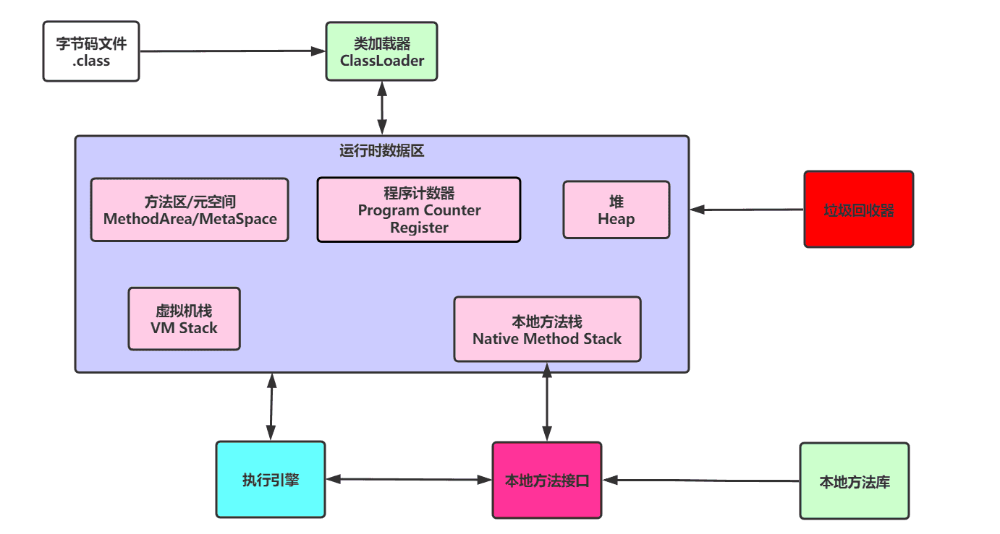
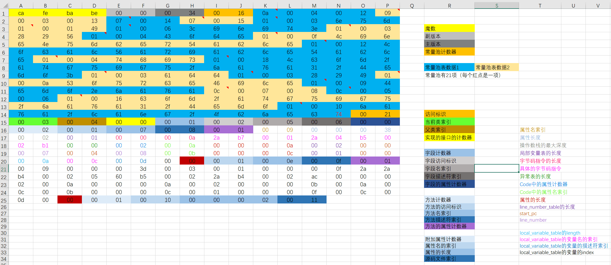
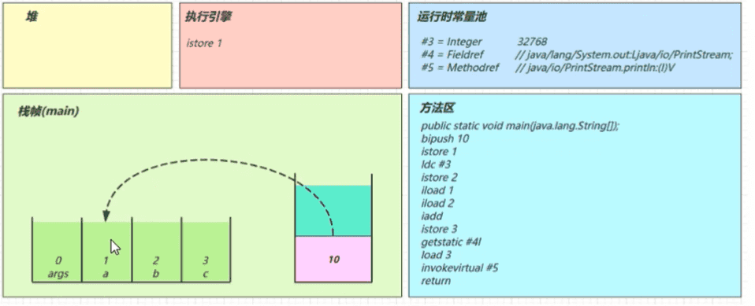
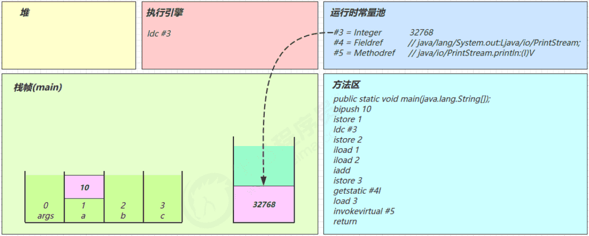
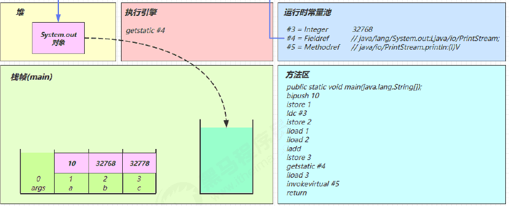
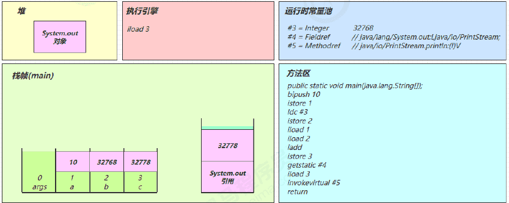
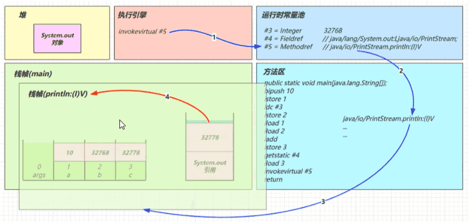
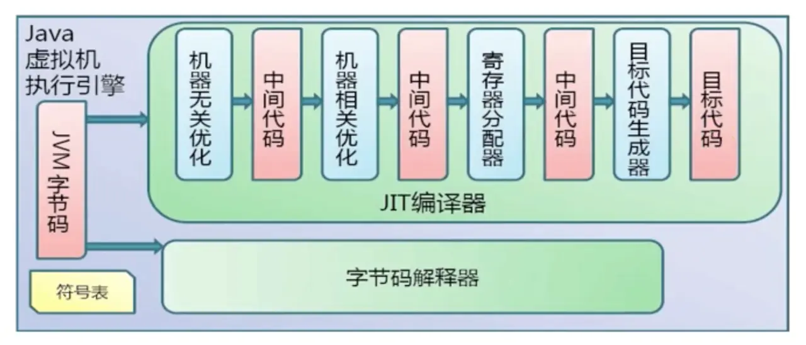
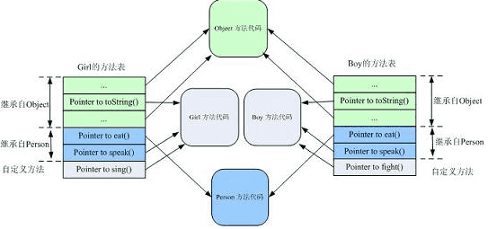
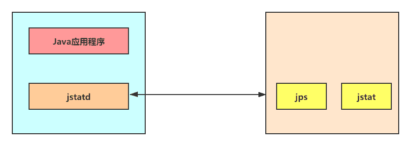

> 有一些JVM调优部分的笔记, 由于教程没有要求调优(等级不够), 于是导出

‍

## 运行机制

### 执行过程

Java 文件编译执行的过程：

​​

* 类加载器：用于装载字节码文件（.class文件）
* 运行时数据区：用于分配存储空间
* 执行引擎：执行字节码文件或本地方法
* 垃圾回收器：用于对 JVM 中的垃圾内容进行回收

---

### 字节码

#### 跨平台性

Java 语言：跨平台的语言（write once ，run anywhere）

* 当 Java 源代码成功编译成字节码后，在不同的平台上面运行**无须再次编译**
* 让一个 Java 程序正确地运行在 JVM 中，Java 源码就必须要被编译为符合 JVM 规范的字节码

编译过程中的编译器：

* 前端编译器： Sun 的全量式编译器 javac、 Eclipse 的增量式编译器 ECJ，**把源代码编译为字节码文件 .class**

  * IntelliJ IDEA 使用 javac 编译器
  * Eclipse 中，当开发人员编写完代码后保存时，ECJ 编译器就会把未编译部分的源码逐行进行编译，而非每次都全量编译，因此 ECJ 的编译效率会比 javac 更加迅速和高效
  * 前端编译器并不会直接涉及编译优化等方面的技术，具体优化细节移交给 HotSpot 的 JIT 编译器负责
* 后端运行期编译器：HotSpot VM 的 C1、C2 编译器，也就是 JIT 编译器，Graal 编译器

  * JIT 编译器：执行引擎部分详解
  * Graal 编译器：JDK10 HotSpot 加入的一个全新的即时编译器，编译效果短短几年时间就追平了 C2
* 静态提前编译器：AOT  (Ahead Of Time Compiler）编译器，直接把源代码编译成本地机器代码

  * JDK 9 引入，是与即时编译相对立的一个概念，即时编译指的是在程序的运行过程中将字节码转换为机器码，AOT 是程序运行之前便将字节码转换为机器码
  * 优点：JVM 加载已经预编译成二进制库，可以直接执行，不必等待即时编译器的预热，减少 Java 应用第一次运行慢的现象
  * 缺点：

    * 破坏了 Java **一次编译，到处运行**，必须为每个不同硬件编译对应的发行包
    * 降低了 Java 链接过程的动态性，加载的代码在编译期就必须全部已知

---

#### 语言发展

机器码：各种用二进制编码方式表示的指令，与 CPU 紧密相关，所以不同种类的 CPU 对应的机器指令不同

指令：指令就是把机器码中特定的 0 和 1 序列，简化成对应的指令，例如 mov，inc 等，可读性稍好，但是不同的硬件平台的同一种指令（比如 mov），对应的机器码也可能不同

指令集：不同的硬件平台支持的指令是有区别的，每个平台所支持的指令，称之为对应平台的指令集

* x86 指令集，对应的是 x86 架构的平台
* ARM 指令集，对应的是 ARM 架构的平台

汇编语言：用助记符代替机器指令的操作码，用地址符号或标号代替指令或操作数的地址

* 在不同的硬件平台，汇编语言对应着不同的机器语言指令集，通过汇编过程转换成机器指令
* 计算机只认识指令码，汇编语言编写的程序也必须翻译成机器指令码，计算机才能识别和执行

高级语言：为了使计算机用户编程序更容易些，后来就出现了各种高级计算机语言

字节码：是一种中间状态（中间码）的二进制代码，比机器码更抽象，需要直译器转译后才能成为机器码

* 字节码为了实现特定软件运行和软件环境，与硬件环境无关
* 通过编译器和虚拟机器实现，编译器将源码编译成字节码，虚拟机器将字节码转译为可以直接执行的指令

<div>

</div>

---

#### 类结构

##### 文件结构

字节码是一种二进制的类文件，是编译之后供虚拟机解释执行的二进制字节码文件，**一个 class 文件对应一个 public 类型的类或接口**

字节码内容是 **JVM 的字节码指令**，不是机器码，C、C++ 经由编译器直接生成机器码，所以执行效率比 Java 高

JVM 官方文档：https://docs.oracle.com/javase/specs/jvms/se8/html/index.html

根据 JVM 规范，类文件结构如下：

```java
ClassFile {
	u4 				magic;		
    u2 				minor_version;		
    u2 				major_version;		
    u2 				constant_pool_count;
    cp_info			constant_pool[constant_pool_count-1];
    u2	 			access_flags;
    u2 				this_class;
    u2 				super_class;
    u2 				interfaces_count;
    u2 				interfaces[interfaces_count];
    u2 				fields_count;
    field_info 		fields[fields_count];
    u2 				methods_count;
    method_info 	methods[methods_count];
    u2 				attributes_count;
    attribute_info 	attributes[attributes_count];
}
```

|类型|名称|说明|长度|数量|
| ----------------| ---------------------| ----------------------| ---------| -----------------------|
|u4|magic|魔数，识别类文件格式|4个字节|1|
|u2|minor_version|副版本号(小版本)|2个字节|1|
|u2|major_version|主版本号(大版本)|2个字节|1|
|u2|constant_pool_count|常量池计数器|2个字节|1|
|cp_info|constant_pool|常量池表|n个字节|constant_pool_count-1|
|u2|access_flags|访问标识|2个字节|1|
|u2|this_class|类索引|2个字节|1|
|u2|super_class|父类索引|2个字节|1|
|u2|interfaces_count|接口计数|2个字节|1|
|u2|interfaces|接口索引集合|2个字节|interfaces_count|
|u2|fields_count|字段计数器|2个字节|1|
|field_info|fields|字段表|n个字节|fields_count|
|u2|methods_count|方法计数器|2个字节|1|
|method_info|methods|方法表|n个字节|methods_count|
|u2|attributes_count|属性计数器|2个字节|1|
|attribute_info|attributes|属性表|n个字节|attributes_count|

Class 文件格式采用一种类似于 C 语言结构体的方式进行数据存储，这种结构中只有两种数据类型：无符号数和表

* 无符号数属于基本的数据类型，以 u1、u2、u4、u8 来分别代表1个字节、2个字节、4个字节和8个字节的无符号数，无符号数可以用来描述数字、索引引用、数量值或者按照 UTF-8 编码构成字符串
* 表是由多个无符号数或者其他表作为数据项构成的复合数据类型，表都以 `_info`​ 结尾，用于描述有层次关系的数据，整个 Class 文件本质上就是一张表，由于表没有固定长度，所以通常会在其前面加上个数说明

获取方式：

* HelloWorld.java 执行 `javac -parameters -d . HellowWorld.java`​指令
* 写入文件指令 `javap -v xxx.class >xxx.txt`​
* IDEA 插件 jclasslib

---

##### 魔数版本

魔数：每个 Class 文件开头的 4 个字节的无符号整数称为魔数（Magic Number），是 Class 文件的标识符，代表这是一个能被虚拟机接受的有效合法的 Class 文件，

* 魔数值固定为 0xCAFEBABE，不符合则会抛出错误
* 使用魔数而不是扩展名来进行识别主要是基于安全方面的考虑，因为文件扩展名可以随意地改动

版本：4 个 字节，5 6两个字节代表的是编译的副版本号 minor_version，而 7 8 两个字节是编译的主版本号 major_version

* 不同版本的 Java 编译器编译的 Class 文件对应的版本是不一样的，高版本的 Java 虚拟机可以执行由低版本编译器生成的 Class 文件，反之 JVM 会抛出异常 `java.lang.UnsupportedClassVersionError`​

|主版本（十进制）|副版本（十进制）|编译器版本|
| ------------------| ------------------| ------------|
|45|3|1.1|
|46|0|1.2|
|47|0|1.3|
|48|0|1.4|
|49|0|1.5|
|50|0|1.6|
|51|0|1.7|
|52|0|1.8|
|53|0|1.9|
|54|0|1.10|
|55|0|1.11|

​​

图片来源：https://www.bilibili.com/video/BV1PJ411n7xZ

---

##### 常量池

常量池中常量的数量是不固定的，所以在常量池的入口需要放置一项 u2 类型的无符号数，代表常量池计数器（constant_pool_count），这个容量计数是从 1 而不是 0 开始，是为了满足后面某些指向常量池的索引值的数据在特定情况下需要表达不引用任何一个常量池项目，这种情况可用索引值 0 来表示

constant_pool 是一种表结构，以1 ~ constant_pool_count - 1为索引，表明有多少个常量池表项. 表项中存放编译时期生成的各种字面量和符号引用，这部分内容将在类加载后进入方法区的运行时常量池

* 字面量（Literal） ：基本数据类型、字符串类型常量、声明为 final 的常量值等
* 符号引用（Symbolic References）：类和接口的全限定名、字段的名称和描述符、方法的名称和描述符

  * 全限定名：com/test/Demo 这个就是类的全限定名，仅仅是把包名的 `.`​ 替换成 `/`​，为了使连续的多个全限定名之间不产生混淆，在使用时最后一般会加入一个 `;`​ 表示全限定名结束
  * 简单名称：指没有类型和参数修饰的方法或者字段名称，比如字段 x 的简单名称就是 x
  * 描述符：用来描述字段的数据类型、方法的参数列表（包括数量、类型以及顺序）和返回值

    |标志符|含义|
    | --------| ----------------------------------------|
    |B|基本数据类型 byte|
    |C|基本数据类型 char|
    |D|基本数据类型 double|
    |F|基本数据类型 float|
    |I|基本数据类型 int|
    |J|基本数据类型 long|
    |S|基本数据类型 short|
    |Z|基本数据类型 boolean|
    |V|代表 void 类型|
    |L|对象类型，比如：`Ljava/lang/Object;`​，不同方法间用`;`​隔开|
    |[|数组类型，代表一维数组. 比如：`double[][][] is [[[D`​|

常量类型和结构：

|类型|标志(或标识)|描述|
| ----------------------------------| --------------| ------------------------|
|CONSTANT_utf8_info|1|UTF-8编码的字符串|
|CONSTANT_Integer_info|3|整型字面量|
|CONSTANT_Float_info|4|浮点型字面量|
|CONSTANT_Long_info|5|长整型字面量|
|CONSTANT_Double_info|6|双精度浮点型字面量|
|CONSTANT_Class_info|7|类或接口的符号引用|
|CONSTANT_String_info|8|字符串类型字面量|
|CONSTANT_Fieldref_info|9|字段的符号引用|
|CONSTANT_Methodref_info|10|类中方法的符号引用|
|CONSTANT_InterfaceMethodref_info|11|接口中方法的符号引用|
|CONSTANT_NameAndType_info|12|字段或方法的符号引用|
|CONSTANT_MethodHandle_info|15|表示方法句柄|
|CONSTANT_MethodType_info|16|标志方法类型|
|CONSTANT_InvokeDynamic_info|18|表示一个动态方法调用点|

18 种常量没有出现 byte、short、char，boolean 的原因：编译之后都可以理解为 Integer

---

##### 访问标识

访问标识（access_flag），又叫访问标志、访问标记，该标识用两个字节表示，用于识别一些类或者接口层次的访问信息，包括这个 Class 是类还是接口，是否定义为 public类型，是否定义为 abstract类型等

* 类的访问权限通常为 ACC_ 开头的常量
* 每一种类型的表示都是通过设置访问标记的 32 位中的特定位来实现的，比如若是 public final 的类，则该标记为 `ACC_PUBLIC | ACC_FINAL`​
* 使用 `ACC_SUPER`​ 可以让类更准确地定位到父类的方法，确定类或接口里面的 invokespecial 指令使用的是哪一种执行语义，现代编译器都会设置并且使用这个标记

|标志名称|标志值|含义|
| ----------------| --------| -----------------------------------------------------------------------------------------------------------------------|
|ACC_PUBLIC|0x0001|标志为 public 类型|
|ACC_FINAL|0x0010|标志被声明为 final，只有类可以设置|
|ACC_SUPER|0x0020|标志允许使用 invokespecial 字节码指令的新语义，JDK1.0.2之后编译出来的类的这个标志默认为真，使用增强的方法调用父类方法|
|ACC_INTERFACE|0x0200|标志这是一个接口|
|ACC_ABSTRACT|0x0400|是否为 abstract 类型，对于接口或者抽象类来说，次标志值为真，其他类型为假|
|ACC_SYNTHETIC|0x1000|标志此类并非由用户代码产生（由编译器产生的类，没有源码对应）|
|ACC_ANNOTATION|0x2000|标志这是一个注解|
|ACC_ENUM|0x4000|标志这是一个枚举|

---

##### 索引集合

类索引、父类索引、接口索引集合

* 类索引用于确定这个类的全限定名
* 父类索引用于确定这个类的父类的全限定名，Java 语言不允许多重继承，所以父类索引只有一个，除了Object 之外，所有的 Java 类都有父类，因此除了 java.lang.Object 外，所有 Java 类的父类索引都不为0
* 接口索引集合就用来描述这个类实现了哪些接口

  * interfaces_count 项的值表示当前类或接口的直接超接口数量
  * interfaces[] 接口索引集合，被实现的接口将按 implements 语句后的接口顺序从左到右排列在接口索引集合中

|长度|含义|
| ------| ------------------------------|
|u2|this_class|
|u2|super_class|
|u2|interfaces_count|
|u2|interfaces[interfaces_count]|

---

##### 字段表

字段 fields 用于描述接口或类中声明的变量，包括类变量以及实例变量，但不包括方法内部、代码块内部声明的局部变量以及从父类或父接口继承. 字段叫什么名字、被定义为什么数据类型，都是无法固定的，只能引用常量池中的常量来描述

fields_count（字段计数器），表示当前 class 文件 fields 表的成员个数，用两个字节来表示

fields[]（字段表）：

* 表中的每个成员都是一个 fields_info 结构的数据项，用于表示当前类或接口中某个字段的完整描述
* 字段访问标识：

  |标志名称|标志值|含义|
  | ---------------| --------| ----------------------------|
  |ACC_PUBLIC|0x0001|字段是否为public|
  |ACC_PRIVATE|0x0002|字段是否为private|
  |ACC_PROTECTED|0x0004|字段是否为protected|
  |ACC_STATIC|0x0008|字段是否为static|
  |ACC_FINAL|0x0010|字段是否为final|
  |ACC_VOLATILE|0x0040|字段是否为volatile|
  |ACC_TRANSTENT|0x0080|字段是否为transient|
  |ACC_SYNCHETIC|0x1000|字段是否为由编译器自动产生|
  |ACC_ENUM|0x4000|字段是否为enum|
* 字段名索引：根据该值查询常量池中的指定索引项即可
* 描述符索引：用来描述字段的数据类型、方法的参数列表和返回值

  |字符|类型|含义|
  | -------------| -----------| -------------------------|
  |B|byte|有符号字节型树|
  |C|char|Unicode字符，UTF-16编码|
  |D|double|双精度浮点数|
  |F|float|单精度浮点数|
  |I|int|整型数|
  |J|long|长整数|
  |S|short|有符号短整数|
  |Z|boolean|布尔值true/false|
  |V|void|代表void类型|
  |L Classname|reference|一个名为Classname的实例|
  |[|reference|一个一维数组|
* 属性表集合：属性个数存放在 attribute_count 中，属性具体内容存放在 attribute 数组中，一个字段还可能拥有一些属性，用于存储更多的额外信息，比如初始化值、一些注释信息等

  ```java
  ConstantValue_attribute{
      u2 attribute_name_index;
      u4 attribute_length;
      u2 constantvalue_index;
  }
  ```

  对于常量属性而言，attribute_length 值恒为2

---

##### 方法表

方法表是 methods 指向常量池索引集合，其中每一个 method_info 项都对应着一个类或者接口中的方法信息，完整描述了每个方法的签名

* 如果这个方法不是抽象的或者不是 native 的，字节码中就会体现出来
* methods 表只描述当前类或接口中声明的方法，不包括从父类或父接口继承的方法
* methods 表可能会出现由编译器自动添加的方法，比如初始化方法 <cinit> 和实例化方法 <init>

**重载（Overload）** 一个方法，除了要与原方法具有相同的简单名称之外，还要求必须拥有一个与原方法不同的特征签名，特征签名就是一个方法中各个参数在常量池中的字段符号引用的集合，因为返回值不会包含在特征签名之中，因此 Java 语言里无法仅仅依靠返回值的不同来对一个已有方法进行重载. 但在 Class 文件格式中，特征签名的范围更大一些，只要描述符不是完全一致的两个方法就可以共存

methods_count（方法计数器）：表示 class 文件 methods 表的成员个数，使用两个字节来表示

methods[]（方法表）：每个表项都是一个 method_info 结构，表示当前类或接口中某个方法的完整描述

* 方法表结构如下：

  |类型|名称|含义|数量|
  | ----------------| ------------------| ------------| ------------------|
  |u2|access_flags|访问标志|1|
  |u2|name_index|字段名索引|1|
  |u2|descriptor_index|描述符索引|1|
  |u2|attrubutes_count|属性计数器|1|
  |attribute_info|attributes|属性集合|attributes_count|
* 方法表访问标志：

  |标志名称|标志值|含义|
  | ---------------| --------| ----------------------------|
  |ACC_PUBLIC|0x0001|字段是否为 public|
  |ACC_PRIVATE|0x0002|字段是否为 private|
  |ACC_PROTECTED|0x0004|字段是否为 protected|
  |ACC_STATIC|0x0008|字段是否为 static|
  |ACC_FINAL|0x0010|字段是否为 final|
  |ACC_VOLATILE|0x0040|字段是否为 volatile|
  |ACC_TRANSTENT|0x0080|字段是否为 transient|
  |ACC_SYNCHETIC|0x1000|字段是否为由编译器自动产生|
  |ACC_ENUM|0x4000|字段是否为 enum|

---

##### 属性表

属性表集合，指的是 Class 文件所携带的辅助信息，比如该 Class 文件的源文件的名称，以及任何带有 `RetentionPolicy.CLASS`​ 或者 `RetentionPolicy.RUNTIME`​ 的注解，这类信息通常被用于 Java 虚拟机的验证和运行，以及 Java 程序的调试. 字段表、方法表都可以有自己的属性表，用于描述某些场景专有的信息

attributes_ count（属性计数器）：表示当前文件属性表的成员个数

attributes[]（属性表）：属性表的每个项的值必须是 attribute_info 结构

* 属性的通用格式：

  ```java
  ConstantValue_attribute{
      u2 attribute_name_index;	//属性名索引
      u4 attribute_length;		//属性长度
      u2 attribute_info;			//属性表
  }
  ```
* 属性类型：

  |属性名称|使用位置|含义|
  | ---------------------------------------| --------------------| ---------------------------------------------------------------------------------------------------|
  |Code|方法表|Java 代码编译成的字节码指令|
  |ConstantValue|字段表|final 关键字定义的常量池|
  |Deprecated|类、方法、字段表|被声明为 deprecated 的方法和字段|
  |Exceptions|方法表|方法抛出的异常|
  |EnclosingMethod|类文件|仅当一个类为局部类或者匿名类是才能拥有这个属性，这个属性用于标识这个类所在的外围方法|
  |InnerClass|类文件|内部类列表|
  |LineNumberTable|Code 属性|Java 源码的行号与字节码指令的对应关系|
  |LocalVariableTable|Code 属性|方法的局部变量描述|
  |StackMapTable|Code 属性|JDK1.6 中新增的属性，供新的类型检查检验器检查和处理目标方法的局部变量和操作数有所需要的类是否匹配|
  |Signature|类，方法表，字段表|用于支持泛型情况下的方法签名|
  |SourceFile|类文件|记录源文件名称|
  |SourceDebugExtension|类文件|用于存储额外的调试信息|
  |Syothetic|类，方法表，字段表|标志方法或字段为编泽器自动生成的|
  |LocalVariableTypeTable|类|使用特征签名代替描述符，是为了引入泛型语法之后能描述泛型参数化类型而添加|
  |RuntimeVisibleAnnotations|类，方法表，字段表|为动态注解提供支持|
  |RuntimelnvisibleAnnotations|类，方法表，字段表|用于指明哪些注解是运行时不可见的|
  |RuntimeVisibleParameterAnnotation|方法表|作用与 RuntimeVisibleAnnotations 属性类似，只不过作用对象为方法|
  |RuntirmelnvisibleParameterAnniotation|方法表|作用与 RuntimelnvisibleAnnotations 属性类似，作用对象哪个为方法参数|
  |AnnotationDefauit|方法表|用于记录注解类元素的默认值|
  |BootstrapMethods|类文件|用于保存 invokeddynanic 指令引用的引导方式限定符|

---

#### 编译指令

##### javac

javac：编译命令，将 java 源文件编译成 class 字节码文件

​`javac xx.java`​ 不会在生成对应的局部变量表等信息，使用 `javac -g xx.java`​ 可以生成所有相关信息

---

##### javap

javap 反编译生成的字节码文件，根据 class 字节码文件，反解析出当前类对应的 code 区 （字节码指令）、局部变量表、异常表和代码行偏移量映射表、常量池等信息

用法：javap <options> <classes>

```sh
-help  --help  -?        输出此用法消息
-version                 版本信息
-public                  仅显示公共类和成员
-protected               显示受保护的/公共类和成员
-package                 显示程序包/受保护的/公共类和成员 (默认)
-p  -private             显示所有类和成员
						 #常用的以下三个
-v  -verbose             输出附加信息
-l                       输出行号和本地变量表
-c                       对代码进行反汇编	#反编译

-s                       输出内部类型签名
-sysinfo                 显示正在处理的类的系统信息 (路径, 大小, 日期, MD5 散列)
-constants               显示最终常量
-classpath <path>        指定查找用户类文件的位置
-cp <path>               指定查找用户类文件的位置
-bootclasspath <path>    覆盖引导类文件的位置
```

---

#### 指令集

##### 执行指令

Java 字节码属于 JVM 基本执行指令. 由一个字节长度的代表某种操作的操作码（opcode）以及零至多个代表此操作所需参数的操作数（operand）所构成，虚拟机中许多指令并不包含操作数，只有一个操作码（零地址指令）

由于限制了 Java 虚拟机操作码的长度为一个字节（0~255），所以指令集的操作码总数不可能超过 256 条

在 JVM 的指令集中，大多数的指令都包含了其操作所对应的数据类型信息. 例如 iload 指令用于从局部变量表中加载 int 型的数据到操作数栈中，而 fload 指令加载的则是 float 类型的数据

* i 代表对 int 类型的数据操作
* l 代表 long
* s 代表 short
* b 代表 byte
* c 代表 char
* f 代表 float
* d 代表 double

大部分的指令都没有支持 byte、char、short、boolean 类型，编译器会在编译期或运行期将 byte 和 short 类型的数据带符号扩展（Sign-Extend-）为相应的 int 类型数据，将 boolean 和 char 类型数据零位扩展（Zero-Extend）为相应的 int 类型数据

在做值相关操作时:

* 一个指令，可以从局部变量表、常量池、堆中对象、方法调用、系统调用中等取得数据，这些数据（可能是值，也可能是对象的引用）被压入操作数栈
* 一个指令，也可以从操作数栈中取出一到多个值（pop 多次），完成赋值、加减乘除、方法传参、系统调用等等操作

---

##### 加载存储

加载和存储指令用于将数据从栈帧的局部变量表和操作数栈之间来回传递

局部变量压栈指令：将给定的局部变量表中的数据压入操作数栈

* xload、xload_n，x 表示取值数据类型，为 i、l、f、d、a， n 为 0 到 3
* 指令 xload_n 表示将第 n 个局部变量压入操作数栈，aload_n 表示将一个对象引用压栈
* 指令 xload n 通过指定参数的形式，把局部变量压入操作数栈，局部变量数量超过 4 个时使用这个命令

常量入栈指令：将常数压入操作数栈，根据数据类型和入栈内容的不同，又分为 const、push、ldc 指令

* push：包括 bipush 和 sipush，区别在于接收数据类型的不同，bipush 接收 8 位整数作为参数，sipush 接收 16 位整数
* ldc：如果以上指令不能满足需求，可以使用 ldc 指令，接收一个 8 位的参数，该参数指向常量池中的 int、 float 或者 String 的索引，将指定的内容压入堆栈. ldc_w 接收两个 8 位参数，能支持的索引范围更大，如果要压入的元素是 long 或 double 类型的，则使用 ldc2_w 指令
* aconst_null 将 null 对象引用压入栈，iconst_m1 将 int 类型常量 -1 压入栈，iconst_0 将 int 类型常量 0 压入栈

出栈装入局部变量表指令：将操作数栈中栈顶元素弹出后，装入局部变量表的指定位置，用于给局部变量赋值

* xstore、xstore_n，x 表示取值类型为 i、l、f、d、a， n 为 0 到 3
* xastore 表示存入数组，x 取值为 i、l、f、d、a、b、c、s

扩充局部变量表的访问索引的指令：wide

---

##### 算术指令

算术指令用于对两个操作数栈上的值进行某种特定运算，并把计算结果重新压入操作数栈

没有直接支持 byte、 short、 char 和 boolean 类型的算术指令，对于这些数据的运算，都使用 int 类型的指令来处理，数组类型也是转换成 int 数组

* 加法指令：iadd、ladd、fadd、dadd
* 减法指令：isub、lsub、fsub、dsub
* 乘法指令：imu、lmu、fmul、dmul
* 除法指令：idiv、ldiv、fdiv、ddiv
* 求余指令：irem、lrem、frem、drem（remainder 余数）
* 取反指令：ineg、lneg、fneg、dneg （negation 取反）
* 自增指令：iinc（直接**在局部变量 slot 上进行运算**，不用放入操作数栈）
* 位运算指令，又可分为：

  * 位移指令：ishl、ishr、 iushr、lshl、lshr、 lushr
  * 按位或指令：ior、lor
  * 按位与指令：iand、land
  * 按位异或指令：ixor、lxor
* 比较指令：dcmpg、dcmpl、 fcmpg、fcmpl、lcmp

运算模式：

* 向最接近数舍入模式，JVM 在进行浮点数计算时，所有的运算结果都必须舍入到适当的精度，非精确结果必须舍入为可被表示的最接近的精确值，如果有两种可表示形式与该值一样接近，将优先选择最低有效位为零的
* 向零舍入模式：将浮点数转换为整数时，该模式将在目标数值类型中选择一个最接近但是不大于原值的数字作为最精确的舍入结果

NaN 值：当一个操作产生溢出时，将会使用有符号的无穷大表示，如果某个操作结果没有明确的数学定义，将使用 NaN 值来表示

```java
double j = i / 0.0;
System.out.println(j);//无穷大，NaN: not a number
```

**分析 i++** ：从字节码角度分析：a++ 和 ++a 的区别是先执行 iload 还是先执行 iinc

```java
 4 iload_1		//存入操作数栈
 5 iinc 1 by 1	//自增i++
 8 istore_3		//把操作数栈没有自增的数据的存入局部变量表
 9 iinc 2 by 1	//++i
12 iload_2		//加载到操作数栈
13 istore 4		//存入局部变量表，这个存入没有 _ 符号，_只能到3
```

```java
public class Demo {
    public static void main(String[] args) {
        int a = 10;
        int b = a++ + ++a + a--;
        System.out.println(a);	//11
        System.out.println(b);	//34
    }
}
```

判断结果：

```java
public class Demo {
    public static void main(String[] args) {
        int i = 0;
        int x = 0;
        while (i < 10) {
            x = x++;
            i++;
        }
        System.out.println(x); // 结果是 0
    }
}
```

---

##### 类型转换

类型转换指令可以将两种不同的数值类型进行相互转换，除了 boolean 之外的七种类型

宽化类型转换：

* JVM 支持以下数值的宽化类型转换（widening numeric conversion），小范围类型到大范围类型的安全转换

  * 从 int 类型到 long、float 或者 double 类型，对应的指令为 i2l、i2f、i2d
  * 从 long 类型到 float、 double 类型，对应的指令为 l2f、l2d
  * 从 float 类型到 double 类型，对应的指令为 f2d
* 精度损失问题

  * 宽化类型转换是不会因为超过目标类型最大值而丢失信息
  * 从 int 转换到 float 或者 long 类型转换到 double 时，将可能发生精度丢失
* 从 byte、char 和 short 类型到 int 类型的宽化类型转换实际上是不存在的，JVM 把它们当作 int 处理

窄化类型转换：

* Java 虚拟机直接支持以下窄化类型转换：

  * 从 int 类型至 byte、 short 或者 char 类型，对应的指令有 i2b、i2c、i2s
  * 从 long 类型到 int 类型，对应的指令有 l2i
  * 从 float 类型到 int 或者 long 类型，对应的指令有:f2i、f2l
  * 从 double 类型到 int、long 或 float 者类型，对应的指令有 d2i、d2、d2f
* 精度损失问题：

  * 窄化类型转换可能会导致转换结果具备不同的正负号、不同的数量级，转换过程可能会导致数值丢失精度
  * 将一个浮点值窄化转换为整数类型 T（T 限于 int 或 long 类型之一）时，将遵循以下转换规则：

    * 如果浮点值是 NaN，那转换结果就是 int 或 long 类型的 0
    * 如果浮点值不是无穷大的话，浮点值使用 IEEE 754 的向零舍入模式取整，获得整数值 v，如果 v 在目标类型 T 的表示范围之内，那转换结果就是 v，否则将根据 v 的符号，转换为 T 所能表示的最大或者最小正数

---

##### 创建访问

创建指令：

* 创建类实例指令：new，接收一个操作数指向常量池的索引，表示要创建的类型，执行完成后将对象的引用压入栈

  ```java
  0:  new             #2 // class com/jvm/bytecode/Demo
  3:  dup
  4:  invokespecial   #3 // Method "<init>":()V
  ```

  **dup 是复制操作数栈栈顶的内容**，需要两份引用原因：

  * 一个要配合 invokespecial 调用该对象的构造方法 <init>:()V （会消耗掉栈顶一个引用）
  * 一个要配合 astore_1 赋值给局部变量
* 创建数组的指令：newarray、anewarray、multianewarray

  * newarray：创建基本类型数组
  * anewarray：创建引用类型数组
  * multianewarray：创建多维数组

字段访问指令：对象创建后可以通过对象访问指令获取对象实例或数组实例中的字段或者数组元素

* 访问类字段（static字段，或者称为类变量）的指令：getstatic、putstatic
* 访问类实例字段（非static字段，或者称为实例变量）的指令：getfield、 putfield

类型检查指令：检查类实例或数组类型的指令

* checkcast：用于检查类型强制转换是否可以进行，如果可以进行 checkcast 指令不会改变操作数栈，否则它会抛出 ClassCastException 异常
* instanceof：判断给定对象是否是某一个类的实例，会将判断结果压入操作数栈

---

##### 方法指令

方法调用指令：invokevirtual、 invokeinterface、invokespecial、invokestatic、invokedynamic

**方法调用章节详解**

---

##### 操作数栈

JVM 提供的操作数栈管理指令，可以用于直接操作操作数栈的指令

* pop、pop2：将一个或两个元素从栈顶弹出，并且直接废弃
* dup、dup2，dup_x1、dup2_x1，dup_x2、dup2_x2：复制栈顶一个或两个数值并重新压入栈顶
* swap：将栈最顶端的两个 slot 数值位置交换，JVM 没有提供交换两个 64 位数据类型数值的指令
* nop：一个非常特殊的指令，字节码为 0x00，和汇编语言中的 nop 一样，表示什么都不做，一般可用于调试、占位等

---

##### 控制转移

比较指令：比较栈顶两个元素的大小，并将比较结果入栈

* lcmp：比较两个 long 类型值
* fcmpl：比较两个 float 类型值（当遇到NaN时，返回-1）
* fcmpg：比较两个 float 类型值（当遇到NaN时，返回1）
* dcmpl：比较两个 double 类型值（当遇到NaN时，返回-1）
* dcmpg：比较两个 double 类型值（当遇到NaN时，返回1）

条件跳转指令：

|指令|说明|
| -----------| ----------------------------------------------------|
|ifeq|equals，当栈顶int类型数值等于0时跳转|
|ifne|not equals，当栈顶in类型数值不等于0时跳转|
|iflt|lower than，当栈顶in类型数值小于0时跳转|
|ifle|lower or equals，当栈顶in类型数值小于等于0时跳转|
|ifgt|greater than，当栈顶int类型数组大于0时跳转|
|ifge|greater or equals，当栈顶in类型数值大于等于0时跳转|
|ifnull|为 null 时跳转|
|ifnonnull|不为 null 时跳转|

比较条件跳转指令：

|指令|说明|
| -----------| -----------------------------------------------------------|
|if_icmpeq|比较栈顶两 int 类型数值大小（下同），当前者等于后者时跳转|
|if_icmpne|当前者不等于后者时跳转|
|if_icmplt|当前者小于后者时跳转|
|if_icmple|当前者小于等于后者时跳转|
|if_icmpgt|当前者大于后者时跳转|
|if_icmpge|当前者大于等于后者时跳转|
|if_acmpeq|当结果相等时跳转|
|if_acmpne|当结果不相等时跳转|

多条件分支跳转指令：

* tableswitch：用于 switch 条件跳转，case 值连续
* lookupswitch：用于 switch 条件跳转，case 值不连续

无条件跳转指令：

* goto：用来进行跳转到指定行号的字节码
* goto_w：无条件跳转（宽索引）

---

##### 异常处理

###### 处理机制

抛出异常指令：athrow 指令

JVM 处理异常（catch 语句）不是由字节码指令来实现的，而是**采用异常表来完成**的

* 代码：

  ```java
  public static void main(String[] args) {  
      int i = 0;  
      try {  
          i = 10;  
      } catch (Exception e) {   
          i = 20;   
      } finally {
          i = 30;
      }
  }
  ```
* 字节码：

  * 多出一个 **Exception table** 的结构， **[from, to) 是前闭后开的检测范围**，一旦这个范围内的字节码执行出现异常，则通过 type 匹配异常类型，如果一致，进入 target 所指示行号
  * 11 行的字节码指令 astore_2 是将异常对象引用存入局部变量表的 slot 2 位置，因为异常出现时，只能进入 Exception table 中一个分支，所以局部变量表 slot 2 位置被共用

  ```java
      0: 	iconst_0
      1: 	istore_1 	// 0 -> i	->赋值
      2: 	bipush 10 	// try 10 放入操作数栈顶
      4: 	istore_1 	// 10 -> i 将操作数栈顶数据弹出，存入局部变量表的 slot1
      5: 	bipush 30 	// 【finally】 
      7: 	istore_1 	// 30 -> i 
      8: 	goto 27 	// return -----------------------------------
      11: astore_2 	// catch Exceptin -> e ----------------------
      12: bipush 20 	// 
      14: istore_1 	// 20 -> i 
      15: bipush 30 	// 【finally】 
      17: istore_1 	// 30 -> i 
      18: goto 27 	// return -----------------------------------
      21: astore_3 	// catch any -> slot 3 ----------------------
      22: bipush 30 	// 【finally】
      24: istore_1 	// 30 -> i 
      25: aload_3 	// 将局部变量表的slot 3数据弹出，放入操作数栈栈顶
      26: athrow 		// throw 抛出异常
      27: return
  Exception table:
  	// 任何阶段出现任务异常都会执行 finally
  	from   to 	target 	type
  		2	5 		11 	Class java/lang/Exception
  		2 	5 		21 	any // 剩余的异常类型，比如 Error
  		11 15 		21 	any // 剩余的异常类型，比如 Error
  LineNumberTable: ...
  LocalVariableTable:
  	Start Length Slot Name Signature
  	12 		3 		2 	e 	Ljava/lang/Exception;
  	0 		28 		0 args 	[Ljava/lang/String;
  	2 		26 		1 	i 	I
  ```

---

###### finally

finally 中的代码被**复制了 3 份**，分别放入 try 流程，catch 流程以及 catch 剩余的异常类型流程（上节案例）

* 代码：

  ```java
  public static int test() {
      try {
      	return 10;
      } finally {
      	return 20;
      }
  }
  ```
* 字节码：

  ```java
      0: bipush 10 	// 10 放入栈顶
      2: istore_0 	// 10 -> slot 0 【从栈顶移除了】
      3: bipush 20 	// 20 放入栈顶
      5: ireturn 		// 返回栈顶 int(20)
      6: astore_1 	// catch any 存入局部变量表的 slot1
      7: bipush 20 	// 20 放入栈顶
      9: ireturn 		// 返回栈顶 int(20)
  Exception table:
  	from   to 	target 	type
  		0	3		6 	any  
  ```

---

###### return

* 吞异常

  ```java
  public static int test() {
      try {
      	return 10;
      } finally {
      	return 20;
      }
  }
  ```

  ```java
      0: bipush 10 	// 10 放入栈顶
      2: istore_0 	// 10 -> slot 0 【从栈顶移除了】
      3: bipush 20 	// 20 放入栈顶
      5: ireturn 		// 返回栈顶 int(20)
      6: astore_1 	// catch any  存入局部变量表的 slot1
      7: bipush 20 	// 20 放入栈顶
      9: ireturn 		// 返回栈顶 int(20)
  Exception table:
  	from   to 	target 	type
  		0	3		6 	any  
  ```

  * 由于 finally 中的 ireturn 被插入了所有可能的流程，因此返回结果以 finally 的为准
  * 字节码中没有 **athrow** ，表明如果在 finally 中出现了 return，会**吞掉异常**
* 不吞异常

  ```java
  public class Demo {
      public static void main(String[] args) {
      	int result = test();
      	System.out.println(result);//10
  	}
  	public static int test() {
          int i = 10;
          try {
              return i;//返回10
          } finally {
              i = 20;
          }
     	}
  }
  ```

  ```java
      0: 	bipush 10 	// 10 放入栈顶
      2: 	istore_0 	// 10 赋值给i，放入slot 0
      3: 	iload_0 	// i(10)加载至操作数栈
      4: 	istore_1 	// 10 -> slot 1，【暂存至 slot 1，目的是为了固定返回值】
      5: 	bipush 20 	// 20 放入栈顶
      7: 	istore_0 	// 20 slot 0
      8: 	iload_1 	// slot 1(10) 载入 slot 1 暂存的值
      9: 	ireturn 	// 返回栈顶的 int(10)
      10: astore_2	// catch any -> slot 2 存入局部变量表的 slot2
      11: bipush 20
      13: istore_0
      14: aload_2
      15: athrow		// 不会吞掉异常
  Exception table:
  	from   to 	target 	type
  	  3	   5		10 	any  
  ```

---

##### 同步控制

方法级的同步：是隐式的，无须通过字节码指令来控制，它实现在方法调用和返回操作之中，虚拟机可以从方法常量池的方法表结构中的 ACC_SYNCHRONIZED 访问标志得知一个方法是否声明为同步方法

方法内指定指令序列的同步：有 monitorenter 和 monitorexit 两条指令来支持 synchronized 关键字的语义

* montiorenter：进入并获取对象监视器，即为栈顶对象加锁
* monitorexit：释放并退出对象监视器，即为栈顶对象解锁

<div>

</div>

---

#### 执行流程

原始 Java 代码：

```java
public class Demo {
    public static void main(String[] args) {  
        int a = 10;  
        int b = Short.MAX_VALUE + 1;  
        int c = a + b;  
        System.out.println(c);
    }
}
```

javap -v Demo.class：省略

* 常量池载入运行时常量池
* 方法区字节码载入方法区
* main 线程开始运行，分配栈帧内存：（操作数栈stack=2，局部变量表locals=4）
* **执行引擎**开始执行字节码

  ​`bipush 10`​：将一个 byte 压入操作数栈（其长度会补齐 4 个字节），类似的指令

  * sipush 将一个 short 压入操作数栈（其长度会补齐 4 个字节）
  * ldc 将一个 int 压入操作数栈
  * ldc2_w 将一个 long 压入操作数栈（分两次压入，因为 long 是 8 个字节）
  * 这里小的数字都是和字节码指令存在一起，超过 short 范围的数字存入了常量池

  ​`istore_1`​：将操作数栈顶数据弹出，存入局部变量表的 slot 1

  ​​

  ​`ldc #3`​：从常量池加载 3 数据到操作数栈  
  Short.MAX_VALUE 是 32767，所以 32768 = Short.MAX_VALUE + 1 实际是在编译期间计算完成

  ​​

  ​`istore_2`​：将操作数栈顶数据弹出，存入局部变量表的 slot 2

  ​`iload_1`​：将局部变量表的 slot 1 数据弹出，放入操作数栈栈顶

  ​`iload_2`​：将局部变量表的 slot 2 数据弹出，放入操作数栈栈顶

  ​`iadd`​：执行相加操作

  ​​

  ​`istore_3`​：将操作数栈顶数据弹出，存入局部变量表的 slot 3

  ​`getstatic #4`​：获取静态字段

  ​​

  ​`iload_3`​：

  ​​

  ​`invokevirtual #5`​：

  * 找到常量池 5 项
  * 定位到方法区 java/io/PrintStream.println:(I)V 方法
  * **生成新的栈帧**（分配 locals、stack等）
  * 传递参数，执行新栈帧中的字节码
  * 执行完毕，弹出栈帧
  * 清除 main 操作数栈内容

  ​​

  return：完成 main 方法调用，弹出 main 栈帧，程序结束

---

### 执行引擎

#### 基本介绍

执行引擎：Java 虚拟机的核心组成部分之一，类加载主要任务是负责装载字节码到其内部，但字节码并不能够直接运行在操作系统之上，需要执行引擎将**字节码指令解释/编译为对应平台上的本地机器指令**，进行执行

虚拟机是一个相对于物理机的概念，这两种机器都有代码执行能力：

* 物理机的执行引擎是直接建立在处理器、缓存、指令集和操作系统层面上
* 虚拟机的执行引擎是由软件自行实现的，可以不受物理条件制约地定制指令集与执行引擎的结构体系

Java 是**半编译半解释型语言**，将解释执行与编译执行二者结合起来进行：

* 解释器：根据预定义的规范对字节码采用逐行解释的方式执行，将每条字节码文件中的内容翻译为对应平台的本地机器指令执行
* 即时编译器（JIT : Just In Time Compiler）：虚拟机运行时将源代码直接编译成**和本地机器平台相关的机器码**后再执行，并存入 Code Cache，下次遇到相同的代码直接执行，效率高

---

#### 执行方式

HotSpot VM 采用**解释器与即时编译器并存的架构**，解释器和即时编译器能够相互协作，去选择最合适的方式来权衡编译本地代码和直接解释执行代码的时间

HostSpot JVM 的默认执行方式：

* 当程序启动后，解释器可以马上发挥作用立即执行，省去编译器编译的时间（解释器存在的**必要性**）
* 随着程序运行时间的推移，即时编译器逐渐发挥作用，根据热点探测功能，将有价值的字节码编译为本地机器指令，以换取更高的程序执行效率

HotSpot VM 可以通过 VM 参数设置程序执行方式：

* -Xint：完全采用解释器模式执行程序
* -Xcomp：完全采用即时编译器模式执行程序. 如果即时编译出现问题，解释器会介入执行
* -Xmixed：采用解释器 + 即时编译器的混合模式共同执行程序

​​

---

#### 热点探测

热点代码：被 JIT 编译器编译的字节码，根据代码被调用执行的频率而定，一个被多次调用的方法或者一个循环次数较多的循环体都可以被称之为热点代码

热点探测：JIT 编译器在运行时会针热点代码做出深度优化，将其直接编译为对应平台的本地机器指令进行缓存，以提升程序执行性能

JIT 编译在默认情况是异步进行的，当触发某方法或某代码块的优化时，先将其放入编译队列，然后由编译线程进行编译，编译之后的代码放在 CodeCache 中，通过 `-XX:-BackgroundCompilation`​ 参数可以关闭异步编译

* **CodeCache** 用于缓存编译后的机器码、动态生成的代码和本地方法代码 JNI
* 如果 CodeCache 区域被占满，编译器被停用，字节码将不会编译为机器码，应用程序继续运行，但运行性能会降低很多

HotSpot VM 采用的热点探测方式是基于计数器的热点探测，为每一个方法都建立 2 个不同类型的计数器：方法调用计数器（Invocation Counter）和回边计数器（BackEdge Counter）

* 方法调用计数器：用于统计方法被调用的次数，默认阈值在 Client 模式 下是 1500 次，在 Server 模式下是 10000 次（需要进行激进的优化），超过这个阈值，就会触发 JIT 编译，阈值可以通过虚拟机参数 `-XX:CompileThreshold`​ 设置

  工作流程：当一个方法被调用时， 会先检查该方法是否存在被 JIT 编译过的版本，存在则使用编译后的本地代码来执行；如果不存在则将此方法的调用计数器值加 1，然后判断方法调用计数器与回边计数器值之和是否超过方法调用计数器的阈值，如果超过阈值会向即时编译器**提交一个该方法的代码编译请求**
* 回边计数器：统计一个方法中循环体代码执行的次数，在字节码中控制流向后跳转的指令称为回边

  如果一个方法中的循环体需要执行多次，可以优化为为栈上替换，简称 OSR (On StackReplacement) 编译，**OSR 替换循环代码体的入口，C1、C2 替换的是方法调用的入口**，OSR 编译后会出现方法的整段代码被编译了，但是只有循环体部分才执行编译后的机器码，其他部分仍是解释执行

---

#### 分层编译

HotSpot VM 内嵌两个 JIT 编译器，分别为 Client Compiler 和 Server Compiler，简称 C1 编译器和 C2 编译器

C1 编译器会对字节码进行简单可靠的优化，耗时短，以达到更快的编译速度，C1 编译器的优化方法：

* 方法内联：**将调用的函数代码编译到调用点处**，这样可以减少栈帧的生成，减少参数传递以及跳转过程

  方法内联能够消除方法调用的固定开销，任何方法除非被内联，否则调用都会有固定开销，来源于保存程序在该方法中的执行位置，以及新建、压入和弹出新方法所使用的栈帧.

  ```java
  private static int square(final int i) {
  	return i * i;
  }
  System.out.println(square(9));
  ```

  square 是热点方法，会进行内联，把方法内代码拷贝粘贴到调用者的位置：

  ```java
  System.out.println(9 * 9);
  ```

  还能够进行常量折叠（constant folding）的优化：

  ```java
  System.out.println(81);
  ```
* 冗余消除：根据运行时状况进行代码折叠或削除
* 内联缓存：是一种加快动态绑定的优化技术（方法调用部分详解）

C2 编译器进行耗时较长的优化以及激进优化，优化的代码执行效率更高，当激进优化的假设不成立时，再退回使用 C1 编译，这也是使用分层编译的原因

C2 的优化主要是在全局层面，逃逸分析是优化的基础：标量替换、栈上分配、同步消除

VM 参数设置：

* -client：指定 Java 虚拟机运行在 Client 模式下，并使用 C1 编译器
* -server：指定 Java 虚拟机运行在 Server 模式下，并使用 C2 编译器
* ​`-server -XX:+TieredCompilation`​：在 1.8 之前，分层编译默认是关闭的，可以添加该参数开启

分层编译策略 (Tiered Compilation)：程序解释执行可以触发 C1 编译，将字节码编译成机器码，加上性能监控，C2 编译会根据性能监控信息进行激进优化，JVM 将执行状态分成了 5 个层次：

* 0 层，解释执行（Interpreter）
* 1 层，使用 C1 即时编译器编译执行（不带 profiling）
* 2 层，使用 C1 即时编译器编译执行（带基本的 profiling）
* 3 层，使用 C1 即时编译器编译执行（带完全的 profiling）
* 4 层，使用 C2 即时编译器编译执行（C1 和 C2 协作运行）

  说明：profiling 是指在运行过程中收集一些程序执行状态的数据，例如方法的调用次数，循环的回边次数等

参考文章：https://www.jianshu.com/p/20bd2e9b1f03

---

### 方法调用

#### 方法识别

Java 虚拟机识别方法的关键在于类名、方法名以及方法描述符（method descriptor）

* **方法描述符是由方法的参数类型以及返回类型所构成**，Java 层面叫方法特征签名
* 在同一个类中，如果同时出现多个名字相同且描述符也相同的方法，那么 Java 虚拟机会在类的验证阶段报错

JVM 根据名字和描述符来判断的，只要返回值不一样（方法描述符不一样），其它完全一样，在 JVM 中是允许的，但 Java 语言不允许

```java
// 返回值类型不同，编译阶段直接报错
public static Integer invoke(Object... args) {
    return 1;
}
public static int invoke(Object... args) {
    return 2;
}
```

---

#### 调用机制

方法调用并不等于方法执行，方法调用阶段唯一的任务就是**确定被调用方法的版本**，不是方法的具体运行过程

在 JVM 中，将符号引用转换为直接引用有两种机制：

* 静态链接：当一个字节码文件被装载进 JVM 内部时，如果被调用的目标方法在编译期可知，且运行期保持不变，将调用方法的符号引用转换为直接引用的过程称之为静态链接（类加载的解析阶段）
* 动态链接：被调用的方法在编译期无法被确定下来，只能在程序运行期将调用方法的符号引用转换为直接引用，由于这种引用转换过程具备动态性，因此被称为动态链接（初始化后的解析阶段）

* 对应方法的绑定（分配）机制：静态绑定和动态绑定，编译器已经区分了重载的方法（静态绑定和动态绑定），因此可以认为虚拟机中不存在重载

非虚方法：

* 非虚方法在编译期就确定了具体的调用版本，这个版本在运行时是不可变的
* 静态方法、私有方法、final 方法、实例构造器、父类方法都是非虚方法
* 所有普通成员方法、实例方法、被重写的方法都是虚方法

动态类型语言和静态类型语言：

* 在于对类型的检查是在编译期还是在运行期，满足前者就是静态类型语言，反之则是动态类型语言
* 静态语言是判断变量自身的类型信息；动态类型语言是判断变量值的类型信息，变量没有类型信息
* **Java 是静态类型语言**（尽管 Lambda 表达式为其增加了动态特性），JS，Python 是动态类型语言

  ```java
  String s = "abc";   //Java
  info = "abc";       //Python
  ```

---

#### 调用指令

##### 五种指令

普通调用指令：

* invokestatic：调用静态方法
* invokespecial：调用私有方法、构造器，和父类的实例方法或构造器，以及所实现接口的默认方法
* invokevirtual：调用所有虚方法（虚方法分派）
* invokeinterface：调用接口方法

动态调用指令：

* invokedynamic：动态解析出需要调用的方法

  * Java7 为了实现动态类型语言支持而引入了该指令，但是并没有提供直接生成 invokedynamic 指令的方法，需要借助 ASM 这种底层字节码工具来产生 invokedynamic 指令
  * Java8 的 lambda 表达式的出现，invokedynamic 指令在 Java 中才有了直接生成方式

指令对比：

* 普通调用指令固化在虚拟机内部，方法的调用执行不可干预，根据方法的符号引用链接到具体的目标方法
* 动态调用指令支持用户确定方法
* invokestatic 和 invokespecial 指令调用的方法称为非虚方法，虚拟机能够直接识别具体的目标方法
* invokevirtual 和 invokeinterface 指令调用的方法称为虚方法，虚拟机需要在执行过程中根据调用者的动态类型来确定目标方法

指令说明：

* 如果虚拟机能够确定目标方法有且仅有一个，比如说目标方法被标记为 final，那么可以不通过动态绑定，直接确定目标方法
* 普通成员方法是由 invokevirtual 调用，属于**动态绑定**，即支持多态

---

##### 符号引用

在编译过程中，虚拟机并不知道目标方法的具体内存地址，Java 编译器会暂时用符号引用来表示该目标方法，这一符号引用包括目标方法所在的类或接口的名字，以及目标方法的方法名和方法描述符

符号引用存储在方法区常量池中，根据目标方法是否为接口方法，分为接口符号引用和非接口符号引用：

```java
Constant pool:
...
  #16 = InterfaceMethodref #27.#29	// 接口
...
  #22 = Methodref          #1.#33	// 非接口
...
```

对于非接口符号引用，假定该符号引用所指向的类为 C，则 Java 虚拟机会按照如下步骤进行查找：

1. 在 C 中查找符合名字及描述符的方法
2. 如果没有找到，在 C 的父类中继续搜索，直至 Object 类
3. 如果没有找到，在 C 所直接实现或间接实现的接口中搜索，这一步搜索得到的目标方法必须是非私有、非静态的. 如果有多个符合条件的目标方法，则任意返回其中一个

对于接口符号引用，假定该符号引用所指向的接口为 I，则 Java 虚拟机会按照如下步骤进行查找：

1. 在 I 中查找符合名字及描述符的方法
2. 如果没有找到，在 Object 类中的公有实例方法中搜索
3. 如果没有找到，则在 I 的超接口中搜索，这一步的搜索结果的要求与非接口符号引用步骤 3 的要求一致

---

##### 执行流程

```java
public class Demo {
    public Demo() { }
    private void test1() { }
    private final void test2() { }

    public void test3() { }
    public static void test4() { }

    public static void main(String[] args) {
        Demo3_9 d = new Demo3_9();
        d.test1();
        d.test2();
        d.test3();
        d.test4();
        Demo.test4();
    }
}
```

几种不同的方法调用对应的字节码指令：

```java
0:  new             #2 // class cn/jvm/t3/bytecode/Demo
3:  dup
4:  invokespecial   #3 // Method "<init>":()V
7:  astore_1
8:  aload_1
9:  invokespecial   #4 // Method test1:()V
12: aload_1
13: invokespecial   #5 // Method test2:()V
16: aload_1
17: invokevirtual   #6 // Method test3:()V
20: aload_1
21: pop
22: invokestatic    #7 // Method test4:()V
25: invokestatic    #7 // Method test4:()V
28: return
```

* invokespecial 调用该对象的构造方法 <init>:()V
* invokevirtual 调用对象的成员方法
* ​`d.test4()`​ 是通过**对象引用**调用一个静态方法，在调用 invokestatic 之前执行了 pop 指令，把对象引用从操作数栈弹掉

  * 不建议使用 `对象.静态方法()`​ 的方式调用静态方法，多了 aload 和 pop 指令
  * 成员方法与静态方法调用的区别是：执行方法前是否需要对象引用

---

#### 多态原理

##### 执行原理

Java 虚拟机中关于方法重写的判定基于方法描述符，如果子类定义了与父类中非私有、非静态方法同名的方法，只有当这两个方法的参数类型以及返回类型一致，Java 虚拟机才会判定为重写

理解多态：

* 多态有编译时多态和运行时多态，即静态绑定和动态绑定
* 前者是通过方法重载实现，后者是通过重写实现（子类覆盖父类方法，虚方法表）
* 虚方法：运行时动态绑定的方法，对比静态绑定的非虚方法调用来说，虚方法调用更加耗时

方法重写的本质：

1. 找到操作数栈的第一个元素**所执行的对象的实际类型**，记作 C
2. 如果在类型 C 中找到与描述符和名称都相符的方法，则进行访问**权限校验**（私有的），如果通过则返回这个方法的直接引用，查找过程结束；如果不通过，则返回 java.lang.IllegalAccessError 异常
3. 找不到，就会按照继承关系从下往上依次对 C 的各个父类进行第二步的搜索和验证过程
4. 如果始终没有找到合适的方法，则抛出 java.lang.AbstractMethodError 异常

---

##### 虚方法表

在虚拟机工作过程中会频繁使用到动态绑定，每次动态绑定的过程中都要重新在类的元数据中搜索合适目标，影响到执行效率. 为了提高性能，JVM 采取了一种用**空间换取时间**的策略来实现动态绑定，在每个**类的方法区**建立一个虚方法表（virtual method table），实现使用索引表来代替查找，可以快速定位目标方法

* invokevirtual 所使用的虚方法表（virtual method table，vtable），执行流程

  1. 先通过栈帧中的对象引用找到对象，分析对象头，找到对象的实际 Class
  2. Class 结构中有 vtable，查表得到方法的具体地址，执行方法的字节码
* invokeinterface 所使用的接口方法表（interface method table，itable）

虚方法表会在类加载的链接阶段被创建并开始初始化，类的变量初始值准备完成之后，JVM 会把该类的方法表也初始化完毕

虚方法表的执行过程：

* 对于静态绑定的方法调用而言，实际引用是一个指向方法的指针
* 对于动态绑定的方法调用而言，实际引用是方法表的索引值，也就是方法的间接地址. Java 虚拟机获取调用者的实际类型，并在该实际类型的虚方法表中，根据索引值获得目标方法内存偏移量（指针）

为了优化对象调用方法的速度，方法区的类型信息会增加一个指针，该指针指向一个记录该类方法的方法表. 每个类中都有一个虚方法表，本质上是一个数组，每个数组元素指向一个当前类及其祖先类中非私有的实例方法

方法表满足以下的特质：

* 其一，子类方法表中包含父类方法表中的**所有方法**，并且在方法表中的索引值与父类方法表种的索引值相同
* 其二，**非重写的方法指向父类的方法表项，与父类共享一个方法表项，重写的方法指向本身自己的实现**，这就是为什么多态情况下可以访问父类的方法.

<div>

</div>

Passenger 类的方法表包括两个方法，分别对应 0 号和 1 号. 方法表调换了 toString 方法和 passThroughImmigration 方法的位置，是因为 toString 方法的索引值需要与 Object 类中同名方法的索引值一致，为了保持简洁，这里不考虑 Object 类中的其他方法.

虚方法表对性能的影响：

* 使用了方法表的动态绑定与静态绑定相比，仅仅多出几个内存解引用操作：访问栈上的调用者、读取调用者的动态类型、读取该类型的方法表、读取方法表中某个索引值所对应的目标方法，但是相对于创建并初始化 Java 栈帧这操作的开销可以忽略不计
* 上述优化的效果看上去不错，但实际上**仅存在于解释执行**中，或者即时编译代码的最坏情况. 因为即时编译还拥有另外两种性能更好的优化手段：内联缓存（inlining cache）和方法内联（method inlining）

```java
class Person {
    public String toString() {
        return "I'm a person.";
    }
    public void eat() {}
    public void speak() {}
}

class Boy extends Person {
    public String toString() {
        return "I'm a boy";
    }
    public void speak() {}
    public void fight() {}
}

class Girl extends Person {
    public String toString() {
        return "I'm a girl";
    }
    public void speak() {}
    public void sing() {}
}
```

​​

参考文档：https://www.cnblogs.com/kaleidoscope/p/9790766.html

---

##### 内联缓存

内联缓存：是一种加快动态绑定的优化技术，能够缓存虚方法调用中**调用者的动态类型以及该类型所对应的目标方法**. 在之后的执行过程中，如果碰到已缓存的类型，便会直接调用该类型所对应的目标方法；反之内联缓存则会退化至使用基于方法表的动态绑定

多态的三个术语：

* 单态 (monomorphic)：指的是仅有一种状态的情况
* 多态 (polymorphic)：指的是有限数量种状态的情况，二态（bimorphic）是多态的其中一种
* 超多态 (megamorphic)：指的是更多种状态的情况，通常用一个具体数值来区分多态和超多态，在这个数值之下，称之为多态，否则称之为超多态

对于内联缓存来说，有对应的单态内联缓存、多态内联缓存：

* 单态内联缓存：只缓存了一种动态类型以及所对应的目标方法，实现简单，比较所缓存的动态类型，如果命中，则直接调用对应的目标方法.
* 多态内联缓存：缓存了多个动态类型及其目标方法，需要逐个将所缓存的动态类型与当前动态类型进行比较，如果命中，则调用对应的目标方法

为了节省内存空间，**Java 虚拟机只采用单态内联缓存**，没有命中的处理方法：

* 替换单态内联缓存中的纪录，类似于 CPU 中的数据缓存，对数据的局部性有要求，即在替换内联缓存之后的一段时间内，方法调用的调用者的动态类型应当保持一致，从而能够有效地利用内联缓存
* 劣化为超多态状态，这也是 Java 虚拟机的具体实现方式，这种状态实际上放弃了优化的机会，将直接访问方法表来动态绑定目标方法，但是与替换内联缓存纪录相比节省了写缓存的额外开销

虽然内联缓存附带内联二字，但是并没有内联目标方法

参考文章：https://time.geekbang.org/column/intro/100010301

---

### 代码优化

#### 语法糖

语法糖：指 Java 编译器把 *.java 源码编译为 *.class 字节码的过程中，自动生成和转换的一些代码，主要是为了减轻程序员的负担

#### 构造器

```java
public class Candy1 {
}
```

```java
public class Candy1 {
    // 这个无参构造是编译器帮助我们加上的
    public Candy1() {
        super(); // 即调用父类 Object 的无参构造方法，即调用 java/lang/Object."
        <init>":()V
    }
}
```

---

#### 拆装箱

```java
Integer x = 1;
int y = x;
```

这段代码在 JDK 5 之前是无法编译通过的，必须改写为代码片段2：

```java
Integer x = Integer.valueOf(1);
int y = x.intValue();
```

JDK5 以后编译阶段自动转换成上述片段

---

#### 泛型擦除

泛型也是在 JDK 5 开始加入的特性，但 Java 在编译泛型代码后会执行**泛型擦除**的动作，即泛型信息在编译为字节码之后就丢失了，实际的类型都**当做了 Object 类型**来处理：

```java
List<Integer> list = new ArrayList<>();
list.add(10); // 实际调用的是 List.add(Object e)
Integer x = list.get(0); // 实际调用的是 Object obj = List.get(int index);
```

编译器真正生成的字节码中，还要额外做一个类型转换的操作：

```java
// 需要将 Object 转为 Integer
Integer x = (Integer)list.get(0);
```

如果前面的 x 变量类型修改为 int 基本类型那么最终生成的字节码是：

```java
// 需要将 Object 转为 Integer, 并执行拆箱操作
int x = ((Integer)list.get(0)).intValue();
```

---

#### 可变参数

```java
public class Candy4 {
    public static void foo(String... args) {
        String[] array = args; // 直接赋值
        System.out.println(array);
    }
    public static void main(String[] args) {
    	foo("hello", "world");
    }
}
```

可变参数 `String... args`​ 其实是 `String[] args`​ ， Java 编译器会在编译期间将上述代码变换为：

```java
public static void main(String[] args) {
	foo(new String[]{"hello", "world"});
}
```

注意：如果调用了 `foo()`​ 则等价代码为 `foo(new String[]{})`​ ，创建了一个空的数组，而不会传递 null 进去

---

#### foreach

数组的循环：

```java
int[] array = {1, 2, 3, 4, 5}; // 数组赋初值的简化写法也是语法糖
for (int e : array) {
	System.out.println(e);
}
```

编译后为循环取数：

```java
for(int i = 0; i < array.length; ++i) {
	int e = array[i];
	System.out.println(e);
}
```

集合的循环：

```java
List<Integer> list = Arrays.asList(1,2,3,4,5);
for (Integer i : list) {
	System.out.println(i);
}
```

编译后转换为对迭代器的调用：

```java
List<Integer> list = Arrays.asList(1, 2, 3, 4, 5);
Iterator iter = list.iterator();
while(iter.hasNext()) {
    Integer e = (Integer)iter.next();
    System.out.println(e);
}
```

注意：foreach 循环写法，能够配合数组以及所有实现了 Iterable 接口的集合类一起使用，其中 Iterable 用来获取集合的迭代器

---

#### switch

##### 字符串

switch 可以作用于字符串和枚举类：

```java
switch (str) {
    case "hello": {
        System.out.println("h");
        break;
    }
    case "world": {
        System.out.println("w");
        break;
    }
}
```

注意：**switch 配合 String 和枚举使用时，变量不能为 null**

会被编译器转换为：

```java
byte x = -1;
switch(str.hashCode()) {
    case 99162322: // hello 的 hashCode
        if (str.equals("hello")) {
        	x = 0;
        }
    	break;
    case 113318802: // world 的 hashCode
        if (str.equals("world")) {
        	x = 1;
        }
}
switch(x) {
    case 0:
    	System.out.println("h");
    	break;
    case 1:
    	System.out.println("w");
        break;
}
```

总结：

* 执行了两遍 switch，第一遍是根据字符串的 hashCode 和 equals 将字符串的转换为相应 byte 类型，第二遍才是利用 byte 执行进行比较
* hashCode 是为了提高效率，减少可能的比较；而 equals 是为了防止 hashCode 冲突

---

##### 枚举

switch 枚举的例子，原始代码：

```java
enum Sex {
	MALE, FEMALE
}
public class Candy7 {
    public static void foo(Sex sex) {
        switch (sex) {
            case MALE:
                System.out.println("男"); 
                break;
            case FEMALE:
                System.out.println("女"); 
                break;
        }
	}
}
```

编译转换后的代码：

```java
/**
* 定义一个合成类（仅 jvm 使用，对我们不可见）
* 用来映射枚举的 ordinal 与数组元素的关系
* 枚举的 ordinal 表示枚举对象的序号，从 0 开始
* 即 MALE 的 ordinal()=0，FEMALE 的 ordinal()=1
*/
static class $MAP {
    // 数组大小即为枚举元素个数，里面存储 case 用来对比的数字
    static int[] map = new int[2];
    static {
    	map[Sex.MALE.ordinal()] = 1;
    	map[Sex.FEMALE.ordinal()] = 2;
	}
}
public static void foo(Sex sex) {
    int x = $MAP.map[sex.ordinal()];
    switch (x) {
        case 1:
        	System.out.println("男");
        	break;
        case 2:
        	System.out.println("女");
        	break;
    }
}
```

---

#### 枚举类

JDK 7 新增了枚举类：

```java
enum Sex {
	MALE, FEMALE
}
```

编译转换后：

```java
public final class Sex extends Enum<Sex> {
    public static final Sex MALE;
    public static final Sex FEMALE;
    private static final Sex[] $VALUES;
    static {
        MALE = new Sex("MALE", 0);
        FEMALE = new Sex("FEMALE", 1);
        $VALUES = new Sex[]{MALE, FEMALE};
    }
    private Sex(String name, int ordinal) {
    	super(name, ordinal);
    }
    public static Sex[] values() {
    	return $VALUES.clone();
    }
    public static Sex valueOf(String name) {
    	return Enum.valueOf(Sex.class, name);
    }
}
```

---

#### try-w-r

JDK 7 开始新增了对需要关闭的资源处理的特殊语法 `try-with-resources`​，格式：

```java
try(资源变量 = 创建资源对象){
} catch( ) {
}
```

其中资源对象需要实现 **AutoCloseable** 接口，例如 InputStream、OutputStream、Connection、Statement、ResultSet 等接口都实现了 AutoCloseable ，使用 try-withresources可以不用写 finally 语句块，编译器会帮助生成关闭资源代码：

```java
try(InputStream is = new FileInputStream("d:\\1.txt")) {
	System.out.println(is);
} catch (IOException e) {
	e.printStackTrace();
}
```

转换成：

​`addSuppressed(Throwable e)`​：添加被压制异常，是为了防止异常信息的丢失（**fianlly 中如果抛出了异常**）

```java
try {
    InputStream is = new FileInputStream("d:\\1.txt");
    Throwable t = null;
    try {
    	System.out.println(is);
    } catch (Throwable e1) {
    	// t 是我们代码出现的异常
    	t = e1;
    	throw e1;
    } finally {
        // 判断了资源不为空
        if (is != null) {
            // 如果我们代码有异常
            if (t != null) {
                try {
                	is.close();
                } catch (Throwable e2) {
                    // 如果 close 出现异常，作为被压制异常添加
                    t.addSuppressed(e2);
                }
            } else {
                // 如果我们代码没有异常，close 出现的异常就是最后 catch 块中的 e
                is.close();
            }
		}
	}
} catch (IOException e) {
    e.printStackTrace();
}
```

---

#### 方法重写

方法重写时对返回值分两种情况：

* 父子类的返回值完全一致
* 子类返回值可以是父类返回值的子类

```java
class A {
    public Number m() {
		return 1;
    }
}
class B extends A {
    @Override
    // 子类m方法的返回值是Integer是父类m方法返回值Number的子类
    public Integer m() {
    	return 2;
    }
}
```

对于子类，Java 编译器会做如下处理：

```java
class B extends A {
    public Integer m() {
    	return 2;
    }
	// 此方法才是真正重写了父类 public Number m() 方法
	public synthetic bridge Number m() {
    	// 调用 public Integer m()
    	return m();
    }
}
```

其中桥接方法比较特殊，仅对 Java 虚拟机可见，并且与原来的 public Integer m() 没有命名冲突

---

#### 匿名内部类

##### 无参优化

源代码：

```java
public class Candy11 {
    public static void main(String[] args) {
        Runnable runnable = new Runnable() {
            @Override
            public void run() {
            	System.out.println("ok");
            }
        };
    }
}
```

转化后代码：

```java
// 额外生成的类
final class Candy11$1 implements Runnable {
    Candy11$1() {
    }
    public void run() {
    	System.out.println("ok");
    }
}
public class Candy11 {
    public static void main(String[] args) {
    	Runnable runnable = new Candy11$1();
    }
}
```

---

##### 带参优化

引用局部变量的匿名内部类，源代码：

```java
public class Candy11 {
    public static void test(final int x) {
        Runnable runnable = new Runnable() {
            @Override
            public void run() {
            	System.out.println("ok:" + x);
            }
        };
    }
}
```

转换后代码：

```java
final class Candy11$1 implements Runnable {
    int val$x;
    Candy11$1(int x) {
    	this.val$x = x;
    }
    public void run() {
    	System.out.println("ok:" + this.val$x);
    }
}
public class Candy11 {
    public static void test(final int x) {
    	Runnable runnable = new Candy11$1(x);
    }
}
```

局部变量在底层创建为内部类的成员变量，必须是 final 的原因：

* 在 Java 中方法调用是值传递的，在匿名内部类中对变量的操作都是基于原变量的副本，不会影响到原变量的值，所以**原变量的值的改变也无法同步到副本中**
* 外部变量为 final 是在编译期以强制手段确保用户不会在内部类中做修改原变量值的操作，也是**防止外部操作修改了变量而内部类无法随之变化**出现的影响

  在创建 `Candy11$1 `​ 对象时，将 x 的值赋值给了 `Candy11$1`​ 对象的 val 属性，x 不应该再发生变化了，因为发生变化，this.val$x 属性没有机会再跟着变化

---

#### 反射优化

```java
public class Reflect1 {
    public static void foo() {
    	System.out.println("foo...");
    }
    public static void main(String[] args) throws Exception {
        Method foo = Reflect1.class.getMethod("foo");
        for (int i = 0; i <= 16; i++) {
            System.out.printf("%d\t", i);
            foo.invoke(null);
        }
        System.in.read();
    }
}
```

foo.invoke 0 ~ 15 次调用的是 MethodAccessor 的实现类 `NativeMethodAccessorImpl.invoke0()`​，本地方法执行速度慢；当调用到第 16 次时，会采用运行时生成的类 `sun.reflect.GeneratedMethodAccessor1`​ 代替

```java
public Object invoke(Object obj, Object[] args)throws Exception {
    // inflationThreshold 膨胀阈值，默认 15
    if (++numInvocations > ReflectionFactory.inflationThreshold()
        && !ReflectUtil.isVMAnonymousClass(method.getDeclaringClass())) {
        MethodAccessorImpl acc = (MethodAccessorImpl)
            new MethodAccessorGenerator().
            generateMethod(method.getDeclaringClass(),
                           method.getName(),
                           method.getParameterTypes(),
                           method.getReturnType(),
                           method.getExceptionTypes(),
                           method.getModifiers());
        parent.setDelegate(acc);
    }
    // 【调用本地方法实现】
    return invoke0(method, obj, args);
}
private static native Object invoke0(Method m, Object obj, Object[] args);
```

```java
public class GeneratedMethodAccessor1 extends MethodAccessorImpl {
    // 如果有参数，那么抛非法参数异常
    block4 : {
        if (arrobject == null || arrobject.length == 0) break block4;
            throw new IllegalArgumentException();
    }
    try {
        // 【可以看到，已经是直接调用方法】
        Reflect1.foo();
        // 因为没有返回值
        return null;
    }
   //....
}
```

通过查看 ReflectionFactory 源码可知：

* sun.reflect.noInflation 可以用来禁用膨胀，直接生成 GeneratedMethodAccessor1，但首次生成比较耗时，如果仅反射调用一次，不划算
* sun.reflect.inflationThreshold 可以修改膨胀阈值

---

## 系统优化

### 性能调优

#### 性能指标

性能指标主要是吞吐量、响应时间、QPS、TPS 等、并发用户数等，而这些性能指标又依赖于系统服务器的资源，如 CPU、内存、磁盘 IO、网络 IO 等，对于这些指标数据的收集，通常可以根据Java本身的工具或指令进行查询

几个重要的指标：

1. 停顿时间（响应时间）：提交请求和返回该请求的响应之间使用的时间，比如垃圾回收中 STW 的时间
2. 吞吐量：对单位时间内完成的工作量（请求）的量度（可以对比 GC 的性能指标）
3. 并发数：同一时刻，对服务器有实际交互的请求数
4. QPS：Queries Per Second，每秒处理的查询量
5. TPS：Transactions Per Second，每秒产生的事务数
6. 内存占用：Java 堆区所占的内存大小

---

#### 优化步骤

对于一个系统要部署上线时，则一定会对 JVM 进行调整，不经过任何调整直接上线，容易出现线上系统频繁 FullGC 造成系统卡顿、CPU 使用频率过高、系统无反应等问题

1. 性能监控：通过运行日志、堆栈信息、线程快照等信息监控是否出现 GC 频繁、OOM、内存泄漏、死锁、响应时间过长等情况
2. 性能分析：

    * 打印 GC 日志，通过 GCviewer 或者 http://gceasy.io 来分析异常信息

    * 运用命令行工具、jstack、jmap、jinfo 等
    * dump 出堆文件，使用内存分析工具分析文件
    * 使用阿里 Arthas、jconsole、JVisualVM 来**实时查看 JVM 状态**
    * jstack 查看堆栈信息
3. 性能调优：

    * 适当增加内存，根据业务背景选择垃圾回收器

    * 优化代码，控制内存使用
    * 增加机器，分散节点压力
    * 合理设置线程池线程数量
    * 使用中间件提高程序效率，比如缓存、消息队列等

---

#### 参数调优

对于 JVM 调优，主要就是调整年轻代、老年代、元空间的内存空间大小及使用的垃圾回收器类型

* 设置堆的初始大小和最大大小，为了防止垃圾收集器在初始大小、最大大小之间收缩堆而产生额外的时间，通常把最大、初始大小设置为相同的值

  ```sh
  -Xms：设置堆的初始化大小
  -Xmx：设置堆的最大大小
  ```
* 设置年轻代中 Eden 区和两个 Survivor 区的大小比例. 该值如果不设置，则默认比例为 8:1:1. Java 官方通过增大 Eden 区的大小，来减少 YGC 发生的次数，虽然次数减少了，但 Eden 区满的时候，由于占用的空间较大，导致释放缓慢，此时 STW 的时间较长，因此需要按照程序情况去调优

  ```sh
  -XX:SurvivorRatio
  ```
* 年轻代和老年代默认比例为 1:2，可以通过调整二者空间大小比率来设置两者的大小.

  ```sh
  -XX:newSize   设置年轻代的初始大小
  -XX:MaxNewSize   设置年轻代的最大大小，  初始大小和最大大小两个值通常相同
  ```
* 线程堆栈的设置：**每个线程默认会开启 1M 的堆栈**，用于存放栈帧、调用参数、局部变量等，但一般 256K 就够用，通常减少每个线程的堆栈，可以产生更多的线程，但这实际上还受限于操作系统

  ```sh
  -Xss   对每个线程stack大小的调整,-Xss128k
  ```
* 一般一天超过一次 FullGC 就是有问题，首先通过工具查看是否出现内存泄露，如果出现内存泄露则调整代码，没有的话则调整 JVM 参数
* 系统 CPU 持续飙高的话，首先先排查代码问题，如果代码没问题，则咨询运维或者云服务器供应商，通常服务器重启或者服务器迁移即可解决
* 如果数据查询性能很低下的话，如果系统并发量并没有多少，则应更加关注数据库的相关问题
* 如果服务器配置还不错，JDK8 开始尽量使用 G1 或者新生代和老年代组合使用并行垃圾回收器

---

### 命令行篇

#### jps

jps（Java Process Statu）：显示指定系统内所有的 HotSpot 虚拟机进程（查看虚拟机进程信息），可用于查询正在运行的虚拟机进程，进程的本地虚拟机 ID 与操作系统的进程 ID 是一致的，是唯一的

使用语法：`jps [options] [hostid]`​

options 参数：

* -q：仅仅显示 LVMID（local virtual machine id），即本地虚拟机唯一 id，不显示主类的名称等
* -l：输出应用程序主类的全类名或如果进程执行的是 jar 包，则输出 jar 完整路径
* -m：输出虚拟机进程启动时传递给主类 main()的参数
* -v：列出虚拟机进程启动时的JVM参数，比如 -Xms20m -Xmx50m是启动程序指定的 jvm 参数

ostid 参数：RMI注册表中注册的主机名，如果想要远程监控主机上的 java 程序，需要安装 jstatd

---

#### jstat

jstat（JVM Statistics Monitoring Tool）：用于监视 JVM 各种运行状态信息的命令行工具，可以显示本地或者远程虚拟机进程中的类装载、内存、垃圾收集、JIT编译等运行数据，在没有 GUI 的图形界面，只提供了纯文本控制台环境的服务器上，它是运行期定位虚拟机性能问题的首选工具，常用于检测垃圾回收问题以及内存泄漏问题

使用语法：`jstat -<option> [-t] [-h<lines>] <vmid> [<interval> [<count>]]`​

查看命令相关参数：jstat-h 或 jstat-help

* vmid 是进程 id 号
* option 参数：

  类装载相关：

  * -class：显示 ClassLoader 的相关信息，类的装载、卸载数量、总空间、类装载所消耗的时间等

  垃圾回收相关：

  * -gc：显示与GC相关的堆信息，年轻代、老年代、永久代等的容量、已用空间、GC时间合计等信息
  * -gccapacity：显示内容与 -gc 基本相同，但输出主要关注 Java 堆各个区域使用到的最大、最小空间
  * -gcutil：显示内容与 -gc 基本相同，但输出主要关注已使用空间占总空间的百分比
  * -gccause：与 -gcutil 功能一样，但是会额外输出导致最后一次或当前正在发生的 GC 产生的原因
  * -gcnew：显示新生代 GC 状况
  * -gcnewcapacity：显示内容与 -gcnew 基本相同，输出主要关注使用到的最大、最小空间
  * -geold：显示老年代 GC 状况
  * -gcoldcapacity：显示内容与 -gcold 基本相同，输出主要关注使用到的最大、最小空间
  * -gcpermcapacity：显示永久代使用到的最大、最小空间

  JIT 相关：

  * -compiler：显示 JIT 编译器编译过的方法、耗时等信息
  * -printcompilation：输出已经被 JIT 编译的方法

---

#### jinfo

jinfo（Configuration Info for Java）：查看虚拟机配置参数信息，也可用于调整虚拟机的配置参数，开发人员可以很方便地找到 Java 虚拟机参数的当前值

使用语法：`jinfo [options] pid`​

options 参数：

* no option：输出全部的参数和系统属性
* -flag name：输出对应名称的参数
* -flag [+-]name：开启或者关闭对应名称的参数 只有被标记为manageable的参数才可以被动态修改
* -flag name=value：设定对应名称的参数
* -flags：输出全部的参数
* -sysprops：输出系统属性

---

#### jmap

jmap（JVM Memory Map）：获取 dump 文件，还可以获取目标 Java 进程的内存相关信息，包括 Java 堆各区域的使用情况、堆中对象的统计信息、类加载信息等

使用语法：

* ​`jmap [options] <pid>`​
* ​`jmap [options] <executable <core>`​
* ​`jmap [options] [server_id@] <remote server IP or hostname>`​

option 参数：

* -dump：生成 dump 文件（Java堆转储快照，二进制文件），-dump:live 只保存堆中的存活对象
* -heap：输出整个堆空间的详细信息，包括 GC 的使用、堆配置信息，以及内存的使用信息等
* -histo：输出堆空间中对象的统计信息，包括类、实例数量和合计容量，-histo:live 只统计堆中的存活对象
* -J <flag>：传递参数给 jmap 启动的 jvm
* -finalizerinfo：显示在 F-Queue 中等待 Finalizer 线程执行 finalize 方法的对象，仅 linux/solaris 平台有效
* -permstat：以 ClassLoader 为统计口径输出永久代的内存状态信息，仅 linux/solaris 平台有效
* -F：当虚拟机进程对 -dump 选项没有任何响应时，强制执行生成 dump 文件，仅 linux/solaris 平台有效

---

#### jhat

jhat（JVM Heap Analysis Tool）：Sun JDK 提供的 jhat 命令与 jmap 命令搭配使用，用于**分析 jmap 生成的 heap dump 文件**（堆转储快照），jhat 内置了一个微型的 HTTP/HTML 服务器，生成 dump 文件的分析结果后，用户可以在浏览器中查看分析结果

使用语法：`jhat <options> <dumpfile>`​

options 参数：

* -stack false｜true：关闭｜打开对象分配调用栈跟踪
* -refs false｜true：关闭｜打开对象引用跟踪
* -port port-number：设置 jhat HTTP Server 的端口号，默认 7000
* -exclude exclude-file：执行对象查询时需要排除的数据成员
* -baseline exclude-file：指定一个基准堆转储
* -debug int：设置 debug 级别
* -version：启动后显示版本信息就退出
* -J <flag>：传入启动参数，比如 -J-Xmx512m

说明：jhat 命令在 JDK9、JDK10 中已经被删除，官方建议用 VisualVM 代替

---

#### jstack

jstack（JVM Stack Trace）：用于生成虚拟机指定进程当前时刻的线程快照（虚拟机堆栈跟踪），线程快照就是当前虚拟机内指定进程的每一条线程正在执行的方法堆栈的集合

线程快照的作用：可用于定位线程出现长时间停顿的原因，如线程间死锁、死循环、请求外部资源导致的长时间等待等问题，用 jstack 显示各个线程调用的堆栈情况

使用语法：`jstack [options] pid`​

options 参数：

* -F：当正常输出的请求不被响应时，强制输出线程堆栈
* -l：除堆栈外，显示关于锁的附加信息
* -m：如果调用本地方法的话，可以显示 C/C++ 的堆栈

在 thread dump 中的几种状态：

* 死锁：Deadlock
* 等待资源：Waiting on condition
* 等待获取监视器：Waiting on monitor entry
* 阻塞：Blocked
* 执行中：Runnable
* 暂停：Suspended
* 对象等待中：Object.wait() 或 TIMED＿WAITING
* 停止：Parked

---

#### jcmd

jcmd 是一个多功能命令行工具，可以用来实现前面除了 jstat 之外所有命令的功能，比如 dump、内存使用、查看 Java 进程、导出线程信息、执行 GC、JVM 运行时间等

jcmd -l：列出所有的JVM进程

jcmd 进程号 help：针对指定的进程，列出支持的所有具体命令

* Thread.print：可以替换 jstack 指令

* GC.class_histogram：可以替换 jmap 中的 -histo 操作
* GC.heap_dump：可以替换 jmap 中的 -dump 操作
* GC.run：可以查看GC的执行情况
* VM.uptime：可以查看程序的总执行时间，可以替换 jstat 指令中的 -t  操作
* VM.system_properties：可以替换 jinfo -sysprops 进程 id
* VM.flags：可以获取 JVM 的配置参数信息

---

#### jstatd

jstatd 是一个 RMI 服务端程序，相当于代理服务器，建立本地计算机与远程监控工具的通信，jstatd 服务器将本机的 Java 应用程序信息传递到远程计算机

远程主机信息收集，前面的指令只涉及到监控本机的 Java 应用程序，而在这些工具中，一些监控工具也支持对远程计算机的监控（如 jps、jstat），为了启用远程监控，则需要配合使用 jstatd 工具.

​​

---

### GUI工具

工具的使用此处不再多言，推荐一个写的非常好的文章，JVM 调优部分的笔记全部参考此文章编写

视频链接：https://www.bilibili.com/video/BV1PJ411n7xZ?p=304

文章链接：https://www.yuque.com/u21195183/jvm/lv1zot

---

### 运行参数

#### 参数选项

添加 JVM 参数选项：进入 Run/Debug Configurations → VM options 设置参数

* 标准参数选项：`java [-options] class [args...]`​ 或 `java [-options] -jar jarfile [args...]`​

  命令：`-? -help`​ 可以输出此命令的相关选项

  ```sh
  C:\Users\Seazean>java -version
  java version "1.8.0_221"
  Java(TM) SE Runtime Environment (build 1.8.0_221-b11)
  Java HotSpot(TM) 64-Bit Server VM (build 25.221-b11, mixed mode)
  # mixed mode 字样，代表当前系统使用的是混合模式
  ```

  Hotspot JVM 有两种模式，分别是 Server 和 Client，分别通过 -server 和- client 设置模式：

  * 32 位系统上，默认使用 Client 类型的 JVM，要使用 Server 模式，机器配置至少有 2 个以上的内核和 2G 以上的物理内存，Client 模式适用于对内存要求较小的桌面应用程序，默认使用 Serial 串行垃圾收集器
  * 64 位系统上，只支持 Server 模式的 JVM，适用于需要大内存的应用程序，默认使用并行垃圾收集器
* -X 参数选项：

  ```sh
  -Xmixed           混合模式执行 (默认)
  -Xint             仅解释模式执行
  -Xbootclasspath:<用;分隔的目录和zip/jar文件>设置搜索路径以引导类和资源
  -Xbootclasspath/a:<用;分隔的目录和zip/jar文件>附加在引导类路径末尾
  -Xbootclasspath/p:<用;分隔的目录和zip/jar文件>置于引导类路径之前
  -Xdiag            显示附加诊断消息
  -Xnoclassgc       禁用类垃圾收集
  -Xincgc           启用增量垃圾收集
  -Xloggc:<file>    将 GC 状态记录在文件中 (带时间戳)
  -Xbatch           禁用后台编译
  -Xprof            输出 cpu 配置文件数据
  -Xfuture          启用最严格的检查, 预期将来的默认值
  -Xrs              减少 Java/VM 对操作系统信号的使用 (请参阅文档)
  -Xcheck:jni       对 JNI 函数执行其他检查
  -Xshare:off       不尝试使用共享类数据
  -Xshare:auto      在可能的情况下使用共享类数据 (默认)
  -Xshare:on        要求使用共享类数据, 否则将失败。
  -XshowSettings    显示所有设置并继续
  -XshowSettings:all			显示所有设置并继续
  -XshowSettings:vm 			显示所有与 vm 相关的设置并继续
  -XshowSettings:properties	显示所有属性设置并继续
  -XshowSettings:locale		显示所有与区域设置相关的设置并继续
  ```
* -XX 参数选项：

  ```sh
  #Boolean类型格式
  -XX:+<option>  			启用option属性
  -XX:-<option>  			禁用option属性
  #非Boolean类型格式
  -XX:<option>=<number>  	设置option数值，可以带单位如k/K/m/M/g/G
  -XX:<option>=<string>  	设置option字符值
  ```

程序运行中：

```sh
# 设置Boolean类型参数
jinfo -flag [+|-]<name> <pid>
# 设置非Boolean类型参数
jinfo -flag <name>=<value> <pid>
```

---

#### 打印参数

```sh
-XX:+PrintCommandLineFlags 	程序运行时JVM默认设置或用户手动设置的XX选项
-XX:+PrintFlagsInitial 		打印所有XX选项的默认值
-XX:+PrintFlagsFinal 		打印所有XX选项的实际值
-XX:+PrintVMOptions 		打印JVM的参数
```

---

#### 内存参数

```sh
# 栈
-Xss128k <==> -XX:ThreadStackSize=128k 		设置线程栈的大小为128K

# 堆
-Xms2048m <==> -XX:InitialHeapSize=2048m 	设置JVM初始堆内存为2048M（默认为物理内存的1/64）
-Xmx2048m <==> -XX:MaxHeapSize=2048m 		设置JVM最大堆内存为2048M（默认为物理内存的1/4）
-Xmn2g <==> -XX:NewSize=2g 					设置年轻代大小为2G
-XX:SurvivorRatio=8 						设置Eden区与Survivor区的比值，默认为8
-XX:NewRatio=2 								设置老年代与年轻代的比例，默认为2
-XX:+UseAdaptiveSizePolicy 					设置大小比例自适应，默认开启
-XX:PretenureSizeThreadshold=1024 			设置让大于此阈值的对象直接分配在老年代，只对Serial、ParNew收集器有效
-XX:MaxTenuringThreshold=15 				设置新生代晋升老年代的年龄限制，默认为15
-XX:TargetSurvivorRatio 					设置MinorGC结束后Survivor区占用空间的期望比例

# 方法区
-XX:MetaspaceSize / -XX:PermSize=256m 		设置元空间/永久代初始值为256M
-XX:MaxMetaspaceSize / -XX:MaxPermSize=256m 设置元空间/永久代最大值为256M
-XX:+UseCompressedOops 						使用压缩对象
-XX:+UseCompressedClassPointers 			使用压缩类指针
-XX:CompressedClassSpaceSize 				设置Klass Metaspace的大小，默认1G

# 直接内存
-XX:MaxDirectMemorySize 					指定DirectMemory容量，默认等于Java堆最大值
```

说明：参数前面是`+`​号说明是开启，如果是`- `​号说明是关闭

---

#### OOM参数

```sh
-XX:+HeapDumpOnOutMemoryError 	内存出现OOM时生成Heap转储文件，两者互斥
-XX:+HeapDumpBeforeFullGC 		出现FullGC时生成Heap转储文件，两者互斥
-XX:HeapDumpPath=<path> 		指定heap转储文件的存储路径，默认当前目录
-XX:OnOutOfMemoryError=<path> 	指定可行性程序或脚本的路径，当发生OOM时执行脚本
```

---

#### 日志参数

```sh
-XX:+PrintGC <==> -verbose:gc  	打印简要日志信息
-XX:+PrintGCDetails            	打印详细日志信息
-XX:+PrintGCTimeStamps  		打印程序启动到GC发生的时间，搭配-XX:+PrintGCDetails使用
-XX:+PrintGCDateStamps  		打印GC发生时的时间戳，搭配-XX:+PrintGCDetails使用
-XX:+PrintHeapAtGC 			 	打印GC前后的堆信息，如下图
-Xloggc:<file> 					输出GC导指定路径下的文件中
-XX:+TraceClassLoading  		监控类的加载
-XX:+PrintTenuringDistribution	打印JVM在每次MinorGC后当前使用的Survivor中对象的年龄分布
-XX:+PrintGCApplicationStoppedTime  	打印GC时线程的停顿时间
-XX:+PrintGCApplicationConcurrentTime  	打印垃圾收集之前应用未中断的执行时间
-XX:+PrintReferenceGC 					打印回收了多少种不同引用类型的引用
-XX:+UseGCLogFileRotation 				启用GC日志文件的自动转储
-XX:NumberOfGCLogFiles=1  				设置GC日志文件的循环数目
-XX:GCLogFileSize=1M  					设置GC日志文件的大小
```

---

#### 其他参数

```sh
-XX:+DisableExplicitGC  	禁用hotspot执行System.gc()，默认禁用
-XX:+DoEscapeAnalysis  		开启逃逸分析
-XX:+UseBiasedLocking  		开启偏向锁
-XX:+UseLargePages  		开启使用大页面
-XX:+PrintTLAB  			打印TLAB的使用情况
-XX:TLABSize  				设置TLAB大小
-XX:ReservedCodeCacheSize=<n>[g|m|k]、-XX:InitialCodeCacheSize=<n>[g|m|k] 指定代码缓存大小
-XX:+UseCodeCacheFlushing  	放弃一些被编译的代码，避免代码缓存被占满时JVM切换到interpreted-only的情况
```

---

#### 代码获取

Java 提供了 java.lang.management 包用于监视和管理 Java 虚拟机和 Java 运行时中的其他组件，允许本地或远程监控和管理运行的 Java 虚拟机. ManagementFactory 类较为常用，Runtime 类可获取内存、CPU 核数等相关的数据，通过使用这些方法，可以监控应用服务器的堆内存使用情况，设置一些阈值进行报警等处理

```java
public class MemoryMonitor {
    public static void main(String[] args) {
        MemoryMXBean memorymbean = ManagementFactory.getMemoryMXBean();
        MemoryUsage usage = memorymbean.getHeapMemoryUsage();
        System.out.println("INIT HEAP: " + usage.getInit() / 1024 / 1024 + "m");
        System.out.println("MAX HEAP: " + usage.getMax() / 1024 / 1024 + "m");
        System.out.println("USE HEAP: " + usage.getUsed() / 1024 / 1024 + "m");
        System.out.println("\nFull Information:");
        System.out.println("Heap Memory Usage: " + memorymbean.getHeapMemoryUsage());
        System.out.println("Non-Heap Memory Usage: " + memorymbean.getNonHeapMemoryUsage());

        System.out.println("====通过java来获取相关系统状态====");
        System.out.println("当前堆内存大小totalMemory " + (int) Runtime.getRuntime().totalMemory() / 1024 / 1024 + "m");// 当前堆内存大小
        System.out.println("空闲堆内存大小freeMemory " + (int) Runtime.getRuntime().freeMemory() / 1024 / 1024 + "m");// 空闲堆内存大小
        System.out.println("最大可用总堆内存maxMemory " + Runtime.getRuntime().maxMemory() / 1024 / 1024 + "m");// 最大可用总堆内存大小

    }
}
```

---

### 日志分析

#### 日志分类

HotSpot VM 的 GC 按照回收区域分为两类：一种是部分收集（Partial GC），一种是整堆收集（Full GC）

* 部分收集（Partial GC）：不是完整收集整个 Java 堆的垃圾收集. 其中又分为：

  * 新生代收集（Minor GC/Young GC）：只是新生代（Eden/S0、S1）的垃圾收集
  * 老年代收集（Major GC/Old GC）：只是老年代的垃圾收集，只有 CMS GC 会有单独收集老年代的行为
* 混合收集（Mixed GC）：收集整个新生代以及部分老年代的垃圾收集，只有 G1 GC 会有这种行为
* 整堆收集（Full GC）：收集整个 Java 堆和方法区的垃圾收集.

Minor GC/Young GC 日志：

```sh
[GC (Allocation Failure) [PSYoungGen: 31744K->2192K (36864K) ] 31744K->2200K (121856K), 0.0139308 secs] [Times: user=0.05 sys=0.01, real=0.01 secs]
```

Full GC 日志：

```sh
[Full GC (Metadata GC Threshold) [PSYoungGen: 5104K->0K (132096K) ] [Par01dGen: 416K->5453K (50176K) ]5520K->5453K (182272K), [Metaspace: 20637K->20637K (1067008K) ], 0.0245883 secs] [Times: user=0.06 sys=0.00, real=0.02 secs]
```

---

#### 日志解析

通过日志看垃圾收集器：

* Serial 收集器：新生代显示 `[DefNew`​，即 `Default New Generation`​
* ParNew 收集器：新生代显示 `[ParNew`​，即 `Parallel New Generation`​
* Parallel Scavenge 收集器：新生代显示 `[PSYoungGen`​，JDK1.7 使用的 PSYoungGen
* Parallel Old 收集器：老年代显示 `[ParoldGen`​
* G1 收集器：显示 `garbage-first heap`​

通过日志看 GC 原因：

* Allocation Failure：表明本次引起 GC 的原因是因为新生代中没有足够的区域存放需要分配的数据
* Metadata GCThreshold：Metaspace 区不足
* FErgonomics：JVM 自适应调整导致的 GC
* System：调用了 System.gc() 方法

通过日志看 GC 前后情况：GC 前内存占用 → GC 后内存占用（该区域内存总大小）

```sh
[PSYoungGen: 5986K->696K (8704K)] 5986K->704K (9216K)
```

* 中括号内：GC 回收前年轻代堆大小 → 回收后大小（年轻代堆总大小）
* 括号外：GC 回收前年轻代和老年代大小 → 回收后大小（年轻代和老年代总大小）

* Minor GC 堆内存总容量 = 9/10 年轻代 + 老年代，Survivor 区只计算 from 部分，而 JVM 默认年轻代中 Eden 区和 Survivor 区的比例关系：Eden:S0:S1=8:1:1

通过日志看 GC 时间：GC 日志中有三个时间 user、sys、real

* user：进程执行用户态代码（核心之外）所使用的时间，这是执行此进程所使用的实际 CPU 时间，其他进程和此进程阻塞的时间并不包括在内，在垃圾收集的情况下，表示 GC 线程执行所使用的 CPU 总时间.
* sys：进程在内核态消耗的 CPU 时间，即在内核执行系统调用或等待系统事件所使用的 CPU 时间
* real：程序从开始到结束所用的时钟时间，这个时间包括其他进程使用的时间片和进程阻塞的时间（比如等待 I/O 完成），对于并行 GC，这个数字应该接近（用户时间＋系统时间）除以垃圾收集器使用的线程数

由于多核的原因，一般的 GC 事件中，real time 小于 sys time＋user time，因为是多个线程并发的去做 GC. 如果 real＞sys＋user 的话，则说明 IO 负载非常重或 CPU 不够用

---

#### 分析工具

GCEasy 是一款在线的 GC 日志分析器，可以通过 GC 日志分析进行内存泄露检测、GC 暂停原因分析、JVM 配置建议优化等功能，大多数功能是免费的

* 官网地址：https://gceasy.io/

GCViewer 是一款离线的 GC 日志分析器，用于可视化 Java VM 选项 -verbose:gc 和 .NET 生成的数据 -Xloggc:<file>，还可以计算与垃圾回收相关的性能指标（吞吐量、累积的暂停、最长的暂停等），当通过更改世代大小或设置初始堆大小来调整特定应用程序的垃圾回收时，此功能非常有用

* 源码下载：https://github.com/chewiebug/GCViewer
* 运行版本下载：https://github.com/chewiebug/GCViewer/wiki/Changelog

参考文章：https://www.yuque.com/u21195183/jvm/ukmb3k

---

‍
