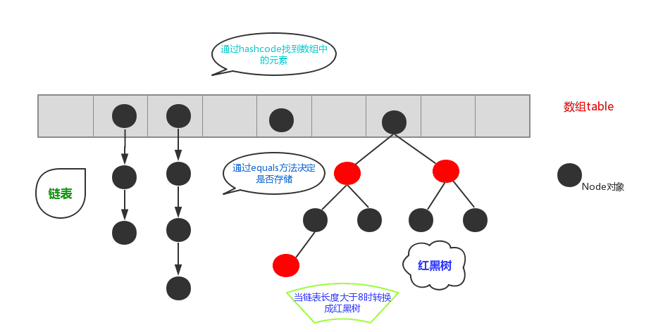
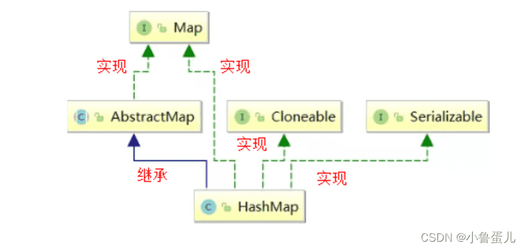
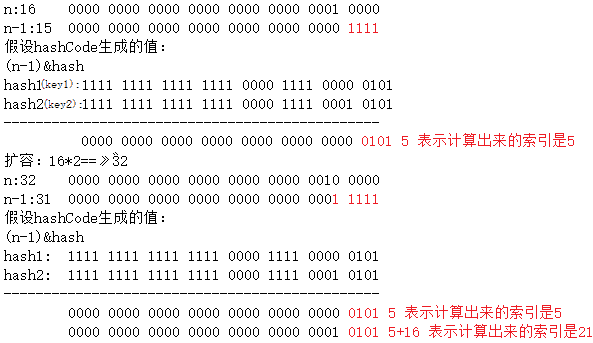

--爪哇高级章

‍

‍

# 快速

> 存储一些封装好的优秀代码块

‍

‍

‍

# 高级

‍

‍

‍

## 内省

可参考

[Java内省(Introspector)机制：深入理解与应用-腾讯云开发者社区-腾讯云 (tencent.com)](https://cloud.tencent.com/developer/article/2398565)

内省（Introspection）机制是一种允许开发者在运行时获取和操作对象属性、事件和方法信息的机制。它基于Java的反射（Reflection）**API**，但更专注于Java Beans的特定规范。Java Beans是一种特殊的Java类，通常用于封装多个属性为一个单一的对象，并提供标准的getter和setter方法来访问这些属性。

‍

### 核心组件

Introspector类：这是Java内省机制的核心类，提供了获取Bean信息的静态方法。

BeanInfo类：该类包含了关于Java Bean的元数据信息，如属性、事件和方法等。

PropertyDescriptor类：该类描述了Java Bean的一个属性，包括其getter和setter方法。

‍

### 工作原理

Java内省机制主要依赖于`java.beans`​包，其中核心的类是`Introspector`​。这个类提供了用于获取Java Bean的元数据信息（如属性、事件和方法）的静态方法。当我们想要内省一个Java类时，Introspector会分析这个类的公共方法，并根据特定的命名规范（如getter和setter方法）来推断出类的属性。

内省机制不仅限于检查类的属性，它还可以用来探索类的方法、构造函数以及事件。然而，在实际应用中，内省最常用于处理Java Bean的属性，因为这些属性通常通过标准的getter和setter方法来访问。

‍

‍

### 使用

使用Java内省机制通常涉及以下步骤：

1. **获取BeanInfo**：首先，我们需要使用`Introspector.getBeanInfo()`​方法来获取关于目标Java类的`BeanInfo`​对象。这个对象包含了类的所有元数据信息。
2. **探索属性**：通过`BeanInfo`​对象，我们可以获取一个`PropertyDescriptor[]`​数组，它包含了类的所有属性描述符。每个`PropertyDescriptor`​对象都提供了对单个属性的详细访问，包括属性的名称、读取方法（getter）和写入方法（setter）。
3. **操作属性**：一旦我们有了属性描述符，就可以使用它们来读取或修改Java对象的属性值。这通常涉及到调用getter和setter方法。

需要注意的是，为了安全地使用内省机制，我们应该处理可能抛出的异常，如`IntrospectionException`​，这可能在分析类的结构时发生。

‍

‍

## 协变逆变

大致了解

[Java笔记：逆变与协变？（水一篇文章） - 知乎 (zhihu.com)](https://zhuanlan.zhihu.com/p/47290098)

‍

‍

‍

## 泛型

‍

Java 的泛型在编译期有效，在运行期被删除

Java 编译后的字节码中已经没有泛型的任何信息了，也就是说一个泛型类和一个普通类在经过编译后都指向了同一字节码

这样处理原因: 避免 JVM 的大换血, 保证版本兼容

‍

### 性质

（1）泛型的 class 对象是相同的

（2）泛型数组初始化时不能声明泛型类型

（3）instanceof 不允许存在泛型参数 --> 不能初始化泛型参数和数组

‍

### 通配符

‍

* T    任意类型 type
* E    集合中元素的类型 element
* N    数值类型 number
* K    key-value 形式 key
* V    key-value 形式 value
* ?    不确定的 java 类型

‍

读取 List<?> 对象中的元素时，很安全，因为所有类型都是 Object 的子类

```java
<? extends Number>:只允许泛型为Number以及Number子类的引用调用
<? super Number>:只允许泛型为Number以及Number父类的引用调用
<? extends Comparable>:只允许泛型为实现Comparable接口的实现类引用调用
```

‍

通配符：？

* ? 可以用在使用泛型的时候代表一切类型
* E、T、K、V 是在定义泛型的时候使用代表一切类型

‍

### 上下限

* ~~&lt;?&gt;~~  （非受限通配(unbounded wildcard)）

  * 允许所有泛型的引用调用
* 通配符指定上限 （受限通配(bounded wildcard)）

  * 上限extends：使用时指定的类型必须是继承某个类，或者实现某个接口，即<=
* 通配符指定下限 （下限通配(lower-bounded wildcard)）

  * 下限super：使用时指定的类型不能小于操作的类，即>=

‍

* ? extends Car：那么 ? 必须是 Car 或者其子类（泛型的上限）
* ? super  Car：那么 ? 必须是 Car 或者其父类（泛型的下限，不是很常见）

```java
//需求：开发一个极品飞车的游戏，所有的汽车都能一起参与比赛。
public class GenericDemo {
    public static void main(String[] args) {
        ArrayList<BMW> bmws = new ArrayList<>();
        ArrayList<AD> ads = new ArrayList<>();
        ArrayList<Dog> dogs = new ArrayList<>();
        run(bmws);
        //run(dogs);
    }
    //public static void run(ArrayList<?> car){}//这样 dou对象也能进入
    public static void run(ArrayList<? extends Car> car){}
}

class Car{}
class BMW extends Car{}
class AD extends Car{}
class Dog{}
```

‍

‍

### 变体选择

‍

建议采用的顺序是 List＜T＞、List＜?＞、List＜Object＞:

‍

* List＜T＞ 是确定的某一个类型, 可以进行读写操作
* List＜?＞ 是只读类型的，不能进行增加、修改操作，因为编译器不知道 List 中容纳的是什么类型的元素，也就无法校验类型是否安全了，而且 List＜?＞ 读取出的元素都是 Object 类型的，需要主动转型，所以它经常用于泛型方法的返回值.  
  注意，List＜?＞ 虽然无法增加、修改元素，但是却可以删除元素，比如执行 remove、clear 等方法，那是因为它的删除动作与泛型类型无关.
* List＜Object＞ 也可以读写操作，但是它执行写入操作时需要向上转型（Upcast），在读取数据后需要向下转型（Downcast），而此时已经失去了泛型存在的意义了.

‍

### 具体对象

‍

#### 泛型类

class Box<T>

泛型类：使用了泛型定义的类就是泛型类

泛型类格式：

```java
修饰符 class 类名<泛型变量>{

}
泛型变量建议使用 E , T , K , V
```

```java
public class GenericDemo {
    public static void main(String[] args) {
        MyArrayList<String> list = new MyArrayList<String>();
        MyArrayList<Integer> list1 = new MyArrayList<Integer>();
        list.add("自定义泛型类");
    }
}
class MyArrayList<E>{
	public void add(E e){}
    public void remove(E e){}
}
```

‍

#### 泛型接口

interface Generics<T> {void G_show(T value);}

泛型接口：使用了泛型定义的接口就是泛型接口.

‍

泛型接口的格式：

```java
修饰符 interface 接口名称<泛型变量>{

}
```

```java
public class GenericDemo {
    public static void main(String[] args) {
        Data d = new StudentData();
        d.add(new Student());
        ................
    }
}

public interface Data<E>{
    void add(E e);
    void delete(E e);
    void update(E e);
    E query(int index);
}
class Student{}
class StudentData implements Data<Student>{重写所有方法}
```

‍

‍

#### 泛型方法

‍

泛型方法：定义了泛型的方法就是泛型方法

泛型方法的定义格式：

```java
修饰符 <泛型变量> 返回值类型 方法名称(形参列表){

}
```

方法定义了是什么泛型变量，后面就只能用什么泛型变量.

泛型类的核心思想：把出现泛型变量的地方全部替换成传输的真实数据类型

```java
public class GenericDemo {
    public static void main(String[] args) {
        Integer[] num = {10 , 20 , 30 , 40 , 50};
        String s1 = arrToString(nums);
   
        String[] name = {"张三","李四","王五"};
        String s2 = arrToString(names);
    }

    public static <T> String arrToString(T[] arr){
        --------------
    }
}
```

‍

举例

```java
    public static <K> K printArray(K[] inputArray) {
        for (K element : inputArray) {
            System.out.printf("%s ", element);
        }
    return inputArray[0];
    }
```

‍

```java
    public static <T extends Comparable<T>> T maximum(T x, T y, T z) { // 返回T型对象
        T max = x; // 假设x是初始最大值
        if (y.compareTo(max) > 0) {
            max = y; // y 更大
        }
        if (z.compareTo(max) > 0) {
            max = z; // 现在 z 更大
        }
        return max; // 返回最大对象
    }
```

‍

‍

### 协变逆变

泛型即不支持协变，也不支持逆变，只是能够实现协变和逆变

‍

（1）泛型不支持协变

```java
//编译不通过，泛型不支持协变
List＜Number＞ln=new ArrayList＜Integer＞（）；
Java为了保证运行期的安全性，必须保证泛型参数类型是固定的，所以它不允许一个泛型参数可以同时包含两种类型，
即使是父子类关系也不行。
```

使用通配符<sup>（Wildcard）</sup>模拟

```java
//Number的子类型（包括Number类型）都可以是泛型参数类型
List＜? extends Number＞ ln =new ArrayList＜Integer＞（）； 
Number所有的子类（包括自身）可以作为泛型参数类型，但在运行期只能是一个具体类型，
或者是Integer类型，通配符只是在编码期有效，运行期则必须是一个确定类型。
```

‍

（2）泛型不支持逆变

使用 super 关键字来模拟

```java
//Integer的父类型（包括Integer）都可以是泛型参数类型
List＜?super Integer＞li=new ArrayList＜Number＞（）；
```

‍

‍

### 使用场景

‍

#### 继承

父类有泛型，子类可以选择保留或者指定泛型类型

‍

不保留

     擦除：class Son1 extends Father  
     具体类型：class Son2 extends Father<Integer,String>

保留

     全部保留：class Son3<T1,T2> extends Father<T1,T2>  
     部分保留：class Son4<T2> extends Father<T1,T2>

‍

#### 异常

不能在 try-catch 中定义泛型类

‍

### 优势

‍

#### 安全性

在没有泛型之前，从集合中读取到的每一个对象都必须进行类型转换，如果不小心插入了错误的类型对象，在运行时的转换处理就会出错。

```java
public static void useGeneric() {
ArrayList<String> names = new ArrayList<>();
names.add("mikechen的互联网架构");
names.add(123); //编译不通过
}
```

‍

#### 消除强制转换

* 以下没有泛型的代码段需要强制转换：

```java
List list = new ArrayList();
list.add("hello");
String s = (String) list.get(0);
```

* 当重写为使用泛型时，代码不需要强制转换：

```java
List<String> list = new ArrayList<String>();
list.add("hello");
String s = list.get(0); // no cast
```

‍

#### 避免了不必要的装箱、拆箱操作，提高程序的性能

* 泛型变量固定了类型，使用的时候就已经知道是值类型还是引用类型，避免了不必要的装箱、拆箱操作。

```java
object a=1;//由于是object类型，会自动进行装箱操作。

int b=(int)a;//强制转换，拆箱操作。这样一去一来，当次数多了以后会影响程序的运行效率。
```

* 使用泛型之后

```java
public static T GetValue<T>(T a)

{
　　return a;
}

public static void Main()

{
　　int b=GetValue<int>(1);//使用这个方法的时候已经指定了类型是int，所以不会有装箱和拆箱的操作。
}
```

‍

#### 提高了代码的重用行

* 显而易见，能够通过泛型代替部分重载，大大提升了可用性。

‍

‍

## 注解

Annotation, 给编辑器看的

> 注解和反射是框架的底层机制,同时涉及到JVM的内容体系

类的组成部分，可以给类携带一些额外的信息，提供一种安全的类似注释标记的机制，用来将任何信息或元数据（metadata）与程序元素（类、方法、成员变量等）进行关联

* 注解是给编译器或 JVM 看的，编译器或 JVM 可以根据注解来完成对应的功能
* 注解类似修饰符，应用于包、类型、构造方法、方法、成员变量、参数及本地变量的声明语句中
* **父类中的注解是不能被子类继承的**

注解作用：

* 标记
* 框架技术多半都是在使用注解和反射，都是属于框架的底层基础技术
* 在编译时进行格式检查，比如方法重写约束 @Override、函数式接口约束 @FunctionalInterface.

‍

### 格式

定义格式：自定义注解用 @interface 关键字，注解默认可以标记很多地方

```java
修饰符 @interface 注解名{
     // 注解属性
}
```

使用注解的格式：@注解名

```java
@Book
@MyTest
public class MyBook {
    //方法变量都可以注解
}

@interface Book{
}
@interface MyTest{
}
```

‍

### 属性

‍

#### 普通属性

注解可以有属性，**属性名必须带 ()** ，在用注解的时候，属性必须赋值，除非属性有默认值

属性的格式：

* 格式 1：数据类型 属性名()
* 格式 2：数据类型 属性名() default 默认值

属性适用的数据类型:

* 八种数据数据类型（int，short，long，double，byte，char，boolean，float）和 String、Class
* 以上类型的数组形式都支持

```java
@MyBook(name="《精通Java基础》",authors = {"播仔","Dlei","播妞"} , price = 99.9 )
public class AnnotationDemo01 {
    @MyBook(name="《精通MySQL数据库入门到删库跑路》",authors = {"小白","小黑"} ,
     					price = 19.9 , address = "北京")
    public static void main(String[] args) {
    }
}
// 自定义一个注解
@interface MyBook{
    String name();
    String[] authors(); // 数组
    double price();
    String address() default "武汉";
}

```

‍

‍

#### 特殊属性

注解的特殊属性名称：value

* 如果只有一个 value 属性的情况下，使用 value 属性的时候可以省略 value 名称不写
* 如果有多个属性，且多个属性没有默认值，那么 value 是不能省略的

```java
//@Book("/deleteBook.action")
@Book(value = "/deleteBook.action" , age = 12)
public class AnnotationDemo01{
}

@interface Book{
    String value();
    int age() default 10;
}
```

‍

### 类型

‍

#### 文档注解

> @author	    标明开发该类模版的作者，多个作者之间使用，分割
>
> @version    标明该类模块的版本
>
> @see	    参考转向，也就是相关主题
>
> @since	    从哪个版本开始增加的
>
> @param	    对方法中某参数的说明，如果没有参数就不能写
>
> @return	    对方法返回值的说明，如果方法的返回值类型是 void 就不能写
>
> @exception	对方法可能抛出的异常进行说明，如果方法没有用 thorws 显示抛出的异常就不能写

‍

‍

#### 格式检查

(JDK 内置的三个基本注解)

> @Override    限定重写父类方法
>
> @Deprecated    已过时
>
> @SuppressWarnings    抑制编译器警告

‍

‍

#### 自定义注解

> @interface 注解名{定义内容}

‍

‍

##### 流程

1. 定义注解    定义标记
2. 配置注解    把标记打在需要用到的程序代码中
3. 解析注解    在编译期或运行时检测到标记，并进行特殊操作

‍

‍

##### Tips

* 其中的每一个方法实际上是声明了一个配置参数.
* 可以通过default来声明参数的默认值
* 如果只有一个参数成员，一般参数名为value
* 注解元素必须要有值, 定义注解元素时经常使用空字符串, 0作为默认值
* 默认value才会在赋值参数列表里省略

‍

‍

#### 元注解

元注解是 sun 公司提供的，用来注解自定义注解

‍

##### @Target

限定某个自定义注解能被应用到 Java 代码的那些位置. 它使用一个枚举类型 ElementType 定义了限定范围的选择

> 可选的参数列表(ElementType.Type...)

‍

默认值为任何元素，表示该注解用于什么地方，可用值定义在 ElementType 类中：

* ​`ElementType.CONSTRUCTOR`​：用于描述构造器
* ​`ElementType.FIELD`​：成员变量、对象、属性（包括 enum 实例）
* ​`ElementType.LOCAL_VARIABLE`​：用于描述局部变量
* ​`ElementType.METHOD`​：用于描述方法
* ​`ElementType.PACKAGE`​：用于描述包
* ​`ElementType.PARAMETER`​：用于描述参数
* ​`ElementType.TYPE`​：用于描述类、接口（包括注解类型）或 enum 声明

‍

##### @Retention

只能用于修饰一个 Annotation 定义,用于指定该 Annotation 的生命周期, @Rentention 包含一个 RetentionPolicy 类型的成员变量,使用@Rentention 时必须为该 value 成员变量指定值

‍

* ​`RetentionPolicy.SOURCE`​：在编译阶段丢弃，这些注解在编译结束之后就不再有任何意义，只作用在源码阶段，生成的字节码文件中不存在，`@Override`​、`@SuppressWarnings`​ 都属于这类注解
* ​`RetentionPolicy.CLASS`​：在类加载时丢弃，在字节码文件的处理中有用，运行阶段不存在，默认值
* ​`RetentionPolicy.RUNTIME`​ : 始终不会丢弃，运行期也保留该注解，因此可以使用反射机制读取该注解的信息，自定义的注解通常使用这种方式

‍

#### 其他

‍

##### @Documented

指定自定义注解是否能随着被定义的 java 文件生成到 javadoc 文档中. 默认情况下，javadoc 是不包括注解的. 

‍

##### @Inherited

表示修饰的自定义注解可以被子类继承

‍

### 注解解析

开发中经常要知道一个类的成分上面到底有哪些注解，注解有哪些属性数据，这都需要进行注解的解析

注解解析相关的接口：

* Annotation：注解类型，该类是所有注解的父类，注解都是一个 Annotation 的对象
* AnnotatedElement：该接口定义了与注解解析相关的方法
* Class、Method、Field、Constructor 类成分：实现 AnnotatedElement 接口，拥有解析注解的能力

Class 类 API ：

* ​`Annotation[] getDeclaredAnnotations()`​：获得当前对象上使用的所有注解，返回注解数组
* ​`T getDeclaredAnnotation(Class<T> annotationClass)`​：根据注解类型获得对应注解对象
* ​`T getAnnotation(Class<T> annotationClass)`​：根据注解类型获得对应注解对象
* ​`boolean isAnnotationPresent(Class<Annotation> class)`​：判断对象是否使用了指定的注解
* ​`boolean isAnnotation()`​：此 Class 对象是否表示注释类型

注解原理：注解本质是**特殊接口**，继承了 `Annotation`​ ，其具体实现类是 Java 运行时生成的**动态代理类**，通过反射获取注解时，返回的是运行时生成的动态代理对象 `$Proxy1`​，通过代理对象调用自定义注解（接口）的方法，回调 `AnnotationInvocationHandler`​ 的 `invoke`​ 方法，该方法会从 `memberValues`​  这个 Map 中找出对应的值，而 `memberValues`​ 的来源是 Java 常量池

解析注解数据的原理：注解在哪个成分上，就先拿哪个成分对象，比如注解作用在类上，则要该类的 Class 对象，再来拿上面的注解

```java
public class AnnotationDemo{
    @Test
    public void parseClass() {
        // 1.定位Class类对象
        Class c = BookStore.class;
        // 2.判断这个类上是否使用了某个注解
        if(c.isAnnotationPresent(Book.class)){
            // 3.获取这个注解对象
            Book b = (Book)c.getDeclarAnnotation(Book.class);
            System.out.println(book.value());
            System.out.println(book.price());
            System.out.println(Arrays.toString(book.authors()));
        }
    }
    @Test
    public void parseMethod() throws Exception {
        Class c = BookStore.class;
        Method run = c.getDeclaredMethod("run");
        if(run.isAnnotationPresent(Book.class)){
            Book b = (Book)run.getDeclaredAnnotation(Book.class);
           	sout(上面的三个);
        }
    }
}

@Book(value = "《Java基础到精通》", price = 99.5, authors = {"张三","李四"})
class BookStore{
    @Book(value = "《Mybatis持久层框架》", price = 199.5, authors = {"王五","小六"})
    public void run(){
    }
}
@Target({ElementType.TYPE,ElementType.METHOD}) // 类和成员方法上使用
@Retention(RetentionPolicy.RUNTIME) // 注解永久存活
@interface Book{
    String value();
    double price() default 100;
    String[] authors();
}
```

‍

‍

## 反射

Reflection反射指程序在运行期可以拿到一个对象的所有信息, 解决在运行期对某个实例一无所知的情况下如何调用其方法

反射是指对于任何一个类，在"运行的时候"都可以直接得到这个类全部成分

* 构造器对象：Constructor
* 成员变量对象：Field
* 成员方法对象：Method

‍

可以在运行时得到一个类的全部成分然后操作，破坏封装性，也可以破坏泛型的约束性.

‍

‍

### 原理

核心思想：在运行时获取类编译后的字节码文件对象，然后解析类中的全部成分

反射提供了一个 Class 类型：HelloWorld.java → javac → HelloWorld.class

* ​`Class c = HelloWorld.class`​

注意：反射是工作在**运行时**的技术，只有运行之后才会有 class 类对象

‍

​`class`​（包括`interface`​）的本质是数据类型（`Type`​）

无继承关系的数据类型无法赋值

‍

例如

```java
Number n = new Double(123.456); // OK
String s = new Double(123.456); // compile error!
```

而`class`​是由JVM在执行过程中动态加载的. JVM在第一次读取到一种`class`​类型时，将其加载进内存. 每加载一种`class`​，JVM就为其创建一个`Class`​类型的实例，并关联起来. 

‍

注意：这里的`Class`​类型是一个名叫`Class`​的`class`​

```java
public final class Class {
    private Class() {}
}
```

这个`Class`​实例是JVM内部创建的，如果我们查看JDK源码，可以发现`Class`​类的构造方法是`private`​，只有JVM能创建`Class`​实例，我们自己的Java程序是无法创建`Class`​实例的. 

所以JVM持有的每个`Class`​实例都指向一个数据类型（`class`​或`interface`​）, 包含了该`class`​的所有完整信息

数组（例如`String[]`​）也是一种类，而且不同于`String.class`​，它的类名是`[Ljava.lang.String;`​. 此外，JVM为每一种基本类型如`int`​也创建了`Class`​实例，通过`int.class`​访问. 

‍

结构图示意:

```java
┌───────────────────────────┐
│      Class Instance       │──────> String
├───────────────────────────┤
│name = "java.lang.String"  │
└───────────────────────────┘
┌───────────────────────────┐
│      Class Instance       │──────> Random
├───────────────────────────┤
│name = "java.util.Random"  │
└───────────────────────────┘
┌───────────────────────────┐
│      Class Instance       │──────> Runnable
├───────────────────────────┤
│name = "java.lang.Runnable"│
└───────────────────────────┘
```

‍

由于JVM为每个加载的`class`​创建了对应的`Class`​实例，并在实例中保存了该`class`​的所有信息，包括类名、包名、父类、实现的接口、所有方法、字段等，因此，如果获取了某个`Class`​实例，我们就可以通过这个`Class`​实例获取到该实例对应的`class`​的所有信息. 

‍

**这种**通过`Class`​实例获取`class`​信息的方法称为反射

‍

#### 动态加载

‍

JVM在执行Java程序的时候，并不是一次性把所有用到的class全部加载到内存，而是**第一次需要用到**class时才加载. 每个通过关键字class标识的类，在内存中有且只有一个与之对应的Class对象来描述其类型信息，无论创建多少个实例对象，其依据的都是用一个Class对象. 动态加载`class`​的特性对于Java程序非常重要. 利用JVM动态加载`class`​的特性，我们才能在运行期根据条件加载不同的实现类

‍

‍

### API

‍

getName()    以string类型返回class对象表示的实体（类，接口，数组，基本类型，void等）名称

newInstance()    创建一个实例，只能调用默认构造器

getsuperclass()    返回class表示的实体超类的名称

getSimpleName()    不包含包名的类名. 

isInterfence()    这个class对象是否表示某个接口

‍

示例

```java
public class Main {
    public static void main(String[] args) {
        printClassInfo("".getClass());
        printClassInfo(Runnable.class);
        printClassInfo(java.time.Month.class);
        printClassInfo(String[].class);
        printClassInfo(int.class);
    }

    static void printClassInfo(Class cls) {
        System.out.println("Class name: " + cls.getName());
        System.out.println("Simple name: " + cls.getSimpleName());
        if (cls.getPackage() != null) {
            System.out.println("Package name: " + cls.getPackage().getName());
        }
        System.out.println("is interface: " + cls.isInterface());
        System.out.println("is enum: " + cls.isEnum());
        System.out.println("is array: " + cls.isArray());
        System.out.println("is primitive: " + cls.isPrimitive());
    }
}
```

‍

‍

### 获取元素*

‍

#### 获取类

反射技术的第一步是先得到 Class 类对象，有三种方式获取：

* 类名.class
* 类的对象.getClass()
* Class.forName("类的全限名")：`public static Class<?> forName(String className) `​

‍

Class 类下的方法

|方法|作用|
| ------------------------| -----------------------------------------------------------------|
|String getSimpleName()|获得类名字符串：类名|
|String getName()|获得类全名：包名+类名|
|T newInstance()|创建 Class 对象关联类的对象，底层是调用无参数构造器，已经被淘汰|

```java
public class ReflectDemo{
    public static void main(String[] args) throws Exception {
        // 反射的第一步永远是先得到类的Class文件对象: 字节码文件。
        // 1.类名.class
        Class c1 = Student.class;
        System.out.println(c1);//class _03反射_获取Class类对象.Student

        // 2.对象.getClass()
        Student swk = new Student();
        Class c2 = swk.getClass();
        System.out.println(c2);

        // 3.Class.forName("类的全限名")
        // 直接去加载该类的class文件。
        Class c3 = Class.forName("_03反射_获取Class类对象.Student");
        System.out.println(c3);

        System.out.println(c1.getSimpleName()); // 获取类名本身（简名）Student
        System.out.println(c1.getName()); //获取类的全限名_03反射_获取Class类对象.Student
    }
}
class Student{}
```

‍

#### 获取构造

‍

获取构造器的 API

* Constructor getConstructor(Class... parameterTypes)：根据参数匹配获取某个构造器，只能拿 public 修饰的构造器
* Constructor getDeclaredConstructor(Class... parameterTypes)：根据参数匹配获取某个构造器，只要申明就可以定位，不关心权限修饰符
* Constructor[] getConstructors()：获取所有的构造器，只能拿 public 修饰的构造器
* Constructor[] getDeclaredConstructors()：获取所有构造器，只要申明就可以定位，不关心权限修饰符

‍

Constructor 的常用 API

|方法|作用|
| -----------------------------------| -----------------------------------------|
|T newInstance(Object... initargs)|创建对象，注入构造器需要的数据|
|void setAccessible(true)|修改访问权限，true 攻破权限（暴力反射）|
|String getName()|以字符串形式返回此构造函数的名称|
|int getParameterCount()|返回参数数量|
|Class<?>[] getParameterTypes|返回参数类型数组|

```java
public class TestStudent01 {
    @Test
    public void getDeclaredConstructors(){
        // a.反射第一步先得到Class类对象
        Class c = Student.class ;
        // b.定位全部构造器，只要申明了就可以拿到
        Constructor[] cons = c.getDeclaredConstructors();
        // c.遍历这些构造器
        for (Constructor con : cons) {
            System.out.println(con.getName()+"->"+con.getParameterCount());
        }
    }
    @Test
    public void getDeclaredConstructor() throws Exception {
        // a.反射第一步先得到Class类对象
        Class c = Student.class ;
        // b.定位某个构造器，根据参数匹配，只要申明了就可以获取
        //Constructor con = c.getDeclaredConstructor(); // 可以拿到！定位无参数构造器！
        Constructor con = c.getDeclaredConstructor(String.class, int.class); //有参数的！!
        // c.构造器名称和参数
        System.out.println(con.getName()+"->"+con.getParameterCount());
    }
}
```

```java
public class Student {
    private String name ;
    private int age ;
    private Student(){
        System.out.println("无参数构造器被执行~~~~");
    }
    public Student(String name, int age) {
        System.out.println("有参数构造器被执行~~~~");
        this.name = name;
        this.age = age;
    }
}
```

```java
//测试方法
public class TestStudent02 {
    // 1.调用无参数构造器得到一个类的对象返回。
    @Test
    public void createObj01() throws Exception {
        // a.反射第一步是先得到Class类对象
        Class c = Student.class ;
        // b.定位无参数构造器对象
        Constructor constructor = c.getDeclaredConstructor();
        // c.暴力打开私有构造器的访问权限
        constructor.setAccessible(true);
        // d.通过无参数构造器初始化对象返回
        Student swk = (Student) constructor.newInstance(); // 最终还是调用无参数构造器的！
        System.out.println(swk);//Student{name='null', age=0}
    }

    // 2.调用有参数构造器得到一个类的对象返回。
    @Test
    public void createObj02() throws Exception {
        // a.反射第一步是先得到Class类对象
        Class c = Student.class ;
        // b.定位有参数构造器对象
        Constructor constructor = c.getDeclaredConstructor(String.class , int.class);
        // c.通过无参数构造器初始化对象返回
        Student swk = (Student) constructor.newInstance("孙悟空",500); // 最终还是调用有参数构造器的！
        System.out.println(swk);//Student{name='孙悟空', age=500}
    }
}

```

‍

‍

#### 获取变量

‍

获取 Field 成员变量 API

* Field getField(String name)：根据成员变量名获得对应 Field 对象，只能获得 public 修饰
* Field getDeclaredField(String name)：根据成员变量名获得对应 Field 对象，所有申明的变量
* Field[] getFields()：获得所有的成员变量对应的 Field 对象，只能获得 public 的
* Field[] getDeclaredFields()：获得所有的成员变量对应的 Field 对象，只要申明了就可以得到

‍

Field 的方法：给成员变量赋值和取值

|方法|作用|
| ------------------------------------| -----------------------------------------------|
|void set(Object obj, Object value)|给对象注入某个成员变量数据，**obj 是对象**，value 是值|
|Object get(Object obj)|获取指定对象的成员变量的值，**obj 是对象**，没有对象为 null|
|void setAccessible(true)|暴力反射，设置为可以直接访问私有类型的属性|
|Class getType()|获取属性的类型，返回 Class 对象|
|String getName()|获取属性的名称|

‍

```Java
public class FieldDemo {
    //获取全部成员变量
    @Test
    public void getDeclaredFields(){
        // a.先获取class类对象
        Class c = Dog.class;
        // b.获取全部申明的成员变量对象
        Field[] fields = c.getDeclaredFields();
        for (Field field : fields) {
            System.out.println(field.getName()+"->"+field.getType());
        }
    }
    //获取某个成员变量
    @Test
    public void getDeclaredField() throws Exception {
        // a.先获取class类对象
        Class c = Dog.class;
        // b.定位某个成员变量对象 :根据名称定位！！
        Field ageF = c.getDeclaredField("age");
        System.out.println(ageF.getName()+"->"+ageF.getType());
    }
}
```

```java
public class Dog {
    private String name;
    private int age ;
    private String color ;
    public static String school;
    public static final String SCHOOL_1 = "宠物学校";

    public Dog() {
    }

    public Dog(String name, int age, String color) {
        this.name = name;
        this.age = age;
        this.color = color;
    }
}
```

```java
//测试方法
public class FieldDemo02 {
    @Test
    public void setField() throws Exception {
        // a.反射的第一步获取Class类对象
        Class c = Dog.class ;
        // b.定位name成员变量
        Field name = c.getDeclaredField("name");
        // c.为这个成员变量赋值！
        Dog d = new Dog();
        name.setAccessible(true);
        name.set(d,"泰迪");
        System.out.println(d);//Dog{name='泰迪', age=0, color='null'}
        // d.获取成员变量的值
        String value = name.get(d)+"";
        System.out.println(value);//泰迪
    }
}
```

‍

‍

#### 获取方法

‍

获取 Method 方法 API：

* Method getMethod(String name,Class...args)：根据方法名和参数类型获得方法对象，public 修饰
* Method getDeclaredMethod(String name,Class...args)：根据方法名和参数类型获得方法对象，包括 private
* Method[] getMethods()：获得类中的所有成员方法对象返回数组，只能获得 public 修饰且包含父类的
* Method[] getDeclaredMethods()：获得类中的所有成员方法对象，返回数组，只获得本类申明的方法

‍

Method 常用 API：

* public Object invoke(Object obj, Object... args)：使用指定的参数调用由此方法对象，obj 对象名

```java
public class MethodDemo{
    //获得类中的所有成员方法对象
    @Test
    public void getDeclaredMethods(){
        // a.先获取class类对象
        Class c = Dog.class ;
        // b.获取全部申明的方法!
        Method[] methods = c.getDeclaredMethods();
        // c.遍历这些方法
        for (Method method : methods) {
            System.out.println(method.getName()+"->"
                    + method.getParameterCount()+"->" + method.getReturnType());
        }
    }
    @Test
    public void getDeclardMethod() throws Exception {
        Class c = Dog.class;
        Method run = c.getDeclaredMethod("run");
        // c.触发方法执行!
        Dog d = new Dog();
        Object o = run.invoke(d);
        System.out.println(o);// 如果方法没有返回值，结果是null
  
		//参数一：方法名称   参数二：方法的参数个数和类型(可变参数！)
        Method eat = c.getDeclaredMethod("eat",String.class);
        eat.setAccessible(true); // 暴力反射！
  
       	//参数一：被触发方法所在的对象  参数二：方法需要的入参值
        Object o1 = eat.invoke(d,"肉");
        System.out.println(o1);// 如果方法没有返回值，结果是null
    }
}

public class Dog {
    private String name ;
    public Dog(){
    }
    public void run(){System.out.println("狗跑的贼快~~");}
	private void eat(){System.out.println("狗吃骨头");}
	private void eat(String name){System.out.println("狗吃"+name);}
	public static void inAddr(){System.out.println("在吉山区有一只单身狗！");}
}
```

‍

‍

### 操作

‍

#### 创建类实例

‍

```java
Class.newInstance()
```

‍

**示例**

```java
Class cls = String.class;// 获取String的Class实例:
String s = (String) cls.newInstance();// 创建一个String实例, 相当于new String()

//根据用户输入的字符串来创建对象
String str = “用户输入的字符串” ;
Class t = Class.forName(str);
t.newInstance();
```

‍

**局限**

只能调用`public`​的无参数构造方法. 带参数的构造方法，或者非`public`​的构造方法都无法调用

‍

‍

##### new关键字和newInstance()区别

* newInstance: 弱类型. 低效率. 只能调用无参构造.
* new: 强类型. 相对高效. 能调用任何public构造.
* Class.forName(“”)返回的是类.
* Class.forName(“”).newInstance()返回的是object

‍

‍

‍

‍

‍

#### 获取类实例

‍

Class实例在JVM中是唯一的，获取的Class实例是同一个

‍

方法

1. 直接通过一个`class`​的静态变量`class`​获取：

    ```java
    Class cls = String.class;
    ```
2. 通过实例变量提供的`getClass()`​方法获取：

    ```java
    String s = "Hello";
    Class cls = s.getClass();
    ```
3. 通过静态方法`Class.forName()`​找到class的完整类名(全限定名)获取：

    ```java
    Class cls = Class.forName("java.lang.String");
    ```

‍

#### 类型判断

‍

##### Class实例比较和instanceof判断

‍

* instanceof不但匹配指定类型，还**匹配指定类型的子类**
* ==判断class实例可以**精确地判断数据类型**，但**不能作子类型比较**

‍

通常情况下应该用`instanceof`​判断数据类型，因为面向抽象编程的时候，我们不关心具体的子类型. 

只有在需要精确判断一个类型是不是某个`class`​的时候，我们才使用`==`​判断`class`​实例. 

‍

‍

‍

### 访问字段

‍

通过`Class`​实例获取字段信息, 通过反射读写字段是一种非常规方法，它会破坏对象的封装

修改非`public`​字段，需要首先调用`setAccessible(true)`​

‍

Class方法

* Field getField(name)    根据字段名获取某个public的field（包括父类）
* Field getDeclaredField(name)    根据字段名**获取当前类的某个field**（不包括父类）
* Field[] getFields()    获取所有public的field（包括父类）
* Field[] getDeclaredFields()    获取当前类的所有field（不包括父类）

‍

‍

Field方法

Field对象包含了一个字段的所有信息

* getName()    返回字段名称，例如，"name"
* getType()    返回字段类型，也是一个Class实例，例如，String.class
* getModifiers()    返回字段的修饰符，它是一个int，不同的bit表示不同的含义
* ​​set(​​​​Target_​​​​Object, ​​​​Change_into_​​​​Object)    设置字段值

‍

‍

示例:

```java
// reflection 对于一个Person实例，我们可以先拿到name字段对应的Field，再获取这个实例的name字段的值
import java.lang.reflect.Field;

public class Main {
    public static void main(String[] args) throws Exception {
        Object p = new Person("Xiao Ming"); // new 一个对象实例
        Class c = p.getClass();    // 1. 获取Class
        Field f = c.getDeclaredField("name");    //2. 获取Class的Field对象
        // 由于name是私有属性, 无法访问; 可以将private改为public，或者，在调用f.get(p);前先写一句：
        f.setAccessible(true);  //始终允许访问
        Object value = f.get(p);    //3. 通过Field对象获得指定实体的值
        System.out.println(value); // "Xiao Ming"
    }
}

class Person {
    private String name;
    public Person(String name) {
        this.name = name;
    }
}
```

‍

‍

#### 封装与反射

‍

    正常情况下，我们总是通过`p.name`​来访问`Person`​的`name`​字段，编译器会根据`public`​、`protected`​和`private`​决定是否允许访问字段，这样就达到了数据封装的目的

    反射是一种非常规的用法，使用反射，首先代码非常繁琐，其次，它更多地是给工具或者底层框架来使用，目的是在不知道目标实例任何信息的情况下，获取特定字段的值. 

    此外，`setAccessible(true)`​可能会失败. 如果JVM运行期存在`SecurityManager`​，那么它会根据规则进行检查，有可能阻止`setAccessible(true)`​对一些核心库的访问

‍

‍

‍

‍

### 调方法

‍

Class方法:

* ​`Method getMethod(name, Class...)`​​：获取某个`public`​​的`Method`​​（包括父类）
* ​`Method getDeclaredMethod(name, Class...)`​​：获取当前类的某个`Method`​​（不包括父类）
* ​`Method[] getMethods()`​​：获取所有`public`​​的`Method`​​（包括父类）
* ​`Method[] getDeclaredMethods()`​​：获取当前类的所有`Method`​​（不包括父类）

‍

    一个`Method`​​对象包含一个方法的所有信息, 对`Method`​​实例调用`invoke()`​​就相当于调用该方法，invoke()的第一个参数是对象实例，即在哪个实例上调用该方法，后面的可变参数要与方法参数一致

* 调用静态方法时，由于无需指定实例对象，所以`invoke`​​方法传入的第一个参数永远为`null`​​
* 调用非public方法: 上方通过`Method.setAccessible(true)`​​允许其调用
* 同上, `setAccessible(true)`​​可能会失败. 如果JVM运行期存在`SecurityManager`​​，那么它会根据规则进行检查，有可能阻止`setAccessible(true)`​​

‍

Method方法:

* ​`getName()`​​：返回方法名称，例如：`"getScore"`​​；
* ​`getReturnType()`​​：返回方法返回值类型，也是一个Class实例，例如：`String.class`​​；
* ​`getParameterTypes()`​​：返回方法的参数类型，是一个Class数组，例如：`{String.class, int.class}`​​；
* ​`getModifiers()`​​：返回方法的修饰符，它是一个`int`​​，不同的bit表示不同的含义.

‍

‍

#### 多态原则

‍

仍然遵循多态原则

即总是调用实际类型的覆写方法（如果存在）

‍

#### 调构造方法

‍

为了调用任意的构造方法，Java的反射API提供了**Constructor**对象，它包含一个构造方法的所有信息，可以创建一个实例. 

onstructor对象和Method非常类似，不同之处仅在于它是一个构造方法，并且，调用结果总是返回实例

‍

示例:

```java
public class Main {
    public static void main(String[] args) throws Exception {
        // 获取构造方法Integer(int):
        Constructor cons1 = Integer.class.getConstructor(int.class);
        // 调用构造方法:
        Integer n1 = (Integer) cons1.newInstance(123);
        System.out.println(n1);

        // 获取构造方法Integer(String)
        Constructor cons2 = Integer.class.getConstructor(String.class);
        Integer n2 = (Integer) cons2.newInstance("456");
        System.out.println(n2);
    }
}
```

‍

* ​`getConstructor(Class...)`​：获取某个public的Constructor
* ​`getDeclaredConstructor(Class...)`​：获取某个Constructor
* ​`getConstructors()`​：获取所有public的Constructor
* ​`getDeclaredConstructors()`​：获取所有Constructor

‍

‍

### 调继承关系

‍

Class方法

‍

获取父类的Class    .getSuperclass()

‍

获取interface    .getInterfaces() (返回Class[])

> 只返回当前类直接实现的接口类型，并不包括其父类实现的接口类型

‍

#### 判定继承关系

‍

正常情况下，使用`instanceof`​操作符

两个`Class`​实例，要判断一个向上转型是否成立，可以调用`isAssignableFrom()`​

‍

实例:

```java
// Integer i = ?
Integer.class.isAssignableFrom(Integer.class); // true，因为Integer可以赋值给Integer
// Number n = ?
Number.class.isAssignableFrom(Integer.class); // true，因为Integer可以赋值给Number
// Object o = ?
Object.class.isAssignableFrom(Integer.class); // true，因为Integer可以赋值给Object
// Integer i = ?
Integer.class.isAssignableFrom(Number.class); // false，因为Number不能赋值给Integer
```

‍

‍

### 动态代理

‍

Java的​class​​和​interface​​的区别：

* 可以实例化​class​​（非​abstract​​）
* 不能实例化​interface​​

‍

所有`interface`​类型的变量总是通过某个实例向上转型并赋值给接口类型变量的

不编写实现类，直接在运行期创建某个`interface`​​的实例这是可能的，因为Java标准库提供了一种动态代理机制, 运行期动态创建某个`interface`​​的实例

‍

所谓动态代理，是和静态相对应的

‍

动态代理实际上是JVM在运行期动态创建class字节码并加载的过程，它并没有什么黑魔法，把上面的动态代理改写为静态实现类大概长这样, 其实就是JVM帮我们自动编写了一个上述类（不需要源码，可以直接生成字节码）

‍

‍

#### ==静态构建实例==

‍

定义接口：

```
public interface Hello {
    void morning(String name);
}
```

编写实现类：

```
public class HelloWorld implements Hello {
    public void morning(String name) {
        System.out.println("Good morning, " + name);
    }
}
```

创建实例，转型为接口并调用：

```
Hello hello = new HelloWorld();
hello.morning("Bob");
```

‍

‍

#### ==动态构建实例==

先定义了接口`Hello`​，但是我们并不去编写实现类，而是直接通过JDK提供的一个`Proxy.newProxyInstance()`​创建了一个`Hello`​接口对象. 这种没有实现类但是在运行期动态创建了一个接口对象的方式，我们称为动态代码. JDK提供的动态创建接口对象的方式，就叫动态代理. 

‍

在运行期动态创建一个`interface`​实例的方法如下：

1. 定义一个`InvocationHandler`​实例，它负责实现接口的方法调用；
2. 通过`Proxy.newProxyInstance()`​创建`interface`​实例，它需要3个参数：

    1. 使用的`ClassLoader`​，通常就是接口类的`ClassLoader`​；
    2. 需要实现的接口数组，至少需要传入一个接口进去；
    3. 用来处理接口方法调用的`InvocationHandler`​实例.
3. 将返回的`Object`​强制转型为接口.

‍

示例

```java
public class Main {
    public static void main(String[] args) {
    InvocationHandler handler = new InvocationHandler() {
        @Override
        public Object invoke(Object proxy, Method method, Object[] args) throws Throwable {
            System.out.println(method);
            if (method.getName().equals("morning")) {
                System.out.println("Good morning, " + args[0]);
            }
            return null;
        }
    };
    Hello hello = (Hello) Proxy.newProxyInstance(
        Hello.class.getClassLoader(), // 传入ClassLoader
        new Class[] { Hello.class }, // 传入要实现的接口
        handler); // 传入处理调用方法的InvocationHandler
    hello.morning("Bob");
    }
}

interface Hello {
    void morning(String name);
}
```

‍

转为静态的样子

```java
public class HelloDynamicProxy implements Hello {
    InvocationHandler handler;
    public HelloDynamicProxy(InvocationHandler handler) {
        this.handler = handler;
    }
    public void morning(String name) {
        handler.invoke(
           this,
           Hello.class.getMethod("morning", String.class),
           new Object[] { name });
    }
}
```

‍

‍

### 评价

‍

优点

* 可扩展性：应用程序可以利用全限定名创建可扩展对象的实例，来使用来自外部的用户自定义类
* 类浏览器和可视化开发环境：一个类浏览器需要可以枚举类的成员，可视化开发环境（如 IDE）可以从利用反射中可用的类型信息中受益，以帮助程序员编写正确的代码
* 调试器和测试工具： 调试器需要能够检查一个类里的私有成员，测试工具可以利用反射来自动地调用类里定义的可被发现的 API 定义，以确保一组测试中有较高的代码覆盖率

‍

缺点

* 性能开销：反射涉及了动态类型的解析，所以 JVM 无法对这些代码进行优化，反射操作的效率要比那些非射操作低得多，应该避免在经常被执行的代码或对性能要求很高的程序中使用反射
* 安全限制：使用反射技术要求程序必须在一个没有安全限制的环境中运行，如果一个程序必须在有安全限制的环境中运行，如 Applet，那么这就是个问题了
* 内部暴露：由于反射允许代码执行一些在正常情况下不被允许的操作（比如访问私有的属性和方法），所以使用反射可能会导致意料之外的副作用，这可能导致代码功能失调并破坏可移植性. 反射代码破坏了抽象性，因此当平台发生改变的时候，代码的行为就有可能也随着变化

‍

## 正则

Regex

正则表达式

‍

### 简要API

[Link](https://www.liaoxuefeng.com/wiki/1252599548343744/1304066080636961)

‍

1:字符

       x 字符 x

       \\ 反斜线字符

       \n 换行符

       \r 回车符

‍

2:字符类

       [abc] a、b 或 c

       [^abc] 任何字符，除了 a、b 或 c

       [a-zA-Z] a 到 z 或 A 到 Z，两头的字母包括在内

       [0-9] 包括数字字符 0-9

‍

3:预定义字符类

       . 任何字符

       \d 数字：[0-9]

       \w 单词字符：[a-zA-Z_0-9]

‍

4:边界匹配器

       ^ 行的开头

       $ 行的结尾

       \b 单词边界(不能是单词字符)

              hello?hao are you.

5.数量词

X? X，一次或一次也没有

X* X，零次或多次

X+ X，一次或多次

X{n} X，恰好 n 次

X{n,} X，至少 n 次

X{n,m} X，至少 n 次，但是不超过 m 次

‍

‍

### 概述

是一些特殊字符组成的校验规则，可以校验信息的正确性，校验邮箱、电话号码、金额等.

‍

比如检验 qq 号：

```java
public static boolean checkQQRegex(String qq){
    return qq!=null && qq.matches("\\d{4,}");//即是数字 必须大于4位数
}// 用\\d  是因为\用来告诉它是一个校验类，不是普通的字符 比如 \t \n
```

‍

java.util.regex 包主要包括以下三个类：

* Pattern 类：

  Pattern 对象是一个正则表达式的编译表示. Pattern 类没有公共构造方法，要创建一个 Pattern 对象，必须首先调用其公共静态编译方法，返回一个 Pattern 对象. 该方法接受一个正则表达式作为它的第一个参数
* Matcher 类：

  Matcher 对象是对输入字符串进行解释和匹配操作的引擎. 与Pattern 类一样，Matcher 也没有公共构造方法，需要调用 Pattern 对象的 matcher 方法来获得一个 Matcher 对象
* PatternSyntaxException：

  PatternSyntaxException 是一个非强制异常类，它表示一个正则表达式模式中的语法错误.

‍

‍

### 字符匹配

‍

‍

#### 普通字符

字母、数字、汉字、下划线、以及没有特殊定义的标点符号，都是“普通字符”. 表达式中的普通字符，在匹配一个字符串的时候，匹配与之相同的一个字符. 其他统称**元字符**

‍

‍

#### 特殊字符

\r\n 是 Windows 中的文本行结束标签，在 Unix/Linux 则是 \n

|元字符|说明|
| --------| ----------------------------------------------------------------------------|
|\\|将下一个字符标记为一个特殊字符或原义字符，告诉它是一个校验类，不是普通字符|
|\f|换页符|
|\n|换行符|
|\r|回车符|
|\t|制表符|
|\\|代表 \ 本身|
|()|使用 () 定义一个子表达式. 子表达式的内容可以当成一个独立元素|

‍

#### 标准字符

能够与多种字符匹配的表达式，注意区分大小写，大写是相反的意思，只能校验**单**个字符.

|元字符|说明|
| --------| ---------------------------------------------------------------------------------|
|.|匹配任意一个字符（除了换行符），如果要匹配包括 \n 在内的所有字符，一般用 [\s\S]|
|\d|数字字符，0~9 中的任意一个，等价于 [0-9]|
|\D|非数字字符，等价于  [ ^0-9]|
|\w|大小写字母或数字或下划线，等价于[a-zA-Z_0-9_]|
|\W|对\w取非，等价于[ ^\w]|
|\s|空格、制表符、换行符等空白字符的其中任意一个，等价于[\f\n\r\t\v]|
|\S|对 \s 取非|

\x 匹配十六进制字符，\0 匹配八进制，例如 \xA 对应值为 10 的 ASCII 字符 ，即 \n

‍

#### 自定义符

自定义符号集合，[ ] 方括号匹配方式，能够匹配方括号中**任意一个**字符

|元字符|说明|
| --------------| -------------------------------------------|
|[ab5@]|匹配 "a" 或 "b" 或 "5" 或 "@"|
|[^abc]|匹配 "a","b","c" 之外的任意一个字符|
|[f-k]|匹配 "f"~"k" 之间的任意一个字母|
|[^A-F0-3]|匹配 "A","F","0"~"3" 之外的任意一个字符|
|[a-d[m-p]]|匹配 a 到 d 或者 m 到 p：[a-dm-p]（并集）|
|[a-z&&[m-p]]|匹配 a 到 z 并且 m 到 p：[a-dm-p]（交集）|
|[^]|取反|

* 正则表达式的特殊符号，被包含到中括号中，则失去特殊意义，除了 ^,- 之外，需要在前面加 \
* 标准字符集合，除小数点外，如果被包含于中括号，自定义字符集合将包含该集合.  
  比如：[\d. \ -+] 将匹配：数字、小数点、+、-

‍

#### 量词字符

修饰匹配次数的特殊符号.

* 匹配次数中的贪婪模式(匹配字符越多越好，默认 ！)，\* 和 + 都是贪婪型元字符.
* 匹配次数中的非贪婪模式（匹配字符越少越好，修饰匹配次数的特殊符号后再加上一个 ? 号）

|元字符|说明|
| --------| -----------------------------------|
|X?|X 一次或一次也没，有相当于 {0,1}|
|X*|X 不出现或出现任意次，相当于 {0,}|
|X+|X 至少一次，相当于 {1,}|
|X{n}|X 恰好 n 次|
|{n,}|X 至少 n 次|
|{n,m}|X 至少 n 次，但是不超过 m 次|

‍

### 位置匹配

‍

#### 字符边界

本组标记匹配的不是字符而是位置，符合某种条件的位置

|元字符|说明|
| --------| ----------------------------------------------------------------------------------|
|^|与字符串开始的地方匹配（在字符集合中用来求非，在字符集合外用作匹配字符串的开头）|
|$|与字符串结束的地方匹配|
|\b|匹配一个单词边界|

‍

#### 捕获组

捕获组是把多个字符当一个单独单元进行处理的方法，它通过对括号内的字符分组来创建.

在表达式 `((A)(B(C)))`​，有四个这样的组：((A)(B(C)))、(A)、(B(C))、(C)（按照括号从左到右依次为 group(1)...）

* 调用 matcher 对象的 groupCount 方法返回一个 int 值，表示 matcher 对象当前有多个捕获组.
* 特殊的组 group(0)、group()，代表整个表达式，该组不包括在 groupCount 的返回值中.

|表达式|说明|
| ---------------------------| ------------------------------------------------------------------------------------------------------------------------------------------------------------------------------------------------------------------------------------------------------------------|
|\|  (分支结构)|左右两边表达式之间 "或" 关系，匹配左边或者右边|
|()  (捕获组)|(1) 在被修饰匹配次数的时候，括号中的表达式可以作为整体被修饰<br />(2) 取匹配结果的时候，括号中的表达式匹配到的内容可以被单独得到<br />(3) 每一对括号分配一个编号,()的捕获根据左括号的顺序从 1 开始自动编号. 捕获元素编号为零的第一个捕获是由整个正则表达式模式匹配的文本|
|(?:Expression)   非捕获组|一些表达式中，不得不使用( )，但又不需要保存 () 中子表达式匹配的内容，这时可以用非捕获组来抵消使用( )带来的副作用.|

‍

#### 反向引用

反向引用（\number），又叫回溯引用：

* 每一对()会分配一个编号，使用 () 的捕获根据左括号的顺序从1开始自动编号
* 通过反向引用，可以对分组已捕获的字符串进行引用，继续匹配
* **把匹配到的字符重复一遍在进行匹配**
* 应用 1：

  ```java
  String regex = "((\d)3)\1[0-9](\w)\2{2}";
  ```

  * 首先匹配 ((\d)3)，其次 \1 匹配 ((\d)3) 已经匹配到的内容，\2 匹配 (\d)， {2} 指的是 \2 的值出现两次
  * 实例：23238n22（匹配到 2 未来就继续匹配 2）
  * 实例：43438n44
* 应用 2：爬虫

  ```java
  String regex = "<(h[1-6])>\w*?<\/\1>";
  ```

  匹配结果

  ```java
  <h1>x</h1>//匹配
  <h2>x</h2>//匹配
  <h3>x</h1>//不匹配
  ```

‍

#### 零宽断言

预搜索（零宽断言）（环视）

* 只进行子表达式的匹配，匹配内容不计入最终的匹配结果，是零宽度
* 判断当前位置的前后字符，是否符合指定的条件，但不匹配前后的字符，**是对位置的匹配**
* 正则表达式匹配过程中，如果子表达式匹配到的是字符内容，而非位置，并被保存到最终的匹配结果中，那么就认为这个子表达式是占有字符的；如果子表达式匹配的仅仅是位置，或者匹配的内容并不保存到最终的匹配结果中，那么就认为这个子表达式是**零宽度**的. 占有字符还是零宽度，是针对匹配的内容是否保存到最终的匹配结果中而言的

  |表达式|说明|
  | ----------| -----------------------------------------|
  |(?=exp)|断言自身出现的位置的后面能匹配表达式exp|
  |(?<=exp)|断言自身出现的位置的前面能匹配表达式exp|
  |(?!exp)|断言此位置的后面不能匹配表达式exp|
  |(?<!exp)|断言此位置的前面不能匹配表达式exp|

‍

### 匹配模式

‍

正则表达式的匹配模式：

* IGNORECASE 忽略大小写模式

  * 匹配时忽略大小写.
  * 默认情况下，正则表达式是要区分大小写的.
* SINGLELINE 单行模式

  * 整个文本看作一个字符串，只有一个开头，一个结尾.
  * 使小数点 "." 可以匹配包含换行符（\n）在内的任意字符.
* MULTILINE 多行模式

  * 每行都是一个字符串，都有开头和结尾.
  * 在指定了 MULTILINE 之后，如果需要仅匹配字符串开始和结束位置，可以使用 \A 和 \Z

‍

‍

### 分组匹配

Pattern 类：  
pattern 对象是一个正则表达式的编译表示。Pattern 类没有公共构造方法。要创建一个 Pattern 对象，你必须首先调用其公共静态编译方法，它返回一个 Pattern 对象。该方法接受一个正则表达式作为它的第一个参数。

Matcher 类：  
Matcher 对象是对输入字符串进行解释和匹配操作的引擎。与Pattern 类一样，Matcher 也没有公共构造方法。你需要调用 Pattern 对象的 matcher 方法来获得一个 Matcher 对象。

‍

Pattern 类：

* ​`static Pattern compile(String regex)`​：将给定的正则表达式编译为模式
* ​`Matcher matcher(CharSequence input)`​：创建一个匹配器，匹配给定的输入与此模式
* ​`static boolean matches(String regex, CharSequence input)`​：编译正则表达式，并匹配输入

‍

Matcher 类：

* ​`boolean find()`​：扫描输入的序列，查找与该模式匹配的下一个子序列
* ​`String group()`​：返回与上一个匹配的输入子序列，同 group(0)，匹配整个表达式的子字符串
* ​`String group(int group)`​：返回在上一次匹配操作期间由给定组捕获的输入子序列
* ​`int groupCount()`​：返回此匹配器模式中捕获组的数量

```java
public class Demo01{
	public static void main(String[] args) {
		//表达式对象
		Pattern p = Pattern.compile("\\w+");
		//创建Matcher对象
		Matcher m = p.matcher("asfsdf2&&3323");
		//boolean b = m.matches();//尝试将整个字符序列与该模式匹配
		//System.out.println(b);//false
		//boolean b2 = m.find();//该方法扫描输入的序列，查找与该模式匹配的下一个子序列
		//System.out.println(b2);//true

		//System.out.println(m.find());
		//System.out.println(m.group());//asfsdf2
		//System.out.println(m.find());
		//System.out.println(m.group());//3323

		while(m.find()){
			System.out.println(m.group());	//group(),group(0)匹配整个表达式的子字符串
			System.out.println(m.group(0));
		}

	}
}
```

```java
public class Demo02 {
	public static void main(String[] args) {
		//在这个字符串：asfsdf23323，是否符合指定的正则表达式：\w+
		//表达式对象
        Pattern p = Pattern.compile("(([a-z]+)([0-9]+))");//不需要加多余的括号
		//创建Matcher对象
		Matcher m = p.matcher("aa232**ssd445");

		while(m.find()){
			System.out.println(m.group());//aa232  ssd445
			System.out.println(m.group(1));//aa232  ssd445
			System.out.println(m.group(2));//aa     ssd
            System.out.println(m.group(3));//232    445 
		}
	}
}
```

* 正则表达式改为 `"(([a-z]+)(?:[0-9]+))"`​   没有 group(3) 因为是非捕获组
* 正则表达式改为 `"([a-z]+)([0-9]+)"`​  没有 group(3)    aa232  - aa  --232

‍

‍

### 应用

‍

#### 基本验证

```java
public static void main(String[] args){
	System.out.println("a".matches("[abc]"));//true判断a是否在abc
    System.out.println("a".matches("[^abc]"));//false 判断a是否在abc之外的
    System.out.println("a".matches("\\d")); //false 是否a是整数
    System.out.println("a".matches("\\w")); //true 是否是字符
    System.out.println("你".matches("\\w")); // false
    System.out.println("aa".matches("\\w"));//false 只能检验单个字符
  
    // 密码 必须是数字 字母 下划线 至少 6位
	System.out.println("ssds3c".matches("\\w{6,}")); // true
    // 验证。必须是数字和字符  必须是4位
    System.out.println("dsd22".matches("[a-zA-Z0-9]{4}")); // false
    System.out.println("A3dy".matches("[a-zA-Z0-9]{4}")); // true
}
```

‍

#### 验证号码

```java
//1开头 第二位是2-9的数字
public static void checkPhone(String phone){
    if(phone.matches("1[3-9]\\d{9}")){
        System.out.println("手机号码格式正确！");
    } else {.......}
}
//1111@qq.com  zhy@pic.com.cn
public static void checkEmail(String email){
    if(email.matches("\\w{1,}@\\w{1,}(\\.\\w{2,5}){1,2}")){
        System.out.println("邮箱格式正确！");
    }// .是任意字符 \\.就是点
}
```

‍

#### 查找替换

* ​`public String[] split(String regex)`​：按照正则表达式匹配的内容进行分割字符串，反回一个字符串数组
* ​`public String replaceAll(String regex,String newStr)`​：按照正则表达式匹配的内容进行替换

```java
//数组分割
public static void main(String[] args) {
	// 1.split的基础用法
	String names = "风清扬,张无忌,周芷若";
	// 以“，”分割成字符串数组
    String[] nameArrs = names.split(",");

    // 2.split集合正则表达式做分割
    String names1 = "风清扬lv434fda324张无忌87632fad2342423周芷若";
    // 以匹配正则表达式的内容为分割点分割成字符串数组
	String[] nameArrs1 = names1.split("\\w+");
  
	// 使用正则表达式定位出内容，替换成/
	System.out.println(names1.replaceAll("\\w+","/"));//风清扬/张无忌/周芷若

	String names3 = "风清扬,张无忌,周芷若";
	System.out.println(names3.replaceAll(",","-"));//风清扬-张无忌-周芷若
}
```

‍

‍

#### 搜索号码

找出所有 189 和 132 开头的手机号

```java
public class RegexDemo {
    public static void main(String[] args) {
        String rs = "189asjk65as1891898777745gkkkk189745612318936457894";
        String regex = "(?=((189|132)\\d{8}))";
        Pattern pattern = Pattern.compile(regex);
        Matcher matcher = pattern.matcher(rs);
        while (matcher.find()) {
            System.out.println(matcher.group(1));
        }
    }
}
```

‍

‍

## 流

stream

流是一组有顺序的，有起点和终点的字节集合，是对数据传输(即数据在两设备间的传输称为流)的总称或抽象. 本质是数据传输，根据数据传输特性将流抽象为各种类，方便更直观的进行数据操作. io流共涉及40多个类，非常规则，都是从4个抽象基类派生的,由抽象基类(父类)的类名作为类名后缀.

‍

‍

‍

### 概念

‍

#### 编码解码

字符编码: 字符<sup>（字符串、字符数组）</sup>--->字节    (从我们能看得懂的--->我们看不懂的)

字符解码: 字节<sup>（字节数组）</sup>--->字符    (从我们看不懂的--->我们能看得懂的)

记住! 我们看得懂的是字符.

‍

#### 文件类型

文本:txt,java,py...

非文本:doc,xls,jpg...

‍

‍

‍

### 优化

‍

#### try - catch

try的前面可以定义流对象，try后面的()中可以直接引用流对象的名称. 在try代码执行完毕后，流对象也可以释放掉，也不用写finally了. 

关闭流时可以嵌套try或者并列, 最后实现结果是一样的

```java
try(a;b){
    可能产生的异常代码
}catch(异常类名变量名){
    异常处理的逻辑
```

‍

‍

### 分类

‍

**核心流对象一览**

抽象基类**Writer,Reader,InputStream,OutputStream**

‍

|分类|字节输入|字节输出|字符输入|字符输出|
| :--------: | ------------| ------------| --------------| ---------------|
|抽象基类|**InputStream**|**OutputStream**|**Reader**|**Writer**|
|文件|File~|File~|File~|File~|
|数组|ByteArray~|ByteArray~|CharArray~|CharArray~|
|管道|Piped~|Piped~|Piped~|Piped~|
|字符串|||String~|String~|
|缓冲|Buffered~|Buffered~|Buffered~|Buffered~|
|转换|||InputStream~|OutputStream~|
|对象|Object~|Object~|||

‍

流大体分为四大类：字节输入流、字节输出流、字符输入流、字符输出流

```java
IO 流的体系：
        字节流                                   字符流
  字节输入流              字节输出流            字符输入流         字符输出流
InputStream           OutputStream          Reader            Writer   (抽象类)
FileInputStream       FileOutputStream      FileReader        FileWriter(实现类)
BufferedInputStream  BufferedOutputStream  BufferedReader   BufferedWriter(实现类缓冲流)
                                           InputStreamReader OutputStreamWriter
ObjectInputStream     ObjectOutputStream
```

‍

#### 类型分类

根据处理数据类型(操作数据单位)的不同

‍

##### Writer,Reader  字符流

只能处理字符类型的数据

因为数据编码的不同，而有对字符进行高效操作的流对象. 本质其实就是基于字节流读取时，去查了指定的码表以**字符**为单位，根据码表映射字符，一次可能读多个字节. 

**只要是处理纯文本数据，请优先考虑使用字符流;除此之外都使用字节流**

‍

‍

##### InputStream,OutputStream  字节流

字节流以**字节**为单位，能处理所有类型的数据

‍

‍

##### 转换流

特指两个家伙, 实现从字节流到字符流的转换

‍

‍

#### 流向分类

根据数据流向不同

‍

##### InputStream,Reader  输入流

‍

‍

##### OutputStream,Writer  输出流

‍

‍

#### IO流角色

根据IO流角色不同

‍

‍

##### 节点流

直接与数据源相连，读入或读出

直接使用节点流，读写不方便，为了更快的读写文件，才有了处理流

‍

‍

##### 处理流

和节点流一块使用，在节点流的基础上再套接一层, 套接在节点流上的就是处理流

‍

‍

### File

文件类

在流之前的概念是File(文件目录,文件目录或文件), 它没有涉及文件内容的读写操作

File 类：代表操作系统的文件对象，是用来操作操作系统的文件对象的，删除文件，获取文件信息，创建文件（文件夹），广义来说操作系统认为文件包含（文件和文件夹）

‍

#### 操作

‍

‍

##### ==开始==

new File("name")    创建

getName    获取名字

renameTo("")    重命名

‍

‍

##### ==路径==

getPath    获取路径

getAbsolutePath    获取绝对路径

getAbsoluteFile    获得绝对路径下的文件

getParent    获取上一级目录

‍

list    展示目录下的文件列表,以String数组返回

listFiles    同理,但是以Files数组返回

‍

‍

##### ==判断==

exist    判存

isDirectory    是目录?

isFile    是文件?

canRead    可读?

canWrite    可写?

isHidden    是否隐藏?

‍

‍

##### ==文件目录==

createNewFile("path")  创建文件,若存在则false

mkdir  创建目录,存在不搞,上层目录不存在不搞了

mkdirs  创建目录,上层不存在一并创建

delete  删除文件/文件夹

‍

‍

‍

File 类构造器

* ​`public File(String pathname)`​：根据路径获取文件对象
* ​`public File(String parent , String child)`​：根据父路径和文件名称获取文件对象

‍

File 类创建文件对象的格式

* ​`File f = new File("绝对路径/相对路径");`​

  * 绝对路径：从磁盘的的盘符一路走到目的位置的路径

    * 绝对路径依赖具体的环境，一旦脱离环境，代码可能出错
    * 一般是定位某个操作系统中的某个文件对象
  * **相对路径**：不带盘符的（重点）

    * 默认是直接相对到工程目录下寻找文件的.
    * 相对路径只能用于寻找工程下的文件，可以跨平台
* ​`File f = new File("文件对象/文件夹对象")`​ 广义来说：文件是包含文件和文件夹的

‍

‍

‍

#### 实例

‍

##### 目录文件展示

```java
String[] fileArr = f1.list();
        if (fileArr != null) 
            for (String s : fileArr)
```

‍

##### 重命名/移动到对应路径实例

```java
File f1 = new File("D:\\学习\\#阅览室#\\eng1.txt");
File f2 = new File("hell.txt");
boolean reNameSuc=f1.renameTo(f2); //重命名要求: 1存在,2不存在; 并且2的文件目录存在
System.out.println(reNameSuc?"Success":"Lose");
```

‍

‍

#### 常用API

‍

‍

##### 常用方法

|方法|说明|
| --------------------------------| ----------------------------------------|
|String getAbsolutePath()|返回此 File 的绝对路径名字符串|
|String getPath()|获取创建文件对象的时候用的路径|
|String getName()|返回由此 File 表示的文件或目录的名称|
|long length()|返回由此 File 表示的文件的长度（大小）|
|long length(FileFilter filter)|文件过滤器|

```java
public class FileDemo {
    public static void main(String[] args) {
        // 1.绝对路径创建一个文件对象
        File f1 = new File("E:/图片/test.jpg");
        // a.获取它的绝对路径。
        System.out.println(f1.getAbsolutePath());
        // b.获取文件定义的时候使用的路径。
        System.out.println(f1.getPath());
        // c.获取文件的名称：带后缀。
        System.out.println(f1.getName());
        // d.获取文件的大小：字节个数。
        System.out.println(f1.length());
        System.out.println("------------------------");

        // 2.相对路径
        File f2 = new File("Demo/src/test.txt");
        // a.获取它的绝对路径。
        System.out.println(f2.getAbsolutePath());
        // b.获取文件定义的时候使用的路径。
        System.out.println(f2.getPath());
        // c.获取文件的名称：带后缀。
        System.out.println(f2.getName());
        // d.获取文件的大小：字节个数。
        System.out.println(f2.length());
    }
}

```

‍

‍

##### 判断方法

方法列表：

* ​`boolean exists()`​：此 File 表示的文件或目录是否实际存在
* ​`boolean isDirectory()`​：此 File 表示的是否为目录
* ​`boolean isFile()`​：此 File 表示的是否为文件

```java
File f = new File("Demo/src/test.txt");
// a.判断文件路径是否存在
System.out.println(f.exists()); // true
// b.判断文件对象是否是文件,是文件返回true ,反之
System.out.println(f.isFile()); // true
// c.判断文件对象是否是文件夹,是文件夹返回true ,反之
System.out.println(f.isDirectory()); // false
```

‍

‍

##### 创建删除

方法列表：

* ​`boolean createNewFile()`​：当且仅当具有该名称的文件尚不存在时， 创建一个新的空文件
* ​`boolean delete()`​：删除由此 File 表示的文件或目录（只能删除空目录）
* ​`boolean mkdir()`​：创建由此 File 表示的目录（只能创建一级目录）
* ​`boolean mkdirs()`​：可以创建多级目录（建议使用）

```java
public class FileDemo {
    public static void main(String[] args) throws IOException {
        File f = new File("Demo/src/test.txt");
        // a.创建新文件，创建成功返回true ,反之
        System.out.println(f.createNewFile());

        // b.删除文件或者空文件夹
        System.out.println(f.delete());
        // 不能删除非空文件夹，只能删除空文件夹
        File f1 = new File("E:/it/aaaaa");
        System.out.println(f1.delete());

        // c.创建一级目录
        File f2 = new File("E:/bbbb");
        System.out.println(f2.mkdir());

        // d.创建多级目录
        File f3 = new File("D:/it/e/a/d/ds/fas/fas/fas/fas/fas/fas");
        System.out.println(f3.mkdirs());
    }
}
```

‍

‍

#### 遍历目录

* ​`public String[] list()`​：获取当前目录下所有的一级文件名称到一个字符串数组中去返回
* ​`public File[] listFiles()`​：获取当前目录下所有的一级文件对象到一个**文件对象数组**中去返回（**重点**）
* ​`public long lastModified`​：返回此抽象路径名表示的文件上次修改的时间

```java
public class FileDemo {
    public static void main(String[] args) {
        File dir = new File("D:\\seazean");
        // a.获取当前目录对象下的全部一级文件名称到一个字符串数组返回。
        String[] names = dir.list();
        for (String name : names) {
            System.out.println(name);
        }
        // b.获取当前目录对象下的全部一级文件对象到一个File类型的数组返回。
        File[] files = dir.listFiles();
        for (File file : files) {
            System.out.println(file.getAbsolutePath());
        }

        // c
        File f1 = new File("D:\\图片资源\\beautiful.jpg");
        long time = f1.lastModified(); // 最后修改时间！
        SimpleDateFormat sdf = new SimpleDateFormat("yyyy-MM-dd HH:mm:ss");
        System.out.println(sdf.format(time));
    }
}
```

‍

‍

#### 文件搜索

递归实现文件搜索（非规律递归）

* 定义一个方法用于做搜索
* 进入方法中进行业务搜索分析

```java
/**
 * 去某个目录下搜索某个文件
 * @param dir 搜索文件的目录。
 * @param fileName 搜索文件的名称。
 */
public static void searchFiles(File dir , String fileName){
    // 1.判断是否存在该路径，是否是文件夹
    if(dir.exists() && dir.isDirectory()){
        // 2.提取当前目录下的全部一级文件对象
        File files = dir.listFiles();// 可能是null/也可能是空集合[]
        // 3.判断是否存在一级文件对象,判断是否不为空目录
        if(files != null && files.length > 0){
            // 4.判断一级文件对象
            for(File file : files){
                // 5.判断file是文件还是文件夹
                if(file.isFile()){
                    // 6.判断该文件是否为我要找的文件对象
                    if(f.getName().contains(fileName)){//模糊查找
                        sout(f.getAbsolutePath());
                        try {
                            // 启动它（拓展）
                            Runtime r = Runtime.getRuntime();
                            r.exec(f.getAbsolutePath());
                        } catch (IOException e) {
                            e.printStackTrace();
                        }
                    }
                } else {
                    // 7.该文件是文件夹，文件夹要递归进入继续寻找
                    searchFiles(file,fileName)
                }
            }
        }
    }
}
```

‍

‍

### 节点流

Fileinput_outputStream 底层就是把数组替换为byte[] buffer=new byte[1024], 其余和ReaderWriter完全相同(kb为单位大小建议);文本文件利用批分字节原封不动搬运到另一处没问题(没有乱动),但是如果加上中间操作就会很危险,一个字可能被劈开乱码

‍

‍

#### 通用流程

1. 创建对象
2. 创建流
3. 操作
4. 关闭流

‍

‍

‍

#### 基操

read()    读一个字符,传入数组一次多个;如果达到文件末尾，返回-1

‍

‍

#### 实例

‍

##### 读

‍

一般

```java
        File a = new File("hell.txt");        //流读取
        FileReader reader = new FileReader(a);
        try {//打印
            int data;
            while((data=reader.read())!=-1){
                System.out.println((char)data);
            }
        } finally 
        reader.close();  //关闭流
```

‍

+try-with-resource简化 + 数组加速读取

```java
        try (FileReader reader = new FileReader(a)) {//打印+关闭流
            char[] cbuffer = new char[5];
            int len; //记录每次读取的数组真实长度,不一定就是5
            while ((len = reader.read(cbuffer)) != -1) {//边读边输出
//              for(int i: cbuffer){ // 错误示例:不管是fore读取还是<length的读取都是不行的!
//                    System.out.println(cbuffer[i]);
//                }
                for (int i = 0; i < len; i++) {
                    System.out.print(cbuffer[i]);
                } //System.out.println("我读了一次了,读了"+len+"个字符");
            }
        } 
```

‍

‍

##### 写

```java
    try {
        //FileWriter fw=new FileWriter(file);   //覆盖使用的构造器
        fw1 = new FileWriter(file, true); //追加内容的构造器
        fw1.write("Never go\n");
    } catch 
    } finally {
        try {
            if (fw1 != null)    fw1.close();  //关闭资源
        } catch (IOException e) 
        }
    }
```

‍

‍

##### 综合

边读边写copy

```java
        try {
            fr = new FileReader(file); fw = new FileWriter(fileto, true);
            char[] cbuffer = new char[5];
            int len; //记录每次读入的字符的个数
            while ((len = fr.read(cbuffer)) != -1) {
                fw.write(cbuffer, 0, len);//写对象来源,从哪里开始,写几个
            }
        } catch
        } finally {
            ......关闭
            }
        }
```

‍

‍

#### 字节流

‍

##### 字节输入

FileInputStream 文件字节输入流：以内存为基准，把磁盘文件中的数据按照字节的形式读入到内存中的流

‍

构造方法

* ​`public FileInputStream(File path)`​：创建一个字节输入流管道与源文件对象接通
* ​`public FileInputStream(String pathName)`​：创建一个字节输入流管道与文件路径对接，底层实质上创建 File 对象

‍

方法

* ​`public int read()`​：每次读取一个字节返回，读取完毕会返回 -1
* ​`public int read(byte[] buffer)`​：从字节输入流中读取字节到字节数组中去，返回读取的字节数量，没有字节可读返回 -1，**byte 中新读取的数据默认是覆盖原数据**，构造 String 需要设定长度
* ​`public String(byte[] bytes,int offset,int length)`​：构造新的 String
* ​`public long transferTo(OutputStream out) `​：从输入流中读取所有字节，并按读取的顺序，将字节写入给定的输出流

```java
public class FileInputStreamDemo01 {
    public static void main(String[] args) throws Exception {
        // 1.创建文件对象定位dlei01.txt
        File file = new File("Demo/src/dlei01.txt");
        // 2.创建一个字节输入流管道与源文件接通
        InputStream is = new FileInputStream(file);
        // 3.读取一个字节的编号返回，读取完毕返回-1
		//int code1 = is.read(); // 读取一滴水，一个字节
		//System.out.println((char)code1);

        // 4.使用while读取字节数
        // 定义一个整数变量存储字节
        int ch = 0 ;
        while((ch = is.read())!= -1){
            System.out.print((char) ch);
        }
    }
}
```

一个一个字节读取英文和数字没有问题，但是读取中文输出无法避免乱码，因为会截断中文的字节. 一个一个字节的读取数据，性能也较差，所以**禁止使用上面的方案**

采取下面的方案：

```java
public static void main(String[] args) throws Exception {
    //简化写法，底层实质上创建了File对象
    InputStream is = new FileInputStream("Demo/src/test.txt");
    byte[] buffer = new byte[3];//开发中使用byte[1024]
    int len;
    while((len = is.read(buffer)) !=-1){
        // 读取了多少就倒出多少！
        String rs = new String(buffer, 0, len);
        System.out.print(rs);
    }
}
```

```java
File f = new File("Demo/src/test.txt");
InputStream is = new FileInputStream(f);
// 读取全部的
byte[] buffer = is.readAllBytes();
String rs = new String(buffer);
System.out.println(rs);
```

‍

‍

##### 字节输出

FileOutputStream 文件字节输出流：以内存为基准，把内存中的数据，按照字节的形式写出到磁盘文件中去

构造方法：

* ​`public FileOutputStream(File file)`​：创建一个字节输出流管道通向目标文件对象
* ​`public FileOutputStream(String file) `​：创建一个字节输出流管道通向目标文件路径
* ​`public FileOutputStream(File file, boolean append)`​ : 创建一个追加数据的字节输出流管道到目标文件对象
* ​`public FileOutputStream(String file, boolean append)`​ : 创建一个追加数据的字节输出流管道通向目标文件路径

API：

* ​`public void write(int a)`​：写一个字节出去
* ​`public void write(byte[] buffer)`​：写一个字节数组出去
* ​`public void write(byte[] buffer , int pos , int len)`​：写一个字节数组的一部分出去，从 pos 位置，写出 len 长度
* FileOutputStream 字节输出流每次启动写数据的时候都会先清空之前的全部数据，重新写入：

  * ​`OutputStream os = new FileOutputStream("Demo/out05")`​：覆盖数据管道
  * ​`OutputStream os = new FileOutputStream("Demo/out05" , true)`​：追加数据的管道

说明：

* 字节输出流只能写字节出去，字节输出流默认是**覆盖**数据管道
* 换行用：**os.write(&quot;\r\n&quot;.getBytes())**
* 关闭和刷新：刷新流可以继续使用，关闭包含刷新数据但是流就不能使用了

```java
OutputStream os = new FileOutputStream("Demo/out05");
os.write(97);//a
os.write('b');
os.write("\r\n".getBytes());
os.write("我爱Java".getBytes());
os.close();
```

‍

##### 文件复制

字节是计算机中一切文件的组成，所以字节流适合做一切文件的复制

```java
public class CopyDemo01 {
    public static void main(String[] args) {
        InputStream is = null ;
        OutputStream os = null ;
        try{
            //（1）创建一个字节输入流管道与源文件接通。
            is = new FileInputStream("D:\\seazean\\图片资源\\test.jpg");
            //（2）创建一个字节输出流与目标文件接通。
            os = new FileOutputStream("D:\\seazean\\test.jpg");
            //（3）创建一个字节数组作为桶
            byte buffer = new byte[1024];
            //（4）从字节输入流管道中读取数据，写出到字节输出流管道即可
            int len = 0;
            while((len = is.read(buffer)) != -1){
                os.write(buffer,0,len);
            }
            System.out.println("复制完成！");
        }catch (Exception e){
            e.printStackTrace();
        } finally {
            /**（5）关闭资源！ */
            try{
                if(os!=null)os.close();
                if(is!=null)is.close();
            }catch (Exception e){
                e.printStackTrace();
            }
        }
    }
}
```

‍

#### 字符流

##### 字符输入

FileReader：文件字符输入流，以内存为基准，把磁盘文件的数据以字符的形式读入到内存，读取文本文件内容到内存中去

构造器：

* ​`public FileReader(File file)`​：创建一个字符输入流与源文件对象接通.
* ​`public FileReader(String filePath)`​：创建一个字符输入流与源文件路径接通.

方法：

* ​`public int read()`​：读取一个字符的编号返回，读取完毕返回 -1
* ​`public int read(char[] buffer)`​：读取一个字符数组，读取多少个就返回多少个，读取完毕返回 -1

结论：

* 字符流一个一个字符的读取文本内容输出，可以解决中文读取输出乱码的问题，适合操作文本文件，但是一个一个字符的读取文本内容性能较差
* 字符流按照**字符数组循环读取数据**，可以解决中文读取输出乱码的问题，而且性能也较好

**字符流不能复制图片，视频等类型的文件**. 字符流在读取完了字节数据后并没有直接往目的地写，而是先查编码表，查到对应的数据就将该数据写入目的地. 如果查不到，则码表会将一些未知区域中的数据去 map 这些字节数据，然后写到目的地，这样的话就造成了源数据和目的数据的不一致.

```java
public class FileReaderDemo01{//字符
    public static void main(String[] args) throws Exception {
        // 创建一个字符输入流管道与源文件路径接通
        Reader fr = new FileReader("Demo/src/test.txt");
        int ch;
        while((ch = fr.read()) != -1){
            System.out.print((char)ch);
        }
    }
}
public class FileReaderDemo02 {//字符数组
    public static void main(String[] args) throws Exception {
        Reader fr = new FileReader("Demo/src/test.txt");
  
        char[] buffer = new char[1024];
        int len;
        while((len = fr.read(buffer)) != -1) {
            System.out.print(new String(buffer, 0 , len));
        }
    }
}
```

‍

##### 字符输出

FileWriter：文件字符输出流，以内存为基准，把内存中的数据按照字符的形式写出到磁盘文件中去

构造器：

* ​`public FileWriter(File file)`​：创建一个字符输出流管道通向目标文件对象（覆盖数据管道）
* ​`public FileWriter(String filePath)`​：创建一个字符输出流管道通向目标文件路径
* ​`public FileWriter(File file, boolean append)`​：创建一个追加数据的字符输出流管道通向文件对象（追加数据管道）
* ​`public FileWriter(String filePath, boolean append)`​：创建一个追加数据的字符输出流管道通向目标文件路径

方法：

* ​`public void write(int c)`​：写一个字符出去
* ​`public void write(char[] buffer)`​：写一个字符数组出去
* ​`public void write(String c, int pos, int len)`​：写字符串的一部分出去
* ​`public void write(char[] buffer, int pos, int len)`​：写字符数组的一部分出去
* ​`fw.write("\r\n")`​：换行

读写字符文件数据建议使用字符流

```java
Writer fw = new FileWriter("Demo/src/test.txt");
fw.write(97);   // 字符a
fw.write('b');  // 字符b
fw.write("Java是最优美的语言！");
fw.write("\r\n");
fw.close;
```

‍

‍

### **处理流**

‍

‍

‍

#### **缓冲流**

增加缓冲功能，避免频繁读写硬盘, 提高字节流和字符流的读写数据的性能

‍

处理非文本文件的字节流  
BufferedInputStream        read(byte[ ] buffer)  
BufferedOutputStream        write(byte[] buffer ,0 ,len)

‍

‍

处理文本文件的字符流  
BufferedReader        read(char[] cBuffer) / readLine())  
BufferedWriter        write(char[] cBuffer ,0 ,len)

‍

缓冲流分为四类

* BufferedInputStream：字节缓冲输入流，可以提高字节输入流读数据的性能
* BufferedOutStream：字节缓冲输出流，可以提高字节输出流写数据的性能
* BufferedReader：字符缓冲输入流，可以提高字符输入流读数据的性能
* BufferedWriter：字符缓冲输出流，可以提高字符输出流写数据的性能

‍

##### 通用流程

‍

1. 创建File,文件和缓冲流
2. 读取:  
    int read(char[] cbuf/byte[] buffer)    每次读入数据cbuf/buffer数组中
3. 写出:  
    void write(String str)/write(char[] cbuf)    将str或cbuf写出到文件中  
    void write(byte[] buffer)    将byte[]写出到文件中
4. 关闭资源:  
    关闭外层缓冲流会关里面的流  
    这个是装饰器模式的, 调用外层close自动关闭内层

‍

##### 基操

‍

‍

newLine()    写入时帮助换行, 表示换行

‍

flush()    刷新

一般在关闭流时将传输的东西刷新到指定地方去, 想要中途强制发送用flush()

‍

‍

##### 示例

‍

简单字符数组读取

```java
    char[] cBuffer= new char[1024];    int len;
    while((len=br.read(cBuffer))!= null){
        //方法1: for循之前            ......
        String str =new String(cBuffer,0,len); //2利用String
        System.out.println(str); //利用字符串接受并输出
    }......
```

‍

String封装一下读一行(手动加换行符)

```java
    String data;
    while ((data = br.readLine()) != null) {
        System.out.println(data + '\n'); //手动换行
    }......
```

‍

##### 字节缓冲输入

字节缓冲输入流：BufferedInputStream

作用：可以把低级的字节输入流包装成一个高级的缓冲字节输入流管道，提高字节输入流读数据的性能

‍

构造器：`public BufferedInputStream(InputStream in)`​

原理：缓冲字节输入流管道自带了一个 8KB 的缓冲池，每次可以直接借用操作系统的功能最多提取 8KB 的数据到缓冲池中去，以后我们直接从缓冲池读取数据，所以性能较好

```java
public class BufferedInputStreamDemo01 {
    public static void main(String[] args) throws Exception {
        // 1.定义一个低级的字节输入流与源文件接通
        InputStream is = new FileInputStream("Demo/src/test.txt");
        // 2.把低级的字节输入流包装成一个高级的缓冲字节输入流。
        BufferInputStream bis = new BufferInputStream(is);
        // 3.定义一个字节数组按照循环读取。
        byte[] buffer = new byte[1024];
        int len;
        while((len = bis.read(buffer)) != -1){
            String rs = new String(buffer, 0 , len);
            System.out.print(rs);
        }
    }
}
```

‍

‍

##### 字节缓冲输出

字节缓冲输出流：BufferedOutputStream

作用：可以把低级的字节输出流包装成一个高级的缓冲字节输出流，从而提高写数据的性能

构造器：`public BufferedOutputStream(OutputStream os)`​

原理：缓冲字节输出流自带了 8KB 缓冲池,数据就直接写入到缓冲池中去，性能提高了

```java
public class BufferedOutputStreamDemo02 {
    public static void main(String[] args) throws Exception {
        // 1.写一个原始的字节输出流
        OutputStream os = new FileOutputStream("Demo/src/test.txt");
        // 2.把低级的字节输出流包装成一个高级的缓冲字节输出流
        BufferedOutputStream bos =  new BufferedOutputStream(os);
        // 3.写数据出去
        bos.write('a');
        bos.write(100);
        bos.write("我爱中国".getBytes());
        bos.close();
    }
}

```

‍

‍

##### 字符缓冲输入

字符缓冲输入流：BufferedReader

作用：字符缓冲输入流把字符输入流包装成高级的缓冲字符输入流，可以提高字符输入流读数据的性能.

构造器：`public BufferedReader(Reader reader)`​

原理：缓冲字符输入流默认会有一个 8K 的字符缓冲池,可以提高读字符的性能

按照行读取数据的功能：`public String readLine()`​  读取一行数据返回，读取完毕返回 null

```java
public static void main(String[] args) throws Exception {
    // 1.定义一个原始的字符输入流读取源文件
    Reader fr = new FileReader("Demo/src/test.txt");
    // 2.把低级的字符输入流管道包装成一个高级的缓冲字符输入流管道
    BufferedReader br = new BufferedReader(fr);
    // 定义一个字符串变量存储每行数据
    String line;
    while((line = br.readLine()) != null){
        System.out.println(line);
    }
    br.close();
    //淘汰数组循环读取
    //char[] buffer = new char[1024];
    //int len;
    //while((len = br.read(buffer)) != -1){
    //System.out.println(new String(buffer , 0 , len));
}
```

‍

‍

##### 字符缓冲输出

符缓冲输出流：BufferedWriter

作用：把低级的字符输出流包装成一个高级的缓冲字符输出流，提高写字符数据的性能.

构造器：`public BufferedWriter(Writer writer)`​

原理：高级的字符缓冲输出流多了一个 8K 的字符缓冲池，写数据性能极大提高了

字符缓冲输出流多了一个换行的特有功能：`public void newLine()`​  **新建一行**

```java
public static void main(String[] args) throws Exception {
    Writer fw = new FileWriter("Demo/src/test.txt",true);//追加
    BufferedWriter bw = new BufferedWriter(fw);
  
    bw.write("我爱学习Java");
    bw.newLine();//换行
    bw.close();
}
```

‍

‍

‍

##### 高效原因

字符型缓冲流高效的原因

（空间换时间）

* BufferedReader：每次调用 read 方法，只有第一次从磁盘中读取了 8192（**8k**）个字符，存储到该类型对象的缓冲区数组中，将其中一个返回给调用者，再次调用 read 方法时，就不需要访问磁盘，直接从缓冲区中拿出一个数据即可，提升了效率
* BufferedWriter：每次调用 write 方法，不会直接将字符刷新到文件中，而是存储到字符数组中，等字符数组写满了，才一次性刷新到文件中，减少了和磁盘交互的次数，提升了效率

‍

字节型缓冲流高效的原因

* BufferedInputStream：在该类型中准备了一个数组，存储字节信息，当外界调用 read() 方法想获取一个字节的时候，该对象从文件中一次性读取了 8192 个字节到数组中，只返回了第一个字节给调用者. 将来调用者再次调用 read 方法时，当前对象就不需要再次访问磁盘，只需要从数组中取出一个字节返回给调用者即可，由于读取的是数组，所以速度非常快. 当 8192 个字节全都读取完成之后，再需要读取一个字节，就得让该对象到文件中读取下一个 8192 个字节
* BufferedOutputStream：在该类型中准备了一个数组，存储字节信息，当外界调用 write 方法想写出一个字节的时候，该对象直接将这个字节存储到了自己的数组中，而不刷新到文件中. 一直到该数组所有 8192 个位置全都占满，该对象才把这个数组中的所有数据一次性写出到目标文件中. 如果最后一次循环没有将数组写满，最终在关闭流对象的时候，也会将该数组中的数据刷新到文件中.

‍

注意：**字节流和字符流，都是装满时自动写出，或者没满时手动 flush 写出，或 close 时刷新写出**

‍

‍

‍

#### **转换流**

‍

InputStreamReader:    将输入型的字节流转换字符流

‍

OutputStreamWriter:    将输出型的字符流转换字节流

‍

##### 乱码问题

字符流读取：

```
代码编码            文件编码         中文情况。
UTF-8              UTF-8           不乱码!
GBK                GBK             不乱码!
UTF-8              GBK             乱码!
```

* 如果代码编码和读取的文件编码一致，字符流读取的时候不会乱码
* 如果代码编码和读取的文件编码不一致，字符流读取的时候会乱码

‍

##### 通用流程

从文件取的字节(ISR)读为字符,传递给程序操作

程序再变回(OSW)字节写回到文件.

‍

‍

##### 基操

注意第二个参数代表解码与接码字符集,双方各自与对应文件对应

‍

##### 字符输入

字符输入转换流：InputStreamReader

作用：解决字符流读取不同编码的乱码问题，把原始的**字节流**按照默认的编码或指定的编码**转换成字符输入流**

构造器：

* ​`public InputStreamReader(InputStream is)`​：使用当前代码默认编码 UTF-8 转换成字符流
* ​`public InputStreamReader(InputStream is, String charset)`​：指定编码把字节流转换成字符流

```java
public class InputStreamReaderDemo{
    public static void main(String[] args) throws Exception {
        // 1.提取GBK文件的原始字节流
        InputStream is = new FileInputStream("D:\\seazean\\Netty.txt");
        // 2.把原始字节输入流通过转换流，转换成 字符输入转换流InputStreamReader
        InputStreamReader isr = new InputStreamReader(is, "GBK"); 
        // 3.包装成缓冲流
        BufferedReader br = new BufferedReader(isr);
        //循环读取
        String line;
        while((line = br.readLine()) != null){
            System.out.println(line);
        }
    }
}
```

‍

‍

##### 字符输出

字符输出转换流：OutputStreamWriter

作用：可以指定编码**把字节输出流转换成字符输出流**，可以指定写出去的字符的编码

构造器：

* ​`public OutputStreamWriter(OutputStream os)`​：用默认编码 UTF-8 把字节输出流转换成字符输出流
* ​`public OutputStreamWriter(OutputStream os, String charset)`​：指定编码把字节输出流转换成

```Java
OutputStream os = new FileOutputStream("Demo/src/test.txt");
OutputStreamWriter osw = new OutputStreamWriter(os,"GBK");
osw.write("我在学习Java");   
osw.close();
```

‍

‍

#### **数据流**

DataInputStream 、DataOutputStream 等

提供将基础数据类型写入到文件中，或者读取出来

‍

弊端

只支持Java基本数据类型/字符串的读写，而不支持其它Java对象的类型.鸡肋, 已经基本转到**高级的对象流**

‍

‍

#### 对象流

ObjectInputSteam

ObjectOutputStream

‍

数据流能做的对象流都能做, 可以读写基本数据类型的变量、引用数据类型的变量

‍

##### 对象的序列化机制

允许把内存中的Java对象转换成平台无关的**二进制流**，从而允许把这种二进制流持久地保存或是通过网络将这种二进制流传输到另一个网络节点; 当其它程序获取了这种二进制流，就可以恢复成原来的Java对象

‍

序列化过程    使用OOS流将内存中的Java对象保存在文件中或通过网络传输

反序列化过程    使用OIS流将文件中的数据或网络传输的数据还原为内存中的Java对象

‍

对象序列化：把 Java 对象转换成字节序列的过程，将对象写入到 IO 流中，对象 => 文件中

对象反序列化：把字节序列恢复为 Java 对象的过程，从 IO 流中恢复对象，文件中 => 对象

transient 关键字修饰的成员变量，将不参与序列化

‍

‍

##### 通用流程

‍

‍

##### 基操

‍

‍

##### 示例

‍

通过write写入到文件 + 文件还原回来ObjectInputStream替换即可

```java
    ObjectOutputStream oos = new ObjectOutputStream(Files.newOutputStream(new File("TOhell.txt").toPath()));
    oos.writeInt(1114444); //写出序列即为序列化过程
    oos.flush(); //flush立刻存入
    oos.close();
```

‍

##### 序列化

对象序列化流（对象字节输出流）：ObjectOutputStream

作用：把内存中的 Java 对象数据保存到文件中去

构造器：`public ObjectOutputStream(OutputStream out)`​

序列化方法：`public final void writeObject(Object obj)`​

注意：对象如果想参与序列化，对象必须实现序列化接口 **implements Serializable** ，否则序列化失败

```java
public class SerializeDemo01 {
    public static void main(String[] args) throws Exception {
        // 1.创建User用户对象
        User user = new User("seazean","980823","七十一");
        // 2.创建低级的字节输出流通向目标文件
        OutputStream os = new FileOutputStream("Demo/src/obj.dat");
        // 3.把低级的字节输出流包装成高级的对象字节输出流 ObjectOutputStream
        ObjectOutputStream oos = new ObjectOutputStream(os);
        // 4.通过对象字节输出流序列化对象：
        oos.writeObject(user);
        // 5.释放资源
        oos.close();
        System.out.println("序列化对象成功~~~~");
    }
}

class User implements Serializable {
    // 加入序列版本号
    private static final long serialVersionUID = 1L;

    private String loginName;
    private transient String passWord;
    private String userName;
    // get+set
}
```

```java
// 序列化为二进制数据
ByteArrayOutputStream bos = new ByteArrayOutputStream();
ObjectOutputStream oos = new ObjectOutputStream(bos);
oos.writeObject(obj);	// 将该对象序列化为二进制数据
oos.flush();
byte[] bytes = bos.toByteArray();
```

‍

‍

##### 反序列

对象反序列化（对象字节输入流）：ObjectInputStream

作用：读取序列化的对象文件恢复到 Java 对象中

构造器：`public ObjectInputStream(InputStream is)`​

方法：`public final Object readObject()`​

序列化版本号：`private static final long serialVersionUID = 2L`​

注意：序列化使用的版本号和反序列化使用的版本号一致才可以正常反序列化，否则报错

```java
public class SerializeDemo02 {
    public static void main(String[] args) throws Exception {
        InputStream is = new FileInputStream("Demo/src/obj.dat");
        ObjectInputStream ois = new ObjectInputStream(is);
        User user = (User)ois.readObject();//反序列化
        System.out.println(user);
        System.out.println("反序列化完成！");
    }
}
class User implements Serializable {
    // 加入序列版本号
    private static final long serialVersionUID = 1L;
    //........
}
```

‍

‍

##### 自定义类序列化

‍

1. 类以及包含的<sup>（自定义类的各个属性也必须是可序列化的）</sup>自定义类实现标识接口Serializable即可 (接口本身啥都没有,打个标记即可)  

    基本数据:默认就是可以序列化的  
    引用数据:要求实现接口
2. 自定义类声明一个全局常量<sup>（static final long serialVersionUID）</sup>,不声明会自动生成针对目标的UID, 如果修改会导致UID变化导致反序列化时异常
3. 类中的属性若声明为transient或static则不会实现序列化

‍

‍

### 打印流

打印流 PrintStream / PrintWriter

‍

作用

* 可以方便，快速的写数据出去，可以实现打印什么类型，就是什么类型
* PrintStream/PrintWriter 不光可以打印数据，还可以写字节数据和字符数据出去
* **System.out.print() 底层基于打印流实现的**

‍

构造器：

* ​`public PrintStream(OutputStream os)`​
* ​`public PrintStream(String filepath)`​

‍

System 类：

* ​`public static void setOut(PrintStream out)`​：让系统的输出流向打印流

```java
public class PrintStreamDemo01 {
    public static void main(String[] args) throws Exception {
        PrintStream ps = new  PrintStream("Demo/src/test.txt");
        ps.println(任何类型的数据);
        ps.print(不换行);
        ps.write("我爱你".getBytes());
        ps.close();
    }
}
public class PrintStreamDemo02 {
    public static void main(String[] args) throws Exception {
        System.out.println("==seazean0==");
        PrintStream ps = new PrintStream("Demo/src/log.txt");
        System.setOut(ps); // 让系统的输出流向打印流
		//不输出在控制台，输出到文件里
        System.out.println("==seazean1==");
        System.out.println("==seazean2==");
    }
}
```

‍

‍

‍

### Stream

‍

Stream 流其实就是一根传送带，元素在上面可以被 Stream 流操作

* 可以解决已有集合类库或者数组 API 的弊端
* Stream 流简化集合和数组的操作
* 链式编程

  示例

  ```java
  list.stream().filter(new Predicate<String>() {
              @Override
              public boolean test(String s) {
                  return s.startsWith("张");
              }
          });

  list.stream().filter(s -> s.startsWith("张"));
  ```

‍

‍

#### 获取流

集合获取 Stream 流用

```xml
default Stream<e> stream()
```

‍

示例

数组：Arrays.stream(数组)   /  Stream.of(数组)

```java
// Collection集合获取Stream流。
Collection<String> c = new ArrayList<>();
Stream<String> listStream = c.stream();

// Map集合获取流
// 先获取键的Stream流。
Stream<String> keysStream = map.keySet().stream();
// 在获取值的Stream流
Stream<Integer> valuesStream = map.values().stream();
// 获取键值对的Stream流（key=value： Map.Entry<String,Integer>）
Stream<Map.Entry<String,Integer>> keyAndValues = map.entrySet().stream();

//数组获取流
String[] arr = new String[]{"Java", "JavaEE" ,"Spring Boot"};
Stream<String> arrStream1 = Arrays.stream(arr);
Stream<String> arrStream2 = Stream.of(arr);
```

‍

‍

#### 常用API

|方法名|说明|
| -----------------------------------------------------------| ----------------------------------------------------------|
|void forEach(Consumer<? super T> action)|逐一处理（遍历）|
|long count|返回流中的元素数|
|Stream<T> filter(Predicate<? super T> predicate)|用于对流中的数据进行过滤|
|Stream<T> limit(long maxSize)|返回此流中的元素组成的流，截取前指定参数个数的数据|
|Stream<T> skip(long n)|跳过指定参数个数的数据，返回由该流的剩余元素组成的流|
|<R> Stream<R> map(Function<? super T,? extends R> mapper)|加工方法，将当前流中的 T 类型数据转换为另一种 R 类型的流|
|static <T> Stream<T> concat(Stream a, Stream b)|合并 a 和 b 两个流为一个，调用 `Stream.concat(s1,s2)`​|
|Stream<T> distinct()|返回由该流的不同元素组成的流|

‍

示例

```java
public class StreamDemo {
    public static void main(String[] args) {
        List<String> list = new ArrayList<>();
        list.add("张无忌"); list.add("周芷若"); list.add("赵敏");
        list.add("张三"); list.add("张三丰"); list.add("张");
        //取以张开头并且名字是三位数的
        list.stream().filter(s -> s.startsWith("张")
                .filter(s -> s.length == 3).forEach(System.out::println);
        //统计数量
		long count = list.stream().filter(s -> s.startsWith("张")
                .filter(s -> s.length == 3).count();
		//取前两个
		list.stream().filter(s -> s.length == 3).limit(2).forEach(...);
		//跳过前两个
		list.stream().filter(s -> s.length == 3).skip(2).forEach(...);

		// 需求：把名称都加上“张三的:+xxx”
		list.stream().map(s -> "张三的" + s).forEach(System.out::println);
		// 需求：把名称都加工厂学生对象放上去!!
		// list.stream().map(name -> new Student(name));
		list.stream.map(Student::new).forEach(System.out::println);
                              
		//数组流
		Stream<Integer> s1 = Stream.of(10,20,30,40,50);
		//集合流
		Stream<String> s2 = list.stream();
		//合并流
		Stream<Object> s3 = Stream.concat(s1,s2);
		s3.forEach(System.out::println);
    }
}
class Student{
    private String name;
    //......
}                              
```

‍

‍

‍

#### 终结方法

‍

终结方法：Stream 调用了终结方法，流的操作就全部终结，不能继续使用，如 foreach，count 方法等

非终结方法：每次调用完成以后返回一个新的流对象，可以继续使用，支持**链式编程**

‍

```java
// foreach终结方法
list.stream().filter(s -> s.startsWith("张"))
    .filter(s -> s.length() == 3).forEach(System.out::println);
```

‍

#### 收集流

收集 Stream：把 Stream 流的数据转回到集合中去

```xml
R collect(Collector collector)
```

‍

‍

Collectors 方法

* ​`public static <T> Collector toList()`​：把元素收集到 List 集合中
* ​`public static <T> Collector toSet()`​：把元素收集到 Set 集合中
* ​`public static  Collector toMap(Function keyMapper,Function valueMapper)`​：把元素收集到 Map 集合中
* ​`Object[] toArray()`​：把元素收集数组中
* ​`public static Collector groupingBy(Function<? super T, ? extends K> classifier)`​：分组

‍

```java
public static void main(String[] args) {
	List<String> list = new ArrayList<>();
	Stream<String> stream = list.stream().filter(s -> s.startsWith("张"));  
    //把stream流转换成Set集合。
    Set<String> set = stream.collect(Collectors.toSet());
  
    //把stream流转换成List集合。
    //重新定义，因为资源已经被关闭了
    Stream<String> stream1 = list.stream().filter(s -> s.startsWith("张"));
    List<String> list = stream.collect(Collectors.toList());
  
    //把stream流转换成数组。
    Stream<String> stream2 = list.stream().filter(s -> s.startsWith("张"));
    Object[] arr = stream2.toArray();
    // 可以借用构造器引用申明转换成的数组类型！！！
    String[] arr1 = stream2.toArray(String[]::new);
}
```

‍

### Close

try-with-resources：

```java
try(
    // 这里只能放置资源对象，用完会自动调用close()关闭
){

}catch(Exception e){
 	e.printStackTrace();
}
```

‍

资源类一定是实现了 Closeable 接口，实现这个接口的类就是资源

有 close() 方法，try-with-resources 会自动调用它的 close() 关闭资源

```java
try(
	/** （1）创建一个字节输入流管道与源文件接通。 */
	InputStream is  = new FileInputStream("D:\\seazean\\图片资源\\meinv.jpg");
	/** （2）创建一个字节输出流与目标文件接通。*/
	OutputStream os = new FileOutputStream("D:\\seazean\\meimei.jpg");
	/** （5）关闭资源！是自动进行的 */
){
	byte[] buffer = new byte[1024];
	int len = 0;
	while((len = is.read(buffer)) != -1){
		os.write(buffer, 0 , len);
	}
	System.out.println("复制完成！");
}catch (Exception e){
	e.printStackTrace();
}
```

‍

‍

### Properties

Properties：属性集对象. 就是一个 Map 集合，一个键值对集合

核心作用：Properties 代表的是一个属性文件，可以把键值对数据存入到一个属性文件

‍

属性文件：后缀是 `.properties`​ 结尾的文件，里面的内容都是 key=value

Properties 方法：

‍

|方法名|说明|
| ----------------------------------------------| -----------------------------------------------|
|Object setProperty(String key, String value)|设置集合的键和值，底层调用 Hashtable 方法 put|
|String getProperty(String key)|使用此属性列表中指定的键搜索属性|
|Set<String>   stringPropertyNames()|所有键的名称的集合|
|synchronized void load(Reader r)|从输入字符流读取属性列表（键和元素对）|
|synchronized void load(InputStream in)|加载属性文件的数据到属性集对象中去|
|void store(Writer w, String comments)|将此属性列表(键和元素对)写入 Properties 表|
|void store(OutputStream os, String comments)|保存数据到属性文件中去|

```java
public class PropertiesDemo01 {
    public static void main(String[] args) throws Exception {
        // a.创建一个属性集对象：Properties的对象。
        Properties properties = new Properties();//{}
        properties.setProperty("admin" , "123456");
        // b.把属性集对象的数据存入到属性文件中去（重点）
        OutputStream os = new FileOutputStream("Demo/src/users.properties");
        properties.store(os,"i am very happy!!我保存了用户数据!");
        //参数一：被保存数据的输出管道
        //参数二：保存心得。就是对象保存的数据进行解释说明！
    }
}
```

```java
public class PropertiesDemo02 {
    public static void main(String[] args) throws Exception {
        Properties properties = new Properties();//底层基于map集合
        properties.load(new FileInputStream("Demo/src/users.properties"));
        System.out.println(properties);
        System.out.println(properties.getProperty("admin"));
  
		Set<String> set = properties.stringPropertyNames();
        for (String s : set) {
            String value = properties.getProperty(s);
            System.out.println(s + value);
        }
    }
}
```

‍

‍

### RandomIO

RandomAccessFile 类：该类的实例支持读取和写入随机访问文件

‍

构造器：

* ​`RandomAccessFile(File file, String mode)`​：创建随机访问文件流，从 File 参数指定的文件读取，可选择写入
* ​`RandomAccessFile(String name, String mode)`​：创建随机访问文件流，从指定名称文件读取，可选择写入文件

‍

常用方法：

* ​`public void seek(long pos)`​：设置文件指针偏移，从该文件开头测量，发生下一次读取或写入(插入+覆盖)
* ​`public void write(byte[] b)`​：从指定的字节数组写入 b.length 个字节到该文件
* ​`public int read(byte[] b)`​：从该文件读取最多 b.length 个字节的数据到字节数组

```java
public static void main(String[] args) throws Exception {
    RandomAccessFile rf = new RandomAccessFile(new File(),"rw");
    rf.write("hello world".getBytes());
    rf.seek(5);//helloxxxxld
    rf.write("xxxx".getBytes());
    rf.close();
}
```

‍

### Commons

commons-io 是 apache 提供的一组有关 IO 操作的类库，可以提高 IO 功能开发的效率

‍

commons-io 工具包提供了很多有关 IO 操作的类：

|包|功能描述|
| -------------------------------------| :------------------------------------------------|
|org.apache.commons.io|有关 Streams、Readers、Writers、Files 的工具类|
|org.apache.commons.io.input|输入流相关的实现类，包含 Reader 和 InputStream|
|org.apache.commons.io.output|输出流相关的实现类，包含 Writer 和 OutputStream|
|org.apache.commons.io.serialization|序列化相关的类|

‍

IOUtils 和 FileUtils 可以方便的复制文件和文件夹

```java
public class CommonsIODemo01 {
    public static void main(String[] args) throws Exception {
        // 1.完成文件复制！
        IOUtils.copy(new FileInputStream("Demo/src/books.xml"), 
                     new FileOutputStream("Demo/new.xml"));
        // 2.完成文件复制到某个文件夹下！
        FileUtils.copyFileToDirectory(new File("Demo/src/books.xml"),
                                      new File("D:/it"));
        // 3.完成文件夹复制到某个文件夹下！
        FileUtils.copyDirectoryToDirectory(new File("D:\\it\\图片服务器") ,
                                           new File("D:\\"));

        //  Java从1.7开始提供了一些nio, 自己也有一行代码完成复制的技术。
        Files.copy(Paths.get("Demo/src/books.xml")
                , new FileOutputStream("Demo/new11.txt"));
    }
}
```

‍

‍

‍

## 多线程

> 重来!

‍

‍

‍

## λ lambda

‍

Lambda 表达式是 JDK1.8 开始之后的新技术，是一种代码的新语法，一种特殊写法

作用：为了简化匿名内部类的代码写法

‍

> 简化条件：首先必须是接口，接口中只能有一个抽象方法
>
> @FunctionalInterface 函数式接口注解：一旦某个接口加上了这个注解，这个接口只能有且仅有一个抽象方法

‍

‍

### 格式

‍

```java
(匿名内部类被重写方法的形参列表) -> {
	//被重写方法的方法体代码
}
```

Lambda 表达式并不能简化所有匿名内部类的写法，只能简化**函数式接口的匿名内部类**

‍

‍

### 简化方法

Lambda 表达式的省略写法（进一步在 Lambda 表达式的基础上继续简化）

* 如果 Lambda 表达式的方法体代码只有一行代码，可以省略大括号不写，同时要省略分号；如果这行代码是 return 语句，必须省略 return 不写
* 参数类型可以省略不写
* 如果只有一个参数，参数类型可以省略，同时 `()`​ 也可以省略

```java
List<String> names = new ArrayList<>();
names.add("a");
names.add("b");
names.add("c");

names.forEach(new Consumer<String>() {
    @Override
    public void accept(String s) {
        System.out.println(s);
    }
});

names.forEach((String s) -> {
        System.out.println(s);
});

names.forEach((s) -> {
    System.out.println(s);
});

names.forEach(s -> {
    System.out.println(s);
});

names.forEach(s -> System.out.println(s) );
```

‍

### 常用简化

Comparator

```java
public class CollectionsDemo {
    public static void main(String[] args) {
        List<Student> lists = new ArrayList<>();//...s1 s2 s3
        Collections.addAll(lists , s1 , s2 , s3);
        Collections.sort(lists, new Comparator<Student>() {
            @Override
            public int compare(Student s1, Student s2) {
                return s1.getAge() - s2.getAge();
            }
        });
  
        // 简化写法
        Collections.sort(lists ,(Student t1, Student t2) -> {
                return t1.getAge() - t2.getAge();
        });
        // 参数类型可以省略,最简单的
        Collections.sort(lists ,(t1,t2) -> t1.getAge()-t2.getAge());
    }
}
```

‍

‍

## λ 方法引用

‍

方法引用是为了进一步简化 Lambda 表达式的写法

方法引用的格式：类型或者对象::引用的方法

关键语法是：`::`​

‍

示例

```java
lists.forEach( s -> System.out.println(s));
// 方法引用！
lists.forEach(System.out::println);
```

‍

‍

### 静态方法

‍

引用格式：`类名::静态方法`​

‍

简化步骤：定义一个静态方法，把需要简化的代码放到一个静态方法中去

静态方法引用的注意事项：被引用的方法的参数列表要和函数式接口中的抽象方法的参数列表一致,才能引用简化

```java
//定义集合加入几个Student元素
// 使用静态方法进行简化！
Collections.sort(lists, (o1, o2) -> Student.compareByAge(o1 , o2));
// 如果前后参数是一样的，而且方法是静态方法，既可以使用静态方法引用
Collections.sort(lists, Student::compareByAge);

public class Student {
    private String name ;
    private int age ;

    public static int compareByAge(Student o1 , Student o2){
        return  o1.getAge() - o2.getAge();
    }
}
```

‍

‍

### 实例方法

引用格式：`对象::实例方法`​

简化步骤：定义一个实例方法，把需要的代码放到实例方法中去

实例方法引用的注意事项：被引用的方法的参数列表要和函数式接口中的抽象方法的参数列表一致.

```java
public class MethodDemo {
    public static void main(String[] args) {
        List<String> lists = new ArrayList<>();
        lists.add("java1");
        lists.add("java2");
        lists.add("java3");
        // 对象是 System.out = new PrintStream();
        // 实例方法：println()
        // 前后参数正好都是一个
        lists.forEach(s -> System.out.println(s));
        lists.forEach(System.out::println);
    }
}
```

‍

‍

### 特定类型

特定类型：String，任何类型

引用格式：`特定类型::方法`​

注意事项：如果第一个参数列表中的形参中的第一个参数作为了后面的方法的调用者，并且其余参数作为后面方法的形参，那么就可以用特定类型方法引用了

```java
public class MethodDemo{
    public static void main(String[] args) {
        String[] strs = new String[]{"James", "AA", "John",
                "Patricia","Dlei" , "Robert","Boom", "Cao" ,"black" ,
                "Michael", "Linda","cao","after","sa"};

        // public static <T> void sort(T[] a, Comparator<? super T> c)
        // 需求：按照元素的首字符(忽略大小写)升序排序！！！
        Arrays.sort(strs, new Comparator<String>() {
            @Override
            public int compare(String s1, String s2) {
                return s1.compareToIgnoreCase(s2);//按照元素的首字符(忽略大小写)
            }
        });

        Arrays.sort(strs, ( s1,  s2 ) ->  s1.compareToIgnoreCase(s2));

        // 特定类型的方法引用：
        Arrays.sort(strs,  String::compareToIgnoreCase);
        System.out.println(Arrays.toString(strs));
    }
}
```

‍

‍

### 构造器

格式：`类名::new`​

注意事项：前后参数一致的情况下，又在创建对象，就可以使用构造器引用

```java
public class ConstructorDemo {
    public static void main(String[] args) {
        List<String> lists = new ArrayList<>();
        lists.add("java1");
        lists.add("java2");
        lists.add("java3");

        // 集合默认只能转成Object类型的数组。
        Object[] objs = lists.toArray();

        // 我们想指定转换成字符串类型的数组！最新的写法可以结合构造器引用实现 
        String[] strs = lists.toArray(new IntFunction<String[]>() {
            @Override
            public String[] apply(int value) {
                return new String[value];
            }
        });
        String[] strs1 = lists.toArray(s -> new String[s]);
        String[] strs2 = lists.toArray(String[]::new);

        System.out.println("String类型的数组："+ Arrays.toString(strs2));
    }
}
```

‍

‍

## AtomicInteger

AtomicInteger是一个提供原子操作的Integer类，通过线程安全的方式操作加减

‍

‍

### 示例

```java
  AtomicInteger amount = new AtomicInteger(0);

        List<OrderDetail> orderDetails = shoppingCarts.stream().map((item) -> {
            //构建订单明细数据
            OrderDetail orderDetail = new OrderDetail();
            orderDetail.setOrderId(orderId);
            orderDetail.setNumber(item.getNumber());
            orderDetail.setDishFlavor(item.getDishFlavor());
            orderDetail.setDishId(item.getDishId());
            orderDetail.setSetmealId(item.getSetmealId());
            orderDetail.setName(item.getName());
            orderDetail.setImage(item.getImage());
            orderDetail.setAmount(item.getAmount());

            //调用原子操作，计算总金额 : addAndGet()方法以原子方式将给定值添加到当前值
            //.multiply()方法是乘法运算，.intValue()将BigDecimal转换为int类型
            amount.addAndGet(item.getAmount().multiply(new BigDecimal(item.getNumber())).intValue());
            return orderDetail;
        }).collect(Collectors.toList());
```

‍

‍

‍

# 数构

‍

各集合总结：（以 JDK1.8 为例）

|数据类型|插入、删除时间复杂度|查询时间复杂度|底层数据结构|是否线程安全|
| ---------------| ----------------------| ----------------| ----------------------| --------------|
|Vector|O(N)|O(1)|数组|是（已淘汰）|
|ArrayList|O(N)|O(1)|数组|否|
|LinkedList|O(1)|O(N)|双向链表|否|
|HashSet|O(1)|O(1)|数组+链表+红黑树|否|
|TreeSet|O(logN)|O(logN)|红黑树|否|
|LinkedHashSet|O(1)|O(1)~O(N)|数组 + 链表 + 红黑树|否|
|ArrayDeque|O(N)|O(1)|数组|否|
|PriorityQueue|O(logN)|O(logN)|堆（数组实现）|否|
|HashMap|O(1) ~ O(N)|O(1) ~ O(N)|数组+链表+红黑树|否|
|TreeMap|O(logN)|O(logN)|数组+红黑树|否|
|HashTable|O(1) / O(N)|O(1) / O(N)|数组+链表|是（已淘汰）|

‍

## 通用

‍

‍

### 体系

‍

* List(元素有序，可重复)

  1. LinkedList

      底层数据结构是链表，查询慢,增删快  
      线程不安全,效率高
  2. Vector
  3. ArrayList

      底层数据结构是数组，查询快,增删慢  
      线程安全,效率低

  ‍
* Set(元素无序，唯一)

  1. HashSet

      底层数据结构是哈希表  
      保证唯一依赖两个方法 hashCode()和 equals().

      1. LinkedHashSet  
          底层数据结构是哈希表和链表, 由链表保证元素有序
  2. TreeSet

      底层数据结构是二叉树(红黑树)  
      根据比较的返回值是否是0保证元素的唯一性  
      拥有自然排序和比较器排序

‍

‍

### 场景选择

‍

Set和List中选: 元素唯一吗?

* 是：Set

  * 要排序吗?

    是：TreeSet

    否：HashSet (通用)
* 否：List

  * 要安全吗?

    * 是: Vector (当然这个有更好的方式)

    * 否:

      查询多ArrayList (通用)

      增删多LinkedList

‍

‍

### Tips

* 集合元素必须做到 compareTo 和 equals 同步（一个是决定排序位置，一个是决定相等）  
  indexOf 依赖 equals 方法查找，binarySearch 则依赖 compareTo 方法查找. equals 是判断元素是否相等，compareTo 是判断元素在排序中的位置是否相同
* 数据结构指的是数据以什么方式组织在一起，不同的数据结构，增删查的性能是不一样的

  数据存储的常用结构有：栈、队列、数组、链表和红黑树

  * 队列（queue）：先进先出，后进后出. (FIFO first in first out)
  * 栈（stack）：后进先出，先进后出 （LIFO）
  * 数组：数组是内存中的连续存储区域，分成若干等分的小区域（每个区域大小是一样的）元素存在索引

    特点：**查询元素快**（根据索引快速计算出元素的地址，然后立即去定位），**增删元素慢**（创建新数组，迁移元素）
  * 链表：元素不是内存中的连续区域存储，元素是游离存储的，每个元素会记录下个元素的地址  
    特点：**查询元素慢，增删元素快**（针对于首尾元素，速度极快，一般是双链表）
  * 树：

    * 二叉树：binary tree 永远只有一个根节点，是每个结点不超过2个节点的树（tree）

      特点：二叉排序树：小的左边，大的右边，但是可能树很高，性能变差，为了做排序和搜索会进行左旋和右旋实现平衡查找二叉树，让树的高度差不大于1
    * 红黑树（基于红黑规则实现自平衡的排序二叉树）：树保证到了很矮小，但是又排好序，性能最高的

      特点：**红黑树的增删查改性能都好**

‍

‍

## Collection

‍

‍

Java 中集合的代表是 Collection，Collection 集合是 Java 中集合的祖宗类

Collection 集合底层为数组：`[value1, value2, ....]`​

```java
Collection集合的体系:
                      Collection<E>(接口)
                 /                         \
          Set<E>(接口)                    List<E>(接口)
      /               \                  /             \
 HashSet<E>(实现类) TreeSet<>(实现类)  ArrayList<E>(实现类)  LinekdList<>(实现类)
 /
LinkedHashSet<>(实现类)
```

**特点**

* Set 系列集合：添加的元素是无序，不重复，无索引的

  * HashSet：添加的元素是无序，不重复，无索引的
  * LinkedHashSet：添加的元素是有序，不重复，无索引的
  * TreeSet：不重复，无索引，按照大小默认升序排序
* List 系列集合：添加的元素是有序，可重复，有索引

  * ArrayList：添加的元素是有序，可重复，有索引
  * LinekdList：添加的元素是有序，可重复，有索引

‍

‍

### API

Collection 是集合的祖宗类，它的功能是全部集合都可以继承使用的

‍

Collection 子类的构造器都有可以包装其他子类的构造方法，如：

* ​`public ArrayList(Collection<? extends E> c)`​：构造新集合，元素按照由集合的迭代器返回的顺序
* ​`public HashSet(Collection<? extends E> c)`​：构造一个包含指定集合中的元素的新集合

‍

Collection API

* ​`public boolean add(E e)`​：把给定的对象添加到当前集合中 .
* ​`public void clear()`​：清空集合中所有的元素.
* ​`public boolean remove(E e)`​：把给定的对象在当前集合中删除.
* ​`public boolean contains(Object obj)`​：判断当前集合中是否包含给定的对象.
* ​`public boolean isEmpty()`​：判断当前集合是否为空.
* ​`public int size()`​：返回集合中元素的个数.
* ​`public Object[] toArray()`​：把集合中的元素，存储到数组中
* ​`public boolean addAll(Collection<? extends E> c)`​：将指定集合中的所有元素添加到此集合

‍

示例

```java
public class CollectionDemo {
    public static void main(String[] args) {
        Collection<String> sets = new HashSet<>();
        sets.add("MyBatis");
        System.out.println(sets.add("Java"));//true
        System.out.println(sets.add("Java"));//false
        sets.add("Spring");
        sets.add("MySQL");
        System.out.println(sets)//[]无序的;
        System.out.println(sets.contains("java"));//true 存在
        Object[] arrs = sets.toArray();
        System.out.println("数组："+ Arrays.toString(arrs));
  
        Collection<String> c1 = new ArrayList<>();
        c1.add("java");
        Collection<String> c2 = new ArrayList<>();
        c2.add("ee");
        c1.addAll(c2);// c1:[java,ee]  c2:[ee];
    }
}
```

‍

‍

### 遍历

Collection 集合的遍历方式有三种:

集合可以直接输出内容，因为底层重写了 toString() 方法

‍

* 迭代器

  * ​`public Iterator iterator()`​：获取集合对应的迭代器，用来遍历集合中的元素的
  * ​`E next()`​：获取下一个元素值
  * ​`boolean hasNext()`​：判断是否有下一个元素，有返回 true ，反之返回 false
  * ​`default void remove()`​：从底层集合中删除此迭代器返回的最后一个元素，这种方法只能在每次调用 next() 时调用一次
* 增强 for 循环：可以遍历集合或者数组，遍历集合实际上是迭代器遍历的简化写法

  ```java
  for(被遍历集合或者数组中元素的类型 变量名称 : 被遍历集合或者数组){

  }
  ```

  缺点：遍历无法知道遍历到了哪个元素了，因为没有索引
* JDK 1.8 开始之后的新技术 Lambda 表达式

  ```java
  public class CollectionDemo {
      public static void main(String[] args) {
          Collection<String> lists = new ArrayList<>();
          lists.add("aa");
          lists.add("bb");
          lists.add("cc");
          System.out.println(lists); // lists = [aa, bb, cc]
  		//迭代器流程
          // 1.得到集合的迭代器对象。
          Iterator<String> it = lists.iterator();
          // 2.使用while循环遍历。
          while(it.hasNext()){
              String ele = it.next();
              System.out.println(ele);
          }

  		//增强for
          for (String ele : lists) {
              System.out.println(ele);
          }
          //lambda表达式
          lists.forEach(s -> {
              System.out.println(s);
          });
      }
  }
  ```

‍

‍

### List

‍

List 系列集合有索引，所以多了很多按照索引操作元素的功能：for 循环遍历（4 种遍历）

List 系列集合：

* ArrayList：添加的元素是有序，可重复，有索引
* LinekdList：添加的元素是有序，可重复，有索引

‍

‍

List 是按索引顺序访问的长度可变的有序表，优先使用 ArrayList. 元素实际上是对象,要存储基本类型需要包装

包含ArrayList、LinkedList、Vector、Stack

‍

‍

‍

#### ArrayList

‍

ArrayList 是一个动态数组，LinkedList 是一个双向链表，Vector 是一个线程安全的动态数组(ArrayList的多线程版本)，Stack 是一个对象栈，遵循先进后出的原则

避免容量接近上限的多次扩容, 非常有必要在集合初始化时声明容量==ArrayList 1.5倍==

‍

##### 源码

ArrayList 实现类集合底层**基于数组存储数据**的，查询快，增删慢，支持快速随机访问

```java
public class ArrayList<E> extends AbstractList<E>
        implements List<E>, RandomAccess, Cloneable, java.io.Serializable{}
```

* ​`RandomAccess`​ 是一个标志接口，表明实现这个这个接口的 List 集合是支持**快速随机访问**的. 在 `ArrayList`​ 中，我们即可以通过元素的序号快速获取元素对象，这就是快速随机访问.
* ​`ArrayList`​ 实现了 `Cloneable`​ 接口 ，即覆盖了函数 `clone()`​，能被克隆
* ​`ArrayList`​ 实现了 `Serializable `​ 接口，这意味着 `ArrayList`​ 支持序列化，能通过序列化去传输

‍

**扩容**

添加元素时使用 ensureCapacityInternal() 方法来保证容量足够，如果不够时，需要使用 grow() 方法进行扩容，新容量的大小为 `oldCapacity + (oldCapacity >> 1)`​，即 oldCapacity+oldCapacity/2。其中 oldCapacity >> 1 需要取整，所以新容量大约是旧容量的 1.5 倍左右。（oldCapacity 为偶数就是 1.5 倍，为奇数就是 1.5 倍-0.5）

扩容操作需要调用 `Arrays.copyOf()`​ 把原数组整个复制到新数组中，这个操作代价很高

```java
public boolean add(E e) {
    ensureCapacityInternal(size + 1);  // Increments modCount!!
    elementData[size++] = e;
    return true;
}

private void ensureCapacityInternal(int minCapacity) {
    if (elementData == DEFAULTCAPACITY_EMPTY_ELEMENTDATA) {
        minCapacity = Math.max(DEFAULT_CAPACITY, minCapacity);
    }
    ensureExplicitCapacity(minCapacity);
}

private void ensureExplicitCapacity(int minCapacity) {
    modCount++;
    // overflow-conscious code
    if (minCapacity - elementData.length > 0)
        grow(minCapacity);
}

private void grow(int minCapacity) {
    // overflow-conscious code
    int oldCapacity = elementData.length;
    int newCapacity = oldCapacity + (oldCapacity >> 1);
    if (newCapacity - minCapacity < 0)
        newCapacity = minCapacity;
    if (newCapacity - MAX_ARRAY_SIZE > 0)
        newCapacity = hugeCapacity(minCapacity);
    // minCapacity is usually close to size, so this is a win:
    elementData = Arrays.copyOf(elementData, newCapacity);
}
```

‍

**删除**

需要调用 System.arraycopy() 将 index+1 后面的元素都复制到 index 位置上，该操作的时间复杂度为 O(N)，可以看到 ArrayList 删除元素的代价是非常高的。

```java
public E remove(int index) {
    rangeCheck(index);
    modCount++;
    E oldValue = elementData(index);
    int numMoved = size - index - 1;
    if (numMoved > 0)
        System.arraycopy(elementData, index+1, elementData, index, numMoved);
    elementData[--size] = null; // clear to let GC do its work
    return oldValue;
}
```

‍

**序列化**

ArrayList 基于数组实现，并且具有动态扩容特性，因此保存元素的数组不一定都会被使用，那么就没必要全部进行序列化。

保存元素的数组 elementData 使用 transient 修饰，该关键字声明数组默认不会被序列化。

```java
transient Object[] elementData; // non-private to simplify nested class access
```

ArrayList 实现了 writeObject() 和 readObject() 来控制只序列化数组中有元素填充那部分内容。

```java
private void readObject(java.io.ObjectInputStream s)
    throws java.io.IOException, ClassNotFoundException {
    elementData = EMPTY_ELEMENTDATA;

    // Read in size, and any hidden stuff
    s.defaultReadObject();

    // Read in capacity
    s.readInt(); // ignored

    if (size > 0) {
        // be like clone(), allocate array based upon size not capacity
        ensureCapacityInternal(size);

        Object[] a = elementData;
        // Read in all elements in the proper order.
        for (int i=0; i<size; i++) {
            a[i] = s.readObject();
        }
    }
}
```

```java
private void writeObject(java.io.ObjectOutputStream s)
    throws java.io.IOException{
    // Write out element count, and any hidden stuff
    int expectedModCount = modCount;
    s.defaultWriteObject();

    // Write out size as capacity for behavioural compatibility with clone()
    s.writeInt(size);

    // Write out all elements in the proper order.
    for (int i=0; i<size; i++) {
        s.writeObject(elementData[i]);
    }

    if (modCount != expectedModCount) {
        throw new ConcurrentModificationException();
    }
}
```

‍

序列化时需要使用 ObjectOutputStream 的 writeObject() 将对象转换为字节流并输出。而 writeObject() 方法在传入的对象存在 writeObject() 的时候会去反射调用该对象的 writeObject() 来实现序列化。反序列化使用的是 ObjectInputStream 的 readObject() 方法，原理类似。

```java
ArrayList list = new ArrayList();
ObjectOutputStream oos = new ObjectOutputStream(new FileOutputStream(file));
oos.writeObject(list);
```

‍

##### **核心方法**

* 构造函数：以无参数构造方法创建 ArrayList 时，实际上初始化赋值的是一个空数组. 当真正对数组进行添加元素操作时，才真正分配容量（惰性初始化），即向数组中添加第一个元素时，**数组容量扩为 10**
* 添加元素：

  ```java
  // e 插入的元素  elementData底层数组   size 插入的位置
  public boolean add(E e) {
      ensureCapacityInternal(size + 1);	// Increments modCount!!
      elementData[size++] = e;			// 插入size位置，然后加一
      return true;
  }
  ```

  当 add 第 1 个元素到 ArrayList，size 是 0，进入 ensureCapacityInternal 方法，

  ```java
  private void ensureCapacityInternal(int minCapacity) {
      ensureExplicitCapacity(calculateCapacity(elementData, minCapacity));
  }
  ```

  ```java
  private static int calculateCapacity(Object[] elementData, int minCapacity) {
      // 判断elementData是不是空数组
      if (elementData == DEFAULTCAPACITY_EMPTY_ELEMENTDATA) {
          // 返回默认值和最小需求容量最大的一个
          return Math.max(DEFAULT_CAPACITY, minCapacity);
      }
      return minCapacity;
  }
  ```

  如果需要的容量大于数组长度，进行扩容：

  ```java
  // 判断是否需要扩容
  private void ensureExplicitCapacity(int minCapacity) {
      modCount++;
      // 索引越界
      if (minCapacity - elementData.length > 0)
          // 调用grow方法进行扩容，调用此方法代表已经开始扩容了
          grow(minCapacity);
  }
  ```

  指定索引插入，**在旧数组上操作**：

  ```java
  public void add(int index, E element) {
      rangeCheckForAdd(index);
      ensureCapacityInternal(size + 1);  // Increments modCount!!
      // 将指定索引后的数据后移
      System.arraycopy(elementData, index, elementData, index + 1, size - index);
      elementData[index] = element;
      size++;
  }
  ```
* 扩容：新容量的大小为 `oldCapacity + (oldCapacity >> 1)`​，`oldCapacity >> 1`​ 需要取整，所以新容量大约是旧容量的 1.5 倍左右，即 oldCapacity+oldCapacity/2

  扩容操作需要调用 `Arrays.copyOf()`​（底层 `System.arraycopy()`​）把原数组整个复制到**新数组**中，这个操作代价很高，因此最好在创建 ArrayList 对象时就指定大概的容量大小，减少扩容操作的次数

  ```java
  private void grow(int minCapacity) {
      int oldCapacity = elementData.length;
      int newCapacity = oldCapacity + (oldCapacity >> 1);
      //检查新容量是否大于最小需要容量，若小于最小需要容量，就把最小需要容量当作数组的新容量
      if (newCapacity - minCapacity < 0)
  		newCapacity = minCapacity;//不需要扩容计算
      //检查新容量是否大于最大数组容量
      if (newCapacity - MAX_ARRAY_SIZE > 0)
          //如果minCapacity大于最大容量，则新容量则为`Integer.MAX_VALUE`
          //否则，新容量大小则为 MAX_ARRAY_SIZE 即为 `Integer.MAX_VALUE - 8`
          newCapacity = hugeCapacity(minCapacity);
      elementData = Arrays.copyOf(elementData, newCapacity);
  }
  ```

  MAX_ARRAY_SIZE：要分配的数组的最大大小，分配更大的**可能**会导致

  * OutOfMemoryError:Requested array size exceeds VM limit（请求的数组大小超出 VM 限制）
  * OutOfMemoryError: Java heap space（堆区内存不足，可以通过设置 JVM 参数 -Xmx 来调节）
* 删除元素：需要调用 System.arraycopy() 将 index+1 后面的元素都复制到 index 位置上，在旧数组上操作，该操作的时间复杂度为 O(N)，可以看到 ArrayList 删除元素的代价是非常高的

  ```java
  public E remove(int index) {
      rangeCheck(index);
      modCount++;
      E oldValue = elementData(index);

      int numMoved = size - index - 1;
      if (numMoved > 0)
          System.arraycopy(elementData, index+1, elementData, index, numMoved);
      elementData[--size] = null; // clear to let GC do its work

      return oldValue;
  }
  ```
* 序列化：ArrayList 基于数组并且具有动态扩容特性，因此保存元素的数组不一定都会被使用，就没必要全部进行序列化. 保存元素的数组 elementData 使用 transient 修饰，该关键字声明数组默认不会被序列化

  ```java
   transient Object[] elementData;
  ```
* ensureCapacity：增加此实例的容量，以确保它至少可以容纳最小容量参数指定的元素数，减少增量重新分配的次数

  ```java
   public void ensureCapacity(int minCapacity) {
       if (minCapacity > elementData.length
           && !(elementData == DEFAULTCAPACITY_EMPTY_ELEMENTDATA
                && minCapacity <= DEFAULT_CAPACITY)) {
           modCount++;
           grow(minCapacity);
       }
   }
  ```
* **Fail-Fast**：快速失败，modCount 用来记录 ArrayList **结构发生变化**的次数，结构发生变化是指添加或者删除至少一个元素的操作，或者是调整内部数组的大小，仅仅只是设置元素的值不算结构发生变化

  在进行序列化或者迭代等操作时，需要比较操作前后 modCount 是否改变，改变了抛出 ConcurrentModificationException 异常

  ```java
  public Iterator<E> iterator() {
      return new Itr();
  }
  ```

  ```java
  private class Itr implements Iterator<E> {
      int cursor;       // index of next element to return
      int lastRet = -1; // index of last element returned; -1 if no such
      int expectedModCount = modCount;

      Itr() {}

      public boolean hasNext() {
          return cursor != size;
      }

     	// 获取下一个元素时首先判断结构是否发生变化
      public E next() {
          checkForComodification();
         	// .....
      }
      // modCount 被其他线程改变抛出并发修改异常
      final void checkForComodification() {
          if (modCount != expectedModCount)
              throw new ConcurrentModificationException();
      }
  	// 【允许删除操作】
      public void remove() {
          // ...
          checkForComodification();
          // ...
          // 删除后重置 expectedModCount
          expectedModCount = modCount;
      }
  }
  ```

‍

‍

‍

#### Vector

Vector 的实现与 ArrayList 类似，但是方法上使用了 synchronized 进行同步

‍

构造：默认长度为 10 的数组

扩容：Vector 的构造函数可以传入 capacityIncrement 参数，作用是在扩容时使容量 capacity 增长 capacityIncrement，如果这个参数的值小于等于 0（默认0），扩容时每次都令 capacity 为原来的两倍

‍

‍

##### 源码

‍

**同步**

它的实现与 ArrayList 类似，但是使用了 synchronized 进行同步。

```java
public synchronized boolean add(E e) {
    modCount++;
    ensureCapacityHelper(elementCount + 1);
    elementData[elementCount++] = e;
    return true;
}

public synchronized E get(int index) {
    if (index >= elementCount)
        throw new ArrayIndexOutOfBoundsException(index);

    return elementData(index);
}
```

‍

**扩容**

Vector 的构造函数可以传入 capacityIncrement 参数，它的作用是在扩容时使容量 capacity 增长 capacityIncrement。如果这个参数的值小于等于 0，扩容时每次都令 capacity 为原来的两倍。

```java
public Vector(int initialCapacity, int capacityIncrement) {
    super();
    if (initialCapacity < 0)
        throw new IllegalArgumentException("Illegal Capacity: "+
                                           initialCapacity);
    this.elementData = new Object[initialCapacity];
    this.capacityIncrement = capacityIncrement;
}
```

```java
private void grow(int minCapacity) {
    // overflow-conscious code
    int oldCapacity = elementData.length;
    int newCapacity = oldCapacity + ((capacityIncrement > 0) ?
                                     capacityIncrement : oldCapacity);
    if (newCapacity - minCapacity < 0)
        newCapacity = minCapacity;
    if (newCapacity - MAX_ARRAY_SIZE > 0)
        newCapacity = hugeCapacity(minCapacity);
    elementData = Arrays.copyOf(elementData, newCapacity);
}
```

调用没有 capacityIncrement 的构造函数时，capacityIncrement 值被设置为 0，也就是说默认情况下 Vector 每次扩容时容量都会翻倍。

```java
public Vector(int initialCapacity) {
    this(initialCapacity, 0);
}

public Vector() {
    this(10);
}
```

‍

##### 对比 ArrayList

1. Vector 是同步的，开销比 ArrayList 要大，访问速度更慢. 最好使用 ArrayList 而不是 Vector，因为同步操作完全可以由程序来控制
2. Vector 每次扩容请求其大小的 2 倍（也可以通过构造函数设置增长的容量），而 ArrayList 是 1.5 倍
3. 底层都是 `Object[]`​ 数组存储

‍

##### 替代方案

可以使用 `Collections.synchronizedList();`​ 得到一个线程安全的 ArrayList。

```java
List<String> list = new ArrayList<>();
List<String> synList = Collections.synchronizedList(list);
```

也可以使用 concurrent 并发包下的 CopyOnWriteArrayList 类。

```java
List<String> list = new CopyOnWriteArrayList<>();
```

‍

‍

#### LinkedList

‍

‍

LinkedList 也是 List 的实现类：基于**双向链表**实现，使用 Node 存储链表节点信息，增删比较快，查询慢

LinkedList 除了拥有 List 集合的全部功能还多了很多操作首尾元素的特殊功能

‍

‍

##### 源码

LinkedList 是一个实现了 List 接口的**双端链表**，支持高效的插入和删除操作，另外也实现了 Deque 接口，使得 LinkedList 类也具有队列的特性

‍

核心方法：

* 使 LinkedList 变成线程安全的，可以调用静态类 Collections 类中的 synchronizedList 方法：

  ```java
  List list = Collections.synchronizedList(new LinkedList(...));
  ```
* 私有内部类 Node：这个类代表双端链表的节点 Node

  ```java
  private static class Node<E> {
      E item;
      Node<E> next;
      Node<E> prev;

      Node(Node<E> prev, E element, Node<E> next) {
          this.item = element;
          this.next = next;
          this.prev = prev;
      }
  }
  ```
* 每个链表存储了 first 和 last 指针：

  ```java
  transient Node<E> first;
  transient Node<E> last;
  ```
* 构造方法：只有无参构造和用已有的集合创建链表的构造方法
* 添加元素：默认加到尾部

  ```java
  public boolean add(E e) {
      linkLast(e);
      return true;
  }
  ```
* 获取元素：`get(int index)`​ 根据指定索引返回数据

  * 获取头节点 (index=0)：`getFirst()、element()、peek()、peekFirst()`​ 这四个获取头结点方法的区别在于对链表为空时的处理方式，是抛出异常还是返回NULL，其中 `getFirst() element()`​ 方法将会在链表为空时，抛出异常
  * 获取尾节点 (index=-1)：getLast() 方法在链表为空时，抛出 NoSuchElementException，而 peekLast() 不会，只会返回 null
* 删除元素：

  * remove()、removeFirst()、pop()：删除头节点
  * removeLast()、pollLast()：删除尾节点，removeLast()在链表为空时抛出NoSuchElementException，而pollLast()方法返回null

‍

‍

‍

‍

‍

##### 对比 ArrayList

1. 是否保证线程安全：ArrayList 和 LinkedList 都是不同步的，也就是不保证线程安全
2. 底层数据结构：

    * Arraylist 底层使用的是 `Object`​ 数组
    * LinkedList 底层使用的是双向链表数据结构（JDK1.6 之前为循环链表，JDK1.7 取消了循环）
3. 插入和删除是否受元素位置的影响：

    * ArrayList 采用数组存储，所以插入和删除元素受元素位置的影响
    * LinkedList采 用链表存储，所以对于`add(E e)`​方法的插入，删除元素不受元素位置的影响
4. 是否支持快速随机访问：

    * LinkedList 不支持高效的随机元素访问，ArrayList 支持
    * 快速随机访问就是通过元素的序号快速获取元素对象(对应于 `get(int index)`​ 方法)
5. 内存空间占用：

    * ArrayList 的空间浪费主要体现在在 list 列表的结尾会预留一定的容量空间
    * LinkedList 的空间花费则体现在它的每一个元素都需要消耗比 ArrayList更多的空间（因为要存放直接后继和直接前驱以及数据）

‍

‍

#### **操作**

‍

##### 增

addFirst / addLast     头尾插

boolean	add(E e)    在数组尾部添加元素 e

‍

‍

##### 删

getFirst / getLast     头尾删

removeFirst / removeLast     头尾删

remove    删除

‍

‍

##### 改

set(index,element)    设置对应索引及下标

‍

‍

##### 查

contains    判断是否包含元素

indexOf    返回该元素的下标

E get(int index)    返回索引 index 的元素

int size()    返回数组的元素个数

boolean isEmpty()    判空

‍

‍

#### 转换

‍

##### Array -> List

```java
Collections.addAll(ArrayList, array)
```

‍

##### List -> Array

```java
List<string> aalist = List.of("1", "2", "3")
```

```java
String[] arraynew = aalist.toArray(new String[aalist.size()])
```

‍

‍

#### 衍生

‍

##### Skiplist

跳表, Array和Linked之外的另一个更改进的(空间换时间)

添加一级多级索引, 遍历速度加快成倍(我所谓的镜像数组,把添加的数组替换为指针类型即可) 查询只要logN ,N 索引的高度

‍

‍

### Set

‍

‍

* HashSet：添加的元素是无序，不重复，无索引的
* LinkedHashSet：添加的元素是有序，不重复，无索引的
* TreeSet：不重复，无索引，按照大小默认升序排序

**注意**：没有索引，不能使用普通 for 循环遍历

‍

#### 分类

EnumSet、HashSet、TreeSet

其中 EnumSet 是枚举类型的专用 Set，所有元素都是枚举类型

‍

TreeSet适用于不变量的集合数据排序

‍

‍

#### HashSet

‍

* HashSet 是 Set 接口的典型实现，大多数时候使用 Set 集合时都使用这个实现类。（底层是HashMap）
* Set接口中没有额外定义新的方法，使用的都是Collection中声明过的方法。
* HashSet 按 Hash 算法来存储集合中的元素，因此具有很好的存取、查找、删除性能。
* HashSet 具有以下特点：

  * 不能保证元素的排列顺序
  * HashSet 不是线程安全的
  * 集合元素可以是 **null**
* HashSet 集合判断两个元素相等的标准：两个对象通过 hashCode() 方法比较相等，并且两个对象的 equals() 方法返回值也相等。
* 对于存放在Set(主要指：HashSet、LinkedHashSet)容器中的对象，对应的类一定要重写equals()和hashCode(Object obj)方法，以实现对象相等规则。即：“相等的对象必须具有相等的散列码”。
* 向HashSet中添加元素的过程：

  * 当向 HashSet 集合中存入一个元素时，HashSet 会调用该对象的 hashCode() 方法来得到该对象的 hashCode 值，然后根据 hashCode 值，通过某种散列函数决定该对象在 HashSet 底层数组中的存储位置。（这个散列函数会与底层数组的长度相计算得到在数组中的下标，并且这种散列函数计算还尽可能保证能均匀存储元素，越是散列分布，该散列函数设计的越好）
  * 如果两个元素的hashCode()值相等，会再继续调用equals方法，如果equals方法结果为true，添加失败；如果为false，那么会保存该元素，但是该数组的位置已经有元素了，那么会通过**链表的方式**继续链接。
  * 如果两个元素的 equals() 方法返回 true，但它们的 hashCode() 返回值不相等，hashSet 将会把它们存储在不同的位置，但依然可以添加成功。

‍

**HashSet 底层就是基于 HashMap 实现，值是  PRESENT = new Object()**

Set 集合添加的元素是无序，不重复的.

‍

重写 hashCode() 方法的基本原则

* 在程序运行时，同一个对象多次调用 hashCode() 方法应该返回相同的值。
* 当两个对象的 equals() 方法比较返回 true 时，这两个对象的 hashCode() 方法的返回值也应相等。（一致性：相等的对象必须具有相等的散列码）
* 对象中用作 equals() 方法比较的 Field，都应该用来计算 hashCode 值。

以自定义的Customer类为例，何时需要重写equals()？

* 当一个类有自己特有的“逻辑相等”概念,当改写equals()的时候，总是要改写hashCode()，根据一个类的equals方法（改写后），两个截然不同的实例有可能在逻辑上是相等的，但是，根据Object.hashCode()方法，它们仅仅是两个对象。
* 因此，违反了“相等的对象必须具有相等的散列码”。
* 结论：复写equals方法的时候一般都需要同时复写hashCode方法。通常参与计算hashCode的对象的属性也应该参与到equals()中进行计算。

‍

* 是如何去重复的？

  ```java
  1.对于有值特性的，Set集合可以直接判断进行去重复。
  2.对于引用数据类型的类对象，Set集合是按照如下流程进行是否重复的判断。
      Set集合会让两两对象，先调用自己的hashCode()方法得到彼此的哈希值（所谓的内存地址）
      然后比较两个对象的哈希值是否相同，如果不相同则直接认为两个对象不重复。
      如果哈希值相同，会继续让两个对象进行equals比较内容是否相同，如果相同认为真的重复了
      如果不相同认为不重复。

              Set集合会先让对象调用hashCode()方法获取两个对象的哈希值比较
                 /                     \
              false                    true
              /                          \
          不重复                        继续让两个对象进行equals比较
                                         /          \
                                       false        true
                                        /             \
                                      不重复          重复了
  ```
* Set 系列集合元素无序的根本原因

  Set 系列集合添加元素无序的根本原因是因为**底层采用了哈希表存储元素**.

  * JDK 1.8 之前：哈希表 = 数组（初始容量16) + 链表  + （哈希算法）
  * JDK 1.8 之后：哈希表 = 数组（初始容量16) + 链表 + ==红黑树==  + （哈希算法）

    * 当链表长度超过阈值 8 且当前数组的长度 > 64时，将链表转换为红黑树，减少了查找时间
    * 当链表长度超过阈值 8 且当前数组的长度 < 64时，扩容

  每个元素的 hashcode() 的值进行响应的算法运算，计算出的值相同的存入一个数组块中，以链表的形式存储，如果链表长度超过8就采取红黑树存储，所以输出的元素是无序的.
* 如何设置**只要对象内容一样，就希望集合认为重复**

  * **重写 hashCode 和 equals 方法**

‍

‍

‍

#### LinkedHashSet

* LinkedHashSet 是 HashSet 的子类
* LinkedHashSet 根据元素的 hashCode 值来决定元素的存储位置，但它同时使用双向链表维护元素的次序，这使得元素看起来是以插入顺序保存的。
* LinkedHashSet作为HashSet的子类，在添加数据的同时，每个数据还维护了两个引用，记录此数据前一个数据和后一个数据。
* LinkedHashSet插入性能略低于 HashSet，但在迭代访问 Set 里的全部元素时有很好的性能。对于频繁的遍历操作，LinkedHashSet效率高于HashSet。
* LinkedHashSet 不允许集合元素重复。

* LinkedHashSet 为什么是有序的？

  * LinkedHashSet 底层依然是使用哈希表存储元素的，但是每个元素都额外带一个链来维护添加顺序，不光增删查快，还有顺序，缺点是多了一个存储顺序的链会**占内存空间**，而且不允许重复，无索引

‍

* TreeSet 两种排序方法：自然排序和定制排序。默认情况下，TreeSet 采用自然排序。
* TreeSet和后面要讲的TreeMap采用红黑树的存储结构

  * 特点：有序，查询速度比List快
  * 不在使用equals()判同，而是compareTo或compare返回0。

‍

#### TreeSet

* TreeSet 是 SortedSet 接口的实现类，TreeSet 可以确保集合元素处于排序状态。
* TreeSet底层使用红黑树结构存储数据

TreeSet 集合自排序的方式

1. 有值特性的元素直接可以升序排序（浮点型，整型）
2. 字符串类型的元素会按照首字符的编号排序
3. 对于自定义的引用数据类型，TreeSet 默认无法排序，执行的时候报错，因为不知道排序规则

‍

自定义的引用数据类型，TreeSet 默认无法排序，需要定制排序的规则，方案有 2 种

* 直接为**对象的类**实现比较器规则接口 Comparable，重写比较方法：

  方法：`public int compareTo(Employee o): this 是比较者, o 是被比较者`​

  * 比较者大于被比较者，返回正数
  * 比较者小于被比较者，返回负数
  * 比较者等于被比较者，返回 0
* 直接为**集合**设置比较器 Comparator 对象，重写比较方法：

  方法：`public int compare(Employee o1, Employee o2): o1 比较者, o2 被比较者`​

  * 比较者大于被比较者，返回正数
  * 比较者小于被比较者，返回负数
  * 比较者等于被比较者，返回 0

‍

注意：如果类和集合都带有比较规则，优先使用集合自带的比较规则

‍

1. 向TreeSet中添加的数据，要求是相同类的对象，不能添加不同类的对象。
2. 两种排序方式：自然排序（实现Comparable接口） 和 定制排序（Comparator）
3. 自然排序中，比较两个对象是否相同的标准为：compareTo()返回0.不再是equals().
4. 定制排序中，比较两个对象是否相同的标准为：compare()返回0.不再是equals().

    1. 构造器：`TreeSet(Comparator<? super E> comparator)`​

‍

示例

```java
public class TreeSetDemo{
    public static void main(String[] args){
        Set<Student> students = new TreeSet<>();
		Collections.add(students,s1,s2,s3);
        System.out.println(students);//按照年龄比较 升序
  
        Set<Student> s = new TreeSet<>(new Comparator<Student>(){
            @Override
            public int compare(Student o1, Student o2) {
                // o1比较者   o2被比较者
                return o2.getAge() - o1.getAge();//降序
            }
        });
    }
}

public class Student implements Comparable<Student>{
    private String name;
    private int age;
    // 重写了比较方法。
    // e1.compareTo(o)
    // 比较者：this
    // 被比较者：o
    // 需求：按照年龄比较 升序，年龄相同按照姓名
    @Override
    public int compareTo(Student o) {
        int result = this.age - o.age;
        return result == 0 ? this.getName().compareTo(o.getName):result;
    }
}
```

比较器原理：底层是以第一个元素为基准，加一个新元素，就会和第一个元素比，如果大于，就继续和大于的元素进行比较，直到遇到比新元素大的元素为止，放在该位置的左边（红黑树）

‍

##### 自然排序

* 自然排序：TreeSet 会调用集合元素的 compareTo(Object obj) 方法来比较元素之间的大小关系，然后将集合元素按升序(默认情况)排列
* 如果试图把一个对象添加到 TreeSet 时，则该对象的类必须实现 Comparable 接口。

  * 实现 Comparable 的类必须实现 compareTo(Object obj) 方法，两个对象即通过compareTo(Object obj) 方法的返回值来比较大小。
* Comparable 的典型实现：
* BigDecimal、BigInteger 以及所有的数值型对应的包装类：按它们对应的数值大小进行比较
* Character：按字符的 unicode值来进行比较
* Boolean：true 对应的包装类实例大于 false 对应的包装类实例
* String：按字符串中字符的 unicode 值进行比较
* Date、Time：后边的时间、日期比前面的时间、日期大
* 向 TreeSet 中添加元素时，只有第一个元素无须比较compareTo()方法，后面添加的所有元素都会调用compareTo()方法进行比较。
* 因为只有相同类的两个实例才会比较大小，所以向 TreeSet 中添加的应该是同一个类的对象。
* 对于 TreeSet 集合而言，它判断两个对象是否相等的唯一标准是：两个对象通过 compareTo(Object obj) 方法比较返回值。
* 当需要把一个对象放入 TreeSet 中，重写该对象对应的 equals() 方法时，应保证该方法与 compareTo(Object obj) 方法有一致的结果：如果两个对象通过equals() 方法比较返回 true，则通过 compareTo(Object obj) 方法比较应返回 0。否则，让人难以理解。

‍

‍

‍

##### 定制排序

* TreeSet的自然排序要求元素所属的类实现Comparable接口，如果元素所属的类没有实现Comparable接口，或不希望按照升序(默认情况)的方式排列元素或希望按照其它属性大小进行排序，则考虑使用定制排序。定制排序，通过Comparator接口来实现。需要重写compare(T o1,T o2)方法。
* 利用int compare(T o1,T o2)方法，比较o1和o2的大小：如果方法返回正整数，则表示o1大于o2；如果返回0，表示相等；返回负整数，表示o1小于o2。
* 要实现定制排序，需要将实现Comparator接口的实例作为形参传递给TreeSet的构造器。
* 此时，仍然只能向TreeSet中添加类型相同的对象。否则发生ClassCastException异常。
* 使用定制排序判断两个元素相等的标准是：通过Comparator比较两个元素返回了0

‍

‍

‍

### Queue

‍

#### 分类

‍

##### 阻塞式队列

(队列满了以后再插入元素则会抛出异常)

ArrayBlockingQueue、PriorityBlockingQueue、LinkedBlockingQueue

ArrayBlockingQueue 是一个以数组方式实现的有界阻塞队列，PriorityBlockingQueue 是依照优先级组建的队列，LinkedBlockingQueue 是通过链表实现的阻塞队列

‍

##### 非阻塞队列

PriorityQueue

‍

##### 双端队列

ArrayDeque、LinkedBlockingDeque、LinkedList

‍

‍

#### PriorityQueue

PriorityQueue 是优先级队列，底层存储结构为 Object[]，默认实现为小顶堆，每次出队最小的元素

‍

放入 PriorityQueue 的元素，必须实现 Comparable 接口，PriorityQueue 会根据元素的排序顺序决定出队的优先级

‍

‍

构造

* ​`public PriorityQueue()`​：构造默认长度为 11 的队列（数组）
* ​`public PriorityQueue(Comparator<? super E> comparator)`​：利用比较器自定义堆排序的规则

  ```java
  Queue<Integer> pq = new PriorityQueue<>((v1, v2) -> v2 - v1);//实现大顶堆
  ```

‍

常用 API

* ​`public boolean offer(E e)`​：将指定的元素插入到此优先级队列的**尾部**
* ​`public E poll() `​：检索并删除此队列的**头元素**，如果此队列为空，则返回 null
* ​`public E peek()`​：检索但不删除此队列的头，如果此队列为空，则返回 null
* ​`public boolean remove(Object o)`​：从该队列中删除指定元素（如果存在），删除元素 e 使用 o.equals(e) 比较，如果队列包含多个这样的元素，删除第一个

‍

‍

‍

### Collections

Collections 并不属于集合，是用来操作集合的工具类; 集合的工具类是 java.util.Collections

commons-collections、google-collections 是 JDK 之外的优秀数据集合工具包

‍

‍

Collections 有几个常用的API：

* ​`public static <T> boolean addAll(Collection<? super T> c, T... e)`​：给集合对象批量添加元素
* ​`public static void shuffle(List<?> list)`​：打乱集合顺序
* ​`public static <T> void sort(List<T> list)`​：将集合中元素按照默认规则排序
* ​`public static <T> void sort(List<T> list,Comparator<? super T> )`​：集合中元素按照指定规则排序
* ​`public static <T> List<T> synchronizedList(List<T> list)`​：返回由指定 list 支持的线程安全 list
* ​`public static <T> Set<T> singleton(T o)`​：返回一个只包含指定对象的不可变组

‍

‍

‍

## Map

‍

HashCodeBuilder  哈希码生成工具

避免容量接近上限的多次扩容, 非常有必要在集合初始化时声明容量==HashMap 2倍==

Collection 是单值集合体系，Map集合是一种双列集合，每个元素包含两个值.

Map集合的每个元素的格式：key=value（键值对元素），Map集合也被称为键值对集合

Map集合的完整格式：`{key1=value1, key2=value2, key3=value3, ...}`​

```
Map集合的体系：
        Map<K , V>(接口,Map集合的祖宗类)
       /                      \
      TreeMap<K , V>           HashMap<K , V>(实现类,经典的，用的最多)
                                 \
                                  LinkedHashMap<K, V>(实现类)
```

‍

特点

* Map 集合的特点都是由键决定的
* Map 集合的键是无序，不重复的，无索引的（Set）
* Map 集合的值无要求（List）
* Map 集合的键值对都可以为 null
* Map 集合后面重复的键对应元素会覆盖前面的元素

‍

HashMap：元素按照键是无序，不重复，无索引，值不做要求

LinkedHashMap：元素按照键是有序，不重复，无索引，值不做要求

‍

‍

使用 Map 必须保证作为 key 的对象必须正确覆写 equals(),hashCode()

‍

‍

### 分类

HashTable是HashMap的多线程版本

‍

分类衍生

1. 排序 Map

    TreeMap 类，它根据 Key 值进行自动排序
2. 非排序 Map

    HashMap、HashTable、Properties、EnumMap

‍

### API

Map 集合的常用 API

* ​`public V put(K key, V value)`​：把指定的键与值添加到 Map 集合中，**重复的键会覆盖前面的值元素**
* ​`public V remove(Object key)`​：把指定的键对应的键值对元素在集合中删除，返回被删除元素的值
* ​`public V get(Object key)`​：根据指定的键，在 Map 集合中获取对应的值
* ​`public Set<K> keySet()`​：获取 Map 集合中所有的键，存储到 **Set 集合**中
* ​`public Collection<V> values()`​：获取全部值的集合，存储到 **Collection 集合**
* ​`public Set<Map.Entry<K,V>> entrySet()`​：获取Map集合中所有的键值对对象的集合
* ​`public boolean containsKey(Object key)`​：判断该集合中是否有此键

‍

‍

‍

### 遍历

Map集合的遍历方式

‍

* “键找值”的方式遍历：先获取 Map 集合全部的键，再根据遍历键找值.
* “键值对”的方式遍历：难度较大，采用增强 for 或者迭代器
* JDK 1.8 开始之后的新技术：foreach，采用 Lambda 表达式

集合可以直接输出内容，因为底层重写了 toString() 方法

‍

示例

```java
public static void main(String[] args){
    Map<String , Integer> maps = new HashMap<>();

	//(1)键找值
    Set<String> keys = maps.keySet();
    for(String key : keys) {
        System.out.println(key + "=" + maps.get(key));
    }
    //Iterator<String> iterator = hm.keySet().iterator();
  
    //(2)键值对
    //(2.1)普通方式
    Set<Map.Entry<String,Integer>> entries = maps.entrySet();
    for (Map.Entry<String, Integer> entry : entries) {
             System.out.println(entry.getKey() + "=>" + entry.getValue());
    }

    //(2.2)迭代器方式
    Iterator<Map.Entry<String, Integer>> iterator = maps.entrySet().iterator();
    while (iterator.hasNext()) {
        Map.Entry<String, Integer> entry = iterator.next();
        System.out.println(entry.getKey() + "=" + entry.getValue());

    }

    //(3) Lamda
    maps.forEach((k,v) -> {
        System.out.println(k + "==>" + v);
    })
}
```

‍

‍

### HashMap

‍

HashMap 基于哈希表的 Map 接口实现，是以 key-value 存储形式存在，主要用来存放键值对

‍

#### 特点

* HashMap 的实现不是同步的，这意味着它不是线程安全的
* key 是唯一不重复的，底层的哈希表结构，依赖 hashCode 方法和 equals 方法保证键的唯一
* key、value 都可以为null，但是 key 位置只能是一个null
* HashMap 中的映射不是有序的，即存取是无序的
* **key 要存储的是自定义对象，需要重写 hashCode 和 equals 方法，防止出现地址不同内容相同的 key**

‍

JDK7 对比 JDK8：

* 7 = 数组 + 链表，8 = 数组 + 链表 + **红黑树**
* 7 中是头插法，多线程容易造成环，8 中是尾插法
* 7 的扩容是全部数据重新定位，8 中是位置不变或者当前位置 + 旧 size 大小来实现
* 7 是先判断是否要扩容再插入，8 中是先插入再看是否要扩容

‍

‍

#### 源码

‍

##### 底层数据结构

‍

* 哈希表（Hash table，也叫散列表），根据关键码值而直接访问的数据结构. 通过把关键码值映射到表中一个位置来访问记录，以加快查找的速度，这个映射函数叫做散列函数，存放记录的数组叫做散列表
* JDK1.8 之前 HashMap 由数组+链表组成

  * 数组是 HashMap 的主体
  * 链表则是为了解决哈希冲突而存在的（**拉链法解决冲突**），拉链法就是头插法，两个对象调用的 hashCode 方法计算的哈希码值（键的哈希）一致导致计算的数组索引值相同
* JDK1.8 以后 HashMap 由**数组+链表 +红黑树**数据结构组成

  * 解决哈希冲突时有了较大的变化
  * 当链表长度**超过（大于）阈值**（或者红黑树的边界值，默认为 8）并且当前数组的**长度大于等于 64 时**，此索引位置上的所有数据改为红黑树存储
  * 即使哈希函数取得再好，也很难达到元素百分百均匀分布. 当 HashMap 中有大量的元素都存放到同一个桶中时，就相当于一个长的单链表，假如单链表有 n 个元素，遍历的**时间复杂度是 O(n)** ，所以 JDK1.8 中引入了 红黑树（查找**时间复杂度为 O(logn)** ）来优化这个问题，使得查找效率更高

  ​​

‍

##### 继承关系

‍

HashMap 继承关系

​​

‍

说明

* Cloneable 空接口，表示可以克隆， 创建并返回 HashMap 对象的一个副本.
* Serializable 序列化接口，属于标记性接口，HashMap 对象可以被序列化和反序列化.
* AbstractMap 父类提供了 Map 实现接口，以最大限度地减少实现此接口所需的工作

‍

##### 成员属性

1. 序列化版本号

    ```java
    private static final long serialVersionUID = 362498820763181265L;
    ```
2. 集合的初始化容量（**必须是二的 n 次幂** ）

    ```java
    // 默认的初始容量是16 -- 1<<4相当于1*2的4次方---1*16
    static final int DEFAULT_INITIAL_CAPACITY = 1 << 4;
    ```

    HashMap 构造方法指定集合的初始化容量大小：

    ```java
    HashMap(int initialCapacity)// 构造一个带指定初始容量和默认加载因子 (0.75) 的空 HashMap
    ```

    * 为什么必须是 2 的 n 次幂？用位运算替代取余计算，减少 rehash 的代价（移动的节点少）

      HashMap 中添加元素时，需要根据 key 的 hash 值确定在数组中的具体位置. 为了减少碰撞，把数据分配均匀，每个链表长度大致相同，实现该方法就是取模 `hash%length`​，计算机中直接求余效率不如位移运算， **​`hash % length == hash & (length-1)`​** ​ **的前提是 length 是 2 的 n 次幂**

      散列平均分布：2 的 n 次方是 1 后面 n 个 0，2 的 n 次方 -1 是 n 个 1，可以**保证散列的均匀性**，减少碰撞

      ```java
      例如长度为8时候，3&(8-1)=3  2&(8-1)=2 ，不同位置上，不碰撞；
      例如长度为9时候，3&(9-1)=0  2&(9-1)=0 ，都在0上，碰撞了；
      ```
    * 如果输入值不是 2 的幂会怎么样？

      创建 HashMap 对象时，HashMap 通过位移运算和或运算得到的肯定是 2 的幂次数，并且是大于那个数的最近的数字，底层采用 tableSizeFor() 方法
3. 默认的负载因子，默认值是 0.75

    ```java
    static final float DEFAULT_LOAD_FACTOR = 0.75f;
    ```
4. 集合最大容量

    ```java
    // 集合最大容量的上限是：2的30次幂
    static final int MAXIMUM_CAPACITY = 1 << 30;// 0100 0000 0000 0000 0000 0000 0000 0000 = 2 ^ 30
    ```
5. 当链表的值超过 8 则会转红黑树（JDK1.8 新增）

    ```java
    // 当桶(bucket)上的结点数大于这个值时会转成红黑树
    static final int TREEIFY_THRESHOLD = 8;
    ```

    为什么 Map 桶中节点个数大于 8 才转为红黑树？

    * 在 HashMap 中有一段注释说明：**空间和时间的权衡**

      ```java
      TreeNodes占用空间大约是普通节点的两倍，所以我们只在箱子包含足够的节点时才使用树节点。当节点变少(由于删除或调整大小)时，就会被转换回普通的桶。在使用分布良好的用户hashcode时，很少使用树箱。理想情况下，在随机哈希码下，箱子中节点的频率服从"泊松分布"，默认调整阈值为0.75，平均参数约为0.5，尽管由于调整粒度的差异很大。忽略方差，列表大小k的预期出现次数是(exp(-0.5)*pow(0.5, k)/factorial(k))
      0:    0.60653066
      1:    0.30326533
      2:    0.07581633
      3:    0.01263606
      4:    0.00157952
      5:    0.00015795
      6:    0.00001316
      7:    0.00000094
      8:    0.00000006
      more: less than 1 in ten million
      一个bin中链表长度达到8个元素的概率为0.00000006，几乎是不可能事件，所以我们选择8这个数字
      ```
    * 其他说法  
      红黑树的平均查找长度是 log(n)，如果长度为 8，平均查找长度为 log(8)=3，链表的平均查找长度为 n/2，当长度为 8 时，平均查找长度为 8/2=4，这才有转换成树的必要；链表长度如果是小于等于 6，6/2=3，而 log(6)=2.6，虽然速度也很快的，但转化为树结构和生成树的时间并不短
6. 当链表的值小于 6 则会从红黑树转回链表

    ```java
    // 当桶(bucket)上的结点数小于这个值时树转链表
    static final int UNTREEIFY_THRESHOLD = 6;
    ```
7. 当 Map 里面的数量**大于等于**这个阈值时，表中的桶才能进行树形化 ，否则桶内元素超过 8 时会扩容，而不是树形化. 为了避免进行扩容、树形化选择的冲突，这个值不能小于 4 * TREEIFY_THRESHOLD (8)

    ```java
    // 桶中结构转化为红黑树对应的数组长度最小的值 
    static final int MIN_TREEIFY_CAPACITY = 64;
    ```

    原因：数组比较小的情况下变为红黑树结构，反而会降低效率，红黑树需要进行左旋，右旋，变色这些操作来保持平衡
8. table 用来初始化（必须是二的 n 次幂）

    ```java
    // 存储元素的数组 
    transient Node<K,V>[] table;
    ```
9. HashMap 中**存放元素的个数**

    ```java
    // 存放元素的个数，HashMap中K-V的实时数量，不是table数组的长度
    transient int size;
    ```
10. 记录 HashMap 的修改次数

     ```java
     // 每次扩容和更改map结构的计数器
      transient int modCount;  
     ```
11. 调整大小下一个容量的值计算方式为：容量 * 负载因子，容量是数组的长度

     ```java
     // 临界值，当实际大小(容量*负载因子)超过临界值时，会进行扩容
     int threshold;
     ```
12. **哈希表的加载因子**

     ```java
      final float loadFactor;
     ```

     * 加载因子的概述

       loadFactor 加载因子，是用来衡量 HashMap 满的程度，表示 HashMap 的疏密程度，影响 hash 操作到同一个数组位置的概率，计算 HashMap 的实时加载因子的方法为 **size/capacity**，而不是占用桶的数量去除以 capacity，capacity 是桶的数量，也就是 table 的长度 length

       当 HashMap 容纳的元素已经达到数组长度的 75% 时，表示 HashMap 拥挤需要扩容，而扩容这个过程涉及到 rehash、复制数据等操作，非常消耗性能，所以开发中尽量减少扩容的次数，通过创建 HashMap 集合对象时指定初始容量来避免

       ```java
       HashMap(int initialCapacity, float loadFactor)//构造指定初始容量和加载因子的空HashMap
       ```
     * 为什么加载因子设置为 0.75，初始化临界值是 12？

       loadFactor 太大导致查找元素效率低，存放的数据拥挤，太小导致数组的利用率低，存放的数据会很分散. loadFactor 的默认值为 **0.75f 是官方给出的一个比较好的临界值**
     * threshold 计算公式：capacity（数组长度默认16） * loadFactor（默认 0.75）. 当 size >= threshold 的时候，那么就要考虑对数组的 resize（扩容），这就是衡量数组是否需要扩增的一个标准， 扩容后的 HashMap 容量是之前容量的**两倍**

‍

‍

##### 构造方法

* 构造一个空的 HashMap ，**默认初始容量（16）和默认负载因子（0.75）**

  ```java
  public HashMap() {
  	this.loadFactor = DEFAULT_LOAD_FACTOR; 
  	// 将默认的加载因子0.75赋值给loadFactor，并没有创建数组
  }
  ```
* 构造一个具有指定的初始容量和默认负载因子（0.75）HashMap

  ```java
  // 指定“容量大小”的构造函数
  public HashMap(int initialCapacity) {
      this(initialCapacity, DEFAULT_LOAD_FACTOR);
  }
  ```
* 构造一个具有指定的初始容量和负载因子的 HashMap

  ```java
  public HashMap(int initialCapacity, float loadFactor) {
      // 进行判断
      // 将指定的加载因子赋值给HashMap成员变量的负载因子loadFactor
      this.loadFactor = loadFactor;
    	// 最后调用了tableSizeFor
      this.threshold = tableSizeFor(initialCapacity);
  }
  ```

  * 对于 `this.threshold = tableSizeFor(initialCapacity)`​

    JDK8 以后的构造方法中，并没有对 table 这个成员变量进行初始化，table 的初始化被推迟到了 put 方法中，在 put 方法中会对 threshold 重新计算
* 包含另一个 `Map`​ 的构造函数

  ```java
  // 构造一个映射关系与指定 Map 相同的新 HashMap
  public HashMap(Map<? extends K, ? extends V> m) {
      // 负载因子loadFactor变为默认的负载因子0.75
      this.loadFactor = DEFAULT_LOAD_FACTOR;
      putMapEntries(m, false);
  }
  ```

  putMapEntries 源码分析：

  ```java
  final void putMapEntries(Map<? extends K, ? extends V> m, boolean evict) {
      //获取参数集合的长度
      int s = m.size();
      if (s > 0) {
          //判断参数集合的长度是否大于0
          if (table == null) {  // 判断table是否已经初始化
              // pre-size
              // 未初始化，s为m的实际元素个数
              float ft = ((float)s / loadFactor) + 1.0F;
              int t = ((ft < (float)MAXIMUM_CAPACITY) ?
                       (int)ft : MAXIMUM_CAPACITY);
              // 计算得到的t大于阈值，则初始化阈值
              if (t > threshold)
                  threshold = tableSizeFor(t);
          }
          // 已初始化，并且m元素个数大于阈值，进行扩容处理
          else if (s > threshold)
              resize();
          // 将m中的所有元素添加至HashMap中
          for (Map.Entry<? extends K, ? extends V> e : m.entrySet()) {
              K key = e.getKey();
              V value = e.getValue();
              putVal(hash(key), key, value, false, evict);
          }
      }
  }
  ```

  ​`float ft = ((float)s / loadFactor) + 1.0F`​ 这一行代码中为什么要加 1.0F ？

  s / loadFactor 的结果是小数，加 1.0F 相当于是对小数做一个向上取整以尽可能的保证更大容量，更大的容量能够减少 resize 的调用次数，这样可以减少数组的扩容

‍

‍

##### 成员方法

‍

* hash()：HashMap 是支持 Key 为空的；HashTable 是直接用 Key 来获取 HashCode，key 为空会抛异常

  * &（按位与运算）：相同的二进制数位上，都是 1 的时候，结果为 1，否则为零
  * ^（按位异或运算）：相同的二进制数位上，数字相同，结果为 0，不同为 1，**不进位加法**

    0 1 相互做 & | ^ 运算，结果出现 0 和 1 的数量分别是 3:1、1:3、1:1，所以异或是最平均的

  ```java
  static final int hash(Object key) {
      int h;
      // 1）如果key等于null：可以看到当key等于null的时候也是有哈希值的，返回的是0
      // 2）如果key不等于null：首先计算出key的hashCode赋值给h,然后与h无符号右移16位后的二进制进行按位异或
      return (key == null) ? 0 : (h = key.hashCode()) ^ (h >>> 16);
  }
  ```

  计算 hash 的方法：将 hashCode 无符号右移 16 位，高 16bit 和低 16bit 做异或，扰动运算

  原因：当数组长度很小，假设是 16，那么 n-1 即为 1111 ，这样的值和 hashCode() 直接做按位与操作，实际上只使用了哈希值的后 4 位. 如果当哈希值的高位变化很大，低位变化很小，就很容易造成哈希冲突了，所以这里**把高低位都利用起来，让高16 位也参与运算**，从而解决了这个问题

  ‍

  哈希冲突的处理方式：

  * 开放定址法：线性探查法（ThreadLocalMap 使用），平方探查法（i + 1<sup>2、i - 1</sup>2、i + 2^2……）、双重散列（多个哈希函数）
  * 链地址法：拉链法
* put()：jdk1.8 前是头插法 (链地址法)，多线程下扩容出现循环链表，jdk1.8 以后引入红黑树，插入方法变成尾插法

  第一次调用 put 方法时创建数组 Node[] table，因为散列表耗费内存，为了防止内存浪费，所以**延迟初始化**

  存储数据步骤（存储过程）：

  1. 先通过 hash 值计算出 key 映射到哪个桶，哈希寻址
  2. 如果桶上没有碰撞冲突，则直接插入
  3. 如果出现碰撞冲突：如果该桶使用红黑树处理冲突，则调用红黑树的方法插入数据；否则采用传统的链式方法插入，如果链的长度达到临界值，则把链转变为红黑树
  4. 如果数组位置相同，通过 equals 比较内容是否相同：相同则新的 value 覆盖旧 value，不相同则将新的键值对添加到哈希表中
  5. 最后判断 size 是否大于阈值 threshold，则进行扩容

  ```java
  public V put(K key, V value) {
      return putVal(hash(key), key, value, false, true);
  }
  ```

  putVal() 方法中 key 在这里执行了一下 hash()，在 putVal 函数中使用到了上述 hash 函数计算的哈希值：

  ```java
  final V putVal(int hash, K key, V value, boolean onlyIfAbsent, boolean evict) {
    	//。。。。。。。。。。。。。。
    	if ((p = tab[i = (n - 1) & hash]) == null){//这里的n表示数组长度16
    		//.....
        } else {
            if (e != null) { // existing mapping for key
                V oldValue = e.value;
                //onlyIfAbsent默认为false，所以可以覆盖已经存在的数据，如果为true说明不能覆盖
                if (!onlyIfAbsent || oldValue == null)
                    e.value = value;
                afterNodeAccess(e);
                // 如果这里允许覆盖，就直接返回了
                return oldValue;
            }
        }
      // 如果是添加操作，modCount ++，如果不是替换，不会走这里的逻辑，modCount用来记录逻辑的变化
      ++modCount;
      // 数量大于扩容阈值
      if (++size > threshold)
          resize();
      afterNodeInsertion(evict);
      return null;
  }
  ```

  * ​`(n - 1) & hash`​：计算下标位置

  ‍

  ‍

  * 余数本质是不断做除法，把剩余的数减去，运算效率要比位运算低
* treeifyBin()

  节点添加完成之后判断此时节点个数是否大于 TREEIFY_THRESHOLD 临界值 8，如果大于则将链表转换为红黑树，转换红黑树的方法 treeifyBin，整体代码如下：

  ```java
  if (binCount >= TREEIFY_THRESHOLD - 1) // -1 for 1st
     //转换为红黑树 tab表示数组名  hash表示哈希值
     treeifyBin(tab, hash);
  ```

  1. 如果当前数组为空或者数组的长度小于进行树形化的阈 MIN_TREEIFY_CAPACITY = 64 就去扩容，而不是将节点变为红黑树
  2. 如果是树形化遍历桶中的元素，创建相同个数的树形节点，复制内容，建立起联系，类似单向链表转换为双向链表
  3. 让桶中的第一个元素即数组中的元素指向新建的红黑树的节点，以后这个桶里的元素就是红黑树而不是链表数据结构了
* tableSizeFor()：创建 HashMap 指定容量时，HashMap 通过位移运算和或运算得到比指定初始化容量大的最小的 2 的 n 次幂

  ```java
  static final int tableSizeFor(int cap) {//int cap = 10
      int n = cap - 1;
      n |= n >>> 1;
      n |= n >>> 2;
      n |= n >>> 4;
      n |= n >>> 8;
      n |= n >>> 16;
      return (n < 0) ? 1 : (n >= MAXIMUM_CAPACITY) ? MAXIMUM_CAPACITY : n + 1;
  }
  ```

  分析算法：

  1. ​`int n = cap - 1`​：防止 cap 已经是 2 的幂. 如果 cap 已经是 2 的幂， 不执行减 1 操作，则执行完后面的无符号右移操作之后，返回的 capacity 将是这个 cap 的 2 倍
  2. n=0 （cap-1 之后），则经过后面的几次无符号右移依然是 0，返回的 capacity 是 1，最后有 n+1
  3. |（按位或运算）：相同的二进制数位上，都是 0 的时候，结果为 0，否则为 1
  4. 核心思想：**把最高位是 1 的位以及右边的位全部置 1**，结果加 1 后就是大于指定容量的最小的 2 的 n 次幂

  例如初始化的值为 10：

  * 第一次右移

    ```java
    int n = cap - 1;//cap=10  n=9
    n |= n >>> 1;
    00000000 00000000 00000000 00001001 //9
    00000000 00000000 00000000 00000100 //9右移之后变为4
    --------------------------------------------------
    00000000 00000000 00000000 00001101 //按位或之后是13
    //使得n的二进制表示中与最高位的1紧邻的右边一位为1
    ```
  * 第二次右移

    ```java
    n |= n >>> 2;//n通过第一次右移变为了：n=13
    00000000 00000000 00000000 00001101  // 13
    00000000 00000000 00000000 00000011  // 13右移之后变为3
    -------------------------------------------------
    00000000 00000000 00000000 00001111	 //按位或之后是15
    //无符号右移两位，会将最高位两个连续的1右移两位，然后再与原来的n做或操作，这样n的二进制表示的高位中会有4个连续的1
    ```

    注意：容量最大是 32bit 的正数，因此最后 `n |= n >>> 16`​，最多是 32 个 1（但是这已经是负数了）. 在执行 tableSizeFor 之前，对 initialCapacity 做了判断，如果大于 MAXIMUM_CAPACITY(2 ^ 30)，则取 MAXIMUM_CAPACITY；如果小于 MAXIMUM_CAPACITY(2 ^ 30)，会执行移位操作，所以移位操作之后，最大 30 个 1，加 1 之后得 2 ^ 30
  * 得到的 capacity 被赋值给了 threshold

    ```java
    this.threshold = tableSizeFor(initialCapacity);//initialCapacity=10
    ```
  * JDK 11

    ```java
    static final int tableSizeFor(int cap) {
        //无符号右移，高位补0
    	//-1补码: 11111111 11111111 11111111 11111111
        int n = -1 >>> Integer.numberOfLeadingZeros(cap - 1);
        return (n < 0) ? 1 : (n >= MAXIMUM_CAPACITY) ? MAXIMUM_CAPACITY : n + 1;
    }
    //返回最高位之前的0的位数
    public static int numberOfLeadingZeros(int i) {
        if (i <= 0)
            return i == 0 ? 32 : 0;
        // 如果i>0，那么就表明在二进制表示中其至少有一位为1
        int n = 31;
        // i的最高位1在高16位，把i右移16位，让最高位1进入低16位继续递进判断
        if (i >= 1 << 16) { n -= 16; i >>>= 16; }
        if (i >= 1 <<  8) { n -=  8; i >>>=  8; }
        if (i >= 1 <<  4) { n -=  4; i >>>=  4; }
        if (i >= 1 <<  2) { n -=  2; i >>>=  2; }
        return n - (i >>> 1);
    }
    ```
* resize()：

  当 HashMap 中的**元素个数**超过 `(数组长度)*loadFactor(负载因子)`​ 或者链表过长时（链表长度 > 8，数组长度 < 64），就会进行数组扩容，创建新的数组，伴随一次重新 hash 分配，并且遍历 hash 表中所有的元素非常耗时，所以要尽量避免 resize

  扩容机制为扩容为原来容量的 2 倍：

  ```java
  if (oldCap > 0) {
      if (oldCap >= MAXIMUM_CAPACITY) {
          // 以前的容量已经是最大容量了，这时调大 扩容阈值 threshold
          threshold = Integer.MAX_VALUE;
          return oldTab;
      }
      else if ((newCap = oldCap << 1) < MAXIMUM_CAPACITY &&
               oldCap >= DEFAULT_INITIAL_CAPACITY)
          newThr = oldThr << 1; // double threshold
  }
  else if (oldThr > 0) // 初始化的threshold赋值给newCap
      newCap = oldThr;
  else { 
      newCap = DEFAULT_INITIAL_CAPACITY;
      newThr = (int)(DEFAULT_LOAD_FACTOR * DEFAULT_INITIAL_CAPACITY);
  }
  ```

  HashMap 在进行扩容后，节点**要么就在原来的位置，要么就被分配到&quot;原位置+旧容量&quot;的位置**

  判断：e.hash 与 oldCap 对应的有效高位上的值是 1，即当前数组长度 n 二进制为 1 的位为 x 位，如果 key 的哈希值 x 位也为 1，则扩容后的索引为 now + n

  注意：这里要求**数组长度 2 的幂**

  ​​

  普通节点：把所有节点分成高低位两个链表，转移到数组

  ```java
  // 遍历所有的节点
  do {
      next = e.next;
      // oldCap 旧数组大小，2 的 n 次幂
      if ((e.hash & oldCap) == 0) {
          if (loTail == null)
              loHead = e;	//指向低位链表头节点
          else
              loTail.next = e;
          loTail = e;		//指向低位链表尾节点
      }
      else {
          if (hiTail == null)
              hiHead = e;
          else
              hiTail.next = e;
          hiTail = e;
      }
  } while ((e = next) != null);

  if (loTail != null) {
      loTail.next = null;	// 低位链表的最后一个节点可能在原哈希表中指向其他节点，需要断开
      newTab[j] = loHead;
  }
  ```

  红黑树节点：扩容时 split 方法会将树**拆成高位和低位两个链表**，判断长度是否小于等于 6

  ```java
  //如果低位链表首节点不为null，说明有这个链表存在
  if (loHead != null) {
      //如果链表下的元素小于等于6
      if (lc <= UNTREEIFY_THRESHOLD)
          //那就从红黑树转链表了，低位链表，迁移到新数组中下标不变，还是等于原数组到下标
          tab[index] = loHead.untreeify(map);
      else {
          //低位链表，迁移到新数组中下标不变，把低位链表整个赋值到这个下标下
          tab[index] = loHead;
          //如果高位首节点不为空，说明原来的红黑树已经被拆分成两个链表了
          if (hiHead != null)
              //需要构建新的红黑树了
              loHead.treeify(tab);
      }
  }
  ```

‍

* remove()：删除是首先先找到元素的位置，如果是链表就遍历链表找到元素之后删除. 如果是用红黑树就遍历树然后找到之后做删除，树小于 6 的时候退化为链表

  ```java
   final Node<K,V> removeNode(int hash, Object key, Object value,
                              boolean matchValue, boolean movable) {
       Node<K,V>[] tab; Node<K,V> p; int n, index;
       // 节点数组tab不为空、数组长度n大于0、根据hash定位到的节点对象p，
       // 该节点为树的根节点或链表的首节点）不为空，从该节点p向下遍历，找到那个和key匹配的节点对象
       if ((tab = table) != null && (n = tab.length) > 0 &&
           (p = tab[index = (n - 1) & hash]) != null) {
           Node<K,V> node = null, e; K k; V v;//临时变量，储存要返回的节点信息
           //key和value都相等，直接返回该节点
           if (p.hash == hash &&
               ((k = p.key) == key || (key != null && key.equals(k))))
               node = p;

           else if ((e = p.next) != null) {
               //如果是树节点，调用getTreeNode方法从树结构中查找满足条件的节点
               if (p instanceof TreeNode)
                   node = ((TreeNode<K,V>)p).getTreeNode(hash, key);
               //遍历链表
               else {
                   do {
                       //e节点的键是否和key相等，e节点就是要删除的节点，赋值给node变量
                       if (e.hash == hash &&
                           ((k = e.key) == key ||
                            (key != null && key.equals(k)))) {
                           node = e;
                           //跳出循环
                           break;
                       }
                       p = e;//把当前节点p指向e 继续遍历
                   } while ((e = e.next) != null);
               }
           }
           //如果node不为空，说明根据key匹配到了要删除的节点
           //如果不需要对比value值或者对比value值但是value值也相等，可以直接删除
           if (node != null && (!matchValue || (v = node.value) == value ||
                                (value != null && value.equals(v)))) {
               if (node instanceof TreeNode)
                   ((TreeNode<K,V>)node).removeTreeNode(this, tab, movable);
               else if (node == p)//node是首节点
                   tab[index] = node.next;
               else	//node不是首节点
                   p.next = node.next;
               ++modCount;
               --size;
               //LinkedHashMap
               afterNodeRemoval(node);
               return node;
           }
       }
       return null;
   }
  ```
* get()

  1. 通过 hash 值获取该 key 映射到的桶
  2. 桶上的 key 就是要查找的 key，则直接找到并返回
  3. 桶上的 key 不是要找的 key，则查看后续的节点：

      * 如果后续节点是红黑树节点，通过调用红黑树的方法根据 key 获取 value
      * 如果后续节点是链表节点，则通过循环遍历链表根据 key 获取 value
  4. 红黑树节点调用的是 getTreeNode 方法通过树形节点的 find 方法进行查

      * 查找红黑树，之前添加时已经保证这个树是有序的，因此查找时就是折半查找，效率更高.
      * 这里和插入时一样，如果对比节点的哈希值相等并且通过 equals 判断值也相等，就会判断 key 相等，直接返回，不相等就从子树中递归查找
  5. 时间复杂度 O(1)

      * 若为树，则在树中通过 key.equals(k) 查找，**O(logn)**
      * 若为链表，则在链表中通过 key.equals(k) 查找，**O(n)**

‍

‍

##### 并发异常

‍

HashMap 和 ArrayList 一样，内部采用 modCount 用来记录集合结构发生变化的次数，结构发生变化是指添加或者删除至少一个元素的所有操作，或者是调整内部数组的大小，仅仅只是设置元素的值不算结构发生变化

在进行序列化或者迭代等操作时，需要比较操作前后 modCount 是否改变，如果**其他线程此时修改了集合内部的结构**，就会直接抛出 ConcurrentModificationException 异常

```java
HashMap map = new HashMap();
Iterator iterator = map.keySet().iterator();
```

```java
final class KeySet extends AbstractSet<K> {
    // 底层获取的是 KeyIterator
	public final Iterator<K> iterator()     { 
        return new KeyIterator(); 
    }
}
final class KeyIterator extends HashIterator implements Iterator<K> {
    // 回调 HashMap.HashIterator#nextNode
    public final K next() { 
        return nextNode().key; 
    }
}
```

```java
abstract class HashIterator {
    Node<K,V> next;        // next entry to return
    Node<K,V> current;     // current entry
    int expectedModCount;  // for 【fast-fail】，快速失败
    int index;             // current slot

    HashIterator() {
        // 把当前 map 的数量赋值给 expectedModCount，迭代时判断
        expectedModCount = modCount;
        Node<K,V>[] t = table;
        current = next = null;
        index = 0;
        if (t != null && size > 0) { // advance to first entry
            do {} while (index < t.length && (next = t[index++]) == null);
        }
    }

    public final boolean hasNext() {
        return next != null;
    }
	// iterator.next() 会调用这个函数
    final Node<K,V> nextNode() {
        Node<K,V>[] t;
        Node<K,V> e = next;
        // 这里会判断 集合的结构是否发生了变化，变化后 modCount 会改变，直接抛出并发异常
        if (modCount != expectedModCount)
            throw new ConcurrentModificationException();
        if (e == null)
            throw new NoSuchElementException();
        if ((next = (current = e).next) == null && (t = table) != null) {
            do {} while (index < t.length && (next = t[index++]) == null);
        }
        return e;
    }
	// 迭代器允许删除集合的元素，【删除后会重置 expectedModCount = modCount】
    public final void remove() {
        Node<K,V> p = current;
        if (p == null)
            throw new IllegalStateException();
        if (modCount != expectedModCount)
            throw new ConcurrentModificationException();
        current = null;
        K key = p.key;
        removeNode(hash(key), key, null, false, false);
        // 同步expectedModCount
        expectedModCount = modCount;
    }
}
```

‍

##### 存储结构

为了便于理解，以下源码分析以 JDK 1.7 为主。

内部包含了一个 Entry 类型的数组 table。Entry 存储着键值对。它包含了四个字段，从 next 字段我们可以看出 Entry 是一个链表。即数组中的每个位置被当成一个桶，一个桶存放一个链表。HashMap 使用拉链法来解决冲突，同一个链表中存放哈希值和散列桶取模运算结果相同的 Entry。

‍

```java
transient Entry[] table;
```

```java
static class Entry<K,V> implements Map.Entry<K,V> {
    final K key;
    V value;
    Entry<K,V> next;
    int hash;

    Entry(int h, K k, V v, Entry<K,V> n) {
        value = v;
        next = n;
        key = k;
        hash = h;
    }

    public final K getKey() {
        return key;
    }

    public final V getValue() {
        return value;
    }

    public final V setValue(V newValue) {
        V oldValue = value;
        value = newValue;
        return oldValue;
    }

    public final boolean equals(Object o) {
        if (!(o instanceof Map.Entry))
            return false;
        Map.Entry e = (Map.Entry)o;
        Object k1 = getKey();
        Object k2 = e.getKey();
        if (k1 == k2 || (k1 != null && k1.equals(k2))) {
            Object v1 = getValue();
            Object v2 = e.getValue();
            if (v1 == v2 || (v1 != null && v1.equals(v2)))
                return true;
        }
        return false;
    }

    public final int hashCode() {
        return Objects.hashCode(getKey()) ^ Objects.hashCode(getValue());
    }

    public final String toString() {
        return getKey() + "=" + getValue();
    }
}
```

‍

‍

##### put 操作

```java
public V put(K key, V value) {
    if (table == EMPTY_TABLE) {
        inflateTable(threshold);
    }
    // 键为 null 单独处理
    if (key == null)
        return putForNullKey(value);
    int hash = hash(key);
    // 确定桶下标
    int i = indexFor(hash, table.length);
    // 先找出是否已经存在键为 key 的键值对，如果存在的话就更新这个键值对的值为 value
    for (Entry<K,V> e = table[i]; e != null; e = e.next) {
        Object k;
        if (e.hash == hash && ((k = e.key) == key || key.equals(k))) {
            V oldValue = e.value;
            e.value = value;
            e.recordAccess(this);
            return oldValue;
        }
    }

    modCount++;
    // 插入新键值对
    addEntry(hash, key, value, i);
    return null;
}
```

HashMap 允许插入键为 null 的键值对。但是因为无法调用 null 的 hashCode() 方法，也就无法确定该键值对的桶下标，只能通过强制指定一个桶下标来存放。HashMap 使用第 0 个桶存放键为 null 的键值对。

```java
private V putForNullKey(V value) {
    for (Entry<K,V> e = table[0]; e != null; e = e.next) {
        if (e.key == null) {
            V oldValue = e.value;
            e.value = value;
            e.recordAccess(this);
            return oldValue;
        }
    }
    modCount++;
    addEntry(0, null, value, 0);
    return null;
}
```

使用链表的头插法，也就是新的键值对插在链表的头部，而不是链表的尾部。

```java
void addEntry(int hash, K key, V value, int bucketIndex) {
    if ((size >= threshold) && (null != table[bucketIndex])) {
        resize(2 * table.length);
        hash = (null != key) ? hash(key) : 0;
        bucketIndex = indexFor(hash, table.length);
    }

    createEntry(hash, key, value, bucketIndex);
}

void createEntry(int hash, K key, V value, int bucketIndex) {
    Entry<K,V> e = table[bucketIndex];
    // 头插法，链表头部指向新的键值对
    table[bucketIndex] = new Entry<>(hash, key, value, e);
    size++;
}
```

```java
Entry(int h, K k, V v, Entry<K,V> n) {
    value = v;
    next = n;
    key = k;
    hash = h;
}
```

‍

##### 确定桶下标

很多操作都需要先确定一个键值对所在的桶下标。

```java
int hash = hash(key);
int i = indexFor(hash, table.length);
```

‍

**计算 hash 值**

```java
final int hash(Object k) {
    int h = hashSeed;
    if (0 != h && k instanceof String) {
        return sun.misc.Hashing.stringHash32((String) k);
    }

    h ^= k.hashCode();

    // This function ensures that hashCodes that differ only by
    // constant multiples at each bit position have a bounded
    // number of collisions (approximately 8 at default load factor).
    h ^= (h >>> 20) ^ (h >>> 12);
    return h ^ (h >>> 7) ^ (h >>> 4);
}
```

```java
public final int hashCode() {
    return Objects.hashCode(key) ^ Objects.hashCode(value);
}
```

‍

**取模**

令 x = 1<<4，即 x 为 2 的 4 次方，它具有以下性质：

```text
x   : 00010000
x-1 : 00001111
```

令一个数 y 与 x-1 做与运算，可以去除 y 位级表示的第 4 位以上数：

```text
y       : 10110010
x-1     : 00001111
y&(x-1) : 00000010
```

这个性质和 y 对 x 取模效果是一样的：

```text
y   : 10110010
x   : 00010000
y%x : 00000010
```

我们知道，位运算的代价比求模运算小的多，因此在进行这种计算时用位运算的话能带来更高的性能。

确定桶下标的最后一步是将 key 的 hash 值对桶个数取模：hash%capacity，如果能保证 capacity 为 2 的 n 次方，那么就可以将这个操作转换为位运算。

```java
static int indexFor(int h, int length) {
    return h & (length-1);
}
```

‍

##### 扩容-基本原理

‍

设 HashMap 的 table 长度为 M，需要存储的键值对数量为 N，如果哈希函数满足均匀性的要求，那么每条链表的长度大约为 N/M，因此查找的复杂度为 O(N/M)。

为了让查找的成本降低，应该使 N/M 尽可能小，因此需要保证 M 尽可能大，也就是说 table 要尽可能大。HashMap 采用动态扩容来根据当前的 N 值来调整 M 值，使得空间效率和时间效率都能得到保证。

和扩容相关的参数主要有：capacity、size、threshold 和 load_factor。

|参数|含义|
| ------------| -----------------------------------------------------------------------------|
|capacity|table 的容量大小，默认为 16。需要注意的是 capacity 必须保证为 2 的 n 次方。|
|size|键值对数量。|
|threshold|size 的临界值，当 size 大于等于 threshold 就必须进行扩容操作。|
|loadFactor|装载因子，table 能够使用的比例，threshold = (int)(capacity* loadFactor)。|

```java
static final int DEFAULT_INITIAL_CAPACITY = 16;

static final int MAXIMUM_CAPACITY = 1 << 30;

static final float DEFAULT_LOAD_FACTOR = 0.75f;

transient Entry[] table;

transient int size;

int threshold;

final float loadFactor;

transient int modCount;
```

从下面的添加元素代码中可以看出，当需要扩容时，令 capacity 为原来的两倍。

```java
void addEntry(int hash, K key, V value, int bucketIndex) {
    Entry<K,V> e = table[bucketIndex];
    table[bucketIndex] = new Entry<>(hash, key, value, e);
    if (size++ >= threshold)
        resize(2 * table.length);
}
```

扩容使用 resize() 实现，需要注意的是，扩容操作同样需要把 oldTable 的所有键值对重新插入 newTable 中，因此这一步是很费时的。

```java
void resize(int newCapacity) {
    Entry[] oldTable = table;
    int oldCapacity = oldTable.length;
    if (oldCapacity == MAXIMUM_CAPACITY) {
        threshold = Integer.MAX_VALUE;
        return;
    }
    Entry[] newTable = new Entry[newCapacity];
    transfer(newTable);
    table = newTable;
    threshold = (int)(newCapacity * loadFactor);
}

void transfer(Entry[] newTable) {
    Entry[] src = table;
    int newCapacity = newTable.length;
    for (int j = 0; j < src.length; j++) {
        Entry<K,V> e = src[j];
        if (e != null) {
            src[j] = null;
            do {
                Entry<K,V> next = e.next;
                int i = indexFor(e.hash, newCapacity);
                e.next = newTable[i];
                newTable[i] = e;
                e = next;
            } while (e != null);
        }
    }
}
```

‍

##### 扩容-重新计算桶下标

‍

在进行扩容时，需要把键值对重新计算桶下标，从而放到对应的桶上。在前面提到，HashMap 使用 hash%capacity 来确定桶下标。HashMap capacity 为 2 的 n 次方这一特点能够极大降低重新计算桶下标操作的复杂度。

假设原数组长度 capacity 为 16，扩容之后 new capacity 为 32：

```html
capacity     : 00010000
new capacity : 00100000
```

对于一个 Key，它的哈希值 hash 在第 5 位：

* 为 0，那么 hash%00010000 = hash%00100000，桶位置和原来一致；
* 为 1，hash%00010000 = hash%00100000 + 16，桶位置是原位置 + 16。

‍

##### 计算数组容量

HashMap 构造函数允许用户传入的容量不是 2 的 n 次方，因为它可以自动地将传入的容量转换为 2 的 n 次方。

先考虑如何求一个数的掩码，对于 10010000，它的掩码为 11111111，可以使用以下方法得到：

```text
mask |= mask >> 1    11011000
mask |= mask >> 2    11111110
mask |= mask >> 4    11111111
```

mask+1 是大于原始数字的最小的 2 的 n 次方。

```text
num     10010000
mask+1 100000000
```

以下是 HashMap 中计算数组容量的代码：

```java
static final int tableSizeFor(int cap) {
    int n = cap - 1;
    n |= n >>> 1;
    n |= n >>> 2;
    n |= n >>> 4;
    n |= n >>> 8;
    n |= n >>> 16;
    return (n < 0) ? 1 : (n >= MAXIMUM_CAPACITY) ? MAXIMUM_CAPACITY : n + 1;
}
```

‍

‍

‍

‍

#### 操作

‍

##### 增

Map<String, Student> map = new HashMap<>()    创建

put(key,ele)    实例映射 key

‍

‍

##### 删

V remove(Object key)    如果 key 存在，删除 key 并返回对应的值

‍

‍

##### 改

‍

‍

‍

##### 查

getOrDefault(key, default_value)    如果key存在，返回key对应的value，否则返回设置的默认值

V get(Object key)    获得键 key 对应的值，若 key 不存在，则返回 null

boolean	containsKey(Object key)    判断哈希表中是否存在键 key

‍

遍历 key

```java
for (String key : map1.keySet()) {
            System.out.println(key + " = " + map1.get(key) + "\n");}
```

‍

遍历 Key Value

使用 for each 循环遍历 Map 对象的 entrySet()集合，它包含每一个 key-value 映射

```java
for (Map.Entry<String, Integer> entry : map1.entrySet()) { 
            System.out.println(entry.getKey() + " = " + entry.getValue() + "\n");}
```

‍

遍历所有的 key-value

```python
    //方式一：entrySet()
    Set entrySet = map.entrySet();
    Iterator iterator1 = entrySet.iterator();
    while (iterator1.hasNext()) {
        Object obj = iterator1.next();
        //entrySet集合中的元素都是entry
        Map.Entry entry = (Map.Entry) obj;
        System.out.println(entry.getKey() + "---->" + entry.getValue());

    }
 

    //方式二：
    Set keySet = map.keySet();
    Iterator iterator2 = keySet.iterator();
    while (iterator2.hasNext()) {
        Object key = iterator2.next();
        Object value = map.get(key);
        System.out.println(key + "=====" + value);

    }
```

‍

‍

‍

‍

### LinkedMap

‍

‍

LinkedHashMap 是 HashMap 的子类

* 优点：添加的元素按照键有序不重复的，有序的原因是底层维护了一个双向链表
* 缺点：会占用一些内存空间

‍

HashMap中的内部类：Node

```java
static class Node<K,V> implements Map.Entry<K,V> {
    final int hash;
    final K key;
    V value;
    Node<K,V> next;
}
```

LinkedHashMap中的内部类：Entry

```java
static class Entry<K,V> extends HashMap.Node<K,V> {
    Entry<K,V> before, after;//能够记录添加的元素的先后顺序
    Entry(int hash, K key, V value, Node<K,V> next) {
        super(hash, key, value, next);
    }
}
```

‍

#### 对比 Set

* HashSet 集合相当于是 HashMap 集合的键，不带值
* LinkedHashSet 集合相当于是 LinkedHashMap 集合的键，不带值
* 底层原理完全一样，都是基于哈希表按照键存储数据的，只是 Map 多了一个键的值

‍

‍

#### 源码

* **内部维护了一个双向链表**，用来维护插入顺序或者 LRU 顺序

  ```java
  transient LinkedHashMap.Entry<K,V> head;
  transient LinkedHashMap.Entry<K,V> tail;
  ```
* accessOrder 决定了顺序，默认为 false 维护的是插入顺序（先进先出），true 为访问顺序（**LRU 顺序**）

  ```java
  final boolean accessOrder;
  ```
* 维护顺序的函数

  ```java
  void afterNodeAccess(Node<K,V> p) {}
  void afterNodeInsertion(boolean evict) {}
  ```
* put()

  ```java
  // 调用父类HashMap的put方法
  public V put(K key, V value) {
      return putVal(hash(key), key, value, false, true);
  }
  final V putVal(int hash, K key, V value, boolean onlyIfAbsent, boolean evict)
  → afterNodeInsertion(evict);// evict为true
  ```

  afterNodeInsertion方法，当 removeEldestEntry() 方法返回 true 时会移除最近最久未使用的节点，也就是链表首部节点 first

  ```java
  void afterNodeInsertion(boolean evict) {
      LinkedHashMap.Entry<K,V> first;
      // evict 只有在构建 Map 的时候才为 false，这里为 true
      if (evict && (first = head) != null && removeEldestEntry(first)) {
          K key = first.key;
          removeNode(hash(key), key, null, false, true);//移除头节点
      }
  }
  ```

  removeEldestEntry() 默认为 false，如果需要让它为 true，需要继承 LinkedHashMap 并且覆盖这个方法的实现，在实现 LRU 的缓存中特别有用，通过移除最近最久未使用的节点，从而保证缓存空间足够，并且缓存的数据都是热点数据

  ```java
  protected boolean removeEldestEntry(Map.Entry<K,V> eldest) {
      return false;
  }
  ```
* get()

  当一个节点被访问时，如果 accessOrder 为 true，则会将该节点移到链表尾部. 也就是说指定为 LRU 顺序之后，在每次访问一个节点时会将这个节点移到链表尾部，那么链表首部就是最近最久未使用的节点

  ```java
  public V get(Object key) {
      Node<K,V> e;
      if ((e = getNode(hash(key), key)) == null)
          return null;
      if (accessOrder)
          afterNodeAccess(e);
      return e.value;
  }
  ```

  ```java
  void afterNodeAccess(Node<K,V> e) {
      LinkedHashMap.Entry<K,V> last;
      if (accessOrder && (last = tail) != e) {
          // 向下转型
          LinkedHashMap.Entry<K,V> p =
              (LinkedHashMap.Entry<K,V>)e, b = p.before, a = p.after;
          p.after = null;
          // 判断 p 是否是首节点
          if (b == null)
              //是头节点 让p后继节点成为头节点
              head = a;
          else
              //不是头节点 让p的前驱节点的next指向p的后继节点，维护链表的连接
              b.after = a;
          // 判断p是否是尾节点
          if (a != null)
              // 不是尾节点 让p后继节点指向p的前驱节点
              a.before = b;
          else
              // 是尾节点 让last指向p的前驱节点
              last = b;
          // 判断last是否是空
          if (last == null)
              // last为空说明p是尾节点或者只有p一个节点
              head = p;
          else {
              // last和p相互连接
              p.before = last;
              last.after = p;
          }
          tail = p;
          ++modCount;
      }
  }
  ```
* remove()

  ```java
  //调用HashMap的remove方法
  final Node<K,V> removeNode(int hash, Object key, Object value,boolean matchValue, boolean movable)
  → afterNodeRemoval(node);
  ```

  当 HashMap 删除一个键值对时调用，会把在 HashMap 中删除的那个键值对一并从链表中删除

  ```java
  void afterNodeRemoval(Node<K,V> e) {
      LinkedHashMap.Entry<K,V> p =
          (LinkedHashMap.Entry<K,V>)e, b = p.before, a = p.after;
      // 让p节点与前驱节点和后继节点断开链接
      p.before = p.after = null;
      // 判断p是否是头节点
      if (b == null)
          // p是头节点 让head指向p的后继节点
          head = a;
      else
          // p不是头节点 让p的前驱节点的next指向p的后继节点，维护链表的连接
          b.after = a;
      // 判断p是否是尾节点，是就让tail指向p的前驱节点，不是就让p.after指向前驱节点，双向
      if (a == null)
          tail = b;
      else
          a.before = b;
  }
  ```

‍

‍

### TreeMap

TreeMap 实现了 SotredMap 接口，是有序不可重复的键值对集合，基于红黑树（Red-Black tree）实现，每个 key-value 都作为一个红黑树的节点，如果构造 TreeMap 没有指定比较器，则根据 key 执行自然排序（默认升序），如果指定了比较器则按照比较器来进行排序

‍

TreeMap 集合指定大小规则有 2 种方式：

* 直接为对象的类实现比较器规则接口 Comparable，重写比较方法
* 直接为集合设置比较器 Comparator 对象，重写比较方法

‍

说明：TreeSet 集合的底层是基于 TreeMap，只是键的附属值为空对象而已

‍

* TreeMap 的 Key 的排序：

  * **自然排序**：TreeMap 的所有的 Key 必须实现 Comparable 接口，而且所有的 Key 应该是同一个类的对象，否则将会抛出 ClasssCastException
  * **定制排序**：创建 TreeMap 时，调用带参构造器传入一个 Comparator 对象，该对象负责对TreeMap 中的所有 key 进行排序。此时不需要 Map 的 Key 实现Comparable 接口
* TreeMap判断**两个key相等的标准**：两个key通过compareTo()方法或者compare()方法返回0。
* ‍

‍

‍

成员属性

* Entry 节点

  ```java
   static final class Entry<K,V> implements Map.Entry<K,V> {
       K key;
       V value;
       Entry<K,V> left;		//左孩子节点
       Entry<K,V> right;		//右孩子节点
       Entry<K,V> parent;		//父节点
       boolean color = BLACK;	//节点的颜色，在红黑树中只有两种颜色，红色和黑色
   }
  ```
* compare()

  ```java
  //如果comparator为null，采用comparable.compartTo进行比较，否则采用指定比较器比较大小
  final int compare(Object k1, Object k2) {
      return comparator == null ? ((Comparable<? super K>)k1).compareTo((K)k2)
          : comparator.compare((K)k1, (K)k2);
  }
  ```

‍

‍

### WeakMap

WeakHashMap 是基于弱引用的，内部的 Entry 继承 WeakReference，被弱引用关联的对象在**下一次垃圾回收时会被回收**，并且构造方法传入引用队列，用来在清理对象完成以后清理引用

```java
private static class Entry<K,V> extends WeakReference<Object> implements Map.Entry<K,V> {
    Entry(Object key, V value, ReferenceQueue<Object> queue, int hash, Entry<K,V> next) {
        super(key, queue);
        this.value = value;
        this.hash  = hash;
        this.next  = next;
    }
}
```

‍

WeakHashMap 主要用来实现缓存，使用 WeakHashMap 来引用缓存对象，由 JVM 对这部分缓存进行回收

Tomcat 中的 ConcurrentCache 使用了 WeakHashMap 来实现缓存功能，ConcurrentCache 采取分代缓存：

* 经常使用的对象放入 eden 中，eden 使用 ConcurrentHashMap 实现，不用担心会被回收（伊甸园）
* 不常用的对象放入 longterm，longterm 使用 WeakHashMap 实现，这些老对象会被垃圾收集器回收
* 当调用 get() 方法时，会先从 eden 区获取，如果没有找到的话再到 longterm 获取，当从 longterm 获取到就把对象放入 eden 中，从而保证经常被访问的节点不容易被回收
* 当调用 put() 方法时，如果 eden 的大小超过了 size，那么就将 eden 中的所有对象都放入 longterm 中，利用虚拟机回收掉一部分不经常使用的对象

  ```java
  public final class ConcurrentCache<K, V> {
      private final int size;
      private final Map<K, V> eden;
      private final Map<K, V> longterm;

      public ConcurrentCache(int size) {
          this.size = size;
          this.eden = new ConcurrentHashMap<>(size);
          this.longterm = new WeakHashMap<>(size);
      }

      public V get(K k) {
          V v = this.eden.get(k);
          if (v == null) {
              v = this.longterm.get(k);
              if (v != null)
                  this.eden.put(k, v);
          }
          return v;
      }

      public void put(K k, V v) {
          if (this.eden.size() >= size) {
              this.longterm.putAll(this.eden);
              this.eden.clear();
          }
          this.eden.put(k, v);
      }
  }
  ```

‍

### Hashtable

‍

* Hashtable是个古老的 Map 实现类，JDK1.0就提供了。不同于HashMap，Hashtable是线程安全的。
* Hashtable实现原理和HashMap相同，功能相同。底层都使用哈希表结构，查询速度快，很多情况下可以互用。
* 与HashMap不同，Hashtable 不允许使用 null 作为 key 和 value
* 与HashMap一样，Hashtable 也不能保证其中 Key-Value 对的顺序
* Hashtable判断两个key相等、两个value相等的标准，与HashMap一致。

‍

### Properties

* Properties 类是 Hashtable 的子类，该对象用于处理属性文件
* 由于属性文件里的 key、value 都是字符串类型，所以 **Properties 里的 key 和 value 都是字符串类型**
* ​`load(InputStream inStream)`​：从输入字节流中读取属性列表（键和元素对）。
* 存取数据时，建议使用setProperty(String key,String value)方法和getProperty(String key)方法

‍

* 继承与Hashtable，是一个映射类
* 支持序列化、持久化
* 键和值只能是字符串(String)类型
* 可以把映射中的键和值写到一个properties文件中
* 后缀是`.properties`​文件如果出现中文按`u-16`​来进行编码
* 当作配置文件使用

‍

**添加**

setProperty：添加键值对

```java
Properties p = new Properties();
p.setProperty("name", "zhangsan");
p.setProperty("gender", "female");
p.setProperty("age", "10");
```

‍

**写数据**

store：把映射里的键和值写入到其他文件中

参数：

* 第一个：选择哪个输出流用来写数据

  * 字节输出流/字符输出流
* 第二个：说明

```java
public class PropertiesDemo1 {
    public static void main(String[] args) throws IOException {
        //创建一个映射类对象
        Properties p = new Properties();
        p.setProperty("name", "zhangsan");
        p.setProperty("gender", "female");
        p.setProperty("age", "10");
        //store
        p.store(new FileWriter("person.properties"), "xxxx");
    }
}
```

写出后生成的`xxx.properties`​文件

​`.properties`​文件中有中文，会按照`u-16`​编码

‍

```properties
#xxxx
#Mon Nov 25 14:52:53 CST 2019
age=10
name=zhangsan
gender=female
```

‍

**读数据**

​`getProperty(String key)`​：通过key获取值

​`list(System.out)`​：列举所有的键值对,打印到控制台

‍

```java
public static void main(String[] args) throws IOException {
    //创建映射
    Properties p = new Properties();
    p.load(new FileReader("person.properties"));
    //读取properties文件的内容
    String name = p.getProperty("姓名");
    String age = p.getProperty("age");
    String gender = p.getProperty("gender");
    //只根据key获取
    String gender2 = p.getProperty("gender","nv");
  
    System.out.println(name+","+age+","+gender2);
  
    //列举所有的键值对
    p.list(System.out);

}
```

‍

‍

‍

‍

## 其他

‍

### 迭代器Iterator

* Iterator对象称为迭代器(设计模式的一种)，主要用于遍历 Collection 集合中的元素。
* GOF给迭代器模式的定义为：提供一种方法访问一个容器(container)对象中各个元素，而又不需暴露该对象的内部细节
* Collection接口继承了java.lang.Iterable接口，该接口有一个iterator()方法，那么所有实现了Collection接口的集合类都有一个iterator()方法，用以返回一个实现了Iterator接口的对象。
* Iterator 仅用于遍历集合，Iterator **本身并不提供承装对象的能力**。如果需要创建Iterator 对象，则必须有一个被迭代的集合。
* 集合对象每次调用iterator()方法都得到一个全新的迭代器对象，默认游标都在集合的第一个元素之前。

‍

在调用`it.next()`​方法之前必须要调用`it.hasNext()`​进行检测。若不调用，且下一条记录无效，直接调用`it.next()`​会抛出NoSuchElementException异常

‍

#### 操作

‍

获取

获取对应类的遍历器

```java
Iterator it = array.iterator();
```

‍

操作

```java
It.hasNext()
It.next()
```

‍

遍历

```java
for(Iterator<String> it = array.iterator(); it.hasNext();) {
    Student s = it.next();
}
```

‍

foreach遍历

只要实现了 Iterable 接口的集合类都可以直接用

```java
for (String s : mylist)
    System.out.println(s);
```

‍

### 工具类Collections

‍

* Collections 是一个操作 Set、List 和 Map 等集合的工具类
* Collections 中提供了一系列静态的方法对集合元素进行排序、查询和修改等操作，还提供了对集合对象设置不可变、对集合对象实现同步控制等方法
* 排序操作：（均为static方法）

  * ​`reverse(List)`​：反转 List 中元素的顺序
  * ​`shuffle(List)`​：对 List 集合元素进行随机排序
  * ​`sort(List)`​：根据元素的自然顺序对指定 List 集合元素按升序排序
  * ​`sort(List, Comparator)`​：根据指定的 Comparator 产生的顺序对 List 集合元素进行排序
  * ​`swap(List list, int i, int j)`​：将指定 list 集合中的 i 处元素和 j 处元素进行交换

‍

#### 常用方法

查找、替换

* ​`Object max(Collection)`​：根据元素的自然顺序，返回给定集合中的最大元素
* ​`Object max(Collection，Comparator)`​：根据 Comparator 指定的顺序，返回给定集合中的最大元素
* ​`Object min(Collection)`​
* ​`Object min(Collection, Comparator)`​
* ​`int frequency(Collection, Object)`​：返回指定集合中指定元素的出现次数
* ​`void copy(List dest, List src)`​：将src中的内容复制到dest中
* ​`boolean replaceAll(List list, Object oldVal, Object newVal)`​：使用新值替换List 对象的所有旧值

```java
// 关于copy：报异常：IndexOutOfBoundsException("Source does not fit in dest")
List dest = new ArrayList();
Collections.copy(dest, list);
// 正确的：
List dest = Arrays.asList(new Object[list.size()]);
Collections.copy(dest, list);
```

Collections常用方法：同步控制

* Collections 类中提供了多个 synchronizedXxx() 方法，该方法可使将指定集合包装成线程同步的集合，从而可以解决多线程并发访问集合时的线程安全问题`Collections.synchronizedList(list);`​返回值即为线程安全的List

补充：Enumeration

* Enumeration 接口是 Iterator 迭代器的 “古老版本”

‍

# 实操

‍

### Bugfix
