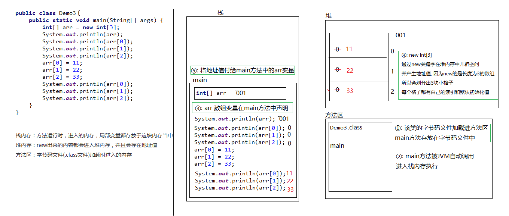
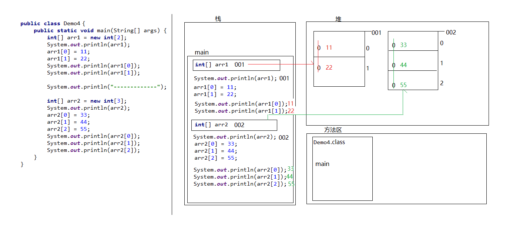
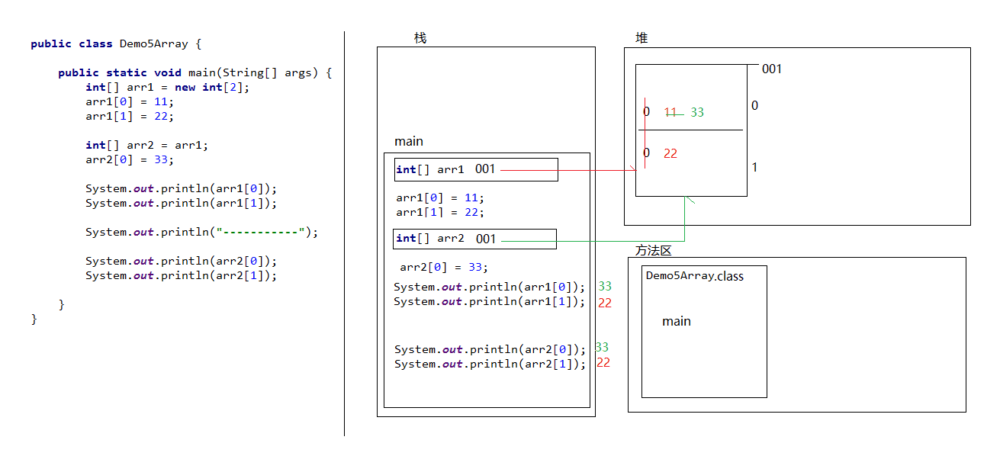

‍

--爪哇基础章

‍

‍

### Header

‍

‍

#### 环境

‍

‍

##### JDK

个人使用JDK 17 LTS

[CSDN](https://blog.csdn.net/R_Y_Fren/article/details/120438636?ops_request_misc=%257B%2522request%255Fid%2522%253A%2522169293843216800226587061%2522%252C%2522scm%2522%253A%252220140713.130102334..%2522%257D&request_id=169293843216800226587061&biz_id=0&utm_medium=distribute.pc_search_result.none-task-blog-2~all~top_positive~default-2-120438636-null-null.142^v93^insert_down1&utm_term=JDK%E5%AE%89%E8%A3%85&spm=1018.2226.3001.4187)

‍

‍

**系统变量-&gt;新建系统变量** (作为其他地方的引用使用)

```git
变量名：JAVA_HOME
变量值：（这是你自己安装JDK时的路径）
```

**系统变量下的PATH变量新建两个路径** (让系统在任何路径下都可以识别java、javac、javap等命令)

```
%JAVA_HOME%\bin
%JAVA_HOME%\jdk\bin
```

‍

**新建/修改 CLASSPATH 变量**（作用：告诉jvm要使用或执行的class放在什么路径上，便于JVM加载class文件

(.;表示当前路径，tools.jar和dt.jar为类库路径)

如果存在 CLASSPATH 变量，选中点击 Edit(编辑), 如果没有新建

```
变量名：CLASSPATH
变量值：.;%JAVA_HOME%\lib\dt.jar;%JAVA_HOME%\lib\tools.jar;
```

‍

‍

‍

‍

#### 优化

‍

##### 性能

‍

1. JVM调优(见JVM)
2. 不要在循环中计算
3. 尽可能把变量、方法声明为 **final static 类型** (在类加载后就生成了'该数组'，每次方法调用则不再重新生成数组对象了)
4. 缩小变量的作用范围
5. **频繁字符串拼接操作**使用 StringBuilder 或 StringBuffer
6. 使用优秀查找方法 (二分查找binarySearch, 但也**必须排序后使用**)
7. 若非必要，不要克隆对象, **使用new即可**

    > 通过 clone 方法生成一个对象时，就会不再执行构造函数了，只是在内存中进行数据块的拷贝，此方法看上去似乎应该比 new 方法的性能好很多，但是 Java 的缔造者们也认识到“二八原则”，80%（甚至更多）的对象是通过 new 关键字创建出来的，所以对 new 在生成对象（分配内存、初始化）时做了充分的性能优化，事实上一般情况下 **new 生成的对象比 clone 生成的性能方面要好很多**
    >
8. 覆盖 fillInStackTrace 的自定义异常 -- **不需要关注栈信息，则可以将其覆盖**

    > 会使性能提升 10 倍以上, 原理:
    >
    > 在出现异常时（或主动声明一个 Throwable 对象时），JVM 会通过 fillInStackTrace 方法记录下栈帧信息，然后生成一个 Throwable 对象. fillInStackTrace 方法记录异常时的栈信息是个非常耗时的动作，如果我们在开发时不需要关注栈信息，则可以将其覆盖
    >

    ```java
    class MyException extends Exception{
        public Throwable fillInStackTrace(){
            return this；
        }
    }
    ```

‍

#### 工件

‍

##### lombok

‍

通过简单的注解来简化JAVA

通过注解的形式自动生成构造器、getter/setter、equals、hashcode、toString等方法，并可以自动化生成日志变量

‍

|**注解**|**作用**|
| --------------------| ------------------------------------------------------------|
|@Getter/@Setter|所有的属性提供get/set|
|@ToString|自动生成toString|
|@EqualsAndHashCode|自动重写 equals和hashCode方法|
| **@Data**|综合功能 @Getter+Setter+ToString+EqualsAndHashCode<br />|
| **@NoArgsConstructor**|为实体类生成无参的构造器方法|
| **@AllArgsConstructor**|为实体类生成除了static修饰的字段之外带有各参数的构造器方法|

‍

```xml
<dependency>
    <groupId>org.projectlombok</groupId>
    <artifactId>lombok</artifactId>
</dependency>
```

‍

‍

# 知识

‍

## 概念

‍

### 虚拟方法&动态绑定

虚拟方法：在多态情况下，对于重写的方法，父类的方法称为虚拟方法，因为在运行阶段实际上调用的是子类的方法，而编译阶段是无法确定的  
动态绑定：编译时为父类方法，运行时为子类方法

‍

### 哈希值

* JDK 根据对象的地址或者字符串或者数字计算出来的数值
* 获取哈希值：Object 类中的 public int hashCode()
* 特点

  * 同一个对象多次调用 hashCode() 方法返回的哈希值是相同的
  * 默认情况下，不同对象的哈希值是不同的，而重写 hashCode() 方法，可以实现让不同对象的哈希值相同

‍

### Character

字符集：为字符编制的一套编号规则

计算机的底层是不能直接存储字符的，只能存储二进制 010101

ASCII 编码：8 个开关一组就可以编码字符，1 个字节 2^8 = 256， 一个字节存储一个字符完全够用，英文和数字在底层存储都是采用 1 个字节存储的

```
a  97
b  98

A  65
B  66

0  48
1  49
```

中国人：中国人有 9 万左右字符，2 个字节编码一个中文字符，1 个字节编码一个英文字符，这套编码叫：GBK 编码，兼容 ASCII 编码表

美国人：收集全球所有的字符，统一编号，这套编码叫 Unicode 编码（万国码），一个英文等于两个字节，一个中文（含繁体）等于两个字节，中文标点占两个字节，英文标点占两个字节

* UTF-8 是变种形式，也必须兼容 ASCII 编码表
* UTF-8 一个中文一般占 3 个字节，中文标点占 3 个，英文字母和数字 1 个字节

编码前与编码后的编码集必须一致才不会乱码

‍

### 类与类之间的关系

‍

1. 依赖关系（Dependency）  
    对象之间最弱的一种关联方式，是临时性的关联。代码中一般指由局部变量、函数参数、返回值建立的对于其他对象的调用关系。
2. 关联关系（Association）

    1. 对象之间一种引用关系，比如客户类与订单类之间的关系。这种关系通常使用类的属性表达。
    2. 关联可以有方向，即导航。一般不作说明的时候，导航是双向的，不需要在线上标出箭头。
    3. 关联表示类之间的“持久”关系，这种关系一般表示一种重要的业务之间的关系，需要保存的，或者说需要“持久化”的，或者说需要保存到数据库中的。另外，依赖表示类之间的是一种“临时、短暂”关系，这种关系是不需要保存的.
3. 聚合（Aggregation）

    1. 聚合（关联关系的一种）：表示 has-a 的关系。与关联关系一样，聚合关系也是通过实例变量来实现这样关系的。关联关系和聚合关系来语法上是没办法区分的，从语义上才能更好的区分两者的区别。
    2. 如汽车类与引挚类，轮胎类之间的关系就是整体与个体的关系。与关联关系一样，聚合关系也是通过实例变量来实现的。空心菱形
    3. 关联和聚集（聚合）的区别：

        1. 关联关系所涉及的两个对象是处在同一个层次上的。比如人和自行车就是一种关联关系，而不是聚合关系，因为人不是由自行车组成的。聚合关系涉及的两个对象处于不平等的层次上，一个代表整体，一个代表部分。比如电脑和它的显示器、键盘、主板以及内存就是聚集关系，因为主板是电脑的组成部分。
4. 组合（Composite）

    1. 对象 A 包含对象 B，对象 B 离开对象 A 没有实际意义。是一种更强的关联关系。人包含手，手离开人的躯体就失去了它应有的作用。
    2. 组合：表示 contains-a 的关系，是一种强烈的包含关系。组合类负责被组合类的生命周期。也使用属性表达组合关系，是关联关系的一种，是比聚合关系强的关系。

‍

## 底层

JVM: JavaEE

‍

参数值传递机制

Java只有一种传递机制    值传递(将实参副本传入方法，参数本身无影响)

‍

复制的方式

基本    数据值

引用    地址值

Str    另外

‍

### 字面值和转义字符

‍

* 不同进制的整数

```java
int i=10;//十进制
int i =0b00101;//二进制
int i=010;//八进制
int i=0x10//十六进制
```

* 不同编码的字符串

```java
"这是一个字符串"//字符串的字面值
"\u0061"//unnicode编码的字符
```

* 不同的转义字符

```text
\t 制表位
\n 换行符
\b 退格键
\r 回车
\'
\"
\\
```

‍

## 命名

‍

### 命名格式

‍

一般    全小写_式驼峰  `this_is_potato`​

‍

类/接口    全部**首字母大写驼峰**  `XxxYyyZzz()`​ （==大驼峰命名法==）

‍

变量/方法    **第一个单词小写**，后面大写  `xxxYyyZzz()`​​ （==小驼峰命名法，简称驼峰法==）

‍

常量    全大写加_分隔  `XXX_YYY_ZZZ`​

‍

包        一律小写, 单词间不要用字符隔开

‍

‍

### 保留关键字

使用Clazz而不是Class来定义班级, 因为 *class* 是java中的保留关键字，不能用于命名变量，所以使用读音相似的*clazz*来命名，这是约定俗成的

‍

|abstract|assert|boolean|break|
| ----------| --------------| ----------| ------------|
|byte|case|catch|char|
|class|const|continue|default|
|do|double|else|enum|
|extends|final|finally|float|
|for|goto|if|implements|
|import|instanceof|int|interface|
|long|native|new|package|
|private|protected|public|return|
|short|static|strictfp|super|
|switch|synchronized|this|throw|
|throws|transient|try|void|
|volatile|while|||

‍

* 关键字(keyword)的定义和特点

  * 定义：被Java语言赋予了特殊含义，用做专门用途的字符串（单词）
  * 特点：关键字中所有字母都为小写

用于定义数据类型的关键字:

> class、 interface、 enum、 byte、 short、 int、 long、 float、 double、 char、 boolean、 void

用于定义流程控制的关键字:

> if、 else、 switch、 case、 default、 while、 do、 for、 break、 continue、 return

用于定义访问权限修饰符的关键字:

> private、 protected、 public

用于定义类，函数，变量修饰符的关键字:

> abstract、 final、 static、 synchronized

用于定义类与类之间关系的关键字:

> extends、 implements

用于定义建立实例及引用实例，判断实例的关键字:

> new、 this、 super、 instanceof

用于异常处理的关键字:

> try、 catch、 finally、 throw、 throws

用于包的关键字:

> package、 import

其他修饰符关键字:

> native、 strictfp、 transient、 volatile、 assert

*用于定义数据类型值的字面值:

> true false null

* 保留字(reserved word)

  * Java保留字：现有Java版本尚未使用，但以后版本可能会作为关键字使用。自己命名标识符时要避免使用这些保留字: goto 、const

‍

‍

## 注释

‍

### 多行注释    /* */

‍

### JavaDoc    /** */

```java
/** */
```

Java特有的注释，注释内容会被JDC提供的工具javadoc所解析，生成一套以网页文件形式体现的该程序的说明文档

最近利用这种公用项目来练习了JavaDoc, 写Java方法文档的方法找到了很多注释标签, 同时修复了代码成熟度的问题

‍

‍

## 管理

‍

### 导包

‍

‍

##### 静态导入

在static对象引用、常量（必须是static 或final）和static方法上进行静态导入, 导入到对应的包下就相当于省略了其内容(但是为了可读性等原因还是建议谨慎使用)

```java
import static
```

本地重写导入的量, 如果重名了调用时会直接覆盖且不会显式报错

‍

‍

## 版本

> 版本变化特性记录

‍

当前使用主版本 -- JDK17

> 记录一些Java变迁的事情
>
> 注意    比Java8 新的和记忆性的保留这里, 比JDK 1.8旧的就放在对应目录地方吧

‍

‍

‍

### jshell工具 ==Java 9==

在类似CMD的Shell中执行 Java 代码并立即获得执行结果(类似Python原生)

‍

‍

‍

## 特性

‍

Java中 count \= count++; 无效, 使用 count+=1;

‍

### 代码执行顺序

静态代码块(Static) -> 匿名代码块({}) -> 一般代码块

‍

‍

# 基础

‍

## 数型

‍

JAVA数据类型 = **基本数据类型**(==数值型==(整数+浮点), ==字符型==, ==布尔型==) + **引用数据类型**(==类==, ==接口==, ==数组==)

‍

‍

### 操作

‍

#### 查看类型

‍

引用类型

直接获取类型 + 打印类型

```java
.getClass().getName()
```

‍

基础类型

自定义工具查看, 否则报错

```java
private static String getType(Object b) {
    return b.getClass().toString();
}
```

‍

‍

#### 上下转型

‍

##### float 与 double

Java 不能隐式执行向下转型，因为这会使得精度降低，但是可以向上转型

```java
//1.1字面量属于double类型，不能直接将1.1直接赋值给 float 变量，因为这是向下转型
float f = 1.1;//报错
//1.1f 字面量才是 float 类型
float f = 1.1f;
```

```java
float f1 = 1.234f;
double d1 = f1;

double d2 = 1.23;
float f2 = (float) d2;//向下转型需要强转
```

```java
int i1 = 1245;
long l1 = i1;

long l2 = 1234;
int i2 = (int) l2;
```

‍

‍

##### 隐式类型转换

字面量 1 是 int 类型，比 short 类型精度要高，因此不能隐式地将 int 类型向下转型为 short 类型  
使用 += 或者 ++ 运算符会执行类型转换：

```java
short s1 = 1;
s1 += 1;	//s1++;
//上面的语句相当于将 s1 + 1 的计算结果进行了向下转型
s1 = (short) (s1 + 1);
```

‍

‍

‍

### 基本类

‍

八种基本数据类型（Primitive Data Types）

基本数据类型包括**数值型**，**字符型**和**布尔型**，这些类型直接存储在栈内存中，占用固定的空间速度快. 

六种数字类型（四个整数型，两个浮点型），一种字符类型，一种布尔型

‍

字符型    char

4种整型    从小到大    byte, short，int, long

两个浮点型    float, double

布尔型    boolean

‍

‍

#### **字符型**

‍

字符型只有一个char类型，它用来表示单个字符，占用两个字节，可以存储Unicode字符

‍

##### Char

‍

‍

#### 数值型

‍

分为整数型和浮点型. 

整型包括byte，short，int和long，这些类型用来表示整数，不同的是它们的取值范围和字节大小不同. 

浮点型包括float和double，这些类型用来表示小数，不同的是它们的精度和字节大小不同. 

‍

‍

##### =整型=

‍

‍

##### Byte

‍

##### Short

‍

##### Int

‍

##### Long

‍

‍

##### =浮点型=

‍

##### float

‍

‍

##### double

‍

‍

#### **布尔型**

布尔型只有一个boolean类型，它用来表示真或假的值，只有两个取值：true和false. 布尔型在Java中没有明确规定其大小，只要求能够表示一位信息. 

‍

‍

##### Boolean

boolean类型数据只允许取值true和false，无null。

* 不可以使用0或非 0 的整数替代false和true，这点和C语言不同。
* Java虚拟机中没有任何供boolean值专用的字节码指令，Java语言表达所操作的boolean值，在编译之后都使用java虚拟机中的int数据类型来代替：true用1表示，false用0表示。———《java虚拟机规范 8版》
* JVM 会在编译时期将 boolean 类型的数据转换为 int，使用 1 来表示 true，0 表示 false。JVM 支持 boolean 数组，但是是通过读写 byte 数组来实现的。

‍

‍

‍

### 引用类

‍

引用数据类型（Reference Data Types）

引用数据类型包括类，接口和数组，这些类型存储在堆内存中，占用不固定的空间，速度相对慢. 引用数据类型的变量实际上是一个指向堆内存中对象的地址，而不是对象本身

‍

类    用户自定义的复合数据类型，它由属性和方法组成. 类可以实例化成对象，并且可以继承其他类或实现接口. 

接口    抽象的数据类型，它只包含常量和抽象方法. 接口不能实例化成对象，但可以被其他类或接口继承或实现. 

数组    容器数据类型，它可以存储多个相同类型的元素，并且可以按照索引访问. 数组可以是一维的或多维的，数组的长度在创建时确定，并且不能改变. 

‍

‍

#### Object

‍

Object 类是 Java 中的祖宗类，一个类或者默认继承 Object 类，或者间接继承 Object 类，Object 类的方法是一切子类都可以直接使用

‍

##### API

‍

* ​`public String toString()`​：默认是返回当前对象在堆内存中的地址信息：类的全限名@内存地址，例：Student@735b478；

  * 直接输出对象名称，默认会调用 toString() 方法，所以省略 toString() 不写；
  * 如果输出对象的内容，需要重写 toString() 方法，toString 方法存在的意义是为了被子类重写
* ​`public boolean equals(Object o)`​：默认是比较两个对象的引用是否相同
* ​`protected Object clone()`​：创建并返回此对象的副本

‍

##### equals覆写

只要两个对象的内容一样，就认为是相等的：

```java
public boolean equals(Object o) {
	// 1.判断是否自己和自己比较，如果是同一个对象比较直接返回true
	if (this == o) return true;
	// 2.判断被比较者是否为null ,以及是否是学生类型。
	if (o == null || this.getClass() != o.getClass()) return false;
	// 3.o一定是学生类型，强制转换成学生，开始比较内容！
	Student student = (Student) o;
	return age == student.age &&
           sex == student.sex &&
           Objects.equals(name, student.name);
}
```

‍

‍

#### Objects

Objects 类与 Object 是继承关系

‍

‍

##### API

‍

* ​`public static boolean equals(Object a, Object b)`​：比较两个对象是否相同

  ```java
  public static boolean equals(Object a, Object b) {
    // 进行非空判断，从而可以避免空指针异常
    return a == b || a != null && a.equals(b);
  }
  ```
* ​`public static boolean isNull(Object obj)`​：判断变量是否为 null ，为 null 返回 true
* ​`public static String toString(对象)`​：返回参数中对象的字符串表示形式
* ​`public static String toString(对象, 默认字符串)`​：返回对象的字符串表示形式

‍

‍

```java
public class ObjectsDemo {
    public static void main(String[] args) {
        Student s1 = null;
        Student s2 = new Student();
        System.out.println(Objects.equals(s1 , s2));//推荐使用
        // System.out.println(s1.equals(s2)); // 空指针异常
 
        System.out.println(Objects.isNull(s1));
        System.out.println(s1 == null);//直接判断比较好
    }
}

public class Student {
}
```

‍

#### Str

Java中的字符串String属于引用数据类型. 因为String是一个类

‍

##### 基本介绍

String 被声明为 final，因此不可被继承  **（Integer 等包装类也不能被继承）**

```java
public final class String implements java.io.Serializable, Comparable<String>, CharSequence {
 	/** The value is used for character storage. */
    private final char value[];
    /** Cache the hash code for the string */
    private int hash; // Default to 0
}
```

在 Java 9 之后，String 类的实现改用 byte 数组存储字符串，同时使用 `coder`​ 来标识使用了哪种编码

value 数组被声明为 final，这意味着 value 数组初始化之后就不能再引用其它数组，并且 String 内部没有改变 value 数组的方法，因此可以**保证 String** **不可变<sup>（生成新的对象 ）</sup>**​ **，也保证线程安全**

‍

###### 不可变好处

* 可以缓存 hash 值，例如 String 用做 HashMap 的 key，不可变的特性可以使得 hash 值也不可变，只要进行一次计算
* String Pool 的需要，如果一个 String 对象已经被创建过了，就会从 String Pool 中取得引用，只有 String 是不可变的，才可能使用 String Pool
* 安全性，String 经常作为参数，String 不可变性可以保证参数不可变. 例如在作为网络连接参数的情况下如果 String 是可变的，那么在网络连接过程中，String 被改变，改变 String 的那一方以为现在连接的是其它主机，而实际情况却不一定是
* String 不可变性天生具备线程安全，可以在多个线程中安全地使用
* 防止子类继承，破坏 String 的 API 的使用

‍

##### CRUD

‍

‍

###### 增

‍

创建

* 采用字面值的方式赋值
* new关键字新建一个字符串对象

> 这两种方式在性能和内存占用方面存在着差别
>
> 推荐使用 String 字面量赋值(="xxx"), 除非确有必要才新建立一个 String 对象

‍

‍

‍

‍

join("", array)                    从数组合并

format()                            模板字符串

‍

‍

###### 删

trim()                                返回删头尾空白字符的新串

‍

‍

###### 改

StringBuilder(str).reverse().toString()       翻转字符串

split("")                              str转str[]

replace(old, new)                   替换字符为new

concat(String str)                    连接

toLowerCase() / toUpperCase()         所有字符转换为小写/大写

‍

‍

###### 查

charAt(int index)                     返回指定索引处的字符

indexOf(ele ch/str, int fromIndex)    元素第一次索引,-1不存在

equals(str)                           相同,覆写Object类方法

equalsIgnoreCase()                    判断相等 忽略大小写

isEmpty()                             是否为空

startsWith()                          是否指定内容开头

endsWith()                            是否指定内容结尾

contains()                            判断是否包含子串

substring(int beginIndex, int endIndex)    返回子字符串

compareTo()                         自然比较

‍

‍

###### 其他

‍

‍

##### 拼接速度

‍

* StringBuilder.append()
* StringBuffer.append()
* list.add()

  StringUtils.join(list,"")
* concat
* +

(从上到下性能依次降低, StringBuffer线程安全)

‍

‍

#### Str衍生

可变字符序列,值可改变(append), 处理速度远快于处理 String对象本身

‍

##### StringBuffer

线程安全, 所有操作方式都是带有 synchronized 的同步方法，可以确保多线程操作时的线程安全

‍

‍

##### StringBuilder

线程不安全, 但是较之于Buffer更高效

‍

‍

##### 模板字符串

‍

```java
final String Template = "f" //创建模板
String.format(Template, para*) //调用
```

```java
    // 难题:控制输出格式,采用模板字符串的方法.
    public static String w2hoLikesIt(String... names) { 
    final String Template1 = "%s likes this";
    final String Template2 = "%s and %s like this";
    final String Template3 = "%s, %s and %s like this";
    final String TemplateN = "%s, %s and %d others like this";
    return names.length == 0 ? "no one likes this"
        : names.length == 1 ? String.format(Template1, names[0])
            : names.length == 2 ? String.format(Template2, names[0], names[1])
                : names.length == 3 ? String.format(Template3, names[0], names[1], names[2])
                    : String.format(TemplateN, names[0], names[1], names.length - 2);              }
```

‍

‍

##### 超大字符串

Text Blocks    使用 """ """ 括起

‍

```java
"""
"Text"
"""打印效果和编辑器一样
```

‍

‍

#### Array

数组的工具类是 java.util.Arrays  +  java.lang.reflect.Array

‍

##### Tips

* 性能要求较高的场景中使用数组替代集合
* 用包装类数字避开基本类型数组转换列表 asList() 陷阱

  > asList返回的列表只是数组的一个外壳，不再保持列表动态变长的特性
  >

  ```java
  Integer[]data={1，2，3，4，5}；没有用包装类的话,就会被识别为一整个对象扔到list里面力
  List list=Arrays.asList(data)；
  ```
* 数组实例：不可以使用 new E[]，但可以 `E[] element = (E[])new Object[capacity];`​
* 创建不能同时动态+静态初始化(给定数组长度的同时给出元素)       `int[] arr = new int[114514]{1,2,3}`​

‍

‍

‍

##### 初始化

数组就是存储数据长度固定的容器，存储多个数据的数据类型要一致，**数组也是一个对象**

‍

**创建数组**

* 数据类型[] 数组名：`int[] arr`​  （常用）
* 数据类型 数组名[]：`int arr[]`​

‍

**静态初始化**

* 数据类型[] 数组名 = new 数据类型[]{元素1,元素2,...}：`int[] arr = new int[]{11,22,33}`​
* 数据类型[] 数组名 = {元素1,元素2,...}：`int[] arr = {44,55,66}`​

‍

**动态初始化**

* 数据类型[] 数组名 = new 数据类型[数组长度]：`int[] arr = new int[3]`​

‍

‍

##### 元素访问

* **索引**  每一个存储到数组的元素，都会自动的拥有一个编号，从 **0** 开始. 这个自动编号称为数组索引（index），可以通过数组的索引访问到数组中的元素
* **访问格式**  数组名[索引]，`arr[0]`​
* **赋值**  `arr[0] = 10`​

‍

‍

##### 内存分配

内存是计算机中的重要器件，临时存储区域，作用是运行程序. 编写的程序是存放在硬盘中，在硬盘中的程序是不会运行的，必须放进内存中才能运行，运行完毕后会清空内存，Java 虚拟机要运行程序，必须要对内存进行空间的分配和管理

‍

|区域名称|作用|
| ------------| ------------------------------------------------------------|
|寄存器|给 CPU 使用|
|本地方法栈|JVM 在使用操作系统功能的时候使用|
|方法区|存储可以运行的 class 文件|
|堆内存|存储对象或者数组，new 来创建的，都存储在堆内存|
|方法栈|方法运行时使用的内存，比如 main 方法运行，进入方法栈中执行|

‍

‍

内存分配图：**Java 数组分配在堆内存**

* 一个数组内存图

  ​​
* 两个数组内存图

  ​​
* 多个数组指向相同内存图

  ​​

‍

‍

##### 数组异常

* 索引越界异常：ArrayIndexOutOfBoundsException
* 空指针异常：NullPointerException

  ```java
  public class ArrayDemo {
      public static void main(String[] args) {
          int[] arr = new int[3];
          //把null赋值给数组
          arr = null;
          System.out.println(arr[0]);
      }
  }
  ```

  arr = null，表示变量 arr 将不再保存数组的内存地址，也就不允许再操作数组，因此运行的时候会抛出空指针异常. 在开发中，空指针异常是不能出现的，一旦出现了，就必须要修改编写的代码

  解决方案：给数组一个真正的堆内存空间引用即可

‍

‍

##### 二维数组

二维数组也是一种容器，不同于一维数组，该容器存储的都是一维数组容器

‍

初始化

* 动态初始化：数据类型[][] 变量名 = new 数据类型[m] [n]，`int[][] arr = new int[3][3]`​

  * m 表示这个二维数组，可以存放多少个一维数组，行
  * n 表示每一个一维数组，可以存放多少个元素，列
* 静态初始化

  * 数据类型[][] 变量名 = new 数据类型 [][]{{元素1, 元素2...} , {元素1, 元素2...}
  * 数据类型[][] 变量名 = {{元素1, 元素2...}, {元素1, 元素2...}...}
  * ​`int[][] arr = {{11,22,33}, {44,55,66}}`​

‍

‍

##### Arrays

Array 的工具类 Arrays

‍

常用API：

* ​`public static String toString(int[] a)`​：返回指定数组的内容的字符串表示形式
* ​`public static void sort(int[] a)`​：按照数字顺序排列指定的数组
* ​`public static int binarySearch(int[] a, int key)`​：利用二分查找返回指定元素的索引
* ​`public static <T> List<T> asList(T... a)`​：返回由指定数组支持的列表

```java
public class MyArraysDemo {
      public static void main(String[] args) {
		//按照数字顺序排列指定的数组
        int [] arr = {3,2,4,6,7};
        Arrays.sort(arr);
        System.out.println(Arrays.toString(arr));

        int [] arr = {1,2,3,4,5,6,7,8,9,10};
        int index = Arrays.binarySearch(arr, 0);
        System.out.println(index);
        //1,数组必须有序
        //2.如果要查找的元素存在,那么返回的是这个元素实际的索引
        //3.如果要查找的元素不存在,那么返回的是 (-插入点-1)
            //插入点:如果这个元素在数组中,他应该在哪个索引上.
      }
  }
```

‍

‍

‍

‍

‍

### 包装类

‍

#### 作用

* 包装类作为类首先拥有了 Object 类的方法
* 包装类作为引用类型的变量可以**存储 null 值**
* > 无论是从安全性、性能方面来说，还是从稳定性方面来说，基本类型都是首选方案.
  >

‍

```java
基本数据类型                包装类（引用数据类型）
byte                      Byte
short                     Short
int                       Integer
long                      Long

float                     Float
double                    Double
char                      Character
boolean                   Boolean
```

‍

Java 为包装类做了一些特殊功能，具体来看特殊功能主要有

* 可以把基本数据类型的值转换成字符串类型的值

  1. 调用 toString() 方法
  2. 调用 Integer.toString(基本数据类型的值) 得到字符串
  3. 直接把基本数据类型 + 空字符串就得到了字符串（推荐使用）
* 把字符串类型的数值转换成对应的基本数据类型的值

  1. Xxx.parseXxx("字符串类型的数值") → `Integer.parseInt(numStr)`​
  2. Xxx.valueOf("字符串类型的数值")   → `Integer.valueOf(numStr)`​ （推荐使用）

‍

‍

#### 分类

* 父类属于 Number    Byte、Short、Integer、Long、Float、Double
* 父类属于 Object    Boolean、Character

‍

##### 类型对比

* 有了基本数据类型，为什么还要引用数据类型？

  > 引用数据类型封装了数据和处理该数据的方法，比如 Integer.parseInt(String) 就是将 String 字符类型数据转换为 Integer 整型
  >
  > Java 中大部分类和方法都是针对引用数据类型，包括泛型和集合
  >
* 引用数据类型那么好，为什么还用基本数据类型？

  > 引用类型的对象要多储存对象头，对基本数据类型来说空间浪费率太高. 逻辑上来讲，Java 只有包装类就够了，为了运行速度，需要用到基本数据类型；优先考虑运行效率的问题，所以二者同时存在是合乎情理的
  >
* Java 集合不能存放基本数据类型，只存放对象的引用？

  > 不能放基本数据类型是因为不是 Object 的子类. 泛型思想，如果不用泛型要写很多参数类型不同的但功能相同的函数（方法重载）
  >
* ==

  > == 比较基本数据类型：比较的是具体的值  
  > == 比较引用数据类型：比较的是对象地址值
  >

‍

‍

#### 包装类型null值检测

拆箱过程是通过调用包装对象的intValue方法来实现的，由于包装对象是null值，访问其intValue方法报空指针异常也就在所难免了

因此在拆包时候, 如果包装对象会出现null, 建议采用这一**三元表达式**回避空指针异常

```java
count += (i！=null)? i:0;
```

‍

#### 转换原则

基本类型可以先加宽，再转变成宽类型的包装类型，但不能直接转变成宽类型的包装类型; 这只有在赋值时才会发生，和重载没有关系

> 简单地说就是，int 可以加宽转变成 long，然后再转变成 Long 对象，但不能直接转变成包装类型，注意这里指的都是自动转换，不是通过构造函数生成

‍

‍

#### 装箱拆箱

**自动装箱**：可以直接把基本数据类型的值或者变量赋值给包装类

**自动拆箱**：可以把包装类的变量直接赋值给基本数据类型

‍

**自动装箱**反编译后底层调用 `Integer.valueOf()`​ 实现，源码：

```java
public static Integer valueOf(int i) {
    if (i >= IntegerCache.low && i <= IntegerCache.high)
        // 【缓存池】，本质上是一个数组
        return IntegerCache.cache[i + (-IntegerCache.low)];
    return new Integer(i);
}
```

**自动拆箱**调用 `java.lang.Integer#intValue`​，源码：

```java
public int intValue() {
    return value;
}
```

‍

‍

### 常量

‍

‍

### 变量

‍

#### 类型

||成员变量|局部变量|静态变量|
| :--------: | :--------------: | :--------------------: | :---------------------------: |
|定义位置|在类中，方法外|方法中或者方法的形参|在类中，方法外|
|初始化值|有默认初始化值|无，赋值后才能使用|有默认初始化值|
|调用方法|对象调用||对象调用，类名调用|
|存储位置|堆中|栈中|方法区（JDK8 以后移到堆中）|
|生命周期|与对象共存亡|与方法共存亡|与类共存亡|
|别名|实例变量||类变量，静态成员变量|

静态变量只有一个，成员变量是类中的变量，局部变量是方法中的变量

‍

‍

### 类型转换

‍

**自动类型转换**：容量小的类型自动转换为容量大的数据类型。

* 有多种类型的数据混合运算时，系统首先自动将所有数据转换成容量最大的那种数据类型，然后再进行计算。
* 说明：此时的容量大小指的是，表示数的范围的大和小。比如：float容量要大于long的容量
* byte , short , char之间不会相互转换，他们三者在计算时首先转换为int类型。(即便是他们与自身运算byte + byte)
* java在做运算的时候，如果操作数均在int范围内，那么一律在int的空间内运算。
* boolean类型不能与其它数据类型运算。
* 当把任何基本数据类型的值和字符串(String)进行连接运算时(+)，基本数据类型的值将自动转化为字符串(String)类型。

‍

**强制类型转换**：自动类型提升运算的逆运算。

* 需要使用强转符：( )
* 注意点：强制类型转换，可能导致精度损失。

  * 浮点型 -> 整型：截断
  * 整型常量，默认类型为int型。如果为long类型需要后面加l或L，当long字面值在int范围内时，赋值给long会发生自动类型提升。

    1. 字面值：程序中直接出现的常量值
  * 浮点型常量，默认类型为double型。如果为float类型需要后面加f或F，或者使用强制类型转换。

‍

‍

#### Str-其他互转

‍

##### ==-&gt; String==

其他转字符串

> ```java
> String.valueOf(i)
> ```
>
> ```java
> Integer.toString(i)
> ```
>
> ```java
> "" + i
> ```

‍

##### ==String -&gt;==

字符串转其他

> ```java
> Integer.parseInt([my_str])
> ```
>
> ```java
> Integer.valueOf(my_str).intValue()
> ```

‍

##### ==Radix&lt;-&gt;==

进制转换

> 给定进制str转十进制i
>
> ```java
> Integer.parseInt(str, str_radix)
> ```
>
> ‍
>
> 十进制i转给定进制str
>
> ```java
> Integer.toString(i, to_radix)
> ```

‍

‍

#### Str-基-包转换关系

‍

##### 基本 -> 

‍

==基本数据类 -&gt; 包装类==

* 构造器

  ```java
   Integer i = Integer.valueOf(100);
  ```
* 自动装箱

‍

==基本数据类 -&gt; String==

* ```java
  String.valueOf(XX)
  ```
* ```java
  XX + ""
  ```

‍

##### 包装类 ->

‍

==包装类 -&gt; 基本数据类==

‍

* ```java
  XXX.XXXValue()
  ```
* 自动拆箱

‍

==包装类 -&gt; String==

* ```java
  包装类对象方法.toString()
  ```
* ```java
  包装类.toString(100)
  ```

‍

##### String ->

‍

==Str -&gt; 基本数据类==

* ```java
  相应包装类parseXxx(String)
  ```
* ```java
  构造器new Xxxx("str") (deprecated)
  ```

‍

==Str -&gt; 包装类==

* 字符串参数

  ```java
  Integer t =new Integer("1113");
  ```

‍

‍

‍

### 特殊量

‍

#### 时间

‍

##### 操作

‍

Calendar.getInstance()      创建实例获得当天日期和时间

return new SimpleDateFormat("yyyy-MM-dd HH:mm:ss").format(Date(d))    获取年月日时分秒的方法

""替换为 `"yyyy-MM-dd"`​, `"HH:mm:ss"`​  换格式

‍

字符串转换为一个日期 

```java
SimpleDateFormat sdf = new SimpleDateFormat("yyyy-mm-dd");
Date d = sdf.parse(s);
```

‍

‍

##### Date

构造器：

* ​`public Date()`​：创建当前系统的此刻日期时间对象.
* ​`public Date(long time)`​：把时间毫秒值转换成日期对象

方法：

* ​`public long getTime()`​：返回自 1970 年 1 月 1 日 00:00:00 GMT 以来总的毫秒数.

时间记录的两种方式：

1. Date 日期对象
2. 时间毫秒值：从 `1970-01-01 00:00:00`​ 开始走到此刻的总的毫秒值，1s = 1000ms

```java
public class DateDemo {
    public static void main(String[] args) {
        Date d = new Date();
        System.out.println(d);//Fri Oct 16 21:58:44 CST 2020
        long time = d.getTime() + 121*1000;//过121s是什么时间
        System.out.println(time);//1602856875485
  
        Date d1 = new Date(time);
        System.out.println(d1);//Fri Oct 16 22:01:15 CST 2020
    }
}
```

```java
public static void main(String[] args){
    Date d = new Date();
    long startTime = d.getTime();
    for(int i = 0; i < 10000; i++){输出i}
    long endTime = new Date().getTime();
    System.out.println( (endTime - startTime) / 1000.0 +"s");
    //运行一万次输出需要多长时间
}
```

‍

‍

##### DateFormat

DateFormat 作用：

1. 可以把“日期对象”或者“时间毫秒值”格式化成我们喜欢的时间形式（格式化时间）
2. 可以把字符串的时间形式解析成日期对象（解析字符串时间）

DateFormat 是一个抽象类，不能直接使用，使用它的子类：SimpleDateFormat

SimpleDateFormat  简单日期格式化类：

* ​`public SimpleDateFormat(String pattern)`​：指定时间的格式创建简单日期对象
* ​`public String format(Date date) `​：把日期对象格式化成我们喜欢的时间形式，返回字符串
* ​`public String format(Object time)`​：把时间毫秒值格式化成设定的时间形式，返回字符串!
* ​`public Date parse(String date)`​：把字符串的时间解析成日期对象

> yyyy年MM月dd日 HH:mm:ss EEE a" 周几 上午下午

```java
public static void main(String[] args){
	Date date = new Date();
    SimpleDateFormat sdf = new SimpleDateFormat("yyyy-MM-dd HH:mm:ss);
    String time = sdf.format(date);
    System.out.println(time);//2020-10-18 19:58:34
    //过121s后是什么时间
    long time = date.getTime();
    time+=121;
    System.out.println(sdf.formate(time));
    String d = "2020-10-18 20:20:20";//格式一致
    Date newDate = sdf.parse(d);
    System.out.println(sdf.format(newDate)); //按照前面的方法输出
}
```

‍

‍

##### Calendar

Calendar 代表了系统此刻日期对应的日历对象，是一个抽象类，不能直接创建对象

Calendar 日历类创建日历对象：`Calendar rightNow = Calendar.getInstance()`​（**饿汉单例模式**）

Calendar 的方法：

* ​`public static Calendar getInstance()`​：返回一个日历类的对象
* ​`public int get(int field)`​：取日期中的某个字段信息
* ​`public void set(int field,int value)`​：修改日历的某个字段信息
* ​`public void add(int field,int amount)`​：为某个字段增加/减少指定的值
* ​`public final Date getTime()`​：拿到此刻日期对象
* ​`public long getTimeInMillis()`​：拿到此刻时间毫秒值

```java
public static void main(String[] args){
	Calendar rightNow = Calendar.getInsance(); 
	int year = rightNow.get(Calendar.YEAR);//获取年
    int month = rightNow.get(Calendar.MONTH) + 1;//月要+1
    int days = rightNow.get(Calendar.DAY_OF_YEAR);
    rightNow.set(Calendar.YEAR , 2099);//修改某个字段
    rightNow.add(Calendar.HOUR , 15);//加15小时  -15就是减去15小时
    Date date = rightNow.getTime();//日历对象
    long time = rightNow.getTimeInMillis();//时间毫秒值
    //700天后是什么日子
    rightNow.add(Calendar.DAY_OF_YEAR , 701);
    Date date d = rightNow.getTime();
    SimpleDateFormat sdf = new SimpleDateFormat("yyyy-MM-dd HH:mm:ss");
    System.out.println(sdf.format(d));//输出700天后的日期
}
```

‍

‍

###### LocalDateTime

JDK1.8 新增，线程安全

* LocalDate       表示日期（年月日）
* LocalTime       表示时间（时分秒）
* LocalDateTime    表示时间+ 日期 （年月日时分秒）

‍

构造方法：

* public static LocalDateTime now()：获取当前系统时间
* public static LocalDateTime of(年, 月 , 日, 时, 分, 秒)：使用指定年月日和时分秒初始化一个对象

‍

常用API：

|方法名|说明|
| -----------------------------------------------------------| ---------------------------------------------------------------|
|public int getYear()|获取年|
|public int getMonthValue()|获取月份（1-12）|
|public int getDayOfMonth()|获取月份中的第几天（1-31）|
|public int getDayOfYear()|获取一年中的第几天（1-366）|
|public DayOfWeek getDayOfWeek()|获取星期|
|public int getMinute()|获取分钟|
|public int getHour()|获取小时|
|public LocalDate  toLocalDate()|转换成为一个 LocalDate 对象（年月日）|
|public LocalTime toLocalTime()|转换成为一个 LocalTime 对象（时分秒）|
|public String format(指定格式)|把一个 LocalDateTime 格式化成为一个字符串|
|public LocalDateTime parse(准备解析的字符串, 解析格式)|把一个日期字符串解析成为一个 LocalDateTime 对象|
|public static DateTimeFormatter ofPattern(String pattern)|使用指定的日期模板获取一个日期格式化器 DateTimeFormatter 对象|

```java
public class JDK8DateDemo2 {
    public static void main(String[] args) {
        LocalDateTime now = LocalDateTime.now();
        System.out.println(now);

        LocalDateTime localDateTime = LocalDateTime.of(2020, 11, 11, 11, 11, 11);
        System.out.println(localDateTime);
        DateTimeFormatter pattern = DateTimeFormatter.ofPattern("yyyy年MM月dd日 HH:mm:ss");
        String s = localDateTime.format(pattern);
		LocalDateTime parse = LocalDateTime.parse(s, pattern);
    }
}
```

|方法名|说明|
| ---------------------------------------------| ----------------|
|public LocalDateTime plusYears (long years)|添加或者减去年|
|public LocalDateTime withYear(int year)|直接修改年|

**时间间隔** Duration 类API：

|方法名|说明|
| --------------------------------------------------| -----------------------|
|public static Period between(开始时间,结束时间)|计算两个“时间"的间隔|
|public int getYears()|获得这段时间的年数|
|public int getMonths()|获得此期间的总月数|
|public int getDays()|获得此期间的天数|
|public long toTotalMonths()|获取此期间的总月数|
|public static Durationbetween(开始时间,结束时间)|计算两个“时间"的间隔|
|public long toSeconds()|获得此时间间隔的秒|
|public long toMillis()|获得此时间间隔的毫秒|
|public long toNanos()|获得此时间间隔的纳秒|

```java
public class JDK8DateDemo9 {
    public static void main(String[] args) {
        LocalDate localDate1 = LocalDate.of(2020, 1, 1);
        LocalDate localDate2 = LocalDate.of(2048, 12, 12);
        Period period = Period.between(localDate1, localDate2);
        System.out.println(period);//P28Y11M11D
		Duration duration = Duration.between(localDateTime1, localDateTime2);
        System.out.println(duration);//PT21H57M58S
    }
}
```

‍

#### System类

‍

* System类代表系统，系统级的很多属性和控制方法都放置在该类的内部。该类位于java.lang包。
* 由于该类的构造器是private的，所以无法创建该类的对象，也就是无法实例化该类。其内部的成员变量和成员方法都是static的，所以也可以很方便的进行调用。
* 成员变量

  * System类内部包含in、out和err三个成员变量，分别代表标准输入流(键盘输入)，标准输出流(显示器)和标准错误输出流(显示器)。有其相应的set方法。
* 成员方法

  * ​`arraycopy(Object src, int srcPos, Object dest, int destPos, int length)`​：将指定源数组中的数组从指定位置开始复制到目标数组的指定位置。
  * ​`native long currentTimeMillis()`​：该方法的作用是返回当前的计算机时间，时间的表达格式为当前计算机时间和GMT时间(格林威治时间)1970年1月1号0时0分0秒所差的毫秒数。
  * ​`void exit(int status)`​：该方法的作用是退出程序。其中status的值为0代表正常退出，非零代表异常退出。使用该方法可以在图形界面编程中实现程序的退出功能等。
  * ​`void gc()`​：该方法的作用是请求系统进行垃圾回收。至于系统是否立刻回收，则取决于系统中垃圾回收算法的实现以及系统执行时的情况。
  * ​`String getProperty(String key)`​：该方法的作用是获得系统中属性名为key的属性对应的值。
  * ​`String setProperty(String key, String value)`​：设置指定键指示的系统属性。

‍

‍

‍

### 比较器

‍

* 在Java中经常会涉及到对象数组的排序问题，那么就涉及到对象之间的比较问题。

  * 说明：Java中的对象，正常情况下，只能进行比较：== 或 != 。不能使用 > 或 < 的但是在开发场景中，我们需要对多个对象进行排序，言外之意，就需要比较对象的大小。如何实现？使用两个接口中的任何一个：Comparable 或 Comparator
* Java实现对象排序的方式有两种：

  * 自然排序：java.lang.Comparable
  * 定制排序：java.util.Comparator
* Comparable接口与Comparator的使用的对比：Comparable接口的方式一旦一定，保证Comparable接口实现类的对象在任何位置都可以比较大小。Comparator接口属于临时性的比较。

‍

‍

#### 自然排序

java.lang.Comparable

‍

* Comparable接口强行对实现它的每个类的对象进行整体排序。这种排序被称为类的**自然排序**。
* 实现 Comparable 的类必须实现 compareTo(Object obj) 方法，两个对象即通过 compareTo(Object obj) 方法的返回值来比较大小。

  * **如果当前对象this大于形参对象obj，则返回正整数；**
  * **如果当前对象this小于形参对象obj，则返回负整数；**
  * **如果当前对象this等于形参对象obj，则返回零。**
* 实现Comparable接口的对象列表（和数组）可以通过 Collections.sort 或Arrays.sort进行自动排序。实现此接口的对象可以用作有序映射中的键或有序集合中的元素，无需指定比较器。
* 对于自定义类来说，如果需要排序，我们可以让自定义类实现Comparable接口，重写compareTo(obj)方法。在compareTo(obj)方法中指明如何排序。
* 对于类 C 的每一个 e1 和 e2 来说，当且仅当 e1.compareTo(e2) == 0 与e1.equals(e2) 具有相同的 boolean 值时，类 C 的自然排序才叫做与 equals 一致。建议（虽然不是必需的）最好使自然排序与 equals 一致。
* Comparable 的典型实现：(默认都是从小到大排列的)

  * 像String、包装类等实现了Comparable接口，重写了compareTo(obj)方法，给出了比较两个对象大小的方式。
  * String：按照字符串中字符的Unicode值进行比较
  * Character：按照字符的Unicode值来进行比较
  * 数值类型对应的包装类以及BigInteger、BigDecimal：按照它们对应的数值大小进行比较
  * Boolean：true 对应的包装类实例大于 false 对应的包装类实例
  * Date、Time等：后面的日期时间比前面的日期时间大

‍

‍

#### 定制排序

java.util.Comparator

‍

* 背景：当元素的类型没有实现java.lang.Comparable接口而又不方便修改代码，或者实现了java.lang.Comparable接口的排序规则不适合当前的操作，那么可以考虑使用 Comparator 的对象来排序，强行对多个对象进行整体排序的比较。
* 重写compare(Object o1,Object o2)方法，比较o1和o2的大小：

  * 如果方法返回正整数，则表示o1大于o2；
  * 如果返回0，表示相等；
  * 返回负整数，表示o1小于o2。
* 可以将 Comparator 传递给 sort 方法（如 Collections.sort 或 Arrays.sort），从而允许在排序顺序上实现精确控制。
* 还可以使用 Comparator 来控制某些数据结构（如有序 set或有序映射）的顺序，或者为那些没有自然顺序的对象 collection 提供排序。

‍

‍

### **枚举**

‍

‍

枚举是 Java 中的一种特殊类型，为了做信息的标志和信息的分类

‍

**定义**

```java
修饰符 enum 枚举名称{
	第一行都是罗列枚举实例的名称。
}
```

‍

#### 特点

* 枚举类是用 final 修饰的，枚举类不能被继承
* 枚举类默认继承了 java.lang.Enum 枚举类
* 枚举类的第一行都是常量，必须是罗列枚举类的实例名称
* 枚举类相当于是多例设计模式
* 每个枚举项都是一个实例，是一个静态成员变量

|方法名|说明|
| ---------------------------------------------------| --------------------------------------|
|String name()|获取枚举项的名称|
|int ordinal()|返回枚举项在枚举类中的索引值|
|int compareTo(E  o)|比较两个枚举项，返回的是索引值的差值|
|String toString()|返回枚举常量的名称|
|static <T> T  valueOf(Class<T> type,String  name)|获取指定枚举类中的指定名称的枚举值|
|values()|获得所有的枚举项|

‍

#### 源码分析

```java
enum Season {
    SPRING , SUMMER , AUTUMN , WINTER;
}
// 枚举类的编译以后源代码：
public final class Season extends java.lang.Enum<Season> {
	public static final Season SPRING = new Season();
	public static final Season SUMMER = new Season();
	public static final Season AUTUMN = new Season();
	public static final Season WINTER = new Season();

	public static Season[] values();
	public static Season valueOf(java.lang.String);
}
```

‍

#### API

‍

创建枚举类

```java
enum Color{RED, GREEN, BLUE;}
```

‍

创建实例

```java
Color myVar = Color.BLUE; 
```

‍

选择器

```java
switch (myVar) 
    case RED:
```

‍

示例

```java
public class EnumDemo {
    public static void main(String[] args){
        // 获取索引
        Season s = Season.SPRING;
        System.out.println(s);	//SPRING
        System.out.println(s.ordinal()); // 0，该值代表索引，summer 就是 1
        s.s.doSomething();
        // 获取全部枚举
        Season[] ss = Season.values();
        for(int i = 0; i < ss.length; i++){
            System.out.println(ss[i]);
        }

        int result = Season.SPRING.compareTo(Season.WINTER);
        System.out.println(result);//-3
    }
}
enum Season {
    SPRING , SUMMER , AUTUMN , WINTER;

    public void doSomething() {
        System.out.println("hello ");
    }
}
```

‍

‍

### 特殊对象

‍

‍

‍

‍

‍

#### 缓存池

‍

‍

> new Integer(123) 与 Integer.valueOf(123) 的区别在于
>
> * new Integer(123)：每次都会新建一个对象
> * Integer.valueOf(123)：会使用缓存池中的对象，多次调用取得同一个对象的引用
>
>   ```java
>   Integer x = new Integer(123);
>   Integer y = new Integer(123);
>   System.out.println(x == y);    // false
>   Integer z = Integer.valueOf(123);
>   Integer k = Integer.valueOf(123);
>   System.out.println(z == k);   // true
>   ```
>
> ‍
>
> valueOf() 方法的实现比较简单，就是先判断值是否在缓存池中，如果在的话就直接返回缓存池的内容. 编译器会在自动装箱过程调用 valueOf() 方法，因此多个值相同且值在缓存池范围内的 Integer 实例使用自动装箱来创建，那么就会引用相同的对象

‍

‍

**基本类型对应的缓存池如下**

* Boolean values true and false
* all byte values
* Short values between -128 and 127
* Long values between -128 and 127
* Integer values between -128 and 127
* Character in the range \u0000 to \u007F (0 and 127)

‍

##### **IntegerCache整形池**

‍

##### **ValueOf()装箱**

通过 valueOf 产生包装对象时，如果 int 参数在-128 和 127 之间，则直接从整型池中获得对象; 不在该范围的 int 类型则通过 new 生成包装对象.

‍

> 127 的包装对象是直接从整型池中获得的，不管你输入多少次 127 这个数字，获得的对象都是同一个，那地址当然都是相等的. 而 128、555 超出了整型池范围，是通过 new 产生一个新的对象，地址不同，当然也就不相等了.

这也是整型池的原理, 这将显著提高空间和时间性能. 也是我们在**声明包装对象的时候使用 valueOf 生成**，而不是通过构造函数来生成的原因

‍

‍

‍

##### 特殊

在 jdk 1.8 所有的数值类缓冲池中，**Integer 的缓存池 IntegerCache 很特殊，这个缓冲池的下界是 -128，上界默认是 127**，但是上界是可调的，在启动 JVM 时通过 `AutoBoxCacheMax=<size>`​ 来指定这个缓冲池的大小，该选项在 JVM 初始化的时候会设定一个名为 java.lang.Integer.IntegerCache 系统属性，然后 IntegerCache 初始化的时候就会读取该系统属性来决定上界

```java
Integer x = 100;				// 自动装箱，底层调用 Integer.valueOf(1)
Integer y = 100;
System.out.println(x == y);   	// true

Integer x = 1000;
Integer y = 1000;
System.out.println(x == y);   	// false，因为缓存池最大127

int x = 1000;
Integer y = 1000;
System.out.println(x == y);		// true，因为 y 会调用 intValue 【自动拆箱】返回 int 原始值进行比较
```

‍

‍

#### Str常量池

‍

字符串常量池(String Pool 或 String Constant Pool 或 String Literal Pool), 是一块特殊的内存空间，用于存储字符串常量，以减少字符串对象的重复创建和提高性能

‍

* StringTable，类似 HashTable 结构，通过 `-XX:StringTableSize`​ 设置大小，JDK 1.8 中默认 60013
* 常量池中的字符串仅是符号，第一次使用时才变为对象，可以避免重复创建字符串对象
* 字符串**变量**的拼接的原理是 StringBuilder#append，append 方法比字符串拼接效率高（JDK 1.8）
* 字符串**常量**拼接的原理是编译期优化，拼接结果放入常量池
* 可以使用 String 的 intern() 方法在运行过程将字符串添加到 String Pool 中

‍

###### intern()

‍

JDK 1.8：当一个字符串调用 intern() 方法时，如果 String Pool 中：

* 存在一个字符串和该字符串值相等，就会返回 String Pool 中字符串的引用（需要变量接收）
* 不存在，会把对象的**引用地址**复制一份放入串池，并返回串池中的引用地址，前提是堆内存有该对象，因为 Pool 在堆中，为了节省内存不再创建新对象

JDK 1.6：将这个字符串对象**尝试放入串池**，如果有就不放入，返回已有的串池中的对象的引用；如果没有会把此对象复制一份，放入串池，把串池中的对象返回

```java
public class Demo {
    // 常量池中的信息都加载到运行时常量池，这时a b ab是常量池中的符号，还不是java字符串对象，是懒惰的
    // ldc #2 会把 a 符号变为 "a" 字符串对象     ldc:反编译后的指令
    // ldc #3 会把 b 符号变为 "b" 字符串对象
    // ldc #4 会把 ab 符号变为 "ab" 字符串对象
    public static void main(String[] args) {
        String s1 = "a"; 	// 懒惰的
        String s2 = "b";
        String s3 = "ab";	// 串池
  
        String s4 = s1 + s2;	// 返回的是堆内地址
        // 原理：new StringBuilder().append("a").append("b").toString()  new String("ab")
  
        String s5 = "a" + "b";  // javac 在编译期间的优化，结果已经在编译期确定为ab

        System.out.println(s3 == s4); // false
        System.out.println(s3 == s5); // true

        String x2 = new String("c") + new String("d"); // new String("cd")
        // 虽然 new，但是在字符串常量池没有 cd 对象，因为 toString() 方法
        x2.intern();
        String x1 = "cd";

        System.out.println(x1 == x2); //true
    }
}
```

* == 比较基本数据类型：比较的是具体的值
* == 比较引用数据类型：比较的是对象地址值

结论：

```java
String s1 = "ab";								// 仅放入串池
String s2 = new String("a") + new String("b");	// 仅放入堆
// 上面两条指令的结果和下面的 效果 相同
String s = new String("ab");
```

‍

‍

###### 内存位置

Java 7 之前，String Pool 被放在运行时常量池中，属于永久代；Java 7 以后，String Pool 被移到堆中，这是因为永久代的空间有限，在大量使用字符串的场景下会导致 OutOfMemoryError 错误

演示 StringTable 位置：

* ​`-Xmx10m`​ 设置堆内存 10m
* 在 JDK8 下设置： `-Xmx10m -XX:-UseGCOverheadLimit`​（运行参数在 Run Configurations VM options）
* 在 JDK6 下设置： `-XX:MaxPermSize=10m`​

  ```java
  public static void main(String[] args) throws InterruptedException {
      List<String> list = new ArrayList<String>();
      int i = 0;
      try {
          for (int j = 0; j < 260000; j++) {
              list.add(String.valueOf(j).intern());
              i++;
          }
      } catch (Throwable e) {
          e.printStackTrace();
      } finally {
          System.out.println(i);
      }
  }
  ```

‍

##### **原理**

创建一个字符串时，首先检查池中是否有字面值相等的字符串，如果有，则不再创建，直接返回池中该对象的引用; 没有则创建之，然后放到池中并返回新建对象的引用

String类的intern()方法可以将一个堆中的字符串对象加入到字符串池中，并返回该对象在字符串池中的引用. 如果字符串池中已经存在相同内容的字符串对象，则直接返回该对象的引用，不会创建新的对象

Str保存的地址是指向字符串常量池中的，更改Str中的内容相当于修改Str中的地址值重新指向另外一个字符串

字符串常量池中不会储存相同内容的字符串(指针的指向为同一个)

‍

‍

1. 每一个字符串常量都指向字符串池中或者堆内存中的一个字符串实例；
2. 字符串对象值是固定的，一旦创建就不能再修改；
3. 字符串常量或者常量表达式中的字符串都被方法intern()在字符串池中保留了唯一的实例

‍

##### 优化常量池

两种方式：

* 调整 -XX:StringTableSize=桶个数，数量越少，性能越差
* intern 将字符串对象放入常量池，通过复用字符串的引用，减少内存占用

```java
/**
 * 演示 intern 减少内存占用
 * -XX:StringTableSize=200000 -XX:+PrintStringTableStatistics
 * -Xsx500m -Xmx500m -XX:+PrintStringTableStatistics -XX:StringTableSize=200000
 */
public class Demo1_25 {
    public static void main(String[] args) throws IOException {
        List<String> address = new ArrayList<>();
        System.in.read();
        for (int i = 0; i < 10; i++) {
            //很多数据
            try (BufferedReader reader = new BufferedReader(new InputStreamReader(new FileInputStream("linux.words"), "utf-8"))) {
                String line = null;
                long start = System.nanoTime();
                while (true) {
                    line = reader.readLine();
                    if(line == null) {
                        break;
                    }
                    address.add(line.intern());
                }
                System.out.println("cost:" +(System.nanoTime()-start)/1000000);
            }
        }
        System.in.read();
    }
}
```

‍

##### 评价

‍

**优点**

节省了内存空间和创建时间，提高了程序运行效率

‍

**缺点**

牺牲了JVM在常量池中遍历对象所需要的时间，以及增加了垃圾回收器的压力. 

‍

‍

#### System

代表当前系统

‍

静态方法

* ​`public static void exit(int status)`​：终止 JVM 虚拟机，**非 0 是异常终止**
* ​`public static long currentTimeMillis()`​：获取当前系统此刻时间毫秒值
* ​`static void arraycopy(Object var0, int var1, Object var2, int var3, int var4)`​：数组拷贝

  * 参数一：原数组
  * 参数二：从原数组的哪个位置开始赋值
  * 参数三：目标数组
  * 参数四：从目标数组的哪个位置开始赋值
  * 参数五：赋值几个

```java
public class SystemDemo {
    public static void main(String[] args) {
        //System.exit(0); // 0代表正常终止!!
        long startTime = System.currentTimeMillis();//定义sdf 按照格式输出
        for(int i = 0; i < 10000; i++){输出i}
		long endTime = new Date().getTime();
		System.out.println( (endTime - startTime)/1000.0 +"s");//程序用时

        int[] arr1 = new int[]{10 ,20 ,30 ,40 ,50 ,60 ,70};
        int[] arr2 = new int[6]; // [ 0 , 0 , 0 , 0 , 0 , 0]
        // 变成arrs2 = [0 , 30 , 40 , 50 , 0 , 0 ]
        System.arraycopy(arr1, 2, arr2, 1, 3);
    }
}
```

‍

## 基础语法

‍

‍

### 快速方法

‍

‍

‍

### 语法糖

> 注意, 这里内容与IDE本身的补全应该区别开来, 这里是Java语言自带的简写方法. IDE见对应模板
>
> 当然, 鄙人才疏学浅, 可能大多数情况下做不到刻意区分(能用就行, 能用就行...)

‍

‍

#### forEach print

打印集合中的元素

```java
listXXX.forEach(System.out::println);
```

‍

‍

‍

### 数算

‍

‍

#### 判断奇偶

```java
i%2==0 ? "偶数" ："奇数"
```

‍

‍

#### 相等比较

‍

##### ==

基本类型: 值        引用类型：地址值

‍

##### equals()

仅限引用类型, 默认比较地址值

部分已重写此方法

‍

‍

#### 运算符

‍

**优先级由高到低**

（）、！、算术运算符、关系运算符、逻辑运算符、赋值运算符

‍

##### 算术运算符

|运算符|运算|
| --------| --------------------------|
|+|正号|
|-|负号|
|+|加|
|-|减|
|*|乘|
|/|除|
|%|取模(取余)|
|++i|自增（前）：先运算后取值|
|i++|自增（后）：先取值后运算|
|--i|自减（前）：先运算后取值|
|i--|自减（后）：先取值后运算|
|+|字符串连接|

‍

‍

* 如果对负数取模，可以把模数负号忽略不记，如：5%-2=1。 但被模数是负数则不可忽略。此外，取模运算的结果不一定总是整数。(只有当被除数是负数时，余数才是负的)
* 对于除号“/”，它的整数除和小数除是有区别的：整数之间做除法时，只保留整数部分而舍弃小数部分。 例如：`int x=3510;x=x/1000*1000;`​
* "+"除字符串相加功能外，还能把非字符串转换成字符串.例如：`System.out.println("5+5="+5+5);`​
* 自增自减运算不会改变本身变量的数据类型

  ```java
  short s1 = 10;
  s1 = s1 + 1; //编译失败
  s1 = (short)(s1 + 1); //正确的
  s1++; //正确的
  ```

‍

##### 赋值运算符

* 符号：=

  * 当"="两侧数据类型不一致时，可以使用自动类型转换或使用强制类型转换原则进行处理。
  * 支持连续赋值。
* 扩展赋值运算符(增强赋值运算符)： +=, -=, *=, /=, %=

  * 扩展赋值运算不会改变本身变量的数据类型(还是会发生溢出的)
  * 两个符号中间是没有空格的

‍

##### 比较运算符

|运算符|运算|范例|结果|
| ------------| --------------------| ---------------------------| -------|
|==|相等于|4==3|false|
|!=|不等于|4!=3|true|
|<|小于|4<3|false|
|>|大于|4>3|true|
|<=|小于等于|4<=3|false|
|>=|大于等于|4>=3|true|
|instanceof|检查是否是类的对象|"Hello" instanceof String|true|

‍

##### 逻辑运算符

|a|b|a&b(逻辑与)|a&&b(短路与)|a\|b(逻辑或)|a\|\|b(短路或)|!a(逻辑非)|a^b(逻辑亦或)|
| -------| -------| -------------| --------------| -----------------| ----------------------| ------------| ---------------|
|true|true|true|true|true|true|false|false|
|true|false|false|false|true|true|false|true|
|false|true|false|false|true|true|true|true|
|false|false|false|false|false|false|true|false|

* 逻辑运算符用于连接布尔型表达式，在Java中不可以写成3<x<6，应该写成x>3 & x<6 。
* “&”和“&&”的区别：

  * 单&时，左边无论真假，右边都进行运算；
  * 双&时，如果左边为真，右边参与运算，如果左边为假，那么右边不参与运算。
* “|”和“||”的区别同理，||表示：当左边为真，右边不参与运算。
* 实际开发中，优先使用短路运算符。
* 异或( ^ )与或( | )的不同之处是：当左右都为true时，结果为false。

  * 理解：异或，追求的是“异”!

‍

‍

##### 位运算符

位运算是直接对**整数**的二进制进行的运算

|运算符|运算|范例|细节|
| --------| ------------------------| -----------------------| --------------------------------------------------------------------------|
|<<|左移|3 << 2 = 12 --> 3*2*2=12|空位补0，被移除的高位丢弃，空缺位补0。|
|>>|右移|3 >> 1 = 1 --> 3/2=1|被移位的二进制最高位是0，右移后，空缺位补0；最高位是1，空缺位补1。|
|>>>|无符号**右移**(没有无符号左移)|3 >>> 1 = 1 --> 3/2=1|被移位二进制最高位无论是0或者是1，空缺位都用0补。|
|&|与运算|6 & 3 = 2|二进制位进行&运算，只有1&1时结果是1，否则是0;|
|||或运算|6|
|^|异或运算|6 ^ 3 = 5|相同二进制位进行 ^ 运算，结果是0；1<sup>1=0 , 0</sup>0=0不相同二进制位 ^ 运算结果是1。1<sup>0=1 , 0</sup>1=1|
|~|取反运算|~6 = -7|正数取反，各二进制码按补码各位取反； 负数取反，各二进制码按补码各位取反|

‍

‍

###### 移位运算

计算机里一般用**补码表示数字**，正数、负数的表示区别就是最高位是 0 还是 1

* 正数的原码反码补码相同，最高位为 0

  ```java
  100:	00000000  00000000  00000000  01100100
  ```
* 负数：  
  原码：最高位为 1，其余位置和正数相同  
  反码：保证符号位不变，其余位置取反  
  补码：保证符号位不变，其余位置取反后加 1，即反码 +1

  ```java
  -100 原码:	10000000  00000000  00000000  01100100	//32位
  -100 反码:	11111111  11111111  11111111  10011011
  -100 补码:	11111111  11111111  11111111  10011100
  ```

  补码 → 原码：符号位不变，其余位置取反加 1

运算符：

* ​`>>`​ 运算符：将二进制位进行右移操作，相当于除 2
* ​`<<`​ 运算符：将二进制位进行左移操作，相当于乘 2
* ​`>>>`​ 运算符：无符号右移，忽略符号位，空位都以 0 补齐

运算规则：

* 正数的左移与右移，空位补 0
* 负数原码的左移与右移，空位补 0

  负数反码的左移与右移，空位补 1

  负数补码，左移低位补 0（会导致负数变为正数的问题，因为移动了符号位），右移高位补 1
* 无符号移位，空位补 0

‍

##### 三元运算符

三元操作符  
必须要返回一个数据，而且类型要确定. 且要保证返回数据们的类型一致  
(bool)? boolTrue : boolFalse

‍

* 格式: ( 条件表达式 ) ? 表达式1 ： 表达式2 ；

  * 条件表达式运算结果为true，运算后的结果是表达式1；
  * 条件表达式运算结果为false，运算后的结果是表达式2；
* 表达式1 和 表达式2 为同种类型
* 三元运算符可以嵌套使用
* 三元运算符与 if-else 的联系与区别：

  1. 三元运算符可简化 if-else 语句
  2. 三元运算符要求必须返回一个结果。
  3. if 后的代码块可有多个语句
* 如果程序既可以使用三元运算符，又可以使用if-else结构，那么优先选择三元运算符。原因：简洁、执行效率高。

‍

‍

‍

### 拷贝

‍

‍

#### 浅拷贝

浅拷贝(Shadow Clone，也叫影子拷贝)是Java 提供的一种简单拷贝机制

一个类实现 Cloneable 接口就具备被拷贝的能力，再覆写 clone() 方法就会完全具备拷贝能力. 

拷贝是在内存中进行的，所以在性能方面比直接通过 new 生成对象要快很多

‍

‍

##### 规则

‍

基本类型拷贝其值, String 字符串比较特殊，拷贝的也是一个地址(引用)，但是在修改时会从字符串池（String Pool）中重新生成新的字符串，原有的字符串对象保持不变. 在此处我们可以认为 String 也是一个基本类型. 

‍

**实例对象，则拷贝地址引用**，也就是说此时新拷贝出的对象与原有对象**共享**该实例变量，不受访问权限的限制. 

这是很疯狂的，因为它突破了访问权限的定义：一个 private 修饰的变量，竟然可以被两个不同的实例对象访问

‍

‍

#### 深拷贝

‍

‍

#### 序列化方式

‍

可通过序列化方式生成大量的对象

在内存中通过字节流的拷贝来实现，也就是把母对象写到一个字节流中，再从字节流中将其读出来

使用 Apache 下 commons 工具包中的 SerializationUtils 类更加简洁方便

‍

要求

* 被拷贝的对象必须实现 Serializable 接口
* 对象的内部属性都是可序列化的

‍

‍

### **Output**

‍

#### sout

见编辑器-实时模板界面(IDE功能)

```java
System.out.println()
```

‍

‍

### Input

‍

#### Scanner

‍

‍

##### HasNext / HasNextLine

把字符存储到 Scanner 对象中缓冲 (这时可以用来判断字符是否符合规则要求)

‍

==结束标志==

HasNext    **Space**

HasNextLine      **Enter**

‍

‍

##### Next / NextLine

直接从 Scanner 中获取当前 HasNext 和 HasNextLine 存储起来的值

‍

```java
 Scanner sc=new Scanner(System.in);
 T getValue=sc.nextXXX();
```

‍

#### 交互式

‍

##### 原型

```java
.hasNext() == true
```

```java
    Scanner s = new Scanner(System.in);
    boolean b;

    while(b = s.hasNext()) {
        System.out.println(b);
        System.out.println("your input is " + s.next());
    }

    System.out.println(b);
```

这个程序并不把空格、制表符以及回车换行这样的不可见字符当作输入，空白字符被当作输入内容的分隔符，回车换行则被用于提交输入

另一方面，似乎用户输入任何可见字符，`s.hasNext()`​都会返回true

‍

‍

##### hasNext(String pattern)

可以使用`hasNext()`​的重载方法`hasNext(String pattern)`​通过特殊终止符结束循环

```java
!s.hasNext("exit"))
```

‍

使用break跳出循环(最朴素的思路)

特殊终止符触发`break`​

```java
 if(tmp.equals("quit")) break;
```

‍

##### 从键盘读

使用BufferedReader包装InputStreamReader让System.in输入

```java
    public static String readString() {
        BufferedReader br = new BufferedReader(new InputStreamReader(System.in));
        String string = "";
        try {
            string = br.readLine();

        } catch (IOException ex) {
            System.out.println(ex);
        }
        return string;
    }
```

‍

##### 使用限定符

useDelimiter()允许我们指定将用作标记分隔符的模式. 在本例中，我们使用逗号作为分隔符，因此可以输入由逗号分隔的三个数字，并使用 nextInt ()读取它们

```java
        Scanner input = new Scanner(System.in); // create a Scanner object
        input.useDelimiter(","); // use comma as the delimiter
        System.out.print("Enter three numbers separated by commas: ");
        int num1 = input.nextInt(); // read an int value
        int num2 = input.nextInt(); // read another int value
        int num3 = input.nextInt(); // read another int value
        System.out.println("The sum is: " + (num1 + num2 + num3));
        input.close(); // close the scanner
```

‍

‍

##### 重定向输入流

前面说过，hasNext()方法可能会在等待输入时阻塞，可能的意思就是说：存在某种情况，hasNext()不会发生阻塞. 

‍

既然问题是由键盘输入带来的，不如就把产生问题的源头干掉，我们可以重定向标准输入使得系统从文件而不是从键盘读取输入. 操作很简单，提前在一个文本文件中编辑好输入内容，然后在cmd中执行程序，只需给执行命令增加一点内容

```java
java Test < text.txt
```

按下回车，程序从text.txt中读取内容，告别从键盘获取输入

这个方案有一个优点是用户不再需要手动从键盘输入数据，尤其是当我们做测试的时候，这种方式能帮我们节省很多时间和精力，输入量越大，这种优势越为明显. IDEA中可以配置输入重定向，打开 Run Configurations 就可以找到，这里我不详细描述了. 

‍

‍

‍

### 流程控制

‍

#### if

‍

#### while

##### do-while

‍

#### switch

‍

##### switch表达式

==JDK14==

> 我直接用普通switch然后自动转化

传统switch弊端

* 穿透; 匹配是自上而下的，如果忘记写break，后面的case语句不论匹配与否都会执行
* 所有的case语句共用一个块范围，在不同的case语句定义的变量名**不能重复**
* 不能在一个case里写多个执行结果一致的条件
* 整个switch不能作为表达式返回值

‍

新式switch: 可以有返回值

新语法使用->，如果有多条语句，需要用{}括起来. 不要写break语句，因为新语法只会执行匹配的语句，没有穿透效应，相当于添加了 `break`​

```java
        switch (str) {
            case "A" -> System.out.println("A");
            case "B", "C" -> System.out.println("B");
            default -> throw new RuntimeException("Unexpected value: " + str);
        }
```

‍

如果有复杂的逻辑，可以使用代码块. 这个时候就需要用 `yield`​​ 来提供值

yield不会跳出, 只是返回上一级

```java
return switch (number) {
      case 0 -> "no gifts";
      case 1 -> "only one gift";
      default -> {
        if (number < 0) {
          yield "no gifts";
        } else {
          yield number + " gifts";
        }
      }
    };
```

‍

用switch语句给某个变量赋值

```java
int dayOfWeek = 2;
String weekday = switch (dayOfWeek) {
    case 1:
        yield "星期一";
    case 2:
        yield "星期二";
    case 3:
        yield "星期三";
    case 4:
        yield "星期四";
    case 5:
        yield "星期五";
    case 6:
        yield "星期六";
    default:
        yield "星期日";
};
System.out.println(weekday);
```

‍

使用传统标签的 `switch`​ 语句中，也是可以使用 `yield`​

```java
 return switch (number) {
      case 0:
        yield "no gifts";
      case 1:
        yield "only one gift";
      default: {
        if (number < 0) {
          yield "no gifts";
        } else {
          yield number + " gifts";
        }
      }
    };

```

‍

‍

### **格式化**

字符串的格式化相当于将字符串按照指定的格式进行toString(),一般有两种形式：

```java
//使用指定的格式字符串和参数返回一个格式化字符串。
 public static String format(String format, Object... args) {
        return new Formatter().format(format, args).toString();
    }

//使用指定的语言环境、格式字符串和参数返回一个格式化字符串。
public static String format(Locale l, String format, Object... args) {
        return new Formatter(l).format(format, args).toString();
    }
```

‍

* 实例

```text
String fs;
fs = String.format("浮点型变量的值为 " +
                   "%f, 整型变量的值为 " +
                   " %d, 字符串变量的值为 " +
                   " %s", floatVar, intVar, stringVar);
```

‍

#### 数据转化符

|数据类型|说明|转化形式|
| ----------| ----------------------| ------------|
|%s|字符串类型|“string”|
|%c|字符类型|‘A’|
|%b|布尔类型|true/false|
|%o|整数类型（八进制）|111|
|%d|整数类型（十进制）|17|
|%x|整数类型（十六进制）|11|
|%f|浮点类型（基本）|66.66|
|%e|指数类型|1.11e+5|
|%a|浮点类型（十六进制）|FF.22|
|%h|散列码|11|
|%%|百分比类型|17%|
|%n|换行符||
|%tx|日期与时间类型||

```java
public class Format01 {
	public static void main(String[] args) {
		System.out.println(String.format("字符串：%s", "String"));
		System.out.println(String.format("字符：%c", 'M'));
		System.out.println(String.format("布尔类型：%b", 'M'>'A'));
		System.out.println(String.format("八进制整数类型：%o", 17));
		System.out.println(String.format("十进制整数类型：%d", 17));
		System.out.println(String.format("十六进制整数类型：%x", 17));
		System.out.println(String.format("基本浮点类型：%f", 99.1));
		System.out.println(String.format("指数类型：%e", 100.111111111));
		System.out.println(String.format("十六进制浮点类型：%a", 17.111111));
		System.out.println(String.format("散列码：%h", 17));
		System.out.println(String.format("百分比类型：17%%"));
		System.out.print(String.format("换行符：%n", 17));
	}

}
```

‍

‍

#### 格式化控制符

|标志|说明|示例|输出|
| ------| ---------------------------------------------| ------------------------------------------------------| ---------------------------------------------|
|+|为正数添加符号|(“正数：%+f”,11.11))|正数：+11.110000|
|-|左对齐|(“左对齐：%-5d”,11)|左对齐：11|
|0|整数前面补0|(“数字前面补0：%04d”,11)|数字前面补0：0011|
|,|对数字分组|(“按,对数字分组：%,d”,111111111)|按,对数字分组：111,111,111|
|空格|数字前面补空格|(“空格：% 4d”,11)|空格： 11|
|（|包含负数|(“使用括号包含负数：%(f”,-11.11)|使用括号包含负数：(11.110000)|
|#|浮点数包含小数，八进制包含0，十六进制包含0x|||
|<|格式化前一个转换符描述的参数|(“格式化前描述的参数：%f转化后%<3.3f”,111.1111111)|格式化前描述的参数：111.111111转化后111.111|
|$|被格式化的参数索引|(“被格式化的参数索引：%1||

```java
public class formatString {
	public static void main(String[] args) {
		System.out.println(String.format("正数：%+f",11.11));
		System.out.println(String.format("右对齐：%+10d",11));
		System.out.println(String.format("左对齐：%-5d",11));
		System.out.println(String.format("数字前面补0：%044d",11));
		System.out.println(String.format("空格：% 4d",11));
		System.out.println(String.format("按,对数字分组：%,d",111111111));
		System.out.println(String.format("使用括号包含负数：%(f",-11.11));
		System.out.println(String.format("浮点数包含小数点：%#f",11.1));
		System.out.println(String.format("八进制包含0：%#o",11));
		System.out.println(String.format("十六进制包含0x：%#x",11));
		System.out.println(String.format("格式化前描述的参数：%f转化后%<3.3f",111.1111111));
		System.out.println(String.format("被格式化的参数索引：%1$d,%2$s",11,"111.1111111"));

	}

}
```

‍

‍

#### 日期格式化符

|转换符|说明|示例|
| --------| ---------------------------| ------------------------------------|
|c|全部时间日期|星期四 十二月 17 13:11:35 CST 2020|
|F|年-月-日格式|2020-12-17|
|D|月/日/年格式|12/17/20|
|r|HH:MM:SS PM格式（12时制）|01:11:35 下午|
|T|HH:MM:SS格式（24时制）|13:11:35|
|R|HH:MM格式（24时制）|13:11|

```java
public class formatDate {
	public static void main(String[] args) {
		Date date = new Date();
		System.out.println(String.format("全部时间日期：%tc",date));
		System.out.println(String.format("年-月-日格式：%tF",date));
		System.out.println(String.format("月/日/年格式：%tD",date));
		System.out.println(String.format("HH:MM:SS PM格式（12时制）：%tr",date));
		System.out.println(String.format("HH:MM:SS格式（24时制）：%tT",date));
		System.out.println(String.format("HH:MM格式（24时制）：%tR",date));
	}
}
```

‍

‍

#### 时间格式化符

|转换符|说明|示例|
| --------| ----------------------------------------| ---------------|
|H|2位数字24时制的小时（不足2位前面补0）|13|
|l|2位数字12时制的小时|1|
|k|2位数字24时制的小时|13|
|M|2位数字的分钟|33|
|L|3位数字的毫秒|745|
|S|2位数字的秒|33|
|N|9位数字的毫秒数|745000000|
|p|[Locale.US](http://locale.us/),"小写字母的上午或下午标记(英)|下午|
|Z|时区缩写字符串|CST|
|z|相对于GMT的RFC822时区的偏移量|+0800|
|s|1970-1-1 00:00:00 到现在所经过的秒数|1608183213|
|Q|1970-1-1 00:00:00 到现在所经过的毫秒数|1608183213745|

```java
public class formatTime {
	public static void main(String[] args) {
		Date date = new Date();
		System.out.println(String.format("2位数字24时制的小时（不足2位前面补0）：%tH", date));
		System.out.println(String.format("2位数字12时制的小时：%tl", date));
		System.out.println(String.format("2位数字24时制的小时：%tk", date));
		System.out.println(String.format("2位数字的分钟：%tM", date));
		System.out.println(String.format("3位数字的毫秒：%tL", date));
		System.out.println(String.format("2位数字的秒：%tS", date));
		System.out.println(String.format("9位数字的毫秒数：%tN", date));
		System.out.println(String.format("时区缩写字符串：%tZ", date));
		System.out.println(String.format("相对于GMT的RFC822时区的偏移量：%tz", date));
		System.out.println(String.format("Locale.US,\"小写字母的上午或下午标记(英)：%tp", date));
		System.out.println(String.format("1970-1-1 00:00:00 到现在所经过的秒数：%ts", date));
		System.out.println(String.format("1970-1-1 00:00:00 到现在所经过的毫秒数：%tQ", date));

	}

}
```

‍

‍

### 代码块

‍

#### 静态代码块

‍

格式

```java
static {
}
```

‍

特点

* 必须有 static 修饰，只能访问静态资源
* 会与类一起优先加载，且自动触发执行一次

‍

作用

* 可以在执行类的方法等操作之前先在静态代码块中进行静态资源的初始化
* **先执行静态代码块，在执行 main 函数里的操作**

‍

‍

#### 实例代码块

‍

格式

```java
{

}
```

‍

特点

* 无 static 修饰，属于对象
* 会与类的对象一起加载，每次创建类的对象的时候，实例代码块都会被加载且自动触发执行一次
* 实例代码块的代码在底层实际上是提取到每个构造器中去执行的

‍

作用

实例代码块可以在创建对象之前进行实例资源的初始化操作

‍

‍

## 进阶语法

‍

### 自动类型推断Var

==JDK 8==

‍

**var**

示例

```java
for(var i=0;...) //for循环
var iterator=set.iterator() //含有复杂泛型结构的返回值
```

‍

### **模式匹配**

‍

示例

```java
if(obj instanceof String s)
```

‍

可以添加额外的守卫条件来限制匹配的条件

```java
if (obj instanceof String s && s.length() > 10) {
      System.out.println("long string -> " + s);
    } else if (obj instanceof String s) {
```

‍

‍

## 数学

‍

‍

### 概念

‍

‍

#### 数字溢出

在进行超大数字的运算时,因为 Java 是先运算然后再进行类型转换的,可能会导致中间某类型的溢出

‍

解决

1. 数值后面加 L (长整形) (可以解决绝大多数问题)
2. 主动声明式类型转化（注意不是强制类型转换） (通用)  
    既然期望的结果是 long，就让第一个参数也是 long 型, (后面就都跟随了)
3. 数字越界使检验条件失效: 任务要求小于某具体值,直接给你 int 上限几个亿变成负数溢出

‍

‍

‍

‍

#### 随机种子

‍

SEED原理    种子不同，产生不同的随机数; 种子相同，即使实例不同也产生相同的随机数

除非必要，否则尽量不要设置Random随机种子(默认为系统时间)

‍

‍

### 功能

‍

#### Random

在 Java中要生成一个指定范围之内的随机数字有两种方法：一种是调用 Math 类的 random() 方法，一种是使用 Random 类。

Random()：该构造方法使用一个和当前系统时间对应的数字作为种子数，然后使用这个种子数构造 Random 对象。  
Random(long seed)：使用单个 long 类型的参数创建一个新的随机数生成器。  
Random 类提供的所有方法生成的随机数字都是均匀分布的，也就是说区间内部的数字生成的概率是均等的

|random.nextInt()|返回值为整数,范围是int类型范围|
| ------------------------| --------------------------------------------------------------------------|
|random.nextLong()|返回值为长整型，范围是long类型的范围|
|random.nextFloat()|返回值为小数，范围是[0,0.1]|
|random.nextDouble()|返回值为小数，范围是[0,0.1]|
|random.nextBoolean（）|返回值为boolean值，true和false概率相同|
|radom.nextGaussian()|返回值为呈高斯（“正态”）分布的 double 值，其平均值是 0.0，标准差是 1.0|

‍

‍

#### 两整数之间随机数

 (int)(Math.random()*(b-a+1)+a;

```java
 public int getRandom(int a, int b) {
    return (int) (Math.random() * (b - a + 1) + a);
}
```

‍

#### 舍入

需要时候使用RoundingMode.Round即可

‍

类型

* ​`HALF_UP`​      最近数字舍入    最经典的四舍五入模式
* ​`HALF_DOWN`​      最近数字舍入    五舎六入,四舍五入的五不进位即可
* ​`ROUND_CEILING`​      向正无穷方向舍入    向正最大靠拢，正数的舍入行为类似ROUND_UP; 负数舍入行为类似于ROUND_DOWN

  > Math.round方法 即为此 正无穷方向舍入模式
  >
* ​`HALF_EVEN`​          银行家舍入的近似算法    四舍六入五考虑，五后非零就进一，五后为零看奇偶，五前为偶应舍去，五前为奇要进一

‍

‍

### Math

Math 用于做数学运算

Math 类中的方法全部是静态方法，直接用类名调用即可：

|方法|说明|
| ----------------------------------------------| -----------------------------------|
|public static int abs(int a)|获取参数a的绝对值|
|public static double ceil(double a)|向上取整|
|public static double floor(double a)|向下取整|
|public static double pow(double a, double b)|获取 a 的 b 次幂|
|public static long round(double a)|四舍五入取整|
|public static int max(int a,int b)|返回较大值|
|public static int min(int a,int b)|返回较小值|
|public static double random()|返回值为 double 的正值，[0.0,1.0)|

‍

‍

### DecimalFormat

使任何形式的数字解析和格式化

```java
public static void main(String[]args){
    double pi = 3.1415927;　//圆周率
    //取一位整数
    System.out.println(new DecimalFormat("0").format(pi));　　　//3
    //取一位整数和两位小数
    System.out.println(new DecimalFormat("0.00").format(pi));　//3.14
    //取两位整数和三位小数，整数不足部分以0填补。
    System.out.println(new DecimalFormat("00.000").format(pi));// 03.142
    //取所有整数部分
    System.out.println(new DecimalFormat("#").format(pi));　　　//3
    //以百分比方式计数，并取两位小数
    System.out.println(new DecimalFormat("#.##%").format(pi));　//314.16%

    long c =299792458;　　//光速
    //显示为科学计数法，并取五位小数
    System.out.println(new DecimalFormat("#.#####E0").format(c));//2.99792E8
    //显示为两位整数的科学计数法，并取四位小数
    System.out.println(new DecimalFormat("00.####E0").format(c));//29.9792E7
    //每三位以逗号进行分隔。
    System.out.println(new DecimalFormat(",###").format(c));//299,792,458
    //将格式嵌入文本
    System.out.println(new DecimalFormat("光速大小为每秒,###米。").format(c));

}
```

‍

‍

### BigDecimal

Java 在 java.math 包中提供的 API 类，用来对超过16位有效位的数进行精确的运算

‍

#### 浮点数不精确

可能来自于十进制转二进制的无限小数问题

‍

解决

1. math.BigDecimal对象以及方法  (商业标准计算需要)
2. 扩大N位小数到10^N倍变成整数运算  (非金融的用这个即可)

‍

#### 使用

构造方法

* ​`public static BigDecimal valueOf(double val)`​：包装浮点数成为大数据对象.
* ​`public BigDecimal(double val)`​
* ​`public BigDecimal(String val)`​

‍

常用API

* ​`public BigDecimal add(BigDecimal value)`​：加法运算
* ​`public BigDecimal subtract(BigDecimal value)`​：减法运算
* ​`public BigDecimal multiply(BigDecimal value)`​：乘法运算
* ​`public BigDecimal divide(BigDecimal value)`​：除法运算
* ​`public double doubleValue()`​：把 BigDecimal 转换成 double 类型
* ​`public int intValue()`​：转为 int 其他类型相同
* ​`public BigDecimal divide (BigDecimal value，精确几位，舍入模式)`​：除法

1. BigDecimal 是用来进行精确计算的
2. 创建 BigDecimal 的对象，构造方法使用参数类型为字符串的
3. 四则运算中的除法，如果除不尽请使用 divide 的三个参数的方法

‍

‍

‍

## 方法

‍

‍

方法（method）是将具有独立功能的代码块组织成为一个整体，使其具有特殊功能的代码集

**注意**：方法必须先创建才可以使用，该过程成为方法定义，方法创建后并不是直接可以运行的，需要手动使用后才执行，该过程成为方法调用

在方法内部定义的叫局部变量，局部变量不能加 static，包括 protected、private、public 这些也不能加

**原因**：局部变量是保存在栈中的，而静态变量保存于方法区（JDK8 在堆中），局部变量出了方法就被栈回收了，而静态变量不会，所以**在局部变量前不能加 static 关键字**，静态变量是定义在类中，又叫类变量

‍

‍

### 定义调用

定义格式：

```java
public static 返回值类型 方法名(参数) {
	//方法体;
	return 数据 ;
}
```

调用格式：

```java
数据类型 变量名 = 方法名 (参数) ;
```

* 方法名：调用方法时候使用的标识
* 参数：由数据类型和变量名组成，多个参数之间用逗号隔开
* 方法体：完成功能的代码块
* return：如果方法操作完毕，有数据返回，用于把数据返回给调用者

如果方法操作完毕

* void 类型的方法，直接调用即可，而且方法体中一般不写 return
* 非 void 类型的方法，推荐用变量接收调用

原理：每个方法在被调用执行的时候，都会进入栈内存，并且拥有自己独立的内存空间，方法内部代码调用完毕之后，会从栈内存中弹栈消失

‍

‍

### 注意事项

* 方法不能嵌套定义

  ```java
  public class MethodDemo {
  	public static void main(String[] args) {
  	}
  	public static void methodOne() {
  		public static void methodTwo() {
  			// 这里会引发编译错误!!!
  		}
  	}
  }
  ```
* void 表示无返回值，可以省略 return，也可以单独的书写 return，后面不加数据

  ```java
  public static void methodTwo() {
  	//return 100; 编译错误，因为没有具体返回值类型
  	return;
  	//System.out.println(100); return语句后面不能跟数据或代码
  }
  ```

‍

‍

### 方法重载

‍

‍

方法重载指同一个类中定义的多个方法之间的关系，满足下列条件的多个方法相互构成重载

1. 多个方法在**同一个类**中
2. 多个方法具有**相同的方法名**
3. 多个方法的**参数不相同**，类型不同或者数量不同

‍

重载仅对应方法的定义，与方法的调用无关，调用方式参照标准格式

重载仅针对同一个类中方法的名称与参数进行识别，与返回值无关，**不能通过返回值来判定两个方法是否构成重载**

‍

原理：JVM → 运行机制 → 方法调用 → 多态原理

```java
public class MethodDemo {
	public static void fn(int a) {
		//方法体
	}
  
	public static int fn(int a) { /*错误原因：重载与返回值无关*/
		//方法体
	}
  
    public static void fn(int a, int b) {/*正确格式*/
		//方法体
	}
}
```

‍

‍

#### 方法选取

‍

重载的方法在编译过程中即可完成识别，方法调用时 Java 编译器会根据所传入参数的声明类型（注意与实际类型区分）来选取重载方法. 选取的过程共分为三个阶段：

* 一阶段：在不考虑对基本类型自动装拆箱 (auto-boxing，auto-unboxing)，以及可变长参数的情况下选取重载方法
* 二阶段：如果第一阶段中没有找到适配的方法，那么在允许自动装拆箱，但不允许可变长参数的情况下选取重载方法
* 三阶段：如果第二阶段中没有找到适配的方法，那么在允许自动装拆箱以及可变长参数的情况下选取重载方法

‍

如果 Java 编译器在同一个阶段中找到了多个适配的方法，那么会选择一个最为贴切的，而决定贴切程度的一个关键就是形式参数类型的继承关系，**一般会选择形参为参数类型的子类的方法，因为子类时更具体的实现**：

```java
public class MethodDemo {
    void invoke(Object obj, Object... args) { ... }
    void invoke(String s, Object obj, Object... args) { ... }

    invoke(null, 1); 	// 调用第二个invoke方法，选取的第二阶段
    invoke(null, 1, 2); // 调用第二个invoke方法，匹配第一个和第二个，但String是Object的子类
  
    invoke(null, new Object[]{1}); // 只有手动绕开可变长参数的语法糖，才能调用第一个invoke方法
    							   // 可变参数底层是数组，JVM->运行机制->代码优化
}
```

因此不提倡可变长参数方法的重载

‍

‍

#### 继承重载

除了同一个类中的方法，重载也可以作用于这个类所继承而来的方法. 如果子类定义了与父类中**非私有方法**同名的方法，而且这两个方法的参数类型不同，那么在子类中，这两个方法同样构成了重载

* 如果这两个方法都是静态的，那么子类中的方法隐藏了父类中的方法
* 如果这两个方法都不是静态的，且都不是私有的，那么子类的方法重写了父类中的方法，也就是**多态**

‍

‍

#### 实例

‍

##### equals

‍

1. 自反性  考虑 null 值情景要遵循对称性原则<sup>（对于任何引用 x 和 y 的情形，如果 x.equals（y）返回 true，那么 y.equals（x）也应该返回 true）</sup>
2. 覆写时建议使用 getClass进行类型判断，而不要使用 instanceof, 否则可能导致子类钻空子
3. 实现compareTo 方法，就应该覆写 equals 方法来确保两者同步
4. (特殊)覆写 equals 方法必须覆写 hashCode 方法, 不然按照原来的 hashcode 生成方法, 这会导致明明是同一个对象, 结果在HashMap中跑不同地方

    ```java
    public int hashCode()
        return new HashCodeBuilder（）.append（name）.toHashCode（）；
    ```

‍

‍

‍

### 参数

‍

‍

#### 参数传递

Java 的参数是以**==值传递==**的形式传入方法中

值传递和引用传递的区别在于传递后会不会影响实参的值：**值传递会创建副本**，引用传递不会创建副本

‍

* 基本数据类型：形式参数的改变，==不影响实际参数==

  每个方法在栈内存中，都会有独立的栈空间，方法运行结束后就会弹栈消失

  ```java
  public class ArgsDemo01 {
  	public static void main(String[] args) {
  		int number = 100;
  		System.out.println("调用change方法前：" + number);//100
  		change(number);
  		System.out.println("调用change方法后：" + number);//100
  	}
  	public static void change(int number) {
  		number = 200;
  	}
  }
  ```
* 引用类型：形式参数的改变，==影响实际参数的值==

  **引用数据类型的传参，本质上是将对象的地址以值的方式传递到形参中**，内存中会造成两个引用指向同一个内存的效果，所以即使方法弹栈，堆内存中的数据也已经是改变后的结果

  ```java
  public class PassByValueExample {
      public static void main(String[] args) {
          Dog dog = new Dog("A");
          func(dog);
          System.out.println(dog.getName());	// B
      }
      private static void func(Dog dog) {
          dog.setName("B");
      }
  }
  class Dog {
      String name;//.....
  }
  ```

‍

‍

#### 可变长参数

```java
void test(int x, int... i)
```

可变长参数Varargs的特殊参数必须声明在末尾且最多声明一个, 加...,用[0,x]访问

变参数用在形参中可以接收多个数据，在方法内部**本质上就是一个数组**

传输参数非常灵活，可以不传输参数、传输一个参数、或者传输一个数组

‍

可变参数的注意事项：

* 一个形参列表中可变参数只能有一个
* 可变参数必须放在形参列表的**最后面**

‍

‍

##### 性质

‍

遇到诸如: fun（int discount）和 fun（int……discounts）,传入一个整数,Java编译器是很聪明的,在编译时会根据方法签名来确定调用哪个方法: 编译器想要“偷懒”从最简单的开始“猜想”，int 是一个原生数据类型，而数组本身是一个对象, 因此只要符合编译条件的即可通过. 这很容易出现编译器不知道该调用哪个方法. 因此建议谨慎使用

和其他不同参数列表的同名方法也能构成重载，但是不能和同类型数组形参构成重载

‍

‍

‍

‍

‍

‍

‍

‍

## OO

‍

‍

### 概述

Java 是一种面向对象的高级编程语言

面向对象三大特征：**封装，继承，多态**

两个概念：类和对象

* 类：相同事物共同特征的描述，类只是学术上的一个概念并非真实存在的，只能描述一类事物
* 对象：是真实存在的实例， 实例 == 对象，**对象是类的实例化**
* 结论：有了类和对象就可以描述万千世界所有的事物，必须先有类才能有对象

‍

‍

### 类

‍

#### 定义

定义格式

```java
修饰符 class 类名{
}
```

‍

‍

* 类名的首字母建议大写，满足驼峰模式，比如 StudentNameCode
* 一个 Java 代码中可以定义多个类，按照规范一个 Java 文件一个类
* 一个 Java 代码文件中，只能有一个类是 public 修饰，**public 修饰的类名必须成为当前 Java 代码的文件名称**

```java
类中的成分:有且仅有五大成分
修饰符 class 类名{
		1.成员变量(Field):  	描述类或者对象的属性信息的。
        2.成员方法(Method):		描述类或者对象的行为信息的。
		3.构造器(Constructor):	 初始化一个对象返回。
		4.代码块
		5.内部类
	  }
类中有且仅有这五种成分，否则代码报错！
public class ClassDemo {
    System.out.println(1);//报错
}
```

‍

‍

#### 构造器

‍

构造器格式

```java
修饰符 类名(形参列表){

}
```

作用：初始化类的一个对象返回

分类：无参数构造器，有参数构造器

注意：**一个类默认自带一个无参数构造器**，写了有参数构造器默认的无参数构造器就消失，还需要用无参数构造器就要重新写

构造器初始化对象的格式：类名 对象名称 = new 构造器

* 无参数构造器的作用：初始化一个类的对象（使用对象的默认值初始化）返回
* 有参数构造器的作用：初始化一个类的对象（可以在初始化对象的时候为对象赋值）返回

‍

‍

### 修饰符

‍

#### 访问控制修饰符

权限修饰符

 **（private -&gt; 缺省 -&gt; protected - &gt; public ）**

可以修饰成员变量，修饰方法，修饰构造器，内部类，不同修饰符修饰的成员能够被访问的权限将受到限制

|四种修饰符访问权限|private|缺省|protected|public|
| --------------------| :-------: | :----: | :---------: | :------: |
|本类中|√|√|√|√|
|本包下的子类中|X|√|√|√|
|本包下其他类中|X|√|√|√|
|其他包下的子类中|X|X|√|√|
|其他包下的其他类中|X|X|X|√|

protected 用于修饰成员，表示在继承体系中成员对于子类可见

* 基类的 protected 成员是包内可见的，并且对子类可见
* 若子类与基类不在同一包中，那么子类实例可以访问其从基类继承而来的 protected 方法（重写），而不能访问基类实例的 protected 方法

> 默认访问修饰符-不使用任何关键字。使用默认访问修饰符声明的变量和方法，对同一个包内的类是可见的。接口里的变量都隐式声明为 public static final,而接口里的方法默认情况下访问权限为 public

‍

‍

#### 非访问控制修饰符

static

final

abstract

synchronized

‍

##### transient

序列化的对象包含被 transient 修饰的实例变量时，java 虚拟机(JVM)跳过该特定的变量。

该修饰符包含在定义变量的语句中，用来预处理类和变量的数据类型。

‍

##### volatile

强制内存读写

volatile 修饰的成员变量在每次被线程访问时，都强制从共享内存中重新读取该成员变量的值。而且，当成员变量发生变化时，会强制线程将变化值回写到共享内存。这样在任何时刻，两个不同的线程总是看到某个成员变量的同一个值。

一个 volatile 对象引用可能是 null

‍

‍

### 包

分门别类的管理各种不同的技术，便于管理技术，扩展技术，阅读技术

定义包的格式：`package 包名`​，利用公司域名, 倒置作为包名必须放在类名的最上面

导包格式：`import 包名.类名`​

相同包下的类可以直接访问；不同包下的类必须导包才可以使用

‍

‍

‍

### 封装

封装的哲学思维：合理隐藏，合理暴露

封装最初的目的：提高代码的安全性和复用性，组件化

封装的步骤：

1. **成员变量应该私有，用 private 修饰，只能在本类中直接访问**
2. **提供成套的 getter 和 setter 方法暴露成员变量的取值和赋值**

使用 private 修饰成员变量的原因：实现数据封装，不想让别人使用修改你的数据，比较安全

‍

### this

this 关键字的作用：

* this 关键字代表了当前对象的引用
* this 出现在方法中：**哪个对象调用这个方法 this 就代表谁**
* this 可以出现在构造器中：代表构造器正在初始化的那个对象
* this 可以区分变量是访问的成员变量还是局部变量

‍

‍

‍

### 技巧

‍

‍

‍

#### 继承

‍

继承的名字. 子类，派生类，subclass 父类，超类，基类，superclass

继承是 Java 中一般到特殊的关系，是一种子类到父类的关系

* 被继承的类称为：父类/超类
* 继承父类的类称为：子类

‍

##### 作用

* **提高代码的复用**，相同代码可以定义在父类中
* 子类继承父类，可以直接使用父类这些代码（相同代码重复利用）
* 子类得到父类的属性（成员变量）和行为（方法），还可以定义自己的功能，子类更强大

‍

##### 特点

1. 子类的全部构造器默认先访问父类的无参数构造器，再执行自己的构造器
2. **单继承**：一个类只能继承一个直接父类
3. 多层继承：一个类可以间接继承多个父类（家谱）
4. 一个类可以有多个子类
5. 一个类要么默认继承了 Object 类，要么间接继承了 Object 类，**Object 类是 Java 中的祖宗类**

‍

##### 格式

```java
子类 extends 父类{

}
```

‍

子类不能继承父类的东西

* 子类不能继承父类的构造器，子类有自己的构造器
* 子类是不能可以继承父类的私有成员的，可以反射暴力去访问继承自父类的私有成员
* 子类是不能继承父类的静态成员，父类静态成员只有一份可以被子类共享访问，**共享并非继承**

‍

‍

‍

##### super

‍

继承后 super 调用父类构造器，父类构造器初始化继承自父类的数据.

子类和父类定义了同名属性时需要用super调用父类的属性

子类重写了父类的方法须显式使用super调用父类的方法

‍

> 总结与拓展
>
> * this 代表了当前对象的引用（继承中指代子类对象）：this.子类成员变量、this.子类成员方法、**this(...)**  可以根据参数匹配访问本类其他构造器
> * super 代表了父类对象的引用（继承中指代了父类对象空间）：super.父类成员变量、super.父类的成员方法、super(...) 可以根据参数匹配访问父类的构造器

‍

**注意**

* this(...) 借用本类其他构造器，super(...) 调用父类的构造器
* this(...) 或 super(...) 必须放在构造器的第一行，否则报错
* this(...) 和 super(...) **不能同时出现**在构造器中，因为构造函数必须出现在第一行上，只能选择一个

‍

‍

##### 变量访问

继承后成员变量的访问特点：**就近原则**，子类有找子类，子类没有找父类，父类没有就报错

如果要申明访问父类的成员变量可以使用：super.父类成员变量，super指父类引用

```java
public class ExtendsDemo {
    public static void wmain(String[] args) {
        Wolf w = new Wolf();w
        w.showName();
    }
}

class Wolf extends Animal{
    private String name = "子类狼";
    public void showName(){
        String name = "局部名称";
        System.out.println(name); // 局部name
        System.out.println(this.name); // 子类对象的name
        System.out.println(super.name); // 父类的
        System.out.println(name1); // 父类的
        //System.out.println(name2); // 报错。子类父类都没有
    }
}

class Animal{
    public String name = "父类动物名称";
    public String name1 = "父类";
}
```

‍

‍

##### 方法访问

子类继承了父类就得到了父类的方法，**可以直接调用**，受权限修饰符的限制，也可以重写方法

方法重写：子类重写一个与父类申明一样的方法来**覆盖**父类的该方法

方法重写的校验注解：@Override

* 方法加了这个注解，那就必须是成功重写父类的方法，否则报错
* @Override 优势：可读性好，安全，优雅

‍

**子类可以扩展父类的功能，但不能改变父类原有的功能**，重写有以下三个限制

* 子类方法的访问权限必须大于等于父类方法
* 子类方法的返回类型必须是父类方法返回类型或为其子类型
* 子类方法抛出的异常类型必须是父类抛出异常类型或为其子类型

‍

继承中的隐藏问题

* 子类和父类方法都是静态的，那么子类中的方法会隐藏父类中的方法
* 在子类中可以定义和父类成员变量同名的成员变量，此时子类的成员变量隐藏了父类的成员变量，在创建对象为对象分配内存的过程中，**隐藏变量依然会被分配内存**

```java
public class ExtendsDemo {
    public static void main(String[] args) {
        Wolf w = new Wolf();
        w.run();
    }
}
class Wolf extends Animal{
    @Override
    public void run(){}//
}
class Animal{
    public void run(){}
}
```

‍

‍

##### 常见问题

‍

* 为什么子类构造器会先调用父类构造器？

  1. 子类的构造器的第一行默认 super() 调用父类的无参数构造器，写不写都存在
  2. 子类继承父类，子类就得到了父类的属性和行为. 调用子类构造器初始化子类对象数据时，必须先调用父类构造器初始化继承自父类的属性和行为
  3. 参考 JVM → 类加载 → 对象创建

  ```java
  class Animal {
      public Animal() {
          System.out.println("==父类Animal的无参数构造器==");
      }
  }

  class Tiger extends Animal {
      public Tiger() {
          super(); // 默认存在的，根据参数去匹配调用父类的构造器。
          System.out.println("==子类Tiger的无参数构造器==");
      }
      public Tiger(String name) {
          //super();  默认存在的，根据参数去匹配调用父类的构造器。
          System.out.println("==子类Tiger的有参数构造器==");
      }
  }
  ```
* **为什么 Java 是单继承的？**

  答：反证法，假如 Java 可以多继承，请看如下代码：

  ```java
  class A{
  	public void test(){
  		System.out.println("A");
  	}
  }
  class B{
  	public void test(){
  		System.out.println("B");
  	}
  }
  class C extends A , B {
  	public static void main(String[] args){
  		C c = new C();
          c.test(); 
          // 出现了类的二义性！所以Java不能多继承！！
  	}
  }
  ```

‍

‍

‍

‍

#### 重写

‍

覆写是针对非静态方法（也叫做实例方法，只有生成实例才能调用的方法）的，不能针对静态方法（static 修饰的方法，也叫做类方法）

静态方法不能覆写，但是可以隐藏. 通过实例对象访问静态方法或静态属性不是好习惯

‍

对于重写：编译器根据参数列表的不同确定每一个方法，所以在编译阶段已经确定调用地址，称之为“早绑定”和“静态绑定”

对于多态（基于重写）：只有到方法调用的那一刻才确定具体的调用地址，这称之为“晚绑定”或“动态绑定”

‍

‍

#### 多态

多态是运行时行为

同一个实体同时具有多种形式同一个类型的对象，执行同一个行为，在不同的状态下会表现出不同的行为特征

‍

##### 格式

* 父类类型范围 > 子类类型范围

```java
父类类型   对象名称 = new 子类构造器;
接口	  对象名称 = new 实现类构造器;
```

‍

##### 执行

* 对于方法的调用：**编译看左边，运行看右边**（分派机制）
* 对于变量的调用：**编译看左边，运行看左边**

‍

##### 使用规则

* 必须存在继承或者实现关系
* 必须存在父类类型的变量引用子类类型的对象
* 存在方法重写

‍

##### 评价

‍

**优势**

* 在多态形式下，右边对象可以实现组件化切换，便于扩展和维护，也可以实现类与类之间的**解耦**
* 父类类型作为方法形式参数，传递子类对象给方法，可以传入一切子类对象进行方法的调用，更能体现出多态的**扩展性**与便利性

‍

‍

**劣势**

* 多态形式下，不能直接调用子类特有的功能，因为编译看左边，父类中没有子类独有的功能，所以代码在编译阶段就直接报错了

  ```java
  public class PolymorphicDemo {
      public static void main(String[] args) {
          Animal c = new Cat();
          c.run();
          //c.eat();//报错  编译看左边 需要强转
          go(c);
          go(new Dog);   
      }
      //用 Dog或者Cat 都没办法让所有动物参与进来，只能用Anima
      public static void go(Animal d){}
    
  }
  class Dog extends Animal{}

  class Cat extends Animal{
      public void eat();
      @Override
      public void run(){}
  }

  class Animal{
      public void run(){}
  }
  ```

‍

‍

##### 上下转型

‍

> **基本数据类型的转换**
>
> * 小范围类型的变量或者值可以直接赋值给大范围类型的变量
> * 大范围类型的变量或者值必须强制类型转换给小范围类型的变量

‍

引用数据类型的**自动**类型转换语法：子类类型的对象或者变量可以自动类型转换赋值给父类类型的变量

‍

‍

**父类引用指向子类对象**

* **向上转型 (upcasting)** ：通过子类对象（小范围）实例化父类对象（大范围），这种属于自动转换
* **向下转型 (downcasting)** ：通过父类对象（大范围）实例化子类对象（小范围），这种属于强制转换

```java
public class PolymorphicDemo {
    public static void main(String[] args){
        Animal a = new Cat();	// 向上转型
        Cat c = (Cat)a;			// 向下转型
    }
}
class Animal{}
class Cat extends Animal{}
```

‍

‍

##### instanceof

判断左边的对象是否是右边的类的实例，或者是其直接或间接子类，或者是其接口的实现类

‍

* 引用类型强制类型转换：父类类型的变量或者对象强制类型转换成子类类型的变量，否则报错
* 强制类型转换的格式：**类型 变量名称 = (类型)(对象或者变量)**
* 有继承/实现关系的两个类型就可以进行强制类型转换，编译阶段一定不报错，但是运行阶段可能出现类型转换异常 ClassCastException

```java
public class Demo{
    public static void main(String[] args){
		Aniaml a = new Dog();
		//Dog d = (Dog)a;
        //Cat c = (Cat)a; 编译不报错，运行报ClassCastException错误
        if(a instanceof Cat){
            Cat c = (Cat)a; 
        } else if(a instanceof Dog) {
            Dog d = (Dog)a;
        }
    }
}
class Dog extends Animal{}
class Cat extends Animal{}
class Animal{}
```

‍

‍

‍

‍

‍

‍

‍

‍

#### 隐藏

在子类中构建与父类相同的方法名、输入参数、输出参数、访问权限（权限可以扩大），并且父类、子类都是静态方法，此种行为叫做**隐藏**（Hide）

它与**覆写**有两点不同：

* 表现形式不同. 隐藏用于静态方法，覆写用于非静态方法. 在代码上的表现是：@Override 注解可以用于覆写，不能用于隐藏.
* 职责不同. 隐藏的目的是为了抛弃父类静态方法，重现子类方法

‍

‍

#### 回调

‍

‍

##### 内部类实现

‍

例子

Student 类有一个内部类,内部类实现了功能接口;同时有一个调用功能的方法,并能够将这个内部类传送其中.

当学生类开始工作时候,调用了另一个功能类的方法,并把学生的内部类一并传过去,这时候在功能类中内部类能够处理问题,并传递给学生类.

```java
public class Student {

    public class doHomeWork implements doJob { // 内部类做作业
        @Override
        public void fillBlank(int a, int b, int result) {
            System.out.println(name + "求助小红计算:" + a + "+" + b + "=" + result);
        }
    }

    public void callHelp(int a, int b) { //调用处理的实例来完成工作,并传递一个内部类
        new SuperCalulator().add(a, b, new doHomeWork());
    }
}

class SuperCalulator {
	public void add(int a, int b, doJob customer) {
		int result = a + b;
		customer.fillBlank(a, b, result);//实现了回填功能
	}
}

interface doJob {//功能接口
        public void fillBlank(int a, int b, int result);
}  

class test{ 
        Student s1 = new Student("小明");
        s1.callHelp(11, 33);
}
```

‍

‍

### 接口

> 整合到类这里

接口定义的是扩展内容

‍

接口是 Java 语言中一种引用类型，是方法的集合

接口是更加彻底的抽象，接口中只有抽象方法和常量，没有其他成分

```java
 修饰符 interface 接口名称{
	// 抽象方法
	// 默认方法
	// 静态方法
	// 私有方法
}
```

‍

* 抽象方法：接口中的抽象方法默认会加上 public abstract 修饰，所以可以省略不写
* 静态方法：静态方法必须有方法体
* 常量：是 public static final 修饰的成员变量，仅能被赋值一次，值不能改变. 常量的名称规范上要求全部大写，多个单词下划线连接，public static final 可以省略不写

  ```java
  public interface InterfaceDemo{
      //public static final String SCHOOL_NAME = "张三";
  	String SCHOOL_NAME = "张三";

      //public abstract void run();
      void run();//默认补充
  }
  ```

‍

‍

#### 实现接口

‍

**接口是用来被类实现的.**

* 类与类是继承关系：一个类只能直接继承一个父类，单继承
* 类与接口是实现关系：一个类可以实现多个接口，多实现，接口不能继承类
* 接口与接口继承关系：**多继承**

```java
修饰符 class 实现类名称 implements 接口1,接口2,接口3,....{

}
修饰符 interface 接口名 extend 接口1,接口2,接口3,....{
  
}
```

实现多个接口的使用注意事项：

1. 当一个类实现多个接口时，多个接口中存在同名的静态方法并不会冲突，只能通过各自接口名访问静态方法
2. 当一个类实现多个接口时，多个接口中存在同名的默认方法，实现类必须重写这个方法
3. 当一个类既继承一个父类，又实现若干个接口时，父类中成员方法与接口中默认方法重名，子类**就近选择执行父类**的成员方法
4. 接口中，没有构造器，**不能创建对象**，接口是更彻底的抽象，连构造器都没有，自然不能创建对象

    ```java
    public class InterfaceDemo {
        public static void main(String[] args) {
            Student s = new Student();
            s.run();
            s.rule();
        }
    }
    class Student implements Food, Person{
        @Override
        public void eat() {}

        @Override
        public void run() {}
    }
    interface Food{
        void eat();
    }
    interface Person{
        void run();
    }
    //可以直接 interface Person extend Food,
    //然后 class Student implements Person 效果一样
    ```

‍

‍

‍

#### 新增功能

‍

jdk1.8 以后新增的功能：

* 默认方法（就是普通实例方法）

  * 必须用 default 修饰，默认会 public 修饰
  * 必须用接口的实现类的对象来调用
  * 必须有默认实现
* 静态方法

  * 默认会 public 修饰
  * 接口的静态方法必须用接口的类名本身来调用
  * 调用格式：ClassName.method()
  * 必须有默认实现
* 私有方法：JDK 1.9 才开始有的，只能在**本类中**被其他的默认方法或者私有方法访问

```java
public class InterfaceDemo {
    public static void main(String[] args) {
        // 1.默认方法调用：必须用接口的实现类对象调用。
        Man m = new Man();
        m.run();
        m.work();

        // 2.接口的静态方法必须用接口的类名本身来调用。
        InterfaceJDK8.inAddr();
    }
}
class Man implements InterfaceJDK8 {
    @Override
    public void work() {
        System.out.println("工作中。。。");
    }
}

interface InterfaceJDK8 {
    //抽象方法！！
    void work();
    // a.默认方法（就是之前写的普通实例方法）
    // 必须用接口的实现类的对象来调用。
    default void run() {
        go();
        System.out.println("开始跑步🏃");
    }

    // b.静态方法
    // 注意：接口的静态方法必须用接口的类名本身来调用
    static void inAddr() {
        System.out.println("我们在武汉");
    }
  
    // c.私有方法（就是私有的实例方法）: JDK 1.9才开始有的。
    // 只能在本接口中被其他的默认方法或者私有方法访问。
    private void go() {
        System.out.println("开始。。");
    }
}
```

‍

‍

#### 对比抽象类

‍

|**参数**|**抽象类**|**接口**|
| --------------------| -----------------------------------------------------------------------------------------------| -------------------------------------------------------------------------------------------------------|
|默认的方法实现|可以有默认的方法实现|接口完全是抽象的，jdk8 以后有默认的实现|
|实现|子类使用 **extends** 关键字来继承抽象类. 如果子类不是抽象类的话，它需要提供抽象类中所有声明的方法的实现.|子类使用关键字 **implements** 来实现接口. 它需要提供接口中所有声明的方法的实现|
|构造器|抽象类可以有构造器|接口不能有构造器|
|与正常Java类的区别|除了不能实例化抽象类之外，和普通 Java 类没有任何区别|接口是完全不同的类型|
|访问修饰符|抽象方法有 **public**、**protected** 和 **default** 这些修饰符|接口默认修饰符是 **public**，别的修饰符需要有方法体|
|main方法|抽象方法可以有 main 方法并且我们可以运行它|jdk8 以前接口没有 main 方法，不能运行；jdk8 以后接口可以有 default 和 static 方法，可以运行 main 方法|
|多继承|抽象方法可以继承一个类和实现多个接口|接口可以继承一个或多个其它接口，接口不可继承类|
|速度|比接口速度要快|接口是稍微有点慢的，因为它需要时间去寻找在类中实现的方法|
|添加新方法|如果往抽象类中添加新的方法，可以给它提供默认的实现，因此不需要改变现在的代码|如果往接口中添加方法，那么必须改变实现该接口的类|

‍

‍

‍

### 类要素

‍

#### 查看是否是同一个类

打印Class对象的Hashcode (通过反射Class.forName()获取)

‍

‍

#### 构造方法

‍

不要在构造函数中**声明初始化其他类, 否则很可能进入死循环 StackOverflow**

构造代码块会想你所想,放心使用

private私有化构造函数来让一些工具类变得无法构建实例, 此时此工具类最好不要做继承的打算,因为要调用父类构造才能生成子类对象

在类构造器中可以显式使用"this(形参列表)"方式，调用本类中的其他构造器, 但必须在当前构造器的首行，且最多只能调用一次this()

‍

#### 成员变量

‍

属性（成员变量）和局部变量内存中位置区别

属性：堆空间（非static）

局部：栈空间

‍

‍

#### 关键字

‍

##### Static

‍

使用结果

实例变量    每一个对象独立拥有一套实例变量  
类变量    多个对象共享一个静态变量

‍

对于静态字段无论修改哪个的效果都是一样的, 所有实例的静态字段都被修改了, 其原因是静态字段并不属于实例

‍

Java 是通过成员变量是否有 static 修饰来区分是类的还是属于对象的

按照有无 static 修饰，成员变量和方法可以分为

‍

* 成员变量

  * 静态成员变量（类变量）：static 修饰的成员变量，属于类本身，**与类一起加载一次，只有一个**，直接用类名访问即可
  * 实例成员变量：无 static 修饰的成员变量，属于类的每个对象的，**与类的对象一起加载**，对象有多少个，实例成员变量就加载多少个，必须用类的对象来访问
* 成员方法

  * 静态方法：有 static 修饰的成员方法称为静态方法也叫类方法，属于类本身的，直接用类名访问即可
  * 实例方法：无 static 修饰的成员方法称为实例方法，属于类的每个对象的，必须用类的对象来访问

‍

‍

###### 用法

‍

成员变量的访问语法：

* 静态成员变量：只有一份可以被类和类的对象**共享访问**

  * 类名.静态成员变量（同一个类中访问静态成员变量可以省略类名不写）
  * 对象.静态成员变量（不推荐）
* 实例成员变量：

  * 对象.实例成员变量（先创建对象）

‍

成员方法的访问语法：

* 静态方法：有 static 修饰，属于类

  * 类名.静态方法（同一个类中访问静态成员可以省略类名不写）
  * 对象.静态方法（不推荐，参考 JVM → 运行机制 → 方法调用）
* 实例方法：无 static 修饰，属于对象

  * 对象.实例方法

‍

‍

###### 两个问题

‍

内存问题：

* 栈内存存放 main 方法和地址
* 堆内存存放对象和变量
* 方法区存放 class 和静态变量（jdk8 以后移入堆）

‍

访问问题：

> * 实例方法是否可以直接访问实例成员变量？可以，因为它们都属于对象
> * 实例方法是否可以直接访问静态成员变量？可以，静态成员变量可以被共享访问
> * 实例方法是否可以直接访问实例方法? 可以，实例方法和实例方法都属于对象
> * 实例方法是否可以直接访问静态方法？可以，静态方法可以被共享访问
> * 静态方法是否可以直接访问实例变量？ 不可以，实例变量**必须用对象访问**！！
> * 静态方法是否可以直接访问静态变量？ 可以，静态成员变量可以被共享访问.
> * 静态方法是否可以直接访问实例方法? 不可以，实例方法必须用对象访问！！
> * 静态方法是否可以直接访问静态方法？可以，静态方法可以被共享访问！！

‍

‍

##### Final

final 和 abstract 的关系是**互斥关系**，不能同时修饰类或者同时修饰方法

‍

* 类     此类不能被其他类继承，例如：String类
* 方法     表示此方法不能够被重写
* 变量     表示为常量
* 属性     可以初始化的位置：显示初始化，代码块初始化，构造器中初始化

‍

> 注意：对于public void addOne(final Other o) { o.i++; }  
> 是可行的，因为final只是限制o不能引用其他的Other对象，但是o的属性可以修改

‍

* 对于final修饰的基本类型和String类型，编译器会认为它是稳定态<sup>（Immutable Status）</sup>，所以在编译时就直接把值编译到字节码中了，避免了在运行期引用<sup>（Run-time Reference）</sup>，以提高代码的执行效率.
* 对于final修饰的类（即非基本类型），编译器认为它是不稳定态<sup>（Mutable Status）</sup>，在编译时建立的则是引用关系（该类型也叫做SoftFinal）

‍

‍

###### 静态变量

final 修饰静态成员变量，变量变成了常量

常量：有 public static final 修饰，名称字母全部大写，多个单词用下划线连接

‍

final 修饰**静态成员变量**可以在哪些地方赋值?

> 1. 定义的时候赋值一次
> 2. 可以在静态代码块中赋值一次
>
>     ```java
>     public class FinalDemo {
>     	//常量：public static final修饰，名称字母全部大写，下划线连接。
>         public static final String SCHOOL_NAME = "张三" ;
>         public static final String SCHOOL_NAME1;
>
>         static{
>             //SCHOOL_NAME = "java";//报错
>             SCHOOL_NAME1 = "张三1";
>         }
>     }
>     ```

‍

‍

###### 实例变量

final 修饰变量的总规则：有且仅能被赋值一次

‍

final 修饰**实例成员变量**可以在哪些地方赋值 1 次?

> 1. 定义的时候赋值一次
> 2. 可以在实例代码块中赋值一次
> 3. 可以在每个构造器中赋值一次
>
>     ```java
>     public class FinalDemo {
>         private final String name = "张三" ;
>         private final String name1;
>         private final String name2;
>         {
>             // 可以在实例代码块中赋值一次。
>             name1 = "张三1";
>         }
>     	//构造器赋值一次
>         public FinalDemo(){
>             name2 = "张三2";
>         }
>         public FinalDemo(String a){
>             name2 = "张三2";
>         }
>
>         public static void main(String[] args) {
>             FinalDemo f1 = new FinalDemo();
>             //f1.name = "张三1"; // 第二次赋值 报错！
>         }
>     }
>     ```

‍

‍

### Class类

‍

```java
Class c= Class.forName("类的全限定名")
```

传入string类型参数，要求jvm查找并加载指定的类，返回的是一个class对象的引用. 

‍

‍

### 抽象类

(抽象类 + 方法)    **abstract**

‍

可以用来修饰：类、方法, 不能用来修饰属性和构造器,私有方法、静态方法、final方法、final类. 包含抽象方法的类，一定是一个抽象类，反之抽象类中可以没有抽象方法.

抽象类定义的是共性内容 

‍

‍

‍

‍

#### 概念

> 父类知道子类要完成某个功能，但是每个子类实现情况不一样

‍

* ==抽象方法==    没有方法体，只有方法签名，必须用 abstract 修饰的方法就是抽象方法

  只有方法的声明，没有方法体.子类重写了父类中的所有抽象方法后，子类可实例化.若子类没有重写，那也是一个抽象类，需要用abstract修饰
* ==抽象类==    拥有抽象方法的类必须定义成抽象类，必须用 abstract 修饰，**抽象类是为了被继承**

  此类不能实例化,一定要有构造器，便于子类实例化时调用

‍

‍

一个类继承抽象类，**必须重写抽象类的全部抽象方法**，否则这个类必须定义成抽象类

```java
public class AbstractDemo {
    public static void main(String[] args) {
        Dog d = new Dog();
        d.run();
    }
}

class Dog extends Animal{
    @Override
    public void run() { 
        System.out.println("🐕跑"); 
    }
}

abstract class Animal{
    public abstract void run();
}
```

‍

‍

‍

‍

### 内部类

‍

内部类可以直接访问外部类的包括私有成员

外部类要访问内部类的成员，必须创建对象

内部类中的调用结构: `外部类名.this.成员名`​的方式，表示调用外部类的属性/方法

‍

内部类是类的五大成分之一：成员变量，方法，构造器，代码块，内部类

概念：定义在一个类里面的类就是内部类

作用：提供更好的封装性，体现出组件思想，**间接解决类无法多继承引起的一系列问题**

分类：静态内部类、实例内部类（成员内部类）、局部内部类、**匿名内部类**（重点）

‍

‍

#### 创建

```java
OverLoad.Inner inner = new OverLoad().new Inner();
```

‍

#### 分类

* 成员内部类（静态、非静态）
* 局部内部类(方法内、代码块内、构造器内)

‍

‍

#### 静态内部类

定义：有 static 修饰，属于外部类本身，会加载一次

‍

**是内部类，并且 static**

(只有在是静态内部类的情况下才能把 static 放在类前，其他任何时候 static 都是不能修饰类的)

加强了类的封装性和提高了代码的可读性

‍

##### 与普通内部类区别

* 静态内部类不持有外部类的引用
* 静态内部类不依赖外部类(外部类死了内部类还活着)
* 普通内部类不能声明 static 的方法和变量(静态的形似外部类，没有任何限制)

‍

‍

静态内部类中的成分研究

* 类有的成分它都有，静态内部类属于外部类本身，只会加载一次
* 特点与外部类是完全一样的，只是位置在别人里面
* 可以定义静态成员

‍

静态内部类的访问格式：外部类名称.内部类名称

‍

静态内部类创建对象的格式：外部类名称.内部类名称 对象名称 = new 外部类名称.内部类构造器

‍

> 静态内部类的访问拓展：
>
> * 静态内部类中是否可以直接访问外部类的静态成员?	可以，外部类的静态成员只有一份，可以被共享
> * 静态内部类中是否可以直接访问外部类的实例成员?	不可以，外部类的成员必须用外部类对象访问

‍

‍

‍

#### 成员内部类

(实例内部类)

无 static 修饰的内部类，属于外部类的每个对象，跟着外部类对象一起加载

‍

> 一方面，作为外部类的成员
>
> 		> 调用外部类的结构  
> 		> 可以被 static 修饰  
> 		> 可以被 4 种不同的权限修饰
>
> ‍
>
> 另一方面，作为一个类
>
> 		> 类内可以定义属性、方法、构造器等  
>                 > 不使用 final，就可以被继承  
>  		> 可以被 final 修饰，表示此类不能被继承  
>  		> 可以被 abstract 修饰

‍

‍

实例内部类的成分特点：实例内部类中不能定义静态成员，其他都可以定义

实例内部类的访问格式：外部类名称.内部类名称

创建对象的格式：外部类名称.内部类名称 对象名称 = new 外部类构造器.new 内部构造器

* ​`Outter.Inner in = new Outter().new Inner()`​

‍

**实例内部类可以访问外部类的全部成员**

* 实例内部类中可以直接访问外部类的静态成员，外部类的静态成员可以被共享访问
* 实例内部类中可以访问外部类的实例成员，实例内部类属于外部类对象，可以直接访问外部类对象的实例成员

‍

‍

#### 局部内部类

‍

普通简写快速局部内部类

‍

局部内部类：定义在方法中，在构造器中，代码块中，for 循环中定义的内部类

局部内部类中的成分特点：只能定义实例成员，不能定义静态成员

```java
public class InnerClass{
	public static void main(String[] args){
        String name;
        class{}
    }
    public static void test(){
		class Animal{}
		class Cat extends Animal{}  
	}
}
```

‍

> (例如之前的事件监听)
>
> ```java
> return new Comparable<Integer>(){
>     @Override
>     public int compareTo(Integer o) {
>        ......
>     }
> };
> ```

‍

##### lambda简写快速局部内部类

```java
Comparatorstring comparator = (s1, s2) -> {
    ......
}
```

‍

‍

#### 匿名内部类

没有名字的局部内部类

‍

```java
new 类名|抽象类|接口(形参){
	//方法重写。
}
```

‍

‍

特点

* 匿名内部类不能定义静态成员
* 匿名内部类一旦写出来，就会立即创建一个匿名内部类的对象返回
* **匿名内部类的对象的类型相当于是当前 new 的那个的类型的子类类型**
* 匿名内部类引用局部变量必须是**常量**，底层创建为内部类的成员变量（原因：JVM → 运行机制 → 代码优化）

‍

示例

```java
public class Anonymity {
    public static void main(String[] args) {
        Animal a = new Animal(){
            @Override
            public void run() {
                System.out.println("猫跑的贼溜~~");
                //System.out.println(n);
            }
        };
        a.run();
        a.go();
    }
}
abstract class Animal{
    public abstract void run();

    public void go(){
        System.out.println("开始go~~~");
    }
}
```

‍

#### 多重继承

成员内部类（实例内部类，Instance Inner Class）可以继承一个与外部类无关的类，保证了内部类的独立性，正是基于这一点，多重继承才会成为可能

‍

‍

‍

### 匿名类

‍

```java
l = new ArrayList(){}
```

它定义了一个继承于 ArrayList 的匿名类，只是没有任何的覆写方法而已，其代码类似于：

```java
class Sub extends ArrayList{}//定义一个继承ArrayList的内部类
List l=new Sub()；//声明和赋值
```

‍

也是一个匿名类的定义,就是多了一个初始化块而已,起到构造函数的功能.

```java
l3=new ArrayList（）{{}} 
```

‍

‍

#### 构造函数机制

‍

一般类的所有构造函数默认都是调用父类的无参构造的，而匿名类因为没有名字，只能由构造代码块代替，也就无所谓的有参和无参构造函数了.(它在初始化时直接调用了父类的同参数构造，然后再调用了自己的构造代码块)

‍

‍

### 包信息类

‍

专门为本包服务描述和记录本包信息,  不能有实现代码, 不能随便被创建<sup>（会报“Type name is notvalid”错误，类名无效. (CTRL+CV or 用记事本创建一个)）</sup>, 声明友好类和包内访问常量, 提供整体注释说明和标注注解的便利

‍

‍

### 集合类

‍

‍

‍

### Optimal类

==Java8==

规避空指针异常

是可以为null的容器对象. 如果值存在则isPresent()方法会返回true，调用get()方法会返回该对象

Optional 是个容器：它可以保存类型T的值，或者仅仅保存null

Optional 提供很多有用的方法，这样我们就不用显式进行空值检测. 

Optional 类的引入很好的解决空指针异常. 

‍

#### 场景

在 Java 8 之前，任何访问对象方法或属性的调用都可能导致 NullPointerException, 如果要确保不触发异常就要每次对其进行检查, shit mount!

```java
String isocode = user.getAddress().getCountry().getIsocode().toUpperCase();
```

```java
if (user != null) {
    Address address = user.getAddress();
    if (address != null) {
        Country country = address.getCountry();
        if (country != null) {
            String isocode = country.getIsocode();
            if (isocode != null) {
                isocode = isocode.toUpperCase();
            }
        }
    }
}
```

‍

引入后

```java
    public static void main(String[] args) {
        Main tester = new Main();
        Integer value1 = null;
        Integer value2 = 10;

        // Optional.ofNullable - 允许传递为 null 参数
        Optional<Integer> a = Optional.ofNullable(null);

        // Optional.of - 如果传递的参数是 null，抛出异常 NullPointerException
        Optional<Integer> b = Optional.of(value2);
        System.out.println(tester.sum(a, b));
    }

    public Integer sum(Optional<Integer> a, Optional<Integer> b) {
  
        // Optional.isPresent - 判断值是否存在

        System.out.println("第一个参数值存在: " + a.isPresent());
        System.out.println("第二个参数值存在: " + b.isPresent());

        // Optional.orElse - 如果值存在，返回它，否则返回默认值
        Integer value1 = a.orElse(0);

        //Optional.get - 获取值，值需要存在
        Integer value2 = b.get();
        return value1 + value2;
    }
```

‍

‍

### **档案**类

Record

==JDK16==

> 其他语言中经常出现，record有一个别称，叫做tuple

充当不可变数据的透明载体的类. 记录可以被认为是*名义*​**元组**

‍

#### **限制**

 **（不可变数据）**

* Java 档案类不支持扩展子句，用户不能定制它的父类. 隐含的，它的父类是 java.lang.Record. 父类不能定制，也就意味着我们不能通过修改父类来影响 Java 档案的行为.
* Java 档案类是个final类，不支持子类，也不能是抽象类. 没有子类，也就意味着我们不能通过修改子类来改变 Java 档案的行为.
* Java 档案类声明的变量是不可变的变量. 一旦实例化就不能再修改的关键所在.
* Java 档案类不能声明可变的变量，也不能支持实例初始化的方法. 只能使用档案类形式的构造方法，避免额外的初始化对可变性的影响.
* Java 档案类不能声明本地（native）方法. 如果允许了本地方法，也就意味着打开了修改不可变变量的后门.

‍

#### 功能

档案类内置了下面的这些方法缺省（默认）实现

1. 构造方法
2. equals 方法
3. hashCode 方法
4. toString 方法
5. 不可变数据的读取方法

透明载体的意思，通俗地说，就是档案类承载有缺省实现的方法，这些方法可以直接使用，也可以替换. 

#### 

> `record`​ 类型不会替代 `lombok`​，它们的使用场景不同.  `lombok`​ 可以通过注解来自动生成一些常用的方法，例如 `@Getter`​、`@Setter`​、`@ToString`​ 等. `record`​ 则是**为了简化定义纯粹的数据类型**. 因此，如果你需要定义一个**只有属性的数据类型**，可以优先考虑使用 `record`​. 如果需要在类中添加一些逻辑，例如计算属性或者其他方法，那么 `lombok`​ 可能更适合.

‍

‍

### 密封类

==Java 17==

sealed类, **限制类的继承**. 不希望被继承了去做一些不可预知的扩展

(final不够灵活)

‍

已有的限制手段粒度都粗

​`final`​​​修饰类，这样类就无法被继承了

​`package-private`​​​类（非public类），可以控制只能被同一个包下的类继承

‍

几个重要关键词

* ​`sealed`​：修饰类/接口，用来描述这个类/接口为密封类/接口
* ​`non-sealed`​：修饰类/接口，用来描述这个类/接口为非密封类/接口
* ​`permits`​：用在`extends`​和`implements`​之后，指定可以继承或实现的类

‍

‍

‍

‍

## 异常

‍

### 概述

‍

* 异常只为确实异常的事件服务
* 在构造函数中尽可能不出现异常
* 手动进行资源的释放需要声明在finally
* 不要在 finally 块中处理返回值, 这会产生误解 

  > 这个返回值根本无法到达, 他反而会覆盖了 try 代码块中的 return 返回值; 屏蔽异常,告诉上头正常返回
  >

‍

‍

### 体系

Java 中异常继承的根类是：Throwable

```
异常的体系:
         Throwable(根类，不是异常类)
      /              \
    Error           Exception（异常，需要研究和处理）
                    /            \
                   编译时异常     RuntimeException(运行时异常)
```

```java
java.lang.Throwable

 		|-----java.lang.Error:一般不编写针对性的代码进行处理。
        |
 		|-----java.lang.Exception:可以进行异常的处理

 			|------编译时异常(checked)
                    |
 					|-----IOException
 						|-----FileNotFoundException
 					|-----ClassNotFoundException

 			|------运行时异常(unchecked,RuntimeException)
                    |
 					|-----NullPointerException
 					|-----ArrayIndexOutOfBoundsException
 					|-----ClassCastException
 					|-----NumberFormatException
 					|-----InputMismatchException
 					|-----ArithmeticException

```

‍

‍

异常：程序在编译或者执行的过程中可能出现的问题，Java 为常见的代码异常都设计一个类来代表

错误：Error ，程序员无法处理的错误，只能重启系统，比如内存奔溃，JVM 本身的奔溃

Exception 异常的分类:

* 编译时异常：继承自 Exception 的异常或者其子类，编译阶段就会报错
* 运行时异常：继承自 RuntimeException 的异常或者其子类，编译阶段是不会出错的，在运行阶段出错

‍

#### Error 错误

表示的是错误, 不需要程序员处理也不能处理的异常

‍

‍

#### Exception 异常

及其子类（不包含非受检异常）表示的是**受检异常**，这是程序员必须处理的异常，不处理则程序不能通过编译. 受检异常提出的是“法律下的自由”，必须遵守异常的约定才能自由编写代码. 

‍

**checked 编译时异常**

‍

‍

**RuntimeException 运行时异常**

表示的是非受检异常, 系统可能会抛出的异常, 也可以不处理

> 最经典就是 NullPointerException **空指针异常** 和 IndexOutOfBoundsException **越界异常**

非受检异常是“协约性质的自由”  -- 你必须告诉我你要抛出什么异常，否则不会处理

‍

‍

### 编译异常

‍

编译时异常：继承自 Exception 的异常或者其子类，没有继承 RuntimeException，编译时异常是编译阶段就会报错

编译时异常的作用是什么：在编译阶段就爆出一个错误，目的在于提醒，请检查并注意不要出 BUG

‍

#### 处理机制

‍

##### throws

在出现编译时异常的地方层层把异常抛出去给调用者，调用者最终抛出给 JVM 虚拟机，JVM 虚拟机输出异常信息，直接终止掉程序，这种方式与默认方式是一样的

**Exception 是异常最高类型, 可以抛出一切异常**

‍

‍

##### try/catch

可以处理异常，并且出现异常后代码也不会死亡

* 捕获异常和处理异常的格式：**捕获处理**

  ```java
  try{
    // 监视可能出现异常的代码！
  }catch(异常类型1 变量){
    // 处理异常
  }catch(异常类型2 变量){
    // 处理异常
  }...finall{
  //资源释放
  }
  ```
* 监视捕获处理异常写法：Exception 可以捕获处理一切异常类型

  ```java
  try{
      // 可能出现异常的代码！
  }catch (Exception e){
      e.printStackTrace(); // **直接打印异常栈信息**
  }
  ```

‍

###### **Throwable成员方法**

* ​`public String getMessage()`​：返回此 throwable 的详细消息字符串
* ​`public String toString()`​：返回此可抛出的简短描述
* ​`public void printStackTrace()`​：把异常的错误信息输出在控制台

```java
public static void main(String[] args) {
    System.out.println("程序开始。。。。");
    try {
        String s = "2013-03-23 10:19:23";
        SimpleDateFormat sdf = new SimpleDateFormat("yyyy-MM-dd HH:mm:ss");
        Date date = sdf.parse(s);
        InputStream is = new FileInputStream("D:/meinv.png");
    } catch (Exception e) {
        e.printStackTrace();
    }
    System.out.println("程序结束。。。。。");
}
```

‍

##### Finally

用在捕获处理的异常格式中的，放在最后面

```java
try{
    // 可能出现异常的代码！
}catch(Exception e){
    e.printStackTrace();
}finally{
    // 无论代码是出现异常还是正常执行，最终一定要执行这里的代码！！
}
try: 1次。
catch：0-N次  (如果有finally那么catch可以没有!!)
finally: 0-1次
```

‍

**finally 的作用**：可以在代码执行完毕以后进行资源的释放操作

资源：资源都是实现了 Closeable 接口的，都自带 close() 关闭方法

注意：如果在 finally 中出现了 return，会吞掉异常

```java
public class FinallyDemo {
    public static void main(String[] args) {
        System.out.println(chu());//一定会输出 finally,优先级比return高
    }

    public static int chu(){
        try{
            int a = 10 / 2 ;
            return a ;
        }catch (Exception e){
            e.printStackTrace();
            return -1;
        }finally {
            System.out.println("=====finally被执行");
            //return 111; // 不建议在finally中写return，会覆盖前面所有的return值!
        }
    }
    public static void test(){
        InputStream is = null;
        try{
            is = new FileInputStream("D:/cang.png");
        }catch (Exception e){
            e.printStackTrace();
        }finally {
            System.out.println("==finally被执行===");
            // 回收资源。用于在代码执行完毕以后进行资源的回收操作！
            try {
                if(is!=null)is.close();
            } catch (Exception e) {
                e.printStackTrace();
            }
        }
    }
}
```

‍

‍

##### 规范做法

在出现异常的地方把异常一层一层的抛出给最外层调用者，最外层调用者集中捕获处理

```java
public class ExceptionDemo{
	public static void main(String[] args){
        System.out.println("程序开始。。。。");
        try {
            parseDate("2013-03-23 10:19:23");
        }catch (Exception e){
            e.printStackTrace();
        }
        System.out.println("程序结束。。。。");
    }
    public static void parseDate(String time) throws Exception{...}
}
```

‍

‍

### 运行异常

‍

#### 基本介绍

继承自 RuntimeException 的异常或者其子类，编译阶段是不会出错的，是在运行时阶段可能出现的错误，运行时异常编译阶段可以处理也可以不处理，代码编译都能通过

**常见的运行时异常**：

1. 数组索引越界异常：ArrayIndexOutOfBoundsException
2. 空指针异常：NullPointerException，直接输出没问题，调用空指针的变量的功能就会报错
3. 类型转换异常：ClassCastException
4. 迭代器遍历没有此元素异常：NoSuchElementException
5. 算术异常（数学操作异常）：ArithmeticException
6. 数字转换异常：NumberFormatException

‍

#### 处理机制

运行时异常在编译阶段是不会报错，在运行阶段才会出错，运行时出错了程序还是会停止，运行时异常也建议要处理，运行时异常是自动往外抛出的，不需要手工抛出

**运行时异常的处理规范**：直接在最外层捕获处理即可，底层会自动抛出

```java
public class ExceptionDemo{
    public static void main(String[] args){
        System.out.println("程序开始。。。。");
        try{
            chu(10 / 0);//ArithmeticException: / by zero
            System.out.println("操作成功！");//没输出
        }catch (Exception e){
            e.printStackTrace();
            System.out.println("操作失败！");//输出了
        }
        System.out.println("程序结束。。。。");//输出了
    }
  
    public static void chu(int a , int b)  { System.out.println( a / b );}
}
```

‍

‍

### 处理过程

异常的产生默认的处理过程解析：（自动处理的过程）

1. 默认会在出现异常的代码那里自动的创建一个异常对象：ArithmeticException（算术异常）
2. 异常会从方法中出现的点这里抛出给调用者，调用者最终抛出给 JVM 虚拟机
3. 虚拟机接收到异常对象后，先在控制台直接输出**异常栈**信息数据
4. 直接从当前执行的异常点终止当前程序
5. 后续代码没有机会执行了，因为程序已经死亡

```java
public class ExceptionDemo {
    public static void main(String[] args) {
        System.out.println("程序开始。。。。。。。。。。");
        chu( 10 ,0 );
        System.out.println("程序结束。。。。。。。。。。");//不执行
    }
    public static void chu(int a , int b){
        int c = a / b ;// 出现了运行时异常,自动创建异常对象：ArithmeticException
        System.out.println("结果是："+c);
    }
}
```

‍

‍

### 处理行为

‍

try-catch-finally    真正的将异常给处理掉了

throws    将异常抛给了方法的调用者, 并没有真正将异常处理掉

‍

**注意**

* 父类被重写的方法没有throws子类重写不能上抛, 此时子类重写方法如果有异常必须TCF处理 (想抛也没得抛了, 给我就地解决)
* 执行方法若调用另外几个嵌套方法，建议他们上抛, 执行方法本身TCF处理 (冤有头债有主,你来调用我们,我们出了问题一路往回抛,抛到你手上你看着办)

‍

‍

### 处理规范

异常的语法注意：

1. 运行时异常被抛出可以不处理，可以自动抛出；**编译时异常必须处理**；按照规范都应该处理
2. **重写方法申明抛出的异常，子类方法抛出的异常类型必须是父类抛出异常类型或为其子类型**
3. 方法默认都可以自动抛出运行时异常， throws RuntimeException 可以省略不写
4. 当多异常处理时，捕获处理，前面的异常类不能是后面异常类的父类
5. 在 try/catch 后可以追加 finally 代码块，其中的代码一定会被执行，通常用于资源回收操作

‍

‍

### 操作

‍

#### 查看异常信息

‍

e.printStackTrace()        打印错误信息(不推荐)

log.error("XXX", e)        日志打印完整堆栈

log.error(e.getMessage())        简单打印

‍

**坑点**

> 使用Logger.error(e)、Logger.error(e.getMessage())、Logger.error("some msg" + e)、Logger.error("some msg" + e.getMessage()) 都是调用的error(Object message)，这个方法都会将入参当作Object输出，不会打印堆栈信息.
>
> 在使用Logger.error("first param ",e)时会调用error(String message, Throwable t)，此方法会完整的打印出错误堆栈信息.

‍

‍

‍

‍

#### 异常封装处理

‍

针对不同的异常进行分类处理，进行封装输出,提高系统的可维护性

```java
     try{
            System.out.println(a / b);
            System.out.println(arr[3]);
        } catch (ArithmeticException e) {
            System.out.println("除数不能为0");
        } catch (ArrayIndexOutOfBoundsException e) {
            System.out.println("索引越界异常");
        } catch (Exception e) {
            System.out.println("程序出问题了");
        } finally {
            a[0] = 6;
            System.out.println("First element value: " + a[0]);
            System.out.println("The finally statement is executed");
        }
```

‍

‍

#### 抛出List多异常到

‍

封装异常探测到List

```java
//在实际的类中标记Throws自定义异常,同时将list传递到自定义异常里
public static void doStuff() throws MyException{

    List<Throwable>list=new ArrayList<Throwable>();

    //第N个逻辑片段

    try{
    }
    catch(Exception e){
    list.add(e);
    }

    //检查是否有必要抛出异常
    if(list.size()>0){
        throw new MyException(list);
    }
}


//MyException异常只是一个异常容器，可以容纳多个异常组成的list，本身并不代表任何异常含义
class MyException extends Exception{

    private List<Throwable> causes = new ArrayList<Throwable> ();    //容纳所有的异常

    //构造函数，传递一个异常列表
    public MyException(List<?extends Throwable> _causes){
        causes.addAll(_causes);
    }

    //读取所有的异常
    public List<Throwable> getExceptions(){
        return causes;
    }
}
```

‍

‍

‍

#### 自定义异常类模板

```java
 class MyException extends Exception { 
        public MyException() {
            super();
        }
        public MyException(String message) {
            super(message);
        }
    }
```

‍

‍

#### 采用异常链传递异常

使用责任链模式

‍

‍

### 自定义异常

‍

* 自定义编译时异常：定义一个异常类继承 Exception，重写构造器，在出现异常的地方用 throw new 自定义对象抛出
* 自定义运行时异常：定义一个异常类继承 RuntimeException，重写构造器，在出现异常的地方用 throw new 自定义对象抛出

throws：用在方法上，用于抛出方法中的异常

throw:  用在出现异常的地方，创建异常对象且立即从此处抛出

```java
//需求：认为年龄小于0岁，大于200岁就是一个异常。
public class ExceptionDemo {
    public static void main(String[] args) {
        try {
            checkAge(101);
        } catch (AgeIllegalException e) {
            e.printStackTrace();
        }
    }

    public static void checkAge(int age) throws ItheimaAgeIllegalException {
        if(age < 0 || age > 200){//年龄在0-200之间
            throw new AgeIllegalException("/ age is illegal!");
            //throw new AgeIllegalRuntimeException("/ age is illegal!");
        }else{
            System.out.println("年龄是：" + age);
        }
    }
}

public class AgeIllegalException extends Exception{
    Alt + Insert->Constructor 
}//编译时异常
public class AgeIllegalRuntimeException extends RuntimeException{
	public AgeIllegalRuntimeException() {
    }

    public AgeIllegalRuntimeException(String message) {
        super(message);
    }
}//运行时异常
```

‍

‍

‍

‍

### 断言

```java
assert <bool> : <error>
```

‍

#### 建议

‍

在正常执行逻辑不可能到达的代码区域使用

（1）私有方法中放置 assert 作为输入参数的校验

（2）流程控制中不可能达到的区域

（3）建立程序探针

‍

下列区域不可使用

（1）在对外公开的方法中

（2）在执行逻辑代码的情况下

‍

‍

‍

‍
