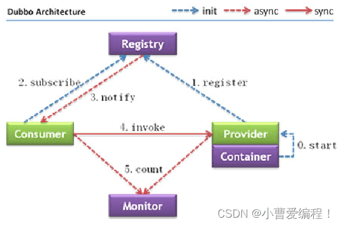

--SOA架构

‍

‍

Dubbo是阿里巴巴公司开源的一个高性能、轻量级的 Java RPC 框架

致力于提供高性能和透明化的 RPC 远程服务调用方案，以及 SOA 服务治理方案

[官网](http://dubbo.apache.org)

‍

[Dubbo-CSDN博客](https://blog.csdn.net/weixin_62993347/article/details/128421022)

‍

‍

## 架构图

‍

​​

‍

‍

### 过程

0：start，服务提供者要启动

1：register，服务提供者启动后会将服务注册到注册中心

2：subscribe，服务消费方需要去注册中心发现服务，得到服务提供方注册的服务的ip、端口、服务调用地址。

3：notify机制、要一次给一次

4：invoke，服务消费方已经拿到服务了，rpc过程，去调用服务，dubbo内部自动实现

5：count，管理部署、服务监控、统计服务的调用次数和调用时间的监控中心

‍

### 不同颜色线区别

* init：初始化
* async：异步
* sync：同步

‍

### 节点角色说明

* Provider：暴露服务的服务提供方
* Container：服务运行容器
* Consumer：调用远程服务的服务消费方
* Registry：服务注册与发现的注册中心
* Monitor：统计服务的调用次数和调用时间的监控中心（管理者）

‍

‍

## Zookeeper

Dubbo官方推荐使用Zookeeper作为注册中心

‍

实现步骤：

1. 创建服务提供者Provider模块
2. 创建服务消费者Consumer模块
3. 在服务提供者模块编写 UserServiceImpl 提供服务
4. 在服务消费者中的 UserController 远程调用UserServiceImpl 提供的服务
5. 分别启动两个服务，测试

‍

‍

## dubbo-admin

dubbo-admin 管理平台，是图形化的服务管理页面  
从注册中心中获取到所有的提供者 / 消费者进行配置管理  
路由规则、动态配置、服务降级、访问控制、权重调整、负载均衡等管理功能  
 dubbo-admin 是一个前后端分离的项目。前端使用vue，后端使用springboot  
安装 dubbo-admin 其实就是部署该项目

‍
