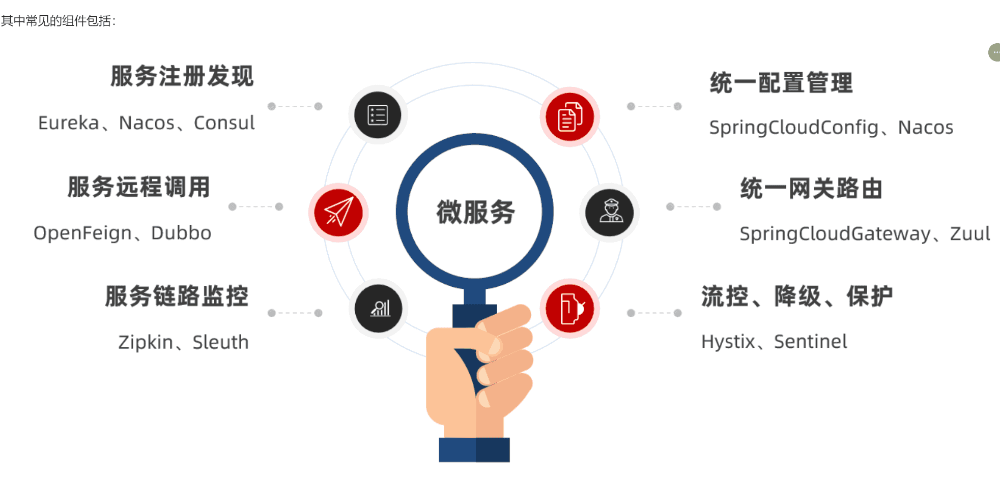
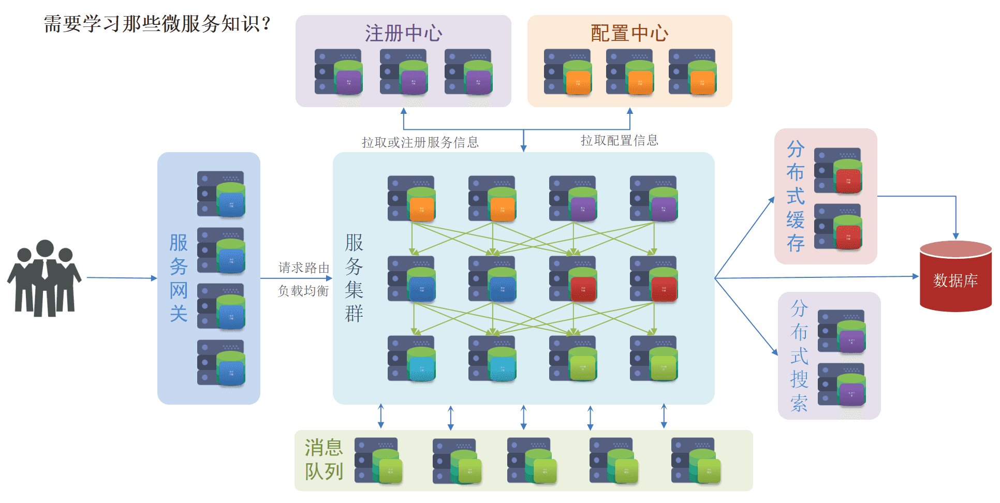
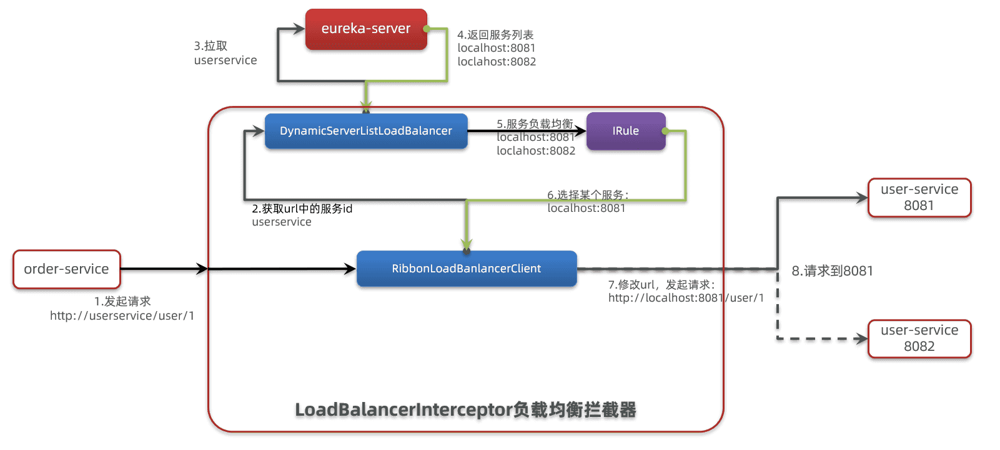

‍

‍

## 架构类型

‍

当项目规模较小时，这种模式上手快，部署、运维也都很方便，因此早期很多小型项目都采用这种模式。

但随着项目的业务规模越来越大，团队开发人员也不断增加，单体架构就呈现出越来越多的问题：

* **团队协作成本高**：试想一下，你们团队数十个人同时协作开发同一个项目，由于所有模块都在一个项目中，不同模块的代码之间物理边界越来越模糊。最终要把功能合并到一个分支，你绝对会陷入到解决冲突的泥潭之中。
* **系统发布效率低**：任何模块变更都需要发布整个系统，而系统发布过程中需要多个模块之间制约较多，需要对比各种文件，任何一处出现问题都会导致发布失败，往往一次发布需要数十分钟甚至数小时。
* **系统可用性差**：单体架构各个功能模块是作为一个服务部署，相互之间会互相影响，一些热点功能会耗尽系统资源，导致其它服务低可用。

‍

* **单体架构**：将业务的所有功能集中在一个项目中开发，打成一个包部署

  **优点：**

  * 架构简单
  * 部署成本低

  **缺点：**

  * 耦合度高（维护困难、升级困难）
* **分布式架构**：根据业务功能对系统做拆分，每个业务功能模块作为独立项目开发，称为一个服务。

  **优点：**

  * 降低服务耦合
  * 有利于服务升级和拓展

  **缺点：**

  * 服务调用关系错综复杂

‍

‍

如果进一步提高`/hi`​这个接口的并发，最终会发现`/search/list`​接口的请求响应速度会越来越慢。

可见，单体架构的可用性是比较差的，功能之间相互影响比较大。

当然，有同学会说我们可以做水平扩展。

此时如果我们对系统做水平扩展，增加更多机器，资源还是会被这样的热点接口占用，从而影响到其它接口，并不能从根本上解决问题。这也就是单体架构的扩展性差的一个原因。

而要想解决这些问题，就需要使用微服务架构了。

‍

‍

‍

分布式架构虽然降低了服务耦合，但是服务拆分时也有很多问题需要思考：

* 服务拆分的粒度如何界定？
* 服务之间如何调用？
* 服务的调用关系如何管理？

人们需要制定一套行之有效的标准来约束分布式架构。

‍

‍

### 微服务

微服务的架构特征：

* 单一职责：微服务拆分粒度更小，每一个服务都对应唯一的业务能力，做到单一职责
* 自治：团队独立、技术独立、数据独立，独立部署和交付
* 面向服务：服务提供统一标准的接口，与语言和技术无关
* 隔离性强：服务调用做好隔离、容错、降级，避免出现级联问题

‍

用户 -> 网关 -| 各类服务

其实是在给分布式架构制定一个标准，进一步降低服务之间的耦合度，提供服务的独立性和灵活性。做到高内聚，低耦合。

因此，可以认为**微服务**是一种经过良好架构设计的**分布式架构方案** 。

‍

微服务架构，首先是服务化，就是将单体架构中的功能模块从单体应用中拆分出来，独立部署为多个服务。同时要满足下面的一些特点：

* **单一职责**：一个微服务负责一部分业务功能，并且其核心数据不依赖于其它模块。
* **团队自治**：每个微服务都有自己独立的开发、测试、发布、运维人员，团队人员规模不超过10人（2张披萨能喂饱）
* **服务自治**：每个微服务都独立打包部署，访问自己独立的数据库。并且要做好服务隔离，避免对其它服务产生影响

‍

那么，单体架构存在的问题有没有解决呢？

* 团队协作成本高？

  * 由于服务拆分，每个服务代码量大大减少，参与开发的后台人员在1~3名，协作成本大大降低
* 系统发布效率低？

  * 每个服务都是独立部署，当有某个服务有代码变更时，只需要打包部署该服务即可
* 系统可用性差？

  * 每个服务独立部署，并且做好服务隔离，使用自己的服务器资源，不会影响到其它服务。

综上所述，微服务架构解决了单体架构存在的问题，特别适合大型互联网项目的开发，因此被各大互联网公司普遍采用。大家以前可能听说过分布式架构，分布式就是服务拆分的过程，其实微服务架构正式分布式架构的一种最佳实践的方案。

‍

‍

当然，微服务架构虽然能解决单体架构的各种问题，但在拆分的过程中，还会面临很多其它问题。比如：

* 如果出现跨服务的业务该如何处理？
* 页面请求到底该访问哪个服务？
* 如何实现各个服务之间的服务隔离？

‍

‍

### SpringCloud

**分布式架构方案**该怎么落地？选用什么样的技术栈？全球的互联网公司都在积极尝试自己的微服务落地方案。

其中在Java领域最引人注目的就是SpringCloud提供的方案了。

SpringCloud是目前国内使用最广泛的微服务框架。官网地址：[https://spring.io/projects/spring-cloud。](https://spring.io/projects/spring-cloud%E3%80%82)

SpringCloud集成了各种微服务功能组件，并基于SpringBoot实现了这些组件的自动装配，从而提供了良好的开箱即用体验。

SpringCloud底层是依赖于SpringBoot的，并且有版本的兼容关系

‍

‍

### 总结

* 单体架构：简单方便，高度耦合，扩展性差，适合小型项目。例如：学生管理系统
* 分布式架构：松耦合，扩展性好，但架构复杂，难度大。适合大型互联网项目，例如：京东、淘宝
* 微服务：一种良好的分布式架构方案  
  ①优点：拆分粒度更小、服务更独立、耦合度更低  
  ②缺点：架构非常复杂，运维、监控、部署难度提高
* SpringCloud是微服务架构的一站式解决方案，集成了各种优秀微服务功能组件

‍

​​

‍

​​

‍

## 搭建

[Spring Boot 3 整合 Spring Cloud 开发微服务应用 - spring 中文网 (springdoc.cn)](https://springdoc.cn/microservices-with-spring-boot-3-and-spring-cloud/)

[快速开始-阿里云Spring Cloud Alibaba官网 (aliyun.com)](https://sca.aliyun.com/docs/2023/user-guide/nacos/quick-start/)

‍

## 服务拆分

任何分布式架构都离不开服务的拆分，微服务也是一样。

‍

‍

### 原则

这里我总结了微服务拆分时的几个原则：

‍

* 不同微服务，不要重复开发相同业务
* 微服务数据独立，不要访问其它微服务的数据库
* 微服务可以将自己的业务暴露为接口，供其它微服务调用

‍

‍

#### 作法

‍

之前我们说过，微服务拆分时**粒度要小**，这其实是拆分的目标。具体可以从两个角度来分析：

* **高内聚**：每个微服务的职责要尽量单一，包含的业务相互关联度高、完整度高。
* **低耦合**：每个微服务的功能要相对独立，尽量减少对其它微服务的依赖，或者依赖接口的稳定性要强。

‍

**高内聚**首先是**单一职责，** 但不能说一个微服务就一个接口，而是要保证微服务内部业务的完整性为前提。目标是当我们要修改某个业务时，最好就只修改当前微服务，这样变更的成本更低。

‍

一旦微服务做到了高内聚，那么服务之间的**耦合度**自然就降低了。

当然，微服务之间不可避免的会有或多或少的业务交互，比如下单时需要查询商品数据。这个时候我们不能在订单服务直接查询商品数据库，否则就导致了数据耦合。而应该由商品服务对应暴露接口，并且一定要保证微服务对外**接口的稳定性**（即：尽量保证接口外观不变）。虽然出现了服务间调用，但此时无论你如何在商品服务做内部修改，都不会影响到订单微服务，服务间的耦合度就降低了。

‍

明确了拆分目标，接下来就是拆分方式了。我们在做服务拆分时一般有两种方式：

* **纵向**拆分
* **横向**拆分

所谓**纵向拆分**，就是按照项目的功能模块来拆分。例如黑马商城中，就有用户管理功能、订单管理功能、购物车功能、商品管理功能、支付功能等。那么按照功能模块将他们拆分为一个个服务，就属于纵向拆分。这种拆分模式可以尽可能提高服务的内聚性。

而**横向拆分**，是看各个功能模块之间有没有公共的业务部分，如果有将其抽取出来作为通用服务。例如用户登录是需要发送消息通知，记录风控数据，下单时也要发送短信，记录风控数据。因此消息发送、风控数据记录就是通用的业务功能，因此可以将他们分别抽取为公共服务：消息中心服务、风控管理服务。这样可以提高业务的复用性，避免重复开发。同时通用业务一般接口稳定性较强，也不会使服务之间过分耦合。

‍

当然，由于黑马商城并不是一个完整的项目，其中的短信发送、风控管理并没有实现，这里就不再考虑了。而其它的业务按照纵向拆分，可以分为以下几个微服务：

* 用户服务
* 商品服务
* 订单服务
* 购物车服务
* 支付服务

‍

‍

### 示例 -demo项目

‍

递归调用服务模块

> 在order-service中 向user-service发起一个http的请求，调用[http://localhost:8081/user/{userId}这个接口](http://localhost:8081/user/%7BuserId%7D%E8%BF%99%E4%B8%AA%E6%8E%A5%E5%8F%A3%E3%80%82)

‍

‍

* 注册一个RestTemplate的实例到Spring容器

  在启动类注入

  ```java
    @Bean
      public RestTemplate restTemplate() {
          return new RestTemplate();
      }
  ```
* 修改order-service服务中的OrderService类中的queryOrderById方法，根据Order对象中的userId查询User
* 将查询的User填充到Order对象，一起返回

‍

‍

### 拆分购物车、商品服务

接下来，我们先把商品管理功能、购物车功能抽取为两个独立服务

‍

一般微服务项目有两种不同的工程结构：

* 完全解耦：每一个微服务都创建为一个独立的工程，甚至可以使用不同的开发语言来开发，项目完全解耦。

  * 优点：服务之间耦合度低
  * 缺点：每个项目都有自己的独立仓库，管理起来比较麻烦
* **Maven聚合**：整个项目为一个Project，然后每个微服务是其中的一个Module

  * 优点：项目代码集中，管理和运维方便（授课也方便）
  * 缺点：服务之间耦合，编译时间较长
  * > 还是推荐这个
    >

‍

‍

### 提供者与消费者

在服务调用关系中，会有两个不同的角色(相对于业务而言)

**服务提供者**：一次业务中，被其它微服务调用的服务。（提供接口给其它微服务）

**服务消费者**：一次业务中，调用其它微服务的服务。（调用其它微服务提供的接口）

‍

‍

‍

‍

‍

‍

## Ribbon

负载均衡

SpringCloud Ribbon 的底层采用了一个拦截器，拦截了 RestTemplate 发出的请求，对地址做了修改

‍

‍

​​

‍

逻辑

* 1.发起请求  
  http://userservice/user/1
* 2.获取url中的服务id  
  userservice
* 3.拉取  
  userservice
* 4.返回服务列表  
  localhost:8081  
  loclahost:8082
* 5.服务负载均衡
* 6.选择某个服务
* 7.修改url，发起请求
* 8.请求到8081

‍

基本流程

* 拦截我们的 RestTemplate 请求 http://userservice/user/1
* RibbonLoadBalancerClient 会从请求 url 中获取服务名称，也就是 user-service
* DynamicServerListLoadBalancer 根据 user-service 到 eureka 拉取服务列表
* eureka 返回列表，localhost:8081、localhost:8082
* IRule 利用内置负载均衡规则，从列表中选择一个，例如 localhost:8081
* RibbonLoadBalancerClient 修改请求地址，用 localhost:8081 替代 userservice，得到 http://localhost:8081/user/1，发起真实请求

‍

### 负载均衡策略

‍

#### 自带实现

负载均衡的规则都定义在 IRule 接口中，而 IRule 有很多不同的实现类

‍

不同规则的含义如下：

|**内置负载均衡规则类**|**规则描述**|
| ---------------------------| -------------------------------------------------------------------------------------------------------------------------------------------------------------------------------------------------------------------------------------------------------------------------------------------------------------------------------------------------------------------------------------|
|RoundRobinRule|简单轮询服务列表来选择服务器。它是 Ribbon 默认的负载均衡规则。|
|AvailabilityFilteringRule|对以下两种服务器进行忽略： （1）在默认情况下，这台服务器如果 3 次连接失败，这台服务器就会被设置为“短路”状态。短路状态将持续 30 秒，如果再次连接失败，短路的持续时间就会几何级地增加。 （2）并发数过高的服务器。如果一个服务器的并发连接数过高，配置了 AvailabilityFilteringRule 规则的客户端也会将其忽略。并发连接数的上限，可以由客户端的..ActiveConnectionsLimit 属性进行配置。|
|WeightedResponseTimeRule|为每一个服务器赋予一个权重值。服务器响应时间越长，这个服务器的权重就越小。这个规则会随机选择服务器，这个权重值会影响服务器的选择。|
|**ZoneAvoidanceRule**|以区域可用的服务器为基础进行服务器的选择。使用 Zone 对服务器进行分类，这个 Zone 可以理解为一个机房、一个机架等。而后再对 Zone 内的多个服务做轮询。|
|BestAvailableRule|忽略那些短路的服务器，并选择并发数较低的服务器。|
|RandomRule|随机选择一个可用的服务器。|
|RetryRule|重试机制的选择逻辑|

默认的实现就是 ZoneAvoidanceRule，是一种轮询方案

‍

#### 自定义负载均衡策略

通过定义 IRule 实现可以修改负载均衡规则，有两种方式：

‍

1. 代码方式：在 order-service 中的 OrderApplication 类中，定义一个新的 IRule：

本模块的全局配置

```java
@Bean
public IRule randomRule(){
    return new RandomRule();
}
```

‍

2. 配置文件方式：在 order-service 的 application.yml 文件中，添加新的配置也可以修改规则：

可以给特定服务配置

```yaml
userservice: # 给某个微服务配置负载均衡规则，这里是userservice服务
  ribbon:
    NFLoadBalancerRuleClassName: com.netflix.loadbalancer.RandomRule # 负载均衡规则
```

> **注意**，一般用默认的负载均衡规则，不做修改。

‍

‍

### 饥饿加载

Ribbon 默认是采用懒加载，即第一次访问时才会去创建 LoadBalanceClient，请求时间会很长

‍

而饥饿加载则会在项目启动时创建，降低第一次访问的耗时，通过下面配置开启

```yaml
ribbon:
  eager-load:
    enabled: true
    clients: userservice
```

‍

‍
