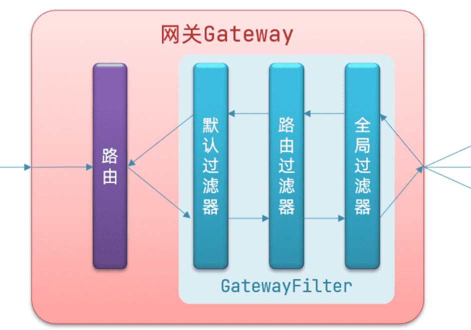
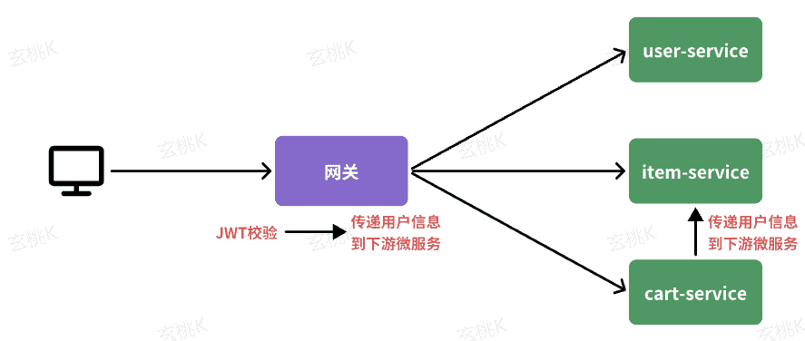
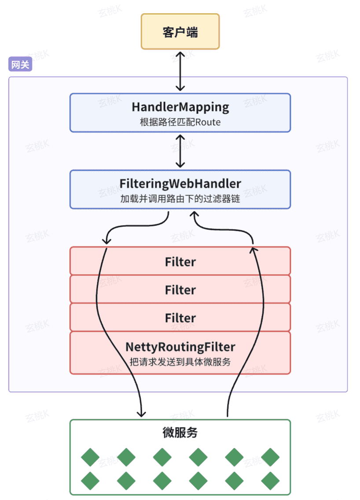
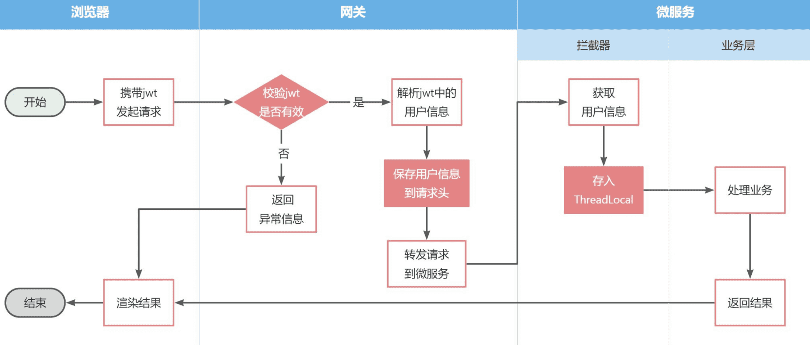
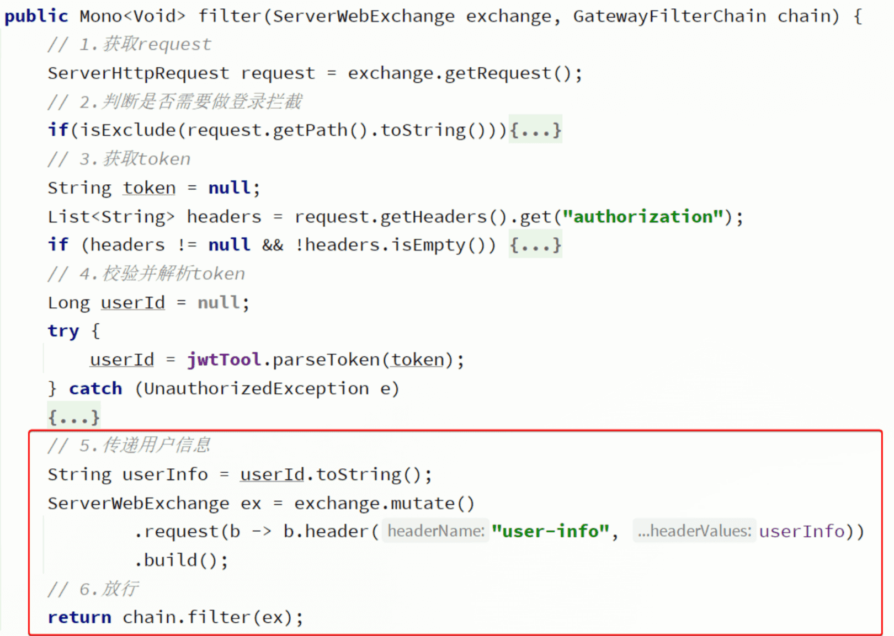

‍

Spring Cloud Gateway 是 Spring Cloud 的一个全新项目，该项目是基于 Spring 5.0，Spring Boot 2.0 和 Project Reactor 等响应式编程和事件流技术开发的网关，它旨在为微服务架构提供一种简单有效的统一的 API 路由管理方式。

‍

‍

### 概念

Gateway 网关是我们服务的守门神，所有微服务的统一入口。

网关的**核心功能特性**：

* 请求路由
* 权限控制
* 限流

‍

**权限控制**：网关作为微服务入口，需要校验用户是是否有请求资格，如果没有则进行拦截。

**路由和负载均衡**：一切请求都必须先经过 gateway，但网关不处理业务，而是根据某种规则，把请求转发到某个微服务，这个过程叫做路由。当然路由的目标服务有多个时，还需要做负载均衡。

**限流**：当请求流量过高时，在网关中按照下流的微服务能够接受的速度来放行请求，避免服务压力过大。

在 SpringCloud 中网关的实现包括两种：

* gateway
* zuul

Zuul 是基于 Servlet 的实现，属于阻塞式编程。而 SpringCloudGateway 则是基于 Spring5 中提供的 WebFlux，属于响应式编程的实现，具备更好的性能。

‍

‍

### 快速入门

下面，我们就演示下网关的基本路由功能。基本步骤如下：

1. 创建 SpringBoot 工程 gateway，引入网关依赖
2. 编写启动类
3. 编写基础配置和路由规则
4. 启动网关服务进行测试

‍

‍

#### 创建 gateway 服务，引入依赖

创建一个新的module，命名为hm-gateway，作为网关微服务：

‍

引入依赖：

```xml
<!--网关-->
<dependency>
    <groupId>org.springframework.cloud</groupId>
    <artifactId>spring-cloud-starter-gateway</artifactId>
</dependency>
<!--nacos服务发现依赖-->
<dependency>
    <groupId>com.alibaba.cloud</groupId>
    <artifactId>spring-cloud-starter-alibaba-nacos-discovery</artifactId>
</dependency>
 <!--负载均衡-->
        <dependency>
            <groupId>org.springframework.cloud</groupId>
            <artifactId>spring-cloud-starter-loadbalancer</artifactId>
        </dependency>
```

‍

#### 配置路由

创建 application.yml 文件，内容如下：

```yaml
server:
  port: 10010 # 网关端口
spring:
  application:
    name: gateway # 服务名称
  cloud:
    nacos:
      server-addr: localhost:8848 # nacos地址
    gateway:
      routes: # 网关路由配置
        - id: user-service # 路由id，自定义，只要唯一即可
          # uri: http://127.0.0.1:8081 # 路由的目标地址 http就是固定地址
          uri: lb://userservice # 路由的目标地址 lb就是负载均衡，后面跟服务名称
          predicates: # 路由断言，也就是判断请求是否符合路由规则的条件
            - Path=/user/** # 这个是按照路径匹配，只要以/user/开头就符合要求

          - id: cart
          uri: lb://cart-service
          predicates:
            - Path=/carts/**
        - id: user
          uri: lb://user-service
          predicates:
            - Path=/users/**,/addresses/**
        - id: trade
          uri: lb://trade-service
          predicates:
            - Path=/orders/**
        - id: pay
          uri: lb://pay-service
          predicates:
            - Path=/pay-orders/**
```

‍

```java
routes: # 网关路由配置
        - id: user-service # 路由id，自定义，只要唯一即可
          # uri: http://127.0.0.1:8081 # 路由的目标地址 http就是固定地址
          uri: lb://userservice # 路由的目标地址 lb就是负载均衡，后面跟服务名称
          predicates: # 路由断言，也就是判断请求是否符合路由规则的条件
            - Path=/user/** # 这个是按照路径匹配，只要以/user/开头就符合要求
```

四个属性含义如下：

* ​`id`​：路由的唯一标示
* ​`predicates`​：路由断言，其实就是匹配条件
* ​`filters`​：路由过滤条件，后面讲
* ​`uri`​：路由目标地址，`lb://`​代表负载均衡，从注册中心获取目标微服务的实例列表，并且负载均衡选择一个访问。

‍

本例中，我们将 `/user/**`​开头的请求，代理到`lb://userservice`​，lb 是负载均衡，根据服务名拉取服务列表，实现负载均衡

> 剩下的其他参考

重启网关，访问 [http://localhost:10010/user/1](http://localhost:10010/user/1) 时，符合`/user/**`​规则，请求转发到 uri：[http://userservice/user/1](http://userservice/user/1%EF%BC%8C%E5%BE%97%E5%88%B0%E4%BA%86%E7%BB%93%E6%9E%9C%EF%BC%9A)

‍

‍

‍

#### 网关路由的流程图

整个访问的流程如下：

‍

1. 路由规则判断
2. 从nacos注册中心拉取服务列表(先要完成服务注册和发现)
3. 负载均衡发送请求

‍

‍

总结：

网关搭建步骤：

1. 创建项目，引入 nacos 服务发现和 gateway 依赖
2. 配置 application.yml，包括服务基本信息、nacos 地址、路由

路由配置包括：

1. 路由 id：路由的唯一标示
2. 路由目标（uri）：路由的目标地址，http 代表固定地址，lb 代表根据服务名负载均衡
3. 路由断言（predicates）：判断路由的规则，
4. 路由过滤器（filters）：对请求或响应做处理

接下来，就重点来学习路由断言和路由过滤器的详细知识

‍

‍

‍

### 断言工厂

我们在配置文件中写的断言规则只是字符串，这些字符串会被 Predicate Factory 读取并处理，转变为路由判断的条件

例如 Path=/user/**是按照路径匹配，这个规则是由

​`org.springframework.cloud.gateway.handler.predicate.PathRoutePredicateFactory`​类来

处理的，像这样的断言工厂在 SpringCloudGateway 还有十几个:

|**名称**|**说明**|**示例**|
| ------------| ---------------------------------| ------------------------------------------------------------------------------------------------------------|
|After|是某个时间点后的请求|- After\=2037-01-20T17:42:47.789-07:00[America/Denver]|
|Before|是某个时间点之前的请求|- Before\=2031-04-13T15:14:47.433+08:00[Asia/Shanghai]|
|Between|是某两个时间点之前的请求|- Between\=2037-01-20T17:42:47.789-07:00[America/Denver], 2037-01-21T17:42:47.789-07:00[America/Denver]|
|Cookie|请求必须包含某些 cookie|- Cookie\=chocolate, ch.p|
|Header|请求必须包含某些 header|- Header\=X-Request-Id, \\d+|
|Host|请求必须是访问某个 host（域名）|- Host\= **.somehost.org,** .anotherhost.org|
|Method|请求方式必须是指定方式|- Method\=GET,POST|
|Path|请求路径必须符合指定规则|- Path\=/red/{segment},/blue/\*\*|
|Query|请求参数必须包含指定参数|- Query\=name, Jack 或者- Query\=name|
|RemoteAddr|请求者的 ip 必须是指定范围|- RemoteAddr\=192.168.1.1/24|
|Weight|权重处理||

我们只需要掌握 Path 这种路由工程就可以了。

‍

‍

### 过滤器工厂

GatewayFilter 是网关中提供的一种过滤器，可以对进入网关的请求和微服务返回的响应做处理：

‍

‍

#### 路由过滤器的种类

Spring 提供了 31 种不同的路由过滤器工厂。例如：

|**名称**|**说明**|
| ----------------------| ------------------------------|
|AddRequestHeader|给当前请求添加一个请求头|
|RemoveRequestHeader|移除请求中的一个请求头|
|AddResponseHeader|给响应结果中添加一个响应头|
|RemoveResponseHeader|从响应结果中移除有一个响应头|
|RequestRateLimiter|限制请求的流量|

‍

#### 请求头过滤器

AddRequestHeader 为例来讲解。

> **需求**：给所有进入 userservice 的请求添加一个请求头：Truth=itcast is freaking awesome!

只需要修改 gateway 服务的 application.yml 文件，添加路由过滤即可：

```yaml
spring:
  cloud:
    gateway:
      routes:
        - id: user-service
          uri: lb://userservice
          predicates:
            - Path=/user/**
          filters: # 过滤器
            - AddRequestHeader=Truth, Itcast is freaking awesome! # 添加请求头
```

当前过滤器写在 userservice 路由下，因此仅仅对访问 userservice 的请求有效。

‍

#### 默认过滤器

如果要对所有的路由都生效，则可以将过滤器工厂写到 default 下。格式如下：

```yaml
spring:
  cloud:
    gateway:
      routes:
        - id: user-service
          uri: lb://userservice
          predicates:
            - Path=/user/**
      default-filters: # 默认过滤项
        - AddRequestHeader=Truth, Itcast is freaking awesome!
```

‍

#### 总结

过滤器的作用是什么？

① 对路由的请求或响应做加工处理，比如添加请求头

② 配置在路由下的过滤器只对当前路由的请求生效

defaultFilters 的作用是什么？

① 对所有路由都生效的过滤器

‍

‍

### 全局过滤器

上一节学习的过滤器，网关提供了 31 种，但每一种过滤器的作用都是固定的。如果我们希望拦截请求，做自己的业务逻辑则没办法实现。

‍

‍

#### 全局过滤器作用

全局过滤器的作用也是处理一切进入网关的请求和微服务响应，与 GatewayFilter 的作用一样。区别在于 GatewayFilter 通过配置定义，处理逻辑是固定的；而 GlobalFilter 的逻辑需要自己写代码实现。

定义方式是实现 GlobalFilter 接口。

```java
public interface GlobalFilter {
    /**
     *  处理当前请求，有必要的话通过{@link GatewayFilterChain}将请求交给下一个过滤器处理
     *
     * @param exchange 请求上下文，里面可以获取Request、Response等信息
     * @param chain 用来把请求委托给下一个过滤器
     * @return {@code Mono<Void>} 返回标示当前过滤器业务结束
     */
    Mono<Void> filter(ServerWebExchange exchange, GatewayFilterChain chain);
}
```

在 filter 中编写自定义逻辑，可以实现下列功能：

* 登录状态判断
* 权限校验
* 请求限流等

‍

#### 自定义全局过滤器

‍

需求：定义全局过滤器，拦截请求，判断请求的参数是否满足下面条件：

* 参数中是否有 authorization，
* authorization 参数值是否为 admin

如果同时满足则放行，否则拦截

‍

‍

实现：

在 gateway 中定义一个过滤器：

‍

```java


@Order(-1)
@Component
public class AuthorizeFilter implements GlobalFilter {

    @Override
    public Mono<Void> filter(ServerWebExchange exchange, GatewayFilterChain chain) {
        // 1.获取请求参数
        MultiValueMap<String, String> params = exchange.getRequest().getQueryParams();
        // 2.获取authorization参数
        String auth = params.getFirst("authorization");
        // 3.校验
        if ("admin".equals(auth)) {
            // 放行
            return chain.filter(exchange);
        }
        // 4.拦截
        // 4.1.禁止访问，设置状态码
        exchange.getResponse().setStatusCode(HttpStatus.FORBIDDEN);
        // 4.2.结束处理
        return exchange.getResponse().setComplete();
    }
}
```

‍

#### 过滤器执行顺序

请求进入网关会碰到三类过滤器：当前路由的过滤器、DefaultFilter、GlobalFilter

请求路由后，会将当前路由过滤器和 DefaultFilter、GlobalFilter，合并到一个过滤器链（集合）中，排序后依次执行每个过滤器

‍

排序的规则是什么呢？

​​

* 每一个过滤器都必须指定一个 int 类型的 order 值，**order 值越小，优先级越高，执行顺序越靠前**。
* GlobalFilter 通过实现 Ordered 接口，或者添加@Order 注解来指定 order 值，由我们自己指定
* 路由过滤器和 defaultFilter 的 order 由 Spring 指定，默认是按照声明顺序从 1 递增。
* 当过滤器的 order 值一样时，会按照 defaultFilter > 路由过滤器 > GlobalFilter 的顺序执行。

‍

‍

详细内容，可以查看源码：

​`org.springframework.cloud.gateway.route.RouteDefinitionRouteLocator#getFilters()`​方法是先加载 defaultFilters，然后再加载某个 route 的 filters，然后合并。

​`org.springframework.cloud.gateway.handler.FilteringWebHandler#handle()`​方法会加载全局过滤器，与前面的过滤器合并后根据 order 排序，组织过滤器链

‍

### 跨域问题

‍

#### 什么是跨域问题

跨域：域名不一致就是跨域，主要包括：

* 域名不同： [www.taobao.com](http://www.taobao.com/) 和 [www.taobao.org](http://www.taobao.org/) 和 [www.jd.com](http://www.jd.com/) 和 [miaosha.jd.com](http://miaosha.jd.com/)
* 域名相同，端口不同：localhost:8080 和 localhost8081

跨域问题：浏览器禁止请求的发起者与服务端发生跨域 ajax 请求，请求被浏览器拦截的问题

解决方案：CORS，这个以前应该学习过，这里不再赘述了。不知道的小伙伴可以查看[https://www.ruanyifeng.com/blog/2016/04/cors.html](https://www.ruanyifeng.com/blog/2016/04/cors.html)

‍

‍

#### 解决跨域问题

在 gateway 服务的 application.yml 文件中，添加下面的配置：

```yaml
spring:
  cloud:
    gateway:
      # 。。。
      globalcors: # 全局的跨域处理
        add-to-simple-url-handler-mapping: true # 解决options请求被拦截问题
        corsConfigurations:
          "[/**]":
            allowedOrigins: # 允许哪些网站的跨域请求
              - "http://localhost:8090"
            allowedMethods: # 允许的跨域ajax的请求方式
              - "GET"
              - "POST"
              - "DELETE"
              - "PUT"
              - "OPTIONS"
            allowedHeaders: "*" # 允许在请求中携带的头信息
            allowCredentials: true # 是否允许携带cookie
            maxAge: 360000 # 这次跨域检测的有效期
```

‍

‍

### 动态路由

网关的路由配置全部是在项目启动时由`org.springframework.cloud.gateway.route.CompositeRouteDefinitionLocator`​在项目启动的时候加载，并且一经加载就会缓存到内存中的路由表内（一个Map），不会改变也不会监听路由变更，所以，无法利用配置热更新来实现路由更新

‍

因此，我们必须监听Nacos的配置变更，然后手动把最新的路由更新到路由表中。这里有两个难点：

* 如何监听Nacos配置变更？
* 如何把路由信息更新到路由表？

‍

‍

#### 监听Nacos配置变更

在Nacos官网中给出了手动监听Nacos配置变更的[SDK](https://nacos.io/zh-cn/docs/sdk.html)

‍

‍

如果希望 Nacos 推送配置变更，可以使用 Nacos 动态监听配置接口来实现。

```Java
public void addListener(String dataId, String group, Listener listener)
```

‍

请求参数说明：

|**参数名**|**参数类型**|**描述**|
| ----------| ----------| -----------------------------------------------------------------------------------------------------|
|dataId|string|配置 ID，保证全局唯一性，只允许英文字符和 4 种特殊字符（"."、":"、"-"、"\_"）。不超过 256 字节。|
|group|string|配置分组，一般是默认的DEFAULT\_GROUP。|
|listener|Listener|监听器，配置变更进入监听器的回调函数。|

‍

示例代码：

```Java
String serverAddr = "{serverAddr}";
String dataId = "{dataId}";
String group = "{group}";
// 1.创建ConfigService，连接Nacos
Properties properties = new Properties();
properties.put("serverAddr", serverAddr);
ConfigService configService = NacosFactory.createConfigService(properties);
// 2.读取配置
String content = configService.getConfig(dataId, group, 5000);
// 3.添加配置监听器
configService.addListener(dataId, group, new Listener() {
        @Override
        public void receiveConfigInfo(String configInfo) {
        // 配置变更的通知处理
                System.out.println("recieve1:" + configInfo);
        }
        @Override
        public Executor getExecutor() {
                return null;
        }
});
```

这里核心的步骤有2步：

* 创建ConfigService，目的是连接到Nacos
* 添加配置监听器，编写配置变更的通知处理逻辑

‍

##### 创建ConfigService

‍

由于我们采用了`spring-cloud-starter-alibaba-nacos-config`​自动装配，因此`ConfigService`​已经在`com.alibaba.cloud.nacos.NacosConfigAutoConfiguration`​中自动创建好了

‍

NacosConfigManager中是负责管理Nacos的ConfigService的，

因此，只要我们拿到`NacosConfigManager`​就等于拿到了`ConfigService`​

‍

‍

##### 编写监听器

虽然官方提供的SDK是ConfigService中的addListener，不过项目第一次启动时不仅仅需要添加监听器，也需要读取配置，因此建议使用的API是这个：

```Java
String getConfigAndSignListener(
    String dataId, // 配置文件id
    String group, // 配置组，走默认
    long timeoutMs, // 读取配置的超时时间
    Listener listener // 监听器
) throws NacosException;
```

既可以配置监听器，并且会根据dataId和group读取配置并返回。我们就可以在项目启动时先更新一次路由，后续随着配置变更通知到监听器，完成路由更新。

‍

‍

#### 更新路由

更新路由要用到`org.springframework.cloud.gateway.route.RouteDefinitionWriter`​这个接口

```Java
package org.springframework.cloud.gateway.route;

import reactor.core.publisher.Mono;

/**
 * @author Spencer Gibb
 */
public interface RouteDefinitionWriter {
        /**
     * 更新路由到路由表，如果路由id重复，则会覆盖旧的路由
     */
        Mono<Void> save(Mono<RouteDefinition> route);
        /**
     * 根据路由id删除某个路由
     */
        Mono<Void> delete(Mono<String> routeId);

}
```

这里更新的路由，也就是RouteDefinition，之前我们见过，包含下列常见字段：

* id：路由id
* predicates：路由匹配规则
* filters：路由过滤器
* uri：路由目的地

‍

将来我们保存到Nacos的配置也要符合这个对象结构，将来我们以JSON来保存，格式如下：

```JSON
{
  "id": "item",
  "predicates": [{
    "name": "Path",
    "args": {"_genkey_0":"/items/**", "_genkey_1":"/search/**"}
  }],
  "filters": [],
  "uri": "lb://item-service"
}
```

以上JSON配置就等同于：

```YAML
spring:
  cloud:
    gateway:
      routes:
        - id: item
          uri: lb://item-service
          predicates:
            - Path=/items/**,/search/**
```

OK，我们所需要用到的SDK已经齐全了。

‍

‍

#### 实现动态路由

首先， 我们在网关gateway引入依赖：

```XML
<!--统一配置管理-->
<dependency>
    <groupId>com.alibaba.cloud</groupId>
    <artifactId>spring-cloud-starter-alibaba-nacos-config</artifactId>
</dependency>
<!--加载bootstrap-->
<dependency>
    <groupId>org.springframework.cloud</groupId>
    <artifactId>spring-cloud-starter-bootstrap</artifactId>
</dependency>
```

‍

然后在网关`gateway`​的`resources`​目录创建`bootstrap.yaml`​文件，内容如下：

```YAML
spring:
  application:
    name: gateway
  cloud:
    nacos:
      server-addr: 192.168.150.101
      config:
        file-extension: yaml
        shared-configs:
          - dataId: shared-log.yaml # 共享日志配置
```

接着，修改`gateway`​的`resources`​目录下的`application.yml`​，把之前的路由移除，最终内容如下：

```YAML
server:
  port: 8080 # 端口
hm:
  jwt:
    location: classpath:hmall.jks # 秘钥地址
    alias: hmall # 秘钥别名
    password: hmall123 # 秘钥文件密码
    tokenTTL: 30m # 登录有效期
  auth:
    excludePaths: # 无需登录校验的路径
      - /search/**
      - /users/login
      - /items/**
```

然后，在`gateway`​中定义配置监听器：

```Java
package com.hmall.gateway.route;

@Slf4j
@Component
@RequiredArgsConstructor
public class DynamicRouteLoader {

    private final RouteDefinitionWriter writer;
    private final NacosConfigManager nacosConfigManager;

    // 路由配置文件的id和分组
    private final String dataId = "gateway-routes.json";
    private final String group = "DEFAULT_GROUP";
    // 保存更新过的路由id
    private final Set<String> routeIds = new HashSet<>();

    @PostConstruct
    public void initRouteConfigListener() throws NacosException {
        // 1.注册监听器并首次拉取配置
        String configInfo = nacosConfigManager.getConfigService()
                .getConfigAndSignListener(dataId, group, 5000, new Listener() {
                    @Override
                    public Executor getExecutor() {
                        return null;
                    }

                    @Override
                    public void receiveConfigInfo(String configInfo) {
                        updateConfigInfo(configInfo);
                    }
                });
        // 2.首次启动时，更新一次配置
        updateConfigInfo(configInfo);
    }

    private void updateConfigInfo(String configInfo) {
        log.debug("监听到路由配置变更，{}", configInfo);
        // 1.反序列化
        List<RouteDefinition> routeDefinitions = JSONUtil.toList(configInfo, RouteDefinition.class);
        // 2.更新前先清空旧路由
        // 2.1.清除旧路由
        for (String routeId : routeIds) {
            writer.delete(Mono.just(routeId)).subscribe();
        }
        routeIds.clear();
        // 2.2.判断是否有新的路由要更新
        if (CollUtils.isEmpty(routeDefinitions)) {
            // 无新路由配置，直接结束
            return;
        }
        // 3.更新路由
        routeDefinitions.forEach(routeDefinition -> {
            // 3.1.更新路由
            writer.save(Mono.just(routeDefinition)).subscribe();
            // 3.2.记录路由id，方便将来删除
            routeIds.add(routeDefinition.getId());
        });
    }
}
```

‍

发现是404，无法访问。

‍

接下来，我们直接在Nacos控制台添加路由，路由文件名为`gateway-routes.json`​，类型为`json`​：

‍

配置内容如下：

```JSON
[
    {
        "id": "item",
        "predicates": [{
            "name": "Path",
            "args": {"_genkey_0":"/items/**", "_genkey_1":"/search/**"}
        }],
        "filters": [],
        "uri": "lb://item-service"
    },
    {
        "id": "cart",
        "predicates": [{
            "name": "Path",
            "args": {"_genkey_0":"/carts/**"}
        }],
        "filters": [],
        "uri": "lb://cart-service"
    },
    {
        "id": "user",
        "predicates": [{
            "name": "Path",
            "args": {"_genkey_0":"/users/**", "_genkey_1":"/addresses/**"}
        }],
        "filters": [],
        "uri": "lb://user-service"
    },
    {
        "id": "trade",
        "predicates": [{
            "name": "Path",
            "args": {"_genkey_0":"/orders/**"}
        }],
        "filters": [],
        "uri": "lb://trade-service"
    },
    {
        "id": "pay",
        "predicates": [{
            "name": "Path",
            "args": {"_genkey_0":"/pay-orders/**"}
        }],
        "filters": [],
        "uri": "lb://pay-service"
    }
]
```

‍

### 网关登录校验demo

‍

单体架构时我们只需要完成一次用户登录、身份校验，就可以在所有业务中获取到用户信息。而微服务拆分后，每个微服务都独立部署，不再共享数据。也就意味着每个微服务都需要做登录校验，这显然不可取。

‍

‍

#### 鉴权思路分析

我们的登录是基于JWT来实现的，校验JWT的算法复杂，而且需要用到秘钥。如果每个微服务都去做登录校验，这就存在着两大问题：

* 每个微服务都需要知道JWT的秘钥，不安全
* 每个微服务重复编写登录校验代码、权限校验代码，麻烦

‍

既然网关是所有微服务的入口，一切请求都需要先经过网关。我们完全可以把登录校验的工作放到网关去做，这样之前说的问题就解决了：

* 只需要在网关和用户服务保存秘钥
* 只需要在网关开发登录校验功能

此时，登录校验的流程如图：

​​

‍

不过，这里存在几个问题：

* 网关路由是配置的，请求转发是Gateway内部代码，我们如何在转发之前做登录校验？
* 网关校验JWT之后，如何将用户信息传递给微服务？
* 微服务之间也会相互调用，这种调用不经过网关，又该如何传递用户信息？

‍

这些问题将在接下来几节一一解决。

‍

‍

#### 网关过滤器

登录校验必须在请求转发到微服务之前做，否则就失去了意义。而网关的请求转发是`Gateway`​内部代码实现的，要想在请求转发之前做登录校验，就必须了解`Gateway`​内部工作的基本原理。

‍

​​

‍

‍

如图所示：

1. 客户端请求进入网关后由`HandlerMapping`​对请求做判断，找到与当前请求匹配的路由规则（**​`Route`​**​），然后将请求交给`WebHandler`​去处理。
2. ​`WebHandler`​则会加载当前路由下需要执行的过滤器链（**​`Filter chain`​**​），然后按照顺序逐一执行过滤器（后面称为**​`Filter`​**​）。
3. 图中`Filter`​被虚线分为左右两部分，是因为`Filter`​内部的逻辑分为`pre`​和`post`​两部分，分别会在请求路由到微服务**之前**和**之后**被执行。
4. 只有所有`Filter`​的`pre`​逻辑都依次顺序执行通过后，请求才会被路由到微服务。
5. 微服务返回结果后，再倒序执行`Filter`​的`post`​逻辑。
6. 最终把响应结果返回。

‍

如图中所示，最终请求转发是有一个名为`NettyRoutingFilter`​的过滤器来执行的，而且这个过滤器是整个过滤器链中顺序最靠后的一个。**如果我们能够定义一个过滤器，在其中实现登录校验逻辑，并且将过滤器执行顺序定义到**​**​`NettyRoutingFilter`​**​**之前**，这就符合我们的需求了！

‍

那么，该如何实现一个网关过滤器呢？

网关过滤器链中的过滤器有两种：

* ​**​`GatewayFilter`​**​：路由过滤器，作用范围比较灵活，可以是任意指定的路由`Route`​.
* ​**​`GlobalFilter`​**​：全局过滤器，作用范围是所有路由，不可配置。

‍

**注意**：过滤器链之外还有一种过滤器，HttpHeadersFilter，用来处理传递到下游微服务的请求头。例如org.springframework.cloud.gateway.filter.headers.XForwardedHeadersFilter可以传递代理请求原本的host头到下游微服务。

‍

其实`GatewayFilter`​和`GlobalFilter`​这两种过滤器的方法签名完全一致：

```Java
/**
 * 处理请求并将其传递给下一个过滤器
 * @param exchange 当前请求的上下文，其中包含request、response等各种数据
 * @param chain 过滤器链，基于它向下传递请求
 * @return 根据返回值标记当前请求是否被完成或拦截，chain.filter(exchange)就放行了。
 */
Mono<Void> filter(ServerWebExchange exchange, GatewayFilterChain chain);
```

​`FilteringWebHandler`​在处理请求时，会将`GlobalFilter`​装饰为`GatewayFilter`​，然后放到同一个过滤器链中，排序以后依次执行。

​`Gateway`​中内置了很多的`GatewayFilter`​，详情可以参考[官方文档](https://docs.spring.io/spring-cloud-gateway/docs/3.1.7/reference/html/#gatewayfilter-factories)：

‍

‍

​`Gateway`​内置的`GatewayFilter`​过滤器使用起来非常简单，无需编码，只要在yaml文件中简单配置即可。而且其作用范围也很灵活，配置在哪个`Route`​下，就作用于哪个`Route`​.

例如，有一个过滤器叫做`AddRequestHeaderGatewayFilterFacotry`​，顾明思议，就是添加请求头的过滤器，可以给请求添加一个请求头并传递到下游微服务。

‍

使用的使用只需要在application.yaml中这样配置：

```YAML
spring:
  cloud:
    gateway:

      routes:
      - id: test_route
        uri: lb://test-service
        predicates:
          -Path=/test/**

        filters:
          - AddRequestHeader=key, value # 逗号之前是请求头的key，逗号之后是value
```

‍

如果想要让过滤器作用于所有的路由，则可以这样配置：

```YAML
spring:
  cloud:
    gateway:

      default-filters: # default-filters下的过滤器可以作用于所有路由
        - AddRequestHeader=key, value

      routes:
      - id: test_route
        uri: lb://test-service
        predicates:
          -Path=/test/**
```

‍

‍

#### 自定义过滤器

无论是`GatewayFilter`​还是`GlobalFilter`​都支持自定义，只不过**编码**方式、**使用**方式略有差别。

‍

‍

##### 自定义GatewayFilter

自定义`GatewayFilter`​不是直接实现`GatewayFilter`​，而是实现`AbstractGatewayFilterFactory`​。最简单的方式是这样的：

```Java
@Component
public class PrintAnyGatewayFilterFactory extends AbstractGatewayFilterFactory<Object> {
    @Override
    public GatewayFilter apply(Object config) {
        return new GatewayFilter() {
            @Override
            public Mono<Void> filter(ServerWebExchange exchange, GatewayFilterChain chain) {
                // 获取请求
                ServerHttpRequest request = exchange.getRequest();
                // 编写过滤器逻辑
                System.out.println("过滤器执行了");
                // 放行
                return chain.filter(exchange);
            }
        };
    }
}
```

‍

**注意**：该类的名称一定要以`GatewayFilterFactory`​为后缀！

然后在yaml配置中这样使用：

```YAML
spring:
  cloud:
    gateway:
      default-filters:
            - PrintAny # 此处直接以自定义的GatewayFilterFactory类名称前缀类声明过滤器
```

‍

另外，这种过滤器还可以支持动态配置参数，不过实现起来比较复杂，示例：

```Java

@Component
public class PrintAnyGatewayFilterFactory // 父类泛型是内部类的Config类型
                extends AbstractGatewayFilterFactory<PrintAnyGatewayFilterFactory.Config> {

    @Override
    public GatewayFilter apply(Config config) {
        // OrderedGatewayFilter是GatewayFilter的子类，包含两个参数：
        // - GatewayFilter：过滤器
        // - int order值：值越小，过滤器执行优先级越高
        return new OrderedGatewayFilter(new GatewayFilter() {
            @Override
            public Mono<Void> filter(ServerWebExchange exchange, GatewayFilterChain chain) {
                // 获取config值
                String a = config.getA();
                String b = config.getB();
                String c = config.getC();
                // 编写过滤器逻辑
                System.out.println("a = " + a);
                System.out.println("b = " + b);
                System.out.println("c = " + c);
                // 放行
                return chain.filter(exchange);
            }
        }, 100);
    }

    // 自定义配置属性，成员变量名称很重要，下面会用到
    @Data
    static class Config{
        private String a;
        private String b;
        private String c;
    }
    // 将变量名称依次返回，顺序很重要，将来读取参数时需要按顺序获取
    @Override
    public List<String> shortcutFieldOrder() {
        return List.of("a", "b", "c");
    }
        // 返回当前配置类的类型，也就是内部的Config
    @Override
    public Class<Config> getConfigClass() {
        return Config.class;
    }

}
```

然后在yaml文件中使用：

```YAML
spring:
  cloud:
    gateway:
      default-filters:
            - PrintAny=1,2,3 # 注意，这里多个参数以","隔开，将来会按照shortcutFieldOrder()方法返回的参数顺序依次复制
```

上面这种配置方式参数必须严格按照shortcutFieldOrder()方法的返回参数名顺序来赋值。

还有一种用法，无需按照这个顺序，就是手动指定参数名：

```YAML
spring:
  cloud:
    gateway:
      default-filters:
            - name: PrintAny
              args: # 手动指定参数名，无需按照参数顺序
                a: 1
                b: 2
                c: 3
```

‍

‍

##### 自定义GlobalFilter

自定义GlobalFilter则简单很多，直接实现GlobalFilter即可，而且也无法设置动态参数：

```Java
@Component
public class PrintAnyGlobalFilter implements GlobalFilter, Ordered {
    @Override
    public Mono<Void> filter(ServerWebExchange exchange, GatewayFilterChain chain) {
        // 编写过滤器逻辑
        System.out.println("未登录，无法访问");
        // 放行
        // return chain.filter(exchange);

        // 拦截
        ServerHttpResponse response = exchange.getResponse();
        response.setRawStatusCode(401);
        return response.setComplete();
    }

    @Override
    public int getOrder() {
        // 过滤器执行顺序，值越小，优先级越高
        return 0;
    }
}
```

‍

‍

#### 登录校验

接下来，我们就利用自定义`GlobalFilter`​来完成登录校验。

‍

‍

##### JWT工具

登录校验需要用到JWT，而且JWT的加密需要秘钥和加密工具。这些在`hm-service`​中已经有了，我们直接拷贝过来：

‍

具体作用如下：

* ​`AuthProperties`​：配置登录校验需要拦截的路径，因为不是所有的路径都需要登录才能访问
* ​`JwtProperties`​：定义与JWT工具有关的属性，比如秘钥文件位置
* ​`SecurityConfig`​：工具的自动装配
* ​`JwtTool`​：JWT工具，其中包含了校验和解析`token`​的功能
* ​`hmall.jks`​：秘钥文件

其中`AuthProperties`​和`JwtProperties`​所需的属性要在`application.yaml`​中配置：

```YAML
hm:
  jwt:
    location: classpath:hmall.jks # 秘钥地址
    alias: hmall # 秘钥别名
    password: hmall123 # 秘钥文件密码
    tokenTTL: 30m # 登录有效期
  auth:
    excludePaths: # 无需登录校验的路径
      - /search/**
      - /users/login
      - /items/**
```

‍

‍

##### 登录校验过滤器

接下来，我们定义一个登录校验的过滤器：

```Java

@Component
@RequiredArgsConstructor
@EnableConfigurationProperties(AuthProperties.class)
public class AuthGlobalFilter implements GlobalFilter, Ordered {

    private final JwtTool jwtTool;

    private final AuthProperties authProperties;

    private final AntPathMatcher antPathMatcher = new AntPathMatcher();

    @Override
    public Mono<Void> filter(ServerWebExchange exchange, GatewayFilterChain chain) {
        // 1.获取Request
        ServerHttpRequest request = exchange.getRequest();
        // 2.判断是否不需要拦截
        if(isExclude(request.getPath().toString())){
            // 无需拦截，直接放行
            return chain.filter(exchange);
        }
        // 3.获取请求头中的token
        String token = null;
        List<String> headers = request.getHeaders().get("authorization");
        if (!CollUtils.isEmpty(headers)) {
            token = headers.get(0);
        }
        // 4.校验并解析token
        Long userId = null;
        try {
            userId = jwtTool.parseToken(token);
        } catch (UnauthorizedException e) {
            // 如果无效，拦截
            ServerHttpResponse response = exchange.getResponse();
            response.setRawStatusCode(401);
            return response.setComplete();
        }

        // TODO 5.如果有效，传递用户信息
        System.out.println("userId = " + userId);
        // 6.放行
        return chain.filter(exchange);
    }

    private boolean isExclude(String antPath) {
        for (String pathPattern : authProperties.getExcludePaths()) {
            if(antPathMatcher.match(pathPattern, antPath)){
                return true;
            }
        }
        return false;
    }

    @Override
    public int getOrder() {
        return 0;
    }
}
```

‍

‍

#### 微服务获取用户

现在，网关已经可以完成登录校验并获取登录用户身份信息。但是当网关将请求转发到微服务时，微服务又该如何获取用户身份呢？

由于网关发送请求到微服务依然采用的是`Http`​请求，因此我们可以将用户信息**以请求头的方式**传递到下游微服务。然后微服务可以从请求头中获取登录用户信息。

‍

考虑到微服务内部可能很多地方都需要用到登录用户信息，因此我们可以利用SpringMVC的拦截器来实现登录用户信息获取，并存入ThreadLocal，方便后续使用。

‍

据图流程图如下：

​​

因此，接下来我们要做的事情有：

* 改造网关过滤器，在获取用户信息后保存到请求头，转发到下游微服务
* 编写微服务拦截器，拦截请求获取用户信息，保存到ThreadLocal后放行

‍

##### 保存用户到请求头

首先，我们修改登录校验拦截器的处理逻辑，保存用户信息到请求头中：

​​

‍

‍

‍

##### 拦截器获取用户

在hm-common中已经有一个用于保存登录用户的ThreadLocal工具. 其中已经提供了保存和获取用户的方法

‍

接下来，我们只需要编写拦截器，获取用户信息并保存到`UserContext`​，然后放行即可。

‍

由于每个微服务都有获取登录用户的需求，因此拦截器我们直接写在`hm-common`​中，并写好自动装配。这样微服务只需要引入`hm-common`​就可以直接具备拦截器功能，无需重复编写。

我们在`hm-common`​模块下定义一个拦截器：

```Java


public class UserInfoInterceptor implements HandlerInterceptor {
    @Override
    public boolean preHandle(HttpServletRequest request, HttpServletResponse response, Object handler) throws Exception {
        // 1.获取请求头中的用户信息
        String userInfo = request.getHeader("user-info");
        // 2.判断是否为空
        if (StrUtil.isNotBlank(userInfo)) {
            // 不为空，保存到ThreadLocal
                UserContext.setUser(Long.valueOf(userInfo));
        }
        // 3.放行
        return true;
    }

    @Override
    public void afterCompletion(HttpServletRequest request, HttpServletResponse response, Object handler, Exception ex) throws Exception {
        // 移除用户
        UserContext.removeUser();
    }
}
```

‍

‍

接着在`hm-common`​模块下编写`SpringMVC`​的配置类，配置登录拦截器：

```Java

@Configuration
@ConditionalOnClass(DispatcherServlet.class)
public class MvcConfig implements WebMvcConfigurer {
    @Override
    public void addInterceptors(InterceptorRegistry registry) {
        registry.addInterceptor(new UserInfoInterceptor());
    }
}
```

不过，需要注意的是，这个配置类默认是不会生效的，因为它所在的包是`com.hmall.common.config`​，与其它微服务的扫描包不一致，无法被扫描到，因此无法生效。

‍

基于SpringBoot的自动装配原理，我们要将其添加到`resources`​目录下的`META-INF/spring.factories`​文件中：

```Properties
org.springframework.boot.autoconfigure.EnableAutoConfiguration=\
  com.hmall.common.config.MyBatisConfig,\
  com.hmall.common.config.MvcConfig
```

‍

‍

#### OpenFeign传递用户

前端发起的请求都会经过网关再到微服务，由于我们之前编写的过滤器和拦截器功能，微服务可以轻松获取登录用户信息。

‍

但有些业务是比较复杂的，请求到达微服务后还需要调用其它多个微服务。比如下单业务，下单的过程中，需要调用商品服务扣减库存，调用购物车服务清理用户购物车。而清理购物车时必须知道当前登录的用户身份。但是，**订单服务调用购物车时并没有传递用户信息**，购物车服务无法知道当前用户是谁！

由于微服务获取用户信息是通过拦截器在请求头中读取，因此要想实现微服务之间的用户信息传递，就**必须在微服务发起调用时把用户信息存入请求头**。

‍

微服务之间调用是基于OpenFeign来实现的，并不是我们自己发送的请求。我们如何才能让每一个由OpenFeign发起的请求自动携带登录用户信息呢？

这里要借助Feign中提供的一个拦截器接口：`feign.RequestInterceptor`​

```Java
public interface RequestInterceptor {

  /**
   * Called for every request. 
   * Add data using methods on the supplied {@link RequestTemplate}.
   */
  void apply(RequestTemplate template);
}
```

我们只需要实现这个接口，然后实现apply方法，利用`RequestTemplate`​类来添加请求头，将用户信息保存到请求头中。这样以来，每次OpenFeign发起请求的时候都会调用该方法，传递用户信息。

‍

‍

由于`FeignClient`​全部都是在`hm-api`​模块，因此我们在`hm-api`​模块的`com.hmall.api.config.DefaultFeignConfig`​中编写这个拦截器

添加一个Bean：

```Java
@Bean
public RequestInterceptor userInfoRequestInterceptor(){
    return new RequestInterceptor() {
        @Override
        public void apply(RequestTemplate template) {
            // 获取登录用户
            Long userId = UserContext.getUser();
            if(userId == null) {
                // 如果为空则直接跳过
                return;
            }
            // 如果不为空则放入请求头中，传递给下游微服务
            template.header("user-info", userId.toString());
        }
    };
}
```

这里user-info要在下游微服务的拦截器进行校验

‍

‍

‍

‍

‍

‍

‍

‍
