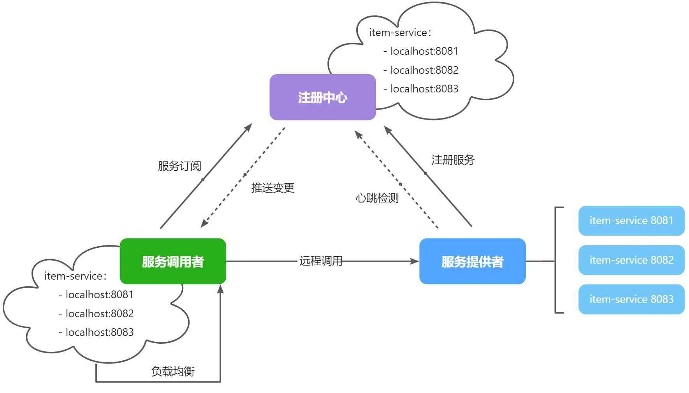

‍

SpringCloudAlibaba 也推出了一个名为 Nacos 的注册中心, 是当前主流, 替代eureka

‍

‍

在大型微服务项目中，服务提供者的数量会非常多，为了管理这些服务就引入了**注册中心**的概念。注册中心、服务提供者、服务消费者三者间关系如下：

‍

​​

‍

流程如下：

* 服务启动时就会注册自己的服务信息（服务名、IP、端口）到注册中心
* 调用者可以从注册中心订阅想要的服务，获取服务对应的实例列表（1个服务可能多实例部署）
* 调用者自己对实例列表负载均衡，挑选一个实例
* 调用者向该实例发起远程调用

‍

当服务提供者的实例宕机或者启动新实例时，调用者如何得知呢？

* 服务提供者会定期向注册中心发送请求，报告自己的健康状态（心跳请求）
* 当注册中心长时间收不到提供者的心跳时，会认为该实例宕机，将其从服务的实例列表中剔除
* 当服务有新实例启动时，会发送注册服务请求，其信息会被记录在注册中心的服务实例列表
* 当注册中心服务列表变更时，会主动通知微服务，更新本地服务列表

‍

‍

> 问题分析
>
> * order-service在发起远程调用的时候，该如何得知user-service实例的ip地址和端口？
> * 有多个user-service实例地址，order-service调用时该如何选择？
> * order-service如何得知某个user-service实例是否依然健康，是不是已经宕机？

‍

这些问题都可以通过统一的**配置管理器服务**解决。而Nacos不仅仅具备注册中心功能，也具备配置管理的功能：

‍

微服务共享的配置可以统一交给Nacos保存和管理，在Nacos控制台修改配置后，Nacos会将配置变更推送给相关的微服务，并且无需重启即可生效，实现配置热更新。

网关的路由同样是配置，因此同样可以基于这个功能实现动态路由功能，无需重启网关即可修改路由配置。

‍

‍

## 安装

见极意利克

‍

## 服务注册

把`item-service`​注册到Nacos，步骤如下：

* 引入依赖
* 配置Nacos地址
* 重启

‍

‍

‍

### 添加依赖

在`item-service`​的`pom.xml`​中添加依赖：

```XML
<!--nacos 服务注册发现-->
<dependency>
    <groupId>com.alibaba.cloud</groupId>
    <artifactId>spring-cloud-starter-alibaba-nacos-discovery</artifactId>
</dependency>
```

‍

### 配置Nacos

在`item-service`​的`application.yml`​中添加nacos地址配置：

```YAML
spring:
  application:
    name: item-service # 服务名称
  cloud:
    nacos:
      server-addr: 192.168.150.101:8848 # nacos地址
```

‍

### 启动服务实例

为了测试一个服务多个实例的情况，我们再配置一个`item-service`​的部署实例

‍

‍

## 服务发现

服务的消费者要去nacos订阅服务，这个过程就是服务发现，步骤如下：

* 引入依赖
* 配置Nacos地址
* 发现并调用服务

‍

‍

### 依赖

服务发现除了要引入nacos依赖以外，由于还需要负载均衡，因此要引入SpringCloud提供的LoadBalancer依赖。

我们在`cart-service`​中的`pom.xml`​中添加下面的依赖：

```XML
<!--nacos 服务注册发现-->
<dependency>
    <groupId>com.alibaba.cloud</groupId>
    <artifactId>spring-cloud-starter-alibaba-nacos-discovery</artifactId>
</dependency>
```

可以发现，这里Nacos的依赖于服务注册时一致，这个依赖中同时包含了服务注册和发现的功能。因为任何一个微服务都可以调用别人，也可以被别人调用，即可以是调用者，也可以是提供者。

‍

因此，等一会儿`cart-service`​启动，同样会注册到Nacos

‍

‍

### Nacos地址

在`cart-service`​的`application.yml`​中添加nacos地址配置：

```YAML
spring:
  cloud:
    nacos:
      server-addr: 192.168.150.101:8848
```

‍

‍

### 发现并调用服务

接下来，服务调用者`cart-service`​就可以去订阅`item-service`​服务了。不过item-service有多个实例，而真正发起调用时只需要知道一个实例的地址。

因此，服务调用者必须利用负载均衡的算法，从多个实例中挑选一个去访问。常见的负载均衡算法有：

* 随机
* 轮询
* IP的hash
* 最近最少访问
* ...

这里我们可以选择最简单的随机负载均衡。

另外，服务发现需要用到一个工具，DiscoveryClient，SpringCloud已经帮我们自动装配，我们可以直接注入使用：

‍

```YAML
private final Discoveryclient discoveryclient;
```

‍

接下来，我们就可以对原来的远程调用做修改了，之前调用时我们需要写死服务提供者的IP和端口：

但现在不需要了，我们通过DiscoveryClient发现服务实例列表，然后通过负载均衡算法，选择一个实例去调用

‍

‍

‍

## 分级模型

服务分级存储模型

‍

Nacos中提供了集群（`cluster`​）的概念，来对应不同机房。也就是说，一个服务（`service`​）下可以有很多集群（`cluster`​），而一个集群（`cluster`​）中下又可以包含很多实例（`instance`​）。

​​

‍

一个**服务**可以有多个**实例,**  Nacos 就将同一机房内的实例 划分为一个**集群**。

一个服务可以包含多个集群，如杭州、上海，每个集群下可以有多个实例，形成分级模型

微服务互相访问时，应该尽可能访问同集群实例，因为本地访问速度更快。当本集群内不可用时，才访问其它集群

‍

因此，结合我们上一节学习的`namespace`​命名空间的知识，任何一个微服务的实例在注册到Nacos时，都会生成以下几个信息，用来确认当前实例的身份，从外到内依次是：

* namespace：命名空间
* group：分组
* service：服务名
* cluster：集群
* instance：实例，包含ip和端口

这就是nacos中的服务分级模型。

‍

在Nacos内部会有一个服务实例的注册表，是基于Map实现的，其结构与分级模型的对应关系如下：

​​

‍

‍

### 给 user-service 配置集群

```java
spring:
  cloud:
    nacos:
      discovery:
        cluster-name: HZ # 集群名称
```

再次复制一个 user-service 启动配置，添加属性测试

```bash
-Dserver.port=8083 -Dspring.cloud.nacos.discovery.cluster-name=SH
```

‍

‍

### 同集群优先的负载均衡

‍

默认的`ZoneAvoidanceRule`​并不能实现根据同集群优先来实现负载均衡。

因此 Nacos 中提供了一个`NacosRule`​的实现，可以优先从同集群中挑选实例。

1）给 order-service 配置集群信息

修改 order-service 的 application.yml 文件，添加集群配置：

```bash
spring:
  cloud:
    nacos:
      server-addr: localhost:8848
      discovery:
        cluster-name: HZ # 集群名称
```

2）修改负载均衡规则

修改 order-service 的 application.yml 文件，修改负载均衡规则：

```yaml
userservice:
  ribbon:
    NFLoadBalancerRuleClassName: com.alibaba.cloud.nacos.ribbon.NacosRule # 负载均衡规则
```

‍

## 权重配置

实际部署中会出现这样的场景：

服务器设备性能有差异，部分实例所在机器性能较好，另一些较差，我们希望性能好的机器承担更多的用户请求。

但默认情况下 NacosRule 是同集群内随机挑选，不会考虑机器的性能问题。

因此，Nacos 提供了权重配置来控制访问频率，权重越大则访问频率越高。

在 nacos 控制台，找到 user-service 的实例列表，点击编辑，即可修改权重

‍

**注意**：如果权重修改为 0，则该实例永远不会被访问

‍

‍

## 环境隔离

企业实际开发中，往往会搭建多个运行环境，例如：

* 开发环境
* 测试环境
* 预发布环境
* 生产环境

这些不同环境之间的服务和数据之间需要隔离。

还有的企业中，会开发多个项目，共享nacos集群。此时，这些项目之间也需要把服务和数据隔离。

因此，Nacos提供了基于`namespace`​的环境隔离功能。具体的隔离层次如图所示：

‍

​​

‍

Nacos 提供了 namespace 来实现环境隔离功能。

* Nacos中可以配置多个`namespace`​，相互之间完全隔离。默认的`namespace`​名为`public`​
* ​`namespace`​下还可以继续分组，也就是group ，相互隔离。 默认的group是`DEFAULT_GROUP`​
* ​`group`​之下就是服务和配置了

‍

默认情况下，所有 service、data、group 都在同一个 namespace，名为 public

点击页面新增按钮，添加一个 namespace

‍

‍

### 给微服务配置 namespace

给微服务配置 namespace 只能通过修改配置来实现。

‍

比如，我们修改`item-service`​服务的bootstrap.yml文件，添加服务发现配置，指定其`namespace`​：

```YAML
spring:
  application:
    name: item-service # 服务名称
  profiles:
    active: dev
  cloud:
    nacos:
      server-addr: 192.168.150.101 # nacos地址
      discovery: # 服务发现配置
        namespace: 8c468c63-b650-48da-a632-311c75e6d235 # 设置namespace，必须用id
      # 。。。略
```

运行查看日志会发现`cart-service`​服务在远程调用`item-service`​时，并没有找到可用的实例。这证明不同namespace之间确实是相互隔离的，不可访问。

当我们把`namespace`​切换回`public`​，或者统一都是以`dev`​时访问恢复正常。

‍

‍

## Nacos 与 Eureka 的区别

Nacos 的服务实例分为两种 l 类型：

* 临时实例：如果实例宕机超过一定时间，会从服务列表剔除，默认的类型。
* 非临时实例：如果实例宕机，不会从服务列表剔除，也可以叫永久实例。

配置一个服务实例为永久实例：

```yaml
spring:
  cloud:
    nacos:
      discovery:
        ephemeral: false # 设置为非临时实例
```

‍

Nacos 和 Eureka 整体结构类似，服务注册、服务拉取、心跳等待，但是也存在一些差异

‍

​​

‍

‍

* Nacos 与 eureka 的共同点

  * 都支持服务注册和服务拉取
  * 都支持服务提供者心跳方式做健康检测
* Nacos 与 Eureka 的区别

  * Nacos 支持服务端主动检测提供者状态：临时实例采用心跳模式，非临时实例采用主动检测模式
  * 临时实例心跳不正常会被剔除，非临时实例则不会被剔除
  * Nacos 支持服务列表变更的消息推送模式，服务列表更新更及时
  * Nacos 集群默认采用 AP 方式，当集群中存在非临时实例时，采用 CP 模式；Eureka 采用 AP 方式

‍

综上，Eureka和Nacos的相似点有：

* 都支持服务注册发现功能
* 都有基于心跳的健康监测功能
* 都支持集群，集群间数据同步默认是AP模式，即最全高可用性

Eureka和Nacos的区别有：

* Eureka的心跳是30秒一次，Nacos则是5秒一次
* Eureka如果90秒未收到心跳，则认为服务疑似故障，可能被剔除。Nacos中则是15秒超时，30秒剔除。
* Eureka每隔60秒执行一次服务检测和清理任务；Nacos是每隔5秒执行一次。
* Eureka只能等微服务自己每隔30秒更新一次服务列表；Nacos即有定时更新，也有在服务变更时的广播推送
* Eureka仅有注册中心功能，而Nacos同时支持注册中心、配置管理
* Eureka和Nacos都支持集群，而且默认都是AP模式

‍

> Eureka和Nacos都能起到注册中心的作用，用法基本类似。但还是有一些区别的，例如：
>
> * Nacos支持配置管理，而Eureka则不支持。
>
> 而且服务注册发现上也有区别，我们来做一个实验：
>
> 我们停止`user-service`​服务，然后观察Eureka控制台，你会发现很长一段时间过去后，Eureka服务依然没有察觉`user-service`​的异常状态。
>
> 这与Eureka的健康检测机制有关。在Eureka中，健康检测的原理如下：
>
> * 微服务启动时注册信息到Eureka，这点与Nacos一致。
> * 微服务每隔30秒向Eureka发送心跳请求，报告自己的健康状态。Nacos中默认是5秒一次。
> * Eureka如果90秒未收到心跳，则认为服务疑似故障，可能被剔除。Nacos中则是15秒超时，30秒剔除。
> * Eureka如果发现超过85%比例的服务都心跳异常，会认为是自己的网络异常，暂停剔除服务的功能。
> * Eureka每隔60秒执行一次服务检测和清理任务；Nacos是每隔5秒执行一次。
>
> 综上，你会发现Eureka是尽量不剔除服务，避免“误杀”，宁可放过一千，也不错杀一个。这就导致当服务真的出现故障时，迟迟不会被剔除，给服务的调用者带来困扰。
>
> 不仅如此，当Eureka发现服务宕机并从服务列表中剔除以后，并不会将服务列表的变更消息推送给所有微服务。而是等待微服务自己来拉取时发现服务列表的变化。而微服务每隔30秒才会去Eureka更新一次服务列表，进一步推迟了服务宕机时被发现的时间。
>
> 而Nacos中微服务除了自己定时去Nacos中拉取服务列表以外，Nacos还会在服务列表变更时主动推送最新的服务列表给所有的订阅者。

‍

‍

# 配置管理

Nacos除了可以做注册中心，同样可以做配置管理来使用: 统一配置管理方案，可以集中管理所有实例的配置

Nacos一方面可以将配置集中管理，另一方可以在配置变更时，及时通知微服务，实现配置的热更新。

‍

不是所有的配置都适合放到配置中心，维护起来比较麻烦  
建议将一些关键参数，需要运行时调整的参数放到nacos配置中心，一般都是自定义配置

‍

‍

## 统一配置管理

‍

将配置交给Nacos管理的步骤

1. 在Nacos中添加配置文件
2. 在微服务中引入nacos的config依赖
3. 在微服务中添加bootstrap.yml，配置nacos地址、当前环境、服务名称、文件后缀名。这些决定了程序启动时去nacos读取哪个文件

‍

‍

### 添加配置文件

在弹出的表单中，填写配置信息

注意：项目的核心配置，需要热更新的配置才有放到nacos管理的必要。基本不会变更的一些配置还是保存在微服务本地比较好

‍

‍

### 从微服务拉取配置

微服务要拉取nacos中管理的配置，并且与本地的application.yml配置合并，才能完成项目启动

新的配置文件：bootstrap.yaml文件，会在application.yml之前被读取

‍

‍

‍

1）引入nacos-config依赖

首先，在user-service服务中，引入nacos-config的客户端依赖：

```xml
<!--nacos配置管理依赖-->
<dependency>
    <groupId>com.alibaba.cloud</groupId>
    <artifactId>spring-cloud-starter-alibaba-nacos-config</artifactId>
</dependency>
```

‍

2）添加bootstrap.yaml

然后，在user-service中添加一个bootstrap.yaml文件，内容如下：

```yaml
spring:
  application:
    name: userservice # 服务名称
  profiles:
    active: dev #开发环境，这里是dev 
  cloud:
    nacos:
      server-addr: localhost:8848 # Nacos地址
      config:
        file-extension: yaml # 文件后缀名
```

这里会根据spring.cloud.nacos.server-addr获取nacos地址，再根据

​`${spring.application.name}-${spring.profiles.active}.${spring.cloud.nacos.config.file-extension}`​作为文件id，来读取配置

‍

3）读取nacos配置

‍

‍

### 配置共享demo

我们可以把微服务共享的配置抽取到Nacos中统一管理，这样就不需要每个微服务都重复配置了。分为两步：

* 在Nacos中添加共享配置
* 微服务拉取配置

‍

#### 添加共享配置

以cart-service为例，我们看看有哪些配置是重复的，可以抽取的：

‍

首先是jdbc相关配置：

然后是日志配置：

然后是swagger以及OpenFeign的配置：

‍

我们在nacos控制台分别添加这些配置。

首先是jdbc相关配置，在`配置管理`​->`配置列表`​中点击`+`​新建一个配置：

```YAML
spring:
  datasource:
    url: jdbc:mysql://${hm.db.host:192.168.150.101}:${hm.db.port:3306}/${hm.db.database}?useUnicode=true&characterEncoding=UTF-8&autoReconnect=true&serverTimezone=Asia/Shanghai
    driver-class-name: com.mysql.cj.jdbc.Driver
    username: ${hm.db.un:root}
    password: ${hm.db.pw:123}
mybatis-plus:
  configuration:
    default-enum-type-handler: com.baomidou.mybatisplus.core.handlers.MybatisEnumTypeHandler
  global-config:
    db-config:
      update-strategy: not_null
      id-type: auto
```

注意这里的jdbc的相关参数并没有写死，例如：

* ​`数据库ip`​：通过`${hm.db.host:192.168.150.101}`​配置了默认值为`192.168.150.101`​，同时允许通过`${hm.db.host}`​来覆盖默认值
* ​`数据库端口`​：通过`${hm.db.port:3306}`​配置了默认值为`3306`​，同时允许通过`${hm.db.port}`​来覆盖默认值
* ​`数据库database`​：可以通过`${hm.db.database}`​来设定，无默认值

‍

然后是统一的日志配置，命名为`shared-log.yaml`​，配置内容如下：

```YAML
logging:
  level:
    com.hmall: debug
  pattern:
    dateformat: HH:mm:ss:SSS
  file:
    path: "logs/${spring.application.name}"
```

‍

然后是统一的swagger配置，命名为`shared-swagger.yaml`​，配置内容如下：

```YAML
knife4j:
  enable: true
  openapi:
    title: ${hm.swagger.title:黑马商城接口文档}
    description: ${hm.swagger.description:黑马商城接口文档}
    email: ${hm.swagger.email:zhanghuyi@itcast.cn}
    concat: ${hm.swagger.concat:虎哥}
    url: https://www.itcast.cn
    version: v1.0.0
    group:
      default:
        group-name: default
        api-rule: package
        api-rule-resources:
          - ${hm.swagger.package}
```

注意，这里的swagger相关配置我们没有写死，例如：

* ​`title`​：接口文档标题，我们用了`${hm.swagger.title}`​来代替，将来可以有用户手动指定
* ​`email`​：联系人邮箱，我们用了`${hm.swagger.email:zhanghuyi@itcast.cn}`​，默认值是`zhanghuyi@itcast.cn`​，同时允许用户利用`${hm.swagger.email}`​来覆盖。

‍

‍

#### 拉取共享配置

接下来，我们要在微服务拉取共享配置。将拉取到的共享配置与本地的`application.yaml`​配置合并，完成项目上下文的初始化。

不过，需要注意的是，读取Nacos配置是SpringCloud上下文（`ApplicationContext`​）初始化时处理的，发生在项目的引导阶段。然后才会初始化SpringBoot上下文，去读取`application.yaml`​。

‍

也就是说引导阶段，`application.yaml`​文件尚未读取，根本不知道nacos 地址，该如何去加载nacos中的配置文件呢？

‍

SpringCloud在初始化上下文的时候会先读取一个名为`bootstrap.yaml`​(或者`bootstrap.properties`​)的文件，如果我们将nacos地址配置到`bootstrap.yaml`​中，那么在项目引导阶段就可以读取nacos中的配置了。

‍

因此，微服务整合Nacos配置管理的步骤如下：

‍

1）引入依赖：

在cart-service模块引入依赖：

```XML
  <!--nacos配置管理-->
  <dependency>
      <groupId>com.alibaba.cloud</groupId>
      <artifactId>spring-cloud-starter-alibaba-nacos-config</artifactId>
  </dependency>
  <!--读取bootstrap文件-->
  <dependency>
      <groupId>org.springframework.cloud</groupId>
      <artifactId>spring-cloud-starter-bootstrap</artifactId>
  </dependency>
```

‍

2）新建bootstrap.yaml

在cart-service中的resources目录新建一个bootstrap.yaml文件：

```YAML
spring:
  application:
    name: cart-service # 服务名称
  profiles:
    active: dev
  cloud:
    nacos:
      server-addr: 192.168.150.101 # nacos地址
      config:
        file-extension: yaml # 文件后缀名
        shared-configs: # 共享配置
          - dataId: shared-jdbc.yaml # 共享mybatis配置
          - dataId: shared-log.yaml # 共享日志配置
          - dataId: shared-swagger.yaml # 共享日志配置
```

‍

3）修改application.yaml

由于一些配置挪到了bootstrap.yaml，因此application.yaml需要修改为：

```YAML
server:
  port: 8082
feign:
  okhttp:
    enabled: true # 开启OKHttp连接池支持
hm:
  swagger:
    title: 购物车服务接口文档
    package: com.hmall.cart.controller
  db:
    database: hm-cart
```

重启服务，发现所有配置都生效了。

‍

‍

‍

## 配置热更新

修改nacos中的配置后，微服务中无需重启即可让配置生效，也就是**配置热更新**

1. 通过@Value注解注入，结合@RefreshScope来刷新
2. 通过@ConfigurationProperties注入，自动刷新
3. 属性加载类

‍

‍

**demo: 添加配置到Nacos**

首先，我们在nacos中添加一个配置文件，将购物车的上限数量添加到配置中：

‍

注意文件的dataId格式：

```Plain
[服务名]-[spring.active.profile].[后缀名]
```

文件名称由三部分组成：

* ​**​`服务名`​**​：我们是购物车服务，所以是`cart-service`​
* ​**​`spring.active.profile`​**​：就是spring boot中的`spring.active.profile`​，可以省略，则所有profile共享该配置
* ​**​`后缀名`​**​：例如yaml

> 直接使用`cart-service.yaml`​这个名称，则不管是dev还是local环境都可以共享该配置。

```YAML
hm:
  cart:
    maxAmount: 1 # 购物车商品数量上限
```

‍

‍

‍

### 类添加@RefreshScope

在@Value注入的变量所在类上添加注解 @RefreshScope

‍

‍

### @ConfigurationProperties替代@Value

推荐

使用@ConfigurationProperties注解代替@Value注解

```java
@ConfigurationProperties(prefix = "pattern")
public class PatternProperties {
    private String dateformat;
}
```

在UserController中使用这个类代替@Value：

‍

‍

‍

### 属性加载类

‍

‍

‍

‍

在微服务中读取配置，实现配置热更新。

在`cart-service`​中新建一个属性读取类：

​​

代码如下：

```Java
package com.hmall.cart.config;

import lombok.Data;
import org.springframework.boot.context.properties.ConfigurationProperties;
import org.springframework.stereotype.Component;

@Data
@Component
@ConfigurationProperties(prefix = "hm.cart")
public class CartProperties {
    private Integer maxAmount;
}
```

在业务中.get

‍

‍

‍

## 配置共享

[服务名]-[spring.profile.active].yaml，环境配置  
[服务名].yaml，默认配置，多环境共享

‍

‍

微服务启动时，会去nacos读取多个配置文件，例如：

* ​`[spring.application.name]-[spring.profiles.active].yaml`​，例如：userservice-dev.yaml
* ​`[spring.application.name].yaml`​，例如：userservice.yaml

‍

而`[spring.application.name].yaml`​不包含环境，因此可以被多个环境共享

无论profile如何变化，[spring.application.name].yaml这个文件一定会加载，因此多环境共享配置可以写入这个文件

‍

‍

### 配置共享的优先级

当nacos、服务本地同时出现相同属性时，优先级有高低之分

‍

[服务名]-[环境].yaml >[服务名].yaml > extension-config > shared-config > 本地配置

nacos中(云端)配置 > 本地配置, 同时nacos中 服务名-profile.yaml注明的 > 服务名.yaml注明的, 都> extension-config > shared-config

‍

‍

‍

### 多服务共享配置

不同微服务之间可以共享配置文件，通过下面的两种方式来指定

bootstrap.yml

```java
spring:
  application:
    name: userservice
  profiles:
    active: dev # 环境
  cloud:
    nacos:
      server-addr: localhost:8848 # nacos地址
      config:
        file-extension: yaml # 文件后缀名
        shared-configs:
            - dataId: common.yaml # 要共享的配置文件id
```

不同微服务共享的配置文件：

* 通过shared-configs指定
* 通过extension-configs指定

‍

在config标签中, 选择shared-configs 指定多微服务间共享的配置列表

再用- dataId: common.yaml # 要共享的配置文件id

‍

也可选择用extends-configs: 指定多微服务间共享的配置列表

同理用-dataId: extend.yaml # 要共享的配置文件id

‍

‍

## 搭建Nacos集群

生产环境下一定要部署为集群状态

参考其他文档

‍

‍

集群搭建步骤：

1. 搭建MySQL集群并初始化数据库表
2. 下载解压nacos
3. 修改集群配置（节点信息）、数据库配置
4. 分别启动多个nacos节点
5. nginx反向代理

‍

‍

‍
