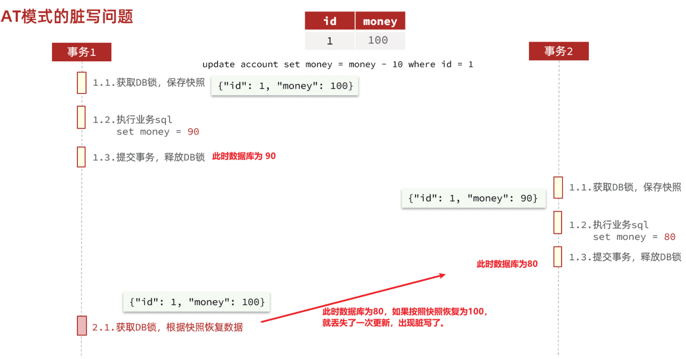

--分布式事务框架

‍

Seata是 2019 年 1 月份蚂蚁金服和阿里巴巴共同开源的分布式事务解决方案。致力于提供高性能和简单易用的分布式事务服务，为用户打造一站式的分布式解决方案。

[官网地址](http://seata.io)

‍

## 问题

‍

### 跨服务的事务

跨服务的事务问题：

比如昨天讲到过的下单业务，下单的过程中需要调用多个微服务：

* 商品服务：扣减库存
* 订单服务：保存订单
* 购物车服务：清理购物车

这些业务全部都是数据库的写操作，我们必须确保所有操作的同时成功或失败。但是这些操作在不同微服务，也就是不同的Tomcat，这样的情况如何确保事务特性呢？

‍

‍

## 介绍

解决分布式事务的方案有很多，但实现起来都比较复杂，因此我们一般会使用开源的框架来解决分布式事务问题。在众多的开源分布式事务框架中，功能最完善、使用最多的就是阿里巴巴在2019年开源的[Seata](https://seata.io/zh-cn/docs/overview/what-is-seata.html)了。

‍

其实分布式事务产生的一个重要原因，就是参与事务的多个分支事务互相无感知，不知道彼此的执行状态。因此解决分布式事务的思想非常简单：

> 找一个统一的**事务协调者**，与多个分支事务通信，检测每个分支事务的执行状态，保证全局事务下的每一个分支事务同时成功或失败即可。

大多数的分布式事务框架都是基于这个理论来实现的。

Seata也不例外，在Seata的事务管理中有三个重要的角色：

‍

* **TC (Transaction Coordinator) -事务协调者：** 维护全局和分支事务的状态，协调全局事务提交或回滚。
* **TM (Transaction Manager) -事务管理器：** 定义全局事务的范围、开始全局事务、提交或回滚全局事务。
* **RM (Resource Manager) -资源管理器：** 管理分支事务，与TC交谈以注册分支事务和报告分支事务的状态，并驱动分支事务提交或回滚。

‍

Seata的工作架构如图所示：

​​

‍

其中，**TM**和**RM**可以理解为Seata的客户端部分，引入到参与事务的微服务依赖中即可。将来**TM**和**RM**就会协助微服务，实现本地分支事务与**TC**之间交互，实现事务的提交或回滚。

‍

而**TC**服务则是事务协调中心，是一个独立的微服务，需要单独部署。

‍

Seata基于上述架构提供了四种不同的分布式事务解决方案：

* XA模式：强一致性分阶段事务模式，牺牲了一定的可用性，无业务侵入
* TCC模式：最终一致的分阶段事务模式，有业务侵入
* AT模式：最终一致的分阶段事务模式，无业务侵入，也是Seata的默认模式
* SAGA模式：长事务模式，有业务侵入

无论哪种方案，都离不开TC，也就是事务的协调者。

‍

‍

‍

## 分布式理论

解决分布式事务问题，需要一些分布式系统的基础知识作为理论指导。

‍

### 事务类型

‍

‍

#### 本地事务

本地事务，也就是传统的**单机事务**。在传统数据库事务中 ACID

‍

#### 分布式事务

**分布式事务**，就是指不是在单个服务或单个数据库架构下，产生的事务，例如：

* 跨数据源的分布式事务
* 跨服务的分布式事务
* 综合情况

‍

看看项目中的下单业务整体流程：

‍

由于订单、购物车、商品分别在三个不同的微服务，而每个微服务都有自己独立的数据库，因此下单过程中就会跨多个数据库完成业务。而每个微服务都会执行自己的本地事务：

* 交易服务：下单事务
* 购物车服务：清理购物车事务
* 库存服务：扣减库存事务

‍

整个业务中，各个本地事务是有关联的。因此每个微服务的本地事务，也可以称为**分支事务**。多个有关联的分支事务一起就组成了**全局事务**。我们必须保证整个全局事务同时成功或失败。

我们知道每一个分支事务就是传统的**单体事务**，都可以满足ACID特性，但全局事务跨越多个服务、多个数据库，是否还能满足呢？

‍

> 我们来做一个测试，先进入购物车页面：
>
> ......
>
> 事务并未遵循ACID的原则，归其原因就是参与事务的多个子业务在不同的微服务，跨越了不同的数据库。虽然每个单独的业务都能在本地遵循ACID，但是它们互相之间没有感知，不知道有人失败了，无法保证最终结果的统一，也就无法遵循ACID的事务特性了。

‍

这就是分布式事务问题，出现以下情况之一就可能产生分布式事务问题：

* 业务跨多个服务实现
* 业务跨多个数据源实现

‍

‍

‍

### CAP定理

1998年，加州大学的计算机科学家提出，分布式系统有三个指标

> * Consistency（一致性）
> * Availability（可用性）
> * Partition tolerance （分区容错性）

‍

它们的第一个字母分别是 C、A、P。

Eric Brewer 说，这三个指标不可能同时做到。这个结论就叫做 CAP 定理

‍

#### 一致性

Consistency（一致性）：用户访问分布式系统中的任意节点，得到的数据必须一致。

比如现在包含两个节点，其中的初始数据是一致的

当我们修改其中一个节点的数据时，两者的数据产生了差异要想保住一致性，就必须实现node01 到 node02的数据 同步

‍

‍

#### 可用性

Availability （可用性）：用户访问集群中的任意健康节点，必须能得到响应，而不是超时或拒绝。

有三个节点的集群，访问任何一个都可以及时得到响应

当有部分节点因为网络故障或其它原因无法访问时，代表节点不可用

‍

‍

#### 分区容错性

**Partition（分区）** ：因为网络故障或其它原因导致分布式系统中的部分节点与其它节点失去连接，形成独立分区。

‍

**Tolerance（容错）** ：在集群出现分区时，整个系统也要持续对外提供服务

‍

‍

#### 矛盾

在分布式系统中，系统间的网络不能100%保证健康，一定会有故障的时候，而服务有必须对外保证服务。因此Partition Tolerance不可避免。

当节点接收到新的数据变更时，就会出现问题了

‍

如果此时要保证**一致性**，就必须等待网络恢复，完成数据同步后，整个集群才对外提供服务，服务处于阻塞状态，不可用。

如果此时要保证**可用性**，就不能等待网络恢复，那node01、node02与node03之间就会出现数据不一致。

也就是说，在P一定会出现的情况下，A和C之间只能实现一个。

‍

‍

### BASE理论

BASE理论是对CAP的一种解决思路，包含三个思想：

* **==B==**​**asically** **==A==**​**vailable**  **（基本可用）** ：分布式系统在出现故障时，允许损失部分可用性，即保证核心可用。
* **==S==**​**oft State（软状态）：** 在一定时间内，允许出现中间状态，比如临时的不一致状态。
* **==E==**​**ventually Consistent（最终一致性）** ：虽然无法保证强一致性，但是在软状态结束后，最终达到数据一致。

‍

‍

### 解决分布式事务的思路

分布式事务最大的问题是各个子事务的一致性问题，因此可以借鉴CAP定理和BASE理论，有两种解决思路：

* AP模式：各子事务分别执行和提交，允许出现结果不一致，然后采用弥补措施恢复数据即可，实现最终一致。
* CP模式：各个子事务执行后互相等待，同时提交，同时回滚，达成强一致。但事务等待过程中，处于弱可用状态。

但不管是哪一种模式，都需要在子系统事务之间互相通讯，协调事务状态，也就是需要一个**事务协调者(TC)** ：

‍

这里的子系统事务，称为**分支事务**；有关联的各个分支事务在一起称为**全局事务**。

‍

‍

‍

## 部署TC服务

事务协调中心微服务单独部署

‍

### 准备数据库表

Seata支持多种存储模式，但考虑到持久化的需要，一般选择基于数据库存储。执行课前资料提供的`《seata-tc.sql》`​，导入数据库表：

‍

### 配置文件

seata目录包含了seata运行时所需要的配置文件 (个人保存)

将整个seata文件夹拷贝到虚拟机的`/root`​目录

‍

‍

### Docker部署

> 由于手动下载安装seata困难, 优先通过Docker(虚拟网络)进行

‍

#### 准备数据库表

的`seata-tc.sql`​

‍

#### 准备配置文件

需要注意，要确保nacos、mysql都在hm-net网络中。如果某个容器不在hm-net网络，将某容器加入指定网络：

```Shell
docker network connect [网络名] [容器名]
```

‍

本地seata目录上传到挂载目录.

‍

#### 挂载

在虚拟机的`/root`​目录执行下面的命令

(需要挂载./seata), 指定版本1.5.2

```Shell
docker run --name seata \
-p 8099:8099 \
-p 7099:7099 \
-e SEATA_IP=192.168.150.101 \
-v ./seata:/seata-server/resources \
--privileged=true \
--network sk-net \
-d \
seataio/seata-server:1.5.2
```

‍

‍

‍

## 微服务集成

参与分布式事务的每一个微服务都需要集成Seata，我们以`trade-service`​为例。

‍

‍

### 引入依赖

为了方便各个微服务集成seata，我们需要把seata配置共享到nacos，因此`trade-service`​模块不仅仅要引入seata依赖，还要引入nacos依赖:

‍

```XML
    <!--统一配置管理-->
  <dependency>
      <groupId>com.alibaba.cloud</groupId>
      <artifactId>spring-cloud-starter-alibaba-nacos-config</artifactId>
  </dependency>
  <!--读取bootstrap文件-->
  <dependency>
      <groupId>org.springframework.cloud</groupId>
      <artifactId>spring-cloud-starter-bootstrap</artifactId>
  </dependency>
  <!--seata-->
  <dependency>
      <groupId>com.alibaba.cloud</groupId>
      <artifactId>spring-cloud-starter-alibaba-seata</artifactId>
  </dependency>
```

‍

‍

### 改造配置

首先在nacos上添加一个共享的seata配置，命名为`shared-seata.yaml`​

默认组即可

```YAML
seata:
  registry: # TC服务注册中心的配置，微服务根据这些信息去注册中心获取tc服务地址
 # 参考tc服务自己的registry.conf中的配置
    type: nacos # 注册中心类型 nacos
    nacos:
      server-addr: nacos:8848 # nacos地址
      namespace: "" # namespace，默认为空
      group: DEFAULT_GROUP # 分组，默认是DEFAULT_GROUP
      application: seata-server # seata服务名称
      username: nacos
      password: nacos
  tx-service-group: hmall # 事务组名称，根据这个获取tc服务的cluster名称
  service:
    vgroup-mapping: # 事务组与tc集群的映射关系
      hmall: "default"
```

注册到Nacos中的微服务，确定一个具体实例需要四个信息：

* namespace：命名空间
* group：分组
* application：服务名
* cluster：集群名

‍

‍

然后，改造`trade-service`​模块，添加`bootstrap.yaml`​：

```YAML
spring:
  application:
    name: trade-service # 服务名称
  profiles:
    active: dev
  cloud:
    nacos:
      server-addr: 192.168.150.101 # nacos地址
      config:
        file-extension: yaml # 文件后缀名
        shared-configs: # 共享配置
          - dataId: shared-jdbc.yaml # 共享mybatis配置
          - dataId: shared-log.yaml # 共享日志配置
          - dataId: shared-swagger.yaml # 共享日志配置
          - dataId: shared-seata.yaml # 共享seata配置
```

可以看到这里预加载了共享的seata配置

‍

然后改造application.yaml文件

```YAML
server:
  port: 8085
feign:
  okhttp:
    enabled: true # 开启OKHttp连接池支持
  sentinel:
    enabled: true # 开启Feign对Sentinel的整合
hm:
  swagger:
    title: 交易服务接口文档
    package: com.hmall.trade.controller
  db:
    database: hm-trade
```

参考上述办法分别改造`hm-cart`​和`hm-item`​两个微服务模块

‍

‍

### 添加数据库表

seata的客户端在解决分布式事务的时候需要记录一些中间数据，保存在数据库中。因此我们要先准备一个这样的表。

将课前资料的 seata-at.sql 分别文件导入hm-trade、hm-cart、hm-item三个数据库中：

‍

seata-at.sql

```YAML
-- for AT mode you must to init this sql for you business database. the seata server not need it.
CREATE TABLE IF NOT EXISTS `undo_log`
(
    `branch_id`     BIGINT       NOT NULL COMMENT 'branch transaction id',
    `xid`           VARCHAR(128) NOT NULL COMMENT 'global transaction id',
    `context`       VARCHAR(128) NOT NULL COMMENT 'undo_log context,such as serialization',
    `rollback_info` LONGBLOB     NOT NULL COMMENT 'rollback info',
    `log_status`    INT(11)      NOT NULL COMMENT '0:normal status,1:defense status',
    `log_created`   DATETIME(6)  NOT NULL COMMENT 'create datetime',
    `log_modified`  DATETIME(6)  NOT NULL COMMENT 'modify datetime',
    UNIQUE KEY `ux_undo_log` (`xid`, `branch_id`)
) ENGINE = InnoDB
  AUTO_INCREMENT = 1
  DEFAULT CHARSET = utf8mb4 COMMENT ='AT transaction mode undo table';

```

‍

OK，至此为止，微服务整合的工作就完成了。可以参考上述方式对`hm-item`​和`hm-cart`​模块完成整合改造。

‍

‍

### 测试

接下来就是测试分布式事务的时候了

找到`trade-service`​模块下的`com.hmall.trade.service.impl.OrderServiceImpl`​类中的`createOrder`​方法，也就是下单业务方法。

将其上的`@Transactional`​注解改为Seata提供的`@GlobalTransactional`​

‍

​`@GlobalTransactional`​注解就是在标记事务的起点，将来TM就会基于这个方法判断全局事务范围，初始化全局事务。

‍

我们重启`trade-service`​、`item-service`​、`cart-service`​三个服务。再次测试，发现分布式事务的问题解决了！

那么，Seata是如何解决分布式事务的呢？

‍

‍

## 分布式事务解决方案

‍

从以下几个方面来对比四种实现：

* 一致性：能否保证事务的一致性？强一致还是最终一致？
* 隔离性：事务之间的隔离性如何？
* 代码侵入：是否需要对业务代码改造？
* 性能：有无性能损耗？
* 场景：常见的业务场景

‍

‍

||XA|AT|TCC|SAGA|
| ----------| --------------------------------| ----------------------------------------------| --------------------------------------------------------| -----------------------------------------------------------------------------------------|
|一致性|强一致|弱一致|弱一致|最终一致|
|隔离性|完全隔离|基于全局锁隔离|基于资源预留隔离|无隔离|
|代码侵入|无|无|有，要编写三个接口|有，要编写状态机和补偿业务|
|性能|差|好|非常好|非常好|
|场景|对一致性、隔离性有高要求的业务|基于关系型数据库的大多数分布式事务场景都可以|对性能要求较高的事务。<br />有非关系型数据库要参与的事务。|业务流程长、业务流程多<br />参与者包含其它公司或遗留系统服务，无法提供TCC模式要求的三个接口|

‍

### XA模式

Seata支持四种不同的分布式事务解决方案：

* **XA**
* **TCC**
* **AT**
* **SAGA**

‍

​`XA`​ 规范 是` X/Open`​ 组织定义的分布式事务处理（DTP，Distributed Transaction Processing）标准，XA 规范 描述了全局的`TM`​与局部的`RM`​之间的接口，几乎所有主流的数据库都对 XA 规范 提供了支持。

‍

‍

#### 两阶段提交

A是规范，目前主流数据库都实现了这种规范，实现的原理都是基于两阶段提交。

‍

正常情况：

​​

‍

异常情况：

​​

‍

‍

一阶段：

* 事务协调者通知每个事务参与者执行本地事务
* 本地事务执行完成后报告事务执行状态给事务协调者，此时事务不提交，继续持有数据库锁

‍

二阶段：

* 事务协调者基于一阶段的报告来判断下一步操作
* 如果一阶段都成功，则通知所有事务参与者，提交事务
* 如果一阶段任意一个参与者失败，则通知所有事务参与者回滚事务

‍

‍

#### Seata的XA模型

Seata对原始的XA模式做了简单的封装和改造，以适应自己的事务模型，基本架构如图：

​​

‍

​`RM`​一阶段的工作：

1. 注册分支事务到`TC`​
2. 执行分支业务sql但不提交
3. 报告执行状态到`TC`​

‍

​`TC`​二阶段的工作：

* ​`TC`​检测各分支事务执行状态

  1. 如果都成功，通知所有RM提交事务
  2. 如果有失败，通知所有RM回滚事务

‍

​`RM`​二阶段的工作：

* 接收`TC`​指令，提交或回滚事务

‍

‍

#### 优缺点

​`XA`​模式的优点是什么？

* 事务的强一致性，满足ACID原则
* 常用数据库都支持，实现简单，并且没有代码侵入

‍

​`XA`​模式的缺点是什么？

* 因为一阶段需要锁定数据库资源，等待二阶段结束才释放，性能较差
* 依赖关系型数据库实现事务

‍

‍

#### demo

首先，我们要在配置文件中指定要采用的分布式事务模式。我们可以在Nacos中的共享shared-seata.yaml配置文件中设置：

(否则要修改application.yml文件（每个参与事务的微服务），开启XA模式)

```YAML
seata:
  data-source-proxy-mode: XA
```

‍

2）给发起全局事务的入口方法添加@GlobalTransactional注解

3）重启服务并测试

‍

‍

### AT模式

​`AT`​模式同样是分阶段提交的事务模型，不过弥补了`XA`​模型中资源锁定周期过长的缺陷。

‍

‍

#### Seata的AT模型

基本流程图：

​​

‍

阶段一`RM`​的工作：

* 注册分支事务
* 记录undo-log（数据快照）
* 执行业务sql并提交
* 报告事务状态

‍

阶段二提交时`RM`​的工作：

* 删除undo-log即可

‍

阶段二回滚时`RM`​的工作：

* 根据undo-log恢复数据到更新前

‍

‍

#### 流程梳理

‍

用一个真实的业务来梳理下AT模式的原理。

比如，现在有一个数据库表，记录用户余额：

其中一个分支业务要执行的SQL为：

```SQL
 update tb_account set money = money - 10 where id = 1
```

AT模式下，当前分支事务执行流程如下：

‍

‍

**一阶段**：

1）TM发起并注册全局事务到TC

2）TM调用分支事务

3）分支事务准备执行业务SQL

4）RM拦截业务SQL，根据where条件查询原始数据，形成快照。

```json
{
    "id": 1, "money": 100
}
```

5）RM执行业务SQL，提交本地事务，释放数据库锁。此时 `money = 90`​

6）RM报告本地事务状态给TC

‍

‍

**二阶段**：

1. ​`TM`​通知`TC`​事务结束
2. ​`TC`​检查分支事务状态

    1. 如果都成功，则立即删除快照
    2. 如果有分支事务失败，需要回滚。读取快照数据（{"id": 1, "money": 100}），将快照恢复到数据库。此时数据库再次恢复为100

‍

流程图：

​​

‍

‍

‍

#### AT与XA的区别

简述`AT`​模式与`XA`​模式最大的区别是什么？

* ​`XA`​模式一阶段不提交事务，锁定资源；`AT`​模式一阶段直接提交，不锁定资源。
* ​`XA`​模式依赖数据库机制实现回滚；`AT`​模式利用数据快照实现数据回滚。
* ​`XA`​模式强一致；`AT`​模式最终一致

‍

‍

可见，AT模式使用起来更加简单，无业务侵入，性能更好。因此企业90%的分布式事务都可以用AT模式来解决。

‍

#### 脏写问题

在大多数情况下（99%）并不会有什么问题，不过在极端情况下，特别是在多线程并发访问AT模式的分布式事务时，有可能出现脏写问题，如图：

​​

‍

解决思路就是引入了全局锁的概念。在释放DB锁之前，先拿到全局锁。避免同一时刻有另外一个事务来操作当前数据。

​​

‍

具体可以参考官方文档：

https://seata.io/zh-cn/docs/dev/mode/at-mode.html

‍

#### 优缺点

AT模式的优点：

* 一阶段完成直接提交事务，释放数据库资源，性能比较好
* 利用全局锁实现读写隔离
* 没有代码侵入，框架自动完成回滚和提交

AT模式的缺点：

* 两阶段之间属于软状态，属于最终一致
* 框架的快照功能会影响性能，但比XA模式要好很多

‍

#### demo

AT模式中的快照生成、回滚等动作都是由框架自动完成，没有任何代码侵入，因此实现非常简单。

只不过，AT模式需要一个表来记录全局锁、另一张表来记录数据快照undo_log。

‍

1）导入数据库表，记录全局锁

seata-at2.sql，其中lock_table导入到TC服务关联的数据库，undo_log表导入到微服务关联的数据库：

‍

2）修改application.yml文件，将事务模式修改为AT模式即可：

```yaml
seata:
  data-source-proxy-mode: AT # 默认就是AT
```

3）重启服务并测试

‍

‍

### TCC模式

TCC模式与AT模式非常相似，每阶段都是独立事务，不同的是TCC通过人工编码来实现数据恢复。需要实现三个方法：

* ​`try`​：资源的检测和预留；
* ​`confirm`​：完成资源操作业务；要求 `try`​ 成功 `confirm`​ 一定要能成功。
* ​`cancel`​：预留资源释放，可以理解为try的反向操作。

‍

‍

#### 流程分析

举例，一个扣减用户余额的业务。假设账户A原来余额是100，需要余额扣减30元。

‍

* **阶段一（ Try ）** ：检查余额是否充足，如果充足则冻结金额增加30元，可用余额扣除30

余额充足，可以冻结：此时，总金额 = 冻结金额 + 可用金额，数量依然是100不变。事务直接提交无需等待其它事务。

‍

* **阶段二（Confirm)** ：假如要提交（Confirm），则冻结金额扣减30

确认可以提交，不过之前可用金额已经扣减过了，这里只要清除冻结金额就好了：此时，总金额 = 冻结金额 + 可用金额 = 0 + 70 = 70元

‍

* **阶段二(Canncel)** ：如果要回滚（Cancel），则冻结金额扣减30，可用余额增加30

需要回滚，那么就要释放冻结金额，恢复可用金额

‍

‍

#### Seata的TCC模型

Seata中的TCC模型依然延续之前的事务架构，如图：

​​

‍

‍

#### 优缺点

TCC模式的每个阶段是做什么的？

* Try：资源检查和预留
* Confirm：业务执行和提交
* Cancel：预留资源的释放

‍

TCC的优点是什么？

* 一阶段完成直接提交事务，释放数据库资源，性能好
* 相比AT模型，无需生成快照，无需使用全局锁，性能最强
* 不依赖数据库事务，而是依赖补偿操作，可以用于非事务型数据库

‍

TCC的缺点是什么？

* 有代码侵入，需要人为编写try、Confirm和Cancel接口，太麻烦
* 软状态，事务是最终一致
* 需要考虑Confirm和Cancel的失败情况，做好幂等处理

‍

‍

#### 事务悬挂和空回滚

‍

##### 1）空回滚

当某分支事务的try阶段**阻塞**时，可能导致全局事务超时而触发二阶段的cancel操作。在未执行try操作时先执行了cancel操作，这时cancel不能做回滚，就是**空回滚**。

‍

如图：

​​

‍

执行cancel操作时，应当判断try是否已经执行，如果尚未执行，则应该空回滚。

‍

‍

##### 2）业务悬挂

对于已经空回滚的业务，之前被阻塞的try操作恢复，继续执行try，就永远不可能confirm或cancel ，事务一直处于中间状态，这就是**业务悬挂**。

执行try操作时，应当判断cancel是否已经执行过了，如果已经执行，应当阻止空回滚后的try操作，避免悬挂

‍

‍

#### demo

解决空回滚和业务悬挂问题，必须要记录当前事务状态，是在try、还是cancel？

‍

##### 1）思路分析

这里我们定义一张表：

```sql
CREATE TABLE `account_freeze_tbl` (
  `xid` varchar(128) NOT NULL,
  `user_id` varchar(255) DEFAULT NULL COMMENT '用户id',
  `freeze_money` int(11) unsigned DEFAULT '0' COMMENT '冻结金额',
  `state` int(1) DEFAULT NULL COMMENT '事务状态，0:try，1:confirm，2:cancel',
  PRIMARY KEY (`xid`) USING BTREE
) ENGINE=InnoDB DEFAULT CHARSET=utf8 ROW_FORMAT=COMPACT;

```

其中：

* xid：是全局事务id
* freeze_money：用来记录用户冻结金额
* state：用来记录事务状态

‍

那此时，我们的业务怎么做呢？

* Try业务：

  * 记录冻结金额和事务状态到account_freeze表
  * 扣减account表可用金额
* Confirm业务

  * 根据xid删除account_freeze表的冻结记录
* Cancel业务

  * 修改account_freeze表，冻结金额为0，state为2
  * 修改account表，恢复可用金额
* 如何判断是否空回滚？

  * cancel业务中，根据xid查询account_freeze，如果为null则说明try还没做，需要空回滚
* 如何避免业务悬挂？

  * try业务中，根据xid查询account_freeze ，如果已经存在则证明Cancel已经执行，拒绝执行try业务

‍

接下来，我们改造account-service，利用TCC实现余额扣减功能。

‍

‍

##### 2）声明TCC接口

TCC的Try、Confirm、Cancel方法都需要在接口中基于注解来声明，

我们在account-service项目中的`cn.itcast.account.service`​包中新建一个接口，声明TCC三个接口：

```java

@LocalTCC
public interface AccountTCCService {

    @TwoPhaseBusinessAction(name = "deduct", commitMethod = "confirm", rollbackMethod = "cancel")
    void deduct(@BusinessActionContextParameter(paramName = "userId") String userId,
                @BusinessActionContextParameter(paramName = "money")int money);

    boolean confirm(BusinessActionContext ctx);

    boolean cancel(BusinessActionContext ctx);
}
```

‍

‍

##### 3）编写实现类

在account-service服务中的`cn.itcast.account.service.impl`​包下新建一个类，实现TCC业务：

```java
@Service
@Slf4j
public class AccountTCCServiceImpl implements AccountTCCService {

    @Autowired
    private AccountMapper accountMapper;
    @Autowired
    private AccountFreezeMapper freezeMapper;

    @Override
    @Transactional
    public void deduct(String userId, int money) {
        // 0.获取事务id
        String xid = RootContext.getXID();
        // 1.扣减可用余额
        accountMapper.deduct(userId, money);
        // 2.记录冻结金额，事务状态
        AccountFreeze freeze = new AccountFreeze();
        freeze.setUserId(userId);
        freeze.setFreezeMoney(money);
        freeze.setState(AccountFreeze.State.TRY);
        freeze.setXid(xid);
        freezeMapper.insert(freeze);
    }

    @Override
    public boolean confirm(BusinessActionContext ctx) {
        // 1.获取事务id
        String xid = ctx.getXid();
        // 2.根据id删除冻结记录
        int count = freezeMapper.deleteById(xid);
        return count == 1;
    }

    @Override
    public boolean cancel(BusinessActionContext ctx) {
        // 0.查询冻结记录
        String xid = ctx.getXid();
        AccountFreeze freeze = freezeMapper.selectById(xid);

        // 1.恢复可用余额
        accountMapper.refund(freeze.getUserId(), freeze.getFreezeMoney());
        // 2.将冻结金额清零，状态改为CANCEL
        freeze.setFreezeMoney(0);
        freeze.setState(AccountFreeze.State.CANCEL);
        int count = freezeMapper.updateById(freeze);
        return count == 1;
    }
}
```

‍

‍

### SAGA模式

Saga 模式是 Seata 即将的长事务解决方案，将由蚂蚁金服主要贡献

其理论基础是Hector & Kenneth 在1987年发表的论文[Sagas](https://microservices.io/patterns/data/saga.html)。

Seata官网对于Saga的指南：[https://seata.io/zh-cn/docs/user/saga.html](https://seata.io/zh-cn/docs/user/saga.html)

‍

‍

#### 原理

在 Saga 模式下，分布式事务内有多个参与者，每一个参与者都是一个冲正补偿服务，需要用户根据业务场景实现其正向操作和逆向回滚操作。

分布式事务执行过程中，依次执行各参与者的正向操作，如果所有正向操作均执行成功，那么分布式事务提交。如果任何一个正向操作执行失败，那么分布式事务会去退回去执行前面各参与者的逆向回滚操作，回滚已提交的参与者，使分布式事务回到初始状态。

‍

Saga也分为两个阶段：

* 一阶段：直接提交本地事务
* 二阶段：成功则什么都不做；失败则通过编写补偿业务来回滚

‍

‍

#### 优缺点

优点：

* 事务参与者可以基于事件驱动实现异步调用，吞吐高
* 一阶段直接提交事务，无锁，性能好
* 不用编写TCC中的三个阶段，实现简单

缺点：

* 软状态持续时间不确定，时效性差
* 没有锁，没有事务隔离，会有脏写

‍

‍

‍

## 高可用

Seata的TC服务作为分布式事务核心，一定要保证集群的高可用性。

‍

‍

### 高可用架构模型

搭建TC服务集群非常简单，启动多个TC服务，注册到nacos即可。

但集群并不能确保100%安全，万一集群所在机房故障怎么办？所以如果要求较高，一般都会做异地多机房容灾。

‍

微服务基于事务组（tx-service-group)与TC集群的映射关系，来查找当前应该使用哪个TC集群。当SH集群故障时，只需要将vgroup-mapping中的映射关系改成HZ。则所有微服务就会切换到HZ的TC集群了。

‍

‍

### 实现高可用

‍

#### 1.模拟异地容灾的TC集群

计划启动两台seata的tc服务节点：

|节点名称|ip地址|端口号|集群名称|
| ----------| -----------| --------| ----------|
|seata|127.0.0.1|8091|SH|
|seata2|127.0.0.1|8092|HZ|

之前我们已经启动了一台seata服务，端口是8091，集群名为SH。

现在，将seata目录复制一份，起名为seata2

‍

修改seata2/conf/registry.conf内容如下：

```nginx
registry {
  # tc服务的注册中心类，这里选择nacos，也可以是eureka、zookeeper等
  type = "nacos"

  nacos {
    # seata tc 服务注册到 nacos的服务名称，可以自定义
    application = "seata-tc-server"
    serverAddr = "127.0.0.1:8848"
    group = "DEFAULT_GROUP"
    namespace = ""
    cluster = "HZ"
    username = "nacos"
    password = "nacos"
  }
}

config {
  # 读取tc服务端的配置文件的方式，这里是从nacos配置中心读取，这样如果tc是集群，可以共享配置
  type = "nacos"
  # 配置nacos地址等信息
  nacos {
    serverAddr = "127.0.0.1:8848"
    namespace = ""
    group = "SEATA_GROUP"
    username = "nacos"
    password = "nacos"
    dataId = "seataServer.properties"
  }
}
```

进入seata2/bin目录，然后运行命令：

```powershell
seata-server.bat -p 8092
```

‍

打开nacos控制台，查看服务列表：点进详情查看

‍

‍

#### 2.将事务组映射配置到nacos

接下来，我们需要将tx-service-group与cluster的映射关系都配置到nacos配置中心。

新建一个Properties配置：

Data ID: client.properties  
Group: SEATA_GROUP

‍

配置内容

```properties
# 事务组映射关系
service.vgroupMapping.seata-demo=SH

service.enableDegrade=false
service.disableGlobalTransaction=false
# 与TC服务的通信配置
transport.type=TCP
transport.server=NIO
transport.heartbeat=true
transport.enableClientBatchSendRequest=false
transport.threadFactory.bossThreadPrefix=NettyBoss
transport.threadFactory.workerThreadPrefix=NettyServerNIOWorker
transport.threadFactory.serverExecutorThreadPrefix=NettyServerBizHandler
transport.threadFactory.shareBossWorker=false
transport.threadFactory.clientSelectorThreadPrefix=NettyClientSelector
transport.threadFactory.clientSelectorThreadSize=1
transport.threadFactory.clientWorkerThreadPrefix=NettyClientWorkerThread
transport.threadFactory.bossThreadSize=1
transport.threadFactory.workerThreadSize=default
transport.shutdown.wait=3
# RM配置
client.rm.asyncCommitBufferLimit=10000
client.rm.lock.retryInterval=10
client.rm.lock.retryTimes=30
client.rm.lock.retryPolicyBranchRollbackOnConflict=true
client.rm.reportRetryCount=5
client.rm.tableMetaCheckEnable=false
client.rm.tableMetaCheckerInterval=60000
client.rm.sqlParserType=druid
client.rm.reportSuccessEnable=false
client.rm.sagaBranchRegisterEnable=false
# TM配置
client.tm.commitRetryCount=5
client.tm.rollbackRetryCount=5
client.tm.defaultGlobalTransactionTimeout=60000
client.tm.degradeCheck=false
client.tm.degradeCheckAllowTimes=10
client.tm.degradeCheckPeriod=2000

# undo日志配置
client.undo.dataValidation=true
client.undo.logSerialization=jackson
client.undo.onlyCareUpdateColumns=true
client.undo.logTable=undo_log
client.undo.compress.enable=true
client.undo.compress.type=zip
client.undo.compress.threshold=64k
client.log.exceptionRate=100
```

‍

‍

#### 3.微服务读取nacos配置

接下来，需要修改每一个微服务的application.yml文件，让微服务读取nacos中的client.properties文件：

```yaml
seata:
  config:
    type: nacos
    nacos:
      server-addr: 127.0.0.1:8848
      username: nacos
      password: nacos
      group: SEATA_GROUP
      data-id: client.properties
```

重启微服务，现在微服务到底是连接tc的SH集群，还是tc的HZ集群，都统一由nacos的client.properties来决定了。

‍
