--微服务保护

‍

‍

‍

保证服务运行的健壮性，避免级联失败导致的雪崩问题，就属于微服务保护。

‍

微服务保护

* 服务保护方案
* 请求限流
* 隔离和熔断

‍

‍

## 问题

在微服务远程调用的过程中，还存在几个问题需要解决。

‍

### **业务健壮性**

例如在之前的查询购物车列表业务中，购物车服务需要查询最新的商品信息，与购物车数据做对比，提醒用户。大家设想一下，如果商品服务查询时发生故障，查询购物车列表在调用商品服 务时，是不是也会异常？从而导致购物车查询失败。但从业务角度来说，为了提升用户体验，即便是商品查询失败，购物车列表也应该正确展示出来，哪怕是不包含最新的商品信息。

‍

‍

### **级联失败**

还是查询购物车的业务，假如商品服务业务并发较高，占用过多Tomcat连接。可能会导致商品服务的所有接口响应时间增加，延迟变高，甚至是长时间阻塞直至查询失败。

此时查询购物车业务需要查询并等待商品查询结果，从而导致查询购物车列表业务的响应时间也变长，甚至也阻塞直至无法访问。而此时如果查询购物车的请求较多，可能导致购物车服务的Tomcat连接占用较多，所有接口的响应时间都会增加，整个服务性能很差， 甚至不可用。

‍

依次类推，整个微服务群中与购物车服务、商品服务等有调用关系的服务可能都会出现问题，最终导致整个集群不可用。

‍

这就是**级联失败**问题，或者叫**雪崩**问题。

‍

‍

‍

## 雪崩问题及服务保护方案

‍

‍

#### 雪崩问题

微服务中，服务间调用关系错综复杂，一个微服务往往依赖于多个其它微服务。

如图，如果服务提供者I发生了故障，当前的应用的部分业务因为依赖于服务I，因此也会被阻塞。此时，其它不依赖于服务I的业务似乎不受影响。

但是，依赖服务I的业务请求被阻塞，用户不会得到响应，则tomcat的这个线程不会释放，于是越来越多的用户请求到来，越来越多的线程会阻塞：

服务器支持的线程和并发数有限，请求一直阻塞，会导致服务器资源耗尽，从而导致所有其它服务都不可用，那么当前服务也就不可用了。

那么，依赖于当前服务的其它服务随着时间的推移，最终也都会变的不可用，形成级联失败，雪崩就发生了：

‍

‍

#### 保护方案

微服务保护的方案有很多，比如：

* 请求限流
* 线程隔离
* 服务熔断
* 超时处理 (略)

‍

这些方案或多或少都会导致服务的体验上略有下降，比如请求限流，降低了并发上限；线程隔离，降低了可用资源数量；服务熔断，降低了服务的完整度，部分服务变的不可用或弱可用。因此这些方案都属于服务**降级**的方案。但通过这些方案，服务的健壮性得到了提升，

‍

* 超时处理 ：设定超时时间，请求超过一定时间没有响应就返回错误信息，不会无休止等待。
* 舱壁模式 ：限定每个业务能使用的线程数，避免耗尽整个tomcat的资源，因此也叫 线程隔离 。
* 熔断降级 ：由 断路器 统计业务执行的异常比例，如果超出阈值则 熔断 该业务，拦截访问该业务的一切请求。
* 流量控制 ：限制业务访问的QPS（Query Per Second：每秒处理请求数），避免服务因流量的突增而故障。

‍

##### 超时处理

略

‍

##### 请求限流

服务故障最重要原因，就是并发太高！解决了这个问题，就能避免大部分故障。当然，接口的并发不是一直很高，而是突发的。因此请求限流，就是**限制或控制**接口访问的并发流量，避免服务因流量激增而出现故障。

‍

请求限流往往会有一个限流器，数量高低起伏的并发请求曲线，经过限流器就变的非常平稳。这就像是水电站的大坝，起到蓄水的作用，可以通过开关控制水流出的大小，让下游水流始终维持在一个平稳的量。

‍

‍

##### 线程隔离

当一个业务接口响应时间长，而且并发高时，就可能耗尽服务器的线程资源，导致服务内的其它接口受到影响。所以我们必须把这种影响降低，或者缩减影响的范围。线程隔离正是解决这个问题的好办法。

‍

线程隔离的思想来自轮船的舱壁模式：

> 轮船的船舱会被隔板分割为N个相互隔离的密闭舱，假如轮船触礁进水，只有损坏的部分密闭舱会进水，而其他舱由于相互隔离，并不会进水。这样就把进水控制在部分船体，避免了整个船舱进水而沉没。

为了避免某个接口故障或压力过大导致整个服务不可用，我们可以限定每个接口可以使用的资源范围，也就是将其“隔离”起来。

‍

如图所示，我们给查询购物车业务限定可用线程数量上限为20，这样即便查询购物车的请求因为查询商品服务而出现故障，也不会导致服务器的线程资源被耗尽，不会影响到其它接口。

‍

‍

##### 服务熔断

线程隔离虽然避免了雪崩问题，但故障服务（商品服务）依然会拖慢购物车服务（服务调用方）的接口响应速度。而且商品查询的故障依然会导致查询购物车功能出现故障，购物车业务也变的不可用了。

‍

所以，我们要做两件事情：

* **编写服务降级逻辑**：就是服务调用失败后的处理逻辑，根据业务场景，可以抛出异常，也可以返回友好提示或默认数据。
* **异常统计和熔断**：统计服务提供方的异常比例，当比例过高表明该接口会影响到其它服务，应该拒绝调用该接口，而是直接走降级逻辑。

‍

也叫断路器模式：由**断路器**统计业务执行的异常比例，如果超出阈值则会**熔断**该业务，拦截访问该业务的一切请求。

断路器会统计访问某个服务的请求数量，异常比例：

‍

当发现访问服务D的请求异常比例过高时，认为服务D有导致雪崩的风险，会拦截访问服务D的一切请求，形成熔断

‍

可以认为：

**限流**是对服务的保护，避免因瞬间高并发流量而导致服务故障，进而避免雪崩。是一种**预防**措施。

**超时处理、线程隔离、降级熔断**是在部分服务故障时，将故障控制在一定范围，避免雪崩。是一种**补救**措施。

‍

‍

## 介绍

‍

微服务保护的技术有很多，但在目前国内使用较多的还是Sentinel，所以接下来我们学习Sentinel的使用。

‍

‍

### 服务保护技术对比

在SpringCloud当中支持多种服务保护技术：

* [Netfix Hystrix](https://github.com/Netflix/Hystrix)
* [Sentinel](https://github.com/alibaba/Sentinel)
* [Resilience4J](https://github.com/resilience4j/resilience4j)

早期比较流行的是Hystrix框架，但目前国内实用最广泛的还是阿里巴巴的Sentinel框架，这里我们做下对比：

||**Sentinel**|**Hystrix**|
| ----------------| ------------------------------------------------| -------------------------------|
|隔离策略|信号量隔离|线程池隔离/信号量隔离|
|熔断降级策略|基于慢调用比例或异常比例|基于失败比率|
|实时指标实现|滑动窗口|滑动窗口（基于 RxJava）|
|规则配置|支持多种数据源|支持多种数据源|
|扩展性|多个扩展点|插件的形式|
|基于注解的支持|支持|支持|
|限流|基于 QPS，支持基于调用关系的限流|有限的支持|
|流量整形|支持慢启动、匀速排队模式|不支持|
|系统自适应保护|支持|不支持|
|控制台|开箱即用，可配置规则、查看秒级监控、机器发现等|不完善|
|常见框架的适配|Servlet、Spring Cloud、Dubbo、gRPC 等|Servlet、Spring Cloud Netflix|

‍

‍

‍

### 介绍

Sentinel是阿里巴巴开源的一款服务保护框架，目前已经加入SpringCloudAlibaba中。[https://sentinelguard.io/zh-cn/index.html](https://sentinelguard.io/zh-cn/index.html)

‍

Sentinel 具有以下特征:

•**丰富的应用场景**：Sentinel 承接了阿里巴巴近 10 年的双十一大促流量的核心场景，例如秒杀（即突发流量控制在系统容量可以承受的范围）、消息削峰填谷、集群流量控制、实时熔断下游不可用应用等。

•**完备的实时监控**：Sentinel 同时提供实时的监控功能。您可以在控制台中看到接入应用的单台机器秒级数据，甚至 500 台以下规模的集群的汇总运行情况。

•**广泛的开源生态**：Sentinel 提供开箱即用的与其它开源框架/库的整合模块，例如与 Spring Cloud、Dubbo、gRPC 的整合。您只需要引入相应的依赖并进行简单的配置即可快速地接入 Sentinel。

•**完善的** **SPI** **扩展点**：Sentinel 提供简单易用、完善的 SPI 扩展接口。您可以通过实现扩展接口来快速地定制逻辑。例如定制规则管理、适配动态数据源等。

‍

Sentinel 的使用可以分为两个部分:

‍

* **核心库**（Jar包）：不依赖任何框架/库，能够运行于 Java 8 及以上的版本的运行时环境，同时对 Dubbo / Spring Cloud 等框架也有较好的支持。在项目中引入依赖即可实现服务限流、隔离、熔断等功能。
* **控制台**（Dashboard）：Dashboard 主要负责管理推送规则、监控、管理机器信息等。

‍

‍

## 搭建

‍

### docker安装

见搭建

‍

‍

### Win控制台安装

‍

为了方便监控微服务，我们先把Sentinel的控制台搭建出来。

‍

1）[下载jar包](https://github.com/alibaba/Sentinel/releases)

所以其实可以不一定要上服务器

2）运行

将jar包放在任意非中文、不包含特殊字符的目录下，重命名为`sentinel-dashboard.jar`​

然后运行如下命令启动控制台：

```Shell
nohup java -Dserver.port=9091 -Dcsp.sentinel.dashboard.server=localhost:8090 -Dproject.name=sentinel-dashboard -jar sentinel-dashboard-1.8.8.jar
```

‍

其它启动时可配置参数可参考[官方文档](https://github.com/alibaba/Sentinel/wiki/%E5%90%AF%E5%8A%A8%E9%85%8D%E7%BD%AE%E9%A1%B9)

如果要修改Sentinel的默认端口、账户、密码，可以通过下列配置：

|**配置项**|**默认值**|**说明**|
| ----------------------------------| ----------| ------------|
|server.port|8080|服务端口|
|sentinel.dashboard.auth.username|sentinel|默认用户名|
|sentinel.dashboard.auth.password|sentinel|默认密码|

‍

‍

3）访问

访问[http://localhost:8090](http://localhost:8090)页面，就可以看到sentinel的控制台. 账号和密码，默认都是：sentinel

‍

登录后，即可看到控制台，默认会监控sentinel-dashboard服务本身

‍

‍

### 微服务整合

在`cart-service`​模块中整合sentinel，连接`sentinel-dashboard`​控制台

‍

1）引入sentinel依赖

```XML
<!--sentinel-->
<dependency>
    <groupId>com.alibaba.cloud</groupId> 
    <artifactId>spring-cloud-starter-alibaba-sentinel</artifactId>
</dependency>
```

‍

这个是接入nacos配置管理

```XML
<dependency>
    <groupId>com.alibaba.csp</groupId>
    <artifactId>sentinel-datasource-nacos</artifactId>
</dependency>
```

‍

2）配置控制台

修改application.yaml文件，添加下面内容：

```YAML
spring:
  cloud: 
    sentinel:
      transport:
        dashboard: localhost:8090
```

‍

这个是Nacos的, 监听Nacos中的sentinel规则配置

```YAML
spring:
  cloud:
    sentinel:
      datasource:
        flow:
          nacos:
            server-addr: localhost:8848 # nacos地址
            dataId: orderservice-flow-rules
            groupId: SENTINEL_GROUP
            rule-type: flow # 还可以是：degrade、authority、param-flow
```

‍

‍

3）访问`cart-service`​的任意端点

‍

重启`cart-service`​，然后访问查询购物车接口，sentinel的客户端就会将服务访问的信息提交到`sentinel-dashboard`​控制台。并展示出统计信息

‍

#### demo

‍

点击簇点链路菜单，会看到

​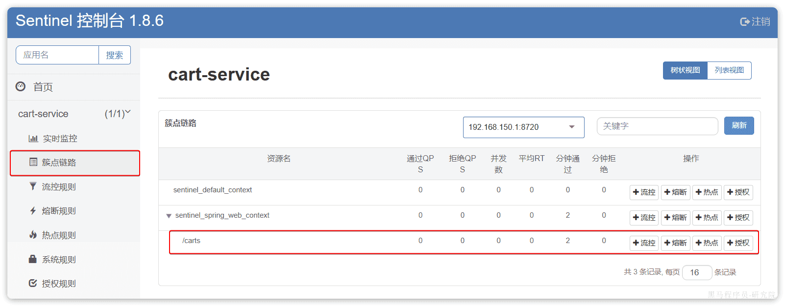​

‍

所谓簇点链路，就是单机调用链路，是一次请求进入服务后经过的每一个被`Sentinel`​监控的资源。默认情况下，`Sentinel`​会监控`SpringMVC`​的每一个`Endpoint`​（接口）

因此，我们看到`/carts`​这个接口路径就是其中一个簇点，我们可以对其进行限流、熔断、隔离等保护措施。

‍

不过，需要注意的是，我们的SpringMVC接口是按照Restful风格设计，因此购物车的查询、删除、修改等接口全部都是`/carts`​路径

‍

‍

默认情况下Sentinel会把路径作为簇点资源的名称，无法区分路径相同但请求方式不同的接口，查询、删除、修改等都被识别为一个簇点资源，这显然是不合适的。

‍

所以我们可以选择打开Sentinel的请求方式前缀，把`请求方式 + 请求路径`​作为簇点资源名：

在`cart-service`​的`application.yml`​中添加

```YAML
spring:
  cloud:
    sentinel:
      transport:
        dashboard: localhost:8090
      http-method-specify: true # 开启请求方式前缀
```

重启服务，通过页面访问购物车的相关接口，可以看到sentinel控制台的簇点链路发生了变化

‍

‍

## 概念

‍

### 簇点链路

当请求进入微服务时，首先会访问DispatcherServlet，然后进入Controller、Service、Mapper，这样的一个调用链就叫做**簇点链路**。簇点链路中被监控的每一个接口就是一个**资源**。

默认情况下sentinel会监控SpringMVC的每一个端点（Endpoint，也就是controller中的方法），因此SpringMVC的每一个端点（Endpoint）就是调用链路中的一个资源。

‍

流控、熔断等都是针对簇点链路中的资源来设置的，因此我们可以点击对应资源后面的按钮来设置规则：

* 流控：流量控制
* 降级：降级熔断
* 热点：热点参数限流，是限流的一种
* 授权：请求的权限控制

‍

‍

## 请求限流

雪崩问题虽然有四种方案，但是限流是避免服务因突发的流量而发生故障，是对微服务雪崩问题的预防。

‍

在簇点链路后面点击流控按钮，即可对其做限流配置

‍

* 阈值 QPS - 单机X, 即为每秒几个请求

‍

可以用Jmeter测试, 在"实时监控"页面查看

‍

‍

### 流控模式

在添加限流规则时，点击高级选项，可以选择三种**流控模式**：

* 直接：统计当前资源的请求，触发阈值时对当前资源直接限流，也是默认的模式
* 关联：统计与当前资源相关的另一个资源，触发阈值时，对当前资源限流
* 链路：统计从指定链路访问到本资源的请求，触发阈值时，对指定链路限流

‍

‍

#### 直接模式

快速入门测试的就是直接模式

‍

#### 关联模式

**关联模式**：统计与当前资源相关的另一个资源，触发阈值时，对当前资源限流

‍

**使用场景**：比如用户支付时需要修改订单状态，同时用户要查询订单。查询和修改操作会争抢数据库锁，产生竞争。业务需求是优先支付和更新订单的业务，因此当修改订单业务触发阈值时，需要对查询订单业务限流。

‍

满足下面条件可以使用关联模式：

* 两个有竞争关系的资源
* 一个优先级较高，一个优先级较低

‍

#### 链路模式

‍

**链路模式**：只针对从指定链路访问到本资源的请求做统计，判断是否超过阈值。

‍

##### demo

‍

**实战案例**

需求：有查询订单和创建订单业务，两者都需要查询商品。针对从查询订单进入到查询商品的请求统计，并设置限流。

‍

步骤：

1. 在OrderService中添加一个queryGoods方法，不用实现业务
2. 在OrderController中，改造/order/query端点，调用OrderService中的queryGoods方法
3. 在OrderController中添加一个/order/save的端点，调用OrderService的queryGoods方法
4. 给queryGoods设置限流规则，从/order/query进入queryGoods的方法限制QPS必须小于2

‍

‍

**1）添加查询商品方法**

在order-service服务中，给OrderService类添加一个queryGoods方法：

```java
public void queryGoods(){
    System.err.println("查询商品");
}
```

‍

**2）查询订单时，查询商品**

在order-service的OrderController中，修改/order/query端点的业务逻辑：

```java
@GetMapping("/query")
public String queryOrder() {
    // 查询商品
    orderService.queryGoods();
    // 查询订单
    System.out.println("查询订单");
    return "查询订单成功";
}
```

‍

**3）新增订单，查询商品**

在order-service的OrderController中，修改/order/save端点，模拟新增订单：

```java
@GetMapping("/save")
public String saveOrder() {
    // 查询商品
    orderService.queryGoods();
    // 查询订单
    System.err.println("新增订单");
    return "新增订单成功";
}
```

‍

‍

**4）给查询商品添加资源标记**

默认情况下，OrderService中的方法是不被Sentinel监控的，需要我们自己通过注解来标记要监控的方法。

给OrderService的queryGoods方法添加@SentinelResource注解：

```java
@SentinelResource("goods")
public void queryGoods(){
    System.err.println("查询商品");
}
```

链路模式中，是对不同来源的两个链路做监控。但是sentinel默认会给进入SpringMVC的所有请求设置同一个root资源，会导致链路模式失效。

我们需要关闭这种对SpringMVC的资源聚合，修改order-service服务的application.yml文件：

```yaml
spring:
  cloud:
    sentinel:
      web-context-unify: false # 关闭context整合
```

重启服务，访问/order/query和/order/save，可以查看到sentinel的簇点链路规则中，出现了新的资源：

‍

‍

**5）添加流控规则**

点击goods资源后面的流控按钮，在弹出的表单中填写下面信息：

‍

只统计从/order/query进入/goods的资源，QPS阈值为2，超出则被限流。

‍

**6）Jmeter测试**

‍

‍

### 流控效果

在流控的高级选项中，还有一个流控效果选项：

‍

‍

流控效果是指请求达到流控阈值时应该采取的措施，包括三种：

* 快速失败：达到阈值后，新的请求会被立即拒绝并抛出FlowException异常。是默认的处理方式。
* warm up：预热模式，对超出阈值的请求同样是拒绝并抛出异常。但这种模式阈值会动态变化，从一个较小值逐渐增加到最大阈值。可以避免冷启动时高并发导致服务宕机
* 排队等待：让所有的请求按照先后次序排队执行，两个请求的间隔不能小于指定时长. 请求会进入队列，按照阈值允许的时间间隔依次执行请求；如果请求预期等待时长大于超时时间，直接拒绝

‍

‍

#### 快速失败

直接开杀!

‍

#### warm up

阈值一般是一个微服务能承担的最大QPS，但是一个服务刚刚启动时，一切资源尚未初始化（**冷启动**），如果直接将QPS跑到最大值，可能导致服务瞬间宕机。

‍

warm up也叫**预热模式**，是应对服务冷启动的一种方案。请求阈值初始值是 maxThreshold / coldFactor，持续指定时长后，逐渐提高到maxThreshold值。而coldFactor的默认值是3.

‍

> 例如，我设置QPS的maxThreshold为10，预热时间为5秒，那么初始阈值就是 10 / 3 ，也就是3，然后在5秒后逐渐增长到10.

‍

‍

**案例**

需求：给/order/{orderId}这个资源设置限流，最大QPS为10，利用warm up效果，预热时长为5秒

‍

‍

#### 排队等待

当请求超过QPS阈值时，快速失败和warm up 会拒绝新的请求并抛出异常。

而排队等待则是让所有请求进入一个队列中，然后按照阈值允许的时间间隔依次执行。后来的请求必须等待前面执行完成，如果请求预期的等待时间超出最大时长，则会被拒绝。

‍

##### 工作原理

例如：QPS = 5，意味着每200ms处理一个队列中的请求；timeout = 2000，意味着**预期等待时长**超过2000ms的请求会被拒绝并抛出异常。

‍

那什么叫做预期等待时长呢？

比如现在一下子来了12 个请求，因为每200ms执行一个请求，那么：

* 第6个请求的**预期等待时长** = 200 * （6 - 1） = 1000ms
* 第12个请求的预期等待时长 = 200 * （12-1） = 2200ms

现在，第1秒同时接收到10个请求，但第2秒只有1个请求

如果使用队列模式做流控，所有进入的请求都要排队，以固定的200ms的间隔执行，QPS会变的很平滑

平滑的QPS曲线，对于服务器来说是更友好的。

‍

‍

### 热点参数限流

之前的限流是统计访问某个资源的所有请求，判断是否超过QPS阈值。而热点参数限流是**分别统计参数值相同的请求**，判断是否超过QPS阈值。

‍

‍

#### 全局参数限流

例如，一个根据id查询商品的接口：

访问/goods/{id}的请求中，id参数值会有变化，热点参数限流会根据参数值分别统计QPS

‍

代表的含义是：对hot这个资源的0号参数（第一个参数）做统计，每1秒**相同参数值**的请求数不能超过5

‍

‍

#### 热点参数限流

刚才的配置中，对查询商品这个接口的所有商品一视同仁，QPS都限定为5.

而在实际开发中，可能部分商品是热点商品，例如秒杀商品，我们希望这部分商品的QPS限制与其它商品不一样，高一些。那就需要配置热点参数限流的高级选项了

‍

结合上一个配置，这里的含义是对0号的long类型参数限流，每1秒相同参数的QPS不能超过5，有两个例外：

•如果参数值是100，则每1秒允许的QPS为10

•如果参数值是101，则每1秒允许的QPS为15

‍

‍

#### demo

‍

**案例需求**：给/order/{orderId}这个资源添加热点参数限流，规则如下：

•默认的热点参数规则是每1秒请求量不超过2

•给102这个参数设置例外：每1秒请求量不超过4

•给103这个参数设置例外：每1秒请求量不超过10

‍

**注意事项**：热点参数限流**对默认的SpringMVC资源无效**，需要利用@SentinelResource注解标记资源

‍

1）标记资源

给order-service中的OrderController中的/order/{orderId}资源添加注解：

@sentinelResource ("hot")

‍

2）热点参数限流规则

访问该接口，可以看到我们标记的hot资源出现

点击左侧菜单中**热点规则**菜单

‍

3）Jmeter测试

‍

‍

‍

‍

‍

‍

‍

‍

‍

## 线程隔离

限流可以降低服务器压力，尽量减少因并发流量引起的服务故障的概率，但并不能完全避免服务故障。一旦某个服务出现故障，我们必须隔离对这个服务的调用，避免发生雪崩。

> 比如，查询购物车的时候需要查询商品，为了避免因商品服务出现故障导致购物车服务级联失败，我们可以把购物车业务中查询商品的部分隔离起来，限制可用的线程资源
>
> 这样，即便商品服务出现故障，最多导致查询购物车业务故障，并且可用的线程资源也被限定在一定范围，不会导致整个购物车服务崩溃。

‍

限流是一种预防措施，虽然限流可以尽量避免因高并发而引起的服务故障，但服务还会因为其它原因而故障。

而要将这些故障控制在一定范围，避免雪崩，就要靠**线程隔离**（舱壁模式）和**熔断降级**手段了。

‍

**线程隔离**之前讲到过：调用者在调用服务提供者时，给每个调用的请求分配独立线程池，出现故障时，最多消耗这个线程池内资源，避免把调用者的所有资源耗尽。

‍

可以看到，不管是线程隔离还是熔断降级，都是对**客户端**（调用方）的保护。需要在**调用方**发起远程调用时做线程隔离、或者服务熔断。

而我们的微服务远程调用都是基于Feign来完成的，因此我们需要将Feign与Sentinel整合，在Feign里面实现线程隔离和服务熔断。

‍

‍

#### 实现方式

* 线程池隔离
* 信号量隔离（Sentinel默认采用）

‍

‍

**线程池隔离**：给每个服务调用业务分配一个线程池，利用线程池本身实现隔离效果

**信号量隔离**：不创建线程池，而是计数器模式，记录业务使用的线程数量，达到信号量上限时，禁止新的请求。

‍

信号量隔离的特点是？

* 基于计数器模式，简单，开销小

线程池隔离的特点是？

* 基于线程池模式，有额外开销，但隔离控制更强

‍

‍

‍

### OpenFeign整合Sentinel

修改cart-service模块的application.yml文件，开启Feign的sentinel功能：

```YAML
feign:
  sentinel:
    enabled: true # 开启feign对sentinel的支持
```

‍

需要注意的是，默认情况下SpringBoot项目的tomcat最大线程数是200，允许的最大连接是8492，单机测试很难打满。

所以需要配置一下cart-service模块的application.yml文件，修改tomcat连接：

```YAML
server:
  port: 8082
  tomcat:
    threads:
      max: 50 # 允许的最大线程数
    accept-count: 50 # 最大排队等待数量
    max-connections: 100 # 允许的最大连接
```

‍

‍

### demo

‍

重启cart-service服务并请求可以看到查询商品的FeignClient自动变成了一个簇点资源：

​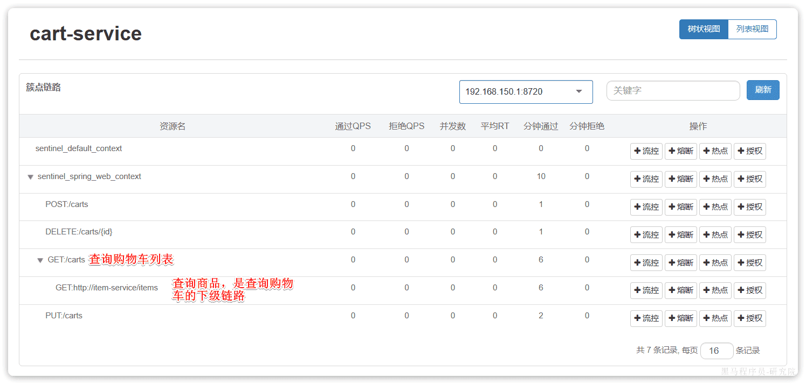​

‍

接下来，点击查询商品的FeignClient对应的簇点资源后面的流控按钮

‍

注意，这里勾选的是并发线程数限制，也就是说这个查询功能最多使用5个线程，而不是5QPS。如果查询商品的接口每秒处理2个请求，则5个线程的实际QPS在10左右，而超出的请求自然会被拒绝。

‍

‍

‍

## 服务熔断

‍

**熔断降级**：是在调用方这边加入断路器，统计对服务提供者的调用，如果调用的失败比例过高，则熔断该业务，不允许访问该服务的提供者了。

> 利用线程隔离对查询购物车业务进行隔离，保护了购物车服务的其它接口。由于查询商品的功能耗时较高（我们模拟了500毫秒延时），再加上线程隔离限定了线程数为5，导致接口吞吐能力有限，最终QPS只有10左右。这就导致了几个问题：
>
> 第一，超出的QPS上限的请求就只能抛出异常，从而导致购物车的查询失败。但从业务角度来说，即便没有查询到最新的商品信息，购物车也应该展示给用户，用户体验更好。也就是给查询失败设置一个**降级处理**逻辑。
>
> 第二，由于查询商品的延迟较高（模拟的500ms），从而导致查询购物车的响应时间也变的很长。这样不仅拖慢了购物车服务，消耗了购物车服务的更多资源，而且用户体验也很差。对于商品服务这种不太健康的接口，我们应该直接停止调用，直接走降级逻辑，避免影响到当前服务。也就是将商品查询接口**熔断**。

‍

‍

‍

### 断路器

‍

Sentinel中的断路器不仅可以统计某个接口的**慢请求比例**，还可以统计**异常请求比例**。当这些比例超出阈值时，就会**熔断**该接口，即拦截访问该接口的一切请求，降级处理；当该接口恢复正常时，再放行对于该接口的请求。

‍

断路器的工作状态切换有一个状态机来控制：

​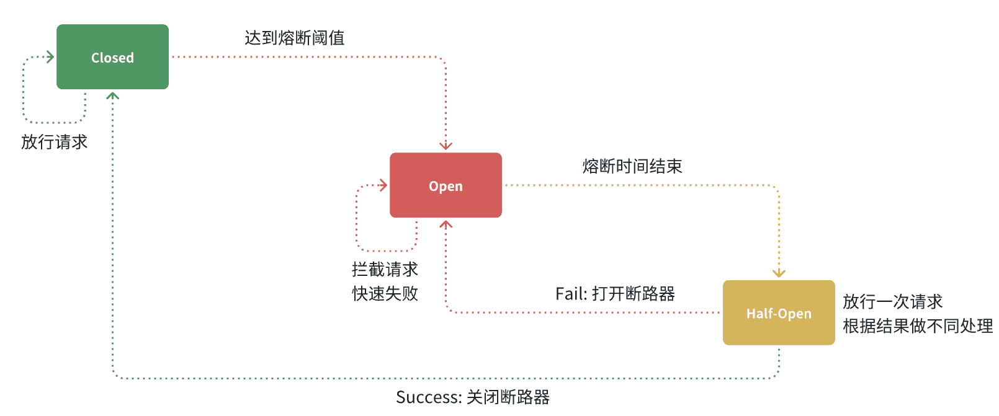​

状态机包括三个状态：

* **closed**：关闭状态，断路器放行所有请求，并开始统计异常比例、慢请求比例。超过阈值则切换到open状态
* **open**：打开状态，服务调用被**熔断**，访问被熔断服务的请求会被拒绝，快速失败，直接走降级逻辑。Open状态持续一段时间后会进入half-open状态
* **half-open**：半开状态，放行一次请求，根据执行结果来判断接下来的操作。

  * 请求成功：则切换到closed状态
  * 请求失败：则切换到open状态

‍

‍

断路器熔断策略有三种：慢调用、异常比例、异常数

‍

在控制台通过点击簇点后的**​`熔断`​**​按钮来配置熔断策略

‍

​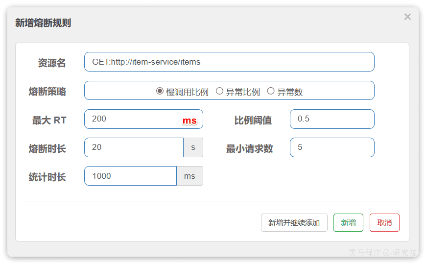​

在弹出的表格中按照慢调用比例来做熔断

* RT超过200毫秒的请求调用就是慢调用
* 统计最近1000ms内的最少5次请求，如果慢调用比例不低于0.5，则触发熔断
* 熔断持续时长20s

‍

配置完成后，再次利用Jemeter测试

> 在一开始一段时间是允许访问的，后来触发熔断后，查询商品服务的接口通过QPS直接为0，所有请求都被熔断了。而查询购物车的本身并没有受到影响。

此时整个购物车查询服务的平均RT影响不大

‍

### 熔断策略

‍

#### 慢调用

业务的响应时长（RT）大于指定时长的请求认定为慢调用请求。在指定时间内，如果请求数量超过设定的最小数量，慢调用比例大于设定的阈值，则触发熔断。

‍

> 例如解读：RT超过500ms的调用是慢调用，统计最近10000ms内的请求，如果请求量超过10次，并且慢调用比例不低于0.5，则触发熔断，熔断时长为5秒。然后进入half-open状态，放行一次请求做测试。

‍

‍

#### 异常比例、异常数

**异常比例或异常数**：统计指定时间内的调用，如果调用次数超过指定请求数，并且出现异常的比例达到设定的比例阈值（或超过指定异常数），则触发熔断。

‍

> 例如解读：统计最近1000ms内的请求，如果请求量超过10次，并且异常比例不低于0.4，则触发熔断。

‍

‍

### demo

触发限流或熔断后的请求不一定要直接报错，也可以返回一些默认数据或者友好提示，用户体验会更好。

‍

给FeignClient编写失败后的降级逻辑有两种方式：

* FallbackClass，无法对远程调用的异常做处理
* FallbackFactory，可以对远程调用的异常做处理，我们一般选择这种方式。

‍

演示方式二的失败降级处理。

‍

**步骤一**：在hm-api模块中给`ItemClient`​定义降级处理类，实现`FallbackFactory`​：

‍

代码如下：

```Java
@Slf4j
public class ItemClientFallback implements FallbackFactory<ItemClient> {
    @Override
    public ItemClient create(Throwable cause) {
        return new ItemClient() {
            @Override
            public List<ItemDTO> queryItemByIds(Collection<Long> ids) {
                log.error("远程调用ItemClient#queryItemByIds方法出现异常，参数：{}", ids, cause);
                // 查询购物车允许失败，查询失败，返回空集合
                return CollUtils.emptyList();
            }

            @Override
            public void deductStock(List<OrderDetailDTO> items) {
                // 库存扣减业务需要触发事务回滚，查询失败，抛出异常
                throw new BizIllegalException(cause);
            }
        };
    }
}
```

‍

简单:

‍

```java

@Slf4j
public class UserClientFallbackFactory implements FallbackFactory<UserClient> {
    @Override
    public UserClient create(Throwable throwable) {
        return new UserClient() {
            @Override
            public User findById(Long id) {
                log.error("查询用户异常", throwable);
                return new User();
            }
        };
    }
}

```

‍

**步骤二**：在`hm-api`​模块中的`com.hmall.api.config.DefaultFeignConfig`​类中将`ItemClientFallback`​注册为一个`Bean`​

类似

```java
@Bean
public UserClientFallbackFactory userClientFallbackFactory(){
    return new UserClientFallbackFactory();
}
```

‍

‍

**步骤三**：在`hm-api`​模块中的`ItemClient`​接口中使用`ItemClientFallbackFactory`​：

```java
@FeignClient(value = "userservice", fallbackFactory = UserClientFallbackFactory.class)
public interface UserClient {

    @GetMapping("/user/{id}")
    User findById(@PathVariable("id") Long id);
}
```

‍

重启后，再次测试，发现被限流的请求不再报错，走了降级逻辑, 

但是未被限流的请求延时依然很高, 导致最终的平局响应时间较长。

‍

查询商品的RT较高（模拟的500ms），从而导致查询购物车的RT也变的很长。这样不仅拖慢了购物车服务，消耗了购物车服务的更多资源，而且用户体验也很差。

对于商品服务这种不太健康的接口，我们应该停止调用，直接走降级逻辑，避免影响到当前服务。也就是将商品查询接口**熔断**。当商品服务接口恢复正常后，再允许调用。这其实就是**断路器**的工作模式了。

‍

## 授权规则

授权规则可以对请求方来源做判断和控制。

‍

授权规则可以对调用方的来源做控制，有白名单和黑名单两种方式。

* 白名单：来源（origin）在白名单内的调用者允许访问
* 黑名单：来源（origin）在黑名单内的调用者不允许访问

‍

点击左侧菜单的授权，可以看到授权规则：

* 资源名：就是受保护的资源，例如/order/{orderId}
* 流控应用：是来源者的名单，

  * 如果是勾选白名单，则名单中的来源被许可访问。
  * 如果是勾选黑名单，则名单中的来源被禁止访问。

‍

我们允许请求从gateway到order-service，不允许浏览器访问order-service，那么白名单中就要填写**网关的来源名称（origin）**

‍

‍

### 获取origin

Sentinel是通过RequestOriginParser这个接口的parseOrigin来获取请求的来源的。

```java
public interface RequestOriginParser {
    /**
     * 从请求request对象中获取origin，获取方式自定义
     */
    String parseOrigin(HttpServletRequest request);
}
```

‍

这个方法的作用就是从request对象中，获取请求者的origin值并返回。

默认情况下，sentinel不管请求者从哪里来，返回值永远是default，也就是说一切请求的来源都被认为是一样的值default。

‍

因此，我们需要自定义这个接口的实现，让**不同的请求，返回不同的origin**。

‍

例如order-service服务中，我们定义一个RequestOriginParser的实现类：

```java
package cn.itcast.order.sentinel;

import com.alibaba.csp.sentinel.adapter.spring.webmvc.callback.RequestOriginParser;
import org.springframework.stereotype.Component;
import org.springframework.util.StringUtils;

import javax.servlet.http.HttpServletRequest;

@Component
public class HeaderOriginParser implements RequestOriginParser {
    @Override
    public String parseOrigin(HttpServletRequest request) {
        // 1.获取请求头
        String origin = request.getHeader("origin");
        // 2.非空判断
        if (StringUtils.isEmpty(origin)) {
            origin = "blank";
        }
        return origin;
    }
}
```

我们会尝试从request-header中获取origin值

‍

‍

### 给网关添加请求头

既然获取请求origin的方式是从reques-header中获取origin值，我们必须让**所有从gateway路由到微服务的请求都带上origin头**。

‍

这个需要利用之前学习的一个GatewayFilter来实现，AddRequestHeaderGatewayFilter

‍

修改gateway服务中的application.yml，添加一个defaultFilter：

```yaml
spring:
  cloud:
    gateway:
      default-filters:
        - AddRequestHeader=origin,gateway
      routes:
       # ...略
```

这样，从gateway路由的所有请求都会带上origin头，值为gateway。而从其它地方到达微服务的请求则没有这个头。

‍

‍

### 配置授权规则

接下来，我们添加一个授权规则，放行origin值为gateway的请求。

现在，我们直接跳过网关，访问order-service服务：被拦截

‍

‍

‍

## 自定义异常结果

默认情况下，发生限流、降级、授权拦截时，都会抛出异常到调用方。异常结果都是flow limmiting（限流）。这样不够友好，无法得知是限流还是降级还是授权拦截。

‍

‍

### 异常类型

而如果要自定义异常时的返回结果，需要实现BlockExceptionHandler接口：

```java
public interface BlockExceptionHandler {
    /**
     * 处理请求被限流、降级、授权拦截时抛出的异常：BlockException
     */
    void handle(HttpServletRequest request, HttpServletResponse response, BlockException e) throws Exception;
}
```

‍

这个方法有三个参数：

* HttpServletRequest request：request对象
* HttpServletResponse response：response对象
* BlockException e：被sentinel拦截时抛出的异常

这里的BlockException包含多个不同的子类：

|**异常**|**说明**|
| ----------------------| --------------------|
|FlowException|限流异常|
|ParamFlowException|热点参数限流的异常|
|DegradeException|降级异常|
|AuthorityException|授权规则异常|
|SystemBlockException|系统规则异常|

‍

‍

### 自定义异常处理

‍

在order-service定义一个自定义异常处理类：

```java

@Component
public class SentinelExceptionHandler implements BlockExceptionHandler {
    @Override
    public void handle(HttpServletRequest request, HttpServletResponse response, BlockException e) throws Exception {
        String msg = "未知异常";
        int status = 429;

        if (e instanceof FlowException) {
            msg = "请求被限流了";
        } else if (e instanceof ParamFlowException) {
            msg = "请求被热点参数限流";
        } else if (e instanceof DegradeException) {
            msg = "请求被降级了";
        } else if (e instanceof AuthorityException) {
            msg = "没有权限访问";
            status = 401;
        }

        response.setContentType("application/json;charset=utf-8");
        response.setStatus(status);
        response.getWriter().println("{\"msg\": " + msg + ", \"status\": " + status + "}");
    }
}
```

重启测试，在不同场景下，会返回不同的异常消息

‍

‍

## 规则持久化

sentinel的所有规则都是内存存储，重启后所有规则都会丢失。在生产环境下，我们必须确保这些规则的持久化，避免丢失。

‍

‍

### 规则管理模式

规则是否能持久化，取决于规则管理模式，sentinel支持三种规则管理模式：

* 原始模式：Sentinel的默认模式，将规则保存在内存，重启服务会丢失。
* pull模式
* push模式

‍

‍

|推送模式|说明|优点|缺点|
| ----------| ------------------------------------------------------------------------------------------------------------------------------------------------------------------------------------------------------------| ------------------------------| --------------------------------------------------------------------|
|原始模式|API将规则推送至客户端并直接更新到内存中，扩展写数据源（WritableDataSource），默认就是这种|简单，无任何依赖|不保证一致性；规则保存在内存中，重启即消失。严重不建议用于生产环境|
|Pull模式|扩展写数据源（WritableDataSource）， 客户端主动向某个规则管理中心定期轮询拉取规则，这个规则中心可以是RDBMS、文件 等|简单，无任何依赖；规则持久化|不保证一致性；实时性不保证，拉取过于频繁也可能会有性能问题。|
|Push模式|扩展读数据源（ReadableDataSource），规则中心统一推送，客户端通过注册监听器的方式时刻监听变化，比如使用Nacos、Zookeeper等配置中心。这种方式有更好的实时性和一致性保证。生产环境下一般采用push模式的数据源。|规则持久化；一致性；|引入第三方依赖|

‍

‍

#### pull模式

pull模式：控制台将配置的规则推送到Sentinel客户端，而客户端会将配置规则保存在本地文件或数据库中。以后会定时去本地文件或数据库中查询，更新本地规则。

‍

#### push模式

push模式：控制台将配置规则推送到远程配置中心，例如Nacos。Sentinel客户端监听Nacos，获取配置变更的推送消息，完成本地配置更新。

‍

‍

### 实现

‍

> 注意, SentinelDashboard默认不支持nacos的持久化，需要修改源码

略过

‍

‍

## 算法逻辑

‍

‍

### 滑动窗口算法

在熔断功能中，需要统计异常请求或慢请求比例，也就是计数。在限流的时候，要统计每秒钟的QPS，同样是计数。可见计数算法在熔断限流中的应用非常多。sentinel中采用的计数器算法就是滑动窗口计数算法。

‍

‍

#### 固定窗口计数

要了解滑动窗口计数算法，我们必须先知道固定窗口计数算法，其基本原理如图：

‍

​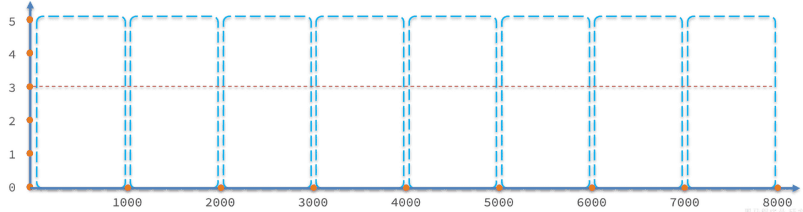​

‍

说明：

* 将时间划分为多个窗口，窗口时间跨度称为`Interval`​，本例中为1000ms；
* 每个窗口维护1个计数器，每有1次请求就将计数器`+1`​。限流就是设置计数器阈值，本例为3，图中红线标记
* 如果计数器超过了限流阈值，则超出阈值的请求都被丢弃。

‍

但是我们考虑一种特殊场景，如图：

​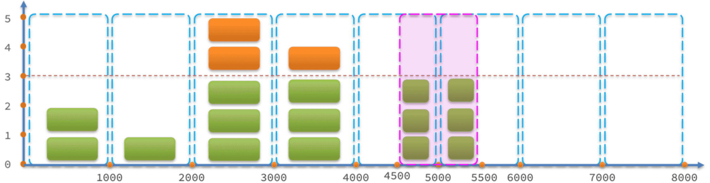​

‍

说明：

* 假如在第5、6秒，请求数量都为3，没有超过阈值，全部放行
* 但是，如果第5秒的三次请求都是在4.5~5秒之间进来；第6秒的请求是在5~5.5之间进来。那么从第4.5~5.之间就有6次请求！也就是说每秒的QPS达到了6，远超阈值。

这就是固定窗口计数算法的问题，它只能统计当前某1个时间窗的请求数量是否到达阈值，无法结合前后的时间窗的数据做综合统计。

因此，我们就需要滑动时间窗口算法来解决。

‍

‍

#### 滑动窗口计数

固定时间窗口算法中窗口有很多，其跨度和位置是与时间区间绑定，因此是很多固定不动的窗口。而滑动时间窗口算法中只包含1个固定跨度的窗口，但窗口是可移动动的，与时间区间无关。

‍

具体规则如下：

* 窗口时间跨度`Interval`​大小固定，例如1秒
* 时间区间跨度为`Interval / n`​ ，例如n=2，则时间区间跨度为500ms
* 窗口会随着当前请求所在时间`currentTime`​移动，窗口范围从`currentTime-Interval`​时刻之后的第一个时区开始，到`currentTime`​所在时区结束。

如图所示：

​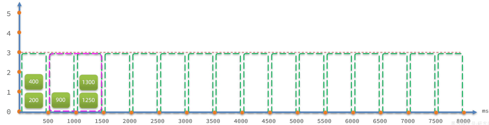​

‍

限流阈值依然为3，绿色小块就是请求，上面的数字是其`currentTime`​值。

* 在第1300ms时接收到一个请求，其所在时区就是1000~1500
* 按照规则，currentTime-Interval值为300ms，300ms之后的第一个时区是500~1000，因此窗口范围包含两个时区：500~1000、1000~1500，也就是粉红色方框部分
* 统计窗口内的请求总数，发现是3，未达到上限。

‍

若第1400ms又来一个请求，会落在1000~1500时区，虽然该时区请求总数是3，但滑动窗口内总数已经达到4，因此该请求会被拒绝：

​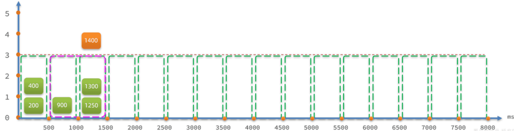​

‍

假如第1600ms又来的一个请求，处于1500~2000时区，根据算法，滑动窗口位置应该是1000~1500和1500~2000这两个时区，也就是向后移动：

​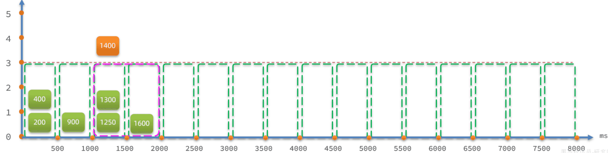​

这就是滑动窗口计数的原理，解决了我们之前所说的问题。而且滑动窗口内划分的时区越多，这种统计就越准确。

‍

‍

‍

### 令牌桶算法

限流的另一种常见算法是令牌桶算法。Sentinel中的热点参数限流正是基于令牌桶算法实现的。其基本思路如图：

‍

​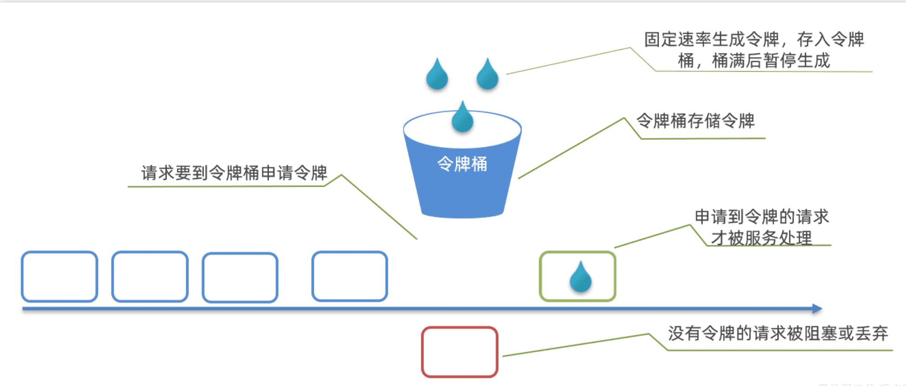​

‍

说明：

* 以固定的速率生成令牌，存入令牌桶中，如果令牌桶满了以后，多余令牌丢弃
* 请求进入后，必须先尝试从桶中获取令牌，获取到令牌后才可以被处理
* 如果令牌桶中没有令牌，则请求等待或丢弃

基于令牌桶算法，每秒产生的令牌数量基本就是QPS上限。

当然也有例外情况，例如：

* 某一秒令牌桶中产生了很多令牌，达到令牌桶上限N，缓存在令牌桶中，但是这一秒没有请求进入。
* 下一秒的前半秒涌入了超过2N个请求，之前缓存的令牌桶的令牌耗尽，同时这一秒又生成了N个令牌，于是总共放行了2N个请求。超出了我们设定的QPS阈值。

因此，在使用令牌桶算法时，尽量不要将令牌上限设定到服务能承受的QPS上限。而是预留一定的波动空间，这样我们才能应对突发流量。

‍

‍

### 漏桶算法

漏桶算法与令牌桶相似，但在设计上更适合应对**并发波动较大的场景**，以解决令牌桶中的问题。

‍

简单来说就是请求到达后不是直接处理，而是先放入一个队列。而后以固定的速率从队列中取出并处理请求。之所以叫漏桶算法，就是把请求看做水，队列看做是一个漏了的桶。

‍

如图：

​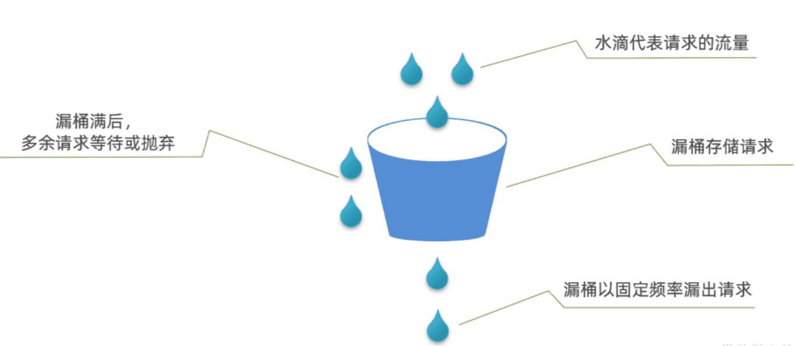​

‍

说明：

* 将每个请求视作"水滴"放入"漏桶"进行存储；
* "漏桶"以固定速率向外"漏"出请求来执行，如果"漏桶"空了则停止"漏水”；
* 如果"漏桶"满了则多余的"水滴"会被直接丢弃。

漏桶的优势就是**流量整型**，桶就像是一个大坝，请求就是水。并发量不断波动，就如图水流时大时小，但都会被大坝拦住。而后大坝按照固定的速度放水，避免下游被洪水淹没。

因此，不管并发量如何波动，经过漏桶处理后的请求一定是相对平滑的曲线：

‍

sentinel中的限流中的排队等待功能正是基于漏桶算法实现的。

‍
