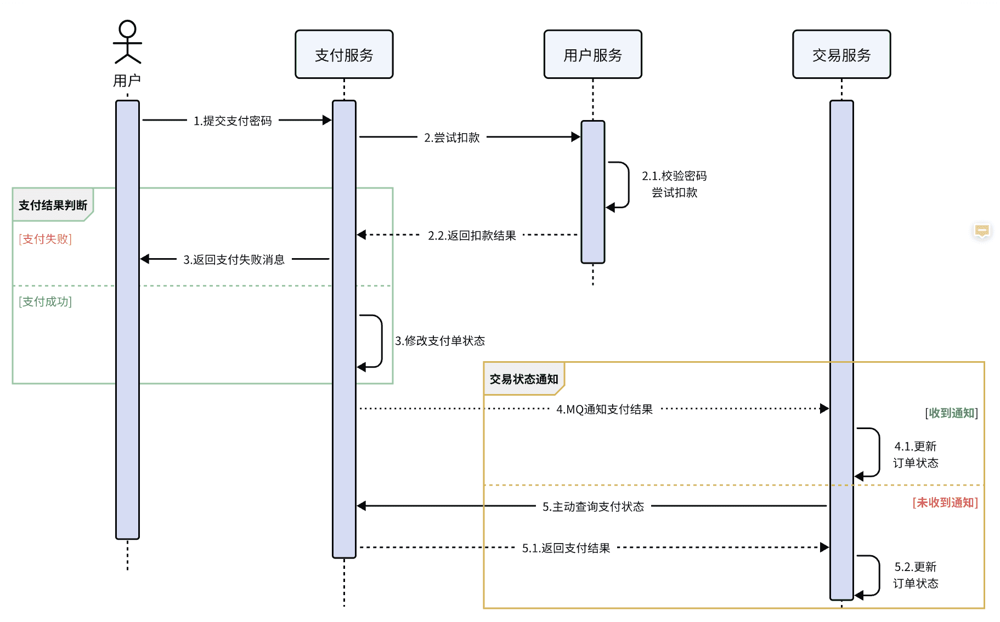
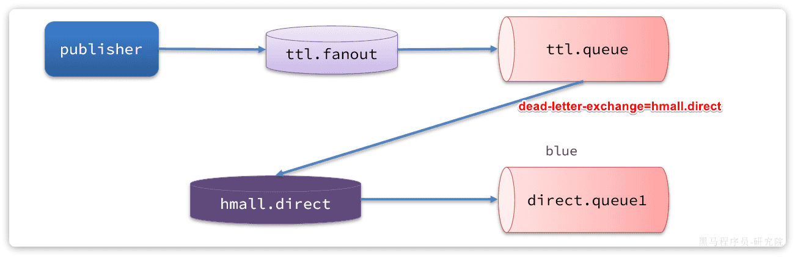
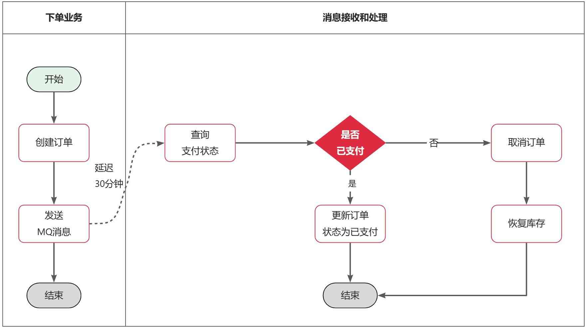

‍

‍

RabbitMQ是基于Erlang语言开发的开源消息通信中间件，官网地址：[Link](https://www.rabbitmq.com/)

目前市面上比较常用的 MQ（Message Queue，消息队列）中间件有 RabbitMQ、Kafka、RocketMQ，如果是轻量级的消息队列可以使用 Redis 提供的消息队列，本课时我们先来介绍一下 RabbitMQ。

RabbitMQ 是一个老牌开源的消息中间件，它实现了标准的 AMQP（Advanced Message Queuing Protocol，高级消息队列协议）消息中间件，使用 Erlang 语言开发，支持集群部署，和多种客户端语言混合调用

‍

### Header

‍

‍

‍

‍

# 知识

‍

‍

‍

## 评价

‍

### 优点

‍

RabbitMQ是一款使用Erlang语言开发的，实现AMQP(高级消息队列协议)的开源消息中间件. 首先要知道一些RabbitMQ的特点，[官网](https://www.rabbitmq.com/)可查：

* 可靠性. 支持持久化，传输确认，发布确认等保证了MQ的可靠性.
* 灵活的分发消息策略. 这应该是RabbitMQ的一大特点. 在消息进入MQ前由Exchange(交换机)进行路由消息. 分发消息策略有：简单模式、工作队列模式、发布订阅模式、路由模式、通配符模式.
* 支持集群. 多台RabbitMQ服务器可以组成一个集群，形成一个逻辑Broker.
* 多种协议. RabbitMQ支持多种消息队列协议，比如 STOMP、MQTT 等等.
* 支持多种语言客户端. RabbitMQ几乎支持所有常用编程语言，包括 Java、.NET、Ruby 等等.
* 可视化管理界面. RabbitMQ提供了一个易用的用户界面，使得用户可以监控和管理消息 Broker.
* 插件机制. RabbitMQ提供了许多插件，可以通过插件进行扩展，也可以编写自己的插件.

* **支持持久化**，RabbitMQ 支持磁盘持久化功能，保证了消息不会丢失；
* **高并发**，RabbitMQ 使用了 Erlang 开发语言，Erlang 是为电话交换机开发的语言，天生自带高并发光环和高可用特性；
* **支持分布式集群**，正是因为 Erlang 语言实现的，因此 RabbitMQ 集群部署也非常简单，只需要启动每个节点并使用 --link 把节点加入到集群中即可，并且 RabbitMQ 支持自动选主和自动容灾；
* **支持多种语言**，比如 Java、.NET、PHP、Python、JavaScript、Ruby、Go 等；
* **支持消息确认**，支持消息消费确认（ack）保证了每条消息可以被正常消费；
* **支持很多插件**，比如网页控制台消息管理插件、消息延迟插件等，RabbitMQ 的插件很多并且使用都很方便。

‍

### 对比

消息Broker，目前常见的实现方案就是消息队列（MessageQueue），简称为MQ.  
目比较常见的MQ实现：

* ActiveMQ
* RabbitMQ
* RocketMQ
* Kafka

‍

几种常见MQ的对比：

||**RabbitMQ**|**ActiveMQ**|**RocketMQ**|**Kafka**|
| ------------| -------------------------| --------------------------------| ------------| ------------|
|公司/社区|Rabbit|Apache|阿里|Apache|
|开发语言|Erlang|Java|Java|Scala&Java|
|协议支持|AMQP，XMPP，SMTP，STOMP|OpenWire,STOMP，REST,XMPP,AMQP|自定义协议|自定义协议|
|可用性|高|一般|高|高|
|单机吞吐量|一般|差|高|非常高|
|消息延迟|微秒级|毫秒级|毫秒级|毫秒以内|
|消息可靠性|高|一般|高|一般|

‍

追求可用性：Kafka、 RocketMQ 、RabbitMQ  
追求可靠性：RabbitMQ、RocketMQ  
追求吞吐能力：RocketMQ、Kafka  
追求消息低延迟：RabbitMQ、Kafka

据统计，目前国内消息队列使用最多的还是RabbitMQ，再加上其各方面都比较均衡，稳定性也好，因此我们课堂上选择RabbitMQ来学习。

‍

‍

‍

## 概念

‍

### 核心

3 个重要的概念：生产者、消费者和代理。

* 生产者：消息的创建者，负责创建和推送数据到消息服务器。
* 消费者：消息的接收方，用于处理数据和确认消息。
* 代理：也就是 RabbitMQ 服务本身，它用于扮演“快递”的角色，因为它本身并不生产消息，只是扮演了“快递”的角色，把消息进行暂存和传递。

‍

### 同步调用

之前说过，我们现在基于OpenFeign的调用都属于是同步调用

业务执行流程是这样的：

* 支付服务需要先调用用户服务完成余额扣减
* 然后支付服务自己要更新支付流水单的状态
* 然后支付服务调用交易服务，更新业务订单状态为已支付

‍

3个问题：  
**第一**，**拓展性差**

**第二**，**性能下降**  
由于我们采用了

**第三，级联失败**  
由于我们是

‍

* 拓展性差
* 性能下降

  * 同步调用，调用者需要等待服务提供者执行完返回结果后，才能继续向下执行，也就是说每次远程调用，调用者都是阻塞等待状态。最终整个业务的响应时长就是每次远程调用的执行时长之和
* 级联失败

  * 基于OpenFeign调用交易服务、通知服务。当交易服务、通知服务出现故障时，整个事务都会回滚，交易失败。

‍

### 异步调用

异步调用方式其实就是基于消息通知的方式，一般包含三个角色：

* 消息发送者：投递消息的人，就是原来的调用方
* 消息Broker：管理、暂存、转发消息，你可以把它理解成微信服务器
* 消息接收者：接收和处理消息的人，就是原来的服务提供方

‍

在异步调用中，发送者不再直接同步调用接收者的业务接口，而是发送一条消息投递给消息Broker。然后接收者根据自己的需求从消息Broker那里订阅消息。每当发送方发送消息后，接受者都能获取消息并处理。  
这样，发送消息的人和接收消息的人就完全解耦了。

除了扣减余额、更新支付流水单状态以外，其它调用逻辑全部取消。而是改为发送一条消息到Broker。而相关的微服务都可以订阅消息通知，一旦消息到达Broker，则会分发给每一个订阅了的微服务，处理各自的业务。

假如产品经理提出了新的需求，比如要在支付成功后更新用户积分。支付代码完全不用变更，而仅仅是让积分服务也订阅消息即可

‍

另外，不管是交易服务、通知服务，还是积分服务，他们的业务与支付关联度低。现在采用了异步调用，解除了耦合，他们即便执行过程中出现了故障，也不会影响到支付服务。

综上，异步调用的优势包括：

* 耦合度更低
* 性能更好
* 业务拓展性强
* 故障隔离，避免级联失败

当然，异步通信也并非完美无缺，它存在下列缺点：

* 完全依赖于Broker的可靠性、安全性和性能
* 架构复杂，后期维护和调试麻烦

‍

‍

# 基础

‍

## 搭建

见Linux搭建

‍

## 架构

‍

概念

* **publisher**：生产者，也就是发送消息的一方
* **consumer**：消费者，也就是消费消息的一方
* **queue**：队列，存储消息。生产者投递的消息会暂存在消息队列中，等待消费者处理
* **exchange**：交换机，负责消息路由。生产者发送的消息由交换机决定投递到哪个队列。
* **virtual host**：虚拟主机，起到数据隔离的作用。每个虚拟主机相互独立，有各自的exchange、queue

‍

‍

## 收发消息示例

‍

### 交换机

打开Exchanges选项卡, 已经存在很多交换机

点击任意交换机，即可进入交换机详情页面。利用控制台中的publish message 发送一条消息

这里是由控制台模拟了生产者发送的消息。

> 由于没有消费者存在，最终消息丢失了，说明交换机没有存储消息的能力

‍

‍

### 队列

打开`Queues`​选项卡，新建一个队列

命名为`hello.queue1`​, 再以相同的方式，创建一个队列，密码为`hello.queue2`​

再次向`amq.fanout`​交换机发送一条消息。会发现消息依然没有到达队列, 发送到交换机的消息，只会路由到与其绑定的队列，因此仅仅创建队列是不够的，还需要将其与交换机绑定

‍

‍

### 绑定关系

点击`Exchanges`​选项卡，点击`amq.fanout`​交换机，进入交换机详情页，然后点击`Bindings`​菜单，在表单中填写要绑定的队列名称

相同的方式，将hello.queue2也绑定到改交换机

‍

### 发送消息

再次回到exchange页面，找到刚刚绑定的`amq.fanout`​，点击进入详情页，再次发送一条消息

回到`Queues`​页面，可以发现`hello.queue`​中已经有一条消息了

点击队列名称，进入详情页，查看队列详情，这次我们点击get message

可以看到消息到达队列了

这个时候如果有消费者监听了MQ的`hello.queue1`​或`hello.queue2`​队列，自然就能接收到消息了

‍

‍

## 数据隔离配置

virtual host

‍

用户管理

用户管理界面新建virtual host, 绑定对应用户权限到对应的host

‍

‍

## SpringAMQP

​`RabbitMQ`​采用了AMQP协议，因此它具备跨语言的特性。任何语言只要遵循AMQP协议收发消息，都可以与`RabbitMQ`​交互。并且`RabbitMQ`​官方也提供了各种不同语言的客户端。[Spring AMQP](https://spring.io/projects/spring-amqp)

‍

三个功能

* 自动声明队列、交换机及其绑定关系
* 基于注解的监听器模式，异步接收消息
* 封装了RabbitTemplate工具，用于发送消息

‍

### 基础配置

```xml
<!--AMQP依赖，包含RabbitMQ-->
        <dependency>
            <groupId>org.springframework.boot</groupId>
            <artifactId>spring-boot-starter-amqp</artifactId>
        </dependency>
```

‍

​`application.yml`​

生产者消费者都需要

```yaml
spring:
  rabbitmq:
    host: 192.168.150.101 # 你的虚拟机IP
    port: 5672 # 端口
    virtual-host: /hmall # 虚拟主机
    username: hmall # 用户名
    password: 123 # 密码
```

```yml
  rabbitmq:
    host: 20.239.61.109
    port: 5672
    virtual-host: /
    username: root
    password: 2333
```

‍

‍

### 简单模型

> 在之前的案例中，我们都是经过交换机发送消息到队列，不过有时候为了测试方便，我们也可以直接向队列发送消息，跳过交换机。

* publisher直接发送消息到队列
* 消费者监听并处理队列中的消息

‍

这种模式一般测试使用，很少在生产中使用

‍

在控制台新建一个队列：simple.queue

利用Java代码收发消息

‍

‍

#### 消息发送

‍

在`publisher`​服务中编写测试类`SpringAmqpTest`​，并利用`RabbitTemplate`​实现消息发送

```java
@SpringBootTest
public class SpringAmqpTest {

    @Autowired
    private RabbitTemplate rabbitTemplate;

    @Test
    public void testSimpleQueue() {
        // 队列名称
        String queueName = "simple.queue";
        // 消息
        String message = "hello, spring amqp!";
        // 发送消息
        rabbitTemplate.convertAndSend(queueName, message);
    }
}
```

打开控制台，可以看到消息已经发送到队列中

‍

‍

#### 消息接收

在`consumer`​服务的`com.itheima.consumer.listener`​包中新建一个类`SpringRabbitListener`​

```java
@Component
public class SpringRabbitListener {
	// 利用RabbitListener来声明要监听的队列信息
    // 将来一旦监听的队列中有了消息，就会推送给当前服务，调用当前方法，处理消息。
    // 可以看到方法体中接收的就是消息体的内容
    @RabbitListener(queues = "simple.queue")
    public void listenSimpleQueueMessage(String msg) throws InterruptedException {
        System.out.println("spring 消费者接收到消息：【" + msg + "】");
    }
}
```

‍

#### 测试

启动consumer服务，然后在publisher服务中运行测试代码，发送MQ消息。最终consumer收到消息

‍

‍

### WorkQueues模型

‍

Work queues，任务模型。简单来说就是**让多个消费者绑定到一个队列，共同消费队列中的消息**

‍

> 当消息处理比较耗时的时候，可能生产消息的速度会远远大于消息的消费速度。长此以往，消息就会堆积越来越多，无法及时处理。  
> 此时就可以使用work模型，**多个消费者共同处理消息处理，消息处理的速度就能大大提高**了。

  

使用

* 多个消费者绑定到一个队列，同一条消息只会被一个消费者处理
* 通过设置prefetch来控制消费者预取的消息数量, 建议一次取一条

‍

‍

#### 消息发送

‍

创建一个新的队列

循环发送，模拟大量消息堆积现象

在publisher服务中的SpringAmqpTest类中添加一个测试方法

```java
@Test
public void testWorkQueue() throws InterruptedException {
    // 队列名称
    String queueName = "simple.queue";
    // 消息
    String message = "hello, message_";
    for (int i = 0; i < 50; i++) {
        // 发送消息，每20毫秒发送一次，相当于每秒发送50条消息
        rabbitTemplate.convertAndSend(queueName, message + i);
        Thread.sleep(20);
    }
}
```

‍

‍

#### 消息接收

要模拟多个消费者绑定同一个队列，在consumer服务的SpringRabbitListener中添加2个新的方法

```java
@RabbitListener(queues = "work.queue")
public void listenWorkQueue1(String msg) throws InterruptedException {
    System.out.println("消费者1接收到消息：【" + msg + "】" + LocalTime.now());
    Thread.sleep(20);
}

@RabbitListener(queues = "work.queue")
public void listenWorkQueue2(String msg) throws InterruptedException {
    System.err.println("消费者2........接收到消息：【" + msg + "】" + LocalTime.now());
    Thread.sleep(200);
}
```

‍

这两消费者，都设置了`Thead.sleep`​，模拟任务耗时：

* 消费者1 sleep了20毫秒，相当于每秒钟处理50个消息
* 消费者2 sleep了200毫秒，相当于每秒处理5个消息

‍

‍

#### 测试

‍

可以看到消费者1和消费者2竟然每人消费了25条消息：

* 消费者1很快完成了自己的25条消息
* 消费者2却在缓慢的处理自己的25条消息。

也就是说消息是平均分配给每个消费者，并没有考虑到消费者的处理能力。导致1个消费者空闲，另一个消费者忙的不可开交。没有充分利用每一个消费者的能力，最终消息处理的耗时远远超过了1秒。这样显然是有问题的

‍

‍

#### 能者多劳

‍

在spring中有一个简单的配置，可以解决这个问题

‍

每次只能获取一条消息，处理完成才能获取下一个消息

```yaml
spring:
  rabbitmq:
    listener:
      simple:
        prefetch: 1 # 每次只能获取一条消息，处理完成才能获取下一个消息
```

可以发现，由于消费者1处理速度较快，所以处理了更多的消息；消费者2处理速度较慢，只处理了6条消息。而最终总的执行耗时也在1秒左右，大大提升。  
正所谓能者多劳，这样充分利用了每一个消费者的处理能力，可以有效避免消息积压问题

‍

‍

### 交换机

‍

交换机的作用

* 接收publisher发送的消息
* 将消息按照规则路由到与之绑定的队列
* 不能缓存消息，路由失败，消息丢失
* FanoutExchange的会将消息路由到每个绑定的队列

‍

一旦引入交换机，消息发送的模式会有很大变化

‍

在订阅模型中，多了一个exchange角色，而且过程略有变化：

* **Publisher**：生产者，不再发送消息到队列中，而是发给交换机
* **Exchange**：交换机，一方面，接收生产者发送的消息。另一方面，知道如何处理消息，例如递交给某个特别队列、递交给所有队列、或是将消息丢弃。到底如何操作，取决于Exchange的类型。
* **Queue**：消息队列也与以前一样，接收消息、缓存消息。不过队列一定要与交换机绑定。
* **Consumer**：消费者，与以前一样，订阅队列，没有变化

‍

**Exchange（交换机）只负责转发消息，不具备存储消息的能力**，因此如果没有任何队列与Exchange绑定，或者没有符合路由规则的队列，那么消息会丢失

‍

交换机的类型有四种：

* **Fanout**：广播，将消息交给所有绑定到交换机的队列
* **Direct**：订阅，基于RoutingKey（路由key）发送给订阅了消息的队列

  * 此模式为一对一的发送方式，也就是一条消息只会发送给一个消费者
* **Topic**：通配符订阅，与Direct类似，只不过RoutingKey可以使用通配符

  * 为主题订阅模式，允许使用通配符`（#、*）匹配一个或者多个消息`​配到多个前缀是“[cn.mq.xxx](http://cn.mq.xxx/)”的消息，比如可以匹配到“cn.mq.rabbit”、“cn.mq.kafka”等消息。
* **Headers**：头匹配，基于MQ的消息头匹配，用的较少。

  * 允许你匹配消息的 header 而非路由键（RoutingKey），除此之外 headers 和 direct 的使用完全一致，但因为 headers 匹配的性能很差，几乎不会被用到；

‍

#### Fanout交换机

Fanout，英文翻译是扇出，在MQ中叫广播更合适。

‍

广播模式下，消息发送流程是这样的

* 1）  可以有多个队列
* 2）  每个队列都要绑定到Exchange（交换机）
* 3）  生产者发送的消息，只能发送到交换机
* 4）  交换机把消息发送给绑定过的所有队列
* 5）  订阅队列的消费者都能拿到消息

‍

* 创建一个名为`<span> </span>hmall.fanout`​​的交换机，类型是`Fanout`​​
* 创建两个队列`fanout.queue1`​​和`fanout.queue2`​​，绑定到交换机`hmall.fanout`​​

‍

##### 声明队列和交换机

绑定两个队列到交换机

‍

##### 消息发送

在publisher服务的SpringAmqpTest类中添加测试方法：

```java
@Test
public void testFanoutExchange() {
    // 交换机名称
    String exchangeName = "hmall.fanout";
    // 消息
    String message = "hello, everyone!";
    rabbitTemplate.convertAndSend(exchangeName, "", message);
}
```

‍

##### 消息接收

在consumer服务的SpringRabbitListener中添加两个方法，作为消费者：

```java
@RabbitListener(queues = "fanout.queue1")
public void listenFanoutQueue1(String msg) {
    System.out.println("消费者1接收到Fanout消息：【" + msg + "】");
}

@RabbitListener(queues = "fanout.queue2")
public void listenFanoutQueue2(String msg) {
    System.out.println("消费者2接收到Fanout消息：【" + msg + "】");
}
```

‍

‍

‍

#### Direct交换机

在Fanout模式中，一条消息，会被所有订阅的队列都消费。但是，在某些场景下，我们希望不同的消息被不同的队列消费。这时就要用到Direct类型的Exchange。

‍

在Direct模型下：

* 队列与交换机的绑定，不能是任意绑定了，而是要指定一个`RoutingKey`​（路由key）
* 消息的发送方在 向 Exchange发送消息时，也必须指定消息的 `RoutingKey`​。
* Exchange不再把消息交给每一个绑定的队列，而是根据消息的`Routing Key`​进行判断，只有队列的`Routingkey`​与消息的 `Routing key`​完全一致，才会接收到消息

‍

Direct交换机与Fanout交换机的差异

* Fanout交换机将消息路由给每一个与之绑定的队列
* Direct交换机根据RoutingKey判断路由给哪个队列
* 如果多个队列具有相同的RoutingKey，则与Fanout功能类似

‍

**操作**

1. 声明一个名为`hmall.direct`​的交换机
2. 声明队列`direct.queue1`​，绑定`hmall.direct`​，`bindingKey`​为`blud`​和`red`​
3. 声明队列`direct.queue2`​，绑定`hmall.direct`​，`bindingKey`​为`yellow`​和`red`​
4. 在`consumer`​服务中，编写两个消费者方法，分别监听direct.queue1和direct.queue2
5. 在publisher中编写测试方法，向`hmall.direct`​发送消息

‍

##### 声明队列和交换机

使用`red`​和`blue`​作为key，绑定`direct.queue1`​到`hmall.direct`​

同理，使用`red`​和`yellow`​作为key，绑定`direct.queue2`​到`hmall.direct`​

‍

##### 消息接收

在consumer服务的SpringRabbitListener中添加方法

```java
@RabbitListener(queues = "direct.queue1")
public void listenDirectQueue1(String msg) {
    System.out.println("消费者1接收到direct.queue1的消息：【" + msg + "】");
}

@RabbitListener(queues = "direct.queue2")
public void listenDirectQueue2(String msg) {
    System.out.println("消费者2接收到direct.queue2的消息：【" + msg + "】");
}
```

‍

##### 消息发送

在publisher服务的SpringAmqpTest类中添加测试方法

```java
@Test
public void testSendDirectExchange() {
    // 交换机名称
    String exchangeName = "hmall.direct";
    // 消息
    String message = "红色警报！日本乱排核废水，导致海洋生物变异，惊现哥斯拉！";
    // 发送消息
    rabbitTemplate.convertAndSend(exchangeName, "red", message);
}
```

‍

我们再切换为blue这个key, 只有消费者1收到了消息

‍

‍

#### Topic交换机

‍

​`Topic`​类型的`Exchange`​与`Direct`​相比，都是可以根据`RoutingKey`​把消息路由到不同的队列。  
只不过`Topic`​类型`Exchange`​可以让队列在绑定`BindingKey`​ 的时候使用通配符！

​`BindingKey`​ 一般都是有一个或多个单词组成，多个单词之间以`.`​分割，例如： `item.insert`​

‍

通配符规则：

* ​`#`​：匹配一个或多个词
* ​`*`​：匹配不多不少恰好1个词

* ​`item.#`​：能够匹配`item.spu.insert`​ 或者 `item.spu`​
* ​`item.*`​：只能匹配`item.spu`​

‍

假如此时publisher发送的消息使用的`RoutingKey`​共有四种：

* ​`china.news<span> </span>`​代表有中国的新闻消息；
* ​`china.weather`​ 代表中国的天气消息；
* ​`japan.news`​ 则代表日本新闻
* ​`japan.weather`​ 代表日本的天气消息；

‍

解释：

* ​`topic.queue1`​：绑定的是`china.#`​ ，凡是以 `china.`​开头的`routing key`​ 都会被匹配到，包括：

  * ​`china.news`​
  * ​`china.weather`​
* ​`topic.queue2`​：绑定的是`#.news`​ ，凡是以 `.news`​结尾的 `routing key`​ 都会被匹配。包括:

  * ​`china.news`​
  * ​`japan.news`​

‍

Direct交换机与Topic交换机的差异

* Topic交换机接收的消息RoutingKey必须是多个单词，以 `**.**`​ 分割
* Topic交换机与队列绑定时的bindingKey可以指定通配符
* ​`#`​：代表0个或多个词
* ​`*`​：代表1个词

‍

##### 创建对象

创建队列、交换机，并利用通配符绑定队列和交换机

‍

##### 消息发送

在publisher服务的SpringAmqpTest类中添加测试方法：

```java
/**
 * topicExchange
 */
@Test
public void testSendTopicExchange() {
    // 交换机名称
    String exchangeName = "hmall.topic";
    // 消息
    String message = "喜报！孙悟空大战哥斯拉，胜!";
    // 发送消息
    rabbitTemplate.convertAndSend(exchangeName, "china.news", message);
}
```

‍

‍

##### 消息接收

在consumer服务的SpringRabbitListener中添加方法：

```java
@RabbitListener(queues = "topic.queue1")
public void listenTopicQueue1(String msg){
    System.out.println("消费者1接收到topic.queue1的消息：【" + msg + "】");
}

@RabbitListener(queues = "topic.queue2")
public void listenTopicQueue2(String msg){
    System.out.println("消费者2接收到topic.queue2的消息：【" + msg + "】");
}
```

‍

‍

### 声明队列和交换机

‍

> 在之前都是基于RabbitMQ控制台来创建队列、交换机。但是在实际开发时，队列和交换机是程序员定义的，将来项目上线，又要交给运维去创建。那么程序员就需要把程序中运行的所有队列和交换机都写下来，交给运维。在这个过程中是很容易出现错误的。  
> 因此推荐的做法是由程序启动时检查队列和交换机是否存在，如果不存在自动创建

‍

#### 基本API

SpringAMQP提供了一个Queue类，用来创建队列

SpringAMQP还提供了一个Exchange接口，来表示所有不同类型的交换机

我们可以自己创建队列和交换机，不过SpringAMQP还提供了ExchangeBuilder来简化这个过程

而在绑定队列和交换机时，则需要使用BindingBuilder来创建Binding对象

‍

‍

#### fanout示例

在consumer中创建一个类，声明队列和交换机

```xml
new FanoutExchange("XXX");
```

也可以使用build

```xml
ExchangeBuilder.fanoutExchange("").build();
```

‍

这里由于都配置了Bean, 因此可以不写参数, 后面都配置为管理的对象

```java

@Configuration
public class FanoutConfig {
    /**
     * 声明交换机
     * @return Fanout类型交换机
     */
    @Bean
    public FanoutExchange fanoutExchange(){
       // ExchangeBuilder.fanoutExchange("").build();
        return new FanoutExchange("hmall.fanout");
    }

    /**
     * 第1个队列
     */
    @Bean
    public Queue fanoutQueue1(){
        return new Queue("fanout.queue1");
    }

    /**
     * 绑定队列和交换机
     */
    @Bean
    public Binding bindingQueue1(Queue fanoutQueue1, FanoutExchange fanoutExchange){
        return BindingBuilder.bind(fanoutQueue1).to(fanoutExchange);
    }

    /**
     * 第2个队列
     */
    @Bean
    public Queue fanoutQueue2(){
        return new Queue("fanout.queue2");
    }

    /**
     * 绑定队列和交换机
     */
    @Bean
    public Binding bindingQueue2(Queue fanoutQueue2, FanoutExchange fanoutExchange){
        return BindingBuilder.bind(fanoutQueue2).to(fanoutExchange);
    }

    @Bean
    public Queue fanoutQueue4(){
        return new Queue("fanout.queue4");
    }

    @Bean
    public Binding fanoutBinding4(){
        return BindingBuilder.bind(fanoutQueue4()).to(fanoutExchange());
    }
}
```

‍

‍

‍

#### direct示例

‍

direct模式由于要绑定多个KEY，会非常麻烦，每一个Key都要编写一个binding：

```java
@Configuration
public class DirectConfig {

    /**
     * 声明交换机
     * @return Direct类型交换机
     */
    @Bean
    public DirectExchange directExchange(){
        return ExchangeBuilder.directExchange("hmall.direct").build();
    }

    /**
     * 第1个队列
     */
    @Bean
    public Queue directQueue1(){
        return new Queue("direct.queue1");
    }

    /**
     * 绑定队列和交换机
     */
    @Bean
    public Binding bindingQueue1WithRed(Queue directQueue1, DirectExchange directExchange){
        return BindingBuilder.bind(directQueue1).to(directExchange).with("red");
    }
    /**
     * 绑定队列和交换机
     */
    @Bean
    public Binding bindingQueue1WithBlue(Queue directQueue1, DirectExchange directExchange){
        return BindingBuilder.bind(directQueue1).to(directExchange).with("blue");
    }

    /**
     * 第2个队列
     */
    @Bean
    public Queue directQueue2(){
        return new Queue("direct.queue2");
    }

    /**
     * 绑定队列和交换机
     */
    @Bean
    public Binding bindingQueue2WithRed(Queue directQueue2, DirectExchange directExchange){
        return BindingBuilder.bind(directQueue2).to(directExchange).with("red");
    }
    /**
     * 绑定队列和交换机
     */
    @Bean
    public Binding bindingQueue2WithYellow(Queue directQueue2, DirectExchange directExchange){
        return BindingBuilder.bind(directQueue2).to(directExchange).with("yellow");
    }
}
```

‍

‍

#### 基于注解声明

基于@Bean的方式声明队列和交换机比较麻烦(强耦合)，Spring还提供了基于注解方式来声明。

‍

value = @Queue 队列

exchange = @Exchange 交换机

key = 标签

‍

Direct模式的交换机和队列

```java
@RabbitListener(bindings = @QueueBinding(
    value = @Queue(name = "direct.queue1"),
    exchange = @Exchange(name = "hmall.direct", type = ExchangeTypes.DIRECT),
    key = {"red", "blue"}
))
public void listenDirectQueue1(String msg){
    System.out.println("消费者1接收到direct.queue1的消息：【" + msg + "】");
}

@RabbitListener(bindings = @QueueBinding(
    value = @Queue(name = "direct.queue2"),
    exchange = @Exchange(name = "hmall.direct", type = ExchangeTypes.DIRECT),
    key = {"red", "yellow"}
))
public void listenDirectQueue2(String msg){
    System.out.println("消费者2接收到direct.queue2的消息：【" + msg + "】");
}
```

‍

Topic模式

```java
@RabbitListener(bindings = @QueueBinding(
    value = @Queue(name = "topic.queue1"),
    exchange = @Exchange(name = "hmall.topic", type = ExchangeTypes.TOPIC),
    key = "china.#"
))
public void listenTopicQueue1(String msg){
    System.out.println("消费者1接收到topic.queue1的消息：【" + msg + "】");
}

@RabbitListener(bindings = @QueueBinding(
    value = @Queue(name = "topic.queue2"),
    exchange = @Exchange(name = "hmall.topic", type = ExchangeTypes.TOPIC),
    key = "#.news"
))
public void listenTopicQueue2(String msg){
    System.out.println("消费者2接收到topic.queue2的消息：【" + msg + "】");
}
```

‍

‍

### 消息转换器

Spring的消息发送代码接收的消息体是一个Object, 而在数据传输时，它会把你发送的消息序列化为字节发送给MQ，接收消息的时候，还会把字节反序列化为Java对象。

只不过，默认情况下Spring采用的序列化方式是JDK序列化。众所周知，JDK序列化存在下列问题：

* 数据体积过大
* 有安全漏洞
* 可读性差

‍

‍

#### 测试默认转换器

‍

1）创建测试队列

在consumer服务中声明一个新的配置类：MessageConfig

利用@Bean的方式创建一个队列

‍

```java

@Configuration
public class MessageConfig {

    @Bean
    public Queue objectQueue() {
        return new Queue("object.queue");
    }
}
```

‍

这里我们先不要给这个队列添加消费者，我们要查看消息体的格式。

重启consumer服务以后，该队列就会被自动创建出来了：

‍

2）发送消息

我们在publisher模块的SpringAmqpTest中新增一个消息发送的代码，发送一个Map对象：

```java
@Test
public void testSendMap() throws InterruptedException {
    // 准备消息
    Map<String,Object> msg = new HashMap<>();
    msg.put("name", "柳岩");
    msg.put("age", 21);
    // 发送消息
    rabbitTemplate.convertAndSend("object.queue", msg);
}
```

发送消息后查看控制台：

‍

可以看到消息格式非常不友好。

‍

‍

#### 配置JSON转换器

显然，JDK序列化方式并不合适。我们希望消息体的体积更小、可读性更高，因此可以使用JSON方式来做序列化和反序列化。

‍

在`publisher`​和`consumer`​两个服务中都引入依赖：

```xml
<dependency>
    <groupId>com.fasterxml.jackson.dataformat</groupId>
    <artifactId>jackson-dataformat-xml</artifactId>
    <version>2.9.10</version>
</dependency>
```

注意，如果项目中引入了`spring-boot-starter-web`​依赖，则无需再次引入`Jackson`​依赖。

‍

配置消息转换器，在`publisher`​和`consumer`​两个服务的启动类中添加一个Bean即可

```java
    @Bean
    public MessageConverter jacksonMessageConvertor(){
        return new Jackson2JsonMessageConverter();
    }
```

```java
@SpringBootApplication
public class PublisherApplication {
    public static void main(String[] args) {
        SpringApplication.run(PublisherApplication.class);
    }

    @Bean
    public MessageConverter messageConverter(){
        // 1.定义消息转换器
        Jackson2JsonMessageConverter jackson2JsonMessageConverter = new Jackson2JsonMessageConverter();
        // 2.配置自动创建消息id，用于识别不同消息，也可以在业务中基于ID判断是否是重复消息
        jackson2JsonMessageConverter.setCreateMessageIds(true);
        return jackson2JsonMessageConverter;
    }
}

```

消息转换器中添加的messageId可以便于我们将来做幂等性判断。

此时，我们到MQ控制台**删除**​`object.queue`​中的旧的消息。然后再次执行刚才的消息发送的代码，到MQ的控制台查看消息结构

‍

‍

#### 消费者接收Object

我们在consumer服务中定义一个新的消费者，publisher是用Map发送，那么消费者也一定要用Map接收，格式如下：

```java
@RabbitListener(queues = "object.queue")
public void listenSimpleQueueMessage(Map<String, Object> msg) throws InterruptedException {
    System.out.println("消费者接收到object.queue消息：【" + msg + "】");
}
```

‍

‍

## 业务改造示例

‍

案例需求：改造余额支付功能，将支付成功后基于OpenFeign的交易服务的更新订单状态接口的同步调用，改为基于RabbitMQ的异步通知

(没有代码)

‍

### 思路

只关注交易服务，步骤如下：

* 定义topic类型交换机，命名为`pay.topic`​
* 定义消息队列，命名为`mark.order.pay.queue`​
* 将`mark.order.pay.queue`​与`pay.topic`​绑定，`BindingKey`​为`pay.success`​
* 支付成功时不再调用交易服务更新订单状态的接口，而是发送一条消息到`pay.topic`​，发送消息的`RoutingKey`​ 为`pay.success`​，消息内容是订单id
* 交易服务监听`mark.order.pay.queue`​队列，接收到消息后更新订单状态为已支付

‍

### 配置MQ

不管是生产者还是消费者，都需要配置MQ的基本信息。分为两步：

‍

1）添加依赖：

```xml
  <!--消息发送-->
  <dependency>
      <groupId>org.springframework.boot</groupId>
      <artifactId>spring-boot-starter-amqp</artifactId>
  </dependency>
```

‍

2）配置MQ地址：

```yaml
spring:
  rabbitmq:
    host: 192.168.150.101 # 你的虚拟机IP
    port: 5672 # 端口
    virtual-host: /hmall # 虚拟主机
    username: hmall # 用户名
    password: 123 # 密码
```

‍

‍

#### 转换器配置

config/MqConfig

```java
@Configuration
...
    @Bean
    public MessageConverter jacksonMessageConvertor(){
        return new Jackson2JsonMessageConverter();
    }
```

‍

### 接收消息

在trade-service服务中定义一个消息监听类

listener/

```java
@Component
@RequiredArgsConstructor
public class PayStatusListener {

    private final IOrderService orderService;

    @RabbitListener(bindings = @QueueBinding(
            value = @Queue(name = "mark.order.pay.queue", durable = "true"),
            exchange = @Exchange(name = "pay.topic", type = ExchangeTypes.TOPIC),
            key = "pay.success"
    ))
    public void listenPaySuccess(Long orderId){
        orderService.markOrderPaySuccess(orderId);
    }
}
```

‍

### 发送消息

修改`pay-service`​服务下的`com.hmall.pay.service.impl.PayOrderServiceImpl`​类中的`tryPayOrderByBalance`​方法

```java
private final RabbitTemplate rabbitTemplate;

@Override
@Transactional
public void tryPayOrderByBalance(PayOrderDTO payOrderDTO) {
    // 1.查询支付单
    PayOrder po = getById(payOrderDTO.getId());
    // 2.判断状态
    if(!PayStatus.WAIT_BUYER_PAY.equalsValue(po.getStatus())){
        // 订单不是未支付，状态异常
        throw new BizIllegalException("交易已支付或关闭！");
    }
    // 3.尝试扣减余额
    userClient.deductMoney(payOrderDTO.getPw(), po.getAmount());
    // 4.修改支付单状态
    boolean success = markPayOrderSuccess(payOrderDTO.getId(), LocalDateTime.now());
    if (!success) {
        throw new BizIllegalException("交易已支付或关闭！");
    }
    // 5.修改订单状态
    // tradeClient.markOrderPaySuccess(po.getBizOrderNo());
    try {
        rabbitTemplate.convertAndSend("pay.topic", "pay.success", po.getBizOrderNo());
    } catch (Exception e) {
        log.error("支付成功的消息发送失败，支付单id：{}， 交易单id：{}", po.getId(), po.getBizOrderNo(), e);
    }
}
```

‍

‍

# 高级

‍

## 可靠性保证

‍

如何确保RabbitMQ消息的可靠性？

* 开启**生产者**确认机制，确保生产者的消息能到达队列
* 开启**持久化**功能，确保消息未消费前在队列中不会丢失
* 开启**消费者**确认机制为auto，由spring确认消息处理成功后完成ack
* 开启消费者失败重试机制，并设置MessageRecoverer，多次重试失败后将消息投递到异常交换机，交由人工处理
* 兜底

‍

‍

### 问题定位

‍

消息丢失的可能性: 

消息从生产者到消费者的每一步都可能导致消息丢失：

‍

* 发送消息时丢失：

  * 生产者发送消息时连接MQ失败
  * 生产者发送消息到达MQ后未找到`Exchange`​
  * 生产者发送消息到达MQ的`Exchange`​后，未找到合适的`Queue`​
  * 消息到达MQ后，处理消息的进程发生异常
* MQ导致消息丢失：

  * 消息到达MQ，保存到队列后，尚未消费就突然宕机
* 消费者处理消息时：

  * 消息接收后尚未处理突然宕机
  * 消息接收后处理过程中抛出异常

‍

从3个方面入手：

* 确保生产者一定把消息发送到MQ
* 确保MQ不会将消息弄丢
* 确保消费者一定要处理消息

‍

### 发送者的可靠性

‍

#### 生产者重试机制

生产者发送消息时，出现了网络故障，导致与MQ的连接中断。

为了解决这个问题，SpringAMQP提供的消息发送时的重试机制。即：当`RabbitTemplate`​与MQ连接超时后，多次重试。

‍

修改`publisher`​模块的`application.yaml`​文件

```YAML
spring:
  rabbitmq:
    connection-timeout: 1s # 设置MQ的连接超时时间
    template:
      retry:
        enabled: true # 开启超时重试机制
        initial-interval: 1000ms # 失败后的初始等待时间
        multiplier: 1 # 失败后下次的等待时长倍数，下次等待时长 = initial-interval * multiplier
        max-attempts: 3 # 最大重试次数
```

‍

我们利用命令停掉RabbitMQ服务, 然后测试发送一条消息，会发现会每隔1秒重试1次，总共重试了3次。消息发送的超时重试机制配置成功了！

‍

> **注意**：当网络不稳定的时候，利用重试机制可以有效提高消息发送的成功率。不过SpringAMQP提供的重试机制是**阻塞式**的重试，也就是说多次重试等待的过程中，当前线程是被阻塞的。
>
> 如果对于业务性能有要求，建议禁用重试机制。如果一定要使用，请合理配置等待时长和重试次数，当然也可以考虑使用异步线程来执行发送消息的代码。

‍

‍

#### 生产者确认机制

‍

一般情况下，只要生产者与MQ之间的网路连接顺畅，基本不会出现发送消息丢失的情况，因此大多数情况下我们无需考虑这种问题。

不过，在少数情况下，也会出现消息发送到MQ之后丢失的现象，比如：

* MQ内部处理消息的进程发生了异常
* 生产者发送消息到达MQ后未找到`Exchange`​
* 生产者发送消息到达MQ的`Exchange`​后，未找到合适的`Queue`​，因此无法路由

针对上述情况，RabbitMQ提供了生产者消息确认机制，包括`Publisher Confirm`​和`Publisher Return`​两种。在开启确认机制的情况下，当生产者发送消息给MQ后，MQ会根据消息处理的情况返回不同的**回执**。

‍

总结如下：

* 当消息投递到MQ，但是路由失败时，通过**Publisher Return**返回异常信息，同时返回ack的确认信息，代表投递成功
* 临时消息投递到了MQ，并且入队成功，返回ACK，告知投递成功
* 持久消息投递到了MQ，并且入队完成持久化，返回ACK ，告知投递成功
* 其它情况都会返回NACK，告知投递失败

其中`ack`​和`nack`​属于**Publisher Confirm**机制，`ack`​是投递成功；`nack`​是投递失败。而`return`​则属于**Publisher Return**机制。

默认两种机制都是关闭状态，需要通过配置文件来开启。

‍

‍

##### 实现

‍

###### 开启生产者确认

在publisher模块的`application.yaml`​​中添加配置：

```YAML
spring:
  rabbitmq:
    publisher-confirm-type: correlated # 开启publisher confirm机制，并设置confirm类型
    publisher-returns: true # 开启publisher return机制
    template:
      mandatory: true
```

​`template.mandatory`​：定义消息路由失败时的策略。true，则调用ReturnCallback；false：则直接丢弃消息

‍

这里`publisher-confirm-type`​有三种模式可选：

* ​`none`​：关闭confirm机制
* ​`simple`​：同步阻塞等待MQ的回执，直到超时
* ​`correlated`​：MQ异步回调返回回执, 定义ConfirmCallback，MQ返回结果时会回调这个ConfirmCallback

‍

一般推荐使用`correlated`​，回调机制

‍

‍

‍

###### 定义ReturnCallback

每个`RabbitTemplate`​只能配置一个`ReturnCallback`​，因此我们可以在配置类中统一设置。我们在publisher模块定义一个配置类

‍

```Java

@Slf4j
@AllArgsConstructor
@Configuration
public class MqConfig {
    private final RabbitTemplate rabbitTemplate;

    @PostConstruct
    public void init(){
        rabbitTemplate.setReturnsCallback(new RabbitTemplate.ReturnsCallback() {
            @Override
            public void returnedMessage(ReturnedMessage returned) {
                log.error("触发return callback,");
                log.debug("exchange: {}", returned.getExchange());
                log.debug("routingKey: {}", returned.getRoutingKey());
                log.debug("message: {}", returned.getMessage());
                log.debug("replyCode: {}", returned.getReplyCode());
                log.debug("replyText: {}", returned.getReplyText());
            }
        });
    }
}
```

‍

如果只用基础的注入修改配置, 写法(不推荐)

```java
@Slf4j
@Configuration
public class CommonConfig implements ApplicationContextAware {
    @Override
    public void setApplicationContext(ApplicationContext applicationContext) throws BeansException {
        // 获取RabbitTemplate
        RabbitTemplate rabbitTemplate = applicationContext.getBean(RabbitTemplate.class);
        // 设置ReturnCallback
        rabbitTemplate.setReturnCallback((message, replyCode, replyText, exchange, routingKey) -> {
            // 投递失败，记录日志
            log.info("消息发送失败，应答码{}，原因{}，交换机{}，路由键{},消息{}",
                     replyCode, replyText, exchange, routingKey, message.toString());
            // 如果有业务需要，可以重发消息
        });
    }
}
```

‍

###### 定义ConfirmCallback

由于每个消息发送时的处理逻辑不一定相同，因此ConfirmCallback需要在每次发消息时定义。具体来说，是在调用RabbitTemplate中的convertAndSend方法时，多传递一个参数CorrelationData

‍

‍

其中包含两个核心的东西：

* ​`id`​：消息的唯一标示，MQ对不同的消息的回执以此做判断，避免混淆
* ​`SettableListenableFuture`​：回执结果的Future对象

‍

将来MQ的回执就会通过这个`Future`​来返回，我们可以提前给`CorrelationData`​中的`Future`​添加回调函数来处理消息回执：

‍

‍

测试，向系统自带的交换机发送消息，并且添加`ConfirmCallback`​

```Java
@Test
void testPublisherConfirm() {
    // 1.创建CorrelationData
    CorrelationData cd = new CorrelationData();
    // 2.给Future添加ConfirmCallback
    cd.getFuture().addCallback(new ListenableFutureCallback<CorrelationData.Confirm>() {

        @Override
        public void onFailure(Throwable ex) {
            // 2.1.Future发生异常时的处理逻辑，基本不会触发
            log.error("send message fail", ex);
        }

        @Override
        public void onSuccess(CorrelationData.Confirm result) {
            // 2.2.Future接收到回执的处理逻辑，参数中的result就是回执内容
            if(result.isAck()){ // result.isAck()，boolean类型，true代表ack回执，false 代表 nack回执
                log.debug("发送消息成功，收到 ack!");
            }else{ // result.getReason()，String类型，返回nack时的异常描述
                log.error("发送消息失败，收到 nack, reason : {}", result.getReason());
            }
        }
    });
    // 3.发送消息
    rabbitTemplate.convertAndSend("hmall.direct", "q", "hello", cd);
}
```

‍

lambda改写方法

```java
    // 2.全局唯一的消息ID，需要封装到CorrelationData中
    CorrelationData correlationData = new CorrelationData(UUID.randomUUID().toString());

    // 3.添加callback
    correlationData.getFuture().addCallback(
        result -> {
            if(result.isAck()){
                // 3.1.ack，消息成功
                log.debug("消息发送成功, ID:{}", correlationData.getId());
            }else{
                // 3.2.nack，消息失败
                log.error("消息发送失败, ID:{}, 原因{}",correlationData.getId(), result.getReason());
            }
        },
        ex -> log.error("消息发送异常, ID:{}, 原因{}",correlationData.getId(),ex.getMessage())
    );
```

‍

‍

**实操结果**

可以看到，由于传递的`RoutingKey`​是错误的，路由失败后，触发了`return callback`​，同时也收到了ack。

当我们修改为正确的`RoutingKey`​以后，就不会触发`return callback`​了，只收到ack。

而如果连交换机都是错误的，则只会收到nack(失败)

‍

‍

**注意**

开启生产者确认比较消耗MQ性能，一般不建议开启。而且大家思考一下触发确认的几种情况：

* 路由失败：一般是因为RoutingKey错误导致，往往是编程导致
* 交换机名称错误：同样是编程错误导致
* MQ内部故障：这种需要处理，但概率往往较低。因此只有对消息可靠性要求非常高的业务才需要开启，而且仅仅需要开启ConfirmCallback处理nack就可以了。

‍

‍

### MQ的可靠性

消息到达MQ以后，如果MQ不能及时保存，也会导致消息丢失，所以MQ的可靠性也非常重要。

‍

消息堆积问题的解决方案？

* 队列上绑定多个消费者，提高消费速度
* 使用惰性队列，可以再mq中保存更多消息

‍

惰性队列的优点有哪些？

* 基于磁盘存储，消息上限高
* 没有间歇性的page-out，性能比较稳定

‍

惰性队列的缺点有哪些？

* 基于磁盘存储，消息时效性会降低
* 性能受限于磁盘的IO

‍

‍

#### 数据持久化

为了提升性能，默认情况下MQ的数据都是在内存存储的临时数据，重启后就会消失。为了保证数据的可靠性，必须配置数据持久化，包括：

* 交换机持久化
* 队列持久化
* 消息持久化

‍

RabbitMQ中的默认都是非持久化的, 但是AMQP封装框架都内部帮助实现了持久化

‍

##### 交换机持久化

在控制台的`Exchanges`​页面，添加交换机时可以配置交换机的`Durability`​参数

‍

SpringAMQP中可以通过代码指定交换机持久化：

```java
@Bean
public DirectExchange simpleExchange(){
    // 三个参数：交换机名称、是否持久化、当没有queue与其绑定时是否自动删除
    return new DirectExchange("simple.direct", true, false);
}
```

事实上，默认情况下，由SpringAMQP声明的交换机都是持久化的。

可以在RabbitMQ控制台看到持久化的交换机都会带上`D`​的标示

‍

##### 队列持久化

在控制台的Queues页面，添加队列时配置队列的`Durability`​参数

SpringAMQP中可以通过代码指定交换机持久化：

```java
@Bean
public Queue simpleQueue(){
    // 使用QueueBuilder构建队列，durable就是持久化的
    return QueueBuilder.durable("simple.queue").build();
}
```

事实上，默认情况下，由SpringAMQP声明的队列都是持久化的。

可以在RabbitMQ控制台看到持久化的队列都会带上`D`​的标示：

‍

‍

##### 消息持久化

在控制台发送消息的时候，可以添加很多参数，而消息的持久化是要配置一个`properties`​ : Delivery Mode

‍

> **说明**：在开启持久化机制以后，如果同时还开启了生产者确认，那么MQ会在消息持久化以后才发送ACK回执，进一步确保消息的可靠性。
>
> 不过出于性能考虑，为了减少IO次数，发送到MQ的消息并不是逐条持久化到数据库的，而是每隔一段时间批量持久化。一般间隔在100毫秒左右，这就会导致ACK有一定的延迟，因此建议生产者确认全部采用异步方式。

‍

利用SpringAMQP发送消息时，可以设置消息的属性（MessageProperties），指定delivery-mode：

* 1：非持久化
* 2：持久化

默认情况下，SpringAMQP发出的任何消息都是持久化的，不用特意指定

‍

```java
public void testDurableMessage() i

Message message = MessageBuilder
    .withBody("hello,ttl queue".getBytes(StandardCharsets.UTF_8))
    .setDeliveryMode(MessageDeliveryMode.PERSISTENT)
    .build();
```

‍

‍

#### LazyQueue惰性队列

(优秀)

‍

在默认情况下，RabbitMQ会将接收到的信息保存在内存中以降低消息收发的延迟。但在某些特殊情况下，这会导致消息积压，比如：

* 消费者宕机或出现网络故障
* 消息发送量激增，超过了消费者处理速度
* 消费者处理业务发生阻塞

‍

解决消息堆积有两种思路：

* 增加更多消费者，提高消费速度。也就是我们之前说的work queue模式
* 扩大队列容积，提高堆积上限

要提升队列容积，把消息保存在内存中显然是不行的。

‍

一旦出现消息堆积问题，RabbitMQ的内存占用就会越来越高，直到触发内存预警上限。此时RabbitMQ会将内存消息刷到磁盘上，这个行为成为`PageOut`​. `PageOut`​会耗费一段时间，并且会阻塞队列进程。因此在这个过程中RabbitMQ不会再处理新的消息，生产者的所有请求都会被阻塞。

‍

为了解决这个问题，从RabbitMQ的3.6.0版本开始，就增加了Lazy Queues的模式，也就是惰性队列

‍

特征

* 接收到消息后直接存入磁盘而非内存
* 消费者**要消费消息时**才会从磁盘中读取并加载到内存（也就是懒加载）
* 支持数百万条的消息存储

‍

而在3.12版本之后，LazyQueue已经成为所有队列的默认格式。因此官方推荐升级MQ为3.12版本或者**所有队列都设置为LazyQueue模式**。

‍

‍

##### 控制台配置Lazy模式

在添加队列的时候，添加`x-queue-mod=lazy`​参数即可设置队列为Lazy模式：

‍

已有队列, 在控制台配置policy，进入在控制台的`Admin`​页面，点击`Policies`​，即可添加配置

(选择 Queues[Classic] - Lazy mode)

‍

‍

##### 代码配置Lazy模式

‍

**基于@Bean**

在利用SpringAMQP声明队列的时候，添加`x-queue-mod=lazy`​参数也可设置队列为Lazy模式：

```Java
@Bean
public Queue lazyQueue(){
    return QueueBuilder
            .durable("lazy.queue")
            .lazy() // 开启Lazy模式
            .build();
}
```

底层源码

```java
public QueueBuilder lazy(){
    return withArgument("x-request-mode", "lazy");
}
```

‍

**基于@RabbitListener**

基于注解来声明队列并设置为Lazy模式

```Java
@RabbitListener(queuesToDeclare = @Queue(
        name = "lazy.queue",
        durable = "true",

        arguments = @Argument(name = "x-queue-mode", value = "lazy")

))
public void listenLazyQueue(String msg){
    log.info("接收到 lazy.queue的消息：{}", msg);
}
```

‍

‍

‍

##### 命令行更新已有队列为lazy模式

对于已经存在的队列，也可以配置为lazy模式，但是要通过设置policy实现。

基于命令行设置policy：

```Shell
rabbitmqctl set_policy Lazy "^lazy-queue$" '{"queue-mode":"lazy"}' --apply-to queues  
```

‍

命令解读：

* ​`rabbitmqctl`​ ：RabbitMQ的命令行工具
* ​`set_policy`​ ：添加一个策略
* ​`Lazy`​ ：策略名称，可以自定义
* ​`"^lazy-queue$"`​ ：用正则表达式匹配队列的名字
* ​`'{"queue-mode":"lazy"}'`​ ：设置队列模式为lazy模式
* ​`--apply-to queues`​：策略的作用对象，是所有的队列

‍

‍

‍

### 消费者的可靠性

当RabbitMQ向消费者投递消息以后，需要知道消费者的处理状态如何。因为消息投递给消费者并不代表就一定被正确消费了，可能出现的故障有很多，比如：

* 消息投递的过程中出现了网络故障
* 消费者接收到消息后突然宕机
* 消费者接收到消息后，因处理不当导致异常
* ...

‍

一旦发生上述情况，消息也会丢失。因此，RabbitMQ必须知道消费者的处理状态，一旦消息处理失败才能重新投递消息。

‍

‍

#### 消费者确认机制

RabbitMQ是**阅后即焚**机制，RabbitMQ确认消息被消费者消费后会立刻删除。

‍

> 设想这样的场景：
>
> * 1）RabbitMQ投递消息给消费者
> * 2）消费者获取消息后，返回ACK给RabbitMQ
> * 3）RabbitMQ删除消息
> * 4）消费者宕机，消息尚未处理
>
> 这样，消息就丢失了。因此消费者返回ACK的时机非常重要。

‍

为了确认消费者是否成功处理消息，RabbitMQ提供了消费者确认机制（**Consumer Acknowledgement**）。即：当消费者处理消息结束后，应该向RabbitMQ发送一个回执，告知RabbitMQ自己消息处理状态。回执有三种可选值：

* ack：成功处理消息，RabbitMQ从队列中删除该消息
* nack：消息处理失败，RabbitMQ需要再次投递消息
* reject：消息处理失败并拒绝该消息，RabbitMQ从队列中删除该消息

‍

一般reject方式用的较少，除非是消息格式有问题，那就是开发问题了。因此大多数情况下我们需要将消息处理的代码通过`try catch`​机制捕获，消息处理成功时返回ack，处理失败时返回nack.

‍

而SpringAMQP则允许配置三种确认模式：

* ​**​`none`​**​：不处理。即消息投递给消费者后立刻ack，消息会立刻从MQ删除。非常不安全，不建议使用
* ​**​`manual`​**​：手动模式。需要自己在业务代码中调用api，发送`ack`​或`reject`​，存在业务入侵，但更灵活
* ​**​`auto`​**​：自动模式。SpringAMQP利用AOP对我们的消息处理逻辑做了环绕增强，当业务正常执行时则自动返回`ack`​.  当业务出现异常时，根据异常判断返回不同结果：

  * 如果是**业务异常**，会自动返回`nack`​；
  * 如果是**消息处理或校验异常**，自动返回`reject`​;

‍

返回Reject的常见异常有：

> Starting with version 1.3.2, the default ErrorHandler is now a ConditionalRejectingErrorHandler that rejects (and does not requeue) messages that fail with an irrecoverable error. Specifically, it rejects messages that fail with the following errors:
>
> * o.s.amqp…MessageConversionException: Can be thrown when converting the incoming message payload using a MessageConverter.
> * o.s.messaging…MessageConversionException: Can be thrown by the conversion service if additional conversion is required when mapping to a @RabbitListener method.
> * o.s.messaging…MethodArgumentNotValidException: Can be thrown if validation (for example, @Valid) is used in the listener and the validation fails.
> * o.s.messaging…MethodArgumentTypeMismatchException: Can be thrown if the inbound message was converted to a type that is not correct for the target method. For example, the parameter is declared as Message<Foo> but Message<Bar> is received.
> * java.lang.NoSuchMethodException: Added in version 1.6.3.
> * java.lang.ClassCastException: Added in version 1.6.3.

‍

‍

##### demo

修改SpringAMQP的ACK处理方式：

```YAML
spring:
  rabbitmq:
    listener:
      simple:
        acknowledge-mode: none # 关闭ack
```

‍

‍

修改consumer服务的SpringRabbitListener类中的方法，模拟一个消息处理的异常：

```Java
@RabbitListener(queues = "simple.queue")
public void listenSimpleQueueMessage(String msg) throws InterruptedException {
    log.info("spring 消费者接收到消息：【" + msg + "】");
    if (true) {
        throw new MessageConversionException("故意的");
    }
    log.info("消息处理完成");
}
```

测试可以发现：当消息处理发生异常时，消息依然被RabbitMQ删除了。

‍

---

我们再次把确认机制修改为auto：

```YAML
spring:
  rabbitmq:
    listener:
      simple:
        acknowledge-mode: auto # 自动ack
```

在异常位置打断点，再次发送消息，程序卡在断点时，可以发现此时消息状态为`unacked`​（未确定状态）

‍

放行以后，由于抛出的是**消息转换异常**，因此Spring会自动返回`reject`​，所以消息依然会被删除：

‍

---

将异常改为RuntimeException类型：

```Java
@RabbitListener(queues = "simple.queue")
public void listenSimpleQueueMessage(String msg) throws InterruptedException {
    log.info("spring 消费者接收到消息：【" + msg + "】");
    if (true) {
        throw new RuntimeException("故意的");
    }
    log.info("消息处理完成");
}
```

在异常位置打断点，然后再次发送消息测试，程序卡在断点时，可以发现此时消息状态为`unacked`​（未确定状态）

‍

放行以后，由于抛出的是业务异常，所以Spring返回`ack`​，最终消息恢复至`Ready`​状态，并且没有被RabbitMQ删除

因此把**配置改为**​**​`auto`​**​**时，消息处理失败后，会回到RabbitMQ，并重新投递到消费**者。

‍

‍

‍

#### 失败重试机制

当消费者出现异常后，消息会不断requeue（重入队）到队列，再重新发送给消费者。如果消费者再次执行依然出错，消息会再次requeue到队列，再次投递，直到消息处理成功为止。

极端情况就是消费者一直无法执行成功，那么消息requeue就会无限循环，导致mq的消息处理飙升，带来不必要的压力

‍

消费者失败重试机制：在消费者出现异常时利用本地重试，而不是无限制的requeue到mq队列。

‍

##### demo

‍

修改consumer服务的application.yml文件，添加内容：

```YAML
spring:
  rabbitmq:
    listener:
      simple:
        retry:
          enabled: true # 开启消费者失败重试
          initial-interval: 1000ms # 初始的失败等待时长为1秒
          multiplier: 1 # 失败的等待时长倍数，下次等待时长 = multiplier * last-interval
          max-attempts: 3 # 最大重试次数
          stateless: true # true无状态；false有状态。如果业务中包含事务，这里改为false
```

‍

重启consumer服务，重复之前的测试。可以发现：

* 消费者在失败后消息没有重新回到MQ无限重新投递，而是在本地重试了3次
* 本地重试3次以后，抛出了`AmqpRejectAndDontRequeueException`​异常。查看RabbitMQ控制台，发现消息被删除了，说明最后SpringAMQP返回的是`reject`​

‍

‍

结论：

* 开启本地重试时，消息处理过程中抛出异常，不会requeue到队列，而是在消费者本地重试
* 重试达到最大次数后，Spring会返回reject，消息会被丢弃

‍

‍

#### 失败处理策略

在之前的测试中，本地测试达到最大重试次数后，消息会被丢弃。这在某些对于消息可靠性要求较高的业务场景下，显然不太合适了。

‍

‍

因此Spring允许我们自定义重试次数耗尽后的消息处理策略，这个策略是由`MessageRecovery`​接口来定义的，它有3个不同实现：

* ​`RejectAndDontRequeueRecoverer`​：重试耗尽后，直接`reject`​，丢弃消息。默认就是这种方式
* ​`ImmediateRequeueMessageRecoverer`​：重试耗尽后，返回`nack`​，消息重新入队
* ​`RepublishMessageRecoverer`​：重试耗尽后，将失败消息投递到指定的交换机 -> 优雅. 失败后将消息投递到一个指定的，专门存放异常消息的队列，后续由人工集中处理

‍

##### demo

1）在consumer服务中定义处理失败消息的交换机和队列

```Java
@Bean
public DirectExchange errorMessageExchange(){
    return new DirectExchange("error.direct");
}
@Bean
public Queue errorQueue(){
    return new Queue("error.queue", true);
}
@Bean
public Binding errorBinding(Queue errorQueue, DirectExchange errorMessageExchange){
    return BindingBuilder.bind(errorQueue).to(errorMessageExchange).with("error");
}
```

‍

2）定义一个RepublishMessageRecoverer，关联队列和交换机

```Java
@Bean
public MessageRecoverer republishMessageRecoverer(RabbitTemplate rabbitTemplate){
    return new RepublishMessageRecoverer(rabbitTemplate, "error.direct", "error");
}
```

‍

完整代码

‍

```java
@ConditionalOnProperty(name = "spring.rabbitmq.listener.simple.retry.enabled", havingValue = "true") 只有这个属性为true才生效
```

```Java
@Configuration
@ConditionalOnProperty(name = "spring.rabbitmq.listener.simple.retry.enabled", havingValue = "true")
public class ErrorMessageConfig {
    @Bean
    public DirectExchange errorMessageExchange(){
        return new DirectExchange("error.direct");
    }
    @Bean
    public Queue errorQueue(){
        return new Queue("error.queue", true);
    }
    @Bean
    public Binding errorBinding(Queue errorQueue, DirectExchange errorMessageExchange){
        return BindingBuilder.bind(errorQueue).to(errorMessageExchange).with("error");
    }

    @Bean
    public MessageRecoverer republishMessageRecoverer(RabbitTemplate rabbitTemplate){
        return new RepublishMessageRecoverer(rabbitTemplate, "error.direct", "error");
    }
}
```

‍

‍

#### 业务幂等性

‍

##### 幂等

‍

**幂等**是一个数学概念，用函数表达式来描述是这样的：`f(x) = f(f(x))`​，例如求绝对值函数。

在程序开发中，则是指同一个业务，执行一次或多次对业务状态的影响是一致的。例如：

* 根据id删除数据
* 查询数据
* 新增数据

‍

‍

##### 问题分析

‍

数据的更新往往不是幂等的，如果重复执行可能造成不一样的后果。比如：

* 取消订单，恢复库存的业务。如果多次恢复就会出现库存重复增加的情况
* 退款业务。重复退款对商家而言会有经济损失。

‍

所以，我们要尽可能避免业务被重复执行。

然而在实际业务场景中，由于意外经常会出现业务被重复执行的情况，例如：

* 页面卡顿时频繁刷新导致表单重复提交
* 服务间调用的重试
* MQ消息的重复投递

‍

在用户支付成功后会发送MQ消息到交易服务，修改订单状态为已支付，就可能出现消息重复投递的情况。如果消费者不做判断，很有可能导致消息被消费多次，出现业务故障。

‍

举例：

1. 假如用户刚刚支付完成，并且投递消息到交易服务，交易服务更改订单为**已支付**状态。
2. 由于某种原因，例如网络故障导致生产者没有得到确认，隔了一段时间后**重新投递**给交易服务。
3. 但是，在新投递的消息被消费之前，用户选择了退款，将订单状态改为了**已退款**状态。
4. 退款完成后，新投递的消息才被消费，那么订单状态会被再次改为**已支付**。业务异常。

‍

因此，我们必须想办法保证消息处理的幂等性。这里给出两种方案：

* 唯一消息ID
* 业务状态判断

‍

##### 唯一消息ID

‍

思路非常简单：

1. 每一条消息都生成一个唯一的id，与消息一起投递给消费者。
2. 消费者接收到消息后处理自己的业务，业务处理成功后将消息ID保存到数据库
3. 如果下次又收到相同消息，去数据库查询判断是否存在，存在则为重复消息放弃处理。

‍

给消息添加唯一ID呢？其实很简单，SpringAMQP的MessageConverter自带了MessageID的功能，只要开启这个功能即可

‍

以Jackson的消息转换器为例

jjmc.setCreateMessageIds(true);

```Java
@Bean
public MessageConverter messageConverter(){
    // 1.定义消息转换器
    Jackson2JsonMessageConverter jjmc = new Jackson2JsonMessageConverter();
    // 2.配置自动创建消息id，用于识别不同消息，也可以在业务中基于ID判断是否是重复消息
    jjmc.setCreateMessageIds(true);
    return jjmc;
}
```

‍

‍

##### 业务判断

业务判断就是基于业务本身的逻辑或状态来判断是否是重复的请求或消息，不同的业务场景判断的思路也不一样。

例如我们当前案例中，处理消息的业务逻辑是把订单状态从未支付修改为已支付。因此我们就可以在执行业务时判断订单状态是否是未支付，如果不是则证明订单已经被处理过，无需重复处理。

相比较而言，消息ID的方案需要改造原有的数据库，所以我更推荐使用业务判断的方案。

以支付修改订单的业务为例，我们需要修改`OrderServiceImpl`​中的`markOrderPaySuccess`​方法：

```Java
    @Override
    public void markOrderPaySuccess(Long orderId) {
        // 1.查询订单
        Order old = getById(orderId);
        // 2.判断订单状态
        if (old == null || old.getStatus() != 1) {
            // 订单不存在或者订单状态不是1，放弃处理
            return;
        }
        // 3.尝试更新订单
        Order order = new Order();
        order.setId(orderId);
        order.setStatus(2);
        order.setPayTime(LocalDateTime.now());
        updateById(order);
    }
```

‍

上述代码逻辑上符合了幂等判断的需求，但是由于判断和更新是两步动作，因此在极小概率下可能存在线程安全问题。

我们可以合并上述操作为这样：

```Java
@Override
public void markOrderPaySuccess(Long orderId) {
    // UPDATE `order` SET status = ? , pay_time = ? WHERE id = ? AND status = 1
    lambdaUpdate()
            .set(Order::getStatus, 2)
            .set(Order::getPayTime, LocalDateTime.now())
            .eq(Order::getId, orderId)
            .eq(Order::getStatus, 1)
            .update();
}
```

注意看，上述代码等同于这样的SQL语句：

```SQL
UPDATE `order` SET status = ? , pay_time = ? WHERE id = ? AND status = 1
```

我们在where条件中除了判断id以外，还加上了status必须为1的条件。如果条件不符（说明订单已支付），则SQL匹配不到数据，根本不会执行。

‍

‍

#### 兜底方案

虽然我们利用各种机制尽可能增加了消息的可靠性，但也不好说能保证消息100%的可靠。万一真的MQ通知失败该怎么办呢？

‍

既然MQ通知不一定发送到交易服务，那么交易服务就必须自己**主动去查询**支付状态。这样即便支付服务的MQ通知失败，我们依然能通过主动查询来保证订单状态的一致。

‍

流程如下

​​

图中黄色线圈起来的部分就是MQ通知失败后的兜底处理方案，由交易服务自己主动去查询支付状态。

‍

‍

> 不过需要注意的是，交易服务并不知道用户会在什么时候支付，如果查询的时机不正确（比如查询的时候用户正在支付中），可能查询到的支付状态也不正确。
>
> 那么问题来了，我们到底该在什么时间主动查询支付状态呢？
>
> 这个时间是无法确定的，因此，通常我们采取的措施就是利用**定时任务**定期查询，例如每隔20秒就查询一次，并判断支付状态。如果发现订单已经支付，则立刻更新订单状态为已支付即可。
>
> 定时任务大家之前学习过，具体的实现这里就不再赘述了。
>
> 至此，消息可靠性的问题已经解决了。

‍

综上，支付服务与交易服务之间的订单状态一致性是如何保证的？

* 首先，支付服务会正在用户支付成功以后利用MQ消息通知交易服务，完成订单状态同步。
* 其次，为了保证MQ消息的可靠性，我们采用了生产者确认机制、消费者确认、消费者失败重试等策略，确保消息投递的可靠性
* 最后，我们还在交易服务设置了定时任务，定期查询订单支付状态。这样即便MQ通知失败，还可以利用定时任务作为兜底方案，确保订单支付状态的最终一致性。

‍

‍

## 延迟消息

‍

### 概念

> 在电商的支付业务中，对于一些库存有限的商品，为了更好的用户体验，通常都会在用户下单时立刻扣减商品库存。例如电影院购票、高铁购票，下单后就会锁定座位资源，其他人无法重复购买。
>
> 但是这样就存在一个问题，假如用户下单后一直不付款，就会一直占有库存资源，导致其他客户无法正常交易，最终导致商户利益受损！
>
> 因此，电商中通常的做法就是：**对于超过一定时间未支付的订单，应该立刻取消订单并释放占用的库存**。
>
> 例如，订单支付超时时间为30分钟，则我们应该在用户下单后的第30分钟检查订单支付状态，如果发现未支付，应该立刻取消订单，释放库存。
>
> 但问题来了：如何才能准确的实现在下单后第30分钟去检查支付状态呢？
>
> 像这种在一段时间以后才执行的任务，我们称之为**延迟任务**，而要实现延迟任务，最简单的方案就是利用MQ的延迟消息了

‍

在RabbitMQ中实现延迟消息也有两种方案：

* 死信交换机 + TTL
* 延迟消息插件

‍

‍

‍

### 死信交换机

‍

‍

#### 概念

‍

当一个队列中的消息满足下列情况之一时，可以成为死信（dead letter）：

* 消费者使用`basic.reject`​​或 `basic.nack`​​声明消费失败，并且消息的`requeue`​​参数设置为false
* 消息是一个过期消息，超时无人消费
* 要投递的队列消息满了，无法投递

‍

如果一个队列中的消息已经成为死信，并且这个队列通过**​`dead-letter-exchange`​**​属性指定了一个交换机，那么队列中的死信就会投递到这个交换机中，而这个交换机就称为**死信交换机**（Dead Letter Exchange）。而此时加入有队列与死信交换机绑定，则最终死信就会被投递到这个队列中。

‍

死信交换机作用

1. 收集那些因处理失败而被拒绝的消息
2. 收集那些因队列满了而被拒绝的消息
3. 收集因TTL（有效期）到期的消息

‍

#### 延迟消息

前面两种作用场景可以看做是把死信交换机当做一种消息处理的最终兜底方案，与消费者重试时讲的`RepublishMessageRecoverer`​作用类似。

‍

而最后一种场景，设想一下这样的场景：

有一组绑定的交换机（`ttl.fanout`​）和队列（`ttl.queue`​）。但是`ttl.queue`​没有消费者监听，而是设定了死信交换机`hmall.direct`​，而队列`direct.queue1`​则与死信交换机绑定，RoutingKey是blue：

​​

假如我们现在发送一条消息到`ttl.fanout`​，RoutingKey为blue，并设置消息的**有效期**为5000毫秒：

‍

> **注意**：尽管这里的`ttl.fanout`​不需要RoutingKey，但是当消息变为死信并投递到死信交换机时，会沿用之前的RoutingKey，这样`hmall.direct`​才能正确路由消息。

‍

消息肯定会被投递到`ttl.queue`​之后，由于没有消费者，因此消息无人消费。5秒之后，消息的有效期到期，成为死信; 而只有死信被再次投递到死信交换机`hmall.direct`​，并沿用之前的RoutingKey，也就是`blue`​

由于`direct.queue1`​与`hmall.direct`​绑定的key是blue，因此最终消息被成功路由到`direct.queue1`​，如果此时有消费者与`direct.queue1`​绑定， 也就能成功消费消息了。但此时已经是5秒钟以后了

也就是说，publisher发送了一条消息，但最终consumer在5秒后才收到消息。我们成功实现了**延迟消息**。

‍

‍

#### 操作

‍

队列将死信投递给死信交换机时，必须知道两个信息：

* 死信交换机名称
* 死信交换机与死信队列绑定的RoutingKey

这样才能确保投递的消息能到达死信交换机，并且正确的路由到死信队列。

‍

例如创建交换机时候设置属性

发送死信时候头里面设置参数

‍

> **注意：** RabbitMQ的消息过期是基于追溯方式来实现的，也就是说当一个消息的TTL到期以后不一定会被移除或投递到死信交换机，而是在消息恰好处于队首时才会被处理。
>
> 当队列中消息堆积很多的时候，过期消息可能不会被按时处理，因此你设置的TTL时间不一定准确。

‍

---

在失败重试策略中，默认的RejectAndDontRequeueRecoverer会在本地重试次数耗尽后，发送reject给RabbitMQ，消息变成死信，被丢弃。

我们可以给simple.queue添加一个死信交换机，给死信交换机绑定一个队列。这样消息变成死信后也不会丢弃，而是最终投递到死信交换机，路由到与死信交换机绑定的队列。

‍

在consumer服务中，定义一组死信交换机、死信队列：

```java
// 声明普通的 simple.queue队列，并且为其指定死信交换机：dl.direct
@Bean
public Queue simpleQueue2(){
    return QueueBuilder.durable("simple.queue") // 指定队列名称，并持久化
        .deadLetterExchange("dl.direct") // 指定死信交换机
        .build();
}
// 声明死信交换机 dl.direct
@Bean
public DirectExchange dlExchange(){
    return new DirectExchange("dl.direct", true, false);
}
// 声明存储死信的队列 dl.queue
@Bean
public Queue dlQueue(){
    return new Queue("dl.queue", true);
}
// 将死信队列 与 死信交换机绑定
@Bean
public Binding dlBinding(){
    return BindingBuilder.bind(dlQueue()).to(dlExchange()).with("simple");
}
```

‍

### TTL

一个队列中的消息如果超时未消费，则会变为死信，超时分为两种情况：

* 消息所在的队列设置了超时时间
* 消息本身设置了超时时间

‍

消息超时的两种方式

* 给队列设置ttl属性，进入队列后超过ttl时间的消息变为死信
* 给消息设置ttl属性，队列接收到消息超过ttl时间后变为死信

‍

如何实现发送一个消息20秒后消费者才收到消息？

* 给消息的目标队列指定死信交换机
* 将消费者监听的队列绑定到死信交换机
* 发送消息时给消息设置超时时间为20秒

‍

‍

#### 接收超时死信的死信交换机

在consumer服务的SpringRabbitListener中，定义一个新的消费者，并且声明 死信交换机、死信队列：

```java
@RabbitListener(bindings = @QueueBinding(
    value = @Queue(name = "dl.ttl.queue", durable = "true"),
    exchange = @Exchange(name = "dl.ttl.direct"),
    key = "ttl"
))
public void listenDlQueue(String msg){
    log.info("接收到 dl.ttl.queue的延迟消息：{}", msg);
}
```

‍

‍

#### 声明队列并指定TTL

要给队列设置超时时间，需要在声明队列时配置x-message-ttl属性：

```java
@Bean
public Queue ttlQueue(){
    return QueueBuilder.durable("ttl.queue") // 指定队列名称，并持久化
        .ttl(10000) // 设置队列的超时时间，10秒
        .deadLetterExchange("dl.ttl.direct") // 指定死信交换机
        .build();
}
```

注意，这个队列设定了死信交换机为`dl.ttl.direct`​

‍

声明交换机，将ttl与交换机绑定：

```java
@Bean
public DirectExchange ttlExchange(){
    return new DirectExchange("ttl.direct");
}
@Bean
public Binding ttlBinding(){
    return BindingBuilder.bind(ttlQueue()).to(ttlExchange()).with("ttl");
}
```

‍

发送消息，但是不要指定TTL：

```java
@Test
public void testTTLQueue() {
    // 创建消息
    String message = "hello, ttl queue";
    // 消息ID，需要封装到CorrelationData中
    CorrelationData correlationData = new CorrelationData(UUID.randomUUID().toString());
    // 发送消息
    rabbitTemplate.convertAndSend("ttl.direct", "ttl", message, correlationData);
    // 记录日志
    log.debug("发送消息成功");
}
```

‍

‍

#### 发送消息时，设定TTL

```java
@Test
public void testTTLMsg() {
    // 创建消息
    Message message = MessageBuilder
        .withBody("hello, ttl message".getBytes(StandardCharsets.UTF_8))
        .setExpiration("5000")
        .build();
    // 消息ID，需要封装到CorrelationData中
    CorrelationData correlationData = new CorrelationData(UUID.randomUUID().toString());
    // 发送消息
    rabbitTemplate.convertAndSend("ttl.direct", "ttl", message, correlationData);
    log.debug("发送消息成功");
}
```

‍

‍

‍

‍

### DelayExchange插件

基于死信队列虽然可以实现延迟消息，但是太麻烦了。因此RabbitMQ社区提供了一个延迟消息插件来实现相同的效果。

[Link](https://blog.rabbitmq.com/posts/2015/04/scheduling-messages-with-rabbitmq)

‍

#### 安装

[插件](https://github.com/rabbitmq/rabbitmq-delayed-message-exchange)

‍

基于Docker安装的需要先查看RabbitMQ的插件目录对应的数据卷

‍

```Shell
docker volume inspect mq-plugins
```

结果如下：

```JSON
[
    {
        "CreatedAt": ...
        "Driver": "local",
        "Labels": null,
        "Mountpoint": "/var/lib/docker/volumes/mq-plugins/_data",
        "Name": "mq-plugins",
        "Options": null,
        "Scope": "local"
    }
]
```

找到这个挂载点位置: 于是要把插件上传到这里

执行命令，安装插件, 结果应该是 "Enable"

```Shell
docker exec -it mq rabbitmq-plugins enable rabbitmq_delayed_message_exchange
```

‍

‍

#### DelayExchange原理

DelayExchange需要将一个交换机声明为delayed类型。当我们发送消息到delayExchange时，流程如下：

* 接收消息
* 判断消息是否具备x-delay属性
* 如果有x-delay属性，说明是延迟消息，持久化到硬盘，读取x-delay值，作为延迟时间
* 返回routing not found结果给消息发送者
* x-delay时间到期后，重新投递消息到指定队列

‍

‍

#### 声明延迟交换机

‍

基于注解方式：

```java
delayed = "true"
```

```Java
@RabbitListener(bindings = @QueueBinding(
        value = @Queue(name = "delay.queue", durable = "true"),
        exchange = @Exchange(name = "delay.direct", delayed = "true"),
        key = "delay"
))
public void listenDelayMessage(String msg){
    log.info("接收到delay.queue的延迟消息：{}", msg);
}
```

‍

基于`@Bean`​的方式：

```java
.delayed() // 设置delay的属性为true
.with("delay");
```

```Java
package com.itheima.consumer.config;

@Slf4j
@Configuration
public class DelayExchangeConfig {

    @Bean
    public DirectExchange delayExchange(){
        return ExchangeBuilder
                .directExchange("delay.direct") // 指定交换机类型和名称
                .delayed() // 设置delay的属性为true
                .durable(true) // 持久化
                .build();
    }

    @Bean
    public Queue delayedQueue(){
        return new Queue("delay.queue");
    }
  
    @Bean
    public Binding delayQueueBinding(){
        return BindingBuilder.bind(delayedQueue()).to(delayExchange()).with("delay");
    }
}
```

‍

‍

#### 发送延迟消息

发送消息时，必须通过x-delay属性设定延迟时间：

```java
            // 添加延迟消息属性
            message.getMessageProperties().setDelay(5000);
```

```Java
@Test
void testPublisherDelayMessage() {
    // 1.创建消息
    String message = "hello, delayed message";
    // 2.发送消息，利用消息后置处理器添加消息头
    rabbitTemplate.convertAndSend("delay.direct", "delay", message, new MessagePostProcessor() {
        @Override
        public Message postProcessMessage(Message message) throws AmqpException {
            // 添加延迟消息属性
            message.getMessageProperties().setDelay(5000);
            return message;
        }
    });
}
```

或者用

```java
Message message = MessageBuilder
    .withBody ( "hello, delayed message"....
    .setHeader ( "x-delay",10000)
    .build();
```

‍

> **注意：** 延迟消息插件内部会维护一个本地数据库表，同时使用Elang Timers功能实现计时。如果消息的延迟时间设置较长，可能会导致堆积的延迟消息非常多，会带来较大的CPU开销，同时延迟消息的时间会存在误差。
>
> 因此，**不建议设置延迟时间过长的延迟消息**。

‍

‍

### 超时订单实操

假如订单超时支付时间为30分钟，理论上说我们应该在下单时发送一条延迟消息，延迟时间为30分钟。这样就可以在接收到消息时检验订单支付状态，关闭未支付订单。

‍

​​

‍

**取消超时订单**

设置30分钟后检测订单支付状态实现起来非常简单，但是存在两个问题:·如果并发较高，30分钟可能堆积消息过多，对MQ压力很大  
大多数订单在下单后1分钟内就会支付，但是却需要在MQ内等待30分钟，浪费资源

> 建议可以选择拆分为小段的判断时间, 10s, 20s, 1min逐渐去判断, 每次等待完继续获取下一个等待时间, 就不需要延迟消息了

‍

‍

#### 定义常量

无论是消息发送还是接收都是在交易服务完成，因此我们在`trade-service`​中定义一个常量类，用于记录交换机、队列、RoutingKey等常量：

```Java
package com.hmall.trade.constants;

public interface MQConstants {
    String DELAY_EXCHANGE_NAME = "trade.delay.direct";
    String DELAY_ORDER_QUEUE_NAME = "trade.delay.order.queue";
    String DELAY_ORDER_KEY = "delay.order.query";
}
```

‍

#### 配置MQ

在`trade-service`​模块的`pom.xml`​中引入amqp的依赖：

```XML
  <!--amqp-->
  <dependency>
      <groupId>org.springframework.boot</groupId>
      <artifactId>spring-boot-starter-amqp</artifactId>
  </dependency>
```

‍

在`trade-service`​的`application.yaml`​中添加MQ的配置：

```YAML
spring:
  rabbitmq:
    host: 192.168.150.101
    port: 5672
    virtual-host: /hmall
    username: hmall
    password: 123
```

‍

‍

#### 改造下单业务

接下来，我们改造下单业务，在下单完成后，发送延迟消息，查询支付状态。

修改`trade-service`​模块的`com.hmall.trade.service.impl.OrderServiceImpl`​类的`createOrder`​方法，添加消息发送的代码：

```java
// 5.发送延迟消息，检测订单支付状态
rabbitTemplate.convertAndSend(
    MQConstants.DELAY_EXCHANGE_NAME,
    MQConstants.DELAY_ORDER_KEY,
    order.getId( ),
    message -> {
        message.getMessageProperties().setDelay (10000)
        return message;
    });
```

这里延迟消息的时间应该是15分钟，不过我们为了测试方便，改成10秒。

‍

‍

#### 编写查询支付状态接口

由于MQ消息处理时需要查询支付状态，因此我们要在`pay-service`​模块定义一个这样的接口，并提供对应的`FeignClient`​.

‍

listener/

```Java
package com.hmall.trade.listener;

@Component
@RequiredArgsConstructor
public class OrderDelayMessageListener {

    private final IOrderService orderService;
    private final PayClient payClient;

    @RabbitListener(bindings = @QueueBinding(
            value = @Queue(name = MQConstants.DELAY_ORDER_QUEUE_NAME),
            exchange = @Exchange(name = MQConstants.DELAY_EXCHANGE_NAME, delayed = "true"),
            key = MQConstants.DELAY_ORDER_KEY
    ))
    public void listenOrderDelayMessage(Long orderId){
        // 1.查询订单
        Order order = orderService.getById(orderId);
        // 2.检测订单状态，判断是否已支付
        if(order == null || order.getStatus() != 1){
            // 订单不存在或者已经支付
            return;
        }
        // 3.未支付，需要查询支付流水状态
        PayOrderDTO payOrder = payClient.queryPayOrderByBizOrderNo(orderId);
        // 4.判断是否支付
        if(payOrder != null && payOrder.getStatus() == 3){
            // 4.1.已支付，标记订单状态为已支付
            orderService.markOrderPaySuccess(orderId);
        }else{
            // TODO 4.2.未支付，取消订单，回复库存
            orderService.cancelOrder(orderId);
        }
    }
}
```

注意，这里要在OrderServiceImpl中实现cancelOrder方法，留作作业大家自行实现。

‍

‍

‍

首先，在`hm-api`​模块定义三个类：

* PayOrderDTO：支付单的数据传输实体
* PayClient：支付系统的Feign客户端
* PayClientFallback：支付系统的fallback逻辑

‍

​`PayOrderDTO`​

```Java
/**
 * <p>
 * 支付订单
 * </p>
 */
@Data
@ApiModel(description = "支付单数据传输实体")
public class PayOrderDTO {
    @ApiModelProperty("id")
    private Long id;
    @ApiModelProperty("业务订单号")
    private Long bizOrderNo;
    @ApiModelProperty("支付单号")
    private Long payOrderNo;
    @ApiModelProperty("支付用户id")
    private Long bizUserId;
    @ApiModelProperty("支付渠道编码")
    private String payChannelCode;
    @ApiModelProperty("支付金额，单位分")
    private Integer amount;
    @ApiModelProperty("付类型，1：h5,2:小程序，3：公众号，4：扫码，5：余额支付")
    private Integer payType;
    @ApiModelProperty("付状态，0：待提交，1:待支付，2：支付超时或取消，3：支付成功")
    private Integer status;
    @ApiModelProperty("拓展字段，用于传递不同渠道单独处理的字段")
    private String expandJson;
    @ApiModelProperty("第三方返回业务码")
    private String resultCode;
    @ApiModelProperty("第三方返回提示信息")
    private String resultMsg;
    @ApiModelProperty("支付成功时间")
    private LocalDateTime paySuccessTime;
    @ApiModelProperty("支付超时时间")
    private LocalDateTime payOverTime;
    @ApiModelProperty("支付二维码链接")
    private String qrCodeUrl;
    @ApiModelProperty("创建时间")
    private LocalDateTime createTime;
    @ApiModelProperty("更新时间")
    private LocalDateTime updateTime;
}
```

‍

​`PayClient`​

```Java
package com.hmall.api.client;

@FeignClient(value = "pay-service", fallbackFactory = PayClientFallback.class)
public interface PayClient {
    /**
     * 根据交易订单id查询支付单
     * @param id 业务订单id
     * @return 支付单信息
     */
    @GetMapping("/pay-orders/biz/{id}")
    PayOrderDTO queryPayOrderByBizOrderNo(@PathVariable("id") Long id);
}
```

‍

​`PayClientFallback`​

```Java
package com.hmall.api.client.fallback;

@Slf4j
public class PayClientFallback implements FallbackFactory<PayClient> {
    @Override
    public PayClient create(Throwable cause) {
        return new PayClient() {
            @Override
            public PayOrderDTO queryPayOrderByBizOrderNo(Long id) {
                return null;
            }
        };
    }
}
```

‍

​`pay-service`​模块的`PayController`​中实现该接口

```Java
@ApiOperation("根据id查询支付单")
@GetMapping("/biz/{id}")
public PayOrderDTO queryPayOrderByBizOrderNo(@PathVariable("id") Long id){
    PayOrder payOrder = payOrderService.lambdaQuery().eq(PayOrder::getBizOrderNo, id).one();
    return BeanUtils.copyBean(payOrder, PayOrderDTO.class);
}
```

‍

‍

‍

#### 监听消息，查询支付状态

编写一个监听器，监听延迟消息，查询订单支付状态

‍

listener/

```Java
package com.hmall.trade.listener;


@Component
@RequiredArgsConstructor
public class OrderDelayMessageListener {

    private final IOrderService orderService;
    private final PayClient payClient;

    @RabbitListener(bindings = @QueueBinding(
            value = @Queue(name = MQConstants.DELAY_ORDER_QUEUE_NAME),
            exchange = @Exchange(name = MQConstants.DELAY_EXCHANGE_NAME, delayed = "true"),
            key = MQConstants.DELAY_ORDER_KEY
    ))
    public void listenOrderDelayMessage(Long orderId){
        // 1.查询订单
        Order order = orderService.getById(orderId);
        // 2.检测订单状态，判断是否已支付
        if(order == null || order.getStatus() != 1){
            // 订单不存在或者已经支付
            return;
        }
        // 3.未支付，需要查询支付流水状态
        PayOrderDTO payOrder = payClient.queryPayOrderByBizOrderNo(orderId);
        // 4.判断是否支付
        if(payOrder != null && payOrder.getStatus() == 3){
            // 4.1.已支付，标记订单状态为已支付
            orderService.markOrderPaySuccess(orderId);
        }else{
            // TODO 4.2.未支付，取消订单，回复库存
            orderService.cancelOrder(orderId);
        }
    }
}
```

> 注意，这里要在OrderServiceImpl中实现cancelOrder方法

‍

‍

‍

## 自制消息队列

MQ demo

自己写的消息队列

‍

基本消息队列的消息发送流程：

1. 建立connection
2. 创建channel
3. 利用channel声明队列
4. 利用channel向队列发送消息

‍

基本消息队列的消息接收流程：

1. 建立connection
2. 创建channel
3. 利用channel声明队列
4. 定义consumer的消费行为handleDelivery()
5. 利用channel将消费者与队列绑定

‍

发送者

```java
import com.rabbitmq.client.Channel;
import com.rabbitmq.client.Connection;
import com.rabbitmq.client.ConnectionFactory;
import org.junit.Test;

import java.io.IOException;
import java.util.concurrent.TimeoutException;

public class PublisherTest {
    @Test
    public void testSendMessage() throws IOException, TimeoutException {
        // 1.建立连接
        ConnectionFactory factory = new ConnectionFactory();
        // 1.1.设置连接参数，分别是：主机名、端口号、vhost、用户名、密码
        factory.setHost("192.168.150.101");
        factory.setPort(5672);
        factory.setVirtualHost("/");
        factory.setUsername("itcast");
        factory.setPassword("123321");
        // 1.2.建立连接
        Connection connection = factory.newConnection();

        // 2.创建通道Channel
        Channel channel = connection.createChannel();

        // 3.创建队列
        String queueName = "simple.queue";
        channel.queueDeclare(queueName, false, false, false, null);

        // 4.发送消息
        String message = "hello, rabbitmq!";
        channel.basicPublish("", queueName, null, message.getBytes());
        System.out.println("发送消息成功：【" + message + "】");

        // 5.关闭通道和连接
        channel.close();
        connection.close();

    }
}
```

‍

接收方

```java
import com.rabbitmq.client.*;

import java.io.IOException;
import java.util.concurrent.TimeoutException;

public class ConsumerTest {

    public static void main(String[] args) throws IOException, TimeoutException {
        // 1.建立连接
        ConnectionFactory factory = new ConnectionFactory();
        // 1.1.设置连接参数，分别是：主机名、端口号、vhost、用户名、密码
        factory.setHost("192.168.150.101");
        factory.setPort(5672);
        factory.setVirtualHost("/");
        factory.setUsername("itcast");
        factory.setPassword("123321");
        // 1.2.建立连接
        Connection connection = factory.newConnection();

        // 2.创建通道Channel
        Channel channel = connection.createChannel();

        // 3.创建队列
        String queueName = "simple.queue";
        channel.queueDeclare(queueName, false, false, false, null);

        // 4.订阅消息
        channel.basicConsume(queueName, true, new DefaultConsumer(channel){
            @Override
            public void handleDelivery(String consumerTag, Envelope envelope,
                                       AMQP.BasicProperties properties, byte[] body) throws IOException {
                // 5.处理消息
                String message = new String(body);
                System.out.println("接收到消息：【" + message + "】");
            }
        });
        System.out.println("等待接收消息。。。。");
    }
}
```

‍

‍

## 抽取MQ工具

‍

MQ在企业开发中的常见应用我们就学习完毕了，除了收发消息以外，消息可靠性的处理、生产者确认、消费者确认、延迟消息等等编码还是相对比较复杂的。

因此，我们需要将这些常用的操作封装为工具，方便在项目中使用。

‍

思路

* 将RabbitMQ的yaml配置抽取到nacos中，作为共享配置，替换所有微服务中的自定义MQ配置
* 在`hm-commom`​模块下编写发送消息的工具类`RabbitMqHelper`​
* 定义一个自动配置类`MqConsumeErrorAutoConfiguration`​，内容包括：

  * 声明一个交换机，名为`error.direct`​，类型为`direct`​
  * 声明一个队列，名为：`微服务名 + error.queue`​，也就是说要动态获取
  * 将队列与交换机绑定，绑定时的`RoutingKey`​就是`微服务名`​
  * 声明`RepublishMessageRecoverer`​，消费失败消息投递到上述交换机
  * 给配置类添加条件，当`spring.rabbitmq.listener.simple.retry.enabled`​为`true`​时触发

‍

RabbitMqHelper的结构如下：

```Java
public class RabbitMqHelper {

    private final RabbitTemplate rabbitTemplate;

    public void sendMessage(String exchange, String routingKey, Object msg){

    }

    public void sendDelayMessage(String exchange, String routingKey, Object msg, int delay){

    }

    public void sendMessageWithConfirm(String exchange, String routingKey, Object msg, int maxRetries){
  
    }
}
```

‍

### 1.抽取共享配置

首先，我们需要在nacos中抽取RabbitMQ的共享配置，命名为`shared-mq.yaml`​

其中只包含mq的基础共享配置，内容如下：

```YAML
spring:
  rabbitmq:
    host: ${hm.mq.host:192.168.150.101} # 主机名
    port: ${hm.mq.port:5672} # 端口
    virtual-host: ${hm.mq.vhost:/hmall} # 虚拟主机
    username: ${hm.mq.un:hmall} # 用户名
    password: ${hm.mq.pw:123} # 密码
```

‍

‍

### 2.引入依赖

在`hm-common`​模块引入要用到的一些依赖，主要包括`amqp、jackson`​。但是不要引入starter，因为我们希望可以让用户按需引入。

依赖如下：

```XML
<!--AMQP依赖-->
<dependency>
    <groupId>org.springframework.amqp</groupId>
    <artifactId>spring-amqp</artifactId>
    <scope>provided</scope>
</dependency>
<!--Spring整合Rabbit依赖-->
<dependency>
    <groupId>org.springframework.amqp</groupId>
    <artifactId>spring-rabbit</artifactId>
    <scope>provided</scope>
</dependency>
<!--json处理-->
<dependency>
    <groupId>com.fasterxml.jackson.dataformat</groupId>
    <artifactId>jackson-dataformat-xml</artifactId>
    <scope>provided</scope>
</dependency>
```

注意：依赖的`scope`​要选择`provided`​，这样依赖仅仅是用作项目编译时不报错，真正运行时需要使用者自行引入依赖。

‍

‍

### 3.封装工具

‍

在hm-common模块的`com.hmall.common.utils`​包下新建一个`RabbitMqHelper`​类：

‍

```Java
package com.hmall.common.utils;

@Slf4j
@RequiredArgsConstructor
public class RabbitMqHelper {

    private final RabbitTemplate rabbitTemplate;

    public void sendMessage(String exchange, String routingKey, Object msg){
        log.debug("准备发送消息，exchange:{}, routingKey:{}, msg:{}", exchange, routingKey, msg);
        rabbitTemplate.convertAndSend(exchange, routingKey, msg);
    }

    public void sendDelayMessage(String exchange, String routingKey, Object msg, int delay){
        rabbitTemplate.convertAndSend(exchange, routingKey, msg, message -> {
            message.getMessageProperties().setDelay(delay);
            return message;
        });
    }

    public void sendMessageWithConfirm(String exchange, String routingKey, Object msg, int maxRetries){
        log.debug("准备发送消息，exchange:{}, routingKey:{}, msg:{}", exchange, routingKey, msg);
        CorrelationData cd = new CorrelationData(UUID.randomUUID().toString(true));
        cd.getFuture().addCallback(new ListenableFutureCallback<>() {
            int retryCount;
            @Override
            public void onFailure(Throwable ex) {
                log.error("处理ack回执失败", ex);
            }
            @Override
            public void onSuccess(CorrelationData.Confirm result) {
                if (result != null && !result.isAck()) {
                    log.debug("消息发送失败，收到nack，已重试次数：{}", retryCount);
                    if(retryCount >= maxRetries){
                        log.error("消息发送重试次数耗尽，发送失败");
                        return;
                    }
                    CorrelationData cd = new CorrelationData(UUID.randomUUID().toString(true));
                    cd.getFuture().addCallback(this);
                    rabbitTemplate.convertAndSend(exchange, routingKey, msg, cd);
                    retryCount++;
                }
            }
        });
        rabbitTemplate.convertAndSend(exchange, routingKey, msg, cd);
    }
}
```

‍

‍

### 4.自动装配

最后在hm-common模块的包下定义一个配置类将`RabbitMqHelper`​注册为Bean

```Java
package com.hmall.common.config;

import com.fasterxml.jackson.databind.ObjectMapper;
import com.hmall.common.utils.RabbitMqHelper;
import org.springframework.amqp.core.RabbitTemplate;
import org.springframework.amqp.rabbit.core.RabbitTemplate;
import org.springframework.amqp.support.converter.Jackson2JsonMessageConverter;
import org.springframework.amqp.support.converter.MessageConverter;
import org.springframework.boot.autoconfigure.condition.ConditionalOnBean;
import org.springframework.boot.autoconfigure.condition.ConditionalOnClass;
import org.springframework.context.annotation.Bean;
import org.springframework.context.annotation.Configuration;

@Configuration
@ConditionalOnClass(value = {MessageConverter.class, RabbitTemplate.class})
public class MqConfig {

    @Bean
    @ConditionalOnBean(ObjectMapper.class)
    public MessageConverter messageConverter(ObjectMapper mapper){
        // 1.定义消息转换器
        Jackson2JsonMessageConverter jackson2JsonMessageConverter = new Jackson2JsonMessageConverter(mapper);
        // 2.配置自动创建消息id，用于识别不同消息
        jackson2JsonMessageConverter.setCreateMessageIds(true);
        return jackson2JsonMessageConverter;
    }

    @Bean
    public RabbitMqHelper rabbitMqHelper(RabbitTemplate rabbitTemplate){
        return new RabbitMqHelper(rabbitTemplate);
    }
}
```

‍

‍

注意：

由于hm-common模块的包名为`com.hmall.common`​，与其它微服务的包名不一致，因此无法通过扫描包使配置生效。

为了让我们的配置生效，我们需要在项目的classpath下的META-INF/spring.factories文件中声明这个配置类

‍

```Properties
org.springframework.boot.autoconfigure.EnableAutoConfiguration=\
  com.hmall.common.config.MyBatisConfig,\
  com.hmall.common.config.MqConfig,\
  com.hmall.common.config.MvcConfig
```

‍

## 集群

> 略

‍

### 集群分类

RabbitMQ的是基于Erlang语言编写，而Erlang又是一个面向并发的语言，天然支持集群模式。RabbitMQ的集群有两种模式：

‍

* **普通集群**：是一种分布式集群，将队列分散到集群的各个节点，从而提高整个集群的并发能力。
* **镜像集群**：是一种主从集群，普通集群的基础上，添加了主从备份功能，提高集群的数据可用性。

镜像集群虽然支持主从，但主从同步并不是强一致的，某些情况下可能有数据丢失的风险。因此在RabbitMQ的3.8版本以后，推出了新的功能：**仲裁队列**来代替镜像集群，底层采用Raft协议确保主从的数据一致性。

‍

‍

### 普通集群

‍

#### 集群结构和特征

普通集群，或者叫标准集群（classic cluster），具备下列特征：

* 会在集群的各个节点间共享部分数据，包括：交换机、队列元信息。不包含队列中的消息。
* 当访问集群某节点时，如果队列不在该节点，会从数据所在节点传递到当前节点并返回
* 队列所在节点宕机，队列中的消息就会丢失

结构如图：

‍

#### 部署

略

‍

‍

### 镜像集群

‍

#### 集群结构和特征

镜像集群：本质是主从模式，具备下面的特征：

* 交换机、队列、队列中的消息会在各个mq的镜像节点之间同步备份。
* 创建队列的节点被称为该队列的**主节点，备份到的其它节点叫做该队列的镜像**节点。
* 一个队列的主节点可能是另一个队列的镜像节点
* 所有操作都是主节点完成，然后同步给镜像节点
* 主宕机后，镜像节点会替代成新的主

结构如图：

‍

‍

#### 部署

略

‍

‍

### 仲裁队列

‍

‍

#### 集群特征

仲裁队列：仲裁队列是3.8版本以后才有的新功能，用来替代镜像队列，具备下列特征：

* 与镜像队列一样，都是主从模式，支持主从数据同步
* 使用非常简单，没有复杂的配置
* 主从同步基于Raft协议，强一致

‍

#### 部署

略

‍

#### Java代码创建仲裁队列

```java
@Bean
public Queue quorumQueue() {
    return QueueBuilder
        .durable("quorum.queue") // 持久化
        .quorum() // 仲裁队列
        .build();
}
```

‍

#### SpringAMQP连接MQ集群

注意，这里用address来代替host、port方式

```java
spring:
  rabbitmq:
    addresses: 192.168.150.105:8071, 192.168.150.105:8072, 192.168.150.105:8073
    username: itcast
    password: 123321
    virtual-host: /
```

‍

‍

# 实操

‍

‍

## Bugfix

‍
