--NoSQL缓存大佬

‍

‍

[Redis](https://redis.io/)是用C语言开发的一个开源的、高性能的键值对(key-value)数据库，官方提供的数据是可以达到100000+的QPS（每秒内查询次数）. 它存储的value类型比较丰富，也被称为结构化NoSql数据库

应用场景：缓存、消息队列、任务队列、分布式锁

‍

### Header

‍

# 知识

‍

## 概念

‍

‍

### NoSql

NoSql(Not Only Sql)，不仅仅是SQL，泛指非关系型数据库，NoSql数据库并不是要取代关系型数据库，而是关系型数据库的补充

关系型数据库(RDBMS)：MySQL、Oracl、DB2、SQLServer  
非关系型数据库(NoSql)：Redis、Mongo DB、MemCached

‍

### JavaRedis

Redis的Java客户端有很多，官方推荐的有三种

* ​`Jedis`​
* ​`Lettuce`​
* ​`Redisson`​

Spring对Redis客户端进行了整合，提供了**SpringDataRedis**，在Spring Boot项目中还提供了对应的Starter，即`spring-boot-starter-data-redis`​

‍

‍

## Nosql

‍

### 结构化与非结构化

传统关系型数据库是结构化数据，每一张表都有严格的约束信息：字段名、字段数据类型、字段约束等等信息，插入的数据必须遵守这些约束

而NoSql则对数据库格式没有严格约束，往往形式松散，自由. 可以是键值型, 也可以是文档型, 甚至可以是图格式

‍

‍

### 关联和非关联

传统数据库的表与表之间往往存在关联, 例如外键

而非关系型数据库不存在关联关系，要维护关系要么靠代码中的业务逻辑，要么靠数据之间的耦合

‍

‍

### 查询方式

传统关系型数据库会基于Sql语句做查询，语法有统一标准；

而不同的非关系数据库查询语法差异极大，五花八门各种各样.

‍

‍

### 事务

传统关系型数据库能满足事务ACID的原则.

而非关系型数据库往往不支持事务，或者不能严格保证ACID的特性，只能实现基本的一致性.

‍

‍

### 总结

除了上述四点以外，在存储方式、扩展性、查询性能上关系型与非关系型也都有着显著差异

‍

* 存储方式

  * 关系型数据库基于磁盘进行存储，会有大量的磁盘IO，对性能有一定影响
  * 非关系型数据库，他们的操作更多的是依赖于内存来操作，内存的读写速度会非常快，性能自然会好一些
* 扩展性

  * 关系型数据库集群模式一般是主从，主从数据一致，起到数据备份的作用，称为垂直扩展.
  * 非关系型数据库可以将数据拆分，存储在不同机器上，可以保存海量数据，解决内存大小有限的问题. 称为水平扩展.
  * 关系型数据库因为表之间存在关联关系，如果做水平扩展会给数据查询带来很多麻烦

‍

||SQL|NoSQL|
| ----------| ----------------------------------------| ----------------------------------------------|
|数据结构|结构化|非结构化|
|数据关联|关联的|无关联的|
|查询方式|SQL查询|非SQL|
|事务特性|ACID|BASE|
|存储方式|磁盘|内存|
|扩展性|垂直|水平|
|场景|数据结构固定, 业务对安全与一致性要求高|数构不固定, 性能要求高, 安全与一致性要求不高|

‍

‍

‍

## 评价

Redis诞生于2009年的全称是**Re**mote **D**ictionary **S**erver 远程词典服务器，是一个基于内存的键值型NoSQL数据库.

‍

**特征**：

* 键值（key-value）型，value支持多种不同数据结构，功能丰富
* 单线程，每个命令具备原子性
* 低延迟，速度快（基于内存、IO多路复用、良好的编码）.
* 支持数据持久化
* 支持主从集群、分片集群
* 支持多语言客户端

‍

Redis的官方网站地址：[https://redis.io/](https://redis.io/)

‍

Redis是一个基于内存的`key-value`​结构数据库

* 基于内存存储，读写性能高
* 适合存储热点数据（热点商品、咨询、新闻）

‍

两个关键字：

* 键值型
* NoSql

**键值型**，是指Redis中存储的数据都是以key、value对的形式存储，而value的形式多种多样，可以是字符串、数值、甚至json：

**NoSql**可以翻译做Not Only Sql（不仅仅是SQL），或者是No Sql（非Sql的）数据库. 是相对于传统关系型数据库而言，有很大差异的一种特殊的数据库，因此也称之为**非关系型数据库**.

‍

‍

# 基础

‍

‍

## 搭建

> 全部见Linux - Redis安装

‍

‍

‍

‍

## 命令

[官方文档](https://www.redis.net.cn/order/)

不同类型的命令称为一个group，通过help命令来查看各种不同group的命令

‍

‍

### 外围

‍

切换数据库    select

‍

### 通用

‍

通用指令是部分数据类型的，都可以使用的指令，常见的有：

* KEYS：查看符合模板的所有key
* DEL：删除一个指定的key
* EXISTS：判断key是否存在
* EXPIRE：给一个key设置有效期，有效期到期时该key会被自动删除
* TTL：查看一个KEY的剩余有效期

> **在生产环境下，不推荐使用keys 命令，因为这个命令在key过多的情况下，效率不高**

|命令|描述|
| --------------| ----------------------------------------------------------|
|KEYs pattern|查找所有符合给定模式(pattern)的key|
|EXISTs key|检查给定key是否存在|
|TYPE key|返回key所储存的值的类型|
|TTL key|返回给定key的剩余生存时间(TTL, time to live)，以秒为单位|
|DEL key|该命令用于在key存在是删除key|

‍

### Key结构

> Redis没有类似MySQL中的Table的概念，该如何区分不同类型的key呢？
>
> 例如，需要存储用户、商品信息到redis，有一个用户id是1，有一个商品id恰好也是1，此时如果使用id作为key，那就会冲突了，该怎么办？

‍

我们可以通过给key添加前缀加以区分，不过这个前缀不是随便加的，有一定的规范：

Redis的key允许有多个单词形成层级结构，多个单词之间用':'隔开，格式如下：

```
	项目名:业务名:类型:id
```

‍

这个格式并非固定，也可以根据自己的需求来删除或添加词条

‍

> 例如我们的项目名称叫 heima，有user和product两种不同类型的数据，我们可以这样定义key：
>
> * user相关的key：**heima:user:1**
> * product相关的key：**heima:product:1**
>
> 如果Value是一个Java对象，例如一个User对象，则可以将对象序列化为JSON字符串后存储：
>
> |**KEY**|**VALUE**|
> | -----------------| -------------------------------------------|
> |heima:user:1|{"id":1, "name": "Jack", "age": 21}|
> |heima:product:1|{"id":1, "name": "小米11", "price": 4999}|
>
> 并且，在Redis的桌面客户端中，还会以相同前缀作为层级结构，让数据看起来层次分明，关系清晰

‍

‍

## 数据类型

Redis存储的是key-value结构的数据，其中key是字符串类型，value有5中种常用的数据类型

‍

* 字符串：String
* 哈希：Hash
* 列表：List
* 集合：Set
* 有序集合：Sorted Set

‍

还有一些高级数据类型，比如Bitmap、HyperLogLog、GEO等，其底层都是基于上述5种基本数据类型。因此在Redis的源码中，其实只有5种数据类型。

‍

### 字符串(String)

‍

|命令|描述|
| -------------------------| -------------------------------------------------|
|SET key value|设置指定key的值|
|GET key|获取指定key的值|
|SETEX key seconds value|设置指定key的值，并将key的过期时间设为seconds秒|
|SETNX key value|只有在key不存在时设置key的值|

String类型，也就是字符串类型，是Redis中最简单的存储类型.

其value是字符串，不过根据字符串的格式不同，又可以分为3类：

* string：普通字符串
* int：整数类型，可以做自增、自减操作
* float：浮点类型，可以做自增、自减操作

不管是哪种格式，底层都是字节数组形式存储，只不过是编码方式不同. 字符串类型的最大空间不能超过512m.

‍

* SET：添加或者修改已经存在的一个String类型的键值对  
  如果key不存在则是新增，如果存在则是修改
* GET：根据key获取String类型的value
* MSET：批量添加多个String类型的键值对
* MGET：根据多个key获取多个String类型的value
* INCR：让一个整型的key自增1
* INCRBY:让一个整型的key自增并指定步长，例如：incrby num 2 让num值自增2
* INCRBYFLOAT：让一个浮点类型的数字自增并指定步长
* SETNX：添加一个String类型的键值对，前提是这个key不存在，否则不执行
* SETEX：添加一个String类型的键值对，并且指定有效期

以上命令除了INCRBYFLOAT 都是常用命令

‍

‍

### 哈希(Hash)

‍

|命令|描述|
| ----------------------| ----------------------------------------|
|HSET key field value|将哈希表key 中的字段field的值设为value|
|HGET key field|获取存储在哈希表中指定字段的值|
|HDEL key field|删除存储在哈希表中的指定字段|
|HKEYS key|获取哈希表中所有字段|
|HVALS key|获取哈希表中所有值|
|HGETALL key|获取在哈希表中指定key的所有字段和值|

Hash类型，也叫散列，其value是一个无序字典，类似于Java中的HashMap结构.

Redis Hash是一个String类型的Field和Value的映射表，Hash特别适合用于存储对象

String结构是将对象序列化为JSON字符串后存储，当需要修改对象某个字段时很不方便

Hash结构可以将对象中的每个字段独立存储，可以针对单个字段做CRUD

‍

Hash的常见命令有：

* HSET key field value：添加或者修改hash类型key的field的值
* HGET key field：获取一个hash类型key的field的值
* HMSET：批量添加多个hash类型key的field的值
* HMGET：批量获取多个hash类型key的field的值
* HGETALL：获取一个hash类型的key中的所有的field和value
* HKEYS：获取一个hash类型的key中的所有的field
* HINCRBY:让一个hash类型key的字段值自增并指定步长
* HSETNX：添加一个hash类型的key的field值，前提是这个field不存在，否则不执行

‍

### 列表(List)

‍

‍

|命令|描述|
| ----------------------------| ------------------------------------------------------------------------------------------|
|​`LPUSH`​​ key value1 [value2]|将一个或多个值插入到列表头部|
|​`LRANGE`​​ key start stop|获取列表指定范围内的元素|
|​`RPOP`​​ key|移除并获取列表最后一个元素|
|​`LLEN`​​ key|获取列表长度|
|​`BRPOP`​​ key1 [key2] timeout|移出并获取列表的最后一个元素<br />如果列表没有元素会阻塞列表直到等待超时或发现可弹出元素为止|

Redis中的List类型与Java中的LinkedList类似，可以看做是一个双向链表结构. 既可以支持正向检索和也可以支持反向检索

Redis List是简单的字符串列表，按照插入顺序排序

‍

特征也与LinkedList类似：

* 有序
* 元素可以重复
* 插入和删除快
* 查询速度一般

‍

常用来存储一个有序数据，例如：朋友圈点赞列表，评论列表等.

‍

List的常见命令有：

* LPUSH key element ... ：向列表左侧插入一个或多个元素
* LPOP key：移除并返回列表左侧的第一个元素，没有则返回nil
* RPUSH key element ... ：向列表右侧插入一个或多个元素
* RPOP key：移除并返回列表右侧的第一个元素
* LRANGE key star end：返回一段角标范围内的所有元素
* BLPOP和BRPOP：与LPOP和RPOP类似，只不过在没有元素时等待指定时间，而不是直接返回nil

‍

‍

### 集合(Set)

‍

‍

|命令|描述|
| ----------------------------| --------------------------|
|SADD key member1 [member2]|向集合添加一个或多个成员|
|SMEMBERS key|返回集合中的所有成员|
|SCARD key|获取集合的成员数|
|SINTER key1 [key2]|返回给定所有集合的交集|
|SUNION key1 [key2]|返回所有给定集合的并集|
|SDIFF key1 [key2]|返回给定所有集合的差集|
|SREM key member1 [member2]|移除集合中一个或多个成员|

‍

Redis set是String类型的无序集合. 集合成员是唯一的，这就意味着集合中不能出现重复的数据

Redis的Set结构与Java中的HashSet类似，可以看做是一个value为null的HashMap. 因为也是一个hash表，因此具备与HashSet类似的特征：

* 无序
* 元素不可重复
* 查找快
* 支持交集、并集、差集等功能

‍

Set的常见命令有：

* SADD key member ... ：向set中添加一个或多个元素
* SREM key member ... : 移除set中的指定元素
* SCARD key： 返回set中元素的个数
* SISMEMBER key member：判断一个元素是否存在于set中
* SMEMBERS：获取set中的所有元素
* SINTER key1 key2 ... ：求key1与key2的交集

‍

例如两个集合：s1和s2:

‍

求交集：SINTER s1 s2

求s1与s2的不同：SDIFF s1 s2

‍

### 有序集合(Sorted Set)

‍

‍

|命令|描述|
| ------------------------------------------| --------------------------------------------------------|
|ZADD key score1 member1 [score2 member2]|向有序集合添加一个或多个成员，或者更新已存在成员的分数|
|ZRANGE key start stop [WITHSCORES]|通过索引区间返回有序集合中指定区间内的成员|
|ZINCRBY key increment member|有序集合中对指定成员的分数加上增量increment|
|ZREM key member [member …]|移除有序集合中的一个或多个成员|

‍

‍

Redis的SortedSet是一个可排序的set集合，与Java中的TreeSet有些类似，但底层数据结构却差别很大. SortedSet中的每一个元素都带有一个score属性，可以基于score属性对元素排序，底层的实现是一个跳表（SkipList）加 hash表.

Redis Sorted Set有序集合是String类型元素的集合，且不允许重复的成员. 每个元素都会关联一个`double`​类型的分数(`score`​) . `Redis`​正是通过分数来为集合中的成员进行从小到大排序. 有序集合的成员是唯一的，但分数却可以重复.

‍

SortedSet具备下列特性：

* 可排序
* 元素不重复
* 查询速度快

‍

因为SortedSet的可排序特性，经常被用来实现排行榜这样的功能.

‍

SortedSet的常见命令有：

* ZADD key score member：添加一个或多个元素到sorted set ，如果已经存在则更新其score值
* ZREM key member：删除sorted set中的一个指定元素
* ZSCORE key member : 获取sorted set中的指定元素的score值
* ZRANK key member：获取sorted set 中的指定元素的排名
* ZCARD key：获取sorted set中的元素个数
* ZCOUNT key min max：统计score值在给定范围内的所有元素的个数
* ZINCRBY key increment member：让sorted set中的指定元素自增，步长为指定的increment值
* ZRANGE key min max：按照score排序后，获取指定排名范围内的元素
* ZRANGEBYSCORE key min max：按照score排序后，获取指定score范围内的元素
* ZDIFF、ZINTER、ZUNION：求差集、交集、并集

‍

注意：所有的排名默认都是升序，如果要降序则在**命令的Z后面添加REV即可**，例如：

* **升序**获取sorted set 中的指定元素的排名：ZRANK key member
* **降序**获取sorted set 中的指定元素的排名：ZREVRANK key memeber

‍

‍

‍

### RedisObject

不管是任何一种数据类型，最终都会封装为RedisObject格式，它是一种结构体，C语言中的一种结构，可以理解为Java中的类。

‍

结构大概是这样的：

‍

​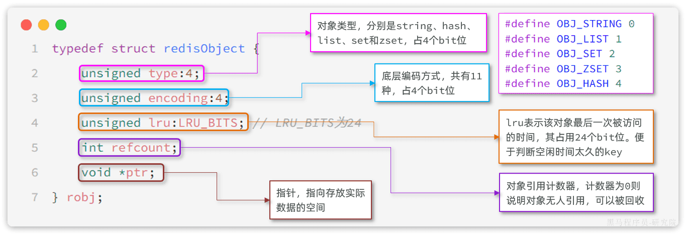​

‍

‍

可以看到整个结构体中并不包含真实的数据，仅仅是对象头信息，内存占用的大小为4+4+24+32+64 = 128bit

也就是16字节，然后指针`ptr`​指针指向的才是真实数据存储的内存地址。所以RedisObject的内存开销是很大的。

属性中的`encoding`​就是当前对象底层采用的**数据结构**或**编码方式**，可选的有11种之多：

|**编号**|**编码方式**|**说明**|
| ----| ---------------------------------| ------------------------|
|0|OBJ\_ENCODING\_RAW|raw编码动态字符串|
|1|OBJ\_ENCODING\_INT|long类型的整数的字符串|
|2|OBJ\_ENCODING\_HT|hash表（也叫dict）|
|3|OBJ\_ENCODING\_ZIPMAP|已废弃|
|4|OBJ\_ENCODING\_LINKEDLIST|双端链表|
|5|OBJ\_ENCODING\_ZIPLIST|压缩列表|
|6|OBJ\_ENCODING\_INTSET|整数集合|
|7|OBJ\_ENCODING\_SKIPLIST|跳表|
|8|OBJ\_ENCODING\_EMBSTR|embstr编码的动态字符串|
|9|OBJ\_ENCODING\_QUICKLIST|快速列表|
|10|OBJ\_ENCODING\_STREAM|Stream流|
|11|OBJ\_ENCODING\_LISTPACK|紧凑列表|

‍

Redis中的5种不同的数据类型采用的底层数据结构和编码方式如下：

|**数据类型**|**编码方式**|
| --------| ----------------------------------------|
|STRING|​`int`​、`embstr`​、`raw`​|
|LIST|​`LinkedList和ZipList`​(3.2以前)、`QuickList`​（3.2以后）|
|SET|​`intset`​、`HT`​|
|ZSET|​`ZipList`​（7.0以前）、`Listpack`​（7.0以后）、`HT`​、`SkipList`​|
|HASH|​`ZipList`​（7.0以前）、`Listpack`​（7.0以后）、`HT`​|

这些数据类型比较复杂，我们**重点讲解几个面试会问**的，其它的大家可以查看黑马程序员发布的Redis专业课程：

‍

‍

### SkipList

‍

SkipList（跳表）首先是链表，但与传统链表相比有几点差异：

* 元素按照升序排列存储
* 节点可能包含多个指针，指针跨度不同。

传统链表只有指向前后元素的指针，因此只能顺序依次访问。如果查找的元素在链表中间，查询的效率会比较低。而SkipList则不同，它内部包含跨度不同的多级指针，可以让我们跳跃查找链表中间的元素，效率非常高。

‍

其结构如图：

​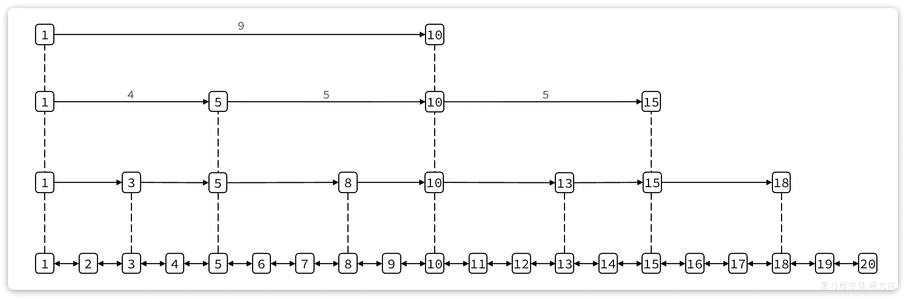​

‍

我们可以看到1号元素就有指向3、5、10的多个指针，查询时就可以跳跃查找。例如我们要找大小为14的元素，查找的流程是这样的：

​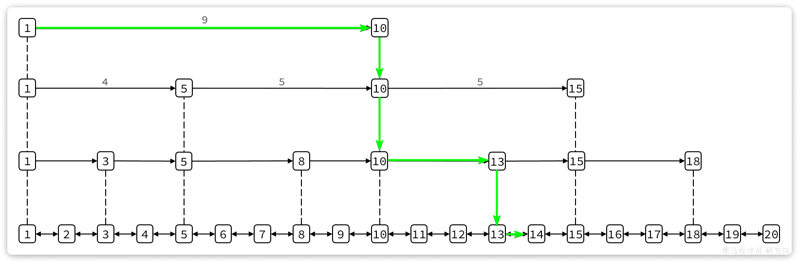​

* 首先找元素1节点最高级指针，也就是4级指针，起始元素大小为1，指针跨度为9，可以判断出目标元素大小为10。由于14比10大，肯定要从10这个元素向下接着找。
* 找到10这个元素，发现10这个元素的最高级指针跨度为5，判断出目标元素大小为15，大于14，需要判断下级指针
* 10这个元素的2级指针跨度为3，判断出目标元素为13，小于14，因此要基于元素13接着找
* 13这个元素最高级级指针跨度为2，判断出目标元素为15，比14大，需要判断下级指针。
* 13的下级指针跨度为1，因此目标元素是14，刚好于目标一致，找到。

这种多级指针的查询方式就避免了传统链表的逐个遍历导致的查询效率下降问题。在对有序数据做随机查询和排序时效率非常高。

‍

跳表的结构体如下：

```C
typedef struct zskiplist {
    // 头尾节点指针
    struct zskiplistNode *header, *tail;
    // 节点数量
    unsigned long length;
    // 最大的索引层级
    int level;
} zskiplist;
```

可以看到SkipList主要属性是header和tail，也就是头尾指针，因此它是支持双向遍历的。

‍

跳表中节点的结构体如下：

```C
typedef struct zskiplistNode {
    sds ele; // 节点存储的字符串
    double score;// 节点分数，排序、查找用
    struct zskiplistNode *backward; // 前一个节点指针
    struct zskiplistLevel {
        struct zskiplistNode *forward; // 下一个节点指针
        unsigned long span; // 索引跨度
    } level[]; // 多级索引数组
} zskiplistNode;
```

每个节点中都包含ele和score两个属性，其中score是得分，也就是节点排序的依据。ele则是节点存储的字符串数据指针。

其内存结构如下：

‍

​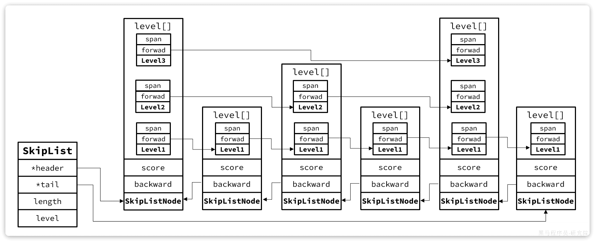​

‍

‍

### SortedSet

Redis的`SortedSet`​底层的数据结构是怎样的？

SortedSet是有序集合，底层的存储的每个数据都包含element和score两个值。score是得分，element则是字符串值。SortedSet会根据每个element的score值排序，形成有序集合。

‍

它支持的操作很多，比如：

* 根据element查询score值
* 按照score值升序或降序查询element

‍

要实现根据element查询对应的score值，就必须实现element与score之间的键值映射。SortedSet底层是基于**HashTable**来实现的。

要实现对score值排序，并且查询效率还高，就需要有一种高效的有序数据结构，SortedSet是基于**跳表**实现的。

‍

加分项：因为SortedSet底层需要用到两种数据结构，对内存占用比较高。因此Redis底层会对SortedSet中的元素大小做判断。如果**元素大小小于128**且**每个元素都小于64字节**，SortedSet底层会采用**ZipList**，也就是**压缩列**表来代替**HashTable**和**SkipList**

不过，`ZipList`​存在连锁更新问题，因此而在Redis7.0版本以后，`ZipList`​又被替换为**Listpack**（紧凑列表）。

Redis源码中`zset`​，也就是`SortedSet`​的结构体如下：

```C
typedef struct zset {
    dict *dict; // dict，底层就是HashTable
    zskiplist *zsl; // 跳表
} zset;
```

其内存结构如图：

​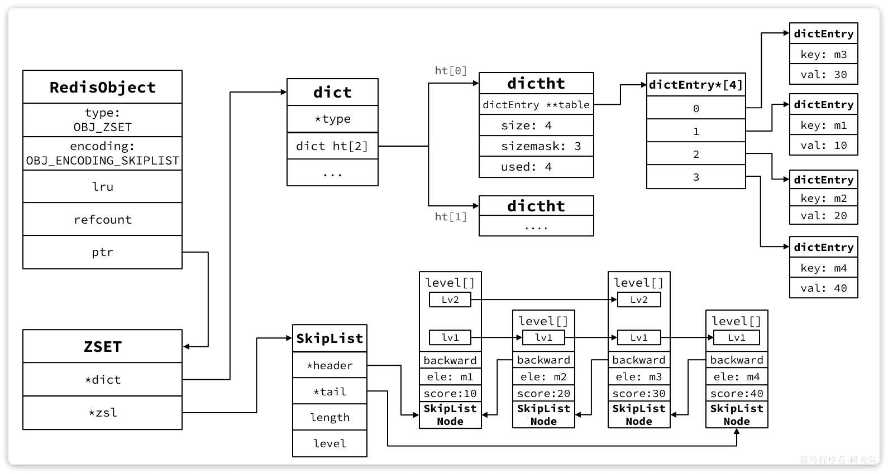​

‍

‍

# 高级

‍

## Jedis封装

> 低效操作, 了解一下即可，大多数情况下还是用SpringDataRedis

Jedis的官网地址： [https://github.com/redis/jedis](https://github.com/redis/jedis)

‍

### 搭建

1. 获取连接
2. 执行操作
3. 关闭连接

‍

```xml
<!--jedis-->
<dependency>
    <groupId>redis.clients</groupId>
    <artifactId>jedis</artifactId>
    <version>3.7.0</version>
</dependency>
<!--单元测试-->
<dependency>
    <groupId>org.junit.jupiter</groupId>
    <artifactId>junit-jupiter</artifactId>
    <version>5.7.0</version>
    <scope>test</scope>
</dependency>
```

‍

‍

#### 快速入门

‍

1）引入依赖

‍

2）建立连接

新建一个单元测试类

```java
private Jedis jedis;

@BeforeEach
void setUp() {
    // 1.建立连接
    // jedis = new Jedis("192.168.150.101", 6379);
    jedis = JedisConnectionFactory.getJedis();
    // 2.设置密码
    jedis.auth("123321");
    // 3.选择库
    jedis.select(0);
}
```

‍

3）测试

```java
@Test
void testString() {
    // 存入数据
    String result = jedis.set("name", "虎哥");
    System.out.println("result = " + result);
    // 获取数据
    String name = jedis.get("name");
    System.out.println("name = " + name);
}

@Test
void testHash() {
    // 插入hash数据
    jedis.hset("user:1", "name", "Jack");
    jedis.hset("user:1", "age", "21");

    // 获取
    Map<String, String> map = jedis.hgetAll("user:1");
    System.out.println(map);
}
```

‍

4）释放资源

```java
@AfterEach
void tearDown() {
    if (jedis != null) {
        jedis.close();
    }
}
```

‍

‍

### 连接池

‍

Jedis本身是线程不安全的，并且频繁的创建和销毁连接会有性能损耗，因此我们推荐大家使用Jedis连接池代替Jedis的直连方式.

```java
public class JedisConnectionFactory {

    private static JedisPool jedisPool;

    static {
        // 配置连接池
        JedisPoolConfig poolConfig = new JedisPoolConfig();
        poolConfig.setMaxTotal(8);
        poolConfig.setMaxIdle(8);
        poolConfig.setMinIdle(0);
        poolConfig.setMaxWaitMillis(1000);
        // 创建连接池对象，参数：连接池配置、服务端ip、服务端端口、超时时间、密码
        jedisPool = new JedisPool(poolConfig, "192.168.150.101", 6379, 1000, "123321");
    }

    public static Jedis getJedis(){
        return jedisPool.getResource();
    }
}
```

* 1） JedisConnectionFacotry：工厂设计模式是实际开发中非常常用的一种设计模式，我们可以使用工厂，去降低代的耦合，比如Spring中的Bean的创建，就用到了工厂设计模式
* 2）静态代码块：随着类的加载而加载，确保只能执行一次，我们在加载当前工厂类的时候，就可以执行static的操作完成对 连接池的初始化
* 3）最后提供返回连接池中连接的方法.

‍

‍

## SpringDataRedis封装

SpringData是Spring中数据操作的模块，包含对各种数据库的集成，其中对Redis的集成模块就叫做SpringDataRedis，官网地址：[https://spring.io/projects/spring-data-redis](https://spring.io/projects/spring-data-redis)

* 提供了对不同Redis客户端的整合（Lettuce和Jedis）
* 提供了RedisTemplate统一API来操作Redis
* 支持Redis的发布订阅模型
* 支持Redis哨兵和Redis集群
* 支持基于Lettuce的响应式编程
* 支持基于JDK、JSON、字符串、Spring对象的数据序列化及反序列化
* 支持基于Redis的JDKCollection实现

‍

SpringDataRedis中提供了RedisTemplate工具类，其中封装了各种对Redis的操作. 并且将不同数据类型的操作API封装到了不同的类型中，具体分类如下

‍

* ValueOperations：简单K-V操作
* SetOperations：set类型数据操作
* ZSetOperations：zset类型数据操作
* HashOperations：针对map类型的数据操作
* ListOperations：针对list类型的数据操作

‍

‍

```xml
        <!--redis依赖-->
        <dependency>
            <groupId>org.springframework.boot</groupId>
            <artifactId>spring-boot-starter-data-redis</artifactId>
        </dependency>
        <!--common-pool-->
        <dependency>
            <groupId>org.apache.commons</groupId>
            <artifactId>commons-pool2</artifactId>
        </dependency>
        <!--Jackson依赖-->
        <dependency>
            <groupId>com.fasterxml.jackson.core</groupId>
            <artifactId>jackson-databind</artifactId>
        </dependency>
```

‍

### 配置

‍

#### maven

```xml
<!--Spring Boot-redis的依赖包-->
<dependency>
    <groupId>org.springframework.boot</groupId>
    <artifactId>spring-boot-starter-data-redis</artifactId>
</dependency>
```

‍

#### RedisConfig配置类

重新设置一下序列化器，防止出现乱码

config -> RedisConfig

```java
@Configuration
public class RedisConfig extends CachingConfigurerSupport {
    @Bean
    public RedisTemplate<Object, Object> redisTemplate(RedisConnectionFactory connectionFactory) {

        RedisTemplate<Object, Object> redisTemplate = new RedisTemplate<>();

        //默认的Key序列化器为：JdkSerializationRedisSerializer
        redisTemplate.setKeySerializer(new StringRedisSerializer());
        redisTemplate.setHashKeySerializer(new StringRedisSerializer());

        redisTemplate.setConnectionFactory(connectionFactory);

        return redisTemplate;
    }
}
```

‍

#### yml

```java
spring:
  redis:
    host: localhost
    port: 6379
    #password: root
    database: 0 #操作的是0号数据库
    jedis:
      #Redis连接池配置
      pool:
        max-active: 8 #最大连接数
        max-wait: 1ms #连接池最大阻塞等待时间
        max-idle: 4 #连接池中的最大空闲连接
        min-idle: 0 #连接池中的最小空闲连接
```

‍

‍

### 基础示例

‍

‍

* String类型数据操作

```java
@Test
void stringTest() {
    //获取对象
    ValueOperations valueOperations = redisTemplate.opsForValue();
    //设置name为Hades
    valueOperations.set("name","Hades");
    String name = (String) valueOperations.get("name");
    System.out.println(name);
    //设置age为9527，有效时间10秒
    valueOperations.set("age", "9527", 10, TimeUnit.SECONDS);
    String age = (String) valueOperations.get("age");
    System.out.println(age);
    //如果不存在，则设置name为Kyle
    Boolean aBoolean = valueOperations.setIfAbsent("name", "Kyle");
    System.out.println(aBoolean);
}
```

‍

‍

* Hash类型数据操作

```java
@Test
void hashTest() {
    HashOperations hashOperations = redisTemplate.opsForHash();
    hashOperations.put("4204000400", "name", "Hades");
    hashOperations.put("4204000400", "age", "18");
    hashOperations.put("4204000400", "hobby", "Apex");
    //获取map集合
    Map<String, String> map = hashOperations.entries("4204000400");
    Set<String> keySet = map.keySet();
    for (String hashKey : keySet) {
        System.out.println(hashKey + ":" + map.get(hashKey));
    }
    System.out.println("$$$$$$$$$$$$$$$");
    //只获取keys
    Set<String> keys = hashOperations.keys("4204000400");
    for (String key : keys) {
        System.out.println(key);
    }
    System.out.println("$$$$$$$$$$$$$$$");
    //只获取values
    List<String> values = hashOperations.values("4204000400");
    for (String value : values) {
        System.out.println(value);
    }
}
```

‍

* List类型数据操作

```java
@Test
void listTest() {
    ListOperations listOperations = redisTemplate.opsForList();
    //存数据
    listOperations.leftPush("testData", "A");
    listOperations.leftPushAll("testData", "B", "C", "D");
    List<String> testDatas = listOperations.range("testData", 0, -1);
    //遍历
    for (String tableData : testDatas) {
        System.out.print(tableData + " ");
    }
    System.out.println();
    //获取当前list长度，用于遍历
    Long size = listOperations.size("testData");
    int value = size.intValue();
    //遍历输出并删除
    for (int i = 0; i < value; i++) {
        System.out.print(listOperations.leftPop("testData") + " ");
    }
    //最后输出一下当前list长度
    System.out.println();
    System.out.println(listOperations.size("testData"));
}
```

‍

* Set类型数据操作

```java
@Test
void setTest() {
    SetOperations setOperations = redisTemplate.opsForSet();
    //存数据，这里存了两个a
    setOperations.add("tmp", "a", "b", "c", "d", "a");
    遍历输出
    Set<String> tmpData = setOperations.members("tmp");
    for (String value : tmpData) {
        System.out.print(value + " ");
    }
    System.out.println();
    System.out.println("$$$$$$$$$$$$$$$$$$$");
    //删除bc
    setOperations.remove("tmp", "b", "c");
    //再次遍历输出
    tmpData = setOperations.members("tmp");
    for (String value : tmpData) {
        System.out.print(value + " ");
    }
}
```

‍

* ZSet类型数据操作

```java
@Test
void zsetTest() {
    ZSetOperations zSetOperations = redisTemplate.opsForZSet();
    //存值
    zSetOperations.add("myZset", "a", 0.0);
    zSetOperations.add("myZset", "b", 1.0);
    zSetOperations.add("myZset", "c", 2.0);
    zSetOperations.add("myZset", "a", 3.0);
    //取值
    Set<String> myZset = zSetOperations.range("myZset", 0, -1);
    for (String s : myZset) {
        System.out.println(s);
    }
    //修改分数
    zSetOperations.incrementScore("myZset", "b", 4.0);
    //取值
    System.out.println("$$$$$$$$$$$$$$$$$$$$$$$$$");
    myZset = zSetOperations.range("myZset", 0, -1);
    for (String s : myZset) {
        System.out.println(s);
    }
    //删除成员
    zSetOperations.remove("myZset", "a", "b");
    //取值
    System.out.println("$$$$$$$$$$$$$$$$$$$$$$$$$");
    myZset = zSetOperations.range("myZset", 0, -1);
    for (String s : myZset) {
        System.out.println(s);
    }
}
```

‍

* 通用的数据类型操作

```java
@Test
void commonTest() {
    //查看所有key
    Set<String> keys = redisTemplate.keys("*");
    for (String key : keys) {
        System.out.println(key);
    }
    //查看是否存在指定key
    System.out.println("$$$$$$$$$$$$$$$$$$$$$$$$$");
    System.out.println(redisTemplate.hasKey("Random"));
    System.out.println("$$$$$$$$$$$$$$$$$$$$$$$$$");
    //删除指定key，并再次查看
    redisTemplate.delete("myZset");
    keys = redisTemplate.keys("*");
    for (String key : keys) {
        System.out.println(key);
    }
    System.out.println("$$$$$$$$$$$$$$$$$$$$$$$$$");
    //输出指定key的类型
    System.out.println(redisTemplate.type("tmp"));
}
```

‍

* Controller方法示例(启动类 + @EnableCaching)

  报错注意返回值R实现序列化接口

```java
@RestController
@RequestMapping("/user")
@Slf4j
public class UserController {

    @Autowired
    private CacheManager cacheManager;

    @Autowired
    private UserService userService;

    /**
     * CachePut：将方法返回值放入缓存
     * value：缓存的名称，每个缓存名称下面可以有多个key
     * key：缓存的key
     */
    @CachePut(value = "userCache",key = "#user.id")
    @PostMapping
    public User save(User user){
        userService.save(user);
        return user;
    }

    /**
     * CacheEvict：清理指定缓存
     * value：缓存的名称，每个缓存名称下面可以有多个key
     * key：缓存的key
     */
    @CacheEvict(value = "userCache",key = "#p0")
    //@CacheEvict(value = "userCache",key = "#root.args[0]")
    //@CacheEvict(value = "userCache",key = "#id")
    @DeleteMapping("/{id}")
    public void delete(@PathVariable Long id){
        userService.removeById(id);
    }

    //@CacheEvict(value = "userCache",key = "#p0.id")
    //@CacheEvict(value = "userCache",key = "#user.id")
    //@CacheEvict(value = "userCache",key = "#root.args[0].id")
    @CacheEvict(value = "userCache",key = "#result.id")
    @PutMapping
    public User update(User user){
        userService.updateById(user);
        return user;
    }

    /**
     * Cacheable：在方法执行前spring先查看缓存中是否有数据，如果有数据，则直接返回缓存数据；若没有数据，调用方法并将方法返回值放到缓存中
     * value：缓存的名称，每个缓存名称下面可以有多个key
     * key：缓存的key
     * condition：条件，满足条件时才缓存数据
     * unless：满足条件则不缓存
     */
    @Cacheable(value = "userCache",key = "#id",unless = "#result == null")
    @GetMapping("/{id}")
    public User getById(@PathVariable Long id){
        User user = userService.getById(id);
        return user;
    }

    @Cacheable(value = "userCache",key = "#user.id + '_' + #user.name")
    @GetMapping("/list")
    public List<User> list(User user){
        LambdaQueryWrapper<User> queryWrapper = new LambdaQueryWrapper<>();
        queryWrapper.eq(user.getId() != null,User::getId,user.getId());
        queryWrapper.eq(user.getName() != null,User::getName,user.getName());
        List<User> list = userService.list(queryWrapper);
        return list;
    }
}

```

‍

‍

‍

### 快速入门

SpringBoot已经提供了对SpringDataRedis的支持，使用非常简单.

‍

**SpringDataJpa使用起来非常简单，记住如下几个步骤即可**

* 引入spring-boot-starter-data-redis依赖
* 在application.yml配置Redis信息
* 注入RedisTemplate

‍

---

1）引入依赖

‍

2）配置Redis

```yaml
spring:
  redis:
    host: 192.168.150.101
    port: 6379
    password: 123321
    lettuce:
      pool:
        max-active: 8
        max-idle: 8
        min-idle: 0
        max-wait: 100ms
```

‍

3）注入RedisTemplate

因为有了SpringBoot的自动装配，我们可以拿来就用

```java
@SpringBootTest
class RedisStringTests {

    @Autowired
    private RedisTemplate redisTemplate;
}
```

‍

4）编写测试

```java
@SpringBootTest
class RedisStringTests {

    @Autowired
    private RedisTemplate redisTemplate;

    @Test
    void testString() {
        // 写入一条String数据
        redisTemplate.opsForValue().set("name", "虎哥");
        // 获取string数据
        Object name = (string)RedisTemplate.opsForValue().get("name");
        System.out.println("name = " + name);
    }
}
```

‍

### 序列化

‍

#### 自定义序列化方式

‍

RedisTemplate可以接收任意Object作为值写入Redis, 只不过写入前会把Object序列化为字节形式，默认是采用JDK序列化

‍

缺点：

* 可读性差
* 内存占用较大

‍

自定义RedisTemplate的序列化方式

```java
@Configuration
public class RedisConfig {

    @Bean
    public RedisTemplate<String, Object> redisTemplate(RedisConnectionFactory connectionFactory){
        // 创建RedisTemplate对象
        RedisTemplate<String, Object> template = new RedisTemplate<>();
        // 设置连接工厂
        template.setConnectionFactory(connectionFactory);
        // 创建JSON序列化工具
        GenericJackson2JsonRedisSerializer jsonRedisSerializer = 
            							new GenericJackson2JsonRedisSerializer();
        // 设置Key的序列化
        template.setKeySerializer(RedisSerializer.string());
        template.setHashKeySerializer(RedisSerializer.string());
        // 设置Value的序列化
        template.setValueSerializer(jsonRedisSerializer);
        template.setHashValueSerializer(jsonRedisSerializer);
        // 返回
        return template;
    }
}
```

采用了JSON序列化来代替默认的JDK序列化方式

‍

整体可读性有了很大提升，并且能将Java对象自动的序列化为JSON字符串，并且查询时能自动把JSON反序列化为Java对象. 不过，其中记录了序列化时对应的class名称，目的是为了查询时实现自动反序列化. 这会带来额外的内存开销.

‍

#### StringRedisTemplate优化

‍

为了节省内存空间，我们可以不使用JSON序列化器来处理value，而是统一使用String序列化器，要求只能存储String类型的key和value. 当需要存储Java对象时，手动完成对象的序列化和反序列化.

‍

存入时，先手动把对象序列化为json字符串

读取的结果是JSON字符串，我们手动反序列化

‍

因为存入和读取时的序列化及反序列化都是我们自己实现的，SpringDataRedis就不会将class信息写入Redis了.

这种用法比较普遍，因此SpringDataRedis就提供了RedisTemplate的子类：StringRedisTemplate，它的key和value的序列化方式默认就是String方式.

‍

省去了我们自定义RedisTemplate的序列化方式的步骤，而是直接使用：

```java
@Autowired
private StringRedisTemplate stringRedisTemplate;
// JSON序列化工具
private static final ObjectMapper mapper = new ObjectMapper();

@Test
void testSaveUser() throws JsonProcessingException {
    // 创建对象
    User user = new User("虎哥", 21);
    // 手动序列化
    String json = mapper.writeValueAsString(user);
    // 写入数据
    stringRedisTemplate.opsForValue().set("user:200", json);

    // 获取数据
    String jsonUser = stringRedisTemplate.opsForValue().get("user:200");
    // 手动反序列化
    User user1 = mapper.readValue(jsonUser, User.class);
    System.out.println("user1 = " + user1);
}
```

‍

那个class数据已经不在了，节约了我们的空间

‍

最后小总结：

RedisTemplate的两种序列化实践方案：

* 方案一：

  * 自定义RedisTemplate
  * 修改RedisTemplate的序列化器为GenericJackson2JsonRedisSerializer
* 方案二：

  * 使用StringRedisTemplate
  * 写入Redis时，手动把对象序列化为JSON
  * 读取Redis时，手动把读取到的JSON反序列化为对象

‍

‍

# 缓存

‍

‍

## 缓存模型

标准的操作方式就是查询数据库之前先查询缓存，如果缓存数据存在，则直接从缓存中返回，如果缓存数据不存在，再查询数据库，然后将数据存入redis.

代码思路：如果缓存有，则直接返回，如果缓存不存在，则查询数据库，然后存入redis.

‍

**缓存(** Cache),就是数据交换的**缓冲区**,俗称的缓存就是**缓冲区内的数据**,一般从数据库中获取,存储于本地代码(例如:

```
例1:Static final ConcurrentHashMap<K,V> map = new ConcurrentHashMap<>(); 本地用于高并发

例2:static final Cache<K,V> USER_CACHE = CacheBuilder.newBuilder().build(); 用于redis等缓存

例3:Static final Map<K,V> map =  new HashMap(); 本地缓存
```

由于其被**Static**修饰,所以随着类的加载而被加载到**内存之中**,作为本地缓存,由于其又被**final**修饰,所以其引用(例3:map)和对象(例3:new HashMap())之间的关系是固定的,不能改变,因此不用担心赋值(=)导致缓存失效;

‍

### 场景

‍

实际开发中,会构筑多级缓存来使系统运行速度进一步提升, 例如:本地缓存与redis中的缓存并发使用

**浏览器缓存**：主要是存在于浏览器端的缓存

**应用层缓存：** 可以分为tomcat本地缓存，比如之前提到的map，或者是使用redis作为缓存

**数据库缓存：** 在数据库中有一片空间是 buffer pool，增改查数据都会先加载到mysql的缓存中

**CPU缓存：** 当代计算机最大的问题是 cpu性能提升了，但内存读写速度没有跟上，所以为了适应当下的情况，增加了cpu的L1，L2，L3级的缓存

‍

‍

### 缓存更新策略

> 缓存更新是redis为了节约内存而设计出来的一个东西，主要是因为内存数据宝贵，当我们向redis插入太多数据，此时就可能会导致**缓存中的数据过多**，所以redis会对部分数据进行更新，或者把他叫为淘汰更合适.

‍

‍

**一致性从差到好, 但是成本越来越高**

* **内存淘汰：** redis自动进行，当redis内存达到咱们设定的max-memery的时候，会自动触发淘汰机制，淘汰掉一些不重要的数据(可以自己设置策略方式)
* **超时剔除：** 当我们给redis设置了过期时间ttl之后，redis会将超时的数据进行删除，方便咱们继续使用缓存
* **主动更新：** 我们可以手动调用方法把缓存删掉，通常用于解决缓存和数据库不一致问题

‍

#### 业务场景

低一致性需求:使用内存淘汰机制. 例如店铺类型的查询缓存

高一致性需求:主动更新，并以超时剔除作为兜底方案. 例如店铺详情查询的缓存

‍

‍

### 数据库缓存一致性

‍

由于我们的**缓存的数据源来自于数据库**, 而数据库的**数据是会发生变化的**, 因此,如果当数据库中**数据发生变化,而缓存却没有同步**,此时就会有**一致性问题存在**

‍

#### 问题

操作缓存和数据库时有三个问题需要考虑：有不同的实现逻辑

‍

* 删除缓存还是更新缓存？

  * 更新缓存：每次更新数据库都更新缓存，无效写操作较多
  * 删除缓存：更新数据库时让缓存失效，查询时再更新缓存 ==一般选择删除缓存==
* 如何保证缓存与数据库的操作的同时成功或失败？

  * 单体系统，将缓存与数据库操作放在一个事务
  * 分布式系统，利用TCC等分布式事务方案
* 先操作缓存还是先操作数据库？

  * 先删除缓存，再操作数据库
  * 先操作数据库，再删除缓存

    * 不容易出错, 因为操作数据库然后更新的过程中空挡(后摇)很小, 很难有线程进来干点别的  
      实际上就是并发执行的锁操作问题, 没有加锁的情况下很可能有并发问题
    * 如果你选择第一种方案，在两个线程并发来访问时，假设线程1先来，他先把缓存删了，此时线程2过来，他查询缓存数据并不存在，此时他写入缓存，当他写入缓存后，线程1再执行更新动作时，实际上写入的就是旧的数据，新的数据被旧数据覆盖了.

‍

‍

#### 方案

* Cache Aside Pattern   人工编码方式：缓存调用者在更新完数据库后再去更新缓存，也称之为**双写方案**
* Read/Write Through Pattern   由**系统本身完成**，数据库与缓存的问题交由系统本身去处理
* Write Behind Caching Pattern   调用者只操作缓存，**其他线程去异步处理数据库**，实现最终一致

‍

‍

### 多级缓存

‍

传统的缓存策略一般是请求到达Tomcat后，先查询Redis，如果未命中则查询数据库

‍

存在下面的问题：

•请求要经过Tomcat处理，Tomcat的性能成为整个系统的瓶颈

•Redis缓存失效时，会对数据库产生冲击

‍

多级缓存就是充分利用请求处理的每个环节，分别添加缓存，减轻Tomcat压力，提升服务性能：

* 浏览器访问静态资源时，优先读取浏览器本地缓存
* 访问非静态资源（ajax查询数据）时，访问服务端
* 请求到达Nginx后，优先读取Nginx本地缓存
* 如果Nginx本地缓存未命中，则去直接查询Redis（不经过Tomcat）
* 如果Redis查询未命中，则查询Tomcat
* 请求进入Tomcat后，优先查询JVM进程缓存
* 如果JVM进程缓存未命中，则查询数据库

在多级缓存架构中，Nginx内部需要编写本地缓存查询、Redis查询、Tomcat查询的业务逻辑，因此这样的nginx服务不再是一个**反向代理服务器**，而是一个编写**业务的Web服务器了**。

因此这样的业务Nginx服务也需要搭建集群来提高并发，再有专门的nginx服务来做反向代理，如图：

‍

另外，我们的Tomcat服务将来也会部署为集群模式：

‍

可见，多级缓存的关键有两个：

* 一个是在nginx中编写业务，实现nginx本地缓存、Redis、Tomcat的查询
* 另一个就是在Tomcat中实现JVM进程缓存

其中Nginx编程则会用到OpenResty框架结合Lua这样的语言。

‍

> 见Caffeine和OpenResty和Canal内容.

​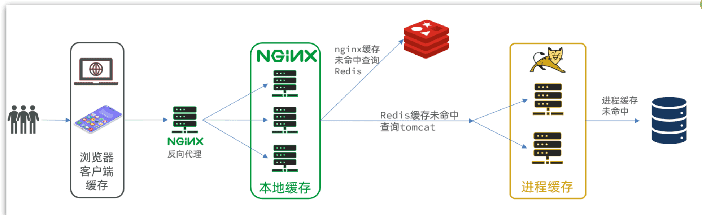​

‍

‍

## 缓存穿透

‍

### 概念

缓存穿透是指客户端请求的数据在缓存中和数据库中**都不存在(缓存层和持久层都不会命中)** ，这样缓存永远不会生效，这些请求都会打到数据库, 然后又捅回去, 搅了个天翻地覆. 缓存穿透将导致不存在的数据每次请求都要到持久层去查询，失去了缓存保护后端持久的意义。

缓存穿透问题可能会使后端存储负载加大，由于很多后端持久层不具备高并发性，甚至可能造成后端存储宕机。通常可以在程序中统计总调用数、缓存层命中数、如果同一个Key的缓存命中率很低，可能就是出现了缓存穿透问题。

‍

### 原因

第一，自身业务代码或者数据出现问题（例如：set 和 get 的key不一致），第二，一些恶意攻击、爬虫等造成大量空命中（爬取线上商城商品数据，超大循环递增商品的ID）

‍

### 解决

‍

解决方案总结

* 缓存null值
* 布隆过滤
* 增强id的复杂度，避免被猜测id规律
* 做好数据的基础格式校验
* 加强用户权限校验
* 做好热点参数的限流

‍

‍

#### **缓存空对象**

指在持久层没有命中的情况下，对key进行set （key,null）

> 哪怕这个数据在数据库中也不存在，也把这个数据存入到redis中去
>
> 下次用户过来访问这个不存在的数据，那么在redis中也能找到这个数据

‍

* 优点：实现简单，维护方便
* 缺点：

  * 额外内存消耗

    > 空值做了缓存，意味着缓存层中存了更多的键，需要更多的内存空间，比较有效的方法是针对这类数据设置一个较短的过期时间，让其自动剔除
    >
  * 可能造成短期的不一致

    > 缓存层和存储层的数据会有一段时间窗口的不一致，可能会对业务有一定影响。例如过期时间设置为5分钟，如果此时存储层添加了这个数据，那此段时间就会出现缓存层和存储层数据的不一致，此时可以利用消息系统或者其他方式清除掉缓存层中的空对象。
    >

‍

‍

#### **布隆过滤**

(布隆过滤器拦截)

在访问缓存层和存储层之前，将存在的key用布隆过滤器提前保存起来，做第一层拦截，当收到一个对key请求时先用布隆过滤器验证是key否存在，如果存在在进入缓存层、存储层。可以使用bitmap做布隆过滤器。这种方法适用于数据命中不高、数据相对固定、实时性低的应用场景，代码维护较为复杂，但是缓存空间占用少。

> 哈希思想来解决, 通过一个庞大的二进制数组，走哈希思想去判断当前这个要查询的这个数据是否存在，如果布隆过滤器判断存在，则放行，这个请求会去访问redis，哪怕此时redis中的数据过期了，但是数据库中一定存在这个数据，在数据库中查询出来这个数据后，再将其放入到redis中，假设布隆过滤器判断这个数据不存在，则直接返回

‍

* 优点：内存占用较少，没有多余key

  > 空间效率和查询时间都远远超过一般的算法
  >
* 缺点：

  * 实现复杂
  * 存在误判可能
  * 哈希冲突

‍

布隆过滤器拦截的算法描述

* 初始状态时，BloomFilter是一个长度为m的位数组，每一位都置为0。
* 添加元素x时，x使用k个hash函数得到k个hash值，对m取余，对应的bit位设置为1。
* 判断y是否属于这个集合，对y使用k个哈希函数得到k个哈希值，对m取余，所有对应的位置都是1，则认为y属于该集合（哈希冲突，可能存在误判），否则就认为y不属于该集合。可以通过增加哈希函数和增加二进制位数组的长度来降低错报率。

‍

‍

## 缓存雪崩

‍

### 概念

缓存雪崩是指在同一时段**大量的缓存key同时失效**或者Redis服务宕机，导致大量请求到达数据库，带来巨大压力.

> 如果缓存集中在一段时间内失效，发生大量的缓存穿透，所有的查询都落在数据库上，造成了缓存雪崩。
>
> 这个没有完美解决办法，但可以分析用户行为，尽量让失效时间点均匀分布。大多数系统设计者考虑用加锁或者队列的方式保证缓存的单线程（进程）写，从而避免失效时大量的并发请求落到底层存储系统上。

‍

### 解决

‍

* 给不同的Key的TTL添加随机值
* 利用Redis集群提高服务的可用性
* 给缓存业务添加降级限流策略
* 给业务添加多级缓存

‍

‍

* **缓存层高可用：**   
  可以把缓存层设计成高可用的，即使个别节点、个别机器、甚至是机房宕掉，依然可以提供服务。利用sentinel或cluster实现。
* **做二级缓存，或者双缓存策略：**   
  采用多级缓存，本地进程作为一级缓存，redis作为二级缓存，不同级别的缓存设置的超时时间不同，即使某级缓存过期了，也有其他级别缓存兜底
* **数据预热**  
  可以通过缓存reload机制，预先去更新缓存，再即将发生大并发访问前手动触发加载缓存不同的key，设置不同的过期时间，让缓存失效的时间点尽量均匀
* **加锁排队**

  * 限流-- 限流算法. 1.计数 2.滑动窗口 3. 令牌桶Token Bucket 4.漏桶 leaky bucket [1]
  * 在缓存失效后，通过加锁或者队列来控制读数据库写缓存的线程数量。比如对某个key只允许一个线程查询数据和写缓存，其他线程等待。
  * 业界比较常用的做法，是使用mutex。简单地来说，就是在缓存失效的时候（判断拿出来的值为空），不是立即去load db，而是先使用缓存工具的某些带成功操作返回值的操作（比如Redis的SETNX或者Memcache的ADD）去set一个mutex key，当操作返回成功时，再进行load db的操作并回设缓存；否则，就重试整个get缓存的方法。
  * SETNX，是「SET if Not eXists」的缩写，也就是只有不存在的时候才设置，可以利用它来实现锁的效果。

‍

‍

## 缓存击穿

‍

### 概念

也叫热点Key问题，就是一个被高并发访问并且缓存重建业务较复杂的key**突然失效了**，无数的请求访问会在瞬间给数据库带来巨大的冲击.

系统中存在以下两个问题时需要引起注意：

* 当前key是一个热点key（例如一个秒杀活动），并发量非常大。
* 重建缓存不能在短时间完成，可能是一个复杂计算，例如复杂的SQL、多次IO、多个依赖等。

在缓存失效的瞬间，有大量线程来重建缓存，造成后端负载加大，甚至可能会让应用崩溃。

> 逻辑分析：假设线程1在查询缓存之后，本来应该去查询数据库，然后把这个数据重新加载到缓存的，此时只要线程1走完这个逻辑，其他线程就都能从缓存中加载这些数据了，但是假设在线程1没有走完的时候，后续的线程2，线程3，线程4同时过来访问当前这个方法， 那么这些线程都不能从缓存中查询到数据，那么他们就会同一时刻来访问查询缓存，都没查到，接着同一时间去访问数据库，同时的去执行数据库代码，对数据库访问压力过大

‍

‍

### 解决

‍

* 互斥锁
* 逻辑过期

‍

> GuavaCache本身实现了加锁互斥，有效防止缓存击穿

‍

#### 互斥锁

( + 分布式互斥锁)

因为锁能实现互斥性. 假设线程过来，只能一个一个访问数据库，从而避免对于数据库访问压力过大，但这也会影响查询的性能，因为此时会让查询的性能从并行变成了串行，我们可以采用tryLock方法 + double check来解决

‍

> 场景 假设现在线程1过来访问，他查询缓存没有命中，但是此时他获得到了锁的资源，那么线程1就会一个人去执行逻辑，假设现在线程2过来，线程2在执行过程中，并没有获得到锁，那么线程2就可以进行到休眠，直到线程1把锁释放后，线程2获得到锁，然后再来执行逻辑，此时就能够从缓存中拿到数据了.

‍

##### **==评价==**

由于保证了互斥性，所以数据一致，且实现简单，因为仅仅只需要加一把锁而已，也没其他的事情需要操心，所以没有额外的内存消耗，缺点在于有锁就有死锁问题的发生，且只能串行执行性能肯定受到影响

‍

优点

* 没有额外的内存消耗
* 保证一致性
* 实现简单

‍

缺点

* 线程需要等待，性能受影响
* 可能有死锁风险

‍

‍

‍

#### 逻辑过期

之所以会出现这个缓存击穿问题，主要原因是在于我们对key设置了过期时间，假设我们不设置过期时间，其实就不会有缓存击穿的问题，但是不设置过期时间，这样数据不就一直占用我们内存了吗，那么可以采用逻辑过期方案.

把过期时间设置在 redis的value中

这个过期时间并不会直接作用于redis，而是我们后续通过逻辑去处理.

‍

> 场景 假设线程1去查询缓存，然后从value中判断出来当前的数据已经过期了，此时线程1去获得互斥锁，那么其他线程会进行阻塞，获得了锁的线程他会另外开启一个 线程去进行 以前的重构数据的逻辑，直到新开的线程完成这个逻辑后才释放锁
>
> 而线程1直接进行返回
>
> 假设现在线程3过来访问，由于线程1创建的线程2持有着锁，所以线程3无法获得锁，于是它也直接返回数据，只有等到线程2把重建数据构建完后，其他线程才能走返回正确的数据.

这种方案巧妙在于，异步的构建缓存，缺点在于在构建完缓存之前，返回的都是脏数据(之前留下来的)

线程读取过程中不需要等待，性能好，有一个额外的线程持有锁去进行重构数据，但是在重构数据完成前，其他的线程只能返回之前的数据，且实现起来麻烦

‍

##### 评价

‍

优点

* 线程无需等待，性能较好

‍

缺点

* 不保证一致性
* 有额外内存消耗
* 实现复杂

‍

‍

## 持久化

Redis有两种持久化方案：

* RDB持久化
* AOF持久化

‍

‍

### RDB持久化

RDB全称Redis Database Backup file（Redis数据备份文件），也被叫做Redis数据快照。简单来说就是把内存中的所有数据都记录到磁盘中。当Redis实例故障重启后，从磁盘读取快照文件，恢复数据。快照文件称为RDB文件，默认是保存在当前运行目录。

‍

‍

#### 执行时机

RDB持久化在四种情况下会执行：

* 执行save命令
* 执行bgsave命令
* Redis停机时
* 触发RDB条件时

‍

**1）save命令**

立即执行一次RDB：

```java
save
```

save命令会导致主进程执行RDB，这个过程中其它所有命令都会被阻塞。只有在数据迁移时可能用到。

‍

‍

**2）bgsave命令**

异步执行RDB：

```java
bgsave
```

这个命令执行后会开启独立进程完成RDB，主进程可以持续处理用户请求，不受影响。

‍

**3）停机时**

Redis停机时会执行一次save命令，实现RDB持久化。

‍

**4）触发RDB条件**

Redis内部有触发RDB的机制，可以在redis.conf文件中找到，格式如下：

```properties
# 900秒内，如果至少有1个key被修改，则执行bgsave ， 如果是save "" 则表示禁用RDB
save 900 1  
save 300 10  
save 60 10000 
```

RDB的其它配置也可以在redis.conf文件中设置：

```properties
# 是否压缩 ,建议不开启，压缩也会消耗cpu，磁盘的话不值钱
rdbcompression yes

# RDB文件名称
dbfilename dump.rdb  

# 文件保存的路径目录
dir ./ 
```

‍

‍

#### RDB原理

bgsave开始时会fork主进程得到子进程，子进程共享主进程的内存数据。完成fork后读取内存数据并写入 RDB 文件。

fork采用的是copy-on-write技术：

* 当主进程执行读操作时，访问共享内存；
* 当主进程执行写操作时，则会拷贝一份数据，执行写操作。

​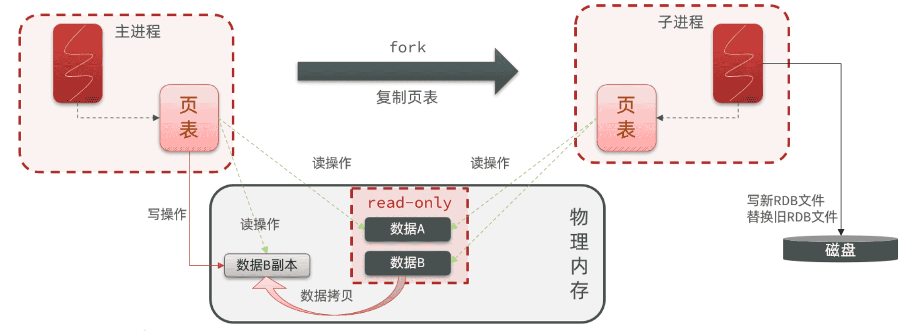​

‍

‍

#### 小结

RDB方式bgsave的基本流程？

* fork主进程得到一个子进程，共享内存空间
* 子进程读取内存数据并写入新的RDB文件
* 用新RDB文件替换旧的RDB文件

‍

RDB会在什么时候执行？save 60 1000代表什么含义？

* 默认是服务停止时
* 代表60秒内至少执行1000次修改则触发RDB

‍

RDB的缺点？

* RDB执行间隔时间长，两次RDB之间写入数据有丢失的风险
* fork子进程、压缩、写出RDB文件都比较耗时

‍

‍

### AOF持久化

‍

#### AOF原理

AOF全称为Append Only File（追加文件）。Redis处理的每一个写命令都会记录在AOF文件，可以看做是命令日志文件。

‍

#### AOF配置

AOF默认是关闭的，需要修改redis.conf配置文件来开启AOF：

```properties
# 是否开启AOF功能，默认是no
appendonly yes
# AOF文件的名称
appendfilename "appendonly.aof"
```

AOF的命令记录的频率也可以通过redis.conf文件来配：

```properties
# 表示每执行一次写命令，立即记录到AOF文件
appendfsync always 
# 写命令执行完先放入AOF缓冲区，然后表示每隔1秒将缓冲区数据写到AOF文件，是默认方案
appendfsync everysec 
# 写命令执行完先放入AOF缓冲区，由操作系统决定何时将缓冲区内容写回磁盘
appendfsync no
```

‍

三种策略对比：

|配置项|刷盘时机|优点|缺点|
| ----------| --------------| ------------------------| ------------------------------|
|Always|同步刷盘|可靠性高，几乎不丢数据|性能影响大|
|everysec|每秒刷盘|性能适中|最多丢失1秒数据|
|no|操作系统控制|性能最好|可靠性较差，可能丢失大量数据|

‍

‍

#### AOF文件重写

因为是记录命令，AOF文件会比RDB文件大的多。而且AOF会记录对同一个key的多次写操作，但只有最后一次写操作才有意义。通过执行bgrewriteaof命令，可以让AOF文件执行重写功能，用最少的命令达到相同效果。

‍

如图，AOF原本有三个命令，但是`set num 123 和 set num 666`​都是对num的操作，第二次会覆盖第一次的值，因此第一个命令记录下来没有意义。

所以重写命令后，AOF文件内容就是：`mset name jack num 666`​

Redis也会在触发阈值时自动去重写AOF文件。阈值也可以在redis.conf中配置：

```properties
# AOF文件比上次文件 增长超过多少百分比则触发重写
auto-aof-rewrite-percentage 100
# AOF文件体积最小多大以上才触发重写 
auto-aof-rewrite-min-size 64mb 
```

‍

‍

### RDB与AOF对比

RDB和AOF各有自己的优缺点，如果对数据安全性要求较高，在实际开发中往往会**结合**两者来使用。

||RDB|AOF|
| ----------------| ----------------------------------------------| ----------------------------------------------------------|
|持久化方式|定时对整个内存做快照|记录每一次执行的命令|
|数据完整性|不完整，两次备份之间会丢失|相对完整，取决于刷盘策略|
|文件大小|会有压缩，文件体积小|记录命令，文件体积很大|
|宕机恢复速度|很快|慢|
|数据恢复优先级|低，因为数据完整性不如AOF|高，因为数据完整性更高|
|系统资源占用|高，大量CPU和内存消耗|低，主要是磁盘IO资源<br />但AOF重写时会占用大量CPU和内存资源|
|使用场景|可以容忍数分钟的数据丢失，追求更快的启动速度|对数据安全性要求较高常见|

‍

‍

‍

‍

# 分布式缓存

基于Redis集群解决单机Redis存在的问题

‍

* **数据丢失问题：** Redis是内存存储，服务重启可能会丢失数据  =>  **利用Redis数据持久化的功能将数据写入磁盘**
* **并发能力问题：** 单节点Redis并发能力虽然不错，但也无法满足如618这样的高并发场景  =>  **搭建一主多从集群，实现读写分离**
* **单点故障 - 故障恢复问题：** 如果Redis宕机，则服务不可用，需要一种自动的故障恢复手段  =>  **利用Redis哨兵，实现健康检测和自动故障恢复**
* **存储能力问题：** Redis基于内存存储，单节点能存储的数据量难以满足海量数据要求  =>  **搭建分片集群，利用插槽机制实现动态扩容，从理论上来讲，它的存储能力是没有上限的**

‍

‍

## 主从

单节点Redis的并发能力是有上限的，要进一步提高Redis的并发能力，就需要搭建主从集群，实现读写分离。

‍

‍

### 主从集群结构

下图就是一个简单的Redis主从集群结构：

如图所示，集群中有一个master节点、两个slave节点（现在叫replica）。当我们通过Redis的Java客户端访问主从集群时，应该做好路由：

* 如果是写操作，应该访问master节点，master会自动将数据同步给两个slave节点
* 如果是读操作，建议访问各个slave节点，从而分担并发压力

‍

‍

### 搭建

> 不要求手动搭建

‍

#### 启动多个Redis实例

自己写一个docker-compose.yaml文件:

> 主要是对镜像redis设置entrypoint

```YAML
version: "3.2"

services:
  r1:
    image: redis
    container_name: r1
    network_mode: "host"
    entrypoint: ["redis-server", "--port", "7001"]
  r2:
    image: redis
    container_name: r2
    network_mode: "host"
    entrypoint: ["redis-server", "--port", "7002"]
  r3:
    image: redis
    container_name: r3
    network_mode: "host"
    entrypoint: ["redis-server", "--port", "7003"]
```

将其上传至虚拟机的`/root/redis`​目录下

‍

执行命令，运行集群：

```Bash
docker compose up -d
```

由于采用的是host模式，我们看不到端口映射。不过能直接在宿主机通过ps命令查看到Redis进程

‍

‍

‍

#### 建立集群

虽然我们启动了3个Redis实例，但是它们并没有形成主从关系。我们需要通过命令来配置主从关系

```Bash
# Redis5.0以前
slaveof <masterip> <masterport>
# Redis5.0以后
replicaof <masterip> <masterport>
```

‍

有临时和永久两种模式：

* 永久生效：在redis.conf文件中利用`slaveof`​命令指定`master`​节点
* 临时生效：直接利用redis-cli控制台输入`slaveof`​命令，指定`master`​节点

‍

测试临时模式，首先连接`r2`​，让其以`r1`​为master

```Bash
# 连接r2
docker exec -it r2 redis-cli -p 7002
# 认r1主，也就是7001
slaveof 192.168.150.101 7001
```

然后连接`r3`​，让其以`r1`​为master (同理)

‍

然后连接`r1`​，查看集群状态：

```Bash
# 连接r1
docker exec -it r1 redis-cli -p 7001
# 查看集群状态
info replication
```

可以看到，当前节点`r1:7001`​的角色是`master`​，有两个slave与其连接：

* ​`slave0`​：`port`​是`7002`​，也就是`r2`​节点
* ​`slave1`​：`port`​是`7003`​，也就是`r3`​节点

‍

‍

#### 测试

依次在`r1`​、`r2`​、`r3`​节点上执行下面命令：

```Bash
set num 123

get num
```

你会发现，只有在`r1`​这个节点上可以执行`set`​命令（**写操作**），其它两个节点只能执行`get`​命令（**读操作**）

‍

‍

### 主从同步原理

‍

#### 全量同步

主从第一次建立连接时，会执行**全量同步**，将master节点的所有数据都拷贝给slave节点

​​

‍

这里有一个问题，`master`​如何得知`salve`​是否是第一次来同步呢？？

‍

有几个概念，可以作为判断依据：

* ​**​`Replication Id`​**​：简称`replid`​，是数据集的标记，replid一致则是同一数据集。每个`master`​都有唯一的`replid`​，`slave`​则会继承`master`​节点的`replid`​
* ​**​`offset`​**​：偏移量，随着记录在`repl_baklog`​中的数据增多而逐渐增大。`slave`​完成同步时也会记录当前同步的`offset`​。如果`slave`​的`offset`​小于`master`​的`offset`​，说明`slave`​数据落后于`master`​，需要更新。

‍

因此`slave`​做数据同步，必须向`master`​声明自己的`replication id `​和`offset`​，`master`​才可以判断到底需要同步哪些数据。

‍

由于我们在执行`slaveof`​命令之前，所有redis节点都是`master`​，有自己的`replid`​和`offset`​。

当我们第一次执行`slaveof`​命令，与`master`​建立主从关系时，发送的`replid`​和`offset`​是自己的，与`master`​肯定不一致。

​`master`​判断发现`slave`​发送来的`replid`​与自己的不一致，说明这是一个全新的slave，就知道要做全量同步了。

‍

​`master`​会将自己的`replid`​和`offset`​都发送给这个`slave`​，`slave`​保存这些信息到本地。自此以后`slave`​的`replid`​就与`master`​一致了。

‍

因此，**master判断一个节点是否是第一次同步的依据，就是看replid是否一致**。

‍

​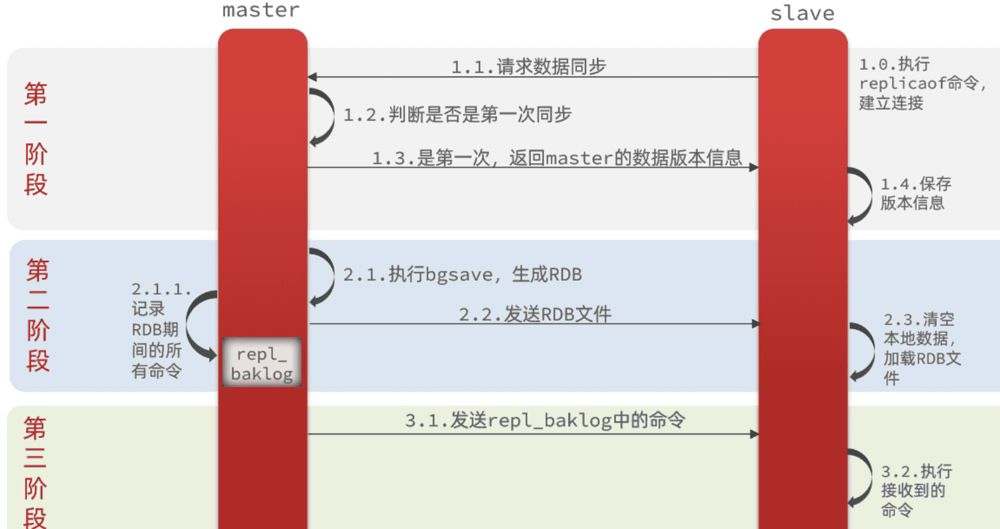​

‍

‍

完整流程描述：

* ​`slave`​节点请求增量同步
* ​`master`​节点判断`replid`​，发现不一致，拒绝增量同步
* ​`master`​将完整内存数据生成`RDB`​，发送`RDB`​到`slave`​
* ​`slave`​清空本地数据，加载`master`​的`RDB`​
* ​`master`​将`RDB`​期间的命令记录在`repl_baklog`​，并持续将log中的命令发送给`slave`​
* ​`slave`​执行接收到的命令，保持与`master`​之间的同步

‍

‍

‍

#### 增量同步

全量同步需要先做RDB，然后将RDB文件通过网络传输个slave，成本太高了。因此除了第一次做全量同步，其它大多数时候slave与master都是做**增量同步**。

‍

就是只更新slave与master存在差异的部分数据

​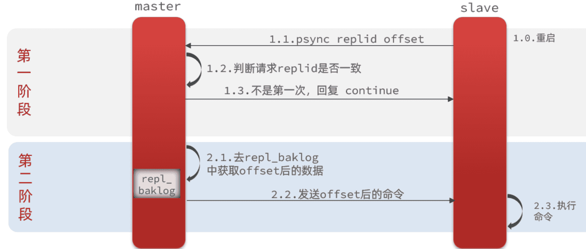​

那么master怎么知道slave与自己的数据差异在哪里呢?

‍

‍

##### repl_baklog原理

‍

全量同步时的`repl_baklog`​文件是一个固定大小的数组，只不过数组是环形，也就是说**角标到达数组末尾后，会再次从0开始读写**，这样数组头部的数据就会被覆盖。

‍

​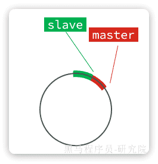​

‍

​`repl_baklog`​中会记录Redis处理过的命令及`offset`​，包括master当前的`offset`​，和slave已经拷贝到的`offset`​

slave与master的offset之间的差异，就是salve需要增量拷贝的数据了。

随着不断有数据写入，master的offset逐渐变大，slave也不断的拷贝，追赶master的offset

直到数组被填满：(循环队列被顶飞了)

此时，如果有新的数据写入，就会覆盖数组中的旧数据。不过，旧的数据只要是绿色的，说明是已经被同步到slave的数据，即便被覆盖了也没什么影响。因为未同步的仅仅是红色部分

‍

但是，如果slave出现网络阻塞，导致master的`offset`​远远超过了slave的`offset`​：如果master继续写入新数据，master的`offset`​就会覆盖`repl_baklog`​中旧的数据，直到将slave现在的`offset`​也覆盖

此时如果slave恢复，需要同步，却发现自己的`offset`​都没有了，无法完成增量同步了。只能做**全量同步**。

‍

> `repl_baklog`​大小有上限，写满后会覆盖最早的数据。如果slave断开时间过久，导致尚未备份的数据被覆盖，则无法基于`repl_baklog`​做增量同步，只能再次全量同步。

‍

‍

### 主从同步优化

‍

主从同步可以保证主从数据的一致性，非常重要。

‍

可以从以下几个方面来优化Redis主从集群：

* 在master中配置`repl-diskless-sync  yes`​启用无磁盘复制，避免全量同步时的磁盘IO。
* Redis单节点上的内存占用不要太大，减少RDB导致的过多磁盘IO
* 适当提高`repl_baklog`​的大小，发现slave宕机时尽快实现故障恢复，尽可能避免全量同步
* 限制一个master上的slave节点数量，如果实在是太多slave，则可以采用`主-从-从`​链式结构，减少master压力

‍

​`主-从-从`​架构图：

​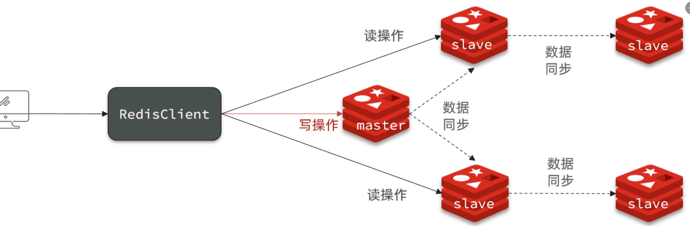​

‍

简述全量同步和增量同步区别？

* 全量同步：master将完整内存数据生成RDB，发送RDB到slave。后续命令则记录在repl_baklog，逐个发送给slave。
* 增量同步：slave提交自己的offset到master，master获取repl_baklog中从offset之后的命令给slave

‍

什么时候执行全量同步？

* slave节点第一次连接master节点时
* slave节点断开时间太久，repl_baklog中的offset已经被覆盖时

‍

什么时候执行增量同步？

* slave节点断开又恢复，并且在`repl_baklog`​中能找到offset时

‍

‍

‍

## 哨兵

主从结构中master节点的作用非常重要，一旦故障就会导致集群不可用。那么有什么办法能保证主从集群的高可用性呢？

Redis提供了`哨兵`​（`Sentinel`​）机制来监控主从集群监控状态，确保集群的高可用性。

‍

### 原理

‍

#### 哨兵作用

哨兵集群作用原理图：

​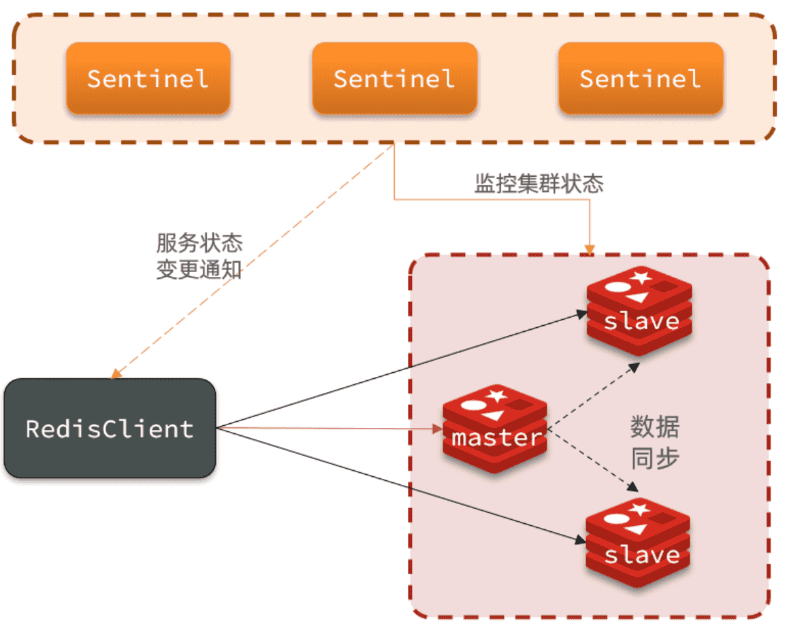​

‍

哨兵的作用如下：

* **状态监控**：`Sentinel`​ 会不断检查您的`master`​和`slave`​是否按预期工作
* **故障恢复（failover）** ：如果`master`​故障，`Sentinel`​会将一个`slave`​提升为`master`​。当故障实例恢复后也以新的master为主成为`slave`​
* **状态通知**：`Sentinel`​充当`Redis`​客户端的服务发现来源，当集群发生`failover`​时，会将最新集群信息推送给`Redis`​的客户端

‍

‍

那么问题来了，`Sentinel`​怎么知道一个Redis节点是否宕机呢？

‍

#### 状态监控

​`Sentinel`​基于心跳机制监测服务状态，每隔1秒向集群的每个节点发送ping命令，并通过实例的响应结果来做出判断：

‍

* **主观下线（sdown）** ：如果某sentinel节点发现某Redis节点未在规定时间响应，则认为该节点主观下线。
* **客观下线(odown)** ：若超过指定数量（通过`quorum`​设置）的sentinel都认为该节点主观下线，则该节点客观下线。quorum值最好超过Sentinel节点数量的一半，Sentinel节点数量至少3台。

‍

‍

#### 故障转移

一旦发现master故障，sentinel需要在salve中选择一个作为新的master，选择依据是这样的：

‍

[官方文档](https://redis.io/docs/management/sentinel/#replica-selection-and-priority)

* 首先会判断slave节点与master节点断开时间长短，如果超过 `down-after-milliseconds * 10`​ 则会排除该slave节点
* 然后判断slave节点的`slave-priority`​值，越小优先级越高，如果是0则永不参与选举（默认都是1）。
* 如果`slave-prority`​一样，则判断slave节点的`offset`​值，越大说明数据越新，优先级越高
* 最后是判断slave节点的`run_id`​大小，越小优先级越高（`通过info server可以查看run_id`​）。

‍

‍

选出一个新的master后，该如何实现身份切换呢？

大概分为两步：

* 在多个`sentinel`​中选举一个`leader`​
* 由`leader`​执行`failover`​

‍

##### 选举leader

首先，Sentinel集群要选出一个执行`failover`​的Sentinel节点，可以成为`leader`​。要成为`leader`​要满足两个条件：

* 最先获得超过半数的投票
* 获得的投票数不小于`quorum`​值

‍

而sentinel投票的原则有两条：

* 优先投票给目前得票最多的
* 如果目前没有任何节点的票，就投给自己

‍

比如有3个sentinel节点，`s1`​、`s2`​、`s3`​，假如`s2`​先投票：

* 此时发现没有任何人在投票，那就投给自己。`s2`​得1票
* 接着`s1`​和`s3`​开始投票，发现目前`s2`​票最多，于是也投给`s2`​，`s2`​得3票
* ​`s2`​称为`leader`​，开始故障转移

‍

不难看出，**谁先投票，谁就会称为leader**，那什么时候会触发投票呢？

答案是**第一个确认master客观下线的人会立刻发起投票，一定会成为leader**。

‍

‍

‍

##### failover

​`sentinel`​找到`leader`​以后，完成`failover`​操作

* sentinel给备选的slave1节点发送slaveof no one命令，让该节点成为master
* sentinel给所有其它slave发送slaveof 192.168.150.101 7002 命令，让这些slave成为新master的从节点，开始从新的master上同步数据。
* 最后，sentinel将故障节点标记为slave，当故障节点恢复后会自动成为新的master的slave节点

‍

‍

‍

### 搭建哨兵集群

在基础的主从集群上进一步, 先要停掉redis集群

```Bash
# 老版本DockerCompose
docker-compose down

# 新版本Docker
docker compose down
```

创建sentinel.conf文件, 内容

```Bash
sentinel announce-ip "192.168.150.101"
sentinel monitor hmaster 192.168.150.101 7001 2
sentinel down-after-milliseconds hmaster 5000
sentinel failover-timeout hmaster 60000
```

‍

* ​`sentinel announce-ip "192.168.150.101"`​：声明当前sentinel的ip
* ​`sentinel monitor hmaster 192.168.150.101 7001 2`​：指定集群的主节点信息

  * ​`hmaster`​：主节点名称，自定义，任意写
  * ​`192.168.150.101 7001`​：主节点的ip和端口
  * ​`2`​：认定`master`​下线时的`quorum`​值
* ​`sentinel down-after-milliseconds hmaster 5000`​：声明master节点超时多久后被标记下线
* ​`sentinel failover-timeout hmaster 60000`​：在第一次故障转移失败后多久再次重试

‍

‍

在虚拟机的`/root/redis`​目录下新建3个文件夹：`s1`​、`s2`​、`s3`​:

将`sentinel.conf`​文件分别拷贝一份到3个文件夹中

‍

接着修改`docker-compose.yaml`​文件

```YAML
version: "3.2"

services:
  r1:
    image: redis
    container_name: r1
    network_mode: "host"
    entrypoint: ["redis-server", "--port", "7001"]
  r2:
    image: redis
    container_name: r2
    network_mode: "host"
    entrypoint: ["redis-server", "--port", "7002", "--slaveof", "192.168.150.101", "7001"]
  r3:
    image: redis
    container_name: r3
    network_mode: "host"
    entrypoint: ["redis-server", "--port", "7003", "--slaveof", "192.168.150.101", "7001"]
  s1:
    image: redis
    container_name: s1
    volumes:
      - /root/redis/s1:/etc/redis
    network_mode: "host"
    entrypoint: ["redis-sentinel", "/etc/redis/sentinel.conf", "--port", "27001"]
  s2:
    image: redis
    container_name: s2
    volumes:
      - /root/redis/s2:/etc/redis
    network_mode: "host"
    entrypoint: ["redis-sentinel", "/etc/redis/sentinel.conf", "--port", "27002"]
  s3:
    image: redis
    container_name: s3
    volumes:
      - /root/redis/s3:/etc/redis
    network_mode: "host"
    entrypoint: ["redis-sentinel", "/etc/redis/sentinel.conf", "--port", "27003"]
```

‍

启动集群

```Shell
docker-compose up -d
```

‍

‍

#### 演示failover

我们连接`7001`​这个`master`​节点，然后通过命令让其休眠60秒，模拟宕机：

```Bash
# 连接7001这个master节点，通过sleep模拟服务宕机，60秒后自动恢复
docker exec -it r1 redis-cli -p 7001 DEBUG sleep 60
```

稍微等待一段时间后，会发现sentinel节点触发了`failover`​

‍

‍

‍

### RedisTemplate整合

‍

就是SpringDataRedis的依赖

```XML
<dependency>
    <groupId>org.springframework.boot</groupId>
    <artifactId>spring-boot-starter-data-redis</artifactId>
</dependency>
```

‍

#### 配置哨兵地址

连接哨兵集群与传统单点模式不同，不再需要设置每一个redis的地址，而是直接指定哨兵地址：

```YAML
spring:
  redis:
    sentinel:
      master: hmaster # 集群名
      nodes: # 哨兵地址列表
        - 192.168.150.101:27001
        - 192.168.150.101:27002
        - 192.168.150.101:27003
```

‍

‍

#### 配置读写分离

配置读写分离，让java客户端将写请求发送到master节点，读请求发送到slave节点。

定义一个bean即可：

```Java
@Bean
public LettuceClientConfigurationBuilderCustomizer clientConfigurationBuilderCustomizer(){
    return clientConfigurationBuilder -> clientConfigurationBuilder.readFrom(ReadFrom.REPLICA_PREFERRED);
}
```

这个bean中配置的就是读写策略，包括四种：

* ​`MASTER`​：从主节点读取
* ​`MASTER_PREFERRED`​：优先从`master`​节点读取，`master`​不可用才读取`slave`​
* ​`REPLICA`​：从`slave`​节点读取
* ​`REPLICA_PREFERRED`​：优先从`slave`​节点读取，所有的`slave`​都不可用才读取`master`​

‍

‍

### 总结

‍

Sentinel的三个作用是什么？

* 集群监控
* 故障恢复
* 状态通知

‍

Sentinel如何判断一个redis实例是否健康？

* 每隔1秒发送一次ping命令，如果超过一定时间没有相向则认为是主观下线（`sdown`​）
* 如果大多数sentinel都认为实例主观下线，则判定服务客观下线（`odown`​）

‍

故障转移步骤有哪些？

* 首先要在`sentinel`​中选出一个`leader`​，由leader执行`failover`​
* 选定一个`slave`​作为新的`master`​，执行`slaveof noone`​，切换到master模式
* 然后让所有节点都执行`slaveof`​ 新master
* 修改故障节点配置，添加`slaveof`​ 新master

‍

sentinel选举leader的依据是什么？

* 票数超过sentinel节点数量1半
* 票数超过quorum数量
* 一般情况下最先发起failover的节点会当选

‍

sentinel从slave中选取master的依据是什么？

* 首先会判断slave节点与master节点断开时间长短，如果超过`down-after-milliseconds * 10`​则会排除该slave节点
* 然后判断slave节点的`slave-priority`​值，越小优先级越高，如果是0则永不参与选举（默认都是1）。
* 如果`slave-prority`​一样，则判断slave节点的`offset`​值，越大说明数据越新，优先级越高
* 最后是判断slave节点的`run_id`​大小，越小优先级越高（`通过info server可以查看run_id`​）。

‍

‍

‍

## 分片集群

主从模式可以解决高可用、高并发读的问题。但依然有两个问题没有解决：

* 海量数据存储
* 高并发写

要解决这两个问题就需要用到分片集群了。分片的意思，就是把数据拆分存储到不同节点，这样整个集群的存储数据量就更大了。

‍

Redis分片集群的结构如图：

​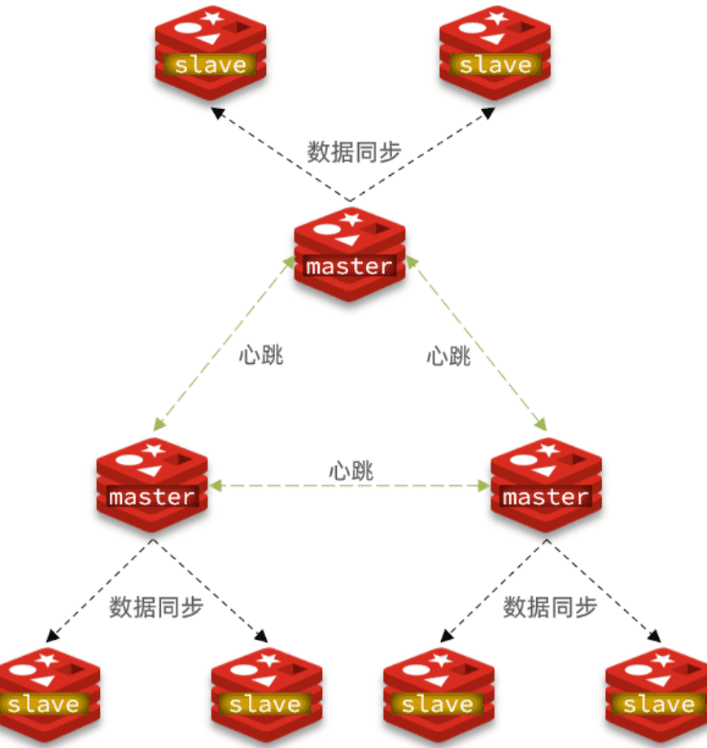​

‍

分片集群特征：

* 集群中有多个master，每个master保存不同分片数据 ，解决海量数据存储问题
* 每个master都可以有多个slave节点 ，确保高可用
* master之间通过ping监测彼此健康状态 ，类似哨兵作用
* 客户端请求可以访问集群任意节点，最终都会被转发到数据所在节点

‍

‍

‍

### 搭建

Redis分片集群最少也需要3个master节点，由于我们的机器性能有限，我们只给每个master配置1个slave，形成最小的分片集群

‍

‍

#### 集群配置

分片集群中的Redis节点必须开启集群模式，一般在配置文件中添加下面参数：

```Bash
port 7000
cluster-enabled yes
cluster-config-file nodes.conf
cluster-node-timeout 5000
appendonly yes
```

‍

* ​`cluster-enabled`​：是否开启集群模式
* ​`cluster-config-file`​：集群模式的配置文件名称，无需手动创建，由集群自动维护
* ​`cluster-node-timeout`​：集群中节点之间心跳超时时间

一般搭建部署集群肯定是给每个节点都配置上述参数，不过考虑到我们计划用`docker-compose`​部署，因此可以直接在启动命令中指定参数

‍

‍

在虚拟机的`/root`​目录下新建一个`redis-cluster`​目录，然后在其中新建一个`docker-compose.yaml`​文件，内容如下：

```YAML
version: "3.2"

services:
  r1:
    image: redis
    container_name: r1
    network_mode: "host"
    entrypoint: ["redis-server", "--port", "7001", "--cluster-enabled", "yes", "--cluster-config-file", "node.conf"]
  r2:
    image: redis
    container_name: r2
    network_mode: "host"
    entrypoint: ["redis-server", "--port", "7002", "--cluster-enabled", "yes", "--cluster-config-file", "node.conf"]
  r3:
    image: redis
    container_name: r3
    network_mode: "host"
    entrypoint: ["redis-server", "--port", "7003", "--cluster-enabled", "yes", "--cluster-config-file", "node.conf"]
  r4:
    image: redis
    container_name: r4
    network_mode: "host"
    entrypoint: ["redis-server", "--port", "7004", "--cluster-enabled", "yes", "--cluster-config-file", "node.conf"]
  r5:
    image: redis
    container_name: r5
    network_mode: "host"
    entrypoint: ["redis-server", "--port", "7005", "--cluster-enabled", "yes", "--cluster-config-file", "node.conf"]
  r6:
    image: redis
    container_name: r6
    network_mode: "host"
    entrypoint: ["redis-server", "--port", "7006", "--cluster-enabled", "yes", "--cluster-config-file", "node.conf"]
```

‍

**注意**：使用Docker部署Redis集群，network模式必须采用host

‍

‍

#### 启动集群

进入`/root/redis-cluster`​目录，使用命令启动redis：

```Bash
docker-compose up -d
```

‍

启动成功，可以通过命令查看启动进程：

```Bash
ps -ef | grep redis
# 结果：
root       4822   4743  0 14:29 ?        00:00:02 redis-server *:7002 [cluster]
root       4827   4745  0 14:29 ?        00:00:01 redis-server *:7005 [cluster]
......
```

可以发现每个redis节点都以cluster模式运行。不过节点与节点之间并未建立连接。

‍

使用命令创建集群

```Bash
# 进入任意节点容器
docker exec -it r1 bash

# 执行命令
redis-cli --cluster create --cluster-replicas 1 \
192.168.150.101:7001 192.168.150.101:7002 192.168.150.101:7003 \
192.168.150.101:7004 192.168.150.101:7005 192.168.150.101:7006
```

‍

* ​`redis-cli --cluster`​：代表集群操作命令
* ​`create`​：代表是创建集群
* ​`--cluster-replicas 1`​ ：指定集群中每个`master`​的副本个数为1

  * 此时`节点总数 ÷ (replicas + 1)`​ 得到的就是`master`​的数量`n`​。因此节点列表中的前`n`​个节点就是`master`​，其它节点都是`slave`​节点，随机分配到不同`master`​

‍

输入命令后控制台会弹出展示集群中`master`​与`slave`​节点分配情况，并询问你是否同意。节点信息如下：

* ​`7001`​是`master`​，节点`id`​后6位是`da134f`​
* ​`7002`​是`master`​，节点`id`​后6位是`862fa0`​
* ​`7003`​是`master`​，节点`id`​后6位是`ad5083`​
* ​`7004`​是`slave`​，节点`id`​后6位是`391f8b`​，认`ad5083`​（7003）为`master`​
* ​`7005`​是`slave`​，节点`id`​后6位是`e152cd`​，认`da134f`​（7001）为`master`​
* ​`7006`​是`slave`​，节点`id`​后6位是`4a018a`​，认`862fa0`​（7002）为`master`​

‍

‍

输入`yes`​然后回车。会发现集群开始创建

‍

查看集群状态

```Bash
redis-cli -p 7001 cluster nodes
```

‍

‍

### 散列插槽

‍

数据要分片存储到不同的Redis节点，肯定需要有分片的依据，这样下次查询的时候才能知道去哪个节点查询。很多数据分片都会采用一致性hash算法。而Redis则是利用散列插槽（**​`hash slot`​**​）的方式实现数据分片。

‍

[官方文档](https://redis.io/docs/management/scaling/#redis-cluster-101)

‍

在Redis集群中，共有16384个`hash slots`​，集群中的每一个master节点都会分配一定数量的`hash slots`​。具体的分配在集群创建时就已经指定了：

‍

* Master[0]，本例中就是7001节点，分配到的插槽是0~5460
* Master[1]，本例中就是7002节点，分配到的插槽是5461~10922
* Master[2]，本例中就是7003节点，分配到的插槽是10923~16383

‍

当我们读写数据时，Redis基于`CRC16`​ 算法对`key`​做`hash`​运算，得到的结果与`16384`​取余，就计算出了这个`key`​的`slot`​值。然后到`slot`​所在的Redis节点执行读写操作

‍

数据key不是与节点绑定，而是与插槽绑定。redis会根据key的有效部分计算插槽值，分两种情况：

* 当`key`​中包含`{}`​时，根据`{}`​之间的字符串计算`hash slot`​
* 当`key`​中不包含`{}`​时，则根据整个`key`​字符串计算`hash slot`​

‍

例如：

* key是`user`​，则根据`user`​来计算hash slot
* key是`user:{age}`​，则根据`age`​来计算hash slot

‍

#### demo

测试一下，先于`7001`​建立连接：

```Bash
# 进入容器
docker exec -it r1 bash
# 进入redis-cli
redis-cli -p 7001
# 测试
set user jack
```

‍

会发现报错

‍

提示我们`MOVED 5474`​，其实就是经过计算，得出`user`​这个`key`​的`hash slot`​ 是`5474`​，而`5474`​是在`7002`​节点，不能在`7001`​上写入

这是因为我们连接的方式有问题，连接集群时，要加`-c`​参数：

```Bash
# 通过7001连接集群
redis-cli -c -p 7001
# 存入数据
set user jack
```

可以看到，客户端自动跳转到了`5474`​这个`slot`​所在的`7002`​节点。

现在，我们添加一个新的key，这次加上`{}`​：

```Bash
# 试一下key中带{}
set user:{age} 21

# 再试一下key中不带{}
set age 20
```

可以看到`user:{age}`​和`age`​计算出的`slot`​都是`741`​。

‍

‍

### 集群伸缩

redis-cli --cluster提供了很多操作集群的命令

‍

#### demo

需求：向集群中添加一个新的master节点，并向其中存储 num = 10

* 启动一个新的redis实例，端口为7004
* 添加7004到之前的集群，并作为一个master节点
* 给7004节点分配插槽，使得num这个key可以存储到7004实例

‍

这里需要两个新的功能：

* 添加一个节点到集群中
* 将部分插槽分配到新插槽

‍

‍

##### 创建新的redis实例

创建一个文件夹：

```bash
mkdir 7004
```

拷贝配置文件：

```bash
cp redis.conf /7004
```

修改配置文件：

```bash
sed /s/6379/7004/g 7004/redis.conf
```

启动

```bash
redis-server 7004/redis.conf
```

‍

##### 添加新节点到redis

```bash
redis-cli --cluster add-node  192.168.150.101:7004 192.168.150.101:7001
```

通过命令查看集群状态：

```bash
redis-cli -p 7001 cluster nodes
```

7004加入了集群，并且默认是一个master节点：

但是7004节点的插槽数量为0，因此没有任何数据可以存储到7004上

‍

‍

#### 转移插槽

我们要将num存储到7004节点，因此需要先看看num的插槽是多少

‍

如上图所示，num的插槽为2765.

我们可以将0~3000的插槽从7001转移到7004, 下略

‍

‍

‍

### 故障转移

分片集群的节点之间会互相通过ping的方式做心跳检测，超时未回应的节点会被标记为下线状态。当发现master下线时，会将这个master的某个slave提升为master。

‍

‍

‍

#### 自动故障转移

当集群中有一个master宕机会发生什么呢？

直接停止一个redis实例，例如7002：

```bash
redis-cli -p 7002 shutdown
```

1）首先是该实例与其它实例失去连接

2）然后是疑似宕机：

3）最后是确定下线，自动提升一个slave为新的master：

4）当7002再次启动，就会变为一个slave节点了：

‍

#### 手动故障转移

利用cluster failover命令可以手动让集群中的某个master宕机，切换到执行cluster failover命令的这个slave节点，实现无感知的数据迁移。其流程如下：

‍

​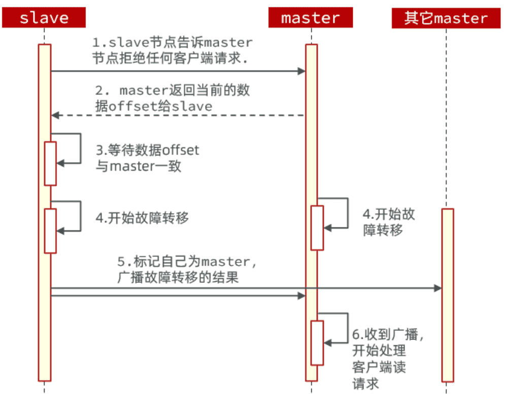​

‍

这种failover命令可以指定三种模式：

* 缺省：默认的流程，如图1~6歩
* force：省略了对offset的一致性校验
* takeover：直接执行第5歩，忽略数据一致性、忽略master状态和其它master的意见

‍

‍

#### demo

打开一个控制台窗口，利用命令监测集群状态：

```Bash
watch docker exec -it r1 redis-cli -p 7001 cluster nodes
```

命令前面的watch可以每隔一段时间刷新执行结果，方便我们实时监控集群状态变化。

‍

利用命令让某个master节点休眠。比如这里我们让`7002`​节点休眠，打开一个新的ssh控制台，输入下面命令：

```Bash
docker exec -it r2 redis-cli -p 7002 DEBUG sleep 30
```

观察到，集群发现7002宕机，标记为下线

过了一段时间后，7002原本的小弟7006变成了`master`​

而7002被标记为`slave`​，而且其`master`​正好是7006，主从地位互换。

‍

‍

‍

### 总结

Redis分片集群如何判断某个key应该在哪个实例？

* 将16384个插槽分配到不同的实例
* 根据key计算哈希值，对16384取余
* 余数作为插槽，寻找插槽所在实例即可

‍

如何将同一类数据固定的保存在同一个Redis实例？

* Redis计算key的插槽值时会判断key中是否包含`{}`​，如果有则基于`{}`​内的字符计算插槽
* 数据的key中可以加入`{类型}`​，例如key都以`{typeId}`​为前缀，这样同类型数据计算的插槽一定相同

‍

‍

‍

### RedisTemplate整合

底层同样基于lettuce实现了分片集群的支持，而使用的步骤与哨兵模式基本一致

1）引入redis的starter依赖

2）配置分片集群地址

3）配置读写分离

与哨兵模式相比，其中只有分片集群的配置方式略有差异

```YAML
spring:
  redis:
    cluster:
      nodes:
        - 192.168.150.101:7001
        - 192.168.150.101:7002
        - 192.168.150.101:7003
        - 192.168.150.101:8001
        - 192.168.150.101:8002
        - 192.168.150.101:8003
```

‍

‍

‍

## 内存回收

Redis之所以性能强，最主要的原因就是基于内存存储。然而单节点的Redis其内存大小不宜过大，会影响持久化或主从同步性能。

‍

我们可以通过修改redis.conf文件，添加下面的配置来配置Redis的最大内存：

```Properties
maxmemory 1gb
```

当内存达到上限，就无法存储更多数据了。因此，Redis内部会有两套内存回收的策略：

* 内存过期策略
* 内存淘汰策略

‍

### 内存过期处理

存入Redis中的数据可以配置过期时间，到期后再次访问会发现这些数据都不存在了，也就是被过期清理了

‍

#### 过期命令

Redis中通过`expire`​命令可以给KEY设置`TTL`​（过期时间），例如：

```Bash
# 写入一条数据
set num 123
# 设置20秒过期时间
expire num 20
```

不过set命令本身也可以支持过期时间的设置：

```Shell
# 写入一条数据并设置20s过期时间
set num EX 20
```

当过期时间到了以后，再去查询数据，会发现数据已经不存在。

‍

‍

#### 过期策略

* Redis如何判断一个KEY是否过期呢？
* Redis又是何时删除过期KEY的呢？

‍

Redis不管有多少种数据类型，本质是一个`KEY-VALUE`​的键值型数据库，而这种键值映射底层正式基于HashTable来实现的，在Redis中叫做Dict.

来看下RedisDB的底层源码：

```C
typedef struct redisDb {
    dict dict;                 / The keyspace for this DB , 也就是存放KEY和VALUE的哈希表*/
    dict *expires;              /* 同样是哈希表，但保存的是设置了TTL的KEY，及其到期时间*/
    dict *blocking_keys;        /* Keys with clients waiting for data (BLPOP)*/
    dict *ready_keys;           /* Blocked keys that received a PUSH */
    dict *watched_keys;         /* WATCHED keys for MULTI/EXEC CAS /
    int id;                     / Database ID, 0 ~ 15 /
    long long avg_ttl;          / Average TTL, just for stats /
    unsigned long expires_cursor; / Cursor of the active expire cycle. */
    list *defrag_later;         /* List of key names to attempt to defrag one by one, gradually. */
} redisDb;
```

‍

> **面试题**：Redis如何判断KEY是否过期呢？
>
> **答**：在Redis中会有两个Dict，也就是HashTable，其中一个记录KEY-VALUE键值对，另一个记录KEY和过期时间。要判断一个KEY是否过期，只需要到记录过期时间的Dict中根据KEY查询即可。
>
> ‍
>
> Redis是何时删除过期KEY的呢？
>
> Redis并不会在KEY过期时立刻删除KEY，因为要实现这样的效果就必须给每一个过期的KEY设置时钟，并监控这些KEY的过期状态。无论对CPU还是内存都会带来极大的负担。

‍

Redis的过期KEY删除策略有两种：

* 惰性删除
* 周期删除

‍

##### **惰性删除**

过期后不会立刻删除。那在什么时候删除呢？

Redis会在每次访问KEY的时候判断当前KEY有没有设置过期时间，如果有，过期时间是否已经到期。对应的源码如下：

```C
// db.c
// 寻找要执行写操作的key
robj *lookupKeyWriteWithFlags(redisDb *db, robj *key, int flags) {
    // 检查key是否过期，如果过期则删除
    expireIfNeeded(db,key);
    return lookupKey(db,key,flags);
}

// 寻找要执行读操作的key
robj *lookupKeyReadWithFlags(redisDb *db, robj *key, int flags) {
    robj *val;
    // 检查key是否过期，如果过期则删除
    if (expireIfNeeded(db,key) == 1) {
        // 略 ...
    }
    val = lookupKey(db,key,flags);
    if (val == NULL)
        goto keymiss;
    server.stat_keyspace_hits++;
    return val;
}
```

‍

##### **周期删除**

通过一个定时任务，周期性的抽样部分过期的key，然后执行删除。

‍

执行周期有两种：

* **SLOW模式：** Redis会设置一个定时任务`serverCron()`​，按照`server.hz`​的频率来执行过期key清理
* **FAST模式：** Redis的每个事件循环前执行过期key清理（事件循环就是NIO事件处理的循环）。

‍

**SLOW**模式规则：

* ① 执行频率受`server.hz`​影响，默认为10，即每秒执行10次，每个执行周期100ms。
* ② 执行清理耗时不超过一次执行周期的25%，即25ms.
* ③ 逐个遍历db，逐个遍历db中的bucket，抽取20个key判断是否过期
* ④ 如果没达到时间上限（25ms）并且过期key比例大于10%，再进行一次抽样，否则结束

‍

**FAST**模式规则（过期key比例小于10%不执行）：

* ① 执行频率受`beforeSleep()`​调用频率影响，但两次FAST模式间隔不低于2ms
* ② 执行清理耗时不超过1ms
* ③ 逐个遍历db，逐个遍历db中的bucket，抽取20个key判断是否过期
* ④ 如果没达到时间上限（1ms）并且过期key比例大于10%，再进行一次抽样，否则结束

‍

‍

### 内存淘汰策略

对于某些特别依赖于Redis的项目而言，仅仅依靠过期KEY清理是不够的，内存可能很快就达到上限。因此Redis允许设置内存告警阈值，当内存使用达到阈值时就会主动挑选部分KEY删除以释放更多内存。这叫做**内存淘汰**机制。

‍

‍

#### 内存淘汰时机

当内存达到阈值时执行内存淘汰，但问题是Redis什么时候会执去判断内存是否达到预警呢？

Redis每次执行任何命令时，都会判断内存是否达到阈值：

```C
// server.c中处理命令的部分源码
int processCommand(client *c) {
    // ... 略
    if (server.maxmemory && !server.lua_timedout) {
        // 调用performEvictions()方法尝试进行内存淘汰
        int out_of_memory = (performEvictions() == EVICT_FAIL);
        // ... 略
        if (out_of_memory && reject_cmd_on_oom) {
            // 如果内存依然不足，直接拒绝命令
            rejectCommand(c, shared.oomerr);
            return C_OK;
        }
    }
}
```

‍

‍

#### 淘汰策略

好了，知道什么时候尝试淘汰了，那具体Redis是如何判断该淘汰哪些`Key`​的呢？

Redis支持8种不同的内存淘汰策略：

* ​`noeviction`​： 不淘汰任何key，但是内存满时不允许写入新数据，默认就是这种策略。
* ​`volatile-ttl`​： 对设置了TTL的key，比较key的剩余TTL值，TTL越小越先被淘汰
* ​`allkeys-random`​：对全体key ，随机进行淘汰。也就是直接从db->dict中随机挑选
* ​`volatile-random`​：对设置了TTL的key ，随机进行淘汰。也就是从db->expires中随机挑选。
* ​`allkeys-lru`​： 对全体key，基于LRU算法进行淘汰
* ​`volatile-lru`​： 对设置了TTL的key，基于LRU算法进行淘汰
* ​`allkeys-lfu`​： 对全体key，基于LFU算法进行淘汰
* ​`volatile-lfu`​： 对设置了TTL的key，基于LFI算法进行淘汰

‍

比较容易混淆的有两个算法：

* **LRU**（**​`L`​**​`east `​**​`R`​**​`ecently `​**​`U`​**​`sed`​），最近最久未使用。用当前时间减去最后一次访问时间，这个值越大则淘汰优先级越高。
* **LFU**（**​`L`​**​`east `​**​`F`​**​`requently `​**​`U`​**​`sed`​），最少频率使用。会统计每个key的访问频率，值越小淘汰优先级越高。

‍

Redis怎么知道某个KEY的`最近一次访问时间`​或者是`访问频率`​呢？

还记不记得之前讲过的RedisObject的结构？

‍

其中的`lru`​就是记录最近一次访问时间和访问频率的。当然，你选择`LRU`​和`LFU`​时的记录方式不同：

* **LRU**：以秒为单位记录最近一次访问时间，长度24bit
* **LFU**：高16位以分钟为单位记录最近一次访问时间，低8位记录逻辑访问次数

时间就不说了，那么逻辑访问次数又是怎么回事呢？8位无符号数字最大才255，访问次数超过255怎么办？

‍

这就要聊起Redis的**逻辑访问次数**算法了，LFU的访问次数之所以叫做**逻辑访问次数**，是因为并不是每次key被访问都计数，而是通过运算：

* ① 生成`[0,1)`​之间的随机数`R`​
* ② 计算 `1/(旧次数 * lfu_log_factor + 1)`​，记录为`P`​， `lfu_log_factor`​默认为10
* ③ 如果 `R`​ < `P `​，则计数器 `+1`​，且最大不超过255
* ④ 访问次数会随时间衰减，距离上一次访问时间每隔 `lfu_decay_time`​ 分钟(默认1) ，计数器`-1`​

‍

显然LFU的基于访问频率的统计更符合我们的淘汰目标，因此**官方推荐使用LFU算法。**

‍

‍

算法我们弄明白了，不过这里大家要注意一下：Redis中的`KEY`​可能有数百万甚至更多，每个KEY都有自己访问时间或者逻辑访问次数。我们要找出时间最早的或者访问次数最小的，难道要把Redis中**所有数据排序**？

要知道Redis的内存淘汰是在每次执行命令时处理的。如果每次执行命令都先对全量数据做内存排序，那命令的执行时长肯定会非常长，这是不现实的。

‍

所以Redis采取的是**抽样法**，即每次抽样一定数量（`maxmemory_smples`​）的key，然后基于内存策略做排序，找出淘汰优先级最高的，删除这个key。这就导致Redis的算法并不是真正的**LRU**，而是一种基于抽样的**近似LRU算法**。

不过，在Redis3.0以后改进了这个算法，引入了一个淘汰候选池，抽样的key要与候选池中的key比较淘汰优先级，优先级更高的才会被放入候选池。然后在候选池中找出优先级最高的淘汰掉，这就使算法的结果更接近与真正的LRU算法了。特别是在抽样值较高的情况下（例如10），可以达到与真正的LRU接近的效果。

‍

‍

‍

# 实操

‍

## Bugfix
