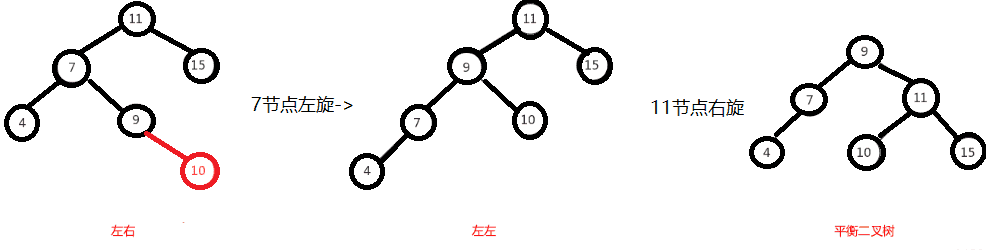

‍

‍

### Header

‍

科班个人记录

> 课堂期末整理后留下的遗产, 原理和个人主要开发方向接触面较窄且基础知识技能无需记录, 因此内容较少

‍

‍

## 知识

‍

数据结构分为

* 线性数据结构
* 树型数据结构
* 图型数据结构

‍

C++中的容器分为（都是线性的）

* 顺序容器

  * array 数组
  * vector向量
  * list 链表
* 关联容器

  * map 映射
  * set 集合
* 容器适配器

  * stack 栈
  * queue 队列

‍

Java中的容器分为（都是线性的）集合collection。除了一下基本集合类型，还有多个特殊的类型，后续补充

* List

  * Arraylist，有序，插入序
  * vector
  * stack
* Queue

  * linkedlist，双端队列有序，插入序
  * arrayqueue，有序，插入序
  * priorityQueue，有序，自然序
* Set

  * hashset，无序
  * linkedhashset，有序，插入序
  * treeSet，有序，自然序
* Map

  * hashmap，无序
  * linkedhashmap，有序，插入序
  * treemap 有序，自然序

‍

‍

‍

‍

‍

## 顺序表

> Array

‍

‍

## 链表

‍

‍

==线性链表==

‍

链接方式

* 单链表
* 双链表
* 循环链表

‍

实现方式

* 动态链表
* 静态链表

‍

链表的节点（node）

1. 数据域（data）：值
2. 指针域（next）：直接后继的地址或位置

‍

‍

### 单链表

```cpp
typedef struct Node{
   ElemType data;
   struct Node* next;
}Node, *LinkList;
```

‍

‍

### 循环链表

|判空条件|不带头结点|带头结点|
| :----------: | ------------| ----------|
|单链表|​`p!=NULL`​|​`p->next!=NULL`​|
|单循环链表|​`p!=L`​|​`p->next!=L`​|

```cpp
InitCLinkList(LinkList CL){
   *CL = (LinkList) malloc(sizeof(Node));
   (*CL)->next = *CL;
}
```

‍

‍

### 双向链表

‍

==创建==

```cpp
// 在单链表的每个节点中再增加一个指向其前驱的指针域prior
typedef struct DNode{
   ElemType data;
   struct DNode *prior, *next;
}DNode, *DoubleList;

// 设指针p指向双向链表中的某一结点，则：
p->prior->next == p;
p == p->next->prior;
```

‍

==插入==

```cpp
DLinkIns(DoubleList L, int i, ElemType e){
   DNode *s, *p;
   ...
   ...
   if(s = (DNode*)malloc(sizeof(DNode))){
      s->data = e;
      s->prior = p->prior;
      p->prior->next = s;
      s->next = p;
      p->prior = s;
   }
}
```

‍

==删除==

```cpp
DLinkDel(DoubleList L, int i, ElemType e){
   DNode *p;
   // 检查合法性
   // 找到第i个节点，p指向
   p->prior->next = p->next;
   p->next->prior = p->prior;
   free(p);
}
```

‍

‍

### 变种

‍

|存储方式|首元素节点|表尾节点|p的前驱|
| ---------------------------------| ------------| ----------| --------------------------------|
|带头节点的单链表L|​`L->next`​|一重循环|顺p节点的next域无法找到p的前驱|
|带头节点的循环单链表（头指针）L|​`L->next`​|一重循环|顺p节点的next域可以找到p的前驱|
|带尾指针的循环单链表R|​`R->next->next`​|R|顺p节点的next可以找到p的前驱|
|带头节点的双向循环链表L|​`L->next`​|​`L->prior`​|​`p->prior`​|

‍

‍

## 栈

‍

‍

### 顺序栈

```cpp
#define STACK_SIZE 50
typedef struct{
   StackElementType elem[STACK_SIZE];
   int top;//栈顶元素下标，-1表空栈
}SeqStack;
```

‍

‍

‍

## 队列

‍

‍

### 链队列

```cpp
// 通常将队头指针和队尾指针封装在一个结构体中，并将该结构体类型重新命名为链队列类型
typedef struct Node{
   QueueElementType data;
   struct Node* next;
}LinkQueueNode;

typedef struct{
   LinkQueueNode* front;
   LinkQueueNode* rear;
}LinkQueue;
```

‍

初始化

```cpp
InitQueue(LinkQueue *Q){
   Q->front = (LinkQueueNode*)malloc(sizeof(LinkQueueNode));
   if(Q->front != NULL){
      Q->rear = Q->front;
      Q->front->next = NULL;
   }
}
```

‍

‍

### 循环队列

‍

真正队满的条件：rear - front = MAXSIZE

进队时：rear = (rear+1)%MAXSIZE

出队时：front = (front+1)%MAXSIZE

在非空队列中，队头指针始终指向当前的队头元素，而队尾的指针始终指向真正队尾元素后面的单元

front == rear：无法判断队列状态

* 损失一个元素的存储空间，当队尾指针指向的空单元的后继单元是队头元素所在的单元时停止入队
* 增设一个标志量以区别队列状态

```cpp
#define MAXSIZE 50
typedef struct{
   QueueElementType element[MAXSIZE];
   int front;
   int rear;
}SeqQueue;
```

‍

初始化

```cpp
InitQueue(SeqQueue *Q){
   Q->front = Q->rear = 0;
}
```

‍

入队

```cpp
EnterQueue(SeqQueue *Q, QueueElementType x){
   if((Q->rear + 1)%MAXSIZE == Q->front){
      // 队满
   }
   Q->element[Q->rear++] = x;
   Q->rear %= MAXSIZE;
}
```

‍

出队

```cpp
DeleteQueue(SeqQueue *Q, QueueElementType *x){
   if(Q->rear == Q->front){
      // 队空
   }
   *x = Q->element[Q->front++];
   Q->front %= MAXSIZE;
}
```

上述的第二种标志位的方法：

* 初始化：Q->front = Q->rear = 0;tag = 0;
* 队空：Q->front == Q->rear = 0 && tag == 0;
* 队满：Q->front == Q->rear = 0 && tag == 1;

‍

‍

‍

## 串

> Str

‍

‍

‍

‍

### 匹配

‍

‍

#### BF

Brute Force 暴力匹配算法

```java
public static void main(String[] args) {
    String s = "seazean";
    String t = "az";
    System.out.println(match(s,t));//2
}

public static int match(String s,String t) {
    int k = 0;
    int i = k, j = 0;
    //防止越界
    while (i < s.length() && j < t.length()) {
        if (s.charAt(i) == t.charAt(j)) {
            ++i;
            ++j;
        } else {
            k++;
            i = k;
            j = 0;
        }
    }
    //说明是匹配成功
    if (j >= t.length()) {
        return k;
    }
    return 0;
}
```

平均时间复杂度：O(m+n)，最坏时间复杂度：O(m*n)

‍

‍

#### RK

把主串得长度记为 n，模式串得长度记为 m，通过哈希算法对主串中的 n-m+1 个子串分别求哈希值，然后逐个与模式串的哈希值比较大小，如果某个子串的哈希值与模式串相等，再去对比值是否相等（防止哈希冲突），那就说明对应的子串和模式串匹配了

因为哈希值是一个数字，数字之间比较是否相等是非常快速的

第一部分计算哈希值的时间复杂度为 O(n)，第二部分对比的时间复杂度为 O(1)，整体平均时间复杂度为 O(n)，最坏为 O(n*m)

‍

‍

#### KMP

* next 数组的核心就是自己匹配自己，主串代表后缀，模式串代表前缀
* nextVal 数组的核心就是回退失配

```java
public class Kmp {
    public static void main(String[] args) {
        String s = "acababaabc";
        String t = "abaabc";
        //[-1, 0, 0, 1, 1, 2]
        System.out.println(Arrays.toString(getNext(t)));
        //[-1, 0, -1, 1, 0, 2]
        System.out.println(Arrays.toString(getNextVal(t)));
        //5
        System.out.println(kmp(s, t));
    }

    private static int kmp(String s, String t) {
        int[] next = getNext(t);
        int i = 0, j = 0;
        while (i < s.length() && j < t.length()) {
            //j==-1时说明第一个位置匹配失败，所以将s的下一个和t的首字符比较
            if (j == -1 || s.charAt(i) == t.charAt(j)) {
                i++;
                j++;
            } else {
                //模式串右移，比较s的当前位置与t的next[j]位置
                j = next[j];
            }
        }
        if (j >= t.length()) {
            return i - j + 1;
        }
        return -1;
    }
	//next数组
    private static int[] getNext(String t) {
        int[] next = new int[t.length()];
        next[0] = -1;
        int j = -1;
        int i = 0;
        while (i < t.length() - 1) {
            // 根据已知的前j位推测第j+1位
            // j=-1说明首位就没有匹配，即t[0]!=t[i]，说明next[i+1]没有最大前缀，为0
            if (j == -1 || t.charAt(i) == t.charAt(j)) {
                // 因为模式串已经匹配到了索引j处，说明之前的位都是相等的
                // 因为是自己匹配自己，所以模式串就是前缀，主串就是后缀，j就是最长公共前缀
                // 当i+1位置不匹配时（i位之前匹配），可以跳转到j+1位置对比，next[i+1]=j+1
                i++;
                j++;
                next[i] = j;
            } else {
                //i位置的数据和j位置的不相等，所以回退对比i和next[j]位置的数据
                j = next[j];
            }

        }
        return next;
    }
	//nextVal
    private static int[] getNextVal(String t) {
        int[] nextVal = new int[t.length()];
        nextVal[0] = -1;
        int j = -1;
        int i = 0;
        while (i < t.length() - 1) {
            if (j == -1 || t.charAt(i) == t.charAt(j)) {
                i++;
                j++;
                // 如果t[i+1] == t[next(i+1)]=next[j+1]，回退后仍然失配，所以要继续回退
                if (t.charAt(i) == t.charAt(j)) {
                    nextVal[i] = nextVal[j];
                } else {
                    nextVal[i] = j;
                }
            } else {
                j = nextVal[j];
            }
        }
        return nextVal;
    }
}
```

平均和最坏时间复杂度都是 O(m+n)

‍

‍

‍

## 树

‍

### 树

‍

‍

‍

==术语集合==

‍

* 结点：包括一个数据元素及若干指向其他节点的分支信息
* 结点的度：该结点的子树个数
* 叶结点：度为0的结点，即无后继结点，又称终端结点
* 分支结点：度不为0的结点，又称非终端结点
* 结点的层次：从根结点开始定义，根结点的层次为1，根的直接后继的层次为2...
* 结点的层序编号：将树中的结点按从上层到下层，同层从左到右的次序排成一个线性序列，依次给他们编以连续的自然数
* 树的度：树中所有结点度的最大值
* 树的高度（深度）：树中所有结点的层次的最大值
* 有序树：在树T中，如果各子树T<sub>i</sub>之间是有先后次序的，则称为有序树
* 森林：m(m>=0)棵互不相交的树的集合. 将一棵非空树的根结点删去，树就变成一个森林；给森林增加一个统一的根结点，森林就变成一棵树. 一棵树也可以称为森林
* 同构：对两棵树，通过对结点适当地重命名，就可以使两棵树完全相等（结点对应相等，对应结点的相关关系页也相等）
* 孩子结点：该结点的直接后继
* 双亲结点：该结点的直接前驱
* 兄弟结点：同一双亲结点的孩子结点之间互称
* 堂兄弟：父亲是兄弟关系或堂兄弟关系的结点
* 祖先结点：从根结点至该结点的路径上的所有结点
* 子孙结点：该结点的直接后继和间接后继
* 前辈：层号比某结点小的结点
* 后辈：层号比某结点大的结点

‍

‍

#### 双亲表示法

用一组连续的存储空间来存储树中的结点，在保存每个结点的同时附设一个指示器来指示其双亲的结点在表中的位置.

```cpp
// 结点结构
typedef struct TNode{
   DataType data;
   int parent;
} TNode;
// 树
typedef struct{
   TNode tree[MAXSIZE];
   int r;
} ParentTree;
```

‍

#### 孩子（链表）表示法

 -> 图的邻接表表示法

```cpp
typedef struct ChildNode{   // 孩子结点的结构
   int child;              // 孩子结点在线性表中的位置
   struct ChildNode *next; // 指向下一个孩子结点的指针
} ChildNode;
typedef struct{            // 顺序表结点的结构
   DataType data;         // 数据域
   ChildNode *firstchild; // 指向第一个孩子结点的指针
} DataNode;
typedef struct{              // 树的定义
   DataNode nodes[MAXSIZE]; // 数据域（结点数组）
   int root;                // 根结点的位置，若约定nodes[0]为根结点，则可以省略该域
   int num;                 // 树中结点的个数
} ChildTree;
```

‍

#### 孩子兄弟表示

又称树的二叉链表表示法

```cpp
typedef struct CSNode{// 存储结构定义
   DataType data;    // 数据域
   int FirstChild;   // 第一个孩子结点的位置（父子关系）
   int NextSibling;  // 下一个兄弟结点的位置（兄弟关系）
} CSNode, *CSTree;
/*访问结点x的第i个孩子
1. 从FirstChild域找到第1个孩子结点n
2. 沿着n的NextSibling域走i-1步
*/
```

‍

‍

### 二叉树

‍

* 每个结点的度都不大于2
* 每个节点的孩子结点次序不能任意颠倒

```cpp
// 将bt初始化为空二叉树
InitBiTree(bt);
// 创建一棵非空二叉树bt
CreateBiTree(bt);
// 销毁二叉树bt
DestroyBiTree(bt);
// 判空
Empty(bt);
// 求二叉树bt的根结点，若二叉树bt为空二叉树，返回NULL
Root(bt);
// 求二叉树bt中结点x的双亲结点，若结点x是二叉树的根结点或二叉树bt中无结点x，返回NULL
Parent(bt, x);
// 求二叉树bt中结点x的左孩子，若结点x无左孩子或x不在bt中，返回NULL
LeftChild(bt, x);
// 求二叉树bt中结点x的右孩子，若结点x无右孩子或x不在bt中，返回NULL
RightChild(bt, x);
// 按某个次序依次访问二叉树bt中每个节点一次且仅一次
Traverse(bt);
// 将二叉树bt置为空树
Clear(bt);
```

‍

* 在二叉树的第i层上至多有2<sub>i-1</sub>个结点（i>=1）
* 深度为k的二叉树至多有2<sup>k</sup>-1个结点（k>=1）
* 1. **满二叉树**：深度为k，且有2<sup>k</sup>-1个结点的二叉树.  
      顺序表示：从二叉树的根开始，按层间从上到下，层内从左到右的顺序逐层进行编号（1，2，...，n）
  2. **完全二叉树**：深度为k，结点数为n的二叉树，如果其结点`1~n`​的位置序号分别与等高的满二叉树的结点`1~n`​的位置序号一一对应，则为完全二叉树.

      1. 叶子结点只可能出现在 最后两层
      2. 度为1的结点个数为0或1
* 具有n个结点的完全二叉树的深度为$[log_2 n]+1$
* 对于具有n个结点的完全二叉树，如果按照从上到下、从左到右的顺序对二叉树中的所有结点从1考试顺序编号，则对任意序号i的结点有：

  * 如果i=1，则序号为i的结点是根结点，无双亲结点；如i>1，则序号为i的结点的双亲结点序号为$[i/2]$
  * 如果2i>n，则序号为i的结点无左孩子；如2i<=n，则序号为i的结点的左孩子结点的序号为2i
  * 如果2i+1>n，则序号为i的结点无右孩子；如2i+1<=n，则序号为i的结点的右孩子结点的序号为2i+1

‍

‍

#### 顺序

可以参考满二叉树方法表示

‍

#### 链式

‍

二叉链表

```cpp
typedef struct Node{
   DataType data;
   struct Node* LChild;
   struct Node* RChild;
}BiTNode, *BiTree;
// 若一个二叉树含有n个结点，则其二叉链表中必含有2n个指针域，其中必有n+1个空的指针域
```

‍

三叉链表

```cpp
typedef struct Node{
   DataType data;
   struct Node* Parent;
   struct Node* LChild;
   struct Node* RChild;
}BiTNode, *BiTree;
```

‍

‍

#### 遍历

‍

根据对根访问先后顺序不同，分别称DLR为先序遍历或先根遍历，LDR为中序遍历（对称遍历），LRD为后序遍历

先序、中序、后序遍历时是递归定义的，即在其子树中仍按上述规律进行遍历

‍

‍

#### 应用

‍

求二叉树的高度：二叉树的高度（深度）为二叉树中结点层次的最大值，也可以视为其左右子树高度的最大值加一

‍

* 分治法

  1. 若bt为空，则高度为0
  2. 若bt非空，其高度应为其左右子树高度的最大值加一

  ```cpp
  int PostTreeDepth(BiTree bt){
     if(bt){
        int hl = PostTreeDepth(bt->LChild);
        int rl = PostTreeDepth(bt->RChild);
        return (hl > rl ? hl : rl) + 1;
     }else{
        return 0;
     }
  }
  ```
* 先序遍历

  1. 先序遍历，求二叉树bt高度的遍历算法，h为bt指向结点所在的层次，初值为1
  2. depth为当前求得的最大层次，为全局变量，初值为0

  ```cpp
  PreTreeDepth(BiTree bt, int h){
     if(bt){
        if(h>depth)depth = h;
        PreTreeDepth(bt->LChild,h+1);
        PreTreeDepth(bt->RChild,h+1);
     }
  }
  ```

‍

‍

按横向树形显示二叉树

```cpp
PrintTree(BiTree bt, int nLayer){
   if(bt){
      PrintTree(bt->RChild, nLayer+1);
      for(int i = 0; i < nLayer; i++)printf(" ");
      printf("%c\n", bt->data);
      PrintTree(bt->LChild, nLayer+1);
   }
}
```

‍

‍

求二叉树根结点到r结点之间的路径

```cpp
// 求二叉树根结点到r结点之间的路径，并输出。使用非递归后序遍历
void path(BiTree root, BiTNode *r){
   if(root == NULL || r == NULL)return;
   BiTNode *p = root, *q = NULL;
   BiTNode *stack[MAXSIZE];
   int top = 0;
   while(p != NULL || top != 0){
      while(p != NULL){
         // 栈满处理
         stack[++top] = p;
         p = p->lchild; // 遍历左子树
      }
      if (top > 0){// 栈不空
         p = stack[top];
         if (p->rchild == NULL || p->rchild == q){
            if (p == r){// 到达r结点
               for(int i = 1; i <= top; i++)
                  printf("%d", stack[i]->data);
               return;
            }else{
               q = p; // 用q保存刚刚访问过的结点
               top--;
               p = NULL; // 跳过前面左遍历，继续推栈
            }
         }else p = p->rchild; // 遍历右子树
      }
   }
}
```

‍

层序遍历二叉树

1. 初始化空队列Q
2. 若二叉树bt为空树，则直接返回
3. 将二叉树的根结点指针bt放入队列Q
4. 若队列非空，重复如下操作：

    1. 队头元素出队并访问该元素
    2. 若该结点的左孩子不为空，则将其左孩子指针放入队列Q
    3. 若该结点的右孩子不为空，则将其右孩子指针放入队列Q

```cpp
int LayerOrder(BiTree bt){
   SeqQueue Q;
   BiTree p;
   InitQueue(&Q); // 初始化空队列Q
   if(bt == NULL)        return 0; // 若二叉树bt为空树，则直接返回
   EnterQueue(&Q, bt); // 二叉树的根结点指针bt入队，开始层序遍历
   while(!isEmpty(Q)){
      DeleteQueue(&Q, &p); // 队头元素出队并访问该元素
      Visit(p->data);
      if(p->lchild != NULL)  EnterQueue(&Q, p->lchild); // 若该结点的左孩子不为空，则将其左孩子指针放入队列Q
      if(p->rchild != NULL)  EnterQueue(&Q, p->rchild); // 若该结点的右孩子不为空，则将其右孩子指针放入队列Q
   }
   return 1;
}
```

‍

‍

==基于栈非递归==

‍

中序遍历二叉树的非递归算法

```cpp
// 从根结点开始,只要当前结点存在或栈不空,则重复下面操作。
// ①如果当前结点存在,则进栈并遍历左子树。
// ②否则退栈并访问,然后遍历右子树。
InOrder(BiTree root){
   InitStack(&S);
   p = root;
   while(p != NULL || !IsEmpty(S)){
      if(p != NULL){
         Push(&S, p);//根指针进栈
         p = p->LChild;//遍历左子树
      }else{
         Pop(&S, &p);//根指针退栈
         Visit(p->data);//访问根结点
         p = p->RChild;//遍历右子树
      }
   }
}
```

‍

先序遍历二叉树的非递归算法

```cpp
PreOrder(BiTree root){
   InitStack(&S);
   p = root;
   while(p != NULL || !IsEmpty(S)){
      if(p != NULL){
         Visit(p->data);//访问根结点
         Push(&S, p);//根指针进栈
         p = p->LChild;//遍历左子树
      }else{
         Pop(&S, &p);//根指针退栈
         p = p->RChild;//遍历右子树
      }
   }
}
```

‍

后序遍历二叉树的非递归算法

```cpp
// 从根结点开始,只要当前结点存在或栈不空,则重复下面操作。
// ①从当前结点开始,进栈并遍历左子树,直到左子树为空。
// ②如果栈顶结点的右子树为空,或栈顶结点的右孩子为刚访问过的结点,则退栈并访问,然后将当前结点指针置为空。
// ③否则,遍历右子树。
void PostOrder(BiTree root){
   BiTNode *p=root, *q=NULL;
   Stack S;
   InitStack(&S);
   while(p!=NULL || !IsEmpty(S)){
      if(p != NULL){
         Push(&S, p);
         p = p->LChild;//遍历左子树
      }else{
         GetTop(&S, &p);
         if(p->RChild == NULL || p->RChild == q){//栈顶结点的右子树为空,或栈顶结点的右孩子为刚访问过的结点
            Visit(p->data);//访问
            q = p;
            Pop(&S, &p);//退栈
            p = NULL;// 当前结点指针置为空。
         }else
            p = p->RChild;//遍历右子树。
      }
   }
}
```

‍

‍

#### 二叉树进阶

‍

==拉拉算法攻略==

‍

‍

先在开头总结一下，二叉树解题的思维模式分两类：

**1、是否可以通过遍历一遍二叉树得到答案**？如果可以，用一个 `traverse`​ 函数配合外部变量来实现，这叫「遍历」的思维模式。

‍

**2、是否可以定义一个递归函数，通过子问题（子树）的答案推导出原问题的答案**？如果可以，写出这个递归函数的定义，并充分利用这个函数的返回值，这叫「分解问题」的思维模式。

‍

无论使用哪种思维模式，你都需要思考：

**如果单独抽出一个二叉树节点，它需要做什么事情？需要在什么时候（前/中/后序位置）做**？其他的节点不用你操心，递归函数会帮你在所有节点上执行相同的操作。

‍

**如果你告诉我，快速排序就是个二叉树的前序遍历，归并排序就是个二叉树的后序遍历，那么我就知道你是个算法高手了**。

为什么快速排序和归并排序能和二叉树扯上关系？我们来简单分析一下他们的算法思想和代码框架

‍

‍

快速排序的逻辑是，若要对 `nums[lo..hi]`​ 进行排序，我们先找一个分界点 `p`​，通过交换元素使得 `nums[lo..p-1]`​ 都小于等于 `nums[p]`​，且 `nums[p+1..hi]`​ 都大于 `nums[p]`​，然后递归地去 `nums[lo..p-1]`​ 和 `nums[p+1..hi]`​ 中寻找新的分界点，最后整个数组就被排序了。

‍

先构造分界点，然后去左右子数组构造分界点，你看这不就是一个二叉树的前序遍历吗？

‍

‍

再说说归并排序的逻辑，若要对 `nums[lo..hi]`​ 进行排序，我们先对 `nums[lo..mid]`​ 排序，再对 `nums[mid+1..hi]`​ 排序，最后把这两个有序的子数组合并，整个数组就排好序了。

‍

先对左右子数组排序，然后合并（类似合并有序链表的逻辑），你看这是不是二叉树的后序遍历框架

‍

先甩给你几个问题，请默默思考 30 秒：

1、你理解的二叉树的前中后序遍历是什么，仅仅是三个顺序不同的 List 吗？  
    是三种不同的访问逻辑?

2、请分析，后序遍历有什么特殊之处？  
    唯一一种访问过程中连不上的(前序, 中序都可以有被指向或者指向的连线连接下一个目标对象, 然而后序需要左到右再到根? --从图形拓扑来的观点)

3、请分析，为什么多叉树没有中序遍历？  
    访问的游标不停在父节点与孩子节点中跳跃, 没有层次感, 很乱(直观感觉)

‍

答不上来，说明你对前中后序的理解仅仅局限于教科书，不过没关系，我用类比的方式解释一下我眼中的前中后序遍历。

‍

单链表和数组的遍历可以是迭代的，也可以是递归的，**二叉树这种结构无非就是二叉链表**，由于没办法简单改写成迭代形式，所以一般说二叉树的遍历框架都是指递归的形式。

你也注意到了，只要是递归形式的遍历，都可以有前序位置和后序位置，分别在递归之前和递归之后。

**所谓前序位置，就是刚进入一个节点（元素）的时候，后序位置就是即将离开一个节点（元素）的时候**，那么进一步，你把代码写在不同位置，代码执行的时机也不同

‍

如果让你**倒序打印**一条单链表上所有节点的值

```python
# 递归遍历单链表，倒序打印链表元素
def traverse(head: ListNode) -> None:
    if head is None:
        return
    traverse(head.next)
    # 后序位置
    print(head.val)
```

本质上是利用递归的堆栈帮你实现了倒序遍历的效果。那么说回二叉树也是一样的，只不过多了一个中序位置罢了。

‍

我想说，**前中后序是遍历二叉树过程中处理每一个节点的三个特殊时间点**，绝不仅仅是三个顺序不同的 List：

前序位置的代码在刚刚进入一个二叉树节点的时候执行；

后序位置的代码在将要离开一个二叉树节点的时候执行；

中序位置的代码在一个二叉树节点左子树都遍历完，即将开始遍历右子树的时候执行。

‍

你注意本文的用词，我一直说前中后序「位置」，就是要和大家常说的前中后序「遍历」有所区别：你可以在前序位置写代码往一个 List 里面塞元素，那最后得到的就是前序遍历结果；但并不是说你就不可以写更复杂的代码做更复杂的事。

画成图，前中后序三个位置在二叉树上是这样：

‍

**你可以发现每个节点都有「唯一」属于自己的前中后序位置**，所以我说前中后序遍历是遍历二叉树过程中处理每一个节点的三个特殊时间点。

这里你也可以理解为什么多叉树没有中序位置，因为二叉树的每个节点只会进行唯一一次左子树切换右子树，而多叉树节点可能有很多子节点，会多次切换子树去遍历，所以多叉树节点没有「唯一」的中序遍历位置。

说了这么多基础的，就是要帮你对二叉树建立正确的认识，然后你会发现：

**二叉树的所有问题，就是让你在前中后序位置注入巧妙的代码逻辑，去达到自己的目的，你只需要单独思考每一个节点应该做什么，其他的不用你管，抛给二叉树遍历框架，递归会在所有节点上做相同的操作**。

‍

‍

二叉树题目的递归解法可以分两类思路，第一类是遍历一遍二叉树得出答案，第二类是通过分解问题计算出答案，这两类思路分别对应着 [回溯算法核心框架](https://labuladong.github.io/algo/di-ling-zh-bfe1b/hui-su-sua-c26da/) 和 [动态规划核心框架](https://labuladong.github.io/algo/di-ling-zh-bfe1b/dong-tai-g-1e688/)。

‍

这里说一下我的函数命名习惯：二叉树中用遍历思路解题时函数签名一般是 `void traverse(...)`​，没有返回值，靠更新外部变量来计算结果，而用分解问题思路解题时函数名根据该函数具体功能而定，而且一般会有返回值，返回值是子问题的计算结果。

与此对应的，你会发现我在 [回溯算法核心框架](https://labuladong.github.io/algo/di-ling-zh-bfe1b/hui-su-sua-c26da/) 中给出的函数签名一般也是没有返回值的 `void backtrack(...)`​，而在 [动态规划核心框架](https://labuladong.github.io/algo/di-ling-zh-bfe1b/dong-tai-g-1e688/) 中给出的函数签名是带有返回值的 `dp`​ 函数。这也说明它俩和二叉树之间千丝万缕的联系。

虽然函数命名没有什么硬性的要求，但我还是建议你也遵循我的这种风格，这样更能突出函数的作用和解题的思维模式，便于你自己理解和运用。

‍

[二叉树的最大深度](https://leetcode.cn/problems/maximum-depth-of-binary-tree/)就是最大深度的题目

遍历一遍二叉树，用一个外部变量记录每个节点所在的深度，取最大值就可以得到最大深度，**这就是遍历二叉树计算答案的思路**

```python
# 主函数
def maxDepth(root: TreeNode) -> int:
    traverse(root)
    return res

# 二叉树遍历框架
def traverse(root: TreeNode) -> None:
    global res, depth
    if not root:
        return
    # 前序位置
    depth += 1
    if not root.left and not root.right:
        # 到达叶子节点，更新最大深度
        res = max(res, depth)
    traverse(root.left)
    traverse(root.right)
    # 后序位置
    depth -= 1
```

‍

为什么需要在前序位置增加 `depth`​，在后序位置减小 `depth`​？

因为前面说了，前序位置是进入一个节点的时候，后序位置是离开一个节点的时候，`depth`​ 记录当前递归到的节点深度，你把 `traverse`​ 理解成在二叉树上游走的一个指针，所以当然要这样维护。

至于对 `res`​ 的更新，你放到前中后序位置都可以，只要保证在进入节点之后，离开节点之前（即 `depth`​ 自增之后，自减之前）就行了。

‍

当然，你也很容易发现一棵二叉树的最大深度可以通过子树的最大深度推导出来，**这就是分解问题计算答案的思路**。

```python
def maxDepth(root: TreeNode) -> int:
    if not root:
        return 0
    # 利用定义，计算左右子树的最大深度
    left_max = maxDepth(root.left)
    right_max = maxDepth(root.right)
    # 整棵树的最大深度等于左右子树的最大深度取最大值，
    # 然后再加上根节点自己
    res = max(left_max, right_max) + 1

    return res
```

‍

##### 再看遍历

‍

**一棵二叉树的前序遍历结果 = 根节点 + 左子树的前序遍历结果 + 右子树的前序遍历结果**

我们知道前序遍历的特点是，根节点的值排在首位，接着是左子树的前序遍历结果，最后是右子树的前序遍历结果：

```python
    if not root:
        return res

    # 前序遍历的结果，root.val 在第一个
    res.append(root.val)

    # 利用函数定义，后面接着左子树的前序遍历结果
    res.extend(preorderTraverse(root.left))

    # 利用函数定义，最后接着右子树的前序遍历结果
    res.extend(preorderTraverse(root.right)) 

    return res
```

中序和后序遍历也是类似的，只要把 `add(root.val)`​ 放到中序和后序对应的位置就行了。

这个解法短小精干，但为什么不常见呢？

一个原因是**这个算法的复杂度不好把控**，比较依赖语言特性

‍

综上，遇到一道二叉树的题目时的通用思考过程是：

**1、是否可以通过遍历一遍二叉树得到答案**？如果可以，用一个 `traverse`​ 函数配合外部变量来实现。

**2、是否可以定义一个递归函数，通过子问题（子树）的答案推导出原问题的答案**？如果可以，写出这个递归函数的定义，并充分利用这个函数的返回值。

**3、无论使用哪一种思维模式，你都要明白二叉树的每一个节点需要做什么，需要在什么时候（前中后序）做**。

‍

‍

##### 后序位置的特殊之处

‍

说后序位置之前，先简单说下中序和前序。

中序位置主要用在 BST 场景中，你完全可以把 BST 的中序遍历认为是遍历有序数组。

前序位置本身其实没有什么特别的性质，之所以你发现好像很多题都是在前序位置写代码，实际上是因为我们习惯把那些对前中后序位置不敏感的代码写在前序位置罢了。

你可以发现，前序位置的代码执行是**自顶向下**的，而后序位置的代码执行是**自底向上**的：

‍

这不奇怪，因为本文开头就说了前序位置是刚刚进入节点的时刻，后序位置是即将离开节点的时刻。

**但这里面大有玄妙，意味着前序位置的代码只能从函数参数中获取父节点传递来的数据，而后序位置的代码不仅可以获取参数数据，还可以获取到子树通过函数返回值传递回来的数据**。

‍

**一个节点在第几层，你从根节点遍历过来的过程就能顺带记录，用递归函数的参数就能传递下去；而以一个节点为根的整棵子树有多少个节点，你需要遍历完子树之后才能数清楚，然后通过递归函数的返回值拿到答案**。

**那么换句话说，一旦你发现题目和子树有关，那大概率要给函数设置合理的定义和返回值，在后序位置写代码了**。

‍

‍

动归/DFS/回溯算法都可以看做二叉树问题的扩展，只是它们的关注点不同：

* 动态规划算法属于分解问题的思路，它的关注点在整棵「子树」。
* 回溯算法属于遍历的思路，它的关注点在节点间的「树枝」。
* DFS 算法属于遍历的思路，它的关注点在单个「节点」。

‍

怎么理解？我分别举三个例子你就懂了：

**第一个例子**，给你一棵二叉树，请你用分解问题的思路写一个 `count`​ 函数，计算这棵二叉树共有多少个节点。代码很简单，上文都写过了：

```python
def count(root):
    if not root:
        return 0
    # 我这个节点关心的是我的两个子树的节点总数分别是多少
    leftCount = count(root.left)
    rightCount = count(root.right)
    # 后序位置，左右子树节点数加上自己就是整棵树的节点数
    return leftCount + rightCount + 1
```

‍

**你看，这就是动态规划分解问题的思路，它的着眼点永远是结构相同的整个子问题，类比到二叉树上就是「子树」** 。

‍

‍

**第二个例子**，给你一棵树，请你用遍历的思路写一个 `traverse`​ 函数，打印出遍历这棵树的过程

‍

```python
# 多叉树节点
class Node:
    def __init__(self, val: int, children: List[Node]):
        self.val = val
        self.children = children

def traverse(root: Node) -> None:
    if root is None:
        return
    for child in root.children:
        print(f"从节点 {root} 进入节点 {child}")
        traverse(child)
        print(f"从节点 {child} 回到节点 {root}")
```

‍

回溯框架

```python
void backtrack(...) {
    for (int i = 0; i < ...; i++) {
        // 做选择
        ...

        // 进入下一层决策树
        backtrack(...);

        // 撤销刚才做的选择
        ...
    }
}
```

**你看，这就是回溯算法遍历的思路，它的着眼点永远是在节点之间移动的过程，类比到二叉树上就是「树枝」** 。

‍

**第三个例子**，我给你一棵二叉树，请你写一个 `traverse`​ 函数，把这棵二叉树上的每个节点的值都加一。很简单吧，代码如下：

‍

```python
def traverse(root):
    if root is None:
        return
    # 遍历过的每个节点的值加一
    root.val += 1
    traverse(root.left)
    traverse(root.right)
```

‍

**你看，这就是 DFS 算法遍历的思路，它的着眼点永远是在单一的节点上，类比到二叉树上就是处理每个「节点」**

‍

东哥大才, 振聋发聩

‍

##### 层序遍历

‍

如果你对二叉树足够熟悉，可以想到很多方式通过递归函数得到层序遍历结果，比如下面这种写法：

‍

```python
    def levelTraverse(self, root: TreeNode) -> List[List[int]]:
        if not root:
            return self.res
        # root 视为第 0 层
        self.traverse(root, 0)
        return self.res

    def traverse(self, root: TreeNode, depth: int) -> None:
        if not root:
            return
        # 前序位置，看看是否已经存储 depth 层的节点了
        if len(self.res) <= depth:
            # 第一次进入 depth 层
            self.res.append([])
        # 前序位置，在 depth 层添加 root 节点的值
        self.res[depth].append(root.val)
        self.traverse(root.left, depth + 1)
        self.traverse(root.right, depth + 1)
```

‍

这种思路从结果上说确实可以得到层序遍历结果，但其本质还是二叉树的前序遍历，或者说 DFS 的思路，而不是层序遍历，或者说 BFS 的思路。因为这个解法是依赖前序遍历自顶向下、自左向右的顺序特点得到了正确的结果。

**抽象点说，这个解法更像是从左到右的「列序遍历」，而不是自顶向下的「层序遍历」** 。所以对于计算最小距离的场景，这个解法完全等同于 DFS 算法，没有 BFS 算法的性能的优势。

还有优秀读者评论了这样一种递归进行层序遍历的思路：

```python
class Solution:
    res = []

    def levelTraverse(self, root: TreeNode) -> List[List[int]]:
        # 如果根节点为空，返回结果列表
        if not root:
            return self.res
        # 定义节点列表，并加入根节点，开始层序遍历
        nodes = [root]
        self.traverse(nodes)
        # 返回结果列表
        return self.res

    def traverse(self, curLevelNodes: List[TreeNode]) -> None:
        # 如果当前层节点为空，退出当前递归层
        if not curLevelNodes:
            return
        # 前序位置，计算当前层的节点值和下一层的节点列表
        nodeValues = []
        nextLevelNodes = []
        for node in curLevelNodes:
            nodeValues.append(node.val)
            if node.left:
                nextLevelNodes.append(node.left)
            if node.right:
                nextLevelNodes.append(node.right)
        # 前序位置添加结果，可以得到自顶向下的层序遍历
        self.res.append(nodeValues)
        self.traverse(nextLevelNodes)
        # 后序位置添加结果，可以得到自底向上的层序遍历结果
        # self.res.append(nodeValues)
```

这个 `traverse`​ 函数很像递归遍历单链表的函数，其实就是把二叉树的每一层抽象理解成单链表的一个节点进行遍历。

相较上一个递归解法，这个递归解法是自顶向下的「层序遍历」，更接近 BFS 的奥义，可以作为 BFS 算法的递归实现扩展一下思维。

‍

‍

### 线索二叉树

‍

线索化了的二叉树. 若结点有左子树,则其 LChid 域指向其左孩子,否则 LChild 域指向其前驱结点;若结点有右子树,则其 RChild 域指向其右孩子,否则 RChild 域指向其后继结点. 为了区分孩子结点和前驱、后继结点,可以为结点结构增设两个标志域 Ltag 和 Rtag(付出的空间代价)

‍

术语

1. 线索：指向前驱和后继结点的指针.
2. 线索链表：以这种结构组成的二叉链表作为二叉树的存储结构.
3. 线索化：对二叉树以某种次序进行遍历并且加上线索的过程.

    ‍

‍

‍

#### 线索化

‍

中序线索化采用中序递归遍历算法框架. 加线索操作就是访问结点的操作.

加线索操作需要利用刚访问过的结点与当前结点的关系,因此设置一个指针(pre始终记录刚访问过的结点)其操作如下：

* 如果当前遍历结点 root 的左子域为空,则让左子域指向 pre
* 如果前驱 pre 的右子域为空,则让右子域指向当前遍历结点 root.
* 为下次做准备,当前访问结点 root 作为下一个访问结点的前驱 pre.

```cpp
Inthread(BiTree root){
   // 对root所指的二叉树进行中序线索化，其中pre始终指向刚刚访问过的结点，其初值为NULL
   if (root != NULL){
      InThread(root->LChild); // 线索化左子树
      if (root->LChild == NULL){//置前驱线索
         root->LChild = pre;
         root->Ltag = 1;
      }
      if (root->RChild == NULL){//置后继线索
         root->RChild = root;
         root->Rtag = 1;
      }
      pre = root;
      InThread(root->RChild); // 线索化右子树
   }
}
```

‍

‍

#### 前驱后继

1. 在中序线索树中找前驱结点

    ```cpp
    BiTNode* InPre(BiTNode *p){
       // 在中序线索二叉树中查找p的前驱结点，并用pre指针返回结果
       if(p->Ltag==1)pre=p->LChild;
       else{
          // 在p的左子树中查找“最右下端”结点
          for(q=p->LChild; q->Rtag==0; q=q->RChild);
          pre = q;
       }
       return pre;
    }
    ```
2. 在中序线索树中找后继结点

    ```cpp
    BiTNode* InNext(BiTNode *p){
       // 在中序线索二叉树中查找p的前驱结点，并用Next指针返回结果
       if(p->Rrag==1)Next=p->RChild;
       else{
          // 在p的右子树中查找“最左下端”结点
          for (q=p->RChild; q->Ltag==0; q=q->LChild);
          Next = q;
       }
       return Next;
    }
    ```

‍

‍

#### 遍历查找

1. 在中序线索树中求中序遍历的第一个结点

    ```cpp
    BiTNode *InFirst(BiTree bt){
       if (bt)return NULL;
       while (bt->Ltag == 0)bt = bt->LChild;
       return bt;
    }
    ```
2. 遍历中序二叉线索树

    ```cpp
    void TInOrder(BiTree bt){
       bt = InFirst(bt);
       while (bt){
          Visit(bt);
          bt = InNext(bt);
       }
    }
    ```

‍

‍

#### 确定二叉树

根据遍历序列确定二叉树，至少需要知道两种遍历序列且其中一种是中序遍历序列

```cpp
// 通过后序、中序遍历确定二叉树
BiTree createBinaryTreeByPostInOrder(int *post, int *in, int n){
   int i = 0, k = 0, root = 0;
   if (n == 0) //空树
      return NULL;
   BiTree T = (BiTree *)malloc(sizeof(BiTNode));
   root = post[n - 1]; //根节点就是后序遍历的最后一位
   T->data = root;
   for (i = 0; i < n; i++){
      if (in[i] == root){ //通过中序遍历，确定左右子树的长度
         k = i;
         break;
      }
   }
   T->LChild = createBinaryTreeByPostInOrder(post, in, k); //递归左右子树
   T->RChild = createBinaryTreeByPostInOrder(post + k, in + k + 1, n - k - 1);
   return T;
}
```

‍

‍

### 森林

主要是 树,森林,二叉树的相互转换

‍

‍

#### 树转二叉树

1. 树中所有相邻兄弟之间加一条连线
2. 对树中每个结点，只保留其与第一个孩子结点之间的连线，删去其与其他孩子结点之间的连线
3. 以树的根结点为轴心，将整棵树顺时针旋转一定角度，使之结构层次分明

‍

‍

#### 森林转二叉树

1. 将森林中的每棵树转换成相应的二叉树
2. 第一棵树不动，从第二棵二叉树开始，依次把后一棵二叉树的根结点在作为前一棵二叉树根结点的右孩子，将所有二叉树连在一起

‍

递归描述（将森林F看作树的有序集F={T1, T2, ..., Tn}， 他对应的二叉树为B(F)）

1. 若n\=0，则B(F)为空
2. 若n\>0，二叉树B(F)的根为森林中第一棵树T1的根；B(F)的左子树为B({T11, ..., T1m})，其中{T11, .., T1m}是T1的子树森林；B(F)的右子树是B({T2, ..., Tn})

‍

‍

#### 二叉树还原

1. 若某结点是其双亲的左孩子，则把该结点的右孩子、右孩子的右孩子......都与该结点的双亲结点用线连起来
2. 删掉原来二叉树中所有双亲结点与右孩子结点的连线
3. 整理使之层次分明

‍

递归描述（若B是一棵二叉树, T是B的根结点, L是B的左子树, R为B的右子树,且B对应的森林F(B)中含有的n棵树为T1, T2 , ..., Tn

1. B为空, 则F(B)为空的森林(n=0).
2. B非空, 则 F(B)中第一棵树T1的根为二叉树B的根T; T1中根结点的子树森林由B的左子树L转换而成, 即F(L)={T11, ..., T1m}; B的右子树R转换为F(B)中其余树组成的森林, 即F(R)={T2, T3, ..., Tn}

‍

‍

‍

#### 树与森林遍历

‍

树的遍历

1. 先根遍历 => 转换后二叉树的先序遍历

    1. 访问根节点
    2. 从左到右，依次先根遍历根结点的每一棵子树
2. 后根遍历 => 转换后二叉树的中序遍历

    1. 从左到右，依次后根遍历根结点的每一棵子树
    2. 访问根节点

‍

‍

算法实现

```cpp
RootFirst(CSTree root){ // 法一
   if(root){
      Visit(root->data); // 访问根节点
      p = root->FirstChild;
      while(p){
         RootFirst(p); // 访问以p为根的子树
         p = p->NextSibling;
      }
   }
}
RootFirst(CSTree root){ // 法二
   if (root)
   {
      Visit(root->data);       // 访问根节点
      RootFirst(root->lchild); // 先根遍历首子树
      RootFirst(root->rchild); // 先根遍历兄弟树
   }
}
RootLast(CSTree root){
   if(root){
      RootLast(root->FirstChild); // 后根遍历首子树
      Visit(root->data);          // 访问根节点
      RootLast(root->NextSibling); // 后根遍历兄弟树
   }
}
```

‍

‍

森林的遍历

1. 先序遍历（若森林非空,则遍历方法为）

    1. 访问森林中第一棵树的根结点；
    2. 先序遍历第一棵树的根结点的子树森林;
    3. 先序遍历除去第一棵树之后剩余的树构成的森林.
2. 中序遍历（若森林非空,则遍历方法为）

    1. 中序遍历森林中第一棵树的根结点的子树森林；
    2. 访问第一棵树的根结点；
    3. 中序遍历除去第一棵树之后剩余的树构成的森林.
3. 后序遍历（若森林非空,则遍历方法为）

    1. 后序遍历森林中第一棵树的根结点的子树森林；
    2. 后序遍历除去第一棵树之后剩余的树构成的森林；
    3. 访问第一棵树的根结点.

‍

‍

### 二叉排序树

**增删改查的性能都很高, 二叉查找树存在的问题：会出现&quot;瘸子&quot;的现象，影响查询效率**

二叉排序树（BST），又称二叉查找树或者二叉搜索树

* 每一个节点上最多有两个子节点
* 左子树上所有节点的值都小于根节点的值
* 右子树上所有节点的值都大于根节点的值
* 不存在重复的节点

‍

代码实现

* 节点类：

  ```java
  private static class TreeNode {
      int key;
      TreeNode left;  //左节点
      TreeNode right; //右节点

      private TreeNode(int key) {
          this.key = key;
      }
  }
  ```
* 查找节点：

  ```java
   // 递归查找
  private static TreeNode search(TreeNode root, int key) {
      //递归结束的条件
      if (root == null) {
          return null;
      }
      if (key == root.key) {
          return root;
      } else if (key > root.key) {
          return search(root.right, key);
      } else {
          return search(root.left, key);
      }
  }

  // 非递归
  private static TreeNode search1(TreeNode root, int key) {
      while (root != null) {
          if (key == root.key) {
              return root;
          } else if (key > root.key) {
              root = root.right;
          } else {
              root = root.left;
          }
      }
      return null;
  }
  ```
* 插入节点：

  ```java
  private static int insert(TreeNode root, int key) {
      if (root == null) {
          root = new TreeNode(key);
          root.left = null;
          root.right = null;
          return 1;
      } else {
          if (key == root.key) {
              return 0;
          } else if (key > root.key) {
              return insert(root.right, key);
          } else {
              return insert(root.left, key);
          }
      }
  }
  ```
* 构造函数：

  ```java
  // 构造函数，返回根节点
  private static TreeNode createBST(int[] arr) {
      if (arr.length > 0) {
          TreeNode root = new TreeNode(arr[0]);
          for (int i = 1; i < arr.length; i++) {
              insert(root, arr[i]);
          }
          return root;
      }
      return null;
  }
  ```

‍

#### 删除

1. 删除**叶子节点** (比如：2, 5, 9, 12)

    1. 需求先去找到要删除的结点 targetNode
    2. 找到 targetNode 的 父结点 parent
    3. 确定 targetNode 是 parent 的左子结点 还是右子结点
    4. 根据前面的情况来对应删除

        1. 左子结点 parent.left = null
        2. 右子结点 parent.right = null;
2. 删除**只有一颗子树的节点** (比如：1)

    1. 需求先去找到要删除的结点 targetNode
    2. 找到targetNode 的 父结点 parent
    3. 确定targetNode 的子结点是左子结点还是右子结点
    4. targetNode 是 parent 的左子结点还是右子结点
    5. 如果targetNode 有左子结点

        1. 如果 targetNode 是 parent 的左子结点 parent.left = targetNode.left;
        2. 如果 targetNode 是 parent 的右子结点 parent.right = targetNode.left;
    6. 如果targetNode 有右子结点

        1. 如果 targetNode 是 parent 的左子结点 parent.left = targetNode.right;
        2. 如果 targetNode 是 parent 的右子结点 parent.right = targetNode.right;
3. 删除**有两颗子树的节点** (比如：7, 3, 10)

    1. 需求先去找到要删除的结点 targetNode
    2. 找到targetNode 的 父结点 parent
    3. 从targetNode 的右子树找到最小的结点
    4. 用一个临时变量，将 最小结点的值保存 temp = 11
    5. 删除该最小结点
    6. targetNode.value = temp

‍

‍

### 平衡二叉树

可以解决二叉排序树遇到的问题, 基于查找二叉树，但是让树不要太高，尽量让树的元素均衡分布。这样综合性能就高了

规则：**它的左右两个子树的高度差的绝对值不超过1，并且左右两个子树都是一棵平衡二叉树**

‍

1. 平衡二叉树也叫平衡二叉搜索树（Self-balancing binary search tree）又被称为AVL树，可以保证查询效率较高。
2. 具有以下特点：它是一棵空树或它的左右两个子树的高度差的绝对值不超过1，并且左右两个子树都是一棵平衡二叉树。平衡二叉树的常用实现方法有**红黑树、AVL、替罪羊树、Treap、伸展树**等。

‍

特点

* 二叉树左右两个子树的高度差不超过 1
* 任意节点的左右两个子树都是一颗平衡二叉树

‍

‍

#### 旋转

平衡二叉树旋转

* 旋转触发时机：当添加一个节点之后，该树不再是一颗平衡二叉树
* 平衡二叉树和二叉查找树对比结构图

‍

左旋：

**左旋就是将节点的右支往左拉，右子节点变成父节点，并把晋升之后多余的左子节点出让给降级节点的右子节点；**

​​

‍

右旋：

**将节点的左支往右拉，左子节点变成了父节点，并把晋升之后多余的右子节点出让给降级节点的左子节点**

​​

‍

---

> 太极生两移, 两移生四项, 四项生八股...

左左右右简单, 右左左右难办

‍

##### 左左

左左即为在原来平衡的二叉树上，在节点的左子树的左子树下有新节点插入，导致节点的左右子树的高度差为2，如下即为"10"节点的左子树"7"的左子树"4"，插入了节点"5"或"3"导致失衡。

​​

‍

只需要对节点进行右旋即可，如下图，对节点"10"进行右旋，

​​

​​

‍

‍

##### 右右

右右即为在原来平衡的二叉树上，在节点的右子树的右子树下，有新节点插入，导致节点的左右子树的高度差为2，如下即为"11"节点的右子树"13"，的左子树"15"，插入了节点

"14"或"19"导致失衡。

​​

右右只需对节点进行一次左旋即可调整平衡，如下图，对"11"节点进行左旋。

​​

‍

‍

##### 左右

左右即为在原来平衡的二叉树上，在节点的左子树的右子树下，有新节点插入，导致节点的左右子树的高度差为2，如上即为"11"节点的左子树"7"的右子树"9"，

插入了节点"10"或"8"导致失衡。

​​

‍

‍

左右这种情况，进行一次旋转是不能满足我们的条件的，正确的调整方式是，将左右进行第一次旋转，将左右**先调整成左左**，然后再对左左进行调整，从而使得二叉树平衡。

即先对上图的节点"7"进行左旋，使得二叉树变成了左左，之后再对"11"节点进行右旋，此时二叉树就调整完成

​​

‍

> 一左一右先小旋转归到同一边, 再按照左左/右右处理

‍

‍

##### 右左

右左即为在原来平衡的二叉树上，在节点的右子树的左子树下，有新节点插入，导致节点的左右子树的高度差为2，如上即为"11"节点的右子树"15"的左子树"13"，

插入了节点"12"或"14"导致失衡。

​​

前面也说了，右左跟左右其实互为镜像，所以调整过程就反过来，先对节点"15"进行右旋，使得二叉树变成右右，之后再对"11"节点进行左旋，此时二叉树就调整完成，如下图:

​​

‍

### 红黑树

就是平衡的二叉查找树！！

‍

红黑树是一种自平衡的二叉查找树，是计算机科学中用到的一种数据结构，它是在1972年由Rudolf Bayer发明的，当时被称之为平衡二叉B树，后来，在1978年被Leoj.Guibas和Robert Sedgewick修改为如今的"红黑树"。它是一种特殊的二叉查找树，红黑树的每一个节点上都有存储位表示节点的颜色，可以是红或者黑

‍

特点

* 每一个节点可以是红或者黑

* 红黑树不是高度平衡的，它的平衡是通过自己的红黑规则进行实现的

‍

红黑树的红黑规则

1. 每一个节点或是红色的，或者是黑色的
2. 根节点必须是黑色
3. 如果一个节点没有子节点或者父节点，则该节点相应的指针属性值为 Nil，这些 Nil 视为叶节点，每个叶节点 (Nil) 是黑色的
4. 如果某一个节点是红色，那么它的子节点必须是黑色（不能出现两个红色节点相连的情况）
5. 对每一个节点，从该节点到其所有后代叶节点的简单路径上，均包含相同数目的黑色节点

‍

红黑树与 AVL 树的比较：

* AVL 树是更加严格的平衡，可以提供更快的查找速度，适用于读取**查找密集型任务**
* 红黑树只是做到近似平衡，并不是严格的平衡，红黑树的插入删除比 AVL 树更便于控制，红黑树更适合于**插入修改密集型任务**

* 红黑树整体性能略优于 AVL 树，AVL 树的旋转比红黑树的旋转多，更加难以平衡和调试，插入和删除的效率比红黑树慢

​​

‍

‍

红黑树添加节点的默认颜色为红色，效率高  
​​

‍

‍

**红黑树添加节点后如何保持红黑规则：**

在进行元素插入的时候，和之前一样； 每一次插入完毕以后，使用黑色规则进行校验，如果不满足红黑规则，就需要通过变色，左旋和右旋来调整树，使其满足红黑规则；

‍

* 根节点位置

  * 直接变为黑色
* 非根节点位置

  * 父节点为黑色

    * 不需要任何操作,默认红色即可
  * 父节点为红色

    * 叔叔节点为红色

      1. 将"父节点"设为黑色,将"叔叔节点"设为黑色
      2. 将"祖父节点"设为红色
      3. 如果"祖父节点"为根节点,则将根节点再次变成黑色
    * 叔叔节点为黑色

      1. 将"父节点"设为黑色
      2. 将"祖父节点"设为红色
      3. 以"祖父节点"为支点进行旋转

‍

‍

‍

‍

‍

‍

### 赫夫曼树

1. 给定n个权值作为n个叶子结点，构造一棵二叉树，**若该树的带权路径长度(wpl)达到最小**，称这样的二叉树为最优二叉树，也称为哈夫曼树(Huffman Tree)，还有的书翻译为霍夫曼树。
2. 赫夫曼树是带权路径长度最短的树，权值较大的结点离根较近

‍

1. 路径和路径长度：在一棵树中，从一个结点往下可以达到的孩子或孙子结点之间的通路，称为路径。通路中分支的数目称为路径长度。若规定根结点的层数为1，则从根结点到第L层结点的路径长度为L-1
2. 结点的权及带权路径长度：若将树中结点赋给一个有着某种含义的数值，则这个数值称为该结点的权。结点的带权路径长度为：从根结点到该结点之间的路径长度与该结点的权的乘积
3. 树的带权路径长度：树的带权路径长度规定为所有叶子结点的带权路径长度之和，记为WPL(weighted path length)，权值越大的结点离根结点越近的二叉树才是最优二叉树。
4. WPL 最小的就是赫夫曼树

‍

‍

#### 创建思路

构成赫夫曼树的步骤：

1. 从小到大进行排序，将每一个数据，每个数据都是一个节点，每个节点可以看成是一颗最简单的二叉树
2. 取出根节点权值最小的两颗二叉树
3. 组成一颗新的二叉树，该新的二叉树的根节点的权值是前面两颗二叉树根节点权值的和
4. 再将这颗新的二叉树，以根节点的权值大小再次排序，不断重复 1-2-3-4 的步骤，直到数列中，所有的数据都被处理，就得到一颗赫夫曼树

‍

#### 代码实现

```sql
class HuffmanTree {
	static class Node implements Comparable<Node> {
		int weight;
		Node left, right;
		Node(int weight) {
			this.weight = weight;
		}
		@Override
		public int compareTo(Node o) {
			return this.weight - o.weight;
		}
	}
	Node root;
	HuffmanTree(Node node) {
		this.root = node;
	}
	public static HuffmanTree createHuffmanTree(int[] arr) {
		List<Node> nodes = new ArrayList<>();
		for (int i = 0; i < arr.length; i++) {
			nodes.add(new Node(arr[i]));
		}
		Collections.sort(nodes);
		while (nodes.size() > 1) {
			Node left = nodes.remove(0);
			Node right = nodes.remove(0);
			Node parent = new Node(left.weight + right.weight);
			parent.left = left;
			parent.right = right;
			nodes.add(parent);
			Collections.sort(nodes);
		}
		return new HuffmanTree(nodes.get(0));
	}
}
```

‍

‍

### 赫夫曼编码

‍

#### 基本介绍

1. 赫夫曼编码也翻译为哈夫曼编码(Huffman Coding)，又称霍夫曼编码，是一种编码方式，属于一种程序算法
2. 赫夫曼编码是赫哈夫曼树在电讯通信中的经典的应用之一。
3. 赫夫曼编码广泛地用于数据文件压缩。其压缩率通常在20%～90%之间
4. 赫夫曼码是可变字长编码(VLC)的一种。Huffman于1952 年提出一种编码方法，称之为最佳编码

‍

‍

### 多叉树

1. 在二叉树中，每个节点有数据项，最多有两个子节点。如果允许每个节点可以有更多的数据项和更多的子节点，就是多叉树（multiway tree）
2. 后面我们讲解的2-3树，2-3-4树就是多叉树，多叉树通过重新组织节点，减少树的高度，能对二叉树进行优化

‍

### B树

B树通过重新组织节点，降低树的高度，并且减少i/o读写次数来提升效率。

B-tree树即B树，B即Balanced，平衡的意思。有人把B-tree翻译成B-树，容易让人产生误解。会以为B-树是一种树，而B树又是另一种树。实际上，B-tree就是指的B树。

‍

1. B树的阶：节点的最多子节点个数。比如2-3树的阶是3，2-3-4树的阶是4
2. B-树的搜索，从根结点开始，对结点内的关键字（有序）序列进行二分查找，如果命中则结束，否则进入查询关键字所属范围的儿子结点；重复，直到所对应的儿子指针为空，或已经是叶子结点
3. 关键字集合分布在整颗树中，即叶子节点和非叶子节点都存放数据
4. 搜索有可能在非叶子结点结束
5. 其搜索性能等价于在关键字全集内做一次二分查找

‍

#### 2-3树

2-3树是最简单的B树结构

1. 2-3树的所有叶子节点都在同一层(只要是B树都满足这个条件)
2. 有两个子节点的节点叫二节点，二节点要么没有子节点，要么有两个子节点
3. 有三个子节点的节点叫三节点，三节点要么没有子节点，要么有三个子节点
4. 2-3树是由二节点和三节点构成的树

还有2-3-4树等，概念和2-3树类似，也是一种B树。

‍

#### B+树

B+树是B树的变体，也是一种多路搜索树。

‍

1. B+树的搜索与B树也基本相同，区别是B+树只有达到叶子结点才命中（B树可以在非叶子结点命中），其性能也等价于在关键字全集做一次二分查找
2. 所有关键字都出现在叶子结点的链表中（即数据只能在叶子节点【也叫稠密索引】），且链表中的关键字(数据)恰好是有序的。
3. 不可能在非叶子结点命中
4. 非叶子结点相当于是叶子结点的索引（稀疏索引），叶子结点相当于是存储（关键字）数据的数据层
5. 更适合文件索引系统
6. B树和B+树各有自己的应用场景，不能说B+树完全比B树好，反之亦然

‍

#### B*树

B*树是B+树的变体，在B+树的非根和非叶子结点再增加指向兄弟的指针

1. B*树定义了非叶子结点关键字个数至少为(2/3)* M，即块的最低使用率为2/3，而B+树的块的最低使用率为的1/2。
2. 从第1个特点我们可以看出，B*树分配新结点的概率比B+树要低，空间使用率更高

‍

‍

‍

### 并查集

disjoint set

> 你和他是不是朋友这个问题 (数据结构的一种,组团, 配对功能)

‍

‍

主要内容

makeSet(s):建立一个新的并查集，其中包含s个单元素集合.

unionSet(x, y):把元素x和元素y所在的集合合并，要求x和y所在的集合不相交，如果相交则不合并.

find(x):找到元素×所在的集合的代表,该操作也可以用于判断两个元素是否位于同一个集合，只要将它们各自的代表比较一下就可以了.

‍

‍

‍

1. 确定一个元素所在的子集：任给一个结点，只需沿着父指针找到根结点，就可以确定所在的子集
2. 合并两个子集：只要让一棵子树的根指向另外一棵子树的根，即可实现两个子集的并操作.

```cpp
ADT MFSet{
   数据对象：假设集合S有n个元素，每个元素属于同一个数据对象。
      S0, S1, ..., Sm-1是m个互不相交的子集，
      SS是以S0, S1, ..., Sm-1为元素构成的集合。
   数据关系：S0∪S1∪...∪Sm-1=S, S0∩S1∩...∩Sm-1=∅, Si包含于S， Si包含于SS。
   基本操作：
   // 用S中的n个元素构造n个单元素集合，再以这n个单元素集合为元素生成集合SS
   Initial(SS, S)
   // 确定x属于SS中哪个集合
   Find(SS, x)
   // 将第j个集合并入第i个集合
   Merge(SS, i, j)
}ADT MFSet;
```

‍

‍

‍

并查集是一种树型的数据结构，有以下特点：

* 每个元素都唯一的对应一个结点
* 每一组数据中的多个元素都在同一颗树中
* 一个组中的数据对应的树和另外一个组中的数据对应的树之间没有任何联系
* 元素在树中并没有子父级关系的硬性要求

‍

可以高效地进行如下操作：

* 查询元素 p 和元素 q 是否属于同一组
* 合并元素 p 和元素 q 所在的组

‍

‍

代码实现

* 类实现：

  ```java
  public class UF {
      //记录节点元素和该元素所在分组的标识
      private int[] eleAndGroup;
      //记录分组的个数
      private int count;

      //初始化并查集
      public UF(int N) {
          //初始化分组数量
          this.count = N;
          //初始化eleAndGroup数量
          this.eleAndGroup = new int[N];
          //初始化eleAndGroup中的元素及其所在分组的标识符，eleAndGroup索引作为每个节点的元素
          //每个索引处的值就是该组的索引，就是该元素所在的组的标识符
          for (int i = 0; i < eleAndGroup.length; i++) {
              eleAndGroup[i] = i;
          }
      }

      //查询p所在的分组的标识符
      public int find(int p) {
          return eleAndGroup[p];
      }

      //判断并查集中元素p和元素q是否在同一分组中
      public boolean connect(int p, int q) {
          return find(p) == find(q);
      }

      //把p元素所在分组和q元素所在分组合并
      public void union(int p, int q) {
          //判断元素q和p是否已经在同一个分组中，如果已经在同一个分组中，则结束方法就可以了
          if (connect(p, q)) {
              return;
          }
          int pGroup = find(p);//找到p所在分组的标识符
          int qGroup = find(q);//找到q所在分组的标识符

          //合并组，让p所在组的 所有元素 的组标识符变为q所在分组的标识符
          for (int i = 0; i < eleAndGroup.length; i++) {
              if (eleAndGroup[i] == pGroup) {
                  eleAndGroup[i] = qGroup;
              }
          }
          //分组个数-1
          this.count--;
      }
  }
  ```
* 测试代码：

  ```java
  public static void main(String[] args) {
      //创建并查集对象
      UF uf = new UF(5);
      System.out.println(uf);

      //从控制台录入两个合并的元素，调用union方法合并，观察合并后并查集的分组
      Scanner sc = new Scanner(System.in);

      while (true) {
          System.out.println("输入第一个要合并的元素");
          int p = sc.nextInt();
          System.out.println("输入第二个要合并的元素");
          int q = sc.nextInt();
          if (uf.connect(p, q)) {
              System.out.println(p + "元素已经和" + q + "元素已经在同一个组");
              continue;
          }
          uf.union(p, q);
          System.out.println("当前并查集中还有：" + uf.count() + "个分组");
          System.out.println(uf);
          System.out.println("********************");
      }
  }
  ```

  ‍

‍

#### 操作

初始化并查集

```cpp
void Initial(MFSet *SS, SeqList *S){
   // 用S中的n个元素构建n个单根树，代表n个单元素集合S0，S1，...，Sn-1,，这n个单根树构成一个森林，代表并查集SS
   SS->nodenum = S->last+1;
   for(int i = 0; i < SS->nodenum; i++){
      SS->tree[i].data = S->elem[i];
      SS->tree[i].parent = -1;
   }
}
```

‍

并查集中查找某个元素O(x所在子集树的高度h)

```cpp
int Find_1(MFSet *SS, DataType x){
   // 确定x属于并查集SS中哪个集合。如果不属于SS中任何一个子集则返回-1，否则返回所在子集树的根结点下标
   pos = Locate(SS, x); //确定x在SS->tree[]中的下标
   if(pos < 0) return -1; // 如果x不属于SS中任一子集，返回-1
   i = pos; // 从pos开始，沿双亲指针查找根结点
   while(SS->tree[i].parent > 0)
      i = SS->tree[i].parent;
   return i; //返回子集树的根结点下标
}
```

‍

合并并查集中的子集树

```cpp
int Merge_1(MFSet *SS, int root1, int root2){
   // root1和root2是并查集SS中两个互不相交的非空子集树的根，将子集树root2并入子集树root1
   if(root1 < 0 || root1 > SS->nodenum-1) return ERROR;
   if(root2 < 0 || root2 > SS->nodenum-1) return ERROR;
   SS->tree[root2].parent = root1;
   return OK;
}
```

‍

合并并查集中的子集树（改进算法）

```cpp
int Merge_2(MFSet *SS, int root1, int root2){
   // root1和root2是并查集SS中两个互不相交的非空子集树的根，根结点parent域存放树中结点数目的负值（绝对值越大数目越大，值越小）。本算法将结点数目少的子集树并入结点数目多的子集树
   if(root1 < 0 || root1 > SS->nodenum-1) return ERROR;
   if(root2 < 0 || root2 > SS->nodenum-1) return ERROR;
   if(SS->tree[root1].parent < SS->tree[root2].parent){// 第一棵子集树中结点数目较多。
      SS->tree[root2].parent = root1;
      SS->tree[root1].parent += SS->tree[root2].parent;
   }else{// 第二棵子集树中结点数目较多。
      SS->tree[root1].parent = root2;
      SS->tree[root2].parent += SS->tree[root1].parent;
   }
   return OK;
}
```

‍

并查集中查找某个元素（改进算法）

```cpp
int Find_2(MFSet *SS, DataType x){
   // 确定x属于并查集SS中哪个集合，同时调整子集树，降低其高度。如果不属于SS中任何一个子集则返回-1，否则首先找到x所在子集树的根root，然后将x及x的所有祖先（除了root）均改为root的子结点，最后返回root
   pos = Locate(SS, x); //确定x在SS->tree[]中的下标
   if(pos < 0) return -1; // 如果x不属于SS中任一子集，返回-1
   i = pos; // 从pos开始，沿双亲指针查找根结点
   while(SS->tree[i].parent > 0)
      i = SS->tree[i].parent;
   root = i; // 记录x所在子集树的根结点下标
   i = pos; // 从pos开始，将x及x的所有祖先（除了root）均改为root的子结点
   while(i != root){
      temp = SS->tree[i].parent;
      SS->tree[i].parent = root;
      i = temp;
   }
   return root; // 返回x所在子集树的根结点下标
}
```

‍

## 图

‍

‍

（部分内容可见离散数学）

1. 完全图、稀疏图、稠密图
2. 子图
3. 邻接点
4. 度、入度、出度

    无向图的度：顶点i的度恰好为第i个单链表上结点的个数

    有向图的度：有向图中第i个单链表上结点的个数仅为顶点i的出度，要求入度须遍历整个邻接表，在所有边表中查找邻接点域值为i的结点并计数. 法二：逆邻接表，存储两份边表，邻接表计算出度，逆邻接表计算入度.
5. 权与网
6. 路径与回路
7. 连通图、连通分量

```cpp
ADT Graph{
   数据对象 V：一个非空集合，该集合中所有的元素具有相同的特性
   数据关系 R：R={VR={<x, y>| P(x, y)且(x, y)∈V}}
   基本操作：
      // 创建图
      CreateGraph(G);
      // 销毁图
      DestroyGraph(G);
      // 若图中存在顶点v，则函数返回值为顶点v在图G中的位置，否则返回值为“空”
      LocateVertex(G, v);
      // 返回图中第i个顶点的值，若i大于图中顶点数，则返回“空”
      GetValue(G, i);
      // 返回图中顶点v的第一个邻接顶点的位置，若v不在图中或没有邻接顶点，则返回“空”
      FirstAdjVertex(G, v);
      // 返回图中顶点v的下一个邻接顶点的位置，若v不在图中或没有下一个邻接顶点，则返回“空”
      NextAdjVertex(G, v);
      // 在图中增加一个顶点u
      InsertVertex(G, u);
      // 删除图中的顶点v及与顶点v相关联的弧
      DeleteVertex(G, v);
      // 在图中增加一条从顶点v到顶点w的弧<v, w>
      InsertArc(G, v, w);
      // 删除图中从顶点v到顶点w的弧<v, w>
      DeleteArc(G, v, w);
      // 按照某种次序，对图中的每个顶点访问一次且仅访问一次
      TraverseGraph(G, visit);
}ADT Graph;
```

‍

‍

### 类型

(存储结构)

‍

#### 邻接矩阵

（数组也可实现)

```cpp
#define MAX_VERTEX_NUM 20 /*最多顶点个数*/
#define INFINITY 32768 /*无穷*/
/*图的种类：DG表示有向图、DN表示有向网、UDG表示无向图、UDN表示无向网*/
typedef enum{DG, DN, UDG, UDN} GraphKind;
typedef char VertexData;
typedef struct ArcNode{
   AdjType adj; //对于无权图，用1或0表示是否相邻；对于带权图，则为权值类型
   OtherInfo info;
} ArcNode;
typedef struct {
   VertexData vertex[MAX_VERTEX_NUM]; //顶点向量
   ArcNode arcs[MAX_VERTEX_NUM][MAX_VERTEX_NUM]; //邻接矩阵
   int vexnum, arcnum; //图的顶点数和弧数
   GraphKind kind; //图的种类标志
} AdjMatrix;
```

‍

存储空间

无向图的邻接矩阵是对称矩阵，可以采用特殊矩阵的压缩存储法

‍

运算

用邻接矩阵表示法创建有向网

```cpp
int LocateVertex(AdjMatrix *G, VertexData v) {
   int j = Error, k;
   for(k = 0; k < G->vexnum; k++) {
      if(G->vertex[k] == v) {
         j = k; break;
      }
   }
   return j;
}
int CreateDN(AdjMatrix *G) {
   int i, j, k, weight;
   VertexData v1, v2;
   scanf("%d,%d", &G->vexnum, &G->arcnum);
   for(i = 0; i < G->vexnum; i++)
      for(j = 0; j < G->vexnum; j++)
         G->arcs[i][j].adj = INFINITY;
   for(i = 0; i < G->vexnum; i++)
      scanf("%c", &G->vertex[i]);
   for(k = 0; k < G->arcnum; k++){
      scanf("%c,%c,%d", &v1, &v2, &weight);
      i = LocateVertex(G, v1);
      j = LocateVertex(G, v2);
      G->arcs[i][j].adj = weight;
   }
   G->kind = DN;
   return 1;
}
```

‍

#### 邻接表

‍

表头结点表

    数据域vexdata、链域firstarc


边表

    邻接点域adjvex、链域nextarc、数据域info

‍

```cpp
typedef struct ArcNode{
   int adjvex; //该边、弧指向顶点的位置
   struct ArcNode *nextarc; //指向下一条边、弧的指针
   OtherInfo info; //与该边、弧相关的信息
}ArcNode; //边结点
typedef struct VertexNode{
   VertexData data; //顶点数据
   ArcNode *firstarc; //指向该顶点第一条边、弧的指针
}VertexNode; //表头结点
typedef struct{
   VertexNode vertex[MAX_VERTEX_NUM];
   int vexnum, arcnum; //图的顶点数和边、弧数
   GraphKind kind; //图的种类标识
}AdjList;
```

‍

‍

‍

‍

### 遍历

访问标志数组visited\[n\]，用于标示图中每个顶点是否被访问过.

‍

#### DFS

深度优先搜索（depth-first search, DFS）是按照深度方向搜索，类似于树的先根遍历，是树的先根遍历的推广.

‍

基本思想：

1. 从图中某个顶点v0出发，首先访问v0.
2. 找出刚访问过的顶点的第一个未被访问的邻接点，然后访问该邻接点. 以该邻接点为顶点重复此步骤，直到刚访问过的顶点没有未被访问的邻接点为止. （访问方向使用实线箭头表示）
3. 返回前一个访问过且仍有未被访问的邻接点的顶点，找出该顶点的下一个未被访问的邻接点并访问，然后执行步骤2. （回溯方向使用虚线箭头表示）

‍

深度优先搜索树：所有顶点加上标有实线箭头的边，构成一棵以第一个访问节点为根的树.

```cpp
int visited[MAX_VERTEX_NUM]; //访问标志数组
void TraverseGraph(Graph g){
   for(vi = 0; vi < g.vexnum; vi++)
      visited[vi] = 0; //初始化访问标志数组
   for(vi = 0; vi < g.vexnum; vi++)
      if(!visited[vi]) DepthFirstSearch(g, vi);
}
```

‍

深度优先遍历v0所在的连通子图

```cpp
void DepthFirstSearch(Graph g, int v0){
   Visit(v0); visited[v0] = 1;
   w = FirstAdjVertex(g, v0);
   while(w != -1){// 邻接点存在
      if(!visited[w]) DepthFirstSearch(g, w);
      w = NextAdjVertex(g, v0, w); //找下一个邻接点
   }
}
```

‍

采用邻接矩阵的DepthFirstSearch

```cpp
void DepthFirstSearch(AdjMatrix g, int v0){
   Visit(v0); visited[v0] = 1;
   for(vj = 0; vj < g.vexnum; vj++)
      if(!visited[vj] && g.arcs[v0][vj].adj)
         DepthFirstSearch(g, vj);
}
```

‍

采用邻接表的DepthFirstSearch

```cpp
void DepthFirstSearch(AdjList g, int v0){
   Visit(v0); visited[v0] = 1;
   p = g.vertex[v0].firstarc;
   while(p != NULL){
      if(!visited[p->adjvex])
         DepthFirstSearch(g, p->adjvex);
      p = p->nextarc;
   }
}
```

‍

非递归形式的DepthFirstSearch

```cpp
void DepthFirstSearch(Graph g, int v0){
   InitStack(&S);
   Push(&S, v0);
   while(!isEmpty(S)){
      Pop(&S, &v);
      if(!visited[v]){
         Visit(v); visited[v] = 1;
         w = FirstAdjVertex(g, v);
         while(w != -1){
            if(!visited[w]) Push(&S, w);
            w = NextAdjVertex(g, v, w);
         }
      }
   }
}
```

‍

‍

#### BFS

‍

广度优先搜索（breadth-first search, BFS）是按照广度方向搜索，类似于树的层次遍历，是树的层次遍历的推广.

‍

基本思想：

1. 从图中某个顶点v0出发，首先访问v0.
2. 依次访问v0的各个未被访问的邻接点.
3. 分别从这些邻接点（端结点）出发，依次访问他们的各个未被访问的邻接点（新的端结点）. 访问时应保证：如果vi和vk为当前端结点，且vi在vk之前被访问，则vi的所有未被访问的邻接点应在vk的所有未被访问的邻接点之前访问.
4. 重复3，直到所有端结点均没有未被访问的邻接点为止. 若此时还有顶点未被访问，则选一个未被访问的顶点作为起始点，重复上述过程，直至所有顶点均被访问过为止.

广度优先搜索树：所有顶点加上标有箭头的边，构成一棵以第一个访问节点为根的树.

‍

广度优先搜索图g中v0所在的连通子图

```cpp
void BreadthFirstSearch(Graph g, int v0){
   Visit(v0); visited[v0] = 1;
   InitQueue(&Q);
   EnterQueue(&Q, v0);
   while(!isEmpty(Q)){
      DeleteQueue(&Q, &v);
      w = FirstAdjVertex(g, v);
      while(w != -1){
         if(!visited[w]){
            Visit(w); visited[w] = 1;
            EnterQueue(&Q, w);
         }
         w = NextAdjVertex(g, v, w);
      }
   }
}
```

‍

‍

##### 双向 BFS 优化

> 拉拉算法

BFS 算法还有一种稍微高级一点的优化思路：**双向 BFS**，可以进一步提高算法的效率

**传统的 BFS 框架就是从起点开始向四周扩散，遇到终点时停止；而双向 BFS 则是从起点和终点同时开始扩散，当两边有交集的时候停止**

如果终点在最底部，按照传统 BFS 算法的策略，会把整棵树的节点都搜索一遍，最后找到 `target`​；而双向 BFS 其实只遍历了半棵树就出现了交集，也就是找到了最短距离。从这个例子可以直观地感受到，双向 BFS 是要比传统 BFS 高效的。

**不过，双向 BFS 也有局限，因为你必须知道终点在哪里**

‍

双向 BFS 还是遵循 BFS 算法框架的，只是**不再使用队列，而是使用 HashSet 方便快速判断两个集合是否有交集**。

不过话说回来，**无论传统 BFS 还是双向 BFS，无论做不做优化，从 Big O 衡量标准来看，时间复杂度都是一样的**，只能说双向 BFS 是一种 trick，算法运行的速度会相对快一点，掌握不掌握其实都无所谓。最关键的是把 BFS 通用框架记下来，反正所有 BFS 算法都可以用它套出解法。

‍

‍

### 最小生成树

‍

一棵有N个顶点的生成树，有且仅有N-1条边，如果他多于N-1条边则一定有回路，但是有N-1条边的图并非一定连通，不一定存在生成树，如果一个图有N个顶点且边数小于N-1条，则该图一定是非连通图.

‍

在一个连通图的所有生成树中，各边代价之和最小的那棵生成树称为该连通图的最小代价生成树，简称最小生成树（minimal spanning tree MST）性质：设N={V, {E}}是一个连通图，U是顶点集V的一个非空子集. 若(u, v)是一条具有最小权值的边，其中u∈U，v∈V-U，则存在一棵包含边(u, v)的最小生成树.

‍

‍

#### 普利姆

【加点法】：假设N=(V, {E})是连通图，TE为最小生成树中边的集合.

‍

1. 初始U={u<sub>0</sub>}(u<sub>0</sub>∈V),TE=Ø.
2. 在所有u∈U，v∈V-U的边中，选一条代价最小的边(u, v)并入集合TE，同时将v并入U.
3. 重复2，直到U=V为止.

此时，TE中必含有n-1条边，则T={V, {TE}}为N的最小生成树.

注意：选择最小边时，条件是边的一个顶点属于U而另一个顶点不属于U，即保证加点不构成回路. 在有多条同样权值的边可选时，可任选其一.

辅助数组：closedge\[\]，对于每个顶点v∈V-U，closedge\[v\]记录所有与v邻接的，从U到V-U的那组边中的最小边信息. closedge\[v\]包含两个域：adjvex记录最小边在U中的那个顶点；lowcost存储最小边的权值. `closedge[v].lowcost = Min({cost(u, v)|u∈U})`​

‍

思想：

1. 首先将初始顶点u加入到U中，对其余的每一个顶点i，将closedge\[i\]均初始化为i到u的边信息.
2. 循环n-1次，做如下处理：

    1. 从各组最小边closedge\[\]中选出最小的最小边closedge\[v\](v∈V-U).
    2. 将v加入U中.
    3. 更新剩余的每组最小边信息closedge\[i\](i∈V-U). 对于以i为中心的那组边，新增加了一条从v到i的边，如果新边的权值比closedge\[i\].lowcost小，则将closedge\[i\].lowcost更新为新边的权值

‍

```cpp
struct {
   int adjvex;
   int lowcost;
} closedge[MAX_VERTEX_NUM+1]; //求最小生成树时的辅助数组，0号单元不用
MiniSpanTree_Prim(AdjMatrix gn, int u){
   //从顶点u出发，按普利姆算法构造连通网gn的最小生成树，并输出生成树的每条边
   closedge[u].lowcost = 0; //初始化，U={u}
   for(i = 1; i <= gn.vexnum; i++)
      if(i != u){ //对V-U中的顶点i，初始化closedge[i]
         closedge[i].adjvex = u;
         closedge[i].lowcost = gn.arcs[u][i].adj;
      }
   for(e = 1; e <= gn.vexnum-1; e++){//找n-1条边
      v = Minium(closedge); //closedge[v]中存有当前最小边(u, v)的信息
      u = closedge[v].adjvex; //u∈U
      printf("(%d, %d)"u, v); //输出生成树的当前最小边(u, v)
      closedge[v].lowcost = 0; //将顶点v纳入集合U
      for(i = 1; i <= gn.vexnum; i++) //在顶点v纳入集合U之后，更新closedge[i]
         if(gn.arcs[v][i].adj < closedge[i].lowcost){
            closedge[i].lowcost = gn.arcs[v][i].adj;
            closedge[i].adjvex = v;
         }
   }
}
```

‍

‍

#### 普里斯卡尔

【加边法】（并查集）：假设N=(V, {E})是连通图，将N中的边按权值升序排列

1. 将n个顶点看成n个集合.
2. 按权值升序选择边，所选的边应满足两个顶点不在同一个顶点集合内，将该边放到生成树边的集合中，同时将该边的两个顶点所在的顶点集合合并.
3. 重复2直到所有的顶点都在同一个顶点集合内.

‍

‍

‍

### 最短路径

求某一顶点到其他各顶点的最短路径

‍

‍

#### 地杰斯特拉

‍

‍

## 位图

布隆过滤器

一种数据结构，是一个很长的二进制向量（位数组）和一系列随机映射函数（哈希函数），既然是二进制，每个空间存放的不是 0 就是 1，但是初始默认值都是 0，所以布隆过滤器不存数据只存状态

<div>

</div>

这种数据结构是高效且性能很好的，但缺点是具有一定的错误识别率和删除难度. 并且理论情况下，添加到集合中的元素越多，误报的可能性就越大

‍

### 工作流程

‍

布隆过滤器查询一个数据，是否在二进制的集合中，查询过程如下：

* 通过 K 个哈希函数计算该数据，对应计算出的 K 个 hash 值
* 通过 hash 值找到对应的二进制的数组下标
* 判断方法：如果存在一处位置的二进制数据是 0，那么该数据一定不存在. 如果都是 1，则认为数据存在集合中（会误判）

‍

布隆过滤器优缺点：

* 优点：

  * 二进制组成的数组，占用内存极少，并且插入和查询速度都足够快
  * 去重方便：当字符串第一次存储时对应的位数组下标设置为 1，当第二次存储相同字符串时，因为对应位置已设置为 1，所以很容易知道此值已经存在
* 缺点：

  * 随着数据的增加，误判率会增加：添加数据是通过计算数据的 hash 值，不同的字符串可能哈希出来的位置相同，导致无法确定到底是哪个数据存在，**这种情况可以适当增加位数组大小或者调整哈希函数**
  * 无法删除数据：可能存在几个数据占据相同的位置，所以删除一位会导致很多数据失效
* 总结：**布隆过滤器判断某个元素存在，小概率会误判. 如果判断某个元素不在，那这个元素一定不在**

‍
