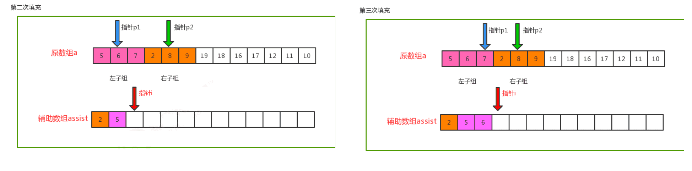

‍

‍

‍

### Header

科班个人记录

> 课堂期末整理后留下的遗产, 原理和个人主要开发方向接触面较窄, 因此内容较少

‍

‍

## 操作模板

### 递归模板

‍

1 结束器

2 过程:把大问题化为子问题

3 进入子问题, 标记状态

4 状态变化, 去掉标记

```java
public void recur(int level, int param) {

    // terminator
    if (level > MAX_LEVEL){ 
        // process result
        return;
    }

    //process current logic
    process(level, param);

    //drill down
    recur(level: level + 1, newParam);

    // restore current status
}
```

‍

‍

### 分治模板

‍

分治法通常采用递归算法设计技术，在每一层递归上都有3个步骤：

1. 分解：将原问题分解为若干个规模较小，相互独立，与原问题形式相同的子问题.
2. 求解子问题：若子问题规模较小而容易被解决则直接求解，否则递归地求解各个子问题.
3. 合并：将各个子问题的解合并为原问题的解.

‍

分治法算法设计框架

```c++
divide_and_conquer(P){

   if (|P| <= n0)
      return adhoc(P); // 解决小规模的问题

   divide P into smaller subinstances P1, P2, ... Pk; // 将P分解为较小的子问题

   for (i = 1; i <= k; i++)
      yi = divide_and_conquer(Pi); // 递归解决各子问题

   return merge(y1, y2, ..., yk); // 将子问题的解合并为原问题的解
}
```

‍

适用对象

（1）缩小规模可以解决

（2）具有最优子结构性质

（3）子问题解可以合并

（4）子问题相互独立

‍

‍

‍

‍

### 动归模板

‍

#### 要素

1. 最优子结构
2. 无后效性
3. 有重叠子问题

‍

‍

#### 大体方针

1. 分析最优解的性质，并刻画其结构特征.
2. 递归的定义最优值.
3. 以自底向上或自顶向下的记忆化方式计算出最优值.
4. 根据计算最优值时得到的信息，构造问题的最优解.

‍

‍

#### DP顺推模板

```python
function DP():
    dp = [][]    #二维情况

for i= 0 ..M{
    for j = 0 ..N{
        dp[i]i] =_Function(dp[i']U']..)
    }
}
return dp[M][N];
```

‍

‍

### 回溯模板

‍

#### 三要素

* 解空间
* 约束条件
* 状态树

‍

#### 大体方针

‍

1. 针对所给问题，定义问题的解空间, 确定解空间树类型（子集树or排列树），问题的解空间树应至少包含问题的一个（最优）解.
2. 确定结点的扩展规则
3. 以深度优先方式搜索解空间，并在搜索过程中用剪枝函数避免无效搜索.

‍

‍

#### 回溯流程

‍

1. 确定解空间的组织结构后（子集树or排列树），回溯法就从开始结点(根结点)出发，以深度优先搜索的方式搜索整个解空间.
2. 这个开始结点就成为一个活结点，同时也成为当前的扩展结点.
3. 在当前的扩展结点处，搜索向纵深方向移至一个新结点. 这个新结点就成为一个新的活结点，并成为当前扩展结点.
4. 如果在当前的扩展结点处不能再向纵深方向移动，则当前的扩展结点就成为死结点.
5. 此时，应往回移动(回溯)至最近的一个活结点处，并使这个活结点成为当前的扩展结点.
6. 回溯法即以这种工作方式递归地在解空间中搜索，直至找到所要求的解或解空间中已无活结点时为止.

‍

‍

##### 递归回溯

‍

采用递归的方法对解空间树进行深度优先遍历来实现回溯

‍

* 解空间为子集树

  ```c++
  int x[n];             // x存放解向量，全局变量
  void backtrack(int i) //求解子集树的递归框架
  {
     if (i > n) //搜索到叶子结点,输出一个可行解
        输出结果;
     else
     {
        for (j = 下界; j <= 上界; j++) //用j枚举i所有可能的路径
        {
           x[i] = j; //产生一个可能的解分量
           ...       //其他操作
           if (constraint(i) && bound(i))
              backtrack(i + 1); //满足约束条件和限界函数,继续下一层
        }
     }
  }
  ```
* 解空间为排列树

  ```c++
  int x[n];             // x存放解向量，并初始化
  void backtrack(int i) //求解排列树的递归框架
  {
     if (i > n) //搜索到叶子结点,输出一个可行解
        输出结果;
     else
     {
        for (j = i; j <= n; j++) //用j枚举i所有可能的路径
        {
           ...                     //第i层的结点选择x[j]的操作
           swap(x[i], x[j]); //为保证排列中每个元素不同,通过交换来实现
           if (constraint(i) && bound(i))
              backtrack(i + 1); //满足约束条件和限界函数，进入下一层
           swap(x[i], x[j]);     //回溯（退层）恢复状态
           ...                     //第i层的结点选择x[j]的恢复操作
        }
     }
  }
  ```

‍

‍

##### 迭代回溯

采用非递归迭代过程对解空间树进行深度优先遍历来实现回溯

```c++
int x[n]; // x存放解向量，全局变量
void backtrack(int n)
{ //非递归框架
   int i = 1; //根结点层次为1
   while (i >= 1)
   { //尚未回溯到头
      if (ExistSubNode(t))
      { //当前结点存在子结点
         for (j = 下界; j <= 上界; j++)
         { //对于子集树，j=0到1循环
            x[i] 取一个可能的值;
            if (constraint(i) && bound(i))
            { // x[i]满足约束条件或界限函数
               if (x是一个可行解)
                  输出x;
               else
                  i++; //进入下一层次搜索
            }
         }
      }
      else
         i--; //回溯：不存在子结点，返回上一层
   }
}
```

‍

‍

‍

### 分限模板

‍

分支限界算法 = 广度优先搜索 + 剪枝策略

‍

‍

‍

简单来看

1. 定义问题的解空间
2. 确定问题的解空间组织结构（树或图）
3. 搜索解空间. 搜索前要定义判断标准（约束函数或限界函数），如果选用优先队列式分支限界法，则必须确定优先级.

‍

#### 关键问题

‍

1. 确定合适的限界函数
2. 组织待处理结点表
3. 确定最优解中的各个分量

‍

#### 流程

‍

##### 设计限界函数

‍

    在搜索解空间树时，每个活结点可能有很多孩子结点，其中有些孩子结点搜索下去不可能产生解. 可以设计好的限界函数在扩展时删除这些不必要的孩子结点，从而提高搜索效率.

‍

##### 组织活结点表

‍

（根据选择下一个扩展结点的方式来组织活结点表，不同的活结点表对应不同分枝搜索方式）

‍

* ==队列式==分枝限界法

  （将活结点表组织成一个队列，并按照**队列先进先出（FIFO）原则**选取扩展结点）

  1. 将根结点加入活结点队列.
  2. 从活结点队中取出队头结点，作为当前扩展结点.
  3. 对当前扩展结点，先从左到右地产生它的所有孩子结点，用约束条件检查，把所有满足约束条件的孩子结点加入活结点队列.
  4. 重复步骤2和3，直到找到一个解或活结点队列为空为止.
* ==优先队列式==分枝限界法

  （将活结点表组组成一个优先队列，并选取**优先级最高的活结点**成为当前扩展结点）

  1. 计算起始结点（根结点）的优先级并加入优先队列
  2. 从优先队列中取出优先级最高的结点作为当前扩展结点（成为队头），使搜索朝着解空间树上可能有最优解的分枝推进，以便尽快地找出一个最优解.
  3. 对当前扩展结点，先从左到右地产生它的所有孩子结点，然后用约束条件检查，对所有满足约束条件的孩子结点计算优先级并加入优先队列.
  4. 重复步骤2和3，直到找到一个解或优先队列为空为止.

‍

‍

##### 确定最优解的解向量

‍

类似数据结构的最短路径问题, 用Path数组存储路径就可以了

1. 每个扩展结点保存从根结点到该结点的**路径**

    每个结点带有一个可能的解向量. 比较浪费空间，但实现起来简单
2. 搜索过程中构建搜索经过的**树结构**

    每个结点通过双亲指针找到对应的最优解向量. 这种做法需保存搜索经过的**树结构**，每个结点增加一个指向双亲结点的指针.

‍

‍

> 优先队列：  
> 优先队列是利用堆来实现的，堆可以看作一棵完全二叉树的顺序存储结构. 在这棵完全二叉树中，如果每一个节点的值都大于等于左右孩子的值，则称之为最大堆. 如果每一个节点的值都小于等于左右孩子的值，则称之为最小堆.  
> 两个基本操作：
>
> * 出队：堆顶出队，最后一个记录代替堆顶的位置，自顶向下重新调整为堆.
>
>   * 出队后，除了堆顶之外，其他节点都满足最大堆的定义，只需要将堆顶执行“下沉”操作，即可调整为堆.
>
>     * “下沉”：堆顶与左右孩子比较，如果比孩子大，则已满足堆；如果比孩子小，则与较大的孩子交换，交换到新的位置后，继续向下比较，从根节点一直比较到叶子.
> * 入队：新记录放入最后一个记录之后，自底向上重新调整为堆.
>
>   * 入队后除了新入队记录之外，其他节点都满足最大堆的定义，只需要将新记录执行“上浮”操作，即可调整为堆.
>
>     * “上浮”：新记录与其双亲比较，如果小于等于双亲，则已满足堆；如果比双亲大，则与双亲交换，交换到新的位置后，继续向上比较，从叶子一直比较到根.

‍

‍

## 查找大合集

‍

‍

### 基本概念

‍

* 关键字：数据元素的某个数据项的值，用它可以标识列表中的一个或一组数据元素. 如果一个关键字可以唯一标识列表中的一个数据元素，则称其为主关键字，否则为次关键字. 当数据元素仅有一个数据项时，数据元素的值就是关键字.
* 查找：根据给定的关键字值，在特定的列表中确定一个其关键字与给定值相同的数据元素，并返回该数据元素在列表中的位置.
* 静态查找，在查找过程中只是对数据元素进行查找
* 动态查找，在实施查找的同时插入未找到的元素，或从查找表中删除已查到的某个元素
* 涉及参量：查找对象、查找范围、查找结果
* 基本方法：

  * 比较式查找法{基于线性表的查找法{顺序查找法、折半查找法、分块查找法}、基于树的查找法}
  * 计算式查找法（哈希法）

‍

‍

#### **分类**

　　1）静态查找和动态查找；

　　　　注：静态或者动态都是针对查找表而言的. 动态表指查找表中有删除和插入操作的表.

　　2）无序查找和有序查找.

　　　　无序查找：被查找数列有序无序均可；

　　　　有序查找：被查找数列必须为有序数列.

‍

‍

#### **平均查找长度**

 **（Average Search Length，ASL）**

需和指定key进行比较的关键字的个数的期望值，称为查找算法在查找成功时的平均查找长度.

```
　　对于含有n个数据元素的查找表，查找成功的平均查找长度为：ASL = Pi*Ci的和.
　　Pi：查找表中第i个数据元素的概率.
　　Ci：找到第i个数据元素时已经比较过的次数.
```

‍

‍

### 顺序

(线性表查找法)

‍

**算法思路**：

对于任意一个序列，从一端开始，顺序扫描，依次将扫描到的结点关键字与给定值k相比较，若相等则表示查找成功；若扫描结束仍没有找到关键字等于k的结点，表示查找失败.

‍

```cpp
#define LIST_SIZE 20
typedef struct{
   KeyType key;
   OtherType other_data;
} RecordType;
typedef struct {
   RecordType r[LIST_SIZE + 1]; // r[0]为工作单元
   int length;
} RecordList;
```

‍

设置监视哨的顺序查找法

```cpp
int SeqSearch(RecordList l, KeyType k){
   l.r[0] = k; i = l.length;
   while(l.r[i].key != k) i--;
   return i;
}
```

```python
def SeqSearch(arr, key): # 设置一个哨兵
    arr.append(key) # 将key值放在最后一位
    i = 0
  
    while arr[i] != key: 
        i += 1
  
    return i if i < len(arr) - 1 else -1
```

‍

不设置监视哨的顺序查找法

```cpp
int SeqSearch(RecordList l, KeyType k){
   i = l.length;
   while(i >= 1 && l.r[i] != k) i--;
   // i >= 1 防止越界
   return i >= 1 ? i : 0;
}
```

‍

‍

### **二分**

 **（折半查找）**

‍

**算法思路**：

1. 确定查找范围low=0，high=N-1，计算中项mid=（low+high）/2.
2. 若mid==x或low>=high,则结束查找；否则，向下继续.
3. 若amid<x,说明待查找的元素值只可能在比中项元素大的范围内，则把mid+1的值赋给low，并重新计算mid，转去执行步骤2；若mid>x，说明待查找的元素值只可能在比中项元素小的范围内，则把mid-1的值赋给higt，并重新计算mid，转去执行步骤2.

‍

**说明**：

* 查找元素**必须是有序的**，如果是无序的则要先进行排序操作.
* 在做查找的过程中，如果 low 指针和 high 指针的中间位置在计算时位于两个关键字中间，即求得 mid 的位置不是整数，需要统一做取整操作.

> 折半查找的前提条件是需要有序表顺序存储，对于静态查找表，一次排序后不再变化，折半查找能得到不错的效率. 但对于需要频繁执行插入或删除操作的数据集来说，维护有序的排序会带来不小的工作量，那就不建议使用.  
> ——《大话数据结构》

‍

```python
def binary_search(arr, key):
    low = 0
    high = len(arr) - 1

    while low <= high:
        mid = (low + high) // 2
  
        if arr[mid] == key:
            return mid
  
        elif arr[mid] > key:
            high = mid - 1
  
        else:
            low = mid + 1
  
    return -1
```

‍

‍

### **插值**

‍

    基于二分查找算法(改进版)，将查找点的选择改进为自适应选择，可以提高查找效率. 也属于有序查找

    唯一的区别在于，每次与目标元素做比较的元素并非搜索区域内的中间元素

‍

**算法思路**：

1. 确定查找范围low=0，high=N-1，计算中项 `mid=low+(key-a[low])/(a[high]-a[low])*(high-low)`​
2. 若mid==x或low>=high,则结束查找；否则，向下继续.
3. 若amid<x,说明待查找的元素值只可能在比中项元素大的范围内，则把mid+1的值赋给low，并重新计算mid，转去执行步骤2；若mid>x，说明待查找的元素值只可能在比中项元素小的范围内，则把mid-1的值赋给higt，并重新计算mid，转去执行步骤2.

‍

**说明**：

* 插值查找是基于折半查找进行了优化的查找方法.
* 当表长较大，而关键字<u>分布又比较均匀</u>的查找表来说，插值查找算法的平均性能要比折半查找要好得多.

‍

```python
def interpolation_search(arr, key):
    low = 0
    high = len(arr) - 1
  
    while low <= high and arr[low] <= key <= arr[high]:
  
        if low == high:
            if arr[low] == key: # 如果只有一个元素，且该元素等于key
                return low
            return -1
  
        # 计算position
        pos = low + ((high - low) // (arr[high] - arr[low])) * (key - arr[low])
  
        if arr[pos] == key:
            return pos
  
        if arr[pos] < key:
            low = pos + 1
  
        else:
            high = pos - 1
  
    return -1

```

‍

‍

### **斐波那契**

‍

　在介绍斐波那契查找算法之前，我们先介绍一下很它紧密相连并且大家都熟知的一个概念——黄金分割.

　　黄金比例又称黄金分割，是指事物各部分间一定的数学比例关系，即将整体一分为二，较大部分与较小部分之比等于整体与较大部分之比，其比值约为1:0.618或1.618:1.

　　0.618被公认为最具有审美意义的比例数字，这个数值的作用不仅仅体现在诸如绘画、雕塑、音乐、建筑等艺术领域，而且在管理、工程设计等方面也有着不可忽视的作用. 因此被称为黄金分割.

　　随着斐波那契数列的递增，前后两个数的比值会越来越接近0.618，利用这个特性，我们就可以将黄金比例运用到查找技术中.

    斐波那契查找与折半查找很相似，他是根据斐波那契序列的特点对有序表进行分割的. 他要求开始表中记录的个数为某个斐波那契数小1，及n=F(k)-1；开始将k值与第F(k-1)位置的记录进行比较(及mid=low+F(k-1)-1).

‍

**算法思路**：

1. 相等，mid位置的元素即为所求
2. 大于，low=mid+1,k-=2;
3. 小于，high=mid-1,k-=1.

‍

**说明**：

low=mid+1说明待查找的元素在[mid+1,high]范围内，k-=2 说明范围[mid+1,high]内的元素个数为n-(F(k-1))= Fk-1-F(k-1)=Fk-F(k-1)-1=F(k-2)-1个，所以可以递归的应用斐波那契查找.

‍

```python
def fibonacci_search(arr, key):
    n = len(arr)
    fibMMm2 = 0
    fibMMm1 = 1
    fibM = fibMMm2 + fibMMm1

    while fibM < n:
        fibMMm2 = fibMMm1
        fibMMm1 = fibM
        fibM = fibMMm2 + fibMMm1

    offset = -1

    while fibM > 1:
        i = min(offset + fibMMm2, n - 1)

        if arr[i] < key:
            fibM = fibMMm1
            fibMMm1 = fibMMm2
            fibMMm2 = fibM - fibMMm1
            offset = i

        elif arr[i] > key:
            fibM = fibMMm2
            fibMMm1 = fibMMm1 - fibMMm2
            fibMMm2 = fibM - fibMMm1

        else:
            return i

    if fibMMm1 and arr[offset + 1] == key:
        return offset + 1

    return -1
```

‍

### **分块**

‍

    又称索引顺序查找，是顺序查找的一种改进方法.

‍

    将n个数据元素"按块有序"划分为m块（m ≤ n）. 每一块中的结点不必有序，但块与块之间必须"按块有序"；构造一个索引表，其中每个索引项对应一个块，记住每块的起始位置以及每块中最大的关键字，索引表按关键字有序排列

‍

**流程**

‍

    先选取各块中的最大关键字构成一个索引表；

    查找分两个部分：先对索引表进行二分查找或顺序查找，以确定待查记录在哪一块中；然后，在已确定的块中用顺序法进行查找.

‍

```python
def block_search(arr, key, block_size):
    for i in range(0, len(arr), block_size):

        if arr[i] == key:
            return i

        elif arr[i] > key:
            # 当arr[i] > key时，从arr[i-block_size]到arr[i]之间进行线性搜索
            for j in range(i - block_size, i):
                if arr[j] == key:
                    return j
    return -1
```

‍

‍

### **哈希**

计算式查找法

‍

    哈希法又称散列法,杂凑法或关键字地址计算法,相应的表称为哈希裁,散列表或杂凑表等. 哈希法的基本思想:首先在元素的关键字k和存储位置p之间建立一个对应关系H,使得p=H(k),H()称为哈希函数. 创建哈希表时,把关键字为k的元素直接存入地址为H(k)的单元,以后当查找关键字为石的元素时,再利用哈希函数p=H(h)计算出该元素的存储位置,从而达到按关键字直接存取元素的目的.

    冲突问题：当关键字集合很大时，关键字值不同的元素可能会映像到哈希表的同一地址上，即k1≠k2，但H(k1)=H(k2)的现象，称k1、k2为同义词

‍

#### 概念

‍

**哈希表**

使用一个下标范围比较大的数组来存储元素. 可以设计一个函数（哈希函数， 也叫做散列函数），使得每个元素的关键字都与一个函数值（即数组下标）相对应，于是用这个数组单元来存储这个元素；也可以简单的理解为，按照关键字为每一个元素"分类"，然后将这个元素存储在相应"类"所对应的地方. 但是，不能够保证每个元素的关键字与函数值是一一对应的，因此极有可能出现对于不同的元素，却计算出了相同的函数值，这样就产生了"冲突"，换句话说，就是把不同的元素分在了相同的"类"之中. 后面我们将看到一种解决"冲突"的简便做法.

"直接定址"与"解决冲突"是哈希表的两大特点.

‍

**哈希函数**

规则：通过某种转换关系，使关键字适度的分散到指定大小的的顺序结构中，越分散，则以后查找的时间复杂度越小，空间复杂度越高.

‍

原则：函数本身便于计算、计算结果分布均匀

1. 数字分析法
2. 平方取中法
3. 分段叠加法
4. 除留余数法
5. 伪随机数法

‍

实际应用需考虑因素：

1. 计算哈希函数所需的时间(简单).
2. 关键字的长度.
3. 哈希表的大小.
4. 关键字分布的情况.
5. 记录查找的频率

‍

#### 处理冲突

1. 开放地址法
2. 再哈希法
3. 链地址法（☆）
4. 建立公共溢出区法

‍

#### **算法思路**

如果所有的键都是整数，那么就可以使用一个简单的无序数组来实现：将键作为索引，值即为其对应的值，这样就可以快速访问任意键的值. 这是对于简单的键的情况，我们将其扩展到可以处理更加复杂的类型的键.

1. 用给定的哈希函数构造哈希表；
2. 根据选择的冲突处理方法(常见方法：拉链法和线性探测法)解决地址冲突；
3. 在哈希表的基础上执行哈希查找；

‍

‍

#### 查找过程

1. 首先计算h0=hash(K).
2. 如果单元h0为空,则所查元素不存在.
3. 如果单元h0中元素的关键字为K,则找到所查元素.
4. 否则重复下述解决冲突的过程：

    1. 按解决冲突的方法,找出下一个哈希地址h;
    2. 如果单元h,为空,则所查元素不存在;
    3. 如果单元h,中元素的关键字为K,则找到所查元素.

‍

哈希表的查找算法（用线性探测再散列处理冲突）

```cpp
#define m <哈希表长度>
#define NULLKEY <代表空记录的关键字值>
typedef int KeyType；/*假设关键字为整型*/
typedef struct {
   KeyType key;
   ... /*记录中其他分量按需求确定*/
} RecordType;
typedef RecordType HashTable[m];
int HashSearch(HashTable ht, KeyType K)
   h0 = hash(K)；
   if(ht[h0].key == NULLKEY) return -1;
   else if(ht[h0].key == K) return h0;
   else {/*用线性探测再散列解决冲突*/
      for (i=1; i<=m-1; i++){
         hi = (h0+i) % m;
         if(ht[hi].key == NULLKEY) return -1;
         else if(hi[hi].key == K) return hi;
      }
   return -1;
   }
}
```

‍

‍

‍

#### 布隆过滤器

‍

(补充内容)

**HashTable + 拉链存储重复元素.**

只是用来检索一个元素到底在不在这个集合里面, 没有Map那样的存储元素功能.

我的理解: 把元素分解为若干位二进制位, 在二进制条里赋值为1, 要检索的时候只要看对应的位子上面是不是全为一即可.

缺点描述:  去布隆里面查, 如果查不到, 肯定没有, 如果查到了 , 可能不在( 实际上是与之相似的另一个元素 )   由于其任务特性, 这个缺点是可以允许的. 因为拿来当缓存使用, 如果查到了就会进一步访问内存查找相关东西.

‍

‍

### 树表

‍

二叉查找树平均查找性能不错，为O(logn)，但是最坏情况会退化为O(n). 在二叉查找树的基础上进行优化，我们可以使用平衡查找树. 平衡查找树中的2-3查找树，这种数据结构在插入之后能够进行自平衡操作，从而保证了树的高度在一定的范围内进而能够保证最坏情况下的时间复杂度. 但是2-3查找树实现起来比较困难，红黑树是2-3树的一种简单高效的实现，他巧妙地使用颜色标记来替代2-3树中比较难处理的3-node节点问题. 红黑树是一种比较高效的平衡查找树，应用非常广泛，很多编程语言的内部实现都或多或少的采用了红黑树.

除此之外，2-3查找树的另一个扩展——B/B+平衡树，在文件系统和数据库系统中有着广泛的应用.

‍

‍

#### **二叉排序树**

‍

**最简单的树表查找算法——二叉树查找算法**

**基本思想：** 二叉查找树是先对待查找的数据进行生成树，确保树的左分支的值小于右分支的值，然后在就行和每个节点的父节点比较大小，查找最适合的范围.  这个算法的查找效率很高，但是如果使用这种查找方法要首先创建树.

‍

##### 定义

‍

**二叉查找树**（ BinarySearch Tree，也叫二叉搜索树，或称二叉排序树 Binary Sort Tree）或者是一棵空树，或者是具有下列性质的二叉树：

‍

1）若任意节点的左子树不空，则左子树上所有结点的值均小于它的根结点的值；

2）若任意节点的右子树不空，则右子树上所有结点的值均大于它的根结点的值；

3）任意节点的左、右子树也分别为二叉查找树.

‍

1. 二叉排序树或者是一棵空树，或者是具有如下性质的二叉树.
2. 若它的左子树非空，则左子树上所有节点的值均小于根节点的值.
3. 若他的右子树非空，则右子树上所有结点的值均大于等于根节点的值.
4. 它的左右子树也分别为二叉排序树.

```cpp
typedef struct node{
   KeyType key; // 关键字的值
   struct node *lchild, *rchild;
} BSTNode, BSTree;
```

‍

‍

##### **性质**

二叉排序树的特性：中序遍历二叉排序树可以得到一个升序有序序列，反之逆中序遍历可以得到一个降序有序序列.

二叉查找树是先对待查找的数据进行生成树，确保树的左分支的值小于右分支的值，然后在就行和每个节点的父节点比较大小，查找最适合的范围. 这个算法的查找效率很高，但是如果使用这种查找方法要首先创建树.

‍

‍

##### **算法思路**

‍

1. 若b是空树，则搜索失败：
2. 若x等于b的根节点的数据域之值，则查找成功：
3. 若x小于b的根节点的数据域之值，则搜索左子树：
4. 查找右子树.

‍

##### 实现

‍

**插入**

```cpp
void InsertBST(BSTree *bst, KeyType key){
   BiTree s;
   if(*bst == NULL){
      s = (BSTree)malloc(sizeof(BSTNode));
      s->key = key;
      s->lchild = s->rchild = NULL;
      *bst = s;
   }else if(k < (*bst)->key)
      InsertBST(&((*bst)->lchild), key);
   else if(k > (*bst)->key)
      InsertBST(&((*bst)->rchild), key);
}
```

‍

**创建**

```cpp
void CreateBST(BSTree *bst){
   KeyType key;
   *bst = NULL；
   scanf("%d", &key);
   while(key != ENDKEY){
      InsertBST(bst, key);
      scanf("%d", &key);
   }
}//具有相同元素的序列，输入顺序不同，则所创建的二叉排序树的形态不同
```

‍

‍

**查找**

1. 递归

    ```cpp
    BSTree SearchBST(BSTree bst, KeyType key){
       if(!bst) return NULL;
       else if(bst->key == key) return bst;
       else if(bst->key > key) return SearchBST(bst->lchild, key);
       else return SearchBST(bst->rchild, key);
    }
    ```
2. 非递归

    ```cpp
    BSTree SearchBST(BSTree bst, KeyType key){
       BSTree q = bst;
       while(q){
          if(q->key == key) return q;
          else if(q->key > key) q = q->lchild;
          else q = q->rchild;
       }
       return NULL;
    }
    ```

‍

‍

**删除**

1. 若p为叶子节点，则可直接将其删除f->lchild=NULL;free(p);
2. 若p节点只有左子树，或只有右子树，则可将p的左子树或右子树直接改为其双亲结点f的左子树f->lchild=p->lchild(f->lchild=p->rchild);free(p);
3. 若p节点既有左子树又有右子树

    1. 法一：首先找到p结点在中序序列中的直接前驱s结点，然后将p的左子树改为f的左子树，而将p的右子树改为s的右子树: f->lchild=p->lchild;s->rchild=p->rchild;tree(p);
    2. 法二：首先找到p结点在中序序列中的直接前驱s结点，然后用s结点的值替代p结点的值，再将s结点删除，原s结点的左子树改为s的双亲结点q的右子树:p->data=s->data;q->rchild=s->lchild;free(s);  
        【A8.8 在二叉排序树中删除节点】

‍

```cpp
BSTNode* DelBST(BiTree t, KeyType key){
   BSTNode *p = t, *f = NULL, *s, *q;
   while(p){
      if(p->key == key) break; // 找到待删除的节点p，跳出循环
      f = p;
      p = (p->key > k) ? p->lchild : p->rchild;
   }
   if(p == NULL) return t; // 找不到，返回原来的二叉树
   if(p->lchild == NULL){ // p无左子树
      if(f == NULL) t = p->rchild; // p是原二叉排序树的根
      else if(f->lchild == p) f->lchild=p->rchild; // p是f的左孩子，将p的右子树链到f的左链上
      else f->rchild=p->rchild; // p是f的右孩子，将p的右子树链到f的右链上
      free(p);
   }else{ // p有左子树
      q = p; s = p->lchild;
      while(s->rchild){ // 在p的左子树中查找最右下节点
         q = s; s = s->rchild;
      }
      if(q==p) q->lchild = s->lchild; //将s的左子树链到q上
      else q->rchild = s->lchild;
      p->key = s->key; //
      free(s);
   }
   return t;
}
```

‍

‍

#### 平衡二叉排序树

‍

用于解决二叉排序树中高度不确定的情况，导致搜索效率下降

‍

* 左子树与右子树的高度之差的绝对值小于等于一
* 左子树与右子树也是平衡二叉排序树
* 平衡因子：节点的左子树深度与右子树深度之差

‍

一般情况下,只有新插入结点的祖先结点的平衡因子受影响,即以这些祖先结点为根的子树有可能失衡. 下层的祖先结点恢复平衡,将使上层的祖先结点恢复平衡,因此应调整最下面的失衡子树. 因为平衡因子为0的祖先不可能失衡,所以从新插入结点开始,向上遇到的第一个平衡因子不等于0的祖先结点为第一个可能失衡的结点,如果失衡,则应调整以该结点为根的子树. 失衡的情况不同,调整的方法也不同.失衡类型及相应的调整方法可归纳为 LL 型、LR 型、RR 型和 RL 型4种.

‍

‍

##### 操作

BF：为了方便，给树的每一个节点附加一个数字，给出该节点左子树和右子树的高度差，称为节点的平衡因子（BF）

BF=节点左子树高度-节点右子树高度

‍

‍

**插入**

基本的插入方式与二叉排序树相同，但是每次插入之后要更新节点和其祖先节点的高度和BF，如果发现BF失衡，就要进行节点旋转

‍

‍

**旋转**

四种失衡（LL，LR，RR，RL）

    LL：节点BF2，左子节点BF1，则对节点进行右旋  
    RR：节点BF-2，右子节点BF-1，则对节点进行左旋  
    LR：节点BF2，左子节点BF-1，则对节点进行左旋，再右旋  
    RL：节点BF-2，右子节点BF1，则对节点进行右旋，再左旋  
    左旋：将子树根的右子节点的左指针指向根节点，根节点的右指针指向其右子节点的左子树，右子节点作为根  
    右旋...

‍

‍

**删除**

删除方式与二叉排序树相同，然后看删除的方式计算父和祖先节点（递归可以很方便的达到效果）的BF，如果失衡，则可以等价于插入节点的方式进行旋转. 不过这里有一个特殊情况，就是当删除的节点左右子树都存在时，在做右子树最小值或者左子树最大值替换的时候，遍历到这个最小值（最大值）的过程中，经历过的节点在最后都需要进行一次平衡计算

‍

‍

#### **2-3树**

‍

每个节点保存1个或者两个的值. 对于普通的2节点(2-node)，他保存1个key和左右两个自己点. 对应3节点(3-node)，保存两个Key，2-3查找树的定义如下：

1. 要么为空，要么：
2. 对于2节点，该节点保存一个key及对应value，以及两个指向左右节点的节点，左节点也是一个2-3节点，所有的值都比key要小，右节点也是一个2-3节点，所有的值比key要大.
3. 对于3节点，该节点保存两个key及对应value，以及三个指向左中右的节点. 左节点也是一个2-3节点，所有的值均比两个key中的最小的key还要小；中间节点也是一个2-3节点，中间节点的key值在两个跟节点key值之间；右节点也是一个2-3节点，节点的所有key值比两个key中的最大的key还要大.

‍

**性质**

‍

1）如果中序遍历2-3查找树，就可以得到排好序的序列；

2）在一个完全平衡的2-3查找树中，根节点到每一个为空节点的距离都相同. （这也是平衡树中“平衡”一词的概念，根节点到叶节点的最长距离对应于查找算法的最坏情况，而平衡树中根节点到叶节点的距离都一样，最坏情况也具有对数复杂度. ）

‍

**算法思路**

‍

要判断一个键是否在树中，我们先将它和根结点中的键比较. 如果它和其中的任何一个相等，查找命中. 否则我们就根据比较的结果找到指向相应区间的链接，并在其指向的子树中递归地继续查找. 如果这是个空链接，查找未命中.

‍

‍

#### **红黑树**

‍

2-3查找树能保证在插入元素之后能保持树的平衡状态，最坏情况下即所有的子节点都是2-node，树的高度为lgn，从而保证了最坏情况下的时间复杂度. 但是2-3树实现起来比较复杂，于是就有了一种简单实现2-3树的数据结构，即红黑树（Red-Black Tree）

一种近似平衡的二叉搜索树（Binary Search Tree)，它能够确保任何一个结点的左右子树的高度差小于两倍

理解红黑树一句话就够了：**红黑树就是用红链接表示3-结点的2-3树**

‍

##### 定义

1. 节点颜色有红和黑
2. 根节点必为黑色（如果是2节点，则直接是黑色，如果是3,4节点可以用黑色节点表示其中一个元素作为根）
3. 所有叶子节点（NIL）都为黑色（因为叶子结点没有子节点，都为2节点，所以为黑色）
4. 任意节点到每一个叶子结点经过的黑色节点数目相同（因为红色节点都是伴随黑色节点的，有一个红色节点就一定对应一个黑色节点，所以节点到叶子节点的路径上黑色节点数目相同，也就是说只有黑色节点+红色节点表示一个2,3,4节点，所以实际上只有黑色节点才会实际贡献高度）
5. 不会有连续的红色节点 --每个红色结点的两个子结点一定都是黑色.

‍

每个结点要么是红色，要么是黑色: 根结点是黑色, 每个叶结点(NIL结点，空结点)是黑色的,不能有相邻接的两个红色结点, 从任一结点到其每个叶子的所有路径都包含相同数目的黑色结点. 

‍

**算法思路**

‍

红黑树的思想就是对2-3查找树进行编码，尤其是对2-3查找树中的3-nodes节点添加额外的信息.

红黑树中将节点之间的链接分为两种不同类型:

红色链接: 他用来链接两个2-nodes节点来表示一个3-nodes节点

黑色链接: 链接普通的2-3节点. 特别的，使用红色链接的两个2-nodes来表示一个3-nodes节点，并且向左倾斜，即一个2-node是另一个2-node的左子节点. 这种做法的好处是查找的时候不用做任何修改，**和普通的二叉查找树相同**.

‍

‍

##### 理解

‍

2-3-4树是阶数为4的B树，而红黑树是对2-3-4树的一种实现，由于直接对节点进行2,3,4的转换会有大开销，所以红黑树以二叉树为基础，在二叉树中加入颜色属性来表示不同的2,3,4节点，其中2节点对应红黑树中的黑色节点，而红色节点+黑色节点表示3，4节点

在左倾红黑树中将红色节点顺时针旋转45°使其与黑父平行，可以发现是一个2-3树，其主要重点还是在插入和删除的过程中，对节点进行2,3,4树转换和分裂...

‍

**为什么使用红黑树**

* 红黑树是一种平衡树，他复杂的定义和规则都是为了保证树的平衡性. 如果树不保证他的平衡性就是下图：很显然这就变成一个链表了.
* 保证平衡性的最大的目的就是降低树的高度，因为树的查找性能取决于树的高度. 所以树的高度越低搜索的效率越高！
* 这也是为什么存在二叉树、搜索二叉树等，各类树的目的.

‍

‍

##### 操作

‍

**插入**

和平衡二叉树的插入过程一致，但是要遵循红黑树的五项原则，一般插入节点都标明为红色（因为插入后的红黑树一定不会破坏规则5），但是会违背规则2或4（但是修正的情况会比着色为黑色的情况少），所以需要修正其父节点，叔叔节点和祖父节点（往上类推）的颜色

‍

‍

‍

#### **B树**

（平衡多路排序树）

‍

产生原因

平衡二叉树对于数据存在磁盘的数据，去查找的过程中每一次都要进行一次IO操作，而对比于比较操作来说，IO操作时非常耗费时间的，所以对于数据库这样的系统来说如果内部储存使用平衡二叉树则每次查找会非常耗费时间，所以为了减小IO操作，将每个节点能够储存的数据数目增加，将整个树的高度压缩，从而减小IO操作（一个节点的存储空间可以等于磁盘中一个页的容量，如果超过了一个页则比较的过程中可能还需要再进行一次IO操作）

‍

B树（B-tree）是一种树状数据结构，它能够存储数据、对其进行排序并允许以O(log n)的时间复杂度运行进行查找、顺序读取、插入和删除的数据结构. B树，概括来说是一个节点可以拥有多于2个子节点的二叉查找树. 与自平衡二叉查找树不同，B-树为系统最优化大块数据的读和写操作. B-tree算法减少定位记录时所经历的中间过程，从而加快存取速度. 普遍运用在数据库和文件系统.

‍

‍

##### 定义

‍

B树可以看作是对2-3查找树的一种扩展，即他允许每个节点有M-1个子节点

‍

* 定义任意非叶子结点最多只有M个儿子；且M>2；
* 根结点的儿子数为[2, M]；
* 除根结点以外的非叶子结点的儿子数为[M/2, M]；
* 每个结点存放至少M/2-1（取上整）和至多M-1个关键字；（至少2个关键字）
* 非叶子结点的关键字：K[1], K[2], …, K[M-1]；且K[i] < K[i+1]；
* 非叶子结点的指针：P[1], P[2], …, P[M]；其中P[1]指向关键字小于K[1]的 子树，P[M]指向关键字大于K[M-1]的子树，其它P[i]指向关键字属于(K[i-1], K[i])的子树；
* 所有叶子结点位于同一层；

‍

‍

**算法思路**

从根结点开始，对结点内的关键字（有序）序列进行二分查找，如果命中则结束，否则进入查询关键字所属范围的儿子结点；重复，直到所对应的儿子指针为空，或已经是叶子结点；

* 关键字集合分布在整颗树中；
* 任何一个关键字出现且只出现在一个结点中；
* 搜索有可能在非叶子结点结束；
* 其搜索性能等价于在关键字全集内做一次二分查找；
* 自动层次控制；

‍

‍

##### 性质

一个m阶B树，每个节点可以存放m-1个数据，可以包含m个指针，且除根节点外所有非终端节点至少有m/2棵子树，且所有叶子节点都在同一层上

插入和删除的过程中也会遵循叶子节点的要求的特点

‍

1. 一棵B树是一颗平衡的m路查找树
2. 树中每个节点最多有m棵子树
3. 根节点至少有两棵子树
4. 除根节点之外的所有非叶子节点至少有\[m/2\]棵子树
5. 所有的叶子节点出现在同一层上，并且不含信息，通常称为失败节点. 失败节点为虚节点，在B树中并不存在，指向他们的指针为空指针，引入失败节点是为了便于分析B树的查找性能

‍

‍

#### **B+树**

平衡多路增强排序树

B+树是B树的变体，也是一种多路搜索树

‍

‍

##### 定义

其定义基本与B-树同，除了：

* 非叶子结点的子树指针与关键字个数相同；
* 非叶子结点的子树指针P[i]，指向关键字值属于[K[i], K[i+1])的子树, B树是开区间
* 为所有叶子结点增加一个链指针;
* 所有关键字都在叶子结点出现；

‍

‍

**算法思路**

B+的搜索与B树也基本相同，区别是B+树只有达到叶子结点才命中（B树可以在 非叶子结点命中），其性能也等价于在关键字全集做一次二分查找；

* 所有关键字**都出现在叶子结点的链表中**（稠密索引），且链表中的关键字恰好是有序的；
* 不可能在非叶子结点命中；
* 非叶子结点相当于是叶子结点的索引（稀疏索引），叶子结点相当于是存储（关键字）数据的数据层；
* 更适合文件索引系统；

‍

‍

##### 对比

B和B+树的区别在于，B+树的非叶子结点只包含导航信息，不包含实际的值，所有的叶子结点和相连的节点使用链表相连，便于区间查找和遍历.

‍

B+ 树的优点在于：

* 由于B+树在内部节点上不包含数据信息，因此在内存页中能够存放更多的key.  数据存放的更加紧密，具有更好的空间局部性. 因此访问叶子几点上关联的数据也具有更好的缓存命中率.
* B+树的叶子结点都是相链的，因此对整棵树的便利只需要一次线性遍历叶子结点即可. 而且由于数据顺序排列并且相连，所以便于区间查找和搜索. 而B树则需要进行每一层的递归遍历. 相邻的元素可能在内存中不相邻，所以缓存命中性没有B+树好.

**但是B树也有优点，其优点在于，由于B树的每一个节点都包含key和value，因此经常访问的元素可能离根节点更近，因此访问也更迅速.**

‍

‍

#### B*树

‍

相比于B+树，为非叶子结点也增加了链表指针（在节点分裂转移数据的过程中提供了便利）  
定义了非叶子节点关键字个数至少为2/3，即块最低使用率为2/3，相比于B+树提高了利用率

‍

‍

‍

## 排序大合集

(这里可被归类为内部排序, 外部排序为磁盘外存的内容了, 不叙述)

‍

‍

### 基本概念

得到一个按关键字有序的记录序列

‍

‍

内部排序与外部排序

1. 内部排序：整个排序过程完全在内存中进行
2. 外部排序：由于待排序记录数据量太大，内存无法容纳全部数据，排序需要借助外部存储设备才能完成

‍

主关键字与次关键字

1. 主关键字：
2. 次关键字：

‍

排序方法的稳定性

1. 稳定：排序前的序列中R<sub>i</sub>领先于R<sub>j</sub>（即`i<j`​），经过排序后得到的序列中R<sub>i</sub>仍领先于R<sub>j</sub>
2. 不稳定：相同关键字的领先顺序在排序过程中发生变化
3. 证明一种排序方法是稳定的,要通过算法本身的步骤加以证明. 证明排序方法是不稳定的，只需给出一个反例说明即可.

‍

排序的两种基本操作

1. 比较两个关键字的大小
2. 将记录从一个位置移动到另一个位置

‍

待排序序列常见的存储表示

1. 向量结构
2. 链表结构
3. 记录向量与地址向量结合

‍

‍

十种常见排序算法可以分为两大类：

* **比较类排序**：通过比较来决定元素间的相对次序，由于其时间复杂度不能突破O(nlogn)，因此也称为非线性时间比较类排序.
* **非比较类排序**：不通过比较来决定元素间的相对次序，它可以突破基于比较排序的时间下界，以线性时间运行，因此也称为线性时间非比较类排序.

‍

‍

**相关概念**

* **稳定**：如果a原本在b前面，而a=b，排序之后a仍然在b的前面.
* **不稳定**：如果a原本在b的前面，而a=b，排序之后 a 可能会出现在 b 的后面.
* **时间复杂度**：对排序数据的总的操作次数. 反映当n变化时，操作次数呈现什么规律.
* **空间复杂度：** 是指算法在计算机内执行时所需存储空间的度量，它也是数据规模n的函数.

‍

‍

### 冒泡

（Bubble Sort）

‍

重复地走访过要排序的数列，一次比较两个元素，如果它们的顺序错误就把它们交换过来. 走访数列的工作是重复地进行直到没有再需要交换，也就是说该数列已经排序完成. 这个算法的名字由来是因为越小的元素会经由交换慢慢“浮”到数列的顶端

‍

‍

#### 算法描述

* 比较相邻的元素. 如果第一个比第二个大，就交换它们两个；
* 对每一对相邻元素作同样的工作，从开始第一对到结尾的最后一对，这样在最后的元素应该会是最大的数；
* 针对所有的元素重复以上的步骤，除了最后一个；
* 重复步骤1~3，直到排序完成.

‍

```python
def bubble_sort(self, arr):
    n = len(arr)
    for i in range(n):
        for j in range(0, n - i - 1):
            if arr[j] > arr[j + 1]:
                arr[j], arr[j + 1] = arr[j + 1], arr[j]
```

‍

‍

### 选择

（Selection Sort）

‍

一种简单直观的排序算法. 它的工作原理：首先在未排序序列中找到最小（大）元素，存放到排序序列的起始位置，然后，再从剩余未排序元素中继续寻找最小（大）元素，然后放到已排序序列的末尾. 以此类推，直到所有元素均排序完毕.

‍

#### 算法描述

‍

n个记录的直接选择排序可经过n-1趟直接选择排序得到有序结果. 表现最稳定的排序算法之一，因为无论什么数据进去都是O(n<sup>2</sup>)的时间复杂度，所以用到它的时候，数据规模越小越好. 不占用额外的内存空间

* 初始状态：无序区为R[1..n]，有序区为空；
* 第i趟排序(i=1,2,3…n-1)开始时，当前有序区和无序区分别为R[1..i-1]和R(i..n）. 该趟排序从当前无序区中-选出关键字最小的记录 R[k]，将它与无序区的第1个记录R交换，使R[1..i]和R[i+1..n)分别变为记录个数增加1个的新有序区和记录个数减少1个的新无序区；
* n-1趟结束，数组有序化了.

‍

```python
def selection_sort(arr):
    for i in range(len(arr)):
        min_index = i
        for j in range(i + 1, len(arr)):
            if arr[j] < arr[min_index]:
                min_index = j
        arr[i], arr[min_index] = arr[min_index], arr[i]
    return arr
```

‍

‍

### 插入

（Insertion Sort）

‍

一种简单直观的排序算法. 它的工作原理是通过构建有序序列，对于未排序数据，在已排序序列中从后向前扫描，找到相应位置并插入.

在要排序的一组数中，假定前 n-1 个数已经排好序，现在将第 n 个数插到这个有序数列中，使得这 n 个数也是排好顺序的，如此反复循环，直到全部排好顺序

‍

#### 算法描述

一般来说，插入排序都采用in-place在数组上实现. 具体算法描述如下：

* 从第一个元素开始，该元素可以认为已经被排序；
* 取出下一个元素，在已经排序的元素序列中从后向前扫描；
* 如果该元素（已排序）大于新元素，将该元素移到下一位置；
* 重复步骤3，直到找到已排序的元素小于或者等于新元素的位置；
* 将新元素插入到该位置后；
* 重复步骤2~5.

‍

```python
[2   4   3   1   6   5]       【初始状态】

[2] [4   3   1   6   5]
     │
     │
     ↓
[2   4] [3   1   6   5]       【第一次插入】
         │
     ┌───┘
     ↓
[2   3   4] [1   6   5]       【第二次插入】
             │
 ┌───────────┘
 ↓
[1   2   3   4] [6   5]       【第三次插入】
                 │
                 |
                 ↓
[1   2   3   4   6] [5]       【第四次插入】
                     │
                 ┌───┘
                 ↓
[1   2   3   4   5   6]       【第五次插入】
```

```python
def Insertion_Sort(A: list):
    n = len(A)

    for i in range(1, n):
        j = i - 1  # 前一个值
        key = A[i]  # 当前

        while j >= 0 and key < A[j]:
            A[j], A[j + 1] = key, A[j]
            j -= 1
  
    return A
```

```java
public class InsertSort {
    public static void main(String[] args) {
        int[] arr = {55, 22, 2, 5, 1, 3, 8, 5, 7, 4, 3, 99, 88};
        for (int i = 1; i < arr.length; i++) {
            for (int j = i; j > 0; j--) {
                // 比较索引j处的值和索引j-1处的值，
                // 如果索引j-1处的值比索引j处的值大，则交换数据，
                // 如果不大，那么就找到合适的位置了，退出循环即可；
                if (arr[j - 1] > arr[j]) {
                    int temp = arr[j];
                    arr[j] = arr[j - 1];
                    arr[j - 1] = temp;
                }
            }
        }
        System.out.println(Arrays.toString(arr));
    }
}
```

插入排序在实现上，通常采用in-place排序（即只需用到O(1)的额外空间的排序），因而在从后向前扫描过程中，需要反复把已排序元素逐步向后挪位，为最新元素提供插入空间.

‍

插入排序时间复杂度：

* 比较的次数为：`(N-1)+(N-2)+(N-3)+...+2+1=((N-1)+1)*(N-1)/2=N^2/2-N/2`​
* 交换的次数为：`(N-1)+(N-2)+(N-3)+...+2+1=((N-1)+1)(N-1)/2=N^2/2-N/2`​
* 总执行次数为：`(N^2/2-N/2)+(N^2/2-N/2)=N^2-N`​

按照大 O 推导法则，保留函数中的最高阶项那么最终插入排序的时间复杂度为 O(N^2)

‍

‍

### 希尔

（Shell Sort）

也是一种插入排序，也称为缩小增量排序

第一个突破O(n<sup>2</sup>)的排序算法，是简单插入排序的改进版. 它与插入排序的不同之处在于，它会优先比较距离较远的元素

‍

‍

‍

#### 算法描述

先将整个待排序的记录序列分割成为若干子序列分别进行直接插入排序，具体算法描述：

* 选择一个增量序列t1，t2，…，tk，其中ti>tj，tk=1；
* 按增量序列个数k，对序列进行k 趟排序；
* 每趟排序，根据对应的增量ti，将待排序列分割成若干长度为m 的子序列，分别对各子表进行直接插入排序. 仅增量因子为1 时，整个序列作为一个表来处理，表长度即为整个序列的长度.

‍

实现思路

1. 选定一个增长量 h，按照增长量 h 作为数据分组的依据，对数据进行分组
2. 对分好组的每一组数据完成插入排序
3. 减小增长量，最小减为 1，重复第二步操作

```python
 0   1   2   3   4   5   6   7   
[5   7   8   3   1   2   4   6]       【初始状态】

------------------------------------------------------------

[5   7   8   3   1   2   4   6]       【第一次分组 增量为4】
 │   │   │   │   │   │   │   │
[5]  │   │   │  [1]  │   │   │     第1组
    [7]  │   │      [2]  │   │     第2组
        [8]  │          [4]  │     第3组
            [3]             [6]    第4组

[1   2   4   3   5   7   8   6]       【第一次分组插入排序完成后】
 │   │   │   │   │   │   │   │
[1]  │   │   │  [5]  │   │   │     第1组
    [2]  │   │      [7]  │   │     第2组
        [4]  │          [8]  │     第3组
            [3]             [6]    第4组
------------------------------------------------------------

[1   2   4   3   5   7   8   6]       【第二次分组 增量为2】
 │   │   │   │   │   │   │   │
[1]  │  [4]  │  [5]  |  [8]  │     第1组
    [2]     [3]     [7]     [6]    第2组

[1   2   4   3   5   6   8   7]       【第二次分组插入排序完成后】
 │   │   │   │   │   │   │   │
[1]  │  [4]  │  [5]  |  [8]  │     第1组
    [2]     [3]     [6]     [7]    第2组
------------------------------------------------------------

[1   2   4   3   5   6   8   7]       【第三次分组 增量为1】
 │   │   │   │   │   │   │   │
[1] [2] [4] [3] [5] [6] [8] [7]    第1组

[1   2   3   4   5   6   7   8]       【第三次分组插入排序完成后】
 │   │   │   │   │   │   │   │
[1] [2] [3] [4] [5] [6] [7] [8]    第1组
```

<div>

</div>

希尔排序的核心在于间隔序列的设定. 既可以提前设定好间隔序列，也可以动态的定义间隔序列

‍

```python
def shell_sort(arr):
    n = len(arr)
    gap = n // 2

    while gap > 0:

        for i in range(gap, n):  # i指向后者
            temp = arr[i]
            j = i - gap  # j指向前者

            while j >= 0 and arr[j] > temp:  # j没有出界并且前者大于后者
                arr[j + gap] = arr[j]
                j -= gap

            arr[j + gap] = temp

        gap //= 2
```

‍

```java
public class ShellSort {
    public static void main(String[] args) {
        int[] arr = {55, 22, 2, 5, 1, 3, 8, 5, 7, 4, 3, 99, 88};
        // 确定增长量h的初始值
        int h = 1;
        while (h < arr.length / 2) {
            h = 2 * h + 1;
        }
        // 希尔排序
        while (h >= 1) {
            // 找到待插入的元素
            for (int i = h; i < arr.length; i++) {
                // 把待插入的元素插到有序数列中
                for (int j = i; j >= h; j -= h) {
                    // 待插入的元素是arr[j]，比较arr[j]和arr[j-h]
                    if (arr[j] < arr[j - h]) {
                        int temp = arr[j];
                        arr[j] = arr[j - h];
                        arr[j - h] = temp;
                    }
                }
            }
            // 减小h的值，减小规则为：
            h = h / 2;
        }
        System.out.println(Arrays.toString(arr));
    }
}
```

‍

### 归并

（Merge Sort）

‍

建立在归并操作上的一种有效的排序算法. 该算法是采用分治法（Divide and Conquer）的一个非常典型的应用. 将已有序的子序列合并，得到完全有序的序列；即先使每个子序列有序，再使子序列段间有序. 若将两个有序表合并成一个有序表，称为2-路归并.

‍

实现思路：

1. 一组数据拆分成两个元素相等的子组，并对每一个子组继续拆分，直到拆分后的每个子组的元素个数是1为止
2. 将相邻的两个子组进行合并成一个有序的大组
3. 不断的重复步骤2，直到最终只有一个组为止

‍

‍

<div>

</div>

‍

归并步骤：每次比较两端最小的值，把最小的值放在辅助数组的左边

​​

​​

​​

‍

```python
        [8   4   5   7   1   3   6   2]       【初始状态】
                /                 \
       [8   4   5   7]       [1   3   6   2]        分
           /     \               /     \            解
     [8   4]     [5   7]   [1   3]     [6   2]
      /   \       /   \     /   \       /   \  
    [8]   [4]   [5]   [7] [1]   [3]   [6]   [2]   ------
      \   /       \   /     \   /       \   / 
     [4   8]     [5   7]   [1   3]     [2   6]
           \     /               \     /            合
       [4   5   7   8]       [1   2   3   6]        并
                \                 /
          [1   2   3   4   5   6   7   8]
```

‍

‍

#### 算法描述

* 把长度为n的输入序列分成两个长度为n/2的子序列；
* 对这两个子序列分别采用归并排序；
* 将两个排序好的子序列合并成一个最终的排序序列.

‍

归并排序是一种稳定的排序方法. 和选择排序一样，归并排序的性能不受输入数据的影响，但表现比选择排序好的多，因为始终都是O(nlogn）的时间复杂度. 代价是需要额外的内存空间.

```python
def merge_sort(arr):
    if len(arr) <= 1:
        return arr
    mid = len(arr) // 2 
  
    left_arr = merge_sort(arr[:mid])
    right_arr = merge_sort(arr[mid:])
    return merge(left_arr, right_arr) # 划分为两个子序列，分别进行归并排序，然后合并两个有序子序列

def merge(left_arr, right_arr):
    i, j = 0, 0 # i, j 分别指向左右子序列的起始位置: 当某一元素比较完后，i或j会指向子序列的末尾
    res = [] # res
  
    while i < len(left_arr) and j < len(right_arr):
  
        if left_arr[i] < right_arr[j]:
            res.append(left_arr[i])
            i += 1
  
        else:
            res.append(right_arr[j])
            j += 1
  
    # 将剩余序列中的元素添加到res中
    res += left_arr[i:] 
    res += right_arr[j:]
    return res
```

```java
public class MergeSort {
    public static void main(String[] args) {
        int[] arr = new int[]{55, 22, 2, 5, 1, 3, 8, 5, 7, 4, 3, 99, 88};
        mergeSort(arr, 0, arr.length - 1);
        System.out.println(Arrays.toString(arr));
    }
	// low为arr最小索引，high为最大索引
    public static void mergeSort(int[] arr, int low, int high) {
        // low == high 时说明只有一个元素了，直接返回
        if (low < high) {
            int mid = (low + high) / 2;
            mergeSort(arr, low, mid);		// 归并排序前半段
            mergeSort(arr, mid + 1, high);	// 归并排序后半段
            merge(arr, low, mid, high);		// 将两段有序段合成一段有序段
        }
    }

    private static void merge(int[] arr, int low, int mid, int high) {
        int index = 0;
        // 定义左右指针
        int left = low, right = mid + 1;
        int[] assist = new int[high - low + 1];
  
        while (left <= mid && right <= high) {
            assist[index++] = arr[left] < arr[right] ? arr[left++] : arr[right++];
        }
        while (left <= mid) {
            assist[index++] = arr[left++];
        }
        while (right <= high) {
            assist[index++] = arr[right++];
        }

        for (int k = 0; k < assist.length; k++) {
            arr[low++] = assist[k];
        }
    }
}
```

‍

‍

‍

<div>

</div>

用树状图来描述归并，假设元素的个数为 n，那么使用归并排序拆分的次数为 `log2(n)`​，即层数，每次归并需要做 n 次对比，最终得出的归并排序的时间复杂度为 `log2(n)*n`​，根据大O推导法则，忽略底数，最终归并排序的时间复杂度为 O(nlogn)

归并排序的缺点：需要申请额外的数组空间，导致空间复杂度提升，是典型的**以空间换时间**的操作

‍

‍

### 快速

（Quick Sort）

‍

通过一趟排序将待排记录分隔成独立的两部分，其中一部分记录的关键字均比另一部分的关键字小，则可分别对这两部分记录继续进行排序，以达到整个序列有序

‍

实现思路：

1. 从数列中挑出一个元素，称为基准（pivot）
2. 重新排序数列，所有比基准值小的摆放在基准前面，所有比基准值大的摆在基准的后面（相同的数可以到任一边），在这个分区退出之后，该基准就处于数列的中间位置，这个称为分区（partition）操作；
3. 递归地（recursive）把小于基准值元素的子数列和大于基准值元素的子数列排序

<div>

</div>

‍

#### 算法描述

‍

快速排序使用分治法来把一个串（list）分为两个子串（sub-lists）. 具体算法描述如下：

* 从数列中挑出一个元素，称为 “基准”（pivot）；
* 重新排序数列，所有元素比基准值小的摆放在基准前面，所有元素比基准值大的摆在基准的后面（相同的数可以到任一边）. 在这个分区退出之后，该基准就处于数列的中间位置. 这个称为分区（partition）操作；
* 递归地（recursive）把小于基准值元素的子数列和大于基准值元素的子数列排序.

‍

```python
 i                                  ←-- j
 ↓                                      ↓
[30   24   5   58   18   36   12   42   39]       【快速排序初始化】

-----------------------------------------------------------------

 i                            j
 ↓                            ↓
[30   24   5   58   18   36   12   42   39]       【交换元素】
  \___________________________/

-----------------------------------------------------------------

      i --→                   j
      ↓                       ↓
[12   24   5   58   18   36   30   42   39]       【交换元素后】

-----------------------------------------------------------------

               i              j
               ↓              ↓
[12   24   5   58   18   36   30   42   39]       【交换元素】
                \_____________/
-----------------------------------------------------------------

               i     ←-- j
               ↓         ↓
[12   24   5   30   18   36   58   42   39]       【交换元素后】

-----------------------------------------------------------------

               i    j
               ↓    ↓
[12   24   5   30   18   36   58   42   39]       【交换元素】
                \___/

-----------------------------------------------------------------

               ij
               ↓↓
[12   24   5   18   30   36   58   42   39]       【交换元素后】

-----------------------------------------------------------------

[12   24   5   18]  30  [36   58   42   39]       【第一趟快速排序结束】
```

‍

```python
def quick_sort(arr):
    quick_sort_division(arr, 0, len(arr) - 1)


def quick_sort_division(arr, first, last):
    if first < last:  # 终止条件
        splitpoint = partition(arr, first, last)  # splitpoint是pivot的index

        # 0 对左右两边的数组进行递归
        quick_sort_division(arr, first, splitpoint - 1)
        quick_sort_division(arr, splitpoint + 1, last)


def partition(arr, first, last):
    # 选取pivot: 一般选取第一个元素(也可以随机选取)
    pivot = arr[first]
    leftmark = first + 1
    rightmark = last

    done = False

    while not done:
        # 1 首先调整leftmark和rightmark到需要交换的位置
        while leftmark <= rightmark and arr[leftmark] <= pivot:
            leftmark += 1

        while rightmark >= leftmark and arr[rightmark] >= pivot:
            rightmark -= 1

        # 2 然后判断是否完成, 若完成退出
        if rightmark < leftmark:
            done = True

        else:
            arr[leftmark], arr[rightmark] = arr[rightmark], arr[leftmark]

    # 3 最后交换pivot和rightmark, 使得pivot左边的元素都小于pivot, 右边的元素都大于pivot
    arr[first], arr[rightmark] = arr[rightmark], arr[first]

    return rightmark  # 4 返回原先第一位pivot现在的index
```

‍

```java
public class QuickSort {
    public static void main(String[] args) {
        int[] arr = {55, 22, 2, 5, 1, 3, 8, 5, 7, 4, 3, 99, 88};
        quickSort(arr, 0, arr.length - 1);
        System.out.println(Arrays.toString(arr));
    }

    public static void quickSort(int[] arr, int low, int high) {
        // 递归结束的条件
        if (low >= high) {
            return;
        }
  
        int left = low;
        int right = high;
        // 基准数
        int temp = arr[left];
        while (left < right) {
            // 用 >= 可以防止多余的交换
            while (arr[right] >= temp && right > left) {
                right--;
            }
            // 做判断防止相等
            if (right > left) {
                // 到这里说明 arr[right] < temp 
                arr[left] = arr[right];// 此时把arr[right]元素视为空
                left++;
            }
            while (arr[left] <= temp && left < right) {
                left++;
            }
            if (right > left) {
                arr[right] = arr[left];
                right--;
            }
        }
        // left == right
        arr[left] = temp;
        quickSort(arr, low, left-1);
        quickSort(arr, right + 1, high);
    }
}
```

‍

‍

快速排序和归并排序的区别：

* 快速排序是另外一种分治的排序算法，将一个数组分成两个子数组，将两部分独立的排序
* 归并排序的处理过程是由下到上的，先处理子问题，然后再合并. 而快排正好相反，它的处理过程是由上到下的，先分区，然后再处理子问题
* 快速排序和归并排序是互补的：归并排序将数组分成两个子数组分别排序，并将有序的子数组归并从而将整个数组排序，而快速排序的方式则是当两个数组都有序时，整个数组自然就有序了
* 在归并排序中，一个数组被等分为两半，归并调用发生在处理整个数组之前，在快速排序中，切分数组的位置取决于数组的内容，递归调用发生在处理整个数组之后

‍

时间复杂度：

* 最优情况：每一次切分选择的基准数字刚好将当前序列等分. 把数组的切分看做是一个树，共切分了 logn 次，所以，最优情况下快速排序的时间复杂度为 O(nlogn)
* 最坏情况：每一次切分选择的基准数字是当前序列中最大数或者最小数，这使得每次切分都会有一个子组，那么总共就得切分n次，所以最坏情况下，快速排序的时间复杂度为 O(n^2)

  ‍
* 平均情况：每一次切分选择的基准数字不是最大值和最小值，也不是中值，这种情况用数学归纳法证明，快速排序的时间复杂度为 O(nlogn)

‍

### 堆

（Heap Sort）

‍

堆排序（Heapsort）是指利用堆这种数据结构所设计的一种排序算法，堆结构是一个近似完全二叉树的结构，并同时满足子结点的键值或索引总是小于（或者大于）父节点

优先队列：堆排序每次上浮过程都会将最大或者最小值放在堆顶，应用于优先队列可以将优先级最高的元素浮到堆顶

利用堆这种数据结构所设计的一种排序算法. 堆是一个近似完全二叉树的结构, 子结点的键值或索引总是小于（或者大于）它的父节点.

堆排序的时间复杂度是 O(nlogn)

‍

#### 算法描述

* 将初始待排序关键字序列(R1,R2….Rn)构建成大顶堆，此堆为初始的无序区
* 将堆顶元素R[1]与最后一个元素R[n]交换，此时得到新的无序区(R1,R2,……Rn-1)和新的有序区(Rn),且满足R[1,2…n-1]<=R[n]
* 由于交换后新的堆顶R[1]可能违反堆的性质，因此需要对当前无序区(R1,R2,……Rn-1)调整为新堆，然后再次将R[1]与无序区最后一个元素交换，得到新的无序区(R1,R2….Rn-2)和新的有序区(Rn-1,Rn). 不断重复此过程直到有序区的元素个数为n-1，则整个排序过程完成

‍

<div>

</div>

‍

```python

def heap_sort(arr):
    n = len(arr)

    for i in range(n, -1, -1):  # 初始化大顶堆，从最后一个非叶子节点开始调整
        heapify(arr, n, i)

    for i in range(n - 1, 0, -1):  # 从后向前遍历数组，每次将堆顶最大值放置于位置i处
        arr[i], arr[0] = arr[0], arr[i]  # 交换堆顶与待排序数组末尾位置i处
        heapify(arr, i, 0)  # 调整堆使其满足大顶堆

    return arr


def heapify(arr, n, i):  # 调整为大顶堆
    # n : 堆大小, i : 非叶子节点
    largest = i  # 初始化最大值为根节点
    l = 2 * i + 1  # 左节点
    r = 2 * i + 2  # 右节点

    if l < n and arr[i] < arr[l]:
        largest = l  # 根节点小于左节点，最大值为左节点

    if r < n and arr[largest] < arr[r]:
        largest = r  # 根节点小于右节点，最大值为右节点

    if largest != i:  # 根节点不是最大值，交换
        arr[i], arr[largest] = arr[largest], arr[i]
        heapify(arr, n, largest)  # 继续重新调整

```

‍

```java
public class HeapSort {
    public static void main(String[] args) {
        int[] arr = {55, 22, 2, 5, 1, 3, 8, 5, 7, 4, 3, 99, 88};
        heapSort(arr, arr.length - 1);
        System.out.println(Arrays.toString(arr));
    }

    //high为数组最大索引
    private static void heapSort(int[] arr, int high) {
        //建堆，逆排序，因为堆排序定义的交换顺序是从当前结点往下交换，逆序排可以避免多余的交换
        //i初始值是最后一个节点的父节点，如果参数是数组长度len，则 i = len / 2 -1
        for (int i = (high - 1) / 2; i >= 0; i--) {
            //调整函数
            sift(arr, i, high);
        }
        //从尾索引开始排序
        for (int i = high; i > 0; i--) {
            //将最大的节点放入末尾
            int temp = arr[0];
            arr[0] = arr[i];
            arr[i] = temp;
            //继续寻找最大的节点
            sift(arr, 0, i - 1);
        }
    }

    //调整函数，调整arr[low]的元素，从索引low到high的范围调整
    private static void sift(int[] arr, int low, int high) {
        //暂存调整元素
        int temp = arr[low];
        int i = low, j = low * 2 + 1;//j是左节点
        while (j <= high) {
            //判断是否有右孩子，并且比较左右孩子中较大的节点
            if (j < high && arr[j] < arr[j + 1]) {
                j++;    //指向右孩子
            }
            if (temp < arr[j]) {
                arr[i] = arr[j];
                i = j;  //继续向下调整
                j = 2 * i + 1;
            } else {
                //temp > arr[j]，说明也大于j的孩子，探测结束
                break;
            }
        }
        //将被调整的节点放入最终的位置
        arr[i] = temp;
    }
}
```

‍

‍

### 计数

（Counting Sort）

‍

不是基于比较的排序算法，其核心在于将输入的数据值转化为键存储在额外开辟的数组空间中.  作为一种线性时间复杂度的排序，计数排序要求输入的数据必须是有确定范围的整数.

计数排序是一种非比较性质的排序算法，元素从未排序状态变为已排序状态的过程，是由额外空间的辅助和元素本身的值决定的. 计数排序过程中不存在元素之间的比较和交换操作，根据元素本身的值，将每个元素出现的次数记录到辅助空间后，通过对辅助空间内数据的计算，即可确定每一个元素最终的位置.

‍

‍

#### 算法描述

* 找出待排序的数组中最大和最小的元素；
* 统计数组中每个值为i的元素出现的次数，存入数组C的第i项；
* 对所有的计数累加（从C中的第一个元素开始，每一项和前一项相加）；
* 反向填充目标数组：将每个元素i放在新数组的第C(i)项，每放一个元素就将C(i)减去1.

‍

‍

一个稳定的排序算法. 当输入的元素是 n 个 0到 k 之间的整数时，时间复杂度是O(n+k)，空间复杂度也是O(n+k)，其排序速度快于任何比较排序算法. 当k不是很大并且序列比较集中时，计数排序是一个很有效的排序算法.

‍

```python
def count_sort(arr):
    # 如果数组长度小于 2 则直接返回
    # （小于2则为有序数组）
    if len(arr) < 2:
        return arr
  
    max_num = max(arr)
    # 开辟一个计数列表（长度为取值范围）
    count = [0 for _ in range(max_num+1)]
    # 循环操作下标位置数+1（等于是记录每个数在数组中出现了多少次）
    for val in arr:
        count[val] += 1
    # 原数组清空，留待下面重新插入
    arr.clear()
    # 遍历计数列表中的值和下标（值的数量），
    # 从0开始，所以最终是从小到大排序
    for ind, val in enumerate(count):
        # 下面按照值中的数量进行循环
        # （通过上面累计加1我们知道：值中数量就是下标数字出现的次数）
        for i in range(val):
            # 有多少，则会追加多少次
            arr.append(ind)
    return arr
```

‍

也可以这么写

```python
def count_sort(arr):
    if len(arr) < 2:
        return arr

    max_value = max(arr)

    counts = [0] * (max_value + 1)  # 创建计数数组

    for num in arr:
        counts[num] += 1  # 按照对应的下标放入计数数组

    sorted_arr = []  # 创建排序数组

    for i in range(len(counts)):
        if counts[i] > 0:
            sorted_arr += [i] * counts[i]  # 根据计数数组，对原数组进行排序

    return sorted_arr
```

‍

‍

‍

### 桶

（Bucket Sort）

‍

或所谓的箱排序, 计数排序的升级版. 它利用了函数的映射关系，高效与否的关键就在于这个映射函数的确定. 假设输入数据服从均匀分布，将数据分到有限数量的桶里，每个桶再分别排序（有可能再使用别的排序算法或是以递归方式继续使用桶排序）

‍

‍

#### 算法描述

* 设置一个定量的数组当作空桶；
* 遍历输入数据，并且把数据一个一个放到对应的桶里去；
* 对每个不是空的桶进行排序；
* 从不是空的桶里把排好序的数据拼接起来.

‍

桶排序最好情况下使用线性时间O(n)，桶排序的时间复杂度，取决与对各个桶之间数据进行排序的时间复杂度，因为其它部分的时间复杂度都为O(n). 很显然，桶划分的越小，各个桶之间的数据越少，排序所用的时间也会越少. 但相应的空间消耗就会增大.

桶排序是一种稳定排序算法

‍

```python
def bucket_sort(arr, bucket_size=10):
    if len(arr) < 2:  return arr

    max_num = max(arr)
    min_num = min(arr)
    bucket_count = (max_num - min_num) // bucket_size + 1  # 桶的数量

    buckets = [[] for _ in range(bucket_count)]  # 创建桶列表

    for num in arr:
        bucket_index = (num - min_num) // bucket_size  # 计算桶的索引
        buckets[bucket_index].append(num)  # 装配入桶中

    for i in range(bucket_count):
        buckets[i].sort()  # 可以使用其他排序算法

    arr.clear()

    for bucket in buckets:
        arr.extend(bucket)  # 放入原数组

    return arr
```

‍

‍

### 基数

（Radix Sort）

‍

基数排序属于“分配式排序”，它是透过键值的部分资讯，将要排序的元素分配至某些“桶”中，藉以达到排序的作用. 稳定排序算法.

‍

按照低位先排序，然后收集；再按照高位排序，然后再收集；依次类推，直到最高位. 有时候有些属性是有优先级顺序的，先按低优先级排序，再按高优先级排序. 最后的次序就是高优先级高的在前，高优先级相同的低优先级高的在前.

‍

其实是桶排序的一种特殊情况，当要排序的 n 个数据，所处的范围并不大的时候，比如最大值是 k，我们就可以把数据划分成 k 个桶，每个桶内的数据值都是相同的，省掉了桶内排序的时间

按照低位先排序，然后收集；再按照高位排序，然后再收集；依次类推，直到最高位. 有时候有些属性是有优先级顺序的，先按低优先级排序，再按高优先级排序. 最后的次序就是高优先级高的在前，高优先级相同的低优先级高的在前

解释：先排低位再排高位，可以说明在高位相等的情况下低位是递增的，如果高位也是递增，则数据有序

<div>

</div>

‍

实现思路：

* 获得最大数的位数，可以通过将最大数变为 String 类型，再求长度
* 将所有待比较数值（正整数）统一为同样的数位长度，**位数较短的数前面补零**
* 从最低位开始，依次进行一次排序
* 从最低位排序一直到最高位（个位 → 十位 → 百位 → … →最高位）排序完成以后，数列就变成一个有序序列

‍

#### 算法描述

* 取得数组中的最大数，并取得位数；
* arr为原始数组，从最低位开始取每个位组成radix数组；

  * 对radix进行计数排序（利用计数排序适用于小范围数的特点）；

‍

‍

基数排序基于分别排序，分别收集，所以是稳定的. 但基数排序的性能比桶排序要略差，每一次关键字的桶分配都需要O(n)的时间复杂度，而且分配之后得到新的关键字序列又需要O(n)的时间复杂度. 假如待排数据可以分为d个关键字，则基数排序的时间复杂度将是O(d*2n) ，当然d要远远小于n，因此基本上还是线性级别的.

基数排序的空间复杂度为O(n+k)，其中k为桶的数量. 一般来说n>>k，因此额外空间需要大概n个左右.

‍

```python
def radix_sort(arr):

    max_digit = len(str(max(arr)))
    buckets = [[] for _ in range(10)]

    for i in range(max_digit):  # 从个位开始，对每一位进行排序

        # 将数组中的元素按照该位上的数字分配到对应的桶中
        for num in arr:
            buckets[(num // 10 ** i) % 10].append(num)

        arr.clear()
        for bucket in buckets:  # 将桶中的元素按照顺序收集到数组中
            arr.extend(bucket)
            bucket.clear()

    return arr

```

```java
public class BucketSort {
    public static void main(String[] args) {
        int[] arr = new int[]{576, 22, 26, 548, 1, 3, 843, 536, 735, 43, 3, 912, 88};
        bucketSort(arr);
        System.out.println(Arrays.toString(arr));
    }

    private static void bucketSort(int[] arr) {
        // 桶的个数固定为10个（个位是0~9），数组长度为了防止所有的数在同一行
        int[][] bucket = new int[10][arr.length];
        //记录每个桶中的有多少个元素
        int[] elementCounts = new int[10];

        //获取数组的最大元素
        int max = arr[0];
        for (int i = 1; i < arr.length; i++) {
            max = max > arr[i] ? max : arr[i];
        }
        String maxEle = Integer.toString(max);
        //将数组中的元素放入桶中，最大数的位数相当于需要几次放入桶中
        for (int i = 0, step = 1; i < maxEle.length(); i++, step *= 10) {
            for (int j = 0; j < arr.length; j++) {
                //获取最后一位的数据，也就是索引
                int index = (arr[j] / step) % 10;
                //放入具体位置
                bucket[index][elementCounts[index]] = arr[j];
                //存储每个桶的数量
                elementCounts[index]++;
            }
            //收集回数组
            for (int j = 0, index = 0; j < 10; j++) {
                //先进先出
                int position = 0;
                //桶中有元素就取出
                while (elementCounts[j] > 0) {
                    arr[index] = bucket[j][position];
                    elementCounts[j]--;
                    position++;
                    index++;
                }
            }
        }
    }
}
```

‍

‍

### 总结

‍

#### 稳定性

稳定性：在待排序的记录序列中，存在多个具有相同的关键字的记录，若经过排序，这些记录的相对次序保持不变，即在原序列中 `r[i]=r[j]`​，且 r[i] 在 r[j] 之前，而在排序后的序列中，r[i] 仍在 r[j] 之前，则称这种排序算法是稳定的，否则称为不稳定的

如果一组数据只需要一次排序，则稳定性一般是没有意义的，如果一组数据需要多次排序，稳定性是有意义的.

<div>

</div>

* 冒泡排序：只有当 `arr[i]>arr[i+1]`​ 的时候，才会交换元素的位置，而相等的时候并不交换位置，所以冒泡排序是一种稳定排序算法
* 选择排序：是给每个位置选择当前元素最小的，例如有数据{5(1)，8 ，5(2)， 3， 9 }，第一遍选择到的最小元素为3，所以5(1)会和3进行交换位置，此时5(1)到了5(2)后面，破坏了稳定性，所以是不稳定的排序算法
* 插入排序：比较是从有序序列的末尾开始，也就是想要插入的元素和已经有序的最大者开始比起，如果比它大则直接插入在其后面，否则一直往前找直到找到它该插入的位置. 如果碰见一个和插入元素相等的，那么把要插入的元素放在相等元素的后面. 相等元素的前后顺序没有改变，从原无序序列出去的顺序就是排好序后的顺序，所以插入排序是稳定的
* 希尔排序：按照不同步长对元素进行插入排序，虽然一次插入排序是稳定的，但在不同的插入排序过程中，相同的元素可能在各自的插入排序中移动，最后其稳定性就会被打乱，所以希尔排序是不稳定的
* 归并排序在归并的过程中，只有 `arr[i]<arr[i+1]`​ 的时候才会交换位置，如果两个元素相等则不会交换位置，所以它并不会破坏稳定性，归并排序是稳定的
* 快速排序：快排需要一个基准值，在基准值的右侧找一个比基准值小的元素，在基准值的左侧找一个比基准值大的元素，然后交换这两个元素，此时会破坏稳定性，所以快速排序是一种不稳定的算法

‍

记忆口诀：

* **情绪不稳定，快些选一堆好友来聊天**
* 快：快速排序、些：希尔排序、选：选择排序、堆：堆排序

‍

‍

#### 对比

​​

‍

重点掌握nlogn级别的排序.

这里只记录平均时间复杂度 和 空间复杂度 和 稳定性(√ == 稳定) 和 排序方式 (In / Out)

|方法|Time|Space|Stability|Where|
| :----: | :-----: | :-----: | :---------: | :-----: |
|冒泡|n<sup>2</sup>|1|√|In|
|选择|n<sup>2</sup>|1||In|
|插入|n<sup>2</sup>|1|√|In|
|希尔|nlogn|1||In|
|归并|nlogn|n|√|Out|
|快速|nlogn|logn||In|
|堆|nlogn|1||In|
|计数|n+k|k|√|Out|
|桶|n+k|n+k|√|Out|
|基数|n*k|n+k|√|Out|

‍

‍

‍

## 递归大合集

‍

函数、过程、子程序在运行过程中直接或间接调用自身而产生的重入现象. 描述简捷，结构清晰，算法的正确性比较容易证明. 但是执行效率低，空间消耗多，受软、硬件环境条件限制较大.

‍

‍

‍

#### Tips

‍

1. 任何间接递归都可以等价地转换为直接递归
2. 尾递归：递归调用语句是最后一条执行语句的递归过程（函数）
3. 分为**直接递归和间接递归<sup>（在定义函数p是调用函数p,则成为直接递归。如果在定义函数p时调用函数q，在定义函数q是调用函数p,则成为间接递归）</sup>**
4. 当前正在运行的函数的数据区必在栈顶

‍

### 原理

‍

#### 概念

‍

‍

##### 递归模型

‍

递归算法的抽象，反应一个递归问题的递归结构

1. 递归边界（递归的终止条件）
2. 递归体

‍

##### 工作记录

每层递归所需的信息（包括所有实参，局部变量以及上一层的返回地址）

‍

##### 递归工作栈

为了保证递归函数正确执行而设立的一个递归函数运行期间使用的数据存储区

‍

##### 递归出口

‍

确定递归到何时结束 $f(s_1) = m_1$

‍

##### 递归体

‍

确定递归求解时的递推关系

 $f(s_{n+1}) = g(f(s_i), f(s_{i+1}), ..., f(s_n), c_j, c_{j+1}, ..., c_n)  n, i, j, m \in N^*$

1. $s_{n+1}$: 大问题
2. $s_i、s_{i+1}、...、s_n$: 小问题
3. $c_j、c_{j+1}、...、c_m$: 若干非递归问题
4. g: 非递归函数

‍

##### 递归数学函数

‍

1. 阿克曼函数

$$
Ack(m, n) = \left\{\begin{matrix}n+1 &,m=0 \\
Ack(m-1, 1) &, m \ne 0, n = 0 \\
Ack(m-1, Ack(n, n-1)) &, m \ne 0, n \ne 0
\end{matrix}\right.
$$

2. 斐波那契数列

$$
F(n) = \left\{\begin{matrix}1 &, n = 0, 1 \\
F(n-1)+F(n-2) &, n > 1
\end{matrix}\right.
$$

‍

##### 递归数据结构

‍

采用递归方式定义的数据结构

‍

基于递归数据结构的递归算法设计示例

* 单链表的递归算法设计

  1. 设求解以L为首结点指针的整个单链表的某功能为“大问题”
  2. 设求解除首结点外余下结点构成的单链表（由L->next标识，而该运算为递归运算）的相同功能为“小问题”。
  3. 由大小问题之间的解关系得到递归体。
  4. 考虑特殊情况，通常是单链表为空或者只有一个结点时，这时很容易求解，从而得到递归出口。
* 二叉树的递归算法设计

  1. 设求解以b为根结点的整个二叉树的某功能为“大问题”。
  2. 转化为：求解其左、右子树的相同功能为“小问题”。
  3. 由大小问题之间的解关系得到递归体。
  4. 考虑特殊情况，通常是二叉树为空或者只有一个结点时，这时很容易求解，从而得到递归出口。

‍

‍

##### 递归求解方法

‍

采用递归思想设计的方法

如欧几里得算法、汉诺塔问题

‍

#### 实现

1. 递归进层（i -> i+1层）时系统：

    1. 保留本层参数与返回地址
    2. 为被调用的函数的局部变量分配存储区，给下层参数赋值
    3. 将程序转移到被调用函数的入口
2. 递归退层（i -> i-1层）时系统：

    1. 保存被调用函数的计算结果
    2. 释放被调用函数的数据区，恢复上层参数
    3. 依照被调用函数保存的返回地址，将控制转移回调用函数

‍

#### 分析方法

‍

    当一个算法包含对自身的递归调用过程时，该算法的运行时间复杂度可用递归方程进行描述，求解该递归方程，可得到对该算法时间复杂度的函数度量。

    (太难了, 略)

‍

### 区别与联系

‍

是一种基本的编程技巧，其他算法都是基于递归的思想来设计和实现的

分治算法和动态规划算法很大程度上以递归为基础  
回溯算法和分支限界法都是在问题的解空间树上搜索问题解的算法，都可以用递归来实现

‍

‍

### 性能

‍

优点

1. 结构清晰易读
2. 正确性容易证明

尽管递归程序在执行时间上往往比非递归程序要付出更多的代价，但有很多问题的数学模型或算法设计方法本来就是递归的, 递归过程来描述它们不仅非常自然，而且证明该算法的正确性要比相应的非递归形式容易得多。

‍

缺点

1. 时间效率低
2. 空间开销大
3. 不容易优化

‍

‍

#### master公式

‍

计算递归程序的时间复杂度

b：子过程的样本量  
a：子过程的计算次数  
O($N^d$)：子结果合并的时间复杂度

T(N) = aT($N/b$) + O($N^d$)

‍

log(b，a) > d ：时间复杂度为O($N$​<sup>$log(b，a)$</sup>)

log(b，a) = d ：时间复杂度为O($N$​<sup>$d$</sup>​$* logN$)

log(b，a) < d ：时间复杂度为O($N^d$)

‍

‍

### 使用

‍

‍

#### 大体方针

‍

1. 对原问题$f(s_n)$进行分析，抽象出合理的“小问题”$f(s_{n-1})$（与数学归纳法中假设n=k-1时等式成立相似）；
2. 假设$f(s_{n-1})$是可解的，在此基础上确定$f(s_n)$的解，即给出$f(s_n)$与$f(s_{n-1})$之间的关系（与数学归纳法中求证n=k时等式成立的过程相似）；
3. 确定一个特定情况（如f(1)或f(0)）的解，由此设计为递归出口（与数学归纳法中求证n=1或n=0时等式成立相似）。

‍

#### 递归模板

‍

1 结束器

2 过程:把大问题化为子问题

3 进入子问题, 标记状态

4 状态变化, 去掉标记

```java
public void recur(int level, int param) {

    // terminator
    if (level > MAX_LEVEL){ 
        // process result
        return;
    }

    //process current logic
    process(level, param);

    //drill down
    recur(level: level + 1, newParam);

    // restore current status
}
```

‍

‍

#### 执行流程

‍

1. 自上而下的递归进层阶段（递推阶段）

    1. 保存本层参数、返回地址
    2. 分配局部数据空间、传递参数
    3. 传第一条指令
2. 自下而上的递归出层阶段（回归阶段）

    1. 恢复上层
    2. 传递结果
    3. 转断点执行

‍

函数调用

* 将**返回地址**、所有**实参**等信息传递给被调用函数保存；
* 为被调用函数的局部变量分配存储区；
* 将**控制转移**到被调用函数的入口。

‍

函数返回

* 保存被调函数的计算**结果**；
* 释放被调函数保存**局部变量**的数据区；
* 依照被调函数保存的**返回地址将控制转移**到调用函数。

‍

**实现注意**

‍

1. 在正常的情况下，随着调用的不断深入，必定会出现调用到某一层的函数时，不再执行递归调用而终止函数的执行(遇到递归出口)
2. 实现递归过程的关键在于为过程的递归调用建立一个先进后出型调用堆栈。一个过程要有一个相应的**递归调用堆栈**。递归调用是函数嵌套调用的一种特殊情况，即它是调用自身代码。也可以把每一次递归调用理解成调用自身代码的一个复制件。

    由于每次调用时，它的参量和局部变量均不相同，因而也就保证了各个复制件执行时的独立性。
3. 系统为每一次调用开辟一组存储单元，用来存放本次调用的返回地址以及被中断的函数的参量值。这些单元以系统栈的形式存放，每调用一次进栈一次，当返回时执行出栈操作，把当前栈顶保留的值送回相应的参量中进行恢复，并按栈顶中的返回地址，从断点继续执行。
4. 递归程序必须有终止条件。否则就总是自我调用，永不终止

‍

‍

#### 适合问题

‍

一般来说，能够用递归解决的问题应该满足以下三个条件

1. 需要解决的问题可以转化为一个或多个子问题来求解，而这些子问题的求解方法与原问题完全相同，只是在数量规模上不同
2. 递归调用的次数必须是有限的
3. 必须有结束递归的条件来终止递归

‍

#### 转非递归

‍

消除递归的原因

1. 提高算法的时空性能
2. 无应用递归语句是语言实施环境条件
3. 递归算法中间过程对用户不可见
4. 简单递归问题的转换：对于尾递归和单向递归的算法，可用循环结构的算法替代
5. 基于栈的方式：将递归中隐含的栈机制转换为由用户直接控制的明显的栈，利用栈来保存参数

‍

##### 直接转化法

‍

用循环结构替代递归过程，不需要使用栈。

1. 尾递归：只有一个递归调用语句，而且是处于算法的最后。
2. 单向递归：递归函数中虽然有一处以上的递归调用语句，但各次递归调用语句的参数只和主调用函数有关，相互之间参数无关，并且这些递归调用语句也和尾递归一样处于算法的最后。

‍

##### 间接转化法

‍

用栈消除递归过程，通过分析只保存必须保存的信息，从而用非递归算法替代递归算法，需要使用栈。

1. 使用栈保存中间结果，从而将递归算法转化为非递归算法的过程。
2. 在设计栈时，除了保存递归函数的参数等外，还增加一个标志成员(tag)，对于某个递归小问题f(s')，其值为1表示对应递归问题尚未求出，需进一步分解转换，为0表示对应递归问题已求出，需通过该结果求解大问题f(s)。

‍

‍

### 实例

‍

‍

#### 跳台阶

‍

一只青蛙一次可以跳上1级台阶，也可以跳上2级。编写代码求青蛙跳上一个n级的台阶，总共有多少种跳法？

‍

#### 瓷砖覆盖

‍

用一个2\*1的小矩形横着或竖着去覆盖更大的矩形。如用8个2\*1小矩形横着或竖着去覆盖2\*8的大矩形，覆盖方法有多少种？

‍

‍

#### 整数划分

‍

    把一个正整数n表示成一系列正整数之和：$n = n_1 + n_2 + ... + n_k (n_1 \ge n_2 \ge ... \ge n_k \ge 1)$称为正整数n的划分. 正整数n的不同划分个数称为正整数n的划分数，记作P(n)

    如果${n_1, n_2, ..., n_i}$中的最大加数s不超过m，即$s = max(n_1, n_2, ..., n_i) \le m$ ,则称它属于n的一个m划分。我们记n的m划分的个数为f(n, m)。该问题就转化为求n的所有划分个数f(n, n)

    求将正整数n无序拆分成最大数为k（称为n的k拆分）的拆分方案个数，要求所有的拆分方案不重复

‍

1. $f(1, m) = 1, m \ge 1$

    * 当n=1时，不论m的值为多少（m > 0），只有一种划分即1个1
2. $f(n, 1) = 1, n \ge 1$

    * 当m=1时，不论n的值为多少（n > 0），只有一种划分即n个1
3. $f(n, m) = f(n, n), m \ge n$

    * 最大加数s实际上不能超过n
4. $f(n, n) = 1 + f(n, n-1)$

    * 正整数n的划分是由s=n的划分和$s \le n-1$的划分构成
5. $f(n, m) = f(n, m-1) + f(n-m, m), n > m > 1$

    * 正整数n的最大加数s不大于m的划分，是由s=m的划分和$s \le m-1$的划分组成

‍

正整数n的划分数p(n) = f(n, n)

$$
f(n, m) = \left\{\begin{matrix}1 &, n = 1, m = 1 \\
f(n, n) &, n < m \\
1 + f(n, n-1) &, n = m \\
f(n, m-1) + f(n-m, m) &, n > m > 1
\end{matrix}\right.
$$

另见下面的DP优化方法

‍

‍

‍

## 分治大合集

‍

对于一个规模为n的问题：若该问题可以容易地解决（比如说规模n较小）则直接解决，否则将其分解为k个规模较小的子问题，这些子问题互相独立且与原问题形式相同，递归地解这些子问题，然后将各子问题的解合并得到原问题的解。

‍

#### Tips

‍

两个特点：

1. 子问题相互独立且与原问题形式相同
2. 反复分治，使划分得到的小问题小到不可再分时，直接对其求解。

‍

> 运用分治方法时, 每一步能够淘汰**次优解**, 就变为了动态规划问题

‍

‍

### 原理

‍

#### 设计思想

‍

将一个难以直接解决的大问题，分割成一些规模较小的相同问题（子问题是原问题的小模式，而且相互之间独立），将子问题的解合并后就可以得到原问题的解，具体可以使用递归技术来完成。

‍

‍

### 区别与联系

‍

#### 与动规

‍

相同

都要求原问题具有最优子结构性质，都将原问题分成若干个子问题，然后将子问题的解合并为原问题的解

‍

不同

分治算法是将原问题分解成若干个**互不相交**的子问题，而动态规划算法是分解成若干个**相互重叠**的子问题。分治算法避免了重复计算，而动态规划算法利用了重复计算

‍

#### 与贪心

‍

相同

分治算法和贪心算法都可以用递归来实现，都是通过做出一些选择来简化原问题

‍

不同

‍

分治算法是将原问题分解成若干个独立的子问题，而贪心算法是将原问题分解成一个非空的子问题和一个空的子问题。

分治算法需要合并子问题的解，而贪心算法不需要合并

‍

### 性能

‍

采用平衡(balancing)子问题的思想

影响复杂性的主要因素：子问题个数，合并开销函数。

‍

### 使用

‍

划分，解决，合并

‍

#### 大体方针

‍

分治法通常采用递归算法设计技术，在每一层递归上都有3个步骤：

1. 分解：将原问题分解为若干个规模较小，相互独立，与原问题形式相同的子问题。
2. 求解子问题：若子问题规模较小而容易被解决则直接求解，否则递归地求解各个子问题。
3. 合并：将各个子问题的解合并为原问题的解。

‍

分治法算法设计框架

```c++
divide_and_conquer(P){

   if (|P| <= n0)
      return adhoc(P); // 解决小规模的问题

   divide P into smaller subinstances P1, P2, ... Pk; // 将P分解为较小的子问题

   for (i = 1; i <= k; i++)
      yi = divide_and_conquer(Pi); // 递归解决各子问题

   return merge(y1, y2, ..., yk); // 将子问题的解合并为原问题的解
}
```

‍

‍

#### 二分法

‍

大量实践发现，在用分治法设计算法时，最好使子问题的规模大致相同。即将一个问题分成大小相等的k个子问题的处理方法是行之有效的。当k=1时称为减治法。

许多问题可以取k=2，称为二分法，这种使子问题规模大致相等的做法是出自一种平衡子问题的思想，它几乎总是比子问题规模不等的做法要好。

‍

‍

#### 适合问题

‍

‍

1. 该问题的规模缩小到一定的程度就可以容易地解决。
2. 该问题可以分解为若干个规模较小的相同问题。（分治法的前提：反映了递归思想）
3. 利用该问题分解出的子问题的解可以**合并为该问题的解**。（关键，如不具备可以考虑贪心或动态规划）
4. 该问题所分解出的各个子问题是相互独立的，即子问题之间**不包含公共的子问题**。（涉及分治法的效率，若不独立，通常使用动态规划法）

‍

简化:

（1）缩小规模可以解决

（2）具有最优子结构性质

（3）子问题解可以合并

（4）子问题相互独立

‍

### 实例

‍

#### 快排

‍

在待排序的n个元素中任取一个元素（通常取第一个元素）作为基准，把该元素放入最终位置后，整个数据序列被基准分割成两个子序列，所有小于基准的元素放置在前子序列中，所有大于基准的元素放置在后子序列中，并把基准排在这两个子序列的中间，这个过程称作划分。

然后对两个子序列分别重复上述过程，直至每个子序列内只有一个记录或空为止。

```
f(a, s, t) -> 不做任何事情 ,当a[s..t]中长度小于2
f(a, s, t) -> i = Partition(a, s, t); f(a, s, i-1); f(a, i+1, t); ,其他情况
```

‍

【分治策略】

1. 分解：将原序列$a[s..t]$分解成两个子序列$a[s..i-1]$和a$[i+1..t]$，其中i为划分的基准位置。
2. 求解子问题：若子序列的长度为0或为1，则它是有序的，直接返回；否则递归地求解各个子问题。
3. 合并：由于整个序列存放在数组中a中，排序过程是就地进行的，合并步骤不需要执行任何操作。

‍

```python
def partition(a, s, t):  # 一次划分算法
   tmp = a[s]  # 用序列的第1个记录作为基准
   while s != t:  # 从序列两端交替向中间扫描，直至s=t为止
      while s < t and tmp <= a[t]:
         t -= 1
      a[s] = a[t]
      while s < t and a[s] <= tmp:
         s += 1
      a[t] = a[s]
   a[s] = tmp
   return s

def quicksort(a, s, t):  # 对a[s..t]元素序列进行递增排序
   if s < t:  # 序列内至少存在2个元素的情况
      p = partition(a, s, t)
      quicksort(a, s, p - 1)  # 对左子序列递归排序
      quicksort(a, p + 1, t)  # 对右子序列递归排序
```

‍

快速排序的时间主要耗费在划分操作上，对长度为n的区间进行划分，共需n-1次关键字的比较，时间复杂度为$O(n)$。

* 对n个记录进行快速排序的过程构成一棵递归树，在这样的递归树中，每一层至多对n个记录进行划分，所花时间为$O(n)$。
* 当初始排序数据正序或反序时，此时的递归树高度为n，快速排序呈现最坏情况，即最坏情况下的时间复杂度为$O(n^2)$；
* 当初始排序数据随机分布，使每次分成的两个子区间中的记录个数大致相等，此时的递归树高度为$\log_2n$，快速排序呈现最好情况，即最好情况下的时间复杂度为$O(n \log_2n)$。快速排序算法的平均时间复杂度也是$O(n \log_2n)$。

‍

‍

‍

#### 归排

‍

    首先将$a[0..n-1]$看成是n个长度为1的有序表，将相邻的$k (k \ge 2)$个有序子表成对归并，得到n/k个长度为k的有序子表；然后再将这些有序子表继续归并，得到$n / k^2$个长度为$k^2$的有序子表，如此反复进行下去，最后得到一个长度为n的有序表。

* 若$k = 2$，即归并在相邻的两个有序子表中进行的，称为二路归并排序。
* 若$k > 2$，即归并操作在相邻的多个有序子表中进行，则叫多路归并排序。

‍

##### 自底向上

‍

    分治策略：循环$\left \lceil \log_2n \right \rceil$次，length依次取1、2、...、$\log_2n$。

每次执行以下步骤：

1. 分解：将原序列分解成length长度的若干子序列。
2. 求解子问题：将相邻的两个子序列调用merge算法合并成一个有序子序列。
3. 合并：由于整个序列存放在数组中a中，排序过程是就地进行的，合并步骤不需要执行任何操作。

‍

```python
def merge(a, l, m, h):
   tmp = []
   i = l
   j = m+1
   while i <= m and j <= h:
      if a[i] <= a[j]:
         tmp.append(a[i])
         i += 1
      else:
         tmp.append(a[j])
         j += 1
   tmp.extend(a[i:m+1])
   tmp.extend(a[j:h+1])
   a[l:h+1] = tmp

def mergepass(a, len_, n):
   i = 0
   while i+2*len_ < n+1:
      merge(a, i, i+len_-1, i+2*len_-1)  # 归并length长的两相邻子表
      i += 2*len_
   if i + len_ < n + 1:  # 余下两个子表，后者长度小于length
      merge(a, i, i+len_-1, n-1)  # 归并这两个子表

def mergesort(a):
   len_ = 1
   while len_ < len(a):
      mergepass(a, len_, len(a))
      len_ *= 2
```

【算法分析】对于上述二路归并排序算法，当有n个元素时，需要$\left \lceil \log_2n \right \rceil$趟归并，每一趟归并，其元素比较次数不超过n-1，元素移动次数都是n，因此归并排序的时间复杂度为$O(n \log_2n)$。

‍

‍

##### 自顶向下

‍

设归并排序的当前区间是$a[low..high]$，则递归归并的两个步骤如下：

1. 分解：将序列$a[low..high]$一分为二，即求$mid = (low + high) / 2$；递归地对两个子序列$a[low..mid]$和$a[mid+1..high]$进行继续分解。其终结条件是子序列长度为1（因为一个元素的子表一定是有序表）。
2. 求解子问题：排序两个子序列$a[low..mid]$和$a[mid+1..high]$。
3. 合并：与分解过程相反，将已排序的两个子序列$a[low..mid]$和$a[mid+1..high]$归并为一个有序序列$a[low..high]$。

‍

‍

```python
def mergesort2(a, l, h):
   if l < h:
      m = (l+h)//2
      mergesort2(a, l, m)
      mergesort2(a, m+1, h)
      merge(a, l, m, h)
```

‍

‍

‍

‍

#### 最大连续子序列和

‍

给定一个有$n (n \ge 1)$个整数的序列，要求求出其中最大连续子序列的和。规定一个序列最大连续子序列和至少是0（长度为0的子序列）

‍

对于含有n个整数的序列$a[0..n-1]$，若$n = 1$，表示该序列仅含一个元素，如果该元素大于0，则返回该元素；否则返回0。若$n > 1$，采用分治法求解最大连续子序列时，取其中间位置$mid = \left \lfloor (n - 1) / 2 \right \rfloor$，该子序列只可能出现3个地方。

‍

1. 该子序列完全落在左半部即$a[0..mid]$中。采用递归求出其最大连续子序列和maxLeftSum。
2. 该子序列完全落在右半部即$a[mid+1..n-1]$中。采用递归求出其最大连续子序列和maxRightSum。
3. 该子序列跨越序列a的中部而占据左右两部分。max( maxLeftSum, maxRightSum, maxLeftBorderSum+maxRightBorderSum)

‍

```python
def maxsubsum(a, l, r):
   if l == r:
      return a[l] if a[l] > 0 else 0
   m = (l + r) // 2
   maxLeftSum = maxsubsum(a, l, m)
   maxRightSum = maxsubsum(a, m + 1, r)
   maxLeftBorderSum = leftBorderSum = 0
   for i in range(m, l - 1, -1):
      leftBorderSum += a[i]
      if leftBorderSum > maxLeftBorderSum:
         maxLeftBorderSum = leftBorderSum
   maxRightBorderSum = rightBorderSum = 0
   for i in range(m + 1, r + 1):
      rightBorderSum += a[i]
      if rightBorderSum > maxRightBorderSum:
         maxRightBorderSum = rightBorderSum
   return max(maxLeftSum, maxRightSum, maxLeftBorderSum + maxRightBorderSum)
```

【算法分析】设求解序列$a[0..n-1]$最大连续子序列和的执行时间为$T(n)$，第(1)、(2)两种情况的执行时间为$T(n / 2)$，第(3)种情况的执行时间为$O(n)$，所以得到以下递推式：

$$
\begin{align*}
T(n) &= 1 &, n = 1 \\
T(n) &= 2T(n / 2) + n &, n \ge 1 \\
\end{align*}
$$

容易推出，$T(n) = O(n \log_2n)$。

‍

‍

#### 棋盘覆盖

‍

有一个$2^k \times 2^k (k > 0)$的棋盘，恰好有一个方格与其他方格不同，称之为特殊方格。现用L型骨牌(田字格缺个口)覆盖除特殊方格外的其他全部方格，骨牌可以任意旋转，但不能重叠。请给出一种覆盖方法。

‍

【问题求解】棋盘中的方格数$= 2^k \times 2^k = 4^k$，覆盖使用的L型骨牌个数$= (4^k - 1) / 3$。  
将棋盘划分为4个大小相同4个象限，根据特殊方格的位置$(dr, dc)$，在中间位置放置一个合适的L型骨牌。  
例如，特殊方格在左上角象限中，在中间放置一个覆盖其他3个象限中各一个方格的L型骨牌。

‍

用$(tr, tc)$表示一个象限左上角方格的坐标，$(dr, dc)$是特殊方格所在的坐标，size是棋盘的行数和列数。  
用二维数组board存放覆盖方案，用tile全局变量表示L型骨牌的编号（从整数1开始），board中3个相同的整数表示一个L型骨牌。

‍

```python
def chessboard(b, t, d, s):  # t棋盘左上角，d特殊方格位置，s棋盘大小
   if s == 1:
      return
   global tile  # 初始为1
   tl = tile  # 取一个L型骨，其牌号为tile
   tile += 1
   s //= 2  # 分割棋盘
   if d[0] < t[0]+s and d[1] < t[1]+s:
      chessboard(b, t, d, s)
   else:
      b[t[0]+s-1][t[1]+s-1] = tl
      chessboard(b, t, (t[0]+s-1, t[1]+s-1), s)
   if d[0] < t[0]+s and d[1] >= t[1]+s:
      chessboard(b, (t[0], t[1]+s), d, s)
   else:
      b[t[0]+s-1][t[1]+s] = tl
      chessboard(b, (t[0], t[1]+s), (t[0]+s-1, t[1]+s), s)
   if d[0] >= t[0]+s and d[1] < t[1]+s:
      chessboard(b, (t[0]+s, t[1]), d, s)
   else:
      b[t[0]+s][t[1]+s-1] = tl
      chessboard(b, (t[0]+s, t[1]), (t[0]+s, t[1]+s-1), s)
   if d[0] >= t[0]+s and d[1] >= t[1]+s:
      chessboard(b, (t[0]+s, t[1]+s), d, s)
   else:
      b[t[0]+s][t[1]+s] = tl
      chessboard(b, (t[0]+s, t[1]+s), (t[0]+s, t[1]+s), s)
```

‍

‍

#### 大整数乘法

‍

设X和Y都是n（为了简单，假设n为2的幂，且X、Y均为正数）位的二进制整数，现在要计算它们的乘积$X*Y$。采用分治法来设计一个更有效的大整数乘积算法

‍

先将n位的二进制整数X和Y各分为两段，每段的长为n/2位  
由此，$X = A * 2^{n / 2} + B, Y = C * 2^{n / 2} +D$。这样，X和Y的乘积为：$X * Y = (A * 2^{n / 2} + B) * (C * 2^{n / 2} + D) = A * C * 2^n + (A * D + C * B) * 2^{n / 2} + B * D$

如果这样计算$X*Y$，则必须进行4次$n / 2$位整数的乘法$(A * C、A * D、B * C和B * D)$，以及3次不超过n位的整数加法，此外还要做2次移位（分别对应乘2n和乘2n/2）。所有这些加法和移位共用O(n)步运算。

设T(n)是两个n位整数相乘所需的运算总数，则有以下递推式：

$$
\begin{align*}
T(n) &= O(1) &, n = 1 \\
T(n) &= 4T(n / 2) + O(n) &, n \ge 1 \\
\end{align*}
$$

由此可得$(T(n) = O(n^2)$。

采用分治法，把$X*Y$写成另一种形式，虽然该式看起来比前式复杂些，但它仅需做3次n/2位整数的乘法$A * C、B * D和(A - B) * (D - C)$，6次加、减法和2次移位。$T(n) = O(n^{1.59})$

‍

‍

‍

## 动规大合集

‍

每次决策依赖于当前状态，又随即引起状态的转移，决策系列在变化的状态中逐步产生的，用多阶段最优化决策方式解决问题的过程。

动态规划是一种解决多阶段决策问题的优化方法，把多阶段过程转化为一系列单阶段问题，利用各阶段之间的关系，逐个求解。通常用递归程序实现，递推关系是实现由分解后的子问题向最终问题求解转化的纽带。

‍

首先，**动态规划问题的一般形式就是求最值**。动态规划其实是运筹学的一种最优化方法，只不过在计算机问题上应用比较多，比如说让你求最长递增子序列呀，最小编辑距离呀等等。

既然是要求最值，核心问题是什么呢？**求解动态规划的核心问题是穷举**。因为要求最值，肯定要把所有可行的答案穷举出来，然后在其中找最值呗

‍

动态规划这么简单，就是穷举就完事了？我看到的动态规划问题都很难啊！

首先，虽然动态规划的核心思想就是穷举求最值，但是问题可以千变万化，穷举所有可行解其实并不是一件容易的事，需要你熟练掌握递归思维，只有列出**正确的「状态转移方程」** ，才能正确地穷举。而且，你需要判断算法问题是否**具备「最优子结构」** ，是否能够通过子问题的最值得到原问题的最值。另外，动态规划问题**存在「重叠子问题」** ，如果暴力穷举的话效率会很低，所以需要你使用「备忘录」或者「DP table」来优化穷举过程，避免不必要的计算。

以上提到的重叠子问题、最优子结构、状态转移方程就是动态规划三要素。具体什么意思等会会举例详解，但是在实际的算法问题中，写出状态转移方程是最困难的，这也就是为什么很多朋友觉得动态规划问题困难的原因，我来提供我总结的一个思维框架，辅助你思考状态转移方程：

‍

**明确 base case -&gt; 明确「状态」-&gt; 明确「选择」 -&gt; 定义** **​`dp`​**​ **数组/函数的含义**。

按上面的套路走，最后的解法代码就会是如下的框架：

```python
# 自顶向下递归的动态规划
def dp(状态1, 状态2, ...):
    for 选择 in 所有可能的选择:
        # 此时的状态已经因为做了选择而改变
        result = 求最值(result, dp(状态1, 状态2, ...))
    return result

# 自底向上迭代的动态规划
# 初始化 base case
dp[0][0][...] = base case
# 进行状态转移
for 状态1 in 状态1的所有取值：
    for 状态2 in 状态2的所有取值：
        for ...
            dp[状态1][状态2][...] = 求最值(选择1，选择2...)
```

**递归算法的时间复杂度怎么计算？就是用子问题个数乘以解决一个子问题需要的时间**。

首先计算子问题个数，即递归树中节点的总数。显然二叉树节点总数为指数级别，所以子问题个数为 O(2^n)。

‍

‍

‍

#### Tips

‍

某哔站UP<sup>(英雄哪里出来)</sup>云: 动态规划的本质是一个**状态机**,从初始状态开始,进行有向无环的跳转,最后求得最终解

拉布拉多: 但凡遇到需要递归的问题，最好都画出递归树，这对你分析算法的复杂度，寻找算法低效的原因都有巨大帮助

‍

### 原理

‍

#### 指导思想

‍

    动态规划是建立在最优原则的基础上，在每一决策步上列出各种可能局部解，按某些条件舍弃肯定不能得到最优解的局部解，这是一个寻找最优判断序列的过程，即不论初始策略如何，下一次决策必须相对前一次决策产生的新状态构成最优序列。这样，在每一步都经过筛选，以每一步的最优性来保证全局的最优性。

‍

#### 基本思想

‍

记录子问题并不断填表。即将待求解的问题分成若干个子问题，先求解子问题，然后从这些子问题的解得到原问题的解。适合动态规划算法求解的问题，经分解后不是互相独立的，即它们可以在多项式时间内被求解出来。

‍

#### 要素

‍

##### 最优子结构

问题的最优解包含着其子问题的最优解

‍

「最优子结构」是某些问题的一种特定性质，并不是动态规划问题专有的。也就是说，很多问题其实都具有最优子结构，只是其中大部分不具有重叠子问题，所以我们不把它们归为动态规划系列问题而已。

‍

**遇到这种最优子结构失效情况，怎么办？策略是：改造问题**

‍

最优子结构并不是动态规划独有的一种性质，能求最值的问题大部分都具有这个性质；**但反过来，最优子结构性质作为动态规划问题的必要条件，一定是让你求最值的**，以后碰到那种恶心人的最值题，思路往动态规划想就对了，这就是套路。

动态规划不就是从最简单的 base case 往后推导吗，可以想象成一个链式反应，以小博大。但只有符合最优子结构的问题，才有发生这种链式反应的性质。

找最优子结构的过程，其实就是证明状态转移方程正确性的过程，方程符合最优子结构就可以写暴力解了，写出暴力解就可以看出有没有重叠子问题了，有则优化，无则 OK。这也是套路，经常刷题的读者应该能体会。

‍

‍

##### 无后效性

（马尔可夫性）即某阶段状态一旦确定，就不受这个状态以后决策的影响。也就是说，某状态以后的过程不会影响以前的状态，只与当前状态有关

‍

‍

‍

##### 重叠子问题

（子问题重叠性）

‍

递归算法求解问题时，每次产生的子问题并不总是新问题，有些子问题被**反复计算**多次即子问题之间是不独立的，一个子问题在下一阶段决策中可能被多次使用到。（该性质并不是动态规划适用的必要条件，但是如果没有这条性质，动态规划算法同其他算法相比就不具备优势）。

**稍加思考就可以知道，其实根本没必要画图，可以通过递归框架直接判断是否存在重叠子问题**

具体操作就是直接删掉代码细节，抽象出该解法的递归框架：

(DP具体实现)

```java
int dp(int[][] grid, int i, int j) {
    dp(grid, i - 1, j), // #1
    dp(grid, i, j - 1)  // #2
}
```

‍

可以看到 `i, j`​ 的值在不断减小，那么我问你一个问题：如果我想从状态 `(i, j)`​ 转移到 `(i-1, j-1)`​，有几种路径？

显然有两种路径，可以是 `(i, j) -> #1 -> #2`​ 或者 `(i, j) -> #2 -> #1`​，不止一种，说明 `(i-1, j-1)`​ 会被多次计算，所以一定存在重叠子问题。

‍

所以，不用画图就知道这个解法也存在重叠子问题，需要用备忘录技巧去优化。

‍

##### dp遍历方向

‍

如果仔细观察的话可以发现其中的原因，你只要把住两点就行了：

**1、遍历的过程中，所需的状态必须是已经计算出来的**。

**2、遍历结束后，存储结果的那个位置必须已经被计算出来**。

‍

‍

### 区别与联系

‍

#### 和分治

‍

基本思想与分治法类似，也是将待求解的问题分解为若干个子问题（阶段），按顺序求解子阶段，前一子问题的解为后一子问题的求解提供了有用的信息. 在求解任一子问题时，列出各种可能的局部解，通过决策保留那些有可能达到最优的局部解，丢弃其他局部解。依次解决各子问题，最后一个子问题就是初始问题的解。

‍

#### 和贪心

‍

方法和贪心法相似，在动态规划中，可将一个问题的解决方案视为一系列决策的结果。但在贪心法中，每采用一次贪心准则便做出一个不可回溯的决策，还要考察每个最优决策序列中是否包含一个最优子序列。

‍

#### 备忘录方法

‍

备忘录方法是动态规划方法的变形：备忘录的递归方式是自顶向下的，而动态规划算法则是自底向上的

‍

‍

### 性能

‍

影响因素

‍

**问题中需要计算的状态个数**

‍

状态是描述问题求解过程中的某种情况或属性的变量。状态个数越多，动态规划算法需要处理的情况就越多，时间复杂度也就越高。因此，在设计动态规划算法时，应尽量减少不必要的状态，或者利用一些技巧来压缩状态空间。

‍

**状态转移时涉及的状态数**

‍

状态转移是指根据上一阶段或相邻阶段的状态来导出本阶段的状态。状态转移时涉及的状态数越多，动态规划算法需要考虑的情况就越多，时间复杂度也就越高。因此，在设计动态规划算法时，应尽量简化状态转移方程，或者利用一些技巧来优化状态转移过程。

‍

**状态转移的时间**

‍

状态转移的时间是指在已知上一阶段或相邻阶段的状态后，计算本阶段状态所需的时间。状态转移的时间越长，动态规划算法执行一次状态转移所需的时间就越长，时间复杂度也就越高。因此，在设计动态规划算法时，应尽量减少状态转移中涉及的计算量，或者利用一些技巧来加速计算过程。

‍

‍

‍

### 使用

‍

#### 大体方针

1. 分析最优解的性质，并刻画其结构特征。
2. 递归的定义最优值。
3. 以自底向上或自顶向下的记忆化方式计算出最优值。
4. 根据计算最优值时得到的信息，构造问题的最优解。

‍

#### DP顺推模板

```python
function DP():
    dp = [][]    #二维情况

for i= 0 ..M{
    for j = 0 ..N{
        dp[i]i] =_Function(dp[i']U']..)
    }
}
return dp[M][N];
```

‍

### 实例

‍

#### 整数划分

‍

同上

‍

设$f(n, k)$为n的k拆分的拆分方案个数：

1. 当$n = 1, k=1$时，显然$f(n, k) = 1$。
2. 当$n < k$时，有$f(n, k) = f(n, n)$。
3. 当$n = k$时，其拆分方案有将正整数n无序拆分成最大数为n-1的拆分方案，以及将n拆分成1个$n(n = n)$的拆分方案，后者仅仅一种，所以有$f(n, n) = f(n, n-1) + 1$。
4. 当$n > k$时，根据拆分方案中是否包含k，可以分为两种情况：

    1. 拆分中包含k的情况：即一部分为单个k，另外一部分为$\{x_1, x_2, ..., x_i\}$，后者的和为n-k，后者中可能再次出现k，因此是（n-k）的k拆分，所以这种拆分方案个数为$f(n-k, k)$。
    2. 拆分中不包含k的情况：则拆分中所有拆分数都比k小，即n的（k-1）拆分，拆分方案个数为$f(n, k-1)$。
    3. 因此，$f(n, k) = f(n-k, k) + f(n, k-1)$

‍

状态转移方程：

$$
f(n, m) = \left\{\begin{matrix}1 &, n = 1, k = 1 \\
f(n, n) &, n < k \\
f(n, n-1) + 1 &, n = k \\
f(n - k, k) + f(n, k - 1) &, other
\end{matrix}\right.
$$

‍

显然，求$f(n, k)$满足动态规划问题的最优性原理、无后效性和有重叠子问题性质。所以特别适合采用动态规划法求解。设置动态规划数组dp，用$dp[n][k]$存放$f(n, k)$。

‍

```python
def split(n, k):
   dp = [[0 for i in range(k + 1)] for j in range(n + 1)]
   for i in range(1, n + 1):
      for j in range(1, k + 1):
         if i == 1 or j == 1:
            dp[i][j] = 1
         elif i < j:
            dp[i][j] = dp[i][i]
         elif i == j:
            dp[i][j] = dp[i][j - 1] + 1
         else:
            dp[i][j] = dp[i][j - 1] + dp[i - j][j]
   return dp[n][k]
```

‍

由于该问题本身是递归的，可以直接采用递归算法实现：

```python
def fun(n, k):
   if n == 1 or k == 1:
      return 1
   elif n < k:
      return fun(n, n)
   elif n == k:
      return fun(n, n - 1) + 1
   else:
      return fun(n - k, k) + fun(n, k - 1)
```

但由于子问题重叠，存在重复的计算！  
可以设置数组dp，用$dp[n][k]$存放$f(n, k)$，首先初始化dp的所有元素为特殊值0，当$dp[n][k]$不为0时表示对应的子问题已经求解，直接返回结果。

```python
dp = [[0 for i in range(MAXN)] for j in range(MAXN)]
def dpf(n, k):
   if dp[n][k] != 0:
      return dp[n][k]
   if n == 1 or k == 1:
      dp[n][k] = 1
   elif n < k:
      dp[n][k] = dpf(n, n)
   elif n == k:
      dp[n][k] = dpf(n, n - 1) + 1
   else:
      dp[n][k] = dpf(n - k, k) + dpf(n, k - 1)
   return dp[n][k]
```

‍

这种备忘录方法方法是一种递归算法，其执行过程也是自顶向下的，但当某个子问题解求出后，将其结果存放在一张表（dp）中，而且相同的子问题只计算一次，在后面需要时只有简单查表，以避免大量的重复计算

‍

‍

#### 最大连续子序列和

同上

‍

【问题求解】对于含有n个整数的序列a，设$b_j = \max\{a_i + a_{i+1} + ... + a_j\}, (1 \le i \le j)(1 \le j \le n)$  
表示$a[1..j]$的前j个元素范围内的最大连续子序列和，则$b_{j-1}$表示$a[1..j-1]$的前j-1个元素范围内的最大连续子序列和。

当$b_{j-1} > 0$时，$b_j = b_{j-1} + a_j$，当$b_{j-1} \le 0$时，放弃前面选取的元素，从$a_j$开始重新选起，$b_j = a_j$。用一维动态规划数组dp存放b，对应的状态转移方程如下：$dp[0] = 0, dp[j] = MAX\{dp[j-1] + a_j, a_j\}$

构造问题的解：序列a的最大连续子序列和等于：$dp[j](1 \le j \le n)$中的 即$dp[maxj]$为dp数组中的最大值。在dp数组中，从该位置maxj向前找，找到第一个dp值小于或等于0的元素$dp[k]$，则a序列中从第$k+1~maxj$位置的元素的和构成了该序列的最大连续子序列的和。

‍

‍

```python
def maxSubSum(a):
   dp = [0 for i in range(len(a)+1)]
   for i, v in enumerate(a):
      dp[i+1] = max(dp[i]+v, v)
   max_i = dp.index(max(dp))
   for k in range(max_i, -1, -1):
      if dp[k] <= 0:
         break
   return a[k:max_i]
```

‍

‍

#### 最长递增子序列

‍

给定一个无序的整数序列$a[0..n-1]$，求其中最长递增子序列的长度。

‍

设计动态规划数组为一维数组$dp, dp[i]$表示$a[0..i]$中以$a[i]$结尾的最长递增子序列的长度。对应的状态转移方程如下：

$$
\begin{align*}
dp[i] &= 1 &, 0 \le i \le n-1 \\
dp[i] &= max(dp[i], dp[j]+1) &, a[i] > a[j], 0 \le i,j \le n-1
\end{align*}
$$

此处的$dp[j]$是指对于所有的前j+1个元素的最长递增子序列的长度。  
即：当检视$a[i]$时，就看看对于每一个$dp[j]$，在有了$a[i]$后，是否会增加递增子序列的长度。  
求出dp后，其中最大元素即为所求。

‍

【算法描述】

```python
def maxLongIncreasingSubseq(a):
   dp = [1 for _ in range(len(a))]
   for i in range(len(a)):
      for j in range(i):
         if a[i] > a[j]:
            dp[i] = max(dp[i], dp[j] + 1)
   return max(dp)
```

‍

‍

#### 最长公共子序列

‍

字符序列的子序列是指从给定字符序列中随意地（不一定连续）去掉若干个字符（可能一个也不去掉）后所形成的字符序列。给定两个字符序列A和B，如果字符序列Z既是A的子序列，又是B的子序列，则称序列Z是A和B的公共子序列。该问题是求两序列A和B的最长公共子序列（LCS）

‍

‍

‍

若设$X = (x_0, x_1, ..., x_{m-1})$（含m个字符），$Y = (y_0, y_1, ..., y_{n-1})$（含n个字符），设$Z = (z_0, z_1, ..., z_{k-1})$（含k个字符）为它们的最长公共子序列。

定义二维动态规划数组dp，其中$dp[i][j]$为子序列$(x_0, x_1, ..., x_{i-1})$和$(y_0, y_1, ..., y_{j-1})$的最长公共子序列的长度。每考虑字符$x[i]$或$y[j]$都为动态规划的一个阶段（共经历约$m \times n$个阶段）

‍

1. 情况1：$x[i-1] = y[j-1]$（当前两个字符相同）$dp[i][j] = dp[i-1][j-1] + 1$
2. 情况2：$x[i-1] \ne y[j-1]$（当前两个字符不同）$dp[i][j] = MAX(dp[i][j-1], dp[i-1][j])$

‍

对应的状态转移方程如下：

$$
\begin{align*}
dp[i][j] &= 0 &,i = 0或j = 0 \\
dp[i][j] &= dp[i-1][j-1] + 1 &,x[i-1] = y[j-1] \\
dp[i][j] &= MAX(dp[i][j-1], dp[i-1][j]) &,x[i-1] \ne y[j-1]
\end{align*}
$$

显然，$dp[m][n]$为最终结果

‍

‍

‍

dp -> lcs：$dp[i][j] \ne dp[i][j-1]$（左边）并且$dp[i][j] \ne dp[i-1][j]$（上方）值时：$a[i-1] = b[j-1]$将$a[i-1]$添加到LCS中。

* $dp[i][j] = dp[i][j-1]$：与左边相等 -> j--
* $dp[i][j] = dp[i-1][j]$：与上方相等 -> i--
* 与左边、上方都不相等：$a[i-1]$或者$b[j-1]$属于LCS -> i--, j--

‍

‍

```python
def lcs(x, y):
   m = len(x)
   n = len(y)
   dp = [[0 for i in range(n+1)] for j in range(m+1)]
   for i in range(1, m+1):
      for j in range(1, n+1):
         if x[i-1] == y[j-1]:
            dp[i][j] = dp[i-1][j-1] + 1
         else:
            dp[i][j] = max(dp[i-1][j], dp[i][j-1])
   k = dp[m][n]
   i = m
   j = n
   res = ''
   while k > 0:
      if dp[i][j] == dp[i-1][j]:
         i -= 1
      elif dp[i][j] == dp[i][j-1]:
         j -= 1
      else:
         res += x[i-1]
         k -= 1
         i -= 1
         j -= 1
   return res[::-1]
```

【算法分析】 LCSlength算法中使用了两重循环，所以对于长度分别为m和n的序列，求其最长公共子序列的时间复杂度为$O(m \times n)$。空间复杂度为$O(m \times n)$。

‍

‍

#### 0/1背包

‍

问题划分阶段：将整体问题划分成若干个阶段（阶段一定是有序的）

设置一个解向量$X(x_1, x_2, ..., x_n)$ n个物品，每一个对应一个$x_i$

‍

当前背包剩余容量为r

* 若（即第i个物品的重量）$w_i > r$，则不装入第i个物品。即$X(x_1, x_2, ..., x_{i-1}, 0, x_{i+1}, ..., x_n)$
* 若（即第i个物品的重量）$w_i \le r$，则

  * 装入第i个物品，问题转换为：$X(x_1, x_2, ..., x_{i-1}, 0, x_{i+1}, ..., x_n)$，当前背包容量为r
  * 装入第i个物品，问题转换为：$X(x_1, x_2, ..., x_{i-1}, 1, x_{i+1}, ..., x_n)$，当前背包剩余容量为$r - w_i$

‍

状态描述及状态变量：

* 设置二维动态规划数组dp，$dp[i][r]$表示当前背包（剩余）容量为$r ,(1 \le r \le W)$，
* 此时已装入了（1~i-1中的某些物品后），现在考虑第i个物品的决策后，背包装入物品的最优价值。

‍

确定状态转移公式（方程）

* 设置二维动态规划数组dp，即由第i-1个物品决策后形成的第i-1个状态（阶段）如何决策第i个状态（阶段）
* $dp[i][r]$表示当前背包（剩余）容量为$r ,(1 \le r \le W)$，
* 此时已装入了（1~i-1中的某些物品后），现在考虑第i个物品的决策后，背包装入物品的最优价值。

‍

状态转移方程如下：

* 【边界条件】

  * $dp[i][0] = 0 ,(1 \le i \le n)$（背包不能装入任何物品，总价值为0）
  * $dp[0][r] = 0 ,(1 \le r \le W)$（没有任何物品可装入，总价值为0）
* 若$r < w_i$即当前背包剩余容量r<物品i的重量时：$dp[i][r] = dp[i-1][r]$（当$r < w[i]$时，物品i放不下对应的$x_i = 0$）
* 若$r \ge w_i$即当前背包剩余容量r>=物品i的重量时：对于物品i的决策有两种情况：

  * 物品i不被装入则$dp[i][r] = dp[i-1][r]$
  * 物品i被装入则$dp[i][r] = dp[i-1][r-w[i]] + v[i]$
* $dp[i][r] = MAX{dp[i-1][r], dp[i-1][r-w[i]] + v[i]}$

‍

由dp数组推导解向量x：从$dp[n][W]$开始

* 若$dp[i][r] \ne dp[i-1][r]$，若$dp[i][r] = dp[i-1][r-w[i]] + v[i]$，置$x[i] = 1$，累计总价值$maxv += v[i]$，递减剩余重量$r = r - w[i]$。
* 若$dp[i][r] = dp[i-1][r]$，表示物品i放不下或者不放入物品i，置$x[i]=0$。

‍

‍

```python
def Knap(wv, W):
   wv = [[0, 0]] + wv
   dp = [[0 for i in range(W+1)] for j in range(len(wv))]
   for i in range(0, len(wv)):
      for r in range(1, W+1):
         if r < wv[i][0]:
            dp[i][r] = dp[i-1][r]
         else:
            dp[i][r] = max(dp[i-1][r], dp[i-1][r-wv[i][0]] + wv[i][1])
   x = []
   i = len(wv)-1
   while i >= 0:
      if dp[i][W] != dp[i-1][W]:
         x.append(i)
         W -= wv[i][0]
      i -= 1
   return x[::-1], sum(wv[i][1] for i in x)
```

‍

【算法分析】Knap()算法中含有两重for循环，所以时间复杂度为$O(n \times W)$，空间复杂度为$O(n \times W)$

‍

#### 凑零钱问题

第 322 题「[零钱兑换](https://leetcode.cn/problems/coin-change/)

‍

**暴力递归**

‍

首先，这个问题是动态规划问题，因为它具有「最优子结构」的。**要符合「最优子结构」，子问题间必须互相独立**

‍

**1、确定 base case**，这个很简单，显然目标金额 `amount`​ 为 0 时算法返回 0，因为不需要任何硬币就已经凑出目标金额了。

**2、确定「状态」，也就是原问题和子问题中会变化的变量**。由于硬币数量无限，硬币的面额也是题目给定的，只有目标金额会不断地向 base case 靠近，所以唯一的「状态」就是目标金额 `amount`​。

**3、确定「选择」，也就是导致「状态」产生变化的行为**。目标金额为什么变化呢，因为你在选择硬币，你每选择一枚硬币，就相当于减少了目标金额。所以说所有硬币的面值，就是你的「选择」。

**4、明确** **​`dp`​**​ **函数/数组的定义**。我们这里讲的是自顶向下的解法，所以会有一个递归的 `dp`​ 函数，一般来说函数的参数就是状态转移中会变化的量，也就是上面说到的「状态」；函数的返回值就是题目要求我们计算的量。就本题来说，状态只有一个，即「目标金额」，题目要求我们计算凑出目标金额所需的最少硬币数量。

‍

‍

​**​`dp(n)`​** ​ **表示，输入一个目标金额** **​`n`​**​ **，返回凑出目标金额** **​`n`​**​ **所需的最少硬币数量**。

```python
def coinChange(coins: List[int], amount: int) -> int:
    def dp(coins, amount):
        # base case
        if amount == 0:
            return 0
        if amount < 0:
            return -1
        res = float('inf')
        for coin in coins:
            # 计算子问题的结果
            sub_problem = dp(coins, amount - coin)
            # 子问题无解则跳过
            if sub_problem == -1:
                continue
            # 在子问题中选择最优解，然后加一
            res = min(res, sub_problem + 1)
        return res if res != float('inf') else -1
    return dp(coins, amount)
```

‍

另外，我经常看到有人问，子问题的结果为什么要加 1（`subProblem + 1`​），而不是加硬币金额之类的。我这里统一提示一下，动态规划问题的关键是 `dp`​ 函数/数组的定义，你这个函数的返回值代表什么？你回过头去搞清楚这一点，然后就知道为什么要给子问题的返回值加 1 了。

‍

‍

**递归算法的时间复杂度分析：子问题总数 x 解决每个子问题所需的时间**。

子问题总数为递归树的节点个数，但算法会进行剪枝，剪枝的时机和题目给定的具体硬币面额有关，所以可以想象，这棵树生长的并不规则，确切算出树上有多少节点是比较困难的。对于这种情况，我们一般的做法是按照最坏的情况估算一个时间复杂度的上界。

假设目标金额为 `n`​，给定的硬币个数为 `k`​，那么递归树最坏情况下高度为 `n`​（全用面额为 1 的硬币），然后再假设这是一棵满 `k`​ 叉树，则节点的总数在 `k^n`​ 这个数量级。

接下来看每个子问题的复杂度，由于每次递归包含一个 for 循环，复杂度为 `O(k)`​，相乘得到总时间复杂度为 `O(k^n)`​，指数级别。

‍

**带备忘录的递归**

类似之前斐波那契数列的例子，只需要稍加修改，就可以通过备忘录消除子问题.

很显然「备忘录」大大减小了子问题数目，完全消除了子问题的冗余，所以子问题总数不会超过金额数 `n`​，即子问题数目为 `O(n)`​。处理一个子问题的时间不变，仍是 `O(k)`​，所以总的时间复杂度是 `O(kn)`​。

‍

**dp 数组的迭代解法**

当然，我们也可以自底向上使用 dp table 来消除重叠子问题，关于「状态」「选择」和 base case 与之前没有区别，`dp`​ 数组的定义和刚才 `dp`​ 函数类似，也是把「状态」，也就是目标金额作为变量。不过 `dp`​ 函数体现在函数参数，而 `dp`​ 数组体现在数组索引：

​**​`dp`​**​ **数组的定义：当目标金额为** **​`i`​**​ **时，至少需要** **​`dp[i]`​** ​ **枚硬币凑出**。

‍

```python
def coinChange(coins: List[int], amount: int) -> int:
    dp = [amount + 1] * (amount + 1)
    # 数组大小为 amount+1，初始值也为 amount+1
    dp[0] = 0
    # base case
    # 初始值为0
    # 外层 for 循环在遍历所有状态的所有取值
    for i in range(len(dp)):
        # 内层 for 循环在求所有选择的最小值
        for coin in coins:
            # 子问题无解，跳过
            if i - coin < 0:
                continue
            dp[i] = min(dp[i], 1 + dp[i - coin]) 

      
    # 如果结果是初始值，则表示没有找到解。
    return -1 if dp[amount] == amount + 1 else dp[amount]
```

‍

为啥 `dp`​ 数组中的值都初始化为 `amount + 1`​ 呢，因为凑成 `amount`​ 金额的硬币数最多只可能等于 `amount`​（全用 1 元面值的硬币），所以初始化为 `amount + 1`​ 就相当于初始化为正无穷，便于后续取最小值。为啥不直接初始化为 int 型的最大值 `Integer.MAX_VALUE`​ 呢？因为后面有 `dp[i - coin] + 1`​，这就会导致整型溢出

‍

第二个凑零钱的问题，展示了如何流程化确定「状态转移方程」，只要通过状态转移方程写出暴力递归解，剩下的也就是优化递归树，消除重叠子问题而已。

‍

‍

‍

‍

‍

#### 斐波那契数列

‍

**暴力递归**

```python
def fib(N: int) -> int:
    if N == 1 or N == 2:
        return 1
    return fib(N - 1) + fib(N - 2)
```

‍

这样写代码虽然简洁易懂，但是十分低效: 画出递归树观察:

观察递归树，很明显发现了算法低效的原因：存在大量重复计算

这就是动态规划问题的第一个性质：**重叠子问题**

‍

**带备忘录的递归解法**

明确了问题，其实就已经把问题解决了一半。即然耗时的原因是重复计算

‍

```python
def fib(N: int) -> int:
    # 备忘录全初始化为 0
    memo = [0] * (N + 1)
    # 进行带备忘录的递归
    return dp(memo, N)

# 带着备忘录进行递归
def dp(memo: List[int], n: int) -> int:
    # base case
    if n == 0 or n == 1: return n
    # 已经计算过，不用再计算了
    if memo[n] != 0: return memo[n]
    memo[n] = dp(memo, n - 1) + dp(memo, n - 2)
    return memo[n]
```

‍

子问题个数，即图中节点的总数，由于本算法不存在冗余计算，子问题就是 `f(1)`​, `f(2)`​, `f(3)`​ ... `f(20)`​，数量和输入规模 n = 20 成正比，所以子问题个数为 O(n)。

解决一个子问题的时间，同上，没有什么循环，时间为 O(1)。

所以，本算法的时间复杂度是 O(n)，比起暴力算法，是降维打击。

至此，带备忘录的递归解法的效率已经和迭代的动态规划解法一样了。实际上，这种解法和常见的动态规划解法已经差不多了，只不过这种解法是「自顶向下」进行「递归」求解，我们更常见的动态规划代码是「自底向上」进行「递推」求解。

‍

啥叫「自顶向下」？注意我们刚才画的递归树（或者说图），是从上向下延伸，都是从一个规模较大的原问题比如说 `f(20)`​，向下逐渐分解规模，直到 `f(1)`​ 和 `f(2)`​ 这两个 base case，然后逐层返回答案，这就叫「自顶向下」。

啥叫「自底向上」？反过来，我们直接从最底下、最简单、问题规模最小、已知结果的 `f(1)`​ 和 `f(2)`​（base case）开始往上推，直到推到我们想要的答案 `f(20)`​。这就是「递推」的思路，这也是动态规划一般都脱离了递归，而是由循环迭代完成计算的原因。

‍

​**​`dp`​**​ **数组的迭代（递推）解法**

有了上一步「备忘录」的启发，我们可以把这个「备忘录」独立出来成为一张表，通常叫做 DP table，在这张表上完成「自底向上」的推算岂不美哉！

‍

```python
def fib(N: int) -> int:
    if N == 0:
        return 0
    dp = [0] * (N + 1)
    # base case
    dp[0] = 0
    dp[1] = 1
    # 状态转移
    for i in range(2, N + 1):
        dp[i] = dp[i - 1] + dp[i - 2]

    return dp[N]
```

‍

这里，引出「状态转移方程」这个名词，实际上就是描述问题结构的数学形式

为啥叫「状态转移方程」？其实就是为了听起来高端。

​`f(n)`​ 的函数参数会不断变化，所以你把参数 `n`​ 想做一个状态，这个状态 `n`​ 是由状态 `n - 1`​ 和状态 `n - 2`​ 转移（相加）而来，这就叫状态转移，仅此而已。

‍

你会发现，上面的几种解法中的所有操作，例如 `return f(n - 1) + f(n - 2)`​，`dp[i] = dp[i - 1] + dp[i - 2]`​，以及对备忘录或 DP table 的初始化操作，都是围绕这个方程式的不同表现形式。

可见列出「状态转移方程」的重要性，它是解决问题的核心，而且很容易发现，其实状态转移方程直接代表着暴力解法。

**千万不要看不起暴力解，动态规划问题最困难的就是写出这个暴力解，即状态转移方程**。

只要写出暴力解，优化方法无非是用备忘录或者 DP table，再无奥妙可言

‍

‍

最后，讲一个细节优化。

细心的读者会发现，根据斐波那契数列的状态转移方程，当前状态 `n`​ 只和之前的 `n-1, n-2`​ 两个状态有关，其实并不需要那么长的一个 DP table 来存储所有的状态，只要想办法存储之前的两个状态就行了。

所以，可以进一步优化，把空间复杂度降为 O(1)。这也就是我们最常见的计算斐波那契数的算法

‍

这一般是动态规划问题的最后一步优化，如果我们发现每次状态转移只需要 DP table 中的一部分，那么可以尝试缩小 DP table 的大小，只记录必要的数据，从而降低空间复杂度。

上述例子就相当于把 DP table 的大小从 `n`​ 缩小到 2。我会在后文 [对动态规划发动降维打击](https://labuladong.github.io/algo/di-er-zhan-a01c6/dong-tai-g-a223e/dui-dong-t-8e7bf/) 进一步讲解这个压缩空间复杂度的技巧，一般来说用来把一个二维的 DP table 压缩成一维，即把空间复杂度从 O(n^2) 压缩到 O(n)。

有人会问，动态规划的另一个重要特性「最优子结构」，怎么没有涉及？下面会涉及。斐波那契数列的例子严格来说不算动态规划，因为没有涉及求最值，以上旨在说明重叠子问题的消除方法，演示得到最优解法逐步求精的过程。下面，看第二个例子，凑零钱问题。

‍

‍

‍

第一个斐波那契数列的问题，解释了如何通过「备忘录」或者「dp table」的方法来优化递归树，并且明确了这两种方法本质上是一样的，只是自顶向下和自底向上的不同而已。

‍

‍

‍

‍

‍

## 贪心大合集

‍

贪心法的基本思路是在对问题求解时总是做出在当前看来<sup>（反映“贪婪性”）</sup>是最好的选择，也就是说贪心法不从整体最优上加以考虑，所做出的仅是在某种意义上的局部最优解。

‍

‍

#### Tips

‍

在很多情况下，所有局部最优解合起来不一定构成整体问题的最优解，所以贪心法不能保证对所有问题都得到整体最优解, 除非证明该算法的每一步做出的选择都**必然**最终导致问题的整体最优

‍

做出贪心决策的依据称为贪心准则(策略)

‍

‍

‍

### 原理

‍

#### 贪心选择性质

‍

所求问题的整体最优解可以通过一系列局部最优的选择，即贪心选择来达到

‍

也就是说，贪心法仅在当前状态下做出最好选择，即局部最优选择，然后再去求解做出这个选择后产生的相应子问题的解。

‍

证明方法：数学归纳法

先考虑问题的一个整体最优解，并证明可以修改这个最优解，使其从贪心选择开始，在做出贪心选择后，原问题可以转化为规模较小的类似问题，通过每一步的贪心选择，最后得到问题的整体最优解。

‍

‍

#### 最优子结构性质

‍

如果一个问题的最优解包含其子问题的最优解，则称此问题具有最优子结构性质。

问题的最优子结构性质是该问题可用动态规划算法或贪心法求解的关键特征。

‍

证明方法：反证法

1. 首先：假设由这个问题的最优解X导出的子问题的解不是最优的。
2. 然后：证明在这个假设下可以构造出比原问题的最优解X更优的解Y，从而引出矛盾。
3. 得证: 问题具有最优子结构性质。

‍

‍

### 区别与联系

‍

‍

#### 和动态规划

‍

|项目|基本思想|依赖子问题的解|解问题的方向|最优解|复杂程度|
| ----------| --------------| ----------------| --------------| ----------| ----------|
|贪心选择|贪心选择|否|自顶向下|局部最优|简单有效|
|动态规划|递归定义填表|是|自底向上|整体最优|较复杂|

‍

### 性能

‍

各异

一般来看大部分贪心算法设计的很简单, 很符合直观的"笨"思路, 但是执行起来的效果不会比正统写法差多少, 并且性能也很好

‍

具体的性能分析类似动态规划, 减少状态转移的损耗, 尽量设计良好的转移方法都能优化性能

‍

‍

‍

### 使用

‍

#### 适合问题

‍

贪心算法通常用来解决具有最大值或最小值的优化问题。

它是从某一个初始状态出发，根据当前局部而非全局的最优决策，以满足约束方程为条件，以使得目标函数的值增加最快或最慢为准则，选择一个最快地达到要求的输入元素，以便尽快地构成问题的可行解。

‍

#### 大体方针

‍

1. 选定合适的贪心选择的标准；
2. 证明在此标准下该问题具有 **贪心选择性质 + 最优子结构性质**
3. 干

    算法框架（设解向量$(x_0, x_1, ..., x_{n-1})$类型为SolutionType，其分量为SType类型）

    ```c++
    SolutionType Greedy(SType C[]) { // C:候选集合（问题的输入集合）
       SolutionType S = {}; // 解集合（初始为空集）

       while (not solution(S)) { //集合S没有构成问题的一个解
          x = select(C); // 在候选集合C中做贪心选择
          if feasiable(S, x) // 判断集合S中加入x后的解是否可行
             S = S + {X};
          C = C - {x};
       }
       return S;
    }
    ```

‍

‍

#### 具体贪心流程

‍

    从问题的某一个初始解{}出发，采用逐步构造最优解的方法向给定的目标前进，每一步决策产生n-元组解$(x_0, x_1, ..., x_{n-1})$的一个分量。每一步上用作决策依据的选择准则被称为**最优量度标准**（或贪心准则），也就是说，在选择解分量的过程中，添加新的解分量$x_k$后，形成的部分解$x_0, x_1, ..., x_k$不违反可行解约束条件。每一次贪心选择都将所求问题简化为规模更小的子问题，并期望通过每次所做的局部最优选择产生出一个全局最优解。

‍

‍

### 实例

‍

#### 最小生成树

‍

**Prim 算法**是一种解决**最小生成树问题（Minimum Spanning Tree）** 的算法。和[Kruskal算法](http://www.cnblogs.com/gaochundong/p/kruskal_minimum_spanning_tree.html)类似，Prim算法的设计也是基于贪心算法（Greedy algorithm）

‍

算法的思想很简单，一棵生成树必须连接所有的顶点，而要保持最小权重则每次选择邻接的边时要选择较小权重的边。Prim  
算法看起来非常类似于单源最短路径 [Dijkstra算法](http://www.cnblogs.com/gaochundong/p/dijkstra_algorithm.html)，从源点出发，寻找当前的最短路径，每次比较当前可达邻接顶点中最小的一个边加入到生成树中

‍

#### 单源最短路径

给定一个带权有向图$G = (V, E)$，其中每条边的权是非负实数，另外，给定V中的一个顶点作为源点。现在要计算源点到其他各顶点的最短路径长度。这里路径长度是指路上各边权之和。

‍

迪杰斯特拉算法是一种按路径长度递增序产生各顶点最短路径的贪心算法。

‍

算法步骤：

1. 初始时，S中仅含有源。设u是V的某一个顶点，把从源到u且中间只经过S中顶点的路称为从源到u的特殊路径，并用数组distance记录当前每个顶点所对应的最短特殊路径长度。
2. 每次从集合V-S中选取到源点v0路径长度最短的顶点w加入集合S。S中每加入一个新顶点w，都要修改顶点v0到集合V-S中节点的最短路径长度值。集合V-S中各节点新的最短路径长度值为原来最短路径长度值与顶点w的最短路径长度加上w到该顶点的路径长度值中的较小值。
3. 直到S包含了所有V中顶点，此时，distance就记录了从源到所有其他顶点之间的最短路径长度。

‍

【贪心策略】设置两个顶点集合S和V-S，集合S中存放己经找到最短路径的顶点，集合V-S中存放当前还未找到最短路径的顶点。设置顶点集合S，并不断地作贪心选择来扩充这个集合。一个顶点属于集合S当且仅当从源到该顶点的最短路径长度已知。

‍

贪心选择性质

* Dijkstra算法所作的贪心选择是从V-S中选择具有最短路径的顶点u，从而确定从源到u的最短路径长度$distance[u]$。
* 如果存在一条从源到u且长度比$distance[u]$更短的路，设这条路初次走出S之外到达的顶点为$x \in V - S$
* 在这条路径上，分别记cost(v, x), cost(x, u)和cost(v, u)为顶点v到顶点x，顶点x到顶点v到顶点u的路长，那么$distance[x] \le cost(v, x), cost(v, x) + cost(x, u) = cost(v, u) < distance[u]$。
* 利用边权的非负性，可知$cost(x, u) \ge 0$，从而推出$distance[x] < distance[u]$。此为矛盾。这就证明了$distance[u]$是从源到顶点u的最短路径长度。

‍

最优子结构性质

* 算法中确定的$distance[u]$确实是源点到顶点u的最短特殊路径长度。为此，只要考察算法在添加u到S中后，$distance[u]$的值所引起的变化。当添加u之后，可能出现一条到顶点i特殊的新路。
* 情况一：从u直接到达i。如果$cost[u][i] + distance[u] < distance[i]$，则$cost[u][i] + distance[u]$作为$distance[i]$新值。
* 情况二：从u不直接到达i，而是回到老S中某个顶点x，最后到达i。当前$distance[i]$的值小于从源点经u和x，最后到达i的路径长度。因此，算法中不考虑此路。由此，不论$distance[u]$的值是否有变化，它总是关于当前顶点集S到顶点u的最短特殊路径长度。

‍

‍

```python
def dijkstra(g, b):
   """
   Dijkstra's algorithm for finding the shortest path from a source to all
   other vertices in a graph. (by Copilot)

   Parameters
   ----------
   g : graph
      The graph to find the shortest path in.
   b : vertex
      The source vertex.

   Returns
   -------
   d : dictionary
      The dictionary of shortest paths.
   p : dictionary
      The dictionary of predecessors.
   """
   d = {}
   p = {}
   for v in g.vertices:
      d[v] = float('inf')
      p[v] = None
   d[b] = 0
   Q = g.vertices.copy()
   while Q:
      u = min(Q, key=lambda v: d[v])
      Q.remove(u)
      for v in g.neighbors(u):
         alt = d[u] + g.distance(u, v)
         if alt < d[v]:
            d[v] = alt
            p[v] = u
   return d, p
```

‍

‍

#### 背包

‍

有一个背包可以携带的最大重量不超过W。在不超过背包负重的前提下，使背包装入的总价值最大（即效益最大化），与0/1背包问题的区别是，这里的每个物品可以取一部分装入背包。

‍

【问题求解】设$x_i$表示物品i装入背包的情况，$0 \le x_i \le 1$。

根据问题的要求，有

* 约束条件：$\sum_{i=1}^{n} w_i x_i \le W, (0 \le x_i \le 1, (1 \le i \le n))$
* 目标函数：$\max{\sum_{i=1}^{n} v_i x_i}$

‍

问题转化为：寻找一个满足上述约束条件，并使目标函数达到最大的解向量$X = \{x_1, x_2, ..., x_n\}$。

‍

最优解

选==利润/重量==为量度，使每一次装入的物品应使它占用的每一单位容量获得当前最大的单位效益。按物品的$v_i / w_i$从大到小排序

‍

‍

【贪心策略】

选择单位重量价值最大的物品。

背包问题具有最优子结构性质

‍

1. 贪心选择物体1之后，问题转化为背包重量为$m - w_1 * x_1$，物体集为$\{物体_2, 物体_3, ..., 物体_n\}$的背包问题。且该问题的最优解包含在初始问题的最优解中。
2. 对于部分背包和0-1背包这两类问题都具有最优子结构性质。对于部分背包问题，类似地，若它的一个最优解包含物品j，则从该最优解中拿出所含的物品j的那部分重量w，剩余的将是n-1个原重物品1, 2, ..., j-1, j+1, ..., n及重为$w_j - w$的物品j中可装入容量为c-w的背包且具有最大价值的物品。

‍

```python
def Knap(w, a):  # w限重，a待放入的物品(重量, 价值)
   x = []
   a.sort(key=lambda x: x[1]/x[0], reverse=True)
   for ow, ov in a:
      x.append(1 if ow <= w else w/ow)
      w -= x[-1]*ow
      if w <= 0:
            break
   total = sum([i*j*k for i, (j, k) in zip(x, a)])
   return total, w  # 总价值，剩余重量
```

‍

【算法分析】

对$v_i / w_i$排序的时间复杂性为$O(nlog_2n)$，while循环的时间为O(n)，所以本算法的时间复杂度为$O(nlog_2n)$。

‍

‍

#### 简单最多装载

‍

有n个集装箱要装上一艘载重量为W的轮船，其中集装箱i ($1 \le i \le n$) 的重量为$w_i$

选出尽可能**多**的集装箱装上轮船，使它们的重量之和不超过W

‍

解

1. 当重量限制为W时，$w_i$越小可装载的集装箱个数越多，所以采用优先选取重量轻的集装箱装船的贪心思路。
2. 对$w_i$从小到大排序得到$\{w_1, w_2, ..., w_n\}$，设最优解向量为$x = \{x_1, x_2, ..., x_n\}$，显然，$x_1 = 1$，则$x' = \{x_2, ..., x_n\}$是装载问题$w' = \{w_2, ..., w_n\}$，$W' = W - w_1$的最优解(最小嘛)，满足贪心最优子结构性质。

‍

```python
def loadway(ws, mw):  # ws：重量集合，mw：最大重量
   ws.sort()
   for i in range(len(ws)):
      if sum(ws[:i+1]) > mw:
         return ws[:i], sum(ws[:i]), mw-sum(ws[:i])
```

算法的主要时间花费在排序上，时间复杂度为$O(nlog_2n)$。

‍

‍

#### 活动安排

‍

假设有一个需要使用某一资源的n个活动所组成的集合$S, S = \{1, ..., n\}$。

* 该资源任何时刻只能被一个活动所占用，活动i有一个开始时间$b_i$和结束时间$e_i$，$(b_i < e_i)$，其执行时间为$e_i - b_i$，假设最早活动执行时间为0。

  * 一旦某个活动开始执行，中间不能被打断，直到其执行完毕。
  * 若活动i和活动j有$b_i \ge e_j$或$b_j \ge e_i$，则称这两个活动兼容。
* 设计算法求一种最优活动安排方案，使得所有安排的活动个数最多。

‍

【问题求解】假设活动时间的参考原点为0。一个活动$i, (1 \le i \le n)$用一个区间$[b_i, e_i)$表示，当活动按结束时间（右端点）递增排序后，两个活动$[b_i, e_i)$和$[b_j, e_j)$兼容（满足$b_i \ge e_j$或$b_j \ge e_i$，实际上就是指它们不相交。

‍

```python
def action(a):
   a.sort(key=lambda x: x[1])
   res = []
   p = 0
   for b, e in a:
      if b > p:
         res.append((b, e))
         p = e
   return res
```

‍

【算法证明】通常证明一个贪心选择得出的解是最优解的一般的方法是，构造一个初始最优解，然后对该解进行修正，使其第一步为一个贪心选择，证明总是存在一个以贪心选择开始的求解方案。对于本问题，所有活动按结束时间递增排序，就是要证明：若X是活动安排问题A的最优解，$X = X' \cup \{1\}$，则X'是$A' = \{i \in A: e_i \ge b_1\}$的活动安排问题的最优解。

‍

贪心选择性质

* 首先证明总存在一个以活动1开始的最优解。
* 如果第一个选中的活动为$k (k \ne 1)$，可以构造另一个最优解Y，Y中的活动是兼容的，Y与X的活动数相同。
* 那么用活动1取代活动k得到Y'，因为$e_1 \le e_k$，所以Y'中的活动是兼容的，即Y'也是最优的，这就说明总存在一个以活动1(即活动结束时间最小的活动)开始的最优解。

‍

最优子结构性质

* 当做出了对活动1的贪心选择后，原问题就变成了在活动2、...、n中找与活动1兼容的那些活动的子问题。
* 亦即，如果X为原问题的一个最优解，则$X' = X - \{1\}$也是活动选择问题$A' = \{i \in A | b_i \ge e_1\}$的一个最优解。
* 反证法：如果能找到一个A'的含有比X'更多活动的解Y'，则将活动1加入Y'后就得到A的一个包含比X更多活动的解Y，这就与X是最优解的假设相矛盾。
* 因此，在每一次贪心选择后，留下的是一个与原问题具有相同形式的最优化问题，即最优子结构性质。

‍

‍

## 回溯大合集

‍

使用回溯法进行状态空间树裁剪分支时一般有两个标准：约束条件和目标函数的界，N皇后问题和0/1背包问题正好是两种不同的类型，其中同时使用**约束条件**和**目标函数**的界进行裁剪的是 **0/1背包问题** ，只使用约束条件进行裁剪的是 **N皇后问题**。

‍

‍

在算法设计中，有很多问题是无法运用某种公式推导或采用循环的方法来求解的。

假如完成某一件事需要经过若干步骤，而每一步又都有若干种可能的方案供选择，完成这件事就有许多方法。当需要在其中找出满足条件的最优解时，无法根据某些确定的计算法则，而是利用试探和回溯的搜索策略。

回溯法是一种优选搜索方法，按照设定的条件向前搜索。如果走到某一步时发现当前的选择并不优或无解，则回退一步（回溯），重新进行选择，直到达到目标或结束。搜索过程既系统又带有跳跃性。

‍

#### Tips

‍

回溯和分枝限界法是比较常用的对候选解进行系统检查的方法, 能够用来求解规模很大的问题

回溯法有“通用解题法”之称。

回溯法求解问题类型：找所有解、找最优解

‍

‍

### 原理

‍

回溯法按照选优条件进行深度优先搜索以达到目标, 本质是先序遍历一棵状态树过程，不是遍历前预先建立，而是隐含在遍历过程中，使用它可以避免穷举式搜索，适用于解一些排列和组合数相当大的问题. “能进则进，进不了则换，换不了则退”

‍

其实回溯算法和我们常说的 DFS 算法非常类似，本质上就是一种暴力穷举算法。回溯算法和 DFS 算法的细微差别是：回溯算法是在遍历「树枝」，DFS 算法是在遍历「节点」，本文就是简单提一下，你有个印象就行了

‍

抽象地说，解决一个回溯问题，实际上就是遍历一棵决策树的过程，树的每个叶子节点存放着一个合法答案。你把整棵树遍历一遍，把叶子节点上的答案都收集起来，就能得到所有的合法答案。

‍

站在回溯树的一个节点上，你只需要思考 3 个问题：

1、路径：也就是已经做出的选择。

2、选择列表：也就是你当前可以做的选择。

3、结束条件：也就是到达决策树底层，无法再做选择的条件。

‍

回溯算法就是个多叉树的遍历问题，关键就是在前序遍历和后序遍历的位置做一些操作，算法框架如下：

```python
def backtrack(...):
    for 选择 in 选择列表:
        做选择
        backtrack(...)
        撤销选择
```

‍

**写** **​`backtrack`​**​ **函数时，需要维护走过的「路径」和当前可以做的「选择列表」，当触发「结束条件」时，将「路径」记入结果集**。

其实想想看，回溯算法和动态规划是不是有点像呢？我们在动态规划系列文章中多次强调，动态规划的三个需要明确的点就是「状态」「选择」和「base case」，是不是就对应着走过的「路径」，当前的「选择列表」和「结束条件」？

动态规划和回溯算法底层都把问题抽象成了树的结构，但这两种算法在思路上是完全不同的。

‍

‍

回溯算法的框架：

```python
result = []
def backtrack(路径, 选择列表):
    if 满足结束条件:
        result.add(路径)
        return
  
    for 选择 in 选择列表:
        做选择
        backtrack(路径, 选择列表)
        撤销选择
```

‍

核心就是 for 循环里面的递归，在递归调用之前「做选择」，在递归调用之后「撤销选择」，特别简单。

‍

#### 三要素

* 解空间
* 约束条件
* 状态树

‍

#### 概念

‍

##### 结点

* 扩展结点（E-结点,Expansion Node）  
  一个正在产生儿子的结点称为扩展结点
* 活结点（L-结点,Live Node）  
  一个自身已生成但其儿子还没有全部生成的节点称做活结点
* 死结点（D-结点,Dead Node）  
  一个所有儿子已经产生的结点称做死结点

‍

‍

##### 解向量

‍

$(x_1, x_2, ..., x_n)$

对于问题的一个实例，解向量满足**显式约束条件**的所有多元组，**至少**包含问题的一个（最优）解同一问题可有**多种表示**

‍

‍

##### 解空间

‍

问题的解由解向量$(x_1, x_2, ..., x_n)$组成，其中分量$x_i$表示第i步的操作. 对于问题的一个示例，所有满足显式约束条件的多元解向量组构成了该实例的一个解空间

问题的解空间一般用树形式来组织，也称为解空间树或状态空间，分为子集树和排列树. 树中的每一个结点确定所求解问题的一个问题状态。树的根结点位于第1层，表示搜索的初始状态，第2层的结点表示对解向量的第一个分量做出选择后到达的状态，以此类推。

‍

‍

###### 子集树

‍

问题是从n元素集合中找出满足某种性质的==子集==时，相应的解空间树称为子集树。

通常有2n个叶结点，结点总数为2<sup>n+1</sup>-1。需Ω(2n)计算时间。

‍

如n个物品的0-1背包问题的解空间是一棵子集树。

‍

###### 排列树

‍

问题是从n元素集合中找出满足某种性质的==排列==时，相应的解空间树称为排列树

排列树通常有n!个叶结点。因此遍历排列树需要Ω(n!)计算时间。

‍

TSP(旅行售货员问题)的解空间是一棵排列树。

‍

‍

##### 解类型

‍

问题的可行解：解空间中满足约束条件的解（决策序列）

问题的最优解：在约束条件下目标达到最优的可行解

‍

‍

##### 约束类型

‍

显约束：对每个分量$x_i$的取值限定

隐约束：对不同分量之间施加的约束

‍

‍

##### 剪枝函数

‍

用**约束函数**在扩展结点处剪去不满足约束的子树；  
用**限界函数**剪去得不到最优解的子树。

在选择约束函数时通常存在**生成结点数**与约束函数**计算量**之间的折中

‍

#### 搜素解空间

‍

要点: 具有限界函数的深度优先的问题状态生成法

‍

先定义问题的解空间(问题求解的空间)，然后在问题的解空间树中，按深度优先策略，从根结点出发搜索解空间树。

算法搜索至解空间树的任一结点时，总是先判断该结点是否肯定包含问题的解。如果肯定不包含，则跳过对以该结点为根的子树的搜索，逐层向其祖先结点回溯；否则，进入该子树，继续按深度优先的策略进行搜索。

‍

‍

### 区别与联系

‍

#### 与DFS

‍

【相同点】

回溯法在实现上也是遵循深度优先的，即一步一步往前探索，而不像广度优先遍历那样，由近及远地搜索

‍

【不同点】

1. 访问序不同：深度优先遍历目的是“遍历”，本质是无序的。而回溯法目的是“求解过程”，本质是有序（按序搜索）的。
2. 访问次数的不同：深度优先遍历对已经访问过的顶点不再访问，所有顶点仅访问一次。而回溯法中已经访问过的顶点可能再次访问。
3. 剪枝的不同：深度优先遍历不含剪枝，而很多回溯算法采用剪枝条件剪除不必要的分枝以提高效能。

‍

‍

### 性能

‍

#### 时间

‍

通常以回溯算法的解空间树中的结点数作为算法的时间分析依据，假设解空间树共有n层。

* 第1层有$m_0$个满足约束条件的结点，每个结点有$m_1$个满足约束条件的结点；
* 第2层有$m_0 m_1$个满足约束条件的结点，同理，第3层有$m_0 m_1 m_2$个满足约束条件的结点。
* 第n层有$m_0 m_1 ... m_{n-1}$个满足约束条件的结点，则采用回溯法求所有解的算法的执行时间为：$T(n) = m_0 + m_0 m_1 + m_0 m_1 m_2 + ... + m_0 m_1 m_2 ... m_{n-1}$。

‍

通常情况下，回溯法的效率会高于蛮力法（通过剪枝函数减少不必要的搜索）

* 解空间为子集树：算法时间复杂度为：$O(2^n)$
* 解空间为排列树：算法时间复杂度为：$O(n!)$

‍

‍

#### 空间

‍

在任何时刻，算法只保存从根结点到当前扩展结点的路径。如果解空间树中从根结点到叶结点的最长路径的长度为h(n)，则回溯法所需的计算空间通常为O(h(n))

‍

显式地存储整个解空间则需要O(2h(n）)或O(h(n)!)内存空间

‍

‍

#### 影响因素

‍

1. 产生x[k]的时间；
2. 满足显约束的x[k]值的个数；
3. 计算约束函数constraint的时间；
4. 计算限界函数bound的时间；
5. 满足约束函数和上界函数的所有x[k]的个数。

‍

‍

### 使用

‍

#### 大体方针

‍

1. 针对所给问题，定义问题的解空间, 确定解空间树类型（子集树or排列树），问题的解空间树应至少包含问题的一个（最优）解。
2. 确定结点的扩展规则
3. 以深度优先方式搜索解空间，并在搜索过程中用剪枝函数避免无效搜索。

‍

‍

#### 回溯流程

‍

1. 确定解空间的组织结构后（子集树or排列树），回溯法就从开始结点(根结点)出发，以深度优先搜索的方式搜索整个解空间。
2. 这个开始结点就成为一个活结点，同时也成为当前的扩展结点。
3. 在当前的扩展结点处，搜索向纵深方向移至一个新结点。这个新结点就成为一个新的活结点，并成为当前扩展结点。
4. 如果在当前的扩展结点处不能再向纵深方向移动，则当前的扩展结点就成为死结点。
5. 此时，应往回移动(回溯)至最近的一个活结点处，并使这个活结点成为当前的扩展结点。
6. 回溯法即以这种工作方式递归地在解空间中搜索，直至找到所要求的解或解空间中已无活结点时为止。

‍

‍

##### 递归回溯

‍

采用递归的方法对解空间树进行深度优先遍历来实现回溯

‍

* 解空间为子集树

  ```c++
  int x[n];             // x存放解向量，全局变量
  void backtrack(int i) //求解子集树的递归框架
  {
     if (i > n) //搜索到叶子结点,输出一个可行解
        输出结果;
     else
     {
        for (j = 下界; j <= 上界; j++) //用j枚举i所有可能的路径
        {
           x[i] = j; //产生一个可能的解分量
           ...       //其他操作
           if (constraint(i) && bound(i))
              backtrack(i + 1); //满足约束条件和限界函数,继续下一层
        }
     }
  }
  ```
* 解空间为排列树

  ```c++
  int x[n];             // x存放解向量，并初始化
  void backtrack(int i) //求解排列树的递归框架
  {
     if (i > n) //搜索到叶子结点,输出一个可行解
        输出结果;
     else
     {
        for (j = i; j <= n; j++) //用j枚举i所有可能的路径
        {
           ...                     //第i层的结点选择x[j]的操作
           swap(x[i], x[j]); //为保证排列中每个元素不同,通过交换来实现
           if (constraint(i) && bound(i))
              backtrack(i + 1); //满足约束条件和限界函数，进入下一层
           swap(x[i], x[j]);     //回溯（退层）恢复状态
           ...                     //第i层的结点选择x[j]的恢复操作
        }
     }
  }
  ```

‍

‍

##### 迭代回溯

采用非递归迭代过程对解空间树进行深度优先遍历来实现回溯

```c++
int x[n]; // x存放解向量，全局变量
void backtrack(int n)
{ //非递归框架
   int i = 1; //根结点层次为1
   while (i >= 1)
   { //尚未回溯到头
      if (ExistSubNode(t))
      { //当前结点存在子结点
         for (j = 下界; j <= 上界; j++)
         { //对于子集树，j=0到1循环
            x[i] 取一个可能的值;
            if (constraint(i) && bound(i))
            { // x[i]满足约束条件或界限函数
               if (x是一个可行解)
                  输出x;
               else
                  i++; //进入下一层次搜索
            }
         }
      }
      else
         i--; //回溯：不存在子结点，返回上一层
   }
}
```

‍

‍

### 实例

‍

#### 01背包

‍

**背包问题可以用贪心算法求解，而0-1背包问题不行**

‍

0-1背包问题: 在装入背包时，每种物品i只有两种选择，装入或者不装入，既不能装入多次，也不能只装入一部分;

如果在装入背包时，物品可以切割，即可以只装入一部分，这种情况下的问题称为背包问题。

‍

‍

##### 总重为W

‍

用$w[1..n]/v[1..n]$存放物品信息，$x[1..n]$数组存放最优解，其中每个元素取1或0，$x[i] = 1$表示第i个物品放入背包中，$x[i] = 0$表示第i个物品不放入背包中。  
这是一个求最优解问题。找到更优解$(op, tv) -> (x, maxv)$

‍

【问题解空间】

‍

‍

解空间是一棵子集树  
对第i层上的某个分枝结点，对应的状态为$dfs(i, tw, tv, op)$，其中tw表示装入背包中的物品总重量，tv表示背包中物品总价值，op记录一个解向量。

‍

该状态的两种扩展如下

‍

​​

‍

* 叶子结点表示已经对n个物品做了决策。
* 对所有叶子结点进行比较求出满足$tw = W$的最大maxv，对应的最优解op存放到x中。

‍

‍

```python
def bag(wv, W):
   n_maxv = [len(wv), 0]
   x = [-1]*n_maxv[0]

   def dfs(i, tw, tv, op):
      if i >= n_maxv[0]:
         if tw == W and tv > n_maxv[1]:
            n_maxv[1] = tv
            x[:] = op[:]
         return
      op[i] = 1
      dfs(i+1, tw+wv[i][0], tv+wv[i][1], op)
      op[i] = 0
      dfs(i+1, tw, tv, op)
   dfs(0, 0, 0, [-1]*n_maxv[0])
   return n_maxv[1], [_ for _ in range(n_maxv[0]) if x[_] == 1]
```

‍

【算法改进（增加剪枝函数）】

* 【改进1：左剪枝】：对于第i层的有些结点，$tw + w[i]$已超过了W，显然再选择$w[i]$是不合适的 -> 仅仅扩展满足$tw + w[i] \le W$的左孩子结点
* 【改进2：右剪枝】：$rw = w[i] + w[i+1] + ... + w[n]$。当不选择物品i（第i个物品的决策已做出即不选择）时：$rw - w[i] = w[i+1] + ... +w[n]$，若$tw + rw - w[i] < W$，也就是说即使选择后面的所有物品，重量也不会达到W，因此不必要再考虑扩展这样的结点。 -> 仅仅扩展满足$tw + rw - w[i] \ge W$的右孩子结点

‍

改进算法

```python
def bag(wv, W):
   n_maxv = [len(wv), 0]
   x = [-1]*n_maxv[0]

   def dfs(i, tw, tv, op):
      if i >= n_maxv[0]:
         if tw == W and tv > n_maxv[1]:
            n_maxv[1] = tv
            x[:] = op[:]
         return
      if tw + wv[i][0] <= W:
         op[i] = 1
         dfs(i+1, tw+wv[i][0], tv+wv[i][1], op)
      if tw + sum([wv[_][0] for _ in range(i+1, n_maxv[0])]) >= W:
         op[i] = 0
         dfs(i+1, tw, tv, op)
   dfs(0, 0, 0, [-1]*n_maxv[0])
   return n_maxv[1], [_ for _ in range(n_maxv[0]) if x[_] == 1]
```

‍

【算法分析——改进后】

该算法不考虑剪枝时解空间树中有$2^{n+1} - 1$个结点（剪枝的结点个数不确定），所以最坏情况下算法的时间复杂度为O($2^n$)

‍

要求背包装满且价值最大的0-1背包问题

‍

要求背包装满（是前面的子集和问题，在这里是0-1背包的约束条件）, 在满足子集和（物品的重量之和为W）的约束下，寻求所选的物品的价值最大的子集和（物品集合）才是这个0-1背包问题的最优解。

‍

‍

##### 总重不超W

‍

问题变为求背包中物品重量和不超过W的最大价值的装入方案：

1. 左剪枝方式不变：仅仅扩展$tw + w[i] \le W$的左孩子结点
2. 右剪枝方式改为采用上界函数进行右剪枝：仅仅扩展$bound(i, tw, tv) > maxv$的右孩子结点

    * 基于子集和（选择放进背包的物品重量和为W）的右剪枝 -> 基于最大价值的的右剪枝

‍

* 上界函数$bound(i) = tv + r$：表示沿着该方向选择得到物品的价值上界
* r表示剩余物品的总价值
* 假设当前求出最大价值maxv，若$bound(i) \le maxv$，则右剪枝，否则继续扩展。
* 显然r越小，bound(i)也越小，剪枝越多，为了构造更小的r，将所有物品以单位重量价值递减排列。
* 当第i个物品不选的时候，计算一个背包物品价值的上界值（即剩余的第i+1个物品到第n个物品“都选”所能达到的物品价值的上界。）所谓的“都选”还要受到所选物品的重量之和不能超过W。

‍

```python
def bag(wv, W):
   n_maxv = [len(wv), 0]
   x = [-1]*n_maxv[0]

   def bound(i, tw, tv):
      i += 1
      while i < n_maxv[0] and tw + wv[i][0] <= W:
         tw += wv[i][0]
         tv += wv[i][1]
         i += 1
      return tv + (W - tw) * (wv[i][1]/wv[i][0]) if i < n_maxv[0] else tv

   def dfs(i, tw, tv, op):
      if i >= n_maxv[0]:
         if tw == W and tv > n_maxv[1]:
            n_maxv[1] = tv
            x[:] = op[:]
         return
      if tw + wv[i][0] <= W:
         op[i] = 1
         dfs(i+1, tw+wv[i][0], tv+wv[i][1], op)
      if bound(i, tw, tv) > n_maxv[1]:
         op[i] = 0
         dfs(i+1, tw, tv, op)
   dfs(0, 0, 0, [-1]*n_maxv[0])
   return n_maxv[1], [_ for _ in range(n_maxv[0]) if x[_] == 1]
```

‍

‍

#### N皇后

‍

用一棵树表示问题的解空间。假设皇后i放在第i行上，问题可以表示成n元组$(x_1, x_2, ..., x_n)$，其中$x_i (i = 1, 2, ..., n)$表示皇后i所放位置的列号，此时该问题的解空间为$n^n$个n元组

加上隐式约束条件：没有两个$x_i$相同，且不存在两个皇后在同一条对角线上，因此问题的解空间进一步减小为$n!$。由于问题的解空间为$n!$种排列，因此我们将要构造一棵排列树。

‍

【确定解空间树的结构】

‍

【搜索解空间树】

‍

解n后问题的回溯算法

* 求解过程从空配置开始。
* 在第1个~第m个皇后为合理配置的基础上，再配置第m+1个皇后，直至第n个皇后也是合理时，就找到了一个解。
* 在每个皇后的配置上，顺次从第一行到第n行配置，当第n行也找不到一个合理的配置时，就要回溯，去改变前一个皇后的配置。

‍

【解向量】用n元组$x[1:n]$表示n皇后问题的解，$x[i]$表示皇后i放在第i行的第$x[i]$列上，用完全n叉树表示解空间。

‍

【剪枝函数设计】对于两个皇后$A(i, x[i]), B(k, x[k])$

* 两个皇后不同行：$i \ne k$
* 两个皇后不同列：$x[i] \ne x[k]$
* 两个皇后不同一条斜线：$|i-k| \ne |x[i]-x[k]|$

‍

【算法描述】

‍

递归回溯算法

```python
def queen_b(n):
   x = [-1]*n
   sum_ = [0]

   def backtrack(t):
      if t >= n and n > 0:
         sum_[0] += 1
      else:
         for i in range(n):
            x[t] = i
            flag = True
            for j in range(t):
               if x[j] == x[t] or abs(x[j] - x[t]) == abs(t - j):
                  flag = False
                  break
            if flag:
               backtrack(t + 1)
   backtrack(0)
   return sum_[0]
```

‍

非递归迭代回溯算法

```python
def queen(n):
   x = [-1]*n
   sum_ = 0
   t = 0

   def place(k):
      for j in range(k):
         if x[j] == x[k] or abs(x[j] - x[k]) == abs(k - j):
            return False
      return True
   while t >= 0:
      x[t] += 1
      while x[t] < n and not place(t):
         x[t] += 1
      if x[t] < n:
         if t == n - 1:
            sum_ += 1
         else:
            t += 1
            x[t] = -1
      else:
         t -= 1
   return sum_
```

‍

‍

‍

#### 子集和

‍

‍

给定n个不同的正数集$W = \{w_i | 1 \le i \le n\}$和正数M，要求找出正数集W子集S，使该子集中所有元素的和为M，即$\sum_{n \in S} w_i = C$

‍

【定义问题的解空间】

子集和问题是从n个元素的集合中找出满足某种性质的子集，其相应的解空间树为子集树。  
该问题的另一种表示是，每个解的子集由这样一个n元组$(x_1, x_2, ..., x_n)$表示，其中$x_i \in \{0, 1\}, 1 \le i \le n$。如果解中含有$w_i$，则令$x_i = 1$，否则$x_i = 0$。

‍

【搜索解空间树】

使用递归回溯的方法来构造最优解，设cs为当前子集和，在解空间树中进行搜索时，

* 若当前层$i > n$时，算法搜索至叶节点，其相应的子集和为cs。当$cs = c$，则找到了符合条件的解。
* 当$i \le n$时，当前扩展结点Z是子集树的内部结点。该结点有$x[i] = 1$和$x[i] = 0$两个儿子结点。其左儿子结点表示$x[i] = 1$的情形。

‍

```python
def subsum(w, C):
   res = []
   x = []

   def backtrack(i):
      if i >= len(w):
         res.append(x[:])
         return
      if sum(x + w[i:i+1]) <= C:
         x.append(w[i])
         backtrack(i + 1)
         x.pop()
      if sum(x + w[i+1:]) >= C:
         backtrack(i + 1)
   backtrack(0)
   return res
```

‍

‍

#### 简单装载

‍

【问题描述】有n个集装箱要装上一艘载重量为W的轮船，其中集装箱$i ,(1 \le i \le n)$的重量为$w_i$。不考虑集装箱的体积限制，现要从这些集装箱中选出重量和小于等于W并且尽可能大的若干装上轮船。

‍

【问题求解】采用带剪枝的回溯法求解。  
求解算法如下：`void dfs(int i, int tw, int rw, int op[])`​  
其中参数i表示考虑的集装箱i，tw表示选择的集装箱重量和，rw表示剩余集装箱的重量和（初始时为全部集装箱重量和），op表示一个解，即对应一个装载方案。最优解：x, maxw

剪枝：

* 左剪枝：仅仅扩展$tw + w[i] \le W$的左孩子结点
* 右剪枝：仅仅扩展$tw + rw - w[i] > maxw$的右孩子结点

‍

‍

```python
def simpleload(w, W):
   n_maxw = [len(w), 0]
   x = [-1]*n_maxw[0]

   def dfs(i, tw, op):

      if i >= n_maxw[0]:
         if tw > n_maxw[1]:
            n_maxw[1] = tw
            x[:] = op[:]
         return

      if tw + w[i] <= W:
         op[i] = 1
         dfs(i+1, tw+w[i], op)

      if tw + sum(w[i+1:]) > n_maxw[1]:
         op[i] = 0
         dfs(i+1, tw, op)

   dfs(0, 0, [-1]*n_maxw[0])
   return [v for i, v in enumerate(w) if x[i] == 1]
```

‍

‍

#### 活动安排

‍

【问题描述】同上

‍

【问题求解】调度方案（一种排列）：$x[1], x[2], ..., x[n]$

* 采用回溯法求解，相当于找到$S = \{1, 2, ..., n\}$的某个排列即调度方案，使得其中所有兼容活动个数最多，显然对应的解空间是一个是排列树。
* 直接采用排列树递归框架实现，对于每一种调度方案求出所有兼容活动个数，通过比较求出最多活动个数maxsum，对应的调度方案就是最优调度方案bestx，即为本问题的解。

‍

对于一种调度方案，如何计算所有兼容活动的个数呢？因为其中可能存在不兼容的活动。

|活动编号|1|2|3|4|
| ---------------------------------------------------------------------------------| ---| ---| ---| ----|
|开始时间|1|2|4|6|
|结束时间|3|5|8|10|
|例如，上表的4个活动，若调度方案为（1，2，3，4），求所有兼容活动个数的过程如下：|||||

1. 置当前活动的结束时间laste=0，所有兼容活动个数sum=0。
2. 活动1：其开始时间为1，大于等于laste，属于兼容活动，选取它，sum增加1，sum=1，置laste=其结束时间=3。
3. 活动2：其开始时间为2，小于laste，属于非兼容活动，不选取它。
4. 活动3：其开始时间为4，大于等于laste，属于兼容活动，选取它，sum增加1，sum=2，置laste=其结束时间=8。
5. 活动4：其开始时间为6，小于laste，属于非兼容活动，不选取它。
6. 该调度方案的所有兼容活动个数sum为2。

‍

求解过程

* 产生所有排列，每个排列$x = (x_1, x_2, ..., x_n)$对应一种调度方案
* 计算每种调度方案的兼容活动个数sum
* 比较求出最大的兼容活动个数maxsum和最优方案bestx

‍

```python
def active(a):
   n_sum_maxsum_laste = [len(a), 0, 0, 0]
   bestx = [-1]*n_sum_maxsum_laste[0]
   x = [_ for _ in range(n_sum_maxsum_laste[0])]

   def dfs(i):
      if i >= n_sum_maxsum_laste[0]:
         if n_sum_maxsum_laste[1] > n_sum_maxsum_laste[2]:
            n_sum_maxsum_laste[2] = n_sum_maxsum_laste[1]
            bestx[:] = x[:]
         return
      for j in range(i, n_sum_maxsum_laste[0]):
         x[i], x[j] = x[j], x[i]
         sum_tmp, laste_tmp = n_sum_maxsum_laste[1], n_sum_maxsum_laste[3]
         if a[x[j]][0] >= n_sum_maxsum_laste[3]:
            n_sum_maxsum_laste[1] += 1
            n_sum_maxsum_laste[3] = a[x[j]][1]
         dfs(i+1)
         x[i], x[j] = x[j], x[i]
         n_sum_maxsum_laste[1], n_sum_maxsum_laste[3] = sum_tmp, laste_tmp
   dfs(0)
   laste = 0
   res = []
   for j in range(n_sum_maxsum_laste[0]):
      if a[bestx[j]][0] >= laste:
         res.append((bestx[j], a[bestx[j]][0], a[bestx[j]][1]))
         laste = a[bestx[j]][1]
   return res
```

【算法分析】该算法对应解空间树是一棵排列树，与求全排列算法的时间复杂度相同，即为$O(n!)$。

‍

‍

#### 解决子集问题

‍

只要从根遍历这棵树，记录路径上的数字，其实就是所有的全排列。**我们不妨把这棵树称为回溯算法的「决策树」** 。

**为啥说这是决策树呢，因为你在每个节点上其实都在做决策**。比如说你站在图里的一个节点上

‍

**现在可以解答开头的几个名词：**​ **​`[2]`​** ​ **就是「路径」，记录你已经做过的选择；**​ **​`[1,3]`​** ​ **就是「选择列表」，表示你当前可以做出的选择；「结束条件」就是遍历到树的底层叶子节点，这里也就是选择列表为空的时候**。

**我们定义的** **​`backtrack`​**​ **函数其实就像一个指针，在这棵树上游走，同时要正确维护每个节点的属性，每当走到树的底层叶子节点，其「路径」就是一个全排列**。

**我们只要在递归之前做出选择，在递归之后撤销刚才的选择**，就能正确得到每个节点的选择列表和路径。

‍

但是必须说明的是，不管怎么优化，都符合回溯框架，而且时间复杂度都不可能低于 O(N!)，因为穷举整棵决策树是无法避免的，你最后肯定要穷举出 N! 种全排列结果。**这也是回溯算法的一个特点，不像动态规划存在重叠子问题可以优化，回溯算法就是纯暴力穷举，复杂度一般都很高**。

‍

虽然排列、组合、子集系列问题是高中就学过的，但如果想编写算法解决它们，还是非常考验计算机思维的，本文就讲讲编程解决这几个问题的核心思路，以后再有什么变体，你也能手到擒来，以不变应万变。

‍

‍

无论是排列、组合还是子集问题，简单说无非就是让你从序列 `nums`​ 中以给定规则取若干元素，主要有以下几种变体：

**形式一、元素无重不可复选，即** **​`nums`​**​ **中的元素都是唯一的，每个元素最多只能被使用一次，这也是最基本的形式**。

以组合为例，如果输入 `nums = [2,3,6,7]`​，和为 7 的组合应该只有 `[7]`​。

**形式二、元素可重不可复选，即** **​`nums`​**​ **中的元素可以存在重复，每个元素最多只能被使用一次**。

以组合为例，如果输入 `nums = [2,5,2,1,2]`​，和为 7 的组合应该有两种 `[2,2,2,1]`​ 和 `[5,2]`​。

**形式三、元素无重可复选，即** **​`nums`​**​ **中的元素都是唯一的，每个元素可以被使用若干次**。

以组合为例，如果输入 `nums = [2,3,6,7]`​，和为 7 的组合应该有两种 `[2,2,3]`​ 和 `[7]`​。

‍

‍

子集(组合)树 + 排列树

‍

记住这两种树形结构就能解决所有相关问题

‍

**首先，组合问题和子集问题其实是等价的，这个后面会讲；至于之前说的三种变化形式，无非是在这两棵树上剪掉或者增加一些树枝罢了**。

那么，接下来我们就开始穷举，把排列/组合/子集问题的 9 种形式都过一遍，学学如何用回溯算法把它们一套带走

‍

‍

##### 子集（元素无重不可复选）

‍

我们通过保证元素之间的相对顺序不变来防止出现重复的子集

> **本文之后所说「节点的值」都是指节点和根节点之间树枝上的元素，且将根节点认为是第 0 层**。

‍

注意这棵树的特性：

**如果把根节点作为第 0 层，将每个节点和根节点之间树枝上的元素作为该节点的值，那么第** **​`n`​**​ **层的所有节点就是大小为** **​`n`​**​ **的所有子集**。

‍

再进一步，如果想计算所有子集，那只要遍历这棵多叉树，把所有节点的值收集起来不就行了

‍

‍

##### 组合（元素无重不可复选）

‍

能够成功的生成所有无重子集，那么你稍微改改代码就能生成所有无重组合了

**组合和子集是一样的：大小为** **​`k`​**​ **的组合就是大小为** **​`k`​**​ **的子集**

‍

**给你输入一个数组** **​`nums = [1,2..,n]`​** ​ **和一个正整数** **​`k`​**​ **，请你生成所有大小为** **​`k`​**​ **的子集**。

还是以 `nums = [1,2,3]`​ 为例，刚才让你求所有子集，就是把所有节点的值都收集起来；**现在你只需要把第 2 层（根节点视为第 0 层）的节点收集起来，就是大小为 2 的所有组合**：

‍

##### 排列（元素无重不可复选）

‍

刚才讲的组合/子集问题使用 `start`​ 变量保证元素 `nums[start]`​ 之后只会出现 `nums[start+1..]`​ 中的元素，通过固定元素的相对位置保证不出现重复的子集。

**但排列问题本身就是让你穷举元素的位置，**​**​`nums[i]`​** ​ **之后也可以出现** **​`nums[i]`​** ​ **左边的元素，所以之前的那一套玩不转了，需要额外使用** **​`used`​**​ **数组来标记哪些元素还可以被选择**。

‍

‍

```python
class Solution:
    res = []
    #记录回溯算法的递归路径
    track = []
    # track 中的元素会被标记为 true
    used = []

    # 主函数，输入一组不重复的数字，返回它们的全排列
    def permute(self, nums: List[int]) -> List[List[int]]:
        self.used = [False] * len(nums)
        self.backtrack(nums)
        return self.res

    # 回溯算法核心函数
    def backtrack(self, nums):
        # base case，到达叶子节点
        if len(self.track) == len(nums):
            # 收集叶子节点上的值
            self.res.append(self.track[:])
            return

        # 回溯算法标准框架
        for i in range(len(nums)):
            # 已经存在 track 中的元素，不能重复选择
            if self.used[i]:
                continue
            # 做选择
            self.used[i] = True
            self.track.append(nums[i])
            # 进入下一层回溯树
            self.backtrack(nums)
            # 取消选择
            self.track.remove(nums[i])
            self.used[i] = False
```

‍

不让你算全排列，而是让你算元素个数为 `k`​ 的排列; 改下 `backtrack`​ 函数的 base case，仅收集第 `k`​ 层的节点值即可

‍

‍

##### 子集/组合（元素可重不可复选）

‍

显然，两条值相同的相邻树枝会产生重复

可以看到，`[2]`​ 和 `[1,2]`​ 这两个结果出现了重复，所以我们需要进行剪枝，如果一个节点有多条值相同的树枝相邻，则只遍历第一条，剩下的都剪掉，不要去遍历

‍

**体现在代码上，需要先进行排序，让相同的元素靠在一起，如果发现** **​`nums[i] == nums[i-1]`​** ​ **，则跳过**

‍

```python
class Solution:
    def __init__(self):
        self.res = []
        self.track = []
  
    def subsetsWithDup(self, nums: List[int]) -> List[List[int]]:
        # 对给定的数组进行排序，这样相同的元素就会排在一起。
        nums.sort()
        self._backtrack(nums, 0)
        return self.res
  
    def _backtrack(self, nums, start):
  
        self.res.append(self.track[:]) # 前序位置，每个节点的值都是一个子集
  
        for i in range(start, len(nums)): # 从start开始遍历nums数组
            # 剪枝逻辑，值相同的相邻树枝，只遍历第一条
            if i > start and nums[i] == nums[i-1]:
                continue
            self.track.append(nums[i])
            self._backtrack(nums, i+1)
            self.track.pop()
```

‍

‍

##### 排列（元素可重不可复选）

排列问题的输入如果存在重复，比子集/组合问题稍微复杂一点

‍

解法代码只有两处不同：

1、对 `nums`​ 进行了排序。

2、添加了一句额外的剪枝逻辑。

类比输入包含重复元素的子集/组合问题，你大概应该理解这么做是为了防止出现重复结果。

但是注意排列问题的剪枝逻辑，和子集/组合问题的剪枝逻辑略有不同：新增了 `!used[i - 1]`​ 的逻辑判断。

‍

这个地方理解起来就需要一些技巧性了，且听我慢慢到来。为了方便研究，依然把相同的元素用上标 `'`​ 以示区别。

假设输入为 `nums = [1,2,2']`​，标准的全排列算法会得出如下答案：

```text
[
    [1,2,2'],[1,2',2],
    [2,1,2'],[2,2',1],
    [2',1,2],[2',2,1]
]
```

显然，这个结果存在重复，比如 `[1,2,2']`​ 和 `[1,2',2]`​ 应该只被算作同一个排列，但被算作了两个不同的排列。

所以现在的关键在于，如何设计剪枝逻辑，把这种重复去除掉？

**答案是，保证相同元素在排列中的相对位置保持不变**。

‍

比如说 `nums = [1,2,2']`​ 这个例子，我保持排列中 `2`​ 一直在 `2'`​ 前面。

这样的话，你从上面 6 个排列中只能挑出 3 个排列符合这个条件：

```text
[ [1,2,2'],[2,1,2'],[2,2',1] ]
```

‍

这也就是正确答案。

进一步，如果 `nums = [1,2,2',2'']`​，我只要保证重复元素 `2`​ 的相对位置固定，比如说 `2 -> 2' -> 2''`​，也可以得到无重复的全排列结果。

仔细思考，应该很容易明白其中的原理：

**标准全排列算法之所以出现重复，是因为把相同元素形成的排列序列视为不同的序列，但实际上它们应该是相同的；而如果固定相同元素形成的序列顺序，当然就避免了重复**。

‍

那么反映到代码上，你注意看这个剪枝逻辑：

```java
// 新添加的剪枝逻辑，固定相同的元素在排列中的相对位置
if (i > 0 && nums[i] == nums[i - 1] && !used[i - 1]) {
    // 如果前面的相邻相等元素没有用过，则跳过
    continue;
}
// 选择 nums[i]
```

‍

##### 子集/组合（元素无重可复选）

‍

终于到了最后一种类型了：输入数组无重复元素，但每个元素可以被无限次使用

**标准的子集/组合问题是如何保证不重复使用元素的**？

答案在于 `backtrack`​ 递归时输入的参数 `start`​; 这个 `i`​ 从 `start`​ 开始，那么下一层回溯树就是从 `start + 1`​ 开始，从而保证 `nums[start]`​ 这个元素不会被重复使用

反过来，如果我想让每个元素被重复使用，我只要把 `i + 1`​ 改成 `i`​ 即可

这相当于给之前的回溯树添加了一条树枝，在遍历这棵树的过程中，一个元素可以被无限次使用：

当然，这样这棵回溯树会永远生长下去，所以我们的递归函数需要设置合适的 base case 以结束算法，即路径和大于 `target`​ 时就没必要再遍历下去了

‍

##### 排列（元素无重可复选）

‍

标准的全排列算法利用 `used`​ 数组进行剪枝，避免重复使用同一个元素。如果允许重复使用元素的话，直接放飞自我，去除所有 `used`​ 数组的剪枝逻辑就行了。

‍

##### 总结

‍

回顾一下排列/组合/子集问题的三种形式在代码上的区别。

‍

由于子集问题和组合问题本质上是一样的，无非就是 base case 有一些区别，所以把这两个问题放在一起看。

**形式一、元素无重不可复选，即** **​`nums`​**​ **中的元素都是唯一的，每个元素最多只能被使用一次**，`backtrack`​ 核心代码如下：

```python
def backtrack(nums: List[int], start: int):
    # 回溯算法标准框架
    for i in range(start, len(nums)):
        # 做选择
        track.append(nums[i])
        # 注意参数
        backtrack(nums, i + 1)
        # 撤销选择
        track.pop()

def backtrack(nums: List[int]):
    for i in range(len(nums)):
        # 剪枝逻辑
        if used[i]:
            continue
        # 做选择
        used[i] = True
        track.append(nums[i])

        backtrack(nums)
        # 撤销选择
        track.pop()
        used[i] = False
```

‍

**形式二、元素可重不可复选，即** **​`nums`​**​ **中的元素可以存在重复，每个元素最多只能被使用一次**，其关键在于排序和剪枝，`backtrack`​ 核心代码如下

‍

```python

nums.sort()
# 组合/子集问题回溯算法框架
def backtrack(nums: List[int], start: int):
    # 回溯算法标准框架
    for i in range(start, len(nums)):
        # 剪枝逻辑，跳过值相同的相邻树枝
        if i > start and nums[i] == nums[i - 1]:
            continue
        # 做选择
        track.append(nums[i])
        # 注意参数
        backtrack(nums, i + 1)
        # 撤销选择
        track.pop()


nums.sort()
# 排列问题回溯算法框架
def backtrack(nums: List[int]):
    for i in range(len(nums)):
        # 剪枝逻辑
        if used[i]:
            continue
        # 剪枝逻辑，固定相同的元素在排列中的相对位置
        if i > 0 and nums[i] == nums[i - 1] and not used[i - 1]:
            continue
        # 做选择
        used[i] = True
        track.append(nums[i])

        backtrack(nums)
        # 撤销选择
        track.pop()
        used[i] = False
```

‍

**形式三、元素无重可复选，即** **​`nums`​**​ **中的元素都是唯一的，每个元素可以被使用若干次**，只要删掉去重逻辑即可，`backtrack`​ 核心代码如下

‍

```python
# 组合/子集问题回溯算法框架
def backtrack(nums: List[int], start: int):
    # 回溯算法标准框架
    for i in range(start, len(nums)):
        # 做选择
        track.append(nums[i])
        # 注意参数
        backtrack(nums, i)
        # 撤销选择
        track.pop()

# 排列问题回溯算法框架
def backtrack(nums: List[int]):
    for i in range(len(nums)):
        # 做选择
        track.append(nums[i])
        backtrack(nums)
        # 撤销选择
        track.pop()
```

‍

只要从树的角度思考，这些问题看似复杂多变，实则改改 base case 就能解决

‍

‍

‍

## 分限大合集

‍

类似于回溯法，也是一种**在问题的解空间树上搜索**问题解的算法, 但在一般情况下，回溯法的求解目标是找出解空间树中**满足约束条件的所有解**，而分枝限界法的求解目标则是找出满足约束条件的**一个解**，或是在解中找出使**某一**目标函数值达到极大或极小的解，即**最优解**

‍

#### Tips

分支限界算法=广度优先搜索+剪枝策略

‍

‍

### 原理

‍

采用广度优先的策略，依次搜索活结点的所有分枝; 同时采用一个限界函数，计算限界函数值，选择一个最有利的子结点作为扩展结点，使搜索朝着解空间树上有最优解的分枝推进，以便尽快地找出一个最优解。

‍

#### 搜索解空间树过程

‍

1. 将根结点加入队列中, 从队列中取出首结点成为当前扩展结点
2. 产生当前扩展结点的所有孩子结点；
3. 在产生的孩子结点中，抛弃那些不可能产生可行解或最优解的结点；
4. 将其余的孩子结点加入活结点表；
5. 从活结点表中选择下一个活结点作为新的扩展结点。

‍

‍

### 区别与联系

‍

#### **与回溯法比较**

‍

==相同点==

1. 均需要先**定义问题的解空间**，确定的解空间组织结构一般都是树或图, 然后在问题的解空间树上搜索问题解。
2. 搜索前均需确定**判断条件**用于判断扩展生成的结点是否为可行结点。
3. 搜索过程中必须判断扩展生成的结点是否满足判断条件，如果满足，则**保留**该扩展生成的结点，否则舍弃。

‍

==不同点==

1. 搜索目标：  
    回溯法- 所有解，分支限界- 一个解(最优解)
2. 搜索方式：  
    回溯法- 深度优先, 分支限界法- 广度优先 或 最小耗费优先
3. 扩展方式：  
    回溯法- 一次生成**一个**孩子结点，分支限界法- 一次生成**所有**孩子结点

‍

|方法|解空间搜索方式|存储结点的数据结构|结点存储特性|常用应用|
| ------------| ----------------| ------------------------------------| --------------------------------------------| ----------------------------------------|
|回溯法|深度优先|栈|活结点的所有可行子结点被遍历后才从栈中出栈|找出满足条件的所有解|
|分枝限界法|广度优先|队列，优先队列（堆（大根or小根））|每个结点只有一次成为活结点的机会|找出满足条件一个解或者特定意义的最优解|

‍

‍

### 性能

‍

一般情况下，在问题的解向量$X = (x_1, x_2, ..., x_n)$中，分量$X_i ,(1 \le i \le n)$的取值范围为某个有限集合$S_i = (s_{i1}, s_{i2}, ..., s_{ir})$

‍

问题的解空间由笛卡尔积$S_1 \times S_2 \times ... \times S_n$构成：

* 第1层根结点有$|S_1|$棵子树
* 第2层有$|S_1|$个结点，第2层的每个结点有$|S_2|$棵子树，第3层有$|S_1| \times |S_2|$个结点
* ...
* 第n+1层有$|S_1| \times |S_2| \times ... \times |S_n|$个结点，它们都是叶子结点，代表问题的所有可能解
* 在最坏情况下，时间复杂性是指数阶。

‍

### 使用

‍

简单来看

1. 定义问题的解空间
2. 确定问题的解空间组织结构（树或图）
3. 搜索解空间。搜索前要定义判断标准（约束函数或限界函数），如果选用优先队列式分支限界法，则必须确定优先级。

‍

#### 流程

‍

##### 1 设计限界函数

‍

在搜索解空间树时，每个活结点可能有很多孩子结点，其中有些孩子结点搜索下去不可能产生解。可以设计好的限界函数在扩展时删除这些不必要的孩子结点，从而提高搜索效率。

‍

##### 2 组织活结点表

‍

（根据选择下一个扩展结点的方式来组织活结点表，不同的活结点表对应不同分枝搜索方式）

‍

1. ==队列式==分枝限界法

    （将活结点表组织成一个队列，并按照**队列先进先出（FIFO）原则**选取扩展结点）

    1. 将根结点加入活结点队列。
    2. 从活结点队中取出队头结点，作为当前扩展结点。
    3. 对当前扩展结点，先从左到右地产生它的所有孩子结点，用约束条件检查，把所有满足约束条件的孩子结点加入活结点队列。
    4. 重复步骤2和3，直到找到一个解或活结点队列为空为止。
2. ==优先队列式==分枝限界法

    （将活结点表组组成一个优先队列，并选取**优先级最高的活结点**成为当前扩展结点）

    1. 计算起始结点（根结点）的优先级并加入优先队列
    2. 从优先队列中取出优先级最高的结点作为当前扩展结点（成为队头），使搜索朝着解空间树上可能有最优解的分枝推进，以便尽快地找出一个最优解。
    3. 对当前扩展结点，先从左到右地产生它的所有孩子结点，然后用约束条件检查，对所有满足约束条件的孩子结点计算优先级并加入优先队列。
    4. 重复步骤2和3，直到找到一个解或优先队列为空为止。

‍

‍

##### 3 确定最优解的解向量

‍

类似数据结构的最短路径问题, 用Path数组存储路径就可以了

1. 每个扩展结点保存从根结点到该结点的**路径**

    每个结点带有一个可能的解向量。比较浪费空间，但实现起来简单
2. 搜索过程中构建搜索经过的**树结构**

    每个结点通过双亲指针找到对应的最优解向量。这种做法需保存搜索经过的**树结构**，每个结点增加一个指向双亲结点的指针。

‍

‍

> 优先队列：  
> 优先队列是利用堆来实现的，堆可以看作一棵完全二叉树的顺序存储结构。在这棵完全二叉树中，如果每一个节点的值都大于等于左右孩子的值，则称之为最大堆。如果每一个节点的值都小于等于左右孩子的值，则称之为最小堆。  
> 两个基本操作：
>
> * 出队：堆顶出队，最后一个记录代替堆顶的位置，自顶向下重新调整为堆。
>
>   * 出队后，除了堆顶之外，其他节点都满足最大堆的定义，只需要将堆顶执行“下沉”操作，即可调整为堆。
>
>     * “下沉”：堆顶与左右孩子比较，如果比孩子大，则已满足堆；如果比孩子小，则与较大的孩子交换，交换到新的位置后，继续向下比较，从根节点一直比较到叶子。
> * 入队：新记录放入最后一个记录之后，自底向上重新调整为堆。
>
>   * 入队后除了新入队记录之外，其他节点都满足最大堆的定义，只需要将新记录执行“上浮”操作，即可调整为堆。
>
>     * “上浮”：新记录与其双亲比较，如果小于等于双亲，则已满足堆；如果比双亲大，则与双亲交换，交换到新的位置后，继续向上比较，从叶子一直比较到根。

‍

‍

#### 关键问题

‍

1. 确定合适的限界函数
2. 组织待处理结点表
3. 确定最优解中的各个分量

‍

### 实例

‍

#### 0/1背包

‍

无论采用队列式分枝限界法还是优先队列式分枝限界法求解0/1背包问题，最坏情况下要搜索整个解空间树，最坏时间和空间复杂度均为$O(2^n)$，其中n为物品个数。

‍

‍

##### 队列式

‍

1. 首先不考虑限界问题，用FIFO表示队列（实际上对应层次遍历）。初始时，FIFO=[]
2. 设计限界函数，设根结点为第0层，然后各层依次递增，显然$i = n$时表示是叶子结点层
3. 由于该问题是求装入背包的最大价值，属求**最大值问题**，采用**上界设计方式**
4. 对于第i层的某个结点e，用e.w表示结点e时已装入的总重量，用e.v表示已装入的总价值：

    * 如果所有剩余的物品都能装入背包，那么价值的上界$e.ub = e.v + (v[i+1] + ... + v[n])$
    * 如果所有剩余的物品不能全部装入背包，那么价值的上界$e.ub = e.v + (v[i+1] + ... + v[k]) + (物品_{k+1}装入的部分重量) \times 物品_{k+1}的单位价值$
5. 在结点进队时判断是否为叶子结点：

    * 叶子结点对应一个解，叶子结点没有真正进队，作寻找最优解和构造输出解的操作
    * 叶子结点不再扩展

‍

‍

```python
class E():
   def __init__(self, i, w, v, no, x):
      self.i = i
      self.w = w
      self.v = v
      self.no = no
      self.x = x
      self.ub = 0

def bb01bag(w, v, W):
   n = len(w)
   bestx = []
   maxv = [0]
   def bound(e):
      i = e.i+1
      sumw = e.w
      sumv = e.v
      while i < n and sumw+w[i] <= W:
         sumw += w[i]
         sumv += v[i]
         i += 1
      e.ub = sumv + (W-sumw)*v[i-1]/w[i-1] if i < n else sumv
   def enqueue(e, qu):
      if e.i == n:
         if e.v > maxv[0]:
            maxv[0] = e.v
            bestx[:] = e.x[:]
      else:
         qu.append(e)
   qu = []
   total = 1
   e = E(0, 0, 0, total, [])
   total += 1
   bound(e)
   qu.append(e)
   while qu:
      e = qu.pop(0)
      if e.w + w[e.i] <= W:
         e1 = E(e.i+1, e.w+w[e.i], e.v+v[e.i], total, e.x[:]+[1])
         total += 1
         bound(e1)
         enqueue(e1, qu)
      e2 = E(e.i+1, e.w, e.v, total, e.x[:]+[0])
      total += 1
      bound(e2)
      if e2.ub > maxv[0]:
         enqueue(e2, qu)
   return bestx
```

‍

‍

##### 优先队列式

‍

一般的队列改为优先队列

用大根堆表示活结点表，取优先级为活结点所获得的价值

‍

‍

‍

```python
class E():
   def __init__(self, i, w, v, no, x):
      self.i = i
      self.w = w
      self.v = v
      self.no = no
      self.x = x
      self.ub = 0
   def __lt__(self, other):
      return self.ub > other.ub

def bb01bag(w, v, W):
   n = len(w)
   bestx = []
   maxv = [0]
   def bound(e):
      i = e.i+1
      sumw = e.w
      sumv = e.v
      while i < n and sumw+w[i] <= W:
         sumw += w[i]
         sumv += v[i]
         i += 1
      e.ub = sumv + (W-sumw)*v[i-1]/w[i-1] if i < n else sumv
   def enqueue(e, qu):
      if e.i == n:
         if e.v > maxv[0]:
            maxv[0] = e.v
            bestx[:] = e.x[:]
      else:
         qu.put(e)
   qu = PriorityQueue()
   total = 1
   e = E(0, 0, 0, total, [])
   total += 1
   bound(e)
   qu.put(e)
   while not qu.empty():
      e = qu.get()
      if e.w + w[e.i] <= W:
         e1 = E(e.i+1, e.w+w[e.i], e.v+v[e.i], total, e.x[:]+[1])
         total += 1
         bound(e1)
         enqueue(e1, qu)
      e2 = E(e.i+1, e.w, e.v, total, e.x[:]+[0])
      total += 1
      bound(e2)
      if e2.ub > maxv[0]:
         enqueue(e2, qu)
   return bestx
```

‍

‍

#### 单源最短路径

‍

给定一个带权有向图$G =(V, E)$，其中每条边的权是一个正整数。另外，还给定V中的一个顶点v，称为源点。计算从源点到其他所有顶点的最短路径长度。这里的长度是指路上各边权之和。

‍

##### 队列式

‍

‍

用dist数组存放源点v出发的最短路径长度，$dist[i]$表示源点v到顶点i的最短路径长度，初始时所有$dist[i]$值为$\infty$。

用prev数组存放最短路径，$prev[i]$表示源点v到顶点i的最短路径中顶点i的前驱顶点。

‍

##### 优先队列式

‍

这里采用`queue.PriorityQueue`​容器作为优先队列。

```python
def sss(a, v):  # 图的邻接矩阵，起点
   n = len(a)
   dist = [math.inf]*n  # 源点到顶点i的最短路径长度
   prev = [v]*n  # 源点到j的最短路径中顶点j的前驱顶点
   qu = PriorityQueue()
   e = [0, v]
   qu.put(e)
   dist[v] = 0
   while not qu.empty():
      e = qu.get()
      for j in range(n):
         if a[e[1]][j] < math.inf and e[0]+a[e[1]][j] < dist[j]:
            dist[j] = e[0] + a[e[1]][j]
            prev[j] = e[1]
            print(prev)
            print(dist)
            e1 = (dist[j], j)
            qu.put(e1)
   res = {}
   for i, d in enumerate(dist):
      if d == math.inf:
         res[i] = '无法到达'
         continue
      res[i] = [i]
      while res[i][-1] != v:
         res[i].append(prev[res[i][-1]])
      res[i].reverse()
      res[i] = (d, res[i])
   return res
```

‍

‍
