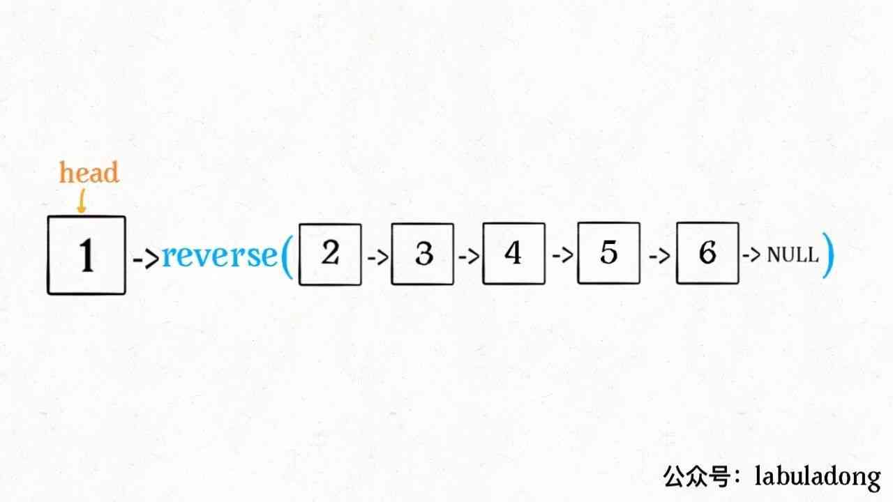
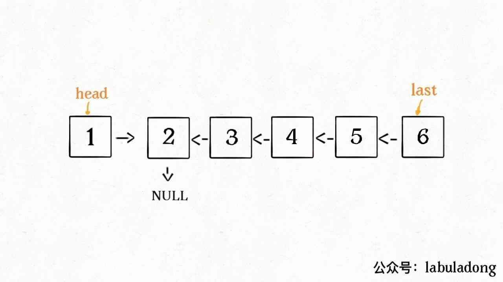
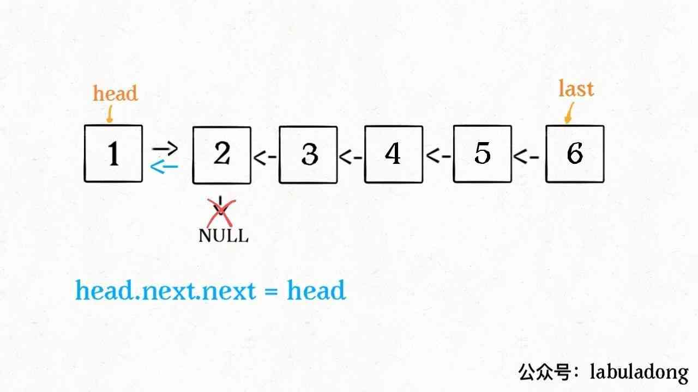
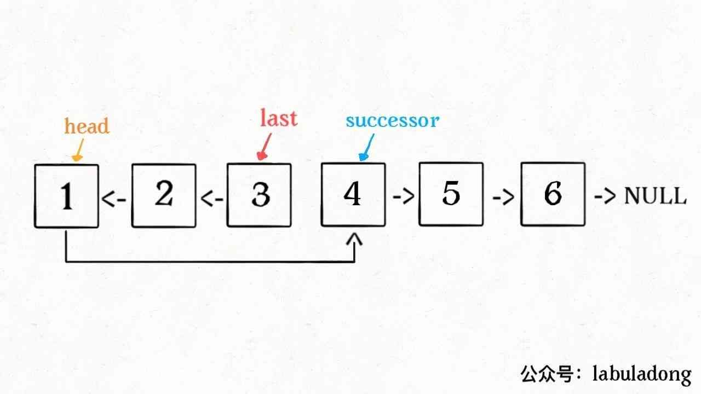

‍

‍

### Header

> 算法数构题目记录与路线手册内容

‍

‍

# 解题套路

‍

## 双指针

链表 + 数组

只要数组有序，就应该想到双指针技巧

对于单链表相关的题目，双指针的运用是非常广泛的

‍

+ **「虚拟头结点」技巧，也就是** **​`dummy`​**​ **节点: 当你需要创造一条新链表的时候，可以使用虚拟头结点简化边界情况的处理**。

> 这里在2022.10得到了切身体会

‍

如果我们需要把原链表的节点接到新链表上，而不是 new 新节点来组成新链表的话，那么断开节点和原链表之间的链接可能是必要的。那其实我们可以养成一个好习惯，但凡遇到这种情况，就把原链表的节点断开，这样就不会出错了。

‍

‍

### 快慢针

‍

**数组问题中比较常见的快慢指针技巧，是让你原地修改数组**。

第 26 题「[删除有序数组中的重复项open in new window](https://leetcode.cn/problems/remove-duplicates-from-sorted-array/)」，让你在有序数组去重

让慢指针 `slow`​ 走在后面，快指针 `fast`​ 走在前面探路，找到一个不重复的元素就赋值给 `slow`​ 并让 `slow`​ 前进一步

‍

> 这里可能有读者会问，链表中那些重复的元素并没有被删掉，就让这些节点在链表上挂着，合适吗？
>
> 这就要探讨不同语言的特性了，像 Java/Python 这类带有垃圾回收的语言，可以帮我们自动找到并回收这些「悬空」的链表节点的内存，而像 C++ 这类语言没有自动垃圾回收的机制，确实需要我们编写代码时手动释放掉这些节点的内存。

‍

#### 成环判断

‍

倒数第 k 个节点

‍

判断链表是否包含环: 快针如果碰到了慢针,,就

第 142 题「[环形链表 IIopen in new window](https://leetcode.cn/problems/linked-list-cycle-ii/)」：如果链表中含有环，如何计算这个环的起点？

‍

双指针技巧主要分为两类：**左右指针**和**快慢指针**。

所谓左右指针，就是两个指针相向而行或者相背而行；而所谓快慢指针，就是两个指针同向而行，一快一慢。

对于单链表来说，大部分技巧都属于快慢指针，前文 [单链表的六大解题套路](https://labuladong.github.io/algo/di-ling-zh-bfe1b/shuang-zhi-0f7cc/) 都涵盖了，比如链表环判断，倒数第 `K`​ 个链表节点等问题，它们都是通过一个 `fast`​ 快指针和一个 `slow`​ 慢指针配合完成任务。

在数组中并没有真正意义上的指针，但我们可以把索引当做数组中的指针，这样也可以在数组中施展双指针技巧

‍

‍

‍

### 滑动窗口

‍

​`left`​ 指针在后，`right`​ 指针在前，两个指针中间的部分就是「窗口」，算法通过扩大和缩小「窗口」来解决某些问题

‍

‍

模板:

‍

两处 `...`​ 表示的更新窗口数据的地方, 分别是扩大和缩小窗口的更新操作，等会你会发现它们操作是完全对称的。

```python
def slidingWindow(s: str):
    # 用合适的数据结构记录窗口中的数据, 这里用了{}
    window = {}
  
    left = 0
    right = 0
  
    while right < len(s):
        # c 是将移入窗口的字符
        c = s[right]
        if c not in window:
            window[c] = 1
        else:
            window[c] += 1
  
        # 增大窗口
        right += 1
  
        # 进行窗口内数据的一系列更新
        # ...
  
        # 判断左侧窗口是否要收缩
        while left < right and window needs shrink:
            # d 是将移出窗口的字符
            d = s[left]
  
            # 缩小窗口
            left += 1
  
            # 进行窗口内数据的一系列更新
            # ...
```

‍

示例

第 76 题「[最小覆盖子串open in new window](https://leetcode.cn/problems/minimum-window-substring/)」

‍

**滑动窗口算法的思路是这样**：

1, 我们在字符串 `S`​ 中使用双指针中的左右指针技巧，初始化 `left = right = 0`​，把索引**左闭右开**区间 `[left, right)`​ 称为一个「窗口」

‍

理论上你可以设计两端都开或者两端都闭的区间，但设计为左闭右开区间是最方便处理的。因为这样初始化 `left = right = 0`​ 时区间 `[0, 0)`​ 中没有元素，但只要让 `right`​ 向右移动（扩大）一位，区间 `[0, 1)`​ 就包含一个元素 `0`​ 了。如果你设置为两端都开的区间，那么让 `right`​ 向右移动一位后开区间 `(0, 1)`​ 仍然没有元素；如果你设置为两端都闭的区间，那么初始区间 `[0, 0]`​ 就包含了一个元素。这两种情况都会给边界处理带来不必要的麻烦。

‍

2, 我们先不断地增加 `right`​ 指针扩大窗口 `[left, right)`​，直到窗口中的字符串符合要求（包含了 `T`​ 中的所有字符）

‍

3, 此时，我们停止增加 `right`​，转而不断增加 `left`​ 指针缩小窗口 `[left, right)`​，直到窗口中的字符串不再符合要求（不包含 `T`​ 中的所有字符了）。同时，每次增加 `left`​，我们都要更新一轮结果。

‍

4, 重复第 2 和第 3 步，直到 `right`​ 到达字符串 `S`​ 的尽头。

‍

    **第 2 步相当于在寻找一个「可行解」，然后第 3 步在优化这个「可行解」，最终找到最优解**，也就是最短的覆盖子串。左右指针轮流前进，窗口大小增增减减，窗口不断向右滑动，这就是「滑动窗口」这个名字的来历

‍

‍

### 左右指针

‍

**反转数组**

..

‍

**回文串判断**

最长回文子串使用的左右指针和之前题目的左右指针有一些不同：之前的左右指针都是从两端向中间相向而行，而回文子串问题则是让左右指针从中心向两端扩展。不过这种情况也就回文串这类问题会遇到，所以我也把它归为左右指针了

‍

‍

‍

### 二分

‍

二分查找并不简单，Knuth 大佬（发明 KMP 算法的那位）都说二分查找：**思路很简单，细节是魔鬼**。很多人喜欢拿整型溢出的 bug 说事儿，但是二分查找真正的坑根本就不是那个细节问题，而是在于到底要给 `mid`​ 加一还是减一，while 里到底用 `<=`​ 还是 `<`​。

你要是没有正确理解这些细节，写二分肯定就是玄学编程，有没有 bug 只能靠菩萨保佑

‍

‍

#### 二分查找框架

```java
int binarySearch(int[] nums, int target) {
    int left = 0, right = ...;

    while(...) {
        int mid = left + (right - left) / 2;
        if (nums[mid] == target) {
            ...
        } else if (nums[mid] < target) {
            left = ...
        } else if (nums[mid] > target) {
            right = ...
        }
    }
    return ...;
}
```

其中 `...`​ 标记的部分，就是可能出现细节问题的地方，当你见到一个二分查找的代码时，首先注意这几个地方。后文用实例分析这些地方能有什么样的变化。

‍

```python
def binarySearch(nums: List[int], target: int) -> int:
    left, right = 0, len(nums) - 1

    while left <= right:
        mid = left + (right - left) // 2
        if nums[mid] == target:
            return mid
        elif nums[mid] < target:
            left = mid + 1
        else:
            right = mid - 1
    return -1
```

‍

**分析二分查找的一个技巧是：不要出现 else，而是把所有情况用 else if 写清楚，这样可以清楚地展现所有细节**。本文都会使用 else if，旨在讲清楚，读者理解后可自行简化

‍

**另外提前说明一下，计算** **​`mid`​**​ **时需要防止溢出**，代码中 `left + (right - left) / 2`​ 就和 `(left + right) / 2`​ 的结果相同，但是有效防止了 `left`​ 和 `right`​ 太大，直接相加导致溢出的情况

‍

#### 寻找一个数（基本的二分搜索）

‍

基本实现:

```java
def binarySearch(nums:List[int], target:int) -> int:
    left = 0; 
    right = len(nums) - 1; # 注意

    while(left <= right):
        mid = left + (right - left) // 2; # 防止整型溢出
        if(nums[mid] == target):
            return mid; 
        elif(nums[mid] < target):
            left = mid + 1; # 注意
        elif(nums[mid] > target):
            right = mid - 1; # 注意

    return -1;
```

‍

其中的细节:

**1、为什么 while 循环的条件中是 &lt;=，而不是 &lt;** ？

答：因为初始化 `right`​ 的赋值是 `nums.length - 1`​，即最后一个元素的索引，而不是 `nums.length`​

‍

这二者可能出现在不同功能的二分查找中，区别是：前者相当于两端都闭区间 `[left, right]`​，后者相当于左闭右开区间 `[left, right)`​。因为索引大小为 `nums.length`​ 是越界的，所以我们把 `right`​ 这一边视为开区间。

我们这个算法中使用的是前者 `[left, right]`​ 两端都闭的区间。**这个区间其实就是每次进行搜索的区间**。

‍

如果没找到，就需要 while 循环终止，然后返回 -1。那 while 循环什么时候应该终止？**搜索区间为空的时候应该终止**，意味着你没得找了，就等于没找到嘛。

‍

​`while(left <= right)`​ 的终止条件是 `left == right + 1`​，写成区间的形式就是 `[right + 1, right]`​，或者带个具体的数字进去 `[3, 2]`​，可见**这时候区间为空**，因为没有数字既大于等于 3 又小于等于 2 的吧。所以这时候 while 循环终止是正确的，直接返回 -1 即可。

​`while(left < right)`​ 的终止条件是 `left == right`​，写成区间的形式就是 `[right, right]`​，或者带个具体的数字进去 `[2, 2]`​，**这时候区间非空**，还有一个数 2，但此时 while 循环终止了。也就是说区间 `[2, 2]`​ 被漏掉了，索引 2 没有被搜索，如果这时候直接返回 -1 就是错误的。当然，如果你非要用 `while(left < right)`​ 也可以，我们已经知道了出错的原因，就打个补丁好了(使用三元判断)

‍

**2、为什么** **​`left = mid + 1`​**​ **，**​**​`right = mid - 1`​**​ **？**

刚才明确了「搜索区间」这个概念，而且本算法的搜索区间是两端都闭的，即 `[left, right]`​。那么当我们发现索引 `mid`​ 不是要找的 `target`​ 时，下一步应该去搜索哪里呢？

当然是去搜索区间 `[left, mid-1]`​ 或者区间 `[mid+1, right]`​ 对不对

‍

**3、此算法有什么缺陷**？

‍

比如说给你有序数组 `nums = [1,2,2,2,3]`​，`target`​ 为 2，此算法返回的索引是 2，没错。但是如果我想得到 `target`​ 的左侧边界，即索引 1，或者我想得到 `target`​ 的右侧边界，即索引 3，这样的话此算法是无法处理的。

这样的需求很常见，**你也许会说，找到一个** **​`target`​**​ **，然后向左或向右线性搜索不行吗？可以，但是不好，因为这样难以保证二分查找对数级的复杂度了**。

‍

‍

#### 寻找左侧边界

‍

```java
def left_bound(nums: List[int], target: int) -> int:
    left = 0
    right = nums.length; # 注意
  
    while left < right: # 注意
        mid = left + (right - left) // 2
        if nums[mid] == target:
            right = mid
        elif nums[mid] < target:
            left = mid + 1
        elif nums[mid] > target:
            right = mid; # 注意

    return left
```

‍

**1、为什么 while 中是**  **​`<`​** ​ **而不是**  **​`<=`​** ​

‍

用相同的方法分析，因为 `right = nums.length`​ 而不是 `nums.length - 1`​。因此每次循环的「搜索区间」是 `[left, right)`​ 左闭右开。

​`while(left < right)`​ 终止的条件是 `left == right`​，此时搜索区间 `[left, left)`​ 为空，所以可以正确终止。

‍

‍

**2、为什么没有返回 -1 的操作？如果** **​`nums`​**​ **中不存在** **​`target`​**​ **这个值 怎么办**

‍

答：其实很简单，在返回的时候额外判断一下 `nums[left]`​ 是否等于 `target`​ 就行了，如果不等于，就说明 `target`​ 不存在。需要注意的是，访问数组索引之前要保证索引不越界

```java
while (left < right) {
    //...
}
// 如果索引越界，说明数组中无目标元素，返回 -1
if (left < 0 || left >= nums.length) {
    return -1;
}
// 判断一下 nums[left] 是不是 target
return nums[left] == target ? left : -1;

```

> 其实对于这个算法，`left`​ 不可能小于 0。你可以想象一下算法执行的逻辑，`left`​ 初始化就是 0，且只可能一直往右走，那么只可能在右侧越界。不过在访问数组索引之前保证索引在左右两端都不越界是一个很好的编程习惯，没有坏处，我这里就同时判断了。这样做的另一个好处是可以让二分的模板更统一，降低你的记忆成本。

‍

‍

**3、为什么** **​`left = mid + 1`​**​ **，**​**​`right = mid`​**​  **？和之前的算法不一样**？

答：这个很好解释，因为我们的「搜索区间」是 `[left, right)`​ 左闭右开，所以当 `nums[mid]`​ 被检测之后，下一步应该去 `mid`​ 的左侧或者右侧区间搜索，即 `[left, mid)`​ 或 `[mid + 1, right)`​。

‍

‍

**4、为什么该算法能够搜索左侧边界**？

答：关键在于对于 `nums[mid] == target`​ 这种情况的处理：

```java
 if (nums[mid] == target)
        right = mid;
```

可见，找到 target 时不要立即返回，而是缩小「搜索区间」的上界 `right`​，在区间 `[left, mid)`​ 中继续搜索，即不断向左收缩，达到锁定左侧边界的目的。

‍

**5、为什么返回** **​`left`​**​​ **而不是** **​`right`​**​​？

答：都是一样的，因为 while 终止的条件是 `left == right`​​

‍

‍

**6、能不能想办法把** **​`right`​**​ **变成** **​`nums.length - 1`​**​ **，也就是继续使用两边都闭的「搜索区间」？这样就可以和第一种二分搜索在某种程度上统一起来了**。

答：当然可以，只要你明白了「搜索区间」这个概念，就能有效避免漏掉元素，随便你怎么改都行。下面我们严格根据逻辑来修改：

‍

因为你非要让搜索区间两端都闭，所以 `right`​ 应该初始化为 `nums.length - 1`​，while 的终止条件应该是 `left == right + 1`​，也就是其中应该用 `<=`​：

‍

```java
def left_bound(nums: List[int], target: int) -> int:
    left, right = 0, len(nums) - 1
    # 搜索区间为 [left, right]
    while left <= right:
        mid = left + (right - left) // 2
        if nums[mid] < target:
            # 搜索区间变为 [mid+1, right]
            left = mid + 1
        elif nums[mid] > target:
            # 搜索区间变为 [left, mid-1]
            right = mid - 1
        elif nums[mid] == target:
            # 收缩右侧边界
            right = mid - 1
    # 判断 target 是否存在于 nums 中
    # 如果越界，target 肯定不存在，返回 -1
    if left < 0 or left >= len(nums):
        return -1
    # 判断一下 nums[left] 是不是 target
    return left if nums[left] == target else -1
```

这样就和第一种二分搜索算法统一了，都是两端都闭的「搜索区间」，而且最后返回的也是 `left`​ 变量的值。只要把住二分搜索的逻辑，两种形式大家看自己喜欢哪种记哪种吧

‍

#### 寻找右侧边界

‍

常见的左闭右开的写法，只有两处和搜索左侧边界不同：

```java
def right_bound(nums, target):
    left, right = 0, len(nums)
    while left < right:
        mid = left + (right - left) // 2
        if nums[mid] == target:
            left = mid + 1 # 注意
        elif nums[mid] < target:
            left = mid + 1
        elif nums[mid] > target:
            right = mid
    return left - 1 # 注意
```

‍

关键点还是这里：

```java
if (nums[mid] == target) {
    left = mid + 1;
```

当 `nums[mid] == target`​ 时，不要立即返回，而是增大「搜索区间」的左边界 `left`​，使得区间不断向右靠拢，达到锁定右侧边界的目的。

‍

**2、为什么最后返回** **​`left - 1`​**​ **而不像左侧边界的函数，返回** **​`left`​**​ **？而且我觉得这里既然是搜索右侧边界，应该返回** **​`right`​**​ **才对**。

答：首先，while 循环的终止条件是 `left == right`​，所以 `left`​ 和 `right`​ 是一样的，你非要体现右侧的特点，返回 `right - 1`​ 好了。

至于为什么要减一，这是搜索右侧边界的一个特殊点，关键在锁定右边界时的这个条件判断：

```java
// 增大 left，锁定右侧边界
if (nums[mid] == target) {
    left = mid + 1;
    // 这样想: mid = left - 1
```

‍

**3、为什么没有返回 -1 的操作？如果** **​`nums`​**​ **中不存在** **​`target`​**​ **这个值，怎么办**？

答：只要在最后判断一下 `nums[left-1]`​ 是不是 `target`​ 就行了，类似之前的左侧边界搜索，做一点额外的判断即可

‍

**4、是否也可以把这个算法的「搜索区间」也统一成两端都闭的形式**

‍

```java
def right_bound(nums: List[int], target: int) -> int:
    left, right = 0, len(nums) - 1
    while left <= right:
        mid = left + (right - left) // 2
        if nums[mid] < target:
            left = mid + 1
        elif nums[mid] > target:
            right = mid - 1
        elif nums[mid] == target:
            # 这里改成收缩左侧边界即可
            # Shrink the left boundary here
            left = mid + 1
    # 最后改成返回 left - 1
    # Finally we return left - 1
    if left - 1 < 0 or left - 1 >= len(nums):
        return -1
    return left - 1 if nums[left - 1] == target else -1
```

‍

当然，由于 while 的结束条件为 `right == left - 1`​，所以你把上述代码中的 `left - 1`​ 都改成 `right`​ 也没有问题，这样可能更有利于看出来这是在「搜索右侧边界」：

```java
int right_bound(int[] nums, int target) {
    int left = 0, right = nums.length - 1;
    while (left <= right) {
        int mid = left + (right - left) / 2;
        if (nums[mid] < target) {
            left = mid + 1;
        } else if (nums[mid] > target) {
            right = mid - 1;
        } else if (nums[mid] == target) {
            // 这里改成收缩左侧边界即可
            left = mid + 1;
        }
    }
    // 最后改成返回 right
    if (right < 0 || right >= nums.length) {
        return -1;
    }
    return nums[right] == target ? right : -1;
}
```

‍

#### 逻辑统一

**根据逻辑将「搜索区间」全都统一成了两端都闭便于记忆，只要修改两处即可变化出三种写法**

‍

```java
def binary_search(nums: List[int], target: int) -> int:
    # 设置左右下标
    left, right = 0, len(nums) - 1
    while left <= right:
        mid = left + (right - left) // 2
        if nums[mid] < target:
            left = mid + 1
        elif nums[mid] > target:
            right = mid - 1

        elif nums[mid] == target:
            # 找到目标值
            return mid

    # 没有找到目标值
    return -1

def left_bound(nums: List[int], target: int) -> int:
    # 设置左右下标
    left, right = 0, len(nums) - 1
    while left <= right:
        mid = left + (right - left) // 2
        if nums[mid] < target:
            left = mid + 1
        elif nums[mid] > target:
            right = mid - 1

        elif nums[mid] == target:

            # 存在目标值，缩小右边界
            right = mid - 1

    # 判断是否存在目标值
    if left < 0 or left >= len(nums):
        return -1
    # 判断找到的左边界是否是目标值
    return left if nums[left] == target else -1

def right_bound(nums: List[int], target: int) -> int:
    # 设置左右下标
    left, right = 0, len(nums) - 1
    while left <= right:
        mid = left + (right - left) // 2
        if nums[mid] < target:
            left = mid + 1
        elif nums[mid] > target:
            right = mid - 1

        elif nums[mid] == target:

            # 存在目标值，缩小左边界
            left = mid + 1

    # 判断是否存在目标值
    if right < 0 or right >= len(nums):
        return -1
    # 判断找到的右边界是否是目标值
    return right if nums[right] == target else -1
```

‍

最后我想说，以上二分搜索的框架属于「术」的范畴，如果上升到「道」的层面，**二分思维的精髓就是：通过已知信息尽可能多地收缩（折半）搜索空间**，从而增加穷举效率，快速找到目标。

‍

‍

‍

‍

‍

## 股票买卖

**通用方法**

‍

这篇文章用状态机的技巧来解决，可以全部提交通过。不要觉得这个名词高大上，文学词汇而已，实际上就是 DP table，看一眼就明白了。

第 188 题「[买卖股票的最佳时机 IV](https://leetcode.cn/problems/best-time-to-buy-and-sell-stock-iv/)」进行研究，因为这道题是最泛化的形式，其他的问题都是这个形式的简化

第一题是只进行一次交易，相当于 `k = 1`​；第二题是不限交易次数，相当于 `k = +infinity`​（正无穷）；第三题是只进行 2 次交易，相当于 `k = 2`​；剩下两道也是不限次数，但是加了交易「冷冻期」和「手续费」的额外条件，其实就是第二题的变种，都很容易处理。

‍

### 穷举框架

具体到每一天，看看总共有几种可能的「状态」，再找出每个「状态」对应的「选择」。我们要穷举所有「状态」，穷举的目的是根据对应的「选择」更新状态

这个问题，**每天都有三种「选择」** ：买入、卖出、无操作，我们用 `buy`​, `sell`​, `rest`​ 表示这三种选择。

但问题是，并不是每天都可以任意选择这三种选择的，因为 `sell`​ 必须在 `buy`​ 之后，`buy`​ 必须在 `sell`​ 之后。那么 `rest`​ 操作还应该分两种状态，一种是 `buy`​ 之后的 `rest`​（持有了股票），一种是 `sell`​ 之后的 `rest`​（没有持有股票）。而且别忘了，我们还有交易次数 `k`​ 的限制，就是说你 `buy`​ 还只能在 `k > 0`​ 的前提下操作。

‍

**这个问题的「状态」有三个**，第一个是天数，第二个是允许交易的最大次数，第三个是当前的持有状态（即之前说的 `rest`​ 的状态，我们不妨用 1 表示持有，0 表示没有持有）。然后我们用一个三维数组就可以装下这几种状态的全部组合：

```python
dp[i][k][0 or 1]
0 <= i <= n - 1, 1 <= k <= K
n 为天数，大 K 为交易数的上限，0 和 1 代表是否持有股票。
此问题共 n × K × 2 种状态，全部穷举就能搞定。

for 0 <= i < n:
    for 1 <= k <= K:
        for s in {0, 1}:
            dp[i][k][s] = max(buy, sell, rest)

```

‍

而且我们可以用自然语言描述出每一个状态的含义，比如说 `dp[3][2][1]`​ 的含义就是：今天是第三天，我现在手上持有着股票，至今最多进行 2 次交易。再比如 `dp[2][3][0]`​ 的含义：今天是第二天，我现在手上没有持有股票，至今最多进行 3 次交易。很容易理解，对吧？

最终答案是 `dp[n - 1][K][0]`​，即最后一天，最多允许 `K`​ 次交易，最多获得多少利润

读者可能问为什么不是 `dp[n - 1][K][1]`​？因为 `dp[n - 1][K][1]`​ 代表到最后一天手上还持有股票，`dp[n - 1][K][0]`​ 表示最后一天手上的股票已经卖出去了，很显然后者得到的利润一定大于前者。

记住如何解释「状态」，一旦你觉得哪里不好理解，把它翻译成自然语言就容易理解了

‍

‍

### 状态转移框架

```python
dp[i][k][0] = max(dp[i-1][k][0], dp[i-1][k][1] + prices[i])
              max( 今天选择 rest,        今天选择 sell       )
```

解释：今天我没有持有股票，有两种可能，我从这两种可能中求最大利润：

1、我昨天就没有持有，且截至昨天最大交易次数限制为 `k`​；然后我今天选择 `rest`​，所以我今天还是没有持有，最大交易次数限制依然为 `k`​。

‍

2、我昨天持有股票，且截至昨天最大交易次数限制为 `k`​；但是今天我 `sell`​ 了，所以我今天没有持有股票了，最大交易次数限制依然为 `k`​。

‍

```python
dp[i][k][1] = max(dp[i-1][k][1], dp[i-1][k-1][0] - prices[i])
              max( 今天选择 rest,         今天选择 buy         )
```

解释：今天我持有着股票，最大交易次数限制为 `k`​，那么对于昨天来说，有两种可能，我从这两种可能中求最大利润：

1、我昨天就持有着股票，且截至昨天最大交易次数限制为 `k`​；然后今天选择 `rest`​，所以我今天还持有着股票，最大交易次数限制依然为 `k`​。

2、我昨天本没有持有，且截至昨天最大交易次数限制为 `k - 1`​；但今天我选择 `buy`​，所以今天我就持有股票了，最大交易次数限制为 `k`​。

> 这里着重提醒一下，**时刻牢记「状态」的定义**，状态 `k`​ 的定义并不是「已进行的交易次数」，而是「最大交易次数的上限限制」。如果确定今天进行一次交易，且要保证截至今天最大交易次数上限为 `k`​，那么昨天的最大交易次数上限必须是 `k - 1`​。举个具体的例子，比方说要求你的银行卡里今天至少有 100 块钱，且你确定你今天可以赚 10 块钱，那么你就要保证昨天的银行卡要至少剩下 90 块钱。

‍

这个解释应该很清楚了，如果 `buy`​，就要从利润中减去 `prices[i]`​，如果 `sell`​，就要给利润增加 `prices[i]`​。今天的最大利润就是这两种可能选择中较大的那个。

注意 `k`​ 的限制，在选择 `buy`​ 的时候相当于开启了一次交易，那么对于昨天来说，交易次数的上限 `k`​ 应该减小 1。

‍

‍

现在，我们已经完成了动态规划中最困难的一步：状态转移方程。**如果之前的内容你都可以理解，那么你已经可以秒杀所有问题了，只要套这个框架就行了**。不过还差最后一点点，就是定义 base case，即最简单的情况。

‍

```python
dp[-1][...][0] = 0
解释：因为 i 是从 0 开始的，所以 i = -1 意味着还没有开始，这时候的利润当然是 0。

dp[-1][...][1] = -infinity
解释：还没开始的时候，是不可能持有股票的。
因为我们的算法要求一个最大值，所以初始值设为一个最小值，方便取最大值。

dp[...][0][0] = 0
解释：因为 k 是从 1 开始的，所以 k = 0 意味着根本不允许交易，这时候利润当然是 0。

dp[...][0][1] = -infinity
解释：不允许交易的情况下，是不可能持有股票的。
因为我们的算法要求一个最大值，所以初始值设为一个最小值，方便取最大值。
```

‍

把上面的状态转移方程总结一下：

```python
base case：
dp[-1][...][0] = dp[...][0][0] = 0
dp[-1][...][1] = dp[...][0][1] = -infinity

状态转移方程：
dp[i][k][0] = max(dp[i-1][k][0], dp[i-1][k][1] + prices[i])
dp[i][k][1] = max(dp[i-1][k][1], dp[i-1][k-1][0] - prices[i])
```

读者可能会问，这个数组索引是 -1 怎么编程表示出来呢，负无穷怎么表示呢？这都是细节问题，有很多方法实现。现在完整的框架已经完成，下面开始具体化。

‍

### 秒杀题目

**第 121 题「**​**[买卖股票的最佳时机](https://leetcode.cn/problems/best-time-to-buy-and-sell-stock/)**​ **」，相当于** **​`k = 1`​**​ **的情况**

‍

直接套状态转移方程，根据 base case，可以做一些化简：

```python
dp[i][1][0] = max(dp[i-1][1][0], dp[i-1][1][1] + prices[i])
dp[i][1][1] = max(dp[i-1][1][1], dp[i-1][0][0] - prices[i]) 
            = max(dp[i-1][1][1], -prices[i])
解释：k = 0 的 base case，所以 dp[i-1][0][0] = 0。

现在发现 k 都是 1，不会改变，即 k 对状态转移已经没有影响了。
可以进行进一步化简去掉所有 k：
dp[i][0] = max(dp[i-1][0], dp[i-1][1] + prices[i])
dp[i][1] = max(dp[i-1][1], -prices[i])
```

```python
n = len(prices)
dp = [[0]*2 for _ in range(n)]
for i in range(n):
    dp[i][0] = max(dp[i-1][0], dp[i-1][1] + prices[i])
    dp[i][1] = max(dp[i-1][1], -prices[i])
return dp[n - 1][0]
```

显然 `i = 0`​ 时 `i - 1`​ 是不合法的索引，这是因为我们没有对 `i`​ 的 base case 进行处理，可以这样给一个特化处理：

```java
if (i - 1 == -1) {
    dp[i][0] = 0;
    // 根据状态转移方程可得：
    //   dp[i][0] 
    // = max(dp[-1][0], dp[-1][1] + prices[i])
    // = max(0, -infinity + prices[i]) = 0

    dp[i][1] = -prices[i];
    // 根据状态转移方程可得：
    //   dp[i][1] 
    // = max(dp[-1][1], dp[-1][0] - prices[i])
    // = max(-infinity, 0 - prices[i]) 
    // = -prices[i]
    continue;
}
```

‍

只需要一个变量储存相邻的那个状态就足够了，这样可以把空间复杂度降到 O(1):

```python
def maxProfit_k_1(prices: List[int]) -> int:
    n = len(prices)
    # base case: dp[-1][0] = 0, dp[-1][1] = -infinity
    dp_i_0, dp_i_1 = 0, float('-inf')
    for i in range(n):
        # dp[i][0] = max(dp[i-1][0], dp[i-1][1] + prices[i])
        dp_i_0, dp_i_1 = max(dp_i_0, dp_i_1 + prices[i]), max(dp_i_1, -prices[i])
    return dp_i_0
```

‍

**第 122 题「**​**[买卖股票的最佳时机 II](https://leetcode.cn/problems/best-time-to-buy-and-sell-stock-ii/)**​ **」，也就是** **​`k`​**​ **为正无穷的情况**

题目还专门强调可以在同一天出售，但我觉得这个条件纯属多余，如果当天买当天卖，那利润当然就是 0，这不是和没有进行交易是一样的吗？这道题的特点在于没有给出交易总数 `k`​ 的限制，也就相当于 `k`​ 为正无穷。

如果 `k`​ 为正无穷，那么就可以认为 `k`​ 和 `k - 1`​ 是一样的

```python
dp[i][k][0] = max(dp[i-1][k][0], dp[i-1][k][1] + prices[i])
dp[i][k][1] = max(dp[i-1][k][1], dp[i-1][k-1][0] - prices[i])
            = max(dp[i-1][k][1], dp[i-1][k][0] - prices[i])

我们发现数组中的 k 已经不会改变了，也就是说不需要记录 k 这个状态了：
dp[i][0] = max(dp[i-1][0], dp[i-1][1] + prices[i])
dp[i][1] = max(dp[i-1][1], dp[i-1][0] - prices[i])
```

```python
# 空间复杂度优化版本
class Solution:
    def maxProfit_k_inf(self, prices: List[int]) -> int:
        n = len(prices)
        dp_i_0, dp_i_1 = 0, float('-inf')
        for i in range(n):
            temp = dp_i_0
            dp_i_0 = max(dp_i_0, dp_i_1 + prices[i])
            dp_i_1 = max(dp_i_1, temp - prices[i])
        return dp_i_0
```

‍

**第 309 题「**​**[最佳买卖股票时机含冷冻期](https://leetcode.cn/problems/best-time-to-buy-and-sell-stock-with-cooldown/)**​ **」，也就是** **​`k`​**​ **为正无穷，但含有交易冷冻期的情况**：

和上一道题一样的，只不过每次 `sell`​ 之后要等一天才能继续交易，只要把这个特点融入上一题的状态转移方程即可：

```python
dp[i][0] = max(dp[i-1][0], dp[i-1][1] + prices[i])
dp[i][1] = max(dp[i-1][1], dp[i-2][0] - prices[i])
解释：第 i 天选择 buy 的时候，要从 i-2 的状态转移，而不是 i-1 。
```

```python
# 空间复杂度优化版本
class Solution:
    def maxProfit(self,prices: List[int]) -> int:
        n = len(prices)
        dp_i_0, dp_i_1, dp_pre_0 = 0, float('-inf'), 0
        for i in range(n):
            temp = dp_i_0
            dp_i_0 = max(dp_i_0, dp_i_1 + prices[i])
            dp_i_1 = max(dp_i_1, dp_pre_0 - prices[i])
            dp_pre_0 = temp
        return dp_i_0
```

‍

**第 714 题「**​**[买卖股票的最佳时机含手续费](https://leetcode.cn/problems/best-time-to-buy-and-sell-stock-with-transaction-fee/)**​ **」，也就是** **​`k`​**​ **为正无穷且考虑交易手续费的情况**：

每次交易要支付手续费，只要把手续费从利润中减去即可，改写方程：

```python
dp[i][0] = max(dp[i-1][0], dp[i-1][1] + prices[i])
dp[i][1] = max(dp[i-1][1], dp[i-1][0] - prices[i] - fee)
解释：相当于买入股票的价格升高了。
在第一个式子里减也是一样的，相当于卖出股票的价格减小了。
```

```python
# 空间复杂度优化版本
def maxProfit_with_fee(prices: List[int], fee: int) -> int:
    n = len(prices)
    dp_i_0, dp_i_1 = 0, float('-inf')
    for i in range(n):
        temp = dp_i_0
        dp_i_0 = max(dp_i_0, dp_i_1 + prices[i])
        dp_i_1 = max(dp_i_1, temp - prices[i] - fee)
    return dp_i_0
```

‍

**第 123 题「**​**[买卖股票的最佳时机](https://leetcode.cn/problems/best-time-to-buy-and-sell-stock-iii/)**​ **」，也就是** **​`k = 2`​**​ **的情况**

```python
原始的状态转移方程，没有可化简的地方
dp[i][k][0] = max(dp[i-1][k][0], dp[i-1][k][1] + prices[i])
dp[i][k][1] = max(dp[i-1][k][1], dp[i-1][k-1][0] - prices[i])
```

还记得前面总结的「穷举框架」吗？就是说我们必须穷举所有状态。其实我们之前的解法，都在穷举所有状态，只是之前的题目中 `k`​ 都被化简掉了。

但当 `k = 2`​ 时，由于没有消掉 `k`​ 的影响，所以必须要对 `k`​ 进行穷举：

‍

太难了

https://labuladong.github.io/algo/di-ling-zh-bfe1b/yi-ge-fang-3b01b/

‍

‍

## 递归翻转单链表

‍

什么叫反转单链表的一部分呢，就是给你一个索引区间，让你把单链表中这部分元素反转，其他部分不变: [反转链表 II](https://leetcode.cn/problems/reverse-linked-list-ii/)

**这里的索引是从 1 开始的**。迭代的思路大概是：先用一个 for 循环找到第 `m`​ 个位置，然后再用一个 for 循环将 `m`​ 和 `n`​ 之间的元素反转。但是我们的递归解法不用一个 for 循环，纯递归实现反转

‍

### 递归反转整个链表

[反转链表](https://leetcode.cn/problems/reverse-linked-list/)

```python
def reverse(head: ListNode) -> ListNode:
    if not head or not head.next:
        return head
    last = reverse(head.next) 

    head.next.next = head 

    head.next = None 

    return last
```

‍

是不是感觉不知所云，完全不能理解这样为什么能够反转链表？这就对了，这个算法常常拿来显示递归的巧妙和优美，我们下面来详细解释一下这段代码

‍

**对于递归算法，最重要的就是明确递归函数的定义**。具体来说，我们的 `reverse`​ 函数定义是这样的：

**输入一个节点** **​`head`​**​ **，将「以** **​`head`​**​ **为起点」的链表反转，并返回反转之后的头结点**

‍

那么输入 `reverse(head)`​ 后，会在这里进行递归：

```java
ListNode last = reverse(head.next);
```

不要跳进递归（你的脑袋能压几个栈呀？），而是要根据刚才的函数定义，来弄清楚这段代码会产生什么结果：

‍

​​

‍

这个 `reverse(head.next)`​ 执行完成后，整个链表就成了这样

​​

并且根据函数定义，`reverse`​ 函数会返回反转之后的头结点，我们用变量 `last`​ 接收了。

‍

现在再来看下面的代码：

```
head.next.next = head;
```

​​

‍

下面就是对head 和 后面元素的双边指针进行微调, 重新赋值第二个元素的Null指针next为head, 然后head取消

‍

有两个地方需要注意：

1、递归函数要有 base case

```python
if head is None or head.next is None:
    return head
```

意思是如果链表为空或者只有一个节点的时候，反转结果就是它自己，直接返回即可。

‍

2、当链表递归反转之后，新的头结点是 `last`​，而之前的 `head`​ 变成了最后一个节点，别忘了链表的末尾要指向 null：

​`head.next = None`​

‍

接下来的问题其实都是在这个算法上的扩展

‍

### 反转链表前 N 个节点

‍

```python
successor = None # 后继节点

# 反转以 head 为起点的 n 个节点，返回新的头节点
def reverseN(head: ListNode, n: int) -> ListNode:
    global successor

    if n == 1:
        # 记录第 n + 1 个节点
        successor = head.next
        return head

    # 以 head.next 为起点，需要反转前 n - 1 个节点
    last = reverseN(head.next, n - 1)

    head.next.next = head
    # 让反转之后的 head 节点和后面的节点连起来
    head.next = successor
    return last 
```

​​

‍

具体的区别：

1、base case 变为 `n == 1`​，反转一个元素，就是它本身，同时**要记录后驱节点**。

2、刚才我们直接把 `head.next`​ 设置为 null，因为整个链表反转后原来的 `head`​ 变成了整个链表的最后一个节点。但现在 `head`​ 节点在递归反转之后不一定是最后一个节点了，所以要记录后驱 `successor`​（第 `n + 1`​ 个节点），反转之后将 `head`​ 连接上。

‍

‍

### 反转链表的一部分

‍

给一个索引区间 `[m, n]`​（索引从 1 开始），仅仅反转区间中的链表元素。

```python
def reverseBetween(head: ListNode, m: int, n: int) -> ListNode:
    # base case
    if m == 1:
        return reverseN(head, n)
    # 前进到反转的起点触发 base case
    head.next = reverseBetween(head.next, m - 1, n - 1)
    return head
//reverseN上一题
```

‍

### 总结

递归的思想相对迭代思想，稍微有点难以理解，处理的技巧是：不要跳进递归，而是利用明确的定义来实现算法逻辑。

处理看起来比较困难的问题，可以尝试化整为零，把一些简单的解法进行修改，解决困难的问题。

值得一提的是，递归操作链表并不高效。和迭代解法相比，虽然时间复杂度都是 O(N)，但是迭代解法的空间复杂度是 O(1)，而递归解法需要堆栈，空间复杂度是 O(N)。所以递归操作链表可以作为对递归算法的练习或者拿去和小伙伴装逼，但是考虑效率的话还是使用迭代算法更好。

‍

‍

‍

## 回文链表

**寻找**回文串的核心思想是从中心向两端扩展：

```python
def palindrome(s: str, left: int, right: int) -> str:
    # 在 s 中寻找以 s[left] 和 s[right] 为中心的最长回文串
    # 防止索引越界
    while left >= 0 and right < len(s) and s[left] == s[right]:
        # 双指针，向两边展开
        left -= 1
        right += 1
    # 返回以 s[left] 和 s[right] 为中心的最长回文串
    return s[(left + 1):right]
```

‍

因为回文串长度可能为奇数也可能是偶数，长度为奇数时只存在一个中心点，而长度为偶数时存在两个中心点，所以上面这个函数需要传入 `l`​ 和 `r`​。

而**判断**一个字符串是不是回文串就简单很多，不需要考虑奇偶情况，只需要双指针技巧，从两端向中间逼近即可：

```python
def isPalindrome(s: str) -> bool:
    # 一左一右两个指针相向而行
    left, right = 0, len(s) - 1
    while left < right:
        if s[left] != s[right]:
            return False
        left += 1
        right -= 1
    return True
```

‍

‍

### 判断回文单链表

‍

链表兼具递归结构，树结构不过是链表的衍生。那么，**链表其实也可以有前序遍历和后序遍历**：

‍

```python
def traverse(head: ListNode):
    # 前序遍历代码
    traverse(head.next)
    # 后序遍历代码
```

这个框架有什么指导意义呢？如果我想正序打印链表中的 `val`​ 值，可以在前序遍历位置写代码；反之，如果想倒序遍历链表，就可以在后序遍历位置操作：

```python
# 倒序打印单链表中的元素值
def traverse(head: ListNode):
    if head is None:
        return
    traverse(head.next)
    # 后序遍历代码
    print(head.val)
```

‍

其实可以稍作修改，模仿双指针实现回文判断的功能

```python
# 左侧指针
left = None

def isPalindrome(head: ListNode) -> bool:
    global left
    left = head
    return traverse(head)

def traverse(right: ListNode) -> bool:
    global left
    if right is None:
        return True
    res = traverse(right.next)
    # 后序遍历代码
    res = res and (right.val == left.val)
    left = left.next
    return res
```

核心逻辑是什么呢？**实际上就是把链表节点放入一个栈，然后再拿出来，这时候元素顺序就是反的**，只不过我们利用的是递归函数的堆栈而已

‍

‍

### 优化空间复杂度

‍

**1、先通过** **[双指针技巧](https://labuladong.github.io/algo/di-ling-zh-bfe1b/shuang-zhi-0f7cc/)** **中的快慢指针来找到链表的中点**

```python

slow, fast = head, head
while fast and fast.next:
    slow = slow.next
    fast = fast.next.next
# slow 指针现在指向链表中点
```

**2、如果**​**​`fast`​**​**指针没有指向**​**​`null`​**​ **，说明链表长度为奇数，**​**​`slow`​**​**还要再前进一步**：

```python
if (fast != null)
    slow = slow.next;
```

**3、从**​**​`slow`​**​**开始反转后面的链表，现在就可以开始比较回文串了**：

```python
left, right = head, reverse(slow)

while right:
    if left.val != right.val:
        return False
    left, right = left.next, right.next

return True
```

‍

```python
def isPalindrome(head: ListNode) -> bool:
    slow, fast = head, head

    while fast and fast.next:
        slow = slow.next
        fast = fast.next.next

    if fast:
        slow = slow.next
  
    left, right = head, reverse(slow)

    while right:
        if left.val != right.val:
            return False
        left = left.next
        right = right.next

    return True

def reverse(head: ListNode) -> ListNode:
    pre, cur = None, head

    while cur:
        next = cur.next
        cur.next = pre
        pre = cur
        cur = next

    return pre
```

‍
